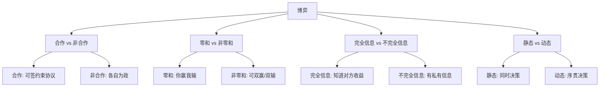

# 博弈论总论 (Game Theory Fundamentals)

> 中文简称：博弈论总论

## 1. 为什么 AI 需要博弈论？

### 1.1 AI 中的博弈场景

| 场景 | 博弈类型 | 参与者 | 应用 |
|------|----------|--------|------|
| GAN 训练 | 零和博弈 | 生成器 vs 判别器 | 图像生成 |
| 多 Agent 协作 | 合作博弈 | 多个 AI Agent | 自动驾驶车队 |
| AI 对齐 | 主从博弈 | 人类 vs AI | 安全对齐 |
| 广告竞价 | 拍卖博弈 | 广告主们 | 计算广告 |
| 联邦学习 | 合作+竞争 | 数据持有方 | 隐私计算 |
| 对抗攻击 | 零和博弈 | 攻击者 vs 防御者 | AI 安全 |
| 多模型竞争 | 非合作博弈 | 多个 LLM | 模型市场 |
| 资源调度 | 机制设计 | GPU 用户们 | 集群管理 |

### 1.2 博弈论与强化学习的关系

```
┌─────────────────────────────────────────────────┐
│  单人决策 = 马尔可夫决策过程 (MDP)               │
│  多人决策 = 马尔可夫博弈 (Markov Game)           │
│                                                 │
│  MDP:  一个 Agent vs 环境                       │
│  博弈: 多个 Agent vs 多个 Agent                 │
│                                                 │
│  当其他 Agent 也在"学习"时:                     │
│  - 环境不再是平稳的                             │
│  - 最优策略取决于对手的策略                     │
│  - 需要均衡概念 (而非单纯最优)                  │
└─────────────────────────────────────────────────┘
```

## 2. 博弈的基本要素

### 2.1 标准式博弈 (Normal Form)

```
博弈 G = (N, A, u)
- N = {1, 2, ..., n}: 参与者集合
- A = A₁ × A₂ × ... × Aₙ: 策略空间
- u = (u₁, u₂, ..., uₙ): 收益函数

示例: 囚徒困境
              囚徒B
           合作    背叛
囚徒A 合作 (-1,-1) (-3, 0)
      背叛 ( 0,-3) (-2,-2)

纳什均衡: (背叛, 背叛) — 双方都选背叛
社会最优: (合作, 合作) — 但个体理性导致非最优
```

### 2.2 博弈分类



## 3. 纳什均衡 (Nash Equilibrium)

### 3.1 定义与直觉

> **纳什均衡**: 一组策略 (a₁*, a₂*, ..., aₙ*)，使得没有任何参与者能通过**单方面**改变自己的策略来获得更高收益。

```python
# 数学定义:
# 对所有 i ∈ N, 对所有 aᵢ ∈ Aᵢ:
# uᵢ(aᵢ*, a₋ᵢ*) ≥ uᵢ(aᵢ, a₋ᵢ*)
# 
# 即: 给定别人不变，我的策略已经是最优响应

# 直觉: "没有人有动力偏离"
```

### 3.2 纯策略 vs 混合策略

```python
import numpy as np

# 纯策略: 确定性地选择一个动作
# 混合策略: 按概率分布选择动作

# 示例: 石头剪刀布
# 纯策略纳什均衡: 不存在！(总会被克制)
# 混合策略纳什均衡: 各 1/3 概率

# 计算混合策略均衡
def rock_paper_scissors_equilibrium():
    """石头剪刀布的混合策略均衡"""
    # 对称博弈: 双方策略相同
    # 均衡: p(石头) = p(剪刀) = p(布) = 1/3
    equilibrium = np.array([1/3, 1/3, 1/3])
    
    # 验证: 任何纯策略的期望收益相同
    # E[出石头] = 1/3×0 + 1/3×1 + 1/3×(-1) = 0
    # E[出剪刀] = 1/3×(-1) + 1/3×0 + 1/3×1 = 0
    # E[出布]   = 1/3×1 + 1/3×(-1) + 1/3×0 = 0
    # 无差异 → 没有偏离动力 → 均衡！
    return equilibrium

# 纳什定理 (1950): 任何有限博弈至少存在一个混合策略纳什均衡
```

### 3.3 均衡求解方法

| 方法 | 适用场景 | 复杂度 |
|------|----------|--------|
| 枚举法 | 2人小规模 | O(n²) |
| 线性规划 | 2人零和 | 多项式 |
| 支撑枚举 | 2人一般 | 指数(最坏) |
| 虚拟自我博弈 (Fictitious Play) | 多人迭代 | 收敛慢 |
| 策略梯度 (Nash-MD) | 大规模/连续 | 近似 |
| CFR (Counterfactual Regret) | 不完全信息 | 迭代 |

## 4. 零和博弈与极小极大

### 4.1 极小极大定理

```
对于 2 人零和博弈:
max_x min_y  x^T A y  =  min_y max_x  x^T A y  =  v (博弈值)

含义: 
- 行玩家最大化最坏情况收益
- 列玩家最小化最坏情况损失
- 两者在均衡处相等
```

### 4.2 GAN 中的零和博弈

```python
# GAN = 生成器 G vs 判别器 D 的零和博弈
# min_G max_D  E[log D(x)] + E[log(1 - D(G(z)))]

# 训练过程:
# 1. 固定 G，训练 D 几步 (D 变强)
# 2. 固定 D，训练 G 一步 (G 变强)
# 3. 重复直到纳什均衡 (D 无法区分真假)

# 均衡条件: p_generated = p_real
# 此时 D(x) = 0.5 对所有 x (完全无法区分)

# 实践问题:
# - 模式坍塌: G 只生成少数样本 (非均衡)
# - 训练不稳定: 振荡不收敛
# - 解决: WGAN/谱归一化/渐进训练
```

### 4.3 对抗训练 (Adversarial Training)

```python
# 对抗训练 = 模型 vs 攻击者的极小极大博弈
# min_θ max_δ  L(f_θ(x + δ), y)
# s.t. ||δ||_p ≤ ε

# PGD 对抗训练:
def pgd_adversarial_training(model, x, y, epsilon=8/255, steps=10):
    # 内层: 攻击者找最强扰动
    delta = torch.zeros_like(x, requires_grad=True)
    for _ in range(steps):
        loss = F.cross_entropy(model(x + delta), y)
        loss.backward()
        delta.data = (delta + 0.01 * delta.grad.sign()).clamp(-epsilon, epsilon)
        delta.grad.zero_()
    
    # 外层: 模型在对抗样本上训练
    adv_loss = F.cross_entropy(model(x + delta.detach()), y)
    return adv_loss
```

## 5. 合作博弈与联盟

### 5.1 核心概念

```
合作博弈: 参与者可以形成联盟，共同分配收益
- 特征函数 v(S): 联盟 S 能获得的最大收益
- 核心 (Core): 没有子联盟有动力脱离的分配
- Shapley 值: 公平分配每个参与者的边际贡献
```

### 5.2 Shapley 值在 AI 中的应用

```python
# Shapley 值: 公平衡量每个特征/参与者的贡献
# φᵢ = Σ_{S⊆N\{i}} |S|!(n-|S|-1)!/n! × [v(S∪{i}) - v(S)]

# 应用1: 特征重要性 (SHAP)
import shap
explainer = shap.KernelExplainer(model.predict, background_data)
shap_values = explainer.shap_values(test_data)
# 每个特征的 Shapley 值 = 对预测的边际贡献

# 应用2: 联邦学习中的公平分配
# 问题: 多个数据方联合训练，如何分配模型收益？
# 方法: 用 Shapley 值衡量每个数据方的边际贡献
# φᵢ = 数据方 i 加入后模型性能的平均提升

# 应用3: 数据估值 (Data Valuation)
# 问题: 训练数据中哪些样本最有价值？
# 方法: Data Shapley — 每个数据点的 Shapley 值
```

## 6. 机制设计 (Mechanism Design)

### 6.1 核心思想

```
博弈论: 给定规则 → 预测行为
机制设计: 期望行为 → 设计规则 (逆向博弈论)

目标: 设计"游戏规则"使得参与者的自利行为
     恰好产生系统期望的全局结果
```

### 6.2 AI 系统中的机制设计

| 应用 | 机制 | 目标 |
|------|------|------|
| GPU 集群调度 | VCG 拍卖 | 真实报价、高效分配 |
| 联邦学习激励 | Shapley 分配 | 鼓励数据贡献 |
| 模型市场 | 双边匹配 | 供需高效匹配 |
| 众包标注 | 同行评审 | 激励真实标注 |
| 多 Agent 协作 | 合同网协议 | 任务高效分配 |
| RLHF 奖励模型 | 偏好聚合 | 真实人类偏好 |

### 6.3 拍卖机制

```python
# VCG 拍卖 (Vickrey-Clarke-Groves):
# - 真实报价是占优策略 (不需要策略性出价)
# - 社会效率最大化

# 应用: GPU 资源分配
def vcg_auction(bids, resources):
    """
    bids: {user_id: value_per_gpu}
    resources: 可用 GPU 数量
    """
    # 1. 按出价排序，分配给最高出价者
    sorted_bids = sorted(bids.items(), key=lambda x: -x[1])
    winners = sorted_bids[:resources]
    
    # 2. 每人支付 = 他的参与对其他人造成的外部性
    # (即: 没有他时其他人的总收益 - 有他时其他人的总收益)
    payments = {}
    for winner_id, _ in winners:
        # 没有 winner 时的最优分配
        others = {k: v for k, v in bids.items() if k != winner_id}
        others_sorted = sorted(others.items(), key=lambda x: -x[1])
        others_value = sum(v for _, v in others_sorted[:resources])
        
        # 有 winner 时其他人的收益
        with_winner = sorted(
            [(k, v) for k, v in bids.items() if k != winner_id],
            key=lambda x: -x[1]
        )[:resources-1]
        with_value = sum(v for _, v in with_winner)
        
        payments[winner_id] = others_value - with_value
    
    return winners, payments
```

## 7. 演化博弈与多智能体学习

### 7.1 演化稳定策略 (ESS)

```
演化博弈: 大量个体反复博弈，策略通过"适者生存"演化
- 不需要理性假设
- 策略频率随适应度变化
- ESS: 能抵抗少量突变体入侵的策略

AI 应用:
- 多 Agent 系统的涌现行为分析
- 自组织协议设计
- 对抗鲁棒性评估
```

### 7.2 多智能体强化学习中的博弈

```python
# 独立学习 vs 博弈论方法

# 独立学习 (每个 Agent 独立 Q-learning):
# 问题: 环境非平稳 (其他 Agent 也在学习)
# 结果: 可能不收敛到纳什均衡

# 博弈论方法:
# 1. Minimax-Q: 零和 Markov 博弈
# 2. Nash Q-Learning: 每步计算纳什均衡
# 3. Fictitious Self-Play: 对历史策略最佳响应
# 4. Policy Space Response Oracles (PSRO): 维护策略集合

# 2026 前沿: LLM Agent 博弈
# - 多个 LLM Agent 在模拟环境中博弈
# - 涌现出合作/欺骗/联盟等复杂行为
# - 用博弈论分析 Agent 的策略稳定性
```

## 8. 关键定理与结论

| 定理 | 内容 | AI 意义 |
|------|------|---------|
| 纳什存在性定理 | 有限博弈必有混合策略均衡 | 多 Agent 系统有稳定解 |
| 极小极大定理 | 零和博弈 max-min = min-max | GAN/对抗训练有均衡 |
| 机制显示原理 | 任何均衡都可由真实机制实现 | 设计激励兼容的 AI 系统 |
| Arrow 不可能定理 | 完美投票规则不存在 | RLHF 偏好聚合的局限 |
| Shapley 唯一性 | 满足四公理的分配唯一 | 公平的数据/贡献估值 |

## 相关文档

- [[01_数学基础/README.md|博弈论与 AI 对齐]]
- [[06_强化学习/06_多智能体/02_多智能体强化学习|多智能体强化学习]]
- [[概念/Agent/multi-agent|多智能体系统指南]]
- [[17_伦理安全/02_价值对齐/|价值对齐]]
- [[03_深度学习/04_生成模型/|生成模型]] — GAN 博弈
