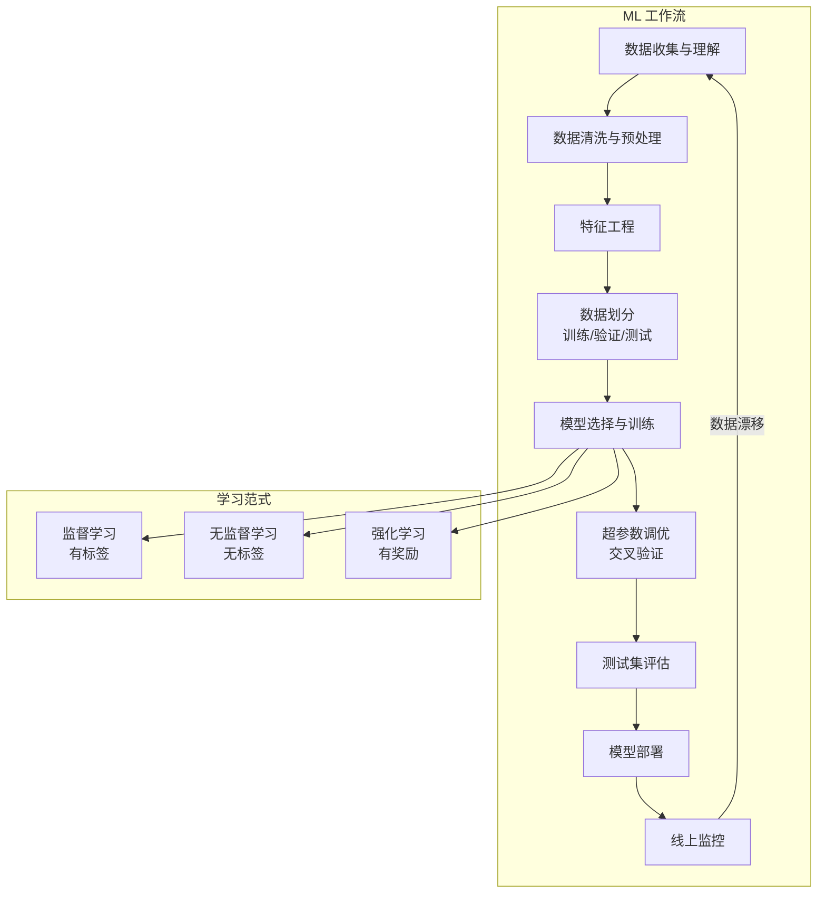
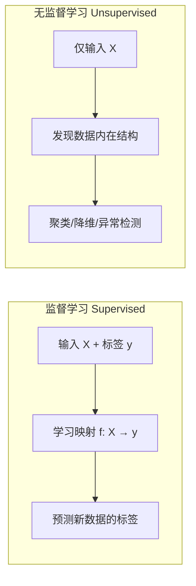
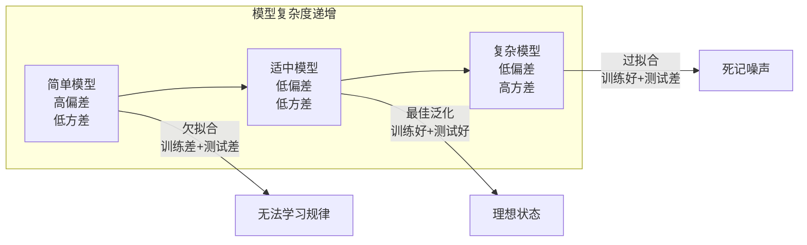
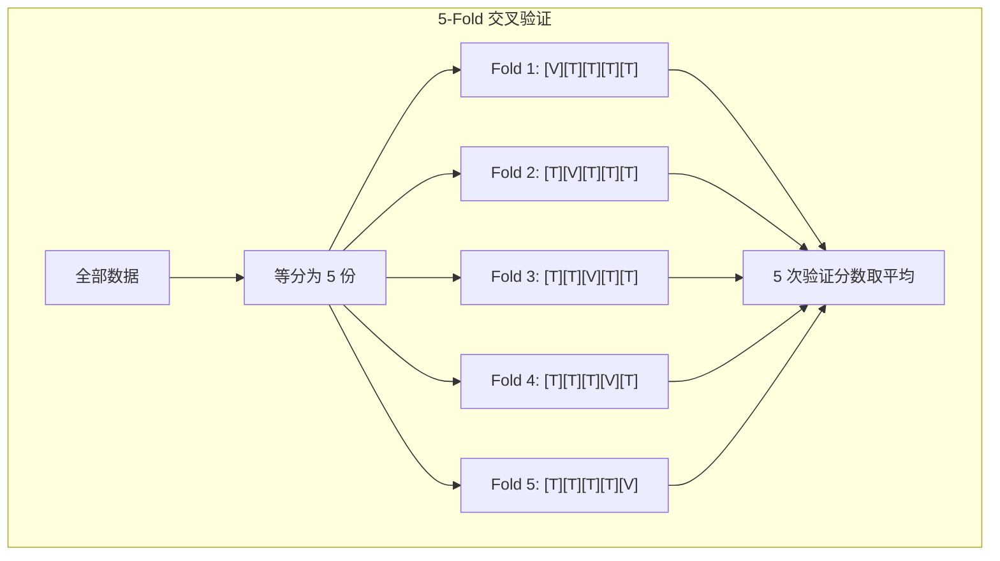
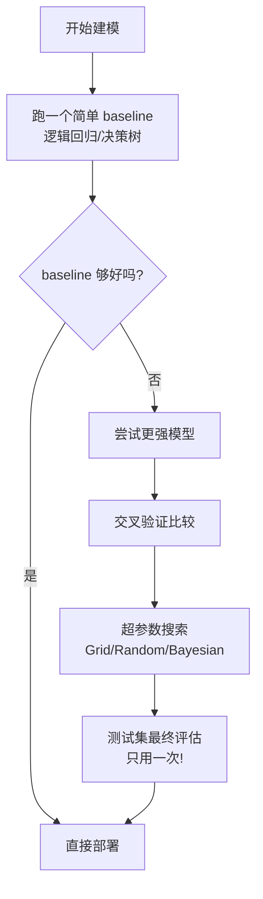

# 机器学习基础 (Machine Learning Fundamentals)

> 中文简称：机器学习基础

> **一句话理解**: 机器学习的核心是从数据中学习规律并泛化到新数据——理解监督/无监督范式、偏差-方差权衡、交叉验证和模型选择，就掌握了 ML 的 80%。

---

## TL;DR

- **监督学习 (Supervised Learning)**: 有标签数据 → 学映射 → 预测新数据；分类和回归是两大任务
- **无监督学习 (Unsupervised Learning)**: 无标签数据 → 发现隐藏结构；聚类和降维是典型任务
- **偏差-方差权衡 (Bias-Variance Tradeoff)**: 模型太简单抓不住规律 (高偏差)，太复杂记住噪声 (高方差)
- **交叉验证 (Cross-Validation)**: K-Fold 让评估更可靠，避免单次数据划分的随机性
- **模型选择 (Model Selection)**: 先跑简单 baseline，再逐步升级复杂度；测试集只能用一次
- **ML 工作流**: 数据收集 → 特征工程 → 模型训练 → 评估 → 部署 → 监控，是一个闭环



---

## 监督学习 vs 无监督学习



| 维度 | 监督学习 | 无监督学习 |
|------|---------|-----------|
| **输入** | 特征 X + 标签 y | 仅特征 X |
| **目标** | 学习 X → y 的映射 | 发现数据的隐藏结构 |
| **任务类型** | 分类 (离散)、回归 (连续) | 聚类、降维、异常检测、密度估计 |
| **评估** | 准确率、F1、MSE 等量化指标 | 轮廓系数、重构误差、业务判断 |
| **典型算法** | 线性回归、XGBoost、SVM、神经网络 | K-Means、PCA、DBSCAN、GMM |
| **数据需求** | 需要人工标注 (贵) | 无需标注 (便宜) |
| **典型场景** | 房价预测、垃圾邮件检测、图像分类 | 客户分群、数据可视化、异常交易检测 |

### 何时选哪种范式？

```
决策指南:

有标注数据 + 明确预测目标 → 监督学习
├── 预测连续值 (房价、温度) → 回归
└── 预测离散类别 (是/否、猫/狗) → 分类

没有标注 + 想探索数据 → 无监督学习
├── 想分组 → 聚类 (K-Means, DBSCAN)
├── 想降维 → PCA, t-SNE, UMAP
└── 想找异常 → 异常检测 (Isolation Forest)

有少量标注 + 大量无标注 → 半监督学习
└── 自训练、伪标签、一致性正则化

有环境反馈 (奖励) → 强化学习
└── Q-Learning, PPO, DQN
```

---

## 偏差-方差权衡 (Bias-Variance Tradeoff)

这是机器学习中最核心的理论概念之一——理解它就理解了为什么模型会过拟合或欠拟合。



### 分解公式

$$\text{总误差} = \text{偏差}^2 + \text{方差} + \text{不可约噪声}$$

| 问题 | 症状 | 训练误差 | 验证误差 | 解决方案 |
|------|------|---------|---------|---------|
| **高偏差 (欠拟合)** | 模型太简单，抓不住规律 | 高 | 高 | 增加模型复杂度、增加特征、减少正则化 |
| **高方差 (过拟合)** | 模型太复杂，记住噪声 | 低 | 高 | 增加数据、正则化、简化模型、Dropout |
| **恰到好处** | 泛化良好 | 低 | 低 (接近训练) | 维持现状，微调正则化 |

### 实战诊断

```python
from sklearn.model_selection import learning_curve
import numpy as np

# 学习曲线：诊断偏差-方差的利器
train_sizes, train_scores, val_scores = learning_curve(
    model, X, y,
    cv=5,
    train_sizes=np.linspace(0.1, 1.0, 10)
)

# 判断逻辑:
# 训练高 + 验证高 → 高偏差 (欠拟合) → 用更强模型
# 训练低 + 验证高 → 高方差 (过拟合) → 更多数据或正则化
# 训练低 + 验证低 → 理想状态
```

---

## 交叉验证 (Cross-Validation)

单次 train/test 划分受随机种子影响很大。K-Fold 交叉验证通过多次划分取平均，得到更可靠的性能估计。



| 方法 | 划分方式 | 适用场景 |
|------|---------|---------|
| **K-Fold** | 等分为 K 份，轮流验证 | 通用场景 (默认 K=5 或 10) |
| **Stratified K-Fold** | 保持每份中类别比例一致 | 分类问题、类别不平衡 |
| **Leave-One-Out** | 每次留 1 个样本验证 | 极小数据集 |
| **Time Series Split** | 时间顺序划分，不穿越未来 | 时间序列数据 |
| **Repeated K-Fold** | K-Fold 重复多次 (不同随机种子) | 需要更稳定的估计 |

```python
from sklearn.model_selection import StratifiedKFold, cross_val_score

# 分层 K-Fold：保证每折的类别比例一致
skf = StratifiedKFold(n_splits=5, shuffle=True, random_state=42)
scores = cross_val_score(model, X, y, cv=skf, scoring='f1_macro')
print(f"F1 (macro): {scores.mean():.3f} (+/- {scores.std():.3f})")
```

---

## 模型选择 (Model Selection)

### 选择策略



### 模型复杂度阶梯

| 阶段 | 模型 | 何时升级 |
|------|------|---------|
| **Baseline** | 逻辑回归 / 线性回归 | 先跑通，了解数据难度 |
| **Strong Baseline** | 随机森林 / XGBoost | 表格数据默认首选 |
| **进阶** | SVM / 神经网络 | 非线性边界、高维特征 |
| **集成** | Stacking / Blending | 竞赛刷分、追求极致精度 |
| **深度学习** | CNN / Transformer | 图像、文本、时序等非结构化数据 |

### 数据划分黄金法则

| 数据集 | 比例 | 用途 | 关键规则 |
|-------|------|------|---------|
| **训练集** | 70-80% | 模型参数学习 | 反复使用 |
| **验证集** | 10-15% | 超参数调优、模型选择、早停 | 多次使用，但不参与梯度更新 |
| **测试集** | 10-15% | 最终性能评估 | **只能用一次！** 反复使用 = 数据泄漏 |

---

## 完整 ML 工作流 Checklist

```
项目启动:
├── [ ] 明确业务目标和评估指标
├── [ ] 收集和理解数据 (EDA)
└── [ ] 确定问题类型 (分类/回归/聚类)

数据准备:
├── [ ] 数据清洗 (缺失值、异常值、重复值)
├── [ ] 特征工程 (构造、变换、选择)
├── [ ] 数据划分 (训练/验证/测试)
└── [ ] 特征缩放 (归一化/标准化)

模型开发:
├── [ ] 跑简单 baseline
├── [ ] 尝试多种算法
├── [ ] 交叉验证评估
├── [ ] 超参数搜索
└── [ ] 诊断偏差-方差

部署与监控:
├── [ ] 测试集最终评估
├── [ ] 模型序列化 (pickle/ONNX)
├── [ ] 部署为 API/服务
├── [ ] 设置数据漂移监控
└── [ ] 定期重新训练
```

---

## 详细子主题

本知识库中，每个 ML 子领域都有独立的详细页面：

| 子主题 | 页面链接 | 内容概要 |
|-------|---------|---------|
| **监督学习** | [[概念/Math/supervised-learning]] | 分类与回归算法的完整教程 |
| **无监督学习** | [[概念/Math/unsupervised-learning]] | 聚类、降维、异常检测深入 |
| **集成学习** | [[概念/Math/ensemble-learning]] | Bagging、Boosting、Stacking 全解 |
| **特征工程** | [[02_机器学习/05_特征工程/01_特征工程]] | 特征构造、变换、选择的系统方法 |
| **ML 框架** | [[02_机器学习/12_ML框架/ML_Frameworks]] | scikit-learn、XGBoost、LightGBM 等框架概览 |

---

## Further Reading

- [[02_机器学习/ML-in-nutshell]] — 机器学习速成（代码实战版）
- [[02_机器学习/01_机器学习基础/06_ML_Algorithms_速查表]] — 算法选择速查表
- [[01_数学基础/README]] — 机器学习所需的数学基础
- [[01_数学基础/Fundamentals-in-nutshell]] — AI 基础全景
- [[03_深度学习/DL-in-nutshell]] — 从经典 ML 到深度学习的桥梁

---

*Last updated: 2026-06-12*
