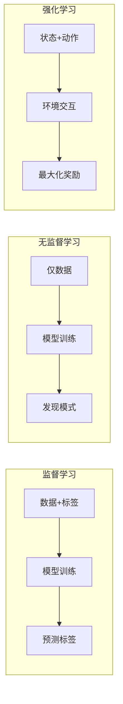
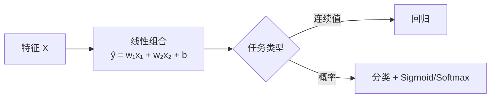
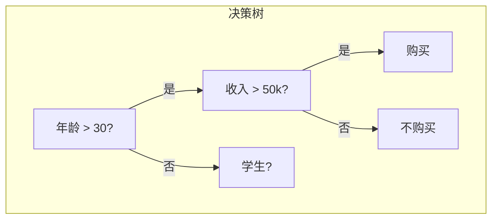
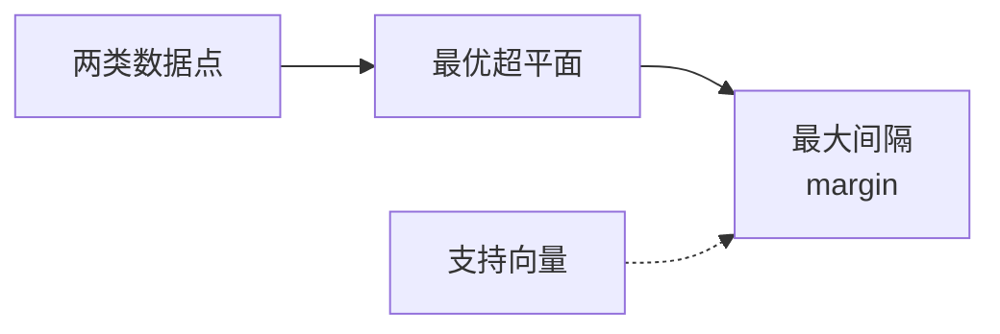
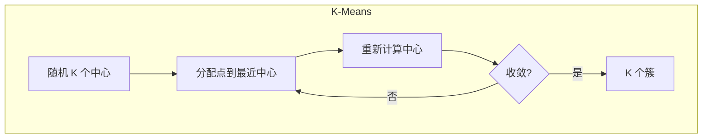
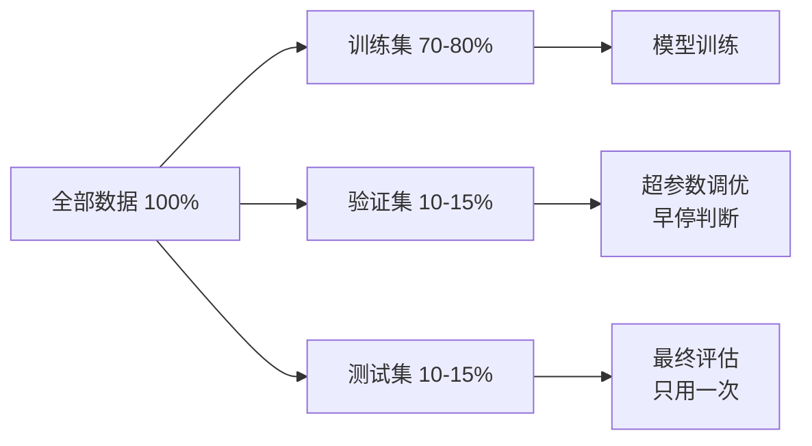
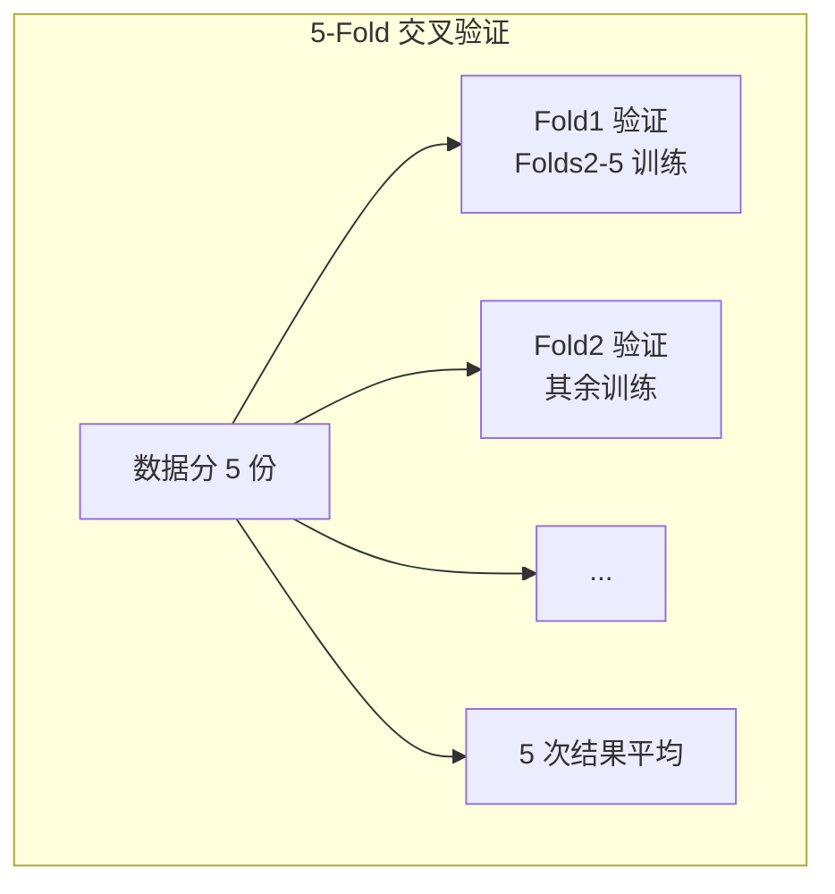
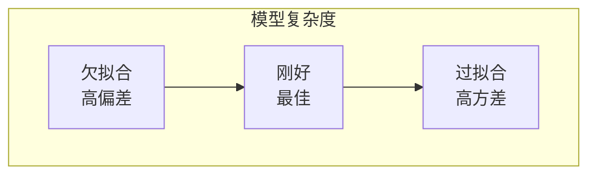
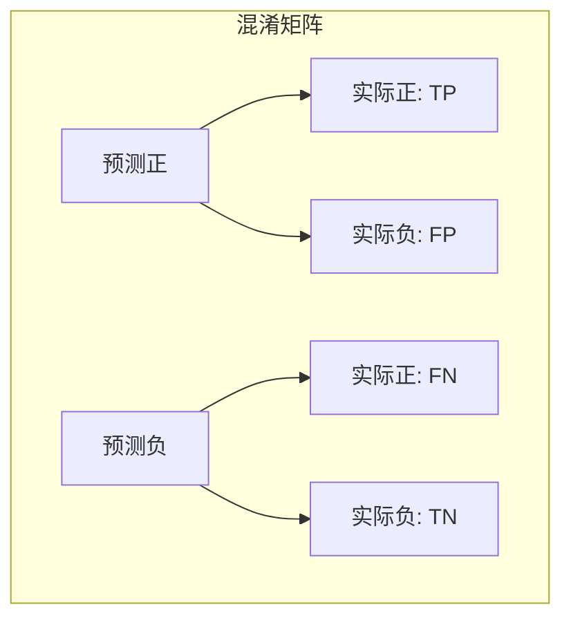
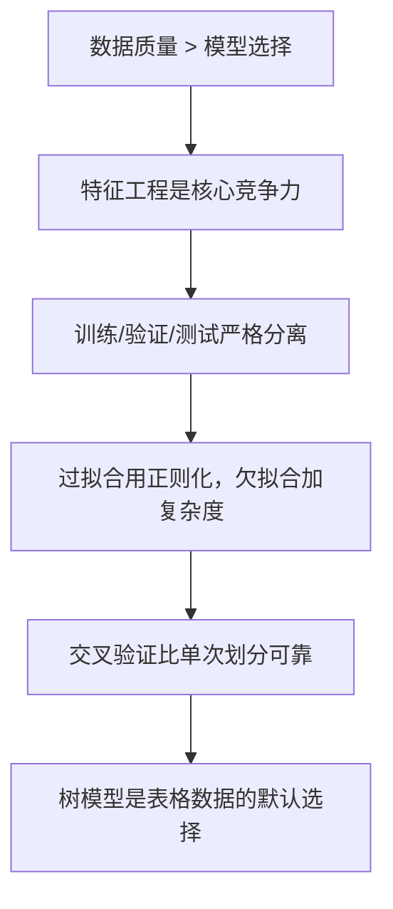

# 机器学习速成指南

> 中文简称：机器学习速成指南

> **一句话理解**: 机器学习就是让计算机从数据中找到规律，然后用这些规律对新数据做出预测或决策，而无需显式编程。

---

## TL;DR

- **监督学习**: 有标签数据 → 学映射关系 → 预测新数据（分类/回归）
- **无监督学习**: 无标签数据 → 发现隐藏结构 → 聚类/降维
- **强化学习**: 智能体与环境交互 → 奖励反馈 → 学最优策略
- **特征工程**: 数据比模型更重要——好的特征让简单模型战胜复杂模型
- **过拟合/欠拟合**: 模型太复杂记住噪声 vs 太简单抓不住规律
- **评估**: 训练/验证/测试三分开，交叉验证更可靠


---

## 学习范式对比



| 范式 | 输入 | 输出 | 典型算法 | 例子 |
|------|------|------|---------|------|
| **监督学习** | 特征 X + 标签 y | 预测 ŷ | 线性回归、XGBoost、SVM | 房价预测、垃圾邮件识别 |
| **无监督学习** | 特征 X | 模式/结构 | K-Means、PCA、DBSCAN | 客户分群、降维可视化 |
| **强化学习** | 状态 s | 动作 a | Q-Learning、PPO、DQN | 围棋、自动驾驶、游戏 |
| **半监督** | 少量标签+大量无标签 | 预测 ŷ | 自训练、伪标签 | 医学影像（标注贵） |

---

## 监督学习核心算法

### 线性模型（简单但强大）



| 算法 | 公式 | 适用场景 |
|------|------|---------|
| **线性回归** | $ŷ = w^T x + b$ | 房价、销量预测 |
| **逻辑回归** | $P(y=1) = \sigma(w^T x)$ | 二分类、点击率预估 |
| **Softmax 回归** | $P(y=k) = \frac{e^{w_k^T x}}{\sum e^{w_j^T x}}$ | 多分类 |

```python
from sklearn.linear_model import LogisticRegression
from sklearn.model_selection import train_test_split

X_train, X_test, y_train, y_test = train_test_split(X, y, test_size=0.2)
model = LogisticRegression(max_iter=1000)
model.fit(X_train, y_train)
print(f"准确率: {model.score(X_test, y_test):.2%}")
```

### 树模型（工业界王者）



| 算法 | 原理 | 优点 | 缺点 |
|------|------|------|------|
| **决策树** | 递归特征分裂 | 可解释 | 易过拟合 |
| **随机森林** | Bagging + 多棵树投票 | 鲁棒、不易过拟合 | 训练慢 |
| **XGBoost** | 梯度提升 + 正则化 | 精度高、速度快 | 调参复杂 |
| **LightGBM** | 直方图 + Leaf-wise | 极快、省内存 | 小数据易过拟合 |
| **CatBoost** | 对称树 + 自动编码 | 对类别特征友好 | 训练稍慢 |

```python
# XGBoost 是 Kaggle 竞赛默认选择
import xgboost as xgb

model = xgb.XGBClassifier(
    n_estimators=100,
    max_depth=6,
    learning_rate=0.1
)
model.fit(X_train, y_train)
```

### 支持向量机 (SVM)

找到最优超平面，最大化分类间隔。



| 核函数 | 适用 | 复杂度 |
|--------|------|--------|
| **线性** | 特征多、线性可分 | O(n) |
| **RBF/高斯** | 非线性边界 | O(n²) |
| **多项式** | 多项式关系 | 中等 |

---

## 无监督学习

### 聚类（物以类聚）



| 算法 | 原理 | 优点 | 缺点 |
|------|------|------|------|
| **K-Means** | 距离聚类 | 简单快速 | 需预设 K、对异常值敏感 |
| **DBSCAN** | 密度聚类 | 自动发现簇数、抗噪声 | 密度不均时效果差 |
| **层次聚类** | 自底向上/向下合并 | 无需预设 K | 大数据慢 |
| **高斯混合** | 概率分布 | 软聚类、可拟合椭圆 | 计算量大 |

```python
from sklearn.cluster import KMeans

# 手肘法选 K
inertias = []
for k in range(1, 10):
    kmeans = KMeans(n_clusters=k, random_state=42)
    kmeans.fit(X)
    inertias.append(kmeans.inertia_)

# K=3 时肘部最明显
kmeans = KMeans(n_clusters=3, random_state=42)
labels = kmeans.fit_predict(X)
```

### 降维（抓住本质）

| 方法 | 原理 | 保留什么 | 用途 |
|------|------|---------|------|
| **PCA** | 线性投影到最大方差方向 | 全局结构 | 压缩、去噪、可视化 |
| **t-SNE** | 保持局部邻域概率分布 | 局部结构 | 高维可视化 |
| **UMAP** | 流形学习 + 拓扑 | 局部+全局 | 可视化、降维 |

---

## 特征工程（最重要的 20%）

> "数据和特征决定了机器学习的上限，而模型和算法只是逼近这个上限。"


| 技术 | 操作 | 示例 |
|------|------|------|
| **缺失值处理** | 填充/删除 | 均值填充、模型预测填充 |
| **编码** | 类别 → 数值 | One-Hot、Label Encoding、Target Encoding |
| **归一化** | 缩放到统一范围 | Min-Max、Z-Score (StandardScaler) |
| **对数变换** | 处理偏态分布 | log(收入)、log1p(计数) |
| **交叉特征** | 组合特征 | 年龄×收入、地域+品类 |
| **时间特征** | 提取时间信息 | 小时、星期、是否周末 |

```python
from sklearn.preprocessing import StandardScaler, OneHotEncoder
from sklearn.compose import ColumnTransformer

# 数值特征标准化 + 类别特征 One-Hot
preprocessor = ColumnTransformer([
    ('num', StandardScaler(), ['age', 'income']),
    ('cat', OneHotEncoder(), ['city', 'gender'])
])

X_processed = preprocessor.fit_transform(X)
```

---

## 数据划分与评估

### 训练 / 验证 / 测试



**黄金法则**: 测试集只能用一次！反复调参后测试集会"泄漏"，失去评估意义。

### 交叉验证 (K-Fold)



```python
from sklearn.model_selection import cross_val_score

scores = cross_val_score(model, X, y, cv=5)
print(f"5折交叉验证: {scores.mean():.2%} (+/- {scores.std():.2%})")
```

---

## 过拟合 vs 欠拟合



| 问题 | 症状 | 诊断 | 解决方案 |
|------|------|------|---------|
| **欠拟合** | 训练差、验证也差 | 偏差高 | 增加特征、用更复杂模型、减少正则化 |
| **过拟合** | 训练好、验证差 | 方差高 | 更多数据、正则化、简化模型、Dropout |

**正则化技术**:

| 方法 | 原理 | 公式/实现 |
|------|------|----------|
| **L1 (Lasso)** | 稀疏化，部分权重变 0 | $Loss + \lambda \sum |w_i|$ |
| **L2 (Ridge)** | 权重衰减，都变小 | $Loss + \lambda \sum w_i^2$ |
| **早停 (Early Stopping)** | 验证 loss 不降就停 | `patience=5` |
| **Dropout** | 随机丢弃神经元 | `nn.Dropout(0.5)` |

---

## 关键评估指标

### 分类问题

| 指标 | 公式/含义 | 何时使用 |
|------|----------|---------|
| **准确率** | 正确数/总数 | 类别平衡 |
| **精确率** | TP/(TP+FP) | 误报代价高（如垃圾邮件） |
| **召回率** | TP/(TP+FN) | 漏报代价高（如癌症检测） |
| **F1** | 2·P·R/(P+R) | 需要平衡 |
| **AUC-ROC** | ROC 曲线下面积 | 二分类综合评估 |
| **对数损失** | $-\sum y \log(p)$ | 概率校准 |



### 回归问题

| 指标 | 公式 | 特点 |
|------|------|------|
| **MSE** | $\frac{1}{n}\sum(y_i - ŷ_i)^2$ | 对大误差敏感 |
| **RMSE** | $\sqrt{MSE}$ | 与目标同量纲 |
| **MAE** | $\frac{1}{n}\sum|y_i - ŷ_i|$ | 对异常值鲁棒 |
| **R²** | $1 - \frac{SS_{res}}{SS_{tot}}$ | 解释方差比例 |

---

## 完整训练流程

```python
from sklearn.model_selection import train_test_split, GridSearchCV
from sklearn.ensemble import RandomForestClassifier
from sklearn.metrics import classification_report
import joblib

# 1. 数据划分
X_train, X_temp, y_train, y_temp = train_test_split(X, y, test_size=0.3)
X_val, X_test, y_val, y_test = train_test_split(X_temp, y_temp, test_size=0.5)

# 2. 模型 + 超参数搜索
param_grid = {'n_estimators': [50, 100], 'max_depth': [5, 10]}
grid = GridSearchCV(RandomForestClassifier(), param_grid, cv=3)
grid.fit(X_train, y_train)

# 3. 验证集评估（调参用）
print(f"最佳参数: {grid.best_params_}")
print(f"验证集最佳: {grid.best_score_:.2%}")

# 4. 测试集最终评估（只用一次！）
best_model = grid.best_estimator_
y_pred = best_model.predict(X_test)
print(classification_report(y_test, y_pred))

# 5. 保存模型
joblib.dump(best_model, 'model.pkl')
```

---

## 📚 核心要点



**30 分钟记住这些**:
1. 有标签 → 监督学习；无标签 → 无监督学习；有奖励 → 强化学习
2. XGBoost/LightGBM 是结构化数据的王者
3. 特征工程决定上限，模型只是逼近
4. 测试集只能用一次，否则就是作弊
5. 过拟合 = 记住噪声；欠拟合 = 没学到规律

---

## ❓ 常见问题 (FAQ)

**Q: 选什么模型作为 baseline？**
> 结构化数据：XGBoost 或 LightGBM；图像：ResNet；文本：BERT 系列；时序：LSTM 或 Transformer。永远先跑一个简单的基线（如逻辑回归），再迭代。

**Q: 训练集准确率 99%，测试集 70%——怎么办？**
> 典型的过拟合。试试：增加训练数据、加 L2 正则化、减少模型复杂度、用 Dropout、早停法、特征选择。

**Q: 为什么需要验证集？直接用测试集不行吗？**
> 不行！测试集是"期末考"，验证集是"模拟考"。如果用测试集反复调参，等于把期末题都练过了，成绩不真实。

**Q: K-Means 的 K 怎么选？**
> 手肘法（看 inertia 下降拐点）、轮廓系数、业务理解。没有银弹，通常 3-10 之间尝试。

**Q: 特征需要归一化吗？**
> 基于距离的模型（KNN、SVM、神经网络）必须归一化；树模型（决策树、XGBoost）不需要。

**Q: 样本不平衡怎么办？**
> 上采样（SMOTE）、下采样、调整类别权重、用 F1/AUC-PR 代替准确率、阈值调整。

---

## 🔗 相关主题

- [AI 基础速成](01_数学基础/01_数学基础/02_基础简明指南.md) —— ML 需要的数学和工程基础
- [深度学习速成](03_深度学习/01_深度学习基础/04_DL_简明指南.md) —— 神经网络进阶
- [特征工程详解](02_机器学习/05_特征工程/01_特征工程.md) —— 深入特征构造与选择
- [模型评估详解](08_模型评估/01_评估基础/06_模型评估.md) —— 全面评估方法论
- [训练速成](07_模型训练/01_训练基础/04_模型_训练_简明指南.md) —— 端到端训练流程

---

*Last updated: 2026-05-07*

## Related

- [[概念/Math/ensemble-learning]] — 集成学习 (Ensemble Learning) - 完全指南 (共享: machine-learning, ml, supervised, unsupervised)
- [[02_机器学习/05_特征工程/01_特征工程]] — 特征工程 (Feature Engineering) (共享: machine-learning, ml, supervised, unsupervised)
- [[02_机器学习/README.md]] — 特征工程 - 小白版 (共享: machine-learning, ml, supervised, unsupervised)
- [[02_机器学习/README]] — 02 经典机器学习 (Classical Machine Learning) (共享: machine-learning, ml, supervised, unsupervised)
