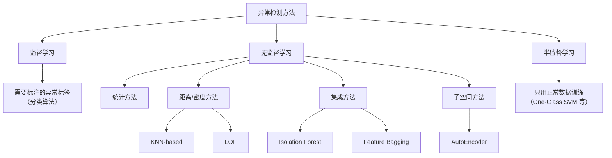
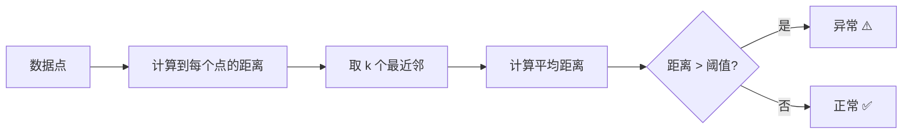
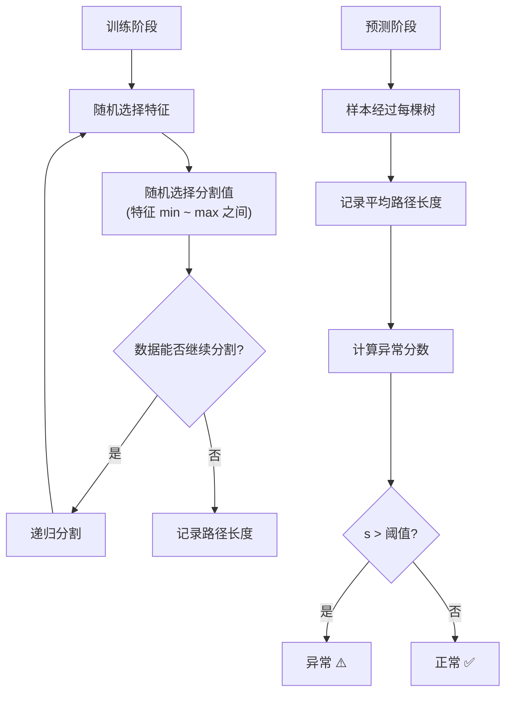
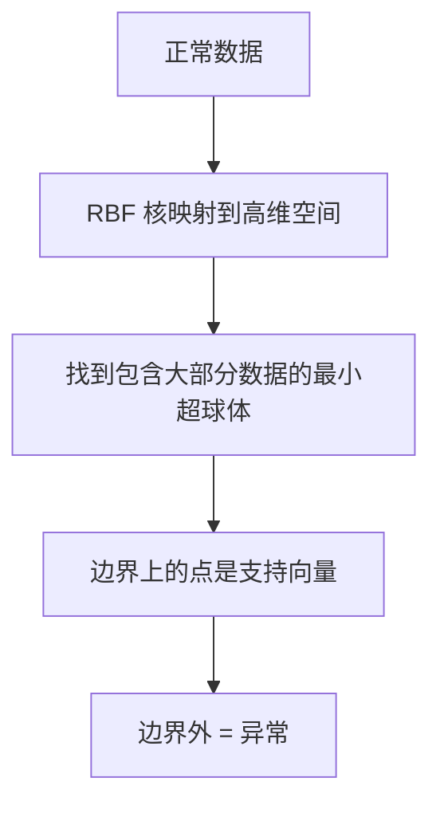
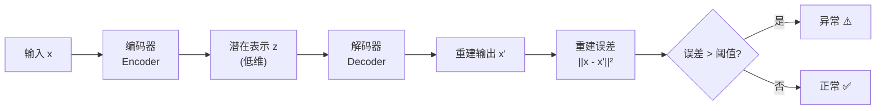
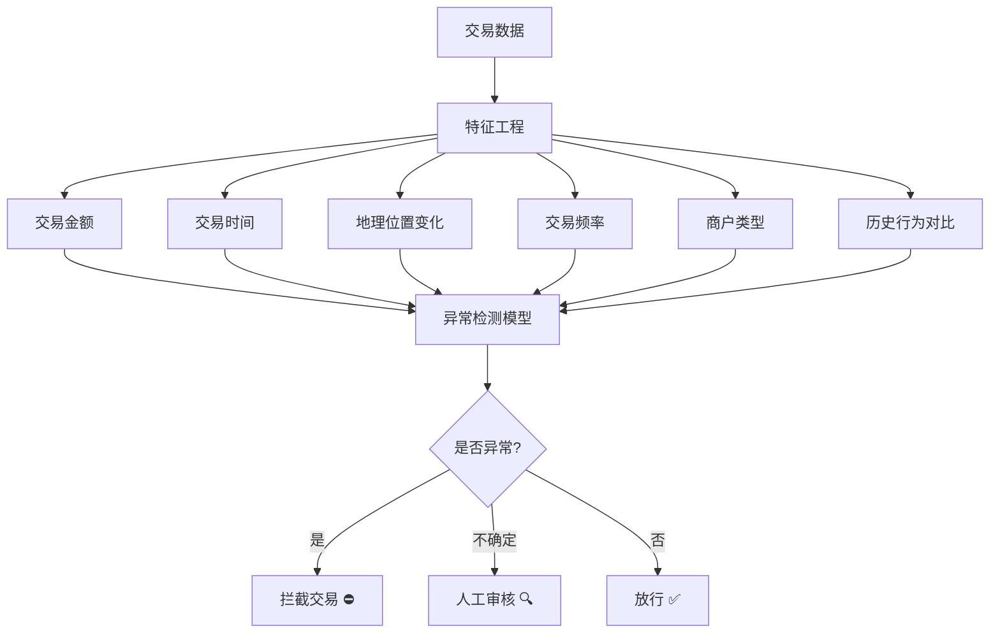
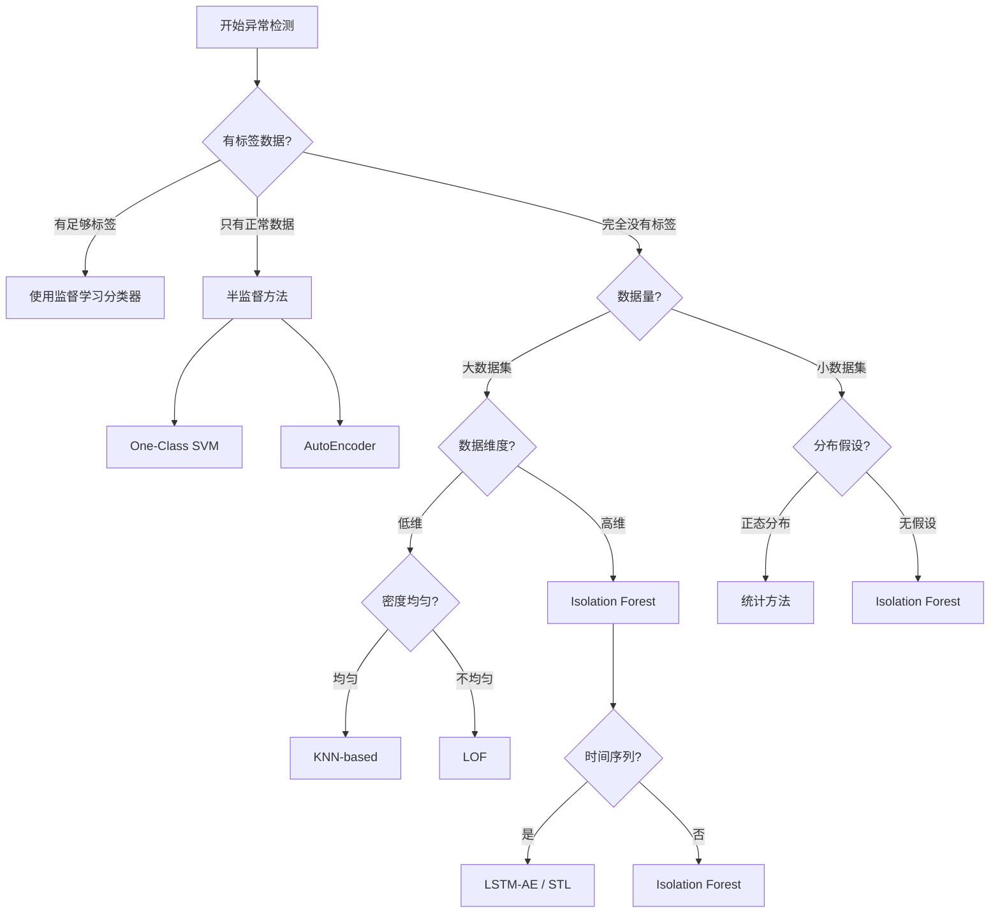

# 异常检测 (Anomaly Detection)

> 中文简称：异常检测

> 异常检测是识别数据中"与众不同"的模式的任务，广泛应用于欺诈检测、入侵检测、设备故障预警等领域。

---

## 目录

1. [概述](#概述)
2. [异常类型](#异常类型)
3. [统计方法](#统计方法)
4. [距离与密度方法](#距离与密度方法)
5. [孤立森林 (Isolation Forest)](#孤立森林-isolation-forest)
6. [One-Class SVM](#one-class-svm)
7. [自编码器方法](#自编码器方法)
8. [时间序列异常检测](#时间序列异常检测)
9. [实际应用](#实际应用)
10. [评估方法](#评估方法)
11. [代码实战](#代码实战)
12. [方法选择指南](#方法选择指南)

---

## 概述

异常检测（Anomaly Detection）也称离群点检测（Outlier Detection），目标是从数据中识别出与大多数数据显著不同的样本。

```
正常数据的分布:
    *
  * * *         * *
* * * * * * * * * * *
  * * * * * * * * *
    * * *     * *
      *         ← 这两个点是异常值
        ●                 ●
```

### 核心问题

| 维度 | 描述 |
|------|------|
| **定义** | 什么是"异常"？如何量化"与众不同"？ |
| **标注** | 通常没有标签（无监督）或极少标签（半监督） |
| **不平衡** | 异常样本极少，正常样本极多 |
| **演化** | 异常模式会随时间变化 |
| **误报** | 误报成本 vs 漏报成本的权衡 |

### 异常检测的分类



---

## 异常类型

### 1. 点异常 (Point Anomaly)

单个数据点相对于整体数据分布是异常的。

```
例子：体温测量
正常: 36.5°C, 36.8°C, 37.0°C, 36.6°C
异常: 41.2°C ← 单个极端值
```

### 2. 上下文异常 (Contextual Anomaly)

数据点在特定上下文中是异常的，但在其他上下文中是正常的。

```
例子：温度
夏天 35°C → 正常 ✅
冬天 35°C → 异常 ❌（上下文是"冬天"）

例子：CPU 使用率
工作日 90% → 正常 ✅
凌晨3点 90% → 异常 ❌（上下文是"凌晨"）
```

### 3. 集体异常 (Collective Anomaly)

单个数据点正常，但一组数据点的组合是异常的。

```
例子：心电图
单个心跳: 都在正常范围
连续模式: 心跳节律出现异常组合 ← 集体异常

例子：网络流量
单个请求: 都正常
短时间内同一 IP 发送 10000 个请求 ← DDoS 集体异常
```

### 异常类型对比

| 类型 | 粒度 | 检测难度 | 典型场景 |
|------|------|----------|----------|
| 点异常 | 单个样本 | 低 | 传感器故障 |
| 上下文异常 | 单个样本 + 上下文 | 中 | 温度异常、行为异常 |
| 集体异常 | 一组样本 | 高 | 入侵检测、心电监控 |

---

## 统计方法

### Z-Score 方法

假设数据服从正态分布，计算每个数据点偏离均值的标准差倍数。

$$Z = \frac{x - \mu}{\sigma}$$

**判断规则**：|Z| > 3 为异常（对应 p < 0.003）

```python
import numpy as np

def z_score_anomaly(data, threshold=3.0):
    mean = np.mean(data)
    std = np.std(data)
    z_scores = (data - mean) / std
    anomalies = np.abs(z_scores) > threshold
    return anomalies, z_scores

data = np.array([10, 12, 11, 13, 10, 12, 11, 50, 10, 12])
anomalies, scores = z_score_anomaly(data)
print(f"异常值: {data[anomalies]}")  # [50]
print(f"Z分数: {scores[anomalies]}")  # [4.78]
```

**问题**：均值和方差本身会被异常值影响。

### 修正 Z-Score (Modified Z-Score)

使用中位数和 MAD（中位数绝对偏差）替代均值和标准差，对异常值更鲁棒。

$$M_i = \frac{0.6745 \times (x_i - \tilde{x})}{MAD}$$

其中 $\tilde{x}$ 是中位数，$MAD = \text{median}(|x_i - \tilde{x}|)$

```python
from scipy import stats
import numpy as np

def modified_z_score(data, threshold=3.5):
    median = np.median(data)
    mad = stats.median_abs_deviation(data)
    modified_z = 0.6745 * (data - median) / mad
    return np.abs(modified_z) > threshold

data = np.array([10, 12, 11, 13, 10, 12, 11, 50, 10, 12])
print(f"异常索引: {np.where(modified_z_score(data))[0]}")
```

### IQR 方法 (四分位距法)

不假设分布，基于分位数计算。

```
数据分布:
     Q1        Q2(中位数)   Q3
      |==========|===========|
      |   25%    |   25%     | 25%  |  25%
  ----|----------|-----------|------|------
      |◄── IQR ──►|
      
下界 = Q1 - 1.5 × IQR
上界 = Q3 + 1.5 × IQR
IQR = Q3 - Q1
```

```python
import numpy as np

def iqr_anomaly(data, factor=1.5):
    q1 = np.percentile(data, 25)
    q3 = np.percentile(data, 75)
    iqr = q3 - q1
    lower = q1 - factor * iqr
    upper = q3 + factor * iqr
    return (data < lower) | (data > upper)

data = np.array([10, 12, 11, 13, 10, 12, 11, 50, 10, 12])
print(f"异常值: {data[iqr_anomaly(data)]}")
```

### Grubbs 检验

逐步检验最大/最小值是否为异常值。

$$G = \frac{\max|x_i - \bar{x}|}{s}$$

```python
from scipy import stats
import numpy as np

def grubbs_test(data, alpha=0.05):
    n = len(data)
    mean = np.mean(data)
    std = np.std(data, ddof=1)
    g = np.max(np.abs(data - mean)) / std
    critical = ((n - 1) / np.sqrt(n)) * np.sqrt(
        stats.t.ppf(1 - alpha / (2 * n), n - 2) ** 2 /
        (n - 2 + stats.t.ppf(1 - alpha / (2 * n), n - 2) ** 2)
    )
    return g > critical

data = np.array([10, 12, 11, 13, 10, 12, 11, 50, 10, 12])
print(f"存在异常值: {grubbs_test(data)}")
```

### 统计方法对比

| 方法 | 假设 | 鲁棒性 | 多维支持 | 适用场景 |
|------|------|--------|----------|----------|
| Z-Score | 正态分布 | 低 | 可扩展 | 大样本、近似正态 |
| Modified Z-Score | 对称分布 | 高 | 可扩展 | 有极端值的数据 |
| IQR | 无分布假设 | 中 | 需扩展 | 任意分布 |
| Grubbs | 正态分布 | 低 | 否 | 小样本、单变量 |

---

## 距离与密度方法

### KNN-based 异常检测

思路：异常点距离其 k 个最近邻居的平均距离较大。



```python
from sklearn.neighbors import NearestNeighbors
import numpy as np

def knn_anomaly(X, k=5, threshold_percentile=95):
    nbrs = NearestNeighbors(n_neighbors=k).fit(X)
    distances, _ = nbrs.kneighbors(X)
    avg_distances = distances.mean(axis=1)
    threshold = np.percentile(avg_distances, threshold_percentile)
    return avg_distances > threshold, avg_distances

X = np.random.randn(200, 2)
X = np.vstack([X, [[5, 5], [6, 6]]])
anomalies, scores = knn_anomaly(X, k=5)
print(f"异常数量: {anomalies.sum()}")
```

### LOF (Local Outlier Factor)

LOF 不仅考虑距离，还考虑**局部密度**。它能处理密度不均匀的数据。

**核心思想**：一个点的局部密度与它邻居的局部密度之比。

```
正常点: 周围密度高，邻居密度也高 → LOF ≈ 1
异常点: 周围密度低，邻居密度高   → LOF >> 1

密度均匀区域:
  ●●●●●        ← 正常 LOF ≈ 1
  ●●●●●
  ●●●●●        ○ ← 异常 LOF >> 1
  ●●●●●

密度不均匀区域:
  ●●●●●        ●●      ← 两簇密度不同
  ●●●●●        ●●      但各自点 LOF ≈ 1
  ●●●●●        ●●  ○   ← 异常 LOF >> 1
```

**LOF 计算步骤**：

1. 找到第 k 距离邻域
2. 计算可达距离 (reachability distance)
3. 计算局部可达密度 (local reachability density)
4. 计算 LOF 值

$$LOF_k(p) = \frac{1}{|N_k(p)|} \sum_{o \in N_k(p)} \frac{lrd_k(o)}{lrd_k(p)}$$

```python
from sklearn.neighbors import LocalOutlierFactor

X = np.random.randn(200, 2)
X = np.vstack([X, [[5, 5], [6, 6], [-4, -4]]])

lof = LocalOutlierFactor(n_neighbors=20, contamination=0.02)
predictions = lof.fit_predict(X)
scores = -lof.negative_outlier_factor_

print(f"异常点: {np.where(predictions == -1)[0]}")
print(f"LOF 分数: {scores[np.where(predictions == -1)[0]]}")
```

### KNN vs LOF 对比

| 特性 | KNN-based | LOF |
|------|-----------|-----|
| 核心度量 | 距离 | 局部密度比 |
| 密度不均匀 | 差 | 好 |
| 计算复杂度 | O(n²) 或 O(n log n) | O(n²) |
| 可解释性 | 简单 | 中等 |
| 适用场景 | 密度均匀 | 密度不均匀 |

---

## 孤立森林 (Isolation Forest)

### 核心思想

**异常点少且不同** → 更容易被"孤立"（用更少的分割次数就能分开）。

```
正常点: 需要很多次分割才能孤立
  ┌─────────────────┐
  │    ●●●●          │
  │   ●●●●●●         │
  │  ●●●●●●●●        │ ← 需要很多刀
  │   ●●●●●●         │
  │    ●●●●          │
  └─────────────────┘

异常点: 只需要少量分割就能孤立
  ┌─────────────────┐
  │                 │
  │                 │
  │   ○ ← 一刀就切出来│
  │                 │
  │                 │
  └─────────────────┘
```

### 算法流程



### 异常分数计算

$$s(x, n) = 2^{-\frac{E(h(x))}{c(n)}}$$

- $h(x)$：样本 x 的路径长度
- $E(h(x))$：路径长度的期望（所有树的平均）
- $c(n)$：归一化因子（二叉搜索树的平均路径长度）

| 分数范围 | 含义 |
|----------|------|
| s ≈ 1 | 明确异常（路径很短） |
| s ≈ 0.5 | 正常（路径长度接近平均） |
| s < 0.5 | 明确正常 |

### Contamination 参数

contamination 表示数据中异常样本的比例，用于确定决策阈值。

```python
from sklearn.ensemble import IsolationForest
import numpy as np

np.random.seed(42)
X_train = np.random.randn(1000, 2)
X_test = np.vstack([
    np.random.randn(100, 2),
    [[5, 5], [6, -6], [-5, 5], [7, 7], [-6, -6]]
])

iso_forest = IsolationForest(
    n_estimators=100,
    max_samples='auto',
    contamination=0.01,
    max_features=1.0,
    bootstrap=False,
    random_state=42
)
iso_forest.fit(X_train)

predictions = iso_forest.predict(X_test)
scores = iso_forest.decision_function(X_test)

print(f"预测结果 (-1=异常, 1=正常): {predictions}")
print(f"异常分数: {scores}")
```

### 关键参数说明

| 参数 | 默认值 | 说明 |
|------|--------|------|
| n_estimators | 100 | 树的数量 |
| max_samples | 'auto' | 每棵树使用的样本数 |
| contamination | 'auto' | 异常比例 |
| max_features | 1.0 | 每棵树使用的特征比例 |
| bootstrap | False | 是否有放回采样 |

---

## One-Class SVM

### 原理

在特征空间中找到一个超平面，将正常数据包裹在里面，把异常数据排除在外。



```
一维到二维的映射:

一维空间:     ●●●●●●●●●●    ○
                              ← 看不出边界

二维特征空间:
          ┌───────────────┐
          │  ● ● ● ● ●    │
          │ ● ● ● ● ● ● ● │
          │ ● ● ● ● ● ●   │
          │  ● ● ● ● ●    │
          └───────────────┘  ○
          ▲                 ▲
        正常区域           异常
```

```python
from sklearn.svm import OneClassSVM
import numpy as np

np.random.seed(42)
X_train = np.random.randn(500, 2)
X_test = np.vstack([
    np.random.randn(50, 2),
    [[5, 5], [6, -6], [-5, 5]]
])

ocsvm = OneClassSVM(
    kernel='rbf',
    gamma='scale',
    nu=0.05
)
ocsvm.fit(X_train)

predictions = ocsvm.predict(X_test)
scores = ocsvm.decision_function(X_test)

print(f"异常点索引: {np.where(predictions == -1)[0]}")
```

### 参数详解

| 参数 | 说明 |
|------|------|
| kernel | 核函数（推荐 rbf） |
| gamma | RBF 核的带宽参数 |
| nu | 异常比例上界 + 支持向量比例下界 |

### One-Class SVM vs Isolation Forest

| 对比特性 | One-Class SVM | Isolation Forest |
|----------|---------------|------------------|
| 原理 | 超平面/超球体 | 随机分割 |
| 训练速度 | 慢 O(n²~n³) | 快 O(n log n) |
| 大数据集 | 不适合 | 适合 |
| 小数据集 | 适合 | 一般 |
| 高维数据 | 需调参 | 较好 |
| 可扩展性 | 差 | 好 |

---

## 自编码器方法

### 架构

自编码器通过"压缩再重建"来学习正常数据的模式。异常数据重建误差大。



```
自编码器结构:

输入层 (高维)     编码层      潜在层      解码层      输出层
  ●               ●                       ●          ●
  ●               ●           ●           ●          ●
  ●        →      ●    →      ●    →      ●    →     ●
  ●               ●                       ●          ●
  ●                                       ●          ●
  
784维 → 256 → 64 → 16 → 64 → 256 → 784

正常数据: 输入 → 编码 → 解码 → 输出 ≈ 输入 (误差小)
异常数据: 输入 → 编码 → 解码 → 输出 ≠ 输入 (误差大!)
```

### 重建误差阈值

```python
import torch
import torch.nn as nn
import numpy as np

class AutoEncoder(nn.Module):
    def __init__(self, input_dim, encoding_dim=16):
        super().__init__()
        self.encoder = nn.Sequential(
            nn.Linear(input_dim, 128),
            nn.ReLU(),
            nn.Linear(128, 64),
            nn.ReLU(),
            nn.Linear(64, encoding_dim)
        )
        self.decoder = nn.Sequential(
            nn.Linear(encoding_dim, 64),
            nn.ReLU(),
            nn.Linear(64, 128),
            nn.ReLU(),
            nn.Linear(128, input_dim)
        )

    def forward(self, x):
        z = self.encoder(x)
        x_hat = self.decoder(z)
        return x_hat, z

def train_autoencoder(model, X_train, epochs=100, lr=1e-3):
    optimizer = torch.optim.Adam(model.parameters(), lr=lr)
    criterion = nn.MSELoss()
    dataset = torch.utils.data.TensorDataset(
        torch.FloatTensor(X_train)
    )
    loader = torch.utils.data.DataLoader(dataset, batch_size=32, shuffle=True)
    
    for epoch in range(epochs):
        total_loss = 0
        for (batch,) in loader:
            optimizer.zero_grad()
            output, _ = model(batch)
            loss = criterion(output, batch)
            loss.backward()
            optimizer.step()
            total_loss += loss.item()
        if (epoch + 1) % 20 == 0:
            print(f"Epoch {epoch+1}, Loss: {total_loss/len(loader):.6f}")

def detect_anomalies(model, X_test, threshold_percentile=95):
    model.eval()
    with torch.no_grad():
        X_tensor = torch.FloatTensor(X_test)
        reconstructions, _ = model(X_tensor)
        mse = ((X_tensor - reconstructions) ** 2).mean(dim=1).numpy()
    threshold = np.percentile(mse, threshold_percentile)
    anomalies = mse > threshold
    return anomalies, mse, threshold
```

### 变分自编码器 (VAE) 用于异常检测

```python
class VAE(nn.Module):
    def __init__(self, input_dim, latent_dim=16):
        super().__init__()
        self.encoder = nn.Sequential(
            nn.Linear(input_dim, 128), nn.ReLU(),
            nn.Linear(128, 64), nn.ReLU()
        )
        self.fc_mu = nn.Linear(64, latent_dim)
        self.fc_logvar = nn.Linear(64, latent_dim)
        self.decoder = nn.Sequential(
            nn.Linear(latent_dim, 64), nn.ReLU(),
            nn.Linear(64, 128), nn.ReLU(),
            nn.Linear(128, input_dim)
        )

    def reparameterize(self, mu, logvar):
        std = torch.exp(0.5 * logvar)
        eps = torch.randn_like(std)
        return mu + eps * std

    def forward(self, x):
        h = self.encoder(x)
        mu, logvar = self.fc_mu(h), self.fc_logvar(h)
        z = self.reparameterize(mu, logvar)
        return self.decoder(z), mu, logvar
```

---

## 时间序列异常检测

### 静态阈值 vs 动态阈值

```
静态阈值:
  ─────── 上限 ───────
    * * * * * * * * * * *
  ─────── 下限 ───────
  问题: 无法适应数据的自然波动

动态阈值 (基于移动平均/标准差):
  ── ── ── ── ── ── ──  动态上限
    * * * * * * * * * * *
  ── ── ── ── ── ── ──  动态下限
  ✅ 随趋势和季节性调整
```

### STL 分解

```python
from statsmodels.tsa.seasonal import STL
import numpy as np

def stl_anomaly_detection(series, period=7, threshold=3.0):
    stl = STL(series, period=period)
    result = stl.fit()
    residual = result.resid
    residual_std = np.std(residual)
    anomalies = np.abs(residual) > threshold * residual_std
    return anomalies, result

series = np.sin(np.linspace(0, 20, 200)) + np.random.randn(200) * 0.1
series[100] += 3
anomalies, result = stl_anomaly_detection(series, period=20)
print(f"异常索引: {np.where(anomalies)[0]}")
```

### Prophet 异常检测

```python
from prophet import Prophet
import pandas as pd

def prophet_anomaly_detection(dates, values, interval_width=0.99):
    df = pd.DataFrame({'ds': dates, 'y': values})
    model = Prophet(interval_width=interval_width)
    model.fit(df)
    forecast = model.predict(df)
    
    df['yhat_lower'] = forecast['yhat_lower']
    df['yhat_upper'] = forecast['yhat_upper']
    df['anomaly'] = (df['y'] < df['yhat_lower']) | (df['y'] > df['yhat_upper'])
    return df
```

### 时间序列异常检测方法对比

| 方法 | 趋势处理 | 季节性 | 多维 | 复杂度 |
|------|----------|--------|------|--------|
| 移动平均 ± σ | 一般 | 否 | 否 | 低 |
| STL 分解 | 好 | 好 | 否 | 中 |
| Prophet | 好 | 好 | 否 | 中 |
| LSTM-AE | 好 | 好 | 是 | 高 |
| PCA + 统计 | 否 | 否 | 是 | 低 |

---

## 实际应用

### 信用卡欺诈检测



```python
from sklearn.ensemble import IsolationForest
from sklearn.preprocessing import StandardScaler
import numpy as np

features = np.array([
    [100, 10, 0, 1],
    [50, 15, 0, 1],
    [200, 8, 0, 2],
    [5000, 1, 500, 20],
    [80, 12, 0, 1],
    [10000, 1, 1000, 50]
])

scaler = StandardScaler()
X_scaled = scaler.fit_transform(features)

model = IsolationForest(contamination=0.1, random_state=42)
model.fit(X_scaled[:4])
predictions = model.predict(X_scaled)
print(f"欺诈预测: {predictions}")
```

### 网络入侵检测

```python
from sklearn.neighbors import LocalOutlierFactor

network_features = np.array([
    [10, 80, 0.1, 100],
    [15, 443, 0.05, 200],
    [12, 22, 0.08, 150],
    [1000, 80, 5.0, 10000],
    [11, 443, 0.06, 180],
])

lof = LocalOutlierFactor(n_neighbors=3, contamination=0.1)
predictions = lof.fit_predict(network_features)
print(f"入侵检测结果: {predictions}")
```

### 制造业设备故障预警

```
传感器数据流:
温度:  ────80────82────81────83────95────???
压力:  ────2.1───2.0───2.1───2.2───3.5───???
振动:  ────0.5───0.4───0.5───0.5───2.0───???
                                    ↑
                              异常! 设备即将故障
```

### 应用场景总结

| 应用 | 数据特点 | 推荐方法 | 关键挑战 |
|------|----------|----------|----------|
| 欺诈检测 | 极度不平衡 | Isolation Forest + 规则 | 误报成本高 |
| 入侵检测 | 高维、流数据 | LOF / One-Class SVM | 实时性要求 |
| 设备故障 | 时间序列 | LSTM-AE / STL | 提前预警 |
| 医疗异常 | 高维、小样本 | AutoEncoder | 解释性要求 |
| 造假检测 | 行为模式 | 多方法集成 | 对抗演化 |

---

## 评估方法

### 为什么不能用普通指标？

异常检测中，正常样本占 99%+，直接用准确率（accuracy）没有意义。

```
假设 1000 个样本中 10 个是异常:
全部预测为"正常": 准确率 = 99% ❌ 看起来很好但完全没用!
```

### 核心评估指标

| 指标 | 公式 | 适用场景 |
|------|------|----------|
| Precision@k | 前k个预测中正确的比例 | 排序类任务 |
| Recall@k | 前k个预测覆盖的异常比例 | 重视覆盖率 |
| AUROC | ROC 曲线下面积 | 整体评估 |
| AUPRC | PR 曲线下面积 | 极度不平衡 |
| F1-Score | 2×P×R/(P+R) | 需要平衡P和R |

### AUROC 详解

```python
from sklearn.metrics import roc_auc_score, roc_curve
import matplotlib.pyplot as plt

def evaluate_anomaly_detector(y_true, scores):
    auroc = roc_auc_score(y_true, scores)
    fpr, tpr, thresholds = roc_curve(y_true, scores)
    
    print(f"AUROC: {auroc:.4f}")
    
    optimal_idx = np.argmax(tpr - fpr)
    optimal_threshold = thresholds[optimal_idx]
    print(f"最优阈值: {optimal_threshold:.4f}")
    
    return auroc, optimal_threshold
```

### F1 在不平衡数据上的使用

```python
from sklearn.metrics import f1_score, classification_report

def evaluate_with_f1(y_true, y_pred):
    f1 = f1_score(y_true, y_pred, pos_label=-1)
    report = classification_report(
        y_true, y_pred,
        target_names=['正常', '异常']
    )
    print(report)
    return f1
```

### Precision@k

```python
def precision_at_k(y_true, scores, k=10):
    top_k_indices = np.argsort(scores)[-k:]
    top_k_labels = y_true[top_k_indices]
    return top_k_labels.sum() / k

y_true = np.array([0, 0, 0, 0, 1, 0, 0, 1, 0, 0])
scores = np.array([0.1, 0.05, 0.08, 0.12, 0.95, 0.07, 0.06, 0.88, 0.09, 0.04])
print(f"Precision@5: {precision_at_k(y_true, scores, k=5):.2f}")
```

---

## 代码实战

### 完整 Pipeline

```python
import numpy as np
from sklearn.ensemble import IsolationForest
from sklearn.neighbors import LocalOutlierFactor
from sklearn.svm import OneClassSVM
from sklearn.preprocessing import StandardScaler
from sklearn.model_selection import train_test_split
from sklearn.metrics import classification_report, roc_auc_score

np.random.seed(42)

n_normal = 1000
n_anomaly = 20
X_normal = np.random.randn(n_normal, 5)
X_anomaly = np.random.randn(n_anomaly, 5) * 3 + 5
X = np.vstack([X_normal, X_anomaly])
y = np.array([1] * n_normal + [-1] * n_anomaly)

X_train, X_test, y_train, y_test = train_test_split(
    X, y, test_size=0.3, random_state=42, stratify=y
)

scaler = StandardScaler()
X_train_scaled = scaler.fit_transform(X_train)
X_test_scaled = scaler.transform(X_test)

models = {
    'Isolation Forest': IsolationForest(
        contamination=0.02, random_state=42, n_estimators=200
    ),
    'LOF': LocalOutlierFactor(
        n_neighbors=20, contamination=0.02, novelty=True
    ),
    'One-Class SVM': OneClassSVM(
        kernel='rbf', gamma='scale', nu=0.02
    )
}

for name, model in models.items():
    model.fit(X_train_scaled)
    y_pred = model.predict(X_test_scaled)
    
    if hasattr(model, 'decision_function'):
        scores = -model.decision_function(X_test_scaled)
    elif hasattr(model, 'score_samples'):
        scores = -model.score_samples(X_test_scaled)
    else:
        scores = -model.negative_outlier_factor_
    
    try:
        auroc = roc_auc_score(y_test == -1, scores)
        print(f"\n{name} - AUROC: {auroc:.4f}")
    except ValueError:
        print(f"\n{name}")
    
    print(classification_report(y_test, y_pred, target_names=['正常', '异常']))
```

### 多方法集成

```python
from scipy import stats

class EnsembleAnomalyDetector:
    def __init__(self, contamination=0.02):
        self.contamination = contamination
        self.models = {
            'iforest': IsolationForest(
                contamination=contamination,
                n_estimators=200,
                random_state=42
            ),
            'ocsvm': OneClassSVM(
                kernel='rbf',
                gamma='scale',
                nu=contamination
            )
        }

    def fit(self, X):
        for model in self.models.values():
            model.fit(X)
        return self

    def predict(self, X, method='majority'):
        predictions = {}
        scores = {}
        
        for name, model in self.models.items():
            predictions[name] = model.predict(X)
            if hasattr(model, 'decision_function'):
                scores[name] = -model.decision_function(X)
            else:
                scores[name] = model.score_samples(X)
        
        if method == 'majority':
            pred_matrix = np.array(list(predictions.values()))
            vote = stats.mode(pred_matrix, axis=0).mode[0]
            return vote
        elif method == 'union':
            pred_matrix = np.array(list(predictions.values()))
            return np.where((pred_matrix == -1).any(axis=0), -1, 1)
        elif method == 'intersection':
            pred_matrix = np.array(list(predictions.values()))
            return np.where((pred_matrix == -1).all(axis=0), -1, 1)
```

---

## 方法选择指南

### 决策流程图



### 快速选择表

| 场景 | 推荐方法 | 理由 |
|------|----------|------|
| 初次尝试 | Isolation Forest | 快速、效果好、易用 |
| 密度不均匀 | LOF | 考虑局部密度 |
| 小数据集 | One-Class SVM | 小样本表现好 |
| 高维数据 | Isolation Forest / AutoEncoder | 不受维度影响 |
| 时间序列 | STL + LSTM-AE | 捕捉时序依赖 |
| 流数据 | Isolation Forest | 增量训练支持 |
| 需要解释性 | 统计方法 | 规则清晰 |
| 最高精度 | 多方法集成 | 综合优势 |

### 常见坑与建议

| 坑 | 建议 |
|----|------|
| 不做特征缩放 | 先 StandardScaler / MinMaxScaler |
| 忽略类别不平衡 | 用 AUROC / F1 而非 accuracy |
| contamination 随意设 | 根据业务调整，或用 validation 调参 |
| 只用一个模型 | 集成多个方法更鲁棒 |
| 不考虑时间依赖 | 时间序列数据用专门方法 |
| 忽略误报成本 | 根据业务调整阈值 |
| 直接用原始特征 | 特征工程很重要 |

---

## 参考资料

- Liu, FT. et al. "Isolation Forest" (2008)
- Breunig, MM. et al. "LOF: Identifying Density-Based Local Outliers" (2000)
- Schölkopf, B. et al. "Estimating the Support of a High-Dimensional Distribution" (2001)
- Chandola, V. et al. "Anomaly Detection: A Survey" (2009)
- sklearn 文档: https://scikit-learn.org/stable/modules/outlier_detection.html

## Related

- [[概念/anomaly-detection]] — 异常检测概念总览
- [[概念/Math/unsupervised-learning]] — 无监督学习：聚类与降维
- [[概念/Math/ensemble-learning]] — 集成学习：Isolation Forest 的理论基础
- [[03_深度学习/06_自监督学习/Self_Supervised_Learning_Deep_Dive]] — 自编码器与自监督异常检测
- [[02_机器学习/05_特征工程/01_特征工程]] — 特征工程：异常检测中的关键特征构造
