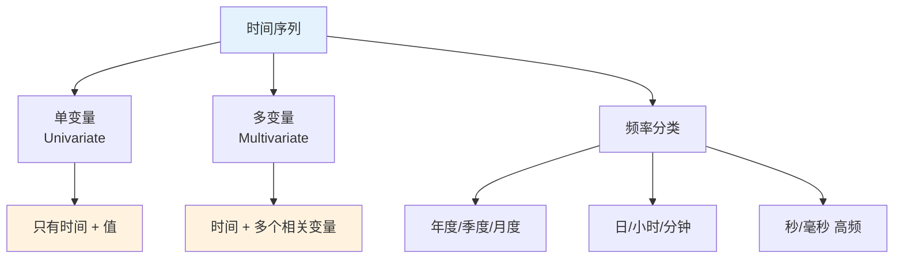
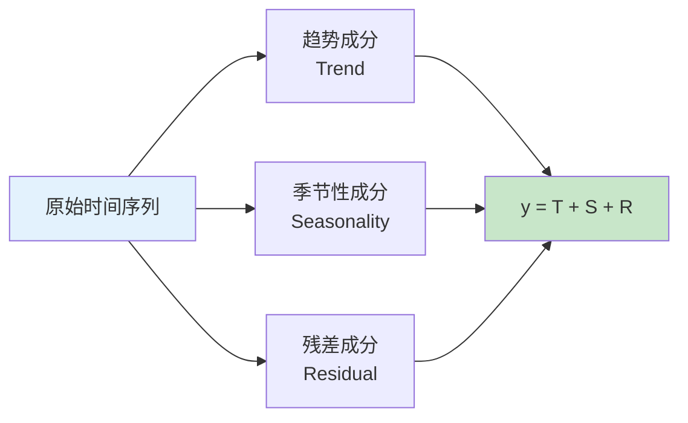
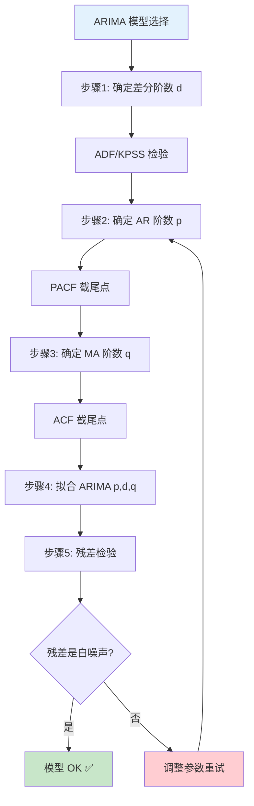
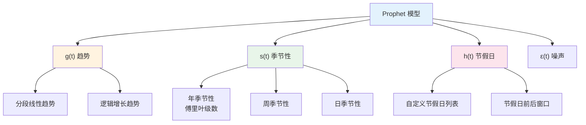
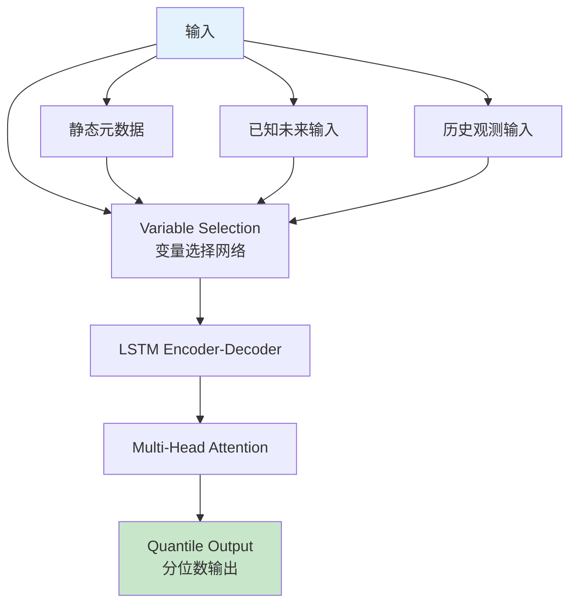
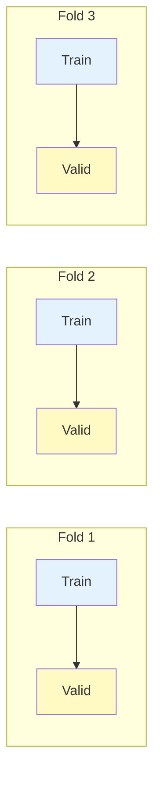

# 时间序列分析 (Time Series Analysis) - 完全指南

> 中文简称：时间序列分析 - 完全指南

## 目录

- [1. 时间序列概述](#1-时间序列概述)
- [2. 时间序列分解](#2-时间序列分解)
- [3. 平稳性](#3-平稳性)
- [4. 自相关函数](#4-自相关函数)
- [5. ARIMA 模型](#5-arima-模型)
- [6. SARIMA 模型](#6-sarima-模型)
- [7. Holt-Winters 指数平滑](#7-holt-winters-指数平滑)
- [8. Prophet](#8-prophet)
- [9. NeuralProphet](#9-neuralprophet)
- [10. Transformer-based 模型](#10-transformer-based-模型)
- [11. 评估指标](#11-评估指标)
- [12. 时间序列交叉验证](#12-时间序列交叉验证)
- [13. 完整代码实战](#13-完整代码实战)

---

## 1. 时间序列概述

时间序列是按时间顺序排列的数据序列。与传统机器学习不同，时间序列数据的样本之间存在**时间依赖关系**，不能假设独立同分布。

### 1.1 时间序列的类型



### 1.2 时间序列 vs 传统机器学习

| 特性 | 传统 ML | 时间序列 |
|------|---------|---------|
| 样本独立性 | 独立同分布 | 存在时间依赖 |
| 随机划分 | 可以 | 不可以（会泄露未来信息） |
| 特征工程 | 通用方法 | 滞后特征、滚动统计 |
| 评估方法 | K折交叉验证 | 滚动/扩展窗口验证 |
| 核心关注 | 特征-标签关系 | 时间模式、趋势、周期 |

---

## 2. 时间序列分解

### 2.1 三大组成成分

时间序列可以分解为三个核心成分：

$$y_t = T_t + S_t + R_t \quad \text{(加法模型)}$$
$$y_t = T_t \times S_t \times R_t \quad \text{(乘法模型)}$$

- **$T_t$ (Trend)**: 长期趋势，如股价长期上涨
- **$S_t$ (Seasonality)**: 周期性变化，如冰淇淋销量夏天高冬天低
- **$R_t$ (Residual)**: 去除趋势和季节性后的残差



### 2.2 代码实现

```python
import numpy as np
import pandas as pd
import matplotlib.pyplot as plt
from statsmodels.tsa.seasonal import seasonal_decompose, STL

np.random.seed(42)
dates = pd.date_range('2020-01-01', periods=365*3, freq='D')
trend = np.linspace(10, 50, len(dates))
seasonality = 10 * np.sin(2 * np.pi * np.arange(len(dates)) / 365)
noise = np.random.normal(0, 2, len(dates))
ts = pd.Series(trend + seasonality + noise, index=dates, name='value')

# 经典分解
result = seasonal_decompose(ts, model='additive', period=365)

fig, axes = plt.subplots(4, 1, figsize=(14, 12))
result.observed.plot(ax=axes[0], title='原始数据')
result.trend.plot(ax=axes[1], title='趋势 (Trend)')
result.seasonal.plot(ax=axes[2], title='季节性 (Seasonality)')
result.resid.plot(ax=axes[3], title='残差 (Residual)')
plt.tight_layout()
plt.savefig('decomposition.png', dpi=150)
plt.show()

# STL 分解 (更灵活)
stl = STL(ts, period=365, robust=True)
stl_result = stl.fit()

fig, axes = plt.subplots(4, 1, figsize=(14, 12))
stl_result.observed.plot(ax=axes[0], title='原始数据')
stl_result.trend.plot(ax=axes[1], title='STL 趋势')
stl_result.seasonal.plot(ax=axes[2], title='STL 季节性')
stl_result.resid.plot(ax=axes[3], title='STL 残差')
plt.tight_layout()
plt.savefig('stl_decomposition.png', dpi=150)
plt.show()
```

### 2.3 加法 vs 乘法模型

| 特性 | 加法模型 | 乘法模型 |
|------|---------|---------|
| 公式 | $y = T + S + R$ | $y = T \times S \times R$ |
| 季节性幅度 | 恒定 | 随趋势增大 |
| 适用场景 | 波动相对稳定 | 波动随趋势变化 |
| 转换 | 无需 | 取对数变加法 |

---

## 3. 平稳性

### 3.1 定义

**严格平稳**：时间序列的所有统计性质不随时间变化。

**弱平稳**（实际常用）：
1. 均值恒定：$E(y_t) = \mu$
2. 方差恒定：$\text{Var}(y_t) = \sigma^2$
3. 自协方差只与时间差有关：$\text{Cov}(y_t, y_{t-k}) = \gamma(k)$


### 3.2 ADF 检验 (Augmented Dickey-Fuller Test)

**原假设 $H_0$**：序列存在单位根（非平稳）
**备择假设 $H_1$**：序列平稳

```python
from statsmodels.tsa.stattools import adfuller

def adf_test(series, title=''):
    result = adfuller(series.dropna(), autolag='AIC')
    print(f'ADF 检验 - {title}')
    print(f'  ADF 统计量: {result[0]:.4f}')
    print(f'  p-value: {result[1]:.4f}')
    print(f'  临界值:')
    for key, value in result[4].items():
        print(f'    {key}: {value:.4f}')
    if result[1] <= 0.05:
        print('  结论: 序列平稳 ✅')
    else:
        print('  结论: 序列非平稳 ❌，需要差分')
    return result[1]

adf_test(ts, '原始序列')

# 一阶差分
ts_diff = ts.diff().dropna()
adf_test(ts_diff, '一阶差分')

# 二阶差分（如果需要）
ts_diff2 = ts_diff.diff().dropna()
adf_test(ts_diff2, '二阶差分')
```

### 3.3 KPSS 检验 (Kwiatkowski-Phillips-Schmidt-Shin)

**原假设 $H_0$**：序列是平稳的（趋势平稳）
**备择假设 $H_1$**：序列非平稳

```python
from statsmodels.tsa.stattools import kpss

def kpss_test(series, title=''):
    result = kpss(series.dropna(), regression='c')
    print(f'KPSS 检验 - {title}')
    print(f'  KPSS 统计量: {result[0]:.4f}')
    print(f'  p-value: {result[1]:.4f}')
    print(f'  临界值:')
    for key, value in result[3].items():
        print(f'    {key}: {value:.4f}')
    if result[1] >= 0.05:
        print('  结论: 序列平稳 ✅')
    else:
        print('  结论: 序列非平稳 ❌')
    return result[1]

kpss_test(ts, '原始序列')
```

### 3.4 ADF 与 KPSS 联合判断

| ADF 结论 | KPSS 结论 | 实际情况 |
|---------|----------|---------|
| 平稳 | 平稳 | 严格平稳 |
| 平稳 | 非平稳 | 趋势平稳 |
| 非平稳 | 平稳 | 差分后可能平稳 |
| 非平稳 | 非平稳 | 非平稳，需差分 |

### 3.5 平稳化方法

```python
# 方法1: 差分
ts_diff = ts.diff().dropna()

# 方法2: 对数变换 + 差分
ts_log_diff = np.log(ts).diff().dropna()

# 方法3: 去趋势
from sklearn.linear_model import LinearRegression
X = np.arange(len(ts)).reshape(-1, 1)
lr = LinearRegression().fit(X, ts.values)
ts_detrended = ts - lr.predict(X)

# 方法4: 移动平均去趋势
window = 30
ts_ma = ts.rolling(window=window).mean()
ts_detrended_ma = ts - ts_ma
```

---

## 4. 自相关函数

### 4.1 ACF (自相关函数)

度量序列与其滞后版本之间的相关性：

$$\text{ACF}(k) = \frac{\sum_{t=k+1}^{T}(y_t - \bar{y})(y_{t-k} - \bar{y})}{\sum_{t=1}^{T}(y_t - \bar{y})^2}$$

### 4.2 PACF (偏自相关函数)

度量去除中间滞后影响后的**纯**相关性：

$$\text{PACF}(k) = \text{Corr}(y_t - \hat{y}_t^{(k-1)}, y_{t-k} - \hat{y}_{t-k}^{(k-1)})$$

### 4.3 ACF/PACF 与模型选择

| 模式 | ACF | PACF | 模型 |
|------|-----|------|------|
| AR(p) | 拖尾/缓慢衰减 | p 阶后截尾 | ARIMA(p, d, 0) |
| MA(q) | q 阶后截尾 | 拖尾/缓慢衰减 | ARIMA(0, d, q) |
| ARMA(p,q) | q 阶后拖尾 | p 阶后拖尾 | ARIMA(p, d, q) |

```python
from statsmodels.graphics.tsaplots import plot_acf, plot_pacf
import matplotlib.pyplot as plt

fig, axes = plt.subplots(1, 2, figsize=(14, 5))
plot_acf(ts_diff, lags=40, ax=axes[0])
axes[0].set_title('ACF (自相关函数)')
plot_pacf(ts_diff, lags=40, ax=axes[1])
axes[1].set_title('PACF (偏自相关函数)')
plt.tight_layout()
plt.savefig('acf_pacf.png', dpi=150)
plt.show()
```

---

## 5. ARIMA 模型

### 5.1 ARIMA(p, d, q) 组成

- **AR(p)**: 自回归 — 用过去的值预测未来
  $$y_t = c + \phi_1 y_{t-1} + \phi_2 y_{t-2} + \cdots + \phi_p y_{t-p} + \varepsilon_t$$

- **I(d)**: 差分 — 做 d 次差分使序列平稳

- **MA(q)**: 移动平均 — 用过去的误差预测
  $$y_t = c + \varepsilon_t + \theta_1 \varepsilon_{t-1} + \theta_2 \varepsilon_{t-2} + \cdots + \theta_q \varepsilon_{t-q}$$



### 5.2 手动选择 (p, d, q)

```python
from statsmodels.tsa.arima.model import ARIMA
from statsmodels.tsa.stattools import acf
import warnings
warnings.filterwarnings('ignore')

# 确定 d
d = 0
temp = ts.copy()
while adfuller(temp.dropna())[1] > 0.05:
    temp = temp.diff().dropna()
    d += 1
print(f"差分阶数 d = {d}")

# 网格搜索 p 和 q
best_aic = float('inf')
best_order = None

for p in range(5):
    for q in range(5):
        try:
            model = ARIMA(ts, order=(p, d, q))
            result = model.fit()
            if result.aic < best_aic:
                best_aic = result.aic
                best_order = (p, d, q)
        except:
            continue

print(f"最佳参数: {best_order}, AIC = {best_aic:.2f}")

# 拟合最佳模型
model = ARIMA(ts, order=best_order)
result = model.fit()
print(result.summary())

# 残差检验
from statsmodels.stats.diagnostic import acorr_ljungbox
lb_test = acorr_ljungbox(result.resid, lags=[10], return_df=True)
print(f"\nLjung-Box 检验 p-value: {lb_test['lb_pvalue'].values[0]:.4f}")
if lb_test['lb_pvalue'].values[0] > 0.05:
    print("残差是白噪声 ✅")
else:
    print("残差不是白噪声 ❌，模型需要改进")
```

### 5.3 Auto-ARIMA

```python
from pmdarima import auto_arima

auto_model = auto_arima(
    ts,
    start_p=0, start_q=0,
    max_p=5, max_q=5,
    d=None,           # 自动确定差分阶数
    seasonal=False,
    stepwise=True,     # 逐步搜索，更快
    information_criterion='aic',
    trace=True,        # 打印搜索过程
    error_action='ignore',
    suppress_warnings=True,
    random_state=42
)

print(f"\n最佳模型: {auto_model.order}")
print(f"AIC: {auto_model.aic():.2f}")

forecast = auto_model.predict(n_periods=30)
print(f"\n未来 30 天预测:")
print(forecast)
```

---

## 6. SARIMA 模型

### 6.1 SARIMA(p, d, q)(P, D, Q, s)

在 ARIMA 基础上增加季节性成分：

- $(p, d, q)$: 非季节性参数
- $(P, D, Q)$: 季节性参数
- $s$: 季节周期（月度数据 s=12，季度数据 s=4）

$$\Phi_P(B^s)\phi_p(B)(1-B)^d(1-B^s)^D y_t = \Theta_Q(B^s)\theta_q(B)\varepsilon_t$$

```python
from statsmodels.tsa.statespace.sarimax import SARIMAX

# 生成带季节性的数据
np.random.seed(42)
n = 200
trend = np.linspace(0, 10, n)
seasonal = 5 * np.sin(2 * np.pi * np.arange(n) / 12)
noise = np.random.normal(0, 1, n)
ts_sarima = pd.Series(trend + seasonal + noise,
                       index=pd.date_range('2000-01', periods=n, freq='M'))

# 拟合 SARIMA
model = SARIMAX(
    ts_sarima,
    order=(1, 1, 1),
    seasonal_order=(1, 1, 1, 12),
    enforce_stationarity=False,
    enforce_invertibility=False
)
result = model.fit(disp=False)
print(result.summary())

# 预测
forecast = result.get_forecast(steps=24)
forecast_mean = forecast.predicted_mean
conf_int = forecast.conf_int()

fig, ax = plt.subplots(figsize=(14, 6))
ts_sarima.plot(ax=ax, label='历史数据')
forecast_mean.plot(ax=ax, label='预测', color='red')
ax.fill_between(conf_int.index, conf_int.iloc[:, 0], conf_int.iloc[:, 1],
                alpha=0.2, color='red', label='95% 置信区间')
ax.legend()
ax.set_title('SARIMA 预测')
plt.tight_layout()
plt.savefig('sarima_forecast.png', dpi=150)
plt.show()
```

### 6.2 Auto-ARIMA 季节性

```python
from pmdarima import auto_arima

auto_sarima = auto_arima(
    ts_sarima,
    start_p=0, start_q=0,
    max_p=3, max_q=3,
    start_P=0, start_Q=0,
    max_P=2, max_Q=2,
    seasonal=True,
    m=12,                    # 季节周期
    d=None, D=None,          # 自动确定
    stepwise=True,
    trace=True,
    information_criterion='aic',
    error_action='ignore',
    suppress_warnings=True,
    random_state=42
)

print(f"最佳 SARIMA: {auto_sarima.order} x {auto_sarima.seasonal_order}")
```

---

## 7. Holt-Winters 指数平滑

### 7.1 三种指数平滑

| 方法 | 公式 | 适用场景 |
|------|------|---------|
| **简单指数平滑** | $\hat{y}_{t+1} = \alpha y_t + (1-\alpha)\hat{y}_t$ | 无趋势无季节性 |
| **Holt 线性趋势** | 增加 $b_t$ 趋势方程 | 有趋势无季节性 |
| **Holt-Winters** | 增加 $s_t$ 季节方程 | 有趋势有季节性 |

### 7.2 Holt-Winters 加法模型

$$\hat{y}_{t+h} = l_t + h \cdot b_t + s_{t+h-m(k+1)}$$

$$l_t = \alpha(y_t - s_{t-m}) + (1-\alpha)(l_{t-1} + b_{t-1})$$
$$b_t = \beta(l_t - l_{t-1}) + (1-\beta)b_{t-1}$$
$$s_t = \gamma(y_t - l_{t-1} - b_{t-1}) + (1-\gamma)s_{t-m}$$

```python
from statsmodels.tsa.holtwinters import ExponentialSmoothing

model = ExponentialSmoothing(
    ts_sarima,
    seasonal_periods=12,
    trend='add',
    seasonal='add',
    damped_trend=True
)
hw_result = model.fit(optimized=True)

hw_forecast = hw_result.forecast(24)

fig, ax = plt.subplots(figsize=(14, 6))
ts_sarima.plot(ax=ax, label='历史数据')
hw_forecast.plot(ax=ax, label='Holt-Winters 预测', color='green')
ax.legend()
ax.set_title('Holt-Winters 指数平滑预测')
plt.tight_layout()
plt.savefig('holtwinters_forecast.png', dpi=150)
plt.show()

print(f"平滑参数: alpha={hw_result.params['smoothing_level']:.4f}, "
      f"beta={hw_result.params['smoothing_trend']:.4f}, "
      f"gamma={hw_result.params['smoothing_seasonal']:.4f}")
```

---

## 8. Prophet

### 8.1 Prophet 模型原理

Prophet 是 Facebook 开发的时间序列预测模型，使用可加模型：

$$y(t) = g(t) + s(t) + h(t) + \epsilon_t$$

- $g(t)$: 趋势项（分段线性或逻辑增长）
- $s(t)$: 季节性项（傅里叶级数）
- $h(t)$: 节假日效应
- $\epsilon_t$: 误差项



### 8.2 完整 Prophet 代码示例

```python
import pandas as pd
import numpy as np
from prophet import Prophet
import matplotlib.pyplot as plt

# 生成模拟数据
np.random.seed(42)
dates = pd.date_range('2018-01-01', '2023-12-31', freq='D')
n = len(dates)
trend = np.linspace(100, 300, n)
yearly = 30 * np.sin(2 * np.pi * np.arange(n) / 365.25)
weekly = 5 * np.sin(2 * np.pi * np.arange(n) / 7)
noise = np.random.normal(0, 10, n)
values = trend + yearly + weekly + noise

df = pd.DataFrame({'ds': dates, 'y': values})

# 定义中国节假日 (示例)
holidays = pd.DataFrame([
    {'holiday': 'spring_festival', 'ds': pd.to_datetime('2023-01-22'), 'lower_window': -3, 'upper_window': 7},
    {'holiday': 'national_day', 'ds': pd.to_datetime('2023-10-01'), 'lower_window': 0, 'upper_window': 7},
    {'holiday': 'spring_festival', 'ds': pd.to_datetime('2022-02-01'), 'lower_window': -3, 'upper_window': 7},
    {'holiday': 'national_day', 'ds': pd.to_datetime('2022-10-01'), 'lower_window': 0, 'upper_window': 7},
    {'holiday': 'spring_festival', 'ds': pd.to_datetime('2021-02-12'), 'lower_window': -3, 'upper_window': 7},
    {'holiday': 'national_day', 'ds': pd.to_datetime('2021-10-01'), 'lower_window': 0, 'upper_window': 7},
])

# 创建并训练模型
model = Prophet(
    holidays=holidays,
    yearly_seasonality=True,
    weekly_seasonality=True,
    daily_seasonality=False,
    seasonality_mode='additive',
    changepoint_prior_scale=0.05,
    seasonality_prior_scale=10,
    holidays_prior_scale=10,
    changepoint_range=0.8,
)
model.add_country_holidays(country_name='CN')

model.fit(df)

# 预测未来 90 天
future = model.make_future_dataframe(periods=90)
forecast = model.predict(future)

# 可视化
fig1 = model.plot(forecast, figsize=(14, 6))
plt.title('Prophet 预测结果')
plt.savefig('prophet_forecast.png', dpi=150, bbox_inches='tight')
plt.show()

fig2 = model.plot_components(forecast, figsize=(14, 10))
plt.savefig('prophet_components.png', dpi=150, bbox_inches='tight')
plt.show()

print("预测结果 (未来 10 天):")
print(forecast``[ ['ds', 'yhat', 'yhat_lower', 'yhat_upper'] ]``.tail(10))
```

### 8.3 Prophet 调参指南

| 参数 | 默认值 | 说明 |
|------|--------|------|
| `changepoint_prior_scale` | 0.05 | 趋势灵活度，越大趋势变化越灵活 |
| `seasonality_prior_scale` | 10 | 季节性强度，越大季节性越明显 |
| `holidays_prior_scale` | 10 | 节假日效应强度 |
| `seasonality_mode` | 'additive' | 'additive' 或 'multiplicative' |
| `changepoint_range` | 0.8 | 检测变化点的历史数据比例 |
| `mcmc_samples` | 0 | 0=MAP 估计，>0=全贝叶斯 |

```python
from prophet.diagnostics import cross_validation, performance_metrics

# 交叉验证
df_cv = cross_validation(
    model,
    initial='730 days',
    period='180 days',
    horizon='90 days'
)

# 性能指标
df_metrics = performance_metrics(df_cv)
print(df_metrics.head())

from prophet.plot import plot_cross_validation_metric
fig = plot_cross_validation_metric(df_cv, metric='mape')
plt.savefig('prophet_cv.png', dpi=150)
plt.show()
```

---

## 9. NeuralProphet

### 9.1 NeuralProphet 概述

NeuralProphet 是 Prophet 的神经网络扩展，结合了 Prophet 的可解释性和深度学习的表达能力。

$$y(t) = T(t) + S(t) + A(t) + L(t) + \epsilon_t$$

- $T(t)$: 趋势（与 Prophet 类似）
- $S(t)$: 季节性（傅里叶项）
- $A(t)$: 自回归项（AR-Net）
- $L(t)$: 滞后回归项（外部特征）

```python
# NeuralProphet 示例
try:
    from neuralprophet import NeuralProphet
    
    df_np = df.copy()
    df_np.columns = ['ds', 'y']
    
    m = NeuralProphet(
        n_forecasts=30,
        n_lags=60,
        yearly_seasonality=True,
        weekly_seasonality=True,
        daily_seasonality=False,
        learning_rate=0.01,
        epochs=50,
        ar_reg=1.0,
    )
    
    metrics = m.fit(df_np, freq='D')
    
    future = m.make_future_dataframe(df_np, periods=30)
    forecast = m.predict(future)
    
    fig = m.plot(forecast, figsize=(14, 6))
    plt.savefig('neuralprophet_forecast.png', dpi=150)
    plt.show()
    
    fig = m.plot_components(forecast, figsize=(14, 8))
    plt.savefig('neuralprophet_components.png', dpi=150)
    plt.show()
    
except ImportError:
    print("NeuralProphet 未安装，请运行: pip install neuralprophet")
```

---

## 10. Transformer-based 模型

### 10.1 Temporal Fusion Transformer (TFT)

TFT 是一种专为多变量时间序列设计的 Transformer 模型：



**核心特性**：
- 支持多变量输入（静态 + 历史 + 未来已知）
- 变量选择网络自动识别重要特征
- 多头注意力捕捉长期依赖
- 输出分位数预测（概率预测）

### 10.2 PatchTST

PatchTST 将时间序列分割成"补丁"（类似 ViT 处理图像），然后用 Transformer 处理：

```python
# PatchTST 核心思想示意
"""
传统方法: [t1, t2, t3, t4, t5, t6, t7, t8, t9, t10, t11, t12]
           每个时间步单独处理

PatchTST:  [t1,t2,t3] [t4,t5,t6] [t7,t8,t9] [t10,t11,t12]
             Patch 1    Patch 2    Patch 3      Patch 4
           每个 Patch 作为一个 token 输入 Transformer

优势:
  - 减少序列长度，计算更快
  - 每个 Patch 包含局部模式信息
  - 适合长序列预测
"""
```

### 10.3 深度学习时间序列框架

| 框架 | 模型 | 特点 |
|------|------|------|
| **PyTorch Forecasting** | TFT, N-BEATS, DeepAR | 全面，文档好 |
| **Darts** | 多种模型统一接口 | 易用，支持经典+DL |
| **Nixtla (NeuralForecast)** | N-BEATS, NHITS, PatchTST | 速度快，SOTA |
| **GluonTS** | DeepAR, Transformer | AWS 开源 |

```python
# Darts 统一接口示例
try:
    from darts import TimeSeries
    from darts.models import (
        ARIMA, ExponentialSmoothing,
        Prophet as DartsProphet,
        NBEATSModel
    )
    from darts.dataprocessing.transformers import Scaler
    
    ts_darts = TimeSeries.from_series(ts)
    scaler = Scaler()
    ts_scaled = scaler.fit_transform(ts_darts)
    
    train, val = ts_scaled.split_before(0.8)
    
    # 经典模型
    arima_model = ARIMA()
    arima_model.fit(train)
    arima_pred = arima_model.predict(len(val))
    
    # N-BEATS 深度学习模型
    nbeats = NBEATSModel(
        input_chunk_length=30,
        output_chunk_length=10,
        n_epochs=50,
        random_state=42
    )
    nbeats.fit(train)
    nbeats_pred = nbeats.predict(len(val))
    
except ImportError:
    print("Darts 未安装，请运行: pip install darts")
```

---

## 11. 评估指标

### 11.1 常用评估指标

| 指标 | 公式 | 特点 |
|------|------|------|
| **MAE** | $\frac{1}{n}\sum|y_i - \hat{y}_i|$ | 直观，对异常值不敏感 |
| **RMSE** | $\sqrt{\frac{1}{n}\sum(y_i - \hat{y}_i)^2}$ | 惩罚大误差 |
| **MAPE** | $\frac{100\%}{n}\sum\left\|\frac{y_i - \hat{y}_i}{y_i}\right\|$ | 百分比误差，直观 |
| **SMAPE** | $\frac{200\%}{n}\sum\frac{|y_i - \hat{y}_i|}{|y_i| + |\hat{y}_i|}$ | 解决 MAPE 的不对称性 |
| **MASE** | $\frac{MAE}{MAE_{\text{naive}}}$ | 与朴素基线比较，尺度无关 |

### 11.2 代码实现

```python
import numpy as np
import pandas as pd

def mae(y_true, y_pred):
    return np.mean(np.abs(y_true - y_pred))

def rmse(y_true, y_pred):
    return np.sqrt(np.mean((y_true - y_pred) ** 2))

def mape(y_true, y_pred):
    mask = y_true != 0
    return np.mean(np.abs((y_true[mask] - y_pred[mask]) / y_true[mask])) * 100

def smape(y_true, y_pred):
    denominator = (np.abs(y_true) + np.abs(y_pred)) / 2
    diff = np.abs(y_true - y_pred) / denominator
    diff[denominator == 0] = 0
    return np.mean(diff) * 100

def mase(y_true, y_pred, seasonality=1):
    n = len(y_true)
    d = np.abs(np.diff(y_true, n=seasonality)).sum() / (n - seasonality)
    errors = np.abs(y_true - y_pred)
    return np.mean(errors) / d

# 对比评估
y_true = np.array([100, 120, 115, 130, 125, 140, 135, 150])
y_pred_arima = np.array([98, 118, 117, 128, 127, 138, 137, 148])
y_pred_prophet = np.array([102, 122, 113, 132, 123, 142, 133, 152])

print("评估指标对比:")
print(f"{'指标':<10} {'ARIMA':>10} {'Prophet':>10}")
print("-" * 35)
print(f"{'MAE':<10} {mae(y_true, y_pred_arima):>10.2f} {mae(y_true, y_pred_prophet):>10.2f}")
print(f"{'RMSE':<10} {rmse(y_true, y_pred_arima):>10.2f} {rmse(y_true, y_pred_prophet):>10.2f}")
print(f"{'MAPE':<10} {mape(y_true, y_pred_arima):>9.2f}% {mape(y_true, y_pred_prophet):>9.2f}%")
print(f"{'SMAPE':<10} {smape(y_true, y_pred_arima):>9.2f}% {smape(y_true, y_pred_prophet):>9.2f}%")
print(f"{'MASE':<10} {mase(y_true, y_pred_arima):>10.2f} {mase(y_true, y_pred_prophet):>10.2f}")
```

### 11.3 MASE 解读

| MASE 值 | 解读 |
|---------|------|
| < 1 | 优于朴素基线预测 ✅ |
| = 1 | 与朴素基线持平 |
| > 1 | 不如朴素基线 ❌ |

---

## 12. 时间序列交叉验证

### 12.1 为什么不能用标准 K 折交叉验证

标准 K 折会随机打乱数据，导致：
- **数据泄露**：用未来数据训练预测过去
- **高估性能**：模型看到了不该看到的信息

### 12.2 滚动窗口验证 (Rolling Window)



### 12.3 扩展窗口验证 (Expanding Window)

```python
import numpy as np
import pandas as pd
from sklearn.metrics import mean_absolute_error

def time_series_cv_expanding(model_factory, ts, n_splits=5, horizon=30):
    n = len(ts)
    initial_train_size = n // (n_splits + 1)
    
    scores = []
    for i in range(n_splits):
        train_end = initial_train_size + i * (n - initial_train_size) // n_splits
        test_end = min(train_end + horizon, n)
        
        if test_end > n:
            break
        
        train_data = ts.iloc[:train_end]
        test_data = ts.iloc[train_end:test_end]
        
        model = model_factory()
        model.fit(train_data)
        predictions = model.predict(len(test_data))
        
        score = mean_absolute_error(test_data.values, predictions)
        scores.append(score)
        print(f"Fold {i+1}: 训练集 {len(train_data)} 条, "
              f"验证集 {len(test_data)} 条, MAE = {score:.4f}")
    
    print(f"\n平均 MAE: {np.mean(scores):.4f} ± {np.std(scores):.4f}")
    return scores

# 使用示例
from statsmodels.tsa.holtwinters import ExponentialSmoothing

def hw_factory():
    return ExponentialSmoothing(
        seasonal_periods=12, trend='add', seasonal='add', damped_trend=True
    )

ts_monthly = ts.resample('M').mean()
time_series_cv_expanding(hw_factory, ts_monthly, n_splits=5, horizon=6)
```

### 12.4 sklearn 时间序列交叉验证

```python
from sklearn.model_selection import TimeSeriesSplit

tscv = TimeSeriesSplit(n_splits=5, test_size=30)

for fold, (train_idx, test_idx) in enumerate(tscv.split(ts)):
    print(f"Fold {fold+1}: 训练 [{train_idx[0]}:{train_idx[-1]}], "
          f"测试 [{test_idx[0]}:{test_idx[-1]}]")
```

---

## 13. 完整代码实战

### 13.1 多模型对比预测流水线

```python
import numpy as np
import pandas as pd
import matplotlib.pyplot as plt
from statsmodels.tsa.seasonal import seasonal_decompose
from statsmodels.tsa.stattools import adfuller
from statsmodels.tsa.arima.model import ARIMA
from statsmodels.tsa.holtwinters import ExponentialSmoothing
from statsmodels.tsa.statespace.sarimax import SARIMAX
from sklearn.metrics import mean_absolute_error, mean_squared_error
import warnings
warnings.filterwarnings('ignore')

# 生成模拟销售数据
np.random.seed(42)
dates = pd.date_range('2018-01-01', '2023-12-31', freq='D')
n = len(dates)
trend = np.linspace(50, 150, n)
yearly_season = 20 * np.sin(2 * np.pi * np.arange(n) / 365.25)
weekly_season = 5 * np.sin(2 * np.pi * np.arange(n) / 7)
noise = np.random.normal(0, 5, n)
sales = trend + yearly_season + weekly_season + noise

df = pd.DataFrame({'date': dates, 'sales': sales}).set_index('date')
df_monthly = df.resample('M').mean()

# 划分训练集和测试集
train_size = int(len(df_monthly) * 0.8)
train = df_monthly.iloc[:train_size]
test = df_monthly.iloc[train_size:]

print(f"训练集: {train.index[0].strftime('%Y-%m')} ~ {train.index[-1].strftime('%Y-%m')} ({len(train)} 个月)")
print(f"测试集: {test.index[0].strftime('%Y-%m')} ~ {test.index[-1].strftime('%Y-%m')} ({len(test)} 个月)")

# 分解
decompose_result = seasonal_decompose(train['sales'], model='additive', period=12)

# ADF 检验
adf_result = adfuller(train['sales'])
print(f"\nADF 检验: 统计量={adf_result[0]:.4f}, p-value={adf_result[1]:.4f}")

# 模型1: ARIMA
arima_model = ARIMA(train['sales'], order=(1, 1, 1))
arima_result = arima_model.fit()
arima_forecast = arima_result.forecast(steps=len(test))

# 模型2: SARIMA
sarima_model = SARIMAX(train['sales'], order=(1, 1, 1), seasonal_order=(1, 1, 1, 12))
sarima_result = sarima_model.fit(disp=False)
sarima_forecast = sarima_result.forecast(steps=len(test))

# 模型3: Holt-Winters
hw_model = ExponentialSmoothing(train['sales'], seasonal_periods=12, trend='add', seasonal='add')
hw_result = hw_model.fit()
hw_forecast = hw_result.forecast(steps=len(test))

# 模型4: 朴素基线 (上一年同月值)
naive_forecast = train['sales'].iloc[-len(test):].values

# Prophet
try:
    from prophet import Prophet
    prophet_df = train.reset_index()
    prophet_df.columns = ['ds', 'y']
    prophet_model = Prophet(yearly_seasonality=True, weekly_seasonality=False, daily_seasonality=False)
    prophet_model.fit(prophet_df)
    future = prophet_model.make_future_dataframe(periods=len(test), freq='M')
    prophet_result = prophet_model.predict(future)
    prophet_forecast = prophet_result['yhat'].iloc[-len(test):].values
    has_prophet = True
except ImportError:
    has_prophet = False
    prophet_forecast = None

# 评估
def evaluate(y_true, y_pred, name):
    mae_val = mean_absolute_error(y_true, y_pred)
    rmse_val = np.sqrt(mean_squared_error(y_true, y_pred))
    mape_val = np.mean(np.abs((y_true - y_pred) / y_true)) * 100
    print(f"{name:<20} MAE={mae_val:.2f}  RMSE={rmse_val:.2f}  MAPE={mape_val:.2f}%")
    return mae_val, rmse_val, mape_val

print("\n" + "=" * 70)
print("模型对比评估:")
print("=" * 70)
evaluate(test['sales'].values, arima_forecast.values, 'ARIMA')
evaluate(test['sales'].values, sarima_forecast.values, 'SARIMA')
evaluate(test['sales'].values, hw_forecast.values, 'Holt-Winters')
evaluate(test['sales'].values, naive_forecast, 'Naive Baseline')
if has_prophet:
    evaluate(test['sales'].values, prophet_forecast, 'Prophet')

# 可视化
fig, ax = plt.subplots(figsize=(14, 7))
train['sales'].plot(ax=ax, label='训练数据')
test['sales'].plot(ax=ax, label='真实值', color='black', linewidth=2)
ax.plot(test.index, arima_forecast, label='ARIMA', linestyle='--')
ax.plot(test.index, sarima_forecast, label='SARIMA', linestyle='-.')
ax.plot(test.index, hw_forecast, label='Holt-Winters', linestyle=':')
if has_prophet:
    ax.plot(test.index, prophet_forecast, label='Prophet', linestyle='--', color='purple')
ax.legend()
ax.set_title('时间序列预测模型对比')
ax.set_xlabel('日期')
ax.set_ylabel('销售额')
plt.tight_layout()
plt.savefig('ts_model_comparison.png', dpi=150)
plt.show()
```

### 13.2 特征工程 + 机器学习预测

```python
from sklearn.ensemble import RandomForestRegressor
from sklearn.metrics import mean_absolute_error
import pandas as pd
import numpy as np

def create_features(df, target_col='sales'):
    df = df.copy()
    df['month'] = df.index.month
    df['day_of_week'] = df.index.dayofweek
    df['day_of_year'] = df.index.dayofyear
    df['quarter'] = df.index.quarter
    df['is_weekend'] = (df.index.dayofweek >= 5).astype(int)
    
    for lag in [1, 7, 14, 28, 365]:
        df[f'lag_{lag}'] = df[target_col].shift(lag)
    
    for window in [7, 14, 28]:
        df[f'rolling_mean_{window}'] = df[target_col].rolling(window).mean()
        df[f'rolling_std_{window}'] = df[target_col].rolling(window).std()
        df[f'rolling_min_{window}'] = df[target_col].rolling(window).min()
        df[f'rolling_max_{window}'] = df[target_col].rolling(window).max()
    
    df['diff_1'] = df[target_col].diff(1)
    df['diff_7'] = df[target_col].diff(7)
    
    return df.dropna()

df_features = create_features(df)
feature_cols = [c for c in df_features.columns if c != 'sales']

split_date = '2023-01-01'
train_ml = df_features.loc[:split_date]
test_ml = df_features.loc[split_date:]

rf = RandomForestRegressor(n_estimators=200, max_depth=15, random_state=42, n_jobs=-1)
rf.fit(train_ml[feature_cols], train_ml['sales'])

y_pred_rf = rf.predict(test_ml[feature_cols])
mae_rf = mean_absolute_error(test_ml['sales'], y_pred_rf)
print(f"Random Forest MAE: {mae_rf:.2f}")

importance = pd.Series(rf.feature_importances_, index=feature_cols).sort_values(ascending=False)
print("\nTop 10 重要特征:")
print(importance.head(10))
```

---

## 总结

| 方法 | 适用场景 | 优势 | 劣势 |
|------|---------|------|------|
| **ARIMA** | 单变量、无季节性 | 理论成熟、解释性好 | 需要平稳性，不能处理多变量 |
| **SARIMA** | 单变量、有季节性 | 处理季节性 | 参数选择复杂 |
| **Holt-Winters** | 趋势+季节性 | 简单快速 | 灵活性有限 |
| **Prophet** | 多季节性+节假日 | 易用、可解释、自动 | 对复杂模式不够灵活 |
| **NeuralProphet** | Prophet + 自回归 | 更强表达力 | 需要 GPU |
| **TFT** | 多变量、长序列 | 最灵活、概率预测 | 需要大量数据和 GPU |
| **特征工程+ML** | 多特征 | 灵活、可融入外部信息 | 需要人工设计特征 |

> **选择建议**: 从 Prophet 开始（简单好用），需要更精确时尝试 SARIMA，多变量场景考虑特征工程 + XGBoost 或 TFT。

## Related

- [[概念/Math/ensemble-learning]] — 集成学习 (Ensemble Learning) - 完全指南 (共享: machine-learning, ml, supervised, unsupervised)
- [[02_机器学习/05_特征工程/01_特征工程]] — 特征工程 (Feature Engineering) (共享: machine-learning, ml, supervised, unsupervised)
- [[02_机器学习/README.md]] — 特征工程 - 小白版 (共享: machine-learning, ml, supervised, unsupervised)
- [[02_机器学习/ML-in-nutshell]] — 机器学习速成指南 (共享: machine-learning, ml, supervised, unsupervised)
