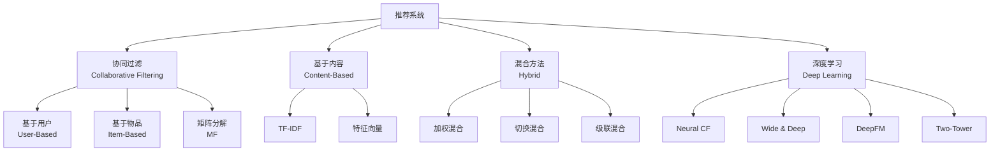
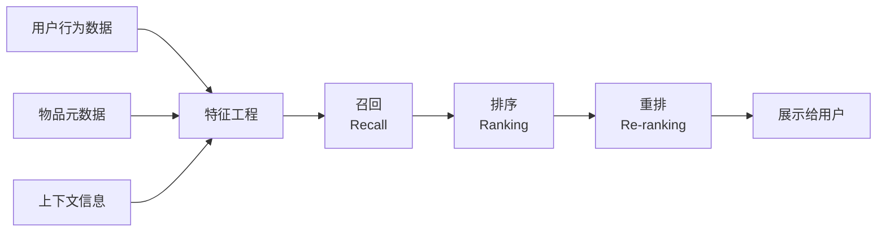
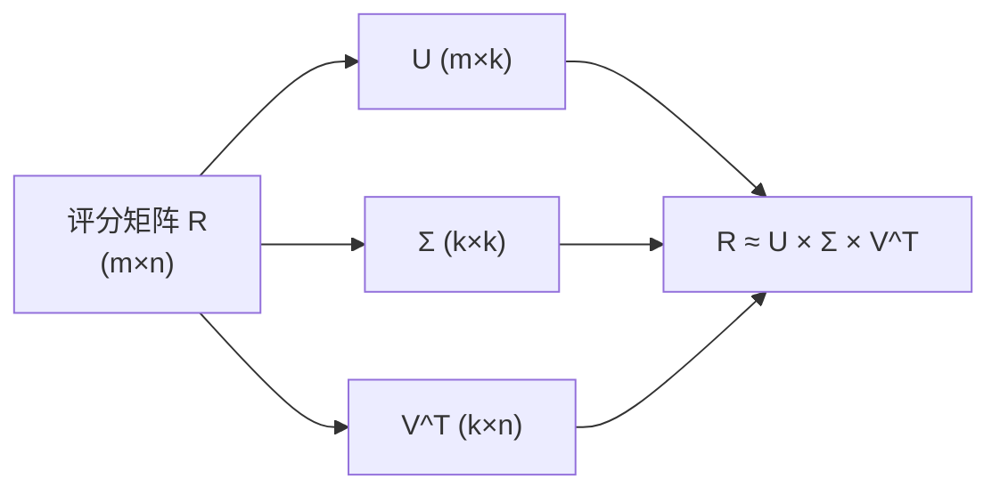
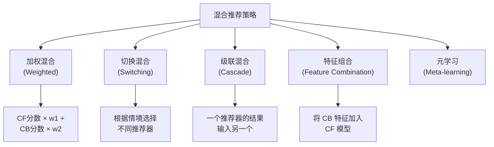
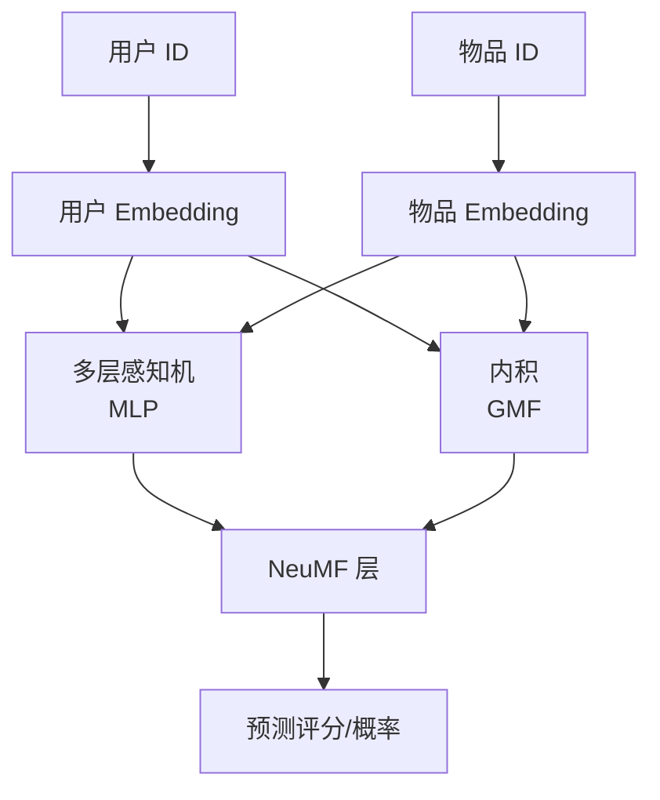
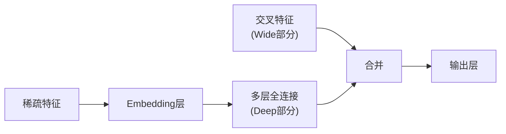
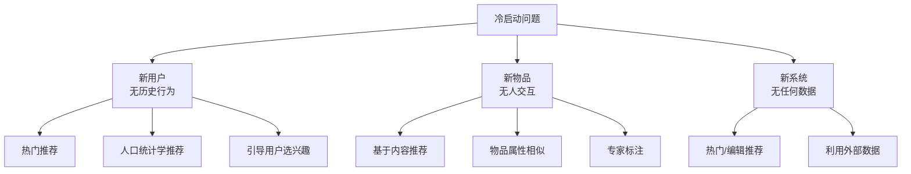
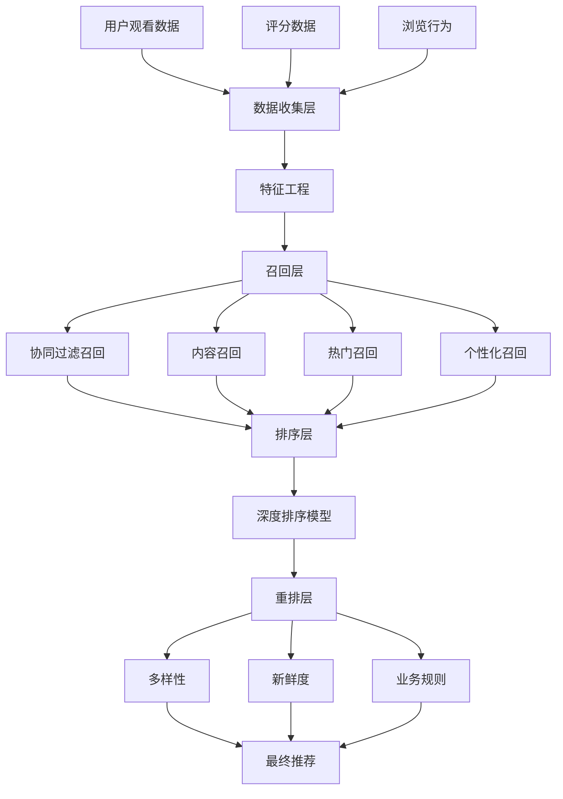

# 推荐系统 (Recommendation Systems)

> 中文简称：推荐系统

> 推荐系统是信息过滤系统的子类，旨在预测用户对物品的"评分"或"偏好"，是电商、内容平台、社交媒体的核心技术。

---

## 目录

1. [概述](#概述)
2. [协同过滤](#协同过滤)
3. [矩阵分解](#矩阵分解)
4. [基于内容的过滤](#基于内容的过滤)
5. [混合方法](#混合方法)
6. [深度学习推荐](#深度学习推荐)
7. [基于会话的推荐](#基于会话的推荐)
8. [冷启动问题](#冷启动问题)
9. [评估指标](#评估指标)
10. [真实架构案例](#真实架构案例)
11. [代码实战](#代码实战)

---

## 概述

### 为什么需要推荐系统？

| 问题 | 说明 |
|------|------|
| 信息过载 | 用户无法从海量内容中找到感兴趣的 |
| 长尾效应 | 大量物品曝光不足，推荐系统帮助分发 |
| 用户留存 | 好的推荐让用户停留更久 |
| 商业变现 | 精准推荐直接提升转化率 |

### 推荐系统分类



### 推荐系统流水线



```
典型推荐流程:

百万级物品 → 召回(筛选到千级) → 排序(精排到百级) → 重排(最终展示)

    1,000,000
        │  召回 (多路)
        ▼
    1,000 ~ 5,000
        │  粗排
        ▼
      200 ~ 500
        │  精排
        ▼
       30 ~ 50
        │  重排 (多样性/新鲜度)
        ▼
      最终推荐列表 (10~20)
```

---

## 协同过滤

### 核心思想

利用群体智慧：
- **基于用户**：和你相似的用户喜欢什么 → 推荐给你
- **基于物品**：和你喜欢的物品相似的物品 → 推荐给你

### 用户评分矩阵

```
用户-物品评分矩阵:

          电影A  电影B  电影C  电影D  电影E
用户1       5      3      ?      1      ?
用户2       4      ?      ?      1      5
用户3       ?      2      4      ?      3
用户4       3      ?      5      2      ?
用户5       ?      4      ?      1      4

? = 未评分 → 推荐系统的任务就是预测这些?
```

### User-Based 协同过滤

**思路**：找到和你品味相似的用户，把他们喜欢而你没看过的推荐给你。


#### 余弦相似度

$$\text{sim}(u, v) = \cos(\vec{r}_u, \vec{r}_v) = \frac{\vec{r}_u \cdot \vec{r}_v}{\|\vec{r}_u\| \times \|\vec{r}_v\|}$$

```python
import numpy as np
from sklearn.metrics.pairwise import cosine_similarity

user_item_matrix = np.array([
    [5, 3, 0, 1, 0],
    [4, 0, 0, 1, 5],
    [0, 2, 4, 0, 3],
    [3, 0, 5, 2, 0],
    [0, 4, 0, 1, 4],
])

user_similarity = cosine_similarity(user_item_matrix)
print("用户相似度矩阵:")
print(np.round(user_similarity, 2))

def predict_rating_user_based(matrix, similarity, user_idx, item_idx, k=3):
    rated_users = matrix[:, item_idx] > 0
    if not rated_users.any():
        return 0
    sim_scores = similarity[user_idx][rated_users]
    ratings = matrix[rated_users, item_idx]
    top_k = np.argsort(sim_scores)[-k:]
    sim_top = sim_scores[top_k]
    ratings_top = ratings[top_k]
    if sim_top.sum() == 0:
        return 0
    return (sim_top * ratings_top).sum() / sim_top.sum()

pred = predict_rating_user_based(user_item_matrix, user_similarity, 0, 2)
print(f"\n用户1对电影C的预测评分: {pred:.2f}")
```

### Item-Based 协同过滤

**思路**：找到和用户已喜欢的物品相似的物品来推荐。

```python
item_similarity = cosine_similarity(user_item_matrix.T)

def predict_rating_item_based(matrix, similarity, user_idx, item_idx, k=3):
    rated_items = matrix[user_idx] > 0
    if not rated_items.any():
        return 0
    sim_scores = similarity[item_idx][rated_items]
    ratings = matrix[user_idx][rated_items]
    top_k = np.argsort(sim_scores)[-k:]
    sim_top = sim_scores[top_k]
    ratings_top = ratings[top_k]
    if sim_top.sum() == 0:
        return 0
    return (sim_top * ratings_top).sum() / sim_top.sum()

pred = predict_rating_item_based(user_item_matrix, item_similarity, 0, 2)
print(f"用户1对电影C的预测评分: {pred:.2f}")
```

### User-Based vs Item-Based

| 对比 | User-Based | Item-Based |
|------|------------|------------|
| 相似度计算 | 用户之间 | 物品之间 |
| 稳定性 | 差（用户兴趣变化） | 好（物品特征稳定） |
| 计算量 | 用户多时大 | 物品多时大 |
| 适用场景 | 用户少、物品多 | 用户多、物品少 |
| 代表 | 早期推荐系统 | Amazon |

---

## 矩阵分解

### 原理

将高维稀疏的用户-物品评分矩阵分解为两个低维稠密矩阵。

```
用户-物品矩阵 R (m×n) ≈ 用户矩阵 P (m×k) × 物品矩阵 Q (k×n)

  R          P           Q
┌───────┐  ┌────┐    ┌───────┐
│ ? 3 ? │  │ p1 │    │ q1 q2 │
│ 5 ? 1 │≈ │ p2 │ ×  │ q3 q4 │
│ ? 2 4 │  │ p3 │    │ q5 q6 │
│ 3 ? 5 │  │ p4 │    └───────┘
└───────┘  └────┘
 m×n        m×k        k×n

k << min(m, n) → 降维、泛化
```

$$R \approx P \times Q^T$$

$$\hat{r}_{ui} = p_u^T q_i$$

### SVD (奇异值分解)



```python
from surprise import SVD, Dataset, accuracy
from surprise.model_selection import cross_validate, train_test_split

data = Dataset.load_builtin('ml-100k')
trainset, testset = train_test_split(data, test_size=0.25)

algo = SVD(
    n_factors=100,
    n_epochs=20,
    biased=True,
    lr_all=0.005,
    reg_all=0.02,
    random_state=42
)
algo.fit(trainset)
predictions = algo.test(testset)
rmse = accuracy.rmse(predictions)
mae = accuracy.mae(predictions)
```

### ALS (交替最小二乘法)

固定一个矩阵，优化另一个矩阵，交替进行。

```python
import numpy as np

def als(R, k=10, n_iterations=20, lambda_reg=0.1):
    m, n = R.shape
    P = np.random.randn(m, k) * 0.01
    Q = np.random.randn(n, k) * 0.01
    mask = R > 0
    
    for iteration in range(n_iterations):
        for u in range(m):
            items = mask[u]
            if items.sum() == 0:
                continue
            Q_i = Q[items]
            R_u = R[u, items]
            A = Q_i.T @ Q_i + lambda_reg * np.eye(k)
            b = Q_i.T @ R_u
            P[u] = np.linalg.solve(A, b)
        
        for i in range(n):
            users = mask[:, i]
            if users.sum() == 0:
                continue
            P_u = P[users]
            R_i = R[users, i]
            A = P_u.T @ P_u + lambda_reg * np.eye(k)
            b = P_u.T @ R_i
            Q[i] = np.linalg.solve(A, b)
        
        R_hat = P @ Q.T
        error = np.sum((R[mask] - R_hat[mask]) ** 2)
        if (iteration + 1) % 5 == 0:
            print(f"Iteration {iteration+1}, Error: {error:.4f}")
    
    return P, Q

R = np.array([
    [5, 3, 0, 1, 0],
    [4, 0, 0, 1, 5],
    [0, 2, 4, 0, 3],
    [3, 0, 5, 2, 0],
    [0, 4, 0, 1, 4],
]).astype(float)

P, Q = als(R, k=3, n_iterations=50)
R_hat = P @ Q.T
print("\n预测评分矩阵:")
print(np.round(R_hat, 2))
```

### SGD 优化

```python
def svd_sgd(R, k=10, n_epochs=100, lr=0.005, reg=0.02):
    m, n = R.shape
    P = np.random.randn(m, k) * 0.01
    Q = np.random.randn(n, k) * 0.01
    bu = np.zeros(m)
    bi = np.zeros(n)
    mu = R[R > 0].mean()
    mask = R > 0
    
    for epoch in range(n_epochs):
        total_loss = 0
        for u in range(m):
            for i in range(n):
                if R[u, i] == 0:
                    continue
                pred = mu + bu[u] + bi[i] + P[u] @ Q[i]
                error = R[u, i] - pred
                total_loss += error ** 2
                
                bu[u] += lr * (error - reg * bu[u])
                bi[i] += lr * (error - reg * bi[i])
                P[u] += lr * (error * Q[i] - reg * P[u])
                Q[i] += lr * (error * P[u] - reg * Q[i])
        
        total_loss += reg * (np.sum(P**2) + np.sum(Q**2) + np.sum(bu**2) + np.sum(bi**2))
        if (epoch + 1) % 20 == 0:
            print(f"Epoch {epoch+1}, Loss: {total_loss:.4f}")
    
    return P, Q, bu, bi, mu
```

### ALS vs SGD

| 对比 | ALS | SGD |
|------|-----|-----|
| 并行性 | 好（可并行计算每个用户/物品） | 差（顺序更新） |
| 稀疏数据 | 好 | 一般 |
| 收敛速度 | 较快 | 需要调学习率 |
| 分布式 | 天然适合 | 需要特殊处理 |
| 隐式反馈 | 好（加权 ALS） | 一般 |
| 代表 | Spark MLlib | Netflix Prize |

---

## 基于内容的过滤

### 核心思想

分析用户过去喜欢的物品的特征，推荐具有相似特征的新物品。

```
用户喜欢:
  🎬 电影A: 动作、科幻、导演:诺兰
  🎬 电影B: 动作、冒险、主演:汤姆·克鲁斯
  
用户偏好画像:
  类型偏好: 动作(高)、科幻(中)、冒险(中)
  
推荐:
  🎬 电影C: 动作、科幻 → 匹配度高 ✅
  🎬 电影D: 爱情、喜剧 → 匹配度低 ❌
```

### TF-IDF 特征

```python
from sklearn.feature_extraction.text import TfidfVectorizer
from sklearn.metrics.pairwise import cosine_similarity

items = [
    "动作 科幻 未来 机器人 战争",
    "爱情 喜剧 浪漫 婚礼 幽默",
    "动作 冒险 速度 赛车 犯罪",
    "科幻 太空 探索 外星人 未来",
    "恐怖 悬疑 灵魂 鬼屋 惊悚",
    "动作 科幻 太空 战斗 英雄"
]

vectorizer = TfidfVectorizer()
tfidf_matrix = vectorizer.fit_transform(items)

similarity = cosine_similarity(tfidf_matrix)

def content_based_recommend(user_liked_items, similarity_matrix, top_n=3):
    scores = np.zeros(similarity_matrix.shape[0])
    for idx in user_liked_items:
        scores += similarity_matrix[idx]
    scores[user_liked_items] = -1
    recommended = np.argsort(scores)[-top_n:][::-1]
    return recommended, scores[recommended]

user_liked = [0, 3]
recommended, scores = content_based_recommend(user_liked, similarity)
print(f"推荐物品索引: {recommended}")
print(f"相似度分数: {scores}")
```

### 物品特征向量

```python
import numpy as np

item_features = {
    'movie_a': {'action': 0.9, 'scifi': 0.8, 'romance': 0.1, 'comedy': 0.2},
    'movie_b': {'action': 0.1, 'scifi': 0.1, 'romance': 0.9, 'comedy': 0.8},
    'movie_c': {'action': 0.8, 'scifi': 0.5, 'romance': 0.2, 'comedy': 0.1},
    'movie_d': {'action': 0.2, 'scifi': 0.9, 'romance': 0.1, 'comedy': 0.0},
}

def build_user_profile(user_ratings, item_features):
    feature_names = list(list(item_features.values())[0].keys())
    profile = np.zeros(len(feature_names))
    total_weight = 0
    
    for item, rating in user_ratings.items():
        if item in item_features:
            features = np.array([item_features[item][f] for f in feature_names])
            profile += rating * features
            total_weight += rating
    
    if total_weight > 0:
        profile /= total_weight
    return dict(zip(feature_names, profile))

user_ratings = {'movie_a': 5, 'movie_d': 4, 'movie_b': 1}
profile = build_user_profile(user_ratings, item_features)
print("用户偏好画像:")
for feature, weight in sorted(profile.items(), key=lambda x: -x[1]):
    bar = '█' * int(weight * 20)
    print(f"  {feature}: {bar} {weight:.2f}")
```

### 内容方法的优缺点

| 优点 | 缺点 |
|------|------|
| 不需要其他用户数据 | 只推荐相似的（信息茧房） |
| 可解释性强 | 需要好的特征工程 |
| 没有新用户冷启动 | 无法发现意外惊喜 |
| 新物品可立即推荐 | 特征提取可能困难 |

---

## 混合方法

### 混合策略



```python
class HybridRecommender:
    def __init__(self, cf_weight=0.6, cb_weight=0.4):
        self.cf_weight = cf_weight
        self.cb_weight = cb_weight

    def recommend(self, cf_scores, cb_scores, top_n=10):
        cf_normalized = self._normalize(cf_scores)
        cb_normalized = self._normalize(cb_scores)
        
        hybrid = (self.cf_weight * cf_normalized + 
                  self.cb_weight * cb_normalized)
        return np.argsort(hybrid)[-top_n:][::-1]

    def _normalize(self, scores):
        min_s, max_s = scores.min(), scores.max()
        if max_s == min_s:
            return np.zeros_like(scores)
        return (scores - min_s) / (max_s - min_s)

cf_scores = np.array([0.9, 0.3, 0.7, 0.5, 0.2])
cb_scores = np.array([0.8, 0.6, 0.4, 0.9, 0.3])

rec = HybridRecommender(cf_weight=0.6, cb_weight=0.4)
recommendations = rec.recommend(cf_scores, cb_scores)
print(f"混合推荐排序: {recommendations}")
```

---

## 深度学习推荐

### Neural Collaborative Filtering (NCF)



```python
import torch
import torch.nn as nn

class NCF(nn.Module):
    def __init__(self, n_users, n_items, emb_dim=32, layers=[64, 32, 16]):
        super().__init__()
        self.user_emb_gmf = nn.Embedding(n_users, emb_dim)
        self.item_emb_gmf = nn.Embedding(n_items, emb_dim)
        self.user_emb_mlp = nn.Embedding(n_users, emb_dim)
        self.item_emb_mlp = nn.Embedding(n_items, emb_dim)
        
        mlp_layers = []
        input_dim = emb_dim * 2
        for hidden_dim in layers:
            mlp_layers.extend([
                nn.Linear(input_dim, hidden_dim),
                nn.ReLU(),
                nn.BatchNorm1d(hidden_dim),
            ])
            input_dim = hidden_dim
        self.mlp = nn.Sequential(*mlp_layers)
        
        self.prediction = nn.Linear(layers[-1] + emb_dim, 1)
        self.sigmoid = nn.Sigmoid()

    def forward(self, user_ids, item_ids):
        gmf_user = self.user_emb_gmf(user_ids)
        gmf_item = self.item_emb_gmf(item_ids)
        gmf_output = gmf_user * gmf_item
        
        mlp_user = self.user_emb_mlp(user_ids)
        mlp_item = self.item_emb_mlp(item_ids)
        mlp_input = torch.cat([mlp_user, mlp_item], dim=-1)
        mlp_output = self.mlp(mlp_input)
        
        combined = torch.cat([gmf_output, mlp_output], dim=-1)
        return self.sigmoid(self.prediction(combined)).squeeze(-1)
```

### Wide & Deep



```python
class WideAndDeep(nn.Module):
    def __init__(self, n_features, n_fields, emb_dim=8, hidden_dims=[64, 32]):
        super().__init__()
        self.embeddings = nn.ModuleList([
            nn.Embedding(n_features, emb_dim) for _ in range(n_fields)
        ])
        
        deep_input_dim = n_fields * emb_dim
        deep_layers = []
        for h_dim in hidden_dims:
            deep_layers.extend([
                nn.Linear(deep_input_dim, h_dim),
                nn.ReLU(),
            ])
            deep_input_dim = h_dim
        self.deep = nn.Sequential(*deep_layers)
        
        self.wide = nn.Linear(n_fields, 1, bias=False)
        self.output = nn.Linear(hidden_dims[-1] + 1, 1)
        self.sigmoid = nn.Sigmoid()

    def forward(self, wide_input, embedding_inputs):
        wide_out = self.wide(wide_input.float())
        
        emb_list = [self.embeddings[i](embedding_inputs[:, i]) 
                     for i in range(len(self.embeddings))]
        deep_input = torch.cat(emb_list, dim=-1)
        deep_out = self.deep(deep_input)
        
        combined = torch.cat([wide_out, deep_out], dim=-1)
        return self.sigmoid(self.output(combined)).squeeze(-1)
```

### DeepFM

```python
class FM_layer(nn.Module):
    def __init__(self, n_fields, emb_dim):
        super().__init__()
        self.n_fields = n_fields
        self.emb_dim = emb_dim

    def forward(self, embeddings):
        sum_emb = torch.sum(embeddings, dim=1)
        square_sum = torch.sum(embeddings ** 2, dim=1)
        fm = 0.5 * (sum_emb ** 2 - square_sum).sum(-1)
        return fm

class DeepFM(nn.Module):
    def __init__(self, field_dims, emb_dim=8, hidden_dims=[64, 32]):
        super().__init__()
        self.n_fields = len(field_dims)
        self.embeddings = nn.ModuleList([
            nn.Embedding(dim, emb_dim) for dim in field_dims
        ])
        self.first_order = nn.ModuleList([
            nn.Embedding(dim, 1) for dim in field_dims
        ])
        self.fm = FM_layer(self.n_fields, emb_dim)
        
        deep_input_dim = self.n_fields * emb_dim
        deep_layers = []
        for h_dim in hidden_dims:
            deep_layers.extend([nn.Linear(deep_input_dim, h_dim), nn.ReLU()])
            deep_input_dim = h_dim
        self.deep = nn.Sequential(*deep_layers)
        
        self.output = nn.Linear(hidden_dims[-1] + 1 + self.n_fields, 1)
        self.sigmoid = nn.Sigmoid()

    def forward(self, x):
        first_order = torch.cat([
            self.first_order[i](x[:, i]) for i in range(self.n_fields)
        ], dim=1)
        
        emb = torch.stack([
            self.embeddings[i](x[:, i]) for i in range(self.n_fields)
        ], dim=1)
        
        fm_out = self.fm(emb).unsqueeze(-1)
        deep_input = emb.view(emb.size(0), -1)
        deep_out = self.deep(deep_input)
        
        combined = torch.cat([first_order, fm_out, deep_out], dim=-1)
        return self.sigmoid(self.output(combined)).squeeze(-1)
```

### Two-Tower 模型

```
         用户塔                          物品塔
    ┌─────────────┐               ┌─────────────┐
    │ 用户特征     │               │ 物品特征     │
    │  ├ 年龄     │               │  ├ 类别     │
    │  ├ 性别     │               │  ├ 价格     │
    │  ├ 历史     │               │  ├ 描述     │
    │  └ 地域     │               │  └ 品牌     │
    └──────┬──────┘               └──────┬──────┘
           │                             │
    ┌──────▼──────┐               ┌──────▼──────┐
    │  Embedding  │               │  Embedding  │
    │  + MLP      │               │  + MLP      │
    └──────┬──────┘               └──────┬──────┘
           │                             │
    ┌──────▼──────┐               ┌──────▼──────┐
    │ 用户向量 u  │               │ 物品向量 v  │
    └──────┬──────┘               └──────┬──────┘
           │                             │
           └──────────┬──────────────────┘
                      │
              ┌───────▼────────┐
              │  sim(u, v) =   │
              │  u · v / ||u|| ||v|| │
              └────────────────┘
```

```python
class TwoTower(nn.Module):
    def __init__(self, user_feature_dims, item_feature_dims, emb_dim=64):
        super().__init__()
        self.user_tower = nn.Sequential(
            nn.Linear(user_feature_dims, 128),
            nn.ReLU(),
            nn.BatchNorm1d(128),
            nn.Linear(128, emb_dim)
        )
        self.item_tower = nn.Sequential(
            nn.Linear(item_feature_dims, 128),
            nn.ReLU(),
            nn.BatchNorm1d(128),
            nn.Linear(128, emb_dim)
        )

    def encode_user(self, user_features):
        return torch.nn.functional.normalize(
            self.user_tower(user_features), dim=-1
        )

    def encode_item(self, item_features):
        return torch.nn.functional.normalize(
            self.item_tower(item_features), dim=-1
        )

    def forward(self, user_features, item_features):
        u = self.encode_user(user_features)
        v = self.encode_item(item_features)
        return (u * v).sum(dim=-1)

    def get_all_item_embs(self, item_features):
        with torch.no_grad():
            return self.encode_item(item_features)
```

### 深度推荐模型对比

| 模型 | 特点 | 优点 | 缺点 |
|------|------|------|------|
| NCF | MLP + GMF | 灵活非线性 | 训练复杂 |
| Wide & Deep | 记忆+泛化 | Google 实践 | 需要特征工程 |
| DeepFM | FM + Deep | 自动交叉特征 | 参数较多 |
| Two-Tower | 双塔独立 | 召回高效 | 交互延迟 |

---

## 基于会话的推荐

### 为什么需要基于会话的推荐？

- 很多用户没有登录（无历史记录）
- 短期兴趣 vs 长期兴趣
- 实时响应用户当前意图

### GRU4Rec


```python
import torch
import torch.nn as nn

class GRU4Rec(nn.Module):
    def __init__(self, n_items, emb_dim=64, hidden_dim=128, n_layers=2):
        super().__init__()
        self.item_emb = nn.Embedding(n_items, emb_dim)
        self.gru = nn.GRU(
            emb_dim, hidden_dim, n_layers,
            batch_first=True, dropout=0.1
        )
        self.output = nn.Linear(hidden_dim, n_items)

    def forward(self, session_items):
        emb = self.item_emb(session_items)
        gru_out, _ = self.gru(emb)
        last_hidden = gru_out[:, -1, :]
        logits = self.output(last_hidden)
        return logits

    def predict_next(self, session_items, top_k=10):
        self.eval()
        with torch.no_grad():
            logits = self.forward(session_items)
            scores = torch.softmax(logits, dim=-1)
            topk = torch.topk(scores, top_k)
            return topk.indices, topk.values
```

### SASRec (Self-Attentive Sequential Rec)

```python
class SASRec(nn.Module):
    def __init__(self, n_items, emb_dim=64, n_heads=2, n_layers=2, max_len=50):
        super().__init__()
        self.item_emb = nn.Embedding(n_items, emb_dim)
        self.pos_emb = nn.Embedding(max_len, emb_dim)
        encoder_layer = nn.TransformerEncoderLayer(
            d_model=emb_dim, nhead=n_heads,
            dim_feedforward=emb_dim * 4, dropout=0.1,
            batch_first=True
        )
        self.transformer = nn.TransformerEncoder(
            encoder_layer, num_layers=n_layers
        )
        self.output = nn.Linear(emb_dim, n_items)
        self.max_len = max_len

    def forward(self, item_seq):
        batch_size, seq_len = item_seq.shape
        positions = torch.arange(seq_len, device=item_seq.device).unsqueeze(0)
        
        emb = self.item_emb(item_seq) + self.pos_emb(positions)
        
        causal_mask = nn.Transformer.generate_square_subsequent_mask(seq_len)
        causal_mask = causal_mask.to(item_seq.device)
        
        out = self.transformer(emb, mask=causal_mask)
        last_out = out[:, -1, :]
        return self.output(last_out)
```

---

## 冷启动问题

### 冷启动类型



### 解决方案代码

```python
class ColdStartHandler:
    def __init__(self, n_items):
        self.n_items = n_items
        self.item_popularity = np.zeros(n_items)
        self.user_demographics = {}
        self.item_features = {}

    def update_popularity(self, interactions):
        for item_id in interactions:
            self.item_popularity[item_id] += 1

    def recommend_for_new_user_popular(self, top_n=10):
        return np.argsort(self.item_popularity)[-top_n:][::-1]

    def recommend_for_new_user_demographic(self, user_info, top_n=10):
        similar_users = self._find_similar_users(user_info)
        scores = np.zeros(self.n_items)
        for uid in similar_users:
            scores += self.user_profiles.get(uid, np.zeros(self.n_items))
        return np.argsort(scores)[-top_n:][::-1]

    def recommend_new_item(self, item_features, item_similarity_matrix, top_n=10):
        sim_items = self._find_similar_items(item_features)
        target_users = set()
        for item_id in sim_items:
            if item_id in self.item_interactors:
                target_users.update(self.item_interactors[item_id])
        return list(target_users)[:top_n]

    def _find_similar_users(self, user_info):
        pass

    def _find_similar_items(self, features):
        pass
```

### 冷启动策略对比

| 策略 | 用户冷启动 | 物品冷启动 | 系统冷启动 |
|------|-----------|-----------|-----------|
| 热门推荐 | ✅ | ❌ | ✅ |
| 人口统计 | ✅ | ❌ | ❌ |
| 基于内容 | ❌ | ✅ | ❌ |
| 引导选择 | ✅ | ❌ | ❌ |
| 迁移学习 | ✅ | ✅ | ✅ |
| 多臂老虎机 | ✅ | ✅ | ✅ |

---

## 评估指标

### 离线评估指标

#### NDCG (Normalized Discounted Cumulative Gain)

$$DCG@k = \sum_{i=1}^{k} \frac{2^{rel_i} - 1}{\log_2(i + 1)}$$

$$NDCG@k = \frac{DCG@k}{IDCG@k}$$

```python
def ndcg_at_k(recommended, relevant, k=10):
    recommended = recommended[:k]
    dcg = 0
    for i, item in enumerate(recommended):
        if item in relevant:
            dcg += 1 / np.log2(i + 2)
    idcg = sum(1 / np.log2(i + 2) for i in range(min(len(relevant), k)))
    return dcg / idcg if idcg > 0 else 0

recommended = [1, 3, 5, 7, 9, 2, 4, 6, 8, 10]
relevant = {1, 2, 3, 5, 8}
print(f"NDCG@10: {ndcg_at_k(recommended, relevant, k=10):.4f}")
```

#### MAP (Mean Average Precision)

```python
def average_precision(recommended, relevant):
    hits = 0
    sum_precision = 0
    for i, item in enumerate(recommended):
        if item in relevant:
            hits += 1
            sum_precision += hits / (i + 1)
    return sum_precision / len(relevant) if relevant else 0

def mean_average_precision(all_recommended, all_relevant):
    aps = [average_precision(rec, rel) 
           for rec, rel in zip(all_recommended, all_relevant)]
    return np.mean(aps)
```

#### Hit Rate

```python
def hit_rate_at_k(recommended, relevant, k=10):
    return 1 if set(recommended[:k]) & relevant else 0

def mean_hit_rate(all_recommended, all_relevant, k=10):
    hits = [hit_rate_at_k(rec, rel, k) 
            for rec, rel in zip(all_recommended, all_relevant)]
    return np.mean(hits)
```

### 超越准确率的指标

| 指标 | 含义 | 重要性 |
|------|------|--------|
| Coverage | 推荐物品的覆盖率 | 避免只推荐热门 |
| Diversity | 推荐列表的多样性 | 避免同质化 |
| Novelty | 推荐物品的新颖度 | 惊喜感 |
| Serendipity | 意外且有用的推荐 | 用户满意度 |

```python
def coverage(all_recommended, n_total_items):
    recommended_items = set()
    for rec_list in all_recommended:
        recommended_items.update(rec_list)
    return len(recommended_items) / n_total_items

def diversity(recommended, item_similarity_matrix):
    if len(recommended) < 2:
        return 0
    total_sim = 0
    count = 0
    for i in range(len(recommended)):
        for j in range(i + 1, len(recommended)):
            total_sim += item_similarity_matrix[recommended[i], recommended[j]]
            count += 1
    avg_sim = total_sim / count
    return 1 - avg_sim

def novelty(recommended, item_popularity, n_users):
    novelty_score = 0
    for item in recommended:
        p = max(item_popularity[item] / n_users, 1e-10)
        novelty_score -= np.log2(p)
    return novelty_score / len(recommended) if recommended else 0
```

### 评估指标对比

| 指标 | 衡量 | 适用场景 |
|------|------|----------|
| NDCG | 排序质量 | 搜索、推荐排序 |
| MAP | 平均精确率 | 信息检索 |
| Hit Rate | 是否命中 | 推荐列表 |
| Coverage | 覆盖广度 | 长尾推荐 |
| Diversity | 多样性 | 内容平台 |
| A/B 测试 | 真实效果 | 上线后评估 |

---

## 真实架构案例

### Netflix 推荐架构



### 淘宝推荐架构

```
淘宝推荐流程:

用户请求 → 召回(多路并行)
           ├─ 协同过滤召回
           ├─ 向量召回 (Two-Tower ANN)
           ├─ 图神经网络召回
           ├─ 热门召回
           └─ 标签召回
                │
                ▼
           粗排 (轻量模型)
                │
                ▼
           精排 (DeepFM/DIN)
                │
                ▼
           重排 (多样性/业务)
                │
                ▼
           展示给用户
```

### Netflix Prize 的关键经验

| 经验 | 说明 |
|------|------|
| 集成方法 | 多个模型融合效果最好 |
| 矩阵分解 | SVD++ 是核心方法 |
| 时间因素 | 用户偏好会随时间变化 |
| 隐式反馈 | 浏览/点击比评分更有用 |
| 特征工程 | 额外特征提升显著 |

---

## 代码实战

### 使用 Surprise 库

```python
from surprise import Dataset, SVD, KNNBasic, NMF
from surprise.model_selection import cross_validate, GridSearchCV

data = Dataset.load_builtin('ml-100k')

param_grid = {
    'n_factors': [50, 100, 150],
    'n_epochs': [20, 30],
    'lr_all': [0.002, 0.005],
    'reg_all': [0.02, 0.1]
}

gs = GridSearchCV(SVD, param_grid, measures=['rmse', 'mae'], cv=3, n_jobs=-1)
gs.fit(data)

print(f"最佳 RMSE: {gs.best_score['rmse']:.4f}")
print(f"最佳参数: {gs.best_params['rmse']}")

algo = gs.best_estimator['rmse']

from surprise.model_selection import train_test_split
trainset, testset = train_test_split(data, test_size=0.25)
algo.fit(trainset)

user_id = str(196)
all_items = set(range(1, 1683))
rated_items = set([iid for (iid, _) in trainset.ur[int(user_id)]])
unrated = list(all_items - rated_items)

predictions = [algo.predict(user_id, str(iid)) for iid in unrated]
top_10 = sorted(predictions, key=lambda x: x.est, reverse=True)[:10]

print(f"\n为用户 {user_id} 的 Top-10 推荐:")
for pred in top_10:
    print(f"  物品 {pred.iid}: 预测评分 {pred.est:.2f}")
```

### PyTorch NCF 完整训练

```python
import torch
import torch.nn as nn
from torch.utils.data import Dataset, DataLoader
import numpy as np

class InteractionDataset(Dataset):
    def __init__(self, users, items, ratings):
        self.users = torch.LongTensor(users)
        self.items = torch.LongTensor(items)
        self.ratings = torch.FloatTensor(ratings)

    def __len__(self):
        return len(self.users)

    def __getitem__(self, idx):
        return self.users[idx], self.items[idx], self.ratings[idx]

def train_ncf(model, train_loader, n_epochs=20, lr=0.001):
    optimizer = torch.optim.Adam(model.parameters(), lr=lr)
    criterion = nn.BCELoss()
    
    for epoch in range(n_epochs):
        model.train()
        total_loss = 0
        for users, items, ratings in train_loader:
            optimizer.zero_grad()
            preds = model(users, items)
            loss = criterion(preds, ratings)
            loss.backward()
            optimizer.step()
            total_loss += loss.item()
        
        if (epoch + 1) % 5 == 0:
            avg_loss = total_loss / len(train_loader)
            print(f"Epoch {epoch+1}/{n_epochs}, Loss: {avg_loss:.4f}")

    return model

def recommend_top_k(model, user_id, n_items, k=10, exclude=None):
    model.eval()
    with torch.no_grad():
        user_tensor = torch.LongTensor([user_id] * n_items)
        item_tensor = torch.LongTensor(list(range(n_items)))
        scores = model(user_tensor, item_tensor)
        
        if exclude:
            for item_id in exclude:
                scores[item_id] = -1
        
        top_k = torch.topk(scores, k)
        return top_k.indices.numpy(), top_k.values.numpy()

n_users = 1000
n_items = 500
n_interactions = 10000

users = np.random.randint(0, n_users, n_interactions)
items = np.random.randint(0, n_items, n_interactions)
ratings = np.random.choice([0.0, 1.0], n_interactions, p=[0.7, 0.3])

dataset = InteractionDataset(users, items, ratings)
loader = DataLoader(dataset, batch_size=256, shuffle=True)

ncf = NCF(n_users, n_items, emb_dim=32, layers=[64, 32, 16])
trained_model = train_ncf(ncf, loader, n_epochs=20)

top_items, scores = recommend_top_k(trained_model, user_id=42, n_items=n_items)
print(f"\n推荐给用户42的Top-10物品: {top_items}")
```

### 推荐系统完整评估

```python
def evaluate_recommender(model, test_loader, k=10):
    all_ndcg = []
    all_hit = []
    
    for users, items, ratings in test_loader:
        with torch.no_grad():
            preds = model(users, items)
        
        user_groups = {}
        for i in range(len(users)):
            uid = users[i].item()
            if uid not in user_groups:
                user_groups[uid] = {'preds': [], 'labels': []}
            user_groups[uid]['preds'].append(preds[i].item())
            user_groups[uid]['labels'].append(ratings[i].item())
        
        for uid, data in user_groups.items():
            sorted_indices = np.argsort(data['preds'])[::-1]
            sorted_labels = [data['labels'][i] for i in sorted_indices]
            relevant = set(i for i, l in enumerate(data['labels']) if l > 0.5)
            recommended = sorted_indices[:k]
            
            ndcg = ndcg_at_k(list(recommended), relevant, k)
            hit = 1 if set(recommended) & relevant else 0
            all_ndcg.append(ndcg)
            all_hit.append(hit)
    
    return {
        'NDCG@k': np.mean(all_ndcg),
        'HitRate@k': np.mean(all_hit),
    }
```

---

## 方法选择总结

| 场景 | 推荐方法 | 理由 |
|------|----------|------|
| 小数据起步 | 协同过滤 + 内容 | 简单有效 |
| 大规模召回 | Two-Tower + ANN | 高效 |
| 精排 | DeepFM / DIN | 交叉特征 |
| 会话推荐 | SASRec / GRU4Rec | 序列建模 |
| 冷启动 | 内容 + 热门 + Bandit | 多策略 |
| 实时推荐 | 在线学习 + 向量召回 | 低延迟 |

---

## 参考资料

- Koren, Y. et al. "Matrix Factorization Techniques for Recommender Systems" (2009)
- He, X. et al. "Neural Collaborative Filtering" (2017)
- Cheng, HT. et al. "Wide & Deep Learning for Recommender Systems" (2016)
- Guo, H. et al. "DeepFM: A Factorization-Machine based Neural Network" (2017)
- Hidasi, B. et al. "Session-based Recommendations with Recurrent Neural Networks" (2016)
- Kang, WC. & McAuley, J. "Self-Attentive Sequential Recommendation" (2018)
- Surprise 文档: https://surprise.readthedocs.io/

---

## Related

- [[01_数学基础/02_线性代数|线性代数]] — 矩阵分解的数学基础
- [[../../03_深度学习/Transfer_Learning|迁移学习]] — 推荐模型预训练方法
- [[概念/General/online-evaluation|在线评估]] — 推荐系统线上评估
- [[../../概念/General/ab-testing-framework|A/B 测试概念卡]] — 推荐效果评估
- [[05_大模型/01_LLM基础|LLM 基础]] — LLM 驱动的推荐系统
