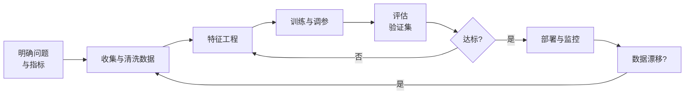

# Machine Learning in a Nutshell

> 中文简称：机器学习速览

> **一句话理解**: 30 分钟搞懂机器学习是什么、有哪三种学法、拿到数据后按什么步骤做、新手最容易在哪里翻车。

---

## 机器学习是什么

传统编程是人写规则、机器执行；机器学习是**人给数据和答案、机器自己找规则**。用形式化的话说：从数据中学习一个函数 `f`，使得 `f(x)` 对新样本 `x` 也能给出正确预测。

---

## 三大范式

### 1. 监督学习（有标签）

数据带标准答案，模型学习输入到输出的映射。占工业界应用的大头：

- **分类**：垃圾邮件识别、疾病诊断 → 详见 [[概念/Math/supervised-learning|监督学习概念卡]]
- **回归**：房价预测、销量预估

### 2. 无监督学习（无标签）

没有标准答案，让模型自己发现数据结构：

- **聚类**：用户分群
- **降维**：压缩特征、可视化 → 详见 [[概念/Math/unsupervised-learning|无监督学习概念卡]]

### 3. 强化学习（试错学习）

智能体通过与环境交互、依据奖励信号学习策略，是机器人、游戏 AI 和大模型对齐（RLHF）的基础。

> 补充第三种常见组合：**集成学习**——把多个弱模型组合成强模型（随机森林、XGBoost），是表格数据竞赛与生产系统的常胜将军，见 [[概念/Math/ensemble-learning|集成学习概念卡]]。

---

## 标准工作流

一条新手最容易忽略的判断：**80% 的效果差异来自数据质量与特征，而不是模型选择**。

---

## 模型选型速查

| 场景 | 首选模型 | 理由 |
|------|---------|------|
| 表格数据、中小规模 | XGBoost / LightGBM | 精度高、训练快、可解释性好 |
| 图像 | CNN / ViT | 归纳偏置匹配 |
| 文本 | Transformer 系 | 上下文建模能力强 |
| 推荐系统 | 双塔 + 精排 | 召回与排序解耦 |
| 一切 Starting Point | 线性 / 逻辑回归 | 先建基线再谈复杂度 |

---

## 新手常见陷阱

1. **数据泄漏**：用包含未来信息或标签衍生出的特征训练，离线指标虚高，上线即崩；
2. **只看准确率**：类别不平衡时准确率没有意义，改看精确率 / 召回率 / AUC；
3. **忘记留出测试集**：在测试集上反复调参等于把它用成了训练集；
4. **忽视分布漂移**：上线后不监控输入分布，模型静默失效。

---

## 下一步学习

- 系统学习：[[02_机器学习/README|02_机器学习章节]] 的子目录路线（基础 → 监督 → 无监督 → 集成 → 评估）
- 数学补课：线性代数、概率统计的最小必要集，见 [[01_数学基础/README|01_数学基础章节]]
- 进入大模型时代：[[00_入门/README|00_入门章节]] 提供从机器学习到 LLM 的衔接路径

---

## 关联

- [[概念/Math/supervised-learning|监督学习]] — 三大范式之首
- [[概念/Math/ensemble-learning|集成学习]] — 表格数据的实用王者
- [[02_机器学习/README|02_机器学习]] — 本领域完整知识地图

---

*Last updated: 2026-09-04*
