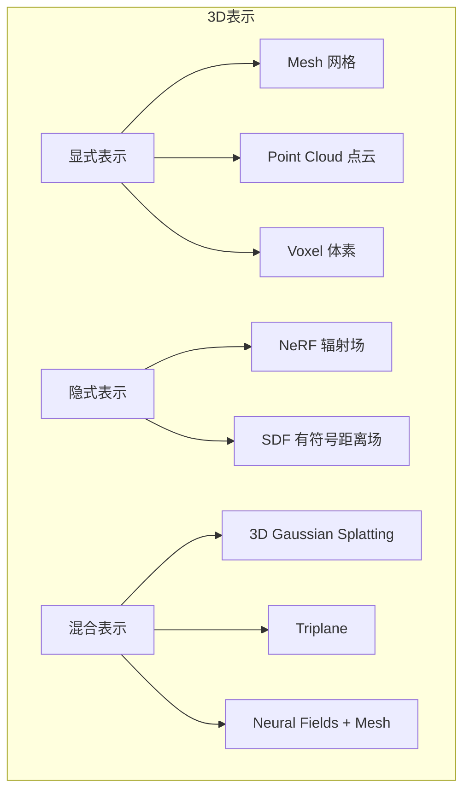

# 3D生成技术深度解析 (2026)

> 中文简称：3D生成技术深度解析

> **一句话秒懂**: 3D生成技术让AI从一张图片或一段文字直接创建三维模型——从TripoSR的0.3秒单图重建到4D动态场景生成，3D内容创作正进入"人人都是3D艺术家"的时代。

---

## 目录

- [概述](#概述)
- [核心架构与原理](#核心架构与原理)
- [NeRF到3D Gaussian Splatting的演进](#nerf到3d-gaussian-splatting的演进)
- [代表模型对比](#代表模型对比)
- [文本到3D生成](#文本到3d生成)
- [图像到3D生成](#图像到3d生成)
- [3D资产生成Pipeline](#3d资产生成pipeline)
- [实践指南](#实践指南)
- [应用场景](#应用场景)
- [2026前沿](#2026前沿)
- [相关概念](#相关概念)

---

## 概述

### 为什么3D生成是2024-2026最热门的CV方向？

```
传统3D内容创作:
- 专业建模师: 数天~数周/模型
- 工具门槛: Blender/Maya/3ds Max
- 成本: 游戏角色 $500-$5000/个

AI 3D生成 (2026):
- 输入: 一张图片 / 一段文字
- 输出: 可用的3D资产 (Mesh/3DGS/NeRF)
- 时间: 0.3秒 ~ 5分钟
- 门槛: 零门槛
```

### 技术演进时间线

```
2020: NeRF (神经辐射场) — 新视角合成的革命
  ↓
2022: DreamFusion — 文本到3D (SDS Loss)
  ↓
2023.08: 3D Gaussian Splatting — 实时渲染
  ↓
2023.10: Zero123++ — 单图多视角生成
  ↓
2024.02: LRM (Large Reconstruction Model) — Transformer重建
  ↓
2024.03: TripoSR — 0.3秒单图到3D
  ↓
2024.04: InstantMesh — 高质量即时重建
  ↓
2024.06: TRELLIS / Hunyuan3D — 工业级3D生成
  ↓
2025: 4D生成 / 场景级生成 / 可编辑3D
  ↓
2026: 原生3D大模型 / 物理仿真融合 / 实时交互生成
```

### 核心挑战

| 挑战 | 描述 | 当前解决方案 |
|------|------|-------------|
| 多视角一致性 | 生成不同视角时保持3D一致 | 多视角扩散模型、3D-aware生成 |
| 几何精度 | 细节几何的准确重建 | 高分辨率Triplane、SDF约束 |
| 纹理质量 | 生成高质量PBR纹理 | 纹理扩散模型、UV展开优化 |
| 速度vs质量 | 快速生成与高质量矛盾 | 级联生成、蒸馏加速 |
| 可编辑性 | 生成后可编辑调整 | 部件化表示、语义分割 |

---

## 核心架构与原理

### 3D表示方法对比



### 主流3D生成范式

#### 范式一: 优化式 (Optimization-based)

```
代表: DreamFusion, Magic3D, ProlificDreamer

流程:
Text Prompt → Diffusion Model (2D先验)
                    ↓ SDS Loss
        3D表示 (NeRF/3DGS) ← 梯度优化
                    ↓
            渲染多视角图像
                    ↓
        与Diffusion预测对比 → 更新3D表示

优点: 质量高、可控性强
缺点: 慢 (5-30分钟)、Janus问题(多面神)
```

#### 范式二: 前馈式 (Feed-forward)

```
代表: LRM, TripoSR, InstantMesh, Zero123++

流程:
Input Image → Multi-view Generation (可选)
                    ↓
        Transformer/UNet 编码器
                    ↓
        Triplane / 3DGS / Mesh 解码器
                    ↓
            3D输出 (一次前向传播)

优点: 极快 (0.3s-10s)、可批量处理
缺点: 泛化能力受训练数据限制
```

#### 范式三: 混合式 (Hybrid)

```
代表: Magic123, Wonder3D, Hunyuan3D 2.0

流程:
Stage 1: 前馈网络 → 粗糙3D (快速初始化)
Stage 2: SDS/扩散优化 → 精细化 (质量提升)
Stage 3: 纹理生成 → PBR材质

优点: 兼顾速度与质量
缺点: Pipeline复杂
```

### Triplane表示详解

```
Triplane = 3个正交平面的特征图

        XY平面 (俯视)
        ┌─────────┐
        │  F_xy   │
        └─────────┘
             ×
        XZ平面 (正视)     YZ平面 (侧视)
        ┌─────────┐      ┌─────────┐
        │  F_xz   │      │  F_yz   │
        └─────────┘      └─────────┘

查询点 p=(x,y,z):
  feature = F_xy(x,y) + F_xz(x,z) + F_yz(y,z)

优势:
- 内存: O(3×H×W) vs O(H×W×D) 体素
- 连续: 双线性插值查询任意点
- 高效: 与Transformer天然兼容
```

### LRM (Large Reconstruction Model) 架构

```
Input Image (256×256)
       ↓
DINOv2 / CLIP 图像编码器
       ↓
Image Tokens (256 tokens)
       ↓
┌─────────────────────────┐
│  Transformer Decoder    │
│  (Cross-Attention)      │
│  可学习Triplane Queries │
│  (3×32×32 = 3072)      │
└─────────────────────────┘
       ↓
Triplane Features (3×32×32×C)
       ↓
┌─────────────────────────┐
│  NeRF/3DGS Decoder     │
│  体渲染 / 点云输出      │
└─────────────────────────┘
       ↓
3D Output (Mesh / 3DGS / Radiance Field)
```

---

## NeRF到3D Gaussian Splatting的演进

### NeRF (Neural Radiance Fields) 回顾

```
NeRF核心思想:
- 用MLP隐式表示场景: F(x,y,z,θ,φ) → (color, density)
- 体渲染: C(r) = ∫ T(t)·σ(r(t))·c(r(t),d) dt
- 训练: 多视角图像 → 光度损失优化MLP

局限:
✗ 训练慢: 数小时/场景
✗ 渲染慢: 秒级/帧 (需密集采样)
✗ 不易编辑: 隐式表示难以局部修改
✗ 不易生成: 优化范式难以泛化
```

### 3D Gaussian Splatting (3DGS) 革命

```
3DGS核心思想 (2023.08, INRIA):
- 用3D高斯椭球显式表示场景
- 每个高斯: {μ(位置), Σ(协方差), α(不透明度), SH(颜色)}
- 可微光栅化: 实时渲染 (>100 FPS)
- 训练: 从SfM点云初始化 → 梯度优化

优势 vs NeRF:
✓ 实时渲染: 100+ FPS (vs NeRF ~1 FPS)
✓ 训练快: 分钟级 (vs NeRF 小时级)
✓ 显式表示: 易于编辑、组合、生成
✓ 质量: 同等或更优的新视角合成
```

### 3DGS在生成中的应用

```
3DGS作为生成输出表示:

1. 直接生成3DGS:
   - 输入图像 → 预测高斯参数 (μ, Σ, α, color)
   - 代表: LGM, GS-LRM, Splatter Image

2. 3DGS + Mesh提取:
   - 3DGS → TSDF融合 → Marching Cubes → Mesh
   - 代表: 2DGS, SuGaR, GOF

3. 3DGS作为优化中间表示:
   - 文本/图像 → 初始化3DGS → SDS优化 → Mesh
   - 代表: DreamGaussian, GaussianDreamer
```

### DreamGaussian: 3DGS + 生成

```
DreamGaussian Pipeline:
1. 输入: 单张图像 / 文本
2. 初始化: 稀疏3DGS (从图像轮廓)
3. 优化: SDS Loss + 3DGS可微渲染
4. 加速: 仅需2分钟 (vs DreamFusion 1.5小时)
5. 后处理: 3DGS → Mesh提取 → 纹理烘焙

关键创新:
- 将3DGS引入text-to-3D优化
- 渐进式密度控制 (高斯分裂/克隆)
- 纹理 refinement 阶段
```

---

## 代表模型对比

### 图像到3D模型对比

| 模型 | 时间 | 输入 | 输出 | 速度 | 质量 | 开源 | 核心方法 |
|------|------|------|------|------|------|------|----------|
| **TripoSR** | 2024.03 | 单图 | Mesh/NeRF | 0.3s | ★★★☆ | ✓ | LRM变体+Triplane |
| **LRM** | 2024.02 | 单图 | NeRF | 5s | ★★★☆ | ✓ | Transformer+Triplane |
| **InstantMesh** | 2024.04 | 单图 | Mesh/3DGS | 10s | ★★★★ | ✓ | 多视角+LRM |
| **Zero123++** | 2023.10 | 单图 | 6视角图 | 3s | ★★★★ | ✓ | 多视角扩散 |
| **Wonder3D** | 2023.10 | 单图 | Mesh | 30s | ★★★★ | ✓ | 多视角+法线 |
| **LGM** | 2024.02 | 4视角 | 3DGS | 5s | ★★★★ | ✓ | 高斯生成 |
| **GS-LRM** | 2024.04 | 多视角 | 3DGS | 1s | ★★★★★ | ✓ | Transformer+3DGS |
| **Hunyuan3D 2.0** | 2025.01 | 单图/文本 | Mesh+PBR | 60s | ★★★★★ | ✓ | 级联生成 |
| **TRELLIS** | 2024.12 | 单图/文本 | 3DGS/Mesh | 15s | ★★★★★ | ✓ | SLAT表示 |

### 文本到3D模型对比

| 模型 | 时间 | 方法 | 速度 | 质量 | 多面神问题 |
|------|------|------|------|------|-----------|
| **DreamFusion** | 2022.10 | SDS+NeRF | 1.5h | ★★★ | 严重 |
| **Magic3D** | 2022.11 | 粗到细+DMTet | 40min | ★★★★ | 中等 |
| **ProlificDreamer** | 2023.05 | VSD+NeRF | 30min | ★★★★ | 轻微 |
| **DreamGaussian** | 2023.09 | SDS+3DGS | 2min | ★★★☆ | 中等 |
| **Shap-E** | 2023.05 | 隐式场扩散 | 20s | ★★★ | 无 |
| **Point-E** | 2022.12 | 点云扩散 | 60s | ★★☆ | 无 |
| **MeshGPT** | 2023.11 | 自回归Mesh | 30s | ★★★☆ | 无 |
| **Hunyuan3D** | 2025.01 | 多阶段 | 60s | ★★★★★ | 无 |

### 多视角生成模型对比

| 模型 | 视角数 | 分辨率 | 一致性 | 速度 | 用途 |
|------|--------|--------|--------|------|------|
| **Zero123++** | 6 | 320×320 | ★★★★ | 3s | 多视角输入 |
| **Wonder3D** | 6+法线 | 256×256 | ★★★★ | 5s | 高质量重建 |
| **Era3D** | 6 | 512×512 | ★★★★★ | 5s | 高分辨率 |
| **SV3D** | 21 | 576×576 | ★★★★★ | 15s | 视频轨道 |
| **CRM** | 6 | 256×256 | ★★★★ | 2s | 快速重建 |
| **Stable Zero123** | 1 | 256×256 | ★★★ | 1s | 新视角 |

---

## 文本到3D生成

### SDS Loss (Score Distillation Sampling)

```
核心思想: 用2D扩散模型的"知识"指导3D生成

数学表达:
∇_θ L_SDS = E[ε_φ(x_t; y, t) - ε] · ∂x/∂θ

其中:
- θ: 3D表示参数
- x = g(θ, c): 从3D表示渲染的2D图像
- ε_φ: 扩散模型预测的噪声
- y: 文本条件
- t: 时间步

直觉: "让3D渲染出的图像看起来像扩散模型认为应该的样子"
```

### SDS的改进变体

| 变体 | 改进点 | 效果 |
|------|--------|------|
| VSD (Variational Score Distillation) | 变分下界 | 更丰富纹理 |
| CSD (Compositional SDS) | 组合式分解 | 减少过饱和 |
| ISM (Interval Score Matching) | 区间匹配 | 更稳定训练 |
| NFSD (Negative-prompt Free SDS) | 无需负提示 | 简化流程 |
| ProlificDreamer VSD | 粒子变分 | 高质量细节 |

### Janus问题 (多面神问题)

```
问题描述:
文本 "a cat" → 生成的3D猫有多张脸

原因:
- 扩散模型对"正面"有偏好 (训练数据偏差)
- SDS在所有视角施加相同的文本条件
- 3D优化时各视角竞争"正面"朝向

解决方案:
1. 视角感知文本: "a cat, front view" / "side view"
2. 多视角扩散: Zero123++先生成一致多视角
3. 几何引导: 法线/深度约束
4. 参考图像: 用图像条件替代纯文本
5. 3D-aware扩散: 直接在3D空间做扩散
```

---

## 图像到3D生成

### 单图3D重建Pipeline

```
典型Pipeline (2026最佳实践):

Input Image
    ↓
[Stage 1] 多视角生成
    Zero123++ / SV3D / Era3D
    → 6-21个视角图像
    ↓
[Stage 2] 3D重建
    InstantMesh / GS-LRM / LGM
    → 3DGS / Mesh
    ↓
[Stage 3] 精细化 (可选)
    纹理超分 / 几何细化 / PBR材质
    ↓
Output: GLB/OBJ/FBX + 纹理贴图
```

### TripoSR 技术细节

```
架构: 基于LRM改进

输入: 单张RGB图像 (256×256)
编码器: DINOv2 ViT-L/14
    → 256 image tokens (1024-dim)

解码器: Transformer (12层)
    → Triplane queries (3×32×32)
    → Cross-attention with image tokens

输出头:
    → NeRF: 密度 + 颜色 (体渲染)
    → Mesh: Marching Cubes提取

速度: 0.3秒 (单张A100)
训练: Objaverse-XL (800K 3D模型)
```

### InstantMesh 技术细节

```
创新: 多视角扩散 + 稀疏视图重建

Pipeline:
1. 多视角生成:
   - 基于Zero123++改进的扩散模型
   - 生成4个正交视角 (前/后/左/右)
   - 内置相机姿态控制

2. 稀疏视图重建:
   - 输入: 4视角图像 + 相机参数
   - 双分支: 图像特征 + 几何特征
   - 输出: 3DGS (带颜色+几何)

3. Mesh提取:
   - 3DGS → TSDF → Marching Cubes
   - 纹理烘焙到UV

质量关键: 多视角一致性保证几何正确性
```

---

## 3D资产生成Pipeline

### 工业级Pipeline (2026)

```
┌─────────────────────────────────────────────────┐
│           3D资产生成完整Pipeline                  │
├─────────────────────────────────────────────────┤
│                                                 │
│  1. 概念生成                                     │
│     Text/Reference → 多视角概念图                 │
│     (Stable Diffusion / FLUX + ControlNet)      │
│                                                 │
│  2. 3D重建                                      │
│     多视角图 → 3DGS/Mesh                        │
│     (InstantMesh / TRELLIS / Hunyuan3D)         │
│                                                 │
│  3. 几何优化                                     │
│     Mesh清理 → 重拓扑 → 细节雕刻                 │
│     (InstantMeshes / 自动重拓扑)                  │
│                                                 │
│  4. UV展开                                      │
│     自动UV → 接缝优化 → 利用率最大化              │
│     (Xatlas / UVPackMaster)                     │
│                                                 │
│  5. 纹理生成                                     │
│     PBR纹理: Albedo + Normal + Roughness + AO   │
│     (Texture Diffusion / Hunyuan3D-Paint)       │
│                                                 │
│  6. 绑定与动画 (角色)                            │
│     自动骨骼 → 蒙皮权重 → 动画重定向              │
│     (Mixamo / Rigify / 4D生成)                   │
│                                                 │
│  7. 格式导出                                     │
│     GLB / FBX / USD / OBJ                      │
│     (适配游戏引擎/影视/电商)                      │
│                                                 │
└─────────────────────────────────────────────────┘
```

### 质量评估指标

| 指标 | 描述 | 计算方法 |
|------|------|----------|
| FID | 生成质量 | 渲染图 vs 真实图分布距离 |
| CLIP Score | 文本-3D对齐 | 渲染图与文本的CLIP相似度 |
| Chamfer Distance | 几何精度 | 点云间双向最近邻距离 |
| F-Score | 重建完整度 | 阈值内的精度-召回率调和 |
| LPIPS | 感知质量 | 多视角渲染的感知相似度 |
| 用户偏好 | 主观质量 | A/B测试人类评分 |

---

## 实践指南

### 快速开始: TripoSR

```python
# 安装
# pip install triposr

import torch
from triposr import TripoSRModel
from PIL import Image

# 加载模型
model = TripoSRModel.from_pretrained("stabilityai/TripoSR")
model.eval().cuda()

# 单图重建
image = Image.open("input.png").resize((256, 256))
with torch.no_grad():
    mesh = model.reconstruct(image, resolution=256)

# 导出
mesh.export("output.glb")
```

### 高质量重建: InstantMesh

```python
# 使用Hugging Face Diffusers
from diffusers import StableZero123Pipeline
import torch

# Stage 1: 多视角生成
pipe = StableZero123Pipeline.from_pretrained(
    "stabilityai/stable-zero123-diffusers"
).to("cuda")

# 生成多视角
images = pipe(
    image=input_image,
    num_inference_steps=50,
    guidance_scale=4.0,
).images

# Stage 2: 3D重建 (使用InstantMesh)
# 输入多视角图像 → 输出3DGS/Mesh
```

### 文本到3D: DreamGaussian

```bash
# 克隆仓库
git clone https://github.com/dreamgaussian/dreamgaussian
cd dreamgaussian

# 文本到3D
python main.py --config configs/text.yaml \
    prompt="a DSLR photo of a corgi" \
    save_path=output/corgi

# 图像到3D
python main.py --config configs/image.yaml \
    input=image.png \
    save_path=output/model
```

### 硬件需求

| 任务 | 最低GPU | 推荐GPU | 显存需求 | 时间 |
|------|---------|---------|----------|------|
| TripoSR推理 | RTX 3060 | A100 | 8GB | 0.3s |
| InstantMesh | RTX 3090 | A100 | 16GB | 10s |
| DreamGaussian | RTX 3090 | A100 | 24GB | 2min |
| Hunyuan3D 2.0 | RTX 4090 | A100×2 | 32GB | 60s |
| 3DGS训练 | RTX 3090 | A100 | 12GB | 5-30min |
| TRELLIS | RTX 4090 | A100 | 24GB | 15s |

### 常见问题与解决

| 问题 | 原因 | 解决方案 |
|------|------|----------|
| 多面神 (Janus) | 视角歧义 | 使用多视角扩散模型 |
| 几何模糊 | 分辨率不足 | 提高Triplane分辨率/级联生成 |
| 纹理过饱和 | SDS过优化 | 降低guidance scale/使用VSD |
| 背面质量差 | 单视角信息不足 | 多视角输入/背面补全 |
| Mesh有洞 | 体渲染阈值 | 调整Marching Cubes阈值 |
| 比例不正确 | 训练数据偏差 | 后处理归一化/条件控制 |

---

## 应用场景

### 游戏行业

```
应用:
- NPC/道具快速原型: 概念图 → 3D模型 (分钟级)
- 场景填充: 批量生成背景资产
- 独立游戏: 零美术团队也能产出3D内容
- LOD生成: 高精度 → 自动生成多级LOD

工具链:
概念图(Midjourney) → 3D生成(TripoSR) → 重拓扑 → 导入Unity/UE5

效率提升: 10-100x vs 传统建模
```

### 影视/动画

```
应用:
- 预可视化 (Pre-viz): 快速生成场景/角色预览
- 背景资产: 大量非主角资产自动生成
- 特效辅助: 粒子/碎片/环境元素
- 虚拟制片: 实时3D场景生成

质量要求: 影视级 (需人工精修)
当前定位: 辅助工具, 非完全替代
```

### 电商/AR

```
应用:
- 商品3D化: 商品照片 → 3D模型 → AR试穿/试摆
- 虚拟展厅: 自动生成3D展示
- 3D广告: 产品360°旋转展示
- 数字孪生: 实物 → 数字3D副本

代表平台:
- 淘宝3D购物
- IKEA Place (AR家具)
- Shopify 3D/AR

关键需求: 快速、批量、尺寸准确
```

### 3D打印/制造

```
应用:
- 概念模型快速验证
- 定制化产品 (珠宝/鞋类)
- 教育模型生成
- 建筑/城市规划可视化

约束: 需要水密Mesh (watertight)
后处理: 壁厚检查、支撑结构生成
```

---

## 2026前沿

### 4D生成 (动态3D)

```
4D = 3D + 时间维度

代表工作:
- 4D Gaussian Splatting: 动态场景的时空高斯表示
- Animate124: 单图 → 4D动画
- SC4D: 文本 → 4D场景
- DreamGaussian4D: 4D版DreamGaussian

技术路线:
1. 视频 → 4D: 从多视角视频重建动态3D
2. 文本 → 4D: 文本直接生成动态3D
3. 图像 → 4D: 单图预测运动+3D

应用: 动画、游戏NPC动作、虚拟人
```

### 场景级3D生成

```
从单物体 → 完整场景:

代表工作:
- SceneDreamer: 文本 → 无限场景
- InfiniCube: 可驾驶3D场景生成
- SceneWiz3D: 组合式场景生成
- CityDreamer: 城市级3D生成

挑战:
- 物体间关系/布局
- 尺度一致性
- 可导航性
- 大范围连贯性
```

### 原生3D大模型

```
2026趋势: 从"2D先验+3D优化" → "原生3D理解"

特征:
- 3D Token: 直接在3D空间定义token
- 3D预训练: 大规模3D数据预训练
- 统一表示: 一个模型处理多种3D任务
- 多模态: 文本/图像/3D/4D统一

代表:
- Michelangelo: 3D-文本对齐预训练
- 3D-LLM: 3D大语言模型
- Point-Bind: 统一3D表示
- TRELLIS: 结构化3D潜空间
```

### 物理仿真融合

```
趋势: 生成的3D不仅是"看起来对"，还要"物理上对"

方向:
- 物理属性预测: 质量、摩擦、弹性
- 可仿真Mesh: 适合FEM/刚体仿真
- 关节预测: 自动识别可动部件
- 交互预测: 物体如何被操作

应用:
- 机器人训练 (Sim-to-Real)
- 游戏物理引擎
- 工程仿真
```

### 可编辑3D生成

```
从"生成即固定" → "生成后可编辑":

方向:
1. 部件化生成: 分部件生成，支持拆解/替换
2. 文本编辑: "把轮子变大" → 局部修改
3. 风格迁移: 保持几何，改变风格
4. 参数化: 生成参数化模型，滑块调节

代表:
- PartNeRF: 部件化神经表示
- GaussCtrl: 可控3DGS编辑
- Instruct-NeRF2NeRF: 指令编辑
```

### 产业格局 (2026)

| 公司/产品 | 定位 | 技术特点 |
|-----------|------|----------|
| **Tripo (VAST)** | 3D生成API | 极速、高质量、API服务 |
| **Meshy** | 消费级3D生成 | 文本/图像到3D、纹理生成 |
| **CSM (Common Sense Machines)** | 3D资产平台 | 游戏级资产生成 |
| **Luma AI** | 3D扫描+生成 | Genie文本到3D |
| **Tencent Hunyuan3D** | 开源3D生成 | 高质量、PBR纹理 |
| **Stability AI** | 开源基础模型 | TripoSR/SV3D |
| **Rodin (Deemos)** | 数字人3D | 高精度人脸/人体 |
| **Kaedim** | 游戏资产 | 2D到3D游戏资产 |

---

## 相关概念

### 本知识库相关页面

- [[概念/Vision/3d-vision]] - 3D计算机视觉基础
- [[04_计算机视觉/06_生成模型/01_扩散_模型_深入分析]] - 扩散模型原理 (SDS Loss的基础)
- [[概念/Vision/clip]] - CLIP多模态对齐 (文本-3D对齐)
- [[04_计算机视觉/01_CV基础/05_ViT_深入分析]] - Vision Transformer (LRM的骨干网络)
- [[概念/Vision/generative-vision-models]] - 生成模型总览
- [[概念/Vision/video-generation]] - 视频生成 (4D生成的相关技术)
- [[HF_Diffusers_Practical_Guide]] - Diffusers实践 (多视角生成)
- [[概念/Vision/image-segmentation]] - 图像分割 (3D语义分割)
- [[概念/Vision/object-detection]] - 目标检测 (3D检测)

### 关键术语表

| 术语 | 英文 | 含义 |
|------|------|------|
| 神经辐射场 | Neural Radiance Field (NeRF) | 用神经网络隐式表示3D场景 |
| 3D高斯泼溅 | 3D Gaussian Splatting | 用高斯椭球显式表示3D场景 |
| 分数蒸馏 | Score Distillation Sampling (SDS) | 用2D扩散先验指导3D生成 |
| 三平面 | Triplane | 3个正交特征平面表示3D |
| 体渲染 | Volume Rendering | 沿射线积分计算像素颜色 |
| 光栅化 | Rasterization | 将3D投影到2D像素 |
| 多视角一致性 | Multi-view Consistency | 不同视角的3D一致性 |
| 多面神问题 | Janus Problem | 文本到3D的多脸问题 |
| PBR纹理 | Physically Based Rendering | 基于物理的渲染材质 |
| 重拓扑 | Retopology | 优化Mesh的拓扑结构 |

---

## 参考资源

### 论文

- TripoSR: Fast 3D Object Reconstruction from a Single Image (2024)
- LRM: Large Reconstruction Model for Single Image to 3D (2024)
- 3D Gaussian Splatting for Real-Time Radiance Field Rendering (2023)
- DreamFusion: Text-to-3D using 2D Diffusion (2022)
- Zero123++: a Single Image to Consistent Multi-view Diffusion (2023)
- InstantMesh: Efficient 3D Mesh Generation (2024)
- TRELLIS: Structured 3D Latents for Scalable 3D Generation (2024)

### 开源项目

- TripoSR: github.com/VAST-AI-Research/TripoSR
- InstantMesh: github.com/TencentARC/InstantMesh
- DreamGaussian: github.com/dreamgaussian/dreamgaussian
- 3DGS: github.com/graphdeco-inria/gaussian-splatting
- Hunyuan3D: github.com/Tencent/Hunyuan3D-2

---

> **总结**: 3D生成技术从2022年的DreamFusion到2026年的原生3D大模型，经历了从优化式到前馈式、从单物体到场景级、从静态到4D的三次跃迁。2026年的核心趋势是: 更快(实时)、更好(工业级质量)、更可控(可编辑)、更通用(统一模型)。对于从业者，掌握3DGS表示+多视角扩散+前馈重建三大核心能力，即可覆盖90%的3D生成任务。
