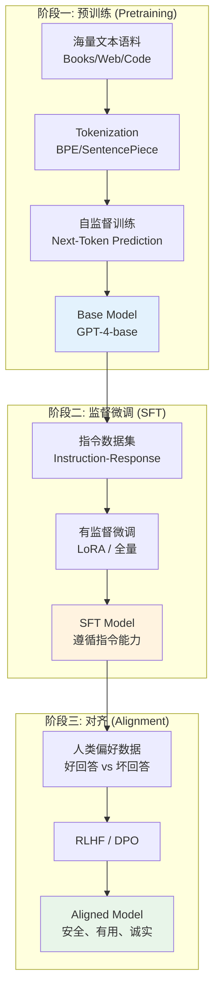
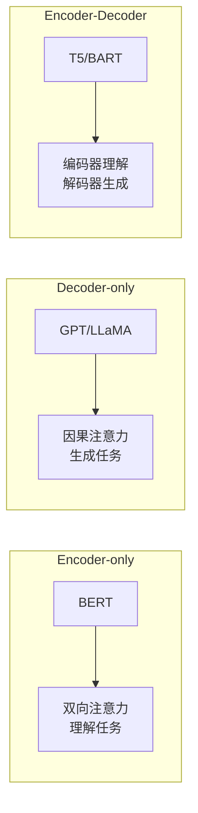
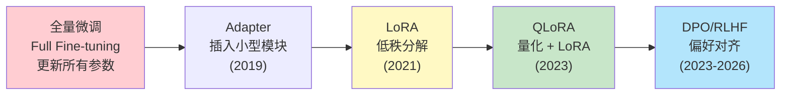

# 大语言模型基础 (LLM Fundamentals)

> 中文简称：大语言模型基础

> **一句话理解**: 大语言模型 (LLM) = Transformer 架构 + 海量文本预训练 + 人类反馈对齐——它不"理解"语言，但通过预测下一个 token 的概率分布，涌现出了翻译、推理、编程等惊人能力。

---

## TL;DR

- **LLM 本质**: 基于 Transformer Decoder 的自回归语言模型，核心任务是 next-token prediction
- **三阶段流水线**: Pretraining → SFT (Supervised Fine-Tuning) → RLHF/DPO (人类偏好对齐)
- **关键架构**: GPT 系列 (Decoder-only)、BERT (Encoder-only)、T5 (Encoder-Decoder)
- **Scaling Laws**: 参数量、数据量、计算量三者与性能的幂律关系
- **推理优化**: KV Cache、量化 (INT4/INT8)、Speculative Decoding、PagedAttention
- **上下文窗口**: 从 2K (GPT-3) 到 1M+ (Gemini)，长上下文成为核心竞争力
- **微调范式**: 全量微调 → LoRA → QLoRA，参数高效微调降低门槛

---

## 本章节索引

本文是 LLM 领域的总入口，向下链接四个核心子模块：

| 子模块 | 核心内容 | 链接 |
|--------|---------|------|
| **Transformer 革命** | Self-Attention、位置编码、架构详解 | [[05_大模型/03_Transformer架构/03_Transformer_Revolution]] |
| **LLM 架构生态** | GPT、LLaMA、Claude、Gemini 等模型对比 | [[05_大模型/04_LLM架构/05_LLM架构]] |
| **Prompt Engineering** | Zero-shot、Few-shot、CoT、系统提示词 | [[05_大模型/07_提示工程/16_Prompt工程]] |
| **微调技术** | LoRA、QLoRA、RLHF、DPO | [[05_大模型/06_微调技术/03_微调技术]] |

---

## 1. 什么是大语言模型 (What is an LLM)

大语言模型是参数量达到数十亿至数万亿级别的 Transformer 模型，通过在海量文本上进行自监督预训练，学习语言的统计规律和世界知识。

**核心能力涌现**：
- **In-context Learning**: 无需更新参数，仅通过 prompt 中的示例即可学习新任务
- **Chain-of-Thought**: 逐步推理，显著提升数学和逻辑能力
- **代码生成**: 从自然语言描述生成可执行代码
- **多语言能力**: 跨语言理解与翻译

### 1.1 LLM 的规模与能力关系

```
Scaling Laws (Chinchilla, 2022):

模型性能 (Loss) ∝ N^(-α) · D^(-β) · C^(-γ)

其中:
├── N = 参数量 (Parameters)
├── D = 训练数据量 (Tokens)
├── C = 计算量 (FLOPs)
└── α, β, γ 为经验常数

关键发现:
├── 数据与参数应同步扩展 (20 tokens/param)
├── 过小模型 + 过多数据 = 欠拟合
├── 过大模型 + 过少数据 = 过拟合
└── 最优分配需要三者平衡
```

---

## 2. LLM 生命周期 (Lifecycle)



### 2.1 各阶段关键参数

| 阶段 | 数据规模 | 计算量 | 训练时长 | 输出 |
|------|---------|--------|---------|------|
| **Pretraining** | 1-15T tokens | 10²⁴ FLOPs | 数周~数月 | Base Model |
| **SFT** | 10K-1M 样本 | 10²⁰ FLOPs | 数小时~数天 | Instruction Model |
| **RLHF/DPO** | 10K-100K 偏好对 | 10¹⁹ FLOPs | 数小时 | Aligned Model |

---

## 3. 关键架构对比 (Key Architectures)



| 架构类型 | 注意力机制 | 代表模型 | 优势 | 典型任务 |
|---------|-----------|---------|------|---------|
| **Encoder-only** | 双向 (Bidirectional) | BERT, RoBERTa | 深层语义理解 | 分类、NER、检索 |
| **Decoder-only** | 因果 (Causal) | GPT-4, LLaMA, Claude | 自回归生成、In-context Learning | 对话、创作、推理 |
| **Encoder-Decoder** | 交叉注意力 | T5, BART, FLAN-T5 | 序列到序列 | 翻译、摘要、问答 |

**2026 现状**: Decoder-only 架构已成为 LLM 的绝对主流，因其 Scaling Laws 表现最优且 In-context Learning 能力最强。

---

## 4. 推理优化 (Inference Optimization)

LLM 推理的核心瓶颈是**内存带宽**而非算力——每次生成一个 token 都需要加载整个模型权重。

| 优化技术 | 原理 | 加速比 | 适用场景 |
|---------|------|--------|---------|
| **KV Cache** | 缓存已计算的 Key/Value 向量 | 避免重复计算 | 所有自回归生成 |
| **量化 (Quantization)** | FP16→INT8→INT4 降低精度 | 2-4x 内存节省 | 边缘部署、消费级 GPU |
| **Speculative Decoding** | 小模型草稿 + 大模型验证 | 2-3x 生成加速 | 高吞吐服务 |
| **PagedAttention** | 分页管理 KV Cache | 4x 吞吐提升 | vLLM 等推理引擎 |
| **Continuous Batching** | 动态批处理请求 | 高利用率 | 在线服务 |
| **Flash Attention** | IO 感知注意力计算 | 2-4x 注意力加速 | 训练 + 推理 |

---

## 5. 微调范式演进 (Fine-tuning Evolution)



| 方法 | 可训练参数 | GPU 需求 (7B) | 性能 | 使用场景 |
|------|-----------|--------------|------|---------|
| **Full FT** | 100% | 8×A100 80G | 最佳 | 大规模定制 |
| **LoRA** | <1% | 1×A100 80G | 接近全量 | 通用微调 |
| **QLoRA** | <1% | 1×RTX 4090 24G | 接近 LoRA | 消费级 GPU |
| **Prefix Tuning** | <0.1% | 1×V100 | 略差 | 轻量适配 |

---

## 延伸阅读 (Further Reading)

- [[05_大模型/03_Transformer架构/03_Transformer_Revolution]] — Transformer 架构革命
- [[05_大模型/04_LLM架构/05_LLM架构]] — 主流 LLM 架构生态
- [[05_大模型/07_提示工程/16_Prompt工程]] — 提示词工程实战
- [[05_大模型/06_微调技术/03_微调技术]] — 微调技术全景
- [[05_大模型/04_LLM架构/11_Long_上下文_模型_2026]] — 长上下文模型 2026
- [[05_大模型/01_LLM基础/02_GenAI_第2课_Exploring_and_Comparing_LLMs]] — LLM 对比与选型
- [[05_大模型/01_LLM基础/06_LLM_NLP_融合|LLM 与 NLP 融合]]
- [[05_大模型/01_LLM基础/07_NLP_基础|NLP 基础]]

## 版本兼容性

| 组件 | 版本 | 特性 | 备注 |
|------|------|------|------|
| HuggingFace | 4.40+ | 统一模型接口 | transformers |
| vLLM | 0.5+ | 推理优化 | PagedAttention |
| PyTorch | 2.3+ | 深度学习框架 | CUDA 12.x |
| DeepSpeed | 0.14+ | 分布式训练 | ZeRO |
| PEFT | 0.10+ | 参数高效微调 | LoRA/DoRA |

## 常见问题

| 问题 | 原因 | 解决方案 |
|------|------|------|
| 显存不足 | 模型太大 | 量化 + LoRA |
| 推理慢 | 自回归生成 | Speculative Decoding |
| 幻觉 | 知识截止 | RAG + 事实核查 |
| 中文效果差 | 训练数据偏英文 | 使用中文优化模型 |

## 生产检查清单

1. ✅ 确认任务需求和性能要求
2. ✅ 选择合适的模型（规模/架构）
3. ✅ 实现推理优化（量化/KV Cache）
4. ✅ 使用 vLLM 或 TGI 部署
5. ✅ 实现 RAG 增强知识
6. ✅ 建立评估基准
7. ✅ 监控延迟和成本
8. ✅ 实现安全过滤

## 总结

大语言模型 (LLM) = Transformer 架构 + 海量文本预训练 + 人类反馈对齐。它不"理解"语言，但通过预测下一个 token 的概率分布，涌现出了翻译、推理、编程等惊人能力。2026 年，LLM 已进入推理模型时代，o3、DeepSeek-R1 等模型通过测试时计算扩展实现了深度思考能力。

> 💡 LLM 的核心价值：一个模型统一所有 NLP 任务——从翻译到对话到推理到代码，全部基于同一个 next-token prediction 机制。在 2026 年，LLM 已成为 AI 应用的核心基础设施。
