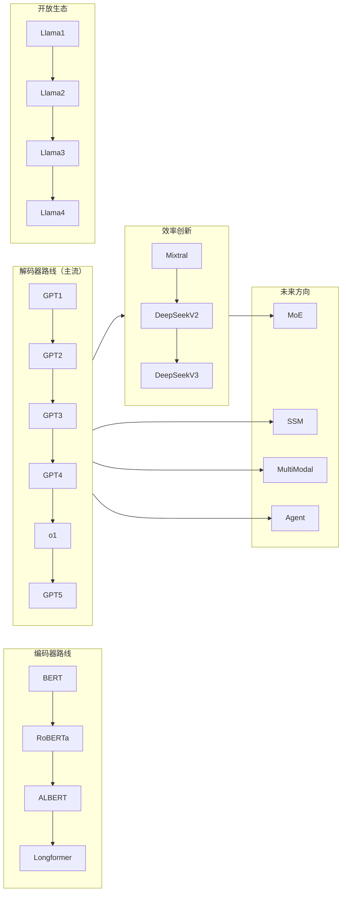

# LLM 架构演进：从 BERT 到 MoE/Mamba 与 Agent 时代

> 中文简称：LLM 架构演进：从 BERT 到 MoE/Mamba 与 Agent 时代

> **演化主线**: 编码器（双向理解）→ 解码器（自回归生成，当前主流）→ 混合架构（MoE + SSM + 多模态 + Agent）

---

## TL;DR

- **BERT 家族**: 双向编码器 + MLM 预训练，开创了"预训练-微调"范式，在理解型任务上长期统治
- **GPT 系列**: 从语言模型到通用智能，GPT-3 的少样本学习和 o1 的推理时计算扩展是两个里程碑
- **Llama**: 确立了现代 LLM 标准配方（RoPE + Pre-Norm + RMSNorm + SwiGLU + GQA），开放权重推动生态繁荣
- **DeepSeek**: MLA + 细粒度 MoE + FP8 训练，证明架构创新可大幅降低前沿训练成本
- **MoE**: 解耦模型容量与计算成本，DeepSeek-V3 671B 总参/37B 激活，每词元仅用 5.5% 参数
- **SSM/Mamba**: $O(n)$ 复杂度替代注意力 $O(n^2)$，混合架构取两者之长
- **Agent**: LLM 从"说"到"做"，ReAct + 工具调用 + MCP 标准协议

---

## 关联文档

- [[05_大模型/03_Transformer架构/04_Transformer_架构详解]] — Transformer 核心架构
- [[07_模型训练/01_训练基础/03_LLM_训练_深入分析]] — 训练技术
- [[10_部署推理/03_推理优化/02_LLM推理_深入分析]] — 推理优化
- [[05_大模型/04_LLM架构/05_LLM架构]] — LLM 架构总览
- [[05_大模型/04_LLM架构/12_MoE_Case_Studies_DeepSeek_Mixtral]] — MoE 案例分析
- [[05_大模型/08_推理模型/INDEX]] — DeepSeek-R1 技术分析

---

## 1. 编码器模型：BERT 家族

### 1.1 BERT 的核心创新

**双向预训练**: 无因果掩码的自注意力，每个位置同时利用前后文。与 GPT 的单向对比：

```
BERT: [今天] [MASK] [真] [好] → 预测"天气"（利用左右上下文）
GPT:  [今天] [天气] [真] → 预测"好"（只用左侧上下文）
```

**预训练任务**:
- **MLM**: 随机遮盖 15% 词元，用双向上下文预测
- **NSP**: 判断两句子是否相邻（RoBERTa 证明其贡献有限）

**"预训练-微调"范式**: 先在大规模无标注数据上预训练，再用少量标注数据微调。BERT 一举刷新 11 项 NLP 基准。

| 配置 | 层数 | 隐藏维度 | 注意力头 | 参数量 |
|------|------|---------|---------|-------|
| BERT-Base | 12 | 768 | 12 | 110M |
| BERT-Large | 24 | 1024 | 16 | 340M |

### 1.2 BERT 家族的演进

- **RoBERTa (2019)**: 去掉 NSP，更大 batch/更多数据/更长训练，显著提升
- **ALBERT (2019)**: 跨层参数共享 + 嵌入矩阵分解，大幅减少参数
- **Longformer / BigBird**: 局部窗口注意力 + 全局注意力，将复杂度降至 $O(n)$，支持长文档

### 1.3 适用场景与局限

**适合**: 文本分类、NER、关系抽取、阅读理解、语义相似度、[[embedding-models]]
**局限**: 不适合生成任务，最大序列 512（可学习位置编码限制），MLM 训练效率低于自回归

---

## 2. 解码器模型：GPT 与后继者

### 2.1 GPT 系列的扩展路径

| 模型 | 年份 | 参数量 | 关键突破 |
|------|------|--------|---------|
| GPT-1 | 2018 | 117M | 证明仅解码器可预训练-微调 |
| GPT-2 | 2019 | 1.5B | 零样本能力——足够大的 LM 隐式学习各种 NLP 技能 |
| GPT-3 | 2020 | 175B | 少样本学习 + 涌现能力，开启提示工程时代 |
| GPT-4 | 2023 | 未公开 | 多模态，专业考试接近人类水平 |
| o1 | 2024 | 未公开 | **推理时计算扩展**——隐式思维链 + 自适应计算分配 |
| GPT-5 | 2025 | 未公开 | 编码+推理+可调推理预算整合 |

**o1 的范式意义**: 开辟 Scaling 的第二条曲线——当预训练扩展遇到收益递减时，推理时计算扩展提供另一个维度。AIME 正确率从 GPT-4o 的 13% 跃升至 83%。

**"涌现"争议**: Schaeffer et al. (2023) 指出许多涌现可能是评测指标选择的产物——用准确率等不连续指标时"突变"，改用交叉熵等平滑指标则表现平滑提升。

### 2.2 Llama：开放权重的标准配方

Llama 确立了现代 LLM 的"标准配方"：

| 组件 | 选择 | 说明 |
|------|------|------|
| 位置编码 | RoPE | 替代可学习 PE，支持长度外推 |
| 归一化 | Pre-Norm + RMSNorm | 训练更稳定，计算更高效 |
| 激活函数 | SwiGLU | 门控 FFN，三投影矩阵 |
| 注意力 | GQA (Llama 2+) | 多 Q 头共享 KV，减小缓存 |

**版本演进**:

| 版本 | 关键特性 |
|------|---------|
| Llama 1 (2023) | 首次开放高质量 LLM 权重 |
| Llama 2 (2023) | RLHF 对齐，70B 引入 GQA |
| Llama 3 (2024) | 128K 词汇表，15T 词元训练 |
| Llama 3.1 (2024) | 405B 开放权重，128K 上下文 |
| Llama 3.2 (2024) | 多模态 + 端侧 1B/3B 模型 |
| Llama 4 (2025) | MoE 架构，Scout 10M 上下文 |

**开放生态**: 权重开放后催生数百个微调模型（Vicuna、Alpaca、Code Llama），推动 LLM 能力普惠化。

### 2.3 DeepSeek：效率创新的标杆

**DeepSeek-V2/V3 的三大创新**:

1. **MLA (Multi-head Latent Attention)**: KV 缓存压缩至 576 维隐向量（原 32768 维的 1/57），单词元缓存仅 70KB
2. **细粒度 MoE**: 256 路由专家 + 1 共享专家，每词元 Top-8，总 671B 参数仅激活 37B (5.5%)
3. **FP8 混合精度训练**: 训练运行成本不到 600 万美元

**无辅助损失路由**: 完全移除辅助损失，用动态偏置项 $b_i$ 实现负载均衡——路由器梯度不受平衡约束干扰。

**DeepSeek-R1 (2025)**:
- **R1-Zero**: 纯 RL (GRPO) 训练推理能力，无标注推理数据，自发涌现思维链/自我验证/自我纠错
- **R1**: cold-start + 多阶段训练（RL → 拒绝采样/SFT → 偏好 RL），解决可读性和语言混杂问题
- **推理蒸馏**: 将 R1 推理能力蒸馏到 1.5B-70B 小模型

### 2.4 Gemini：原生多模态

**核心特色**: 从预训练阶段就用统一架构处理文本/图像/音频/视频（非拼接式）。

**百万级上下文**: Gemini 1.5 支持 1M 词元，使一次性分析整本书、数小时视频、大规模代码库成为可能。

**版本演进**: Gemini 1.0 → 1.5 (MoE + 1M 上下文) → 2.0 (强化工具使用) → 2.5 Pro → 3 Pro → 3.5 Flash。

### 2.5 Claude：安全性与 Agent 能力

- **Constitutional AI**: 用明确 AI 原则指导行为，减少人工标注依赖
- **Computer Use**: 直接操控桌面环境（鼠标/键盘/截屏），首个公开 beta 提供此能力的前沿模型
- **200K → 1M 上下文**: Sonnet 4.6 API beta 支持 100 万词元

---

## 3. 未来架构趋势

### 3.1 高效注意力

**两类"高效"**:
1. **改变数学结构**: 稀疏注意力、线性注意力、SSM
2. **保持精确注意力但优化 IO/缓存**: Flash Attention、PagedAttention、GQA/MLA、分块/Ring Attention

生产 LLM 服务中第二类尤其关键——许多近似方法在真实 GPU kernel 质量和生态兼容性上不如精确注意力优化栈。

**稀疏注意力**: 局部窗口 ($O(nw)$)、哈希 (LSH, $O(n \log n)$)、分块
**线性注意力**: 核函数近似 $\text{Attn} \approx \phi(Q)(\phi(K)^T V)$，$O(n \cdot d^2)$，精度有限

### 3.2 混合专家模型（MoE）

$$y = \sum_{i \in \text{TopK}} g_i \cdot \text{Expert}_i(x)$$

**核心价值**: 解耦模型容量（总参数）与计算成本（激活参数）。

**路由机制**:
- **Token-Choice**（主流）: 每个词元选 Top-K 专家
- **Expert-Choice**: 每个专家选词元，天然负载均衡

**负载均衡**: 辅助损失 $\mathcal{L}_{\text{balance}} = \alpha N \sum f_i p_i$ 鼓励均衡，但 $\alpha$ 调节敏感。DeepSeek 的无辅助损失路由用动态偏置替代。

**细粒度 + 共享专家**: 256 个小专家 > 8 个大专家（更精细路由 + 更丰富组合）；共享专家处理通用能力，路由专家处理特定领域知识。

| 模型 | 总参 | 激活 | 专家数 | Top-K | 共享专家 |
|------|------|------|--------|-------|---------|
| Mixtral 8x7B | 47B | 13B | 8 | 2 | 无 |
| DeepSeek-V3 | 671B | 37B | 256 | 8 | 1 |
| Llama 4 Scout | 109B | 17B | 16 | - | - |
| Llama 4 Maverick | 400B | 17B | 128 | 1 | 1 |

**推理挑战**: 所有专家参数必须常驻显存；词元路由需要 All-to-All 通信；专家并行（EP）是核心并行策略。

### 3.3 状态空间模型（SSM）与 Mamba

$$h_t = Ah_{t-1} + Bx_t, \quad y_t = Ch_t + Dx_t$$

**核心优势**: 每步 $O(1)$ 复杂度（vs 注意力 $O(n)$），无需 KV 缓存，整序列 $O(n)$。

**Mamba (2023)**: 选择性机制——$B_t, C_t, \Delta_t$ 依赖于输入，模型可动态决定"记住什么、忘记什么"。$\Delta_t$ 是输入相关的"快进/保持"旋钮。

**混合架构**（取 Transformer 和 SSM 之长）:
- **Jamba (AI21)**: 交替 Transformer 层 + Mamba 层，256K 上下文
- **Griffin (Google)**: 局部注意力 + 门控线性循环层
- **Zamba (Zyphra)**: 共享注意力 + Mamba 块

纯 SSM 在效率上占优但在"大海捞针"精确检索上不如注意力；混合架构是务实的演进方向。

### 3.4 多模态融合

从拼接式（视觉编码器 + LLM）到原生多模态（统一架构预训练所有模态）。Gemini 和 GPT-4 代表原生多模态路线。Llama 3.2 在开放模型中引入视觉理解。详见 [[05_大模型/09_多模态模型/07_Native_多模态_架构]]。

### 3.5 AI Agent 与工具调用

**从"说"到"做"**: LLM 作为推理与决策引擎 + 外部工具弥补知识截止/计算/执行三大缺陷。

**Agent 循环**: 感知 → 推理 → 行动 → 反馈（迭代直到完成）

**架构模式**:
- **ReAct**: 交替生成推理过程和工具调用（思考 → 行动 → 观察 → 思考...）
- **规划-执行分离**: LLM 先分解子任务序列，再逐步执行
- **多 Agent 协作**: 角色分工 / 层级结构 / 协商机制

**MCP (Model Context Protocol)**: Anthropic 2024 年提出的开放标准，客户端-服务器架构，统一工具发现/调用/权限。类比 USB 协议为外设连接建立标准。降低集成复杂度，但不自动解决身份认证/最小权限/数据隔离等生产治理问题。

**对推理引擎的特殊需求**:
- 长对话上下文管理 + KV 缓存压缩
- 外部记忆（向量数据库按需检索）
- 并发工具调用
- 断续式推理（工具等待期间暂停/恢复生成）

推理引擎从"一问一答"演进为支持复杂工作流的**有状态推理平台**。

### 3.6 推理时计算扩展

以 o1 和 DeepSeek-R1 为代表，通过 RL 训练模型学会何时分步思考/回溯检查/尝试不同路径。开辟了预训练扩展之外的第二条 Scaling 曲线。详见 [[05_大模型/08_推理模型/04_o1_Class_推理模型]] 和 [[05_大模型/08_推理模型/Test_Time_Compute_2026]]。

---

## 4. 架构演化总览



截至 2026 年的明确趋势：
- **架构多样化**: 纯 Transformer → MoE + SSM 混合
- **推理能力突破**: RL + 推理时计算使模型具备深度思考
- **智能体化**: 从被动回答到主动执行，工具调用/多步规划成为核心能力
- **极致效率**: 量化/投机解码/高效注意力/MLA 使大模型在更低成本下运行

---

## 参考来源

- 原始书籍: `来源/yeasy/llm_internals/12_encoder_models/` (Ch12: 编码器模型)
- 原始书籍: `来源/yeasy/llm_internals/13_decoder_models/` (Ch13: 解码器模型)
- 原始书籍: `来源/yeasy/llm_internals/14_future_trends/` (Ch14: 未来趋势)
