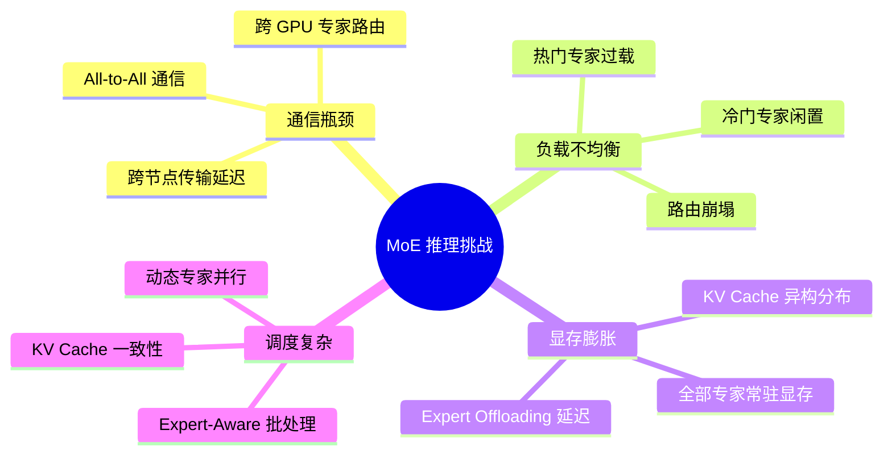
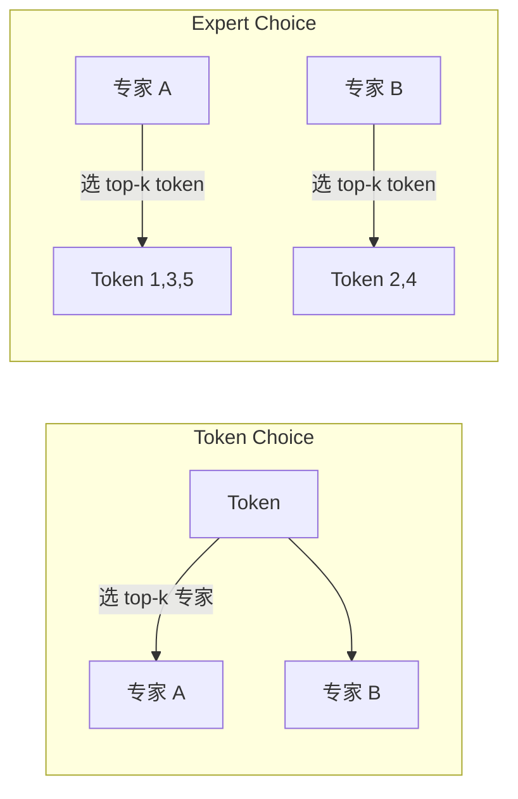
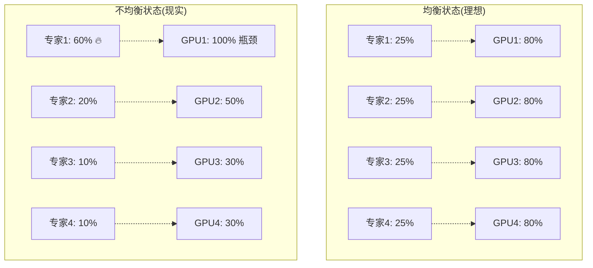
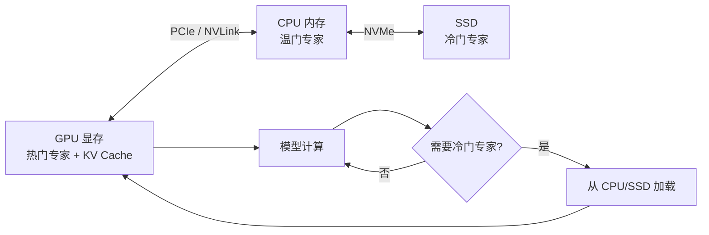
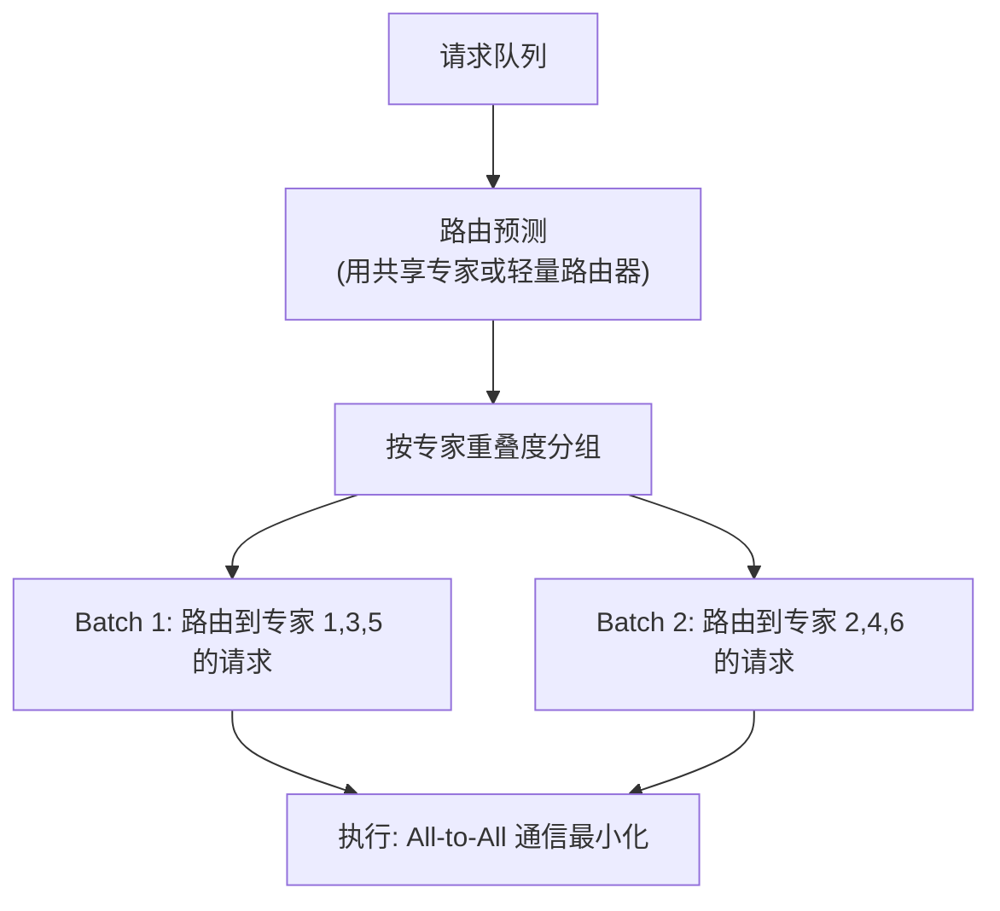
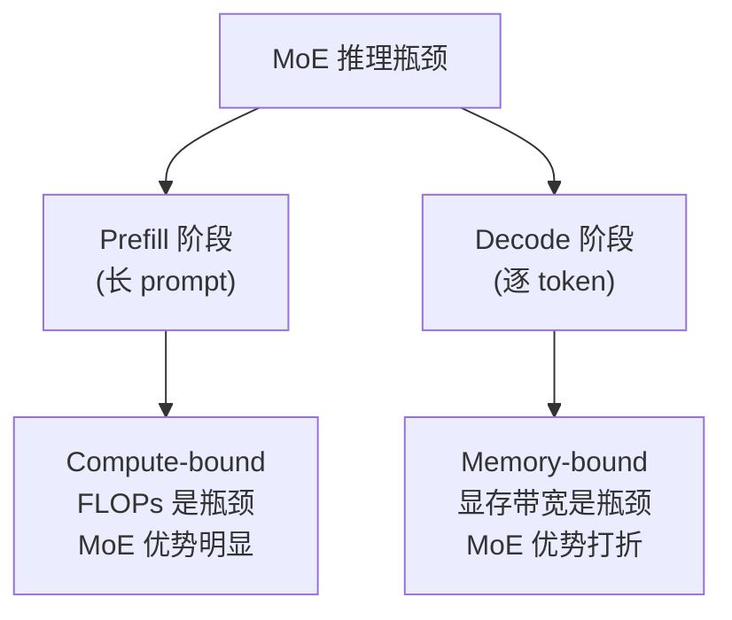
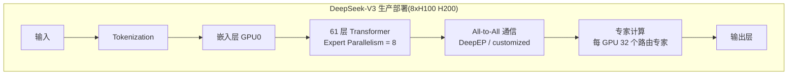
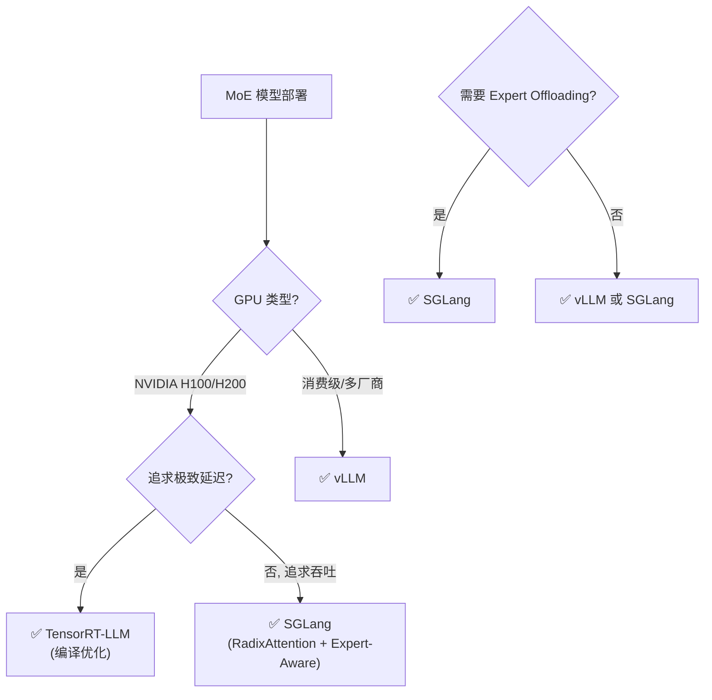
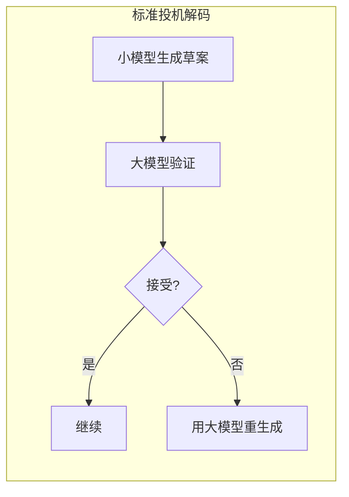
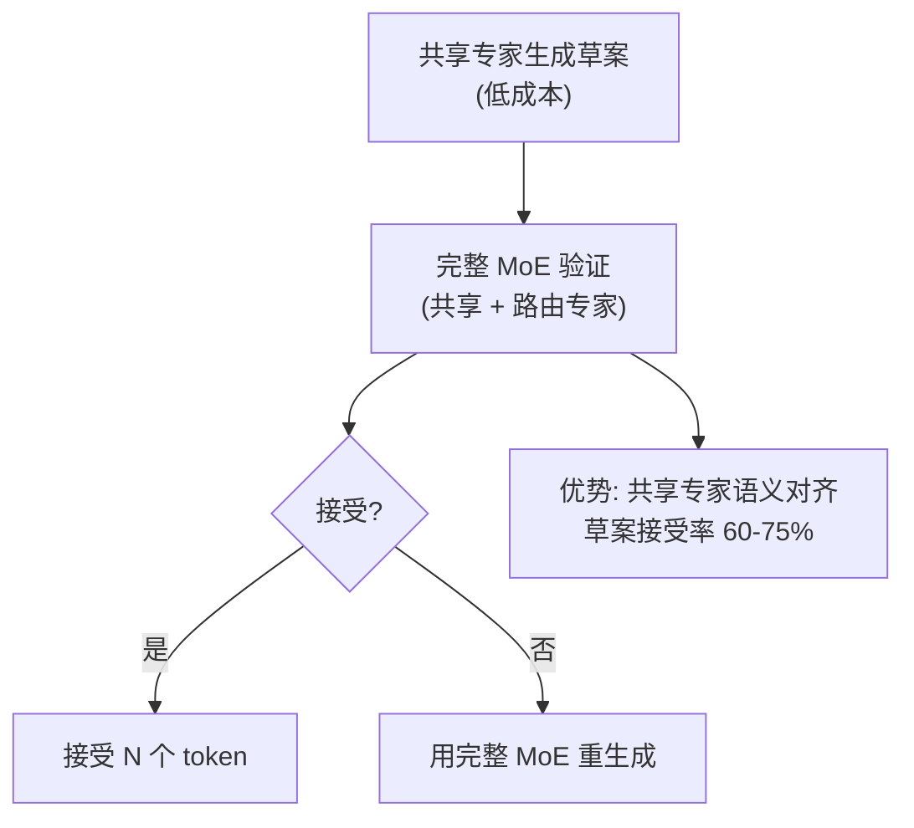

# MoE × 推理优化: 专家混合架构的推理加速挑战

> 中文简称：MoE × 推理优化: 专家混合架构的推理加速挑战

> **一句话理解**: MoE 用更少计算换更大容量,但推理时面临专家路由、负载均衡、显存膨胀三重挑战——需要 Expert-Aware 的专门优化策略。

## 目录

1. [MoE 推理的核心挑战](#moe-推理的核心挑战)
2. [The Connection](#the-connection)
3. [Expert 路由算法](#expert-路由算法)
4. [Expert 负载均衡](#expert-负载均衡)
5. [Expert Offloading](#expert-offloading)
6. [Expert-Aware Batching](#expert-aware-batching)
7. [稀疏激活的推理优化](#稀疏激活的推理优化)
8. [DeepSeek-V3 部署实践](#deepseek-v3-部署实践)
9. [推理引擎对比: vLLM/SGLang/TensorRT-LLM](#推理引擎对比)
10. [投机解码 + MoE](#投机解码--moe)
11. [Where They Co-occur](#where-they-co-occur)
12. [Cross-cutting Insight](#cross-cutting-insight)
13. [Tensions and Trade-offs](#tensions-and-trade-offs)
14. [Open Questions](#open-questions)

## MoE 推理的核心挑战



### 挑战详解

| 挑战 | 根本原因 | 量化影响 |
|------|----------|----------|
| **All-to-All 通信** | token 需路由到不同 GPU 上的专家 | 通信占延迟 30-50% |
| **负载不均衡** | 路由器倾向于选择少数热门专家 | GPU 利用率波动 40-90% |
| **显存占用大** | 全部专家参数需常驻,即使每次只用少数 | DeepSeek-V3 需 8xH100(671B) |
| **KV Cache 异构** | 不同 token 经不同专家,KV 分布不规则 | PagedAttention 效率打折 |
| **路由门控开销** | 每层每 token 都要做 top-k 选择 | 额外 FLOPs 5-10% |

## The Connection

MoE（Mixture of Experts）模型的核心优势是**"用更少的计算获得更大的模型容量"**——每次前向传播只激活 10-20% 的参数。^[extracted]

但这条优势在推理阶段面临三个独特挑战：
1. **All-to-All 通信瓶颈**: 专家分布在不同 GPU 上,路由决策导致频繁的跨设备通信
2. **负载不均衡**: 热门专家过载、冷门专家闲置,导致整体吞吐量下降
3. **KV Cache 异构性**: 不同专家处理不同 token,KV Cache 的分布高度不规则

这些问题让标准推理优化技术（如 vLLM 的 PagedAttention）在 MoE 上效果打折。^[inferred]

## Expert 路由算法

路由算法决定了每个 token 被分配给哪些专家,直接影响负载均衡和推理质量。

### 1. Top-K Routing (Token Choice)

最经典的路由方式——每个 token 选择 top-k 个专家:

```python
# 简化的 top-k routing
def top_k_routing(token_hidden, expert_weights, k=2):
    # token_hidden: [batch * seq_len, d_model]
    # expert_weights: [d_model, num_experts]
    scores = token_hidden @ expert_weights  # [N, num_experts]
    topk_scores, topk_indices = scores.topk(k, dim=-1)
    # 标准化分数
    weights = softmax(topk_scores, dim=-1)
    return topk_indices, weights  # 每个 token 选 k 个专家
```

- **Mixtral 8x7B**: k=2, 8 个专家
- **DeepSeek-V3**: k=8(含 1 个共享专家), 256 个路由专家
- **问题**: 容易出现路由崩塌——所有 token 都涌向少数专家

### 2. Expert Choice Routing

反转思路——**每个专家选 token**,而非 token 选专家:



- **优势**: 天然负载均衡(每个专家处理固定数量 token)
- **劣势**: 破坏因果性(专家看到未来 token),训练可用但推理需特殊处理
- **代表**: GShard、Switch Transformer 部分变体

### 3. Shared Expert (共享专家)

DeepSeek-V3 引入的设计:部分专家**总是被激活**(共享专家),部分按需路由(路由专家):

```python
# DeepSeek-V3 风格
output = shared_expert(x)  # 所有 token 都经过,捕获通用知识
routed_output = sum(w_i * expert_i(x) for i in top_k_indices)
output = output + routed_output
```

- **推理优势**: 共享专家始终激活 → Prefix 阶段 KV Cache 高度稳定 → **Prompt Caching 命中率极高**
- **投机解码优势**: 共享专家可作为天然的"草案模型"

### 4. 路由的负载均衡损失

训练时加入辅助损失防止路由崩塌:

$$L_{aux} = \alpha \cdot N \sum_{i=1}^{N} f_i \cdot P_i$$

其中 $f_i$ 是专家 $i$ 处理的 token 比例,$P_i$ 是路由器分配给专家 $i$ 的平均概率,$N$ 是专家数。DeepSeek-V3 用无辅助损失的偏置调整(bias adjustment)替代,训练更稳定。

## Expert 负载均衡

### 负载不均衡的危害



不均衡时,最忙的 GPU 成为瓶颈,整体吞吐量由它决定。

### 推理时负载均衡策略

| 策略 | 原理 | 适用场景 |
|------|------|----------|
| **Expert Parallelism 重排** | 把热门专家分散到不同 GPU | 静态部署 |
| **动态专家迁移** | 实时迁移热门专家到空闲 GPU | 长期运行服务 |
| **容量因子调节** | 调整每个专家的 token 容量上限 | 批处理 |
| **Drop-less 调度** | 不丢弃超容 token,排队等待 | vLLM MoE 分支 |
| **Batch 组合优化** | 把路由相似的请求组成同一 batch | 在线服务 |

### Expert Drop 的影响

部分实现(如 Switch Transformer)当专家超容时会**丢弃 token**(直接残差连接),推理时这会导致质量下降:

```
容量因子 = 1.0 → 丢弃约 10-30% 的 token(任务相关)
容量因子 = 1.5 → 丢弃 < 5%
容量因子 = 2.0 → 几乎不丢弃,但显存翻倍
```

> 生产环境推荐 drop-less 调度(vLLM/DeepEP 均支持)。

## Expert Offloading

当显存不足以放下所有专家时,将冷门专家卸载到 CPU 内存或 NVMe:



### Offloading 的关键权衡

| 因素 | 放 GPU | Offload 到 CPU | Offload 到 SSD |
|------|--------|----------------|-----------------|
| 计算延迟 | 基线 | +10-50% | +5-20x |
| 显存占用 | 高 | 低 | 最低 |
| 适用 | 数据中心 | 消费级 GPU | 极端节省 |

### Offloading 优化技术

1. **预取(Prefetch)**: 根据路由器预测,提前把下一个专家加载到 GPU
2. **专家缓存(Expert Cache)**: LRU 策略缓存最近使用的专家在 GPU
3. **层内重叠**: 计算当前层时,预取下一层专家
4. **量化存储**: CPU/SSD 上存 INT4,加载时反量化

```python
# 简化的 Expert Offloading 逻辑
class MoELayerWithOffload:
    def __init__(self, experts, gpu_capacity=8):
        self.gpu_experts = {}  # GPU 上的专家缓存
        self.cpu_experts = {i: e.to("cpu") for i, e in enumerate(experts)}
        self.capacity = gpu_capacity

    def forward(self, x, routing_indices):
        for layer_tokens, expert_id in self.group_by_expert(routing_indices):
            expert = self.get_expert(expert_id)
            output = expert(layer_tokens)
            ...

    def get_expert(self, expert_id):
        if expert_id in self.gpu_experts:
            self.touch(expert_id)  # LRU 更新
            return self.gpu_experts[expert_id]
        # Cache miss: 从 CPU 加载
        if len(self.gpu_experts) >= self.capacity:
            evicted = self.evict_lru()
            self.cpu_experts[evicted] = self.gpu_experts.pop(evicted).to("cpu")
        expert = self.cpu_experts.pop(expert_id).to("cuda")
        self.gpu_experts[expert_id] = expert
        return expert
```

## Expert-Aware Batching

标准连续批处理(continuous batching)不考虑专家分布,导致:
- 同一 batch 内 token 路由到 30+ 个专家 → All-to-All 通信爆炸
- 不同请求的专家重叠度低 → GPU 利用率低

### Expert-Aware 策略



### Expert-Aware 的收益

| 指标 | 标准批处理 | Expert-Aware | 提升 |
|------|-----------|--------------|------|
| All-to-All 通信量 | 基线 | -40-60% | 显著 |
| GPU 利用率 | 50-70% | 75-90% | +20pp |
| 吞吐量 | 基线 | +30-50% | 显著 |
| 调度开销 | 0 | +5-10% 调度延迟 | 可接受 |

### 实现要点

1. **路由预测**: 用 Prefix 阶段的路由分布预测 Decode 阶段(DeepSeek 实践显示高度稳定)
2. **动态重组 batch**: 每隔 N 步重新分组
3. **专家亲和度矩阵**: 维护请求×专家的亲和度,用于分组决策
4. **与 PagedAttention 协同**: KV Cache 页迁移需与 batch 重组同步

## 稀疏激活的推理优化

MoE 的核心矛盾:**FLOPs 少但显存大**。

### 计算量 vs 显存

| 模型 | 总参数 | 激活参数/batch | FLOPs | 显存(FP16) |
|------|--------|----------------|-------|------------|
| Dense 70B | 70B | 70B | 100% | ~140GB |
| Mixtral 8x7B | 47B | 13B | ~19% | ~94GB |
| DeepSeek-V3 | 671B | 37B | ~5.5% | ~1.3TB |

**关键洞察**: MoE 的 FLOPs 远低于同容量 Dense 模型,但显存反而更高(需存所有专家)。

### Compute-bound vs Memory-bound



- **Prefill**: 一次处理大量 token,计算密集 → MoE 激活参数少 = FLOPs 少 = 快
- **Decode**: 每次只生成 1 个 token,但需加载所有激活专家的权重 → 显存带宽受限 → MoE 的显存大反而成负担

### 优化 Memory-bound 的策略

1. **Expert 权重量化**: 把不活跃专家量化到 INT4/INT2(门控保持 FP16)
2. **权重复用**: 共享专家权重跨 batch 复用
3. **Grouped GEMM**: 把 top-k 个专家的计算合并为一次 Grouped GEMM(vLLM/TensorRT-LLM 支持)
4. **Expert Fusion**: 把多个小专家融合为一个大 kernel

## DeepSeek-V3 部署实践

DeepSeek-V3 是 2025-2026 年最具代表性的开源 MoE 模型,其部署数据是 MoE 推理优化的最佳参考。

### 架构参数

| 参数 | 值 |
|------|-----|
| 总参数 | 671B |
| 激活参数(每 token) | 37B |
| 路由专家数 | 256 |
| 共享专家数 | 1 |
| Top-K(路由专家) | 8 |
| 层数 | 61 |
| 隐藏维度 | 7168 |
| 上下文长度 | 128K |

### 部署配置



### 实际性能数据(公开 benchmark)

| 配置 | Prefill 吞吐 | Decode 吞吐 | 延迟(P99) |
|------|-------------|-------------|-----------|
| 8xH100 SGLang(FP8) | ~5200 tok/s | ~180 tok/s | ~800ms |
| 8xH100 vLLM(FP8) | ~4800 tok/s | ~150 tok/s | ~950ms |
| 8xH200 SGLang(FP8) | ~7500 tok/s | ~240 tok/s | ~550ms |
| 2xH100(Offload) | ~1800 tok/s | ~45 tok/s | ~3s |

> 数据来源: SGLang/vLLM 公开 benchmark,实际随 prompt 长度和 batch size 波动。

### DeepSeek-V3 的推理优化亮点

1. **FP8 训练原生支持**: 模型在 FP8 下训练,推理可直接用 FP8 无需转换
2. **Multi-Token Prediction (MTP)**: 原生支持一次预测多个 token,可作投机解码的草案头
3. **无辅助损失路由**: 用偏置调整替代辅助损失,路由更稳定 → 推理时负载更均衡
4. **共享专家设计**: 1 个共享专家始终激活 → Prompt Cache 命中率高

### DeepEP: DeepSeek 开源的 Expert Parallel 通信库

[DeepEP](https://github.com/deepseek-ai/DeepEP) 是 DeepSeek 开源的高性能 MoE 通信库:
- 专为 All-to-All 通信优化
- 支持 NVLink + InfiniBand 混合拓扑
- 低精度(FP8)通信
- 比 NCCL 标准 All-to-All 快 1.5-2x

## 推理引擎对比

### vLLM / SGLang / TensorRT-LLM 对 MoE 的支持

| 特性 | vLLM | SGLang | TensorRT-LLM |
|------|------|--------|---------------|
| **Expert Parallelism** | ✅(0.6+) | ✅(原生优化) | ✅(高度优化) |
| **Grouped GEMM** | ✅ | ✅ | ✅(最优) |
| **DeepSeek-V3 支持** | ✅ | ✅(最快) | ✅ |
| **Expert Offloading** | 实验性 | ✅ | ❌ |
| **FP8 MoE** | ✅ | ✅ | ✅ |
| **Expert-Aware Batching** | 部分 | ✅ | ✅ |
| **Prompt Cache(共享专家)** | ✅ | ✅(命中率最高) | ✅ |
| **连续批处理** | ✅(PagedAttention) | ✅(RadixAttention) | ✅(In-flight batching) |
| **部署难度** | 低 | 中 | 高(需编译) |
| **最佳场景** | 通用 | 高吞吐生产 | 极致延迟(NVIDIA GPU) |

### 选型建议



## 投机解码 + MoE

### 传统投机解码在 MoE 上的困难



问题:
1. **草案模型≠目标模型**: 小模型路由分布与 MoE 主模型不同,草案 token 可能在主模型上被拒
2. **专家对齐困难**: 草案模型不知道主模型会路由到哪些专家
3. **验证成本高**: 主模型验证草案时仍需激活全部 top-k 专家

### MoE 专属投机解码策略

#### 1. 共享专家作为草案模型

DeepSeek-V3 的共享专家天然可用作草案生成器:



- **草案接受率**: 60-75%(相比小模型草案的 40-55%)
- **加速比**: 2-2.8x(DeepSeek 报告)

#### 2. Multi-Token Prediction (MTP)

DeepSeek-V3 训练时原生支持 MTP 头,推理时:
- MTP 头一次预测 3-4 个 token
- 主模型验证
- 接受率 > 单纯投机解码

#### 3. Expert-Level 投机解码

用路由到同一专家的历史 token 预测未来——"这个专家见过的模式"作为草案。

## Where They Co-occur

MoE + 推理优化的交叉点集中在生产部署环节：
- **DeepSeek V3 部署**: 671B 总参数 / 37B 激活参数,需要 8xH100 集群 + 专门的专家并行策略
- **Mixtral 8x22B 服务**: 开源 MoE 的社区优化实践,包括专家卸载（offloading）和动态批处理
- **边缘设备 MoE**: 手机端运行 Phi-4-MoE 等轻量专家模型,需要极致的推理压缩
- **投机解码 + MoE**: Medusa/Lookahead 等草案模型在 MoE 上的适配——草案专家是否与主模型专家对齐?

## Cross-cutting Insight

MoE 推理优化的三个前沿方向：

```
1. 专家感知投机解码 (Expert-Aware Speculative Decoding)
├── 传统投机解码: 小模型生成草案 → 大模型验证
├── MoE 变体: 用"共享专家"生成草案 → 目标专家验证
└── 优势: 共享专家与目标专家语义一致,草案接受率更高

2. 专家缓存策略 (Expert Caching)
├── 观察: 某些 token 序列总是路由到相同的专家组合
├── 策略: 缓存高频专家组合的 KV Cache,避免重新计算
└── DeepSeek 实践: Prefix 阶段的专家选择具有高度稳定性

3. 动态专家并行 (Dynamic Expert Parallelism)
├── 传统: 固定专家到 GPU 的映射
├── 动态: 根据实时负载迁移专家,平衡通信与计算
└── 挑战: 专家迁移成本 vs 负载均衡收益的平衡点
```

Prompt Caching 在 MoE 中的特殊价值：由于 MoE 的 Prefix 阶段通常路由到相同的共享专家,前缀复用的命中率比 Dense 模型更高。^[inferred]

DeepSeek-V3 的共享专家设计让 SGLang 的 RadixAttention 命中率达到 70%+(对比 Dense 模型 50-60%),这是 MoE 架构对推理优化友好的一个意外红利。

## Tensions and Trade-offs

| 优化技术 | Dense 模型效果 | MoE 模型效果 | 原因 |
|----------|---------------|-------------|------|
| **量化 (INT8/INT4)** | 显著加速 | 效果有限 | 路由门控对精度敏感,量化导致路由错误 |
| **KV Cache 压缩** | 线性收益 | 非线性收益 | 不同专家的 KV 分布差异大,统一压缩策略失效 |
| **投机解码** | 2-3x 加速 | 1.5-2.8x 加速 | 草案模型与主模型专家对齐困难 |
| **连续批处理** | 高吞吐量 | 中等吞吐量 | 负载不均衡导致 GPU 利用率波动 |
| **Expert Offloading** | 不适用 | 显存换延迟 | 适合显存受限场景 |
| **Expert-Aware Batching** | 不适用 | +30-50% 吞吐 | MoE 专属优化 |
| **Prompt Caching** | 中等收益 | 高收益 | 共享专家设计提升命中率 |

## Open Questions

- MoE 的"专家专业化"是否真实存在?有研究表明某些层的路由几乎是随机的——如果专家没有真正专业化,路由优化的价值就大打折扣。^[ambiguous]
- 当 Prompt Caching 与 Dynamic Routing 结合时,缓存的 KV 对应的专家分布可能与新输入不匹配——如何设计"专家一致性检查"?^[inferred]
- 未来是否会出现"推理时 MoE"——根据任务难度动态选择模型规模(简单任务用小专家,复杂任务激活大专家)?^[ambiguous]
- Expert Offloading 的预取准确率如何提升?当前基于路由器预测的方法在长序列上准确率仅 70-80%。^[inferred]
- Grouped GEMM 在 MoE 上的极限性能是多少?当前 TensorRT-LLM 已能榨取 80%+ 峰值算力,还有多少空间?^[ambiguous]

## Related

- [[05_大模型/04_LLM架构/13_MoE_Routing_and_负载均衡]]
- [[05_大模型/04_LLM架构/12_MoE_Case_Studies_DeepSeek_Mixtral]]
- [[05_大模型/04_LLM架构/07_LLM_Internals_推理]]
- [[10_部署推理/03_推理优化/12_Speculative_Decoding_高级_2026]]
- [[10_部署推理/03_推理优化/11_提示缓存_and_KV_Cache_优化]]
- [[05_大模型/15_约束生成/03_Structured_输出_指南|结构化输出指南]]
