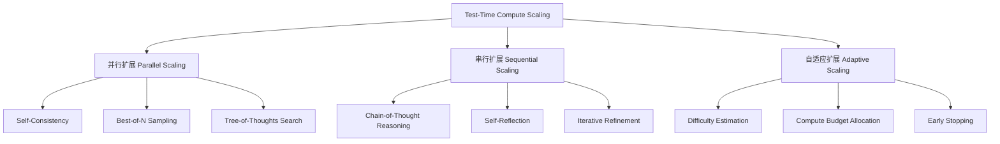

# Test-Time Compute Scaling 2026: 推理时计算扩展的生产实践

> 中文简称：Test-Time Compute Scaling 2026: 推理时计算扩展的

> **一句话定位**: [[概念/test-time-compute-scaling|Test-Time Compute Scaling]]（TTC Scaling）不是简单的"让模型多想想"，而是一套在推理阶段动态投入更多计算资源以提升输出质量的系统工程方法。它正在重塑大模型落地的成本结构、延迟基线和服务架构。

---

## 目录

- [1. 概述](#1-概述)
- [2. 核心概念与原理](#2-核心概念与原理)
- [3. 工程实践与生产考量](#3-工程实践与生产考量)
- [4. 2026 行业现状与主流方案](#4-2026-行业现状与主流方案)
- [5. 最佳实践 Checklist](#5-最佳实践-checklist)
- [6. 相关阅读](#6-相关阅读)

---

## 1. 概述

### 1.1 从训练 Scaling 到推理 Scaling

传统大模型的能力扩展主要依赖**训练时计算扩展（Train-Time Compute Scaling）**: 更大的模型、更多的数据、更长的训练时间。这条路径在 2024 年之前是行业主旋律，但其边际收益正在递减，且成本呈指数级上升。

2024 年下半年开始，OpenAI o1、DeepSeek-R1、Claude 3.7 Sonnet Extended Thinking 等模型的出现，标志着行业进入**推理时计算扩展（Test-Time Compute Scaling）**的新阶段:

```
Train-Time Scaling                Test-Time Scaling
─────────────────────            ─────────────────────
能力 ∝ 模型参数量                 能力 ∝ 推理时计算预算
成本集中在训练阶段               成本转移到推理阶段
单次前向传播即可                 多次采样 / 反思 / 验证
静态能力                         动态能力分配
```

TTC Scaling 的核心洞察是: **在推理阶段允许模型投入更多计算（更多 token、更多采样、更复杂的搜索/验证），可以让较小/较便宜的模型在特定任务上达到甚至超越更大模型的性能。**

### 1.2 为什么生产环境需要关注 TTC Scaling

| 生产痛点 | TTC Scaling 带来的改变 |
|---------|----------------------|
| 大模型推理成本过高 | 用小模型 + 推理扩展替代部分大模型调用 |
| 复杂任务准确率不足 | 通过多路径采样和验证提升可靠性 |
| 不同问题难度差异大 | 根据问题难度动态分配计算预算 |
| 延迟敏感与质量矛盾 | 分层策略: 简单问题快速响应，复杂问题深度推理 |
| 模型能力固化 | 无需重新训练即可通过推理策略升级能力 |

### 1.3 适用边界

TTC Scaling 并非万能:

- **高度适合**: 数学推理、代码生成、形式化验证、复杂决策、多步规划、高风险审核
- **谨慎使用**: 开放域创意写作、客户服务闲聊、实时对话（延迟敏感）
- **通常不适合**: 简单分类、检索排序、大规模批处理低复杂度任务

---

## 2. 核心概念与原理

### 2.1 TTC Scaling 的三类范式

现代 TTC Scaling 主要包含三种互补助长的范式:



#### 2.1.1 并行扩展: 用宽度换深度

通过从同一 prompt 采样多个候选答案，然后用验证器或投票机制选择最佳答案。

**Self-Consistency（自一致性）**: 对同一问题生成 N 条推理路径，选择出现最频繁的最终答案。适合有明确答案的数学/逻辑问题。

**Best-of-N**: 生成 N 个候选，由奖励模型或验证器打分，选择最高分。需要可靠的验证信号。

**Beam Search / Tree Search**: 在推理空间中系统性地搜索高质量路径，例如 Tree-of-Thoughts、Monte Carlo Tree Search（MCTS）。

#### 2.1.2 串行扩展: 用深度换精度

允许模型进行多轮思考、反思和修正:

**Chain-of-Thought（CoT）**: 要求模型显式输出中间推理步骤。

**Self-Reflection**: 模型审视自己的输出，识别错误并修正。

**Iterative Refinement**: 多轮迭代优化，直到满足停止条件。

#### 2.1.3 自适应扩展: 智能分配计算预算

不是所有问题都需要同样的计算量。自适应扩展通过难度估计动态分配预算:

```python
# 伪代码: 自适应计算预算分配
def allocate_compute(question: str, base_budget: ComputeBudget) -> ComputeBudget:
    difficulty = estimate_difficulty(question)
    
    if difficulty == "easy":
        return base_budget  # 单次推理
    elif difficulty == "medium":
        return base_budget.scale(parallel_samples=4, max_tokens=2.0)
    elif difficulty == "hard":
        return base_budget.scale(parallel_samples=16, reflection_rounds=2)
    else:  # extreme
        return base_budget.scale(
            parallel_samples=32, 
            reflection_rounds=3,
            verifier="external"
        )
```

### 2.2  scaling law 的迁移

TTC Scaling 的发现之一是:**对于许多推理任务，测试时计算扩展的 scaling law 可能比单纯增大模型更有效。**

```
性能提升来源对比:

方案 A: 7B 模型单次推理            基准性能
方案 B: 70B 模型单次推理           +15% 准确率，成本 +10x
方案 C: 7B 模型 + Self-Consistency N=16  +20% 准确率，成本 +8x
方案 D: 7B 模型 + Best-of-N + 验证器    +25% 准确率，成本 +12x
```

关键点:
- **验证信号质量决定上限**: Best-of-N 的效果严重依赖验证器/奖励模型的准确性
- **问题难度决定最优策略**: 简单问题并行采样收益高，复杂问题串行反思更有效
- **存在收益递减点**: 超过某个计算预算后，继续扩展的收益会快速下降

### 2.3 过程奖励 vs 结果奖励

TTC Scaling 的验证器可以分为两类:

| 类型 | 粒度 | 训练难度 | 适用场景 |
|-----|------|---------|---------|
| 结果奖励模型（ORM） | 只判断最终答案 | 较低 | 数学、代码等可验证任务 |
| 过程奖励模型（PRM） | 判断每一步推理 | 较高 | 复杂多步推理、需要定位错误 |

PRM 在 2024-2025 年成为研究热点，OpenAI 的 o1/o3、DeepSeek-R1 都被认为大量使用了过程监督信号。PRM 可以在推理早期识别错误路径，从而更有效地分配计算预算。

---

## 3. 工程实践与生产考量

### 3.1 生产架构分层

企业级 TTC Scaling 系统通常分为四层:

```
┌─────────────────────────────────────────────────────────────┐
│  Application Layer                                          │
│  - 业务逻辑 / Agent 编排 / Prompt 管理                       │
├─────────────────────────────────────────────────────────────┤
│  Orchestration Layer                                        │
│  - 计算预算分配 / 采样策略选择 / 难度估计 / Early Stopping   │
├─────────────────────────────────────────────────────────────┤
│  Inference Engine Layer                                     │
│  - vLLM / SGLang / TGI / TensorRT-LLM                       │
│  - Parallel Sampling / KV Cache / Prefix Caching            │
├─────────────────────────────────────────────────────────────┤
│  Verification Layer                                         │
│  - ORM / PRM / Code Executor / Unit Test / Rule Engine      │
└─────────────────────────────────────────────────────────────┘
```

### 3.2 并行采样的工程优化

并行采样是 TTC Scaling 最常用的技术，但也是成本来源。生产中的关键优化:

#### 3.2.1 批内并行（In-Batch Parallelism）

现代推理引擎（如 vLLM、SGLang）支持在同一次前向传播中处理多个采样序列，可以显著降低 per-token 开销。

```python
# vLLM 中实现 Best-of-N 的示例
from vllm import LLM, SamplingParams

llm = LLM(model="Qwen/Qwen2.5-7B-Instruct")

sampling_params = SamplingParams(
    n=16,              # 16 个并行候选
    temperature=0.8,
    top_p=0.95,
    max_tokens=2048,
)

outputs = llm.generate([problem_prompt], sampling_params)
candidates = [output.text for output in outputs[0].outputs]

# 使用验证器选择最佳答案
best_answer = verifier.select_best(problem_prompt, candidates)
```

#### 3.2.2 早停（Early Stopping）

不需要总是生成全部 N 个候选。当验证器发现高质量答案时，可以提前终止剩余采样。

```python
# 伪代码: 带早停的 Best-of-N
async def best_of_n_with_early_stop(
    prompt: str,
    model,
    verifier,
    n: int = 16,
    batch_size: int = 4,
    threshold: float = 0.95
) -> str:
    best_score = 0.0
    best_answer = None
    
    for i in range(0, n, batch_size):
        batch_candidates = await model.generate_batch(
            [prompt] * batch_size
        )
        
        for candidate in batch_candidates:
            score = verifier.score(prompt, candidate)
            if score > best_score:
                best_score = score
                best_answer = candidate
            
            if score >= threshold:
                return candidate  # 早停
    
    return best_answer
```

#### 3.3 串行推理的工程优化

对于 CoT/反思类任务，主要挑战是输出 token 数量大幅增加，导致首 token 时间（TTFT）和总延迟上升。

**流式输出（Streaming）**: 让用户/下游系统尽早看到部分结果，改善感知延迟。

**推理 token 预算控制**: 设置 `reasoning_effort` 或 `max_reasoning_tokens` 参数，防止无限思考。

**投机解码（Speculative Decoding）**: 用 draft 模型加速 reasoning 模型的 token 生成，对长 CoT 特别有效。

```python
# 伪代码: 推理 token 预算控制
class ReasoningController:
    def __init__(self, max_reasoning_tokens: int = 8192):
        self.max_reasoning_tokens = max_reasoning_tokens
    
    def truncate_reasoning(self, reasoning_chain: str) -> str:
        tokens = tokenize(reasoning_chain)
        if len(tokens) > self.max_reasoning_tokens:
            # 保留开头的问题理解和结尾的总结，截断中间
            head = tokens[:self.max_reasoning_tokens // 3]
            tail = tokens[-self.max_reasoning_tokens // 3:]
            return detokenize(head) + "\n...[truncated]\n" + detokenize(tail)
        return reasoning_chain
```

### 3.4 成本-延迟-质量的三角权衡

TTC Scaling 引入了一个新的生产决策三角:

```
            低成本
             /\
            /  \
           /    \
          /      \
         /   最优  \
        /    区域   \
       /____________\
   低延迟              高质量
```

生产中常见的三种定位:

| 定位 | 策略 | 适用场景 |
|-----|------|---------|
| **低延迟优先** | 单次推理 + 小模型 | 客服、搜索、实时交互 |
| **质量优先** | 大模型 + 多采样 + 验证 | 代码生成、数学、医疗诊断辅助 |
| **成本可控** | 小模型 + 自适应扩展 | 批量处理、中等复杂度任务 |

### 3.5 监控与可观测性

TTC Scaling 系统需要额外关注以下指标:

| 指标类别 | 具体指标 | 用途 |
|---------|---------|------|
| **成本** | 每次请求的平均 token 数、reasoning token 占比 | 成本归因与预算控制 |
| **质量** | 验证通过率、人类反馈得分、任务成功率 | 评估扩展策略效果 |
| **延迟** | TTFT、TPOT、端到端延迟、P50/P99 | 服务级别监控 |
| **效率** | 采样命中率、早停节省比例、难度预测准确率 | 优化扩展策略 |

```python
# 伪代码: TTC 监控装饰器
from dataclasses import dataclass
from typing import Callable

@dataclass
class TTCMetrics:
    num_samples: int
    reasoning_tokens: int
    total_tokens: int
    verification_score: float
    latency_ms: float
    early_stopped: bool

def instrument_ttc(func: Callable) -> Callable:
    def wrapper(*args, **kwargs):
        start = time.time()
        result = func(*args, **kwargs)
        latency = (time.time() - start) * 1000
        
        metrics = TTCMetrics(
            num_samples=result.get("num_samples", 1),
            reasoning_tokens=result.get("reasoning_tokens", 0),
            total_tokens=result.get("total_tokens", 0),
            verification_score=result.get("score", 0.0),
            latency_ms=latency,
            early_stopped=result.get("early_stopped", False),
        )
        
        metrics_collector.emit("ttc_request", metrics.__dict__)
        return result
    return wrapper
```

### 3.6 缓存策略

TTC Scaling 中的缓存比传统 LLM 服务更重要:

- **前缀缓存（Prefix Caching）**: 多次采样共享相同的 system prompt 和 question，vLLM/SGLang 可缓存前缀 KV。
- **结果缓存**: 对常见问题直接返回历史最佳答案。
- **推理路径缓存**: 缓存高质量 reasoning chain，用于 few-shot 示例或蒸馏。

---

## 4. 2026 行业现状与主流方案

### 4.1 主流模型与产品（2026）

| 产品/模型 | 厂商 | TTC 技术特点 | 生产接口 |
|----------|------|------------|---------|
| **o3 / o4-mini** | OpenAI | 强化学习训练的长 CoT、内部 PRM、自适应思考 | `reasoning_effort` 参数 |
| **DeepSeek-R1-0528** | DeepSeek | 开源 RL-based reasoning、GRPO、高性价比 | API + 开源权重 |
| **Claude 4 Sonnet / Opus** | Anthropic | Extended Thinking、可控推理深度 | `thinking` 参数 |
| **Gemini 2.5 Pro** | Google | 长上下文 + 多轮验证 | `thinkingBudget` |
| **Kimi k1.6 / K2** | Moonshot | 长思维链、多模态推理 | API + 应用 |
| **Qwen3 / QwQ** | 阿里云 | 混合推理模式、国产高性价比 | API + 开源权重 |
| **Grok 3.5** | xAI | 长推理 + 实时搜索结合 | API |

### 4.2 开源生态与工具链

2026 年，TTC Scaling 的开源工具链已经相当成熟:

| 类别 | 代表工具 | 作用 |
|-----|---------|------|
| 推理引擎 | vLLM、SGLang、TGI、TensorRT-LLM | 高吞吐并行采样 |
| RL/对齐框架 | TRL、OpenRLHF、verl、LLaMA-Factory | 训练 ORM/PRM/推理模型 |
| Agent 框架 | LangGraph、AutoGen、CrewAI、Agno | 编排多步推理与工具调用 |
| 评估框架 | RAGAS、OpenAI Evals、Inspect、SWE-bench | 评测扩展策略效果 |
| 网关 | LiteLLM、Portkey、Cloudflare AI Gateway | 多模型路由与成本管理 |

### 4.3 典型部署模式

#### 模式一: 推理模型即服务（Reasoning-as-a-Service）

直接将 o3、DeepSeek-R1 等推理模型作为后端服务，由业务层控制 `reasoning_effort`。

```
Client → API Gateway → Load Balancer → Reasoning Model Cluster
                                           ↓
                                      Verifier / Reward Model
```

**优点**: 简单、无需自研验证器
**缺点**: 成本高、延迟不可控、黑盒

#### 模式二: 小模型 + 自研扩展系统

使用开源 7B-32B 模型，配合自研的采样、验证、自适应预算分配系统。

```
Client → Router → Difficulty Estimator → Small LLM Cluster
                  ↓                           ↓
           Budget Allocator ←———→ Verifier / Executor
```

**优点**: 成本低、可控、可定制
**缺点**: 需要工程投入、验证器质量决定上限

#### 模式三: 混合路由（Hybrid Routing）

根据问题难度和成本约束，在"快速模型"、"推理模型"和"扩展采样"之间动态选择。

```python
# 伪代码: 混合路由
class HybridRouter:
    def route(self, query: str, latency_sla_ms: int, quality_requirement: str):
        difficulty = self.difficulty_model.predict(query)
        
        if difficulty < 0.3 and latency_sla_ms < 1000:
            return FastModelRoute(model="qwen2.5-7b")
        elif difficulty < 0.7:
            return ReasoningModelRoute(
                model="deepseek-r1",
                reasoning_effort="medium"
            )
        else:
            return TTCScaledRoute(
                base_model="qwen2.5-32b",
                num_samples=16,
                verifier=self.code_verifier,
                max_latency_ms=latency_sla_ms
            )
```

### 4.4 成本分析示例

以一个代码生成任务为例，对比不同方案的成本（假设每 1M token 输入 $0.5，输出 $1.5）:

| 方案 | 输入 token | 输出 token | 验证 token | 单次成本 | 准确率 |
|-----|-----------|-----------|-----------|---------|--------|
| GPT-4o 单次 | 2K | 1K | 0 | $0.0025 | 72% |
| Claude 4 Sonnet 单次 | 2K | 1.5K | 0 | $0.0045 | 78% |
| o3 medium | 2K | 8K (含 thinking) | 0 | $0.025 | 88% |
| Qwen2.5-32B + Best-of-8 | 2K × 8 | 1.5K × 8 | 0.5K × 8 | $0.018 | 85% |
| Qwen2.5-32B + PRM + MCTS | 2K × 12 | 1K × 12 | 1K × 12 | $0.030 | 90% |

**关键观察**: 在代码生成这类可验证任务上，小模型 + 验证器的组合可以达到接近顶级推理模型的效果，成本可能更低。

---

## 5. 最佳实践 Checklist

### 5.1 上线前 Checklist

- [ ] **任务可验证性评估**: 该任务是否有可靠的验证信号（单元测试、规则、ORM/PRM）？
- [ ] **Baseline 建立**: 已测量单次推理的准确率、延迟、成本基线
- [ ] **采样策略选型**: 根据任务特点选择 Self-Consistency / Best-of-N / Tree Search / 串行反思
- [ ] **验证器质量**: 验证器本身的准确率、召回率、偏见已评估
- [ ] **预算策略**: 已设定 max_samples、max_reasoning_tokens、early_stop 阈值
- [ ] **延迟 SLA**: 已明确 P50/P99 延迟目标，并设计降级路径
- [ ] **成本预算**: 已计算单位请求成本，并设置成本告警
- [ ] **可观测性**: 已接入 token 用量、延迟、验证分数、命中率监控
- [ ] **缓存策略**: 前缀缓存/结果缓存已配置
- [ ] **Fallback 机制**: 扩展策略失败时可回退到单次推理或更小模型

### 5.2 运行时优化 Checklist

- [ ] **动态难度估计**: 根据 query 特征动态调整计算预算
- [ ] **早停机制**: 当验证分数达到阈值时停止进一步采样
- [ ] **批处理**: 尽可能将采样请求批量提交给推理引擎
- [ ] **KV Cache 共享**: 多采样共享前缀，降低重复计算
- [ ] **流式输出**: 对串行推理任务使用流式响应改善体验
- [ ] **冷热分离**: 高频简单查询走快速路径，复杂查询走扩展路径

### 5.3 安全与合规 Checklist

- [ ] **推理内容审计**: thinking/reasoning 内容是否记录？是否包含敏感信息？
- [ ] **越狱风险**: 长推理链是否可能被诱导输出有害内容？
- [ ] **成本滥用**: 是否有限流和配额防止恶意高成本请求？
- [ ] **数据出境**: 使用第三方推理 API 时是否符合数据合规要求？
- [ ] **模型输出溯源**: 多采样/验证后的最终输出是否可追溯到原始候选？

### 5.4 代码示例: 完整的 TTC Scaling 推理类

```python
"""
完整的测试时计算扩展推理类（可直接用于生产原型）
"""

from typing import List, Dict, Optional, Callable
from dataclasses import dataclass
import asyncio
import time

@dataclass
class TTCConfig:
    num_samples: int = 8
    max_tokens: int = 2048
    temperature: float = 0.8
    top_p: float = 0.95
    early_stop_threshold: Optional[float] = 0.95
    batch_size: int = 4
    max_reflection_rounds: int = 0

class Verifier:
    """验证器接口"""
    def score(self, prompt: str, response: str) -> float:
        raise NotImplementedError
    
    def select_best(self, prompt: str, responses: List[str]) -> tuple[str, float]:
        scored = [(r, self.score(prompt, r)) for r in responses]
        scored.sort(key=lambda x: x[1], reverse=True)
        return scored[0]

class SimpleVerifier(Verifier):
    """简单示例验证器: 基于格式和关键字"""
    def score(self, prompt: str, response: str) -> float:
        score = 0.0
        # 包含推理步骤
        if "步骤" in response or "Step" in response or "1." in response:
            score += 0.3
        # 包含最终答案标记
        if "答案" in response or "Answer" in response or "```" in response:
            score += 0.3
        # 长度适中
        if 100 < len(response) < 2000:
            score += 0.2
        # 自洽性（简单检查）
        if response.count("(") == response.count(")"):
            score += 0.2
        return min(1.0, score)

class TTCInference:
    """测试时计算扩展推理引擎"""
    
    def __init__(self, model, verifier: Verifier, config: TTCConfig):
        self.model = model
        self.verifier = verifier
        self.config = config
    
    async def generate_parallel(self, prompt: str, n: int) -> List[str]:
        """并行生成 n 个候选"""
        tasks = [self.model.generate_async(prompt) for _ in range(n)]
        return await asyncio.gather(*tasks)
    
    async def infer(self, prompt: str) -> Dict:
        start = time.time()
        
        best_response = None
        best_score = 0.0
        total_samples = 0
        early_stopped = False
        
        # 分批次并行采样
        for i in range(0, self.config.num_samples, self.config.batch_size):
            batch_n = min(self.config.batch_size, self.config.num_samples - i)
            candidates = await self.generate_parallel(prompt, batch_n)
            total_samples += len(candidates)
            
            for candidate in candidates:
                score = self.verifier.score(prompt, candidate)
                if score > best_score:
                    best_score = score
                    best_response = candidate
                
                # 早停
                if (self.config.early_stop_threshold and 
                    score >= self.config.early_stop_threshold):
                    early_stopped = True
                    break
            
            if early_stopped:
                break
        
        latency_ms = (time.time() - start) * 1000
        
        return {
            "response": best_response,
            "score": best_score,
            "num_samples": total_samples,
            "early_stopped": early_stopped,
            "latency_ms": latency_ms,
            "config": {
                "num_samples": self.config.num_samples,
                "batch_size": self.config.batch_size,
                "early_stop_threshold": self.config.early_stop_threshold,
            }
        }


# 使用示例
async def main():
    # model 和 verifier 需要替换为实际实现
    class DummyModel:
        async def generate_async(self, prompt: str) -> str:
            await asyncio.sleep(0.1)
            return f"Answer to: {prompt[:30]}..."
    
    config = TTCConfig(
        num_samples=8,
        batch_size=4,
        early_stop_threshold=0.95
    )
    
    engine = TTCInference(
        model=DummyModel(),
        verifier=SimpleVerifier(),
        config=config
    )
    
    result = await engine.infer("请解释测试时计算扩展的原理。")
    print(result)

if __name__ == "__main__":
    asyncio.run(main())
```

---

## 6. 相关阅读

- [[05_大模型/08_推理模型/Test_Time_Compute_2026|测试时计算基础概念与实现]]
- [[05_大模型/08_推理模型/04_o1_Class_推理模型|o1 类推理模型详解]]
- [[05_大模型/08_推理模型/INDEX|DeepSeek-R1 技术分析]]
- [[05_大模型/08_推理模型/06_Process_Reward_模型|过程奖励模型 PRM]]
- [[10_部署推理/03_推理优化/02_LLM推理_深入分析|LLM 推理优化深度解析]]
- [[10_部署推理/01_部署基础/07_LLM_生产_部署_操作手册|LLM 生产部署 Runbook]]
- [[05_大模型/04_LLM架构/15_推理模型_2026|推理模型架构 2026]]
- [[05_大模型/07_提示工程/13_Prompt工程_完整_指南|提示工程完整指南]]
- [[06_强化学习/03_RLHF与对齐/02_GRPO_训练_深入分析|GRPO 训练深度指南]]
- [[07_模型训练/03_训练优化/06_扩展定律_and_训练_Dynamics|Scaling Laws 与训练动态]]
- [[08_模型评估/03_LLM评估/03_LLM评估_2026|LLM 评测 2026]]
- [[10_部署推理/index|部署与推理优化]]
- [[13_运维/02_SRE与可靠性/03_AI_SRE_操作手册|AI SRE Runbook]]

---

*文档版本: 1.0.0 | 创建时间: 2026-07-02 | 更新时间: 2026-07-02*
