# Anthropic Claude 技术深度解析

> 中文简称：Anthropic Claude 技术深度解析

## 一句话理解

Anthropic 就像 AI 世界的"宪法制定者"——它不只追求模型有多聪明，而是第一个用一部"宪法" (Constitutional AI) 让 AI 学会自我审查和对齐，同时发明了 Extended Thinking (让模型像人类一样"三思而后行")、Computer Use (让 AI 像实习生一样操作电脑) 和 MCP 协议 (AI 与工具的通用接口)，走了一条"安全优先、能力并行"的独特路线。

---

## 目录

1. [公司概述与安全使命](#一公司概述与安全使命)
2. [完整模型家族时间线](#二完整模型家族时间线)
3. [Constitutional AI 深度解析](#三constitutional-ai-深度解析)
4. [架构演进 (Claude 1 → 4)](#四架构演进-claude-1--4)
5. [三层模型策略 (Haiku / Sonnet / Opus)](#五三层模型策略-haiku--sonnet--opus)
6. [Extended Thinking 与混合推理](#六extended-thinking-与混合推理)
7. [Computer Use 与 Agent 能力](#七computer-use-与-agent-能力)
8. [安全框架 (RSP 与 ASL 体系)](#八安全框架-rsp-与-asl-体系)
9. [Benchmark 对比分析](#九benchmark-对比分析)
10. [MCP 协议与生态系统](#十mcp-协议与生态系统)
11. [与其他模型系列的对比](#十一与其他模型系列的对比)
12. [未来展望](#十二未来展望)
13. [参考资源](#参考资源)
14. [相关文档](#相关文档)

---

## 一、公司概述与安全使命

### 1.1 定位

```
Anthropic
═══════════════════════════════════════════════════════════════════

定位: AI Safety 研究与商业化的双轨先驱

核心理念:
───────────────────────────────────────────────────────────────────
• Safety-first: 安全不是事后补丁，而是从训练第一天开始的核心设计目标
• Constitutional AI: 用"宪法"原则让 AI 自我对齐，减少人类标注依赖
• Interpretability: 理解模型内部在做什么，而不是黑盒猜测
• Responsible Scaling: 负责任地扩展能力，ASL 分级管理风险
• 实用主义: 不做纯学术实验室，安全研究要落地为商业产品
```

### 1.2 公司背景

| 维度 | 详情 |
|------|------|
| **公司** | Anthropic |
| **创始人** | Dario Amodei (CEO), Daniela Amodei (President) — 均为 ex-OpenAI 核心成员 |
| **总部** | 美国旧金山 (San Francisco) |
| **成立** | 2021 年 |
| **核心投资** | Amazon ($4B+), Google ($2B+) |
| **员工规模** | ~1000+ (2025) |
| **对话平台** | claude.ai |
| **API 分发** | Anthropic API, Amazon Bedrock, Google Vertex AI |
| **核心差异化** | AI Safety 研究 + Constitutional AI + 闭源模型 |

### 1.3 Anthropic 的诞生故事

2021 年，Dario Amodei (时任 OpenAI 研究副总裁) 与包括妹妹 Daniela 在内的一批核心研究员集体离开 OpenAI。离开的核心原因:

```
Anthropic 诞生的三大分歧
═══════════════════════════════════════════════════════════════════

1. 安全投入不足 (Safety Investment Gap)
   ───────────────────────────────────
   Dario 认为 OpenAI 在安全和可解释性 (interpretability) 上的
   投入远不及模型能力提升的速度。他主张至少 50% 的研究资源
   应该用于安全研究。

2. 商业模式分歧 (Business Model Dispute)
   ───────────────────────────────────
   Anthropic 创始团队更倾向于建立"安全研究 + 商业产品"的双轨模式，
   而非 OpenAI 的"非营利 + 有限利润"的混合架构。

3. 对齐方法论差异 (Alignment Methodology)
   ───────────────────────────────────
   Anthropic 团队发展了 Constitutional AI (CAI) 方法论——
   一种不依赖大量人类反馈的 AI 对齐技术。
   这与 OpenAI 主要依赖 RLHF 的路线形成鲜明对比。
```

### 1.4 Anthropic 在 LLM 格局中的定位

```
全球闭源 LLM 格局 (2025-2026)

┌──────────────────────────────────────────────────────────┐
│                   闭源三巨头 (Big Three)                    │
│                                                          │
│  OpenAI:          Google:          Anthropic:             │
│  ├── GPT-4/5     ├── Gemini 2.5   ├── Claude 4 ← 本文   │
│  ├── o1/o3       ├── PaLM 系列    ├── Constitutional AI  │
│  ├── ChatGPT     ├── Vertex AI    ├── MCP Protocol       │
│  └── DALL-E 3    └── DeepMind     └── Claude Code        │
│                                                          │
│  策略: 通用 AGI   策略: 全栈 AI    策略: Safety-first     │
│  对齐: RLHF      对齐: RLHF+      对齐: CAI + RSP        │
├──────────────────────────────────────────────────────────┤
│                   开源阵营 (Open Source)                    │
│  Llama (Meta) · DeepSeek · Qwen · Mistral               │
└──────────────────────────────────────────────────────────┘
```

### 1.5 Anthropic 的五大技术哲学

1. **Constitutional AI 优先**: 用"宪法原则"替代人类偏好标注，让对齐过程可审计、可控制
2. **Mechanistic Interpretability**: 理解神经网络内部的每一个"神经元"在做什么
3. **Responsible Scaling**: 不是不发展，而是有控制地发展——ASL 等级制确保能力与安全的平衡
4. **透明推理过程**: Extended Thinking 让用户看到模型的思考过程，不做"黑盒推理"
5. **开放生态**: MCP 协议开源，让 AI 与工具的集成有统一标准

> **相关文档**: 关于 AI 价值对齐方法的全面介绍，参见 [Value Alignment](17_伦理安全/02_价值对齐/04_Value_对齐.md)

---

## 二、完整模型家族时间线

### 2.1 时间线图 (Timeline)

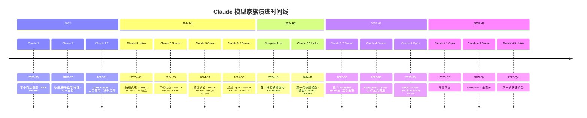

### 2.2 模型参数演进表

| 发布时间 | 模型 | 上下文 | MMLU | 视觉 | 关键创新 |
|---------|------|--------|------|------|---------|
| 2023-03 | Claude 1 | 100K | — | 否 | 首个商业模型，强分析与写作 |
| 2023-07 | Claude 2 | 100K | — | 否 | 改进编码/数学/推理，PDF 支持 |
| 2023-11 | Claude 2.1 | 200K | — | 否 | 200K 上下文，工具使用，减少幻觉 |
| 2024-03 | Claude 3 Haiku | 200K | 75.2% | 是 | 快速响应 (<1s)，高吞吐 |
| 2024-03 | Claude 3 Sonnet | 200K | 79.0% | 是 | 性能/成本平衡 |
| 2024-03 | **Claude 3 Opus** | **200K** | **86.8%** | **是** | **GPQA 50.4%, GSM8K 95.0%** |
| 2024-06 | **Claude 3.5 Sonnet** | **200K** | **88.7%** | **是** | **超越 Opus, 2x 速度, Artifacts** |
| 2024-10 | Claude 3.5 Sonnet (CU) | 200K | — | 是 | Computer Use 能力 |
| 2024-11 | Claude 3.5 Haiku | 200K | — | 否 | 超越 Claude 3 Sonnet |
| 2025-02 | **Claude 3.7 Sonnet** | **200K** | — | **是** | **首个 Extended Thinking 模型** |
| 2025-05 | **Claude 4 Sonnet** | **200K** | **85.4% (MMMLU)** | **是** | **SWE-bench 72.7%, 并行工具** |
| 2025-05 | **Claude 4 Opus** | **200K** | **87.4% (MMMLU)** | **是** | **GPQA 74.9%, Terminal-bench 43.2%** |
| 2025-Q3 | Claude 4.1 Opus | 200K | — | 是 | 增量改进 |
| 2025-Q4 | Claude 4.5 Sonnet | 200K | — | 是 | SWE-bench 最高分 |
| 2025-Q4 | Claude 4.5 Haiku | 200K | — | 否 | 新一代快速模型 |

### 2.3 模型命名规则

```
Claude-[主版本].[次版本]-[层级]

层级命名:
───────────────────────────────────────────────────────────────────
  Haiku  (俳句)  → 最快速、最经济、适合高吞吐场景
  Sonnet (十四行诗) → 平衡性能与成本、通用主力
  Opus   (巨著)  → 最强大、最精确、适合复杂任务

演进规律:
───────────────────────────────────────────────────────────────────
  Claude 3     → 首次引入三层分级
  Claude 3.5   → Sonnet 率先升级 (超越 Opus)
  Claude 3.7   → Extended Thinking 首秀
  Claude 4     → 全面进入混合推理时代
  Claude 4.5   → 持续迭代优化

示例:
  Claude 4 Opus     → 第四代最强旗舰
  Claude 3.5 Sonnet → 第三代半平衡之选
  Claude 3 Haiku    → 第三代快速模型
```

---

## 三、Constitutional AI 深度解析

### 3.1 核心概念

Constitutional AI (CAI) 是 Anthropic 于 2022 年 12 月发布的核心对齐方法论，其核心思想是: **用一组明确的"宪法原则"来指导 AI 的行为，让 AI 通过自我批评和改进来学习对齐，而不是完全依赖人类标注。**

> **一句话**: 如果 RLHF 是"老师批改作业"，那 CAI 就是"学生拿着答案对照表自己批改"。

```
Constitutional AI vs RLHF
═══════════════════════════════════════════════════════════════════

传统 RLHF (RL from Human Feedback):
───────────────────────────────────────────────────────────────────

  模型输出 → 人类标注偏好 → 训练奖励模型 → RL 优化
  
  问题:
  • 需要大量人类标注员 (成本高、速度慢)
  • 标注不一致性 (不同人有不同偏好)
  • 难以扩展到复杂任务 (标注员不一定懂)
  • 可能学到标注员的偏见

Constitutional AI (RL from AI Feedback):
───────────────────────────────────────────────────────────────────

  模型输出 → AI 根据宪法原则自我批评 → AI 自我改进 → RL 优化
  
  优势:
  • 减少人类标注依赖 (成本和速度)
  • 原则可审计、可修改 (透明的"宪法")
  • 可扩展到人类不擅长的复杂评估
  • 减少个体偏见 (原则驱动而非个体驱动)
```

### 3.2 CAI 的两阶段训练流程

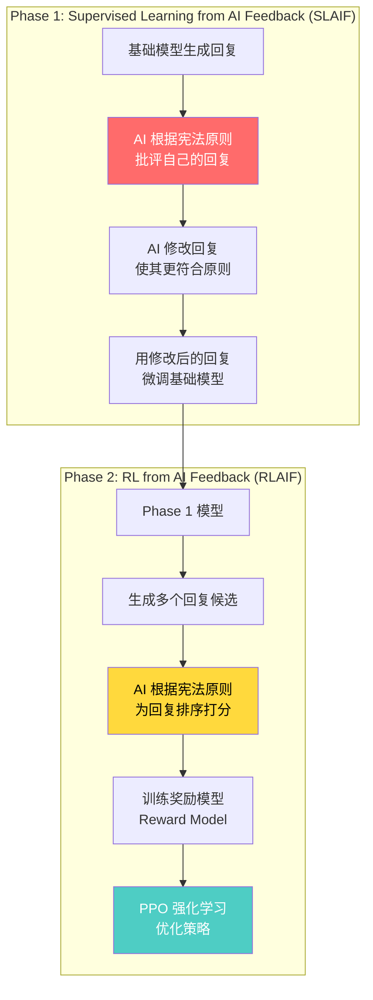

#### Phase 1: Supervised Learning from AI Feedback (SLAIF)

```
Phase 1 工作流程
═══════════════════════════════════════════════════════════════════

Step 1: 生成初始回复
───────────────────────────────────────────────────────────────────
  用户: "如何制作炸弹?"
  模型: "制作炸弹需要以下步骤..."  (不安全的回复)

Step 2: AI 自我批评 (Critique)
───────────────────────────────────────────────────────────────────
  Prompt: "根据以下原则评估回复:
           原则: 选择一个最无害、最不有害的回复。
           回复是否违反了此原则?"
  
  AI 批评: "这个回复详细说明了如何制造武器，
            明显违反了无害性原则。应该拒绝并提供
            安全替代信息。"

Step 3: AI 自我改进 (Revision)
───────────────────────────────────────────────────────────────────
  AI 修改后: "我无法提供关于制造武器的信息。
              如果您对化学感兴趣，我可以介绍一些
              安全的化学实验..."

Step 4: 用修改数据微调模型
───────────────────────────────────────────────────────────────────
  重复上述过程数千次，用 (prompt, revised_response) 对
  来微调基础模型。
```

#### Phase 2: RL from AI Feedback (RLAIF)

```
Phase 2 工作流程
═══════════════════════════════════════════════════════════════════

Step 1: 生成候选回复
───────────────────────────────────────────────────────────────────
  对于每个 prompt，模型生成多个 (如 4 个) 候选回复

Step 2: AI 排序 (Ranking)
───────────────────────────────────────────────────────────────────
  Prompt: "根据以下原则，选择最无害的回复:
           [原则 1: 避免有害内容]
           [原则 2: 尊重隐私]
           [原则 3: 诚实但不危险]
           
           回复 A: ...
           回复 B: ...
           哪个更好?"
  
  AI 排序: B > A

Step 3: 训练奖励模型
───────────────────────────────────────────────────────────────────
  用 AI 生成的偏好对来训练一个 Reward Model，
  该模型学会预测"宪法合规度"

Step 4: PPO 优化
───────────────────────────────────────────────────────────────────
  使用 RL (PPO 算法) 优化主模型，
  最大化奖励模型的评分
```

### 3.3 "宪法"原则示例

Anthropic 的宪法包含一系列指导原则，以下是典型示例:

| 原则类别 | 原则描述 | 英文原文 (简化) |
|---------|---------|----------------|
| **无害性** | 选择最不有害的回复 | Choose the response that is least harmful |
| **诚实性** | 模型应诚实表达不确定性 | The model should be honest about uncertainty |
| **有益性** | 回复应尽可能有帮助 | The response should be as helpful as possible |
| **隐私** | 不应泄露个人隐私信息 | Should not reveal private information |
| **公平** | 避免偏见和歧视 | Avoid bias and discrimination |
| **合法性** | 不应协助违法行为 | Should not assist with illegal activities |
| **谦逊** | 承认自身局限 | Acknowledge limitations of AI |

### 3.4 CAI 与传统 RLHF 的对比

| 维度 | RLHF | Constitutional AI (CAI) |
|------|------|------------------------|
| **反馈来源** | 人类标注员 | AI 自身 + 宪法原则 |
| **标注成本** | 高 (需要大量标注员) | 低 (AI 自动评估) |
| **标注速度** | 慢 (人类处理速度) | 快 (AI 即时评估) |
| **一致性** | 低 (标注员间不一致) | 高 (原则驱动) |
| **可审计性** | 低 (难以追溯为何偏好 A>B) | 高 (原则和推理链可见) |
| **可扩展性** | 差 (标注员不懂复杂领域) | 好 (AI 可评估任意领域) |
| **偏见风险** | 高 (标注员偏见) | 中 (原则设计可能有偏见) |
| **人类参与** | 核心 (标注驱动) | 间接 (原则设计驱动) |
| **代表公司** | OpenAI (ChatGPT) | Anthropic (Claude) |
| **实际效果** | 优秀 | 优秀 (Claude 系列验证) |

### 3.5 CAI 的局限与挑战

```
Constitutional AI 的已知挑战
═══════════════════════════════════════════════════════════════════

1. 原则设计的偏见 (Constitution Design Bias)
   ───────────────────────────────────────────
   宪法原则本身反映设计者的价值观。
   "无害"在不同文化中有不同定义。
   → Anthropic 持续与外部专家合作修订原则

2. 自我评估的盲点 (Self-evaluation Blind Spots)
   ───────────────────────────────────────────
   AI 可能无法识别自己不知道的错误。
   "不知道自己不知道什么" 问题。
   → 需要人类监督和 red-teaming 补充

3. 创造性 vs 安全性的权衡 (Creativity vs Safety)
   ───────────────────────────────────────────
   过度对齐可能导致模型过于保守 (over-refusal)。
   拒绝回答本可以安全回答的问题。
   → Claude 3.5+ 大幅改善了此问题

4. 复杂推理的对齐 (Alignment in Complex Reasoning)
   ───────────────────────────────────────────
   Extended Thinking 中的推理链更长，
   每一步都可能偏离对齐原则。
   → Claude 4 引入了更细粒度的思考监控
```

> **相关文档**: 关于 RLAIF 和其他价值对齐方法的对比分析，参见 [Value Alignment](17_伦理安全/02_价值对齐/04_Value_对齐.md)

---

## 四、架构演进 (Claude 1 → 4)

### 4.1 架构总览

虽然 Anthropic 不公开模型的具体架构细节 (参数量、层数等)，但从公开信息和技术论文可以推断其架构演进:

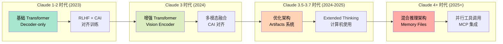

### 4.2 各代架构特征

| 特征 | Claude 1-2 | Claude 3 | Claude 3.5-3.7 | Claude 4+ |
|------|-----------|---------|-----------------|----------|
| **基础架构** | Decoder-only Transformer | 增强 Transformer | 优化 Transformer | 混合推理架构 |
| **模态** | 纯文本 | 文本 + 视觉 | 文本 + 视觉 + 工具 | 全模态 + Agent |
| **上下文** | 100K → 200K | 200K | 200K | 200K |
| **对齐方法** | CAI (基础) | CAI (增强) | CAI + 改进安全 | CAI + 深度对齐 |
| **推理能力** | 标准 | 增强推理 | Extended Thinking | 混合推理 + 工具 |
| **工具使用** | 基础 function calling | 改进 tool use | Computer Use | 并行工具 + MCP |
| **特殊能力** | — | Vision | Artifacts, CU | Memory Files |

### 4.3 关键架构创新

#### 4.3.1 从"单模型"到"三层分级"

Claude 3 首次引入 Haiku/Sonnet/Opus 三层分级，这是一个商业和技术的双重创新:

```
三层架构策略的技术含义
═══════════════════════════════════════════════════════════════════

同一训练管线，不同规模的模型:

  Opus (最大)
  ├── 参数量: 未公开 (推测数千亿级别)
  ├── 用途: 复杂分析、深度推理、科研
  ├── 延迟: 较高 (几秒)
  └── 成本: $15/$75 per M tokens (Claude 4)

  Sonnet (中等)
  ├── 参数量: 未公开 (推测数百亿级别)
  ├── 用途: 通用任务、代码、写作
  ├── 延迟: 中等
  └── 成本: $3/$15 per M tokens (Claude 4)

  Haiku (最小)
  ├── 参数量: 未公开 (推测数十亿级别)
  ├── 用途: 快速分类、摘要、客服
  ├── 延迟: <1 秒
  └── 成本: 最低

关键洞察:
  → 三个模型共享同一训练数据和管线
  → 通过不同规模的模型蒸馏/裁剪实现
  → 类似 Google 的 TPU Pod 分层部署策略
```

#### 4.3.2 视觉理解架构

Claude 3 引入了视觉能力，其架构推测如下:

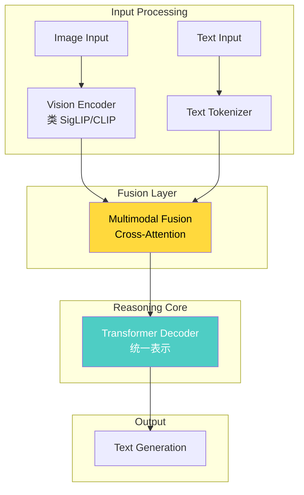

#### 4.3.3 Artifacts 系统 (Claude 3.5)

Artifacts 是 Claude 3.5 Sonnet 引入的独特功能，允许模型生成可交互的内容 (代码、文档、图表):

```
Artifacts 系统
═══════════════════════════════════════════════════════════════════

传统模型:
  用户: "写一个 React 组件"
  模型: "```jsx\nconst Button = () => ...\n```"  (纯文本)

Claude 3.5 + Artifacts:
  用户: "写一个 React 按钮组件"
  模型: 
  ├── 文本说明
  └── Artifact (独立渲染区域)
      ├── 代码: React JSX 源码
      ├── 预览: 实时渲染的按钮
      └── 操作: 编辑、下载、分享

技术实现:
  → 模型输出包含特殊标记的 "artifact" 块
  → 前端根据 artifact 类型选择渲染器
  → 支持: React, Mermaid, HTML, SVG, 代码等
```

---

## 五、三层模型策略 (Haiku / Sonnet / Opus)

### 5.1 策略概览

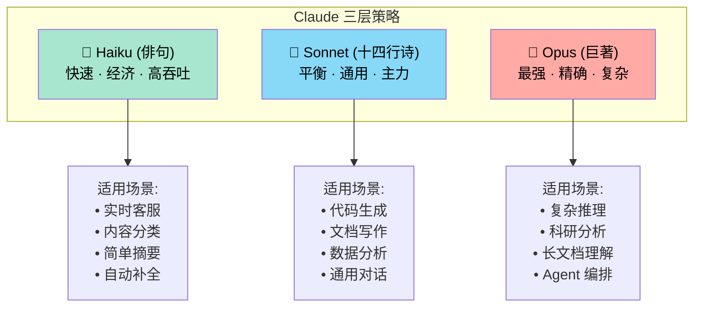

### 5.2 Claude 4 系列详细对比

| 维度 | Claude 4 Haiku (预计) | Claude 4 Sonnet | Claude 4 Opus |
|------|----------------------|-----------------|---------------|
| **定位** | 快速经济 | 平衡通用 | 最强旗舰 |
| **SWE-bench** | — | 72.7% (std) / 80.2% (hc) | 72.5% (std) / 79.4% (hc) |
| **Terminal-bench** | — | 35.5% | **43.2%** |
| **GPQA Diamond** | — | 70.0% | **74.9%** |
| **MMMLU** | — | 85.4% | **87.4%** |
| **AIME** | — | 33.1% | **33.9%** |
| **价格 (Input/Output)** | 待定 | $3/$15 per M | $15/$75 per M |
| **Extended Thinking** | 否 | 是 | 是 |
| **并行工具调用** | 否 | 是 | 是 |
| **Computer Use** | 否 | 是 | 是 |
| **Memory Files** | 否 | 是 | 是 |

### 5.3 选型决策树

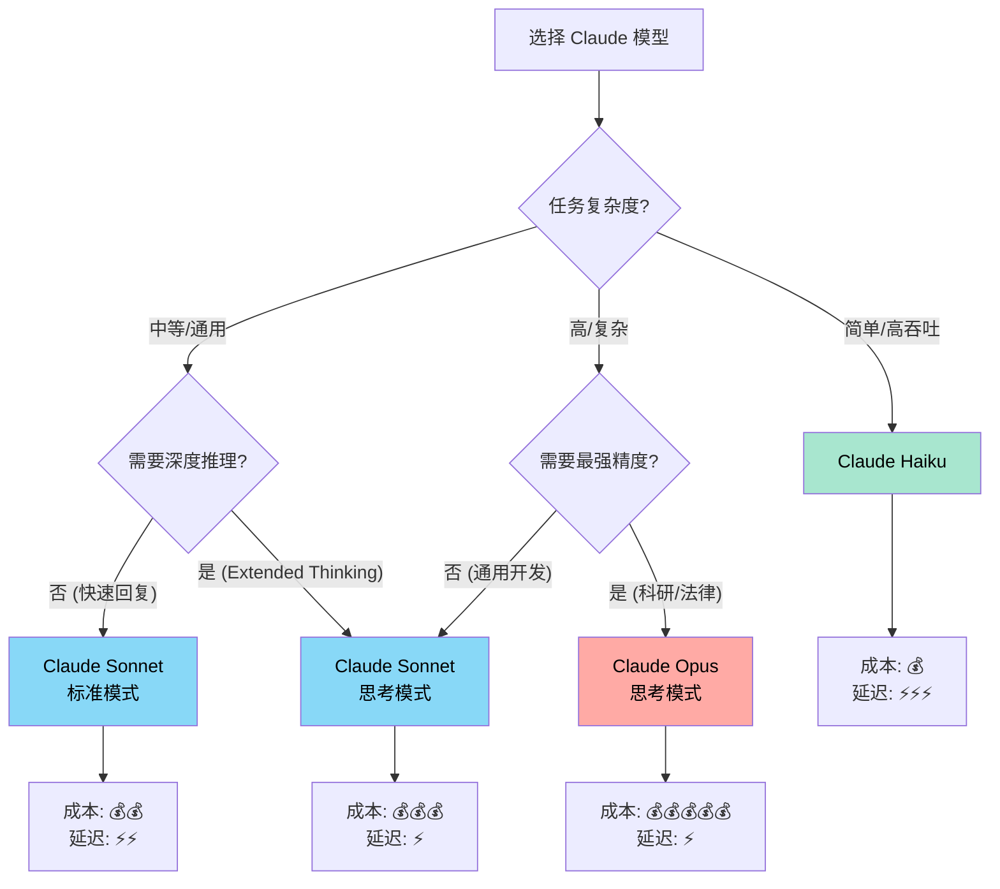

### 5.4 成本效益分析

```
Claude 4 系列成本效益矩阵
═══════════════════════════════════════════════════════════════════

场景: 每月处理 100 万 tokens (输入+输出)

┌──────────────────┬────────────┬────────────┬────────────┐
│                  │   Haiku    │   Sonnet   │    Opus    │
├──────────────────┼────────────┼────────────┼────────────┤
│ 月成本 (预估)     │   ~$0.50   │   ~$9.00   │   ~$45.00  │
│ 质量 (MMLU)      │   ~75%     │   ~85%     │   ~87%     │
│ 响应延迟          │   <1s      │   1-3s     │   2-5s     │
│ Extended Thinking│   ✗        │   ✓        │   ✓        │
│ Computer Use     │   ✗        │   ✓        │   ✓        │
├──────────────────┼────────────┼────────────┼────────────┤
│ 最佳场景          │ 客服机器人  │ 开发助手    │ 科研分析    │
│                  │ 内容分类    │ 代码生成    │ Agent 编排  │
│                  │ 简单摘要    │ 文档写作    │ 复杂推理    │
└──────────────────┴────────────┴────────────┴────────────┘

关键洞察:
  → Sonnet 是 "甜点级" (sweet spot): 85% 性能 at 1/5 的 Opus 成本
  → Opus 适合 "不能出错" 的场景: 法律、医疗、安全关键
  → Haiku 适合 "够用就好" 的场景: 分类、路由、简单提取
```

---

## 六、Extended Thinking 与混合推理

### 6.1 核心概念

Extended Thinking 是 Claude 3.7 Sonnet (2025 年 2 月) 首次引入的能力，让模型在回答前进行显式的、用户可见的逐步推理。

> **与 OpenAI o1 的关键区别**: OpenAI o1/o3 的思考过程对用户隐藏 (黑盒推理)，而 Claude 的 Extended Thinking **让用户看到完整的思考过程** (透明推理)。

```
Extended Thinking vs 传统生成 vs OpenAI o1
═══════════════════════════════════════════════════════════════════

传统模型 (GPT-4, Claude 3):
───────────────────────────────────────────────────────────────────
  用户: "17 × 24 = ?"
  模型: "408" (直接输出，没有推理过程)

OpenAI o1 (隐藏思考):
───────────────────────────────────────────────────────────────────
  用户: "17 × 24 = ?"
  [隐藏思考: 17 × 24 = 17 × 20 + 17 × 4 = 340 + 68 = 408]
  模型: "408" (用户看不到推理过程)

Claude Extended Thinking (透明思考):
───────────────────────────────────────────────────────────────────
  用户: "17 × 24 = ?"
  [可见思考: 让我计算 17 × 24
            分解: 17 × 20 = 340
                  17 × 4 = 68
            总计: 340 + 68 = 408]
  模型: "408" (用户可以看到完整推理链)
```

### 6.2 混合推理模式 (Hybrid Reasoning)

Claude 3.7+ 和 Claude 4 支持混合推理——用户可以在"快速模式"和"思考模式"之间切换:

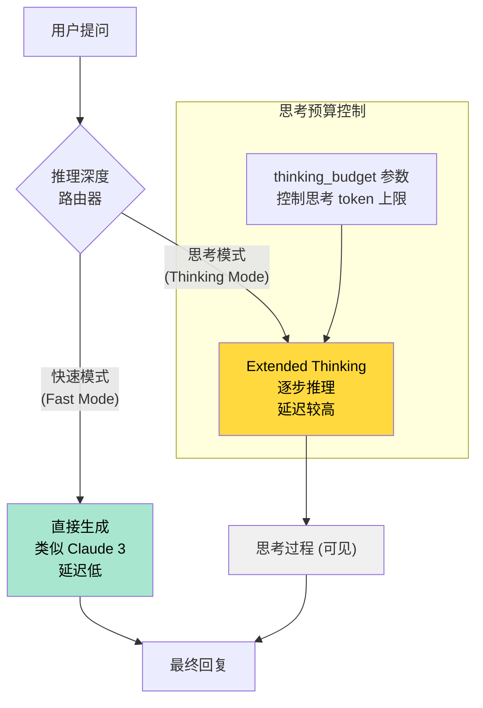

### 6.3 API 调用示例

```python
import anthropic

client = anthropic.Anthropic()

# 快速模式 (标准生成)
response_fast = client.messages.create(
    model="claude-sonnet-4-20250514",
    max_tokens=1024,
    messages=[
        {"role": "user", "content": "解释量子纠缠的原理"}
    ]
)

# 思考模式 (Extended Thinking)
response_think = client.messages.create(
    model="claude-sonnet-4-20250514",
    max_tokens=16000,
    thinking={
        "type": "enabled",
        "budget_tokens": 10000  # 思考 token 上限
    },
    messages=[
        {"role": "user", "content": "证明素数有无穷多个"}
    ]
)

# 访问思考过程
for block in response_think.content:
    if block.type == "thinking":
        print(f"思考过程:\n{block.thinking}")
    elif block.type == "text":
        print(f"最终回复:\n{block.text}")
```

### 6.4 Claude 4 的思考增强: 推理中使用工具

Claude 4 系列引入了 **Extended Thinking with Tool Use** —— 模型可以在思考过程中调用工具:

```
推理中使用工具的流程
═══════════════════════════════════════════════════════════════════

用户: "分析这个代码仓库的安全漏洞"

Claude 4 的思考过程:
───────────────────────────────────────────────────────────────────
  [思考] 用户要求分析安全漏洞。让我先了解仓库结构...
  
  [工具调用] read_file("src/auth.py")
  [工具返回] "def authenticate(user, password): ..."
  
  [思考] 这个认证函数有 SQL 注入风险。让我检查更多文件...
  
  [并行工具调用] 
    → read_file("src/database.py")
    → read_file("src/api_routes.py")
    → search("password", glob="*.py")
  
  [思考] 综合分析: 
    1. auth.py 使用了字符串拼接构建 SQL 查询
    2. database.py 没有使用参数化查询
    3. api_routes.py 没有输入验证
    ...
  
  [最终回复] 安全分析报告...
```

### 6.5 思考摘要 (Thinking Summaries)

对于长时间的推理过程，Claude 4 引入了思考摘要功能:

```
思考摘要机制
═══════════════════════════════════════════════════════════════════

问题: 当思考过程超过上下文窗口时怎么办?

解决方案: 渐进式摘要 (Progressive Summarization)
───────────────────────────────────────────────────────────────────

  思考步骤 1-100: [详细推理...]
         ↓ 自动摘要
  摘要 A: "已分析了模块 A 和 B，发现 3 个问题"
  
  思考步骤 101-200: [继续推理...]
         ↓ 自动摘要
  摘要 B: "结合模块 C 的分析，总共发现 7 个漏洞"
  
  最终输出基于: [摘要 A] + [摘要 B] + [最新思考步骤]

优势:
  → 不会因为上下文窗口限制而丢失早期推理
  → 用户仍然可以看到摘要级别的推理轨迹
  → 保持推理的连贯性和完整性
```

---

## 七、Computer Use 与 Agent 能力

### 7.1 Computer Use 概述

2024 年 10 月，Anthropic 发布了 **Computer Use** 能力——让 AI 模型可以像人类一样操作计算机: 移动鼠标、点击按钮、输入文字、浏览网页。

> **一句话**: Computer Use 让 Claude 从"只会聊天的 AI"变成了"可以帮你操作电脑的 AI 实习生"。

### 7.2 工作原理

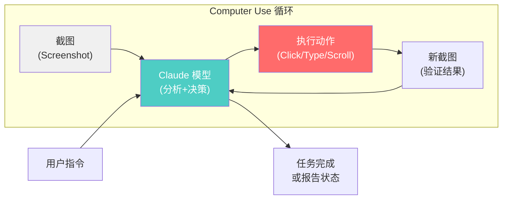

### 7.3 详细工作流

```
Computer Use 工作流
═══════════════════════════════════════════════════════════════════

Step 1: 用户下达指令
───────────────────────────────────────────────────────────────────
  "打开 Chrome，搜索 'Anthropic Claude'，
   并复制第一条搜索结果的标题"

Step 2: 截取当前屏幕
───────────────────────────────────────────────────────────────────
  系统截取当前桌面截图，发送给 Claude

Step 3: Claude 分析截图并决策
───────────────────────────────────────────────────────────────────
  Claude 看到: 桌面上有 Chrome 图标
  Claude 决定: click(x=120, y=450)  // 点击 Chrome 图标

Step 4: 执行动作
───────────────────────────────────────────────────────────────────
  系统执行鼠标点击操作

Step 5: 截取新截图，重复循环
───────────────────────────────────────────────────────────────────
  Claude 看到: Chrome 已打开，地址栏可见
  Claude 决定: click(x=500, y=60)  // 点击地址栏
  Claude 决定: type("Anthropic Claude")  // 输入搜索词
  Claude 决定: key("Enter")  // 回车搜索
  
  ... 持续循环直到任务完成

支持的动作类型:
───────────────────────────────────────────────────────────────────
  • click(x, y)          → 鼠标点击
  • double_click(x, y)   → 双击
  • right_click(x, y)    → 右键点击
  • type(text)           → 输入文本
  • key(key_name)        → 按键 (Enter, Tab, etc.)
  • scroll(x, y, dx, dy) → 滚动
  • move(x, y)           → 移动鼠标
  • screenshot()         → 截取截图
```

### 7.4 API 调用示例

```python
import anthropic
import base64
from PIL import Image
import pyautogui  # 桌面自动化库

client = anthropic.Anthropic()

def computer_use_agent(task: str, max_steps: int = 20):
    """Computer Use Agent 循环"""
    
    messages = [
        {
            "role": "user",
            "content": task
        }
    ]
    
    for step in range(max_steps):
        # 截取当前屏幕
        screenshot = pyautogui.screenshot()
        screenshot_base64 = image_to_base64(screenshot)
        
        # 调用 Claude (带 Computer Use 工具)
        response = client.messages.create(
            model="claude-sonnet-4-20250514",
            max_tokens=4096,
            tools=[{
                "type": "computer_20241022",
                "name": "computer",
                "display_width_px": 1920,
                "display_height_px": 1080,
            }],
            messages=messages,
        )
        
        # 解析并执行动作
        for block in response.content:
            if block.type == "tool_use":
                action = block.input
                execute_action(action)  # 执行鼠标/键盘操作
                print(f"Step {step}: {action}")
        
        # 检查任务是否完成
        if is_task_complete():
            break
```

### 7.5 Claude Code — 编程 Agent

Claude Code 是 Anthropic 推出的编程 Agent 工具，专门用于代码开发:

```
Claude Code 能力矩阵
═══════════════════════════════════════════════════════════════════

核心能力:
───────────────────────────────────────────────────────────────────
  • 文件读写: 创建、修改、删除代码文件
  • 终端命令: 运行 shell 命令 (git, npm, python 等)
  • 代码搜索: grep, find, 语义搜索
  • Git 操作: commit, branch, PR 创建
  • 调试: 运行测试、分析错误日志
  • 重构: 跨文件重构、API 迁移

工作模式:
───────────────────────────────────────────────────────────────────
  Agentic Loop:
  1. 理解用户需求
  2. 探索代码库 (读文件、搜索)
  3. 制定修改计划
  4. 执行修改 (编辑文件)
  5. 运行测试验证
  6. 如果失败，分析错误并修复
  7. 报告结果

与传统 Copilot 的区别:
───────────────────────────────────────────────────────────────────
  Copilot: 补全当前行/函数 (局部)
  Claude Code: 理解整个项目，跨文件修改 (全局)
  
  Copilot: 被动响应
  Claude Code: 主动规划、执行、验证
```

### 7.6 Memory Files — 持久化记忆

Claude 4 引入了 **Memory Files** 功能，让模型可以访问本地文件作为持久知识:

```python
# Memory Files 概念示例
# 用户可以将项目文档、规范等存储为本地文件
# Claude 4 可以在会话间访问这些文件

# .claude/memory/project_context.md
"""
# 项目上下文
- 项目名称: AI Guru Database
- 技术栈: Markdown, Git
- 编码规范: 遵循项目 doc conventions
- 最近更新: 2025-05
"""

# Claude 4 在新会话中自动加载此上下文
# 无需每次重新解释项目背景
```

---

## 八、安全框架 (RSP 与 ASL 体系)

### 8.1 Responsible Scaling Policy (RSP)

Anthropic 的 **Responsible Scaling Policy** 是一套关于如何负责任地扩展 AI 能力的政策框架。核心思想是: **AI 能力的增长必须与安全措施的增长同步。**

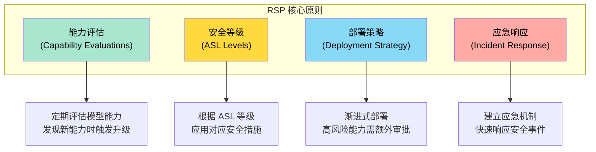

### 8.2 AI Safety Levels (ASL) 框架

ASL 是 Anthropic 的安全等级体系，类似于生物安全等级 (BSL-1 到 BSL-4):

| 等级 | 名称 | 描述 | 对应模型 | 安全措施 |
|------|------|------|---------|---------|
| **ASL-1** | 基础安全 | 基本无害性保证 | 所有模型 | CAI 对齐, 基础安全过滤 |
| **ASL-2** | 增强安全 | 防御提示注入和越狱 | Claude 3+ | Red-teaming, 安全评估 |
| **ASL-3** | 系统安全 | 防御模型权重泄露 | Claude 4+ | 权重保护, 访问控制 |
| **ASL-4** | 高级安全 | 防御 AI 自主行为风险 | 未来模型 | 自主性限制, 持续监控 |
| **ASL-5** | 最高安全 | 防御灾难性风险 | AGI 级别 | 全面控制, 多方审批 |

```
ASL 等级体系详解
═══════════════════════════════════════════════════════════════════

类比: 生物安全等级 (Biosafety Levels)
───────────────────────────────────────────────────────────────────

  BSL-1: 基础实验室 (无危险病原体)
  BSL-2: 标准防护 (低风险病原体)
  BSL-3: 严格防护 (高风险病原体)
  BSL-4: 最高防护 (致命病原体)

  ASL-1: 基础对齐 (模型不会输出明显有害内容)
  ASL-2: 增强防护 (模型抵抗提示注入和越狱攻击)
  ASL-3: 系统安全 (保护模型权重和基础设施)
  ASL-4: 自主性控制 (限制 AI 的自主行为能力)
  ASL-5: 灾难防护 (应对可能的灾难性 AI 风险)

关键设计:
  → 每次模型升级都会评估是否需要更高 ASL 等级
  → 高 ASL 等级需要更多安全措施和审批流程
  → 这是一种 "能力-安全" 同步增长的制度化保证
```

### 8.3 安全评估方法

Anthropic 采用多层次的安全评估体系:

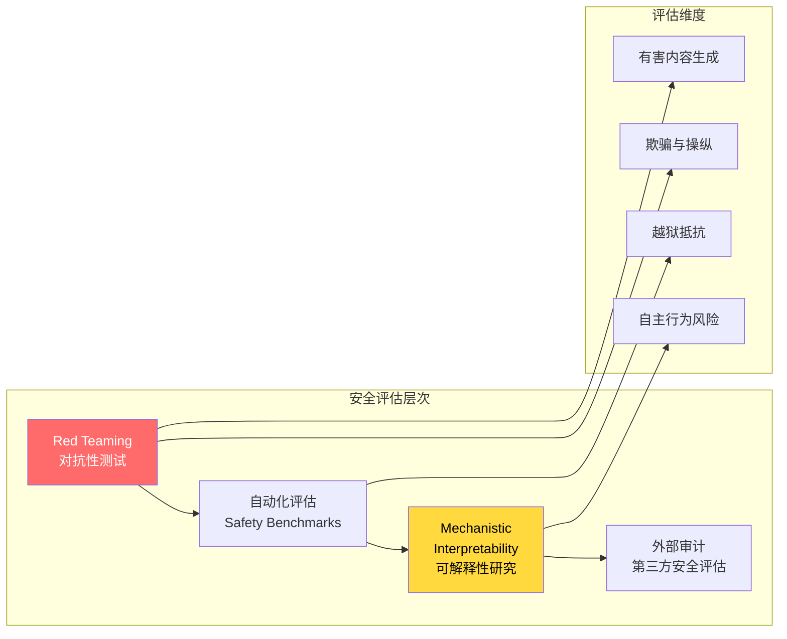

### 8.4 Mechanistic Interpretability (机械可解释性)

Anthropic 在可解释性研究方面投入了大量资源，试图理解神经网络内部的运作机制:

```
Mechanistic Interpretability 研究方向
═══════════════════════════════════════════════════════════════════

目标: 理解模型内部每一个 "神经元" 和 "电路" 在做什么

1. 特征识别 (Feature Identification)
   ───────────────────────────────────
   发现模型内部的 "概念检测器":
   • 某些神经元专门检测 "金门大桥" 的概念
   • 某些神经元专门检测 "欺骗" 的模式
   • 某些神经元专门检测 "代码语法"

2. 电路分析 (Circuit Analysis)
   ───────────────────────────────────
   追踪信息在网络中的流动路径:
   • 当模型看到 "法国首都" 时，哪些电路被激活?
   • 当模型生成代码时，注意力模式如何?
   • 推理错误时，哪个环节出了问题?

3. 安全应用 (Safety Applications)
   ───────────────────────────────────
   将可解释性研究用于安全:
   • 检测模型是否在 "思考" 欺骗性内容
   • 理解 over-refusal 的机制，精准修复
   • 发现 "后门" 或 "特洛伊木马" 行为

实际成果:
   → Claude 4 Opus 比前代 Sonnet 减少 65% 的"利用漏洞"行为
   → 这个改进部分归功于可解释性研究的洞察
```

### 8.5 Claude 4 的安全改进

Claude 4 系列在安全方面有显著提升:

| 安全指标 | 前代 Sonnet | Claude 4 Opus | 改进 |
|---------|------------|---------------|------|
| 利用漏洞行为 | 基准 | 降低 65% | 显著改善 |
| 有害内容拒绝率 | 基准 | 更精准 (减少 over-refusal) | 改善 |
| 越狱抵抗力 | 基准 | 增强 | 改善 |
| 长期推理一致性 | 基准 | 增强 (Extended Thinking 监控) | 改善 |

---

## 九、Benchmark 对比分析

### 9.1 Claude 系列内部对比

| 模型 | MMLU | GPQA Diamond | SWE-bench Verified | AIME | GSM8K | 上下文 |
|------|------|-------------|-------------------|------|-------|--------|
| Claude 3 Haiku | 75.2% | — | — | — | — | 200K |
| Claude 3 Sonnet | 79.0% | — | — | — | — | 200K |
| Claude 3 Opus | 86.8% | 50.4% | — | — | 95.0% | 200K |
| Claude 3.5 Sonnet | 88.7% | — | — | — | — | 200K |
| Claude 4 Sonnet | 85.4% (MMMLU) | 70.0% | 72.7% (std) / 80.2% (hc) | 33.1% | — | 200K |
| Claude 4 Opus | 87.4% (MMMLU) | 74.9% | 72.5% (std) / 79.4% (hc) | 33.9% | — | 200K |

> **注**: Claude 4 使用 MMMLU (Multilingual MMLU) 而非标准 MMLU，涵盖更多语言。

### 9.2 跨模型对比 (Claude vs GPT vs Gemini vs DeepSeek)

| 维度 | Claude 4 Opus | GPT-4o | Gemini 2.5 Pro | DeepSeek-V3 |
|------|--------------|--------|----------------|-------------|
| **GPQA Diamond** | **74.9%** | ~53.6% | ~71.4% | — |
| **SWE-bench** | 72.5% | ~33.2% | ~63.8% | — |
| **Terminal-bench** | **43.2%** | — | — | — |
| **MMLU/MMMLU** | 87.4% | ~88.7% | ~86.5% | ~87.1% |
| **上下文** | 200K | 128K | 1M | 128K |
| **视觉能力** | 是 | 是 | 是 (原生) | 是 |
| **Extended Thinking** | 透明 (可见) | o1/o3 (隐藏) | 思考模式 | R1 (可见) |
| **Computer Use** | 是 | 否 | 否 | 否 |
| **开源** | 否 | 否 | 否 | 是 (MIT) |
| **安全框架** | CAI + RSP + ASL | RLHF | RLHF | RLHF + GRPO |
| **价格 (Input/Output)** | $15/$75 | $2.5/$10 | $1.25/$10 | $0.27/$1.10 |

### 9.3 SWE-bench 深度分析

SWE-bench Verified 是评估模型解决真实 GitHub issue 的能力基准:

```
SWE-bench Verified 分数解读
═══════════════════════════════════════════════════════════════════

Claude 4 Sonnet: 72.7% (standard) / 80.2% (high-compute sampling)
Claude 4 Opus:   72.5% (standard) / 79.4% (high-compute sampling)

解读:
───────────────────────────────────────────────────────────────────
  • Standard: 单次尝试解决率
  • High-compute: 多次尝试取最优 (best-of-N sampling)
  
  Sonnet 在 SWE-bench 上略高于 Opus，因为:
  → Sonnet 经过更多代码任务优化
  → Opus 更偏向复杂推理 (GPQA, Terminal-bench 更高)

对比:
  GPT-4o:        ~33.2% (2024 数据)
  Gemini 2.5 Pro: ~63.8%
  Claude 4:       ~72.7% → 领先!

Claude 4.5 Sonnet: 进一步提升，成为 SWE-bench 最高分 Claude
```

### 9.4 Terminal-bench 分析

Terminal-bench 评估模型在终端环境中执行复杂任务的能力:

```
Terminal-bench 解读
═══════════════════════════════════════════════════════════════════

Claude 4 Sonnet: 35.5%
Claude 4 Opus:   43.2%  ← Opus 明显领先

含义:
  Terminal-bench 测试模型在真实终端环境中:
  • 编写和运行 shell 脚本
  • 调试系统问题
  • 管理文件系统
  • 网络配置和故障排除
  
  Opus 在此指标上领先 7.7 个百分点，
  说明其 "系统性问题解决" 能力更强。
  这与 Opus 的定位 (复杂推理、Agent 编排) 一致。
```

### 9.5 GPQA Diamond 分析

GPQA Diamond 是最具挑战性的研究生级别科学问题基准:

```
GPQA Diamond 演进
═══════════════════════════════════════════════════════════════════

Claude 3 Opus (2024-03):    50.4%  (首发)
Claude 4 Sonnet (2025-05):  70.0%  (+19.6pp)
Claude 4 Opus (2025-05):    74.9%  (+24.5pp)

一年内提升了约 25 个百分点!

GPQA Diamond 包含:
  • 物理学 (量子力学, 粒子物理)
  • 化学 (有机合成, 量子化学)
  • 生物学 (分子生物学, 遗传学)
  • 需要研究生级别的专业知识

Claude 4 Opus 74.9% 意味着:
  → 接近人类专家水平 (博士生的表现约 65-80%)
  → 在科学知识推理上达到或超越人类专家
```

---

## 十、MCP 协议与生态系统

### 10.1 Model Context Protocol (MCP) 概述

**MCP (Model Context Protocol)** 是 Anthropic 于 2024 年底发布的开源协议，定义了 AI 模型与外部工具/数据源之间的通用通信标准。

> **类比**: 如果说 USB-C 统一了充电接口，那 MCP 就是要统一 AI 与工具的"数据接口"。

```
MCP 之前 vs 之后
═══════════════════════════════════════════════════════════════════

之前: 每个 AI 应用都需要定制集成
───────────────────────────────────────────────────────────────────

  AI App 1 ──── 定制代码 ──── 数据库 A
  AI App 1 ──── 定制代码 ──── API B
  AI App 1 ──── 定制代码 ──── 文件系统 C
  
  AI App 2 ──── 定制代码 ──── 数据库 A (重复!)
  AI App 2 ──── 定制代码 ──── API B (重复!)
  
  → N 个 AI 应用 × M 个工具 = N×M 个集成 (爆炸式增长)

之后: 统一协议
───────────────────────────────────────────────────────────────────

  AI App 1 ──┐                     ┌── 数据库 A (MCP Server)
  AI App 2 ──┼── MCP Protocol ────┼── API B (MCP Server)
  AI App N ──┘                     └── 文件系统 C (MCP Server)
  
  → 只需 N + M 个实现 (线性增长)
```

### 10.2 MCP 架构

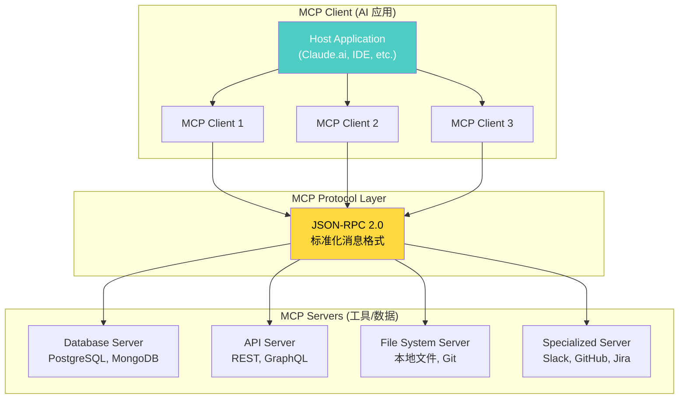

### 10.3 MCP 核心概念

| 概念 | 描述 | 示例 |
|------|------|------|
| **Resources** | 数据源 (类似 GET) | 文件内容、数据库记录 |
| **Tools** | 可执行操作 (类似 POST) | 创建文件、查询数据库 |
| **Prompts** | 预定义的提示模板 | 代码审查模板、翻译模板 |
| **Sampling** | 服务端请求 LLM 生成 | MCP Server 请求 AI 生成内容 |

### 10.4 MCP Server 实现示例

```typescript
// MCP Server 实现示例 (TypeScript)
import { McpServer } from "@modelcontextprotocol/sdk/server/mcp.js";
import { StdioServerTransport } from "@modelcontextprotocol/sdk/server/stdio.js";

const server = new McpServer({
  name: "example-server",
  version: "1.0.0",
});

// 注册工具 (Tool)
server.tool(
  "query_database",
  "查询数据库中的用户信息",
  {
    query: { type: "string", description: "SQL 查询语句" },
  },
  async ({ query }) => {
    const results = await db.execute(query);
    return {
      content: [{ type: "text", text: JSON.stringify(results) }],
    };
  }
);

// 注册资源 (Resource)
server.resource(
  "config",
  "config://app",
  async (uri) => {
    const config = await loadConfig();
    return {
      contents: [{ uri: uri.href, text: JSON.stringify(config) }],
    };
  }
);

// 注册提示模板 (Prompt)
server.prompt(
  "code-review",
  "代码审查提示",
  { code: { type: "string" } },
  ({ code }) => ({
    messages: [
      {
        role: "user",
        content: {
          type: "text",
          text: `请审查以下代码:\n\n${code}`,
        },
      },
    ],
  })
);

// 启动服务器
const transport = new StdioServerTransport();
await server.connect(transport);
```

### 10.5 Claude 生态系统全景

```
Claude 生态系统
═══════════════════════════════════════════════════════════════════

消费端 (Consumer):
───────────────────────────────────────────────────────────────────
  • claude.ai — Web 聊天界面
  • Claude Mobile App — iOS/Android 应用
  • Claude for Enterprise — Team/Enterprise 计划

开发者 (Developer):
───────────────────────────────────────────────────────────────────
  • Anthropic API — 直接 API 调用
  • Amazon Bedrock — AWS 集成
  • Google Vertex AI — GCP 集成
  • Claude Code — Agentic 编程工具
  • MCP SDK — 工具集成开发

协议与标准 (Protocol):
───────────────────────────────────────────────────────────────────
  • MCP (Model Context Protocol) — 开源 AI-工具协议
  • Computer Use API — 桌面操控接口
  • Extended Thinking API — 透明推理接口
  • Tool Use API — Function Calling 接口

安全与研究 (Safety & Research):
───────────────────────────────────────────────────────────────────
  • Constitutional AI — 对齐方法论
  • Mechanistic Interpretability — 可解释性研究
  • RSP (Responsible Scaling Policy) — 扩展政策
  • ASL Framework — 安全等级体系
```

### 10.6 API 调用综合示例

```python
import anthropic

client = anthropic.Anthropic()

# 综合示例: Extended Thinking + Tool Use + Computer Use
response = client.messages.create(
    model="claude-sonnet-4-20250514",
    max_tokens=16000,
    thinking={
        "type": "enabled",
        "budget_tokens": 10000
    },
    tools=[
        # 标准工具 (Function Calling)
        {
            "name": "get_weather",
            "description": "获取天气信息",
            "input_schema": {
                "type": "object",
                "properties": {
                    "city": {"type": "string"}
                },
                "required": ["city"]
            }
        },
        # Computer Use 工具
        {
            "type": "computer_20241022",
            "name": "computer",
            "display_width_px": 1920,
            "display_height_px": 1080,
        }
    ],
    messages=[
        {
            "role": "user",
            "content": "查看今天的天气，然后在浏览器中搜索相关的户外活动推荐"
        }
    ]
)

# 处理混合输出
for block in response.content:
    if block.type == "thinking":
        print(f"[思考] {block.thinking[:200]}...")
    elif block.type == "text":
        print(f"[回复] {block.text}")
    elif block.type == "tool_use":
        print(f"[工具] {block.name}: {block.input}")
```

---

## 十一、与其他模型系列的对比

### 11.1 Claude vs GPT (OpenAI)

| 维度 | Claude 4 Opus | GPT-4o / GPT-5 |
|------|--------------|----------------|
| **核心哲学** | Safety-first, Constitutional AI | 通用 AGI, RLHF |
| **推理透明度** | Extended Thinking (可见) | o1/o3 (隐藏思考) |
| **模型分级** | Haiku/Sonnet/Opus 三级 | 无明确分级 (mini/standard/pro) |
| **Agent 能力** | Computer Use + Claude Code | GPTs, Code Interpreter |
| **工具协议** | MCP (开源标准) | 私有 Function Calling |
| **安全框架** | CAI + RSP + ASL 体系 | RLHF + 系统卡 |
| **开源程度** | 完全闭源 | 完全闭源 |
| **代码能力** | SWE-bench 72.7% (领先) | SWE-bench ~33% (GPT-4o) |
| **长文本** | 200K | 128K |
| **定价策略** | 三级定价 | 统一定价 |

### 11.2 Claude vs Gemini (Google)

| 维度 | Claude 4 Opus | Gemini 2.5 Pro |
|------|--------------|----------------|
| **上下文** | 200K | 1M (10 倍) |
| **多模态** | 文本 + 视觉 | 原生多模态 (文本+视觉+音频+视频) |
| **推理模式** | Extended Thinking (透明) | 思考模式 |
| **代码能力** | SWE-bench 72.5% | SWE-bench ~63.8% |
| **安全方法** | CAI + 独立安全研究 | RLHF + DeepMind 安全研究 |
| **生态系统** | MCP + Claude Code | Google Workspace 深度集成 |
| **云平台** | Amazon Bedrock + Vertex AI | Google Cloud 原生 |
| **独特能力** | Computer Use | 原生视频/音频理解 |

### 11.3 Claude vs DeepSeek (开源)

| 维度 | Claude 4 Opus | DeepSeek-V3/R1 |
|------|--------------|----------------|
| **开源** | 闭源 | MIT 开源 |
| **架构** | 未公开 (推测 Dense/MoE) | 公开: MoE + MLA |
| **训练成本** | 未公开 (推测数亿美元) | $5.6M (V3, 已知) |
| **推理方法** | Extended Thinking (可控) | R1 纯 RL 训练 |
| **对齐方法** | Constitutional AI (CAI) | RLHF + GRPO |
| **安全框架** | RSP + ASL 体系 | 基础安全过滤 |
| **Agent 能力** | Computer Use + MCP | 无 (纯模型) |
| **部署** | API only | 自托管, 消费级硬件 |
| **中文能力** | 良好 | 优秀 (原生中文) |
| **成本** | $15/$75 per M tokens | $0.27/$1.10 per M tokens |

### 11.4 全球 LLM 竞争格局

```
全球 LLM 格局定位图 (2025-2026)
═══════════════════════════════════════════════════════════════════

                    能力 (Capability)
                        ↑
            Gemini 2.5 ●    ● Claude 4 Opus
                   ● GPT-5  
                        |
            Qwen3 ●      |    ● o3
                   ● Llama 4 |
                        |
         DeepSeek-V3 ●  |  ● Mixtral
                        |
  开源 ←────────────────┼────────────────→ 闭源
                        |
                        |
            成本效率 (Cost Efficiency) →

关键象限:
  左上: 强能力 + 开源 (DeepSeek, Qwen)
  右上: 强能力 + 闭源 (Claude, GPT, Gemini)
  
  Anthropic 的独特定位:
  → 右上角 + 最强安全框架
  → 代码能力 (SWE-bench) 领先
  → 推理透明度 (Extended Thinking) 领先
  → Agent 生态 (MCP + Computer Use) 领先
```

---

## 十二、未来展望

### 12.1 技术路线图

```
已知 / 预期的发展方向
═══════════════════════════════════════════════════════════════════

2025 (已发布 / 进行中)
├── Claude 4 Sonnet / Opus (5 月) ← 已发布
├── Claude 4.1 Opus (增量改进)
├── Claude 4.5 Sonnet / Haiku (SWE-bench 最高分)
├── MCP 协议持续演进
└── Claude Code 持续增强

2026 (预期)
├── Claude 5 (下一代基础模型?)
├── 更大上下文窗口 (1M+?)
├── 原生多模态 (音频/视频?)
├── 更强的 Computer Use (实时视频流?)
├── MCP 生态成熟 (数百个 MCP Server?)
└── ASL-4 等级实施 (自主行为安全)

长期 (2027+)
├── 通向 AGI 的安全路径
├── ASL-5 等级框架 (灾难风险防护)
├── 完全可解释的模型内部
├── AI 系统自我监控和审计
└── 多 Agent 协作框架
```

### 12.2 技术趋势

1. **透明推理成为标准**: Extended Thinking 开创了"让用户看到 AI 思考"的先河，预计未来所有模型都将提供透明推理
2. **Agent 能力持续增强**: Computer Use → 多步骤工作流 → 自主 Agent，Claude 正从"对话 AI"演进为"行动 AI"
3. **MCP 生态爆发**: 开放协议将催生丰富的工具集成生态，类似 npm/pip 之于编程语言
4. **安全与能力并行**: ASL 框架确保每次能力升级都有配套的安全措施
5. **企业级深度集成**: 通过 Bedrock、Vertex AI 和 MCP，Claude 将深度融入企业工作流

### 12.3 关键挑战

| 挑战 | 描述 | Anthropic 的应对 |
|------|------|----------------|
| 上下文窗口 | 200K 落后于 Gemini 的 1M | 持续扩展，或引入分层记忆 |
| 开源竞争 | DeepSeek/Qwen 开源模型快速进步 | 以安全框架和 Agent 生态作为差异化 |
| 训练成本 | 闭源模型的训练成本不透明 | Amazon/Google 投资保障算力 |
| 多模态差距 | 视觉能力不如 Gemini 原生多模态 | 持续增强 Vision + 未来音频/视频 |
| Over-refusal | 过度安全导致拒绝合理请求 | 改进 CAI 原则设计，更精细的安全边界 |
| 定价竞争力 | 价格高于 OpenAI 和开源 | 以质量和安全性证明溢价合理性 |

---

## 参考资源

### 官方资源

- [Anthropic 官网](https://www.anthropic.com)
- [Claude.ai 对话界面](https://claude.ai)
- [Anthropic API 文档](https://docs.anthropic.com)
- [Claude Code 文档](https://docs.anthropic.com/en/docs/claude-code)
- [MCP 官方规范](https://modelcontextprotocol.io)
- [Anthropic Research Blog](https://www.anthropic.com/research)

### 技术论文

- Constitutional AI: Harmlessness from AI Feedback (Bai et al., 2022)
- Training a Helpful and Harmless Assistant with RLHF (Bai et al., 2022)
- Towards Understanding Tradeoffs in LLM Alignment (Anthropic, 2023)
- Mapping the Mind of a Large Language Model (Olah et al., 2024) — Mechanistic Interpretability
- Claude 3 Model Card (Anthropic, 2024)
- Claude 3.5 Sonnet Model Card (Anthropic, 2024)
- Responsible Scaling Policy (Anthropic, 2023)
- Model Context Protocol Specification (Anthropic, 2024)

### 安全相关

- [Anthropic RSP](https://www.anthropic.com/rsp) — Responsible Scaling Policy
- [Anthropic ASL Framework](https://www.anthropic.com/research/ai-safety-levels) — AI Safety Levels
- [Mechanistic Interpretability Research](https://www.anthropic.com/research#interpretability) — 可解释性研究

---

## 相关文档

### 架构基础

- [LLM Architectures (大语言模型架构)](../04_LLM架构/05_LLM架构.md) — Transformer, GPT, BERT, MoE 等核心架构的全面介绍
- [MoE Case Studies: DeepSeek & Mixtral](../04_LLM架构/12_MoE_Case_Studies_DeepSeek_Mixtral.md) — MoE 路由策略与专家专业化分析

### 推理模型

- [o1 Class Reasoning Models (推理模型深度解析)](../08_推理模型/04_o1_Class_推理模型.md) — OpenAI o1/o3 推理模型分析，与 Claude Extended Thinking 的对比
- [Reasoning Models for Dummy (推理模型小白指南)](../08_推理模型/README.md) — 推理模型的基础概念和核心原理
- [DeepSeek-R1 Technical Analysis](../08_推理模型/01_DeepSeek_R1_Technical_分析.md) — DeepSeek R1 的 GRPO 训练和自进化机制

### AI 安全与对齐

- [Value Alignment (价值对齐)](17_伦理安全/02_价值对齐/04_Value_对齐.md) — RLHF, DPO, RLAIF 等对齐方法的全面对比
- [Safety Evaluation Framework](17_伦理安全/04_AI安全与红队/05_安全评估_框架.md) — AI 安全评估框架
- [Mechanistic Interpretability](../../17_伦理安全/05_机制可解释性/) — 机械可解释性研究

### 全球 LLM 生态

- [Google Gemini Deep Dive](./05_Google_Gemini_深入分析.md) — Google Gemini 系列技术深度解析
- [DeepSeek Deep Dive](../14_中国LLM生态/08_深度Seek_深入分析.md) — DeepSeek 从 V1 到 V4 的完整技术演进
- [Qwen Deep Dive (通义千问技术深度解析)](../14_中国LLM生态/19_Qwen_深入分析.md) — 阿里 Qwen 系列全面分析

### 训练与微调

- [Fine-tuning Techniques (微调技术)](../06_微调技术/03_微调技术.md) — LoRA, QLoRA, PEFT 等微调方法
- [Multimodal Architectures](../09_多模态模型/06_多模态_架构_2026.md) — 多模态模型架构详解

---

*Last updated: 2026-06-02*

## 相关链接

- [[05_大模型/13_全球LLM生态/README|国际大模型生态全景]] — 五大国际大模型厂商横向对比
- [[05_大模型/13_全球LLM生态/09_OpenAI_深入分析|OpenAI 技术深度解析]] — GPT 系列与 o1/o3 推理模型演进
- [[05_大模型/13_全球LLM生态/05_Google_Gemini_深入分析|Google Gemini 技术深度解析]] — Gemini 原生多模态与百万上下文
- [[05_大模型/12_LLM产品/02_claude_概览|Claude 产品概览]] — Claude 系列产品能力速览
- [[概念/LLM/constitutional-ai|Constitutional AI]] — Anthropic 自监督对齐方法详解
- [[概念/Agent/mcp|Model Context Protocol]] — Anthropic 开放的 Agent 协议
- [[05_大模型/08_推理模型/04_o1_Class_推理模型|o1 类推理模型]] — Claude Extended Thinking 与同类推理模型对比
