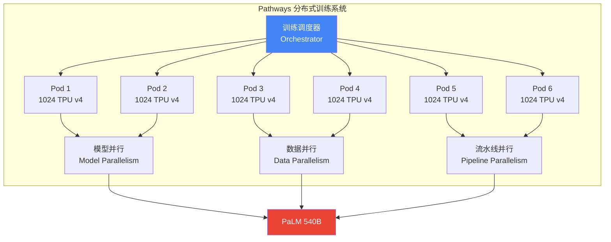
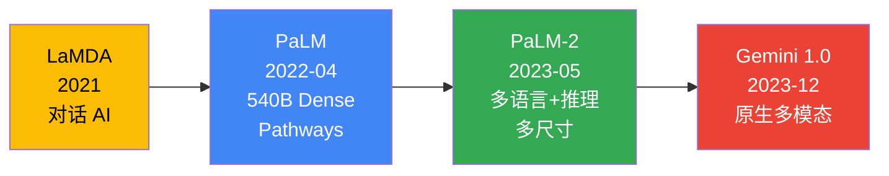
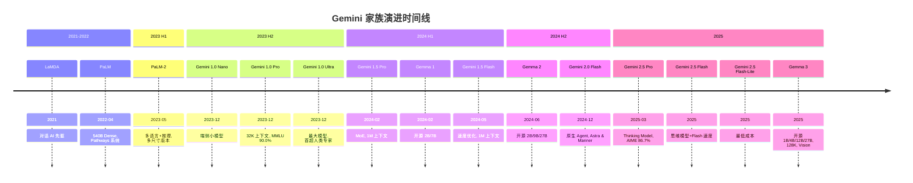
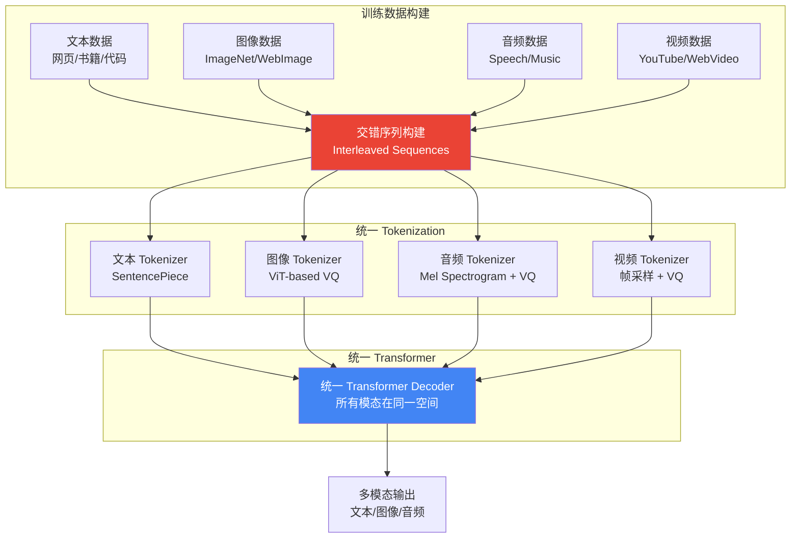
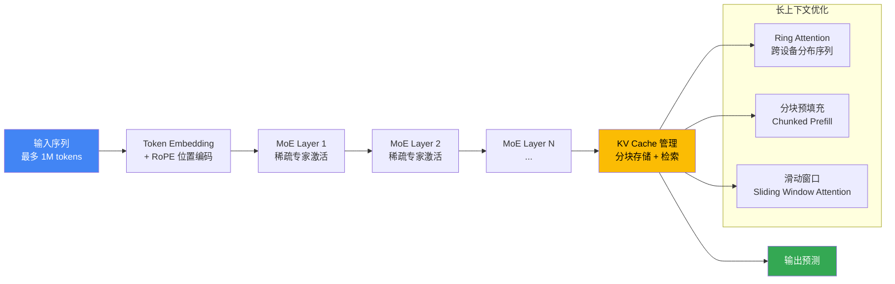
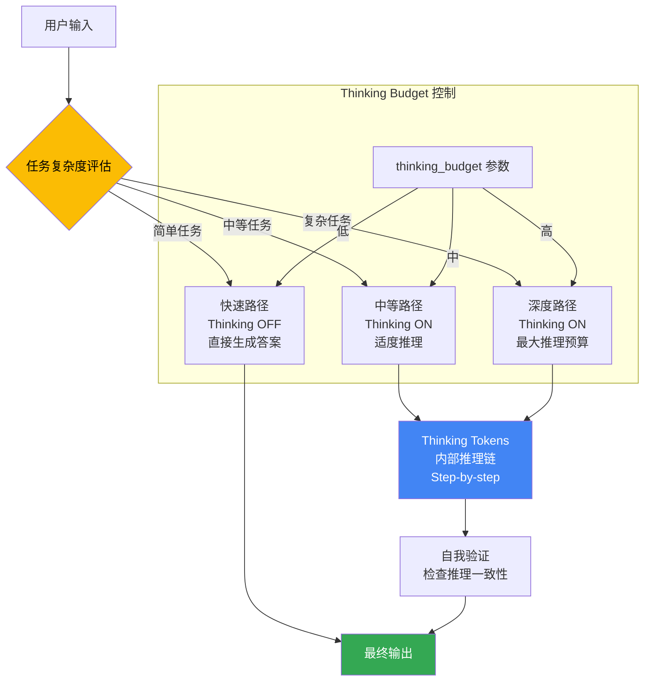
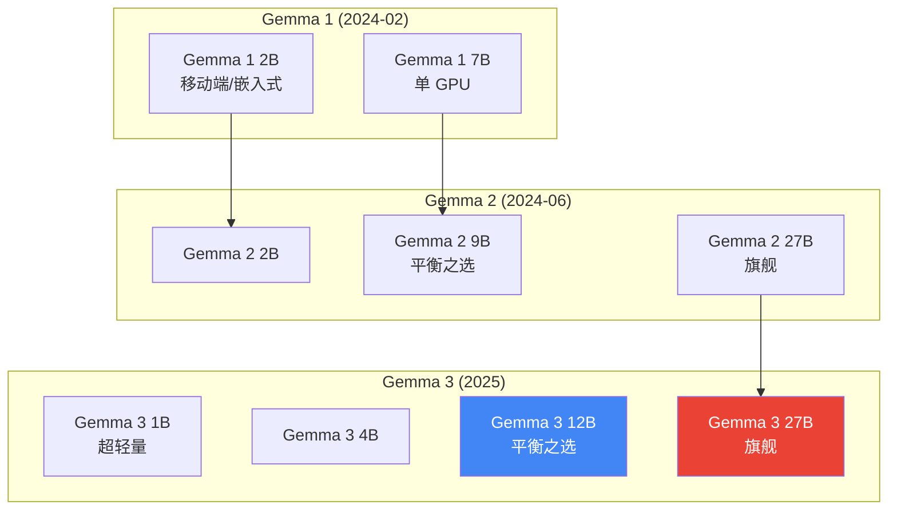
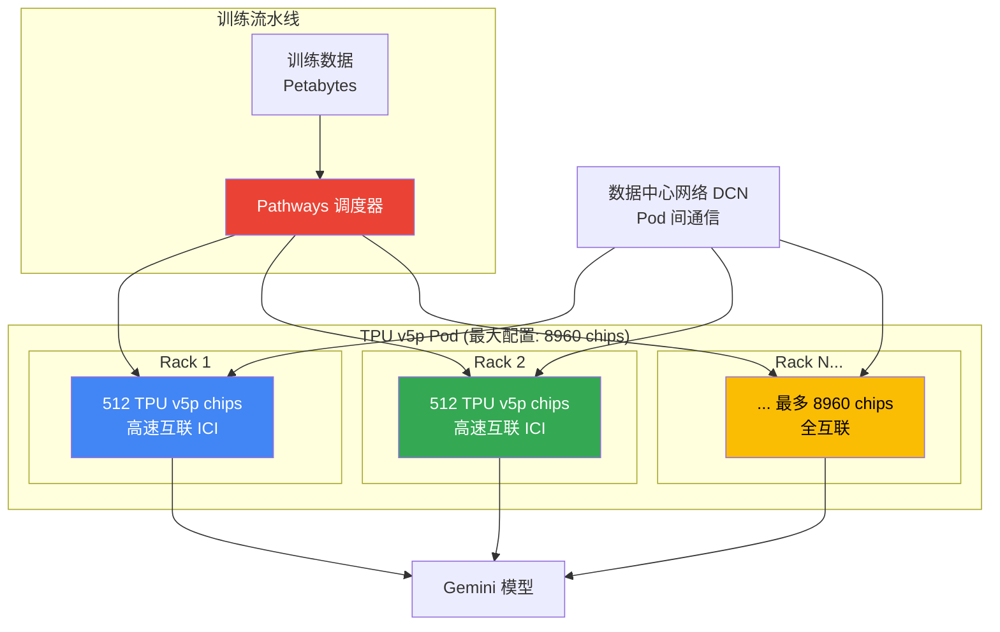
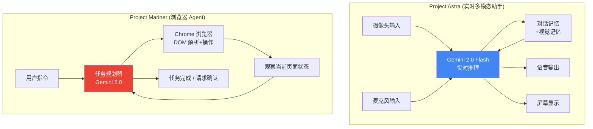
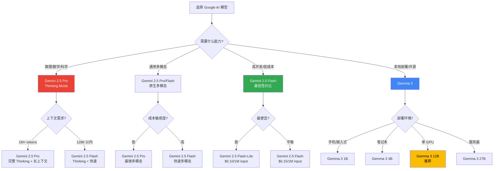

# Google Gemini 技术深度解析

> 中文简称：Google Gemini 技术深度解析

## 一句话理解

Google Gemini 就像一位"全感官交响乐指挥家"——不同于其他模型把视觉、听觉、语言分开处理再拼接，Gemini 从出生第一天起就在同一个神经网络中同时"看、听、读、说"（natively multimodal），而 Gemini 2.5 的 Thinking Mode 更像是给这位指挥家装上了"内心独白"——可以按需开启深度思考，在 AIME 2025 数学竞赛上达到 86.7% 的一次通过率，同时保持百万级 token 的超长记忆。

---

## 目录

1. [Google DeepMind 概述](#一google-deepmind-概述)
2. [Pre-Gemini 时代：LaMDA、PaLM、PaLM-2](#二pre-gemini-时代lamdapalmpalm-2)
3. [Gemini 家族完整时间线](#三gemini-家族完整时间线)
4. [核心架构创新](#四核心架构创新)
5. [Gemini 2.5 Thinking Mode 深潜](#五gemini-25-thinking-mode-深潜)
6. [Gemma 开源模型族](#六gemma-开源模型族)
7. [TPU 基础设施](#七tpu-基础设施)
8. [Project Astra & Mariner 智能体](#八project-astra--mariner-智能体)
9. [Benchmark 对比分析](#九benchmark-对比分析)
10. [与竞品对比](#十与竞品对比)
11. [实战指南](#十一实战指南)
12. [未来展望](#十二未来展望)
13. [参考资源](#参考资源)
14. [相关文档](#相关文档)

---

## 一、Google DeepMind 概述

### 1.1 定位

```
Google DeepMind
═══════════════════════════════════════════════════════════════════

定位: 全球最强 AI 研究实验室之一，兼具学术深度与工程规模

核心理念:
───────────────────────────────────────────────────────────────────
• 原生多模态: 从预训练第一天起，模型同时处理文本+图像+音频+视频
• 全栈自研: 从 TPU 芯片到训练框架到模型架构，端到端掌控
• 规模与效率并重: 从 540B PaLM 到 MoE 稀疏专家，追求帕累托最优
• 长期主义: 2010 年创立至今持续产出突破性研究
• 开放与闭环并行: Gemma 开源生态 + Gemini API 商业闭环
```

### 1.2 公司背景

| 维度 | 详情 |
|------|------|
| **公司** | Google DeepMind |
| **前身** | Google Brain (2011) + DeepMind Technologies (2010) |
| **合并时间** | 2023 年 4 月 |
| **负责人** | Demis Hassabis (CEO) |
| **总部** | Mountain View, California, USA |
| **母公司** | Alphabet Inc. (Google) |
| **核心产品** | Gemini API, Google AI Studio, Bard → Gemini App |
| **开源模型** | Gemma 系列 (Apache 2.0) |
| **硬件基础** | TPU v4 / v5e / v5p / Trillium (v6e) |

### 1.3 Google DeepMind 在 LLM 格局中的定位

Google DeepMind 是全球 AI 研究的"三极"之一 (OpenAI / Google / Anthropic)。与 OpenAI 的商业化路线和 Anthropic 的安全优先路线不同，Google 的最大优势在于 **全栈能力**——从自研芯片 (TPU) 到分布式训练框架 (Pathways) 到模型架构 (Gemini) 到应用生态 (Search / Workspace / Cloud)，形成完整闭环。

```
全球闭源 LLM 格局 (2025-2026)

┌──────────────────────────────────────────────────────────┐
│                  闭源旗舰 (Closed-Source Flagship)          │
│                                                          │
│  美国:                                                   │
│  ├── GPT-4/5 (OpenAI)        — 商业化先锋               │
│  ├── Gemini 2.5 (Google) ← 本文 — 全栈整合巨头         │
│  ├── Claude 4 (Anthropic)    — 安全优先路线              │
│  └── Llama 4 (Meta)          — 开源旗舰                  │
│                                                          │
│  中国:                                                   │
│  ├── Qwen3 (阿里)            — 开源标杆                  │
│  ├── DeepSeek-V4 (深度求索)  — 效率之王                  │
│  └── GLM-4 (智谱)            — 学术驱动                  │
└──────────────────────────────────────────────────────────┘
```

### 1.4 Google DeepMind 的五大技术哲学

1. **原生多模态 > 拼接多模态**: Gemini 从训练第一天起就在统一空间中处理所有模态，而非事后拼接视觉编码器
2. **全栈垂直整合**: TPU 芯片 → Pathways 训练框架 → Gemini 模型 → 应用层，全链自主可控
3. **长上下文是基础能力**: 从 Gemini 1.5 的 1M 到研究的 10M token，将超长记忆视为核心竞争力
4. **Thinking as a Feature**: Gemini 2.5 把推理深度变成可调参数，而非独立模型
5. **开源 + 商业双轨**: Gemma 开源生态培育社区，Gemini API 驱动商业变现

> **相关文档**: 关于原生多模态架构的详细分析，参见 [Native Multimodal Architectures](../09_多模态模型/07_Native_多模态_架构.md)

---

## 二、Pre-Gemini 时代：LaMDA、PaLM、PaLM-2

### 2.1 LaMDA (2021) — 对话 AI 先驱

**Language Model for Dialogue Applications** 是 Google 在对话 AI 领域的首个重要成果。

```
LaMDA 核心特点
═══════════════════════════════════════════════════════════════════

定位: 专为对话场景优化的语言模型
───────────────────────────────────────────────────────────────────
  • 基于 Transformer Decoder 架构
  • 使用对话数据进行微调
  • 强调对话质量: 流畅性、趣味性、信息量、安全性

技术亮点:
───────────────────────────────────────────────────────────────────
  • 多轮对话连贯性显著优于 GPT-3
  • 引入 "grounding" 机制: 将生成内容与外部知识源关联
  • 安全性: 通过 crowd-sourced 标注减少有害输出

影响:
───────────────────────────────────────────────────────────────────
  • 为后来的 Bard / Gemini App 奠定对话能力基础
  • 引发关于 AI 意识的公众讨论 (Blake Lemoine 事件)
  • 验证了大规模对话微调的有效性
```

### 2.2 PaLM (2022) — Pathways 时代的开端

**PaLM (Pathways Language Model)** 是 Google 首个基于 Pathways 系统训练的超大规模语言模型，参数量达到 540B。

| 维度 | 详情 |
|------|------|
| **发布时间** | 2022 年 4 月 |
| **参数量** | 540B (当时最大 Dense Transformer) |
| **架构** | Dense Transformer Decoder |
| **训练数据** | 780B tokens |
| **上下文窗口** | 2,048 tokens |
| **训练硬件** | 6,144 TPU v4 芯片 (Pathways 系统) |
| **核心创新** | Few-shot reasoning, Chain-of-Thought |

#### PaLM 的关键技术创新

```
PaLM 技术突破
═══════════════════════════════════════════════════════════════════

1. Pathways 分布式训练系统:
───────────────────────────────────────────────────────────────────
   • 跨 6,144 个 TPU v4 芯片进行模型并行 + 数据并行
   • 训练效率: 57.8% MFU (Model FLOPs Utilization)
   • 支持训练中断后自动恢复 (fault-tolerant training)

2. Chain-of-Thought 推理:
───────────────────────────────────────────────────────────────────
   • 在 few-shot 提示中加入推理步骤
   • GSM8K 数学推理: 88.0% (CoT + self-consistency)
   • 证明了规模 + CoT 可以解锁复杂推理能力

3. 架构改进:
───────────────────────────────────────────────────────────────────
   • SwiGLU 激活函数 (替代标准 ReLU)
   • RoPE 位置编码 (旋转位置嵌入)
   • Parallel Layer: 注意力层和 FFN 并行计算
   • SentencePiece Tokenizer (256K vocab)
```

#### Pathways 系统架构



### 2.3 PaLM-2 (2023) — 多语言与推理增强

PaLM-2 在 PaLM 基础上进行了全面优化，重点提升多语言能力和推理质量。

```
PaLM-2 改进
═══════════════════════════════════════════════════════════════════

核心改进:
───────────────────────────────────────────────────────────────────
  • 更高质量的多语言训练数据 (100+ 语言)
  • 更丰富的数学和代码数据
  • 计算最优缩放: 用更多数据训练更小模型 (Chinchilla 法则)
  • 更好的 RLHF 对齐

多尺寸版本 (代号动物):
───────────────────────────────────────────────────────────────────
  • Gecko    — 最小，可部署于移动端
  • Otter    — 中等，适合企业 API
  • Bison    — 较大，平衡性能与成本
  • Unicorn  — 最大，旗舰级性能

影响: PaLM-2 成为 Google Bard (后改名 Gemini App) 的后端模型
```

### 2.4 Pre-Gemini 演进总结



| 模型 | 时间 | 参数量 | 上下文 | 架构 | 核心创新 |
|------|------|--------|--------|------|---------|
| **LaMDA** | 2021 | 未公开 | 2K | Dense Decoder | 对话优化, Grounding |
| **PaLM** | 2022-04 | 540B | 2K | Dense Decoder | Pathways, CoT |
| **PaLM-2** | 2023-05 | 多尺寸 | 8K | Dense Decoder | 多语言, 计算最优缩放 |

---

## 三、Gemini 家族完整时间线

### 3.1 时间线全景图



### 3.2 Gemini 家族一览表

| 模型 | 发布时间 | 架构 | 上下文窗口 | 核心特点 | MMLU |
|------|---------|------|-----------|---------|------|
| **Gemini 1.0 Nano** | 2023-12 | Dense | 32K | 端侧部署 | — |
| **Gemini 1.0 Pro** | 2023-12 | Dense | 32K | 通用中间档 | 90.0% |
| **Gemini 1.0 Ultra** | 2023-12 | Dense | 32K | 旗舰，首超人类专家 | 90.0% |
| **Gemini 1.5 Pro** | 2024-02 | MoE | **1M** (→2M) | 百万上下文突破 | 85.9% |
| **Gemini 1.5 Flash** | 2024-05 | MoE | 1M | 速度+成本优化 | — |
| **Gemini 2.0 Flash** | 2024-12 | MoE | 1M | 原生 Agent 能力 | — |
| **Gemini 2.5 Pro** | 2025-03 | MoE | 1M+ | Thinking Mode | — |
| **Gemini 2.5 Flash** | 2025 | MoE | 1M | 思维+Flash 速度 | — |
| **Gemini 2.5 Flash-Lite** | 2025 | MoE | 1M | 最低成本变体 | — |

### 3.3 三代 Gemini 核心差异

```
Gemini 代际对比
═══════════════════════════════════════════════════════════════════

Gemini 1.0 (2023-12): 原生多模态奠基
───────────────────────────────────────────────────────────────────
  • 核心创新: Natively Multimodal Training
  • 从预训练第一天起，文本+图像+音频+视频统一处理
  • 不是"文本模型 + 视觉编码器"，而是真正的端到端多模态
  • Ultra 首次在 MMLU 上超过人类专家

Gemini 1.5 (2024-02): 长上下文革命
───────────────────────────────────────────────────────────────────
  • 核心创新: MoE + 1M Token Context
  • 稀疏专家架构使超长上下文成为可能
  • 可处理: 1 小时视频 / 11 小时音频 / 30K 行代码
  • 近完美的大海捞针 (Needle-in-Haystack) 召回率

Gemini 2.5 (2025-03): 思维模式时代
───────────────────────────────────────────────────────────────────
  • 核心创新: Controllable Thinking Budget
  • 同一个模型可以开启/关闭深度思考
  • AIME 2025: 86.7% (首次尝试)
  • 比 Gemini 1.5 Pro 在 LMArena 上高 120+ 分
```

---

## 四、核心架构创新

### 4.1 原生多模态训练 (Natively Multimodal Training)

Gemini 1.0 最重要的技术贡献是 **原生多模态预训练**——这不是在文本模型上"外挂"视觉能力，而是从训练第一天起就让模型在统一的 token 空间中同时处理所有模态。

#### 拼接式 vs 原生多模态

```
多模态架构对比
═══════════════════════════════════════════════════════════════════

拼接式 (Bolt-on):                     原生 (Native):
┌──────────────────────┐              ┌──────────────────────┐
│   文本 LLM (冻结)    │              │                      │
│   ┌────────────────┐ │              │   统一 Transformer   │
│   │ GPT / PaLM     │ │              │                      │
│   └────────────────┘ │              │   文本 token         │
│         ↑            │              │   图像 token         │
│   投影层 (MLP)       │              │   音频 token         │
│         ↑            │              │   视频 token         │
│   ┌────────────────┐ │              │                      │
│   │ ViT (冻结)     │ │              │   全部在同一空间     │
│   └────────────────┘ │              │   联合预训练         │
│                      │              │                      │
│  独立训练 → 事后拼接  │              │  从第一天起统一训练   │
└──────────────────────┘              └──────────────────────┘
```

| 维度 | 拼接式 (GPT-4V 早期, LLaVA) | 原生多模态 (Gemini) |
|------|---------------------------|-------------------|
| 预训练目标 | 文本 LM + 图像对比学习 (分离) | 统一的多模态 next-token prediction |
| 输入表示 | 文本 token + 视觉特征向量 (异质) | 统一的离散 token 序列 (同质) |
| 模型结构 | 分离编码器 + 浅层融合 | 单一 Transformer 处理所有模态 |
| 模态交互深度 | 仅在输入层/浅层 | 贯穿所有 Transformer 层 |
| 跨模态推理 | 有限 | 强 (深度交互) |
| 涌现能力 | 看图说话、简单描述 | 跨模态推理、模态转换、多模态代码生成 |
| 训练复杂度 | 低 (复用现有模型) | 高 (需要从头训练) |

#### 原生多模态训练流程



### 4.2 Mixture-of-Experts (MoE) + 百万级上下文

Gemini 1.5 引入了 **Mixture-of-Experts** 架构，这是实现百万级上下文窗口的关键技术基础。

#### MoE 架构原理

```
MoE (Mixture-of-Experts) 工作原理
═══════════════════════════════════════════════════════════════════

Dense Transformer:              MoE Transformer:
┌──────────────────┐            ┌──────────────────┐
│  Self-Attention  │            │  Self-Attention  │
└────────┬─────────┘            └────────┬─────────┘
         ↓                               ↓
┌──────────────────┐            ┌──────────────────┐
│  FFN (全部激活)  │            │  Router / Gate   │
│                  │            │  选择 Top-K 专家  │
│  每个 token 都   │            └────────┬─────────┘
│  经过同一个 FFN  │                     ↓
└──────────────────┘            ┌────┬────┬────┬────┐
                                │ E1 │ E2 │ E3 │ E4 │
                                │FFN │FFN │FFN │FFN │
                                └────┴────┴────┴────┘
                                Token A → E1, E3
                                Token B → E2, E4
                                (每个 token 只激活部分专家)
```

**Gemini 1.5 的 MoE 设计要点**:

| 设计要素 | 详情 |
|---------|------|
| **稀疏激活** | 每个 token 仅激活部分专家，降低计算量 |
| **上下文扩展** | MoE 的稀疏性使百万级上下文的计算变得可行 |
| **知识容量** | 多个专家相当于多个"子网络"，知识容量远超 Dense 模型 |
| **负载均衡** | 需要精心设计的路由策略防止专家坍缩 |

#### 长上下文处理流程



#### 1M 上下文的实际能力

```
Gemini 1.5 Pro 1M 上下文能做什么?
═══════════════════════════════════════════════════════════════════

输入能力:
───────────────────────────────────────────────────────────────────
  • 1 小时视频 (含音频) 的完整理解
  • 11 小时音频的转录和分析
  • 30,000 行代码的整体理解和重构
  • 多本书籍的交叉引用和综合分析
  • 整个代码仓库 (大型 repo) 的全局理解

检索能力 (Needle-in-Haystack):
───────────────────────────────────────────────────────────────────
  • 在 1M token 中精准定位特定信息
  • 近完美的召回率 (>99%)
  • 跨模态检索: 在长视频中定位特定对话
  • 跨文档关联: 在多份文档中发现隐藏联系

研究极限:
───────────────────────────────────────────────────────────────────
  • 实验室环境: 最高 10M token 上下文
  • 相当于 70 本书的全文内容
  • 约 40 小时的音频转录
```

### 4.3 Gemini 1.0 到 2.5 架构演进图

```mermaid
graph TB
    subgraph "Gemini 1.0 — 原生多模态"
        G1[Dense Transformer<br/>原生多模态训练<br/>32K context]
    end

    subgraph "Gemini 1.5 — 长上下文"
        G15[MoE Architecture<br/>1M context (production)<br/>10M context (research)]
    end

    subgraph "Gemini 2.0 — Agent 原生"
        G20[MoE + Native Function Calling<br/>Code Execution<br/>Astra + Mariner]
    end

    subgraph "Gemini 2.5 — Thinking Model"
        G25[MoE + Thinking Mode<br/>可控推理预算<br/>AIME 86.7%]
    end

    G1 --> G15
    G15 --> G20
    G20 --> G25

    style G1 fill:#4285f4,color:#fff
    style G15 fill:#34a853,color:#fff
    style G20 fill:#fbbc04,color:#000
    style G25 fill:#ea4335,color:#fff
```

---

## 五、Gemini 2.5 Thinking Mode 深潜

### 5.1 概述

Gemini 2.5 Pro 是 Google 在 2025 年 3 月发布的旗舰模型，最重要的创新是 **Thinking Mode**——将 step-by-step 推理能力直接集成到模型架构中，而非作为独立模型存在。

```
Gemini 2.5 Thinking Mode
═══════════════════════════════════════════════════════════════════

核心理念:
───────────────────────────────────────────────────────────────────
  • 不是独立的 "推理模型" (如 o1/R1)
  • 而是同一个模型的可控功能
  • 可以开启 Thinking Mode (深度推理)
  • 也可以关闭 (快速响应)
  • 思考预算 (thinking budget) 可调节

类比:
───────────────────────────────────────────────────────────────────
  普通模型:    看到问题 → 直接回答
  推理模型:    看到问题 → 强制深度思考 → 回答
  Gemini 2.5:  看到问题 → [可选: 深度思考] → 回答

  就像一个学生:
  - 简单题目: 直接写答案 (thinking off)
  - 难题: 先在草稿纸上演算 (thinking on)
  - 考试最后的大题: 反复检查 (thinking budget = high)
```

### 5.2 Thinking Mode 架构



### 5.3 Thinking Mode vs 其他推理模型

| 维度 | Gemini 2.5 Pro | OpenAI o1/o3 | DeepSeek-R1 |
|------|---------------|-------------|-------------|
| **推理方式** | 可控 thinking budget | 内置 reasoning chain | RL 涌现的 CoT |
| **是否独立模型** | 同一模型，功能开关 | 独立模型系列 | 独立模型 |
| **推理可见性** | 部分可见 | 部分可见 (summary) | 完整可见 |
| **上下文窗口** | 1M+ tokens | 128K-200K | 128K |
| **多模态推理** | 原生多模态 | 文本+视觉 | 纯文本 |
| **AIME 2025** | **86.7%** (首次尝试) | ~83% (o3) | 79.8% (R1) |
| **GPQA Diamond** | **84.0%** | ~80% | 71.5% |
| **SWE-bench** | **63.8%** | ~49% | ~42% |
| **训练方法** | SFT + RL (thinking integrated) | RL (reasoning tokens) | GRPO (纯 RL) |
| **自我纠正** | 内置 | 内置 | 涌现 (Aha Moment) |

### 5.4 Gemini 2.5 Pro 性能详解

```
Gemini 2.5 Pro 关键 Benchmark
═══════════════════════════════════════════════════════════════════

数学推理:
───────────────────────────────────────────────────────────────────
  AIME 2025 (美国数学邀请赛):
    • 86.7% — 首次尝试 (pass@1)
    • 在竞赛数学上大幅领先前代模型

科学推理:
───────────────────────────────────────────────────────────────────
  GPQA Diamond (研究生级科学问答):
    • 84.0% — 涉及物理、化学、生物的深度推理

代码能力:
───────────────────────────────────────────────────────────────────
  SWE-bench Verified (真实 GitHub issue 修复):
    • 63.8% — 端到端代码理解和修复

综合排名:
───────────────────────────────────────────────────────────────────
  LMArena (原 LMSys Chatbot Arena):
    • 比 Gemini 1.5 Pro 高 120+ 分
    • 截至 2025 年中排名前列

原生能力:
───────────────────────────────────────────────────────────────────
  • 原生多模态 (文本+图像+音频+视频)
  • 原生函数调用 (Function Calling)
  • 原生代码执行 (Code Execution)
  • 1M+ token 上下文窗口
```

### 5.5 Gemini 2.5 系列完整矩阵

```
Gemini 2.5 系列模型矩阵
═══════════════════════════════════════════════════════════════════

                        Gemini 2.5       Gemini 2.5      Gemini 2.5
                        Pro              Flash           Flash-Lite
─────────────────────────────────────────────────────────────────────
定位:                  旗舰性能          性能/成本平衡    最低成本
Thinking Mode:         ✓ (完整)         ✓ (完整)         ✓ (轻量)
上下文窗口:            1M+ tokens       1M tokens        1M tokens
最大输出 token:        65K+             64K              64K
速度:                  中等              快               最快
成本:                  最高              中等             最低
多模态:                完整              完整             完整
Agent 能力:            完整              完整             基础
适用场景:
  ├── 复杂推理         ★★★              ★★☆              ★☆☆
  ├── 代码生成         ★★★              ★★★              ★★☆
  ├── 长文档分析       ★★★              ★★★              ★★★
  ├── 高并发 API       ★☆☆              ★★★              ★★★
  └── 端侧部署         ✗                ✗                ✗
```

> **相关文档**: 关于推理模型的技术原理，参见 [Long Context Models 2026](../04_LLM架构/11_Long_上下文_模型_2026.md) 和 [LLM Architectures](../04_LLM架构/05_LLM架构.md)

---

## 六、Gemma 开源模型族

### 6.1 概述

Gemma 是 Google DeepMind 的开源模型系列，基于 Gemini 研究成果构建，以 Apache 2.0 许可证发布。Gemma 的目标是为社区提供高质量的开源基座模型。

```
Gemma 开源策略
═══════════════════════════════════════════════════════════════════

定位: Gemini 研究成果的开源化
───────────────────────────────────────────────────────────────────
  • 基于 Gemini 的架构和训练技术
  • 针对社区和研究人员优化
  • Apache 2.0 许可证 (完全开放商用)
  • 覆盖从嵌入式到服务器的全场景

与 Meta Llama 的对比:
───────────────────────────────────────────────────────────────────
  Llama:    西方开源标杆，生态最成熟
  Gemma:    Google 技术下放，模型效率更高
  Qwen:     中国开源标杆，多语言最强
  DeepSeek: 中国开源先锋，效率之王
```

### 6.2 Gemma 代际演进



### 6.3 Gemma 各代详细对比

| 维度 | Gemma 1 | Gemma 2 | Gemma 3 |
|------|---------|---------|---------|
| **发布时间** | 2024-02 | 2024-06 | 2025 |
| **尺寸** | 2B, 7B | 2B, 9B, 27B | 1B, 4B, 12B, 27B |
| **架构** | Dense Transformer | Dense Transformer (改进) | Dense Transformer (进一步优化) |
| **上下文窗口** | 8K | 8K | **128K** |
| **视觉支持** | 无 | 无 | **有 (Vision)** |
| **许可证** | Gemma Terms | Gemma Terms | **Apache 2.0** |
| **训练数据** | 未公开 | 未公开 | 未公开 (更大) |
| **Tokenizer** | SentencePiece (256K) | SentencePiece (256K) | SentencePiece (256K+) |
| **核心改进** | 初代开源 | 性能大幅提升 | 长上下文+视觉+Apache 2.0 |

### 6.4 Gemma 3 技术特点

```
Gemma 3 关键特性
═══════════════════════════════════════════════════════════════════

1. 128K 上下文窗口:
───────────────────────────────────────────────────────────────────
   • 从 Gemma 2 的 8K 提升到 128K
   • 16 倍提升，可处理长文档和代码库
   • 使用 RoPE + 位置编码优化

2. 视觉理解 (Vision):
───────────────────────────────────────────────────────────────────
   • 支持图像输入和理解
   • 基于 Gemini 原生多模态技术的简化版
   • 适用于多模态应用场景

3. Apache 2.0 许可证:
───────────────────────────────────────────────────────────────────
   • 从限制性许可证转向完全开放
   • 允许商用、修改、再分发
   • 与 Llama / DeepSeek 开源策略对齐

4. 尺寸覆盖全面:
───────────────────────────────────────────────────────────────────
   • 1B: 手机 / 嵌入式 (~2GB)
   • 4B: 笔记本 / 边缘设备 (~8GB)
   • 12B: 单 GPU 工作站 (~24GB)
   • 27B: 高性能服务器 (~48GB)
```

### 6.5 Gemma 部署指南

```python
# 使用 HuggingFace Transformers 加载 Gemma 3
from transformers import AutoModelForCausalLM, AutoTokenizer

# Gemma 3 12B — 单 GPU 推荐配置
model_id = "google/gemma-3-12b-it"

tokenizer = AutoTokenizer.from_pretrained(model_id)
model = AutoModelForCausalLM.from_pretrained(
    model_id,
    torch_dtype="auto",
    device_map="auto",
    # 支持 128K 上下文
    max_position_embeddings=131072,
)

# 对话示例
messages = [
    {"role": "system", "content": "You are a helpful assistant."},
    {"role": "user", "content": "Explain the difference between MoE and Dense architectures."},
]
text = tokenizer.apply_chat_template(messages, tokenize=False, add_generation_prompt=True)
inputs = tokenizer(text, return_tensors="pt").to(model.device)
outputs = model.generate(**inputs, max_new_tokens=2048)
print(tokenizer.decode(outputs[0], skip_special_tokens=True))
```

```bash
# 使用 Ollama 快速部署 Gemma 3
ollama run gemma3:1b      # 超轻量 (~2GB)
ollama run gemma3:4b      # 边缘设备 (~8GB)
ollama run gemma3:12b     # 单 GPU (~24GB)
ollama run gemma3:27b     # 高性能 (~48GB)

# 使用 vLLM 部署高并发服务
python -m vllm.entrypoints.openai.api_server \
    --model google/gemma-3-12b-it \
    --tensor-parallel-size 1 \
    --max-model-len 131072 \
    --gpu-memory-utilization 0.9 \
    --port 8000
```

---

## 七、TPU 基础设施

### 7.1 TPU 芯片演进

Google 是全球唯一同时自研 AI 芯片和训练大模型的公司。TPU (Tensor Processing Unit) 是 Gemini 训练的硬件基础。

```
TPU 芯片演进时间线
═══════════════════════════════════════════════════════════════════

TPU v1 (2016)      → 推理专用，8-bit 整数运算
TPU v2 (2017)      → 训练+推理，16-bit 浮点 (bfloat16)
TPU v3 (2018)      → 性能翻倍，液冷散热
TPU v4 (2021)      → 性能再次翻倍，用于 PaLM 训练
TPU v5e (2023)     → 效率优化，性价比提升
TPU v5p (2023)     → 性能优化，最大 Pod 8960 芯片
Trillium (v6e, 2024) → 新一代，4.7x 性能提升 vs v5e
```

| 芯片 | 年份 | BF16 算力 (TFLOPS) | HBM 容量 | 互联带宽 | 关键应用 |
|------|------|-------------------|---------|---------|---------|
| **TPU v4** | 2021 | 275 | 32GB | 600 Gbps | PaLM (6144 chips) |
| **TPU v5e** | 2023 | 393 | 16GB | — | Gemini 推理 |
| **TPU v5p** | 2023 | 459 | 95GB | — | Gemini 训练 (8960 chips/pod) |
| **Trillium (v6e)** | 2024 | ~1850 | 32GB HBM | — | Gemini 2.x 训练 |

### 7.2 TPU Pod 架构



### 7.3 TPU vs NVIDIA GPU 对比

| 维度 | TPU v5p | NVIDIA H100 | NVIDIA B200 |
|------|---------|-------------|-------------|
| **BF16 算力** | 459 TFLOPS | 989 TFLOPS | ~4500 TFLOPS |
| **HBM 容量** | 95GB HBM | 80GB HBM3 | 192GB HBM3e |
| **互联** | ICI (专用) | NVLink 4.0 | NVLink 5.0 |
| **最大集群** | 8960 chips/pod | 数万 GPU | 数万 GPU |
| **生态** | JAX / TensorFlow | CUDA / 全框架 | CUDA / 全框架 |
| **可用性** | Google Cloud 独占 | 广泛可用 | 2024-2025 量产 |
| **成本** | 仅 Google 内部 | $25-40K/卡 | ~$30-50K/卡 |
| **软件生态** | JAX-first | 最完善 | 最完善 |

### 7.4 Pathways 训练系统

Pathways 是 Google 的下一代 AI 训练框架，专为超大规模分布式训练设计。

```
Pathways 系统特点
═══════════════════════════════════════════════════════════════════

1. 异构并行:
───────────────────────────────────────────────────────────────────
   • 数据并行: 不同数据在不同设备上处理
   • 模型并行: 模型参数分布在多设备上
   • 流水线并行: 不同层在不同设备上处理
   • 专家并行: MoE 的不同专家在不同设备上

2. 容错训练:
───────────────────────────────────────────────────────────────────
   • 自动检测芯片故障
   • 训练中断后自动恢复 (checkpoint recovery)
   • 在 6144+ 芯片上训练数周无需人工干预

3. 效率优化:
───────────────────────────────────────────────────────────────────
   • 混合精度训练 (bfloat16 + float32)
   • 梯度累积和通信优化
   • PaLM 达到 57.8% MFU (Model FLOPs Utilization)
   • 接近理论峰值的训练效率
```

---

## 八、Project Astra & Mariner 智能体

### 8.1 Project Astra — 实时多模态助手

Project Astra 是 Google 在 2024 年 Google I/O 上发布的实时 AI 助手项目，目标是创建能够 "看、听、理解" 的通用 AI 助手。

```
Project Astra
═══════════════════════════════════════════════════════════════════

定位: 实时多模态 AI 助手
───────────────────────────────────────────────────────────────────
  • 通过手机摄像头实时理解周围世界
  • 低延迟的语音对话
  • 记忆和上下文积累
  • 多模态输入: 视觉 + 语音 + 文本

核心能力:
───────────────────────────────────────────────────────────────────
  • 实时视觉理解: 看到物体并回答问题
  • 空间记忆: 记住之前看到的东西
  • 多步骤推理: 在视觉场景中执行复杂指令
  • 低延迟: 接近实时的响应速度

技术基础:
───────────────────────────────────────────────────────────────────
  • Gemini 2.0 Flash 的快速多模态推理
  • 流式处理: 不需要等待完整输入
  • 多模态上下文窗口: 积累对话和视觉信息
```

### 8.2 Project Mariner — 浏览器 AI 智能体

Project Mariner 是 Google 的浏览器 AI 智能体，可以自主操作浏览器完成复杂任务。

```
Project Mariner
═══════════════════════════════════════════════════════════════════

定位: 浏览器端 AI Agent
───────────────────────────────────────────────────────────────────
  • 自主操作 Chrome 浏览器
  • 理解网页结构 (HTML/DOM)
  • 执行多步骤任务 (购物、预订、信息收集)
  • 人机协作: 关键步骤请求确认

Agent 能力栈:
───────────────────────────────────────────────────────────────────
  Level 1: 信息查询 — "帮我搜索最近的航班"
  Level 2: 表单填写 — "帮我填写这个申请表"
  Level 3: 多步操作 — "在 Amazon 上找到最便宜的选项并加入购物车"
  Level 4: 复杂任务 — "帮我规划整个旅行行程并预订"

技术架构:
───────────────────────────────────────────────────────────────────
  ┌─────────────────────────────────────────────┐
  │  Gemini 2.0 Flash (原生多模态 + Function Call) │
  │         ↓                                    │
  │  Browser DOM Parser (网页结构理解)             │
  │         ↓                                    │
  │  Action Planner (任务规划)                    │
  │         ↓                                    │
  │  Chrome Extension (浏览器操作执行)             │
  └─────────────────────────────────────────────┘
```

### 8.3 Agent 架构对比



### 8.4 Gemini 2.0 原生 Agent 能力

Gemini 2.0 Flash 是首个将 Agent 能力作为原生功能集成的 Gemini 模型：

| Agent 能力 | 说明 | 实现方式 |
|-----------|------|---------|
| **Native Function Calling** | 原生支持函数调用 | 模型内部理解函数 schema 并生成调用 |
| **Code Execution** | 原生代码执行 | 内置沙箱环境执行 Python 代码 |
| **Tool Use** | 工具使用 | 支持搜索、计算、API 调用等工具 |
| **Multi-turn Planning** | 多步规划 | 将复杂任务分解为可执行的步骤序列 |

---

## 九、Benchmark 对比分析

### 9.1 Gemini 系列性能演进

| 模型 | MMLU | AIME 2025 | GPQA Diamond | SWE-bench Verified | 上下文 |
|------|------|-----------|-------------|-------------------|--------|
| **Gemini 1.0 Pro** | 90.0% | — | — | — | 32K |
| **Gemini 1.0 Ultra** | 90.0% | — | — | — | 32K |
| **Gemini 1.5 Pro** | 85.9% | — | — | — | 1M |
| **Gemini 2.0 Flash** | — | — | — | — | 1M |
| **Gemini 2.5 Pro** | — | **86.7%** | **84.0%** | **63.8%** | 1M+ |

> **注意**: MMLU 分数在 Gemini 1.5 下降是因为评测标准更严格 (contamination-free evaluation)。Gemini 2.5 的综合能力通过 LMArena 排名体现，比 1.5 Pro 高 120+ 分。

### 9.2 Gemini 2.5 Pro vs 竞品旗舰

| Benchmark | Gemini 2.5 Pro | GPT-4o | Claude 3.5 Sonnet | DeepSeek-R1 | Qwen3-235B |
|-----------|---------------|--------|-------------------|-------------|------------|
| **MMLU** | — | 88.7% | 88.3% | 90.8% | 88.0% |
| **AIME 2025** | **86.7%** | — | — | 79.8% | 81.5% |
| **GPQA Diamond** | **84.0%** | 53.6% | 65.0% | 71.5% | 72.0% |
| **SWE-bench** | **63.8%** | 38.1% | 49.0% | 42.0% | 38.2% |
| **上下文** | 1M+ | 128K | 200K | 128K | 128K |
| **多模态** | 原生 4 模态 | 视觉+文本 | 视觉+文本 | 纯文本 | 视觉+文本 |
| **Thinking Mode** | 可控 | 无 | 无 | 始终开启 | 可切换 |

### 9.3 上下文窗口对比

```
上下文窗口对比 (2024-2026)
═══════════════════════════════════════════════════════════════════

Gemini 1.5/2.5 Pro    ██████████████████████████████████████████ 1M+ tokens
Gemini 1.5/2.5 Flash  ██████████████████████████████████████████ 1M tokens
Claude 3.5 Sonnet     ████████ 200K tokens
Llama 4 Scout         ██████████████████████████████████████████ 10M tokens
Llama 4 Maverick      ██████████████████████████████████████████ 10M tokens
GPT-4o                █████ 128K tokens
DeepSeek-V3           █████ 128K tokens
Qwen3-235B            █████ 128K tokens
Gemma 3               █████ 128K tokens

                    128K    256K    512K    1M      2M      5M      10M
                    |       |       |       |       |       |       |
```

### 9.4 成本效率对比 (API 价格)

| 模型 | 输入价格 ($/1M tokens) | 输出价格 ($/1M tokens) | 上下文 | 性价比评价 |
|------|----------------------|----------------------|--------|-----------|
| **Gemini 2.5 Pro** | $1.25 (≤200K) / $2.50 (>200K) | $10.00 / $15.00 | 1M+ | 旗舰级，成本中等 |
| **Gemini 2.5 Flash** | $0.15 | $0.60 (non-thinking) / $3.50 (thinking) | 1M | 极高性价比 |
| **Gemini 2.5 Flash-Lite** | $0.10 | $0.40 | 1M | 最低成本 |
| **GPT-4o** | $2.50 | $10.00 | 128K | 较高 |
| **Claude 3.5 Sonnet** | $3.00 | $15.00 | 200K | 较高 |
| **DeepSeek-V3** | $0.27 | $1.10 | 128K | 极高 |

---

## 十、与竞品对比

### 10.1 Google vs OpenAI

| 维度 | Google (Gemini 2.5) | OpenAI (GPT-4o / o3) |
|------|--------------------|--------------------|
| **核心优势** | 原生多模态 + 百万上下文 + Thinking Mode | 生态最成熟 + 推理模型先行者 |
| **架构** | Dense → MoE, 原生 4 模态 | Dense → MoE, 视觉+文本 |
| **上下文** | **1M+** (生产), 10M (研究) | 128K-200K |
| **推理能力** | Thinking Mode (可控) | o1/o3 (独立模型) |
| **硬件** | TPU 自研 (v4/v5p/Trillium) | NVIDIA GPU (A100/H100/B200) |
| **Agent 生态** | Astra + Mariner | GPTs + Actions |
| **开源模型** | Gemma (1B-27B) | 无 (曾经开源 GPT-2) |
| **应用集成** | Search + Workspace + Cloud | ChatGPT + API |
| **训练框架** | Pathways (JAX) | 自研 (PyTorch-based) |
| **多模态深度** | **原生 (从预训练开始)** | 拼接式 (后接视觉编码器) |

### 10.2 Google vs Anthropic

| 维度 | Google (Gemini 2.5) | Anthropic (Claude 3.5/4) |
|------|--------------------|--------------------|
| **核心优势** | 全栈能力 + 规模 | 安全性 + 代码能力 |
| **上下文** | **1M+** | 200K |
| **多模态** | **原生 4 模态** | 视觉+文本 |
| **安全策略** | 多层安全过滤 | Constitutional AI |
| **推理模式** | Thinking Mode (可控) | 无独立推理模式 |
| **开源** | Gemma | 无 |
| **Agent** | Astra + Mariner | Computer Use |

### 10.3 Google vs DeepSeek

| 维度 | Google (Gemini 2.5) | DeepSeek (V4/R1) |
|------|--------------------|--------------------|
| **核心优势** | 原生多模态 + 全栈 | 极致效率 + 开源 |
| **训练成本** | 未公开 (估计数亿美元) | **$5.6M** (V3 已知) |
| **架构** | Dense → MoE | Dense → MoE + MLA |
| **推理** | Thinking Mode | GRPO + Aha Moment |
| **上下文** | 1M+ | 128K (V3), 1M (V4) |
| **多模态** | 原生 4 模态 | 文本为主 + 视觉 |
| **开源** | Gemma (有限) | **全部模型 (MIT)** |
| **硬件** | TPU 自研 | NVIDIA H800 |
| **许可证** | Gemma Terms → Apache 2.0 | MIT (完全开放) |

### 10.4 全球 LLM 格局定位图

```
全球 LLM 格局 (2025-2026)
═══════════════════════════════════════════════════════════════════

                    闭源旗舰
                    ────────
              GPT-5 ─── Gemini 2.5 ─── Claude 4
                 \          |           /
                  \         |          /
                   ┌────────┴────────┐
                   │   原生多模态     │
                   │   + 长上下文     │
                   │   + Agent 能力   │
                   └────────┬────────┘
                            |
            ┌───────────────┼───────────────┐
            │               │               │
        开源旗舰        效率先锋        垂直专家
        ────────        ────────        ────────
     Llama 4          DeepSeek-V4     Cursor (代码)
     Qwen3-235B       DeepSeek-R1     Perplexity (搜索)
     Gemma 3          Mistral         各类垂直应用

关键趋势:
├── 推理模型成为标配 (Thinking Mode / o1 / R1)
├── Agent 能力成为新战场
├── 原生多模态 vs 拼接多模态的分野
├── 长上下文从差异化变为标配
└── 开源 vs 闭源性能差距持续缩小
```

---

## 十一、实战指南

### 11.1 Gemini API 调用

```python
# Google Gemini API (Python SDK)
import google.generativeai as genai

# 配置 API Key
genai.configure(api_key="YOUR_API_KEY")

# 基础文本生成 (Gemini 2.5 Pro)
model = genai.GenerativeModel("gemini-2.5-pro")

response = model.generate_content(
    "Explain the key differences between MoE and Dense Transformer architectures.",
    generation_config=genai.GenerationConfig(
        max_output_tokens=4096,
        temperature=0.7,
    ),
)
print(response.text)

# 多模态输入 (图像 + 文本)
from google.generativeai.types import Part

response = model.generate_content([
    "Describe what's in this image and explain the physics behind it.",
    Part.from_uri(
        file_uri="https://example.com/image.jpg",
        mime_type="image/jpeg"
    ),
])
print(response.text)

# Thinking Mode 控制
response = model.generate_content(
    "Prove that the square root of 2 is irrational.",
    generation_config=genai.GenerationConfig(
        thinking_config=genai.types.ThinkingConfig(
            thinking_budget=24576,  # 思考 token 预算
        ),
        max_output_tokens=65536,
    ),
)
# 获取思考过程和最终答案
thinking = response.candidates[0].content.parts[0].text  # 思考过程
answer = response.candidates[0].content.parts[1].text     # 最终答案
```

### 11.2 函数调用 (Function Calling)

```python
# Gemini Native Function Calling
from google.generativeai.types import FunctionDeclaration, Tool

# 定义函数
weather_function = FunctionDeclaration(
    name="get_weather",
    description="Get current weather for a location",
    parameters={
        "type": "object",
        "properties": {
            "location": {
                "type": "string",
                "description": "City name, e.g., 'San Francisco, CA'",
            },
            "unit": {
                "type": "string",
                "enum": ["celsius", "fahrenheit"],
                "description": "Temperature unit",
            },
        },
        "required": ["location"],
    },
)

# 创建工具
weather_tool = Tool(function_declarations=[weather_function])

# 使用工具调用模型
model = genai.GenerativeModel("gemini-2.5-pro", tools=[weather_tool])
response = model.generate_content("What's the weather like in Tokyo today?")

# 检查是否触发函数调用
function_call = response.candidates[0].content.parts[0].function_call
if function_call:
    print(f"Function: {function_call.name}")
    print(f"Args: {function_call.args}")
    # 调用实际的 weather API 并将结果返回给模型
```

### 11.3 长上下文处理

```python
# Gemini 1.5/2.5 Pro 长上下文处理

model = genai.GenerativeModel("gemini-2.5-pro")

# 上传大文件到 Gemini File API
import google.generativeai as genai

# 上传 PDF 文档
pdf_file = genai.upload_file(
    path="research_paper.pdf",
    mime_type="application/pdf"
)

# 上传视频
video_file = genai.upload_file(
    path="lecture_video.mp4",
    mime_type="video/mp4"
)

# 处理长文档: 分析整篇论文
response = model.generate_content([
    "Summarize the key contributions of this paper and compare with related work.",
    pdf_file,
])

# 处理视频: 理解视频内容
response = model.generate_content([
    "List all the main topics discussed in this video and provide timestamps.",
    video_file,
])

# 代码仓库分析 (整个 repo 作为上下文)
import os

code_files = []
for root, dirs, files in os.walk("./my-project"):
    for f in files:
        if f.endswith((".py", ".js", ".ts")):
            code_files.append(
                genai.upload_file(os.path.join(root, f))
            )

response = model.generate_content([
    "Analyze this entire codebase. Identify the main architecture patterns,",
    "potential bugs, and suggest improvements.",
    *code_files,
])
```

### 11.4 Gemma 本地部署 + 微调

```python
# Gemma 3 LoRA 微调示例
from transformers import AutoModelForCausalLM, AutoTokenizer
from peft import LoraConfig, get_peft_model, TaskType
from trl import SFTTrainer, SFTConfig

# 1. 加载 Gemma 3 12B
model_id = "google/gemma-3-12b-it"
model = AutoModelForCausalLM.from_pretrained(
    model_id, torch_dtype="auto", device_map="auto"
)
tokenizer = AutoTokenizer.from_pretrained(model_id)

# 2. 配置 LoRA
lora_config = LoraConfig(
    task_type=TaskType.CAUSAL_LM,
    r=16,
    lora_alpha=32,
    target_modules=[
        "q_proj", "k_proj", "v_proj", "o_proj",
        "gate_proj", "up_proj", "down_proj"
    ],
    lora_dropout=0.05,
    bias="none",
)

model = get_peft_model(model, lora_config)
model.print_trainable_parameters()
# 输出: trainable params: ~30M || all params: 12B || trainable%: 0.25%

# 3. 训练配置
sft_config = SFTConfig(
    output_dir="./gemma3-12b-finetuned",
    num_train_epochs=3,
    per_device_train_batch_size=2,
    gradient_accumulation_steps=8,
    learning_rate=2e-5,
    max_seq_length=8192,
    bf16=True,
    logging_steps=10,
    save_strategy="epoch",
)

trainer = SFTTrainer(
    model=model,
    args=sft_config,
    train_dataset=train_dataset,
    processing_class=tokenizer,
)

trainer.train()
```

### 11.5 模型选型决策树



---

## 十二、未来展望

### 12.1 技术路线图

```
已知 / 预期的发展方向:
═══════════════════════════════════════════════════════════════════

2025 (已发布 / 进行中)
├── Gemini 2.5 Pro / Flash / Flash-Lite
├── Thinking Mode 持续优化
├── Gemma 3 系列 (1B-27B, 128K, Vision)
├── Project Astra 正式上线
├── Project Mariner 公测
└── Trillium (TPU v6e) 全面部署

2025 H2 - 2026 (预期)
├── Gemini 3.0 (下一代基础模型?)
├── 更长的上下文窗口 (2M+ production?)
├── 更强的 Agent 能力 (多 Agent 协作?)
├── 原生图像/视频生成 (统一模型?)
├── TPU Trillium 大规模集群
└── Gemma 4 (更大开源模型?)

2026+ (展望)
├── 原生多模态 Agent (Astra + Mariner 融合?)
├── 10M+ token 上下文进入生产环境
├── 自改进 / 自进化训练
├── 个性化模型 (Personal Gemini)
└── 端侧 Gemini Nano 持续进化
```

### 12.2 技术趋势分析

1. **Thinking Mode 成为标配**: Gemini 2.5 证明了可控推理的价值，预计未来所有 Gemini 变体都将支持 Thinking Mode
2. **Agent 能力是下一个战场**: Astra + Mariner 代表了 Google 在 Agent 方向的布局，原生 Function Calling 使 Agent 开发更简单
3. **长上下文从差异化变为标配**: 1M token 已经不够，2M-10M 将成为新标准
4. **原生多模态持续深化**: 从"能处理"到"能生成"——统一的多模态输入输出模型
5. **TPU 生态扩大**: Trillium 的性能飞跃将推动更大规模模型的训练
6. **开源策略调整**: Gemma 转向 Apache 2.0 显示了 Google 对开源生态的重视

### 12.3 关键挑战

| 挑战 | 描述 | Google 的应对 |
|------|------|-------------|
| **推理成本** | 百万上下文 + Thinking Mode 计算量大 | MoE 稀疏激活 + Flash 变体 |
| **幻觉问题** | 超长上下文中信息可能被扭曲 | Near-perfect recall + 引用验证 |
| **搜索整合** | Gemini 与 Google Search 的关系 | AI Overviews + Gemini in Search |
| **竞争压力** | DeepSeek 等高效模型的压力 | 持续创新 + Gemma 开源 |
| **安全对齐** | 强大模型的安全风险 | 多层安全过滤 + Red-teaming |
| **TPU 生态封闭** | TPU 仅 Google Cloud 可用 | 支持 NVIDIA GPU 部署 |

---

## 参考资源

### 官方资源

- [Google AI Studio](https://aistudio.google.com) — Gemini API 在线调试
- [Gemini API 文档](https://ai.google.dev/docs) — 完整 API 参考
- [Google DeepMind Blog](https://deepmind.google/discover/blog/) — 研究博客
- [Gemma 模型 (HuggingFace)](https://huggingface.co/google) — 开源模型下载
- [Google Cloud TPU](https://cloud.google.com/tpu) — TPU 云服务

### 技术论文

- PaLM: Scaling Language Modeling with Pathways (2022)
- PaLM 2: Technical Report (2023)
- Gemini: A Family of Highly Capable Multimodal Models (2023)
- Gemini 1.5: Unlocking Multimodal Understanding Across Millions of Tokens of Context (2024)
- Gemini 2.5: Pushing the Frontier with Advanced Reasoning, Multimodality, Long Context, and Next Generation Agentic Capabilities (2025)
- Gemma: Open Models Based on Gemini Research and Technology (2024)
- Gemma 3 Technical Report (2025)

### 社区资源

- [Awesome Gemini](https://github.com/nicepkg/awesome-gemini) — 社区精选 Gemini 资源
- [Gemini Cookbook](https://github.com/google-gemini/cookbook) — 官方代码示例
- [Gemma 模型合集 (HuggingFace)](https://huggingface.co/collections/google/gemma-3-release-67c6d4ab9fe2c1a2b1e4f5e9) — 全系列 Gemma 3 模型

---

## 相关文档

### 架构基础

- [LLM Architectures (大语言模型架构)](../04_LLM架构/05_LLM架构.md) — Transformer, GPT, BERT, MoE 等核心架构的全面介绍
- [MoE Routing and Load Balancing](../04_LLM架构/13_MoE_Routing_and_负载均衡.md) — MoE 路由策略与负载均衡技术详解
- [MoE Case Studies: DeepSeek & Mixtral](../04_LLM架构/12_MoE_Case_Studies_DeepSeek_Mixtral.md) — MoE 在实际模型中的应用案例分析

### 多模态与长上下文

- [Native Multimodal Architectures (原生多模态架构)](../09_多模态模型/07_Native_多模态_架构.md) — 从拼接式到原生多模态的架构演进深度解析
- [Long Context Models 2026 (长上下文模型)](../04_LLM架构/11_Long_上下文_模型_2026.md) — 万级到百万级 token 处理技术的全面分析
- [Multimodal Architectures 2026](../09_多模态模型/06_多模态_架构_2026.md) — 多模态模型的最新架构进展

### 推理模型

- [Reasoning Models 2026 (推理模型)](../08_推理模型/README.md) — 推理模型的基础概念和核心原理
- [o1 Class Reasoning Models](../08_推理模型/04_o1_Class_推理模型.md) — OpenAI o1/o3 类推理模型分析
- [DeepSeek-R1 Technical Analysis](../08_推理模型/01_DeepSeek_R1_Technical_分析.md) — GRPO 训练和自进化机制详细分析

### 全球 LLM 生态

- [DeepSeek Deep Dive (深度求索技术深度解析)](../14_中国LLM生态/08_深度Seek_深入分析.md) — MLA、MoE、GRPO 等核心技术创新
- [Qwen Deep Dive (通义千问技术深度解析)](../14_中国LLM生态/19_Qwen_深入分析.md) — 阿里 Qwen 系列全面分析

---

*Last updated: 2026-06-02*

## 相关链接

- [[05_大模型/13_全球LLM生态/README|国际大模型生态全景]] — 五大国际大模型厂商横向对比
- [[05_大模型/13_全球LLM生态/09_OpenAI_深入分析|OpenAI 技术深度解析]] — 对标 Gemini 的 GPT-o 系列推理模型
- [[05_大模型/13_全球LLM生态/01_Anthropic_Claude_深入分析|Anthropic Claude 技术深度解析]] — 同期竞争者技术路线
- [[05_大模型/12_LLM产品/04_gemini_概览|Gemini 产品概览]] — Gemini 系列产品能力速览
- [[概念/LLM/gemini|Gemini]] — Gemini 模型概念卡片
- [[05_大模型/04_LLM架构/11_Long_上下文_模型_2026|长上下文模型 2026]] — Gemini 百万上下文相关架构
- [[05_大模型/09_多模态模型/06_多模态_架构_2026|多模态架构 2026]] — Gemini 原生多模态架构
