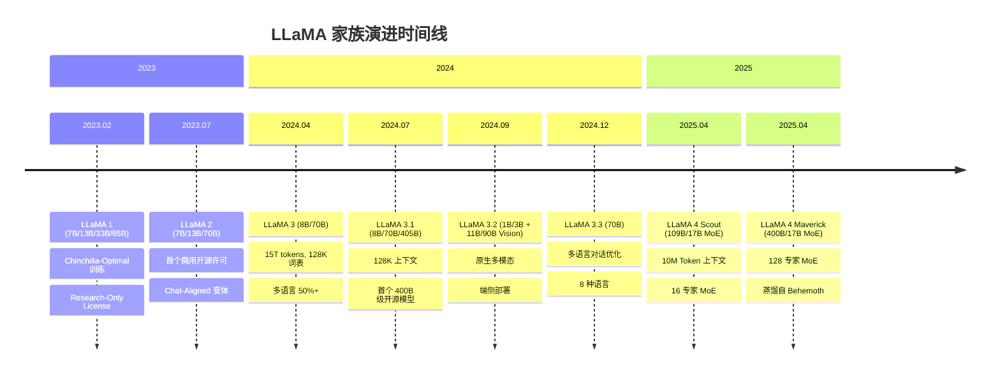
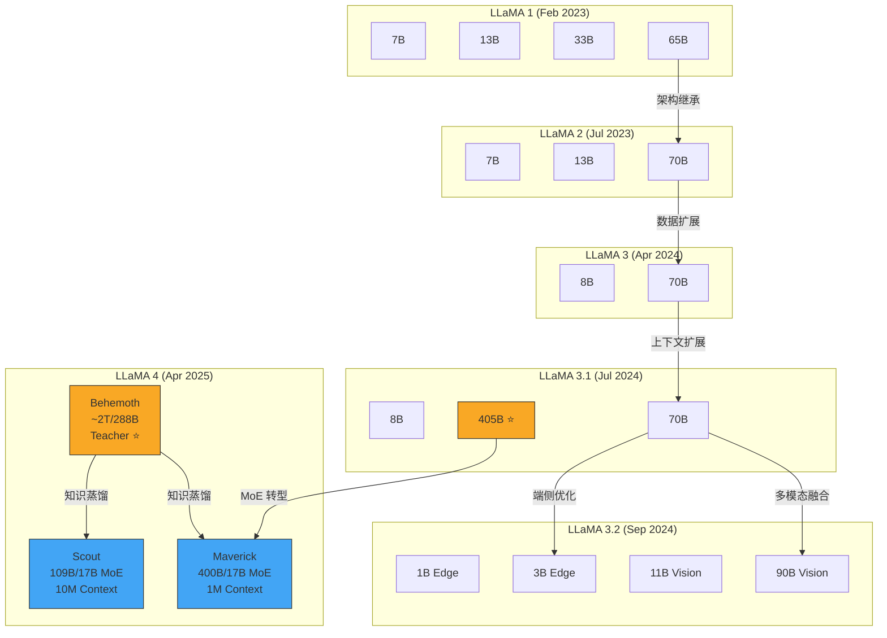
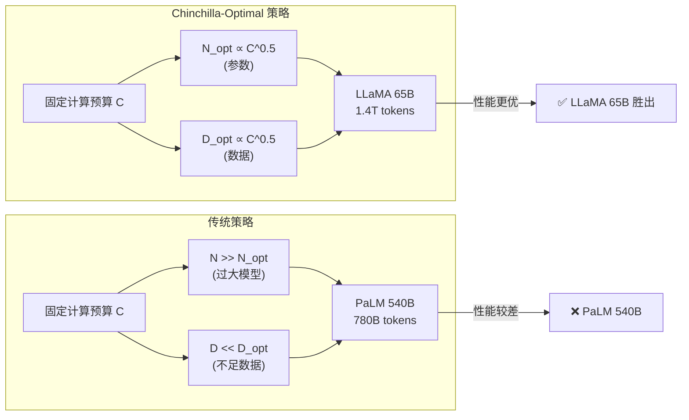
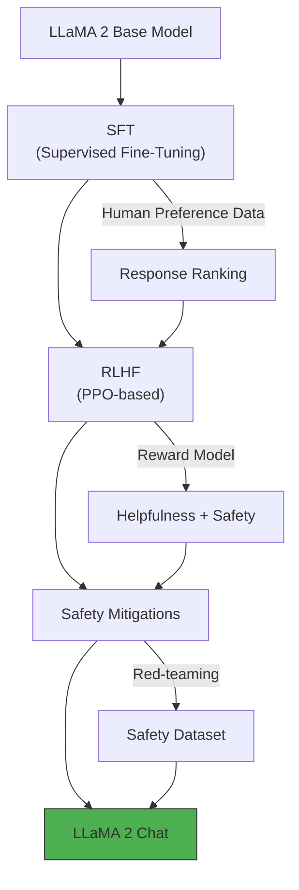
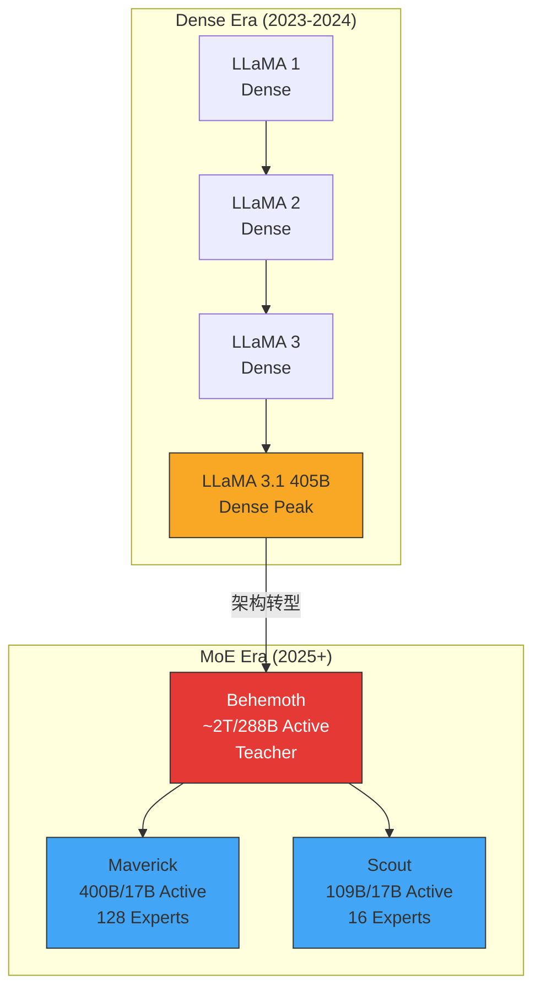
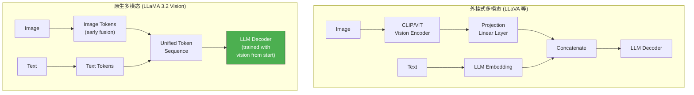

# Meta LLaMA 深度技术解析：从 Dense 到 MoE 的开源 LLM 进化之路

> 中文简称：Meta LLaMA 深度技术解析：从 Dense 到 MoE 的开源 LLM

> **一句话理解**: LLaMA 是 Meta 开源的 LLM 家族——就像 Android 之于手机行业，LLaMA 用开放权重策略让全世界都能站在巨人的肩膀上构建 AI 应用，从 7B 小模型一路进化到 10M 上下文的 MoE 巨兽。

---

## 目录

1. [Meta AI 与 FAIR 概述](#1-meta-ai-与-fair-概述)
2. [LLaMA 家族完整时间线](#2-llama-家族完整时间线)
3. [架构演进：LLaMA 1→4 详解](#3-架构演进llama-14-详解)
4. [各代核心创新](#4-各代核心创新)
5. [LLaMA 4 MoE 架构深度剖析](#5-llama-4-moe-架构深度剖析)
6. [原生多模态能力](#6-原生多模态能力)
7. [Benchmark 跨代演进](#7-benchmark-跨代演进)
8. [开源生态与社区影响](#8-开源生态与社区影响)
9. [LLaMA Code 代码模型](#9-llama-code-代码模型)
10. [部署实践与推理优化](#10-部署实践与推理优化)
11. [交叉引用与延伸阅读](#11-交叉引用与延伸阅读)

---

## 1. Meta AI 与 FAIR 概述

### 1.1 组织定位

```
Meta AI (原 Facebook AI Research / FAIR)
═══════════════════════════════════════════════════════════════════

总部: Menlo Park, California, USA
首席 AI 科学家: Yann LeCun (图灵奖得主, 2018)
全球实验室: Menlo Park · New York · Paris · London · Montreal · Tel Aviv

战略定位:
───────────────────────────────────────────────────────────────────
• Open-Weight Strategy: 开放模型权重，推动社区创新
• 基础研究 + 工程落地并重
• 覆盖 NLP、CV、Robotics、Multimodal 全域
• 目标: 让 AI 像互联网一样开放和普惠
```

### 1.2 FAIR 的开源基因

Meta AI 的开源策略在 AI 行业中独树一帜。不同于 OpenAI 和 Google 的闭源路线，Meta 选择了**开放权重（Open-Weight）**策略，这一决策深刻影响了整个 LLM 生态：

| 维度 | Meta (Open-Weight) | OpenAI (Closed) | Google (Semi-Open) |
|------|--------------------|----|--------|
| 模型权重 | 公开发布 | 仅 API | Gemma 部分开放 |
| 训练方法 | 论文详尽公开 | 部分公开 | 论文公开 |
| 商业许可 | LLaMA 2+ 允许商用 | 付费 API | Gemini 闭源, Gemma 开放 |
| 社区生态 | 极其繁荣 (100K+ 微调) | 依赖 API 生态 | 成长中 |
| 研究影响 | 催生 Alpaca/Vicuna 等 | GPT 系列标杆 | PaLM/Gemma |

### 1.3 Yann LeCun 的技术哲学

Yann LeCun 对 AI 发展方向有着深远的影响，他的核心理念直接塑造了 LLaMA 的技术路线：

- **Scaling Law 的实践者**: 坚信数据量和训练计算量的增长是性能提升的关键
- **开放科学倡导者**: "If AI is going to transform society, it must be built openly"
- **自监督学习先驱**: 推动 masked language modeling 和 contrastive learning 等基础方法
- **世界模型 (World Model)**: 近年力推 Joint Embedding Predictive Architecture (JEPA)

---

## 2. LLaMA 家族完整时间线

### 2.1 时间线全景图



### 2.2 代际关系图



### 2.3 参数规模增长趋势

```
LLaMA 参数规模增长 (最大模型)
═══════════════════════════════════════════════════════════════════

 参数量    │
 (B)      │
          │
 2000 ─── │                                          ┌──── ~2000B (Behemoth)
          │                                          │
  405 ─── │                    ┌──── 405B            │
          │                    │                     │
  400 ─── │                    │    ┌── 400B (Mav)   │
          │                    │    │                 │
   70 ─── │         ┌── 70B   │    │    ┌── 70B      │
          │         │         │    │    │             │
   65 ─── │ ┌─ 65B  │         │    │    │             │
          │ │       │         │    │    │             │
   33 ─── │ │ 33B   │         │    │    │             │
          │ │       │         │    │    │             │
   13 ─── │ │ 13B   │ 13B     │    │    │             │
    8 ─── │ │       │    8B   │    │    │             │
    7 ─── │ │  7B   │  7B     │    │    │             │
          │ │       │         │    │    │             │
          └─┴───────┴─────────┴────┴────┴─────────────┴──
            v1       v2        v3   v3.1 v3.2/3.3      v4
          (2023.02)(2023.07)(2024.04)(07)(09/12)    (2025.04)

注: v4 为 MoE 总参数量，激活参数仅 17B
```

---

## 3. 架构演进：LLaMA 1→4 详解

### 3.1 基础架构组件对比

| 架构组件 | LLaMA 1 | LLaMA 2 | LLaMA 3 | LLaMA 3.1 | LLaMA 4 |
|----------|---------|---------|---------|-----------|---------|
| **基础架构** | Decoder-only Transformer | 同左 | 同左 | 同左 | Sparse MoE Transformer |
| **位置编码** | RoPE | RoPE | RoPE | Extended RoPE | QK-Norm (部分无 RoPE) |
| **归一化** | RMSNorm (Pre-Norm) | RMSNorm | RMSNorm | RMSNorm | RMSNorm + QK-Norm |
| **激活函数** | SwiGLU | SwiGLU | SwiGLU | SwiGLU | SwiGLU |
| **注意力** | GQA | GQA | GQA (全尺寸) | GQA | Interleaved Attention |
| **词表大小** | 32K | 32K | 128K (tiktoken) | 128K | 128K+ |
| **上下文长度** | 2K | 4K | 8K | 128K | 10M (Scout) / 1M (Maverick) |
| **训练 Tokens** | 1-1.4T | 2T | 15T | 15T+ | 40T (Scout) / 22T (Maverick) |
| **精度** | FP16/BF16 | FP16/BF16 | BF16 | BF16 | FP8 |

### 3.2 核心架构组件解析

#### RoPE (Rotary Position Embedding)

LLaMA 全系列采用 RoPE 作为位置编码方案（LLaMA 4 部分 block 除外），其核心思想是将位置信息编码为旋转矩阵：

```python
# RoPE 核心实现
import torch

def apply_rope(x: torch.Tensor, freqs_cis: torch.Tensor) -> torch.Tensor:
    """
    对 query/key 应用旋转位置编码
    x: [batch, seq_len, n_heads, head_dim]
    freqs_cis: [seq_len, head_dim//2] (预计算的旋转频率)
    """
    # 将最后一维拆成对
    x_pairs = x.float().reshape(*x.shape[:-1], -1, 2)
    x_complex = torch.view_as_complex(x_pairs)

    # 广播并应用旋转
    freqs_cis = freqs_cis.unsqueeze(0).unsqueeze(2)  # [1, seq, 1, dim//2]
    x_rotated = x_complex * freqs_cis

    # 转回实数域
    x_out = torch.view_as_real(x_rotated).reshape(*x.shape)
    return x_out.type_as(x)
```

**RoPE 的优势**:
- 相对位置编码：直接建模 token 间的相对距离
- 长度外推性：理论上可以推广到训练长度之外（LLaMA 3.1 验证了这一点）
- 计算效率：只需要逐元素乘法

#### RMSNorm (Root Mean Square Normalization)

```python
class RMSNorm(torch.nn.Module):
    """
    LLaMA 全系列采用 RMSNorm 替代 LayerNorm
    去掉均值中心化，只保留缩放
    """
    def __init__(self, dim: int, eps: float = 1e-6):
        super().__init__()
        self.eps = eps
        self.weight = torch.nn.Parameter(torch.ones(dim))

    def forward(self, x: torch.Tensor) -> torch.Tensor:
        # 计算 RMS
        norm = x.float().pow(2).mean(-1, keepdim=True).add(self.eps).rsqrt()
        return (x.float() * norm).type_as(x) * self.weight
```

**vs LayerNorm**:
- LayerNorm: $\hat{x} = \frac{x - \mu}{\sigma} \cdot \gamma + \beta$ (均值中心化 + 方差归一化)
- RMSNorm: $\hat{x} = \frac{x}{\text{RMS}(x)} \cdot \gamma$ (只做方差归一化)
- 实验证明 RMSNorm 性能相当但计算更快

#### SwiGLU 激活函数

```python
# SwiGLU FFN 实现
def swiglu_ffn(x: torch.Tensor, w1, w2, w3) -> torch.Tensor:
    """
    SwiGLU: 结合 Swish 激活和 GLU (Gated Linear Unit)
    FFN(x) = (Swish(xW1) ⊙ xW3) W2

    相比 ReLU FFN:
    - 参数多 50% (3 个权重矩阵 vs 2 个)
    - 但 hidden_dim 缩小到 8/3 * d_model (vs 4 * d_model)
    - 总计算量相当，但性能更好
    """
    gate = torch.nn.functional.silu(x @ w1)  # Swish gate
    value = x @ w3
    return (gate * value) @ w2
```

#### GQA (Grouped-Query Attention)

LLaMA 3 开始全系列采用 GQA，是 MHA 和 MQA 的折中：

```
注意力机制对比
═══════════════════════════════════════════════════════════════════

MHA (Multi-Head Attention):
  Q: [H heads]   K: [H heads]   V: [H heads]
  每个 Q head 对应独立的 K, V head
  KV Cache 大小: H × d_head × seq_len

MQA (Multi-Query Attention):
  Q: [H heads]   K: [1 head]    V: [1 head]
  所有 Q head 共享同一组 K, V
  KV Cache 大小: 1 × d_head × seq_len

GQA (Grouped-Query Attention) — LLaMA 采用:
  Q: [H heads]   K: [G groups]  V: [G groups]
  G 个 Q head 共享一组 K, V (1 < G < H)
  KV Cache 大小: G × d_head × seq_len

  示例: 32 Q heads, 8 KV groups → 每 4 个 Q head 共享 1 组 KV
  KV Cache 缩小到 MHA 的 1/4，性能损失极小
```

### 3.3 LLaMA 各代模型参数详细配置

#### LLaMA 1 (Feb 2023)

| 配置项 | 7B | 13B | 33B | 65B |
|--------|-----|------|------|------|
| 层数 | 32 | 40 | 60 | 80 |
| Hidden Dim | 4096 | 5120 | 6656 | 8192 |
| Attention Heads | 32 | 40 | 52 | 64 |
| 训练 Tokens | 1.0T | 1.0T | 1.4T | 1.4T |
| 上下文 | 2048 | 2048 | 2048 | 2048 |
| GQA | 否 | 否 | 否 | 否 |

**训练数据构成**:
- CommonCrawl (67.0%) — 经 CCNet pipeline 清洗
- C4 (15.0%) — Colossal Clean Crawled Corpus
- GitHub (4.5%) — 代码数据
- Wikipedia (4.5%) — 20 种语言
- Books (4.5%) — Gutenberg + Books3
- ArXiv (2.5%) — 科学论文
- StackExchange (2.0%) — 问答数据

#### LLaMA 2 (Jul 2023)

| 配置项 | 7B | 13B | 70B |
|--------|-----|------|------|
| 层数 | 32 | 40 | 80 |
| Hidden Dim | 4096 | 5120 | 8192 |
| Attention Heads | 32 | 40 | 64 |
| GQA Groups | — | — | 8 |
| 训练 Tokens | 2.0T | 2.0T | 2.0T |
| 上下文 | 4096 | 4096 | 4096 |

**关键改进**:
- 训练数据量增加 40%: 2T tokens (vs 1.4T)
- 上下文长度翻倍: 4K (vs 2K)
- 70B 模型引入 GQA
- 首个允许商业使用的开源 LLM 许可

#### LLaMA 3 (Apr 2024)

| 配置项 | 8B | 70B |
|--------|-----|------|
| 层数 | 32 | 80 |
| Hidden Dim | 4096 | 8192 |
| Attention Heads | 32 | 64 |
| GQA Groups | 8 | 8 |
| 词表大小 | 128,256 | 128,256 |
| 训练 Tokens | 15T | 15T |
| 上下文 | 8192 | 8192 |

**Tokenizer 升级**:
- 从 SentencePiece (32K) 升级到 tiktoken (128K)
- 编码效率提升 ~30%（同一文本所需 token 数减少）
- 多语言覆盖率大幅提升

#### LLaMA 3.1 (Jul 2024)

| 配置项 | 8B | 70B | 405B |
|--------|-----|------|-------|
| 层数 | 32 | 80 | 126 |
| Hidden Dim | 4096 | 8192 | 16384 |
| Attention Heads | 32 | 64 | 128 |
| GQA Groups | 8 | 8 | 8 |
| 训练 Tokens | 15T+ | 15T+ | 15T+ |
| 上下文 | 128K | 128K | 128K |

**405B 的里程碑意义**:
- 首个公开的 400B 级模型
- 在多项 benchmark 上对标 GPT-4
- 验证了 open-weight 策略在超大规模模型上的可行性

---

## 4. 各代核心创新

### 4.1 LLaMA 1: Chinchilla-Optimal Training

#### Scaling Law 的实践

LLaMA 1 最重要的贡献不是架构创新，而是**训练方法论**——用实验证明了 Chinchilla Scaling Law 的正确性：

```
Chinchilla Scaling Law vs 传统做法
═══════════════════════════════════════════════════════════════════

传统做法 (GPT-3, PaLM):
  "越大越好" → 优先增大模型参数
  GPT-3:  175B params × 300B tokens = 计算预算分配不均
  PaLM:   540B params × 780B tokens = 模型过大，数据不足

Chinchilla 最优 (Hoffmann et al., 2022):
  "参数和数据应该同比例增长"
  给定固定计算预算 C, 最优分配:
    N_opt ∝ C^0.5  (模型参数)
    D_opt ∝ C^0.5  (训练 tokens)

LLaMA 的实践:
  LLaMA 65B × 1.4T tokens
  └── 比 PaLM 540B × 780B tokens 性能更好
  └── 计算量远小于 PaLM
  └── 证明: 小模型 + 多数据 > 大模型 + 少数据
```



**核心结论**:

| 模型 | 参数量 | 训练 Tokens | MMLU | 结论 |
|------|--------|-------------|------|------|
| LLaMA 1 65B | 65B | 1.4T | ~63% | Chinchilla-optimal |
| PaLM | 540B | 780B | ~60% | Under-trained |
| Chinchilla 70B | 70B | 1.4T | ~67% | Chinchilla-optimal |
| GPT-3 175B | 175B | 300B | ~47% | Severely under-trained |

### 4.2 LLaMA 2: 开放商用许可

LLaMA 2 的划时代意义在于**许可证革命**：

```
LLaMA 2 License 的影响
═══════════════════════════════════════════════════════════════════

许可条款:
───────────────────────────────────────────────────────────────────
✅ 允许商用 (月活 < 7 亿的公司)
✅ 允许修改和衍生作品
✅ 允许再分发
⚠️ 月活 > 7 亿需单独申请 (基本只有大厂)
❌ 不能用于训练其他 LLM (有争议条款)

催生的生态系统:
───────────────────────────────────────────────────────────────────
• Alpaca (Stanford) — 低成本指令微调的开端
• Vicuna (UC Berkeley) — 高质量对话模型
• Code Llama (Meta) — 代码专用模型
• WizardLM — 复杂指令跟随
• OpenChat — 社区微调标杆
• 以及数以万计的 HuggingFace 微调模型
```

#### Chat Alignment 方法

LLaMA 2 Chat 变体的对齐流程：



### 4.3 LLaMA 3: 数据质量革命

LLaMA 3 的核心创新集中在**数据工程**：

```
LLaMA 3 数据工程策略
═══════════════════════════════════════════════════════════════════

训练规模: 15T tokens (7× LLaMA 2)
───────────────────────────────────────────────────────────────────

数据质量 Pipeline:
1. 更严格的过滤
   ├── 基于模型的文本质量分类器
   ├── 去重 (URL/文档/段落级别)
   └── 启发式过滤 + 人工审查

2. 多语言扩展
   ├── 50%+ 非英语数据
   ├── 30+ 种语言
   └── 语言 ID 标记

3. 知识密度提升
   ├── 增加 STEM/代码/推理数据比例
   ├── 高质量教科书数据
   └── 合成数据增强 (用 LLaMA 2 生成)

4. Tokenizer 升级
   ├── tiktoken (128K vocabulary)
   ├── 编码效率提升 ~30%
   └── 更好的多语言 tokenization
```

#### 128K Vocabulary Tokenizer

```python
# Tokenizer 效率对比
"""
同一段中文文本的 tokenization:

LLaMA 2 (SentencePiece, 32K):
  "人工智能正在改变世界" → 12 tokens
  (大量中文字符被拆分为 Unicode byte 序列)

LLaMA 3 (tiktoken, 128K):
  "人工智能正在改变世界" → 5 tokens
  (常用中文词汇被收录到词表中)

效率提升:
  - 英文: ~15% 更少 tokens
  - 中文: ~55% 更少 tokens
  - 代码: ~20% 更少 tokens
  - 平均: ~30% 更少 tokens
"""
```

### 4.4 LLaMA 3.1: 128K 上下文扩展

从 8K 扩展到 128K 的工程挑战：

```
128K 上下文扩展策略
═══════════════════════════════════════════════════════════════════

阶段 1: 预训练阶段 (8K)
  └── 标准 RoPE, base=10000

阶段 2: 渐进式长度扩展
  ├── Step 1: 8K → 16K (调整 RoPE base)
  ├── Step 2: 16K → 32K
  ├── Step 3: 32K → 64K
  └── Step 4: 64K → 128K
  每步微调 ~1000 steps

阶段 3: 后训练
  ├── SFT on long-context data
  ├── DPO on long-context preference
  └── Needle-in-haystack evaluation

RoPE 外推 vs 内插:
───────────────────────────────────────────────────────────────────
外推 (Extrapolation): 直接使用更大的位置索引
  └── 可能不稳定，但 LLaMA 3.1 通过渐进式训练解决了

内插 (Interpolation): 缩放位置索引到训练范围内
  position_scaled = position * (L_train / L_target)
  └── 更稳定但可能损失分辨率

LLaMA 3.1 选择了外推 + 渐进式训练的方案
```

### 4.5 LLaMA 3.2: 端侧模型 + 原生多模态

```
LLaMA 3.2 双轨策略
═══════════════════════════════════════════════════════════════════

Track 1: 端侧部署 (1B / 3B)
───────────────────────────────────────────────────────────────────
目标: 手机、IoT、嵌入式设备
优化:
  ├── 知识蒸馏 (从大模型蒸馏)
  ├── 结构化剪枝
  ├── INT4/INT8 量化
  └── Arm NPU / Apple Neural Engine 适配

性能 (3B):
  ├── MMLU: ~58% (接近 LLaMA 2 13B)
  ├── 推理速度: ~40 tokens/s (Snapdragon 8 Gen 3)
  └── 内存占用: ~1.8GB (INT4)

Track 2: 原生多模态 (11B / 90B Vision)
───────────────────────────────────────────────────────────────────
目标: 图文理解，对标 GPT-4V
创新:
  ├── 图像 token 直接融入 Transformer
  ├── 无需独立 CLIP/ViT 推理
  └── 从早期训练阶段就包含视觉数据
```

---

## 5. LLaMA 4 MoE 架构深度剖析

> 更多关于 MoE 架构的通用原理，请参阅 → [MoE 案例研究：DeepSeek-MoE 与 Mixtral](../04_LLM架构/12_MoE_Case_Studies_DeepSeek_Mixtral.md)

### 5.1 MoE 转型的战略意义

LLaMA 4 是 Meta 首次从 Dense 架构转向 Mixture of Experts，这是一个标志性的技术转向：



**为什么要转向 MoE?**

| 维度 | Dense 405B (LLaMA 3.1) | MoE 400B/17B (Maverick) |
|------|-------------------------|--------------------------|
| 推理 FLOPs | ~810B (全参数) | ~34B (仅激活参数) |
| 推理速度 | 慢 (~20 tok/s on 8×H100) | 快 (~80+ tok/s on 8×H100) |
| 内存占用 | ~810GB (FP16) | ~800GB (但可 offload 非活跃专家) |
| 训练效率 | 每个 token 更新全部参数 | 每个 token 仅更新活跃专家 |
| 模型容量 | 405B | 400B 总参/17B 活跃 |
| 性能 | 强 | 更强 (知识蒸馏增益) |

### 5.2 Scout: 10M Token 上下文的 MoE 模型

#### 架构参数

```
LLaMA 4 Scout 架构规格
═══════════════════════════════════════════════════════════════════

模型类型: Sparse Mixture of Experts
总参数量: 109B
激活参数量: 17B (每个 token)
专家数量: 16
每 token 激活专家: Top-K (推测 K=2)
训练 Tokens: 40T
上下文长度: 10,000,000 (10M tokens)
精度: FP8

关键架构特征:
───────────────────────────────────────────────────────────────────
1. Interleaved Attention:
   交替使用全局注意力和局部注意力
   ├── Block A: Global Attention (全序列)
   ├── Block B: Local Attention (滑动窗口)
   ├── Block C: Global Attention
   └── 以此类推...

2. QK Normalization:
   在 attention 的 Q, K 上做额外归一化
   防止长序列训练时的 attention logits 发散

3. 部分 Block 不使用 RoPE:
   某些层采用 QK-Norm 替代旋转位置编码
   可能对超长上下文更稳定

4. FP8 训练:
   首次大规模使用 FP8 精度训练
   显著降低训练显存和计算成本
```

#### 10M 上下文的工程挑战

```
10M Token Context 的工程挑战与解决方案
═══════════════════════════════════════════════════════════════════

挑战 1: Attention 的计算复杂度
───────────────────────────────────────────────────────────────────
  标准 Attention: O(n²) → 10M² = 10^14 次操作 (不可行)
  解决方案: Interleaved Attention
  ├── 全局 Attention 层: 使用稀疏/分块 attention
  ├── 局部 Attention 层: 滑动窗口, O(n × w)
  └── 总复杂度: O(n × w × L_global + n × w × L_local)

挑战 2: KV Cache 内存
───────────────────────────────────────────────────────────────────
  标准 GQA: 10M tokens × G groups × d_head × L layers
  假设 G=8, d_head=128, L=48:
  KV Cache ≈ 10M × 8 × 128 × 48 × 2 (K+V) × 1 byte (FP8)
           ≈ ~98 GB (仅 KV Cache!)

  解决方案:
  ├── FP8 KV Cache (精度减半 → 内存减半)
  ├── 分层 KV Cache offloading (GPU ↔ CPU ↔ NVMe)
  └── 局部 attention 层使用滑动窗口 KV Cache

挑战 3: 位置编码外推
───────────────────────────────────────────────────────────────────
  RoPE 在超长序列上的挑战:
  ├── 训练时见过的位置范围有限
  ├── 长距离的 attention score 可能衰减过快

  解决方案:
  ├── QK Normalization 稳定 attention logits
  ├── 部分层不使用 RoPE (learned position)
  └── 渐进式长度训练 (从短到长)
```

### 5.3 Maverick: 128 专家的 MoE 巨兽

```
LLaMA 4 Maverick 架构规格
═══════════════════════════════════════════════════════════════════

模型类型: Sparse Mixture of Experts
总参数量: 400B
激活参数量: 17B (每个 token)
专家数量: 128
每 token 激活专家: Top-K (推测 K=2)
训练 Tokens: 22T
上下文长度: 1,000,000 (1M tokens)
精度: FP8

vs Scout:
───────────────────────────────────────────────────────────────────
                    Scout          Maverick
总参数:             109B           400B
专家数:             16             128
训练 Tokens:        40T            22T
上下文:             10M            1M
激活参数:           17B            17B

设计哲学差异:
  Scout  = 更少专家 + 更多数据 + 更长上下文 → 通用长文档理解
  Maverick = 更多专家 + 更强容量 + 知识蒸馏 → 综合能力更强
```

#### 专家路由机制

```python
# MoE 路由伪代码 (基于 LLaMA 4 架构推测)
import torch
import torch.nn.functional as F

class LLaMA4MoELayer(torch.nn.Module):
    """
    Sparse MoE FFN Layer
    每个 token 只激活 K 个专家
    """
    def __init__(self, d_model: int, d_ff: int, n_experts: int, top_k: int = 2):
        super().__init__()
        self.n_experts = n_experts
        self.top_k = top_k

        # 路由器: 线性层输出 n_experts 维 logits
        self.router = torch.nn.Linear(d_model, n_experts, bias=False)

        # 专家网络: 每个专家是一个独立的 FFN
        self.experts = torch.nn.ModuleList([
            SwiGLU_FFN(d_model, d_ff) for _ in range(n_experts)
        ])

    def forward(self, x: torch.Tensor) -> torch.Tensor:
        """
        x: [batch, seq_len, d_model]
        """
        B, T, D = x.shape
        x_flat = x.view(-1, D)  # [B*T, D]

        # Step 1: 计算路由 logits
        router_logits = self.router(x_flat)  # [B*T, n_experts]

        # Step 2: Top-K 选择
        top_k_logits, top_k_indices = router_logits.topk(self.top_k, dim=-1)
        # top_k_indices: [B*T, K]

        # Step 3: 归一化路由权重
        router_weights = F.softmax(top_k_logits, dim=-1)  # [B*T, K]

        # Step 4: 分发到专家并聚合
        output = torch.zeros_like(x_flat)
        for k in range(self.top_k):
            expert_idx = top_k_indices[:, k]  # [B*T]
            expert_weight = router_weights[:, k:k+1]  # [B*T, 1]

            # 对每个 token 应用对应专家
            for i, (eid, ew) in enumerate(zip(expert_idx, expert_weight)):
                output[i] += ew * self.experts[eid](x_flat[i:i+1])

        return output.view(B, T, D)
```

### 5.4 Behemoth: 未公开的 Teacher Model

```
LLaMA 4 Behemoth — Teacher Model
═══════════════════════════════════════════════════════════════════

模型类型: Dense (推测) 或 超大规模 MoE
总参数量: ~2T (2 万亿)
激活参数量: 288B
状态: 未公开发布
用途: Scout 和 Maverick 的 Teacher Model

知识蒸馏流程:
───────────────────────────────────────────────────────────────────

Behemoth (~2T, 288B active)
         │
         ├── Teacher Logits (soft labels)
         │       │
         │       ▼
         │   ┌──────────────┐
         │   │  Distillation │
         │   │  Loss        │
         │   └──────┬───────┘
         │          │
         │    ┌─────┴─────┐
         │    ▼           ▼
    ┌────┴────────┐  ┌───────────┐
    │ Scout       │  │ Maverick  │
    │ 109B/17B    │  │ 400B/17B  │
    │ 16 Experts  │  │ 128 Experts│
    └─────────────┘  └───────────┘

蒸馏策略 (推测):
  1. Behemoth 在大规模数据上预训练
  2. 使用 Behemoth 的输出 logits 作为 soft targets
  3. Scout/Maverick 同时优化:
     ├── 标准 LM Loss (hard labels)
     └── Distillation Loss (KL divergence with teacher logits)
  4. 可能结合 MetaP 超参数迁移
```

### 5.5 MetaP: 超参数稳定化

MetaP 是 Meta 在 LLaMA 4 训练中引入的超参数迁移方法：

```
MetaP: Hyperparameter Stabilization
═══════════════════════════════════════════════════════════════════

问题:
  大模型超参数搜索极其昂贵
  一个 400B 模型的单次训练需要数百万 GPU 小时
  无法像小模型那样做 grid search

MetaP 方法:
  1. 在小模型 (8B) 上做全面超参数搜索
  2. 找到 "stable" 超参数 — 在不同规模下表现一致的参数
  3. 将这些参数直接迁移到大模型

  Stable vs Unstable 超参数:
  ├── Learning Rate: 需要按规模缩放 (√N 规则)
  ├── Batch Size: 需要按规模缩放
  ├── Weight Decay: 通常可以保持不变 ✓
  ├── Gradient Clipping: 通常可以保持不变 ✓
  └── Warmup Steps: 按训练步数比例缩放

效果:
  减少 ~60% 的超参数搜索成本
  降低大模型训练失败的风险
```

---

## 6. 原生多模态能力

> 更多关于多模态架构的讨论，请参阅 → [多模态架构综述 2026](../09_多模态模型/06_多模态_架构_2026.md)

### 6.1 从外挂视觉到原生融合

LLaMA 3.2 标志着 LLaMA 从纯文本模型向原生多模态的转型：



### 6.2 LLaMA 3.2 Vision 架构

```
LLaMA 3.2 Vision 技术细节
═══════════════════════════════════════════════════════════════════

核心理念: 视觉能力不是"外挂"的，而是"原生"的

架构设计:
───────────────────────────────────────────────────────────────────
1. Image Tokenization:
   ├── 图像被切分为 patch (类似 ViT)
   ├── 每个 patch 编码为一个 token embedding
   └── 这些 token 和文本 token 混合在同一个序列中

2. Early Fusion:
   ├── 从预训练阶段就包含图文混合数据
   ├── 模型从一开始就学会"看"和"说"
   └── 不需要后期对齐视觉和语言空间

3. 无独立推理编码器:
   ├── 推理时不需要运行独立的 CLIP/ViT
   ├── 图像 token 直接通过 Transformer 处理
   └── 降低了推理延迟和工程复杂度

模型规格:
───────────────────────────────────────────────────────────────────
  11B Vision:  中等规模，平衡性能和效率
  90B Vision:  大规模，对标 GPT-4V

能力:
  ├── 图像描述和问答
  ├── 图表和文档理解
  ├── OCR 和文本识别
  ├── 视觉推理
  └── 多图对比分析
```

### 6.3 LLaMA 4 的多模态进化

LLaMA 4 进一步将多模态能力融入 MoE 架构：

```
LLaMA 4 多模态能力
═══════════════════════════════════════════════════════════════════

Scout (109B/17B):
  ├── 原生多模态预训练
  ├── 图文混合 token 序列
  ├── 40T tokens (含视觉数据)
  └── 10M context 支持超长图文文档

Maverick (400B/17B):
  ├── 更强多模态推理
  ├── 128 专家可能包含视觉专用专家
  ├── 22T tokens (含视觉数据)
  └── 1M context 支持复杂多模态任务

潜在能力:
  ├── 超长文档理解 (合同、论文、报告)
  ├── 多图文混合推理
  ├── 视频理解 (未来版本)
  └── Agent 多模态工具调用
```

---

## 7. Benchmark 跨代演进

### 7.1 核心指标对比表

| 模型 | MMLU | HumanEval | Context | 架构 | 训练 Tokens |
|------|------|-----------|---------|------|-------------|
| **LLaMA 1 7B** | ~43% | ~11% | 2K | 7B Dense | 1.0T |
| **LLaMA 1 13B** | ~55% | ~14% | 2K | 13B Dense | 1.0T |
| **LLaMA 1 65B** | ~63% | ~14% | 2K | 65B Dense | 1.4T |
| **LLaMA 2 7B** | ~45% | ~13% | 4K | 7B Dense | 2.0T |
| **LLaMA 2 13B** | ~55% | ~18% | 4K | 13B Dense | 2.0T |
| **LLaMA 2 70B** | ~69% | ~29% | 4K | 70B Dense | 2.0T |
| **LLaMA 3 8B** | ~66% | ~37% | 8K | 8B Dense | 15T |
| **LLaMA 3 70B** | ~80% | ~48% | 8K | 70B Dense | 15T |
| **LLaMA 3.1 8B** | ~66% | ~40% | 128K | 8B Dense | 15T+ |
| **LLaMA 3.1 70B** | ~80% | ~52% | 128K | 70B Dense | 15T+ |
| **LLaMA 3.1 405B** | ~87% | ~55% | 128K | 405B Dense | 15T+ |
| **LLaMA 4 Scout** | — | ~16% (Aider) | 10M | 109B/17B MoE | 40T |
| **LLaMA 4 Maverick** | — | ~16% (Aider) | 1M | 400B/17B MoE | 22T |

### 7.2 MMLU 增长趋势可视化

```
MMLU Benchmark 演进 (最大模型)
═══════════════════════════════════════════════════════════════════

 100% │
      │
  90% │                                         ● 87% (3.1 405B)
      │
  80% │                            ● 80% (3 70B)
      │                            ● 80% (3.1 70B)
  70% │              ● 69% (2 70B)
      │
  60% │  ● 63% (1 65B)
      │
  50% │
      │
  40% │
      │
      └──────┬──────────┬──────────┬──────────┬──────────
          LLaMA 1    LLaMA 2    LLaMA 3   LLaMA 3.1
         (2023.02)  (2023.07)  (2024.04)  (2024.07)

关键观察:
  • LLaMA 1→2: +6% (更多数据 + 更大上下文)
  • LLaMA 2→3: +11% (数据质量革命 + 15T tokens)
  • LLaMA 3→3.1: +7% (405B 参数规模效应)
  • LLaMA 4: MoE 转型，benchmark 体系可能变化
```

### 7.3 与竞品对比 (2024-2025)

| 模型 | Provider | MMLU | HumanEval | Context | 开放权重 |
|------|----------|------|-----------|---------|----------|
| LLaMA 3.1 405B | Meta | ~87% | ~55% | 128K | Yes |
| GPT-4o | OpenAI | ~88% | ~90% | 128K | No |
| Claude 3.5 Sonnet | Anthropic | ~88% | ~92% | 200K | No |
| Gemini 1.5 Pro | Google | ~86% | ~70% | 2M | No |
| Qwen 2.5 72B | Alibaba | ~86% | ~80% | 128K | Yes |
| DeepSeek-V3 | DeepSeek | ~87% | ~82% | 128K | Yes |
| Mistral Large 2 | Mistral | ~84% | ~75% | 128K | Partial |
| LLaMA 4 Maverick | Meta | — | ~16% (Aider) | 1M | Yes |

### 7.4 LMSYS Elo 排名 (截至 2025.04)

```
LMSYS Chatbot Arena Elo Rating
═══════════════════════════════════════════════════════════════════

 模型                    Elo Rating    开放权重
──────────────────────────────────────────────────
 GPT-4o                  ~1450         No
 Claude 3.5 Sonnet       ~1440         No
 Gemini 2.0 Flash        ~1430         No
 LLaMA 4 Maverick        ~1417         Yes ⭐
 LLaMA 4 Scout           ~1417         Yes ⭐
 GPT-4 Turbo             ~1400         No
 LLaMA 3.1 405B          ~1350         Yes
 DeepSeek-V3             ~1340         Yes
 Qwen 2.5 72B            ~1320         Yes

LLaMA 4 的亮点:
  • Maverick 和 Scout Elo 持平 (~1417)
  • 说明 MoE 架构在 17B active params 下
    就能达到接近闭源 SOTA 的水平
  • ARC-AGI: Maverick 4.38% vs Scout 0.50%
    (Maverick 在抽象推理上更强)
```

---

## 8. 开源生态与社区影响

### 8.1 生态系统全景

```mermaid
graph TD
    subgraph "Meta Official"
        BASE["LLaMA Base Models"] --> CODE["Code Llama"]
        BASE --> CHAT["LLaMA Chat"]
        BASE --> VISION["LLaMA Vision"]
    end

    subgraph "Community Fine-tunes"
        BASE --> ALPACA["Alpaca<br/>(Stanford)"]
        BASE --> VICUNA["Vicuna<br/>(UC Berkeley)"]
        BASE --> WIZARD["WizardLM"]
        BASE --> OPENCHAT["OpenChat"]
        BASE --> CUSTOM["100K+ HuggingFace<br/>Models"]
    end

    subgraph "Inference Ecosystem"
        BASE --> LLAMACPP["llama.cpp<br/>(CPU/Apple Silicon)"]
        BASE --> OLLAMA["Ollama<br/>(Local Deployment)"]
        BASE --> VLLM["vLLM<br/>(High-throughput)"]
        BASE --> LMSTUDIO["LM Studio<br/>(Desktop App)"]
        BASE --> TGI["Text Generation<br/>Inference"]
    end

    subgraph "Fine-tuning Tools"
        BASE --> LORA["LoRA/QLoRA"]
        BASE --> AXOLOTL["Axolotl"]
        BASE --> LLAMAFACTORY["LLaMA-Factory"]
        BASE --> UNSLOTH["Unsloth"]
    end

    style BASE fill:#42a5f5,stroke:#333,color:#fff
    style CUSTOM fill:#66bb6a,stroke:#333
```



### 8.2 关键社区项目

| 项目 | 类型 | 描述 | 影响 |
|------|------|------|------|
| **llama.cpp** | 推理引擎 | C/C++ 实现的本地推理 | 让 LLaMA 跑在任何设备上 |
| **Ollama** | 部署工具 | 一键本地部署 | 降低了使用门槛 |
| **vLLM** | 推理服务 | 高吞吐量推理服务器 | PagedAttention 创新 |
| **Alpaca** | 微调模型 | Stanford 低成本指令微调 | 开启了开源微调浪潮 |
| **Vicuna** | 微调模型 | 高质量对话模型 | 证明了开源对话模型的可行性 |
| **Code Llama** | 官方衍生 | 代码专用模型 | 代码生成/补全 |
| **LLaMA-Factory** | 微调框架 | 一站式微调工具 | 简化了微调流程 |
| **Unsloth** | 优化训练 | 2x 加速微调 | 大幅降低微调成本 |

### 8.3 HuggingFace 生态数据

```
LLaMA 在 HuggingFace 上的生态规模 (截至 2025)
═══════════════════════════════════════════════════════════════════

  LLaMA 系列微调模型:     100,000+
  LLaMA 相关数据集:       20,000+
  LLaMA 相关 Spaces:      5,000+
  月度下载量 (base):      ~500 万次
  社区贡献者:             10,000+

按代分布 (估计):
  LLaMA 1 衍生:    ████████░░░░░░░░░░░░  35% (经典)
  LLaMA 2 衍生:    ██████████░░░░░░░░░░  40% (商用许可爆发)
  LLaMA 3 衍生:    █████░░░░░░░░░░░░░░░  20% (新架构)
  LLaMA 4 衍生:    █░░░░░░░░░░░░░░░░░░░   5% (刚发布)
```

### 8.4 许可证演进

```
LLaMA 许可证演进历史
═══════════════════════════════════════════════════════════════════

LLaMA 1 (Feb 2023):
  类型: Research-Only
  条款: 仅限学术研究，不可商用
  实际: 模型被泄露，社区广泛使用
  影响: 催生了大量非官方微调

LLaMA 2 (Jul 2023):
  类型: Custom Meta License
  条款:
    ✅ 允许商用 (MAU < 700M)
    ✅ 允许修改和再分发
    ✅ 允许衍生作品
    ⚠️ MAU > 700M 需单独申请
    ❌ 不可用于训练其他 LLM
  影响: 开源 LLM 生态爆发

LLaMA 3/3.x/4 (2024-2025):
  类型: Custom Meta License (similar to LLaMA 2)
  条款: 基本延续 LLaMA 2 的许可框架
  影响: 持续推动开放生态发展

行业对比:
  Meta LLaMA:     自定义许可，商用友好
  Apache 2.0:     Mistral, OLMo (最开放)
  OpenRAIL:       BLOOM (有使用限制)
  闭源 API:       GPT-4, Claude, Gemini
```

---

## 9. LLaMA Code 代码模型

### 9.1 Code Llama 概述

Code Llama 是 Meta 基于 LLaMA 架构推出的代码专用模型系列：

```
Code Llama 模型家族
═══════════════════════════════════════════════════════════════════

基础: LLaMA 2 架构 (后升级到 LLaMA 3 架构)

模型变体:
───────────────────────────────────────────────────────────────────
  Code Llama          — 通用代码模型
  Code Llama-Python   — Python 专用 (额外 Python 数据训练)
  Code Llama-Instruct — 指令微调版 (代码解释/审查)

参数规模:
  7B / 13B / 34B / 70B

上下文长度:
  16K (基础版) → 100K (长上下文版)

训练策略:
───────────────────────────────────────────────────────────────────
阶段 1: 代码专项预训练
  ├── 500B tokens 代码数据 (GitHub, Stack Overflow, etc.)
  ├── 长上下文训练 (Fill-in-the-Middle)
  └── 多编程语言覆盖

阶段 2: 长上下文微调
  ├── 16K → 100K context extension
  └── 适合大文件/代码库理解

阶段 3: 指令微调 (Instruct 版)
  ├── 代码解释、审查、重构
  └── 安全性对齐
```

### 9.2 Fill-in-the-Middle (FIM)

```python
"""
Fill-in-the-Middle (FIM) 训练策略

传统 LM: 从左到右生成
  [prefix] → [continuation]

FIM: 支持中间填充 (代码补全的核心需求)
  [prefix] [suffix] → [middle]

实现方式:
  1. 随机选择一个分割点
  2. 将代码分为 prefix, middle, suffix
  3. 重排为: <PRE> prefix <SUF> suffix <MID> middle
  4. 模型学习在 <MID> 位置生成中间部分

示例:
  原始代码:
    def fibonacci(n):
        if n <= 1:
            return n
        return fibonacci(n-1) + fibonacci(n-2)

  FIM 训练样本:
    <PRE> def fibonacci(n):\n    if n <= 1:\n
    <SUF> \n        return fibonacci(n-1) + fibonacci(n-2)
    <MID>     return n
"""
```

### 9.3 Code Llama Benchmark

| 模型 | HumanEval | MBPP | MultiPL-E | 上下文 |
|------|-----------|------|-----------|--------|
| Code Llama 7B | ~34% | ~42% | ~25% | 16K |
| Code Llama 13B | ~40% | ~49% | ~30% | 16K |
| Code Llama 34B | ~49% | ~56% | ~37% | 16K |
| Code Llama 70B | ~54% | ~62% | ~42% | 16K |
| Code Llama 70B Instruct | ~67% | ~70% | ~50% | 16K |
| Code Llama 70B (100K) | ~54% | ~62% | ~42% | 100K |

---

## 10. 部署实践与推理优化

### 10.1 部署方案对比

| 方案 | 适用场景 | 硬件要求 | 推理速度 | 易用性 |
|------|----------|----------|----------|--------|
| **Ollama** | 本地开发/个人使用 | 消费级 GPU/CPU | 中等 | 极高 |
| **llama.cpp** | 边缘设备/CPU 推理 | CPU / Apple Silicon | 中-高 | 中 |
| **vLLM** | 生产级高吞吐服务 | 多 GPU | 极高 | 中 |
| **LM Studio** | 桌面应用 | 消费级 GPU | 中等 | 极高 |
| **TGI** | 企业级部署 | 多 GPU | 高 | 中 |
| **TensorRT-LLM** | NVIDIA 优化 | NVIDIA GPU | 极高 | 低 |

### 10.2 Ollama 快速部署

```bash
# 安装 Ollama
curl -fsSL https://ollama.com/install.sh | sh

# 拉取并运行 LLaMA 模型
ollama pull llama3.1:8b           # 8B 模型 (~4.7GB)
ollama pull llama3.1:70b          # 70B 模型 (~40GB)
ollama pull llama3.1:405b         # 405B 模型 (~230GB)

# 对话模式
ollama run llama3.1:8b

# API 调用
curl http://localhost:11434/api/generate -d '{
  "model": "llama3.1:8b",
  "prompt": "Explain the Chinchilla scaling law in simple terms.",
  "stream": false
}'
```

### 10.3 vLLM 高吞吐部署

```python
# vLLM 部署 LLaMA 模型
from vllm import LLM, SamplingParams

# 初始化模型
llm = LLM(
    model="meta-llama/Llama-3.1-70B-Instruct",
    tensor_parallel_size=4,       # 4 GPU 并行
    gpu_memory_utilization=0.90,  # 使用 90% GPU 内存
    max_model_len=32768,          # 最大上下文长度
    dtype="bfloat16",             # BF16 精度
    enable_chunked_prefill=True,  # 分块预填充优化
)

# 采样参数
params = SamplingParams(
    temperature=0.7,
    top_p=0.9,
    max_tokens=2048,
)

# 批量推理
prompts = [
    "What is the difference between MoE and Dense models?",
    "Explain how LLaMA 4 Scout achieves 10M token context.",
    "Compare LLaMA 3.1 405B with GPT-4.",
]

outputs = llm.generate(prompts, params)
for output in outputs:
    print(f"Prompt: {output.prompt[:50]}...")
    print(f"Output: {output.outputs[0].text[:200]}...")
    print(f"Tokens: {len(output.outputs[0].token_ids)}")
```

### 10.4 LLaMA 4 MoE 部署特殊考量

```
LLaMA 4 MoE 部署挑战与优化
═══════════════════════════════════════════════════════════════════

挑战 1: 专家权重的内存管理
───────────────────────────────────────────────────────────────────
Maverick 400B 总参数 (FP8) ≈ 400GB
单卡 H100 80GB 无法容纳全部权重

解决方案:
  ├── Expert Parallelism: 每个 GPU 持有部分专家
  ├── Expert Offloading: 非活跃专家卸载到 CPU/NVMe
  ├── Predictive Loading: 根据路由趋势预加载专家
  └── FP8 量化: 权重体积减半

挑战 2: All-to-All 通信
───────────────────────────────────────────────────────────────────
MoE 层需要跨 GPU 的 All-to-All 通信
(Tokens 需要被发送到正确的专家所在 GPU)

优化:
  ├── 通信-计算重叠 (Overlap)
  ├── 压缩通信 (FP8 激活值)
  └── 优化拓扑感知的专家放置

挑战 3: 10M Context (Scout)
───────────────────────────────────────────────────────────────────
KV Cache for 10M tokens 需要巨大内存

方案:
  ├── 分层 KV Cache: GPU → CPU → NVMe
  ├── KV Cache 量化: FP8 甚至 INT4
  ├── Sliding Window: 局部 attention 层只需窗口内 KV
  └── 按需加载: 只加载当前生成需要的 KV 片段

实际部署参考:
───────────────────────────────────────────────────────────────────
  Scout (109B MoE):
    最小配置: 2× H100 80GB (Expert Parallelism)
    推荐配置: 4× H100 80GB (含 KV Cache offload)
    10M context: 需要额外 ~200GB CPU 内存用于 KV offload

  Maverick (400B MoE):
    最小配置: 8× H100 80GB
    推荐配置: 8× H100 80GB + 高速 NVMe
    1M context: 需要 ~50GB 额外 KV Cache 空间
```

### 10.5 量化方案对比

| 量化方法 | 精度 | 模型大小 (70B) | 质量损失 | 速度 |
|----------|------|-----------------|----------|------|
| FP16 (baseline) | 16-bit | ~140GB | 无 | 基准 |
| BF16 | 16-bit | ~140GB | 无 | 基准 |
| INT8 (GPTQ) | 8-bit | ~70GB | 极小 | 1.2x |
| INT4 (GPTQ) | 4-bit | ~35GB | 小 | 1.8x |
| INT4 (AWQ) | 4-bit | ~35GB | 极小 | 2.0x |
| INT3 (AWQ) | 3-bit | ~26GB | 中 | 2.5x |
| GGUF Q4_K_M | 4-bit | ~38GB | 小 | 1.5x (CPU) |
| GGUF Q8_0 | 8-bit | ~72GB | 极小 | 1.1x (CPU) |

---

## 11. 交叉引用与延伸阅读

### 11.1 关联文档

- **LLaMA 论文深度解读** → [../../20_论文精读/04_LLaMA_深入分析.md](20_论文精读/02_模型架构/04_LLaMA_深入分析.md)
 - LLaMA 1/2/3 论文的核心技术细节、训练方法和实验分析

- **LLM 架构综述** → [../LLM_Architectures/04_LLM架构.md](../04_LLM架构/05_LLM架构.md)
 - Transformer 架构变体、位置编码、注意力机制的横向对比

- **MoE 案例研究** → [../LLM_Architectures/12_MoE_案例_Studies_深度Seek_Mixtral.md](../04_LLM架构/12_MoE_Case_Studies_DeepSeek_Mixtral.md)
 - DeepSeek-MoE 和 Mixtral 的 MoE 架构详解，与 LLaMA 4 MoE 对比

- **多模态架构 2026** → [../Multimodal_Models/06_多模态_架构_2026.md](../09_多模态模型/06_多模态_架构_2026.md)
 - 原生多模态 vs 外挂式多模态的全面对比

### 11.2 技术概念索引

| 概念 | 首次出现 | 描述 |
|------|----------|------|
| Chinchilla Scaling | LLaMA 1 | 参数与数据同比例增长的 scaling law |
| RoPE | LLaMA 1 | 旋转位置编码，LLaMA 全系列采用 |
| RMSNorm | LLaMA 1 | 简化版 LayerNorm，去掉均值中心化 |
| SwiGLU | LLaMA 1 | 结合 Swish 和 GLU 的激活函数 |
| GQA | LLaMA 2 70B | 分组查询注意力，KV Cache 优化 |
| tiktoken 128K | LLaMA 3 | 大词表 tokenizer，效率提升 30% |
| 128K Context | LLaMA 3.1 | RoPE 外推实现超长上下文 |
| Native Multimodal | LLaMA 3.2 | 原生多模态融合 |
| Sparse MoE | LLaMA 4 | 稀疏专家混合架构 |
| Interleaved Attention | LLaMA 4 Scout | 全局/局部交替注意力 |
| FP8 Training | LLaMA 4 | 低精度训练降低计算成本 |
| MetaP | LLaMA 4 | 超参数跨规模迁移 |

### 11.3 LLaMA 技术栈总览

```
LLaMA 技术栈全景
═══════════════════════════════════════════════════════════════════

┌──────────────────────────────────────────────────────────────────┐
│                        应用层                                      │
│  Ollama · LM Studio · vLLM · TGI · llama.cpp · LLaMA-Factory    │
├──────────────────────────────────────────────────────────────────┤
│                        模型层                                      │
│  LLaMA 4 Scout/Maverick (MoE)                                    │
│  LLaMA 3.1 405B (Dense Peak)                                     │
│  LLaMA 3.2 Vision (Multimodal)                                   │
│  Code Llama (Code-Specialized)                                   │
├──────────────────────────────────────────────────────────────────┤
│                        架构层                                      │
│  Sparse MoE · GQA · RoPE · RMSNorm · SwiGLU                      │
│  128K Tokenizer · Interleaved Attention · FP8                     │
├──────────────────────────────────────────────────────────────────┤
│                        训练层                                      │
│  Chinchilla Scaling · MetaP · Knowledge Distillation             │
│  SFT · RLHF · DPO · Data Quality Pipeline                        │
├──────────────────────────────────────────────────────────────────┤
│                        基础设施层                                   │
│  PyTorch · FSDP · CUDA · H100/B200 · RDMA Network                │
└──────────────────────────────────────────────────────────────────┘
```

### 11.4 未来展望

```
LLaMA 未来发展路线 (推测)
═══════════════════════════════════════════════════════════════════

短期 (2025 H2):
  ├── LLaMA 4 正式发布版 (结束 preview)
  ├── 更多 MoE 变体 (更小/更大的配置)
  ├── LLaMA 4 Code (代码专用 MoE)
  └── 社区微调爆发

中期 (2026):
  ├── LLaMA 5 (可能引入新架构)
  │   ├── 更大规模 MoE?
  │   ├── 视频原生多模态?
  │   └── World Model / JEPA 集成? (Yann LeCun 的方向)
  ├── Agent 专用模型
  ├── 端侧 MoE (手机上的 MoE?)
  └── 训练效率进一步优化

长期趋势:
  ├── 开放权重策略可能面临政策压力
  ├── 多模态统一架构成为标配
  ├── 推理时计算 (Inference-time Compute) 可能成为新方向
  └── 与 Robot/Foundation Model 融合
```

---

## 附录 A: 快速参考卡片

```
LLaMA 模型选择指南
═══════════════════════════════════════════════════════════════════

场景                      → 推荐模型
───────────────────────────────────────────────────────────────────
个人开发/学习              → LLaMA 3.1 8B (Ollama)
生产级通用对话             → LLaMA 3.1 70B Instruct
对标 GPT-4 能力            → LLaMA 3.1 405B
端侧/IoT 部署             → LLaMA 3.2 1B / 3B
图文理解                   → LLaMA 3.2 11B / 90B Vision
超长文档处理               → LLaMA 4 Scout (10M context)
综合能力最强 (开源)        → LLaMA 4 Maverick
代码开发                   → Code Llama 70B
多语言场景                 → LLaMA 3.3 70B (8 languages)
低资源环境                 → LLaMA 3.2 3B + INT4 量化
```

---

## 附录 B: 关键论文与资源

| 资源 | 链接 | 说明 |
|------|------|------|
| LLaMA 1 Paper | arXiv:2302.13971 | 原始论文 |
| LLaMA 2 Paper | arXiv:2307.09288 | 开放许可论文 |
| LLaMA 3 Paper | arXiv:2407.21783 | 数据质量论文 |
| Chinchilla Paper | arXiv:2203.15556 | Scaling Law 基础 |
| Meta AI Blog | ai.meta.com/blog | 官方博客 |
| HuggingFace | huggingface.co/meta-llama | 模型仓库 |
| llama.cpp | github.com/ggerganov/llama.cpp | C++ 推理引擎 |
| Ollama | ollama.com | 本地部署工具 |

---

*Last updated: 2026-06-02*

## 相关链接

- [[05_大模型/13_全球LLM生态/README|国际大模型生态全景]] — 五大国际大模型厂商横向对比
- [[05_大模型/13_全球LLM生态/08_Mistral_AI_深入分析|Mistral AI 技术深度解析]] — 同为开源 LLM 旗手的技术路线对比
- [[05_大模型/04_LLM架构/12_MoE_Case_Studies_DeepSeek_Mixtral|MoE 案例：DeepSeek 与 Mixtral]] — LLaMA MoE 与 Mixtral 架构对比
- [[05_大模型/14_中国LLM生态/19_Qwen_深入分析|Qwen 深度解析]] — 开源生态中的另一强力竞争者
- [[05_大模型/11_端侧大模型/01_端侧大模型_深入分析|端侧 LLM 深度解读]] — LLaMA 在端侧部署中的应用
- [[概念/LLM/llama-series|LLaMA 系列]] — LLaMA 模型家族概念卡片
- [[概念/LLM/llama-cpp|llama.cpp]] — LLaMA 主流端侧推理引擎
