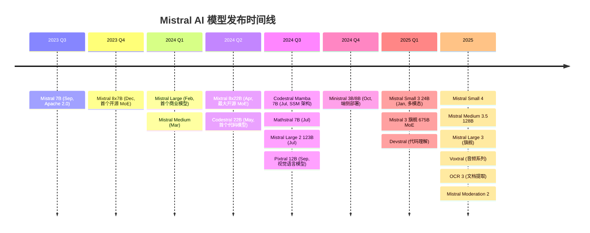
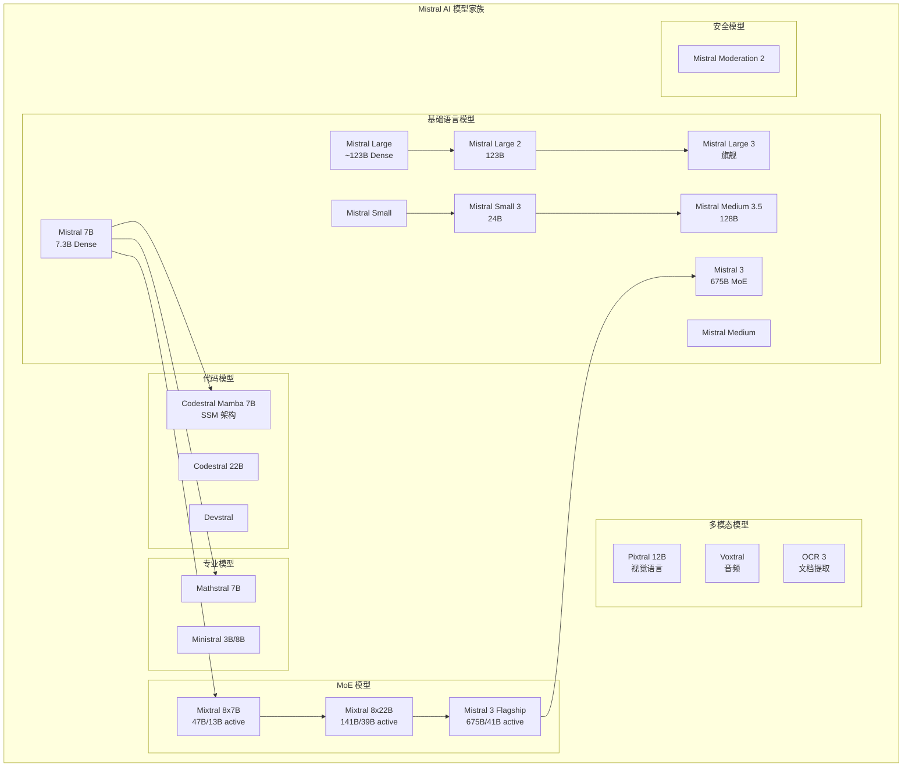

# Mistral AI 技术深度解析

> 中文简称：Mistral AI 技术深度解析

## 一句话理解

Mistral AI 就像一位"精打细算的法国工匠"——用远少于美国巨头的算力和预算，锻造出性能媲美顶级闭源模型的开源利器，核心武器是 Sliding Window Attention (O(W) 内存替代 O(n))、Grouped Query Attention (推理加速)、以及 Mixtral 开创的开源 MoE 架构 (8 专家 Top-2，以 13B 激活参数击败 LLaMA 2 70B)。

---

## 目录

1. [公司概述与欧洲 AI 领导力](#一公司概述与欧洲-ai-领导力)
2. [完整模型家族时间线](#二完整模型家族时间线)
3. [核心架构创新](#三核心架构创新)
4. [Mixtral：开源 MoE 革命](#四mixtral开源-moe-革命)
5. [代码专用模型](#五代码专用模型-codestral--devstral)
6. [替代架构探索](#六替代架构探索codestral-mambassm)
7. [Mistral 3 与最新模型](#七mistral-3-与最新模型)
8. [多模态模型](#八多模态模型-pixtral-voxtral-ocr)
9. [Benchmark 对比分析](#九benchmark-对比分析)
10. [开源生态与 Apache 2.0 哲学](#十开源生态与-apache-20-哲学)
11. [实战指南](#十一实战指南)
12. [与其他模型系列的对比](#十二与其他模型系列的对比)
13. [未来展望](#十三未来展望)
14. [参考资源](#参考资源)
15. [相关文档](#相关文档)

---

## 一、公司概述与欧洲 AI 领导力

### 1.1 定位

```
Mistral AI
═══════════════════════════════════════════════════════════════════

定位: 欧洲领先的 AI 研究实验室，以开放权重策略挑战闭源巨头

核心理念:
───────────────────────────────────────────────────────────────────
• 效率优先: 用更少资源训练更强模型 (Mistral 7B 单节点训练)
• 开源为武器: Apache 2.0 开放权重，对抗闭源生态
• 欧洲 AI 主权: "Le Mistral" 象征欧洲独立 AI 能力
• 技术创新: SWA、GQA、开源 MoE 等底层架构突破
• 全栈覆盖: 从 3B 端侧模型到 675B 旗舰，从文本到多模态
```

### 1.2 公司背景

| 维度 | 详情 |
|------|------|
| **公司** | Mistral AI |
| **创始人** | Arthur Mensch, Timothée Lacroix, Guillaume Lample |
| **创始人背景** | 全部来自 Meta AI / DeepMind 研究团队 |
| **总部** | 法国巴黎 (Paris, France) |
| **成立** | 2023 年 6 月 |
| **融资** | €600M+ (超 6 亿欧元) |
| **开源协议** | Apache 2.0 (绝大多数模型) |
| **模型托管** | HuggingFace |
| **API 平台** | Le Plateforme (mistral.ai) |
| **对话平台** | Le Chat (chat.mistral.ai) |

### 1.3 Mistral AI 在全球 LLM 格局中的定位

Mistral AI 是欧洲大模型开源生态中的绝对标杆。它由三位来自 Meta 和 DeepMind 的顶尖 AI 研究员创立，目标明确——用开源策略打造媲美甚至超越闭源巨头的模型，同时捍卫欧洲 AI 主权。

```
全球开源 LLM 格局 (2025-2026)

┌──────────────────────────────────────────────────────┐
│                    闭源 (Closed Source)                │
│  GPT-4/5 · Claude 4 · Gemini 2.5                     │
├──────────────────────────────────────────────────────┤
│                    开源 (Open Source)                  │
│                                                      │
│  ┌─────────────────────────────────────────────────┐ │
│  │ 美洲 (Americas)                                  │ │
│  │   Llama (Meta) · Command R+ (Cohere)            │ │
│  ├─────────────────────────────────────────────────┤ │
│  │ 欧洲 (Europe) ★                                  │ │
│  │   Mistral / Mixtral (Mistral AI) ← 本文主角     │ │
│  ├─────────────────────────────────────────────────┤ │
│  │ 中国 (China)                                     │ │
│  │   DeepSeek · Qwen · GLM · Yi                    │ │
│  └─────────────────────────────────────────────────┘ │
└──────────────────────────────────────────────────────┘
```

Mistral 的独特之处在于——它是全球唯一一个由初创公司（非科技巨头）打造的、能与闭源模型正面竞争的开源大模型系列。从 7B 小模型到 675B 旗舰，Mistral 证明了"小而精"的团队也能推动 AI 前沿。

---

## 二、完整模型家族时间线

### 2.1 时间线概览



### 2.2 模型家族分类



### 2.3 关键里程碑

| 时间 | 模型 | 里程碑意义 |
|------|------|-----------|
| 2023.09 | Mistral 7B | 首个模型，Apache 2.0，击败 LLaMA 2 13B |
| 2023.12 | Mixtral 8x7B | **首个开源 MoE 大模型**，引发 MoE 革命 |
| 2024.02 | Mistral Large | 首个商业闭源模型 |
| 2024.05 | Codestral | 首个代码专用模型 |
| 2024.07 | Codestral Mamba | **首个生产级 SSM 架构模型** |
| 2024.09 | Pixtral 12B | 首个视觉语言模型 |
| 2025.Q1 | Mistral 3 | 旗舰 675B MoE，Dense 变体 Apache 2.0 |
| 2025 | Voxtral | 首个音频模型系列 |

---

## 三、核心架构创新

### 3.1 Sliding Window Attention (SWA) — 滑动窗口注意力

SWA 是 Mistral 最具标志性的创新之一，首次大规模应用于 Mistral 7B。

#### 3.1.1 核心原理

```
Sliding Window Attention (SWA) 原理
═══════════════════════════════════════════════════════════════════

标准注意力 (Full Attention):
───────────────────────────────────────────────────────────────────
Token i 可以 attend 到所有前序 tokens [1, 2, ..., i-1]
内存复杂度: O(n²)     ← 序列长度 n 的平方

  Token:  [T1] [T2] [T3] [T4] [T5] [T6] [T7] [T8] [T9] [T10]
  T10:     ←───←───←───←───←───←───←───←───←─── (全部可见)

Sliding Window Attention (SWA):
───────────────────────────────────────────────────────────────────
Token i 只能 attend 到前 W 个 tokens [i-W, ..., i-1]
内存复杂度: O(W × n)  ← W 为窗口大小，与序列长度解耦

  Token:  [T1] [T2] [T3] [T4] [T5] [T6] [T7] [T8] [T9] [T10]
                                    ┌──── 窗口 W=4 ────┐
  T10:     ×    ×    ×    ×    ×    [T6] [T7] [T8] [T9]
                                     ↑    ↑    ↑    ↑
                                   只能看到最近 W 个 token
```

#### 3.1.2 信息跨窗口传播

```
SWA 多层堆叠的信息传播 (Mistral 7B, W=4096, 32 层):
═══════════════════════════════════════════════════════════════════

Layer 1:  Token[i] 看到 [i-4096, ..., i-1]        → 有效窗口: 4096
Layer 2:  Token[i] 通过 Layer 1 间接看到更远        → 有效窗口: 8192
Layer 3:  进一步扩展                                → 有效窗口: 12288
...
Layer k:  有效窗口 = k × W                          → 有效窗口: k × 4096

总有效上下文 = num_layers × W = 32 × 4096 = 131,072 tokens!

关键洞察:
───────────────────────────────────────────────────────────────────
• 每层的 "记忆" 通过前一层的隐状态向更远的 token 传播
• 类似卷积神经网络中感受野的逐层扩大
• 理论有效上下文远超窗口大小本身
• 实际效果在 8K 范围内最优，超出后有衰减
```

#### 3.1.3 SWA vs Full Attention 对比

| 维度 | Full Attention | SWA (Mistral 7B) |
|------|---------------|-----------------|
| 内存复杂度 | O(n²) | O(W × n) |
| 每 token 内存 | O(n) | O(W) = O(4096) |
| 理论上下文 | 无限制 | 无限 (级联) |
| 实际有效上下文 | 完整序列 | num_layers × W |
| 推理速度 | 随 n 线性变慢 | 恒定 (W 固定) |
| 长距离依赖 | 直接建模 | 间接传播，可能衰减 |
| 训练效率 | 标准 | 更高效 (减少计算量) |

#### 3.1.4 SWA 代码示例

```python
# Sliding Window Attention 概念实现 (伪代码)
import torch
import torch.nn.functional as F

def sliding_window_attention(Q, K, V, window_size=4096):
    """
    Q: [batch, num_heads, seq_len, head_dim]
    K, V: [batch, num_kv_heads, seq_len, head_dim]
    window_size: 滑动窗口大小 W
    """
    batch, num_heads, seq_len, head_dim = Q.shape

    # 创建滑动窗口掩码
    # mask[i, j] = True 当且仅当 i - W <= j <= i
    positions = torch.arange(seq_len, device=Q.device)
    # 每个位置只能 attend 到 [pos - W, pos] 范围内的 token
    window_mask = (positions.unsqueeze(1) - positions.unsqueeze(0)) <= window_size
    causal_mask = positions.unsqueeze(1) >= positions.unsqueeze(0)
    mask = window_mask & causal_mask  # 滑动窗口 + 因果掩码

    # 标准注意力计算，但使用窗口掩码
    scores = torch.matmul(Q, K.transpose(-2, -1)) / (head_dim ** 0.5)
    scores = scores.masked_fill(~mask, float('-inf'))
    attn_weights = F.softmax(scores, dim=-1)
    output = torch.matmul(attn_weights, V)

    return output

# 关键优势:
# - 每个 token 只需计算 W 个 attention scores (而非 n 个)
# - KV cache 大小固定为 W (而非随序列增长)
# - 推理时每生成一个新 token 的复杂度为 O(W) 而非 O(n)
```

### 3.2 Grouped Query Attention (GQA) — 分组查询注意力

GQA 是 Mistral 7B 的另一项关键创新，在 MHA (Multi-Head Attention) 和 MQA (Multi-Query Attention) 之间取得最佳平衡。

#### 3.2.1 GQA 原理图

```
GQA vs MHA vs MQA 对比
═══════════════════════════════════════════════════════════════════

Multi-Head Attention (MHA):
───────────────────────────────────────────────────────────────────
每个 Q head 有独立的 K, V head

  Query Heads:  [Q1] [Q2] [Q3] [Q4] [Q5] [Q6] [Q7] [Q8]
  Key Heads:    [K1] [K2] [K3] [K4] [K5] [K6] [K7] [K8]   ← 8 个 K head
  Value Heads:  [V1] [V2] [V3] [V4] [V5] [V6] [V7] [V8]   ← 8 个 V head
  KV Cache: 8 × seq_len × head_dim                         ← 大

Multi-Query Attention (MQA):
───────────────────────────────────────────────────────────────────
所有 Q head 共享单个 K, V head

  Query Heads:  [Q1] [Q2] [Q3] [Q4] [Q5] [Q6] [Q7] [Q8]
  Key Heads:    [K1] [K1] [K1] [K1] [K1] [K1] [K1] [K1]   ← 1 个 K head
  Value Heads:  [V1] [V1] [V1] [V1] [V1] [V1] [V1] [V1]   ← 1 个 V head
  KV Cache: 1 × seq_len × head_dim                         ← 小，但质量下降

Grouped Query Attention (GQA) — Mistral 的选择:
───────────────────────────────────────────────────────────────────
Q heads 分组共享 K, V heads

  Query Heads:  [Q1] [Q2] [Q3] [Q4] [Q5] [Q6] [Q7] [Q8]
                   ↓     ↓     ↓     ↓     ↓     ↓
  Key Heads:    [  K1  ] [  K2  ] [  K3  ] [  K4  ]       ← 4 个 K head
  Value Heads:  [  V1  ] [  V2  ] [  V3  ] [  V4  ]       ← 4 个 V head
  Group Size:   每组 2 个 Q head 共享 1 个 KV head
  KV Cache: 4 × seq_len × head_dim                         ← 减少 50%，质量接近 MHA
```

#### 3.2.2 GQA 性能对比

| 注意力类型 | KV Heads | KV Cache 大小 | 推理速度 | 模型质量 |
|-----------|----------|--------------|---------|---------|
| MHA (标准) | 32 | 32 × n × d | 基准 | 最佳 |
| GQA-8 (8 组) | 8 | 8 × n × d | **快 2-3x** | 接近 MHA |
| GQA-4 (4 组) | 4 | 4 × n × d | **快 4-5x** | 略有下降 |
| MQA (1 组) | 1 | 1 × n × d | **快 8x+** | 明显下降 |

### 3.3 高效训练哲学

```
Mistral 的训练哲学: "以巧破力"
═══════════════════════════════════════════════════════════════════

传统路径 (Big Tech):
───────────────────────────────────────────────────────────────────
• 堆算力: 数万 GPU × 数月训练
• 堆数据: 数十万亿 token 暴力训练
• 堆参数: 越大越好 (Scaling Laws)
• 成本: $100M+ (GPT-4 级别)

Mistral 路径:
───────────────────────────────────────────────────────────────────
• 架构创新: SWA + GQA 降低推理和训练成本
• 精选数据: 数据质量 > 数据数量
• 高效参数: 7B 模型击败 13B，13B active 击败 70B
• 智能架构: MoE 在推理时只激活部分参数
• 成本: 显著低于闭源对手

核心信条:
  "Smart data curation > Raw scale"
  "Efficient architecture > Brute force compute"
```

---

## 四、Mixtral：开源 MoE 革命

### 4.1 Mixtral 8x7B — 开源 MoE 的开创者

Mixtral 8x7B 是 Mistral 最具影响力的模型之一，它开创了开源 MoE 大模型的时代。

#### 4.1.1 架构详解

```
Mixtral 8x7B MoE 架构
═══════════════════════════════════════════════════════════════════

总参数: 47B    |    每 token 激活参数: ~13B    |    专家数: 8

                    Input Token
                         │
                    ┌────▼────┐
                    │  Router  │  ← 线性层: hidden_dim → 8
                    │  (Gate)  │
                    └────┬────┘
                         │
              ┌──────────┼──────────┐
              │     Top-2 选择      │
              │  softmax → 取前 2   │
              └────┬─────────┬─────┘
                   │         │
         ┌─────────▼───┐ ┌──▼──────────┐
         │ Expert #3   │ │ Expert #7   │  ← 8 个 FFN 专家
         │ (FFN Layer) │ │ (FFN Layer) │     每个都是独立 FFN
         └──────┬──────┘ └──────┬──────┘
                │               │
                ▼               ▼
         output_3 × w_3   output_7 × w_7    ← 加权求和
                │               │
                └───────┬───────┘
                        │
                  Final Output = w_3 × E_3(x) + w_7 × E_7(x)

关键设计:
───────────────────────────────────────────────────────────────────
• 只有 FFN 层使用 MoE，注意力层共享 (Shared Attention)
• Top-2 路由: 每个 token 只激活 8 个专家中的 2 个
• 路由权重: softmax(gate(x)) 取 top-2，归一化后加权求和
• 辅助损失 (Auxiliary Loss): 确保专家负载均衡
```

#### 4.1.2 MoE 路由机制详解

```python
# Mixtral MoE 路由实现 (概念代码)
import torch
import torch.nn as nn
import torch.nn.functional as F

class MixtralMoELayer(nn.Module):
    """
    Mixtral 8x7B 的 MoE 层实现
    - 8 个专家 (Expert FFN)
    - Top-2 路由
    - 辅助损失用于负载均衡
    """

    def __init__(self, hidden_dim, ffn_dim, num_experts=8, top_k=2):
        super().__init__()
        self.num_experts = num_experts
        self.top_k = top_k

        # 路由器 (Gate Network)
        self.gate = nn.Linear(hidden_dim, num_experts, bias=False)

        # 8 个专家 FFN (每个都是独立的)
        self.experts = nn.ModuleList([
            nn.Sequential(
                nn.Linear(hidden_dim, ffn_dim),
                nn.SiLU(),           # SwiGLU 激活
                nn.Linear(ffn_dim, hidden_dim)
            )
            for _ in range(num_experts)
        ])

    def forward(self, x):
        """
        x: [batch, seq_len, hidden_dim]
        """
        batch, seq_len, hidden_dim = x.shape
        x_flat = x.view(-1, hidden_dim)  # [batch*seq_len, hidden_dim]

        # 1. 计算路由分数
        router_logits = self.gate(x_flat)  # [batch*seq_len, num_experts]
        routing_weights = F.softmax(router_logits, dim=-1)

        # 2. Top-K 选择 (Mixtral 使用 Top-2)
        top_k_weights, top_k_indices = torch.topk(
            routing_weights, self.top_k, dim=-1
        )

        # 3. 归一化 top-k 权重
        top_k_weights = top_k_weights / top_k_weights.sum(dim=-1, keepdim=True)

        # 4. 计算专家输出
        output = torch.zeros_like(x_flat)
        for k in range(self.top_k):
            expert_idx = top_k_indices[:, k]  # [batch*seq_len]
            weight = top_k_weights[:, k]       # [batch*seq_len]

            # 按专家分组处理 (高效实现)
            for expert_id in range(self.num_experts):
                mask = (expert_idx == expert_id)
                if mask.any():
                    expert_input = x_flat[mask]
                    expert_output = self.experts[expert_id](expert_input)
                    output[mask] += weight[mask].unsqueeze(-1) * expert_output

        # 5. 辅助损失 (负载均衡)
        aux_loss = self._compute_aux_loss(routing_weights, top_k_indices)

        return output.view(batch, seq_len, hidden_dim), aux_loss

    def _compute_aux_loss(self, routing_weights, top_k_indices):
        """
        辅助损失: 鼓励专家间均匀分配 token
        loss = num_experts × Σ(f_i × P_i)
        f_i: 分配给专家 i 的 token 比例
        P_i: 专家 i 的平均路由概率
        """
        # 简化的辅助损失计算
        expert_counts = F.one_hot(
            top_k_indices.view(-1), self.num_experts
        ).float().mean(dim=0)
        expert_probs = routing_weights.mean(dim=0)
        aux_loss = self.num_experts * (expert_counts * expert_probs).sum()
        return aux_loss
```

#### 4.1.3 辅助损失 (Auxiliary Loss) 详解

辅助损失是 MoE 训练中的关键技术，防止"专家坍缩"——即所有 token 都路由到少数专家。

| 维度 | 无辅助损失 | 有辅助损失 (Mixtral) |
|------|----------|-------------------|
| 专家利用率 | 不均匀，部分专家空闲 | 接近均匀分配 |
| 训练稳定性 | 可能出现路由坍缩 | 稳定，所有专家参与学习 |
| 模型质量 | 部分专家过度拟合 | 专家专业化 + 均衡 |
| 实现复杂度 | 简单 | 需额外损失项，权重需调优 |

> **深入阅读**: Mixtral 的 MoE 路由策略与 DeepSeek 的对比分析，详见 [MoE Case Studies: DeepSeek & Mixtral](../04_LLM架构/12_MoE_Case_Studies_DeepSeek_Mixtral.md)。负载均衡技术的详细讨论见 [MoE Routing and Load Balancing](../04_LLM架构/13_MoE_Routing_and_负载均衡.md)。

### 4.2 Mixtral 8x22B — 最大开源 MoE

```
Mixtral 8x22B 规格
═══════════════════════════════════════════════════════════════════

总参数:     141B
激活参数:   ~39B (每 token)
专家数:     8
Top-K:      2
上下文:     64K tokens
架构:       MoE (仅 FFN 层使用 MoE)
许可证:     Apache 2.0
发布时间:   2024 年 4 月

vs Mixtral 8x7B:
───────────────────────────────────────────────────────────────────
                    8x7B          8x22B
总参数:             47B           141B     (3x 增长)
激活参数:           ~13B          ~39B     (3x 增长)
上下文:             32K           64K      (2x 增长)
单专家大小:         7B 级别       22B 级别 (专家更强)
多语言:             英/法/德      英/法/德/意/西 (更强)
```

### 4.3 Mixtral 性能对比

| 模型 | MMLU | HumanEval | GSM8K | MATH | 上下文 | 类型 |
|------|------|-----------|-------|------|--------|------|
| Mixtral 8x7B | ~74% | ~50% | ~65% | ~28% | 32K | MoE 47B/13B |
| Mixtral 8x22B | ~77% | ~55% | ~78% | ~35% | 64K | MoE 141B/39B |
| LLaMA 2 70B | ~70% | ~29% | ~57% | ~13% | 4K | Dense 70B |
| GPT-3.5 | ~70% | ~48% | ~57% | ~23% | 16K | 闭源 |

> **关键洞察**: Mixtral 8x7B 仅激活 13B 参数，却在多数 benchmark 上超越 LLaMA 2 70B（全激活），计算量仅为其 1/6。这证明了 MoE 架构在效率上的巨大优势。

---

## 五、代码专用模型 (Codestral & Devstral)

### 5.1 Codestral 22B — Mistral 的首个代码模型

```
Codestral 22B 规格
═══════════════════════════════════════════════════════════════════

参数:       22B
架构:       Dense Transformer
上下文:     32K tokens
支持语言:   80+ 编程语言
特殊能力:   Fill-in-the-Middle (FIM)
许可证:     Mistral AI Non-Production License
发布时间:   2024 年 5 月

支持的编程语言 (部分):
───────────────────────────────────────────────────────────────────
• 主流:     Python, JavaScript, TypeScript, Java, C/C++, Rust, Go
• 系统:     C, C++, Rust, Zig
• Web:      HTML, CSS, JavaScript, TypeScript, PHP, Ruby
• 数据:     SQL, R, Julia, Scala
• 移动:     Swift, Kotlin, Dart
• 函数式:   Haskell, OCaml, Elixir, Clojure
• 其他:     Bash, PowerShell, Lua, Perl, COBOL, Fortran ...
```

#### 5.1.1 Fill-in-the-Middle (FIM) 能力

FIM 是代码补全中的关键技术，允许模型根据上下文和后文来填充中间部分。

```
Fill-in-the-Middle (FIM) 原理
═══════════════════════════════════════════════════════════════════

标准代码生成 (Left-to-Right):
───────────────────────────────────────────────────────────────────
Input:  def fibonacci(n):
Output:     if n <= 1:\n        return n\n    return fib(n-1) + fib(n-2)

FIM 模式 (双向上下文):
───────────────────────────────────────────────────────────────────
前缀 (Prefix):  def fibonacci(n):
后缀 (Suffix):      return fib(n-1) + fib(n-2)
目标 (Middle):  ??? ← 模型需要填充的部分

训练方式:
───────────────────────────────────────────────────────────────────
原始代码: def fib(n):
              if n <= 1:
                  return n
              return fib(n-1) + fib(n-2)

FIM 训练样本:
  [PREFIX] def fib(n): [SUFFIX] return fib(n-1) + fib(n-2) [MIDDLE]
      if n <= 1:\n        return n\n

推理时:
  给定 prefix 和 suffix，模型生成 middle 部分
```

```python
# 使用 Codestral 进行 FIM 代码补全
from mistralai import Mistral

client = Mistral(api_key="your-api-key")

# FIM 补全: 在函数中间插入代码
response = client.fim.complete(
    model="codestral-latest",
    prompt="def calculate_discount(price, discount_rate):\n",
    suffix="\n    return final_price",
    max_tokens=100
)
# 模型输出: "    discount = price * discount_rate\n    final_price = price - discount"
```

### 5.2 Devstral — 工程级代码理解

Devstral 是 Mistral 2025 年发布的工程导向模型，专注于仓库级代码理解。

| 维度 | Codestral 22B | Devstral |
|------|--------------|----------|
| 定位 | 代码生成 | 代码理解 + Agent |
| 上下文 | 32K | 更大 (仓库级) |
| 能力 | FIM 补全, 代码生成 | 仓库导航, 代码分析, Agent 工具 |
| 开源 | Non-Production License | Apache 2.0 |
| 场景 | IDE 代码补全 | AI 编程助手, 代码审查 |

---

## 六、替代架构探索：Codestral Mamba/SSM

### 6.1 Mamba 架构概述

Codestral Mamba 是 Mistral 对非 Transformer 架构的重要探索，使用 State Space Model (SSM) 替代注意力机制。

> **深入阅读**: Mamba 和 SSM 架构的完整技术分析，详见 [Transformer Alternatives](../04_LLM架构/16_Transformer_替代架构.md)。

```
Transformer vs Mamba (SSM) 架构对比
═══════════════════════════════════════════════════════════════════

Transformer (Attention):
───────────────────────────────────────────────────────────────────
                    ┌─────────────┐
  Input ────────────┤  Attention   ├──→ Add & Norm ──→ FFN ──→ Output
                    │  (O(n²))    │
                    └─────────────┘
  推理复杂度: O(n) per token (需要完整 KV cache)
  内存: O(n × d) KV cache
  并行训练: ✓ (但 O(n²) 计算)

Mamba (State Space Model):
───────────────────────────────────────────────────────────────────
                    ┌─────────────┐
  Input ────────────┤  SSM Layer   ├──→ Add & Norm ──→ FFN ──→ Output
                    │  (O(n))     │
                    └─────────────┘
  推理复杂度: O(1) per token (固定状态!)
  内存: O(d × state_dim) 固定大小
  并行训练: ✓ (高效并行扫描算法)
```

### 6.2 Codestral Mamba 7B 规格

| 维度 | Codestral 22B (Transformer) | Codestral Mamba 7B (SSM) |
|------|---------------------------|-------------------------|
| 参数 | 22B | 7B |
| 架构 | Dense Transformer | **Mamba (SSM)** |
| 上下文 | 32K | **256K** (理论无限) |
| 推理复杂度 | O(n) per token | **O(1) per token** |
| KV Cache | 需要，随序列增长 | **不需要**，固定状态 |
| 长文本 | 受限于 32K | 天然支持超长序列 |
| 训练效率 | O(n²) attention | O(n log n) 并行扫描 |
| 代码能力 | 强 | 良好 (略低于 Transformer 版本) |

### 6.3 SSM 核心机制

```
State Space Model (SSM) 核心方程
═══════════════════════════════════════════════════════════════════

连续时间 SSM:
───────────────────────────────────────────────────────────────────
h'(t) = A·h(t) + B·x(t)    ← 状态方程 (隐藏状态更新)
y(t)  = C·h(t) + D·x(t)    ← 输出方程

离散化 (用于序列处理):
───────────────────────────────────────────────────────────────────
h_t = Ā·h_{t-1} + B̄·x_t   ← 递推形式 (O(1) 推理!)
y_t = C·h_t

Mamba 的关键创新 — 选择性机制 (Selective SSM):
───────────────────────────────────────────────────────────────────
• A, B, C 不再是固定矩阵，而是输入依赖的 (input-dependent)
• 模型可以"选择性"地记住或遗忘信息
• 类似 LSTM 的门控机制，但更高效

  传统 SSM: A, B, C 固定 → 所有 token 同等处理
  Mamba:    A(x), B(x), C(x) 依赖输入 → 重要 token 保留，噪声过滤

推理优势:
───────────────────────────────────────────────────────────────────
Transformer:  生成第 n 个 token → 需要所有前序 KV → O(n) 内存和计算
Mamba:        生成第 n 个 token → 只需固定状态 h → O(1) 内存和计算

这意味着: 无论序列多长，生成每个新 token 的成本恒定!
```

### 6.4 Mamba vs Transformer 适用场景

| 场景 | Transformer 优势 | Mamba 优势 |
|------|----------------|-----------|
| 短文本 (< 4K) | ★★★★★ | ★★★☆☆ |
| 超长文本 (> 100K) | ★★★☆☆ | ★★★★★ |
| 代码补全 | ★★★★★ | ★★★★☆ |
| 实时流式推理 | ★★★☆☆ | ★★★★★ |
| 内存受限环境 | ★★★☆☆ | ★★★★★ |
| 精确召回 (大海捞针) | ★★★★★ | ★★★☆☆ |

---

## 七、Mistral 3 与最新模型

### 7.1 Mistral 3 旗舰

Mistral 3 是 2025 年 Mistral 最重要的发布，包含 Dense 变体和 MoE 旗舰。

```
Mistral 3 模型家族
═══════════════════════════════════════════════════════════════════

Dense 变体 (Apache 2.0):
───────────────────────────────────────────────────────────────────
┌─────────────────┬──────────┬──────────┬────────────────────────┐
│ 模型            │ 参数量    │ 许可证   │ 特点                   │
├─────────────────┼──────────┼──────────┼────────────────────────┤
│ Mistral 3 3B   │ 3B       │ Apache 2.0│ 端侧部署, 轻量级       │
│ Mistral 3 8B   │ 8B       │ Apache 2.0│ 平衡性能与效率         │
│ Mistral 3 14B  │ 14B      │ Apache 2.0│ 推理变体, 85% 数学竞赛 │
└─────────────────┴──────────┴──────────┴────────────────────────┘

MoE 旗舰:
───────────────────────────────────────────────────────────────────
┌─────────────────────┬──────────────┬──────────┬────────────────┐
│ 模型                │ 总参/激活参   │ 许可证   │ 特点           │
├─────────────────────┼──────────────┼──────────┼────────────────┤
│ Mistral 3 Flagship │ 675B / 41B   │ 商业     │ 最强旗舰模型   │
└─────────────────────┴──────────────┴──────────┴────────────────┘
```

### 7.2 技术亮点

```
Mistral 3 技术创新
═══════════════════════════════════════════════════════════════════

训练基础设施:
───────────────────────────────────────────────────────────────────
• 数千块 NVIDIA Hopper GPU (H100/H200)
• NVIDIA 合作: NVFP4 量化格式 (4-bit 推理优化)
• 推测解码 (Speculative Decoding): 加速生成
• 分离式 prefill/decode pipeline: 优化首 token 延迟

模型能力:
───────────────────────────────────────────────────────────────────
• 原生视觉支持 (Native Vision): 不仅仅是文本
• 14B 推理变体: 数学竞赛 benchmark 85% 准确率
• NVFP4 量化: 4-bit 部署，大幅降低显存需求
• Apache 2.0 开放 Dense 变体

推理优化:
───────────────────────────────────────────────────────────────────
• 推测解码 (Speculative Decoding):
  用小模型 "猜测" 后续 token，大模型验证
  → 接受正确猜测 → 每步生成多个 token
  → 加速 2-3x

• 分离 Prefill/Decode:
  Prefill: 并行处理 prompt (高吞吐)
  Decode: 逐 token 生成 (低延迟)
  → 不同硬件分别优化两个阶段
```

### 7.3 其他 2025 年模型

| 模型 | 参数量 | 类型 | 关键特点 |
|------|--------|------|---------|
| Mistral Small 3 | 24B | Dense, 多模态 | Apache 2.0, 文本+视觉, 32K 上下文 |
| Mistral Small 4 | 改进版 | Dense | Small 系列进一步优化 |
| Mistral Medium 3.5 | 128B | Dense | 混合: 指令+推理+代码统一 |
| Mistral Large 3 | 旗舰 | 开源多模态 | Agentic + 代码聚焦 |

### 7.4 模型定位矩阵

```
Mistral 2025 模型定位矩阵
═══════════════════════════════════════════════════════════════════

性能 ↑
│                                              ★ Mistral 3 Flagship
│                                                (675B MoE)
│
│                                 ★ Mistral Large 3
│                                   (旗舰, 开源多模态)
│
│                        ★ Mistral Medium 3.5
│                          (128B Dense)
│
│              ★ Mistral Small 3 / Small 4
│                (24B, 多模态)
│
│    ★ Mistral 3 Dense
│      (3B / 8B / 14B)
│
└──────────────────────────────────────────────────→ 推理成本
  低                                           高

用途分布:
───────────────────────────────────────────────────────────────────
端侧/嵌入式:   Mistral 3 3B, Ministral 3B
平衡效率:      Mistral 3 8B, Ministral 8B, Mistral Small 3/4
专业推理:      Mistral 3 14B (85% 数学竞赛)
通用旗舰:      Mistral Medium 3.5, Large 3, Mistral 3 Flagship
代码:          Codestral, Devstral
多模态:        Pixtral, Voxtral, OCR 3, Small 3
```

---

## 八、多模态模型 (Pixtral, Voxtral, OCR)

### 8.1 Pixtral 12B — 视觉语言模型

```
Pixtral 12B 规格
═══════════════════════════════════════════════════════════════════

参数:       12B
架构:       视觉编码器 + 语言模型
视觉处理:   原生分辨率 (Native Resolution)
上下文:     128K tokens
许可证:     Apache 2.0
发布时间:   2024 年 9 月

核心创新 — 原生分辨率处理:
───────────────────────────────────────────────────────────────────
传统 VLM (如 LLaVA):
  1. 将图像缩放到固定分辨率 (如 224×224)
  2. 信息损失，细节丢失
  3. 不适合 OCR 和细粒度理解

Pixtral (原生分辨率):
  1. 保持图像原始分辨率
  2. 动态切分为 patches
  3. 保留完整视觉信息
  4. 适合文档理解、图表分析等细节密集任务
```

### 8.2 Voxtral — 音频模型家族

Voxtral 是 Mistral 2025 年推出的音频 AI 系列，标志着 Mistral 进入语音领域。

```
Voxtral 音频模型家族
═══════════════════════════════════════════════════════════════════

┌─────────────────────────┬──────────────────────────────────────┐
│ 模型                    │ 能力                                 │
├─────────────────────────┼──────────────────────────────────────┤
│ Voxtral TTS            │ 文本转语音 (Text-to-Speech)           │
│ Voxtral Mini Transcribe│ 轻量级语音转文字                      │
│ Voxtral Mini Realtime  │ 实时语音交互                          │
└─────────────────────────┴──────────────────────────────────────┘

关键特性:
───────────────────────────────────────────────────────────────────
• 零样本语音克隆 (Zero-shot Voice Cloning):
  只需几秒参考音频即可克隆任意声音
• 多语言支持: 英语、法语、德语、西班牙语等
• 低延迟: Mini Realtime 适合实时对话场景
```

### 8.3 OCR 3 — 文档提取

| 维度 | 详情 |
|------|------|
| **功能** | 从图像和 PDF 中提取结构化数据 |
| **输入** | 图像 (PNG, JPG), PDF 文档 |
| **输出** | 结构化文本、表格、布局信息 |
| **应用** | 文档数字化、发票处理、表单识别 |

### 8.4 Mistral Moderation 2 — 内容安全

| 维度 | 详情 |
|------|------|
| **功能** | 内容安全审核 |
| **上下文** | 128K tokens |
| **特色** | 越狱检测 (Jailbreaking Detection) |
| **应用** | API 安全过滤、用户内容审核 |

---

## 九、Benchmark 对比分析

### 9.1 完整模型 Benchmark 对比

| 模型 | MMLU | HumanEval | GSM8K | MATH | 上下文 | 类型 | 许可 |
|------|------|-----------|-------|------|--------|------|------|
| Mistral 7B | ~62% | ~40% | ~47% | ~13% | 8K | Dense 7.3B | Apache 2.0 |
| Mixtral 8x7B | ~74% | ~50% | ~65% | ~28% | 32K | MoE 47B/13B | Apache 2.0 |
| Mixtral 8x22B | ~77% | ~55% | ~78% | ~35% | 64K | MoE 141B/39B | Apache 2.0 |
| Mistral Large | ~81% | ~57% | ~84% | ~40% | 32K | Dense ~123B | 闭源 |
| Mistral Large 2 | ~84% | ~60% | ~90% | ~45% | 128K | Dense 123B | 闭源 |
| Codestral 22B | — | ~65% | — | — | 32K | Dense 22B | Non-Prod |
| Mistral Small 3 | — | — | — | — | 32K | Dense 24B | Apache 2.0 |
| Mistral 3 Flagship | — | — | — | — | — | MoE 675B/41B | 商业 |
| Mistral 3 14B | — | — | — | 85%* | — | Dense 14B | Apache 2.0 |

> *14B 推理变体在数学竞赛 benchmark 上的成绩

### 9.2 MoE 模型横向对比

| 维度 | Mixtral 8x7B | Mixtral 8x22B | DeepSeek-V3 | Mistral 3 Flagship |
|------|-------------|--------------|-------------|-------------------|
| 总参数 | 47B | 141B | 671B | 675B |
| 激活参数 | ~13B | ~39B | 37B | 41B |
| 专家数 | 8 | 8 | 256 | — |
| Top-K | 2 | 2 | 8 | — |
| 注意力 | MHA | MHA | MLA | GQA/SWA |
| 上下文 | 32K | 64K | 128K | — |
| 许可证 | Apache 2.0 | Apache 2.0 | MIT | 商业 |
| 训练成本 | 低 | 中 | $5.6M | — |

### 9.3 代码模型对比

| 维度 | Codestral 22B | DeepSeek-Coder-V2 | Qwen2.5-Coder 32B |
|------|--------------|-------------------|-------------------|
| 参数 | 22B | 236B (MoE) | 32B |
| 架构 | Dense Transformer | MoE | Dense |
| 上下文 | 32K | 128K | 128K |
| FIM 支持 | ✓ | ✓ | ✓ |
| 语言数 | 80+ | 338 | 40+ |
| HumanEval | ~65% | ~75% | ~70% |
| 许可证 | Non-Production | MIT | Apache 2.0 |

### 9.4 小型模型对比

| 维度 | Mistral 7B | LLaMA 3 8B | Qwen2.5-7B | Ministral 8B |
|------|-----------|-----------|-----------|-------------|
| 参数 | 7.3B | 8B | 7B | 8B |
| 架构 | Dense + SWA + GQA | Dense + GQA | Dense + GQA | Dense |
| 上下文 | 8K | 8K | 128K | — |
| MMLU | ~62% | ~66% | ~65% | — |
| 许可证 | Apache 2.0 | Llama Community | Apache 2.0 | 商业 |
| 特色 | SWA 高效推理 | Meta 生态 | 多语言 | 端侧优化 |

### 9.5 效率对比 — Mistral 的核心优势

```
计算效率对比 (推理每 token 的 FLOPs)
═══════════════════════════════════════════════════════════════════

Model               Active Params    FLOPs/token (相对值)
───────────────────────────────────────────────────────────────────
LLaMA 2 70B         70B (全激活)     ████████████████████████ 100%
Mistral Large 2     123B (全激活)    ██████████████████████████████ ~120%
Mixtral 8x22B       39B (激活)       ████████████████ ~55%
Mixtral 8x7B        13B (激活)       ███████ ~20%
DeepSeek-V3         37B (激活)       ███████████████ ~52%
Mistral 3 Flagship  41B (激活)       █████████████████ ~58%

结论: MoE 模型以远少于 Dense 模型的激活参数达到相近性能
      Mixtral 8x7B 是最极致的效率典范 — 1/6 的计算量超越 70B Dense
```

---

## 十、开源生态与 Apache 2.0 哲学

### 10.1 Mistral 的开源策略

```
Mistral AI 开源策略: "Le Mistral" 精神
═══════════════════════════════════════════════════════════════════

核心原则:
───────────────────────────────────────────────────────────────────
• 开放权重 (Open Weights): 模型权重完全公开，可自由下载
• Apache 2.0: 最宽松的开源许可之一
  - 商用自由: 可用于商业产品
  - 修改自由: 可修改和衍生
  - 分发自由: 可自由分发
  - 无限制: 不要求衍生作品开源
• 研究友好: 鼓励学术研究和社区贡献
• 渐进开放: 从基础模型到更复杂模型逐步开放

开放 vs 闭源分布:
───────────────────────────────────────────────────────────────────
开源 (Apache 2.0):
  ├── Mistral 7B ✓
  ├── Mixtral 8x7B ✓
  ├── Mixtral 8x22B ✓
  ├── Pixtral 12B ✓
  ├── Mistral Small 3 ✓
  ├── Mistral 3 Dense (3B/8B/14B) ✓
  └── Devstral ✓

商业许可:
  ├── Mistral Large / Large 2 / Large 3
  ├── Mistral Medium
  ├── Mistral 3 Flagship (MoE)
  └── Codestral (Non-Production License)
```

### 10.2 HuggingFace 生态集成

```python
# 使用 HuggingFace Transformers 加载 Mistral 模型
from transformers import AutoModelForCausalLM, AutoTokenizer
import torch

# 1. 加载 Mistral 7B (最轻量的选择)
model_id = "mistralai/Mistral-7B-Instruct-v0.3"
tokenizer = AutoTokenizer.from_pretrained(model_id)
model = AutoModelForCausalLM.from_pretrained(
    model_id,
    torch_dtype=torch.bfloat16,
    device_map="auto"
)

# 2. 使用聊天模板
messages = [
    {"role": "user", "content": "解释 Sliding Window Attention 的原理"}
]
text = tokenizer.apply_chat_template(
    messages, tokenize=False, add_generation_prompt=True
)
inputs = tokenizer(text, return_tensors="pt").to(model.device)

# 3. 生成
with torch.no_grad():
    outputs = model.generate(
        **inputs,
        max_new_tokens=512,
        temperature=0.7,
        top_p=0.9,
        do_sample=True
    )
response = tokenizer.decode(
    outputs[0][inputs["input_ids"].shape[1]:],
    skip_special_tokens=True
)
print(response)
```

### 10.3 vLLM 高效推理部署

```python
# 使用 vLLM 部署 Mistral 模型 (高吞吐推理)
from vllm import LLM, SamplingParams

# 加载 Mixtral 8x7B (MoE 模型，多 GPU 部署)
llm = LLM(
    model="mistralai/Mixtral-8x7B-Instruct-v0.1",
    tensor_parallel_size=2,       # 2 GPU 并行
    gpu_memory_utilization=0.9,
    max_model_len=32768,           # 32K 上下文
    dtype="bfloat16"
)

# 批量推理
prompts = [
    "用 Python 实现快速排序",
    "解释 MoE 架构的优势",
    "法国大革命的历史意义"
]

sampling_params = SamplingParams(
    temperature=0.7,
    top_p=0.9,
    max_tokens=1024
)

outputs = llm.generate(prompts, sampling_params)

for output in outputs:
    print(f"Prompt: {output.prompt[:50]}...")
    print(f"Output: {output.outputs[0].text[:200]}...")
    print(f"Tokens: {len(output.outputs[0].token_ids)}")
    print("---")
```

### 10.4 Mistral API 使用

```python
# 使用 Mistral 官方 API (Le Plateforme)
from mistralai import Mistral

client = Mistral(api_key="your-api-key")

# 1. 基础对话 (使用最新旗舰模型)
chat_response = client.chat.complete(
    model="mistral-large-latest",
    messages=[
        {"role": "system", "content": "你是一个技术专家"},
        {"role": "user", "content": "对比 Mistral 和 LLaMA 的架构差异"}
    ],
    temperature=0.7,
    max_tokens=2048
)
print(chat_response.choices[0].message.content)

# 2. 代码补全 (Codestral FIM)
fim_response = client.fim.complete(
    model="codestral-latest",
    prompt="class DataProcessor:\n    def __init__(self, data):",
    suffix="    def process(self):\n        return results",
    max_tokens=256
)
print(fim_response.choices[0].message.content)

# 3. 视觉理解 (Pixtral)
vision_response = client.chat.complete(
    model="pixtral-12b-latest",
    messages=[
        {
            "role": "user",
            "content": [
                {"type": "text", "text": "描述这张图片的内容"},
                {"type": "image_url", "image_url": "https://example.com/chart.png"}
            ]
        }
    ]
)

# 4. 文档 OCR (OCR 3)
ocr_response = client.ocr.complete(
    model="ocr-latest",
    document={"type": "image_url", "image_url": "https://example.com/invoice.pdf"}
)
```

---

## 十一、实战指南

### 11.1 模型选择指南

```
Mistral 模型选择决策树
═══════════════════════════════════════════════════════════════════

你的需求是什么?
│
├── 端侧/嵌入式部署 (手机, IoT)
│   ├── 最低资源: Mistral 3 3B 或 Ministral 3B
│   └── 平衡型:   Mistral 3 8B 或 Ministral 8B
│
├── 通用对话/文本生成
│   ├── 预算有限:   Mistral 7B (最经典的开源选择)
│   ├── 平衡效率:   Mixtral 8x7B (MoE, 性价比最高)
│   └── 最佳质量:   Mistral Large 2/3 (API)
│
├── 代码生成/补全
│   ├── IDE 补全:   Codestral 22B (FIM 能力)
│   ├── 仓库理解:   Devstral (Agent 工具)
│   └── 超长代码:   Codestral Mamba 7B (256K 上下文)
│
├── 数学/推理
│   └── Mistral 3 14B (85% 数学竞赛准确率)
│
├── 多模态 (文本+图像)
│   ├── 轻量级:     Pixtral 12B (Apache 2.0)
│   └── 更强能力:   Mistral Small 3 24B
│
├── 语音/音频
│   └── Voxtral 系列 (TTS, ASR, 语音克隆)
│
├── 文档处理
│   └── OCR 3 (图像/PDF 结构化提取)
│
└── 内容安全
    └── Mistral Moderation 2 (128K 上下文, 越狱检测)
```

### 11.2 微调 Mistral 7B

```python
# 使用 LoRA 微调 Mistral 7B
from transformers import AutoModelForCausalLM, AutoTokenizer
from peft import LoraConfig, get_peft_model, TaskType
from trl import SFTTrainer, SFTConfig

# 1. 加载基础模型
model_id = "mistralai/Mistral-7B-v0.3"
tokenizer = AutoTokenizer.from_pretrained(model_id)
model = AutoModelForCausalLM.from_pretrained(
    model_id,
    torch_dtype="auto",
    device_map="auto"
)

# 2. 配置 LoRA (Parameter-Efficient Fine-Tuning)
lora_config = LoraConfig(
    task_type=TaskType.CAUSAL_LM,
    r=16,                           # LoRA rank
    lora_alpha=32,                  # Scaling factor
    target_modules=[                # 目标模块
        "q_proj", "k_proj", "v_proj", "o_proj",
        "gate_proj", "up_proj", "down_proj"
    ],
    lora_dropout=0.05,
    bias="none",
)

model = get_peft_model(model, lora_config)
model.print_trainable_parameters()
# 输出: trainable params: ~20M || all params: 7B || trainable%: 0.28%

# 3. SFT 训练配置
sft_config = SFTConfig(
    output_dir="./mistral-7b-finetuned",
    num_train_epochs=3,
    per_device_train_batch_size=4,
    gradient_accumulation_steps=4,
    learning_rate=2e-4,
    fp16=True,
    max_seq_length=4096,            # 利用 SWA 窗口大小
    logging_steps=10,
    save_strategy="epoch",
)

trainer = SFTTrainer(
    model=model,
    tokenizer=tokenizer,
    args=sft_config,
    train_dataset=your_dataset,
)

trainer.train()

# 4. 保存和加载微调后的模型
model.save_pretrained("./mistral-7b-lora-adapter")
# 加载: model = PeftModel.from_pretrained(base_model, "./mistral-7b-lora-adapter")
```

### 11.3 Mixtral 8x7B 本地部署

```bash
# 使用 Ollama 本地部署 Mixtral 8x7B
# 前提: 安装 Ollama (https://ollama.com)

# 下载并运行 Mixtral 8x7B
ollama run mixtral

# 或使用量化版本 (更低内存需求)
ollama run mixtral:8x7b-instruct-v0.1-q4_K_M

# API 调用
curl http://localhost:11434/api/generate -d '{
  "model": "mixtral",
  "prompt": "用 Python 实现一个 MoE 路由层",
  "stream": false
}'
```

---

## 十二、与其他模型系列的对比

### 12.1 Mistral vs LLaMA

| 维度 | Mistral 7B | LLaMA 3 8B | LLaMA 4 Scout |
|------|-----------|-----------|---------------|
| 参数 | 7.3B | 8B | 109B (MoE, 17B active) |
| 架构 | Dense + SWA + GQA | Dense + GQA | MoE + 10M 上下文 |
| 上下文 | 8K | 8K | 10M |
| 训练数据 | 未公开 | 15T tokens | 40T+ tokens |
| MMLU | ~62% | ~66% | ~78% |
| 许可证 | Apache 2.0 | Llama Community | Llama 4 Community |
| 推理效率 | **高** (SWA) | 标准 | 高 (MoE) |
| 特色 | SWA 创新 | Meta 生态 | 超长上下文 |

### 12.2 Mistral vs DeepSeek

| 维度 | Mixtral 8x22B | DeepSeek-V3 |
|------|--------------|-------------|
| 总参数 | 141B | 671B |
| 激活参数 | 39B | 37B |
| 专家数 | 8 | 256 |
| Top-K | 2 | 8 |
| 注意力 | MHA | MLA (KV cache 压缩 95%) |
| 负载均衡 | 辅助损失 | 无辅助损失 |
| 训练成本 | 未公开 | $5.6M |
| 上下文 | 64K | 128K |
| 许可证 | Apache 2.0 | MIT |
| MoE 规模 | 小规模 (8 专家) | 大规模 (256 专家) |

### 12.3 Mistral vs Qwen

| 维度 | Mistral Small 3 | Qwen2.5-32B |
|------|----------------|-------------|
| 参数 | 24B | 32B |
| 架构 | Dense, 多模态 | Dense |
| 上下文 | 32K | 128K |
| 多模态 | ✓ (视觉) | ✓ (视觉+音频) |
| 许可证 | Apache 2.0 | Apache 2.0 |
| 中文能力 | 一般 | **领先** |
| 欧洲语言 | **领先** (法/德/意/西) | 良好 |
| 代码能力 | 强 | 强 |

### 12.4 全球开源 LLM 格局

```
全球开源 LLM 对比 (2025-2026):

┌─────────────┬───────────┬───────────┬───────────┬───────────┐
│             │  Mistral  │  LLaMA    │ DeepSeek  │   Qwen    │
│             │  (法国)    │  (美国)    │ (中国)    │  (中国)   │
├─────────────┼───────────┼───────────┼───────────┼───────────┤
│ 最大开源模型 │ 141B MoE  │ 405B Dense│ 671B MoE  │ 235B MoE  │
│ 核心创新     │ SWA+MoE   │ 长上下文  │ MLA+GRPO  │ 混合思维  │
│ 推理能力     │ ★★★★☆   │ ★★★☆☆   │ ★★★★★   │ ★★★★★   │
│ 代码能力     │ ★★★★★   │ ★★★☆☆   │ ★★★★★   │ ★★★★☆   │
│ 中文能力     │ ★★☆☆☆   │ ★★☆☆☆   │ ★★★★★   │ ★★★★★   │
│ 欧洲语言     │ ★★★★★   │ ★★★☆☆   │ ★★☆☆☆   │ ★★★☆☆   │
│ 开源许可     │ Apache 2.0│ Llama Comm│ MIT       │ Apache 2.0│
│ 模型尺寸覆盖 │ ★★★★☆   │ ★★★★★   │ ★★★☆☆   │ ★★★★★   │
│ 社区生态     │ ★★★★☆   │ ★★★★★   │ ★★★★★   │ ★★★★★   │
│ 训练效率     │ ★★★★★   │ ★★★☆☆   │ ★★★★★   │ ★★★★☆   │
└─────────────┴───────────┴───────────┴───────────┴───────────┘
```

---

## 十三、未来展望

### 13.1 技术路线图

```
已知 / 预期的发展方向:

2024 (已发布)
├── Mixtral 8x22B (最大开源 MoE)
├── Codestral (首个代码模型)
├── Codestral Mamba (首个 SSM 模型)
├── Mistral Large 2 (旗舰升级)
└── Pixtral 12B (视觉语言)

2025 (已发布 / 进行中)
├── Mistral 3 (675B MoE 旗舰 + Dense 变体)
├── Mistral Small 3/4 (多模态)
├── Mistral Medium 3.5 (128B Dense)
├── Mistral Large 3 (开源多模态旗舰)
├── Voxtral (音频系列)
├── OCR 3 (文档提取)
├── Devstral (工程代码理解)
└── Mistral Moderation 2 (安全)

2025 H2+ / 2026 (展望)
├── Mistral 4? (下一代基础模型)
├── 更大规模 MoE (千专家级别?)
├── 原生多模态 (训练阶段即多模态)
├── 推理模型 (类 R1/o1 的推理能力)
├── 端侧推理进一步优化
├── Agentic AI 框架深度集成
└── 企业级部署工具完善
```

### 13.2 技术趋势

1. **MoE 持续扩大**: 从 Mixtral 的 8 专家到 Mistral 3 的旗舰 MoE，专家数量和总参数将持续增长
2. **多模态融合**: 从纯文本到视觉 (Pixtral)、音频 (Voxtral)、文档 (OCR) 的完整多模态矩阵
3. **架构多元化**: Transformer + SSM 双轨探索，Mamba 架构可能在特定场景取代 Transformer
4. **欧洲 AI 主权**: 持续作为欧洲 AI 独立的旗帜，推动 GDPR 合规和 AI 治理
5. **开源+商业双轮**: Apache 2.0 开源模型吸引社区，商业 API 和企业合作维持收入

### 13.3 关键挑战

| 挑战 | 描述 | Mistral 的应对 |
|------|------|---------------|
| 闭源竞争 | GPT-5, Claude 4 持续领先 | 开源社区力量 + 效率创新 |
| 中国崛起 | DeepSeek, Qwen 快速追赶 | 欧洲语言优势 + 差异化定位 |
| 训练成本 | 旗舰模型训练成本高昂 | 高效架构 (SWA, MoE) + NVIDIA 合作 |
| 商业化 | 开源模型的盈利挑战 | Le Plateforme API + 企业许可 |
| 人才竞争 | AI 人才全球争夺 | 巴黎 AI 研究中心吸引力 |
| 硬件依赖 | NVIDIA GPU 供应 | NVIDIA 深度合作 + NVFP4 优化 |

---

## 参考资源

### 官方资源

- [Mistral AI 官网](https://mistral.ai)
- [Mistral AI GitHub](https://github.com/mistralai)
- [Mistral AI HuggingFace](https://huggingface.co/mistralai)
- [Le Plateforme API 文档](https://docs.mistral.ai)
- [Le Chat 对话平台](https://chat.mistral.ai)
- [Mistral AI Blog](https://mistral.ai/news)

### 技术论文与博客

- Mistral 7B: A high-quality open-source LLM (2023)
- Mixtral of Experts (2024) — 开创性 MoE 论文
- Codestral: A code model for developers (2024)
- Codestral Mamba: Mamba-based code model (2024)
- Pixtral 12B: Vision-language model (2024)
- Mistral 3 Technical Report (2025)

### 社区资源

- [Mistral AI Discord](https://discord.gg/mistralai) — 官方社区
- [Awesome Mistral](https://github.com/mistralai/awesome-mistral) — 社区精选资源
- [Mistral Cookbook](https://github.com/mistralai/cookbook) — 使用示例和最佳实践
- [vLLM](https://github.com/vllm-project/vllm) — 高吞吐推理引擎

---

## 相关文档

### 架构基础

- [LLM Architectures (大语言模型架构)](../04_LLM架构/05_LLM架构.md) — Transformer, GPT, BERT, MoE 等核心架构的全面介绍
- [MoE Case Studies: DeepSeek & Mixtral](../04_LLM架构/12_MoE_Case_Studies_DeepSeek_Mixtral.md) — MoE 路由策略、专家专业化的深度对比分析
- [MoE Routing and Load Balancing](../04_LLM架构/13_MoE_Routing_and_负载均衡.md) — MoE 负载均衡技术详解，含 Mixtral 辅助损失分析
- [Transformer Alternatives](../04_LLM架构/16_Transformer_替代架构.md) — Mamba, SSM 等非 Transformer 架构的全面分析

### MoE 深度研究

- [Mixture of Experts Deep Dive](20_论文精读/02_模型架构/06_混合专家_深入分析.md) — MoE 从理论到实践的完整剖析，涵盖 Mixtral 和 DeepSeek

### 中国 LLM 生态

- [DeepSeek Deep Dive (深度求索技术深度解析)](../14_中国LLM生态/08_深度Seek_深入分析.md) — DeepSeek V3/V4 MoE、MLA、GRPO 全面分析
- [Qwen Deep Dive (通义千问技术深度解析)](../14_中国LLM生态/19_Qwen_深入分析.md) — 阿里 Qwen 系列全面分析

### 推理模型

- [Reasoning Models for Dummy (推理模型小白指南)](../08_推理模型/README.md) — 推理模型的基础概念和核心原理

### 训练与微调

- [Fine-tuning Techniques (微调技术)](../06_微调技术/03_微调技术.md) — LoRA, QLoRA, PEFT 等微调方法

---

*Last updated: 2026-06-02*

## 相关链接

- [[05_大模型/13_全球LLM生态/README|国际大模型生态全景]] — 五大国际大模型厂商横向对比
- [[05_大模型/13_全球LLM生态/07_Meta_LLaMA_深入分析|Meta LLaMA 深度解析]] — 同为开源 LLM 旗手的技术路线对比
- [[05_大模型/04_LLM架构/12_MoE_Case_Studies_DeepSeek_Mixtral|MoE 案例：DeepSeek 与 Mixtral]] — Mixtral MoE 架构深度剖析
- [[概念/LLM/mistral-series|Mistral 系列]] — Mistral 模型家族概念卡片
- [[概念/LLM/mamba|Mamba]] — Mistral 探索的 SSM 替代架构
- [[05_大模型/13_全球LLM生态/03_GenAI_L20_Building_with_Mistral|GenAI L20: 构建 Mistral 应用]] — 基于 Mistral 的实战课程
