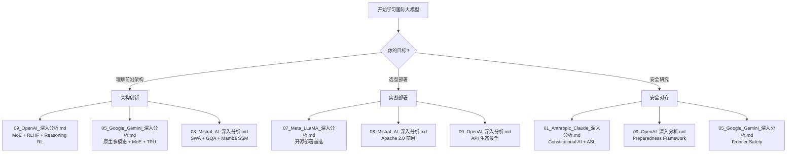

# 国际大模型生态全景 (Global LLM Ecosystem)

> 中文简称：国际大模型生态全景

> **一句话理解**: 国际五大 AI 巨头就像五大学派——OpenAI 靠 RLHF 开创了 ChatGPT 时代，Google 用原生多模态和百万 Token 上下文构筑 Gemini 帝国，Anthropic 以安全为信仰打造 Constitutional AI，Meta 用开源 LLaMA 点燃社区革命，Mistral 用欧洲工匠精神以小博大——它们共同定义了全球大模型的技术天花板。

---

## 五大厂商速览

| **厂商** | **成立时间** | **核心技术** | **旗舰模型** | **最大参数** | **最大亮点** | 深度文档 |
|----------|-------------|-------------|-------------|-------------|-------------|---------|
| **OpenAI** | 2015, 旧金山 | RLHF + MoE + Reasoning RL | o3 / GPT-4.1 | ~1.7T MoE (GPT-4) | 开创 ChatGPT 时代 + o3 推理 99.8%ile Codeforces | [09_OpenAI_深入分析.md](./09_OpenAI_深入分析.md) |
| **Google DeepMind** | 2023 (合并), 山景城 | Native Multimodal + MoE + TPU | Gemini 2.5 Pro | 未公开 MoE | 原生多模态 + 1M 上下文 + Thinking Mode | [05_Google_Gemini_深入分析.md](./05_Google_Gemini_深入分析.md) |
| **Anthropic** | 2021, 旧金山 | Constitutional AI + Extended Thinking | Claude 4 Opus | 未公开 | 安全第一 + 可见思维链 + Computer Use | [01_Anthropic_Claude_深入分析.md](./01_Anthropic_Claude_深入分析.md) |
| **Meta AI** | FAIR 2013, 门洛帕克 | Open-Weight + MoE + Native Multimodal | LLaMA 4 Maverick | 400B/17B active (128 experts) | 开源 LLaMA 生态 + 10M Token 上下文 | [07_Meta_LLaMA_深入分析.md](./07_Meta_LLaMA_深入分析.md) |
| **Mistral AI** | 2023, 巴黎 | SWA + GQA + Open MoE | Mistral 3 (675B MoE) | 675B/41B active | 欧洲之光 + 开源 MoE 先驱 + Mamba SSM | [08_Mistral_AI_深入分析.md](./08_Mistral_AI_深入分析.md) |

---

## 旗舰模型 Benchmark 对比

### 推理与数学

| **Benchmark** | **OpenAI o3** | **Gemini 2.5 Pro** | **Claude 4 Opus** | **LLaMA 4 Maverick** | **Mistral 3** |
|---------------|-------------|-------------------|-------------------|---------------------|---------------|
| **MMLU** | — | — | 87.4% | — | — |
| **GPQA Diamond** | **87.7%** | 84.0% | 74.9% | — | — |
| **AIME 2024** | **96.7%** | — | — | — | — |
| **AIME 2025** | — | **86.7%** | 33.9% | — | — |
| **FrontierMath** | **25.2%** | — | — | — | — |
| **ARC-AGI** | **87.5%** | — | — | 4.38% | — |
| **Codeforces** | **99.8%ile** | — | — | — | — |

### 代码与工程

| **Benchmark** | **OpenAI o3** | **Gemini 2.5 Pro** | **Claude 4 Sonnet** | **Claude 4 Opus** | **LLaMA 4** |
|---------------|-------------|-------------------|---------------------|-------------------|-------------|
| **SWE-bench Verified** | 71.7% | 63.8% | 72.7% | 72.5% | — |
| **SWE-bench (high-compute)** | — | — | **80.2%** | 79.4% | — |
| **Terminal-bench** | — | — | 35.5% | **43.2%** | — |
| **Aider Polyglot** | — | — | — | — | ~16% |

### Agent 与通用

| **Benchmark** | **OpenAI GPT-4** | **Gemini 2.5 Pro** | **Claude 3.5 Sonnet** | **LLaMA 4 Scout** |
|---------------|-----------------|-------------------|---------------------|-------------------|
| **MMLU** | 86.4% | — | 88.7% | — |
| **LMSYS Elo** | — | — | — | 1417 |
| **LMArena** | — | +120 vs 1.5 Pro | — | — |

---

## 模型家族规模对比

```
OpenAI    ████████████████████████████████  15+ 模型 (GPT-3→GPT-4.5, o1→o4-mini, DALL-E, Whisper, Sora)
Google    ████████████████████████████████  15+ 模型 (PaLM→Gemini 2.5 Pro/Flash, Gemma 1-3, Astra/Mariner)
Anthropic ██████████████████████            12+ 模型 (Claude 1→4.5, Haiku/Sonnet/Opus 三级)
Meta      ████████████████████████████████  15+ 模型 (LLaMA 1→4 Scout/Maverick/Behemoth, Code Llama)
Mistral   ████████████████████████████████  20+ 模型 (Mistral 7B→Mistral 3, Mixtral, Codestral, Voxtral, OCR)
```

---

## 核心技术路线对比

### 推理与思考模式

| **厂商** | **推理方案** | **思维链可见性** | **代表模型** |
|----------|-------------|----------------|-------------|
| OpenAI | RL 训练内部推理 token | 隐藏 (不展示给用户) | o3, o4-mini |
| Google | 可控思考预算 (Thinking Mode) | 内置于模型架构 | Gemini 2.5 Pro |
| Anthropic | Extended Thinking + 工具调用 | **透明** (用户可见) | Claude 4 Sonnet/Opus |
| Meta | 传统 CoT (暂无专用推理模型) | 标准 | LLaMA 4 |
| Mistral | 推理变体 (thinking mode) | 部分可见 | Mistral Small 3, Mistral 3 |

### 注意力机制与上下文

| **厂商** | **注意力方案** | **最大上下文** |
|----------|---------------|--------------|
| OpenAI | GQA (推测) | **1M** (GPT-4.1) |
| Google | MoE + 长上下文优化 | **1M+** (Gemini 1.5/2.5) |
| Anthropic | 标准 Attention | 200K (Claude 系列) |
| Meta | MoE + 修改注意力路由 | **10M** (LLaMA 4 Scout) |
| Mistral | **SWA** (Sliding Window) + GQA | 128K (Mistral Large 2) |

### 多模态策略

| **厂商** | **多模态方案** | **支持模态** |
|----------|---------------|-------------|
| OpenAI | 原生多模态 (GPT-4o) + 独立模型 (DALL-E, Whisper, Sora) | 文本+图像+音频+视频 |
| Google | **原生多模态训练** (从头联合训练) | 文本+图像+音频+视频 |
| Anthropic | 视觉理解 (Claude 3+) + Computer Use | 文本+图像+屏幕操作 |
| Meta | 原生多模态 (LLaMA 3.2+) + 图像 token 融合 | 文本+图像+视频 |
| Mistral | Pixtral (视觉) + Voxtral (语音) + OCR | 文本+图像+语音+文档 |

### 开源策略对比

| **厂商** | **开源许可** | **开放程度** |
|----------|-------------|------------|
| OpenAI | 完全闭源 | 仅 API |
| Google | Gemma (Apache 2.0) + Gemini 闭源 | 部分开源 |
| Anthropic | 完全闭源 | 仅 API |
| Meta | **LLaMA 开源** (自定义商用许可) | 全面开源 |
| Mistral | **Apache 2.0** (大部分模型) | 全面开源 |

---

## 训练基础设施对比

| **厂商** | **计算平台** | **核心芯片** | **估算规模** |
|----------|-------------|-------------|-------------|
| OpenAI | Microsoft Azure | A100 / H100 | 100K+ GPU |
| Google | Google Cloud | **TPU v4/v5p** (8960 chips/pod) | 全球最大 TPU 集群 |
| Anthropic | AWS + Google Cloud | A100 / H100 (via partners) | 未公开 |
| Meta | 自建 AI 数据中心 | H100 / B200 | 数十万 GPU |
| Mistral | NVIDIA 合作 | Hopper GPU | 数千 GPU |

---

## 安全与对齐策略对比

| **厂商** | **对齐方法** | **安全框架** | **特色** |
|----------|-------------|-------------|---------|
| OpenAI | RLHF + Constitutional AI 元素 | Preparedness Framework | System Card 透明报告 |
| Google | RLHF + 安全过滤 | Frontier Safety Framework | DeepMind 安全研究 |
| Anthropic | **Constitutional AI (CAI)** | **Responsible Scaling Policy (RSP)** + ASL-1~5 | 安全即使命 |
| Meta | RLHF + 安全微调 | Llama Guard + 红队测试 | 开放生态安全 |
| Mistral | RLHF + 安全对齐 | Moderation 模型 | 欧洲 AI 法规合规 |

---

## 学习路径



**推荐阅读顺序**:
1. 先读本文的对比表格，建立全局视野
2. 选择感兴趣的厂商，深入其 Deep Dive 文档
3. 参考 [../LLM_Architectures/04_LLM架构.md](../04_LLM架构/05_LLM架构.md) 了解架构共性
4. 参考 [../Reasoning_Models/04_o1_Class_推理模型.md](../08_推理模型/04_o1_Class_推理模型.md) 了解推理模型

---

## 与中国大模型生态的交叉对比

| **维度** | **国际领先者** | **中国追赶者** | **差距评估** |
|----------|---------------|---------------|-------------|
| 推理模型 | OpenAI o3 (99.8%ile Codeforces) | DeepSeek-R1 (96%ile) | 缩小中 |
| 长上下文 | Meta LLaMA 4 Scout (10M) | MiniMax (4M) | 相近 |
| 开源生态 | Meta LLaMA | DeepSeek + Qwen | 中国更开放 |
| 安全对齐 | Anthropic Constitutional AI | 较弱 | 较大差距 |
| 原生多模态 | Google Gemini | Qwen-VL, GLM-4V | 缩小中 |
| MoE 架构 | Mistral Mixtral (先驱) | DeepSeek-V3 (671B) | 中国更大规模 |
| 训练效率 | DeepSeek-V3 ($5.6M) | — | 中国成本更低 |

详见 [../Chinese_LLM_Ecosystem/README.md](../14_中国LLM生态/README.md)

---

## 前置知识 (Prerequisites)

- **必修**: [../LLM_Architectures/04_LLM架构.md](../04_LLM架构/05_LLM架构.md) — Transformer、MoE、GQA 基础
- **推荐**: [../Reasoning_Models/04_o1_Class_推理模型.md](../08_推理模型/04_o1_Class_推理模型.md) — 推理模型原理
- **推荐**: [../LLM_Architectures/12_MoE_案例_Studies_深度Seek_Mixtral.md](../04_LLM架构/12_MoE_Case_Studies_DeepSeek_Mixtral.md) — MoE 架构详解
- **可选**: [../../20_论文精读/02_GPT3_深入分析.md](../../20_论文精读/03_规模扩展/02_GPT3_深入分析.md) — GPT-3 论文解读
- **可选**: [../../20_论文精读/04_LLaMA_深入分析.md](../../20_论文精读/02_模型架构/04_LLaMA_深入分析.md) — LLaMA 论文解读

---

## 关键术语速查 (Key Terms)

- **RLHF (Reinforcement Learning from Human Feedback)**: 基于人类反馈的强化学习，使模型对齐人类偏好
- **Constitutional AI (CAI)**: Anthropic 的 AI 自我改进框架，用"宪法"原则指导模型行为
- **MoE (Mixture of Experts)**: 混合专家架构，稀疏激活提升效率
- **SWA (Sliding Window Attention)**: 滑动窗口注意力，O(W) 内存替代 O(n)
- **GQA (Grouped Query Attention)**: 分组查询注意力，加速推理
- **Extended Thinking**: Anthropic 的可见思维链，用户可观察推理过程
- **Native Multimodal**: 原生多模态，从训练开始就联合多种模态
- **TPU (Tensor Processing Unit)**: Google 定制 AI 芯片
- **Chinchilla Scaling**: 最优缩放定律，更多数据胜过更多参数
- **Computer Use**: 模型控制计算机 GUI 的能力 (Anthropic 首创)
- **Thinking Mode**: 可控推理预算，模型在深度思考和快速响应间切换

---

*Last updated: 2026-06-02*

## 相关链接

- [[05_大模型/13_全球LLM生态/09_OpenAI_深入分析|OpenAI 技术深度解析]] — GPT 系列与 o1/o3 推理模型
- [[05_大模型/13_全球LLM生态/01_Anthropic_Claude_深入分析|Anthropic Claude 技术深度解析]] — Claude 与 Constitutional AI
- [[05_大模型/13_全球LLM生态/05_Google_Gemini_深入分析|Google Gemini 技术深度解析]] — Gemini 原生多模态
- [[05_大模型/13_全球LLM生态/07_Meta_LLaMA_深入分析|Meta LLaMA 深度解析]] — 开源 LLM 旗手
- [[05_大模型/14_中国LLM生态/README|中文大模型生态全景]] — 国产大模型生态对标
- [[05_大模型/index|大模型首页]] — 大模型领域知识总览
