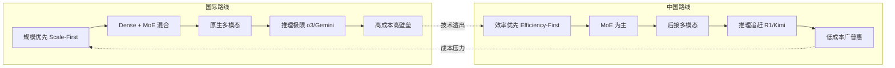
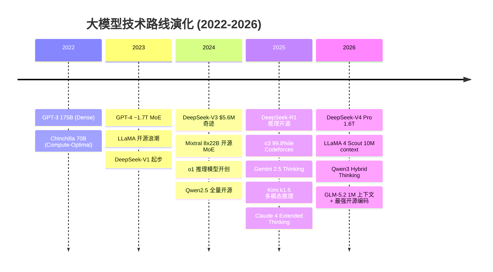
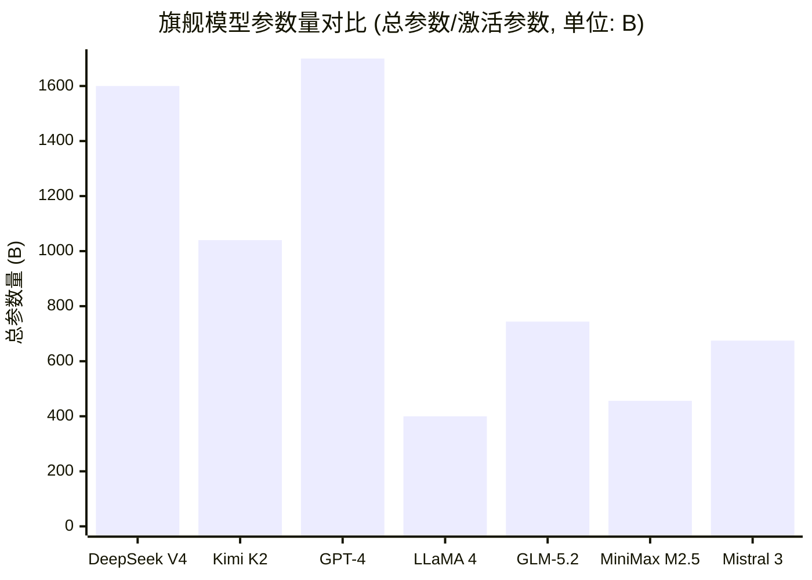
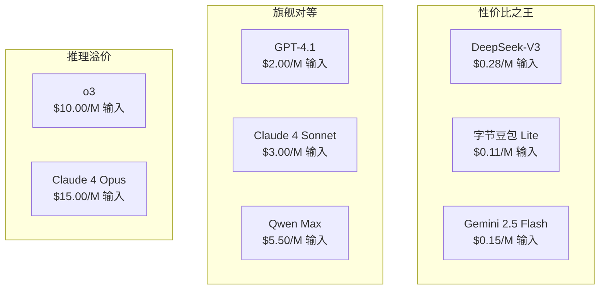
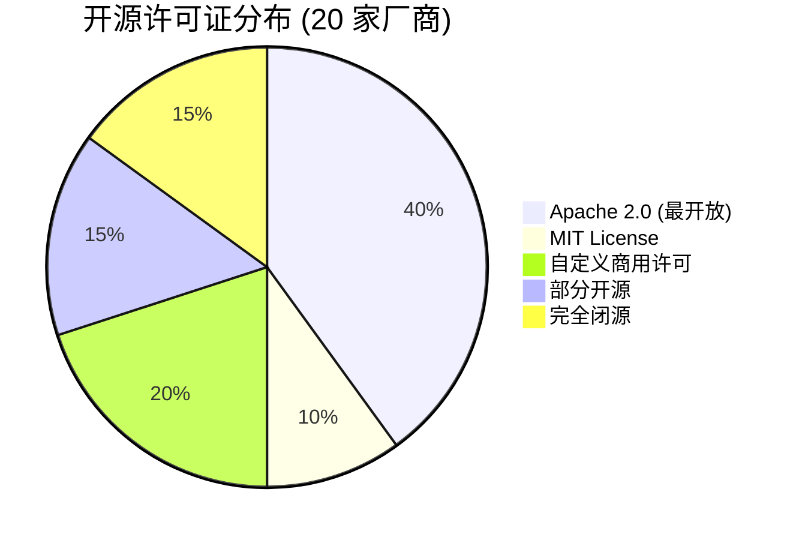
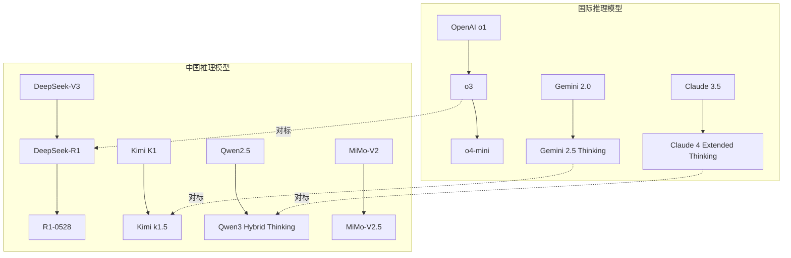
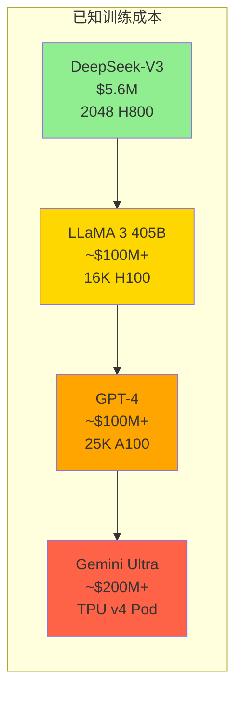
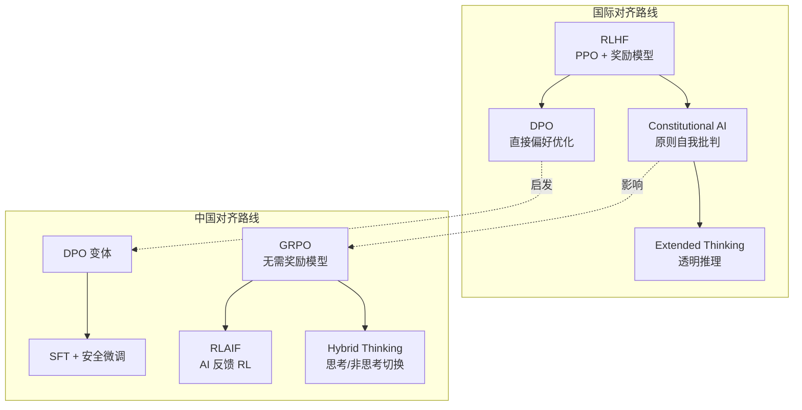

# 中国 vs 国际大模型全面对比 (Chinese vs Global LLM Comparison)

> 中文简称：中国 vs 国际大模型全面对比

> **一句话理解**: 中国大模型走"效率优先、MoE 为重、开源普惠"路线，国际巨头走"规模优先、原生多模态、推理极限"路线——两条路线在 2025-2026 年加速收敛，差距从"代际"缩小到"半代"。

---

## The Connection

中国和国际大模型生态并非孤立发展，而是在同一套 Transformer 架构基础上，因**计算资源约束**、**市场需求差异**和**监管环境不同**而分化出两条清晰的技术路线。理解这两条路线的异同，是做出模型选型、技术投资和政策判断的基础。



## Where They Co-occur

- **模型选型**: 企业需要在性能、成本、合规性之间选择中国或国际模型
- **开源竞争**: DeepSeek/Qwen vs LLaMA/Mistral 争夺开发者心智
- **标准制定**: Benchmark 评测体系、安全对齐标准、API 规范的全球博弈
- **人才流动**: 华人研究者在两大生态间的桥梁作用

---

## 1. 技术路线对比 (Technical Approach)

### 核心哲学差异

| **维度** | **中国路线** | **国际路线** |
|----------|-------------|-------------|
| **核心哲学** | 效率优先 (Efficiency-First) | 规模优先 (Scale-First) |
| **架构偏好** | MoE 为主，追求最小激活参数 | Dense + MoE 混合，追求最大总参数 |
| **注意力创新** | MLA (DeepSeek/Kimi), Lightning Attention (MiniMax) | GQA (主流), SWA (Mistral) |
| **训练策略** | FP8 混合精度, 极致成本控制 | BF16/FP32, 算力充裕 |
| **数据策略** | 合成数据 + 高质量筛选 | 海量数据 + 规模取胜 |
| **推理策略** | GRPO (DeepSeek), MuonClip (Kimi) | RL 隐式推理 (o3), Extended Thinking (Claude) |

### 技术路线演化时间线



### 注意力机制路线分化

中国厂商在注意力机制上更激进地追求长上下文和低显存：

| **方案** | **代表厂商** | **KV Cache 压缩** | **复杂度** | **最大实测上下文** |
|----------|-------------|------------------|-----------|------------------|
| **MLA** (Multi-head Latent Attention) | DeepSeek, Kimi, GLM | 95%+ 压缩 | O(n) KV | 1M (DeepSeek V4) |
| **Lightning Attention** | MiniMax | 无需 KV Cache | O(n) 线性 | 4M (外推) |
| **GQA** (Grouped Query Attention) | Qwen, OpenAI, Google | 标准压缩 | O(n^2) | 1M (GPT-4.1) |
| **SWA** (Sliding Window Attention) | Mistral | 窗口内精确 | O(nw) | 128K |

---

## 2. 模型规模对比 (Model Scale)

### 旗舰模型参数对比



| **厂商** | **旗舰模型** | **总参数** | **激活参数** | **MoE 比率** | **专家数** |
|----------|-------------|-----------|-------------|-------------|-----------|
| DeepSeek | V4 Pro | 1.6T | 49B | 3.1% | 256 |
| Kimi/月之暗面 | K2.6 | 1.04T | 32.6B | 3.1% | 384 |
| OpenAI | GPT-4 (推测) | ~1.7T | ~280B (推测) | ~16% (推测) | 8 (推测) |
| Meta | LLaMA 4 Maverick | 400B | 17B | 4.3% | 128 |
| GLM/智谱 | GLM-5.2 | 744B | 40B | 5.4% | 256+1 共享 |
| MiniMax | M2.7 | 456B | 45.9B | 10.1% | — |
| Mistral | Mistral 3 | 675B | 41B | 6.1% | — |
| Qwen/通义千问 | Qwen3 | 235B | 22B | 9.4% | 128 |
| 小米 MiMo | V2.5-Pro | 1T | 42B | 4.2% | — |
| Google | Gemini 2.5 Pro | 未公开 MoE | 未公开 | 未公开 | 未公开 |
| Anthropic | Claude 4 Opus | 未公开 | 未公开 | 未公开 | 未公开 |

### 关键洞察

- **中国 MoE 更激进**: 中国厂商的激活参数比率普遍 <5%，意味着"总参数量大但推理成本低"
- **国际 MoE 更保守**: OpenAI/Meta 的激活比率更高，推理成本更高但单次推理质量可能更好
- **闭源不透明**: Google/Anthropic 不公开参数细节，增加了对比的不确定性

---

## 3. Benchmark 横评 (Comprehensive Benchmarking)

### 3.1 综合能力: MMLU

| **模型** | **厂商** | **阵营** | **MMLU** | **级别** |
|----------|---------|---------|---------|---------|
| Kimi K2 | 月之暗面 | 中国 | 89.5% | GPT-4 级 |
| DeepSeek-V4-Pro | DeepSeek | 中国 | 90.1% | GPT-4+ 级 |
| Qwen3.7-Max | 通义千问 | 中国 | ~90%+ | GPT-4+ 级 |
| ERNIE 4.5 | 百度 | 中国 | ~88% | GPT-4 级 |
| Claude 4 Opus | Anthropic | 国际 | 87.4% | GPT-4 级 |
| GPT-4 | OpenAI | 国际 | 86.4% | GPT-4 级 |
| MiniMax-M3 | MiniMax | 中国 | ~88%+ | GPT-4 级 |
| Hunyuan-Pro 2.0 | 腾讯 | 中国 | ~86% | 近 GPT-4 |
| Baichuan-4 | 百川 | 中国 | ~85% | GPT-3.5+ |
| Step-2 | 阶跃星辰 | 中国 | ~84% | GPT-3.5+ |
| GLM-5.2 | 智谱 | 中国 | — | — |
| Spark 4.5 | 讯飞 | 中国 | ~83% | GPT-3.5+ |
| Doubao-1.5 Pro | 字节 | 中国 | ~83% | GPT-3.5+ |
| SenseNova 5.0 | 商汤 | 中国 | ~82% | GPT-3.5+ |

**关键发现**: 中国第一梯队（DeepSeek/Qwen/Kimi/百度）的 MMLU 已经达到甚至略微超越 GPT-4 水平，但第二梯队仍有 3-5% 的差距。

### 3.2 数学推理: AIME

| **模型** | **厂商** | **阵营** | **AIME 2024** | **AIME 2025** |
|----------|---------|---------|-------------|-------------|
| OpenAI o3 | OpenAI | 国际 | **96.7%** | — |
| GLM-5.2 | 智谱 | 中国 | — | — |
| Gemini 2.5 Pro | Google | 国际 | — | **86.7%** |
| DeepSeek-R1 | DeepSeek | 中国 | 79.8% | — |
| Kimi K2 | 月之暗面 | 中国 | 69.6% | — |
| Claude 4 Opus | Anthropic | 国际 | — | 33.9% |

**关键发现**: 在数学推理上，国际推理模型（o3）仍然领先，但中国的 GLM-5.2（AIME 2026 99.2%）已经达到顶尖水平，DeepSeek-R1 紧随其后进入第一梯队。

### 3.3 代码工程: SWE-bench Verified

| **模型** | **厂商** | **阵营** | **SWE-bench Verified** | **SWE-bench (high-compute)** |
|----------|---------|---------|----------------------|---------------------------|
| Claude 4 Sonnet | Anthropic | 国际 | 72.7% | **80.2%** |
| Claude 4 Opus | Anthropic | 国际 | 72.5% | 79.4% |
| OpenAI o3 | OpenAI | 国际 | 71.7% | — |
| MiniMax M2.5 | MiniMax | 中国 | 80.2% | — |
| Kimi K2 | 月之暗面 | 中国 | 65.8% | — |
| GLM-5.2 | 智谱 | 中国 | — | — |
| Gemini 2.5 Pro | Google | 国际 | 63.8% | — |

**关键发现**: MiniMax M2.5 在 SWE-bench 上表现惊人（80.2%），与 Claude 4 顶级推理模型并驾齐驱，说明中国在代码工程能力上已经追平国际水平。

### 3.4 研究生级推理: GPQA Diamond

| **模型** | **厂商** | **阵营** | **GPQA Diamond** |
|----------|---------|---------|-----------------|
| OpenAI o3 | OpenAI | 国际 | **87.7%** |
| Gemini 2.5 Pro | Google | 国际 | 84.0% |
| Claude 4 Opus | Anthropic | 国际 | 74.9% |

**关键发现**: GPQA Diamond 是中国模型的明显短板——目前尚无中国模型公布该基准的成绩，反映了在研究生级深度推理上的差距。

---

## 4. 定价对比 (API Pricing)

### 4.1 国际模型 API 定价 (USD / 百万 tokens)

| **模型** | **厂商** | **输入价格** | **输出价格** | **上下文** |
|----------|---------|-------------|-------------|-----------|
| GPT-4.1 | OpenAI | $2.00 | $8.00 | 1M |
| GPT-4.1 mini | OpenAI | $0.40 | $1.60 | 1M |
| GPT-4.1 nano | OpenAI | $0.10 | $0.40 | 1M |
| o3 | OpenAI | $10.00 | $40.00 | 200K |
| o4-mini | OpenAI | $1.10 | $4.40 | 200K |
| Gemini 2.5 Pro | Google | $1.25 | $10.00 | 1M |
| Gemini 2.5 Flash | Google | $0.15 | $0.60 | 1M |
| Claude 4 Opus | Anthropic | $15.00 | $75.00 | 200K |
| Claude 4 Sonnet | Anthropic | $3.00 | $15.00 | 200K |
| Claude 4 Haiku | Anthropic | $0.80 | $4.00 | 200K |
| LLaMA 4 (via API) | Meta | ~$0.20 | ~$0.60 | 10M |
| Mistral Large 2 | Mistral | $2.00 | $6.00 | 128K |

### 4.2 中国模型 API 定价 (CNY / 千 tokens)

| **模型** | **厂商** | **输入价格** | **输出价格** | **折合 USD/M** |
|----------|---------|-------------|-------------|---------------|
| DeepSeek-V3 | DeepSeek | 0.002 | 0.008 | $0.28 / $1.10 |
| 字节豆包 Lite | 字节 | 0.0008 | 0.001 | $0.11 / $0.14 |
| 腾讯混元 Lite | 腾讯 | 0.001 | 0.002 | $0.14 / $0.28 |
| 讯飞星火 Lite | 讯飞 | 0.001 | 0.002 | $0.14 / $0.28 |
| 百度文心 Speed | 百度 | 0.004 | 0.008 | $0.55 / $1.10 |
| Kimi moonshot-v1 | 月之暗面 | 0.012 | 0.012 | $1.65 / $1.65 |
| MiniMax abab-7 | MiniMax | 0.015 | 0.015 | $2.06 / $2.06 |
| Qwen qwen-max | 通义千问 | 0.04 | 0.08 | $5.50 / $11.00 |
| 百度文心 4.5 Ultra | 百度 | 0.12 | 0.12 | $16.50 / $16.50 |

### 4.3 性价比总结



**关键发现**:
- 中国 Lite 模型的价格是国际旗舰的 **1/10 到 1/20**
- DeepSeek-V3 以 GPT-4 级性能、1/7 的价格，定义了"极致性价比"
- 推理模型（o3/Claude Opus）有 5-10x 的推理溢价
- Qwen Max 定价偏高，但提供了最全的开源生态作为补偿

---

## 5. 上下文长度对比 (Context Length)

### 上下文长度排名

| **排名** | **模型** | **厂商** | **阵营** | **上下文长度** | **技术方案** |
|---------|---------|---------|---------|-------------|------------|
| 1 | LLaMA 4 Scout | Meta | 国际 | **10M** | MoE + 修改注意力路由 |
| 2 | MiniMax-M3 | MiniMax | 中国 | **1M** (solid) | MSA 稀疏注意力 (compute 1/20) |
| 3 | DeepSeek V4 | DeepSeek | 中国 | **1M** | CSA+HCA 混合注意力 (KV cache 仅 V3.2 的 10%) |
| 4 | GPT-4.1 | OpenAI | 国际 | **1M** | GQA + 长上下文优化 |
| 5 | Gemini 2.5 Pro | Google | 国际 | **1M+** | MoE + 长上下文优化 |
| 6 | Qwen3.7-Max | 通义千问 | 中国 | **1M** | Hybrid Thinking + MoE |
| 7 | GLM-5.2 | 智谱 | 中国 | **1M** | MLA + DSA + IndexShare |
| 8 | Yi-1.5 | 零一万物 | 中国 | **200K** | GQA |
| 9 | Claude 4 | Anthropic | 国际 | **200K** | 标准 Attention |
| 10 | Mistral Large 2 | Mistral | 国际 | **128K** | SWA + GQA |
| 11 | 大多数中国模型 | 多家 | 中国 | **128K** | GQA 标准 |

**关键发现**:
- **Meta LLaMA 4 Scout 以 10M tokens 独占鳌头**，是第二名的 2.5 倍
- 中国在长上下文上非常积极：MiniMax (4M), DeepSeek/Qwen/GLM-5.2 (1M)
- 长上下文 >1M 的模型全部采用非标准注意力机制（MLA/Lightning/修改路由）
- 大多数模型仍停留在 128K，说明真正的超长上下文仍然是技术难点

---

## 6. 开源策略对比 (Open Source Strategy)

### 6.1 开源许可证分布



### 6.2 开源策略矩阵

| **厂商** | **阵营** | **许可证** | **HuggingFace 模型数** | **GitHub Stars** | **开源策略** |
|----------|---------|-----------|---------------------|-----------------|------------|
| Mistral | 国际 | **Apache 2.0** | 30+ | 30K+ | 最开放：商用无限制 |
| Meta | 国际 | LLaMA License | 50+ | 70K+ | 开放但需注册，700M MAU 限制 |
| Qwen | 中国 | Apache 2.0 | **100+** | 15K+ | 最全面：从 0.5B 到旗舰 |
| DeepSeek | 中国 | MIT / DeepSeek License | 50+ | **90K+** | 最震撼：开源 GPT-4 级模型 |
| Google | 国际 | Apache 2.0 (Gemma) | 40+ | 20K+ | 部分开源：Gemma 开放，Gemini 闭源 |
| 智谱 GLM | 中国 | **MIT** | 40+ | 12K+ | 纯开源（最宽松） |
| 零一万物 Yi | 中国 | Apache 2.0 | 30+ | 8K+ | 全量开源 |
| 书生浦语 | 中国 | Apache 2.0 | 20+ | **20K+** (含工具链) | 全量 + 工具链 |
| 小米 MiMo | 中国 | Apache 2.0 | 10+ | 5K+ | 新晋开源 |
| MiniMax | 中国 | Apache 2.0 | 20+ | 3K+ | 部分开源 |
| Kimi | 中国 | Apache 2.0 | 10+ | 5K+ | 部分开源 |
| OpenAI | 国际 | **完全闭源** | 0 | — | 仅 API |
| Anthropic | 国际 | **完全闭源** | 0 | — | 仅 API |
| 百度文心 | 中国 | Apache 2.0 (框架) | — | — | 仅框架开源 |
| 字节豆包 | 中国 | **完全闭源** | — | — | 几乎不开源 |

### 6.3 开源策略关键洞察

- **中国整体比国际更开放**: 15 家中国厂商中有 10+ 家开源模型，而 5 家国际巨头中有 2 家完全闭源
- **Apache 2.0 是主流**: 中国和 Mistral/Google 都倾向 Apache 2.0，Meta 则坚持自定义许可
- **DeepSeek 开源 GPT-4 级模型是最大冲击**: 90K+ GitHub Stars 说明社区对"开源旗舰"的巨大需求
- **Qwen 的模型家族最全**: 100+ HuggingFace 模型覆盖从端侧到云端的全部场景

---

## 7. 推理模型对比 (Reasoning Models)

### 7.1 推理模型全景

推理模型（Reasoning Models）是 2024-2026 年最重要的技术方向——通过测试时计算扩展 (test-time compute scaling) 实现"慢思考"。



### 7.2 推理模型技术对比

| **模型** | **厂商** | **阵营** | **推理方案** | **思维链可见** | **训练方法** |
|----------|---------|---------|-------------|-------------|------------|
| o3 | OpenAI | 国际 | RL 训练内部推理 token | **隐藏** | RL + 大量推理数据 |
| o4-mini | OpenAI | 国际 | o3 精简版 | **隐藏** | 蒸馏 + RL |
| Gemini 2.5 Pro | Google | 国际 | 可控思考预算 (Thinking Mode) | 内置于架构 | 端到端训练 |
| Claude 4 Opus | Anthropic | 国际 | Extended Thinking | **透明** (用户可见) | Constitutional AI + RL |
| DeepSeek-R1 | DeepSeek | 中国 | GRPO + 内部推理 token | **开源可见** | GRPO (无需奖励模型) |
| Kimi k1.5 | 月之暗面 | 中国 | MuonClip + 多模态推理 | 部分可见 | RL + 多模态数据 |
| Qwen3 | 通义千问 | 中国 | Hybrid Thinking (思考/非思考切换) | 可选 | 混合训练 |
| MiMo-V2.5 | 小米 | 中国 | MoE + Agent-First 推理 | 部分可见 | RL + Agent 数据 |
| GLM-5.2 | 智谱 | 中国 | 灵活思考强度 (reasoning_effort) | 部分可见 | slime 异步 RL + 工具调用 |

### 7.3 推理性能对比

| **Benchmark** | **o3** | **Gemini 2.5** | **Claude 4** | **DeepSeek-R1** | **GLM-5.2** | **Kimi K2** |
|-------------|-------|--------------|------------|---------------|-----------|-----------|
| AIME 2024 | **96.7%** | — | — | 79.8% | — | 69.6% |
| GPQA Diamond | 87.7% | 84.0% | 74.9% | — | **91.2%** | — |
| Codeforces | **99.8%ile** | — | — | 96%ile | — | — |
| FrontierMath | **25.2%** | — | — | — | — | — |
| ARC-AGI | **87.5%** | — | — | — | — | — |

**关键发现**:
- **o3 在 Codeforces (99.8%ile) 等基准上领先**，但 GLM-5.2 在 GPQA Diamond 取得 91.2% 反超
- **DeepSeek-R1 是唯一开源的顶级推理模型**，96%ile Codeforces 仅比 o3 低 3.8 个百分点
- **Claude 4 的思维链最透明**，用户可以看到完整的推理过程
- **中国的推理模型表现突出**：GLM-5.2 在 GPQA Diamond 取得 91.2%（同级最高）、AIME 2026 达 99.2%，但在 FrontierMath 等极限基准上仍缺乏数据

---

## 8. 多模态对比 (Multimodal Capabilities)

### 8.1 多模态能力矩阵

| **厂商** | **阵营** | **文本** | **图像理解** | **图像生成** | **音频** | **视频理解** | **视频生成** | **屏幕操作** |
|----------|---------|---------|-----------|-----------|--------|-----------|-----------|-----------|
| OpenAI | 国际 | GPT-4o | GPT-4o | DALL-E 3 | Whisper/GPT-4o | GPT-4o | Sora | — |
| Google | 国际 | Gemini 2.5 | Gemini 2.5 | Imagen 3 | Gemini 2.5 | Gemini 2.5 | Veo 2 | Project Mariner |
| Anthropic | 国际 | Claude 4 | Claude 4 | — | — | — | — | **Computer Use** |
| Meta | 国际 | LLaMA 4 | LLaMA 4 | — | — | LLaMA 4 | Movie Gen | — |
| Mistral | 国际 | Mistral 3 | Pixtral | — | Voxtral | — | — | — |
| DeepSeek | 中国 | V4 Pro | V4 Pro | — | — | — | — | — |
| Qwen | 中国 | Qwen3 | Qwen-VL | Wanx | Qwen-Audio | Qwen-VL | — | — |
| GLM/智谱 | 中国 | GLM-5.2 | GLM-4V | CogView-4 | — | CogVideoX | CogVideoX | AutoGLM |
| 百度文心 | 中国 | ERNIE 4.5 | ERNIE 4.5 | 文心一格 | ERNIE 4.5 | ERNIE 4.5 | — | — |
| 腾讯混元 | 中国 | Hunyuan | Hunyuan | — | — | Hunyuan | **HunyuanVideo** | — |
| MiniMax | 中国 | M2.7 | M2.7 | — | Speech-02 | M2.7 | **Hailuo** | — |
| 讯飞星火 | 中国 | Spark 4.5 | Spark 4.5 | — | **语音核心** | — | — | — |
| 商汤 | 中国 | SenseNova | SenseNova | — | SenseNova | SenseNova | — | **如影数字人** |
| Kimi | 中国 | K2.6 | K2.6 | — | — | — | — | — |
| 字节豆包 | 中国 | Doubao | Doubao | — | — | Doubao | 豆包视频 | — |

### 8.2 多模态策略差异

| **策略** | **代表厂商** | **核心特点** |
|----------|-------------|------------|
| **原生多模态训练** | Google (Gemini), OpenAI (GPT-4o) | 从头联合训练多种模态 |
| **后接多模态** | DeepSeek, Qwen-VL | 文本模型 + 视觉编码器拼接 |
| **全模态覆盖** | MiniMax, 商汤, 百度 | 文+图+音+视频+3D 全覆盖 |
| **垂直深耕** | 讯飞 (语音), 商汤 (数字人) | 特定模态做到极致 |

**关键发现**:
- **国际巨头在多模态上更全面**: OpenAI/Google 覆盖了全部 6 种模态
- **中国在视频生成上有亮点**: HunyuanVideo 和 Hailuo 在国际评测中表现优异
- **中国在音频/语音上有特色**: 讯飞星火的语音 AI 具有行业领先优势
- **DeepSeek 的多模态最弱**: 目前仅支持文本+图像，是明显的短板

---

## 9. Agent 能力对比 (Agent Capabilities)

### 9.1 Agent 基准对比

| **Benchmark** | **说明** | **最佳国际** | **最佳中国** |
|-------------|---------|-----------|-----------|
| **SWE-bench Verified** | 真实 GitHub Issue 修复 | Claude 4 Sonnet 72.7% | MiniMax M2.5 80.2% |
| **Terminal-bench** | 终端操作能力 | Claude 4 Opus 43.2% | GLM-5.2 81.0% (v2.1) |
| **tau-bench** | 多步工具调用 | — | — |
| **Computer Use** | 屏幕操作 | Anthropic (先驱) | AutoGLM (智谱) |
| **Aider Polyglot** | 多语言代码辅助 | — | — |

### 9.2 Agent 生态对比

| **维度** | **国际** | **中国** |
|----------|---------|---------|
| **Agent 框架** | LangChain, CrewAI, AutoGen | Coze (字节), 方舟 (火山) |
| **工具调用** | Function Calling (OpenAI 标准) | 各厂商自有实现 |
| **浏览器操作** | Anthropic Computer Use, OpenAI Operator | AutoGLM, 豆包插件 |
| **代码 Agent** | Cursor, GitHub Copilot, Windsurf | 通义灵码, 豆包 MarsCode |
| **Agent 平台** | OpenAI GPTs, Anthropic MCP | Coze, 千帆 (百度) |

### 9.3 Agent 能力评级

| **厂商** | **阵营** | **工具调用** | **代码 Agent** | **浏览器操作** | **Agent 平台** |
|----------|---------|-----------|-------------|-------------|-------------|
| OpenAI | 国际 | ★★★★★ | ★★★★★ | ★★★★☆ | ★★★★★ |
| Anthropic | 国际 | ★★★★★ | ★★★★★ | ★★★★★ | ★★★★☆ |
| Google | 国际 | ★★★★★ | ★★★★☆ | ★★★★☆ | ★★★★☆ |
| Meta | 国际 | ★★★★☆ | ★★★☆☆ | ★★☆☆☆ | ★★★☆☆ |
| GLM/智谱 | 中国 | ★★★★☆ | ★★★★☆ | ★★★★☆ | ★★★★☆ |
| 小米 MiMo | 中国 | ★★★★★ | ★★★★☆ | ★★★☆☆ | ★★★☆☆ |
| MiniMax | 中国 | ★★★★☆ | ★★★★★ | ★★★☆☆ | ★★★☆☆ |
| Kimi | 中国 | ★★★★☆ | ★★★☆☆ | ★★★☆☆ | ★★★☆☆ |
| 字节豆包 | 中国 | ★★★★☆ | ★★★★☆ | ★★★☆☆ | ★★★★★ |
| DeepSeek | 中国 | ★★★★☆ | ★★★★★ | ★★☆☆☆ | ★★★☆☆ |

**关键发现**:
- **MiniMax 在 SWE-bench 上超过 Claude**，证明中国模型在代码 Agent 能力上已达国际顶尖
- **MiMo 主打 Agent-First**，是首个以 Agent 为核心设计理念的大模型
- **Anthropic 的 Computer Use 开创了屏幕操作 Agent**，中国的 AutoGLM 紧随其后
- **中国的 Agent 平台生态更碎片化**，缺乏统一的工具调用标准

---

## 10. 训练成本对比 (Training Cost)

### 10.1 已知训练成本对比



### 10.2 训练效率详细对比

| **模型** | **厂商** | **阵营** | **训练成本 (估)** | **GPU 配置** | **训练时长** | **成本/参数** |
|----------|---------|---------|---------------|-----------|-----------|-------------|
| DeepSeek-V3 | DeepSeek | 中国 | **$5.6M** | 2048 H800 | 2 个月 | $0.008/B |
| LLaMA 3 8B | Meta | 国际 | ~$1M | 数千 A100 | ~1 个月 | ~$0.125/B |
| LLaMA 3 405B | Meta | 国际 | **~$100M+** | 16K H100 | ~3 个月 | ~$0.25/B |
| GPT-4 | OpenAI | 国际 | **~$100M+** | 25K A100 | ~3 个月 | ~$0.06/B |
| Gemini Ultra | Google | 国际 | **~$200M+** | TPU v4 Pod | ~6 个月 | 未公开 |
| Claude 4 | Anthropic | 国际 | 未公开 | AWS H100 | 未公开 | 未公开 |
| Qwen3 | 通义千问 | 中国 | ~$10-30M (估) | 数千 H800 | ~2-3 个月 | ~$0.04-0.13/B |
| GLM-5.2 | 智谱 | 中国 | ~$10-20M (估) | 数千 A100/H800 | ~2 个月 | ~$0.03-0.06/B |
| ERNIE 4.5 | 百度 | 中国 | ~$20-50M (估) | 昆仑芯 + NVIDIA | ~3 个月 | 未公开 |

### 10.3 训练效率技术对比

| **效率技术** | **代表厂商** | **核心创新** | **成本节省** |
|-------------|-------------|------------|-----------|
| **FP8 混合精度** | DeepSeek | 前向/反向全 FP8，精度损失 <0.25% | ~50% |
| **MLA 注意力** | DeepSeek, Kimi | KV Cache 压缩 95%，减少显存 | ~40% |
| **Multi-Token Prediction** | DeepSeek, MiMo | 每步预测多个 token | ~30% |
| **Lightning Attention** | MiniMax | 线性复杂度注意力 | ~60% (长上下文) |
| **数据质量筛选** | DeepSeek, Qwen | 合成数据 + 课程学习 | ~20% |

**关键发现**:
- **DeepSeek-V3 的 $5.6M 训练成本是行业奇迹**，比 GPT-4 低 ~20 倍，性能却达到 GPT-4 级
- **中国厂商普遍追求训练效率**：FP8、MLA、MTP 等效率优化技术在中国更受欢迎
- **国际巨头有算力优势但成本不透明**：Google 的 TPU 集群和 OpenAI 的 Azure 集群规模远超中国
- **训练成本的差距正在缩小**：中国厂商的效率创新正在被国际厂商学习和采纳

---

## 11. 安全与对齐对比 (Safety & Alignment)

### 11.1 对齐方法对比

| **厂商** | **阵营** | **核心对齐方法** | **安全框架** | **特色** |
|----------|---------|--------------|-----------|---------|
| Anthropic | 国际 | **Constitutional AI (CAI)** | **RSP** (ASL-1~5) | 安全即使命，最严格的安全分级 |
| OpenAI | 国际 | RLHF + CAI 元素 | Preparedness Framework | System Card 透明报告 |
| Google | 国际 | RLHF + 安全过滤 | Frontier Safety Framework | DeepMind 安全研究 |
| Meta | 国际 | RLHF + 安全微调 | Llama Guard + 红队测试 | 开放生态安全 |
| Mistral | 国际 | RLHF + 安全对齐 | Moderation 模型 | 欧洲 AI 法规合规 |
| DeepSeek | 中国 | **GRPO** (无显式奖励模型) | 基本安全过滤 | 效率优先，对齐方法创新 |
| Qwen | 中国 | RLHF + DPO | 安全过滤 | 混合对齐策略 |
| GLM/智谱 | 中国 | RLHF + 安全微调 | Agent 安全框架 | Agent 场景安全 |
| 百度文心 | 中国 | RLHF + 合规过滤 | 中国 AI 法规合规 | 内容审核最严格 |

### 11.2 对齐技术路线对比



### 11.3 安全与对齐差距分析

| **维度** | **国际水平** | **中国水平** | **差距** |
|----------|-----------|-----------|---------|
| 对齐方法论 | 成熟 (CAI, RSP, System Card) | 发展中 (GRPO 创新但框架不完善) | **较大** |
| 透明度 | 高 (公开安全评测) | 低 (较少公开安全报告) | **大** |
| 红队测试 | 系统化 | 初步 | **较大** |
| 法规合规 | 欧洲 AI Act, 美国行政令 | 中国 AI 法规, 算法备案 | 各自体系 |
| 对抗性测试 | 公开挑战赛 | 内部测试 | **中等** |

**关键发现**:
- **安全对齐是中美差距最大的维度**：Anthropic 的 RSP/ASL 体系远超中国厂商的安全实践
- **DeepSeek 的 GRPO 是对齐方法的重要创新**：无需显式奖励模型，降低了训练复杂度
- **中国法规更侧重内容安全**，国际法规更侧重模型能力和系统性风险
- **透明度差距明显**：国际厂商普遍发布 System Card / Model Card，中国厂商较少公开安全评测

---

## 12. 生态系统对比 (Ecosystem)

### 12.1 HuggingFace 生态

| **厂商** | **阵营** | **HF 模型数** | **HF 下载量 (月)** | **GitHub Stars** | **社区活跃度** |
|----------|---------|-------------|------------------|-----------------|-------------|
| Qwen | 中国 | **100+** | 数百万 | 15K+ | ★★★★★ |
| DeepSeek | 中国 | 50+ | **数百万** | **90K+** | ★★★★★ |
| Meta LLaMA | 国际 | 50+ | 数百万 | 70K+ | ★★★★★ |
| Mistral | 国际 | 30+ | 数百万 | 30K+ | ★★★★☆ |
| Google Gemma | 国际 | 40+ | 百万级 | 20K+ | ★★★★☆ |
| 智谱 GLM | 中国 | 40+ | 百万级 | 12K+ | ★★★☆☆ |
| 零一万物 Yi | 中国 | 30+ | 十万级 | 8K+ | ★★★☆☆ |
| 书生浦语 | 中国 | 20+ | 十万级 | 20K+ (含工具) | ★★★★☆ |
| MiniMax | 中国 | 20+ | 十万级 | 3K+ | ★★☆☆☆ |
| Kimi | 中国 | 10+ | 十万级 | 5K+ | ★★☆☆☆ |

### 12.2 开发者工具链对比

| **工具类别** | **国际** | **中国** |
|-------------|---------|---------|
| **推理引擎** | vLLM, TGI, TensorRT-LLM | LMDeploy (书生), DeepSeek-Infer |
| **微调框架** | Hugging Face TRL, Axolotl | LLaMA-Factory, SWIFT (Qwen) |
| **评测平台** | OpenAI Evals, HELM | **OpenCompass** (书生, 中国最大) |
| **部署平台** | AWS SageMaker, Azure ML | PAI (阿里), 千帆 (百度), TI (腾讯) |
| **Agent 平台** | OpenAI GPTs, Anthropic MCP | Coze (字节), 千帆 AppBuilder |
| **IDE 集成** | Cursor, GitHub Copilot | 通义灵码, 豆包 MarsCode |
| **RAG 框架** | LangChain, LlamaIndex | Dify, FastGPT, MaxKB |

### 12.3 生态系统成熟度评级

| **维度** | **国际** | **中国** | **优势方** |
|----------|---------|---------|-----------|
| 开源模型数量 | ★★★★☆ | ★★★★★ | **中国** |
| 开发者社区规模 | ★★★★★ | ★★★★☆ | **国际** |
| API 生态丰富度 | ★★★★★ | ★★★☆☆ | **国际** |
| 微调工具链 | ★★★★★ | ★★★★☆ | **国际** |
| 推理部署工具 | ★★★★☆ | ★★★★☆ | **持平** |
| 评测基准体系 | ★★★★☆ | ★★★★★ | **中国** (OpenCompass) |
| Agent 平台 | ★★★★★ | ★★★★☆ | **国际** |
| 中文应用生态 | ★★☆☆☆ | ★★★★★ | **中国** |
| 企业级支持 | ★★★★★ | ★★★★☆ | **国际** |
| 教育/学术影响 | ★★★★★ | ★★★★☆ | **国际** |

**关键发现**:
- **中国在开源模型数量上超过国际**：Qwen 100+ 模型是 HuggingFace 上最活跃的系列之一
- **DeepSeek 的 GitHub 90K+ Stars 是全球 AI 项目中最高的**
- **国际在 API 生态和 Agent 平台上领先**：OpenAI GPTs 和 Anthropic MCP 形成了更成熟的开发者生态
- **中国的 OpenCompass 是全球最全面的 LLM 评测平台之一**
- **中文应用生态是中国独有的优势**：搜索增强、微信生态、超级App 集成等

---

## 综合对比总结

### 全局雷达图 (文本版)

| **维度** | **国际领先** | **中国领先** | **持平** | **总体判断** |
|----------|-----------|-----------|---------|-----------|
| 技术路线 | 原生多模态 | 效率创新 (MLA/FP8) | MoE 架构 | 各有千秋 |
| 模型规模 | 总参数更大 | MoE 激活更小 | — | 国际规模大，中国效率高 |
| Benchmark (MMLU) | GPT-4 级 | GPT-4 级 | — | **持平** |
| Benchmark (推理) | o3 大幅领先 | 追赶中 | — | **国际领先** |
| Benchmark (代码) | Claude 4 级 | MiniMax 同级 | — | **持平** |
| API 定价 | 高端定价 | 极致低价 | — | **中国领先** |
| 上下文长度 | LLaMA 10M | MiniMax 4M | — | **国际领先** |
| 开源策略 | Mistral/Meta | DeepSeek/Qwen | — | **中国更开放** |
| 推理模型 | o3/Gemini Thinking | DeepSeek-R1 | — | **国际领先** |
| 多模态 | 全模态覆盖 | 视频/语音特色 | — | **国际领先** |
| Agent 能力 | Claude/OpenAI | MiniMax/GLM | — | **国际微领先** |
| 训练成本 | 高投入 | 极致效率 | — | **中国领先** |
| 安全对齐 | CAI/RSP 体系 | 发展中 | — | **国际大幅领先** |
| 生态系统 | API/Agent 平台 | 开源/中文应用 | — | 各有千秋 |

### 一句话总结

> **国际巨头在"上限"上领先**（推理极限、多模态、安全对齐），**中国在"下限"上领先**（成本、开源、普惠）——前者定义了 AI 的天花板，后者定义了 AI 的地板。两条路线正在加速收敛，2026-2027 年将是关键交汇期。

---

## 选型建议 (Selection Guide)

### 按场景选择

```mermaid
flowchart TD
    Q{你的场景?} -->|追求极限推理| A[OpenAI o3 / Gemini 2.5 Thinking]
    Q -->|安全敏感应用| B[Claude 4 Opus / Sonnet]
    Q -->|极致性价比| C[DeepSeek-V3 / 字节豆包]
    Q -->|中文垂直应用| D[ERNIE 4.5 / Qwen / 讯飞]
    Q -->|开源私有部署| E[Qwen / LLaMA / Mistral]
    Q -->|Agent/代码| F[Claude 4 / MiniMax M2.5]
    Q -->|超长上下文| G[LLaMA 4 Scout 10M / MiniMax 4M]
    Q -->|视频生成| H[HunyuanVideo / Hailuo]
    Q -->|语音 AI| I[讯飞星火 / Whisper]
    Q -->|学术/研究| J[DeepSeek-R1 (开源) / Gemini]
```

### 按预算选择

| **预算** | **推荐国际** | **推荐中国** | **说明** |
|----------|-----------|-----------|---------|
| 极低 (<$1/M tokens) | Gemini Flash ($0.15/M) | DeepSeek-V3 ($0.28/M), 豆包 Lite ($0.11/M) | 中国 Lite 模型最便宜 |
| 中档 ($1-5/M) | GPT-4.1 ($2/M), Mistral ($2/M) | Kimi ($1.65/M), MiniMax ($2/M) | 性能/价格最佳平衡 |
| 高端 ($5-15/M) | Claude 4 Sonnet ($3/M) | Qwen Max ($5.5/M) | 旗舰质量 |
| 极致 ($15+/M) | Claude 4 Opus ($15/M), o3 ($10/M) | 百度 4.5 Ultra ($16.5/M) | 最强推理 |

---

## 趋势预测 (Trend Forecast)

### 2026-2027 关键趋势

1. **路线收敛**: 中国效率路线和国际规模路线将在 MoE + 推理增强上交汇
2. **开源加速**: 更多 GPT-4 级模型开源（DeepSeek 已证明可行性）
3. **推理平民化**: 推理能力从高端模型向中端模型扩散（o4-mini 模式）
4. **Agent 标准化**: MCP (Model Context Protocol) 等标准将统一 Agent 生态
5. **安全对齐追赶**: 中国厂商将加大安全投入，缩小与国际的差距
6. **多模态融合**: 原生多模态训练将从国际扩展到中国厂商
7. **成本持续下降**: 训练和推理成本每年下降 2-3 倍

---

## Cross-References

### 中国大模型生态

- [[05_大模型/14_中国LLM生态/README|中国大模型生态全景]]
- [[05_大模型/14_中国LLM生态/04_Chinese_LLM_对比_矩阵|中国大模型全厂商对比矩阵]]
- [[05_大模型/14_中国LLM生态/25_DeepSeek_架构_2026|DeepSeek 深度解析]]
- [[05_大模型/14_中国LLM生态/19_Qwen_深入分析|Qwen 深度解析]]
- [[05_大模型/14_中国LLM生态/13_Kimi_Moonshot_深入分析|Kimi 深度解析]]
- [[05_大模型/14_中国LLM生态/09_GLM_Zhipu_深入分析|GLM/智谱 深度解析]]
- [[05_大模型/14_中国LLM生态/14_MiniMax_深入分析|MiniMax 深度解析]]
- [[05_大模型/14_中国LLM生态/23_Xiaomi_MiMo_深入分析|小米 MiMo 深度解析]]

### 国际大模型生态

- [[05_大模型/13_全球LLM生态/README|国际大模型生态全景]]
- [[05_大模型/13_全球LLM生态/09_OpenAI_深入分析|OpenAI 深度解析]]
- [[05_大模型/13_全球LLM生态/05_Google_Gemini_深入分析|Google Gemini 深度解析]]
- [[05_大模型/13_全球LLM生态/01_Anthropic_Claude_深入分析|Anthropic Claude 深度解析]]
- [[05_大模型/13_全球LLM生态/07_Meta_LLaMA_深入分析|Meta LLaMA 深度解析]]
- [[05_大模型/13_全球LLM生态/08_Mistral_AI_深入分析|Mistral AI 深度解析]]

### 相关论文

- [[20_论文精读/03_规模扩展/Scaling_Laws_Deep_Dive|Scaling Laws 深度解读]]
- [[20_论文精读/02_模型架构/Mixture_of_Experts_Deep_Dive|MoE 深度解读]]
- [[20_论文精读/09_前沿探索/DeepSeek_V3_Technical_Report|DeepSeek-V3 技术报告]]
- [[20_论文精读/06_对齐研究/06_RLHF_DPO_深入分析|RLHF 与 DPO 深度解读]]
- [[20_论文精读/06_对齐研究/Chain_of_Thought_Deep_Dive|Chain-of-Thought 深度解读]]
- [[20_论文精读/03_规模扩展/01_Chinchilla_深入分析|Chinchilla 深度解读]]

### 相关合成文档

- [[治理/AGENTS|推理模型 × Agent]]
- [[治理/moe-inference-optimization|MoE 推理优化]]
- [[治理/alignment-rlhf|价值对齐 × RLHF]]
- [[08_模型评估/02_基准测试/02_benchmark_evaluation|评测基准 × 评测方法论]]
- [[治理/talks-insights|AI 领袖演讲与行业洞察]]

---

## Sources

- [[05_大模型/14_中国LLM生态/README]] — 中国 15 家厂商技术数据
- [[05_大模型/13_全球LLM生态/README]] — 国际 5 大巨头技术数据
- [[05_大模型/14_中国LLM生态/04_Chinese_LLM_对比_矩阵]] — 中国厂商定价和 Benchmark
- [[05_大模型/04_LLM架构/05_LLM架构]] — Transformer/MoE 架构基础
- [[05_大模型/08_推理模型/04_o1_Class_推理模型]] — 推理模型技术分析
- [[05_大模型/08_推理模型/INDEX]] — DeepSeek R1 技术分析

---

*Last updated: 2026-06-15*
