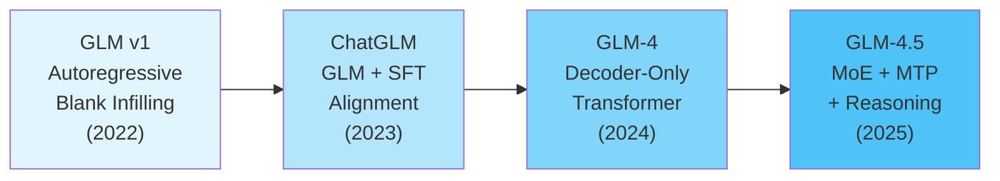
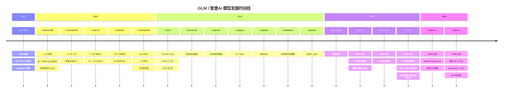
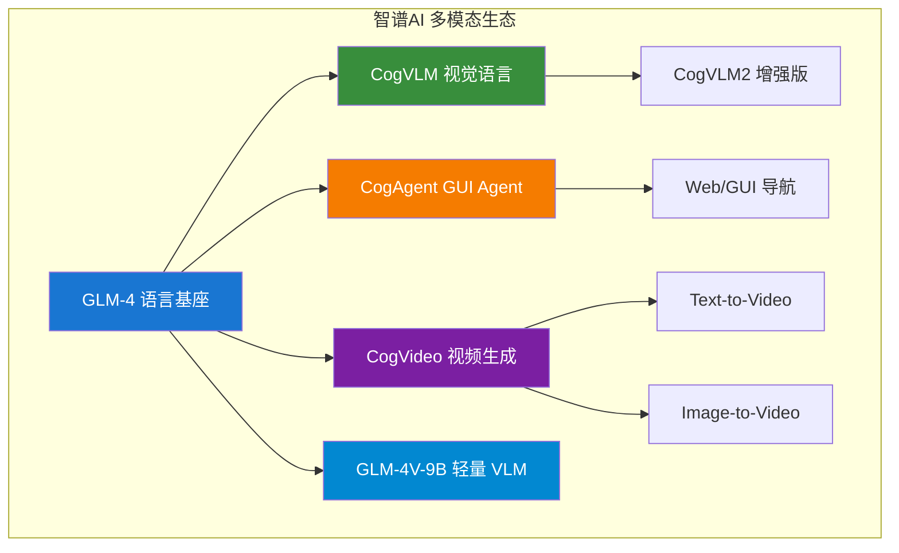
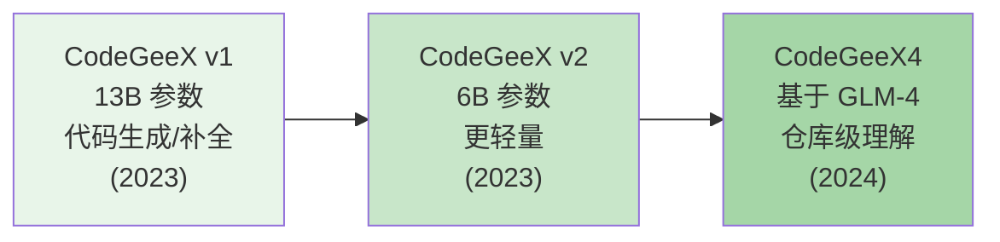
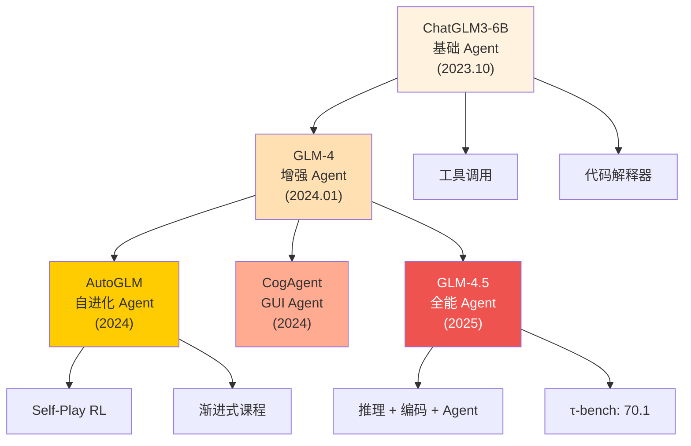

# GLM / 智谱 AI (Zhipu AI) 技术深度剖析

> 中文简称：GLM / 智谱AI 技术深度剖析

## 一句话理解

智谱 AI 就像一个从清华实验室走出来的"全能选手"——从学术理论（GLM 预训练框架）出发，一路修炼到工程落地（ChatGLM 开源），最终成长为覆盖语言、视觉、代码、Agent 的全栈 AI 平台。

---

## 一、Company Overview: 从清华 KEG 实验室到 AI 独角兽

### 1.1 创始背景

| 维度 | 详情 |
|------|------|
| **公司名称** | 智谱AI (Zhipu AI) |
| **成立时间** | 2019 年，北京 |
| **学术根基** | 清华大学 KEG (Knowledge Engineering Group) 实验室 |
| **核心人物** | 黄民烈 (Minlie Huang) 教授 |
| **定位** | 中国领先的大模型公司，学术驱动 + 工程落地 |

### 1.2 清华 KEG 实验室的学术积淀

KEG 实验室在知识图谱、自然语言处理领域有超过 20 年的积累。GLM 系列模型的诞生并非偶然：

```
学术积累时间线:
  KEG Lab (2000s) → 知识图谱研究
    → AMiner 学术搜索系统
      → 预训练语言模型研究
        → GLM 论文 (2022)
          → 智谱AI 商业化 (2019+)
```

这种"学术 → 开源 → 商业化"的路径，使得智谱AI 在中国 LLM 赛道中拥有独特的技术深度。

### 1.3 在中国 LLM 生态中的位置

```
中国大模型格局 (2024-2025):

学术驱动型:
  ├─ 智谱AI (清华 KEG) ← 本文主角
  ├─ 百川智能 (前搜狗)
  └─ 月之暗面 (清华系)

产业驱动型:
  ├─ 百度 (文心一言)
  ├─ 阿里 (通义千问)
  └─ 字节跳动 (豆包)

开源社区型:
  ├─ DeepSeek (量化私募)
  └─ 01.AI (李开复)
```

智谱AI 的独特之处在于：**每一个模型都有对应的学术论文支撑**，从 GLM-130B 的 DeepNorm 到 GLM-4.5 的 Slime 框架，学术严谨性与工程实用性并重。

---

## 二、GLM 预训练框架演进

### 2.1 原始 GLM: Autoregressive Blank Infilling

GLM (General Language Model) 的核心思想是**统一 NLU 和 NLG 的预训练框架**：

```
传统方法的分裂:
  BERT (NLU): [MASK] token → 填空 (双向注意力)
  GPT (NLG):  左到右自回归 (单向注意力)
  T5 (Seq2Seq): 输入 → 输出 (编码器-解码器)

GLM 的统一方案:
  Autoregressive Blank Infilling
  = 随机遮盖文本片段 (blank)
  + 自回归地生成被遮盖内容
  
  示例:
  原文: "清华大学位于北京市海淀区"
  遮盖: "清华大学位于[BLANK1]市[BLANK2]区"
  生成: [BLANK1] → "北京", [BLANK2] → "海淀"
```

### 2.2 框架演进三阶段



### 2.3 从 GLM 到 Decoder-Only 的转型

GLM-4 标志着架构的重大转变——从原始 GLM 预训练框架转向主流 Decoder-Only Transformer：

| 特性 | GLM-130B (v1) | GLM-4 |
|------|---------------|-------|
| 架构类型 | GLM (blank infilling) | Decoder-Only Transformer |
| 归一化 | DeepNorm | RMSNorm |
| 激活函数 | GeLU (GLU) | SwiGLU |
| 位置编码 | Standard RoPE | 2D RoPE |
| 注意力 | Multi-Head Attention | Group Query Attention (GQA) |
| FFN 扩展比 | 标准 | 10/3 × hidden dim |
| 词汇表 | ~50K | 150K tokens |

这一转型说明：**好的预训练目标可以迁移到更高效的架构上**。GLM 的训练理念被保留，但底层架构拥抱了业界最佳实践。

---

## 三、完整模型家族时间线

### 3.1 时间线可视化



### 3.2 模型参数与能力演进

| 模型 | 发布 | 参数量 | 上下文 | 核心创新 |
|------|------|--------|--------|----------|
| GLM-130B | 2022.08 | 130B | 2K | DeepNorm, 双语千亿 |
| ChatGLM-6B | 2023.03 | 6.2B | 2K | 首个开源中文对话模型 |
| ChatGLM2-6B | 2023.06 | 6B | 32K | 长上下文, 快推理 |
| ChatGLM3-6B | 2023.10 | 6B | 32K | Agent, 工具调用 |
| GLM-4 | 2024.01 | 未公开 | 128K | 架构全面升级 |
| GLM-4V-9B | 2024 | 9B | 128K | 视觉语言融合 |
| CogVLM | 2023 | 17.6B | - | 视觉专家模块 |
| CogAgent | 2024 | - | - | GUI 导航交互 |
| CodeGeeX4 | 2024 | - | - | 仓库级代码理解 |
| AutoGLM | 2024 | - | - | 自进化 Agent |
| GLM-4.5 | 2025 | 355B (32B active) | 128K | MoE + 推理 + Agent |
| GLM-4.5-Air | 2025 | 106B (12B active) | 128K | 轻量 MoE |
| GLM-5 | 2025 | 744B (40B active) | 128K | MLA + 256 专家 MoE + DSA + slime 异步 RL |
| GLM-5.1 | 2026 | 744B (40B active) | 128K | Agentic Engineering，长程工具调用 |
| GLM-5.2 | 2026 | 744B (40B active) | **1M** | IndexShare 稀疏注意力 + MTP + MIT 纯开源 |

---

## 四、架构演进深度解析：GLM-130B → GLM-5.2

### 4.1 GLM-130B: DeepNorm 与千亿训练

GLM-130B 是中国首个千亿参数开源大模型，其核心贡献是 **DeepNorm**——解决了超大模型训练不稳定的问题。

#### DeepNorm 原理

```
问题: 训练 100B+ 模型时，梯度范数会出现不可预测的 spike，
      导致 loss 突然爆炸或 NaN。

DeepNorm 解决方案:
  = Post-LayerNorm + 特殊初始化策略

标准 LayerNorm:
  x_{l+1} = x_l + F_l(x_l · W_l)    # Pre-LN 或 Post-LN

DeepNorm:
  x_{l+1} = LayerNorm(α · x_l + F_l(x_l · W_l))
  
  其中:
  α = (2N)^{1/4}    # N = 层数
  初始化: W ~ N(0, β²), β = (8N)^{-1/4}
  
效果:
  - 消除了训练中的 loss spike
  - 允许更大的学习率
  - 130B 模型训练全程稳定
```

#### GLM-130B 的其他技术选择

| 组件 | 选择 | 理由 |
|------|------|------|
| 归一化 | Post-LayerNorm + DeepNorm | 训练稳定性 |
| 位置编码 | RoPE (Rotary) | 长度外推能力 |
| 激活 | GLU with GeLU | 比 ReLU 更平滑 |
| 精度 | 混合精度 (FP16 + INT8) | 降低显存需求 |
| 并行 | 3D 并行 (数据/张量/流水线) | 千亿训练必需 |

### 4.2 ChatGLM 系列: 从预训练到对话

ChatGLM 系列展示了如何将预训练模型转化为可用的对话系统：

```
ChatGLM-6B 的对齐流程:
  GLM 预训练 → SFT (监督微调) → 对话能力

ChatGLM3-6B 的能力扩展:
  GLM 预训练 → SFT → Agent 训练
    ├─ 工具调用 (Function Calling)
    ├─ 代码解释器 (Code Interpreter)
    └─ Web 浏览 (Web Browsing)
```

**ChatGLM-6B 的突破性意义**:
- 仅需 6GB VRAM（INT4 量化）即可运行
- 首个开源的中文对话模型
- 推动了整个中国开源 LLM 社区的发展

### 4.3 GLM-4: 架构现代化

GLM-4 是智谱 AI 架构转型的里程碑，全面拥抱了当时业界最先进的组件：

```
GLM-4 架构栈:

输入层:
  150K 词汇表 (支持 24 种语言)
    ↓
Transformer 层 (Decoder-Only):
  ├─ RMSNorm (替代 LayerNorm)
  ├─ Group Query Attention (GQA)
  │   ├─ 2D 位置编码
  │   └─ 减少 KV Cache 开销
  ├─ SwiGLU 激活 (替代 GeLU)
  └─ FFN (扩展比 10/3)
    ↓
输出层:
  128K 上下文窗口
```

#### GLM-4 关键技术解析

**GQA (Group Query Attention)**:

```python
# Multi-Head Attention (MHA)
# Q, K, V 数量相同
num_heads = 64
Q = [q_1, q_2, ..., q_64]
K = [k_1, k_2, ..., k_64]
V = [v_1, v_2, ..., v_64]

# Group Query Attention (GQA)
# K, V 数量少于 Q，共享 KV
num_query_heads = 64
num_kv_heads = 8  # 每 8 个 Q head 共享 1 组 KV

# 效果: KV Cache 减少 8 倍，推理速度显著提升
```

**SwiGLU 激活函数**:

```
SwiGLU(x) = Swish(xW₁) ⊙ (xW₂)
         = (xW₁ · σ(xW₁)) ⊙ (xW₂)

vs GeLU(x) = x · Φ(x)

优势: 门控机制允许更精细的信息流控制
```

**训练规模**: ~10T tokens，覆盖 24 种语言，词汇表 150K tokens。

### 4.4 GLM-4.5: MoE + 推理 + Agent 三位一体

GLM-4.5 是智谱 AI 目前的旗舰模型，代表了其技术积累的最高水平。

> 关于 MoE 架构的通用原理，参见 [LLM 架构详解](../04_LLM架构/05_LLM架构.md)；关于 MoE 路由策略与 DeepSeek 对比，参见 [MoE 案例研究](../04_LLM架构/12_MoE_Case_Studies_DeepSeek_Mixtral.md)。

#### GLM-4.5 架构全景

```
GLM-4.5 架构分解:

总参数量: 355B
激活参数: 32B (MoE 稀疏激活)
上下文:   128K native

架构组件:
  ├─ MoE (Mixture of Experts)
  │   ├─ 稀疏激活: 32B / 355B ≈ 9% 激活率
  │   └─ 类似 DeepSeek-MoE 的细粒度专家设计
  │
  ├─ GQA with Expanded Heads
  │   └─ 扩展注意力头数，增强表达能力
  │
  ├─ QK-Norm
  │   └─ 对 Q, K 向量做归一化，稳定注意力计算
  │
  ├─ Muon Optimizer
  │   └─ 新型优化器，替代 AdamW
  │
  └─ Multi-Token Prediction (MTP)
      └─ 预测多个未来 token，加速解码
```

#### 训练数据与流程

```
训练数据分布:
  ├─ 通用文本: 15T tokens
  │   ├─ 网页文本
  │   ├─ 书籍/论文
  │   └─ 多语言语料 (24+ 语言)
  │
  └─ 代码/逻辑: 7T tokens
      ├─ 代码仓库
      ├─ 数学证明
      └─ 逻辑推理数据

总计: 22T tokens
```

#### Post-Training 流水线

GLM-4.5 的后训练 (post-training) 采用了三阶段精细打磨：

```
Post-Training Pipeline:

Stage 1: SFT (Supervised Fine-Tuning)
  ├─ 高质量指令数据
  ├─ 多轮对话数据
  └─ 代码/数学专项数据
      ↓
Stage 2: Targeted RL (针对性强化学习)
  ├─ 推理能力 RL
  ├─ 编码能力 RL
  └─ Agent 能力 RL
      ↓
Stage 3: Expert Capability Distillation (Slime 框架)
  ├─ 训练领域专家模型
  ├─ 将专家知识蒸馏回通用模型
  └─ "专项精通 → 通用吸收" 循环
```

#### Slime 框架: 专家能力蒸馏

Slime 是 GLM-4.5 的核心创新之一，解决了"全能 vs 专精"的矛盾：

```
传统问题:
  通用模型: 什么都会，但都不精
  专家模型: 某个领域很强，但泛化差

Slime 解决方案:
  1. 从通用模型出发，训练多个领域专家
     - 数学专家 (MATH, AIME)
     - 编码专家 (SWE-bench)
     - Agent 专家 (τ-bench, BFCL)
     - 推理专家 (MMLU Pro)
  
  2. 将专家能力蒸馏回通用模型
     - 不是简单平均
     - 而是选择性吸收，保持能力平衡
  
  3. 结果: 通用模型同时具备专家级能力
```

#### Multi-Token Prediction (MTP)

```
标准自回归解码:
  token_1 → token_2 → token_3 → token_4 → ...
  (每次只预测 1 个 token)

MTP 解码:
  token_1 → [token_2, token_3] → [token_4, token_5] → ...
  (每次预测多个 token)

优势:
  - 减少解码步数
  - 提高吞吐量
  - 在投机解码 (speculative decoding) 中用作草稿模型

GLM-4.5 实现:
  辅助 MTP 头: 轻量级预测模块
  训练时: 同时优化主头和 MTP 头
  推理时: MTP 头生成候选 → 主头验证
```

#### GLM-4.5-Air: 效率版本

| 特性 | GLM-4.5 (旗舰) | GLM-4.5-Air |
|------|----------------|-------------|
| 总参数 | 355B | 106B |
| 激活参数 | 32B | 12B |
| 激活率 | ~9% | ~11% |
| 推理成本 | 高 | 低 (~1/3) |
| 排名 (综合) | 第 3 | 第 6 |

Air 版本通过减小 MoE 规模实现了显著的成本降低，同时保持了竞争力。

### 4.5 GLM-5 系列：744B-A40B 旗舰一代（GLM-5 / 5.1 / 5.2）

> **架构代际跃迁**：从 GLM-4.5 的 355B/32B「自研 GQA-MoE」直接跃升到 **744B/40B 的 MLA + 256 专家 MoE + DeepSeek Sparse Attention** 体系，是智谱迄今为止最大幅度的架构换代。GLM-5、GLM-5.1、GLM-5.2 共享同一个 744B-A40B 预训练基座，分别面向「复杂系统工程」「Agentic Engineering」「长程任务 + 1M 上下文」三个递进方向做后训练优化。
>
> 技术报告：[GLM-5: from Vibe Coding to Agentic Engineering (arXiv 2602.15763, 2026)](https://arxiv.org/abs/2602.15763) · 开源仓库：[zai-org/GLM-5](https://github.com/zai-org/GLM-5) · 官方博客：[z.ai/blog/glm-5.2](https://z.ai/blog/glm-5.2)

#### 4.5.1 GLM-5.2 架构全景（来自 config.json 实测）

```
GLM-5.2 = glm_moe_dsa  (GlmMoeDsaForCausalLM)
═══════════════════════════════════════════════════════════════════
总参数 / 激活参数 :  744B / 40B  (A40B，激活率 ~5.4%)
层数              :  78 层 = 3 dense + 75 MoE  (first_k_dense_replace=3)
hidden_size       :  6144
词表 vocab_size   :  154,880  (~155K)
最大上下文        :  1,048,576  (1M tokens) ← GLM-5.2 关键升级
RoPE theta        :  8,000,000
tie_word_embeddings: False

注意力 (MLA — Multi-head Latent Attention，类 DeepSeek-V3):
  num_attention_heads        = 64
  q_lora_rank                = 2048      ← Query 低秩压缩
  kv_lora_rank               = 512       ← KV Cache 低秩压缩（KV Cache 大幅缩小）
  qk_nope_head_dim           = 192
  qk_rope_head_dim           = 64
  head_dim                   = 192
  → KV Cache 仅存 512 维潜变量，长上下文显存占用显著低于 GQA

稀疏注意力 (DeepSeek Sparse Attention + IndexShare):
  index_n_heads              = 32
  index_head_dim             = 128
  index_topk                 = 2048      ← 每 token 只聚焦 2048 个 key
  index_share_for_mtp_iteration = True   ← IndexShare 跨层复用

MoE 路由:
  n_routed_experts           = 256       ← 256 个路由专家
  n_shared_experts           = 1         ← 1 个共享专家
  num_experts_per_tok        = 8         ← 每 token 激活 top-8
  moe_intermediate_size      = 2048
  scoring_func               = sigmoid
  topk_method                = noaux_tc
  dense intermediate_size    = 12288

MTP (Multi-Token Prediction):
  num_nextn_predict_layers   = 1         ← NextN 投机解码，acceptance +20%

dtype            :  bfloat16  (另有 GLM-5.2-FP8 量化版)
license          :  MIT       (Pure Open，无地域限制)
```

**架构哲学**：GLM-5 这一代彻底倒向「**DeepSeek-V3 路线**」——用 MLA 压 KV Cache、用 256 细粒度专家 + top-8 提高专家多样性、用 DeepSeek Sparse Attention 把长上下文的算力成本打下来。这与 GLM-4.5 的「自研 GQA + 较粗 MoE」形成鲜明代际差异，本质是用「更稀疏的注意力 + 更稀疏的 FFN」换取在 1M 上下文下的可承担推理成本。

#### 4.5.2 GLM-5（基座版）：复杂系统工程 + 长程 Agent

GLM-5 是这一代的奠基版本，定位「复杂系统工程与长程 Agent 任务」，相比 GLM-4.5 做了三件大事：

| 维度 | GLM-4.5 | GLM-5 | 倍数 |
|------|---------|-------|------|
| 总参数 | 355B | **744B** | 2.1× |
| 激活参数 | 32B | **40B** | 1.25× |
| 预训练数据 | 23T tokens | **28.5T tokens** | 1.24× |
| 注意力 | GQA | **MLA + DSA** | — |
| 专家数 | 较粗 | **256 路由专家** | — |

- **集成 DeepSeek Sparse Attention (DSA)**：在保留长上下文能力的同时大幅降低部署成本，这是 744B 模型能被推理的前提。
- **slime 异步 RL 基础设施**：智谱自研的[异步强化学习框架](https://github.com/THUDM/slime)，显著提升 RL 训练吞吐与效率，使更细粒度的后训练迭代成为可能——这是 GLM-5 在「能力」与「卓越」之间架桥的关键。
- **Vending Bench 2 长程运营**：在该「模拟经营自动售货机一年」的长程基准上，GLM-5 以 **$4,432** 终值位列**开源第一**，逼近 Claude Opus 4.5，展现长期规划与资源管理能力。

#### 4.5.3 GLM-5.1：Agentic Engineering（长程不衰减）

GLM-5.1 不再追求「首刷分数」，而是解决 Agent 的「**长程不衰减**」难题：

```
传统模型 (含 GLM-5) 的痛点:
  ─ 用熟悉的技巧拿到前期快速收益 → 早早就把"招数"用尽 → 进入平台期
  ─ 给更多时间/更多轮次也涨不上去

GLM-5.1 的解法:
  ─ 在模糊问题上判断力更强
  ─ 在更长会话中持续保持生产力
  ─ 拆解复杂问题 → 跑实验 → 读结果 → 精准定位阻塞点
  ─ 反复回顾推理、修订策略: 数百轮、数千次工具调用仍能持续优化
  → "跑得越久，结果越好"
```

在 SWE-Bench Pro、NL2Repo（仓库生成）、Terminal-Bench 2.0（真实终端任务）上达到 SOTA，且把 GLM-5 大幅甩开。它把「Agentic Engineering」从 demo 演示推到了「可以真跑几百轮」的工程可用区间。

#### 4.5.4 GLM-5.2：稳定 1M 上下文 + 最强开源编码

GLM-5.2 是当前旗舰，四项核心升级：

| 能力 | 说明 | 量化收益 |
|------|------|----------|
| **Solid 1M Context** | 首次在「扎实的 100 万 token 上下文」上稳定支撑长程工作 | 长程任务可承载量级跃升 |
| **Advanced Coding (Flexible Effort)** | 多档思考力度，平衡性能与延迟 | Terminal-Bench 2.1: **81.0**（GLM-5.1 仅 62.0），逼近 Claude Opus 4.8 (85.0) |
| **Improved Architecture (IndexShare + MTP)** | IndexShare 跨层复用 indexer；MTP 投机解码 | 1M 上下文下 per-token FLOPs **降低 2.9×**；MTP 接受长度 **+20%** |
| **Pure Open (MIT)** | MIT 许可，无地域限制，纯开源 | 全球可商用，无国界技术访问 |

GLM-5.2 是**当前最强开源编码模型**：Terminal-Bench 2.1 (Terminus-2) 拿到 **81.0**，最佳测试框架下 **82.7**；FrontierSWE (Dominance) **74.4**（GLM-5.1 仅 30.5）；领先 Gemini 3.1 Pro。

#### 4.5.5 IndexShare：GLM-5.2 的关键架构创新

[IndexShare (arXiv 2603.12201)](https://arxiv.org/abs/2603.12201) 是 GLM-5.2 把 1M 上下文做「可承担」的核心：

```
传统稀疏注意力:                 IndexShare:
每层各自维护一个 indexer         同一个 indexer 跨"每 4 层稀疏注意力"复用
  L1 ──[indexer A]──┐             L1 ─┐
  L2 ──[indexer B]──┤             L2  │  共用 indexer
  L3 ──[indexer C]──┤             L3  │  (index_share_for_mtp_iteration=True)
  L4 ──[indexer D]──┘             L4 ─┘
  → indexer 计算 4 份             → indexer 计算量 ÷ 4

效果 (1M 上下文):
  per-token FLOPs 降低 2.9×
  → 让 744B 模型在 1M 上下文下的推理成本从"不可行"变"可生产"
```

它把稀疏注意力的「索引器」从逐层独立改为**跨层共享**，是这一代把上下文从 128K 拉到 1M 而成本可控的工程关键。

#### 4.5.6 思考力度控制：reasoning_effort / enable_thinking

GLM-5 系列统一通过 `reasoning_effort` 控制思考预算，是「Flexible Effort」的 API 落地：

| 参数 | 取值 | 行为 | 适用场景 |
|------|------|------|----------|
| `reasoning_effort` | `"max"`（默认） | 最大力度思考 | 基准复现、难题、长程 Agent |
| `reasoning_effort` | `"high"` | 较高力度，延迟更低 | 生产中追求延迟/质量平衡 |
| `enable_thinking` | `false` | 完全关闭思考 | 明确想要直答、低延迟 |

> 注意：`reasoning_effort` 留空或设为 `max` 以外任意值都按 `max` 跑；想用 `high` 必须**显式**传 `reasoning_effort="high"`。

#### 4.5.7 开源矩阵与下载

| 模型 | 参数 | 精度 | ModelScope | HuggingFace |
|------|------|------|-----------|-------------|
| **GLM-5.2** | 744B-A40B | BF16 | [ZhipuAI/GLM-5.2](https://modelscope.cn/models/ZhipuAI/GLM-5.2) | [zai-org/GLM-5.2](https://huggingface.co/zai-org/GLM-5.2) |
| **GLM-5.2-FP8** | 744B-A40B | FP8 | [ZhipuAI/GLM-5.2-FP8](https://modelscope.cn/models/ZhipuAI/GLM-5.2-FP8) | [zai-org/GLM-5.2-FP8](https://huggingface.co/zai-org/GLM-5.2-FP8) |
| GLM-5.1 / 5.1-FP8 | 744B-A40B | BF16/FP8 | [ZhipuAI/GLM-5.1](https://modelscope.cn/models/ZhipuAI/GLM-5.1) | [zai-org/GLM-5.1](https://huggingface.co/zai-org/GLM-5.1) |
| GLM-5 / 5-FP8 | 744B-A40B | BF16/FP8 | [ZhipuAI/GLM-5](https://modelscope.cn/models/ZhipuAI/GLM-5) | [zai-org/GLM-5](https://huggingface.co/zai-org/GLM-5) |

> **许可**：GLM-5.2 采用 **MIT**（"Pure Open"，无地域限制）。注意 GLM 系列自 GLM-4.5 起逐步走向更开放许可，GLM-5.2 的 MIT 是目前国产旗舰模型中最宽松的一档，可直接商用。

---

## 五、多模态模型生态: CogVLM, CogAgent, CogVideo

### 5.1 多模态模型家族概览



> 更多多模态架构对比，参见 [多模态架构 2026](../09_多模态模型/06_多模态_架构_2026.md)。

### 5.2 CogVLM: 视觉语言模型

#### 架构设计

```
CogVLM 架构 (17.6B 参数):

输入:
  文本: "这张图片里有什么？"
  图像: [224×224 RGB]
    ↓
视觉编码器: ViT + EVA2-CLIP-E
    ↓
交叉注意力 (Cross-Attention):
  视觉特征 × 文本特征
    ↓
视觉专家模块 (Visual Expert):
  专门处理视觉信息的 FFN
    ↓
语言模型: GLM 基座
    ↓
输出: "一只橘猫坐在沙发上"
```

#### 视觉专家模块 (Visual Expert)

CogVLM 的创新在于引入了 **Visual Expert**——一组专门处理视觉信息的 FFN 参数：

```python
# 标准 VLM: 视觉和语言共享 FFN
output = FFN(attention_output)  # 视觉+语言混在一起

# CogVLM: 分离视觉专家
language_output = FFN_language(attention_output)
visual_output = FFN_visual(attention_output)  # 专用视觉 FFN
output = language_output + visual_output

# 优势: 避免视觉信息和语言信息在 FFN 中相互干扰
```

| 特性 | CogVLM | CogVLM2 |
|------|--------|---------|
| 参数 | 17.6B | 未公开 |
| 视觉编码 | EVA2-CLIP-E | 增强版 |
| 强项 | 通用视觉理解 | 文档/图表理解 |
| OCR 能力 | 基础 | 增强 |

### 5.3 CogAgent: GUI Agent 模型

CogAgent 是智谱AI 在 GUI 理解领域的突破，能够直接"看到"并操作图形界面。

#### 双分辨率编码器

```
CogAgent 输入处理:

高分辨率路径 (1120×1120):
  原始屏幕截图 → ViT 编码
  捕捉细节: 文字、按钮、图标
  
低分辨率路径 (224×224):
  下采样图像 → ViT 编码
  捕捉全局布局: 页面结构、区域划分

融合:
  [高分辨率特征; 低分辨率特征] → 交叉注意力 → 统一表示
```

#### 应用场景

```
CogAgent 能力:
  ├─ Web 导航: "帮我在淘宝上搜索蓝牙耳机"
  │   → 识别搜索框 → 输入关键词 → 点击搜索
  │
  ├─ GUI 自动化: "打开设置，连接 Wi-Fi"
  │   → 识别设置图标 → 导航到 Wi-Fi → 选择网络
  │
  ├─ 表单填写: 自动识别并填写网页表单
  │
  └─ 软件测试: 自动执行 UI 测试用例
```

### 5.4 CogVideo: 视频生成

CogVideo 是智谱AI 的视频生成模型，支持：

| 功能 | 描述 |
|------|------|
| Text-to-Video | 文字描述生成视频片段 |
| Image-to-Video | 从静态图像生成动态视频 |
| 视频编辑 | 基于文本指令编辑现有视频 |

### 5.5 GLM-4V-9B: 轻量级 VLM

GLM-4V-9B 是 GLM-4 的多模态扩展，以 9B 参数实现了强大的视觉理解能力：

```
GLM-4V-9B 定位:
  CogVLM (17.6B) → 研究型，高精度
  GLM-4V-9B (9B) → 实用型，平衡性能与成本
  
特点:
  - 基于 GLM-4 架构
  - 继承 GLM-4 的语言能力
  - 增加视觉理解模块
  - 支持图表分析、文档理解、场景描述
```

---

## 六、CodeGeeX 代码生态

### 6.1 CodeGeeX 发展历程



### 6.2 CodeGeeX 核心能力

| 能力 | 描述 | 支持范围 |
|------|------|----------|
| **代码生成** | 自然语言 → 代码 | 100+ 编程语言 |
| **代码补全** | 上下文感知补全 | IDE 实时 |
| **代码翻译** | 语言间转换 | Python↔Java↔C++↔... |
| **代码解释** | 代码 → 自然语言 | 复杂逻辑解读 |
| **仓库级理解** | 理解整个项目结构 | CodeGeeX4 |

### 6.3 IDE 插件生态

```
CodeGeeX IDE 支持:
  ├─ VS Code: 官方插件 (最活跃)
  ├─ IntelliJ IDEA: JetBrains 插件
  ├─ PyCharm: Python 专项
  └─ 其他 JetBrains IDE
  
功能集成:
  ├─ 行内补全 (Inline Completion)
  ├─ 侧边栏对话 (Chat Panel)
  ├─ 代码审查 (Code Review)
  └─ 单元测试生成 (Test Generation)
```

### 6.4 CodeGeeX4: 仓库级代码理解

CodeGeeX4 基于 GLM-4 架构，核心升级在于**仓库级 (Repository-Level) 代码理解**：

```
传统代码模型:
  输入: 单个文件片段 (几百行)
  理解: 局部上下文

CodeGeeX4:
  输入: 整个代码仓库 (数十万行)
  理解: 
    ├─ 文件间依赖关系
    ├─ 函数调用链
    ├─ 类型定义与使用
    └─ 项目架构模式

技术实现:
  ├─ 128K 上下文窗口 → 容纳更多代码
  ├─ 代码索引 → 快速定位相关片段
  └─ AST 感知 → 理解代码结构
```

---

## 七、AutoGLM 与 Agent 能力

### 7.1 Agent 能力演进



### 7.2 AutoGLM: 自进化 AI Agent

AutoGLM 是智谱AI 在 Agent 领域的重大创新，核心思想是让 Agent 通过**自我博弈 (Self-Play)** 不断进化。

#### 架构与训练

```
AutoGLM 架构:
  基座: GLM-4
    ↓
  自主工具使用 (Autonomous Tool Use):
    ├─ Web 浏览
    ├─ 代码执行
    ├─ API 调用
    └─ 文件操作
    ↓
  自博弈强化学习 (Self-Play RL):
    ├─ Agent 自己生成任务
    ├─ 自己尝试完成任务
    ├─ 自己评估完成质量
    └─ 用成功经验更新策略
    ↓
  渐进式课程 (Progressive Curriculum):
    ├─ 简单任务 → 复杂任务
    ├─ 单步操作 → 多步规划
    └─ 单一工具 → 工具组合
```

#### Self-Play 机制详解

```
Self-Play 循环:

  Round 1:
    生成任务: "搜索最新的 Python 3.13 特性"
    执行: 打开浏览器 → 搜索 → 提取信息
    评估: 成功 ✓ → 记录经验
    
  Round 2:
    生成任务: "对比 Python 3.12 和 3.13 的性能差异"
    执行: 搜索 → 提取 → 对比 → 总结
    评估: 部分成功 → 改进搜索策略
    
  Round N:
    生成任务: "搭建一个 Python 3.13 项目并完成 CI/CD"
    执行: 多步复杂操作
    评估: 成功 ✓ → 能力边界扩展

效果: Agent 能力边界持续扩展，无需人工标注数据
```

### 7.3 GLM-4.5 的 Agent 能力

GLM-4.5 将 Agent 能力提升到了新高度：

| Agent 能力 | 基准测试 | GLM-4.5 得分 | 对标 |
|-----------|---------|-------------|------|
| 工具调用 | BFCL-v3 | 77.8 | 匹配 Claude 4 Sonnet |
| Web 导航 | τ-bench | 70.1 | 超越 Claude 4 Opus |
| 代码 Agent | SWE-bench Verified | 64.2 | 接近顶尖水平 |
| 浏览理解 | BrowseComp | 26.4% | 前沿水平 |

#### 三种运行模式

```
GLM-4.5 运行模式:

1. 推理模式 (Thinking Mode):
   - 激活 Chain-of-Thought
   - 适用于: 数学、逻辑、复杂分析
   - MATH 500: 98.2

2. 编码模式 (Coding Mode):
   - 仓库级代码理解
   - 多文件编辑
   - SWE-bench: 64.2

3. Agent 模式 (Agentic Mode):
   - Function Calling
   - 多步任务规划
   - τ-bench: 70.1
```

---

## 八、GLM-4.5 深度剖析

### 8.1 MoE 架构细节

GLM-4.5 采用了 Mixture of Experts 架构，与 DeepSeek-MoE 和 Mixtral 的设计哲学有相似之处，但也有自己的特色。

```
GLM-4.5 MoE 架构:

每层 Transformer:
  ├─ Attention (共享): GQA with Expanded Heads
  │   ├─ QK-Norm: 稳定注意力
  │   └─ 扩展头数: 增强表达多样性
  │
  └─ FFN (MoE): 多专家前馈
      ├─ Router: 将 token 分配给专家
      ├─ Expert 1..N: 独立的 FFN
      └─ 激活: 仅 32B / 355B 参数

对比:
  DeepSeek-MoE: 细粒度专家 + 共享专家
  Mixtral: Top-2 路由, 8 专家
  GLM-4.5: 大规模稀疏 (9% 激活率)
```

#### MoE 效率分析

```
计算效率对比:

Dense 模型 (假设 355B 全部激活):
  FLOPs/token ≈ 2 × 355B × seq_len
  显存需求: ~700GB (FP16)

GLM-4.5 MoE (32B 激活):
  FLOPs/token ≈ 2 × 32B × seq_len  (仅计算激活部分)
  显存需求: ~700GB (全参数需加载) 但计算量接近 32B Dense

优势: 用 32B 的计算成本获得 355B 的知识容量
权衡: 显存仍需加载全部参数 (可通过 expert offloading 优化)
```

### 8.2 Muon 优化器

GLM-4.5 采用了 **Muon** 优化器，这是相对于传统 AdamW 的一个重要变化：

```
Muon 优化器特点:
  - 基于矩阵正交化的优化方法
  - 在高维空间中保持更新方向的正交性
  - 特别适合 Transformer 的权重矩阵更新
  
vs AdamW:
  AdamW: 自适应学习率 + 权重衰减
  Muon: 正交化更新 + 更好的条件数控制
  
理论优势:
  - 更快的收敛 (特别是大模型)
  - 更好的泛化
  - 减少 "grokking" 延迟
```

### 8.3 QK-Norm 详解

```
标准注意力计算:
  Attention(Q,K,V) = softmax(QK^T / √d) V
  
问题: 当模型很深时，QK^T 的值可能过大或过小，
      导致 softmax 饱和 (所有概率集中在一个位置)

QK-Norm 解决方案:
  Q_norm = Q / ||Q||   (对 Q 向量做 L2 归一化)
  K_norm = K / ||K||   (对 K 向量做 L2 归一化)
  
  Attention = softmax(Q_norm · K_norm^T / √d) V
  
效果:
  - 防止注意力分数过大
  - 训练更稳定
  - 特别对深模型 (100+ 层) 有效
```

### 8.4 训练数据深度分析

```
22T tokens 数据构成:

通用文本 (15T):
  ├─ 网页数据 (~8T): CommonCrawl 清洗 + 去重
  ├─ 书籍/论文 (~3T): 学术文献 + 版权书籍
  ├─ 百科/知识 (~2T): Wikipedia + 领域知识库
  └─ 多语言 (~2T): 24 种语言的平衡语料

代码/逻辑 (7T):
  ├─ GitHub 代码 (~4T): 多语言代码仓库
  ├─ 数学数据 (~1.5T): 数学证明 + 题目 + 解答
  └─ 逻辑推理 (~1.5T): 推理链数据 + CoT 数据

数据质量控制:
  ├─ 去重: MinHash + 精确去重
  ├─ 质量过滤: 分类器打分 + 阈值过滤
  ├─ 毒性过滤: 多语言安全分类器
  └─ 领域平衡: 动态采样权重
```

---

## 九、Benchmark 对比分析

### 9.1 GLM-5.2 vs 全球前沿模型（2026 最新，官方数据）

> 数据来源：[zai-org/GLM-5.2 HuggingFace 模型卡](https://huggingface.co/zai-org/GLM-5.2)。带 * 为官方标注的他方参考值。GLM-5.2 是当前最强开源编码模型，多项指标逼近 Claude Opus 4.8 / GPT-5.5。

**推理 (Reasoning)**

| Benchmark | GLM-5.2 | GLM-5.1 | Qwen3.7-Max | DeepSeek-V4-Pro | Claude Opus 4.8 | GPT-5.5 | Gemini 3.1 Pro |
|-----------|:---:|:---:|:---:|:---:|:---:|:---:|:---:|
| HLE | **40.5** | 31 | 41.4 | 37.7 | 49.8* | 41.4* | 45 |
| HLE (w/ Tools) | **54.7** | 52.3 | 53.5 | 48.2 | 57.9* | 52.2* | 51.4* |
| CritPt | 16.7 | 4.6 | 13.4 | 12.9 | 20.9 | 27.1 | 17.7 |
| AIME 2026 | **99.2** | 95.3 | 97 | 94.6 | 95.7 | 98.3 | 98.2 |
| HMMT Nov. 2025 | 94.4 | 94 | **95** | 94.4 | 96.5 | 96.5 | 94.8 |
| HMMT Feb. 2026 | 92.5 | 82.6 | **97.1** | 95.2 | 96.7 | 96.7 | 87.3 |
| IMOAnswerBench | **91.0** | 83.8 | 90 | 89.8 | 83.5 | — | 81 |
| GPQA-Diamond | 91.2 | 86.2 | 90 | 90.1 | 93.6 | 93.6 | **94.3** |

**编码 (Coding) — GLM-5.2 的主战场**

| Benchmark | GLM-5.2 | GLM-5.1 | Qwen3.7-Max | DeepSeek-V4-Pro | Claude Opus 4.8 | GPT-5.5 | Gemini 3.1 Pro |
|-----------|:---:|:---:|:---:|:---:|:---:|:---:|:---:|
| SWE-bench Pro | 62.1 | 58.4 | 60.6 | 55.4 | **69.2** | 58.6 | 54.2 |
| NL2Repo | 48.9 | 42.7 | 47.2 | 35.5 | **69.7** | 50.7 | 33.4 |
| DeepSWE | 46.2 | 18 | 18 | 8 | 58 | **70** | 10 |
| ProgramBench | 63.7 | 50.9 | — | 47.8 | **71.9** | 70.8 | 39.5 |
| **Terminal-Bench 2.1 (Terminus-2)** | **81.0** | 63.5 | 75 | 64 | 85 | **84** | 74 |
| Terminal-Bench 2.1 (Best Harness) | **82.7** | 69 | — | — | 78.9 | **83.4** | 70.7 |
| FrontierSWE (Dominance) | 74.4 | 30.5 | — | 29.0 | **75.1** | 72.6 | 39.6 |
| PostTrainBench | 34.3 | 20.1 | — | — | **37.2** | 28.4 | 21.6 |
| SWE-Marathon | 13.0 | 1.0 | — | — | **26.0** | 12.0 | 4.0 |

**智能体 (Agentic)**

| Benchmark | GLM-5.2 | GLM-5.1 | Qwen3.7-Max | MiniMax M3 | DeepSeek-V4-Pro | Claude Opus 4.8 | GPT-5.5 | Gemini 3.1 Pro |
|-----------|:---:|:---:|:---:|:---:|:---:|:---:|:---:|:---:|
| MCP-Atlas (Public) | **76.8** | 71.8 | 76.4 | 74.2 | 73.6 | 77.8 | 75.3 | 69.2 |
| Tool-Decathlon | 48.2 | 40.7 | — | — | 52.8 | 59.9 | 55.6 | 48.8 |

**关键结论**：
- **编码**：GLM-5.2 是开源最强，Terminal-Bench 2.1 (81.0) 距 Claude Opus 4.8 (85.0) 仅 4 分，FrontierSWE/ProgramBench 大幅领先 Gemini 3.1 Pro；较 GLM-5.1 提升巨大（Terminal-Bench +17.5）。
- **推理**：AIME 2026 (99.2)、IMOAnswerBench (91.0) 开源领先，与 GPT-5.5/Gemini 3.1 Pro 同一梯队。
- **Agent**：MCP-Atlas 76.8 全场第一（含闭源），Tool-Decathlon 开源领先。
- **代际跃迁**：GLM-5.1 → GLM-5.2 在 FrontierSWE (+43.9)、Terminal-Bench (+17.5)、PostTrainBench (+14.2) 上提升显著，印证「长程任务」定位。

### 9.2 GLM-4.5 vs 顶尖模型（上一代基线）

| Benchmark | GLM-4.5 | GPT-4o | Claude 4 Sonnet | Gemini 2.5 Pro |
|-----------|---------|--------|-----------------|----------------|
| **MMLU Pro** | **84.6** | ~83 | ~82 | ~85 |
| **AIME24 (Avg@32)** | **91.0** | ~75 | ~78 | ~88 |
| **MATH 500** | **98.2** | ~95 | ~96 | ~97 |
| **τ-bench** | **70.1** | ~60 | ~68 | ~65 |
| **BFCL-v3** | **77.8** | ~72 | ~78 | ~74 |
| **SWE-bench Verified** | **64.2** | ~50 | ~65 | ~55 |
| **BrowseComp** | **26.4%** | ~18% | ~22% | ~20% |

### 9.3 GLM-4 系列历史 Benchmark

| 模型 | MMLU | Elementary Math | GSM8K | Reasoning |
|------|------|----------------|-------|-----------|
| GLM-4-0520 | 83.3 | 93.3 | 93.3 | 84.7 |
| GLM-4.5 | ~88+ | - | - | - |

### 9.4 GLM-4.5 全球排名

```
全球大模型排名 (2025 年中, 综合):

1. GPT-4o / o3 (OpenAI)
2. Gemini 2.5 Pro (Google)
3. GLM-4.5 (智谱AI) ← 旗舰版
4. Claude 4 Sonnet (Anthropic)
5. DeepSeek-V3 (DeepSeek)
6. GLM-4.5-Air (智谱AI) ← Air 版
7. Llama 4 Maverick (Meta)
```

### 9.5 Agent 能力对比

| 能力维度 | GLM-4.5 | Claude 4 Sonnet | Claude 4 Opus |
|---------|---------|-----------------|---------------|
| 工具调用 (BFCL-v3) | 77.8 | ~78 | ~76 |
| Web 导航 (τ-bench) | **70.1** | ~68 | ~66 |
| 代码 Agent (SWE-bench) | 64.2 | ~65 | ~62 |
| 浏览理解 (BrowseComp) | **26.4%** | ~22% | ~20% |

关键发现: GLM-4.5 在**工具调用**上匹配 Claude 4 Sonnet，在**Web 导航**上超越 Claude 4 Opus。

### 9.6 数学与推理能力

```
数学推理对比:

AIME 2024 (Avg@32):
  GLM-4.5:     91.0 ████████████████████████████████████████░░
  Gemini 2.5:  88.0 ███████████████████████████████████████░░░
  Claude 4:    78.0 ████████████████████████████████░░░░░░░░░░
  GPT-4o:      75.0 ██████████████████████████████░░░░░░░░░░░

MATH 500:
  GLM-4.5:     98.2 ████████████████████████████████████████░
  Gemini 2.5:  97.0 ████████████████████████████████████████
  Claude 4:    96.0 ███████████████████████████████████████
  GPT-4o:      95.0 ██████████████████████████████████████
```

GLM-4.5 在数学推理上展现了极强的竞争力，AIME24 的 91.0 分尤其突出。

---

## 十、技术创新总结

### 10.1 核心创新一览表

| 创新 | 首次出现 | 描述 | 影响 |
|------|---------|------|------|
| **GLM 预训练** | GLM-130B | Autoregressive blank infilling 统一 NLU/NLG | 学术奠基 |
| **DeepNorm** | GLM-130B | 稳定千亿模型训练 | 训练稳定性 |
| **Visual Expert** | CogVLM | 视觉专用 FFN 模块 | 多模态融合 |
| **双分辨率编码** | CogAgent | 高分辨率 + 低分辨率融合 | GUI 理解 |
| **Self-Play RL** | AutoGLM | Agent 自我博弈进化 | 自主进化 |
| **Slime 框架** | GLM-4.5 | 专家能力蒸馏 | 全能+专精 |
| **Multi-Token Pred** | GLM-4.5 | 多 token 预测加速解码 | 推理加速 |
| **Muon Optimizer** | GLM-4.5 | 正交化优化器 | 训练效率 |
| **QK-Norm** | GLM-4.5 | 注意力 QK 归一化 | 深模型稳定 |

### 10.2 架构设计哲学

```
智谱AI 的设计哲学:

1. 学术驱动: 每个模型都有论文支撑
   GLM → DeepNorm 论文
   CogVLM → Visual Expert 论文
   AutoGLM → Self-Play 论文
   GLM-4.5 → Slime 论文

2. 开源优先: 核心模型全部开源
   ChatGLM-6B → 推动中国开源 LLM
   GLM-4-0414 → 开源系列
   GLM-4.5 → 开源旗舰

3. 全栈覆盖: 语言 + 视觉 + 代码 + Agent
   不是只做 LLM，而是构建完整生态

4. 效率并重: 大模型 + 小模型并行
   GLM-4.5 (355B) + Air (106B)
   CogVLM (17.6B) + GLM-4V-9B (9B)
```

### 10.3 与其他中国 LLM 的对比

| 维度 | 智谱 AI (GLM) | DeepSeek | 通义千问 (阿里) | 文心一言 (百度) |
|------|-------------|----------|---------------|---------------|
| 学术背景 | 清华 KEG | 量化私募 | 达摩院 | 百度研究院 |
| 开源程度 | 高 | 高 | 中 | 低 |
| MoE 采用 | GLM-4.5 | DeepSeek-V3 | Qwen-MoE | - |
| Agent 能力 | AutoGLM | - | 通义 Agent | 文心 Agent |
| 代码模型 | CodeGeeX | DeepSeek-Coder | Qwen-Coder | Comate |
| 多模态 | CogVLM/Agent | DeepSeek-VL | Qwen-VL | 文心一格 |
| 特色 | 学术深度 | 性价比 | 生态广度 | 产业落地 |

---

## 十一、实践指南

### 11.0 GLM-5.2 部署与调用（2026 最新）

**方式一：Z.ai 官方 API**

```python
# GLM-5.2 通过 Z.ai API 平台提供，OpenAI 兼容
from openai import OpenAI

client = OpenAI(
    api_key="your-zai-api-key",
    base_url="https://api.z.ai/api/paas/v4"   # Z.ai API 平台
)

# 默认 reasoning_effort="max"；这里显式用 high 平衡延迟
resp = client.chat.completions.create(
    model="glm-5.2",
    messages=[{"role": "user", "content": "重构这段代码并解释"}],
    extra_body={"reasoning_effort": "high"}     # max | high
)
print(resp.choices[0].message.content)
```

**方式二：本地部署（vLLM，推荐生产）**

```bash
# GLM-5.2 要求 vLLM v0.23.0+；FP8 版显存约一半
pip install "vllm>=0.23.0"

# 单机 8×H100 跑 GLM-5.2-FP8 (744B-A40B)
vllm serve ZhipuAI/GLM-5.2-FP8 \
  --tensor-parallel-size 8 \
  --max-model-len 1048576 \
  --trust-remote-code \
  --enable-reasoning \
  --reasoning-parser deepseek_rho

# OpenAI 兼容调用，思考力度通过 reasoning_effort 控制
curl http://localhost:8000/v1/chat/completions -H "Content-Type: application/json" -d '{
  "model": "ZhipuAI/GLM-5.2-FP8",
  "messages": [{"role":"user","content":"写一个 MCP server"}],
  "thinking": {"type": "enabled"}, "reasoning_effort": "max"
}'
```

**方式三：SGLang（长上下文 / 前缀缓存场景更优）**

```bash
# SGLang v0.5.13.post1+，RadixAttention 对 1M 上下文 + 重复前缀更友好
pip install "sglang[all]>=0.5.13.post1"

python -m sglang.launch_server --model-path ZhipuAI/GLM-5.2-FP8 \
  --tp 8 --context-length 1048576 --trust-remote-code \
  --enable-reasoning --reasoning-parser deepseek_rho
# Cookbook: https://cookbook.sglang.io/autoregressive/GLM/GLM-5.2
```

**其它支持框架**：Transformers (v0.5.12+)、KTransformers (v0.5.12+，单机消费级)、xLLM (v0.10.0+，京东开源，**昇腾 NPU**)、vLLM-Ascend。**昇腾平台**见 [example/ascend.md](https://github.com/zai-org/GLM-5/blob/main/example/ascend.md)。部署与量化选型见 [[10_部署推理/02_推理引擎/17_LLM_推理引擎_选型_指南]]。

> **显存估算（参考）**：GLM-5.2 BF16 权重约 1.4 TB；FP8 约 720 GB。生产推荐 8×H200 (FP8) 或 8×H100 (FP8+offload)；消费级研究可用 KTransformers 单机 offload 跑 FP8。

### 11.1 快速使用 GLM-4.5

```python
# 方式一: 智谱AI 官方 API
from zhipuai import ZhipuAI

client = ZhipuAI(api_key="your-api-key")

# 推理模式 (Thinking)
response = client.chat.completions.create(
    model="glm-4.5",
    messages=[
        {"role": "user", "content": "证明根号2是无理数"}
    ],
    extra_body={"thinking": {"type": "enabled"}}
)
print(response.choices[0].message.content)

# Agent 模式 (Function Calling)
tools = [
    {
        "type": "function",
        "function": {
            "name": "search_web",
            "description": "搜索互联网获取最新信息",
            "parameters": {
                "type": "object",
                "properties": {
                    "query": {"type": "string", "description": "搜索关键词"}
                },
                "required": ["query"]
            }
        }
    }
]

response = client.chat.completions.create(
    model="glm-4.5",
    messages=[
        {"role": "user", "content": "2025年诺贝尔物理学奖得主是谁？"}
    ],
    tools=tools
)
```

### 11.2 本地部署 (开源模型)

```bash
# ChatGLM3-6B 本地部署 (消费级硬件)
pip install torch transformers sentencepiece

# INT4 量化版 (6GB VRAM)
python -c "
from transformers import AutoTokenizer, AutoModel
tokenizer = AutoTokenizer.from_pretrained('THUDM/chatglm3-6b', trust_remote_code=True)
model = AutoModel.from_pretrained('THUDM/chatglm3-6b', trust_remote_code=True).quantize(4).cuda()
model = model.eval()
response, history = model.chat(tokenizer, '你好，介绍一下你自己', history=[])
print(response)
"

# GLM-4-0414 系列 (多尺寸可选)
# 根据显存选择合适尺寸
```

### 11.3 CodeGeeX IDE 集成

```json
// VS Code settings.json
{
    "codegeex.enabled": true,
    "codegeex.model": "codegeex4",
    "codegeex.inlineCompletion": true,
    "codegeex.chatModel": "codegeex4",
    "codegeex.languages": ["python", "javascript", "typescript", "java", "go", "rust"]
}
```

---

## 十二、未来展望

### 12.1 技术趋势

```
智谱AI 可能的技术方向:

1. 更大规模 MoE:
   - GLM-5.2 已达 744B/40B → 下一代可能向 1T+ 总参数演进
   - 更激进的稀疏化 (当前 ~5.4% 激活率，继续下探)

2. 原生多模态:
   - 从 CogVLM 的"拼接式" → 统一的原生多模态架构
   - 类似 Gemini 的全模态模型

3. Autonomous Agent System:
   - 在 GLM-5.2 长程任务基础上走向"完全自治智能体"（见文末 §GLM-5.2 发布详解 第 8 节）
   - Memory / Continual Learning / Self-Judge 三大攻关方向

4. 端侧部署:
   - 更小的 Air/Nano 版本
   - 手机/PC 端运行

5. 垂直领域:
   - 医疗、法律、金融等专项模型
   - 结合知识图谱 (KEG 实验室传统优势)
```

### 12.2 竞争格局

智谱 AI 在全球 LLM 竞争中已站稳第一梯队。GLM-5.2 作为当前最强开源编码模型（Terminal-Bench 2.1 逼近 Claude Opus 4.8），加之 **MIT 纯开源 + Day 0 八家国产算力适配**，在信创与企业自部署场景优势显著。未来的关键挑战在于：

1. **算力限制**: 美国芯片出口管制对训练规模的影响（国产算力 Day 0 适配是关键对冲）
2. **生态建设**: 开发者社区和应用生态的持续扩展（GLM Coding Plan 已聚集数十万开发者）
3. **商业化**: 从技术领先到商业成功的转化

---

## GLM-5.2 正式发布与开源详解 (2026年6月)

> **本节为 2026-06-17 官方公告落地页**。原文存档于 [[来源/wechat/2026-06-glm-5.2-release]] (魔搭 ModelScope 公众号经授权转载)。
>
> **一句话理解**: GLM-5.2 是智谱为**长程任务 (Long-Horizon Task)** 而生的旗舰模型——以 Solid 1M 无损上下文 + 极致 Infra 协同设计 + MIT 纯开源 + Day 0 八家国产算力适配，把"团队数周"压缩为"Agent 一次跑完"，是当前排名最高的开源 Coding/Agent 模型。

### 1. 发布定位与核心卖点

| 维度 | 详情 |
|------|------|
| **发布日期** | 2026 年 6 月 (正式上线 + 同步开源) |
| **旗舰定位** | 长程任务 / Agent 大脑 / Coding 旗舰 |
| **架构** | 744B / 40B active MoE + MLA + DSA + IndexShare 稀疏注意力 + MTP |
| **上下文** | **1M 无损** (扩展到数百 K 后不劣化) |
| **开源协议** | **MIT License** — 最高权限，无地域限制 |
| **模型变体** | `ZhipuAI/GLM-5.2`, `ZhipuAI/GLM-5.2-FP8` (ModelScope + HuggingFace) |
| **GitHub** | https://github.com/zai-org/GLM-5 |
| **官方 Blog** | https://z.ai/blog/glm-5.2 |
| **盲测成绩** | **Code Arena 全球可用模型第一** (百万用户参与的前端开发评估系统) |

**官方四大卖点**:

1. **Solid 1M 上下文** — 稳定支撑长程任务
2. **更强体感** — 更实用的 Coding 能力
3. **极致 Infra 优化** — Day 0 运行在国产算力平台
4. **MIT 开源协议** — 无地域限制，技术平权无国界

### 2. 演进脉络:从 GLM-4.5 到 GLM-5.2

```
2025 初 ──── 智谱几乎投入全部力量攻关 Coding
       │
GLM-4.5 ──── 代码基座落地 (355B/32B MoE)
       │
GLM-4.7 ──── 效果最好的国产 Coding 模型 (2025 年底)
       │
GLM-5   ──── 744B/40B MoE + MLA + 256 专家 + DSA + Slime 异步 RL
       │
GLM-5.1 ──── Agentic Engineering，长程工具调用
       │
GLM-5.2 ──── ★ 长程任务能力突破 + 1M 无损 + IndexShare + MIT 开源
            (本节主角)
```

> **关键转折**: 官方原文明确指出"代码还不是 AGI"——GLM-5.2 是从"Coding 模型"向"长程任务 Agent 大脑"范式跃迁的产品。

### 3. 长程任务 Benchmark 表现

> GLM-5.2 的整体长程任务能力定位: **Claude Opus 4.7 ~ 4.8 之间**，是当前排名最高的开源模型。

| Benchmark | GLM-5.2 | 对照 | 差距 |
|-----------|---------|------|------|
| **Code Arena** (前端开发盲测) | 🥇 全球可用模型第一 | — | 百万用户参与 |
| **FrontierSWE** (小时级复杂工程项目) | Opus 4.8 -1% | GPT-5.5 +1%, Opus 4.7 +11% | 仅落后 Opus 4.8 一个百分点 |
| **SWE-Marathon** (超长软件工程) | Opus 4.8 -13% | — | 官方承认仍需提高 |
| **Terminal-Bench 2.1** (终端任务) | Opus 4.8 -4% | 相比 GLM-5.1 **+17.5%** | 显著代际提升 |
| **MCP-Atlas** (大规模工具调研) | Opus 4.8 -0.8% | — | 几乎追平 |

**实战案例 (官方披露)**:

- 🚀 **多端应用一次跑完**: 开发 + 联调 + 测试 + 打包上线，覆盖 Web + 移动端 + 小程序，累计处理 **88 万 tokens**，几乎用满 1M 上下文窗口
- 🌙 **阿波罗登月飞控 Rust 移植**: 将 1960 年代 65000 行、一字未改的登月飞控程序用 Rust 从零再造，**Agent 全自主走完**
- 🎨 **AutoClaw 设计/法务场景**: 一次性写出数十个原型页面，自主迭代和微调，保持品牌规范与一致性

### 4. 架构与 Infra 协同设计

> GLM-5.2 的进步来自**模型架构 + 推理系统 + 训练基础设施的协同设计**，而非单纯扩大参数。

#### 4.1 IndexShare — 稀疏注意力索引器共享

```
传统做法: 每个稀疏注意力层都独立计算 indexer
IndexShare: 每 4 层稀疏注意力层复用同一个 indexer

  Layer N     ──┐
  Layer N+1   ──┤  共享 indexer
  Layer N+2   ──┤
  Layer N+3   ──┘

效果: 1M 上下文长度下，单位 token 的 FLOPs 降低至 1/2.9
```

| 指标 | 传统稀疏注意力 | IndexShare |
|------|---------------|-----------|
| Indexer 计算频率 | 每层一次 | 每 4 层一次 |
| 1M 上下文 FLOPs/token | 1.0× | **~0.34×** (降至 1/2.9) |
| 内存占用 | 标准 | 显著降低 |

#### 4.2 MTP 层 (Multi-Token Prediction) 改进

- **用途**: 投机解码 (Speculative Decoding) 的 draft model
- **改进**: acceptance length (接受长度) **最多提升 20%**
- **效果**: 推理吞吐显著提升，长程任务受益最大

#### 4.3 Slime 训练框架

- **支持**: 大规模 **Agentic RL** + **OPD (On-Policy Distillation)** 训练
- **关联**: Slime 即 GLM-4.5 时代引入的核心创新之一 (见前文 §4.5)
- **进化**: 在 GLM-5.2 训练中扩展到 1M Coding Agent 训练环境

### 5. 国产算力 Day 0 适配矩阵

> GLM-5.2 是国产算力适配最广泛的旗舰大模型之一,Day 0 (发布日) 即完成 **8 家国产芯片厂商**的推理适配。

| 芯片厂商 | 适配状态 | 备注 |
|---------|---------|------|
| **华为昇腾** | ✅ Day 0 | 主力国产算力，下半年昇腾 950 超节点上市后将成强劲底座 |
| **平头哥** (阿里) | ✅ Day 0 | 含光 / 倚天系列 |
| **摩尔线程** | ✅ Day 0 | MTT S 系列 |
| **寒武纪** | ✅ Day 0 | 思元系列 |
| **昆仑芯** (百度) | ✅ Day 0 | 昆仑芯 2 代 / 3 代 |
| **沐曦** | ✅ Day 0 | 曦云系列 |
| **海光** | ✅ Day 0 | 深算系列 |
| **壁仞** | ✅ Day 0 | BR 系列 |

**意义**: 在 NVIDIA H800/H200 受限的背景下，GLM-5.2 的 Day 0 国产化适配使其成为政企/信创场景的首选旗舰模型之一。

### 6. 部署与使用方式

#### 6.1 本地部署 (开源权重)

| 推理框架 | 状态 | 推荐场景 |
|---------|------|---------|
| **vLLM** | ✅ Day 0 支持 | 生产环境，8×H200/H20 单机部署 |
| **SGLang** | ✅ Day 0 支持 | 低延迟场景 |
| **Transformers** | ✅ Day 0 支持 | 研究与定制 |

模型下载:

```bash
# FP8 量化版 (推荐生产部署)
modelscope download --model ZhipuAI/GLM-5.2-FP8 --local_dir ZhipuAI/GLM-5.2-FP8

# 或 HuggingFace
huggingface-cli download ZhipuAI/GLM-5.2-FP8 --local-dir ZhipuAI/GLM-5.2-FP8
```

8-GPU vLLM 部署 (8×H200 or H20):

```bash
vllm serve ZhipuAI/GLM-5.2-FP8 \
  --tensor-parallel-size 8 \
  --max-model-len 1048576 \
  --trust-remote-code
```

**官方推理指南**:
- vLLM: https://github.com/vllm-project/recipes/blob/main/GLM/GLM5.md
- SGLang: https://docs.sglang.io/cookbook/autoregressive/GLM/GLM-5.2
- Transformers: https://github.com/huggingface/transformers/blob/main/docs/source/en/model_doc/glm_moe_dsa.md

#### 6.2 官方 API 与产品入口

| 入口 | URL | 用途 |
|------|-----|------|
| **BigModel 开放平台** | https://docs.bigmodel.cn/cn/guide/models/text/glm-5.2 | 国内 API |
| **Z.ai** | https://docs.z.ai/guides/llm/glm-5.2 | 国际 API |
| **chat.z.ai** | https://chat.z.ai | 国际在线体验 |
| **智谱清言 App/网页** | https://chatglm.cn | 国内在线体验 |
| **GLM Coding Plan** | 已对全量用户开放 | 编程订阅服务，提前开放 GLM-5.2 |

#### 6.3 Agent 产品

| 产品 | 定位 | URL |
|------|------|-----|
| **AutoClaw** | 办公场景 Agent (设计/法务/原型) | https://autoglm.zhipuai.cn |
| **ZCode** | 代码工具 Agent | https://zcode.z.ai/cn |

### 7. 新增产品级特性

#### 7.1 Effort Level (思考档位)

GLM-5.2 首次引入 **effort level** 控制，开发者可在**能力 / 速度 / 成本**三角之间显式平衡:

```
低 effort  → 快速响应 + 低成本 (适合短任务 / 互动场景)
中 effort  → 平衡 (默认)
高 effort  → 深度推理 + 长程任务 (接近 Opus 4.8 水平)
```

在相近 token 预算下，GLM-5.2 的 Coding 能力大致位于 **Claude Opus 4.7 ~ 4.8 之间**。

#### 7.2 GLM Coding Plan 用户全员开放

模型发布前夕，智谱已提前向 GLM Coding Plan **全量用户**开放 GLM-5.2，数十万开发者的实战反馈集中在:

- 项目级上下文承载更强 — 能把完整工程放进同一条推理链路
- 长程任务执行更稳定 — 复杂任务持续推进，不易跑偏
- 生产级工程规范遵循更可靠 — 守住团队研发流程硬约束
- 客户端与移动端工程能力更扎实 — 不止写 App，还能完成真机调试闭环

### 8. 智谱下一站:Autonomous Agent System

> 官方原文披露的下一座"AGI 高山":

**愿景**: 在长程任务之上，构建**完全自治的智能体系统 (Autonomous Agent System)** — 让 AI 自主驱动、协同作业、7×24 小时运转的智能体群体，从"智能助手"走向"数字员工"，构建成千上万个不同专业"性格"与"技能"的智能体社会，自主辩论、协作、审查代码、调度资源。

**核心技术攻关方向**:

| 方向 | 内涵 | 当前状态 |
|------|------|---------|
| **Memory** | 长期记忆与情境检索 | 待攻关 |
| **Continual Learning** | 不遗忘的持续学习 | 待攻关 |
| **Self-Judge** | 自我评判与质量保证 | 待攻关 |

### 9. 信源与延伸阅读

**原文存档**:
- [[来源/wechat/2026-06-glm-5.2-release]] — 本节原始信源 (魔搭 ModelScope 公众号转载)

**官方资源**:
- Blog: https://z.ai/blog/glm-5.2
- GitHub: https://github.com/zai-org/GLM-5
- ModelScope: https://modelscope.cn/models/ZhipuAI/GLM-5.2
- HuggingFace (FP8): https://modelscope.cn/models/ZhipuAI/GLM-5.2-FP8

**项目内交叉引用**:
- 见本文档前文 §四"架构演进深度解析: GLM-130B → GLM-5.2" 中的 GLM-5.2 时间线
- 见本文档 §八 "GLM-4.5 深度剖析" 了解 Slime 框架前身
- 见 [[05_大模型/14_中国LLM生态/04_Chinese_LLM_对比_矩阵]] 了解 GLM-5.2 与其它 14 家中国厂商旗舰的横向对比
- 见 [[05_大模型/14_中国LLM生态/05_Chinese_LLM_训练_推理_平台]] 了解国产算力训练推理全景

---

## Cross-References / 相关文档

- [LLM 架构详解](../04_LLM架构/05_LLM架构.md): Transformer 架构、GPT/BERT/T5 对比，理解 GLM 架构演进的基础
- [MoE 案例研究：DeepSeek-MoE 与 Mixtral](../04_LLM架构/12_MoE_Case_Studies_DeepSeek_Mixtral.md): MoE 路由策略与专家设计，与 GLM-4.5 MoE 对比
- [多模态架构 2026](../09_多模态模型/06_多模态_架构_2026.md): 多模态模型全景，CogVLM/CogAgent 在行业中的位置

---


## 信息来源

### 官方来源
- 智谱 AI 官网: https://www.zhipuai.cn
- 智谱开放平台 BigModel: https://open.bigmodel.cn
- THUDM GitHub: https://github.com/THUDM
- ChatGLM 技术报告: arXiv:2406.12793
- GLM-4 技术报告: arXiv:2406.12793

### Wiki 内部参考
- [[05_大模型/14_中国LLM生态/README]] — 中国大模型生态全景
- [[05_大模型/14_中国LLM生态/04_Chinese_LLM_对比_矩阵]] — 全厂商对比矩阵
- [[05_大模型/14_中国LLM生态/05_Chinese_LLM_训练_推理_平台]] — 训推平台实战

---
*Last updated: 2026-06-01*
