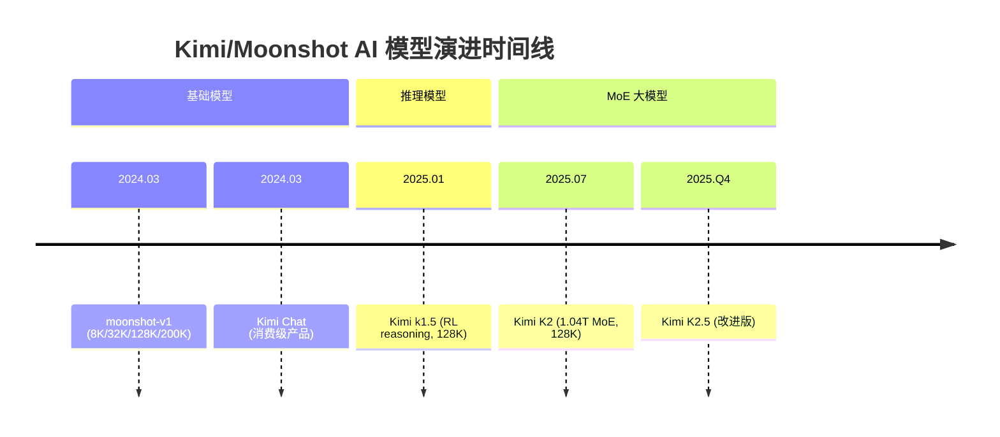
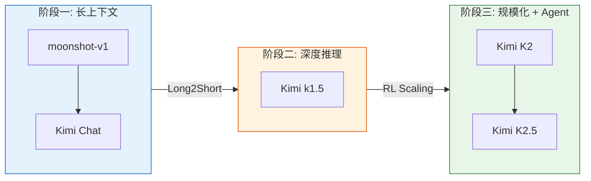
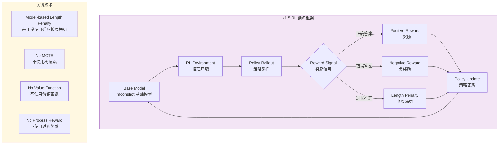
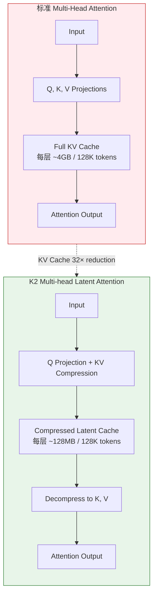
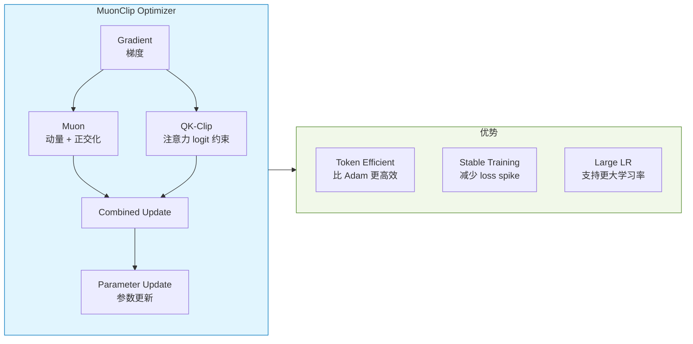
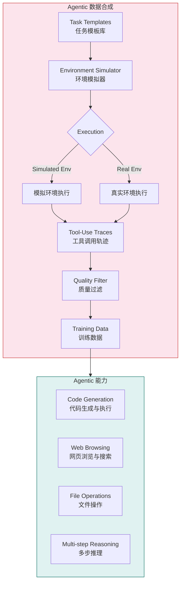
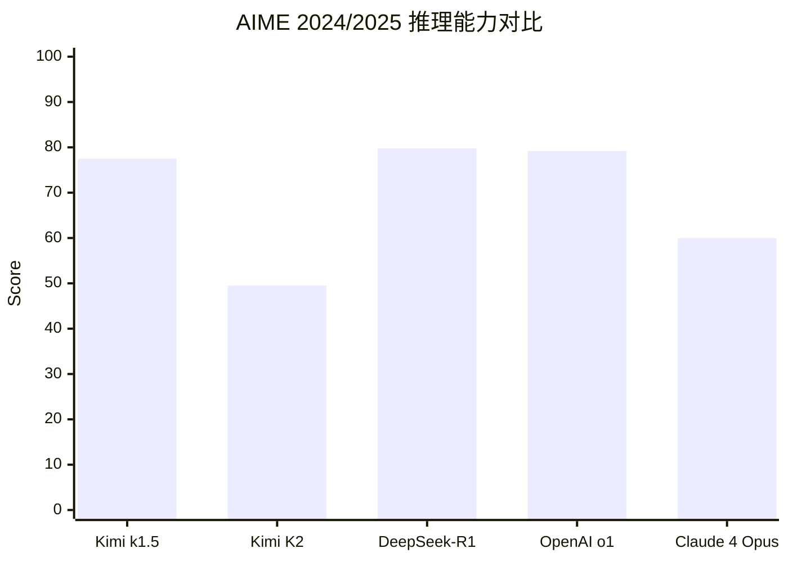
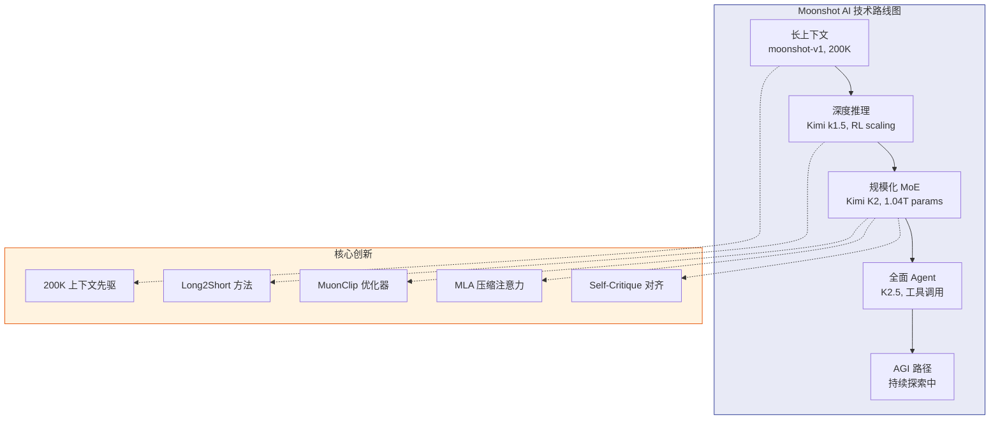

# Kimi / Moonshot AI (月之暗面): 长上下文与推理的技术深潜

> 中文简称：Kimi / Moonshot AI : 长上下文与推理的技术深潜

> **一句话理解**: Kimi/Moonshot AI 是中国长上下文 AI 的开拓者——从 200K 上下文先驱到万亿参数 MoE 架构，用 RL scaling 和 MuonClip 优化器走出一条"长上下文 → 深度推理 → Agentic"的技术路径，堪比中国版 Anthropic。

---

## 目录

1. [公司概述与创始团队](#1-公司概述与创始团队)
2. [模型家族时间线](#2-模型家族时间线)
3. [moonshot-v1 与 Kimi Chat：长上下文先驱](#3-moonshot-v1-与-kimi-chat长上下文先驱)
4. [Kimi k1.5：RL Scaling 驱动的深度推理](#4-kimi-k15rl-scaling-驱动的深度推理)
5. [Kimi K2：万亿参数 MoE 深度解析](#5-kimi-k2万亿参数-moe-深度解析)
6. [Agentic 能力与工具调用](#6-agentic-能力与工具调用)
7. [Benchmark 对比分析](#7-benchmark-对比分析)
8. [技术哲学与行业影响](#8-技术哲学与行业影响)
9. [开发者接入指南](#9-开发者接入指南)
10. [总结与展望](#10-总结与展望)

---

## 1. 公司概述与创始团队

### 1.1 定位

```
Kimi / Moonshot AI (月之暗面)
═══════════════════════════════════════════════════════════════════

定位: 中国 AGI 创业公司，专注长上下文 AI 与推理能力

核心理念:
───────────────────────────────────────────────────────────────────
• Long Context is the Key to AGI — 长上下文是通往 AGI 的钥匙
• 技术驱动: 从底层架构创新而非简单 Scaling
• 开源+闭源并行: K2 开源，Kimi Chat 闭源产品
• 全栈自研: 训练框架、推理引擎、优化器全自研
• 高效推理: 用 RL 而非搜索实现推理能力
```

### 1.2 创始团队

| 人物 | 背景 | 角色 |
|------|------|------|
| **杨植麟 (Zhilin Yang)** | 清华/CMU PhD, 前 Google Brain | 创始人 & CEO |
| **周昕宇** | 清华大学, NLP 方向 | 联合创始人 |
| **吴翼** | 清华大学, 强化学习方向 | 联合创始人 |

团队核心成员来自清华大学、CMU、Google Brain、Meta FAIR 等顶级机构，在 Transformer 架构、强化学习、长上下文建模等领域有深厚积累。

### 1.3 公司发展里程碑

```
Moonshot AI 发展历程
═══════════════════════════════════════════════════════════════════

2023.03 ─── 公司成立 (北京)
   │
2023.Q3 ─── 首轮融资，估值 $300M+
   │
2023.Q4 ─── 内部模型突破 100K context
   │
2024.03 ─── moonshot-v1 发布 (8K/32K/128K/200K)
   │         Kimi Chat 上线
   │
2024.Q3 ─── 用户量突破千万
   │
2025.01 ─── Kimi k1.5 发布 (RL reasoning)
   │         Long2Short 方法引发关注
   │
2025.07 ─── Kimi K2 发布 (1.04T MoE)
   │         开源 K2 base + K2-Instruct
   │
2025.Q4 ─── Kimi K2.5 发布
             Claude-level performance at lower cost
```

### 1.4 融资与估值

| 轮次 | 时间 | 金额 | 投资方 |
|------|------|------|--------|
| Seed | 2023.Q2 | $100M+ | 红杉中国, 真格基金 |
| A 轮 | 2023.Q4 | $200M+ | 美团龙珠, 阿里 |
| B 轮 | 2024.Q2 | $500M+ | 腾讯, 高瓴资本 |

Moonshot AI 是中国 AI 领域融资速度最快的公司之一，成立不到两年估值超过 $3B。

---

## 2. 模型家族时间线

### 2.1 演进全景图



### 2.2 模型能力演进



### 2.3 模型规格对比

| 模型 | 发布时间 | 参数量 | 架构 | 上下文 | 关键创新 |
|------|----------|--------|------|--------|----------|
| **moonshot-v1** | 2024.03 | ~100B+ (est.) | Dense Transformer | 8K–200K | 首个 200K 生产级中文模型 |
| **Kimi Chat** | 2024.03 | 基于 moonshot-v1 | Dense Transformer | 200K+ | 文件上传 + 长文档分析 |
| **Kimi k1.5** | 2025.01 | 未公开 | RL-based reasoning | 128K | Long2Short, 纯 RL scaling |
| **Kimi K2** | 2025.07 | 1.04T (32.6B active) | MoE Transformer | 128K | MuonClip, MLA, 开源 |
| **Kimi K2.5** | 2025.Q4 | 未公开 | MoE (改进) | 128K+ | 性价比优化 |

---

## 3. moonshot-v1 与 Kimi Chat：长上下文先驱

### 3.1 技术背景

2024 年初，当大多数中文 LLM 还停留在 8K–32K 上下文窗口时，Moonshot AI 率先将 200K 上下文推入生产环境。这一突破使得 Kimi 成为中文生态中第一个真正能处理"一本书"级别输入的 AI 产品。

```
上下文窗口对比 (2024 Q1)
═══════════════════════════════════════════════════════════════════

GPT-4 Turbo      ████████████████████  128K
Claude 3         ████████████████████  200K
Gemini 1.5 Pro   ████████████████████████████████████████  1M
───────────────────────────────────────────────────────────────────
文心一言 4.0      ████  8K–16K
通义千问 Qwen      ████  8K–32K
智谱 GLM-4        ████████  32K
───────────────────────────────────────────────────────────────────
moonshot-v1      ██████████████████████████████  200K ← 中文模型首个
```

### 3.2 moonshot-v1 架构

moonshot-v1 采用标准 Transformer decoder-only 架构，但在长上下文处理上做了多项优化：

```
moonshot-v1 架构概览
═══════════════════════════════════════════════════════════════════

┌──────────────────────────────────────────────────────────────────┐
│                    moonshot-v1 Architecture                        │
├──────────────────────────────────────────────────────────────────┤
│                                                                    │
│  Input Tokens                                                      │
│       │                                                            │
│       ▼                                                            │
│  ┌──────────────────────────────────────────────────────────┐     │
│  │              Embedding Layer                               │     │
│  │  Token Embedding + Positional Encoding                    │     │
│  │  支持 RoPE 扩展至 200K                                    │     │
│  └──────────────────────────────────────────────────────────┘     │
│       │                                                            │
│       ▼                                                            │
│  ┌──────────────────────────────────────────────────────────┐     │
│  │         Transformer Blocks × N                            │     │
│  │  ┌─────────────────────────────────────────────────┐     │     │
│  │  │  Multi-Head Self-Attention (with KV Cache)      │     │     │
│  │  │  ├── 长上下文优化: 稀疏注意力 + 滑动窗口         │     │     │
│  │  │  └── 高效 KV Cache 管理                          │     │     │
│  │  └─────────────────────────────────────────────────┘     │     │
│  │  ┌─────────────────────────────────────────────────┐     │     │
│  │  │  Feed-Forward Network (SwiGLU)                   │     │     │
│  │  └─────────────────────────────────────────────────┘     │     │
│  │  ┌─────────────────────────────────────────────────┐     │     │
│  │  │  RMSNorm + Residual                              │     │     │
│  │  └─────────────────────────────────────────────────┘     │     │
│  └──────────────────────────────────────────────────────────┘     │
│       │                                                            │
│       ▼                                                            │
│  ┌──────────────────────────────────────────────────────────┐     │
│  │              LM Head                                       │     │
│  │  输出: 下一个 token 的概率分布                             │     │
│  └──────────────────────────────────────────────────────────┘     │
│                                                                    │
└──────────────────────────────────────────────────────────────────┘
```

### 3.3 上下文层级设计

moonshot-v1 提供四个上下文层级，适应不同场景：

| 层级 | 上下文长度 | 适用场景 | API 定价 (输入/输出 per 1K tokens) |
|------|-----------|----------|-------------------------------------|
| **moonshot-v1-8k** | 8,000 tokens | 短对话、简单问答 | ¥0.012 / ¥0.012 |
| **moonshot-v1-32k** | 32,000 tokens | 中等文档、多轮对话 | ¥0.024 / ¥0.024 |
| **moonshot-v1-128k** | 128,000 tokens | 长文档分析、代码库 | ¥0.06 / ¥0.06 |
| **moonshot-v1-200k** | 200,000 tokens | 超长文档、书籍级分析 | 未公开 |

### 3.4 Kimi Chat 产品创新

Kimi Chat 是基于 moonshot-v1 构建的消费级产品，核心创新包括：

```
Kimi Chat 产品架构
═══════════════════════════════════════════════════════════════════

┌─────────────────────────────────────────────────────────────────┐
│                      Kimi Chat 产品层                              │
├─────────────────────────────────────────────────────────────────┤
│                                                                   │
│   用户输入                                                        │
│   ├── 文本对话                                                    │
│   ├── 文件上传 (PDF/Word/TXT/代码)                                │
│   └── 网页链接                                                    │
│         │                                                         │
│         ▼                                                         │
│   ┌──────────────────────────────────────────────────────┐       │
│   │              文档预处理层                                │       │
│   │  ├── PDF/Word 解析 → 文本提取                          │       │
│   │  ├── 分块 & 索引 (Chunking & Indexing)                 │       │
│   │  └── 长文本 → 200K token 映射                          │       │
│   └──────────────────────────────────────────────────────┘       │
│         │                                                         │
│         ▼                                                         │
│   ┌──────────────────────────────────────────────────────┐       │
│   │              moonshot-v1 推理引擎                       │       │
│   │  ├── 长上下文理解                                       │       │
│   │  ├── 多轮对话管理                                       │       │
│   │  └── Web Search 增强                                   │       │
│   └──────────────────────────────────────────────────────┘       │
│         │                                                         │
│         ▼                                                         │
│   结构化输出 (Markdown / 引用 / 摘要)                              │
│                                                                   │
└─────────────────────────────────────────────────────────────────┘
```

**关键能力：**

| 能力 | 说明 | 示例 |
|------|------|------|
| **长文档分析** | 上传 200K+ 字的文档，精准定位信息 | 上传 200 页财报，回答具体问题 |
| **多文件对比** | 同时上传多个文件进行交叉分析 | 对比 3 份合同找出差异条款 |
| **网页搜索增强** | 实时联网搜索补充信息 | 回答需要最新数据的问题 |
| **代码理解** | 上传代码库进行分析和调试 | 上传整个项目，找出 bug |

### 3.5 长上下文技术挑战与解决方案

| 挑战 | 问题描述 | moonshot-v1 解决方案 |
|------|----------|---------------------|
| **KV Cache 爆炸** | 200K tokens 的 KV Cache 占用巨大显存 | 分层 KV Cache 管理 + 动态淘汰策略 |
| **注意力退化** | 长序列中注意力分散 ("lost in the middle") | 位置编码优化 + 注意力稀疏化 |
| **位置编码外推** | RoPE 需要外推到训练时未见过的长度 | 渐进式 RoPE 扩展 (NTK-aware) |
| **推理延迟** | 长上下文导致首 token 延迟高 | Prefill 分块 + 异步计算 |
| **训练数据** | 高质量 200K 长度训练数据稀缺 | 合成长文档 + 真实长文本混合 |

---

## 4. Kimi k1.5：RL Scaling 驱动的深度推理

### 4.1 背景与动机

2025 年 1 月发布的 Kimi k1.5 是 Moonshot AI 进入推理模型赛道的标志性产品。与 DeepSeek-R1 和 OpenAI o1 类似，k1.5 通过强化学习实现深度推理能力，但其技术路线有显著差异。

> **核心主张**: "No MCTS, no value functions, no process reward models — pure RL scaling."
>
> k1.5 证明了不需要蒙特卡洛树搜索、不需要价值函数、不需要过程奖励模型，纯 RL scaling 就能达到 SOTA 推理水平。

更多推理模型的技术对比，参见 [DeepSeek R1 技术分析](../08_推理模型/01_DeepSeek_R1_Technical_分析.md)。

### 4.2 核心技术：Long2Short 方法

Long2Short 是 k1.5 最重要的技术创新——它用长思维链 (long-CoT) 的能力来提升短思维链 (short-CoT) 的表现。

```
Long2Short 方法流程
═══════════════════════════════════════════════════════════════════

Phase 1: 长思维链训练 (Long-CoT Training)
───────────────────────────────────────────────────────────────────
┌──────────────────────────────────────────────────────────────┐
│  输入: 数学题 / 代码问题 / 推理任务                            │
│                                                                │
│  模型输出: 完整的长推理链                                       │
│  ┌────────────────────────────────────────────────────┐       │
│  │ 问题 → 分析 → 步骤1 → 步骤2 → ... → 步骤N → 答案   │       │
│  │        (数千 tokens 的详细推理过程)                   │       │
│  └────────────────────────────────────────────────────┘       │
│                                                                │
│  训练方式: RL with verifiable rewards                          │
│  奖励信号: 答案正确性 + 模型长度惩罚                            │
└──────────────────────────────────────────────────────────────┘
                        │
                        ▼
Phase 2: 能力迁移 (Capability Transfer)
───────────────────────────────────────────────────────────────────
┌──────────────────────────────────────────────────────────────┐
│  Long-CoT 模型 → Short-CoT 模型                               │
│                                                                │
│  关键技术:                                                     │
│  ├── Model-based length penalty (基于模型的长度惩罚)           │
│  ├── Improved policy optimization (改进策略优化)               │
│  └── 蒸馏 + RL 微调                                            │
│                                                                │
│  目标: 用更短的推理链达到接近长推理链的准确率                   │
└──────────────────────────────────────────────────────────────┘
                        │
                        ▼
Phase 3: 短思维链推理 (Short-CoT Inference)
───────────────────────────────────────────────────────────────────
┌──────────────────────────────────────────────────────────────┐
│  输入: 问题                                                    │
│  输出: 精简推理链 + 答案                                       │
│                                                                │
│  ┌─────────────────────────────────────────────┐              │
│  │ 问题 → 关键步骤1 → 关键步骤2 → 答案          │              │
│  │        (数百 tokens, 而非数千)                 │              │
│  └─────────────────────────────────────────────┘              │
└──────────────────────────────────────────────────────────────┘
```

### 4.3 RL 训练框架



### 4.4 与 DeepSeek-R1 的技术路线对比

| 维度 | Kimi k1.5 | DeepSeek-R1 | OpenAI o1 |
|------|-----------|-------------|-----------|
| **推理方式** | RL scaling (pure) | RL + CoT distillation | RL + CoT |
| **搜索方法** | 无 MCTS | 无 MCTS | 疑似 tree search |
| **奖励模型** | Verifiable reward only | Verifiable + process reward | Verifiable + process reward |
| **长度控制** | Model-based length penalty | 自然长度 | 隐式控制 |
| **Long2Short** | 有 (核心创新) | 有 (蒸馏) | 未公开 |
| **上下文** | 128K | 64K (128K extended) | 未公开 |

更多 MoE 与推理模型的架构对比，参见 [MoE 案例研究：DeepSeek 与 Mixtral](../04_LLM架构/12_MoE_Case_Studies_DeepSeek_Mixtral.md)。

### 4.5 Benchmark 表现

**Extended Thinking (长思维链) 模式：**

| Benchmark | Kimi k1.5 | OpenAI o1 | DeepSeek-R1 |
|-----------|-----------|-----------|-------------|
| **AIME** | **77.5** | 79.2 | 79.8 |
| **MATH 500** | **96.2** | 97.2 | 97.3 |
| **Codeforces** | **94th percentile** | 96th percentile | 96th percentile |
| **MathVista** | **74.9** | 77.3 | — |

**Short Thinking (短思维链) 模式：**

| Benchmark | Kimi k1.5 | OpenAI o1-mini | GPT-4o |
|-----------|-----------|----------------|--------|
| **AIME** | **60.8** | 63.6 | 9.3 |
| **MATH 500** | **94.6** | 94.8 | 74.6 |
| **LiveCodeBench** | **47.3** | 46.5 | 31.2 |

> **关键发现**: k1.5 在 short thinking 模式下已接近 o1-mini 水平，证明了 Long2Short 方法的有效性。特别是在 LiveCodeBench 上，k1.5 short 甚至超越了 o1-mini。

### 4.6 技术意义

k1.5 的核心贡献不仅在于 benchmark 数字，更在于证明了：

1. **Pure RL scaling 可行**: 不需要复杂的过程奖励模型或树搜索，纯 RL 就能训练出强推理模型
2. **Long2Short 迁移有效**: 长推理链的能力可以有效迁移到短推理链，降低推理成本
3. **Model-based length penalty**: 自适应长度惩罚比固定规则更灵活，模型学会根据问题难度调节推理长度

---

## 5. Kimi K2：万亿参数 MoE 深度解析

### 5.1 概览

Kimi K2 于 2025 年 7 月发布，是 Moonshot AI 的首个万亿参数 MoE 模型。其设计哲学是将 Dense 模型的知识容量与 MoE 的计算效率结合，通过多项架构创新在编码和推理任务上达到与 Claude 4 系列可比的水平。

```
Kimi K2 核心参数
═══════════════════════════════════════════════════════════════════

总参数量:         1.04 Trillion (1.04 万亿)
活跃参数量:       32.6B (每次前向传播)
总专家数:         384 routing experts + 1 shared expert
选中专家数:       8 routing experts per token
Transformer 层:   61 layers
注意力头数:       64 attention heads
注意力机制:       Multi-head Latent Attention (MLA)
上下文长度:       128K tokens
训练数据:         15.5T tokens
优化器:           MuonClip (Muon + QK-Clip)
```

### 5.2 MoE 架构详解

```
Kimi K2 MoE 架构
═══════════════════════════════════════════════════════════════════

Input Tokens
     │
     ▼
┌──────────────────────────────────────────────────────────────────┐
│                    Embedding Layer                                 │
└──────────────────────────────────────────────────────────────────┘
     │
     ▼
┌──────────────────────────────────────────────────────────────────┐
│  Transformer Layer 1/61                                           │
│  ┌────────────────────────────────────────────────────────────┐  │
│  │  Multi-head Latent Attention (MLA)                          │  │
│  │  ┌──────────────────────────────────────────────────────┐  │  │
│  │  │  Query: W_q · x  (64 heads)                           │  │  │
│  │  │                                                        │  │  │
│  │  │  KV Cache Compression:                                 │  │  │
│  │  │  ┌─────────────┐     ┌──────────────┐                │  │  │
│  │  │  │ Key/Value    │────▶│ Latent Vector │ (低维压缩)     │  │  │
│  │  │  │ (原始高维)    │     │ (压缩后低维)   │                │  │  │
│  │  │  └─────────────┘     └──────┬───────┘                │  │  │
│  │  │                              │                         │  │  │
│  │  │                     ┌──────▼───────┐                │  │  │
│  │  │                     │ Decompose     │ (推理时解压)     │  │  │
│  │  │                     │ to K, V       │                  │  │  │
│  │  │                     └──────────────┘                  │  │  │
│  │  └──────────────────────────────────────────────────────┘  │  │
│  └────────────────────────────────────────────────────────────┘  │
│                                                                    │
│  ┌────────────────────────────────────────────────────────────┐  │
│  │  MoE Feed-Forward Layer                                     │  │
│  │                                                              │  │
│  │  Input ───▶ Router Network ───▶ Top-8 Expert Selection      │  │
│  │              │                                                │  │
│  │              ├──▶ Shared Expert (always active)               │  │
│  │              │                                                │  │
│  │              ├──▶ Expert 1  ──┐                               │  │
│  │              ├──▶ Expert 2  ──┤                               │  │
│  │              ├──▶ Expert 3  ──┤                               │  │
│  │              ├──▶ ...        ──┼──▶ Combine ──▶ Output       │  │
│  │              ├──▶ Expert 7  ──┤                               │  │
│  │              └──▶ Expert 8  ──┘                               │  │
│  │                                                              │  │
│  │  (共 384 routing experts，每次选 8 个)                       │  │
│  └────────────────────────────────────────────────────────────┘  │
│                                                                    │
│  RMSNorm + Residual Connection                                     │
└──────────────────────────────────────────────────────────────────┘
     │
     ▼  (× 61 layers)
┌──────────────────────────────────────────────────────────────────┐
│                    LM Head                                         │
└──────────────────────────────────────────────────────────────────┘
```

### 5.3 Multi-head Latent Attention (MLA)

MLA 是 K2 的关键架构创新之一，与 DeepSeek 的 MLA 设计类似，核心目标是压缩 KV Cache 以支持 128K 长上下文。

```
MLA vs 标准 MHA 的 KV Cache 对比
═══════════════════════════════════════════════════════════════════

标准 Multi-Head Attention (MHA):
───────────────────────────────────────────────────────────────────
  KV Cache per token = 2 × n_heads × head_dim × dtype_size

  假设: 64 heads, 128 dim, FP16
  KV Cache = 2 × 64 × 128 × 2 = 32,768 bytes/token
  128K tokens: 32,768 × 131,072 ≈ 4.0 GB per layer
  61 layers: 4.0 × 61 ≈ 244 GB (不可接受!)

Multi-head Latent Attention (MLA):
───────────────────────────────────────────────────────────────────
  KV Cache per token = latent_dim × dtype_size  (压缩后)

  假设: latent_dim = 512 (压缩比 ≈ 128:1)
  KV Cache = 512 × 2 = 1,024 bytes/token
  128K tokens: 1,024 × 131,072 ≈ 128 MB per layer
  61 layers: 128 × 61 ≈ 7.5 GB (可接受!)

压缩比: ~32× 减少
```



### 5.4 MuonClip 优化器

MuonClip 是 K2 训练中引入的新型优化器，结合了 Muon 和 QK-Clip 两种技术。

#### 5.4.1 Muon 优化器

Muon (MomentUm Orthogonalized by Newton-schulz) 是一种基于动量的矩阵参数优化器，在大模型训练中比 Adam 更加 token-efficient。

```
Muon 优化器原理
═══════════════════════════════════════════════════════════════════

标准 Adam:
───────────────────────────────────────────────────────────────────
  m_t = β₁ · m_{t-1} + (1-β₁) · g_t          (一阶动量)
  v_t = β₂ · v_{t-1} + (1-β₂) · g_t²         (二阶动量)
  θ_t = θ_{t-1} - lr · m_t / √v_t             (参数更新)

Muon:
───────────────────────────────────────────────────────────────────
  m_t = β · m_{t-1} + (1-β) · g_t             (动量累积)
  M_t = Newton-Schulz(m_t)                      (正交化处理)
  θ_t = θ_{t-1} - lr · M_t                      (参数更新)

  Newton-Schulz 迭代:
  X₀ = α · M (α 为缩放因子)
  X_{k+1} = X_k · (aI + bX_k^T X_k + c(X_k^T X_k)²)
  其中 a, b, c 为预计算常数

优势:
  • 参数更新方向正交化 → 更稳定的训练
  • 比 Adam 更高的 token efficiency
  • 特别适合矩阵参数 (attention weights, FFN weights)
```

#### 5.4.2 QK-Clip 技术

QK-Clip 是专门为 Transformer 注意力机制设计的梯度裁剪方法，防止注意力 logit 在训练过程中无限增长。

```
QK-Clip 工作原理
═══════════════════════════════════════════════════════════════════

问题: 注意力 logit 爆炸
───────────────────────────────────────────────────────────────────
  attention_logit = Q · K^T / √d
  训练过程中 Q 和 K 的范数可能持续增长
  → logit 值越来越大
  → softmax 梯度消失
  → 训练不稳定

解决方案: QK-Clip
───────────────────────────────────────────────────────────────────
  if ||Q · K^T|| > threshold:
      clip Q and K such that ||Q · K^T|| ≤ threshold

  具体实现:
  1. 监控每层 attention logits 的最大值
  2. 当最大值超过预设阈值时
  3. 对 Q 和 K 的梯度施加约束
  4. 保持 attention logits 在合理范围内

效果:
  • 训练稳定性显著提升
  • 允许更大的学习率
  • 减少 loss spike
```

#### 5.4.3 MuonClip 组合



#### 5.4.4 MuonClip 伪代码

```python
class MuonClipOptimizer:
    """
    MuonClip: Muon + QK-Clip for stable large-model training.

    用于 Kimi K2 的 1.04T 参数 MoE 模型训练
    """

    def __init__(self, params, lr=1e-3, beta=0.95,
                 qk_clip_threshold=5.0):
        self.lr = lr
        self.beta = beta
        self.qk_clip_threshold = qk_clip_threshold
        self.momentum = {name: torch.zeros_like(p)
                         for name, p in params}

    @torch.no_grad()
    def step(self, named_params):
        for name, param in named_params:
            if param.grad is None:
                continue

            grad = param.grad

            # === QK-Clip: 对 Q/K 权重施加 logit 约束 ===
            if self._is_qk_param(name):
                grad = self._apply_qk_clip(param, grad)

            # === Muon: 动量累积 + Newton-Schulz 正交化 ===
            self.momentum[name].mul_(self.beta).add_(
                grad, alpha=1 - self.beta
            )

            if param.dim() >= 2:
                # 矩阵参数: Newton-Schulz 正交化
                update = self._newton_schulz(
                    self.momentum[name]
                )
            else:
                # 向量参数: 标准 SGD with momentum
                update = self.momentum[name]

            param.add_(update, alpha=-self.lr)

    def _newton_schulz(self, M, num_iters=5):
        """Newton-Schulz 迭代近似矩阵正交化"""
        X = M / (M.norm() + 1e-8)
        for _ in range(num_iters):
            A = X @ X.T
            X = X @ (1.5 * torch.eye(A.size(0)) - 0.5 * A)
        return X * M.norm()

    def _is_qk_param(self, name):
        return 'q_proj' in name or 'k_proj' in name

    def _apply_qk_clip(self, param, grad):
        """约束 Q/K 权重的 logit 增长"""
        logit_norm = torch.norm(param)
        if logit_norm > self.qk_clip_threshold:
            scale = self.qk_clip_threshold / logit_norm
            grad = grad * scale
        return grad
```

### 5.5 训练方法论

#### 5.5.1 数据与预训练

```
K2 预训练流程
═══════════════════════════════════════════════════════════════════

训练数据: 15.5T curated tokens
───────────────────────────────────────────────────────────────────
┌──────────────────────────────────────────────────────────────┐
│  数据来源                                                     │
│  ├── 代码数据 (GitHub, open-source repos)        ~3T tokens  │
│  ├── 数学数据 (教科书, 论文, 习题)                ~1T tokens  │
│  ├── 知识数据 (百科, 学术, 新闻)                  ~5T tokens  │
│  ├── Web 数据 (清洗后的高质量网页)                 ~5T tokens  │
│  └── 合成数据 (风格改写, 数据增强)                ~1.5T tokens │
└──────────────────────────────────────────────────────────────┘

关键创新: Stylistic Rewriting (风格改写)
───────────────────────────────────────────────────────────────────
  同一事实用不同风格重写，增加训练信号密度:
  • 正式版 → 口语版 → 技术版
  • 长文 → 摘要 → 要点
  • 最大化每条数据的学习信号

上下文扩展策略:
───────────────────────────────────────────────────────────────────
  Phase 1: 4K context    (主体预训练)
      │
      ▼
  Phase 2: 32K context   (上下文退火 / Annealing)
      │
      ▼
  Phase 3: 128K context  (YaRN 位置编码插值)
```

#### 5.5.2 上下文扩展策略

| 阶段 | 上下文 | 方法 | 目的 |
|------|--------|------|------|
| **Phase 1** | 4K | 标准训练 | 基础能力学习 |
| **Phase 2** | 32K | Annealing (退火) | 渐进式上下文扩展 |
| **Phase 3** | 128K | YaRN positional interpolation | 长上下文外推 |

**YaRN (Yet another RoPE extensioN)** 是 K2 用于将上下文从 32K 扩展到 128K 的位置编码方法：

```
YaRN 位置编码插值
═══════════════════════════════════════════════════════════════════

原始 RoPE:
  θ_i = 10000^(-2i/d)
  position_encoding = [cos(m·θ_i), sin(m·θ_i)]

YaRN 扩展:
  1. 频率分类:
     ├── 高频分量: 保持不变 (短距离信息)
     ├── 中频分量: 线性插值 (中等距离)
     └── 低频分量: NTK-aware 缩放 (长距离)

  2. 温度缩放:
     θ'_i = θ_i / scaling_factor(frequency_band)

  3. 注意力缩放:
     attention_scale = √(1 + log(context_ratio) / log(base_context))

  结果: 4K → 128K (32× 扩展) 无需从头训练
```

#### 5.5.3 后训练 (Post-Training)

```
K2 后训练流程
═══════════════════════════════════════════════════════════════════

┌─────────────────────────────────────────────────────────────────┐
│  Step 1: Instruction Tuning (指令微调)                            │
│  ├── 高质量指令-回复对                                            │
│  ├── 多任务覆盖: 代码、数学、写作、分析                            │
│  └── 格式对齐: 结构化输出、Markdown                               │
└─────────────────────────────────────────────────────────────────┘
         │
         ▼
┌─────────────────────────────────────────────────────────────────┐
│  Step 2: RL with Verifiable Rewards (可验证奖励 RL)               │
│  ├── 数学: 答案正确性验证                                         │
│  ├── 代码: 单元测试通过率                                         │
│  └── 推理: 逻辑一致性检查                                         │
└─────────────────────────────────────────────────────────────────┘
         │
         ▼
┌─────────────────────────────────────────────────────────────────┐
│  Step 3: Self-Critique Rubric Reward (自评打分奖励)               │
│  ├── 模型自评: 对输出按评分标准打分                                │
│  ├── Rubric 设计: 准确性、完整性、清晰度、深度                     │
│  └── 无需人工标注: 模型充当自己的评委                              │
└─────────────────────────────────────────────────────────────────┘
         │
         ▼
┌─────────────────────────────────────────────────────────────────┐
│  Step 4: Output Budget Control (输出预算控制)                     │
│  ├── Strict output budgets: 限制冗余输出                          │
│  ├── Temperature decay: 从探索到利用的温度退火                     │
│  └── Auxiliary PTX loss: 保持基础知识不遗忘                        │
└─────────────────────────────────────────────────────────────────┘
```

**后训练关键技术详解：**

| 技术 | 说明 | 目的 |
|------|------|------|
| **Verifiable Rewards** | 用程序化方法验证输出正确性 | 客观奖励信号 |
| **Self-Critique Rubric** | 模型按评分标准自评 | 替代人工标注 |
| **Output Budget** | 严格限制输出长度 | 防止啰嗦 |
| **Temperature Decay** | 训练中从高温到低温 | 先探索后收敛 |
| **Auxiliary PTX Loss** | 保留部分预训练 loss | 防止灾难性遗忘 |

### 5.6 推理基础设施

```
K2 推理部署架构
═══════════════════════════════════════════════════════════════════

┌─────────────────────────────────────────────────────────────────┐
│                    K2 Serving Infrastructure                       │
├─────────────────────────────────────────────────────────────────┤
│                                                                   │
│  ┌───────────────────────────────────────────────────────┐       │
│  │  Training Cluster (训练集群)                             │       │
│  │  ├── GPU nodes for pre-training                        │       │
│  │  └── Checkpoint storage                                │       │
│  └───────────────────────────┬───────────────────────────┘       │
│                              │                                    │
│                    Sub-30-second weight transfer                  │
│                    (权重迁移 < 30 秒)                              │
│                              │                                    │
│                              ▼                                    │
│  ┌───────────────────────────────────────────────────────┐       │
│  │  Inference Cluster (推理集群)                            │       │
│  │  ├── Colocated with training nodes (训练推理共置)       │       │
│  │  ├── Tensor parallelism (张量并行)                      │       │
│  │  ├── Expert parallelism (专家并行, for MoE)             │       │
│  │  └── MLA-optimized KV Cache management                  │       │
│  └───────────────────────────────────────────────────────┘       │
│                                                                   │
│  关键设计:                                                        │
│  • Colocated nodes: 训练和推理共享硬件，减少闲置                   │
│  • Sub-30s transfer: 训练完成后 30 秒内可上线推理                  │
│  • Expert parallelism: 384 个专家分布在不同 GPU                   │
│                                                                   │
└─────────────────────────────────────────────────────────────────┘
```

### 5.7 K2 Benchmark 全面分析

| Benchmark | Kimi K2 (single) | Kimi K2 (multi) | DeepSeek-V3 | Qwen3 | Claude 4 Opus |
|-----------|-------------------|------------------|-------------|-------|----------------|
| **SWE-bench Verified** | 65.8 | **71.6** | 42.0 | — | 72.5 |
| **SWE-bench Multilingual** | **47.3** | — | 34.7 | — | — |
| **LiveCodeBench v6** | **53.7** | — | 42.5 | 46.8 | — |
| **Aider-Polyglot** | **60.0** | — | 50.0 | 54.0 | — |
| **AIME 2025** | 49.5 | — | 39.2 | 52.1 | — |
| **AIME 2024** | **69.6** | — | 61.3 | 65.0 | — |
| **GPQA-Diamond** | **75.1** | — | 71.5 | 68.3 | 74.9 |
| **MMLU** | 89.5 | — | 88.5 | 89.0 | 90.2 |
| **ACEBench** | **76.5** | — | 70.0 | 73.2 | — |
| **τ²-Bench** | ~66.1 | — | 58.0 | — | — |

> **分析**: K2 在编码 (SWE-bench, LiveCodeBench, Aider-Polyglot) 和推理 (AIME, GPQA) 任务上全面超越 DeepSeek-V3 和 Qwen3，在多项 benchmark 上匹配 Claude 4 Opus/Sonnet 水平——且无需 extended reasoning 模式。

### 5.8 K2 vs DeepSeek-V3 架构对比

```
Kimi K2 vs DeepSeek-V3 架构对比
═══════════════════════════════════════════════════════════════════

                   Kimi K2              DeepSeek-V3
───────────────────────────────────────────────────────────────────
总参数量           1.04T                671B
活跃参数量         32.6B                37B
总专家数           384 + 1 shared       256 + 1 shared
选中专家数         8                    8
Transformer 层     61                   61
注意力机制         MLA                  MLA
注意力头数         64                   128
优化器             MuonClip             Adam (modified)
上下文长度         128K                 128K
训练数据           15.5T tokens         14.8T tokens
开源               K2 base + Instruct   V3 base + Instruct
```

---

## 6. Agentic 能力与工具调用

### 6.1 Agentic 数据合成

K2 的 agentic 能力来自系统化的数据合成流程：



### 6.2 工具调用能力

| 能力 | 说明 | 示例 |
|------|------|------|
| **代码执行** | 生成并执行 Python/JS 代码 | 数据分析、图表生成 |
| **Web 搜索** | 搜索并提取网页信息 | 实时数据查询 |
| **文件操作** | 读写文件、处理文档 | 批量文件处理 |
| **API 调用** | 调用外部 API | 天气查询、数据库操作 |
| **多步任务** | 串联多个工具完成复杂任务 | 调研 → 分析 → 生成报告 |

### 6.3 SWE-bench 表现分析

K2 在 SWE-bench Verified 上达到 65.8 (single) / 71.6 (multi)，表明其在真实软件工程任务上具备强大的 agentic 能力：

```
SWE-bench 任务执行流程 (K2)
═══════════════════════════════════════════════════════════════════

┌─────────────────────────────────────────────────────────────────┐
│  Step 1: Issue Analysis                                          │
│  ├── 理解 GitHub issue 描述                                       │
│  ├── 定位相关代码文件                                              │
│  └── 制定修复方案                                                  │
├─────────────────────────────────────────────────────────────────┤
│  Step 2: Code Exploration                                        │
│  ├── 阅读相关源码                                                  │
│  ├── 理解代码结构和依赖                                            │
│  └── 识别 bug 根因                                                │
├─────────────────────────────────────────────────────────────────┤
│  Step 3: Patch Generation                                        │
│  ├── 编写修复代码                                                  │
│  ├── 遵循项目代码规范                                              │
│  └── 添加测试用例                                                  │
├─────────────────────────────────────────────────────────────────┤
│  Step 4: Verification                                            │
│  ├── 运行测试套件                                                  │
│  ├── 验证修复有效性                                                │
│  └── 确保无副作用                                                  │
└─────────────────────────────────────────────────────────────────┘

K2 成功率:
  Single attempt:  65.8%  (一次尝试解决)
  Multi attempt:   71.6%  (多次尝试解决)
```

---

## 7. Benchmark 对比分析

### 7.1 推理能力对比



| 模型 | AIME 2024 | AIME 2025 | MATH 500 | GPQA-Diamond |
|------|-----------|-----------|----------|-------------|
| **Kimi k1.5** (extended) | — | 77.5 | 96.2 | — |
| **Kimi K2** | 69.6 | 49.5 | — | 75.1 |
| **DeepSeek-R1** | — | 79.8 | 97.3 | 71.5 |
| **OpenAI o1** | — | 79.2 | 97.2 | — |
| **Claude 4 Opus** | — | — | — | 74.9 |
| **GPT-4o** | 9.3 | — | 74.6 | — |

### 7.2 编码能力对比

| 模型 | SWE-bench Verified | LiveCodeBench v6 | Aider-Polyglot | Codeforces |
|------|-------------------|------------------|----------------|-----------|
| **Kimi K2** (multi) | **71.6** | **53.7** | **60.0** | — |
| **Kimi k1.5** | — | — | — | 94th %ile |
| **DeepSeek-V3** | 42.0 | 42.5 | 50.0 | — |
| **Qwen3** | — | 46.8 | 54.0 | — |
| **Claude 4 Opus** | 72.5 | — | — | — |

### 7.3 综合能力雷达图

```
综合能力对比 (5 分制归一化)
═══════════════════════════════════════════════════════════════════

                    Kimi K2     DeepSeek-V3   Qwen3       Claude 4 Opus
─────────────────────────────────────────────────────────────────────────
推理 (Reasoning)    ★★★★☆       ★★★★☆        ★★★★☆       ★★★★★
编码 (Coding)       ★★★★★       ★★★☆☆        ★★★★☆       ★★★★★
数学 (Math)         ★★★★☆       ★★★★☆        ★★★★☆       ★★★★☆
Agent               ★★★★★       ★★★☆☆        ★★★☆☆       ★★★★☆
中文 (Chinese)      ★★★★★       ★★★★★        ★★★★★       ★★★☆☆
长上下文            ★★★★☆       ★★★★☆        ★★★★☆       ★★★★☆
性价比              ★★★★★       ★★★★★        ★★★★★       ★★☆☆☆
开源程度            ★★★★★       ★★★★★        ★★★★☆       ☆☆☆☆☆
```

### 7.4 编码任务详细对比

```
编码 Benchmark 详细分析
═══════════════════════════════════════════════════════════════════

SWE-bench Verified (真实 GitHub issue 解决率):
───────────────────────────────────────────────────────────────────
Kimi K2 (multi)     ██████████████████████████████████████  71.6%
Claude 4 Opus       ███████████████████████████████████████ 72.5%
Kimi K2 (single)    ██████████████████████████████████      65.8%
DeepSeek-V3         ██████████████████████                  42.0%

LiveCodeBench v6 (竞赛编程):
───────────────────────────────────────────────────────────────────
Kimi K2             ████████████████████████████            53.7%
Qwen3               ███████████████████████████             46.8%
DeepSeek-V3         ████████████████████████                42.5%

Aider-Polyglot (多语言代码编辑):
───────────────────────────────────────────────────────────────────
Kimi K2             ████████████████████████████████        60.0%
Qwen3               █████████████████████████████           54.0%
DeepSeek-V3         ██████████████████████████              50.0%
```

---

## 8. 技术哲学与行业影响

### 8.1 Moonshot AI 的技术哲学

```
Moonshot AI 技术哲学
═══════════════════════════════════════════════════════════════════

1. "Long Context is the Key to AGI"
   ───────────────────────────────────────────────────────────────
   • 长上下文不仅仅是"处理更多文本"
   • 而是让模型具备"持续学习"和"长期记忆"的能力
   • 200K context 是起点，不是终点

2. "Pure RL Scaling"
   ───────────────────────────────────────────────────────────────
   • 不依赖外部搜索 (MCTS) 来增强推理
   • 模型自身学会推理策略
   • 更简洁、更可扩展的方法

3. "Efficiency Through Architecture"
   ───────────────────────────────────────────────────────────────
   • MoE: 用更少的计算获得更多知识
   • MLA: 用更少的显存处理更长的上下文
   • MuonClip: 用更少的 token 训练更大的模型

4. "Open Source + Commercial"
   ───────────────────────────────────────────────────────────────
   • 开源基础模型 (K2 base, K2-Instruct)
   • 闭源产品体验 (Kimi Chat)
   • 推动整个中国 LLM 生态发展
```

### 8.2 在中国 LLM 生态中的位置

| 公司 | 核心优势 | 模型规模 | 开源程度 | 长上下文 | 推理能力 |
|------|----------|----------|----------|----------|----------|
| **Moonshot AI (Kimi)** | 长上下文 + 推理 + Agent | 万亿级 MoE | K2 开源 | 200K (先驱) | 强 |
| **DeepSeek** | 低成本高性能 | 671B MoE | 完全开源 | 128K | 极强 |
| **Qwen (阿里)** | 全栈生态 | 多尺寸 | 大部分开源 | 128K | 强 |
| **智谱 AI (GLM)** | 学术驱动 | 多尺寸 | 部分开源 | 128K | 中 |
| **百川智能** | 搜索增强 | 中等 | 部分开源 | 32K | 中 |
| **MiniMax** | 多模态 | 中等 | 部分开源 | 128K | 中 |

### 8.3 对行业的关键影响

1. **长上下文标准提升**: moonshot-v1 的 200K 上下文推动了整个行业提升上下文窗口标准
2. **RL Scaling 验证**: k1.5 证明了 pure RL scaling 的可行性，为推理模型训练提供了新范式
3. **MoE 开源**: K2 的开源使得万亿参数 MoE 模型不再是闭源公司的专利
4. **MuonClip 优化器**: 为大模型训练提供了比 Adam 更高效的优化器选择
5. **Self-Critique 对齐**: 证明了模型自评可以部分替代人工标注，降低对齐成本

---

## 9. 开发者接入指南

### 9.1 API 接入

```python
"""
Moonshot API 接入示例
使用 OpenAI-compatible API format
"""
import openai

# 配置 Moonshot API
client = openai.OpenAI(
    api_key="your-moonshot-api-key",
    base_url="https://api.moonshot.cn/v1",
)

# === 基础对话 ===
response = client.chat.completions.create(
    model="moonshot-v1-128k",  # 选择上下文层级
    messages=[
        {"role": "system", "content": "你是一个有帮助的 AI 助手。"},
        {"role": "user", "content": "分析以下长文档的关键要点..."},
    ],
    temperature=0.7,
    max_tokens=4096,
)
print(response.choices[0].message.content)

# === 文件上传 + 分析 ===
# Step 1: 上传文件
file_object = client.files.create(
    file=open("annual_report_2024.pdf", "rb"),
    purpose="file-extract",
)

# Step 2: 获取文件内容
file_content = client.files.content(file_id=file_object.id)

# Step 3: 基于文件内容对话
response = client.chat.completions.create(
    model="moonshot-v1-128k",
    messages=[
        {
            "role": "system",
            "content": file_content.text,  # 文件内容作为系统提示
        },
        {
            "role": "user",
            "content": "这份年报中最重要的三个财务指标是什么？",
        },
    ],
)

# === Kimi K2 (如果可用) ===
response = client.chat.completions.create(
    model="kimi-k2",
    messages=[
        {"role": "user", "content": "Write a Python function to solve..."},
    ],
    temperature=0.6,
    max_tokens=8192,
)
```

### 9.2 本地部署 K2 (开源版)

```bash
# === 使用 vLLM 部署 Kimi K2 ===

# 安装 vLLM
pip install vllm

# 启动 K2 推理服务 (需要多 GPU)
# K2 1.04T 参数需要至少 8×A100 80GB
python -m vllm.entrypoints.openai.api_server \
    --model moonshotai/Kimi-K2-Instruct \
    --tensor-parallel-size 8 \
    --max-model-len 131072 \
    --trust-remote-code \
    --port 8000

# 使用 OpenAI-compatible client 调用
curl http://localhost:8000/v1/chat/completions \
    -H "Content-Type: application/json" \
    -d '{
        "model": "moonshotai/Kimi-K2-Instruct",
        "messages": [
            {"role": "user", "content": "分析以下代码的性能问题..."}
        ],
        "max_tokens": 4096
    }'
```

```python
"""
使用 Transformers 加载 K2 (研究用途)
"""
from transformers import AutoModelForCausalLM, AutoTokenizer

model_name = "moonshotai/Kimi-K2-Instruct"

tokenizer = AutoTokenizer.from_pretrained(
    model_name, trust_remote_code=True
)

# 注意: 完整 K2 需要大量 GPU 显存
# 建议使用 4-bit 量化进行实验
model = AutoModelForCausalLM.from_pretrained(
    model_name,
    device_map="auto",
    trust_remote_code=True,
    # 量化配置 (如果显存有限)
    # load_in_4bit=True,
    # bnb_4bit_compute_dtype=torch.float16,
)

# 推理
messages = [
    {"role": "user", "content": "解释 MuonClip 优化器的原理"}
]
text = tokenizer.apply_chat_template(
    messages, tokenize=False, add_generation_prompt=True
)
inputs = tokenizer(text, return_tensors="pt").to(model.device)
outputs = model.generate(**inputs, max_new_tokens=2048)
print(tokenizer.decode(outputs[0], skip_special_tokens=True))
```

### 9.3 API 定价对比

| 模型 | 输入 (per 1M tokens) | 输出 (per 1M tokens) | 上下文 |
|------|---------------------|---------------------|--------|
| **moonshot-v1-8k** | ¥12 | ¥12 | 8K |
| **moonshot-v1-32k** | ¥24 | ¥24 | 32K |
| **moonshot-v1-128k** | ¥60 | ¥60 | 128K |
| **DeepSeek-V3** | ¥1 | ¥2 | 128K |
| **Qwen-Max** | ¥20 | ¥60 | 128K |
| **GPT-4o** | $2.50 (~¥18) | $10 (~¥72) | 128K |
| **Claude Sonnet** | $3 (~¥22) | $15 (~¥108) | 200K |

> **注意**: 以上价格为参考值，实际价格可能随时间变动。K2 开源版本可自行部署，成本取决于硬件投入。

---

## 10. 总结与展望

### 10.1 技术路线总结



### 10.2 关键结论

| 维度 | 评估 |
|------|------|
| **技术深度** | 从长上下文到 MoE 到 RL 推理，全栈自研能力验证 |
| **创新性** | Long2Short、MuonClip、Self-Critique Rubric 等多项原创贡献 |
| **开源贡献** | K2 开源使万亿参数 MoE 模型民主化 |
| **商业竞争力** | Kimi Chat 千万用户级产品 + 企业 API 服务 |
| **未来潜力** | AGI 导向的研究团队 + 充足融资 = 长期竞争力 |

### 10.3 未来展望

1. **更长上下文**: 从 200K 向 1M+ 上下文演进
2. **更强推理**: k1.5 的 RL scaling 路线将继续深化
3. **多模态**: 预期将扩展至视觉、语音等多模态
4. **Agent 生态**: 基于 K2 的 Agent 平台和工具生态
5. **垂直领域**: 金融、医疗、法律等领域的垂直模型

### 10.4 延伸阅读

- [DeepSeek R1 技术分析](../08_推理模型/01_DeepSeek_R1_Technical_分析.md) — 推理模型的 RL 训练方法对比
- [MoE 案例研究：DeepSeek 与 Mixtral](../04_LLM架构/12_MoE_Case_Studies_DeepSeek_Mixtral.md) — MoE 架构设计与路由策略详解
- [长上下文模型 2026 全景](../04_LLM架构/11_Long_上下文_模型_2026.md) — 长上下文技术发展趋势

---

---

## Kimi K3：2.8 万亿参数开源旗舰 (2026年7月)

> **参见完整深度解析**: [[05_大模型/16_Kimi_K3技术报告/00_Kimi_K3_分析]]

2026年7月27日，月之暗面发布 Kimi K3，这是全球首个 2.8 万亿参数的开源原生多模态 MoE 大模型。

### K3 核心参数速览

| 维度 | Kimi K3 | vs K2 |
|------|---------|-------|
| **总参数量** | 2.8T | 1.04T (+169%) |
| **活跃参数量** | 104B | 32.6B (+219%) |
| **专家数** | 896 (激活 16) | 384 (激活 8) |
| **上下文** | 1M tokens | 128K (+681%) |
| **注意力** | KDA + Gated MLA 混合 | MLA |
| **多模态** | 原生 (MoonViT-V2) | 无 |
| **缩放效率** | 较 K2 提升 2.5x | 基准 |

### K3 关键突破

- **KDA (Kimi Delta Attention)**：线性注意力 + 有界 Scaled Sigmoid 衰减，原生支持 1M 上下文
- **AttnRes (Attention Residuals)**：跨层注意力残差，<2% 额外成本换取 ~25% 训练效率提升
- **Stable LatentMoE**：896 专家 + SiTU-GLU 有界激活 + Quantile Balancing 无辅助损失路由
- **MoonViT-V2**：从零 NTP 训练的原生视觉编码器
- **Code Arena 全球第一**：1679 Elo，首个登顶的开源模型
- **三项 Infra 开源**：MoonEP + FlashKDA + AgentENV

---

## Kimi K2.6 与最新平台更新 (2026年6月)

### 最新模型矩阵

Kimi 平台在 2026 年持续扩展模型产品线：

| 模型 | 上下文 | 特点 | 定位 |
|------|--------|------|------|
| **kimi-k3** | 1M | 2.8T 原生多模态 MoE，全球最大开源模型 | 2026 旗舰 |
| **kimi-k2.6** | 256K | 多模态理解，长文本代码编写 | 上一代旗舰 |
| **kimi-k2.5** | 128K+ | 高性能模型 | 稳定生产环境 |
| **moonshot-v1-128k** | 128K | 经典长上下文模型 | Legacy v1 系列 |
| **Thinking Model** | 128K+ | 高级推理，深度思考 | 复杂推理任务 |

**kimi-k2.6 核心升级**:
- 多模态理解能力：支持文本+图像输入
- 256K 超长上下文窗口
- 长文本代码编写优化：适合大型项目代码生成
- 推理与 Agent 能力增强

### 平台迁移

Moonshot AI 开发者平台已完成迁移：

```
旧平台: platform.moonshot.cn
新平台: platform.kimi.ai  ← 当前正式平台

API 端点:
  旧: https://api.moonshot.cn/v1
  新: https://api.kimi.ai/v1   (推荐使用)

说明:
  • 旧域名仍可用但不再新增功能
  • 新平台提供更完整的文档和控制台
  • API Key 在两个平台通用
```

### Web Search 工具集成

Kimi API 原生支持 Web Search 工具调用：

```python
from openai import OpenAI

client = OpenAI(
    base_url="https://api.kimi.com/v1",
    api_key="your-api-key"
)

# 使用 Web Search 工具
response = client.chat.completions.create(
    model="kimi-k2.6",
    messages=[
        {"role": "user", "content": "2026年最新的AI芯片有哪些？"}
    ],
    tools=[
        {
            "type": "builtin_function",
            "function": {
                "name": "web_search",
                "description": "搜索互联网获取最新信息"
            }
        }
    ],
    tool_choice="auto"
)
```

### 定价与促销

Kimi 平台提供灵活的定价方案，详情参见定价与促销门户 (platform.kimi.com/pricing)。新用户注册可获得免费额度用于模型测试。

---

## 附录 A: 术语表

| 术语 | 英文 | 说明 |
|------|------|------|
| MoE | Mixture of Experts | 混合专家模型，通过路由选择部分专家进行计算 |
| MLA | Multi-head Latent Attention | 多头潜在注意力，压缩 KV Cache 的技术 |
| MuonClip | — | Muon 优化器 + QK-Clip 的组合优化器 |
| Long2Short | — | 将长思维链能力迁移到短思维链的方法 |
| YaRN | Yet another RoPE extensioN | 位置编码外推方法 |
| RL Scaling | Reinforcement Learning Scaling | 通过强化学习扩展模型能力 |
| Self-Critique | — | 模型自评，用于 RL 对齐中的奖励信号 |
| CoT | Chain of Thought | 思维链，逐步推理的方法 |
| KV Cache | Key-Value Cache | 注意力机制中的键值缓存 |
| SWE-bench | Software Engineering Benchmark | 真实软件工程任务基准测试 |

## 附录 B: 模型权重与资源链接

| 资源 | 链接 |
|------|------|
| Kimi K2 Base | `moonshotai/Kimi-K2-Base` (HuggingFace) |
| Kimi K2 Instruct | `moonshotai/Kimi-K2-Instruct` (HuggingFace) |
| Moonshot API | `https://api.moonshot.cn` |
| Kimi Chat | `https://kimi.moonshot.cn` |
| 技术报告 | Moonshot AI 官方技术博客 |

---


## 信息来源

### 官方来源
- Kimi Chat: https://kimi.moonshot.cn
- Moonshot API 平台: https://platform.kimi.ai
- Moonshot AI GitHub: https://github.com/MoonshotAI
- Kimi K2 技术报告: arXiv:2506.18858
- Moonshot AI 官方博客: https://www.moonshot.cn

### Wiki 内部参考
- [[05_大模型/14_中国LLM生态/README]] — 中国大模型生态全景
- [[05_大模型/14_中国LLM生态/04_Chinese_LLM_对比_矩阵]] — 全厂商对比矩阵
- [[05_大模型/14_中国LLM生态/05_Chinese_LLM_训练_推理_平台]] — 训推平台实战

---
*Last updated: 2026-08-03*
