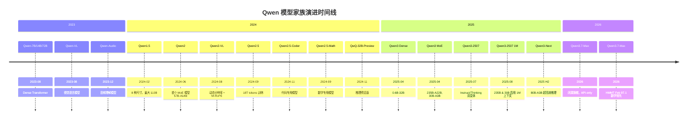
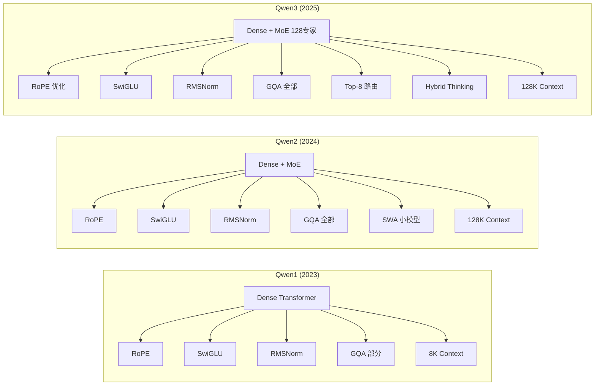
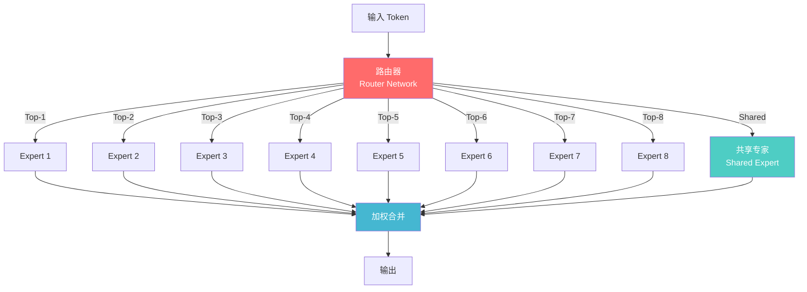
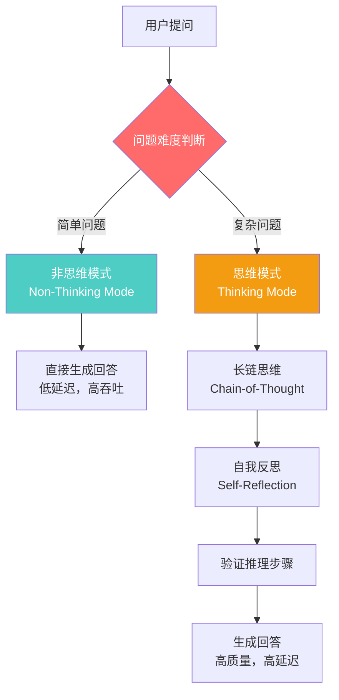
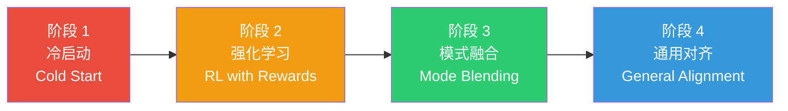
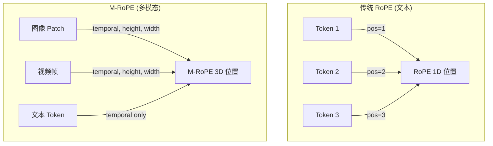
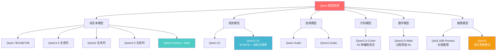
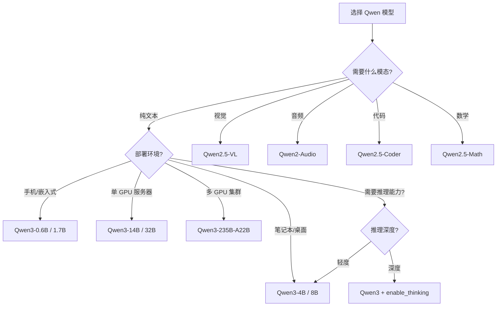

# Qwen (通义千问) 技术深度解析

> 中文简称：Qwen 技术深度解析

## 一句话理解

Qwen 就像一支"从单兵作战到集团军"的 AI 舰队——从最初的 7B 单体模型出发，用不到两年时间演化出覆盖纯文本、视觉、音频、代码、数学、推理的全模态模型家族，而 Qwen3 的"混合思维模式"相当于给每艘战舰装上了"深度思考 / 快速响应"的切换开关。

---

## 目录

1. [公司与团队概览](#一公司与团队概览)
2. [完整模型家族时间线](#二完整模型家族时间线)
3. [架构演进：从 Qwen1 到 Qwen3](#三架构演进从-qwen1-到-qwen3)
4. [核心技术创新](#四核心技术创新)
5. [多模态模型矩阵](#五多模态模型矩阵)
6. [Benchmark 对比](#六benchmark-对比)
7. [开源生态与社区](#七开源生态与社区)
8. [实战指南](#八实战指南)
9. [与其他模型系列的对比](#九与其他模型系列的对比)
10. [未来展望](#十未来展望)
11. [参考资源](#参考资源)
12. [相关文档](#相关文档)

---

## 一、公司与团队概览

### 1.1 阿里云与通义实验室

| 维度 | 详情 |
|------|------|
| **公司** | Alibaba Cloud (阿里云) |
| **团队** | 通义千问团队 (Qwen Team) |
| **负责人** | 白金泽 (Jinze Bai) |
| **总部** | 中国杭州 |
| **首次发布** | 2023 年 8 月 |
| **开源协议** | Apache 2.0 (Qwen3 系列) |
| **模型托管** | HuggingFace, ModelScope |
| **对话平台** | chat.qwen.ai (通义千问) |

### 1.2 Qwen 在 LLM 格局中的定位

Qwen 系列是中国大模型开源生态中最具影响力的项目之一。与 DeepSeek、GLM (智谱)、Yi (零一万物) 并列为中国开源 LLM 的"四大天王"。

```
全球开源 LLM 格局 (2025-2026)

┌──────────────────────────────────────────────────────┐
│                    闭源 (Closed Source)                │
│  GPT-4/5 · Claude 4 · Gemini 2.5                     │
├──────────────────────────────────────────────────────┤
│                    开源 (Open Source)                  │
│                                                      │
│  西方阵营:                  中国阵营:                   │
│  ├── Llama (Meta)         ├── Qwen (阿里) ← 本文      │
│  ├── Mistral/Mixtral      ├── DeepSeek (深度求索)      │
│  └── OLMo (AI2)           ├── GLM (智谱)              │
│                            └── Yi (零一万物)           │
└──────────────────────────────────────────────────────┘
```

### 1.3 Qwen 的核心优势

1. **全模态覆盖**: 文本、视觉、音频、代码、数学，五大方向均有专用模型
2. **全尺寸覆盖**: 从 0.5B 到 235B，覆盖手机到数据中心的全场景
3. **Apache 2.0 许可**: 商用友好的开源协议
4. **中文能力领先**: 在中文理解和生成上持续领先英文竞品
5. **推理能力突破**: Qwen3 混合思维模式匹敌 DeepSeek-R1 和 OpenAI o1

> **相关文档**: 关于 LLM 架构范式的详细介绍，参见 [LLM Architectures](../04_LLM架构/05_LLM架构.md)

---

## 二、完整模型家族时间线

### 2.1 时间线图 (Timeline)



### 2.2 模型参数演进表

| 发布时间 | 模型 | 参数规模 | 架构 | 上下文 | 训练数据 | 关键创新 |
|---------|------|---------|------|--------|---------|---------|
| 2023-08 | Qwen | 7B, 14B, 72B | Dense | 8K→32K | 3T+ tokens | RoPE, SwiGLU, RMSNorm, GQA |
| 2023-08 | Qwen-VL | 7B base | ViT + LLM | 8K | 多模态数据 | 多图交错理解，视觉定位 |
| 2023-12 | Qwen-Audio | 7B base | Whisper + LLM | 8K | 音频数据 | 语音识别，声音事件检测 |
| 2024-02 | Qwen1.5 | 0.5B-110B | Dense | 32K-128K | 扩展数据 | 多语言增强，对齐优化 |
| 2024-06 | Qwen2 | 0.5B-72B + MoE | Dense + MoE | 128K | 7T+ tokens | 首个 MoE (57B-A14B)，GQA 全覆盖 |
| 2024-08 | Qwen2-VL | 2B, 7B, 72B | ViT + M-RoPE | 128K | 多模态数据 | Naive Dynamic Resolution |
| 2024-09 | Qwen2.5 | 0.5B-72B | Dense | 128K | 18T tokens | 长上下文优化，指令跟随增强 |
| 2024-09 | Qwen2.5-Math | 1.5B, 7B, 72B | Dense | 128K | 数学数据 | 过程奖励 RL |
| 2024-11 | Qwen2.5-Coder | 0.5B-32B | Dense | 128K | 5.5T tokens | 92 种编程语言，FIM |
| 2024-11 | QwQ-32B-Preview | 32B | Dense | 128K | 推理数据 | 长链思维，自我反思 |
| 2025-04 | Qwen3 | 0.6B-32B + MoE | Dense + MoE | 32K-128K | 36T tokens | 混合思维模式，4 阶段后训练 |
| 2025-07~08 | Qwen3-2507 | 235B-A22B, 30B-A3B, 4B | MoE + Dense | **1M (235B/30B)** | — | Instruct/Thinking 双变体分离，仅思考模式 |
| 2025 H2 | Qwen3-Next | 80B-A3B | MoE | 128K | — | 超高效推理 |
| 2026 | Qwen3.7-Max | proprietary (未公开) | Hybrid Thinking MoE (闭源) | 1M (API) | — | 2026 闭源旗舰，HMMT Feb 97.1 数学领先 |

### 2.3 模型命名规则

```
Qwen[版本号]-[特化方向]-[参数规模]-[后缀]

示例:
  Qwen2.5-Coder-32B-Instruct
  │     │    │      │    │
  │     │    │      │    └── Instruct = 指令微调版
  │     │    │      └─────── 32B = 参数量
  │     │    └────────────── Coder = 代码专用
  │     └─────────────────── 2.5 = 版本号
  └───────────────────────── Qwen = 品牌名

MoE 命名:
  Qwen3-235B-A22B
  │     │     │
  │     │     └── A22B = Active 22B (激活参数)
  │     └──────── 235B = Total 235B (总参数)
  └────────────── Qwen3 = 版本号
```

---

## 三、架构演进：从 Qwen1 到 Qwen3

### 3.1 基础架构组件演进



### 3.2 Qwen1 架构细节

Qwen1 采用了标准的 Decoder-only Transformer 架构，但引入了多项现代化改进：

```python
# Qwen1 核心架构参数
class Qwen1Config:
    # 通用配置
    hidden_act = "silu"           # SwiGLU 激活函数
    max_position_embeddings = 8192  # 8K 上下文 (可扩展至 32K)
    rope_theta = 10000.0          # RoPE 基频
    use_sliding_window = False    # Qwen1 不使用滑动窗口

    # 尺寸配置
    sizes = {
        "7B":  {"hidden_size": 4096, "num_layers": 32, "num_heads": 32, "num_kv_heads": 32},
        "14B": {"hidden_size": 5120, "num_layers": 40, "num_heads": 40, "num_kv_heads": 40},
        "72B": {"hidden_size": 8192, "num_layers": 80, "num_heads": 64, "num_kv_heads": 8},
    }
```

**关键组件说明**:

| 组件 | 作用 | Qwen1 实现 |
|------|------|-----------|
| **RoPE** (Rotary Position Embedding) | 位置编码，支持长度外推 | 基频 10000，支持 NTK-aware 缩放 |
| **SwiGLU** | FFN 激活函数 | `SwiGLU(x) = Swish(xW₁) ⊙ (xW₂)` |
| **RMSNorm** | 层归一化 | 比 LayerNorm 更高效 |
| **GQA** (Grouped Query Attention) | 注意力优化 | 仅 72B 使用 (8 KV heads) |

### 3.3 Qwen2 架构升级

Qwen2 是一次全面的架构革新，引入了 MoE、全局 GQA 和滑动窗口注意力：

```python
# Qwen2 新增特性
class Qwen2Config:
    # MoE 配置 (首个 Qwen MoE 模型)
    moe_config = {
        "model": "57B-A14B",       # 总参数 57B，激活参数 14B
        "num_experts": 64,          # 64 个专家
        "num_experts_per_token": 8, # Top-8 路由
        "shared_expert": True,      # 共享专家
    }

    # Sliding Window Attention (小模型)
    sliding_window = {
        "0.5B": 1024,    # 1K 窗口
        "1.5B": 4096,    # 4K 窗口
        "7B": None,       # 全局注意力
        "72B": None,      # 全局注意力
    }

    # GQA 全尺寸覆盖
    gqa_all_sizes = True  # 所有尺寸都使用 GQA
```

**Qwen1 → Qwen2 关键变化**:

```
┌─────────────────┬───────────────────┬───────────────────┐
│     特性         │     Qwen1         │     Qwen2         │
├─────────────────┼───────────────────┼───────────────────┤
│ 架构             │ 纯 Dense          │ Dense + MoE       │
│ GQA             │ 仅 72B            │ 全部尺寸           │
│ 滑动窗口注意力    │ ✗                 │ ✓ (小模型)         │
│ 上下文           │ 8K (→32K)        │ 128K              │
│ 训练数据         │ 3T+ tokens       │ 7T+ tokens        │
│ 最大模型         │ 72B Dense        │ 57B-A14B MoE      │
│ 最小模型         │ 7B               │ 0.5B              │
└─────────────────┴───────────────────┴───────────────────┘
```

### 3.4 Qwen3 架构革命

Qwen3 是目前最强大的 Qwen 版本，引入了 128 专家 MoE 和革命性的混合思维模式：

```python
# Qwen3 架构配置
class Qwen3Config:
    # Dense 模型
    dense_models = {
        "0.6B":  {"layers": 28, "hidden": 1024, "heads": 16},
        "1.7B":  {"layers": 28, "hidden": 2048, "heads": 16},
        "4B":    {"layers": 36, "hidden": 2560, "heads": 32},
        "8B":    {"layers": 36, "hidden": 4096, "heads": 32},
        "14B":   {"layers": 40, "hidden": 5120, "heads": 40},
        "32B":   {"layers": 64, "hidden": 5120, "heads": 40},
    }

    # MoE 模型 (128 专家!)
    moe_models = {
        "30B-A3B": {
            "total_params": "30B",
            "active_params": "3B",
            "num_experts": 128,
            "top_k": 8,
            "layers": 28,
        },
        "235B-A22B": {
            "total_params": "235B",
            "active_params": "22B",
            "num_experts": 128,
            "top_k": 8,
            "layers": 64,
        },
    }

    # 训练数据
    training_tokens = "36T"       # 36 万亿 tokens
    languages = 119               # 119 种语言
```

**Qwen3 MoE 架构详解**:



**128 专家 vs DeepSeek-V3 的 256 专家**:

| 维度 | Qwen3-235B-A22B | DeepSeek-V3 (671B-A37B) |
|------|-----------------|------------------------|
| 总参数 | 235B | 671B |
| 激活参数 | 22B | 37B |
| 专家数量 | 128 | 256 |
| Top-K | 8 | 8 |
| 训练数据 | 36T tokens | 14.8T tokens |
| 许可证 | Apache 2.0 | MIT |
| 推理成本 | 较低 | 较高 |

### 3.5 Qwen3-2507 与 Qwen3.7-Max：1M 上下文开源 + 2026 闭源旗舰

继 2025 年 4 月 29 日发布的原始 Qwen3 系列之后，阿里通义千问团队在 2025 年中至 2026 年完成了两条平行的演进路线：

```
Qwen3 后续演进双轨 (2025 H2 ~ 2026)

┌─────────────────────────────────────────────────────────────┐
│  开源轨 (Open-Weight)                                          │
│  ├── 2025-04-29  Qwen3 原始系列 (Dense + MoE)                 │
│  ├── 2025-07~08  Qwen3-2507 系列 (Instruct/Thinking 双变体)    │
│  └── 2025-08-08  1M 上下文启用 (235B & 30B)                   │
│                                                               │
│  闭源轨 (Proprietary / API-only)                              │
│  └── 2026        Qwen3.7-Max 旗舰 (chat.qwen.ai / 百炼)        │
└─────────────────────────────────────────────────────────────┘
```

#### 3.5.1 Qwen3-2507 开源系列

Qwen3-2507 是 2025 年发布的开源权重迭代版本，在原始 Qwen3 的"双模式合一"基础上做了一次关键的产品形态调整：**把 Instruct (非思考) 与 Thinking (思考) 拆成两个独立模型**，各自在单一目标上做到极致。

**变体 × 规模矩阵**:

```
                Instruct-2507           Thinking-2507
                (非思考专用)             (仅思考专用)
            ┌───────────────────┬───────────────────┐
  235B-A22B │ Qwen3-Instruct-   │ Qwen3-Thinking-   │  ← MoE 旗舰
            │     235B-2507     │     235B-2507     │
            ├───────────────────┼───────────────────┤
  30B-A3B   │ Qwen3-Instruct-   │ Qwen3-Thinking-   │  ← MoE 高效
            │     30B-2507      │     30B-2507      │
            ├───────────────────┼───────────────────┤
  4B        │ Qwen3-Instruct-   │ Qwen3-Thinking-   │  ← Dense 端侧
            │     4B-2507       │     4B-2507       │
            └───────────────────┴───────────────────┘
                  ↑                       ↑
            直接生成回答            仅思考模式 (thinking-only)
            低延迟响应              更长思考链 + 更深推理
```

**Thinking-2507 的关键改进**:

| 维度 | 原始 Qwen3 (Thinking) | Qwen3-Thinking-2507 |
|------|----------------------|---------------------|
| 模式形态 | 与非思考模式共存 (混合切换) | **仅思考模式 (thinking-only)** |
| 思考深度 | 标准 | **提升推理质量与深度** |
| 思考链长度 | 标准 | **增加 thinking 长度** |
| 调用复杂度 | 需 `enable_thinking` 切换 | 默认即思考，无需切换 |
| 适用场景 | 既要快又要慢的通用场景 | 明确需要深度推理的专项场景 |

**发布时间线 (Release Timeline)**:

| 发布日期 | 模型 | 规模 | 备注 |
|---------|------|------|------|
| 2025-04-29 | 原始 Qwen3 系列 | 0.6B~235B-A22B | Dense + MoE，混合思维合一 |
| 2025-07-21 | Qwen3-Instruct-235B-2507 | 235B-A22B (MoE) | 非思考专用旗舰首发 |
| 2025-07-25 | Qwen3-Thinking-235B-2507 | 235B-A22B (MoE) | 仅思考模式旗舰 |
| 2025-07-30 | Qwen3-Instruct-30B-2507 | 30B-A3B (MoE) | 高效版 Instruct |
| 2025-07-31 | Qwen3-Thinking-30B-2507 | 30B-A3B (MoE) | 高效版 Thinking |
| 2025-08-06 | Qwen3-Instruct/Thinking-4B-2507 | 4B (Dense) | 端侧版本 |
| 2025-08-08 | 1M 上下文启用 | 235B & 30B | 235B 与 30B 尺寸解锁 1M |

> 4B 端侧尺寸未列入 1M 上下文启用范围；Instruct-2357 的长上下文理解上限为 **256K**。

#### 3.5.2 1M 上下文启用 (2025-08-08)

2025 年 8 月 8 日，Qwen 官方为 **Qwen3-235B-2507 与 Qwen3-30B-2507** (Instruct 与 Thinking 变体均适用) 启用 **1M-token 上下文窗口**，这是 Qwen 开源系列首次将上下文从 128K 级别推进到百万级。

```
Qwen 开源上下文演进:

Qwen1     (2023-08):   8K  ──────── (→32K 扩展)
Qwen1.5   (2024-02):  32K ──────────────── (→128K)
Qwen2/2.5 (2024):    128K ─────────────────────────────────
Qwen3     (2025-04): 128K ─────────────────────────────────
Qwen3-2507(2025-08): 1M  ────────────────────────────────────────────────
                          ↑ 235B & 30B 尺寸解锁
                          (4B 仍为 256K/128K 级)
```

**1M 上下文的意义**:

1. **整库代码理解**: 一次喂入一个完整的中大型代码仓库 (约 20~30 万行代码)
2. **长文档分析**: 一次性处理整本书籍、整套法律条文、完整财报季的所有文档
3. **超长对话记忆**: 万轮以上的多轮对话无需外部 RAG 即可保持连贯
4. **跨文档推理**: 在多份长文档之间做交叉引用与对比

> **相关文档**: 长上下文的技术栈 (YaRN / NTK-aware / 滑动窗口) 见本文 [§4.5 长上下文扩展](#45-长上下文扩展-long-context-scaling)。

#### 3.5.3 Qwen3.7-Max 闭源旗舰 (2026)

**定位**: Qwen3.7-Max 是 Qwen 2026 年的**闭源旗舰 (proprietary, 非 open-weight)**，仅通过 API 提供服务，入口为 **https://chat.qwen.ai** (C 端对话) 与 **阿里云百炼 (Bailian / DashScope)** 平台 (B 端 API 接入)。

```
Qwen3.7-Max 在 Qwen 生态中的位置

┌───────────────────────────────────────────────┐
│             Qwen3.7-Max (2026 闭源旗舰)          │
│  ├── 形态: proprietary / API-only               │
│  ├── 入口: chat.qwen.ai · 阿里云百炼 DashScope   │
│  ├── 架构: Qwen3 lineage 继承                    │
│  │         (Hybrid Thinking MoE，权重未公开)      │
│  └── 对标: Claude Opus 4.8 / GPT-5.5            │
│            Gemini 3.1 Pro / GLM-5.2              │
└───────────────────────────────────────────────┘
         │ 架构血统继承
         ▼
┌───────────────────────────────────────────────┐
│  Qwen3-235B-A22B-2507 (开源对照参考)            │
│  ├── 形态: open-weight (Apache 2.0)             │
│  ├── 架构: MoE 235B-A22B, 128 专家 Top-8        │
│  ├── 模式: Hybrid Thinking (enable_thinking)    │
│  └── 可作为理解 Qwen3.7-Max 架构的公开参照       │
└───────────────────────────────────────────────┘
```

**架构继承说明 (重要)**:

Qwen3.7-Max 的**具体参数规模、专家数、激活参数、训练数据量等细节均为 proprietary，官方未公开**。基于 Qwen 团队的命名血统 (Qwen3 lineage)，可以确认它继承自本文档已详述的 **Qwen3 Hybrid Thinking MoE 架构**:

- **Hybrid Thinking**: 支持 thinking / non-thinking 双模式切换 (详见 [§4.1](#41-混合思维模式-hybrid-thinking-mode))
- **MoE 路由**: 128 专家 Top-8 架构家族 (详见 [§3.4](#34-qwen3-架构革命))
- **M-RoPE / 长上下文**: 继承 Qwen2-VL 以来的位置编码与 1M 上下文能力 (详见 [§4.3](#43-m-rope-multimodal-rotary-position-embedding) / [§4.5](#45-长上下文扩展-long-context-scaling))

> **诚实声明**: 下文凡涉及 Qwen3.7-Max 的具体参数均标注 "proprietary / 未公开"。讨论架构机制时，以开源的 **Qwen3-235B-A22B-2507** 作为公开参照系。

#### 3.5.4 Qwen3.7-Max 跨厂商 Benchmark

以下数据来自官方 GLM-5.2 跨厂商对比表 (这些是真实跨厂商基准数据，Qwen3.7-Max 列作为对比参考):

| Benchmark | Qwen3.7-Max | 说明 |
|-----------|-------------|------|
| **HLE** | **41.4** | Humanity's Last Exam (无工具) |
| HLE (w/ Tools) | 53.5 | HLE 启用工具调用 |
| **AIME 2026** | **97** | 美国数学邀请赛 2026 |
| HMMT Nov. 2025 | 95 | 哈佛-MIT 数学锦标赛 11 月 |
| **HMMT Feb. 2026** | **97.1** | **数学榜首 (开源对照集最高)** |
| IMOAnswerBench | 90 | IMO 风格答题基准 |
| GPQA-Diamond | 90 | 研究生级科学问答 |
| SWE-bench Pro | 60.6 | 专业级软件工程 |
| NL2Repo | 47.2 | 自然语言→代码仓库 |
| Terminal-Bench 2.1 (Terminus-2) | 75 | 终端 Agent 任务 |
| MCP-Atlas (Public) | 76.4 | MCP 工具图谱 |
| Tool-Decathlon | — | 未提供数据 |

**Qwen3.7-Max 的领先点**:

```
数学推理 (Math Leadership)
┌──────────────────────────────────────────────┐
│  HMMT Feb. 2026:  97.1  ← Qwen3.7-Max 榜首    │
│  AIME 2026:        97                          │
│  HMMT Nov. 2025:   95                          │
│  IMOAnswerBench:   90                          │
└──────────────────────────────────────────────┘
  → 在 2025-2026 竞赛数学基准上处于第一梯队，
    HMMT Feb 2026 成绩在公开对比集中居首。

中文理解 (Chinese Understanding)
  → Qwen 一贯优势，延续 Qwen3 中文领先的定位
    (见 §6.1 中文能力对比)。

Agent / 工具调用 (Agentic)
┌──────────────────────────────────────────────┐
│  Terminal-Bench 2.1: 75                       │
│  MCP-Atlas (Public): 76.4                     │
│  SWE-bench Pro:      60.6                     │
│  NL2Repo:            47.2                     │
└──────────────────────────────────────────────┘
  → 工程类 Agent 基准进入第一梯队，
    与 GLM-5.2 / Claude Opus 4.8 同台竞争。
```

**与同级闭源旗舰的竞争定位**:

| 维度 | Qwen3.7-Max | Claude Opus 4.8 | GPT-5.5 | Gemini 3.1 Pro | GLM-5.2 |
|------|-------------|-----------------|---------|----------------|---------|
| 形态 | 闭源 API | 闭源 API | 闭源 API | 闭源 API | 闭源 API |
| 数学 (HMMT Feb 2026) | **97.1 (领先)** | 竞争力 | 竞争力 | 竞争力 | 竞争力 |
| 中文理解 | **领先** | 一般 | 一般 | 一般 | **领先** |
| 开源对照参考 | Qwen3-235B-A22B-2507 | 无 | 无 | 无 | GLM-5.2 开源版 |
| 接入入口 | chat.qwen.ai / 百炼 | Anthropic API | OpenAI API | Google API | 智谱 API |

> **相关文档**: 跨厂商基准与 GLM-5.2 的全面对比，参见 [[05_大模型/14_中国LLM生态/09_GLM_Zhipu_深入分析]] 及 [[05_大模型/14_中国LLM生态/04_Chinese_LLM_对比_矩阵]]。

#### 3.5.5 Hybrid Thinking 架构回顾

Qwen3.7-Max 与 Qwen3-2507 共用的核心架构机制已在本文档前文详述，此处仅做交叉引用:

| 机制 | 详见章节 | 要点 |
|------|---------|------|
| Hybrid Thinking Mode | [§4.1](#41-混合思维模式-hybrid-thinking-mode) | thinking/non-thinking 双模切换，`enable_thinking` 控制 |
| MoE 128 专家 Top-8 | [§3.4](#34-qwen3-架构革命) | 235B-A22B 架构详解 |
| M-RoPE 3D 位置编码 | [§4.3](#43-m-rope-multimodal-rotary-position-embedding) | (t, h, w) 多模态位置分解 |
| 长上下文 (1M) | [§4.5](#45-长上下文扩展-long-context-scaling) | YaRN / NTK-aware / 滑动窗口 |
| 4 阶段后训练 | [§4.2](#42-qwen3-四阶段后训练-post-training) | 冷启动→RL→模式融合→对齐 |

> Qwen3-2507 的 Thinking 变体把混合思维中的"思考"模式独立出来并加长思考链；Qwen3.7-Max 在闭源侧延续 Hybrid Thinking 的双模式 API 设计 (`enable_thinking` / `reasoning.effort`，详见本文末尾"Qwen 3.7 系列最新更新")。

#### 3.5.6 部署矩阵：开源 Qwen3-2507 vs 闭源 Qwen3.7-Max

**A. 开源 Qwen3-2507 自托管部署 (1M 上下文)**

```bash
# SGLang 部署 Qwen3-Thinking-2507 (1M 上下文)
python -m sglang.launch_server \
    --model-path Qwen/Qwen3-Thinking-235B-2507 \
    --tp 8 \
    --context-length 262144 \
    --reasoning-parser deepseek-r1 \
    --port 30000
# 注: --context-length 262144 为 256K 启用; 1M 需相应调整与显存预算

# vLLM 部署 Qwen3-Thinking-2507 (启用推理解析)
vllm serve Qwen/Qwen3-Thinking-235B-2507 \
    --tensor-parallel-size 8 \
    --max-model-len 1048576 \
    --enable-reasoning \
    --reasoning-parser deepseek_r1 \
    --port 8000
```

```bash
# Qwen3-Instruct-2507 (非思考版) 部署
vllm serve Qwen/Qwen3-Instruct-235B-2507 \
    --tensor-parallel-size 8 \
    --max-model-len 1048576 \
    --port 8000
# 注: Instruct 版不需要 --enable-reasoning / reasoning-parser
```

**部署要点**:

| 参数 | Thinking-2507 | Instruct-2507 |
|------|---------------|---------------|
| `--context-length` (SGLang) | 262144+ | 262144+ |
| `--reasoning-parser` (SGLang) | `deepseek-r1` | 不需要 |
| `--enable-reasoning` (vLLM) | 是 | 否 |
| `--reasoning-parser` (vLLM) | `deepseek_r1` | 不需要 |
| 1M 上下文显存参考 | 235B 需多卡 / 卸载 | 同左 |

**B. 闭源 Qwen3.7-Max API 接入**

Qwen3.7-Max 为 API-only，不可自托管，接入入口:

| 入口 | 地址 | 适用场景 |
|------|------|---------|
| **chat.qwen.ai** | https://chat.qwen.ai | C 端网页对话体验 |
| **阿里云百炼 (Bailian)** | https://bailian.console.aliyun.com | B 端 API / DashScope 兼容模式 |

```python
# 通过阿里云百炼 (DashScope) OpenAI 兼容模式调用 Qwen3.7-Max
from openai import OpenAI

client = OpenAI(
    base_url="https://dashscope.aliyuncs.com/compatible-mode/v1",
    api_key="your-bailian-api-key"
)

response = client.chat.completions.create(
    model="qwen3.7-max",                # 闭源旗舰
    messages=[
        {"role": "user", "content": "证明 √2 是无理数"}
    ],
    extra_body={
        "enable_thinking": True,         # Hybrid Thinking 启用
        "thinking_budget": 16384         # 思维预算
    }
)
# API 用法详见本文末尾 "Qwen 3.7 系列最新更新" 章节
```

> **相关文档**: 关于 MoE 路由策略和负载均衡的深入分析，参见 [MoE Case Studies](../04_LLM架构/12_MoE_Case_Studies_DeepSeek_Mixtral.md)

---

## 四、核心技术创新

### 4.1 混合思维模式 (Hybrid Thinking Mode)

这是 Qwen3 最具革命性的创新。传统模型要么"快思考"（直接回答），要么"慢思考"（Chain-of-Thought），而 Qwen3 可以在两者之间动态切换。



**混合思维模式的工作原理**:

```
┌─────────────────────────────────────────────────┐
│              Hybrid Thinking Mode                │
│                                                 │
│  ┌──────────────────┐  ┌──────────────────┐     │
│  │  Thinking Mode   │  │ Non-Thinking Mode │     │
│  │  (思维模式)       │  │  (非思维模式)      │     │
│  │                  │  │                   │     │
│  │ • 逐步推理       │  │ • 直接生成回答     │     │
│  │ • 自我验证       │  │ • 低延迟响应      │     │
│  │ • 回溯修正       │  │ • 适合简单任务    │     │
│  │ • 复杂数学/代码  │  │ • 日常对话/翻译    │     │
│  └──────────────────┘  └──────────────────┘     │
│                                                 │
│  控制方式:                                       │
│  1. 系统参数 (enable_thinking=True/False)       │
│  2. 对话触发 (/think, /no_think)               │
│  3. 模型自动判断 (基于问题复杂度)                 │
└─────────────────────────────────────────────────┘
```

**实际使用示例**:

```python
from transformers import AutoModelForCausalLM, AutoTokenizer

model = AutoModelForCausalLM.from_pretrained("Qwen/Qwen3-235B-A22B")
tokenizer = AutoTokenizer.from_pretrained("Qwen/Qwen3-235B-A22B")

# 方式 1: 思维模式 (复杂推理)
messages_thinking = [
    {"role": "user", "content": "证明 √2 是无理数"}
]
response = model.chat(
    messages_thinking,
    enable_thinking=True  # 启用深度思考
)
# 输出包含 <think>...</think> 标签中的推理过程

# 方式 2: 非思维模式 (快速响应)
messages_fast = [
    {"role": "user", "content": "今天天气怎么样？"}
]
response = model.chat(
    messages_fast,
    enable_thinking=False  # 关闭思考，直接回答
)

# 方式 3: 混合模式 (模型自动判断)
messages_auto = [
    {"role": "user", "content": "/think 请分析这段代码的时间复杂度"}
]
response = model.chat(messages_auto)  # 自动进入思维模式
```

**思维模式的输出格式**:

```xml
<think>
让我分析这个数学问题...

已知条件:
1. 函数 f(x) = x³ - 3x + 1
2. 需要求极值点

步骤 1: 求导数
f'(x) = 3x² - 3

步骤 2: 令 f'(x) = 0
3x² - 3 = 0
x² = 1
x = ±1

验证:
f''(x) = 6x
f''(1) = 6 > 0 → 极小值
f''(-1) = -6 < 0 → 极大值
</think>

函数 f(x) = x³ - 3x + 1 的极值点为：
- x = -1 处取极大值 f(-1) = 3
- x = 1 处取极小值 f(1) = -1
```

**混合思维 vs 竞品对比**:

| 特性 | Qwen3 | DeepSeek-R1 | OpenAI o1/o3 |
|------|-------|-------------|--------------|
| 思维模式切换 | ✓ 手动 + 自动 | ✓ 始终开启 | ✗ 始终开启 |
| 思维过程可见 | ✓ `<think>` 标签 | ✓ 透明展示 | ✗ 隐藏 |
| 非思维模式 | ✓ 支持 | ✗ 不支持 | ✗ 不支持 |
| 思维预算控制 | ✓ 精细控制 | ✗ 自动 | ✗ 自动 |
| 延迟优化 | ✓ 按需切换 | ✗ 固定高延迟 | ✗ 固定高延迟 |

### 4.2 Qwen3 四阶段后训练 (Post-Training)

Qwen3 的后训练分为四个精心设计的阶段，这是其能够达到 SOTA 性能的关键：



**阶段详解**:

```
┌─────────────────────────────────────────────────────────────────┐
│                  Qwen3 四阶段后训练流程                           │
├─────────────────────────────────────────────────────────────────┤
│                                                                 │
│  阶段 1: 冷启动 (Cold Start)                                    │
│  ┌─────────────────────────────────────────────────┐            │
│  │ • 使用长推理轨迹 (long reasoning traces) 做 SFT   │            │
│  │ • 数据源: 人工标注 + 规则生成 + 模型生成筛选        │            │
│  │ • 目标: 让模型学会基本的推理格式和结构               │            │
│  │ • 类比: 教学生"解题步骤的标准格式"                  │            │
│  └─────────────────────────────────────────────────┘            │
│                          ↓                                      │
│  阶段 2: 强化学习 (RL with Verifiable Rewards)                  │
│  ┌─────────────────────────────────────────────────┐            │
│  │ • 使用可验证奖励 (数学答案对错，代码能否通过测试)    │            │
│  │ • 算法: GRPO / 类似的组相对策略优化                 │            │
│  │ • 目标: 提升推理质量，让模型学会"正确的思维方式"      │            │
│  │ • 类比: 通过大量做题和批改来提高解题能力              │            │
│  └─────────────────────────────────────────────────┘            │
│                          ↓                                      │
│  阶段 3: 模式融合 (Mode Blending)                                │
│  ┌─────────────────────────────────────────────────┐            │
│  │ • 融合思维模式和非思维模式                          │            │
│  │ • 让模型学会"什么时候该深入思考，什么时候快速回答"    │            │
│  │ • 目标: 实现混合思维模式的无缝切换                   │            │
│  │ • 类比: 训练学生根据题目难度决定"口算还是写步骤"      │            │
│  └─────────────────────────────────────────────────┘            │
│                          ↓                                      │
│  阶段 4: 通用对齐 (General Instruction Following + Agentic)      │
│  ┌─────────────────────────────────────────────────┐            │
│  │ • 通用指令跟随微调                                 │            │
│  │ • Agent 能力训练 (工具调用、多轮对话、规划)          │            │
│  │ • 安全性对齐                                      │            │
│  │ • 目标: 让模型成为一个"全能助手"                    │            │
│  │ • 类比: 培养学生的综合能力和沟通技巧                 │            │
│  └─────────────────────────────────────────────────┘            │
│                                                                 │
└─────────────────────────────────────────────────────────────────┘
```

**与 DeepSeek-R1 训练流程的对比**:

| 阶段 | Qwen3 | DeepSeek-R1 |
|------|-------|-------------|
| 冷启动 | 长推理轨迹 SFT | 少量高质量冷启动数据 |
| RL 算法 | 可验证奖励 RL | GRPO (组相对策略优化) |
| 模式融合 | 思维 + 非思维融合 | 无（始终思维模式） |
| 通用对齐 | 指令跟随 + Agent + 安全 | 拒绝采样 + 通用 RL |
| 训练数据规模 | 36T tokens (预训练) | 14.8T tokens (预训练) |

### 4.3 M-RoPE (Multimodal Rotary Position Embedding)

M-RoPE 是 Qwen2-VL 引入的关键创新，它将传统的 RoPE 位置编码扩展到多模态场景：



**M-RoPE 的位置分解**:

```
传统 RoPE:
  position = (p,)     → 1 维位置向量

M-RoPE:
  position = (t, h, w) → 3 维位置向量
  ├── t: temporal (时间维度) - 视频帧序号 / 文本序列位置
  ├── h: height (高度维度)   - 图像 patch 的行位置
  └── w: width (宽度维度)    - 图像 patch 的列位置

示例 - 一段包含文本和图像的输入:

  [文本: "这是一只"] [图片: cat.jpg] [文本: "猫"]

  位置编码:
  文: t=1,h=0,w=0  t=2,h=0,w=0  t=3,h=0,w=0
  图: t=4,h=1,w=1  t=4,h=1,w=2  t=4,h=2,w=1  t=4,h=2,w=2 ...
  文: t=5,h=0,w=0  t=6,h=0,w=0
```

```python
# M-RoPE 核心实现思路
def apply_m_rope(q, k, positions):
    """
    positions: (batch, seq_len, 3) - 每个 token 的 (t, h, w) 位置
    """
    # 将 RoPE 的频率维度分成 3 组
    dim = q.shape[-1]
    dim_t = dim // 3       # 时间维度
    dim_h = dim // 3       # 高度维度
    dim_w = dim - 2*dim_t  # 宽度维度 (余数)

    # 分别计算各维度的旋转位置编码
    cos_t, sin_t = rope_frequencies(positions[:, :, 0], dim_t)
    cos_h, sin_h = rope_frequencies(positions[:, :, 1], dim_h)
    cos_w, sin_w = rope_frequencies(positions[:, :, 2], dim_w)

    # 拼接并应用到 q, k
    cos = concat(cos_t, cos_h, cos_w)
    sin = concat(sin_t, sin_h, sin_w)

    q_rotated = q * cos + rotate_half(q) * sin
    k_rotated = k * cos + rotate_half(k) * sin

    return q_rotated, k_rotated
```

### 4.4 Naive Dynamic Resolution (朴素动态分辨率)

Qwen2-VL 的动态分辨率处理是视觉理解的重要突破。传统方法将图像强制缩放到固定尺寸（如 224×224），而 Qwen2-VL 保留了原始分辨率：

```
传统方法 (固定分辨率):
┌──────────────┐     resize     ┌──────────┐
│  1920×1080   │  ──────────→   │ 224×224  │  ← 细节丢失!
│  原始图像     │                │ 正方形    │
└──────────────┘                └──────────┘

Qwen2-VL (动态分辨率):
┌──────────────┐     patchify    ┌──────────┐
│  1920×1080   │  ──────────→   │ 动态切分  │  ← 保留细节!
│  原始图像     │   (按原始比例)  │ 保持比例  │
└──────────────┘                └──────────┘
```

**动态分辨率处理流程**:


```python
# 动态分辨率 Patchify 伪代码
def naive_dynamic_resolution(image, patch_size=14, min_pixels=256, max_pixels=1280*28*28):
    """
    根据图像原始尺寸和长宽比动态计算 patch 网格
    """
    width, height = image.size
    aspect_ratio = width / height

    # 计算总 patch 数 (限制在 min_pixels 和 max_pixels 之间)
    total_pixels = width * height
    total_pixels = clamp(total_pixels, min_pixels, max_pixels)

    # 根据长宽比计算 patch 网格
    num_patches = total_pixels // (patch_size * patch_size)
    grid_w = round(sqrt(num_patches * aspect_ratio))
    grid_h = round(grid_w / aspect_ratio)

    # 确保是 2 的倍数 (为了后续 2×2 合并)
    grid_w = make_divisible(grid_w, 2)
    grid_h = make_divisible(grid_h, 2)

    # 调整图像尺寸
    new_w = grid_w * patch_size
    new_h = grid_h * patch_size
    image_resized = image.resize((new_w, new_h))

    return image_resized, grid_w, grid_h
```

### 4.5 长上下文扩展 (Long Context Scaling)

Qwen 系列在上下文长度上持续突破：

```
上下文长度演进:

Qwen1    (2023-08):  8K   ━━
Qwen1    (扩展版):   32K  ━━━━━━━━
Qwen1.5  (2024-02):  32K-128K ━━━━━━━━━━━━━━━━━━━━━━━━━━━━━━━━
Qwen2    (2024-06):  128K ━━━━━━━━━━━━━━━━━━━━━━━━━━━━━━━━
Qwen2.5  (2024-09):  128K ━━━━━━━━━━━━━━━━━━━━━━━━━━━━━━━━
Qwen3    (2025-04):  32K-128K ━━━━━━━━━━━━━━━━━━━━━━━━━━━━━━━━
```

**长上下文技术栈**:

| 技术 | 作用 | 使用版本 |
|------|------|---------|
| **YaRN** (Yet another RoPE extensioN) | 位置插值，扩展上下文长度 | Qwen1.5+ |
| **NTK-aware Scaling** | 动态调整 RoPE 基频 | Qwen1+ |
| **Sliding Window Attention** | 局部注意力，降低长序列计算量 | Qwen2+ (小模型) |
| **稀疏注意力** | 降低长序列的注意力复杂度 | Qwen3 |

> **相关文档**: 关于多模态位置编码和视觉-语言融合的详细分析，参见 [Multimodal Architectures 2026](../09_多模态模型/06_多模态_架构_2026.md)

---

## 五、多模态模型矩阵

### 5.1 模型矩阵总览



### 5.2 Qwen-VL 系列

**Qwen-VL (2023)**:

```
架构: ViT Encoder + Cross-Attention Adapter + Qwen LLM

┌──────────┐     ┌──────────────┐     ┌──────────┐
│  图像输入  │ ──→ │ ViT Encoder  │ ──→ │ Cross    │ ──→ ┌──────────┐
│          │     │ (视觉编码)    │     │ Attention│     │ Qwen LLM │
└──────────┘     └──────────────┘     │ Adapter  │     │ (语言模型) │
                                      └──────────┘     └──────────┘
┌──────────┐                                              │
│  文本输入  │ ──────────────────────────────────────────→ │
└──────────┘                                              ▼
                                                     文本输出
```

**Qwen2-VL (2024) 升级**:

| 特性 | Qwen-VL | Qwen2-VL |
|------|---------|----------|
| 分辨率处理 | 固定分辨率 | 动态分辨率 (Naive Dynamic Resolution) |
| 位置编码 | 标准 RoPE | M-RoPE (3D 位置编码) |
| 视频理解 | ✗ | ✓ (支持 20 分钟以上视频) |
| 文档理解 | 基础 OCR | 深度文档解析 |
| 参数规模 | 7B | 2B, 7B, 72B |
| Agent 能力 | ✗ | ✓ (手机/电脑操作) |

### 5.3 Qwen-Audio 系列

```
Qwen-Audio 架构:

┌──────────┐     ┌──────────────┐     ┌──────────┐
│  音频输入  │ ──→ │ Whisper      │ ──→ │ 投影层    │ ──→ ┌──────────┐
│ (语音/音效)│     │ Encoder      │     │          │     │ Qwen LLM │
└──────────┘     │ (音频编码)    │     └──────────┘     └──────────┘
                 └──────────────┘
```

**支持的音频任务**:

| 任务 | 描述 | 示例 |
|------|------|------|
| 语音识别 (ASR) | 语音转文字 | "请转录这段会议录音" |
| 音频分析 | 分析音频内容 | "这段音乐是什么风格？" |
| 声音事件检测 | 识别环境声音 | "这是什么动物的叫声？" |
| 语音理解 | 理解语音含义 | "说话人的情绪是什么？" |
| 音频定位 | 定位音频片段 | "鼓声出现在什么时候？" |

### 5.4 Qwen2.5-Coder

代码专用模型，在 5.5T tokens 的代码数据上训练：

```python
# Qwen2.5-Coder 核心特性

features = {
    "languages": 92,  # 支持 92 种编程语言
    "top_languages": [
        "Python", "JavaScript", "Java", "C++", "TypeScript",
        "Go", "Rust", "C#", "PHP", "Ruby"
    ],

    # Fill-in-the-Middle (FIM) 代码补全
    "fim_example": {
        "prefix": "def fibonacci(n):\n    if n <= 1:\n        return n",
        "suffix": "    return fibonacci(n-1) + fibonacci(n-2)",
        "middle": "    # 递归计算斐波那契数列",  # 模型自动填充
    },

    # 代码长上下文
    "context": "128K tokens ≈ 约 3000 行代码",

    # 代码任务
    "tasks": [
        "代码生成 (Code Generation)",
        "代码补全 (Code Completion)",
        "代码调试 (Debugging)",
        "代码解释 (Code Explanation)",
        "代码重构 (Refactoring)",
        "单元测试生成 (Test Generation)",
    ]
}
```

**代码 Benchmark 对比**:

| 模型 | HumanEval | MBPP | MultiPL-E |
|------|-----------|------|-----------|
| Qwen2.5-Coder-32B | **92.7** | **90.2** | **75.4** |
| Qwen2.5-Coder-7B | 88.4 | 83.5 | 68.9 |
| DeepSeek-Coder-V2 | 90.2 | 87.8 | 72.1 |
| CodeLlama-70B | 80.5 | 78.2 | 63.5 |
| GPT-4 | 92.1 | 89.5 | 74.8 |

### 5.5 Qwen2.5-Math

数学专用模型，使用过程奖励 RL (Process Reward Model) 训练：

```
Qwen2.5-Math 训练流程:

1. 数学数据预训练
   ├── 教科书、论文、习题集
   ├── 数学论坛 (MathOverflow, StackExchange)
   └── 竞赛题目 (AMC, AIME, IMO)

2. 数学 SFT
   ├── 详细的解题步骤
   ├── 多种解法对比
   └── 错误分析与验证

3. 过程奖励 RL (Process Reward Model)
   ├── 对每一步推理给予奖励
   ├── 不仅看最终答案，还看推理过程
   └── 鼓励"正确的思维方式"
```

**与结果奖励 (Outcome Reward) 的区别**:

```
结果奖励 (Outcome Reward):
  问题: 求 ∫₀¹ x² dx
  模型输出: "... = 1/3"
  奖励: ✓ 正确 → +1

过程奖励 (Process Reward):
  问题: 求 ∫₀¹ x² dx
  模型输出:
    Step 1: 原函数 F(x) = x³/3    → ✓ 正确 +0.3
    Step 2: F(1) = 1/3             → ✓ 正确 +0.3
    Step 3: F(0) = 0               → ✓ 正确 +0.2
    Step 4: F(1) - F(0) = 1/3      → ✓ 正确 +0.2
  总奖励: +1.0 (过程完整，逻辑清晰)

即使最终答案错误，正确的中间步骤也能获得奖励
→ 鼓励模型展示完整的推理过程
```

### 5.6 QwQ-32B-Preview (推理模型)

QwQ (Qwen with Questions) 是 Qwen 系列的推理先锋：

```
QwQ-32B-Preview 特性:
├── 参数: 32B Dense
├── 架构: 扩展思维 + 自我反思
├── 创新: 长链思维推理 (Long Chain-of-Thought)
├── 特点:
│   ├── 自我验证 (Self-Verification)
│   │   └── 推理完成后检查答案是否合理
│   ├── 回溯修正 (Backtracking)
│   │   └── 发现错误时回溯重新推理
│   └── 多路径探索 (Multi-Path Exploration)
│       └── 尝试多种解题思路
└── 定位: Qwen3 混合思维模式的前驱
```

> **相关文档**: 关于推理模型的全面介绍，参见 [Reasoning Models for Dummy](../08_推理模型/README.md)

---

## 六、Benchmark 对比

### 6.1 Qwen3-235B-A22B vs 竞品

| Benchmark | Qwen3-235B-A22B | DeepSeek-R1 | OpenAI o1 | o3-mini | Grok-3 | Gemini 2.5 Pro |
|-----------|-----------------|-------------|-----------|---------|--------|----------------|
| **MMLU** | ~88 | ~88 | ~87 | ~86 | ~87 | ~88 |
| **AIME 2025** | 强 | 强 | 强 | 中 | 强 | 强 |
| **HumanEval** | 竞争力 | 竞争力 | 强 | 中 | 竞争力 | 竞争力 |
| **MATH-500** | 接近 SOTA | SOTA | 强 | 中 | 强 | 强 |
| **GPQA Diamond** | 强 | 强 | 强 | 中 | 强 | 强 |
| **中文能力** | **领先** | 强 | 中 | 中 | 中 | 中 |

### 6.2 Qwen3 尺寸 vs 性能矩阵

```
性能 (综合 Benchmark)
  ▲
  │                                          ★ Qwen3-235B-A22B (MoE)
  │                                     ★ Qwen3-32B
  │                                ★ Qwen3-14B
  │                           ★ Qwen3-8B
  │                      ★ Qwen3-4B
  │                 ★ Qwen3-1.7B
  │            ★ Qwen3-0.6B
  │
  │  特殊: ★ Qwen3-30B-A3B (MoE) ≈ Qwen3-14B 性能, 3B 激活
  │         ★ Qwen3-4B Dense ≈ Qwen2.5-72B-Instruct 性能!
  └──────────────────────────────────────────────→ 参数量
```

### 6.3 Qwen3 小模型 vs 上一代大模型

| 对比 | 新小模型 | 上一代大模型 | 结论 |
|------|---------|------------|------|
| Qwen3-4B vs Qwen2.5-72B-Instruct | 4B Dense | 72B Dense | **4B 性能匹配 72B** |
| Qwen3-30B-A3B vs QwQ-32B | 30B-A3B MoE | 32B Dense | **MoE 超越 Dense，激活参数仅 3B** |
| Qwen3-8B vs Qwen2.5-14B | 8B Dense | 14B Dense | 8B 接近 14B 性能 |

### 6.4 多语言能力对比 (119 种语言)

Qwen3 在 119 种语言和方言上进行了训练，是多语言能力最强的开源模型之一：

```
Qwen3 语言覆盖:
├── 主要语言 (Top-10): 英语, 中文, 西班牙语, 法语, 阿拉伯语,
│                     俄语, 葡萄牙语, 德语, 日语, 韩语
├── 亚洲语言: 泰语, 越南语, 印尼语, 马来语, 菲律宾语, 印地语 ...
├── 欧洲语言: 意大利语, 荷兰语, 波兰语, 捷克语, 瑞典语 ...
├── 中东语言: 阿拉伯语, 波斯语, 希伯来语, 土耳其语 ...
├── 非洲语言: 斯瓦希里语, 约鲁巴语, 豪萨语 ...
└── 总计: 119 种语言和方言
```

### 6.5 推理模式 Benchmark 对比

在启用思维模式 (Thinking Mode) 下的数学和推理能力对比：

| 模型 | AIME 2024 | AIME 2025 | MATH-500 | GPQA Diamond |
|------|-----------|-----------|----------|-------------|
| Qwen3-235B-A22B (thinking) | **强** | **强** | **接近 SOTA** | **强** |
| Qwen3-32B (thinking) | 强 | 中+ | 强 | 中+ |
| Qwen3-30B-A3B (thinking) | 中+ | 中 | 中+ | 中 |
| DeepSeek-R1 (671B-A37B) | SOTA | SOTA | SOTA | SOTA |
| OpenAI o1 | 强 | 强 | 强 | 强 |
| OpenAI o3-mini | 中+ | 中 | 中+ | 中 |

### 6.6 Qwen3.7-Max 与 Qwen3-2507 跨厂商基准 (2026)

本节补充 2025-2026 年最新两代 (Qwen3-2507 开源系列与 Qwen3.7-Max 闭源旗舰) 的跨厂商基准。数据来源为官方 GLM-5.2 跨厂商对比表 (真实跨厂商基准)。

**Qwen3.7-Max 闭源旗舰 (2026)**:

| Benchmark | Qwen3.7-Max | 类别 |
|-----------|-------------|------|
| HLE | 41.4 | 综合推理 (无工具) |
| HLE (w/ Tools) | 53.5 | 综合推理 (启用工具) |
| AIME 2026 | 97 | 竞赛数学 |
| HMMT Nov. 2025 | 95 | 竞赛数学 |
| **HMMT Feb. 2026** | **97.1** | **竞赛数学 — 公开对比集榜首** |
| IMOAnswerBench | 90 | IMO 风格数学 |
| GPQA-Diamond | 90 | 研究生级科学问答 |
| SWE-bench Pro | 60.6 | 软件工程 Agent |
| NL2Repo | 47.2 | 自然语言→代码仓库 |
| Terminal-Bench 2.1 (Terminus-2) | 75 | 终端 Agent |
| MCP-Atlas (Public) | 76.4 | MCP 工具图谱 |
| Tool-Decathlon | — | 未提供数据 |

**Qwen3.7-Max 领先领域解读**:

```
竞赛数学第一梯队 (Competition Math)
  HMMT Feb. 2026:  97.1 ★ Qwen3.7-Max 在公开对比集中居首
  AIME 2026:        97
  HMMT Nov. 2025:   95
  IMOAnswerBench:   90
  → 数学是 Qwen3.7-Max 最突出的能力维度

Agent / 工程类
  MCP-Atlas (Public):       76.4
  Terminal-Bench 2.1:       75
  SWE-bench Pro:            60.6
  NL2Repo:                  47.2
  → 进入第一梯队, 与 GLM-5.2 / Claude Opus 4.8 同台
```

**Qwen3-2507 开源系列**:

Qwen3-2507 作为开源对照参考，其架构骨干 (Qwen3-235B-A22B-2507) 在原始 Qwen3 已有的强数学 / 强中文基础上进一步加深思考链 (Thinking 变体)。具体的跨厂商基准分数以官方 README (https://github.com/QwenLM/Qwen3) 为准；本节不杜撰开源版的具体数字，强调其作为 **Qwen3.7-Max 闭源旗舰的公开架构参照系** 这一角色。

> **定位小结**: Qwen3.7-Max 在 HMMT Feb 2026 (97.1) 上领先，数学与中文是 Qwen 旗舰的标志能力；Qwen3-2507 则把这套 Hybrid Thinking MoE 架构以 open-weight 形式提供给社区自托管。

---

## 七、开源生态与社区

### 7.1 开源模型分布

```
Qwen 开源模型托管:

HuggingFace (huggingface.co/Qwen)
├── Qwen3-235B-A22B          # MoE 旗舰
├── Qwen3-30B-A3B            # MoE 高效
├── Qwen3-32B                # Dense 大模型
├── Qwen3-14B                # Dense 中等
├── Qwen3-8B                 # Dense 小型
├── Qwen3-4B                 # Dense 轻量
├── Qwen3-1.7B               # Dense 超轻量
├── Qwen3-0.6B               # Dense 端侧
├── Qwen2.5-VL-72B           # 视觉语言
├── Qwen2.5-Coder-32B        # 代码专用
├── Qwen2.5-Math-72B         # 数学专用
├── QwQ-32B-Preview          # 推理预览
└── ... (各种尺寸和变体)

ModelScope (modelscope.cn/organization/qwen)
└── 与 HuggingFace 同步发布

GGUF 量化版本
├── Q4_K_M (4-bit 量化)
├── Q5_K_M (5-bit 量化)
├── Q8_0 (8-bit 量化)
└── FP16 (半精度)
```

### 7.2 许可证演进

| 版本 | 许可证 | 商用限制 |
|------|--------|---------|
| Qwen (2023) | Qwen License (自定义) | 月活 >1 亿需申请 |
| Qwen1.5 | Qwen License | 月活 >1 亿需申请 |
| Qwen2 | Apache 2.0 (部分) | 大模型仍有条件 |
| Qwen2.5 | Apache 2.0 | 无限制 |
| Qwen3 | Apache 2.0 | **无限制** |

### 7.3 社区微调生态

```
Qwen 社区微调生态:

├── 通用微调
│   ├── OpenHermes-Qwen (通用指令微调)
│   ├── Dolphin-Qwen (无审查版本)
│   └── Qwen-Instruct 社区版
│
├── 垂直领域
│   ├── Medical-Qwen (医疗)
│   ├── Legal-Qwen (法律)
│   ├── Finance-Qwen (金融)
│   └── Edu-Qwen (教育)
│
├── 量化版本
│   ├── Qwen-GPTQ (GPU 量化)
│   ├── Qwen-AWQ (Activation-aware 量化)
│   ├── Qwen-GGUF (llama.cpp 格式)
│   └── Qwen-EXL2 (ExLlamaV2 格式)
│
└── 框架适配
    ├── vLLM 部署
    ├── Ollama 本地运行
    ├── llama.cpp 推理
    ├── TGI (Text Generation Inference)
    └── SGLang 推理
```

### 7.4 Qwen-Agent 框架

Qwen 官方提供了 Agent 开发框架：

```python
# Qwen-Agent 框架示例
from qwen_agent.agents import Assistant

# 创建 Agent
bot = Assistant(
    llm={
        "model": "Qwen3-235B-A22B",
        "model_server": "https://your-api-endpoint",
    },
    function_list=[
        "code_interpreter",     # 代码执行
        "image_gen",            # 图像生成
        "retrieval",            # 文档检索
    ],
    system_message="你是一个全能助手。",
)

# 多轮对话
messages = [
    {"role": "user", "content": "帮我分析这份 CSV 数据并画图"}
]
for response in bot.run(messages):
    print(response)
```

### 7.5 部署方案

| 部署方式 | 适用场景 | 最低 GPU | 延迟 |
|---------|---------|---------|------|
| **Ollama** | 本地开发 | 8GB (4B 模型) | 中 |
| **vLLM** | 生产 API | 24GB+ (7B+) | 低 |
| **llama.cpp** | CPU/边缘设备 | 无 GPU 也可 | 高 |
| **TGI** | 大规模部署 | 24GB+ | 低 |
| **SGLang** | 高并发 | 24GB+ | 极低 |
| **MLC-LLM** | 移动端 | NPU | 中 |

**vLLM 部署示例**:

```bash
# 启动 Qwen3-8B 推理服务
python -m vllm.entrypoints.openai.api_server \
    --model Qwen/Qwen3-8B \
    --tensor-parallel-size 1 \
    --max-model-len 131072 \
    --enable-auto-tool-choice \
    --trust-remote-code \
    --port 8000

# 测试 API
curl http://localhost:8000/v1/chat/completions \
    -H "Content-Type: application/json" \
    -d '{
        "model": "Qwen3-8B",
        "messages": [
            {"role": "user", "content": "解释量子纠缠的原理"}
        ],
        "temperature": 0.7,
        "max_tokens": 2048
    }'
```

**Ollama 本地部署**:

```bash
# 安装 Ollama
curl -fsSL https://ollama.com/install.sh | sh

# 运行 Qwen3 (各种尺寸)
ollama run qwen3:8b          # 8B 模型 (~5GB)
ollama run qwen3:14b         # 14B 模型 (~9GB)
ollama run qwen3:32b         # 32B 模型 (~20GB)

# 使用混合思维模式
>>> /think 证明素数有无穷多个
```

### 7.6 Qwen3-2507 (1M 上下文) 与 Qwen3.7-Max 部署

**A. Qwen3-2507 开源自托管 (1M 上下文)**

Qwen3-2507 支持 **SGLang** 与 **vLLM** 两种主流推理后端，关键差异在于推理解析 (reasoning parser) 的配置:

```bash
# SGLang 部署 Qwen3-Thinking-2507 (启用 1M 上下文 + 推理解析)
python -m sglang.launch_server \
    --model-path Qwen/Qwen3-Thinking-235B-2507 \
    --tp 8 \
    --context-length 262144 \
    --reasoning-parser deepseek-r1 \
    --port 30000
# --context-length 262144 为 256K; 全量 1M (1048576) 需匹配显存预算
# --reasoning-parser deepseek-r1 解析 <think>...</think> 思考链

# vLLM 部署 Qwen3-Thinking-2507
vllm serve Qwen/Qwen3-Thinking-235B-2507 \
    --tensor-parallel-size 8 \
    --max-model-len 1048576 \
    --enable-reasoning \
    --reasoning-parser deepseek_r1 \
    --port 8000
# 注: vLLM 的 parser 名称为 deepseek_r1 (下划线), SGLang 为 deepseek-r1 (连字符)
```

```bash
# Qwen3-Instruct-2507 (非思考版) — 不需要 reasoning parser
vllm serve Qwen/Qwen3-Instruct-235B-2507 \
    --tensor-parallel-size 8 \
    --max-model-len 1048576 \
    --port 8000
```

**Qwen3-2507 部署参数对照**:

| 参数 | Thinking-2507 | Instruct-2507 |
|------|---------------|---------------|
| SGLang `--context-length` | 262144 / 1048576 | 262144 / 1048576 |
| SGLang `--reasoning-parser` | `deepseek-r1` | 不需要 |
| vLLM `--enable-reasoning` | 是 | 否 |
| vLLM `--reasoning-parser` | `deepseek_r1` | 不需要 |
| 1M 上下文支持 | 235B & 30B | 235B & 30B |

> 4B 端侧尺寸不启用 1M; Instruct-2357 长上下文理解上限为 256K。

**B. Qwen3.7-Max 闭源 API 接入**

Qwen3.7-Max 为 **API-only 闭源旗舰**，不可自托管，通过以下入口接入:

| 入口 | 地址 | 场景 |
|------|------|------|
| chat.qwen.ai | https://chat.qwen.ai | C 端网页对话 |
| 阿里云百炼 (Bailian / DashScope) | https://bailian.console.aliyun.com | B 端 API 接入 |

```python
# 阿里云百炼 OpenAI 兼容模式调用 Qwen3.7-Max
from openai import OpenAI

client = OpenAI(
    base_url="https://dashscope.aliyuncs.com/compatible-mode/v1",
    api_key="your-bailian-api-key"
)

response = client.chat.completions.create(
    model="qwen3.7-max",
    messages=[{"role": "user", "content": "分析这段代码的时间复杂度"}],
    extra_body={
        "enable_thinking": True,        # Hybrid Thinking 启用
        "thinking_budget": 16384        # 思维 token 预算
    }
)
# 详细 API 矩阵见本文末尾 "Qwen 3.7 系列最新更新"
```

---

## 八、实战指南

### 8.1 模型选型指南



### 8.2 推理加速配置

```python
# Qwen3 混合思维模式的最佳实践

# 场景 1: 客服系统 (低延迟优先)
chat_config_customer_service = {
    "enable_thinking": False,    # 关闭思考
    "temperature": 0.3,          # 确定性输出
    "max_tokens": 512,
    "top_p": 0.9,
}

# 场景 2: 研究助手 (高质量优先)
chat_config_research = {
    "enable_thinking": True,     # 启用深度思考
    "thinking_budget": 4096,     # 思维预算 (token 数)
    "temperature": 0.7,
    "max_tokens": 8192,
}

# 场景 3: 编程助手 (混合模式)
chat_config_coding = {
    "enable_thinking": "auto",   # 自动判断
    "temperature": 0.2,          # 代码需要确定性
    "max_tokens": 4096,
    "stop": ["```\n"],           # 代码块结束标记
}
```

### 8.3 微调指南 (Fine-tuning)

```python
# 使用 LoRA 微调 Qwen3-8B 的示例

from transformers import AutoModelForCausalLM, AutoTokenizer
from peft import LoraConfig, get_peft_model, TaskType

# 加载模型
model = AutoModelForCausalLM.from_pretrained(
    "Qwen/Qwen3-8B",
    torch_dtype="auto",
    device_map="auto"
)
tokenizer = AutoTokenizer.from_pretrained("Qwen/Qwen3-8B")

# LoRA 配置
lora_config = LoraConfig(
    task_type=TaskType.CAUSAL_LM,
    r=16,                         # LoRA rank
    lora_alpha=32,                # Scaling factor
    target_modules=[              # 目标模块
        "q_proj", "k_proj", "v_proj", "o_proj",
        "gate_proj", "up_proj", "down_proj"
    ],
    lora_dropout=0.05,
    bias="none",
)

# 应用 LoRA
model = get_peft_model(model, lora_config)
model.print_trainable_parameters()
# 输出: trainable params: 20M || all params: 8B || trainable%: 0.25%
```

---

## 九、与其他模型系列的对比

### 9.1 Qwen3 vs DeepSeek-V3/R1

| 维度 | Qwen3-235B-A22B | DeepSeek-V3 (671B-A37B) | DeepSeek-R1 |
|------|-----------------|------------------------|-------------|
| 架构 | Dense + MoE (128 专家) | MoE (256 专家) | 同 V3 + RL |
| 总参数 | 235B | 671B | 671B |
| 激活参数 | 22B | 37B | 37B |
| 训练数据 | 36T tokens | 14.8T tokens | 14.8T + RL |
| 思维模式 | 混合 (可切换) | 无 | 始终开启 |
| 许可证 | Apache 2.0 | MIT | MIT |
| 推理成本 | **低** (22B active) | 高 (37B active) | 高 (37B active) |
| 中文能力 | **领先** | 强 | 强 |
| 多语言 | 119 种语言 | 中英为主 | 中英为主 |

### 9.2 Qwen3 vs Llama 4

| 维度 | Qwen3-235B-A22B | Llama 4 Maverick (400B-A17B) |
|------|-----------------|------------------------------|
| 架构 | MoE (128 专家, Top-8) | MoE (128 专家, Top-1) |
| 总参数 | 235B | 400B |
| 激活参数 | 22B | 17B |
| 上下文 | 128K | 1M (Scout) / 10M (Maverick) |
| 思维模式 | 混合思维 | 无 |
| 许可证 | Apache 2.0 | Llama 4 Community License |
| 中文能力 | **领先** | 一般 |

### 9.3 Qwen 系列在中国 LLM 生态中的位置

```
中国开源 LLM 对比 (2025-2026):

┌─────────────┬───────────┬───────────┬───────────┬───────────┐
│             │   Qwen3   │ DeepSeek  │   GLM-4   │    Yi     │
│             │  (阿里)    │  (深度求索) │  (智谱)    │ (零一万物) │
├─────────────┼───────────┼───────────┼───────────┼───────────┤
│ 最大模型     │ 235B-A22B │ 671B-A37B │ 9B        │ 34B       │
│ 多模态       │ ✓ 全面    │ ✓ VL     │ ✓ 部分    │ ✓ 部分    │
│ 推理能力     │ ✓ 混合    │ ✓ R1     │ ✗         │ ✗         │
│ 中文能力     │ ★★★★★   │ ★★★★☆   │ ★★★★☆   │ ★★★★☆   │
│ 开源许可     │ Apache 2.0│ MIT      │ 自定义     │ Apache 2.0│
│ 模型尺寸覆盖 │ ★★★★★   │ ★★★☆☆   │ ★★☆☆☆   │ ★★☆☆☆   │
│ 社区生态     │ ★★★★★   │ ★★★★★   │ ★★★☆☆   │ ★★☆☆☆   │
│ 代码能力     │ ★★★★☆   │ ★★★★★   │ ★★★☆☆   │ ★★★☆☆   │
│ 部署友好度   │ ★★★★★   │ ★★★☆☆   │ ★★★★☆   │ ★★★★☆   │
└─────────────┴───────────┴───────────┴───────────┴───────────┘
```

---

## 十、未来展望

### 10.1 Qwen 技术路线图

```
已知 / 预期的发展方向:

2025 H1 (已发布)
├── Qwen3 Dense + MoE 全系列
├── 混合思维模式
└── 119 种语言支持

2025 H2 (已发布 / 公布)
├── Qwen3-2507 系列 (Instruct/Thinking 双变体, 235B/30B/4B)
├── 1M 上下文启用 (2025-08-08, 235B & 30B)
├── Qwen3-Next-80B-A3B (超高效 MoE)
├── Qwen3-VL (视觉语言升级版)
├── Qwen3-Audio (音频升级版)
└── Qwen3-Coder / Math (专用模型升级)

2026 (已发布 — 新基线)
├── Qwen3.7-Max 闭源旗舰 (API-only)
│   ├── HMMT Feb 2026: 97.1 (数学领先)
│   ├── 1M 上下文 · Hybrid Thinking MoE
│   └── 对标 Claude Opus 4.8 / GPT-5.5 / GLM-5.2
├── 原生多模态 (Native Multimodal) 持续推进
└── Agent 能力强化 (MCP-Atlas / Terminal-Bench)

2026+ (展望)
├── Qwen4 (下一代基础模型?)
├── 更强 Agent / 工具调用 (MCP 生态深化)
├── 端侧大模型 (手机部署 7B+?)
└── 百万级上下文质量持续提升
```

### 10.2 技术趋势

1. **MoE 成为主流**: Qwen3 证明了 MoE 在开源模型中的可行性，128 专家 Top-8 路由成为新范式
2. **混合思维模式**: "按需思考"将成为推理模型的标配，避免一刀切的高延迟
3. **小模型大能力**: Qwen3-4B 匹配 Qwen2.5-72B 的性能，知识蒸馏和后训练技术持续突破
4. **端侧部署**: 0.6B-4B 模型在手机和 IoT 设备上的部署将加速
5. **Agent 生态**: Qwen-Agent 框架 + 工具调用能力将催生更多 AI 应用

### 10.3 关键挑战

| 挑战 | 描述 | Qwen 的应对 |
|------|------|------------|
| 推理成本 | 大模型部署成本高 | MoE 架构 + 小模型高效化 |
| 幻觉问题 | 模型生成错误信息 | 思维模式 + 自我验证 |
| 安全对齐 | 防止有害输出 | 4 阶段后训练 + 安全微调 |
| 多语言公平 | 小语种性能不足 | 119 种语言训练 |
| 长上下文质量 | "大海捞针"性能下降 | YaRN + 长上下文优化 |

---

## 参考资源

### 官方资源

- [Qwen GitHub](https://github.com/QwenLM)
- [Qwen HuggingFace](https://huggingface.co/Qwen)
- [Qwen ModelScope](https://modelscope.cn/organization/qwen)
- [Qwen Blog](https://qwenlm.github.io/blog/)
- [Qwen Chat](https://chat.qwen.ai)
- [Qwen-Agent Framework](https://github.com/QwenLM/Qwen-Agent)

### 技术论文

- Qwen Technical Report (2023)
- Qwen2 Technical Report (2024)
- Qwen2.5 Technical Report (2024)
- Qwen2.5-VL Technical Report (2024)
- Qwen2.5-Coder Technical Report (2024)
- Qwen3 Technical Report (2025)

### 社区资源

- [Qwen Discord / 通义千问社区](https://discord.gg/qwen)
- [Awesome Qwen](https://github.com/your-org/awesome-qwen) - 社区精选资源
- [Qwen 量化模型](https://huggingface.co/Qwen) - GGUF/GPTQ/AWQ 格式

---

## Qwen 3.7 系列最新更新 (2026年6月)

### API 模型矩阵

Qwen 在 2026 年持续迭代 API 模型产品线，覆盖从旗舰到经济的全层级：

| 模型 | 上下文 | 思维预算 (Thinking Budget) | 最大输出 | 定位 |
|------|--------|--------------------------|---------|------|
| **qwen3.7-max** | 1M | 256K | 64K | 最强旗舰，复杂推理与 Agent |
| **qwen3.7-plus** | 1M | 256K | 64K | 性价比平衡，生产环境首选 |
| **qwen3.6-flash** | 1M | 128K | 64K | 最低成本，高吞吐场景 |
| **qwen3.6-max-preview** | 256K | 128K | 64K | 预览版，256K 上下文 |
| **qwen3.5-plus** | 1M | 80K | 64K | 上一代 Plus |
| **qwen3.5-flash** | 1M | 80K | 64K | 上一代 Flash |

> 所有模型均支持 **64K max output**，是目前开源生态中输出长度最大的模型之一。

### 开源模型 (Open-Weight)

2026 年新发布的开源权重模型：

| 模型 | 架构 | 总参数 | 激活参数 | 说明 |
|------|------|--------|---------|------|
| **qwen3.5-397b-a17b** | MoE | 397B | 17B | 大规模 MoE 旗舰 |
| **qwen3.5-122b-a10b** | MoE | 122B | 10B | 中等规模 MoE |
| **qwen3.5-27b** | Dense | 27B | 27B | Dense 大模型 |
| **qwen3.5-35b-a3b** | MoE | 35B | 3B | 超高效 MoE，端侧可部署 |

### 混合思维模式 (Hybrid Thinking)

Qwen 3.7 系列延续了混合思维模式设计，支持两种 API 调用方式：

**方式 1: `enable_thinking` 参数 (Chat Completions API)**

```python
from openai import OpenAI

client = OpenAI(
    base_url="https://dashscope.aliyuncs.com/compatible-mode/v1",
    api_key="your-api-key"
)

# 启用深度思考模式
response = client.chat.completions.create(
    model="qwen3.7-max",
    messages=[
        {"role": "user", "content": "证明 e 是无理数"}
    ],
    extra_body={
        "enable_thinking": True,       # 启用思维模式
        "thinking_budget": 16384       # 思维 token 预算
    }
)

# 关闭思考，快速响应
response_fast = client.chat.completions.create(
    model="qwen3.7-plus",
    messages=[
        {"role": "user", "content": "今天天气怎么样？"}
    ],
    extra_body={
        "enable_thinking": False
    }
)
```

**方式 2: `reasoning.effort` 参数 (Responses API)**

```python
# 使用 Responses API 的 reasoning.effort 控制思维深度
response = client.responses.create(
    model="qwen3.7-max",
    input="分析这段代码的时间复杂度并给出优化建议",
    reasoning={
        "effort": "high"    # low / medium / high
    }
)
```

### 工具调用与结构化输出

Qwen 3.7 系列全面支持以下高级功能：

| 功能 | 支持模型 | 说明 |
|------|---------|------|
| **Function Calling** | plus / flash / max | 工具调用，支持多工具并行 |
| **Structured Output (JSON)** | 全系列 | 强制 JSON Schema 输出 |
| **Batch Inference** | plus / flash | 异步批处理，50% 折扣 |
| **Vision (图像理解)** | 全系列 | 文本+图像多模态输入 |

---

## 相关文档

### 架构基础

- [LLM Architectures (大语言模型架构)](../04_LLM架构/05_LLM架构.md) — Transformer, GPT, BERT, MoE 等核心架构的全面介绍
- [MoE Case Studies: DeepSeek & Mixtral](../04_LLM架构/12_MoE_Case_Studies_DeepSeek_Mixtral.md) — MoE 路由策略、专家专业化的深度分析
- [MoE Routing and Load Balancing](../04_LLM架构/13_MoE_Routing_and_负载均衡.md) — MoE 负载均衡技术详解

### 多模态

- [Multimodal Architectures 2026 (多模态架构)](../09_多模态模型/06_多模态_架构_2026.md) — GPT-4V, Gemini, Qwen2-VL 等多模态架构的全面对比
- [LLaVA Deep Dive](../09_多模态模型/04_LLaVA_深入分析.md) — LLaVA 视觉语言模型的深入分析
- [Native Multimodal Architectures](../09_多模态模型/07_Native_多模态_架构.md) — 原生多模态架构设计

### 推理模型

- [Reasoning Models for Dummy (推理模型小白指南)](../08_推理模型/README.md) — 推理模型的基础概念和核心原理
- [DeepSeek-R1 Technical Analysis](../08_推理模型/01_DeepSeek_R1_Technical_分析.md) — DeepSeek-R1 的 GRPO 训练和自进化机制
- [o1 Class Reasoning Models](../08_推理模型/04_o1_Class_推理模型.md) — OpenAI o1/o3 类推理模型分析
- [Process Reward Models](../08_推理模型/06_Process_Reward_模型.md) — 过程奖励模型详解

### 训练与微调

- [Fine-tuning Techniques (微调技术)](../06_微调技术/03_微调技术.md) — LoRA, QLoRA, PEFT 等微调方法
- [PEFT 2026](../06_微调技术/09_PEFT_2026.md) — 参数高效微调最新进展

---


## 信息来源

### 官方来源
- 通义千问官网: https://qwen.readthedocs.io
- Qwen GitHub: https://github.com/QwenLM/Qwen2.5
- Qwen 在线体验: https://tongyi.aliyun.com/qianwen
- 阿里云百炼平台: https://bailian.console.aliyun.com
- Qwen2.5 技术报告: arXiv:2412.15115
- Qwen2.5-VL 技术报告: arXiv:2502.13923

### Wiki 内部参考
- [[05_大模型/14_中国LLM生态/README]] — 中国大模型生态全景
- [[05_大模型/14_中国LLM生态/04_Chinese_LLM_对比_矩阵]] — 全厂商对比矩阵
- [[05_大模型/14_中国LLM生态/05_Chinese_LLM_训练_推理_平台]] — 训推平台实战

---
*Last updated: 2026-06-16*
