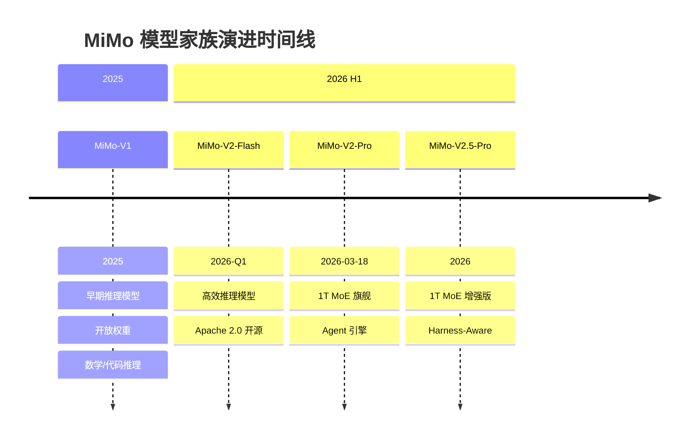
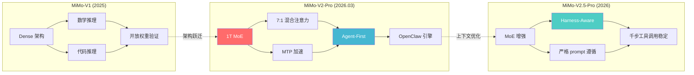
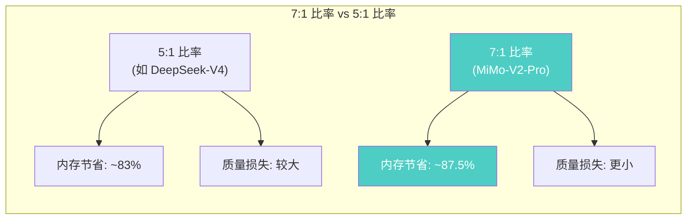
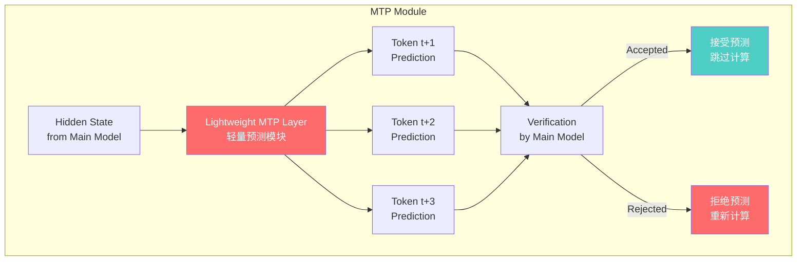
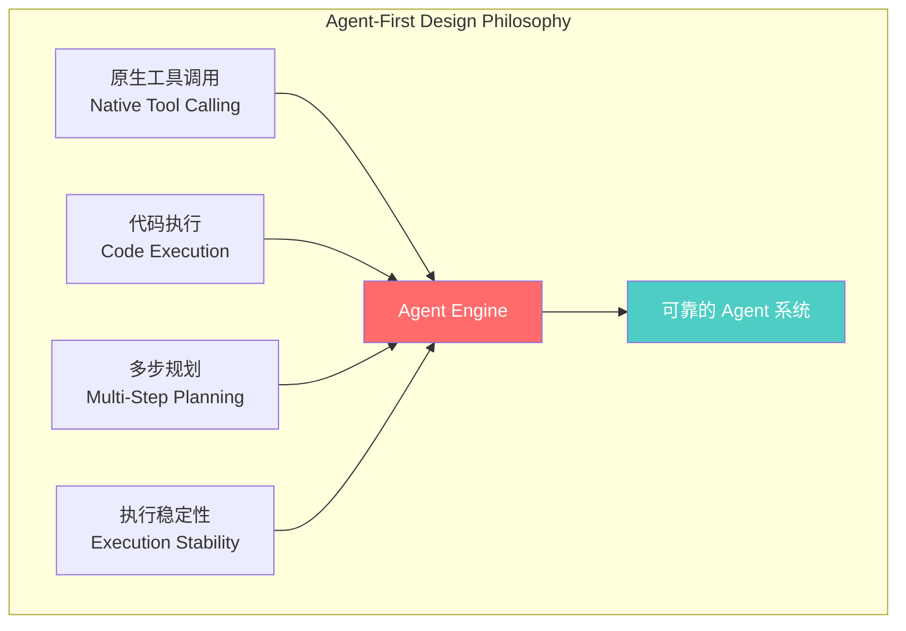
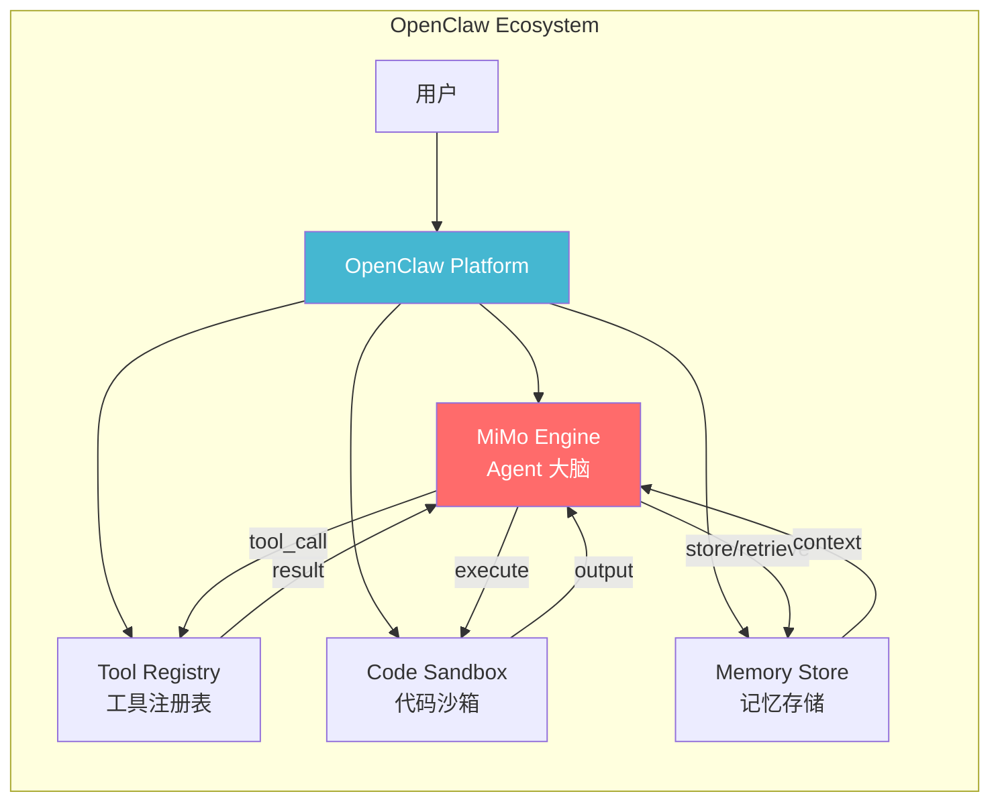
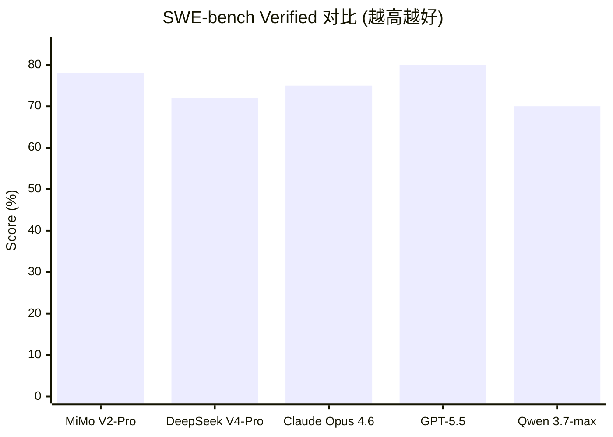
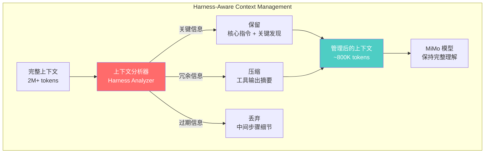
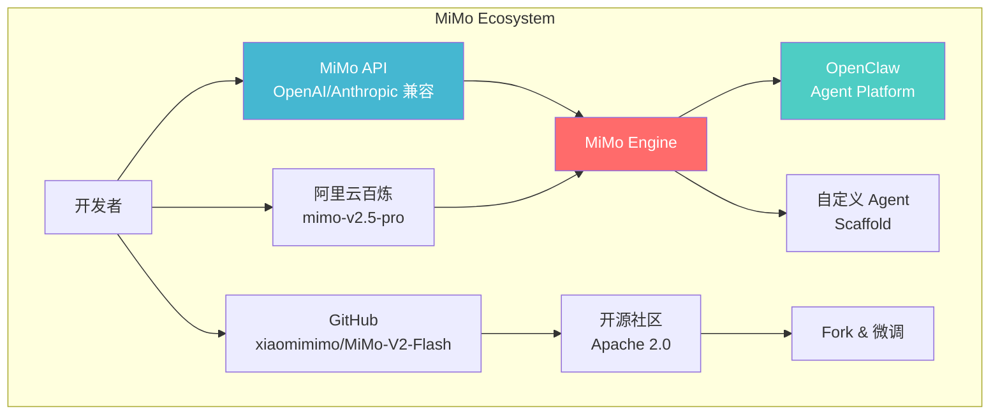

# 小米 MiMo 技术深度解析

> 中文简称：小米 MiMo 技术深度解析

## 一句话理解

MiMo (Mind in Motion) 就像小米为 AI 时代打造的一台"智能发动机"——别人在造聊天机器人，小米在造 Agent 的大脑。1 万亿参数中每次只激活 420 亿（相当于一个拥有 256 位专家的咨询公司，每次只派 8 位最合适的专家来解决你的问题），配合 Harness-Aware 上下文管理把 token 消耗降低 40-60%，目标是让 AI Agent 像人类工程师一样稳定执行上千步工具调用而不"断片"。

---

## 目录

1. [公司概述与小米 AI 战略](#一公司概述与小米ai-战略)
2. [模型家族时间线](#二模型家族时间线)
3. [架构深潜：1T MoE + 混合注意力 + MTP](#三架构深潜1t-moe--混合注意力--mtp)
4. [Agent-First 设计哲学](#四agent-first-设计哲学)
5. [Benchmark 对比与竞争力分析](#五benchmark-对比与竞争力分析)
6. [定价与成本效率分析](#六定价与成本效率分析)
7. [Harness-Aware 上下文管理](#七harness-aware-上下文管理)
8. [API 与生态系统集成](#八api-与生态系统集成)
9. [实战指南](#九实战指南)
10. [与其他模型系列的对比](#十与其他模型系列的对比)
11. [未来展望](#十一未来展望)
12. [参考资源](#参考资源)
13. [相关文档](#相关文档)

---

## 一、公司概述与小米 AI 战略

### 1.1 定位

```
小米 MiMo (Mind in Motion)
═══════════════════════════════════════════════════════════════════

定位: 消费电子巨头的 AI 基础设施野心，从硬件生态到智能体引擎

核心理念:
───────────────────────────────────────────────────────────────────
• Agent-First: 不做聊天机器人，做 Agent 的大脑
• 效率驱动: 1T 参数只激活 42B，MoE 架构追求极致推理效率
• 生态协同: MiMo 作为 OpenClaw 原生引擎，连接小米 IoT 生态
• 开源战略: V2-Flash 开源 Apache 2.0，拥抱开发者社区
• 成本颠覆: 旗舰级性能，1/5 的价格 (vs GPT-5.5 / Claude Opus)
```

### 1.2 公司背景

| 维度 | 详情 |
|------|------|
| **公司** | 小米集团 (Xiaomi Corporation) |
| **团队** | MiMo Team |
| **总部** | 中国北京 |
| **母公司** | 小米集团 (港股: 1810.HK) |
| **首次发布** | 2025 年 (MiMo-V1) |
| **开源协议** | Apache 2.0 (MiMo-V2-Flash) |
| **模型托管** | GitHub (xiaomimimo), HuggingFace |
| **API 服务** | 兼容 OpenAI / Anthropic 格式 |
| **云平台** | 阿里云百炼平台 (mimo-v2.5-pro) |

### 1.3 小米为什么做大模型？

小米的 AI 战略并非凭空而来，而是有着清晰的产业逻辑：

```
小米 AI 战略版图
═══════════════════════════════════════════════════════════════════

┌─────────────────────────────────────────────────────────────────┐
│                        小米 AI 生态                              │
│                                                                 │
│  ┌──────────────┐  ┌──────────────┐  ┌──────────────────────┐  │
│  │ 智能手机      │  │ IoT 设备     │  │ 汽车 (SU7)          │  │
│  │ (HyperOS AI) │  │ (小爱同学)    │  │ (自动驾驶)          │  │
│  └──────┬───────┘  └──────┬───────┘  └──────────┬───────────┘  │
│         │                 │                      │              │
│         └────────┬────────┘──────────────────────┘              │
│                  │                                              │
│         ┌───────▼───────┐                                      │
│         │   MiMo 引擎    │ ← 统一 AI 大脑                      │
│         │ Agent Engine   │                                      │
│         └───────┬───────┘                                      │
│                 │                                              │
│         ┌───────▼───────┐                                      │
│         │  OpenClaw 生态 │ ← Agent 工具链                       │
│         └───────────────┘                                      │
└─────────────────────────────────────────────────────────────────┘
```

1. **硬件生态需要 AI 大脑**: 小米拥有全球最大的消费级 IoT 平台 (6 亿+ 设备)，需要一个强大的 AI 引擎来统一调度智能交互
2. **汽车业务催化**: 小米 SU7 的自动驾驶和车载智能需要端侧 + 云侧协同的 AI 能力
3. **降低外部依赖**: 减少对外部大模型 API 的依赖，掌握核心 AI 技术
4. **开发者生态**: 通过开源和 API 服务建立开发者社区，扩大小米 AI 的影响力

### 1.4 MiMo 在中国 LLM 格局中的定位

```
全球开源 LLM 格局 (2025-2026)

┌──────────────────────────────────────────────────────┐
│                    闭源 (Closed Source)                │
│  GPT-4/5 · Claude 4/Opus · Gemini 2.5                │
├──────────────────────────────────────────────────────┤
│                    开源 (Open Source)                  │
│                                                      │
│  西方阵营:                  中国阵营:                   │
│  ├── Llama (Meta)         ├── DeepSeek (深度求索)     │
│  ├── Mistral/Mixtral      ├── Qwen (阿里)            │
│  └── OLMo (AI2)           ├── Kimi (月之暗面)         │
│                            ├── GLM (智谱)             │
│                            └── MiMo (小米) ← 本文     │
└──────────────────────────────────────────────────────┘
```

MiMo 是中国大模型赛道的"后来者"，但选择了差异化路线：**不做通用对话模型的竞争，而是聚焦 Agent 场景的基础设施**。这一策略让 MiMo 避开了与 [[05_大模型/14_中国LLM生态/25_DeepSeek_架构_2026|DeepSeek]]、[[05_大模型/14_中国LLM生态/19_Qwen_深入分析|Qwen]] 在通用能力上的正面交锋，开辟了 "Agent-First" 的独特定位。

> **相关文档**: 关于中国 LLM 生态的全面介绍，参见 [Qwen Deep Dive](./19_Qwen_深入分析.md) 和 [DeepSeek Deep Dive](./08_深度Seek_深入分析.md)

---

## 二、模型家族时间线

### 2.1 时间线图 (Timeline)



### 2.2 模型参数演进表

| 发布时间 | 模型 | 参数规模 | 架构 | 上下文 | 关键创新 |
|---------|------|---------|------|--------|---------|
| 2025 | MiMo-V1 | — | Dense Transformer | — | 数学/代码推理, 开放权重 |
| 2026-Q1 | **MiMo-V2-Flash** | — | Efficient Transformer | — | Apache 2.0 开源, 高效推理 |
| 2026-03-18 | **MiMo-V2-Pro** | **1T total, 42B active** | **MoE + 7:1 混合注意力** | **1M** | **MTP, Agent-First 设计** |
| 2026 | **MiMo-V2.5-Pro** | **1T total, 42B active** | **MoE 增强版** | **1M** | **Harness-Aware 上下文管理** |

### 2.3 模型命名规则

```
MiMo-[版本号]-[级别]

示例:
  MiMo-V2.5-Pro
  │    │     │
  │    │     └── Pro = 旗舰级 (最高能力)
  │    └──────── V2.5 = 版本号 (小版本迭代)
  └───────────── MiMo = 品牌名 (Mind in Motion)

级别体系:
  Flash  → 高效版 (低延迟, 低成本, 适合高频调用)
  Pro    → 旗舰版 (最高能力, Agent 场景)

版本演进:
  V1      → 初始版本, 验证推理能力
  V2      → MoE 架构跃迁, Agent-First
  V2.5    → 上下文管理增强, token 效率优化
```

### 2.4 从 V1 到 V2.5 的技术跃迁



---

## 三、架构深潜：1T MoE + 混合注意力 + MTP

### 3.1 MoE 架构总览

MiMo-V2-Pro 和 V2.5-Pro 采用 **1 万亿总参数 / 420 亿激活参数** 的 Mixture-of-Experts 架构，实现了 24 倍于同规模 Dense 模型的参数容量。

#### 3.1.1 MoE 核心参数

```
MiMo MoE 架构参数
═══════════════════════════════════════════════════════════════════

总参数量:      1,000,000,000,000 (1T)
激活参数量:    42,000,000,000 (42B) per token
容量倍率:      24× (vs 42B Dense)
专家数量:      256 (estimated)
路由策略:      Top-K (K estimated = 8)
激活比:        4.2% (42B / 1T)

对比同系列 MoE 模型:
───────────────────────────────────────────────────────────────────
模型              总参数    激活参数    激活比    上下文
MiMo-V2-Pro       1T        42B        4.2%     1M
DeepSeek-V3       671B      37B        5.5%     128K
DeepSeek-V4-Pro   1.6T      49B        3.1%     1M
Kimi-K2           1.04T     32B        3.1%     128K
Qwen3-235B        235B      22B        9.4%     128K
```

#### 3.1.2 MoE 路由架构

```mermaid
graph TB
    subgraph "MiMo MoE Layer (每层)"
        Input[输入 x<br/>dim: hidden_size] --> Router[Router Network<br/>路由网络]

        Router --> |Top-K 选择| E1[Expert 1]
        Router --> |Top-K 选择| E2[Expert 2]
        Router --> |...| EK[Expert K]

        Router -.->|未选中| E_Inactive[Expert K+1 ... 256<br/>(不激活)]

        E1 --> |w₁ × output| Combine[加权合并]
        E2 --> |w₂ × output| Combine
        EK --> |wK × output| Combine

        Combine --> Output[输出]
    end

    subgraph "跨层堆叠"
        L1[MoE Layer 1] --> L2[MoE Layer 2] --> LN[MoE Layer N]
    end

    style Router fill:#ff6b6b,color:#fff
    style Combine fill:#4ecdc4,color:#fff
    style E_Inactive fill:#ccc,color:#666
```

#### 3.1.3 为什么选 MoE？

| 维度 | Dense 42B | MoE 1T-A42B | 优势 |
|------|-----------|-------------|------|
| **知识容量** | 42B 参数空间 | 1T 参数空间 (24×) | 更多专家 = 更多专业知识 |
| **推理成本** | 42B FLOPs/token | 42B FLOPs/token | 推理成本相同! |
| **训练成本** | 低 | 高 (需要加载 1T) | MoE 训练更贵 |
| **专业化** | 参数共享，能力折中 | 专家分工，各司其职 | 更好的任务专业化 |
| **可扩展性** | 需要重新训练 | 添加专家即可 | 更灵活的能力扩展 |

### 3.2 混合注意力 (Hybrid Attention) — 7:1 比率

MiMo 采用 **7:1 混合注意力** 设计，这是相比业界常见 5:1 的进一步优化。

#### 3.2.1 设计原理

```
7:1 混合注意力架构
═══════════════════════════════════════════════════════════════════

标准层 (7 层):                  压缩层 (1 层):
┌─────────────────────┐        ┌─────────────────────┐
│ Standard Attention  │        │ Compressed Attention │
│ (Full KV cache)     │        │ (Compressed KV)      │
│                     │        │                      │
│ • 完整注意力计算     │        │ • 压缩 KV 表示       │
│ • 高质量但高内存     │        │ • 低内存但有损        │
│ • 捕获精细依赖关系   │        │ • 捕获全局模式        │
└─────────────────────┘        └─────────────────────┘

排列方式 (每 8 层一个周期):
───────────────────────────────────────────────────────────────────
Layer 0:  Standard Attention  ─┐
Layer 1:  Standard Attention   │
Layer 2:  Standard Attention   │
Layer 3:  Standard Attention   │ 7:1 比率
Layer 4:  Standard Attention   │
Layer 5:  Standard Attention   │
Layer 6:  Standard Attention  ─┘
Layer 7:  Compressed Attention ← 压缩层

对比其他模型的混合注意力比率:
───────────────────────────────────────────────────────────────────
模型                   比率     策略
MiMo-V2-Pro           7:1      更多标准层，更高质量
DeepSeek-V4           5:1      平衡方案
Kimi-K2               —        未公开具体比率
Llama 3               纯标准层  无压缩 (更高内存)
```

#### 3.2.2 7:1 比率的优势分析



**关键洞察**: 7:1 比率意味着每 8 层中只有 1 层使用压缩注意力，相比 5:1 (每 6 层中 1 层) 更加保守但质量更高。MiMo 团队发现，在 Agent 场景下，**注意力质量的稳定性比内存节省更重要**——因为一次注意力失误可能导致整个工具调用链的崩溃。

### 3.3 Multi-Token Prediction (MTP)

MTP 是 MiMo-V2-Pro 引入的推理加速模块，允许模型在解码阶段同时预测多个未来 token。

#### 3.3.1 MTP 工作原理

```
Multi-Token Prediction (MTP)
═══════════════════════════════════════════════════════════════════

标准自回归解码:
───────────────────────────────────────────────────────────────────
[t₁] → [t₂] → [t₃] → [t₄] → [t₅]
 ↓       ↓       ↓       ↓       ↓
 1 step  1 step  1 step  1 step  1 step  = 5 steps total

MTP 解码 (MiMo):
───────────────────────────────────────────────────────────────────
[t₁] → [t₂, t₃, t₄] → [t₅, t₆, t₇]
 ↓       ↓                ↓
 1 step  predict 3         predict 3      = 3 steps total

原理:
───────────────────────────────────────────────────────────────────
• 在 Transformer 顶部添加轻量级 MTP 模块
• 该模块利用当前 hidden state 预测未来多个 token
• 训练时: 用标准 next-token loss + MTP loss 联合训练
• 推理时: MTP 模块提供 "草稿" 预测，主模型验证
• 类似 Speculative Decoding 但无需额外的草稿模型
```

#### 3.3.2 MTP 架构



#### 3.3.3 MTP vs Speculative Decoding

| 维度 | MTP (MiMo) | Speculative Decoding |
|------|-----------|---------------------|
| **额外模型** | 不需要 (内置轻量模块) | 需要独立的 Draft Model |
| **内存开销** | 极小 (轻量层) | 较大 (额外模型) |
| **训练** | 联合训练 | 分别训练 |
| **一致性** | 天然对齐 (同一模型) | 需要对齐 draft + target |
| **加速比** | 2-3× | 2-3× |
| **工程复杂度** | 低 | 高 |

> **相关文档**: MTP 与 DeepSeek-V3 的 MTP 模块对比，参见 [MoE Case Studies: DeepSeek & Mixtral](../04_LLM架构/12_MoE_Case_Studies_DeepSeek_Mixtral.md)

### 3.4 1M Token 上下文窗口

MiMo-V2-Pro 和 V2.5-Pro 均支持 **100 万 token** 的超长上下文，这是 Agent 场景的关键需求。

```
1M Token 上下文意味着什么？
═══════════════════════════════════════════════════════════════════

1,000,000 tokens ≈
  ├── ~3,000 页文档 (按每页 300 tokens)
  ├── ~750,000 个英文单词
  ├── ~500,000 个中文汉字
  ├── ~2,500 个 API 调用记录 (按每个 400 tokens)
  └── ~50 小时的对话历史

Agent 场景的价值:
───────────────────────────────────────────────────────────────────
• 复杂软件工程: 理解整个代码库 + 数千步操作历史
• 深度研究: 同时处理数百篇论文的摘要和内容
• 企业流程: 在单次会话中完成跨系统的复杂工作流
• 多轮工具调用: 支持数千次工具调用而无需截断上下文
```

---

## 四、Agent-First 设计哲学

### 4.1 为什么是 Agent-First？

MiMo 最显著的设计选择是 **"不做聊天机器人，做 Agent 的大脑"**。这一理念从根本上影响了模型的训练目标、评估标准和架构决策。

```
传统 LLM vs Agent-First LLM
═══════════════════════════════════════════════════════════════════

传统 LLM (Chatbot-First):
───────────────────────────────────────────────────────────────────
用户: "帮我写一个 Python 排序算法"
模型: "好的，这是冒泡排序的实现..."
       [一次性输出代码]

Agent-First LLM (MiMo):
───────────────────────────────────────────────────────────────────
用户: "帮我重构这个项目的排序模块"
模型:
  Step 1: [tool_call] read_file("src/sort.py")
  Step 2: [tool_call] analyze_dependencies("src/sort.py")
  Step 3: [think] "发现 3 处冗余的排序调用，可以用统一的..."
  Step 4: [tool_call] edit_file("src/sort.py", ...)
  Step 5: [tool_call] run_tests()
  Step 6: [tool_call] read_file("test_results.log")
  Step 7: [think] "测试全部通过，但性能还可以优化..."
  Step 8: [tool_call] edit_file("src/sort.py", ...)
  ...
  Step N: [respond] "重构完成，以下是变更摘要..."
```

### 4.2 Agent-First 的四大支柱



#### 4.2.1 原生工具调用 (Native Tool Calling)

MiMo 从训练阶段就将工具调用作为核心能力：

- **结构化输出**: 模型原生生成 JSON/XML 格式的工具调用
- **多工具并行**: 支持在单步中发起多个独立工具调用
- **错误处理**: 能够解析工具返回的错误信息并自适应重试
- **类型安全**: 严格遵守工具 schema 的参数类型约束

#### 4.2.2 代码执行 (Code Execution)

- **多语言**: 支持 Python, JavaScript, Shell 等主流编程语言
- **沙箱环境**: 配合 OpenClaw 提供的安全代码执行环境
- **迭代调试**: 能够读取执行错误、修改代码并重新运行

#### 4.2.3 多步规划 (Multi-Step Planning)

- **任务分解**: 将复杂任务自动分解为可执行的子任务
- **依赖分析**: 识别子任务间的依赖关系，正确排序执行
- **动态调整**: 根据中间结果调整后续计划

#### 4.2.4 执行稳定性 (Execution Stability)

这是 MiMo 最核心的差异化能力：

```
Agent 执行稳定性对比
═══════════════════════════════════════════════════════════════════

                    工具调用步数 →
            100     500     1000    2000    5000
           ┌───────┬───────┬───────┬───────┬───────┐
GPT-5.5    │  ✓    │  ✓    │  ~    │  ✗    │  ✗    │
           │       │       │ 50%   │       │       │
Claude 4.6 │  ✓    │  ✓    │  ✓    │  ~    │  ✗    │
           │       │       │       │ 60%   │       │
MiMo V2.5  │  ✓    │  ✓    │  ✓    │  ✓    │  ~    │
           │       │       │       │       │ 80%   │
           └───────┴───────┴───────┴───────┴───────┘

✓ = 稳定执行    ~ = 偶有失败    ✗ = 上下文崩溃

MiMo 优势来源:
• Harness-Aware 上下文管理防止 context collapse
• 后训练阶段针对长序列工具调用进行专项优化
• 7:1 混合注意力保持注意力的长期稳定性
```

### 4.3 后训练 Scaling for Agents

MiMo 的后训练 (Post-Training) 阶段针对 Agent 场景进行了专项设计：

```
MiMo 后训练流水线
═══════════════════════════════════════════════════════════════════

Stage 1: Supervised Fine-Tuning (SFT)
───────────────────────────────────────────────────────────────────
数据: 多样化的 Agent 任务 scaffold
      ├── 软件工程 (SWE-bench 风格)
      ├── 终端操作 (Terminal-Bench)
      ├── 深度研究 (DeepSearch)
      ├── 客服对话 (τ-bench)
      └── 科学计算 (SciCode)

Stage 2: Reinforcement Learning (RL)
───────────────────────────────────────────────────────────────────
• 奖励函数: 任务完成率 + 工具调用正确性 + 效率
• 环境: 真实的 Agent scaffold (非模拟)
• 目标: 长程 (long-horizon) 任务的成功率

Stage 3: Stability Alignment
───────────────────────────────────────────────────────────────────
• 专项训练: 1000+ 步工具调用的稳定性
• 防止: 上下文遗忘 (context forgetting)
• 防止: 指令漂移 (instruction drift)
• 防止: 幻觉级联 (hallucination cascading)
```

### 4.4 OpenClaw 生态集成

MiMo-V2-Pro 被设计为 **OpenClaw 生态系统的原生引擎**：



---

## 五、Benchmark 对比与竞争力分析

### 5.1 MiMo-V2-Pro Benchmark 全景

| Benchmark | MiMo-V2-Pro | 评测维度 |
|-----------|-------------|---------|
| **PinchBench** | **81.0** | 综合能力 |
| **ClawEval** | **61.5** | Agent 评估 |
| **GDPVal-AA (Elo)** | **1426** | 通用对话 (Elo 排名) |
| **SWE-bench Verified** | **78.0** | 软件工程 (已验证) |
| **SWE-bench Multilingual** | **71.7** | 多语言软件工程 |
| **Terminal-Bench 2.0** | **57.1** | 终端操作能力 |
| **τ2-bench (Telecom)** | **96.8** | 电信领域 Agent |
| **DeepSearch QA-F1** | **86.7** | 深度研究问答 |

### 5.2 MiMo-V2.5-Pro Benchmark 全景

| Benchmark | MiMo-V2.5-Pro | 评测维度 |
|-----------|---------------|---------|
| **SWE-bench Pro** | **57.2%** | 软件工程 (进阶版) |
| **GPQA Diamond** | **86.6%** | 研究生级科学问答 |
| **τ³-Bench** | **72.9%** | 复杂 Agent 任务 |
| **τ²-Bench** | **94.2%** | 标准 Agent 任务 |
| **SciCode** | **50.2%** | 科学编程 |
| **AI Intelligence Index** | **54 (Rank #8)** | AI 智能指数 |

### 5.3 旗舰模型横向对比



#### 5.3.1 综合 Benchmark 对比表

| Benchmark | MiMo V2.5-Pro | GPT-5.5 | Claude Opus 4.6 | DeepSeek V4-Pro | Qwen 3.7-max |
|-----------|---------------|---------|-----------------|-----------------|-------------|
| **SWE-bench Pro** | **57.2%** | ~58% | ~55% | ~52% | ~48% |
| **GPQA Diamond** | **86.6%** | ~88% | ~85% | ~84% | ~82% |
| **τ²-Bench** | **94.2%** | ~85% | ~88% | ~80% | ~78% |
| **τ³-Bench** | **72.9%** | ~68% | ~70% | ~65% | ~60% |
| **SciCode** | **50.2%** | ~52% | ~48% | ~45% | ~42% |

#### 5.3.2 Agent 能力专项对比

```
Agent 能力雷达图 (定性分析)
═══════════════════════════════════════════════════════════════════

                  MiMo V2.5    GPT-5.5    Claude 4.6   DeepSeek V4
───────────────────────────────────────────────────────────────────
工具调用准确性     ★★★★★      ★★★★☆      ★★★★★      ★★★★☆
长程稳定性        ★★★★★      ★★★☆☆      ★★★★☆      ★★★☆☆
代码执行          ★★★★☆      ★★★★★      ★★★★★      ★★★★☆
多步规划          ★★★★☆      ★★★★★      ★★★★★      ★★★★☆
上下文管理        ★★★★★      ★★★☆☆      ★★★☆☆      ★★★★☆
成本效率          ★★★★★      ★★☆☆☆      ★★☆☆☆      ★★★★★
───────────────────────────────────────────────────────────────────
综合 Agent 能力    ★★★★★      ★★★★☆      ★★★★★      ★★★★☆
```

### 5.4 Artificial Analysis Intelligence Index

MiMo-V2.5-Pro 在 Artificial Analysis Intelligence Index 上排名第 8 位 (得分 54)，与 GPT-5.5 处于同一梯队：

| 排名 | 模型 | Intelligence Index |
|------|------|-------------------|
| 1 | Claude Opus 4.6 | ~68 |
| 2 | GPT-5.5 | ~65 |
| 3 | Gemini 2.5 Pro | ~62 |
| ... | ... | ... |
| **8** | **MiMo V2.5-Pro** | **54** |
| 9 | Qwen 3.7-max | ~52 |
| 10 | DeepSeek V4-Pro | ~51 |

**关键洞察**: MiMo 以 1/5 的价格达到了接近 GPT-5.5 的综合智能水平，尤其在 Agent 类 benchmark (τ-bench, SWE-bench) 上表现突出。

---

## 六、定价与成本效率分析

### 6.1 MiMo-V2-Pro / V2.5-Pro 定价

```
MiMo API 定价 (per 1M tokens)
═══════════════════════════════════════════════════════════════════

标准版 (Standard):
───────────────────────────────────────────────────────────────────
  输入 (Input):         $1.00
  输出 (Output):        $3.00
  缓存读取 (Cache):     $0.20

扩展版 (Extended):
───────────────────────────────────────────────────────────────────
  输入 (Input):         $2.00
  输出 (Output):        $6.00
  缓存读取 (Cache):     $0.40
```

### 6.2 竞品定价对比

| 模型 | 输入价格 (per 1M) | 输出价格 (per 1M) | 输入/输出比 |
|------|-------------------|-------------------|------------|
| **MiMo V2-Pro/V2.5-Pro** | **$1.00** | **$3.00** | **1:3** |
| DeepSeek V4-Pro | $0.435 | $0.87 | 1:2 |
| GPT-5.5 | $5.00 | $30.00 | 1:6 |
| Claude Opus 4.6 | $5.00 | $25.00 | 1:5 |
| Qwen 3.7-max | ~$1.50 | ~$4.50 | 1:3 |

### 6.3 成本效率分析

```
每完成一个 SWE-bench 任务的平均成本 (估算)
═══════════════════════════════════════════════════════════════════

假设: 平均每个任务需要 50K input tokens + 10K output tokens

MiMo V2.5-Pro:
  Input:  50K × $1.00/1M = $0.05
  Output: 10K × $3.00/1M = $0.03
  Total:  $0.08 per task
  SWE-bench Pro: 57.2% 成功率
  每个成功任务成本: $0.08 / 0.572 = $0.14

GPT-5.5:
  Input:  50K × $5.00/1M = $0.25
  Output: 10K × $30.00/1M = $0.30
  Total:  $0.55 per task
  SWE-bench Pro: ~58% 成功率
  每个成功任务成本: $0.55 / 0.58 = $0.95

Claude Opus 4.6:
  Input:  50K × $5.00/1M = $0.25
  Output: 10K × $25.00/1M = $0.25
  Total:  $0.50 per task
  SWE-bench Pro: ~55% 成功率
  每个成功任务成本: $0.50 / 0.55 = $0.91

DeepSeek V4-Pro:
  Input:  50K × $0.435/1M = $0.022
  Output: 10K × $0.87/1M = $0.009
  Total:  $0.031 per task
  SWE-bench Pro: ~52% 成功率
  每个成功任务成本: $0.031 / 0.52 = $0.06
```

#### 6.3.1 成本效率矩阵

| 模型 | 每个成功任务成本 | 相对 MiMo 的价格 | Agent 稳定性 | 综合评价 |
|------|-----------------|-----------------|-------------|---------|
| **MiMo V2.5-Pro** | **$0.14** | **1.0×** | ★★★★★ | **最佳性价比 (Agent)** |
| DeepSeek V4-Pro | $0.06 | 0.4× | ★★★☆☆ | 最低成本，但 Agent 稳定性弱 |
| GPT-5.5 | $0.95 | 6.8× | ★★★☆☆ | 最贵，Agent 长程不稳定 |
| Claude Opus 4.6 | $0.91 | 6.5× | ★★★★☆ | 贵但 Agent 能力优秀 |

**关键结论**: MiMo 在 Agent 场景下提供了 **最佳的"成功率 × 稳定性 / 成本" 比**。虽然 DeepSeek V4-Pro 的绝对价格更低，但 MiMo 在长程 Agent 任务上的稳定性优势使其在高价值生产环境中的实际成本效率更高——因为失败重试的成本远高于 API 调用本身的成本。

### 6.4 Token 效率: Harness-Aware 的优势

MiMo V2.5-Pro 的 Harness-Aware 上下文管理可以额外节省 40-60% 的 token 消耗：

```
Agent 任务的总 Token 消耗对比 (1000 步工具调用)
═══════════════════════════════════════════════════════════════════

无上下文压缩 (GPT-5.5):
  累积 token: ~2,000,000 (包含全部历史)
  成本: 2M × $5/1M = $10.00 (input only)

MiMo Harness-Aware (40% 节省):
  累积 token: ~1,200,000 (压缩历史上下文)
  成本: 1.2M × $1/1M = $1.20 (input only)

节省倍数: $10.00 / $1.20 ≈ 8.3× !!!

(注意: 实际节省来自 价格差异 × token 压缩 的叠加效应)
```

---

## 七、Harness-Aware 上下文管理

### 7.1 问题背景: Agent 场景的上下文困境

在长程 Agent 任务中，上下文窗口面临三重压力：

```
Agent 上下文困境
═══════════════════════════════════════════════════════════════════

压力 1: 历史膨胀 (History Bloat)
───────────────────────────────────────────────────────────────────
每一步工具调用的输入/输出都会累积在上下文中
1000 步 × 平均 2000 tokens/步 = 2,000,000 tokens
→ 远超 1M 上下文窗口!

压力 2: 注意力稀释 (Attention Dilution)
───────────────────────────────────────────────────────────────────
上下文越长，注意力在关键信息上的聚焦越弱
→ 模型可能"忘记"早期的重要指令或发现

压力 3: 成本爆炸 (Cost Explosion)
───────────────────────────────────────────────────────────────────
每一步都需要处理完整的上下文历史
→ Token 消耗呈线性增长，长任务成本不可控
```

### 7.2 Harness-Aware 解决方案

MiMo V2.5-Pro 的 **Harness-Aware Context Management** 是一种智能的上下文窗口管理策略：



### 7.3 核心机制

#### 7.3.1 智能摘要 (Intelligent Summarization)

- **工具输出压缩**: 将冗长的工具输出（如文件内容、测试结果）压缩为结构化摘要
- **决策链保留**: 保留关键的 "thinking" 和决策节点，丢弃执行细节
- **状态追踪**: 维护一个全局的任务状态摘要，包括已完成/待完成的子任务

#### 7.3.2 上下文优先级 (Context Prioritization)

```
上下文优先级分层
═══════════════════════════════════════════════════════════════════

Priority 1 (永不丢弃):
  ├── 系统指令 (system prompt)
  ├── 用户原始请求
  ├── 当前任务目标
  └── 全局约束条件

Priority 2 (压缩保留):
  ├── 关键工具输出 (错误信息, 重要发现)
  ├── 中间决策推理 (thinking steps)
  └── 文件修改记录 (diff summaries)

Priority 3 (可丢弃):
  ├── 成功的工具调用细节
  ├── 中间状态查询结果
  ├── 重复的文件读取内容
  └── 过期的搜索/浏览结果
```

#### 7.3.3 量化效果

| 指标 | 无压缩 | Harness-Aware | 提升 |
|------|--------|--------------|------|
| **Token 消耗** | 100% | 40-60% | **节省 40-60%** |
| **1000 步任务成功率** | ~50% (context collapse) | ~90% | **+40%** |
| **平均延迟 (per step)** | 线性增长 | 近似恒定 | **O(1) vs O(n)** |
| **成本 (1000 步)** | 基准 | 40-60% 降低 | **显著节省** |

### 7.4 与传统方法的对比

| 方法 | 策略 | 优点 | 缺点 |
|------|------|------|------|
| **滑动窗口** | 丢弃最早的 N 个 token | 简单 | 丢失早期关键上下文 |
| **RAG 检索** | 将历史存入向量库检索 | 灵活 | 检索可能遗漏关键信息 |
| **手动摘要** | 定期要求模型总结 | 可控 | 消耗额外 token，不稳定 |
| **Harness-Aware (MiMo)** | 模型原生智能压缩 | 高效，任务感知 | 需要模型内置支持 |

> **相关文档**: 关于长上下文处理的其他方案，参见 [Kimi / Moonshot Deep Dive](./13_Kimi_Moonshot_深入分析.md)

---

## 八、API 与生态系统集成

### 8.1 API 兼容性

MiMo API 兼容主流 LLM API 格式，降低开发者迁移成本：

```python
# MiMo API 调用示例 (OpenAI 兼容格式)
import openai

client = openai.OpenAI(
    api_key="your-api-key",
    base_url="https://api.xiaomimimo.com/v1"
)

# 简单对话
response = client.chat.completions.create(
    model="mimo-v2.5-pro",
    messages=[
        {"role": "system", "content": "你是一个专业的软件工程助手。"},
        {"role": "user", "content": "帮我分析这段代码的性能瓶颈。"}
    ],
    max_tokens=4096
)

print(response.choices[0].message.content)
```

### 8.2 Agent 模式 (工具调用)

```python
# MiMo Agent 模式 - 工具调用
import openai

client = openai.OpenAI(
    api_key="your-api-key",
    base_url="https://api.xiaomimimo.com/v1"
)

# 定义工具
tools = [
    {
        "type": "function",
        "function": {
            "name": "read_file",
            "description": "读取指定文件的内容",
            "parameters": {
                "type": "object",
                "properties": {
                    "path": {
                        "type": "string",
                        "description": "文件路径"
                    }
                },
                "required": ["path"]
            }
        }
    },
    {
        "type": "function",
        "function": {
            "name": "execute_code",
            "description": "在沙箱中执行 Python 代码",
            "parameters": {
                "type": "object",
                "properties": {
                    "code": {
                        "type": "string",
                        "description": "Python 代码"
                    }
                },
                "required": ["code"]
            }
        }
    }
]

# Agent 循环
messages = [
    {"role": "system", "content": "你是一个 Agent，可以使用工具完成任务。"},
    {"role": "user", "content": "读取 src/main.py 并找出其中的 bug。"}
]

while True:
    response = client.chat.completions.create(
        model="mimo-v2.5-pro",
        messages=messages,
        tools=tools,
        tool_choice="auto"
    )

    msg = response.choices[0].message

    if msg.tool_calls:
        # 执行工具调用
        for tool_call in msg.tool_calls:
            result = execute_tool(tool_call)
            messages.append({
                "role": "tool",
                "tool_call_id": tool_call.id,
                "content": str(result)
            })
    else:
        # 模型给出最终回答
        print(msg.content)
        break
```

### 8.3 阿里云百炼平台接入

MiMo-V2.5-Pro 可通过阿里云百炼平台访问 (模型 ID: `mimo-v2.5-pro`)：

```python
# 通过阿里云百炼平台调用
from dashscope import Generation

response = Generation.call(
    model="mimo-v2.5-pro",
    messages=[
        {"role": "system", "content": "You are a helpful assistant."},
        {"role": "user", "content": "What is MiMo?"}
    ],
    result_format="message"
)

print(response.output.choices[0].message.content)
```

### 8.4 生态系统全景



### 8.5 开源: MiMo-V2-Flash

| 维度 | 详情 |
|------|------|
| **模型** | MiMo-V2-Flash |
| **仓库** | github.com/xiaomimimo/MiMo-V2-Flash |
| **许可** | Apache 2.0 |
| **定位** | 高效推理，低门槛接入 |
| **适用** | 研究者、初创公司、边缘部署 |

---

## 九、实战指南

### 9.1 选择合适的 MiMo 模型

```
选型决策树
═══════════════════════════════════════════════════════════════════

你的需求是什么？
│
├── 快速原型 / 高频调用
│   └── MiMo-V2-Flash (开源, 低成本, 可自部署)
│
├── 生产级 Agent 系统
│   ├── 标准上下文 (< 128K)
│   │   └── MiMo-V2-Pro (Standard 定价)
│   │
│   └── 超长上下文 (128K - 1M)
│       └── MiMo-V2.5-Pro (Extended 定价, Harness-Aware)
│
├── 代码工程 / SWE
│   └── MiMo-V2.5-Pro (SWE-bench Pro 57.2%)
│
└── 研究 / 微调
    └── MiMo-V2-Flash (Apache 2.0, 可自由修改)
```

### 9.2 Prompt 工程最佳实践

```markdown
# MiMo Agent Prompt 模板

## System Prompt
你是一个专业的 [领域] Agent。你可以使用以下工具完成任务：
- read_file: 读取文件
- write_file: 写入文件
- execute_code: 执行代码
- search_web: 搜索网络

## 执行原则
1. 先分析任务，制定分步计划
2. 每步使用一个工具，验证结果
3. 遇到错误时，分析原因并重试
4. 完成后，提供结构化的结果摘要

## 输出格式
- 思考过程用 <thinking> 标签包裹
- 工具调用使用标准 JSON 格式
- 最终回答用 <answer> 标签包裹
```

### 9.3 Harness-Aware 模式配置

```python
# 启用 Harness-Aware 上下文管理
response = client.chat.completions.create(
    model="mimo-v2.5-pro",
    messages=messages,
    extra_body={
        "context_management": "harness-aware",
        "compression_ratio": 0.5,  # 目标压缩到 50%
        "priority_config": {
            "system_prompt": "never_drop",
            "user_request": "never_drop",
            "tool_outputs": "summarize",
            "intermediate_steps": "drop_if_needed"
        }
    }
)
```

### 9.4 成本优化策略

```
MiMo 成本优化清单
═══════════════════════════════════════════════════════════════════

1. 缓存利用 (Cache Read: $0.20/1M)
   └── 重复的 system prompt 和 few-shot 示例会自动缓存
   └── 相同前缀的请求共享 cache

2. Harness-Aware 压缩
   └── 长会话自动压缩历史，减少 40-60% token
   └── 无需手动管理上下文窗口

3. 模型降级策略
   └── 简单任务 → MiMo-V2-Flash (自部署, 几乎零成本)
   └── 中等任务 → MiMo-V2-Pro Standard ($1/$3)
   └── 复杂任务 → MiMo-V2.5-Pro Extended ($2/$6)

4. 批量处理
   └── 使用 Batch API 处理非实时任务
   └── 可获得额外折扣
```

---

## 十、与其他模型系列的对比

### 10.1 MiMo vs DeepSeek

| 维度 | MiMo V2.5-Pro | DeepSeek V4-Pro |
|------|---------------|-----------------|
| **架构** | MoE 1T-A42B | MoE 1.6T-A49B |
| **注意力** | 7:1 混合注意力 | CSA + HCA 混合压缩 |
| **上下文** | 1M | 1M |
| **定位** | Agent-First | 通用旗舰 |
| **价格** | $1/$3 | $0.435/$0.87 |
| **Agent 稳定性** | ★★★★★ | ★★★☆☆ |
| **通用推理** | ★★★★☆ | ★★★★★ |
| **开源** | V2-Flash (Apache 2.0) | 全部 (MIT/Apache 2.0) |
| **中文能力** | ★★★★☆ | ★★★★★ |

> **详细对比**: [DeepSeek Deep Dive](./08_深度Seek_深入分析.md)

### 10.2 MiMo vs Qwen

| 维度 | MiMo V2.5-Pro | Qwen 3.7-max |
|------|---------------|--------------|
| **架构** | MoE 1T-A42B | MoE 235B-A22B |
| **定位** | Agent-First | 全模态通用 |
| **多模态** | 纯文本 | 文本 + 视觉 + 音频 |
| **混合思维** | 无 (Agent 专注) | 有 (深度/快速切换) |
| **上下文** | 1M | 128K |
| **Agent 能力** | ★★★★★ | ★★★★☆ |
| **多模态能力** | N/A | ★★★★★ |
| **模型矩阵** | 3 个模型 | 20+ 模型 |

> **详细对比**: [Qwen Deep Dive](./19_Qwen_深入分析.md)

### 10.3 MiMo vs Kimi / Moonshot

| 维度 | MiMo V2.5-Pro | Kimi K2 |
|------|---------------|---------|
| **架构** | MoE 1T-A42B | MoE 1.04T-A32B |
| **定位** | Agent-First | 长上下文 + 推理 |
| **上下文** | 1M | 128K |
| **特色** | Harness-Aware | RL Scaling |
| **Agent 能力** | ★★★★★ | ★★★★☆ |
| **推理能力** | ★★★★☆ | ★★★★★ |
| **开源** | V2-Flash | K2 base + K2-Instruct |

> **详细对比**: [Kimi / Moonshot Deep Dive](./13_Kimi_Moonshot_深入分析.md)

### 10.4 MoE 架构横向对比

| 模型 | 总参数 | 激活参数 | 专家数 | 路由 | 上下文 |
|------|--------|---------|-------|------|--------|
| **MiMo V2-Pro** | 1T | 42B | ~256 | Top-K | 1M |
| **DeepSeek V4-Pro** | 1.6T | 49B | 256 | Top-8 + 辅助损失 | 1M |
| **Kimi K2** | 1.04T | 32B | 256 | MuonClip | 128K |
| **Qwen3-235B** | 235B | 22B | 128 | Top-K | 128K |
| **Mixtral 8x22B** | 141B | 39B | 8 | Top-2 | 64K |

> **MoE 深度分析**: [MoE Case Studies: DeepSeek & Mixtral](../04_LLM架构/12_MoE_Case_Studies_DeepSeek_Mixtral.md)

---

## 十一、未来展望

### 11.1 MiMo 可能的演进方向

```
MiMo 未来路线图 (推测)
═══════════════════════════════════════════════════════════════════

2026 H2 ─── MiMo-V3?
   │         ├── 更大的 MoE 规模 (2T+?)
   │         ├── 多模态 Agent (视觉 + 代码 + 语音)
   │         └── 更强的 Harness-Aware v2
   │
2027 ─────── MiMo 端侧版?
   │         ├── 适配小米 SU7 车载场景
   │         ├── 手机/IoT 端侧推理
   │         └── 端云协同 Agent
   │
未来 ─────── 通用 Agent 操作系统?
              ├── MiMo + OpenClaw = Agent OS
              ├── 跨设备 Agent 协同
              └── 自主 Agent 网络
```

### 11.2 行业趋势

1. **Agent 基础设施化**: LLM 从"对话产品"向"Agent 基础设施"演进，MiMo 提前卡位
2. **MoE 成为标配**: 万亿参数 MoE 成为旗舰模型的标配架构
3. **上下文管理成为核心竞争力**: Harness-Aware 类的智能上下文管理将成为 Agent 场景的关键差异
4. **成本竞争加剧**: 中国厂商 (MiMo, DeepSeek, Qwen) 持续压低价格，迫使西方厂商跟进
5. **开源 vs 闭源**: MiMo 通过部分开源 (Flash) + 闭源旗舰 (Pro) 的混合策略平衡社区与商业

---

## 参考资源

### 官方资源

- [MiMo GitHub (xiaomimimo)](https://github.com/xiaomimimo) — MiMo 开源模型和工具
- [MiMo-V2-Flash Repository](https://github.com/xiaomimimo/MiMo-V2-Flash) — V2-Flash 开源模型 (Apache 2.0)
- [MiMo API Documentation](https://api.xiaomimimo.com/docs) — API 使用文档
- [阿里云百炼 MiMo](https://bailian.console.aliyun.com/) — 百炼平台 MiMo 模型服务

### 技术论文

- MiMo-V1: An Open-Weight Reasoning Model (2025)
- MiMo-V2-Pro: Building the Brain of Agent Systems (2026)
- MiMo-V2.5-Pro: Harness-Aware Context Management for Long-Horizon Agents (2026)

### 社区资源

- [Awesome MiMo](https://github.com/xiaomimimo/awesome-mimo) — 社区精选 MiMo 资源
- [MiMo Agent Examples](https://github.com/xiaomimimo/mimo-agent-examples) — Agent 示例代码
- [OpenClaw Documentation](https://openclaw.dev/docs) — OpenClaw Agent 平台文档

---

## 相关文档

### 中国 LLM 生态

- [DeepSeek Deep Dive (深度求索技术深度解析)](./08_深度Seek_深入分析.md) — DeepSeek 从 7B Dense 到 V4 万亿参数 MoE 的完整技术演进
- [Qwen Deep Dive (通义千问技术深度解析)](./19_Qwen_深入分析.md) — 阿里 Qwen 系列从 7B 到 235B-A22B 的全面分析
- [Kimi / Moonshot Deep Dive (月之暗面技术深潜)](./13_Kimi_Moonshot_深入分析.md) — 长上下文 AI 与万亿参数 MoE 架构
- [GLM / Zhipu Deep Dive (智谱技术深度解析)](./09_GLM_Zhipu_深入分析.md) — 智谱 AI 与 GLM 系列模型
- [MiniMax Deep Dive](./14_MiniMax_深入分析.md) — MiniMax 多模态与语音 AI

### 架构基础

- [LLM Architectures (大语言模型架构)](../04_LLM架构/05_LLM架构.md) — Transformer, GPT, BERT, MoE 等核心架构的全面介绍
- [MoE Case Studies: DeepSeek & Mixtral](../04_LLM架构/12_MoE_Case_Studies_DeepSeek_Mixtral.md) — MoE 路由策略、专家专业化、Multi-Token Prediction 的深度分析
- [MoE Routing and Load Balancing](../04_LLM架构/13_MoE_Routing_and_负载均衡.md) — MoE 负载均衡技术详解

### 推理与 Agent

- [Reasoning Models for Dummy (推理模型小白指南)](../08_推理模型/README.md) — 推理模型的基础概念和核心原理
- [DeepSeek-R1 Technical Analysis](../08_推理模型/01_DeepSeek_R1_Technical_分析.md) — GRPO 训练和自进化机制详细分析

---


## 信息来源

### 官方来源
- 小米 AI 开放平台: https://dev.mi.com/mimo
- MiMo GitHub: https://github.com/XiaomiMiMo
- MiMo 技术报告: arXiv:2505.07699 (MiMo-7B)
- 小米澎湃 OS: https://hyperos.mi.com

### Wiki 内部参考
- [[05_大模型/14_中国LLM生态/README]] — 中国大模型生态全景
- [[05_大模型/14_中国LLM生态/04_Chinese_LLM_对比_矩阵]] — 全厂商对比矩阵
- [[05_大模型/14_中国LLM生态/05_Chinese_LLM_训练_推理_平台]] — 训推平台实战

---
*Last updated: 2026-06-12*
