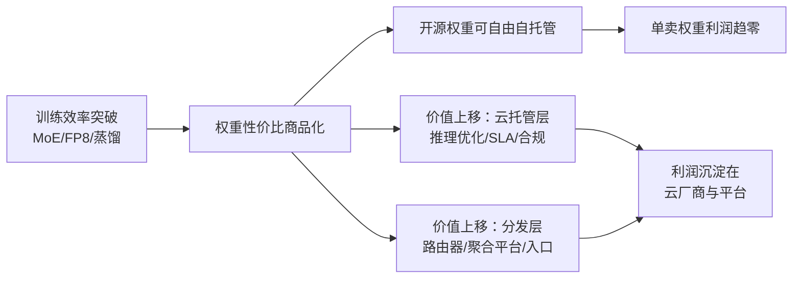

# 中国模型出海 2026 (Chinese Models Going Global 2026)

> 中文简称：中国模型出海

> **一句话理解**： 中国开源模型像"平价超市"开进了全球模型的"商业街"——同样的货架（权重开放）、便宜十倍的价格（Token 单价）、惊人的客流量（61% 份额），而真正的利润留在了房东（云厂商）和收银台（分发平台）手里。

---

## 1. 为什么 2026 是"出海"的分水岭

2026 年 5 月，**中国开源模型合计占 OpenRouter 平台请求份额的 61%**——这是第一次，一个非美国阵营的模型集合在全球最大模型聚合平台上成为多数派。与此同时，**Meta 开源系的份额跌破 1%**（Llama 在聚合平台上的存在感基本清零），美系开源与中式开源的此消彼长在这一年里完成了一次结构性换位。

这组数字的含义远超"份额好看"：

- **开源不再等于西方主导**。"Open weights" 的心智锚点从 Llama 迁移到了 DeepSeek / Qwen / GLM。
- **价格竞争变成主战场**。DeepSeek 以约 **12× 的价差**对 GPT-5.5 形成 undercut，"够好且便宜"在路由器的世界里击败了"最好但贵"。
- **中国系在视频生成维度领先**，字节跳动（豆包/Seed 系）在视频类请求中占据明显优势，多模态出海成为第二增长曲线。

---

## 2. 三组硬数字

| **指标** | **数值** | **时间点** | **含义** |
|------|------|--------|------|
| 中国开源模型 OpenRouter 份额 | **61%** | 2026-05 | 中式开源首次成为聚合平台多数派 |
| DeepSeek vs GPT-5.5 价差 | **~12×** | 2026 | 同档任务下的成本 undercut 幅度 |
| Meta（Llama 系）份额 | **< 1%** | 2026 | 美系开源在聚合平台存在感清零 |
| 开源权重落后闭源前沿 | **3–6 个月** | 2026 | 质量差距存在，但已被"够好 + 便宜"策略对冲 |

三组数字合起来讲了一个完整的故事：**质量差距已经压缩到用户可感知阈值之下，而价格差距是数量级的**——在按 Token 计费的世界里，这足以改写排名。

---

## 3. 2026-06 OpenRouter 月榜战报

| **模型** | **阵营** | **关键数据** | **榜单位置** |
|------|------|----------|----------|
| **DeepSeek V4 Flash** | 中国（深度求索） | $0.14/M Token，全榜成本领先 | 成本维度第一 |
| **GLM 5.2**（智谱） | 中国 | Artificial Analysis Index 51 | 开源阵营规划能力第一 |
| **MiniMax M3** | 中国 | 视频生成能力突出 | 视频维度领先 |
| **NVIDIA Nemotron 3 Ultra** | 美系（NVIDIA） | Artificial Analysis Index 48 | 美系开源最佳 |

月榜读法有三个要点：

1. **成本榜与质量榜开始"分榜竞逐"**。V4 Flash 用 $0.14/M 定义了"Flash 档"的价格地板，而 Nemotron 3 Ultra 用 Index 48 守住美系开源的质量底线——两条战线中国系都有关键落子。
2. **规划（planning）成为开源阵营的分化点**。GLM 5.2 在开源阵营规划能力第一，说明 Agent 化负载（见 [[15_智能体/01_Agent基础/25_Agent_经济学_2026|Agent 经济学]]）正在重塑模型评价维度——用户不再只看"答得好不好"，还看"跑一个任务花多少轮"。
3. **多模态是中国系的第二增长曲线**。MiniMax M3 与字节系在视频维度的领先，意味着出海叙事从"文本便宜"扩展到"视频也能打"。

---

## 4. 打法解剖：效率商品化了权重，价值转移到云与分发层

本轮出海最核心的结构性判断来自 DataGravity 的总结：

> **"Efficiency commoditized weights; value shifted to the cloud and distribution layers."**
> （效率把权重商品化了，价值转移到了云和分发层。）

图示链条说明：训练效率（DeepSeek 式的低成本训练）一方面压低了自家 Token 价格，另一方面让所有开源权重都可被任何人自托管——权重本身不再稀缺，于是价值沉淀到"谁能让用户最方便、最便宜、最合规地用到这些权重"的环节，也就是云厂商和 OpenRouter 这样的分发平台。

中国厂商的组合拳由此清晰：

| **招式** | **做法** | **对应案例** |
|------|------|----------|
| **价格战** | 用 12× 价差 undercut 闭源旗舰 | DeepSeek V4 Flash $0.14/M |
| **开源权重** | MIT/Apache 许可 + 全参数开放 | DeepSeek/Qwen/GLM 全家桶 |
| **视频突围** | 多模态维度建立局部垄断 | 字节系视频生成、MiniMax M3 |
| **借道分发** | 不自建全球入口，借 OpenRouter 类平台触达海外 | 61% 份额的实现路径 |

这套打法的精妙之处在于**放弃了对"入口"的执念**：不与 OpenAI/Google 争夺 C 端产品入口，而是让模型本身成为全球基础设施的一部分，在每一层分发里抽到自己的份额。

---

## 5. 厂商个体表现速览

各家的详细技术解析见本目录深入分析页，这里只给出出海视角的一行定位：

| **厂商** | **出海定位** | **深入阅读** |
|------|----------|----------|
| 深度求索（DeepSeek） | 成本杀手 + 效率标杆，$0.14/M 定义价格地板 | [[05_大模型/14_中国LLM生态/08_深度Seek_深入分析\|DeepSeek 深入分析]]、[[05_大模型/14_中国LLM生态/25_DeepSeek_架构_2026\|DeepSeek 架构 2026]] |
| 阿里（Qwen） | 开源全尺寸矩阵 + 全球开发者生态 | [[05_大模型/14_中国LLM生态/19_Qwen_深入分析\|Qwen 深入分析]] |
| 智谱（GLM） | 开源规划能力第一（Index 51） | [[05_大模型/14_中国LLM生态/09_GLM_Zhipu_深入分析\|GLM/智谱 深入分析]] |
| MiniMax | 视频/多模态突围 | [[05_大模型/14_中国LLM生态/14_MiniMax_深入分析\|MiniMax 深入分析]] |
| 月之暗面（Kimi） | 长上下文特长 | [[05_大模型/14_中国LLM生态/13_Kimi_Moonshot_深入分析\|Kimi 深入分析]] |
| 字节（豆包/Seed） | 视频生成维度领先 + 应用侧出海 | [[05_大模型/14_中国LLM生态/03_ByteDance_Doubao_深入分析\|豆包深入分析]] |

---

## 6. 风险与争议

出海叙事并非没有裂缝，四个已知风险点：

1. **3–6 个月的质量追赶窗口**。开源权重仍落后闭源前沿 3–6 个月；如果前沿模型在 Agent 能力上拉开代差（而非渐进差距），"够好"策略可能失灵。
2. **地缘与合规摩擦**。主权 AI 浪潮（见 [[12_架构基建/02_架构概览/12_主权_AI_2026|主权 AI]]）意味着许多国家倾向于"本国数据 + 本国算力"，中国模型的权重虽然可以自由部署，但服务与支持层面存在准入壁垒——这恰恰是"开源权重 + 本地部署"组合被反复强调的原因。
3. **份额不等于收入**。61% 是请求份额；聚合平台上低价模型的请求量大但单价低，收入口径的份额远小于请求份额。真正的利润在云与分发层，中国厂商目前在那一层的存在感弱于请求份额所暗示的水平。
4. **低价的可持续性**。12× 价差建立在训练与推理效率优势上；当效率被普遍吸收（见 [[18_行业应用/01_行业概览/09_Token_Economics_2026|Token 经济学]] 的成本曲线部分），价差窗口会收窄，出海叙事需要从"便宜"演进到"不可替代"。

---

## 7. 工程启示

对站在 2026 年做选型的工程师，五条可执行结论：

1. **路由策略里必须给中国开源模型留位置**。在非峰值、非前沿需求的负载上，V4 Flash 类模型的 12× 价差是真金白银——配合模型路由可省 60–85% 成本（见 [[15_智能体/01_Agent基础/25_Agent_经济学_2026|Agent 经济学]]）。
2. **权重自由 ≠ 服务自由**。开源权重可自托管，但生产级 SLA、合规审计、企业支持仍需云厂商——选型时把"权重许可"与"服务可得性"分开评估。
3. **视频生成优先评估中国系**。多模态维度上字节系/MiniMax 的领先是实测口径的，选型时不要被文本基准分数误导。
4. **关注规划能力基准而非单一智力分**。GLM 5.2 的"开源规划第一"说明 Agent 化负载下，轮数效率与工具调用质量比 IQ 分更能预测成本。
5. **把 3–6 个月差距纳入降级预案**。架构上保持"前沿闭源模型可一键回切"的能力，对冲开源权重阶段性落后带来的质量风险。

---

## 8. 语料来源

| **来源** | **类型** | **关键事实** |
|------|------|----------|
| DataGravity — State of Open Models 2026 | 行业报告 | 61% 份额、Meta <1%、12× 价差、"效率商品化权重"论断 |
| OpenRouter Monthly Rankings 2026-06 | 平台月榜 | V4 Flash $0.14/M、GLM 5.2 Index 51、Nemotron 3 Ultra Index 48、MiniMax M3 |
| Artificial Analysis Index 2026-06 | 第三方评测 | 模型质量分与规划能力排名 |
| Semianalysis — Open Weights Economics | 行业分析 | 开源权重经济学与价值转移链条 |

---

## Related

- [[18_行业应用/01_行业概览/09_Token_Economics_2026|Token 经济学 2026]] — 成本曲线与商业模式光谱的宏观背景
- [[18_行业应用/01_行业概览/10_AI_泡沫与基建辩论_2026|AI 泡沫与基建辩论 2026]] — 中国模型出海在资本叙事中的位置
- [[12_架构基建/02_架构概览/12_主权_AI_2026|主权 AI]] — "开源权重 + 本地部署"组合的目标市场
- [[05_大模型/14_中国LLM生态/04_Chinese_LLM_对比_矩阵|Chinese LLM 对比矩阵]] — 各家横向技术对比
- [[05_大模型/14_中国LLM生态/07_Chinese_vs_Global_LLM_对比|Chinese vs Global LLM 对比]] — 与闭源前沿的差距量化
- [[15_智能体/01_Agent基础/25_Agent_经济学_2026|Agent 经济学 2026]] — 规划能力为何成为新评价维度
- [[19_业界观点/25_Talks_Synthesis_综合演讲/09_talks_insights|行业 Talks 洞察综合]] — 同源语料的演讲侧整理

---

*Last updated: 2026-09-07*
