# 约束解码深度指南: 从正则到 CFG 的合规生成

> 中文简称：约束解码深度指南: 从正则到 CFG 的合规生成

> **一句话理解**: 约束解码在 token 采样阶段屏蔽不合规 token,从根本上保证 LLM 输出 100% 符合指定格式——正则、JSON Schema 或任意上下文无关文法。

## 目录

1. [什么是约束解码?为什么需要它?](#什么是约束解码为什么需要它)
2. [约束解码的核心原理](#约束解码的核心原理)
3. [正则表达式约束](#正则表达式约束)
4. [JSON Schema 约束 (GBNF 语法)](#json-schema-约束)
5. [Context-Free Grammar (CFG) 约束](#cfg-约束)
6. [Outlines 框架深度解析](#outlines-框架深度解析)
7. [lm-format-enforcer 对比](#lm-format-enforcer-对比)
8. [性能分析: 吞吐量开销](#性能分析)
9. [与 Function Calling 的关系与区别](#与-function-calling-的关系与区别)
10. [生产实践: 错误恢复与 fallback](#生产实践)
11. [2026 前沿: GFN-based 约束生成](#2026-前沿)
12. [Related](#related)

## 什么是约束解码?为什么需要它?

### 定义

**约束解码(Constrained Decoding)** 是一类在 LLM 自回归生成过程中,**在每一步采样前屏蔽不合法 token** 的技术。它不是事后修复,而是从源头保证输出不可能违反约束。

### 为什么需要它?

传统的结构化输出方案各有缺陷:

| 方案 | 问题 |
|------|------|
| Prompt 工程("请输出 JSON") | 模型偶尔不听话,合规率 85-95% |
| JSON Mode | 只保证是合法 JSON,不保证字段/类型合规 |
| Function Calling | 依赖模型训练对齐,闭源 API 限定 |
| 事后解析 + 修复 | 修复逻辑复杂,且模型可能根本没生成所需信息 |

约束解码的价值:**不合规的 token 在采样时就被屏蔽,输出从概率上就不可能违规**。

### 合规率对比

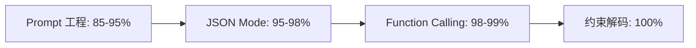

### 典型应用场景

- **数据抽取**: 从非结构化文本提取结构化记录(100% schema 合规)
- **代码生成**: 强制输出合法 SQL/JSON/特定 DSL
- **分类任务**: 强制输出预定义枚举值
- **工具调用**: 强制输出合法的工具参数
- **格式化报告**: 强制输出特定 Markdown/HTML 结构
- **对话系统**: 强制状态机的合法转移

## 约束解码的核心原理

### 标准 LLM 生成流程

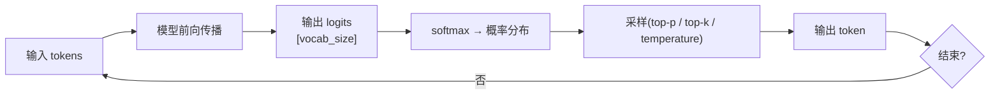

### 约束解码的改造

约束解码在 logits → 采样 之间插入一步**约束过滤**:

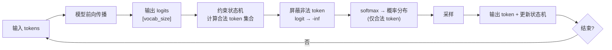

### 数学表达

标准采样:
$$P(t_i) = \text{softmax}(\text{logits}_i)$$

约束采样:
$$P(t_i) = \text{softmax}(\text{logits}_i \cdot \mathbb{1}[t_i \in \text{Valid}(\text{state})] + (-\infty) \cdot \mathbb{1}[t_i \notin \text{Valid}(\text{state})])$$

其中 $\text{Valid}(\text{state})$ 是当前状态下合法 token 的集合,由约束状态机计算。

### Token vs 字符: 一个核心难题

约束通常定义在**字符级别**(正则、JSON),但 LLM 在**token 级别**生成(BPE/SentencePiece)。一个 token 可能:
- 跨越约束边界(如 token `"Na` 横跨字符串和键)
- 包含多个字符(如 token `ation`)
- 不完整(如 token `"` 只是字符串开始)

**解法**: 构建一个 **token-level DFA**(确定有限自动机),预先计算每个状态下每个 token 是否合法。这正是 Outlines 的核心工程。

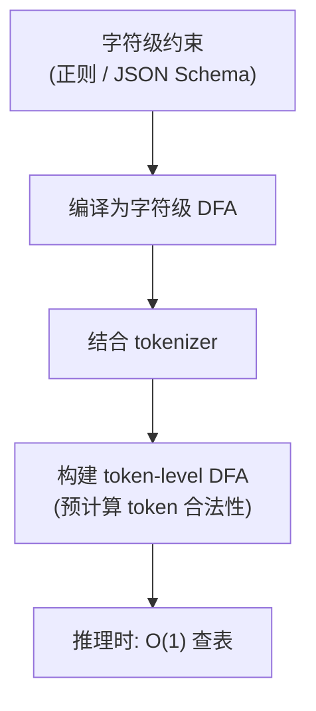

## 正则表达式约束

### 原理

1. 将正则表达式编译为 NFA → DFA
2. 将 DFA 与 tokenizer 结合,构建 token-level 转移函数
3. 推理时,每步查 DFA 当前状态,确定合法 token 集合

### Outlines 正则约束示例

```python
from outlines import models, generate

model = models.transformers("mistral-7b-instruct")

# 约束 1: 只输出日期格式
date_gen = generate.regex(model, r"\d{4}-\d{2}-\d{2}")
print(date_gen("Today is"))
# 输出: 2026-07-11 (保证格式)

# 约束 2: 只输出邮箱
email_gen = generate.regex(model, r"[\w.]+@[\w]+\.[a-z]{2,}")
print(email_gen("Contact:"))
# 输出: allen@example.com (保证格式)

# 约束 3: 只输出枚举值
choice_gen = generate.choice(model, ["positive", "negative", "neutral"])
print(choice_gen("Sentiment of 'great product':"))
# 输出: positive (一定是三者之一)
```

### llama.cpp GBNF 正则约束

[llama.cpp](https://github.com/ggerganov/llama.cpp) 用 GBNF(GGML BNF)语法定义约束:

```gbnf
# GBNF 语法示例: 强制输出合法 JSON
root        ::= object
object      ::= "{" ws (pair (ws "," ws pair)*)? "}"
pair        ::= string ws ":" ws value
value       ::= object | array | string | number | ("true") | ("false") | ("null")
array       ::= "[" ws (value (ws "," ws value)*)? "]"
string      ::= "\"" ([^"\\] | "\\" .)* "\""
number      ::= ("-")? ([0-9] | [1-9] [0-9]*) ("." [0-9]+)? ([eE] [-+]? [0-9]+)?
ws          ::= [ \t\n]*
```

```bash
# 运行时指定语法
./main -m model.gguf --grammar-file=json.gbnf -p "Output JSON:"
```

### 正则约束的局限

| 局限 | 说明 |
|------|------|
| **不支持递归结构** | 正则无法表达嵌套(如嵌套 JSON) → 需 CFG |
| **复杂正则编译慢** | 灾难性回溯正则编译耗时可达秒级 |
| **Token 对齐开销** | 多字节 token 需特殊处理 |
| **表达能力有限** | 只能描述正则语言,无法描述上下文相关结构 |

## JSON Schema 约束

### 原理

JSON Schema 约束是实际中最常用的约束形式:

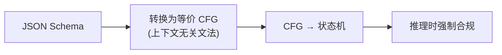

### Pydantic → JSON Schema → 约束

```python
from pydantic import BaseModel, Field
from typing import Literal
from outlines import models, generate

# Step 1: 用 Pydantic 定义 schema
class Person(BaseModel):
    name: str = Field(..., min_length=1, max_length=50)
    age: int = Field(..., ge=0, le=150)
    gender: Literal["male", "female", "other"]
    email: str = Field(..., pattern=r"^[\w.]+@[\w]+\.[a-z]{2,}$")

# Step 2: Outlines 自动转换为约束
model = models.transformers("llama-3-8b-instruct")
generator = generate.json(model, Person)

# Step 3: 生成 —— 100% 合规
person = generator("Extract: John is a 30-year-old male, john@test.com")
print(person)
# Person(name="John", age=30, gender="male", email="john@test.com")
```

### 约束保证的细节

Outlines/Instructor 会保证:
- ✅ 所有必填字段都出现
- ✅ 字段类型正确(string/int/float/bool/array/object)
- ✅ 枚举值只能是预定义值
- ✅ 数值范围合规(`ge`, `le`, `gt`, `lt`)
- ✅ 字符串长度合规(`min_length`, `max_length`)
- ✅ 正则 pattern 合规
- ✅ 嵌套结构深度合规

### 复杂 Schema 示例

```python
from pydantic import BaseModel, Field
from typing import Optional
from enum import Enum

class Priority(str, Enum):
    LOW = "low"
    MEDIUM = "medium"
    HIGH = "high"

class SubTask(BaseModel):
    title: str
    done: bool = False

class Task(BaseModel):
    title: str = Field(..., max_length=100)
    priority: Priority
    assignee: Optional[str] = None
    subtasks: list[SubTask] = Field(default_factory=list, max_length=10)
    tags: list[str] = Field(default_factory=list)

# Outlines 能约束这个嵌套 schema
generator = generate.json(model, Task)
```

## CFG 约束

Context-Free Grammar(CFG)约束是最通用的约束形式,能描述任意嵌套结构。

### 为什么需要 CFG?

正则无法描述嵌套结构:
```
# 这个结构无法用正则表达(括号嵌套):
expr ::= expr "+" expr | expr "*" expr | "(" expr ")" | number

# 正则无法匹配无限嵌套的括号
```

CFG 用产生式规则递归定义:

### Outlines CFG 示例

```python
from outlines import models, generate

# 约束输出合法的数学表达式
math_grammar = """
expr    ::= term (("+" | "-") term)*
term    ::= factor (("*" | "/") factor)*
factor  ::= number | "(" expr ")"
number  ::= [0-9]+ ("." [0-9]+)?
"""

model = models.transformers("qwen2.5-7b")
generator = generate.cfg(model, math_grammar)
result = generator("Calculate: ")
# 输出一定是合法数学表达式,如 "(3 + 5) * 2 / 4"
```

### SQL 生成约束

```python
# 约束输出合法 SQL
sql_grammar = """
query       ::= select_stmt
select_stmt ::= "SELECT" column_list "FROM" table ("WHERE" condition)?
column_list ::= "*" | column ("," column)*
column      ::= identifier
table       ::= identifier
condition   ::= column operator value
operator    ::= "=" | "!=" | "<" | ">" | "<=" | ">="
value       ::= number | string_literal
identifier  ::= [a-zA-Z_][a-zA-Z0-9_]*
string_literal ::= "'" ([^'])* "'"
number      ::= [0-9]+
"""

generator = generate.cfg(model, sql_grammar)
```

### CFG 约束的挑战

| 挑战 | 说明 | 解法 |
|------|------|------|
| **CFG → 状态机不简单** | CFG 理论上可转 PDA(下推自动机),但工程实现复杂 | Outlines 用 LR(1)/GLR 解析 |
| **二义性文法** | 同一输入有多种解析 | 设计时消除二义性 |
| **编译开销大** | 复杂 CFG 编译可达秒级 | 预编译 + 缓存 |
| **左递归** | `A ::= A "x" | "a"` 会导致无限循环 | 改写为右递归或用 GLR |

## Outlines 框架深度解析

[Outlines](https://github.com/dottxt-ai/outlines) 是约束解码领域最成熟的开源框架,由 dottxt-ai 维护。

### 架构

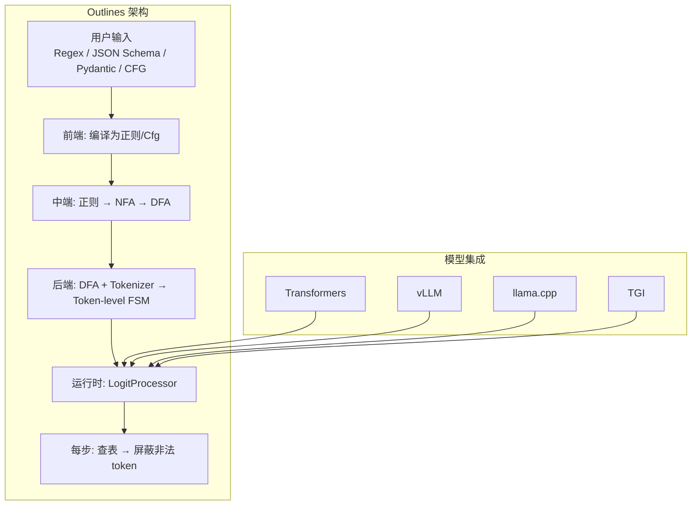

### 核心组件

#### 1. FSM(有限状态机)构建

```python
# Outlines 内部流程(简化)
def compile_to_fsm(regex_or_grammar):
    # Step 1: 正则 → NFA (Thompson 构造)
    nfa = regex_to_nfa(regex_or_grammar)
    # Step 2: NFA → DFA (子集构造)
    dfa = nfa_to_dfa(nfa)
    # Step 3: DFA 最小化(Hopcroft)
    dfa = minimize(dfa)
    return dfa

def build_token_fsm(dfa, tokenizer):
    # 预计算: 每个状态下每个 token 是否合法
    token_fsm = {}
    for state in dfa.states:
        valid_tokens = []
        for token_id, token_str in tokenizer.vocab.items():
            next_state = dfa.transition(state, token_str)
            if next_state is not None:
                valid_tokens.append((token_id, next_state))
        token_fsm[state] = valid_tokens
    return token_fsm
```

#### 2. 运行时 LogitProcessor

```python
class OutlinesLogitProcessor:
    def __init__(self, token_fsm, initial_state):
        self.fsm = token_fsm
        self.state = initial_state

    def __call__(self, input_ids, logits):
        # 查当前状态的合法 token
        valid = self.fsm[self.state]
        # 屏蔽所有非法 token
        mask = torch.full_like(logits, float('-inf'))
        for token_id, next_state in valid:
            mask[token_id] = 0
            self.next_state = next_state  # 记录转移
        logits = logits + mask
        # 采样后更新状态
        return logits

    def update(self, chosen_token_id):
        # 根据 token 转移到下一状态
        self.state = self.compute_next_state(chosen_token_id)
```

#### 3. Token 对齐处理

Outlines 处理 token 跨越字符状态的关键算法:

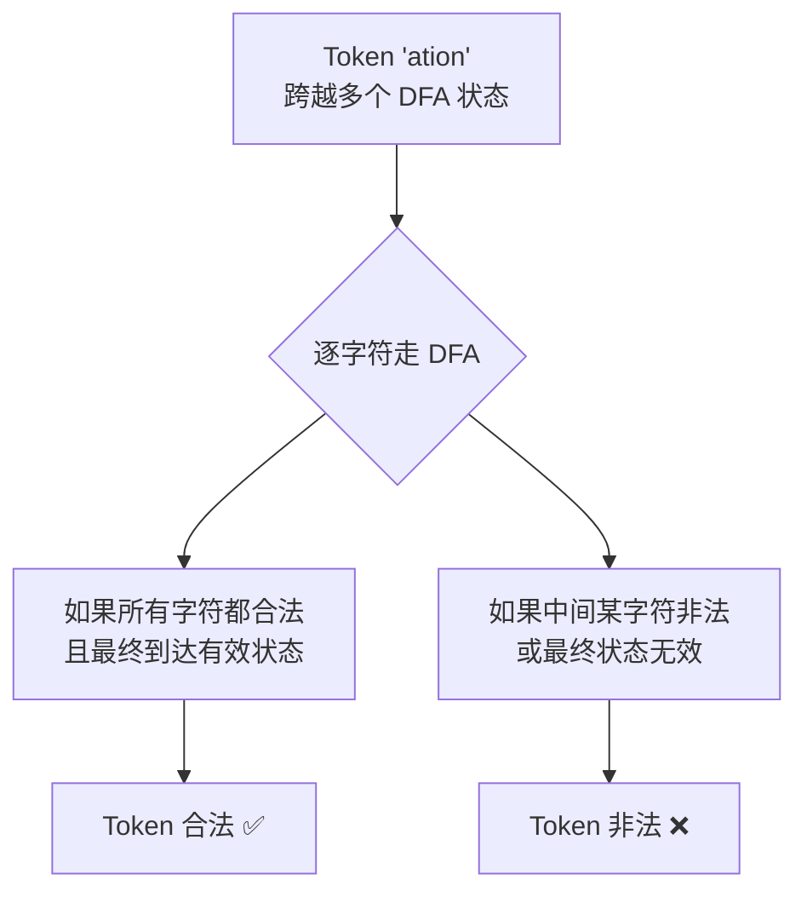

这个过程在 schema 编译时一次性预计算,运行时是 O(1) 查表。

### Outlines 支持的生成模式

```python
from outlines import generate

# 1. 正则约束
generate.regex(model, r"\d{4}-\d{2}-\d{2}")

# 2. JSON Schema 约束
generate.json(model, MyPydanticModel)

# 3. CFG 约束
generate.cfg(model, grammar_string)

# 4. 枚举约束
generate.choice(model, ["A", "B", "C"])

# 5. 类型约束(基本类型)
generate.format(model, "int")  # / "float" / "bool" / "date" / "time" / "email"

# 6. 文本约束(从示例推断)
generate.text(model)
```

### Outlines 的集成

| 后端 | 集成方式 |
|------|----------|
| Transformers | `models.transformers()` |
| vLLM | `models.vllm()` / 通过 guided decoding |
| llama.cpp | `models.llamacpp()` |
| TGI | 通过 `grammar` 参数 |
| ExLlamaV2 | `models.exllamav2()` |
| Mamba | `models.mamba()` |
| MLX | `models.mlx()` |

### Outlines 的性能特征

| 场景 | 编译时间 | 运行时开销 |
|------|----------|------------|
| 简单正则(日期、邮箱) | <100ms | 2-5% |
| 中等 JSON Schema(10 字段) | 200-500ms | 5-10% |
| 复杂 JSON Schema(嵌套 3+) | 500ms-2s | 10-20% |
| CFG(SQL 语法) | 1-5s | 10-30% |

> 编译时间可通过缓存复用摊薄——同 schema 只需编译一次。

## lm-format-enforcer 对比

[lm-format-enforcer](https://github.com/damian-romeron/lm-format-enforcer) 是 Outlines 的主要替代品。

### 核心差异

| 特性 | Outlines | lm-format-enforcer |
|------|----------|---------------------|
| **工作粒度** | Token 级别 | 字节/字符级别 |
| **约束表示** | FSM(预编译) | CharacterLevelParser(动态) |
| **编译开销** | 一次性预编译 | 运行时动态解析 |
| **Token 对齐** | 预计算查表 | 实时字符级判断 |
| **内存占用** | 高(存完整 FSM) | 低 |
| **长序列性能** | 稳定 | 随复杂度增长 |
| **集成生态** | 广(多后端) | 专注 vLLM/TGI |

### 字节级 vs Token 级

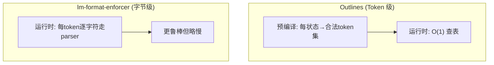

**字节级的优势**: 对 tokenizer 更鲁棒——不依赖 token 预计算,对动态/自定义 tokenizer 友好。

### lm-format-enforcer 示例

```python
from pydantic import BaseModel
from lmformatenforcer import JsonSchemaParser
from lmformatenforcer.integrations.transformers import (
    build_transformers_prefix_allowed_tokens_fn
)

class Answer(BaseModel):
    question: str
    answer: str
    confidence: float

# Step 1: 创建 parser
parser = JsonSchemaParser(Answer.model_json_schema())

# Step 2: 构建 transformers 钩子
prefix_fn = build_transformers_prefix_allowed_tokens_fn(
    tokenizer, parser
)

# Step 3: 生成
output = model.generate(
    "What is the capital of France?",
    prefix_allowed_tokens_fn=prefix_fn,
    max_new_tokens=200,
)
```

### 与 vLLM 集成

```python
# vLLM 原生支持 guided decoding(底层可用 Outlines 或 lm-format-enforcer)
from vllm import LLM, SamplingParams
from vllm.sampling_params import GuidedDecodingParams

llm = LLM(model="meta-llama/Llama-3-8B-Instruct")

guided = GuidedDecodingParams(json=Answer.model_json_schema())
params = SamplingParams(guided_decoding=guided, max_tokens=200)

outputs = llm.generate(["What is..."], params)
```

### 何时选择哪个?

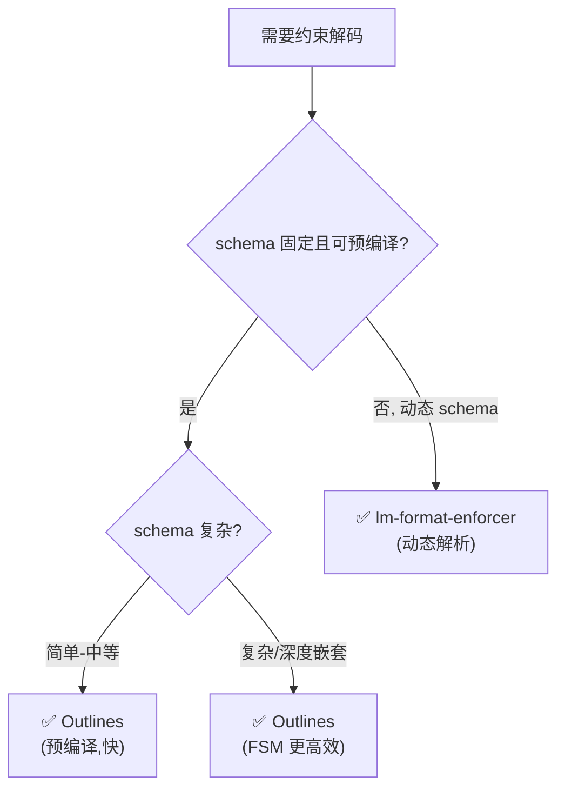

## 性能分析

约束解码不是免费的——屏蔽 token 需要额外计算。

### 开销来源

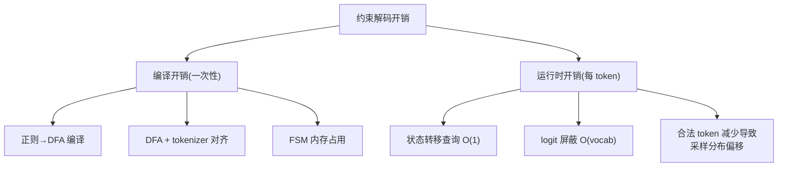

### 实测吞吐量影响

| Schema 复杂度 | 无约束吞吐 | Outlines 吞吐 | 衰减 |
|---------------|-----------|---------------|------|
| 无约束 | 100% | - | - |
| 枚举(choice) | 100% | 98% | ~2% |
| 简单正则(日期) | 100% | 96% | ~4% |
| 简单 JSON(5 字段) | 100% | 92% | ~8% |
| 中等 JSON(10 字段,嵌套 2) | 100% | 85% | ~15% |
| 复杂 JSON(20+字段,嵌套 4+) | 100% | 72% | ~28% |
| CFG(SQL 语法) | 100% | 65% | ~35% |

> 测试基于 Llama-3-8B,A100 80GB,batch_size=1。实际数值随模型/硬件/schema 细节变化。

### 为什么会变慢?

1. **合法 token 减少**: 合法 token 越少,采样分布越尖锐,可能生成质量下降
2. **logit 屏蔽开销**: 每步需修改 vocab_size 个 logit
3. **状态查询**: 虽然是 O(1),但常数项不可忽略
4. **并行度降低**: batch 内不同请求可能在不同状态,难以统一优化

### 优化技巧

```python
# 1. 缓存编译结果
from functools import lru_cache

@lru_cache(maxsize=128)
def get_compiled_fsm(schema_hash):
    return outlines.compile(schema_hash)

# 2. 预编译常用 schema(服务启动时)
COMMON_SCHEMAS = [UserAPI, ProductAPI, OrderAPI]
for schema in COMMON_SCHEMAS:
    compile_and_cache(schema)

# 3. 简化 schema —— 用 Union/Optional 放宽非关键字段
class User(BaseModel):
    name: str  # 必填,严格约束
    bio: Optional[str] = None  # 选填,宽松
    preferences: dict = Field(default_factory=dict)  # 用 dict 而非严格嵌套

# 4. 批处理摊薄编译开销
# 同 schema 的请求组成同一 batch
```

## 与 Function Calling 的关系与区别

约束解码与 Function Calling 是两种不同的结构化输出范式。

### 本质区别

| 维度 | Function Calling | 约束解码 |
|------|-----------------|----------|
| **工作层** | 模型训练层 | 解码层 |
| **保证方式** | 训练时对齐(微调) | 运行时硬约束 |
| **合规保证** | 99%(训练依赖) | 100%(数学保证) |
| **适用模型** | 闭源 API(GPT/Claude) | 开源本地模型 |
| **灵活性** | 受限于训练的函数集 | 任意 schema/文法 |
| **延迟开销** | ~0 | 5-30% |
| **质量影响** | 无(模型自由生成) | 可能(约束减少选择) |

### 关系图

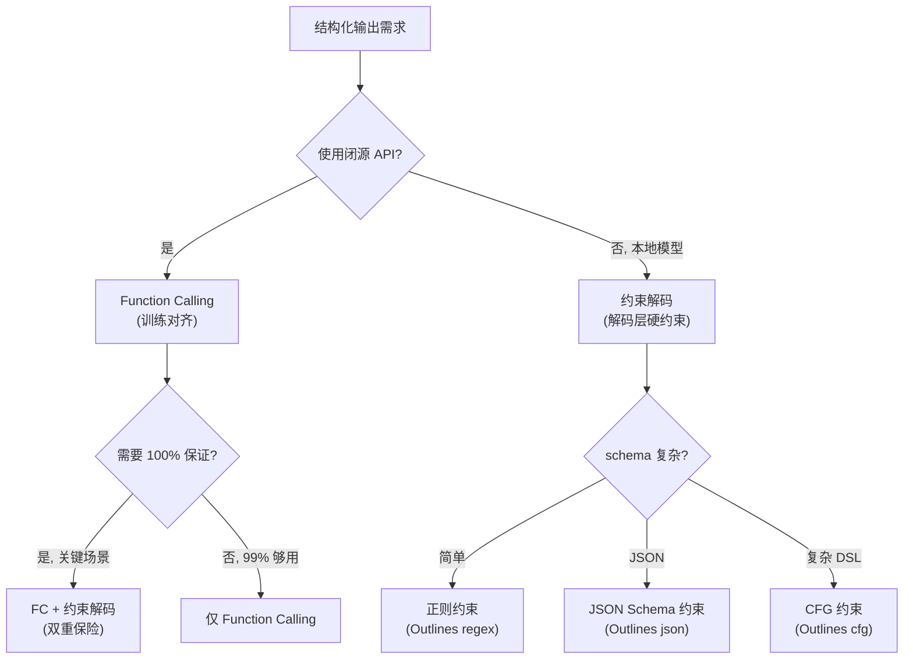

### 能否结合使用?

**可以**——对于关键场景,可以叠加使用:

```python
# 闭源 API: 用 Function Calling + Pydantic 验证(应用层约束)
# 本地模型: 用 Outlines(解码层约束)
# 两者通过 Instructor 统一接口
import instructor

# API 模式
api_client = instructor.from_openai(openai_client)

# 本地模式
local_client = instructor.from_transformers(
    outlines_model, mode=instructor.Mode.OUTLINES
)

# 统一接口
result = (api_client if use_api else local_client).create(
    response_model=MySchema,
    messages=[...],
)
```

## 生产实践

### 错误恢复策略

即使约束解码保证 100% 合规,生产中仍需错误恢复——因为约束之外的问题可能发生:

#### 1. 超长输出截断

```python
def generate_with_length_guard(generator, prompt, max_tokens=500):
    """约束生成 + 长度保护"""
    result = generator(prompt, max_tokens=max_tokens)
    # 如果 JSON Schema 约束下输出被截断(达到 max_tokens)
    # Outlines 会在合法的完整结构处停止,但如果提前截断:
    if not is_complete_json(result):
        # 尝试自动补全
        result = repair_json(result)
    return result
```

#### 2. 语义质量兜底

约束解码保证**格式合规**,但不保证**语义正确**:

```python
# 模型可能输出合规但无意义的结果
# {"name": "asdf", "age": 999}  ← 合规但不合理

def validate_semantics(parsed_result):
    """应用层语义校验(约束解码之上)"""
    issues = []
    if parsed_result.age > 120:
        issues.append("age 不合理")
    if len(parsed_result.name) < 2:
        issues.append("name 过短")
    return issues
```

#### 3. Fallback 链

```python
async def robust_structured_output(prompt, schema):
    """多级 fallback: 约束解码 → 重试 → 解析容错"""
    # Level 1: 约束解码(100% 格式合规)
    try:
        return constrained_generate(prompt, schema)
    except SemanticError:
        pass  # 格式合规但语义不合理

    # Level 2: 放宽约束 + 重试
    try:
        relaxed_schema = relax_schema(schema)  # 放宽非关键字段
        return constrained_generate(prompt, relaxed_schema)
    except Exception:
        pass

    # Level 3: 裸生成 + 解析容错
    try:
        raw = await llm.generate(prompt)
        return parse_with_repair(raw, schema)
    except Exception:
        return None  # 或默认值
```

### 监控指标

| 指标 | 期望值 | 告警阈值 | 说明 |
|------|--------|----------|------|
| 格式合规率 | 100% | <100% | 约束失效(需立即排查) |
| 编译缓存命中率 | >90% | <70% | schema 多样性过高 |
| 推理延迟(P99) | 基线 ×1.2 | >基线 ×1.5 | 约束过复杂 |
| 语义质量通过率 | >90% | <80% | 约束太严影响质量 |
| 吞吐量 | 基线 ×0.85 | <基线 ×0.7 | 性能需优化 |

### 常见故障模式

| 故障 | 原因 | 解法 |
|------|------|------|
| 编译超时 | schema 过于复杂 | 简化 schema / 预编译 |
| 生成质量骤降 | 约束太严,合法 token 太少 | 放宽约束 |
| 内存溢出 | FSM 过大 | 用 lm-format-enforcer(字节级) |
| 首次请求慢 | 编译未缓存 | 服务启动时预热 |
| Token 对齐错误 | 自定义 tokenizer 不兼容 | 用标准 tokenizer 或字节级方案 |

## 2026 前沿

### GFN-based 约束生成

GFlowNet(GFN)是 2024-2026 年的前沿方向,它不"屏蔽"非法 token,而是**学习一个符合约束的生成策略**:

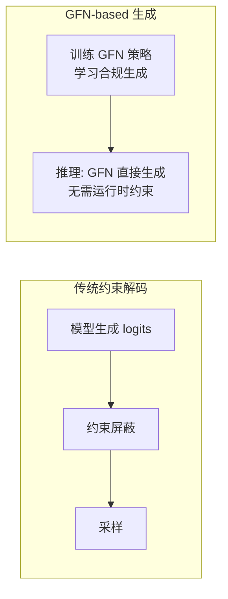

**优势**:
- 推理时无约束开销(零延迟)
- 生成的多样性更好(不暴力屏蔽)
- 可学习复杂约束(超出正则/CFG 表达力)

**现状**: 学术阶段,工业落地需 1-2 年成熟。

参考: [GFN for Constrained Language Generation (2024)](https://arxiv.org/abs/2406.14551)

### 其他前沿方向

| 方向 | 说明 | 成熟度 |
|------|------|--------|
| **神经符号约束** | 用神经网络学习软约束 + 符号硬约束结合 | 研究中 |
| **自适应约束** | 根据生成进度动态调整约束强度 | 早期 |
| **跨语言约束** | 多语言模型的统一约束 schema | 成熟中 |
| **约束蒸馏** | 把约束解码能力蒸馏进模型权重 | 研究中 |
| **硬件加速约束** | GPU kernel 加速 logit 屏蔽 | 工程优化 |

### 2026 约束解码技术栈

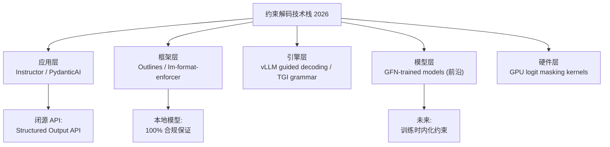

## Related

- [[05_大模型/15_约束生成/03_Structured_输出_指南|结构化输出完全指南]] — 上层视角的方案对比
- [[05_大模型/07_提示工程/13_Prompt工程_完整_指南|提示词工程]] — 格式输出的提示技巧
- [[15_智能体/14_GenAI课程/03_GenAI_L11_Integrating_with_Function_Calling|Function Calling]] — 训练层结构化输出
- [[05_大模型/04_LLM架构/07_LLM_Internals_推理|LLM 推理内部机制]] — 解码过程详解
- [[90_学习/04_实践指南/02_AI工程路线图2026|AI 工程路线图]] — 整体技术图谱
