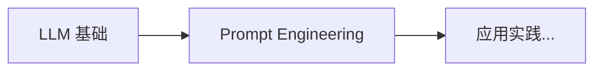

# 04 自然语言处理与大模型 (NLP & LLMs)

> 中文简称：04 自然语言处理与大模型

本章系统讲解自然语言处理的现代范式，从序列模型（RNN/LSTM）演进到 Transformer 架构，再到大语言模型（GPT/BERT）、微调技术（LoRA/QLoRA）和提示词工程。这是当前 AI 应用最活跃的领域。

## 学习路径 (Learning Path)

```
    ┌──────────────────┐
    │  序列模型         │
    │  Sequence Models │
    │  (RNN/LSTM)      │
    └────────┬─────────┘
             │
             ▼
    ┌──────────────────┐
    │  Transformer     │
    │  革命            │
    │  (Attention)     │
    └────────┬─────────┘
             │
             ▼
    ┌──────────────────┐
    │  大语言模型       │
    │  LLM Arch        │
    │  (GPT/BERT)      │
    └────────┬─────────┘
             │
             ├─────────────────────┐
             ▼                     ▼
    ┌────────────────┐    ┌───────────────┐
    │  微调技术       │    │  提示词工程   │
    │  Fine-tuning   │    │  Prompt Eng   │
    │  (LoRA/QLoRA)  │    │  (In-context) │
    └────────────────┘    └───────────────┘
```

## 🚀 速成指南 (In-Nutshell Quick Start)

> 面向初级运维人员的入门材料，包含丰富的 Mermaid 图示。



| 主题 | 描述 | 速成文档 |
|------|------|----------|
| **LLM 基础** | 理解大语言模型：Token、上下文窗口、Temperature、API 调用 | [10_LLM_基础_简明指南.md](./04_LLM架构/10_LLM_基础_简明指南.md) |
| **Prompt Engineering** | 掌握提示词工程：Zero-shot、Few-shot、CoT、角色扮演 | [17_Prompt_工程_简明指南.md](./07_提示工程/17_Prompt_工程_简明指南.md) |

---

## 内容索引 (Content Index)

| 主题 | 难度 | 描述 | 文档链接 |
|------|------|------|---------|
| 序列模型 (Sequence Models) | 入门 | RNN、LSTM、GRU，理解序列建模的早期方法 | [Sequence_Models/](./02_序列模型/) |
| Transformer 革命 (Transformer Revolution) | 进阶 | Self-Attention、多头注意力、位置编码，现代 NLP 核心架构 | [09_03_Transformer架构_Revolution.md](./03_Transformer架构/03_Transformer_Revolution.md) |
| 大语言模型架构 (LLM Architectures) | 进阶 | GPT（Decoder-only）、BERT（Encoder-only）、MoE，预训练范式 | [04_LLM架构.md](./04_LLM架构/05_LLM架构.md) |
| **推理模型 2026 (Reasoning Models)** | **2026 新增** | **o1/o3 推理模型、思维链进化、Test-Time Compute Scaling** | **[15_推理模型_2026.md](./04_LLM架构/15_推理模型_2026.md)** |
| **长上下文模型 2026 (Long Context)** | **2026 新增** | **100K-1M Token处理、稀疏注意力、KV Cache优化** | **[11_Long_上下文_模型_2026.md](./04_LLM架构/11_Long_上下文_模型_2026.md)** |
| **架构演进大白话 (Architecture Evolution for Dummy)** | **2026 新增** | **KV 压缩、Mamba、RetNet 大白话解释** | **[04_LLM_架构_Evolution.md](./04_LLM架构/04_LLM_架构_Evolution.md)** |
| **多模态模型 (Multimodal)** | 进阶 | **视觉-语言统一架构、GPT-4V/Gemini/LLaVA** | **[06_多模态_架构_2026.md](./09_多模态模型/06_多模态_架构_2026.md)** |
| 微调技术 (Fine-tuning Techniques) | 实战 | LoRA、QLoRA、Prefix Tuning，参数高效微调方法 | [03_微调技术.md](./06_微调技术/03_微调技术.md) |
| 提示词工程 (Prompt Engineering) | 实战 | Few-shot、Chain-of-Thought、提示优化，零代码调用 LLM | [Prompt_Engineering/](./07_提示工程/) |
| **Structured Output 框架** | **2026 新增** | **Instructor/Guidance/Outlines/DSPy 结构化输出** | **[Prompt_Engineering/](./07_提示工程/)** |
| **中国大模型生态 (Chinese LLM Ecosystem)** | **2026 新增** | **DeepSeek/Qwen/GLM/Kimi/MiniMax 五大厂商技术路线、模型矩阵与 Benchmark 全景对比** | **[Chinese_LLM_Ecosystem/README.md](./14_中国LLM生态/README.md)** |
| **国际大模型生态 (Global LLM Ecosystem)** | **2026 新增** | **OpenAI/Google/Anthropic/Meta/Mistral 五大厂商技术路线、模型矩阵与 Benchmark 全景对比** | **[Global_LLM_Ecosystem/README.md](./13_全球LLM生态/README.md)** |
| **语音与音频 AI** | **2026 新增** | **Whisper ASR、CosyVoice TTS、GPT-4o 实时对话、音乐生成** | **[Speech_Audio_AI/](./10_语音音频AI/)** |
| **LLM 数据工程** | **2026 新增** | **预训练数据清洗、SFT 数据构建、合成数据飞轮、数据配比** | **[LLM_Data_Engineering/](./05_LLM数据工程/)** |
| **小模型与端侧 LLM** | **2026 新增** | **Phi-3/Gemma/Qwen 小模型、GPTQ/AWQ 量化、llama.cpp/MLC-LLM 端侧部署** | **[Edge_LLM/](./11_端侧大模型/)** |
| **LLM 生产部署 Runbook** | **生产必备** | **vLLM/TGI/SGLang 推理引擎、KV Cache、量化、多模型路由、安全监控** | **[07_LLM_生产_部署_操作手册.md](../10_部署推理/01_部署基础/07_LLM_生产_部署_操作手册.md)** |

## 前置知识 (Prerequisites)

- **必修**: [神经网络核心](../03_深度学习/02_神经网络核心/09_神经网络核心.md)（理解反向传播）
- **必修**: [优化与正则化](../03_深度学习/03_优化方法/02_优化.md)（训练大模型）
- **推荐**: [线性代数](../01_数学基础/02_线性代数/03_线性代数.md)（理解注意力机制的矩阵运算）
- **可选**: [概率统计](../01_数学基础/03_概率统计/02_概率统计.md)（理解语言模型概率建模）

## 关键术语速查 (Key Terms)

- **Self-Attention**: 自注意力机制，根据输入序列动态计算权重关系
- **Multi-Head Attention**: 多头注意力，并行多个注意力头捕捉不同特征
- **位置编码 (Positional Encoding)**: 为序列位置注入顺序信息
- **GPT (Generative Pre-trained Transformer)**: Decoder-only 架构，擅长文本生成
- **BERT (Bidirectional Encoder)**: Encoder-only 架构，擅长理解任务（分类/NER）
- **预训练 (Pre-training)**: 大规模无监督训练，学习通用语言表示
- **LoRA (Low-Rank Adaptation)**: 低秩矩阵微调，大幅降低微调参数量
- **QLoRA**: LoRA + 量化，在消费级 GPU 上微调大模型
- **RLHF (Reinforcement Learning from Human Feedback)**: 基于人类偏好对齐模型输出
- **提示词工程 (Prompt Engineering)**: 设计输入文本引导模型输出，无需微调

### 推理模型 (2026新增)
- **Chain-of-Thought (CoT)**: 思维链提示，诱导模型展示推理过程
- **Test-Time Compute Scaling**: 测试时计算扩展，动态分配推理计算资源
- **o1/o3**: OpenAI推理模型，通过RL训练内部推理token
- **Quiet Thinking**: 安静思考模式，推理过程不输出给用户
- **Reasoning RL**: 推理强化学习，训练模型"如何思考"而非"思考什么"

---
## 相关技术域（跨域引用）

> 以下主题虽不归属本域，但与大模型技术密切相关，列出以便交叉查阅，避免内容重复建设。

- **LLM 评估与基准** → [[08_模型评估/03_LLM评估/INDEX|模型评估域]] — MMLU / GSM8K / HumanEval / SWE-bench / Arena / C-Eval 全基准解读
- **模型量化** → [[10_部署推理/04_模型量化/04_量化_技术_2026|部署推理域]] — GPTQ / AWQ / GGUF / INT4-INT8 / 量化精度分析
- **KV Cache 与推理优化** → [[10_部署推理/03_推理优化/05_KV_Cache_深入分析|部署推理域]] — PagedAttention / KV 压缩 / MLA / 投机解码
- **LLM 生产部署** → [[10_部署推理/01_部署基础/INDEX|部署推理域]] — vLLM / TGI / SGLang 推理引擎 / 多模型路由
- **安全 / 红队 / 对齐** → [[17_伦理安全/04_AI安全与红队/INDEX|伦理安全域]] — 越狱 / Prompt 注入 / Guardrails / 红队测试
- **幻觉与事实性** → [[概念/Safety/hallucination|概念域]] — 幻觉成因 / 检测 / 缓解 / RAG 增强
- **RAG 系统** → [[14_RAG系统/INDEX|RAG 系统域]] — 检索增强生成 / 向量库 / RAG 评估
- **AI 智能体** → [[15_智能体/INDEX|智能体域]] — Agent 框架 / 工具调用 / 多 Agent 协作
- **模型训练** → [[07_模型训练/INDEX|模型训练域]] — 预训练 / 分布式训练 / RLHF / GRPO 对齐

---
*Last updated: 2026-08-05* - 整理 03/04 Transformer 合并、死链修复、跨域引用补全

## Related
- [[05_大模型/02_序列模型/02_序列模型|序列模型 - 小白版]]
- [[05_大模型/02_序列模型/02_序列模型|序列模型 (Sequence Models)]]
- [[05_大模型/README|04 自然语言处理与大模型 - 小白版]]

- [[05_大模型/06_微调技术/09_PEFT_2026]] — PEFT 2026 (参数高效微调) (共享: bert, gpt, llm, nlp, transformer)
- [[05_大模型/06_微调技术/README]] — 微调技术 (Fine-tuning Techniques) (共享: bert, gpt, llm, nlp, transformer)
- [[05_大模型/01_LLM基础/05_LLM_基础]] — 大语言模型基础速成指南 (共享: bert, gpt, llm, nlp, transformer)
- [[05_大模型/09_多模态模型/06_多模态_架构_2026]] — 多模态模型架构 2026：从 GPT-4V 到原生多模态 AGI (共享: bert, gpt, llm, nlp, transformer)
- [[05_大模型/04_LLM架构/05_LLM架构]] — LLM_Architectures_for_dummy
- [[05_大模型/04_LLM架构/05_LLM架构]] — LLM_Architectures
- [[05_大模型/04_LLM架构/15_推理模型_2026]] — Reasoning_Models_2026
- [[05_大模型/03_Transformer架构/03_Transformer_Revolution]] — Transformer_Revolution_for_dummy
- [[05_大模型/03_Transformer架构/03_Transformer_Revolution]] — Transformer_Revolution
- [[05_大模型/06_微调技术/01_Axolotl_深入分析]] — Axolotl_Deep_Dive
- [[05_大模型/06_微调技术/12_Unsloth_深入分析]] — Unsloth_Deep_Dive
- [[05_大模型/06_微调技术/Model_Merging_2026]] — Model_Merging_2026
- [[05_大模型/06_微调技术/03_微调技术]] — Fine_tuning_Techniques
- [[05_大模型/06_微调技术/03_微调技术]] — Fine_tuning_Techniques_for_dummy
- [[05_大模型/08_推理模型/Test_Time_Compute_2026]] — Test_Time_Compute_2026
- [[05_大模型/04_LLM架构/15_推理模型_2026]] — Reasoning_Models_for_dummy
- [[05_大模型/07_提示工程/16_Prompt工程]] — Prompt_Engineering
- [[05_大模型/07_提示工程/11_Outlines_深入分析]] — Outlines_Deep_Dive
- [[05_大模型/07_提示工程/16_Prompt工程]] — Prompt Engineering 速成指南
- [[05_大模型/07_提示工程/16_Prompt工程]] — Prompt_Engineering_for_dummy
- [[治理/_meta/_nlp-llms-split-assessment-2026-06-22|Llm Nlp]]

- [[05_大模型/04_LLM架构/README|LLM 架构目录]]
- [[05_大模型/12_LLM产品/07_instructor_概览|Instructor 结构化输出库概览]]
- [[05_大模型/12_LLM产品/08_outlines_概览|Outlines 受控生成框架概览]]
- [[05_大模型/12_LLM产品/09_perplexity_概览|Perplexity AI 概览]]
- [[05_大模型/09_多模态模型/README|多模态模型目录]]
- [[05_大模型/07_提示工程/README|提示词工程与结构化输出 (Prompt Engineering & Structured Output)]]
- [[05_大模型/08_推理模型/README|推理模型目录]]
- [[Transformer_Training_vs_Inference|Transformer 在大模型训练与推理中的应用]]

## 本期新增

- [[05_大模型/09_多模态模型/07_Native_多模态_架构|Native Multimodal Architectures: From GPT-4V to Gemini 2.5]]
- [[05_大模型/09_多模态模型/05_Modality_Fusion_Mechanisms|Modality Fusion Mechanisms: Deep Dive]]
- [[05_大模型/09_多模态模型/Video_Understanding_Architectures|Video Understanding Architectures]]
- [[05_大模型/04_LLM架构/13_MoE_Routing_and_负载均衡|MoE Routing and Load Balancing]]
- [[05_大模型/04_LLM架构/12_MoE_Case_Studies_DeepSeek_Mixtral|MoE Case Studies: DeepSeek and Mixtral]]
- [[05_大模型/04_LLM架构/16_Transformer_替代架构|Transformer Alternatives: RWKV, RetNet, Mamba, and Beyond]]
- [[05_大模型/08_推理模型/04_o1_Class_推理模型|o1-Class Reasoning Models]]
- [[05_大模型/08_推理模型/INDEX|DeepSeek R1 Technical Analysis]]
- [[05_大模型/08_推理模型/06_Process_Reward_模型|Process Reward Models]]
- [[05_大模型/14_中国LLM生态/README|中国大模型生态全景：DeepSeek / Qwen / GLM / Kimi / MiniMax]]
- [[05_大模型/14_中国LLM生态/25_DeepSeek_架构_2026|DeepSeek 技术全景深度解析]]
- [[05_大模型/14_中国LLM生态/19_Qwen_深入分析|Qwen 通义千问技术全景深度解析]]
- [[05_大模型/14_中国LLM生态/09_GLM_Zhipu_深入分析|GLM 智谱 AI 技术全景深度解析]]
- [[05_大模型/14_中国LLM生态/13_Kimi_Moonshot_深入分析|Kimi 月之暗面技术全景深度解析]]
- [[05_大模型/14_中国LLM生态/14_MiniMax_深入分析|MiniMax 稀宇科技技术全景深度解析]]
- [[05_大模型/14_中国LLM生态/23_Xiaomi_MiMo_深入分析|小米 MiMo 技术全景深度解析]]
- [[05_大模型/13_全球LLM生态/README|国际大模型生态全景：OpenAI / Google / Anthropic / Meta / Mistral]]
- [[05_大模型/13_全球LLM生态/09_OpenAI_深入分析|OpenAI 技术深度解析：从 GPT-3 到 o3]]
- [[05_大模型/13_全球LLM生态/05_Google_Gemini_深入分析|Google Gemini 技术深度解析]]
- [[05_大模型/13_全球LLM生态/01_Anthropic_Claude_深入分析|Anthropic Claude 技术深度解析]]
- [[05_大模型/13_全球LLM生态/07_Meta_LLaMA_深入分析|Meta LLaMA 技术深度解析]]
- [[05_大模型/13_全球LLM生态/08_Mistral_AI_深入分析|Mistral AI 技术深度解析]]

## 相关页面
- [[05_大模型/06_微调技术/Tool_Use_and_Agent_Fine_Tuning|Tool Use 与 Agent 微调 (Tool-Use and Agent Fine-Tuning)]]
- [[05_大模型/11_端侧大模型/README|小模型与端侧 LLM (Edge LLM)]]
- [[05_大模型/11_端侧大模型/01_端侧大模型_深入分析|小模型与端侧 LLM 深度解读: 从高效模型到端侧部署]]
- [[概念/LLM/llm-data-engineering|LLM 数据工程深度解读: 从预训练数据到合成数据]]
- [[05_大模型/05_LLM数据工程/README|LLM 数据工程 (LLM Data Engineering)]]
- [[05_大模型/10_语音音频AI/Speech_Audio_AI_Deep_Dive|语音与音频 AI 深度解读: 从 Whisper 到 CosyVoice 再到 AudioLM]]
- [[05_大模型/10_语音音频AI/README|语音与音频 AI (Speech & Audio AI)]]

- [[概念/long-context-models|Long Context Models]]
- [[概念/kv-cache-compression|KV Cache 压缩]]
- [[概念/mamba|Mamba]]
- [[概念/retnet|RetNet]]
- [[05_大模型/04_LLM架构/04_LLM_架构_Evolution|架构演进大白话]]

- [[概念/sequence-models|Sequence Models]]

## 新增页面

- [[05_大模型/15_约束生成/03_Structured_输出_指南|结构化输出指南]]

## 域统计

| 指标 | 数值 |
|------|------|
| 子目录数 | 16（04 编号已废弃，原 04_Transformer革命 已合并入 03_Transformer架构） |
| 内容文件数 | 114 |
| 全部达 200+ 行 | ✅ |
| 最后更新 | 2026-08-05 |

> 💡 大模型域是知识库中最大的域之一，覆盖从 Transformer 基础到 LLM 应用的全栈知识。
