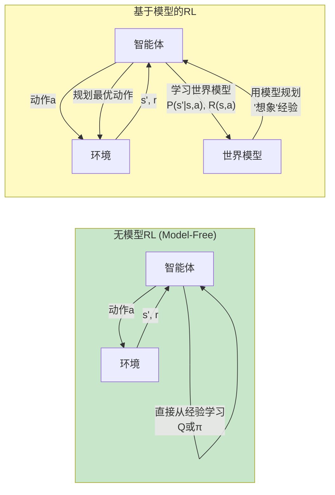
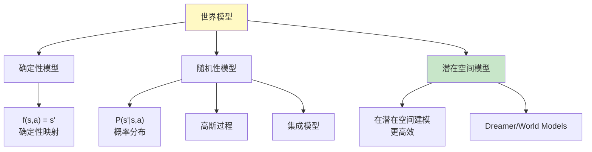
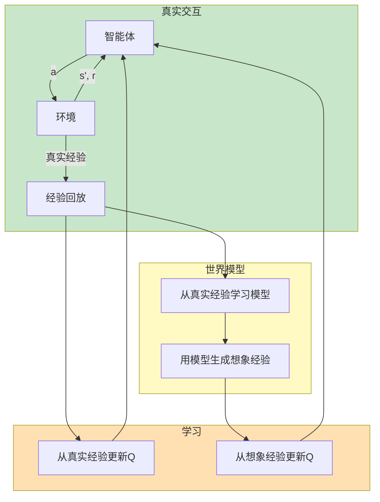
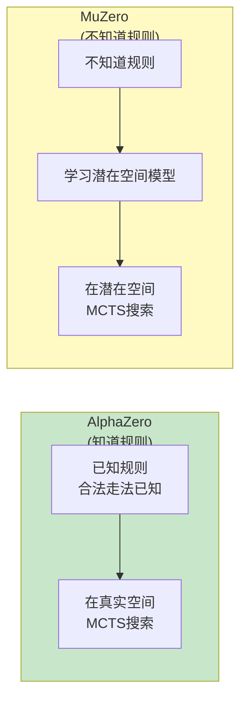
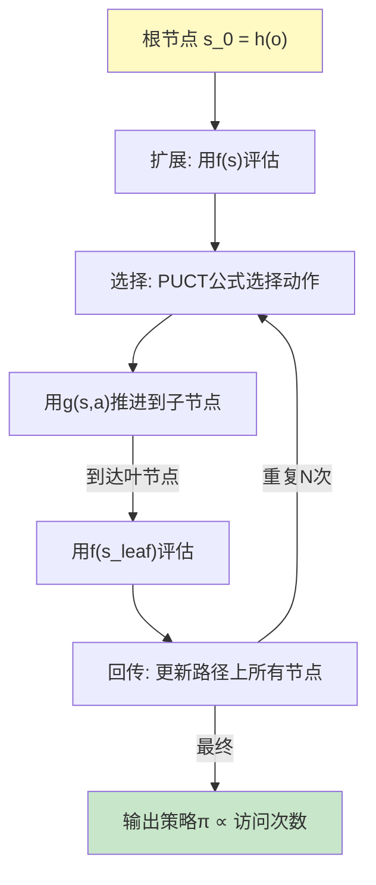
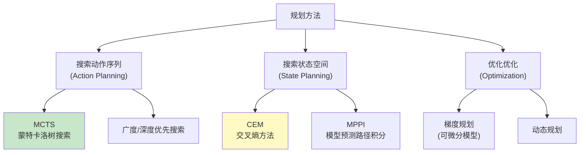
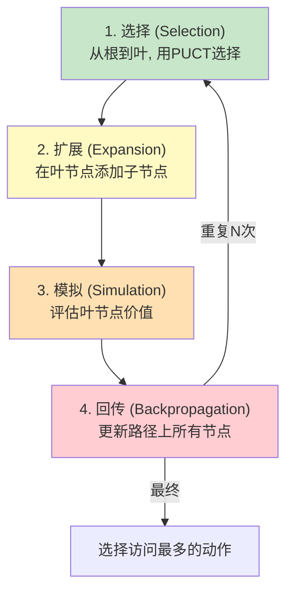
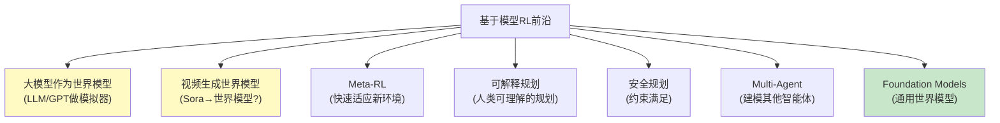

# 基于模型的RL深度解析 (Model-Based RL Deep Dive)

> 中文简称：基于模型的RL深度解析

> **一句话理解**: 基于模型的RL就像下棋时在脑中推演——先学会环境的规则(世界模型)，然后在"脑中"模拟各种可能的走法(规划)，选择最优的那一步，而不是盲目试错。

---

## 目录

- [论文信息](#论文信息)
- [1. 核心概念](#1-核心概念)
- [2. 模型 vs 无模型](#2-模型-vs-无模型)
- [3. 世界模型](#3-世界模型)
- [4. Dyna架构](#4-dyna架构)
- [5. MuZero](#5-muzero)
- [6. Planning与Learning结合](#6-planning与learning结合)
- [7. MCTS](#7-mcts)
- [8. 模型不确定性](#8-模型不确定性)
- [9. 代码实现](#9-代码实现)
- [10. 对比表格](#10-对比表格)
- [11. 应用与前沿](#11-应用与前沿)
- [Related](#related)

---

## 论文信息

| 属性 | 内容 |
|------|------|
| **Dyna** | Sutton, 1991 — 集成规划与学习 |
| **PETS** | Chua et al., NeurIPS 2018 — 概率集成轨迹采样 |
| **MuZero** | Schrittwieser et al., Nature 2020 — 无模型规划 |
| **Dreamer** | Hafner et al., ICLR 2020 — 潜在空间世界模型 |
| **世界模型** | Ha & Schmidhuber, 2018 — 世界模型 |

---

## 1. 核心概念

### 什么是基于模型的RL



### 世界模型

```
世界模型 (World Model / Dynamics Model):

学习环境的动态:
  转移模型: ŝ' = f(s, a)  或  P(s'|s,a)
  奖励模型: r̂ = R(s, a)   或  R(s,a,s')

有了世界模型后:
  → 可以"想象"未来轨迹
  → 不需要真实环境交互
  → 在模型中规划最优动作
  → 大幅减少真实交互需求

类比:
  → 无模型RL = 只能通过实际走迷宫学习
  → 基于模型RL = 先学会看地图，在地图上规划路线
```

### 基于模型RL的两大用途

```
用途1: 数据增强 (Imagination)
  → 用世界模型生成"假"经验
  → 补充到经验回放池
  → 提高数据效率

  原始数据: 1000步真实交互
  + 模型生成: 100000步想象经验
  → 等效于100100步 → 大幅提升

用途2: 规划 (Planning)
  → 在模型中搜索最优动作序列
  → 类似下棋时"走一步看N步"
  → 不需要学习Q函数

  搜索: 对每个候选动作
    → 在模型中推演未来
    → 选择预期回报最高的
```

---

## 2. 模型 vs 无模型

### 全面对比

| 维度 | 无模型RL (Model-Free) | 基于模型RL (Model-Based) |
|------|----------------------|--------------------------|
| **需要学习** | Q值/策略 | 世界模型 + Q值/策略 |
| **样本效率** | 🟠 低 | 🟢 高 |
| **计算量** | 🟢 低 | 🟡 高(规划开销) |
| **模型偏差** | 🟢 无 | 🟠 有(模型不准确) |
| **泛化能力** | 🟡 中 | 🟢 好(可迁移) |
| **规划能力** | ❌ | ✅ |
| **长期规划** | 🟠 难 | 🟢 好 |
| **超参数** | 少 | 多(模型+RL) |
| **典型算法** | DQN, SAC, PPO | MuZero, Dreamer, PETS |
| **适用场景** | 模拟器(样本廉价) | 真实世界(样本昂贵) |

### 样本效率的数学直觉

```
样本效率比较 (达到相同性能所需的环境交互步数):

任务: 达到HalfCheetah 6000分

无模型:
  SAC:      ~100,000 步
  PPO:     ~1,000,000 步

基于模型:
  PETS:       ~5,000 步  (20x 更高效!)
  Dreamer:    ~1,000 步  (100x 更高效!)
  MuZero:    内部模拟, 真实交互极少

原因:
  → 世界模型学一次, 用无数次
  → 每步可以想象上千次
  → 相当于免费获得大量"经验"
```

### 模型偏差问题

```
基于模型RL的核心风险: 模型偏差 (Model Bias)

如果世界模型不准确:
  → 在错误的模型上规划
  → 得到次优甚至危险的策略
  → "在错误的地图上导航"

模型误差来源:
  1. 数据不足 → 模型未充分学习
  2. 分布偏移 → 模型在未见状态不准确
  3. 复杂系统 → 无法完美建模
  4. 长期预测误差累积

误差累积:
  模型预测 ŝ_{t+1} 误差 ε
  → ŝ_{t+2} 基于 ŝ_{t+1} 预测 → 误差增大
  → 越往后推演, 误差越大
  → 长期规划不可靠
```

---

## 3. 世界模型

### 世界模型的形式



### 模型类型详解

#### 1. 确定性模型

```
确定性模型: ŝ' = f_θ(s, a)

最简单的形式:
  → 神经网络直接预测下一个状态
  → 输入: (s, a)
  → 输出: ŝ'

优点: 简单
缺点: 无法建模环境的随机性
适用: 确定性环境(棋类)
```

#### 2. 概率模型 (PETS)

```
概率模型: P(s'|s,a) = N(μ_θ(s,a), Σ_θ(s,a))

预测分布而非点:
  → 输出均值μ和方差σ²
  → 可以表示不确定性

集成模型 (Ensemble):
  → 训练N个模型 {f_1, ..., f_N}
  → 每个用不同的初始化/数据子集
  → 预测时取平均或采样
  → 模型间的不一致 = 认知不确定性

PETS (Probabilistic Ensembles with Trajectory Sampling):
  → 概率模型 + 集成
  → 在规划时从不同模型采样
  → TS (Trajectory Sampling): 每步随机选一个模型
  → 自然传播不确定性
```

#### 3. 潜在空间模型

```
潜在空间世界模型:

不在原始状态空间建模, 而是在压缩的潜在空间:

编码: z = encoder(s)           (图像 → 潜在)
建模: z' = dynamics(z, a)      (潜在空间动态)
解码: ŝ = decoder(z)           (潜在 → 重建)

优势:
  → 潜在空间更紧凑 (图像64×64×3 → 32维)
  → 动态更容易建模
  → 规划更高效

代表: World Models (Ha & Schmidhuber), Dreamer
```

### 世界模型的学习

```python
class WorldModel(nn.Module):
    """世界模型: 预测下一个状态和奖励"""

    def __init__(self, state_dim, action_dim, hidden_dim=200):
        super().__init__()
        # 状态转移模型
        self.dynamics = nn.Sequential(
            nn.Linear(state_dim + action_dim, hidden_dim),
            nn.ReLU(),
            nn.Linear(hidden_dim, hidden_dim),
            nn.ReLU(),
        )
        # 预测下一状态均值和方差
        self.mean_head = nn.Linear(hidden_dim, state_dim)
        self.logvar_head = nn.Linear(hidden_dim, state_dim)
        # 预测奖励
        self.reward_head = nn.Linear(hidden_dim, 1)

    def forward(self, state, action):
        h = self.dynamics(torch.cat([state, action], dim=-1))
        mean = self.mean_head(h)
        logvar = self.logvar_head(h).clamp(-10, 10)
        reward = self.reward_head(h)
        return mean, logvar.exp(), reward

    def loss(self, state, action, next_state, reward):
        mean, var, pred_reward = self.forward(state, action)
        # 高斯NLL损失
        state_loss = 0.5 * (
            (next_state - mean) ** 2 / var + torch.log(var)
        ).mean()
        reward_loss = F.mse_loss(pred_reward.squeeze(), reward)
        return state_loss + reward_loss
```

---

## 4. Dyna架构

**Dyna** 是Sutton提出的集成学习与规划的经典框架，是大多数基于模型RL的基础。

### Dyna的核心思想



### Dyna算法

```
Dyna-Q 算法:

初始化: Q(s,a), 模型M(s,a)

循环:
  1. 观察当前状态s
  2. 选择动作a (ε-greedy基于Q)
  3. 执行a, 观察r, s'
  4. 直接Q学习更新:
     Q(s,a) ← Q(s,a) + α[r + γ·max_a' Q(s',a') - Q(s,a)]
  5. 更新模型: M(s,a) ← (r, s')
  6. 规划 (重复n次):
     a. 随机采样之前见过的(s̃, ã)
     b. 从模型获取: (r̃, s̃') = M(s̃, ã)
     c. Q学习更新:
        Q(s̃,ã) ← Q(s̃,ã) + α[r̃ + γ·max Q(s̃',·) - Q(s̃,ã)]

关键:
  → 步骤4: 从真实经验学习 (直接RL)
  → 步骤6: 从模型生成的想象经验学习 (规划)
  → 两者用相同的Q学习更新
  → n步规划 = n次"免费"学习
```

### Dyna-Q vs 纯Q学习

```
样本效率比较:

纯Q学习:
  → 每步1次真实交互 = 1次Q更新

Dyna-Q (n=100):
  → 每步1次真实交互 = 1次直接更新 + 100次规划更新
  → 等效于101次更新
  → 但只有1次真实交互!

效果:
  → Dyna收敛速度快100倍
  → 适合真实世界(交互昂贵)
  → 代价: 模型可能不准
```

---

## 5. MuZero

**MuZero** 是DeepMind的里程碑工作，在**不知道环境规则**的情况下，通过学习潜在空间模型实现规划，在围棋、国际象棋、将棋和Atari游戏中都达到超人水平。

### MuZero的革命性创新



### MuZero的三个网络

```
MuZero学习三个函数 (在潜在空间中):

1. 表示函数 (Representation):
   h(o) → s
   将观察(如棋盘/像素)编码为潜在状态
   → 类似World Model的编码器

2. 动态函数 (Dynamics):
   g(s, a) → (s', r)
   预测下一个潜在状态和即时奖励
   → 这是"学到的环境规则"

3. 预测函数 (Prediction):
   f(s) → (p, v)
   预测策略概率p和价值v
   → 用于MCTS搜索

关键洞察:
  → 不需要知道环境规则
  → 只需要能从经验中学习这三个函数
  → 在潜在空间做MCTS
```

### MuZero的训练

```
MuZero训练过程:

1. 自对弈 (Self-play):
   → 用当前模型进行MCTS搜索
   → 执行MCTS推荐的最优动作
   → 记录轨迹: (o_1, a_1, r_1, o_2, ...)

2. 训练三个网络:
   
   展开K步预测:
   s_0 = h(o_1)                    # 表示
   
   s_1, r̂_1 = g(s_0, a_1)          # 动态预测
   p̂_1, v̂_1 = f(s_0)               # 策略+价值预测
   
   s_2, r̂_2 = g(s_1, a_2)
   p̂_2, v̂_2 = f(s_1)
   
   ...直到K步

   损失:
   L = L_policy(p̂, π_MCTS)          # 策略损失 (匹配MCTS)
     + L_value(v̂, z)                # 价值损失 (匹配真实结果)
     + L_reward(r̂, r)               # 奖励预测损失
     + L_regularization              # 正则化

3. 关键:
   → 潜在状态s只是内部表示
   → 没有要求s匹配真实状态
   → 只要求s支持好的规划
   → "表征自由" → 更灵活
```

### MuZero的MCTS



---

## 6. Planning与Learning结合

### 规划方法分类



### 模型预测控制 (MPC)

```
模型预测控制 (Model Predictive Control):

思想:
  → 每一步都重新规划未来H步
  → 只执行规划的第一步
  → 下一步重新规划 (滚动窗口)

算法:
for each timestep:
    # 规划未来H步
    best_action = None
    best_return = -∞
    
    for each candidate sequence (a_1, ..., a_H):
        # 用模型推演
        s = current_state
        total_reward = 0
        for h in range(H):
            s, r = model(s, a_h)
            total_reward += γ^h · r
        
        if total_reward > best_return:
            best_return = total_reward
            best_action = a_1
    
    # 只执行第一步
    execute(best_action)
    observe real next_state

特点:
  → 每步重新规划 → 适应环境变化
  → 只用模型预测H步 → 避免长期误差累积
  → 计算量大但效果好
```

### 梯度规划

```
当世界模型可微分时:
  → 可以直接对动作序列求梯度

损失: L(a_1, ..., a_H) = -Σ γ^h · r(s_h, a_h)
  其中 s_{h+1} = model(s_h, a_h)

梯度: ∂L/∂a_h = 通过模型反向传播

优化:
  a ← a - lr · ∂L/∂a

优势:
  → 比随机搜索高效
  → 可以优化连续动作

劣势:
  → 需要可微分模型
  → 容易陷入局部最优
  → 长期梯度可能不可靠
```

---

## 7. MCTS

**MCTS (Monte Carlo Tree Search)** 是AlphaGo/MuZero的核心搜索算法。

### MCTS四个步骤



### PUCT公式

```
PUCT (Predictor + UCB applied to Trees):

选择动作的公式:

  a* = argmax_a [ Q(s,a) + c·P(s,a)·√N(s)/(1+N(s,a)) ]

其中:
  Q(s,a) = 动作价值估计 (平均回报)
  P(s,a) = 先验概率 (来自策略网络)
  N(s)   = 父节点访问次数
  N(s,a) = 该动作的访问次数
  c      = 探索常数

直觉:
  第一项 Q: 利用 (选高价值动作)
  第二项: 探索 (选访问少的动作, P提供先验偏好)
  
平衡探索和利用!
```

### MCTS的优势

```
MCTS vs 简单搜索:

1. 非对称树:
  → 有前景的分支搜索更深
  → 无前景的分支搜索更浅
  → 比均匀搜索更高效

2. 逐步聚焦:
  → 随着搜索进行, 聚焦到好的分支
  → 不浪费计算在差分支上

3. 任何时间算法:
  → 搜索次数越多, 结果越好
  → 可以根据时间预算调整

4. 结合先验知识:
  → PUCT利用策略网络的先验P(s,a)
  → 比纯MCTS更高效
```

---

## 8. 模型不确定性

### 为什么需要不确定性

```
世界模型的不确定性来源:

1. 认知不确定性 (Epistemic / Model Uncertainty):
  → 模型在未见过的区域的"不知道"
  → 可以通过更多数据减少
  → 用模型集成估计

2. 偶然不确定性 (Aleatoric / Data Uncertainty):
  → 环境本身的随机性
  → 无法通过数据减少
  → 用概率模型估计

对规划的影响:
  → 高不确定性区域 → 规划不可靠
  → 低不确定性区域 → 规划可信
  → 需要在规划中考虑不确定性
```

### 模型集成

```python
class EnsembleWorldModel:
    """集成世界模型"""

    def __init__(self, state_dim, action_dim, n_models=5):
        self.models = [
            WorldModel(state_dim, action_dim)
            for _ in range(n_models)
        ]

    def predict(self, state, action):
        """预测: 每个模型独立预测"""
        predictions = [
            model(state, action) for model in self.models
        ]
        means = torch.stack([p[0] for p in predictions])
        return means

    def predict_with_uncertainty(self, state, action):
        """带不确定性的预测"""
        means = self.predict(state, action)
        # 模型间的不一致 = 认知不确定性
        mean = means.mean(dim=0)
        uncertainty = means.var(dim=0)
        return mean, uncertainty

    def trajectory_sample(self, state, action_sequence):
        """
        PETS的TS (Trajectory Sampling):
        每步随机选一个模型推演
        → 自然传播不确定性
        """
        current = state
        trajectory = [current]
        for action in action_sequence:
            # 随机选一个模型
            model = random.choice(self.models)
            current, _, reward = model(current, action)
            trajectory.append(current)
        return trajectory
```

### 乐观/悲观规划

```
处理不确定性的两种策略:

1. 乐观规划 (Optimistic):
  → 在不确定性高的区域假设最好情况
  → 鼓励探索未知区域
  → 但可能"过度乐观"导致问题

2. 悲观规划 (Pessimistic):
  → 在不确定性高的区域假设最坏情况
  → 保守,避免不可靠区域
  → 更安全但可能错过机会

3. 风险敏感规划:
  → CVaR (条件风险价值)
  → 考虑分布的尾部风险
  → 在安全和性能间平衡

实践推荐:
  → 安全关键场景: 悲观
  → 探索阶段: 乐观
  → 平衡: 风险敏感
```

---

## 9. 代码实现

### 简化的Dyna-Q实现

```python
import numpy as np
from collections import defaultdict

class DynaQ:
    """Dyna-Q: 集成学习与规划"""

    def __init__(self, n_states, n_actions, alpha=0.1,
                 gamma=0.95, epsilon=0.1, planning_steps=50):
        self.n_actions = n_actions
        self.alpha = alpha
        self.gamma = gamma
        self.epsilon = epsilon
        self.planning_steps = planning_steps

        # Q表
        self.Q = defaultdict(lambda: np.zeros(n_actions))
        # 模型: M(s,a) = (r, s')
        self.model = {}

    def select_action(self, state):
        """ε-greedy"""
        if np.random.random() < self.epsilon:
            return np.random.randint(self.n_actions)
        return np.argmax(self.Q[state])

    def update(self, state, action, reward, next_state):
        """一步更新: 直接RL + 模型学习 + 规划"""

        # 1. 直接Q学习
        best_next = np.max(self.Q[next_state])
        td_target = reward + self.gamma * best_next
        td_error = td_target - self.Q[state][action]
        self.Q[state][action] += self.alpha * td_error

        # 2. 更新模型
        self.model[(state, action)] = (reward, next_state)

        # 3. 规划: 从模型采样学习
        for _ in range(self.planning_steps):
            # 随机采样之前经历过的(s,a)
            s_rand, a_rand = random.choice(list(self.model.keys()))
            r_model, s_next_model = self.model[(s_rand, a_rand)]

            # Q学习更新(用模型经验)
            best_next_model = np.max(self.Q[s_next_model])
            td_target_m = r_model + self.gamma * best_next_model
            self.Q[s_rand][a_rand] += self.alpha * (
                td_target_m - self.Q[s_rand][a_rand]
            )

    def train(self, env, n_episodes=1000):
        """完整训练"""
        for episode in range(n_episodes):
            state = env.reset()
            done = False
            total_reward = 0

            while not done:
                action = self.select_action(state)
                next_state, reward, done, _ = env.step(action)
                self.update(state, action, reward, next_state)
                state = next_state
                total_reward += reward

            if episode % 100 == 0:
                print(f"Episode {episode}: Return={total_reward}")
```

### MuZero简化实现

```python
import torch
import torch.nn as nn
import torch.nn.functional as F


class MuZeroNetwork(nn.Module):
    """MuZero的三合一网络"""

    def __init__(self, observation_dim, action_dim, latent_dim=256,
                 hidden_dim=256):
        super().__init__()
        self.latent_dim = latent_dim

        # 1. 表示函数: observation → latent state
        self.representation = nn.Sequential(
            nn.Linear(observation_dim, hidden_dim),
            nn.ReLU(),
            nn.Linear(hidden_dim, latent_dim),
        )

        # 2. 动态函数: (latent, action) → (next_latent, reward)
        self.dynamics = nn.Sequential(
            nn.Linear(latent_dim + action_dim, hidden_dim),
            nn.ReLU(),
            nn.Linear(hidden_dim, hidden_dim),
            nn.ReLU(),
        )
        self.dynamics_state = nn.Linear(hidden_dim, latent_dim)
        self.dynamics_reward = nn.Linear(hidden_dim, 1)

        # 3. 预测函数: latent → (policy, value)
        self.prediction = nn.Sequential(
            nn.Linear(latent_dim, hidden_dim),
            nn.ReLU(),
        )
        self.policy_head = nn.Linear(hidden_dim, action_dim)
        self.value_head = nn.Linear(hidden_dim, 1)

    def h(self, observation):
        """表示函数"""
        return self.representation(observation)

    def g(self, state, action):
        """动态函数: 预测下一步"""
        h = self.dynamics(torch.cat([state, action], dim=-1))
        next_state = self.dynamics_state(h)
        reward = self.dynamics_reward(h)
        return next_state, reward

    def f(self, state):
        """预测函数: 策略和价值"""
        h = self.prediction(state)
        policy = self.policy_head(h)
        value = self.value_head(h)
        return policy, value

    def initial_inference(self, observation):
        """初始推理"""
        s = self.h(observation)
        policy, value = self.f(s)
        return s, policy, value, 0  # reward=0

    def recurrent_inference(self, state, action):
        """递归推理"""
        next_state, reward = self.g(state, action)
        policy, value = self.f(next_state)
        return next_state, policy, value, reward


class MuZeroMCTS:
    """MuZero的简化MCTS"""

    def __init__(self, network, n_simulations=50, c_puct=1.0):
        self.network = network
        self.n_simulations = n_simulations
        self.c_puct = c_puct

    def search(self, observation, valid_actions):
        """执行MCTS搜索"""
        root = self.network.initial_inference(observation)
        root_state, root_policy, root_value, _ = root

        # 树节点统计
        visit_counts = {a: 0 for a in valid_actions}
        total_values = {a: 0.0 for a in valid_actions}

        for _ in range(self.n_simulations):
            # 简化: 用PUCT选择
            action = self._puct_select(
                root_policy, visit_counts, total_values,
                sum(visit_counts.values())
            )

            # 模拟 (简化: 用value估计)
            with torch.no_grad():
                action_tensor = F.one_hot(
                    torch.tensor(action), len(valid_actions)
                ).float()
                next_state, _, value, reward = \
                    self.network.recurrent_inference(
                        root_state, action_tensor
                    )

            # 回传
            visit_counts[action] += 1
            total_values[action] += value.item()

        # 策略: 访问次数的比例
        total_visits = sum(visit_counts.values())
        policy = {a: visit_counts[a] / total_visits
                  for a in valid_actions}

        return policy

    def _puct_select(self, prior, visit_counts,
                     total_values, total_visits):
        """PUCT选择"""
        best_score = -float('inf')
        best_action = 0

        for a in visit_counts:
            q = (total_values[a] / max(visit_counts[a], 1))
            u = self.c_puct * prior[a].item() * \
                np.sqrt(total_visits) / (1 + visit_counts[a])
            score = q + u

            if score > best_score:
                best_score = score
                best_action = a

        return best_action
```

### Dreamer架构 (潜在空间规划)

```python
class Dreamer(nn.Module):
    """Dreamer: 在潜在空间学习和规划"""

    def __init__(self, observation_shape, action_dim, latent_dim=32,
                 hidden_dim=200, horizon=15):
        super().__init__()
        self.horizon = horizon

        # ======== 世界模型 (RSSM) ========
        # 序列模型: 递归状态
        self.rnn = nn.GRUCell(latent_dim, hidden_dim)
        
        # 编码器: observation → posterior
        self.encoder = nn.Sequential(
            nn.Conv2d(observation_shape[0], 32, 4, 2),
            nn.ReLU(),
            nn.Conv2d(32, 64, 4, 2),
            nn.ReLU(),
            nn.Flatten(),
            nn.Linear(64 * 14 * 14, hidden_dim),
        )
        
        # 先验和后验
        self.prior = nn.Linear(hidden_dim, 2 * latent_dim)
        self.posterior = nn.Linear(hidden_dim, 2 * latent_dim)
        
        # 解码器: latent → observation
        self.decoder = nn.Sequential(
            nn.Linear(hidden_dim + latent_dim, hidden_dim),
            nn.ReLU(),
            # ...反卷积重建图像
        )

        # 奖励模型
        self.reward_head = nn.Sequential(
            nn.Linear(hidden_dim + latent_dim, hidden_dim),
            nn.ReLU(),
            nn.Linear(hidden_dim, 1),
        )

        # ======== Actor-Critic ========
        self.actor = nn.Sequential(
            nn.Linear(hidden_dim + latent_dim, hidden_dim),
            nn.ReLU(),
            nn.Linear(hidden_dim, action_dim),
        )
        
        self.critic = nn.Sequential(
            nn.Linear(hidden_dim + latent_dim, hidden_dim),
            nn.ReLU(),
            nn.Linear(hidden_dim, 1),
        )

    def imagine(self, initial_state, horizon):
        """
        在潜在空间'想象'未来horizon步
        然后用想象的经验训练Actor-Critic
        """
        trajectory = [initial_state]
        h, z = initial_state
        
        for t in range(horizon):
            # 从actor获取动作
            action = self.actor(torch.cat([h, z], dim=-1))
            # 在模型中推演
            h = self.rnn(action, h)
            z = self.prior(h)  # 从先验采样
            trajectory.append((h, z, action))
        
        return trajectory

    def plan_and_act(self, observation):
        """想象未来 → 训练 → 执行"""
        # 编码到潜在空间
        latent = self.encode(observation)
        
        # 想象未来
        trajectory = self.imagine(latent, self.horizon)
        
        # 评估想象轨迹的价值
        values = [self.critic(s) for s in trajectory]
        
        # 用想象的梯度更新actor
        # (Dreamer的关键: 在想象空间中反向传播)
        
        # 返回第一步动作
        return self.actor(torch.cat(latent, dim=-1))
```

---

## 10. 对比表格

### 基于模型RL算法对比

| 算法 | 模型类型 | 规划方法 | 状态空间 | 适用场景 |
|------|----------|----------|----------|----------|
| **Dyna** | 表格 | 随机采样 | 离散 | 教学/简单任务 |
| **PETS** | 概率集成 | CEM/MPPI | 连续 | 机器人控制 |
| **MuZero** | 潜在空间 | MCTS | 离散/连续 | 棋类/Atari |
| **Dreamer** | RSSM潜在 | 梯度想象 | 连续(图像) | 视觉控制 |
| **PlaNet** | 循环潜在 | CEM | 连续(图像) | 视觉控制 |
| **SVG** | 确定性 | 梯度 | 连续 | 连续控制 |
| **MBPO** | 集成 | 短程展开 | 连续 | 样本高效 |

### 模型 vs 无模型全面对比

| 维度 | 无模型 | 基于模型 | 混合(Dyna/MBPO) |
|------|--------|----------|-----------------|
| **样本效率** | 🟠 低 | 🟢 高 | 🟢 高 |
| **计算量** | 🟢 低 | 🟡 高 | 🟡 中 |
| **最终性能** | 🟢 高 | 🟡 中(模型偏差) | 🟢 高 |
| **实现难度** | 🟡 中 | 🔴 高 | 🔴 高 |
| **规划能力** | ❌ | ✅ | ✅ |
| **调参量** | 少 | 多 | 中 |
| **适用规模** | 大 | 中 | 中大 |

### 样本效率定量比较

```
达到Atari人类水平所需的帧数 (估计):

无模型:
  DQN:      ~20,000,000 帧
  Rainbow:  ~10,000,000 帧
  SAC:      ~5,000,000 帧

基于模型:
  MuZero:    ~200,000 帧 (100x更高效!)
  Dreamer:   ~1,000,000 帧
  SimPLe:    ~500,000 帧

→ 基于模型RL在样本效率上显著优于无模型
→ 代价是计算量增加和实现复杂度
```

> 数据为定性估计 ^[inferred]。

---

## 11. 应用与前沿

### 实际应用

| 应用 | 模型RL方法 | 优势 |
|------|-----------|------|
| **围棋** | MuZero/AlphaZero | 规划能力 |
| **机器人** | PETS/MBPO | 样本高效(真实世界) |
| **化学** | 搜索+模型 | 分子设计 |
| **芯片设计** | MuZero变体 | 布局规划 |
| **数据中心的冷却** | 基于模型 | 安全优化 |
| **自动驾驶** | MPC | 安全约束 |

### 前沿方向



### 世界模型与LLM的联系

```
2024-2026年的趋势: LLM作为世界模型

1. LLM隐式学习了世界知识:
   → 文本描述的因果关系
   → 但不是精确的动态模型

2. 视频生成模型(Sora等):
   → 可能是视觉世界模型
   → 能预测物理动态
   → 但精度和可靠性待验证

3. JEPA (LeCun):
   → 联合嵌入预测架构
   → 在潜在空间做预测
   → 类似Dreamer但更通用

4. Genie (DeepMind, 2024):
   → 从视频学习可控的世界模型
   → 无需动作标签
   → 通用游戏环境模拟器

趋势:
  → 世界模型从"任务特定"走向"通用"
  → 基于模型的RL将受益于更强的世界模型
  → 最终目标: 通用的、可迁移的世界模型
```

> 参见 [[03_深度学习/07_世界模型/World_Models_2026]]。

---

## Related

- [[06_强化学习/02_深度强化学习/02_深度_RL]] — 深度强化学习（总览）
- [[06_强化学习/02_深度强化学习/11_SAC_深入分析]] — SAC（无模型对比）
- [[06_强化学习/02_深度强化学习/09_离线_RL_深入分析]] — 离线RL（模型可用于离线数据增强）
- [[06_强化学习/01_强化学习基础/03_RL基础]] — RL基础（MDP/规划）
- [[06_强化学习/06_多智能体/02_多智能体强化学习]] — 多智能体RL（建模其他智能体）
- [[06_强化学习/05_机器人与具身智能/07_Sim_to_Real_Transfer_指南|Sim_to_Real]] — Sim-to-Real（模型=simulator）
- [[03_深度学习/07_世界模型/World_Models_2026]] — 世界模型（JEPA/Sora）
- [[03_深度学习/01_深度学习基础/02_DL基础]] — 深度学习基础
- [[概念/Safety/ai-alignment]] — AI对齐（安全规划）
