# 强化学习应用全景指南 (RL Applications Guide)

> 中文简称：强化学习应用全景指南

> **一句话理解**: 强化学习应用就像把一个"试错学习的学徒"派到各行各业——它能在围棋上战胜人类（AlphaGo）、在抖音里给你推荐下一个视频、在自动驾驶里做变道决策、在 ChatGPT 里学会"人类偏好"——凡是涉及"序贯决策+长期反馈"的地方，RL 都能大显身手。

---

## TL;DR

- **七大应用领域**: 游戏 AI → 推荐系统 → 自动驾驶 → 机器人控制 → NLP/LLM 对齐 → 运筹优化 → 金融
- **2026 两大新前沿**: **Agent RL**（让 AI 智能体自主使用工具+规划）和 **Reasoning RL**（用 RL 训练长链推理，o1/R1 范式）
- **共同模式**: 凡是"奖励可定义 + 序贯决策 + 探索有价值"的问题，都是 RL 的主场
- **工程现实**: 游戏/仿真环境 RL 成熟，真实世界 RL（推荐、金融、医疗）需大量安全工程
- **2026 格局**: RLHF/GRPO 已成 LLM 标配；Agent RL 正在爆发；运筹 RL 进入大规模生产部署

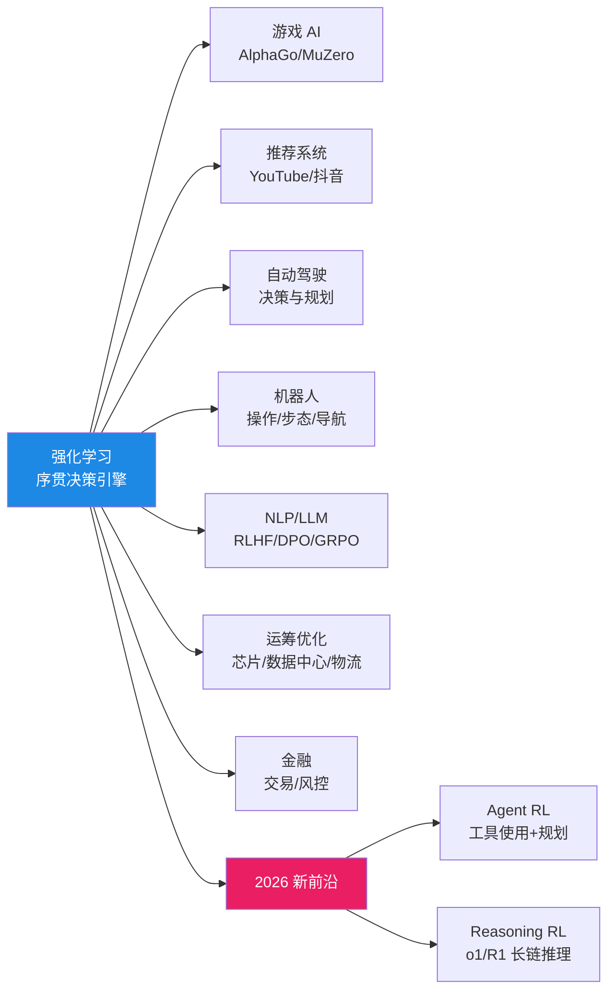

---

## 目录

1. [RL 在游戏 AI 中的应用](#1-rl-在游戏-ai-中的应用)
2. [RL 在推荐系统中的应用](#2-rl-在推荐系统中的应用)
3. [RL 在自动驾驶中的应用](#3-rl-在自动驾驶中的应用)
4. [RL 在机器人控制中的应用](#4-rl-在机器人控制中的应用)
5. [RL 在 NLP/LLM 中的应用（RLHF/DPO/GRPO）](#5-rl-在-nlp-llm-中的应用rlhfdpogpo)
6. [RL 在运筹优化中的应用](#6-rl-在运筹优化中的应用)
7. [RL 在金融中的应用](#7-rl-在金融中的应用)
8. [2026 前沿：Agent RL 与 Reasoning RL](#8-2026-前沿agent-rl-与-reasoning-rl)
9. [代码实战：RL 应用快速原型](#9-代码实战rl-应用快速原型)
10. [RL 应用 Checklist](#10-rl-应用-checklist)
11. [延伸阅读 (Related)](#11-延伸阅读-related)

---

## 1. RL 在游戏 AI 中的应用

### 1.1 为什么游戏是 RL 的"天然试验场"？

| 游戏特性 | 对 RL 的价值 |
|---------|------------|
| **规则明确** | 奖励函数天然定义（输赢/比分） |
| **完美模拟器** | 可无限次试错，零成本 |
| **状态/动作离散** | 简化算法实现 |
| **可大规模并行** | 数千 GPU 同时自博弈 |
| **人类基准可比较** | 量化 AI 进展 |

### 1.2 里程碑系统全景

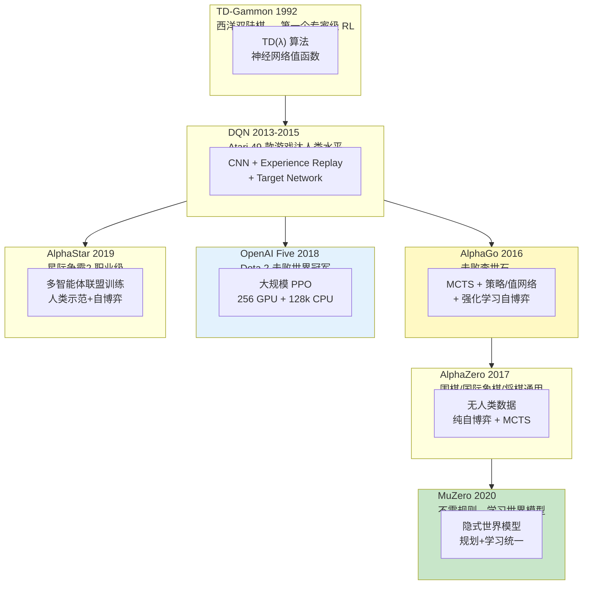

### 1.3 核心里程碑深度对比

| 系统 | 年份 | 游戏 | 核心创新 | 规模 | 历史意义 |
|------|------|------|---------|------|---------|
| **TD-Gammon** | 1992 | 西洋双陆棋 | TD(λ) + 神经网络 | 单机 | 首个专家级游戏 AI |
| **DQN** | 2013 | Atari 2600 | 深度 Q 网络 + 经验回放 | 单 GPU | 深度 RL 开山之作 |
| **AlphaGo** | 2016 | 围棋 | MCTS + 策略/值网络 + 自博弈 | 1920 TPU | 击败世界冠军李世石 |
| **AlphaZero** | 2017 | 围棋/象棋/将棋 | 无人类棋谱，纯自博弈 | 5000 TPU | 通用棋类 AI |
| **OpenAI Five** | 2018 | Dota 2 | 大规模 PPO + 多智能体 | 256 GPU | 不完全信息游戏突破 |
| **AlphaStar** | 2019 | 星际争霸2 | 联盟训练 + 人类示范 | 多 TPU | 实时策略游戏职业级 |
| **MuZero** | 2020 | Atari/围棋/象棋 | 学习世界模型，不需要规则 | 1000+ TPU | 从"已知规则"到"未知规则" |
| **Pluribus** | 2019 | 德州扑克 | 6 人无限注扑克 | 单 CPU | 多人不完全信息博弈 |
| **Suphx** | 2020 | 麻将 | 全局奖励预测 + Oracle | 多 TPU | 最复杂牌类游戏 |

### 1.4 MuZero 的革命性

传统游戏 AI（AlphaZero）需要**已知游戏规则**来搜索。MuZero 的突破在于：

```
AlphaZero:  已知规则 → 在真实状态空间搜索 → 选最佳动作
MuZero:     未知规则 → 学习"隐式状态模型" → 在"想象的状态空间"搜索 → 选最佳动作
```

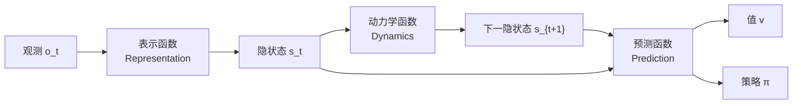

**意义**: MuZero 不仅玩游戏，还能用于**真实世界规划**（不需要完美物理模型的场景）。

---

## 2. RL 在推荐系统中的应用

### 2.1 为什么推荐系统需要 RL？

传统推荐（协同过滤、监督学习）把推荐看成"单步预测"——给用户推一个物品。但真实推荐是**序贯的**：

> **用户的长期满意度** 才是目标，而不是单次点击率。RL 天然适合优化长期累积奖励。

| 维度 | 监督学习推荐 | RL 推荐 |
|------|------------|--------|
| 目标 | 单次 CTR（点击率） | 长期用户参与度/留存 |
| 时间维度 | 单步 | 多步序列 |
| 探索 | 被动（依赖数据） | 主动探索新内容 |
| 反馈 | 即时（点击/不点击） | 延迟（用户流失在很久后） |

### 2.2 工业级 RL 推荐架构

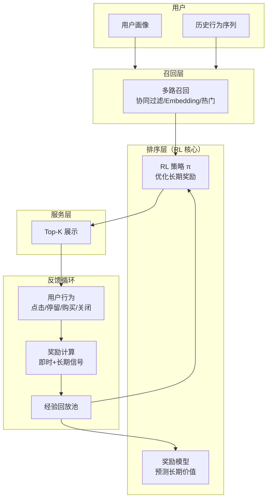

### 2.3 YouTube 的 RL 推荐

**论文**: Chen et al. (2019) "Top-K Off-Policy Correction for a REINFORCE Recommender System"

**YouTube 的核心挑战**:
- **Off-Policy**: 训练数据是旧策略产生的（日志中的历史推荐），但要用它训练新策略
- **Top-K**: 一次推荐多个视频，需要考虑列表内多样性

**YouTube 的解决方案**:

```python
# YouTube RL 推荐简化伪代码
class YouTubeRLRecommender:
    def __init__(self):
        self.policy = PolicyNetwork()  # 策略网络
        self.value = ValueNetwork()    # 值网络

    def off_policy_correction(self, trajectory, old_policy_logprob):
        """
        Off-Policy 修正：
        用旧策略采集的数据训练新策略，需要重要性采样修正
        """
        new_logprob = self.policy.logprob(trajectory)
        # 重要性采样比
        importance_ratio = exp(new_logprob - old_policy_logprob)
        # 截断（防止方差爆炸）
        clipped_ratio = clip(importance_ratio, 0.5, 2.0)
        return clipped_ratio

    def reward_function(self, user_actions):
        """
        奖励设计（关键！）：
        - 点击 = +1
        - 长观看时间 = +2~+5（按比例）
        - 点赞/分享 = +10
        - 关闭应用 = -3
        - 取消订阅 = -50
        """
        return weighted_sum(user_actions)
```

### 2.4 字节跳动（抖音）的 RL 推荐

抖音/TikTok 的 RL 推荐特点：

| 维度 | 抖音做法 |
|------|---------|
| **奖励信号** | 多目标加权（停留+互动+分享+完播） |
| **状态表示** | 用户实时行为序列（Transformer 编码） |
| **探索策略** | ε-greedy + UCB（冷启动内容探索） |
| **多目标** | Pareto 优化（CTR × 留存 × 内容安全） |
| **实时性** | 在线学习（分钟级模型更新） |

### 2.5 RL 推荐的常见陷阱

| 陷阱 | 描述 | 对策 |
|------|------|------|
| **奖励黑客** | 模型推荐"标题党"，CTR 高但用户反感 | 多目标奖励 + 人工审核 |
| **过滤气泡** | 只推相似内容，用户审美疲劳 | 强制探索（多样性约束） |
| **冷启动困难** | 新内容/新用户无数据 | 元学习 + 内容特征 |
| **分布偏移** | 线上分布随时间变化 | 持续在线学习 |
| **延迟反馈** | 用户"不喜欢"很久后才流失 | 值函数建模长期奖励 |

---

## 3. RL 在自动驾驶中的应用

### 3.1 自动驾驶中的 RL 适用场景

自动驾驶栈通常分为三层：**感知 → 规划/决策 → 控制**。RL 主要用于**决策层**和**规划层**。

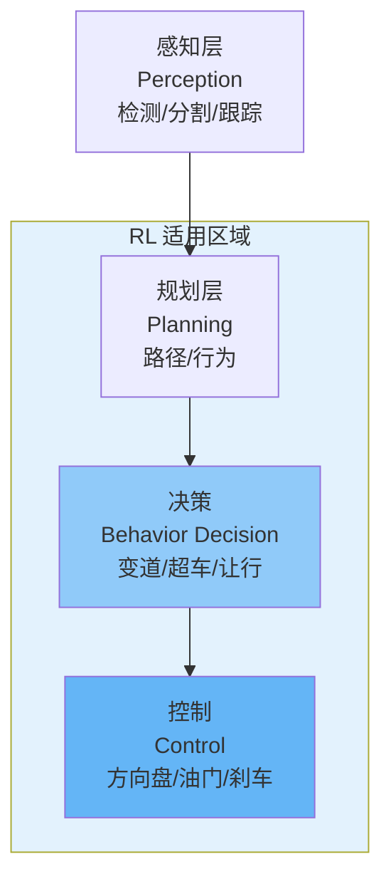

### 3.2 RL 适合的自动驾驶子任务

| 子任务 | RL 方法 | 状态 | 工业落地 |
|--------|--------|------|---------|
| **车道保持** | PPO/SAC（连续控制） | ✅ 成熟 | Tesla, Waymo |
| **变道决策** | DQN/PPO（离散决策） | ✅ 成熟 | 特斯拉 NoA |
| **交叉路口通行** | Multi-agent RL | ⚠️ 研究中 | 限定区域 |
| **无保护左转** | PPO + 安全约束 | ⚠️ 困难 | Waymo 试点 |
| **泊车** | SAC/HER | ✅ 成熟 | 多家 OEM |
| **路口协商** | MARL | 🔬 前沿 | 研究 |

### 3.3 为什么自动驾驶 RL 不能"端到端"？

> **安全关键系统（Safety-Critical）的 RL 准则**: 你不能让 RL "自由探索"——因为它可能撞车。

**解决方案**: **Constrained RL / Safe RL**

```python
# Constrained PPO 概念：在约束下优化
class SafeAutonomousDriving:
    def compute_action(self, state):
        # 标准 RL 输出
        action = self.policy(state)

        # 安全约束层（关键！）
        action = self.safety_filter(action, state)
        return action

    def safety_filter(self, action, state):
        """
        安全过滤器：确保 RL 动作不违反硬约束
        """
        # 1. 碰撞检测
        if self.will_collide(state, action):
            action = self.emergency_brake()

        # 2. 速度限制
        action.speed = min(action.speed, self.speed_limit(state))

        # 3. 加速度限制（乘客舒适度）
        action.accel = clip(action.accel, -3.0, 2.0)  # m/s²

        return action
```

### 3.4 自动驾驶 RL 的仿真训练

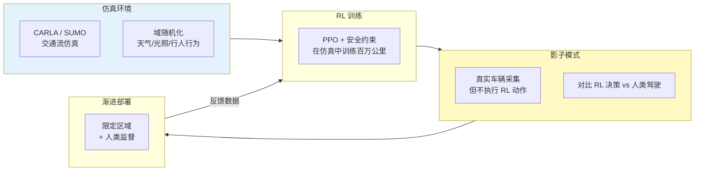

### 3.5 自动驾驶 RL 的关键挑战

| 挑战 | 描述 | 当前方案 |
|------|------|---------|
| **安全探索** | 不能在真车探索 | 仿真训练 + 影子模式 |
| **长尾场景** | 99.9% 正常 + 0.1% 极端 | 场景生成 + 数据挖掘 |
| **多智能体** | 其他车也是"智能体" | MARL |
| **可解释性** | 出事故要追责 | 注意力可视化 + 规则辅助 |
| **实时性** | 10-30ms 决策延迟 | 轻量化模型 |

---

## 4. RL 在机器人控制中的应用

### 4.1 机器人 RL 的三大子领域

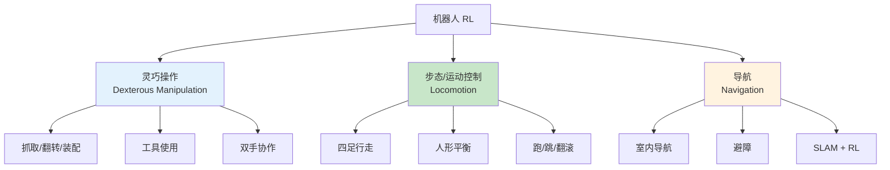

### 4.2 灵巧操作 (Dexterous Manipulation)

**代表**: OpenAI 魔方手、NVIDIA GR00T、Google RT-2

| 方法 | 说明 | 2026 状态 |
|------|------|----------|
| **纯 RL（域随机化）** | 仿真训练 → 真机迁移 | 成熟，OpenAI 魔方手 |
| **模仿学习 + RL** | 人类示范 → RL 微调 | 主流，VLA 模型标配 |
| **VLA 端到端** | 视觉+语言→动作 | 爆发期，RT-2/π0/GR00T |

> 更多 VLA 细节参见 [[06_强化学习/05_机器人与具身智能/08_VLA_Embodied_AI_2026|VLA 具身智能]]

### 4.3 步态控制 (Locomotion)

**代表**: ANYmal（ETH）、MIT Cheetah、Boston Dynamics Spot、Unitree

**关键突破**: **Teacher-Student + Domain Randomization** 让四足机器人在野外行走

```python
# 四足机器人步态 RL 标准流程（概念）
class QuadrupedRLPipeline:
    def train(self):
        # Phase 1: 仿真中域随机化训练
        env = RandomizedTerrainEnv(
            friction_range=[0.3, 1.5],
            payload_range=[0, 10],  # kg
            terrain_types=['flat', 'stairs', 'slope', 'rubble'],
        )
        teacher_policy = PPO(env, privileged_obs=True)  # 教师有特权信息

        # Phase 2: 蒸馏给学生（无特权信息）
        student_policy = distill(teacher_policy, student_obs_only=True)

        # Phase 3: 真机部署
        deploy(student_policy, real_robot)
```

### 4.4 导航 (Navigation)

| 方法 | 适用场景 |
|------|---------|
| **经典 SLAM + 规划** | 已知地图、静态环境 |
| **DRL 导航** | 动态环境、未知障碍 |
| **VLM + RL** | 语言指令导航（"去厨房拿可乐"） |

**2026 趋势**: 从纯几何导航 → **语义导航**（理解"杯子在桌子上"并导航去抓取）

---

## 5. RL 在 NLP/LLM 中的应用（RLHF/DPO/GRPO）

### 5.1 RL 如何"教会 LLM 人类偏好"？

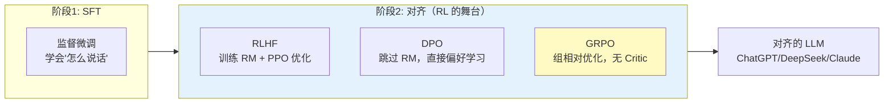

### 5.2 三大对齐方法对比

> 详细技术解析参见 [[06_强化学习/03_RLHF与对齐/04_RLHF_DPO_GRPO_深入分析|RLHF/DPO/GRPO 深度解读]]

| 维度 | RLHF (PPO) | DPO | GRPO |
|------|-----------|-----|------|
| **年代** | 2017-2023 | 2023 | 2024-2026 |
| **核心机制** | Reward Model + PPO | 直接偏好优化 | 组相对优势 |
| **需要 RM** | ✅ | ❌ | ❌ |
| **需要 Critic** | ✅ | ❌ | ❌ |
| **训练阶段** | 3 阶段 | 1 阶段 | 1 阶段 |
| **显存** | ~1960 GB（70B） | ~280 GB | ~280 GB |
| **代表模型** | ChatGPT, Claude | Zephyr, Tulu | DeepSeek-R1, Qwen3 |
| **最适合** | 开源大模型对齐 | 离线偏好数据 | 推理模型（数学/代码） |

### 5.3 GRPO 与推理模型革命

**2024-2025 的突破**: OpenAI o1、DeepSeek-R1 证明——用 GRPO + 可验证奖励训练，LLM 能学会**长链推理**：

```python
# GRPO 推理训练概念
class GRPOReasoningTrainer:
    def train_step(self, prompt):
        # 1. 对同一问题采样 G 个回答
        responses = [self.policy.generate(prompt) for _ in range(G)]

        # 2. 计算可验证奖励（数学/代码有标准答案）
        rewards = [self.verify_answer(resp, prompt.answer) for resp in responses]

        # 3. 组内标准化（无需 Critic！）
        group_mean = mean(rewards)
        group_std = std(rewards)
        advantages = [(r - group_mean) / (group_std + eps) for r in rewards]

        # 4. 用组优势更新策略（比 PPO 简单得多）
        loss = policy_gradient_loss(responses, advantages)
        loss.backward()
```

**为什么 GRPO 适合推理**:
- 数学/代码有**客观正确答案**（可验证奖励），不需要人类标注偏好
- 组内比较比训练 Critic 更稳定
- 鼓励"长思维链"——正确推理路径获得高组优势

### 5.4 对齐方法的演进趋势

```
RLHF (2022)  →  DPO (2023)  →  GRPO (2024)  →  RLVR (2025)  →  ?
人类偏好         偏好直接学      组相对优化       可验证奖励      ？
需要 RM          无需 RM        无需 Critic      无需标注
重工程           简单           简单+强          简单+强+客观
```

> 推理 RL 更多细节参见 [[06_强化学习/01_强化学习基础/RL-in-nutshell|强化学习速览]] 中的"推理 RL"章节

---

## 6. RL 在运筹优化中的应用

### 6.1 为什么 RL 适合运筹优化？

传统运筹优化（OR）用精确算法（MILP、动态规划），但很多问题 **NP-hard**，精确算法在大规模时不可行。RL 的价值在于：

> **RL 可以在"质量"和"速度"之间做权衡**——牺牲少量最优性，换取百倍千倍的速度提升。

### 6.2 经典应用

#### 6.2.1 Google 数据中心冷却（BCS）

**DeepMind 2016**: 用 RL 优化 Google 数据中心的 PUE（能源效率）

| 维度 | 传统 PID 控制 | RL 控制 |
|------|-------------|--------|
| 能耗节省 | 基线 | **额外 -40%** 冷却能耗 |
| 响应速度 | 慢（固定逻辑） | 快（学习最优响应） |
| 适应性 | 需手动调参 | 自动适应负载变化 |

#### 6.2.2 芯片设计 (Chip Placement)

**Mirhoseini et al. (2021)**: Google 用 RL 做 TPU 芯片的布局规划（Placement）

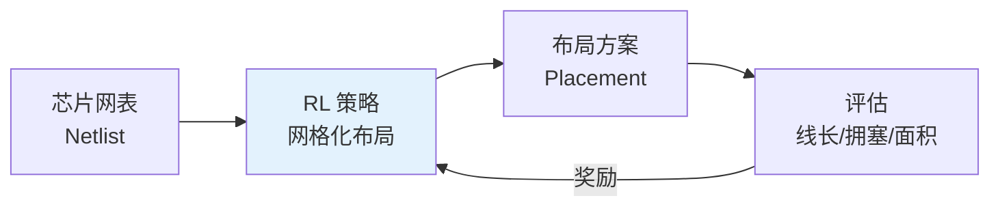

**成果**: RL 生成的 TPU 布局**优于人类专家**，且速度快 100×（人类数周→RL 数小时）

#### 6.2.3 物流与路径规划

| 问题 | 传统方法 | RL 方法 |
|------|---------|--------|
| **VRP（车辆路径）** | 精确算法（小规模）+ 启发式（大规模） | Attention Model + RL |
| **仓库拣货** | 固定路径规则 | RL 动态优化 |
| **供应链** | 线性规划 | RL 多级库存优化 |
| **装箱** | 启发式 | RL + 3D 装箱 |

### 6.3 RL vs 传统优化

| 维度 | 传统优化（OR） | RL |
|------|--------------|-----|
| **最优性** | 保证最优（小规模） | 近似最优 |
| **速度** | 慢（大规模） | 快（一次前向传播） |
| **可解释** | 高 | 低 |
| **泛化** | 需重解 | 训练一次，推理多次 |
| **动态环境** | 需重解 | 在线适应 |

**最佳实践**: RL + 传统优化**混合**——RL 提供"好的初始解"，传统优化做"局部精修"

### 6.4 RL 运筹优化代码示例（TSP）

```python
"""
用 RL (Attention Model) 求解旅行商问题 (TSP)
基于 Kool et al. (2019) Attention, Learn to Solve Routing Problems!
"""
import torch
import torch.nn as nn

class TSPAttentionModel(nn.Module):
    """基于 Attention 的 TSP 求解器"""
    def __init__(self, embed_dim=128, n_heads=8, n_layers=3):
        super().__init__()
        self.embed = nn.Linear(2, embed_dim)  # 坐标 → embedding
        self.encoder = nn.TransformerEncoder(
            nn.TransformerEncoderLayer(embed_dim, n_heads, batch_first=True),
            n_layers,
        )
        self.decoder = nn.MultiheadAttention(embed_dim, n_heads, batch_first=True)

    def forward(self, coords):
        """
        coords: (batch, n_cities, 2) 城市坐标
        return: 路径 + 总距离
        """
        h = self.embed(coords)          # (B, N, D)
        h = self.encoder(h)             # 编码所有城市

        # 自回归解码：逐步选择下一个城市
        path = []
        visited = torch.zeros(coords.size(0), coords.size(1), dtype=torch.bool)
        current = torch.zeros(coords.size(0), dtype=torch.long)  # 从城市0出发

        for step in range(coords.size(1)):
            visited[torch.arange(coords.size(0)), current] = True
            # Attention 选择下一个城市
            logits = self.decode(h, current, visited)
            next_city = logits.argmax(dim=-1)  # 贪心（训练时用采样）
            path.append(next_city)
            current = next_city

        return torch.stack(path, dim=1)  # (B, N) 路径

    def compute_tour_length(self, path, coords):
        """计算路径总长度（作为 RL 奖励的负数）"""
        ordered = coords.gather(1, path.unsqueeze(-1).expand(-1, -1, 2))
        dist = (ordered[:, 1:] - ordered[:, :-1]).norm(dim=-1).sum(-1)
        dist += (ordered[:, 0] - ordered[:, -1]).norm(dim=-1)  # 回到起点
        return dist  # 奖励 = -dist

# 训练（REINFORCE with rollout baseline）
model = TSPAttentionModel()
optimizer = torch.optim.Adam(model.parameters(), lr=1e-4)

for epoch in range(100):
    coords = torch.rand(256, 50, 2)  # 256 个 50 城市 TSP 实例
    path = model(coords)
    tour_length = model.compute_tour_length(path, coords)

    # REINFORCE: 短路径 = 高奖励
    baseline = tour_length.detach().mean()  # rollout baseline
    advantage = -(tour_length - baseline)   # 越短越好
    loss = (advantage * tour_length).mean()  # 简化版
    loss.backward()
    optimizer.step()
    optimizer.zero_grad()
```

---

## 7. RL 在金融中的应用

### 7.1 金融 RL 的应用场景

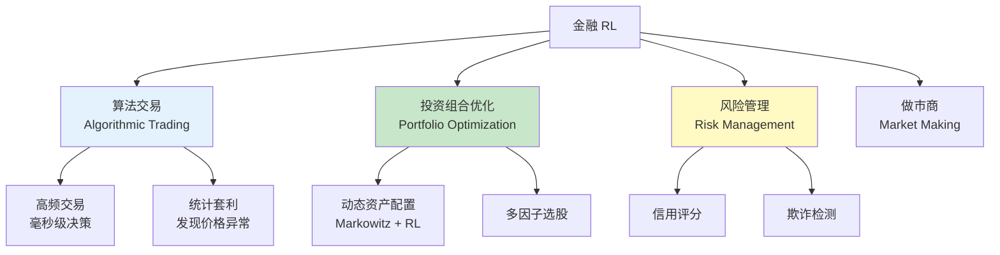

### 7.2 算法交易中的 RL

**问题建模**:

```
状态 S: 市场数据（价格序列、订单簿、新闻情感）
动作 A: {买入, 卖出, 持有, 取消订单} 或 {仓位大小}
奖励 R: 利润 - 交易成本 - 风险惩罚
```

```python
# RL 交易代理概念代码
class TradingEnv(gym.Env):
    def __init__(self, price_data, initial_cash=1_000_000):
        self.data = price_data       # 历史 K 线数据
        self.cash = initial_cash
        self.position = 0            # 当前持仓
        self.t = 0                   # 时间步

        self.action_space = gym.spaces.Box(-1, 1, (1,))  # -1=全卖, 0=持有, 1=全买
        self.observation_space = gym.spaces.Box(-np.inf, np.inf, (50,))

    def step(self, action):
        # 执行交易
        target_position = action[0] * self.max_position
        trade = target_position - self.position
        cost = abs(trade) * self.price * 0.0003  # 手续费 0.03%
        self.position = target_position

        # 前进到下一步
        self.t += 1
        new_price = self.data[self.t]

        # 计算奖励
        portfolio_value = self.cash + self.position * new_price
        prev_value = self.cash + self.position * self.data[self.t - 1]
        profit = portfolio_value - prev_value - cost

        # 风险调整（夏普比率风格）
        risk_penalty = 0.1 * abs(profit) * (profit < 0)  # 惩罚亏损
        reward = profit - risk_penalty

        obs = self._get_obs()
        return obs, reward, self.t >= len(self.data), {}

    def _get_obs(self):
        """返回技术指标 + 订单簿特征"""
        window = self.data[max(0, self.t-20):self.t+1]
        return compute_indicators(window)  # RSI, MACD, 均线等
```

### 7.3 金融 RL 的特殊挑战

| 挑战 | 描述 | 对策 |
|------|------|------|
| **数据噪声极大** | 金融数据信噪比极低 | 大量数据 + 强正则化 |
| **非平稳性** | 市场规律随时间变化 | 在线学习 + 域适应 |
| **回测过拟合** | 历史不代表未来 | Walk-forward + 交叉验证 |
| **交易成本** | 频繁交易成本吃掉利润 | 成本建模在奖励中 |
| **极端事件** | 黑天鹅（2008, 2020） | 风险约束 + 压力测试 |
| **对手适应** | 市场会"学习"你的策略 | 对抗训练 + 策略轮换 |

> **重要警告**: 金融 RL 的"回测表现好"几乎**不代表**真实交易会盈利。过拟合是金融 ML 的头号杀手。任何上线的 RL 交易策略都必须经过严格的纸上交易（paper trading）验证。

### 7.4 金融 RL vs 传统量化

| 维度 | 传统量化 | RL 量化 |
|------|---------|--------|
| **策略来源** | 人工因子 + 回归 | RL 自动学习 |
| **适应性** | 固定（需重训练） | 在线适应 |
| **可解释** | 高 | 低 |
| **工程复杂度** | 中 | 高 |
| **2026 状态** | 主流 | 增量渗透，高风险高回报 |

---

## 8. 2026 前沿：Agent RL 与 Reasoning RL

### 8.1 Agent RL —— 让 AI 自主行动

**什么是 Agent RL?** 不是让 RL 训练"单一策略"，而是让 RL 训练**完整的 AI 智能体**——能使用工具、做规划、调用 API、与环境多轮交互。

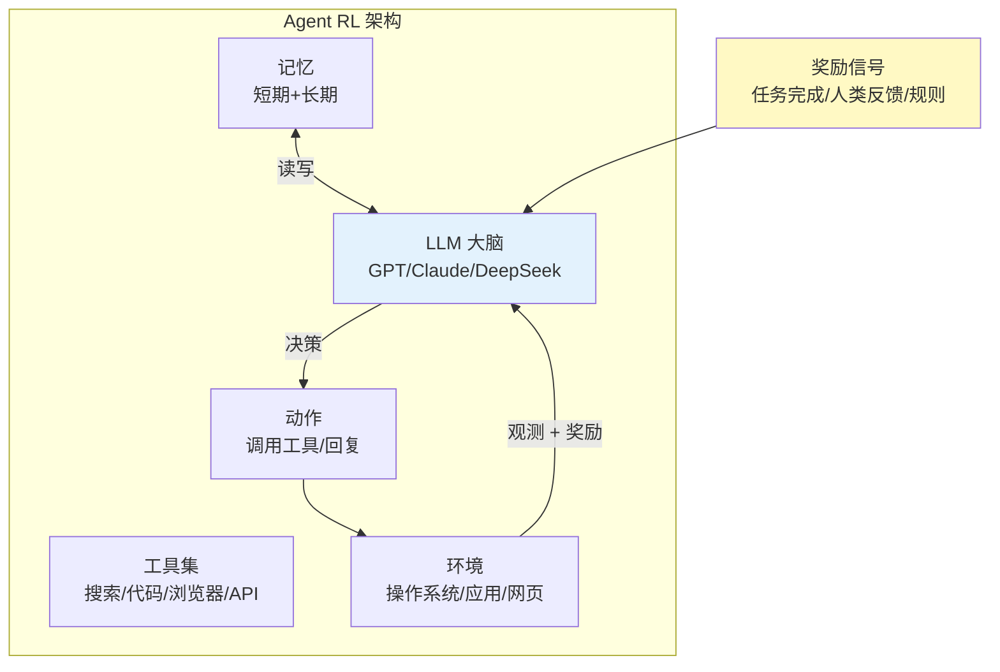

**Agent RL 的奖励来源**:

| 奖励类型 | 说明 | 示例 |
|---------|------|------|
| **任务完成** | 最终目标达成 | "成功订机票" = +1 |
| **过程奖励 (PRM)** | 每一步评分 | "调用了正确 API" = +0.1 |
| **人类反馈** | 用户满意度 | "回答有用吗" → RLHF |
| **规则验证** | 可执行验证 | "代码能编译运行" = +1 |
| **效率奖励** | 步数/时间惩罚 | "少步骤完成" = 更高奖励 |

### 8.2 Agent RL 的代表工作

| 系统 | 公司 | 核心创新 |
|------|------|---------|
| **Devin** | Cognition AI | RL 训练的软件工程 Agent |
| **SWE-Agent** | 学术界 | RL 优化代码 Agent 的工具调用 |
| **WebArena** | 学术界 | 网页操作 Agent 的 RL benchmark |
| **OSWorld** | 学术界 | 操作系统 Agent benchmark |
| **AutoGPT / LangChain Agent** | 开源 | 框架级 Agent（RL 增强） |

### 8.3 Reasoning RL —— 推理模型的核心

**2024-2026 最大突破**: 用 RL 训练 LLM 学会**长链推理**（long-chain reasoning）

| 模型 | 公司 | RL 方法 | 关键能力 |
|------|------|--------|---------|
| **o1 / o3** | OpenAI | RLVR（推测） | 数学/代码/科学推理 |
| **DeepSeek-R1** | DeepSeek | GRPO + 可验证奖励 | 开源推理 SOTA |
| **Gemini 2.5 Thinking** | Google | RL 推理训练 | 多模态推理 |
| **Qwen3** | 阿里 | GRPO | 开源多语言推理 |
| **Kimi k1.5** | 月之暗面 | RL + 可验证奖励 | 长上下文推理 |

**Reasoning RL 的关键模式**:

```
传统 LLM:  Prompt → 直接输出答案（一步到位）

Reasoning RL LLM:
  Prompt → "让我想想..." → 步骤1 → 步骤2 → ... → 步骤N → 答案
                    ↑                    ↑
                  (思维链 CoT)        (RL 训练每一步)
```

**为什么 RL 是推理训练的关键**:
- 监督学习需要"标准推理路径"——但人类也不知道最优推理是什么
- RL 只需要"最终答案对错"——让模型**自己探索**最优推理路径
- 结果：RL 训练出的推理路径**比人类示范更长更优**

### 8.4 Agent RL + Reasoning RL 的融合

**2026 终极趋势**: 推理能力（内部思考）+ Agent 能力（外部行动）融合

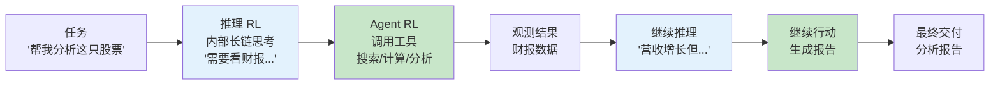

> Agent 架构更多细节参见 [[15_智能体/01_Agent基础/11_Agent_简明指南|Agent 速览]]

---

## 9. 代码实战：RL 应用快速原型

### 9.1 游戏 AI 快速原型（Gymnasium + PPO）

```python
"""
在 Atari 游戏上训练 DQN/PPO（最经典的 RL 入门）
"""
from stable_baselines3 import PPO
from stable_baselines3.common.atari_wrappers import AtariWrapper
import gymnasium as gym

# 创建 Atari 环境
env = gym.make("ALE/Breakout-v5")
env = AtariWrapper(env)  # 标准 Atari 预处理

# PPO 训练
model = PPO(
    "CnnPolicy", env,
    learning_rate=2.5e-4,
    n_steps=128,
    batch_size=256,
    n_epochs=4,
    ent_coef=0.01,
    verbose=1,
    tensorboard_log="./atari_logs/",
)

model.learn(total_timesteps=10_000_000)  # 1000 万步
model.save("ppo_breakout")

# 评估
mean_reward, std_reward = evaluate_policy(model, env, n_eval_episodes=10)
print(f"平均奖励: {mean_reward:.0f} ± {std_reward:.0f}")
```

### 9.2 LLM 对齐快速原型（TRL + GRPO）

```python
"""
用 TRL 库进行 GRPO 对齐训练
（推理模型训练的基础）
"""
from transformers import AutoModelForCausalLM, AutoTokenizer
from trl import GRPOConfig, GRPOTrainer
import torch

model = AutoModelForCausalLM.from_pretrained("Qwen/Qwen2.5-7B")
tokenizer = AutoTokenizer.from_pretrained("Qwen/Qwen2.5-7B")

# 奖励函数：数学题的正确性验证
def math_reward(completions, answers):
    """检查数学答案是否正确"""
    rewards = []
    for completion, answer in zip(completions, answers):
        # 提取 \boxed{} 中的答案
        predicted = extract_boxed_answer(completion)
        rewards.append(1.0 if predicted == answer else 0.0)
    return rewards

# GRPO 配置
config = GRPOConfig(
    output_dir="./grpo_output",
    num_generations=8,          # 每个 prompt 生成 8 个回答（组大小）
    learning_rate=1e-6,
    per_device_train_batch_size=4,
    gradient_accumulation_steps=8,
    num_train_epochs=1,
    beta=0.04,                  # KL 系数
    max_completion_length=1024, # 允许长思维链
)

# 数据集格式: {"prompt": "...", "answer": "..."}
dataset = load_math_dataset()

trainer = GRPOTrainer(
    model=model,
    args=config,
    train_dataset=dataset,
    reward_funcs=[math_reward],
    processing_class=tokenizer,
)

trainer.train()
```

### 9.3 推荐系统 RL 原型

```python
"""
简化的 RL 推荐环境
"""
import gymnasium as gym
import numpy as np

class RecommendationEnv(gym.Env):
    """
    模拟推荐场景：
    - 状态：用户兴趣向量 + 历史点击序列
    - 动作：推荐某个物品
    - 奖励：用户是否点击 + 长期满意度
    """
    def __init__(self, n_items=1000, n_users=100, embed_dim=32):
        self.n_items = n_items
        self.item_embeddings = np.random.randn(n_items, embed_dim)
        self.user_profiles = np.random.randn(n_users, embed_dim)
        self.current_user = None
        self.t = 0
        self.max_steps = 50

        self.action_space = gym.spaces.Discrete(n_items)
        self.observation_space = gym.spaces.Box(
            -np.inf, np.inf, (embed_dim * 2,)
        )

    def reset(self, seed=None):
        super().reset(seed=seed)
        self.current_user = np.random.randint(self.n_users)
        self.t = 0
        return self._get_obs(), {}

    def step(self, action):
        item = self.item_embeddings[action]
        user = self.user_profiles[self.current_user]

        # 用户点击概率（兴趣相似度）
        similarity = np.dot(user, item) / (
            np.linalg.norm(user) * np.linalg.norm(item) + 1e-8
        )
        click_prob = 1 / (1 + np.exp(-similarity * 3))  # sigmoid
        clicked = np.random.random() < click_prob

        # 奖励：即时点击 + 长期满意度（防止过滤气泡）
        immediate_reward = 1.0 if clicked else 0.0
        diversity_bonus = self._compute_diversity_bonus(action)
        reward = immediate_reward + 0.3 * diversity_bonus

        self.t += 1
        done = self.t >= self.max_steps
        return self._get_obs(), reward, done, False, {}
```

---

## 10. RL 应用 Checklist

### 10.1 "该不该用 RL?" 决策清单

```
🤔 你的问题适合 RL 吗？

✅ 序贯决策（当前决定影响未来）
✅ 有明确的奖励信号（或可以定义）
✅ 允许大量试错（有模拟器/仿真/在线环境）
✅ 问题规模大，传统方法不够好

❌ 如果以上都不满足 → 考虑监督学习/规则系统

⚠️ 红灯警告（RL 可能不是好选择）：
  □ 奖励极难定义（"什么是好文章？"）
  □ 不能大量试错（医疗诊断、法律判决）
  □ 数据量极少（< 1000 样本）
  □ 需要强可解释性（合规要求）
  □ 监督学习已经够好（别过度工程化）
```

### 10.2 RL 应用落地 Checklist

```
✅ 问题定义
  □ 状态空间 S 明确定义？
  □ 动作空间 A 明确定义？
  □ 奖励函数 R 设计合理？（无奖励黑客风险）
  □ 时间范围（episode 长度）合理？

✅ 环境与数据
  □ 有高质量模拟器/仿真器？
  □ 离线数据充足（如需离线 RL）？
  □ 仿真到真实的差距评估过？

✅ 算法选择
  □ 离散动作 → DQN/Rainbow/PPO
  □ 连续动作 → SAC/PPO
  □ 离线数据 → CQL/IQL/TD3+BC
  □ LLM 对齐 → RLHF/DPO/GRPO
  □ 多智能体 → MAPPO/QMIX

✅ 工程落地
  □ 安全约束（Safe RL）？
  □ 分布式训练（RLlib/Ray）？
  □ 在线监控（分布偏移检测）？
  □ 回滚机制？
  □ A/B 测试方案？

✅ 评估
  □ 定义了明确的成功指标？
  □ 与基线（监督学习/规则）对比？
  □ 长期效果评估（不只看短期）？
  □ 极端情况测试？
```

### 10.3 常见应用领域速查

| 应用领域 | 推荐算法 | 推荐工具 | 难度 |
|---------|---------|---------|------|
| 游戏 AI | PPO/AlphaZero | PettingZoo + SB3 | ⭐⭐ |
| 推荐系统 | Contextual Bandit/PPO | RLlib + TensorFlow Recommenders | ⭐⭐⭐ |
| 自动驾驶 | Constrained PPO/SAC | CARLA + SB3 | ⭐⭐⭐⭐ |
| 机器人 | PPO/SAC + Domain Rand | Isaac Sim + RLlib | ⭐⭐⭐⭐ |
| LLM 对齐 | DPO/GRPO | TRL + OpenRLHF | ⭐⭐⭐ |
| 运筹优化 | REINFORCE/Attention | AM/DeepACO | ⭐⭐⭐ |
| 金融 | Offline RL/CQL | 自研 + walk-forward | ⭐⭐⭐⭐⭐ |

---

## 11. 延伸阅读 (Related)

### 11.1 本知识库交叉引用

#### RL 基础与算法
- [[06_强化学习/01_强化学习基础/03_RL基础|强化学习基础]] — MDP/Bellman 方程，所有应用的理论基础
- [[06_强化学习/01_强化学习基础/RL-in-nutshell|强化学习速览]] — RL 全栈知识图谱速览
- [[06_强化学习/02_深度强化学习/02_深度_RL|深度强化学习]] — DQN/PPO/SAC 等核心算法
- [[06_强化学习/02_深度强化学习/10_PPO_深入分析|PPO 深度解读]] — 最常用的 RL 应用算法
- [[06_强化学习/02_深度强化学习/03_DQN_深入分析|DQN 深度解读]] — 离散动作 RL 的基础

#### LLM 对齐与推理
- [[06_强化学习/03_RLHF与对齐/04_RLHF_DPO_GRPO_深入分析|RLHF/DPO/GRPO 深度解读]] — 大模型对齐三大范式
- [[06_强化学习/01_强化学习基础/RL-in-nutshell|强化学习速览]] — 含推理 RL（o1/R1）章节

#### 机器人与具身智能
- [[06_强化学习/05_机器人与具身智能/01_Embodied_AI_2026|具身智能 2026]] — 机器人 RL 的应用场景
- [[06_强化学习/05_机器人与具身智能/08_VLA_Embodied_AI_2026|VLA 具身智能]] — VLA 模型与 RL
- [[06_强化学习/05_机器人与具身智能/05_Robot_VLA_训练_流水线_2026|VLA 训练流水线]] — 端到端机器人训练

#### Sim2Real
- [[06_强化学习/05_机器人与具身智能/07_Sim_to_Real_Transfer_指南|Sim2Real 迁移指南]] — 仿真到现实迁移（机器人/自动驾驶 RL 的关键）

#### 智能体
- [[15_智能体/01_Agent基础/11_Agent_简明指南|Agent 速览]] — Agent RL 的架构基础

### 11.2 关键论文

| 领域 | 论文 | 核心贡献 |
|------|------|---------|
| 游戏 | Silver et al. (2016) AlphaGo | 围棋世界冠军 |
| 游戏 | Schrittwieser et al. (2020) MuZero | 学习世界模型 |
| 游戏 | Berner et al. (2019) OpenAI Five | Dota 2 |
| 推荐 | Chen et al. (2019) YouTube RL | Top-K Off-Policy |
| LLM | Ouyang et al. (2022) InstructGPT | RLHF |
| LLM | Rafailov et al. (2023) DPO | 直接偏好优化 |
| LLM | DeepSeek (2025) DeepSeek-R1 | GRPO 推理 |
| 运筹 | Mirhoseini et al. (2021) Chip Placement | TPU 布局 |
| 运筹 | Kool et al. (2019) AM | TSP/VRP |
| 金融 | Deng et al. (2016) Deep RL Trading | 交易策略 |

### 11.3 Benchmark 与数据集

| Benchmark | 领域 | 说明 |
|-----------|------|------|
| **Arcade Learning Environment (ALE)** | 游戏 | 57 款 Atari 游戏 |
| **PettingZoo** | 多智能体游戏 | 多智能体环境 |
| **CARLA** | 自动驾驶 | 开源驾驶仿真 |
| **Isaac Lab** | 机器人 | NVIDIA 机器人 benchmark |
| **WebArena** | Web Agent | 网页操作 Agent |
| **MATH / GSM8K** | 推理 RL | 数学推理（GRPO 训练用） |

---

*Last updated: 2026-07-11*
