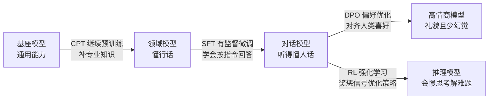

# 大模型训练四法大白话 (SFT / DPO / CPT / RL for Dummy)

> 中文简称：大模型训练四法大白话

> **一句话理解**: 把 AI 模型想象成一个刚入职的实习生——CPT 是让他疯狂读书补专业知识，SFT 是给他标准问答照着练，DPO 是拿两个回答告诉他哪个更好，RL 是实战演练做得好给糖吃。

---

## SFT 微调训练（有监督微调）

**大白话**：给标准答案，照着做。

**场景**：实习生刚来啥也不会。你给他一本《员工手册》，里面写满了「客户问 A，你就答 B」的标准问答，让他死记硬背、反复练习。

**作用**：最基础的培训。目的是让模型学会听懂人话、按指令办事——你让它写诗，它知道要押韵；你让它写代码，它知道格式。对应图示说法：**增强模型指令跟随的能力**。

---

## DPO 偏好训练（直接偏好优化）

**大白话**：做选择题，告诉他哪个好。

**场景**：实习生已经会干活了，但说话太生硬，或者喜欢瞎编（幻觉）。这时候不用教他具体怎么做，而是拿出两个回答给他看：「回答 A 太傲慢了，回答 B 很礼貌，我喜欢 B，你要学 B」。

**作用**：对齐人类喜好。让模型说话更像正常人、更礼貌、更安全、少胡说八道。相比 RLHF 的「先训奖励模型、再用强化学习」两阶段，DPO 把偏好直接写进优化目标，省掉了最贵的「裁判」。对应图示说法：**引入负反馈，降低幻觉，使模型输出更符合人类偏好**。

---

## CPT 继续预训练（Continual Pre-Training）

**大白话**：回炉重造，疯狂读书补专业知识。

**场景**：这个实习生是个通才，啥都懂一点，但不懂你们公司的「行话」或某个极偏门的领域（比如古汉语、某家公司的内部文档）。这时候别教他怎么对话，直接扔给他几吨重的专业书籍、行业报告，没日没夜地读，把脑子（参数）里的知识库更新一遍。

**作用**：注入新知识。想让通用模型变成「医疗专家」或「法律专家」，就用这招——喂海量专业无标注数据。对应图示说法：**通过无标注数据进行无监督继续预训练，强化或新增模型特定能力**。

---

## RL 强化学习（Reinforcement Learning）

**大白话**：实战演练，做得好给糖吃，做不好打手板。

**场景**：实习生要去处理复杂任务了（解奥数题、下围棋、规划复杂路线）。没有标准答案了——让他自己去试，做对一步加分（奖励），做错扣分（惩罚）。为了多拿分，他会自己琢磨出一套最优策略。

**作用**：提升逻辑推理和决策能力。顶级推理模型（如 o1）之所以会「慢思考」，就是因为用了这一类方法（RLHF / RLAIF）。工程上，DeepSeek 的 GRPO 用「组队互评」省掉了独立奖励模型，是当前高性价比的主流变体。对应图示说法：**通过奖励信号优化策略，提升模型的推理与决策能力**（图示标注「需要授权」——因为消耗算力和数据标注成本较大）。

---

## 训练流水线全景

---

## 四法对比速查

| 方法 | 类比 | 喂什么数据 | 解决什么 | 模型变成 |
|------|------|-----------|---------|---------|
| **CPT** | 读书 | 海量专业无标注语料 | 领域知识缺失 | 博学（懂行话） |
| **SFT** | 背书 | 标准问答对 | 不会按指令回答 | 听话（会答题） |
| **DPO** | 纠错 | 好坏回答对比对 | 生硬、幻觉、不安全 | 高情商（说话好听） |
| **RL** | 实战 | 奖惩信号（可无标准答案） | 推理与决策弱 | 聪明（会解难题） |

---

## 通常的训练顺序

**先 CPT（学知识）→ 再 SFT（学格式）→ 最后 DPO / RL（学做人 / 变聪明）。**

顺序背后的逻辑：知识是地基（CPT），会答题是上岗条件（SFT），品味和推理是进阶修炼（DPO / RL）。跳步的代价：没有 CPT 直接 SFT，模型会用流畅的话术编造专业知识（一本正经地胡说八道）；没有 SFT 直接 RL，模型连任务格式都对不齐，奖励信号无从打起。

---

## 进一步学习

- 三法口播稿：[[90_学习/06_以教代学/01_SFT_DPO_CPT_直播脚本_2026|SFT、DPO、CPT 直播脚本]] — 45 分钟以教代学讲稿
- 对齐深入：[[07_模型训练/06_对齐训练/02_GRPO_and_新型_对齐_Methods|GRPO 与新一代对齐方法]] — PPO / DPO / KTO / GRPO 全景
- 工具落地：[[07_模型训练/06_对齐训练/05_TRL_RLHF_DPO_指南|TRL RLHF / DPO 实践指南]]
- 奖励模型：[[06_强化学习/03_RLHF与对齐/04_RLHF_DPO_GRPO_深入分析|RLHF / DPO / GRPO 深入分析]]
- 训练全景：[[07_模型训练/01_训练基础/04_模型_训练_简明指南|模型训练简明指南]]

---

*Last updated: 2026-09-04*
