# Tokenizer Design for LLMs

> 中文简称：分词器设计

> **一句话理解**: Tokenizer 是 LLM 的"翻译入口"——就像人类阅读时需要把文字转化为大脑能理解的语义信号，LLM 需要通过 Tokenizer 将原始文本切割成离散的 token 序列，切分的质量直接决定了模型的表达能力、训练效率和多语言支持。

---

## 内容导航

| 章节 | 内容 | 难度 |
|------|------|------|
| [Tokenizer 基础](#1-tokenizer-基础) | character/word/subword 三大范式、fertility ratio、为何 subword 胜出 | 入门 |
| [BPE (Byte-Pair Encoding)](#2-bpe-byte-pair-encoding) | 算法原理、GPT-2 tokenizer、byte-level BPE、Python 伪代码 | 进阶 |
| [WordPiece](#3-wordpiece) | BERT tokenizer、似然合并、## 前缀、multilingual BERT | 进阶 |
| [Unigram Language Model](#4-unigram-language-model) | SentencePiece 概率方法、EM 算法、subword regularization | 进阶 |
| [SentencePiece](#5-sentencepiece) | 语言无关、raw bytes、特殊 token、开源模型标配 | 进阶 |
| [tiktoken (OpenAI)](#6-tiktoken-openai) | Rust 高性能、cl100k/o200k/p50k、效率提升 | 进阶 |
| [现代 Tokenizer 设计](#7-现代-tokenizer-设计) | LLaMA 3 / Qwen / Mistral / GLM-4 的 tokenizer 选型 | 前沿 |
| [多语言 Tokenizer 挑战](#8-多语言-tokenizer-挑战) | 中日韩 fertility ratio、大词表方案、训练成本影响 | 进阶 |
| [Tokenizer 对下游任务影响](#9-tokenizer-对下游任务影响) | 代码、数学、function calling、reasoning 分隔符 | 前沿 |
| [对比表](#10-对比表) | 全景对比：词表大小、算法、速度、模型、byte fallback | 查表 |
| [实战](#11-实战) | 训练 BPE、评估压缩率、为你的模型选择 tokenizer | 实战 |

---

## 1. Tokenizer 基础

### 1.1 三大切分范式

Tokenizer 的核心任务是将连续的自然语言文本切分为离散的 token 序列，供模型处理。历史上存在三种主要范式：

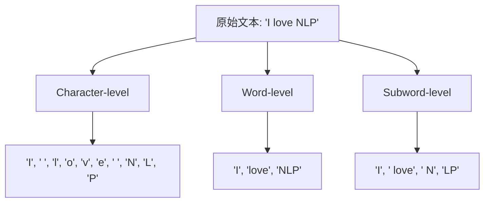

| 维度 | Character-level | Word-level | Subword-level |
|------|----------------|------------|---------------|
| **切分粒度** | 单个字符 | 完整单词 | 子词片段 (2-10 chars) |
| **词表大小** | 极小 (~100-300) | 极大 (100K-1M+) | 中等 (30K-200K) |
| **OOV 问题** | 无 OOV | 严重 OOV | 几乎无 OOV |
| **序列长度** | 极长 (5-10x) | 最短 | 中等 (1.3-2x) |
| **语义信息** | 极少 | 丰富 | 适中 |
| **训练效率** | 低 (序列太长) | 中 (embedding 太大) | 高 (平衡) |
| **代表模型** | Char-RNN, ByT5 | 传统 NLP | GPT, BERT, LLaMA |

### 1.2 为什么 Subword 胜出？

Subword 成为主流有深刻的理论和实践原因：

**1. Information-theoretic perspective（信息论视角）**

根据 Zipf 定律，自然语言中词频分布呈幂律：少数高频词占据大部分文本，大量低频词偶尔出现。

```
词频排名 r 的词出现频率 ∝ 1/r^α   (α ≈ 1)
```

- **Word-level**: 需要覆盖所有词（包括罕见词、拼写变体、专有名词），词表膨胀到不可控
- **Character-level**: 词表极小但序列过长，attention 复杂度为 O(n^2)，训练代价巨大
- **Subword**: 在词表大小和序列长度之间取得最优平衡

**2. 形态学优势 (Morphological Advantage)**

Subword 天然捕捉了词的形态结构：

```
"unbelievable" → ["un", "believ", "able"]
"playing"      → ["play", "ing"]
"played"       → ["play", "ed"]
```

这使得模型可以通过 subword 组合理解未见过的词，类似人类通过词根词缀理解生词。

**3. 跨语言泛化**

许多 subword（尤其是拉丁词根）在多种语言间共享：

```
"information" → English
"información" → Spanish  (共享 "inform")
"information" → French   (共享 "information")
```

### 1.3 Fertility Ratio（token 产出比）

**Fertility ratio** 定义为平均每个词被切分成的 token 数量，是衡量 tokenizer 效率的核心指标：

$$
\text{Fertility} = \frac{\text{总 token 数}}{\text{总词数}}
$$

| 语言 | GPT-2 BPE | SentencePiece 32K | tiktoken cl100k |
|------|-----------|-------------------|-----------------|
| English | ~1.3 | ~1.5 | ~1.1 |
| Chinese | ~2.5-3.0 | ~1.8-2.2 | ~1.5-1.8 |
| Japanese | ~3.0-4.0 | ~2.0-2.5 | ~1.8-2.2 |
| Korean | ~2.5-3.5 | ~1.8-2.3 | ~1.5-2.0 |
| Arabic | ~2.0-3.0 | ~1.6-2.0 | ~1.3-1.6 |
| German | ~1.5-2.0 | ~1.6-1.8 | ~1.3-1.5 |

> **关键洞察**: Fertility ratio 直接影响训练和推理成本。中文文本使用 GPT-2 tokenizer 时需要英文 2-3 倍的 token 数，意味着同样的 context window 能容纳的中文内容更少。

### 1.4 Tokenizer 对模型效率的全方位影响

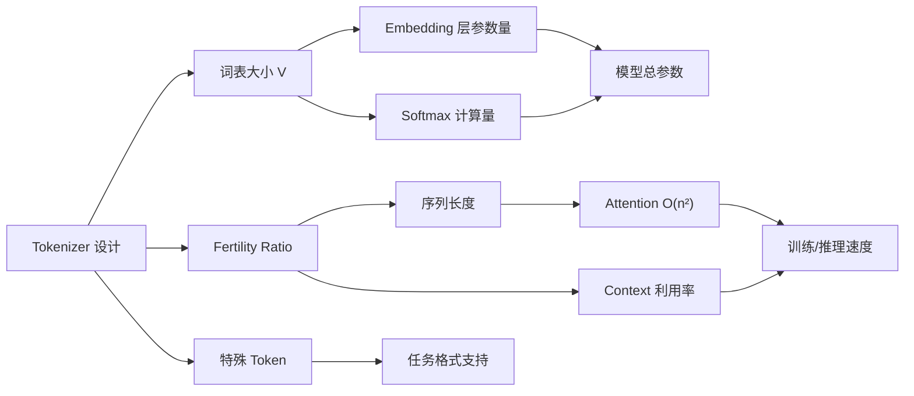

| 影响因素 | 机制 | 量化影响 |
|---------|------|---------|
| **词表大小 V** | Embedding 矩阵 V x d，LM head d x V | V 从 32K 到 128K 增加约 1-4B 参数 |
| **Fertility ratio** | 决定相同语义的序列长度 | 中文 fertility 高 2x 则 attention 慢 4x (O(n^2)) |
| **Token 粒度** | 影响模型学习难度 | 过细的切分需要更多层来组合语义 |
| **Byte fallback** | 避免 UNK 但增加序列长度 | 罕见字符退化为 1-4 个 byte token |

> **延伸阅读**: Tokenizer 的设计与模型整体架构紧密相关，详见 [LLM Architectures](05_大模型/04_LLM架构/05_LLM架构.md)。

---

## 2. BPE (Byte-Pair Encoding)

### 2.1 算法起源与核心思想

BPE 最初由 Gage (1994) 提出用于数据压缩，后被 Sennrich et al. (2015) 引入 NMT（Neural Machine Translation）。其核心思想极其简洁：

> **从字符级别开始，反复合并出现频率最高的相邻 token 对，直到词表达到预设大小。**

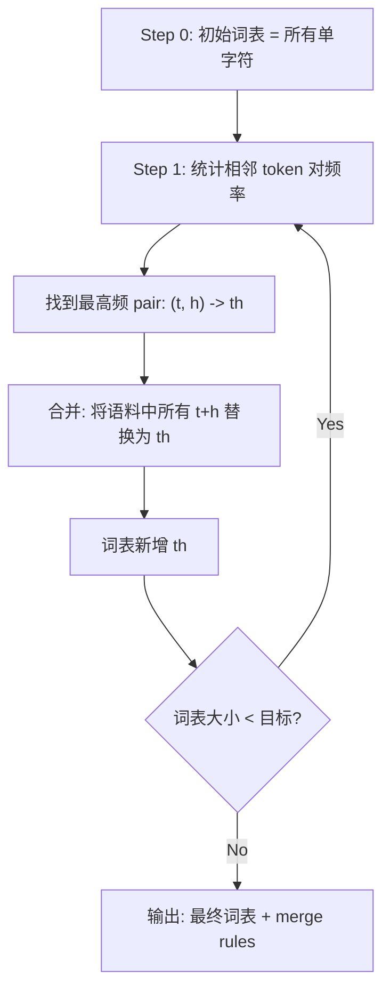

### 2.2 BPE 训练算法详解

**输入**: 训练语料 C，目标词表大小 V

**输出**: 词表 Vocab，合并规则序列 Merges

```python
# ============================================================
# BPE Training Algorithm - 完整伪代码
# ============================================================

def train_bpe(corpus: str, vocab_size: int) -> tuple[set, list]:
    """
    训练 BPE tokenizer。

    Args:
        corpus: 训练语料（已做 pre-tokenization，按词切分）
        vocab_size: 目标词表大小

    Returns:
        vocab: 最终词表
        merges: 有序的合并规则列表
    """
    # Step 1: 初始化——将每个词拆成字符序列，末尾加 </w> 标记词边界
    # 例如: "low" → ('l', 'o', 'w', '</w>')
    word_freqs = count_word_frequencies(corpus)
    # splits[word] = 该词当前的 token 序列
    splits = {word: list(word) + ['</w>'] for word in word_freqs}

    # 初始词表 = 所有出现的单字符
    vocab = set()
    for word in word_freqs:
        vocab.update(list(word))
    vocab.add('</w>')

    merges = []  # 记录合并规则的有序列表

    while len(vocab) < vocab_size:
        # Step 2: 统计所有相邻 token pair 的频率
        pair_freqs = {}
        for word, tokens in splits.items():
            freq = word_freqs[word]
            for i in range(len(tokens) - 1):
                pair = (tokens[i], tokens[i + 1])
                pair_freqs[pair] = pair_freqs.get(pair, 0) + freq

        if not pair_freqs:
            break  # 没有可合并的 pair 了

        # Step 3: 找到频率最高的 pair
        best_pair = max(pair_freqs, key=pair_freqs.get)

        # Step 4: 合并——在所有词中替换 best_pair
        merged_token = best_pair[0] + best_pair[1]
        for word in splits:
            tokens = splits[word]
            new_tokens = []
            i = 0
            while i < len(tokens):
                if (i < len(tokens) - 1 and
                    tokens[i] == best_pair[0] and
                    tokens[i + 1] == best_pair[1]):
                    new_tokens.append(merged_token)
                    i += 2  # 跳过已合并的两个 token
                else:
                    new_tokens.append(tokens[i])
                    i += 1
            splits[word] = new_tokens

        # 记录合并规则并更新词表
        merges.append(best_pair)
        vocab.add(merged_token)

    return vocab, merges
```

### 2.3 BPE 编码（Encoding）

编码过程使用 **greedy matching**：从左到右，尽可能匹配最长的 merge rule。

```python
# ============================================================
# BPE Encoding - 贪心编码
# ============================================================

def encode_bpe(word: str, merges: list[tuple]) -> list[str]:
    """
    使用训练好的 merge rules 对一个词进行编码。

    贪心策略：按 merge 顺序（即训练时的合并顺序），
    依次尝试合并，先合并的优先级更高。

    Args:
        word: 待编码的词
        merges: 训练得到的有序合并规则

    Returns:
        tokens: 编码后的 token 列表
    """
    tokens = list(word) + ['</w>']

    for pair in merges:
        merged = pair[0] + pair[1]
        new_tokens = []
        i = 0
        while i < len(tokens):
            if (i < len(tokens) - 1 and
                tokens[i] == pair[0] and
                tokens[i + 1] == pair[1]):
                new_tokens.append(merged)
                i += 2
            else:
                new_tokens.append(tokens[i])
                i += 1
        tokens = new_tokens

        if len(tokens) == 1:
            break

    # 如果词表中不存在该 token，拆分为已知子词
    return tokens


# ============================================================
# BPE Decoding - 解码
# ============================================================

def decode_bpe(tokens: list[str]) -> str:
    """
    将 token 序列还原为文本。
    去掉 </w> 词边界标记，拼接所有 token。
    """
    text = ''.join(tokens)
    text = text.replace('</w>', ' ')
    return text.strip()
```

### 2.4 BPE 训练示例（Hand Trace）

假设语料为：`"low low low low lower lower newest newest widest widest"`

```
词频统计:
  low     : 4    → (l, o, w, </w>)
  lower   : 2    → (l, o, w, e, r, </w>)
  newest  : 2    → (n, e, w, e, s, t, </w>)
  widest  : 2    → (w, i, d, e, s, t, </w>)

Round 1: 统计 pair 频率
  (l, o) → 6 (low*4 + lower*2)     ← 最高频！
  (o, w) → 6                        ← 同样最高
  (w, </w>) → 4
  (e, r) → 2
  ...

  合并 (l, o) → lo
  词表新增: lo

Round 2:
  (lo, w) → 6                       ← 最高频
  合并 (lo, w) → low
  词表新增: low

Round 3:
  (low, </w>) → 4                   ← 最高频
  合并 (low, </w>) → low</w>
  词表新增: low</w>

...继续合并直到达到目标词表大小
```

### 2.5 GPT-2 Tokenizer

GPT-2 使用了 **50,257** 个 token 的词表：

| 组成 | 数量 | 说明 |
|------|------|------|
| BPE merges | 50,000 | 50,000 次合并操作 |
| 单字节 token | 256 | 覆盖所有可能的字节值 |
| 特殊 token | 1 | `<\|endoftext\|>` |
| **总计** | **50,257** | |

GPT-2 tokenizer 的关键创新是 **Byte-level BPE**。关于 GPT 系列的更多技术细节，参见 [GPT-3 Deep Dive](20_论文精读/03_规模扩展/02_GPT3_深入分析.md)。

### 2.6 Byte-level BPE

传统 BPE 使用 Unicode 字符作为基础单元，面临一个根本问题：Unicode 有超过 140,000 个字符，基础词表太大。

**Byte-level BPE** 的解决方案：将 Unicode 文本先编码为 UTF-8 字节序列，然后在字节级别做 BPE。

```python
# ============================================================
# Byte-level BPE - 核心思想
# ============================================================

# 传统 BPE: Unicode 字符为基础
# "café" → ['c', 'a', 'f', 'é']     # 'é' 是一个基础 token
# 问题: 基础词表需要覆盖所有 Unicode 字符 (>140K)

# Byte-level BPE: UTF-8 字节为基础
# "café" → UTF-8 → [0x63, 0x61, 0x66, 0xC3, 0xA9]
# 基础词表只有 256 个字节！

text = "café"
utf8_bytes = text.encode('utf-8')
# b'caf\xc3\xa9' → 5 bytes

# 然后在这 5 个字节上做 BPE 合并
# 可能的 merge: (0x63, 0x61) → 'ca'
#               (0x66, 0xC3) → 跨字符边界的合并（没关系）
```

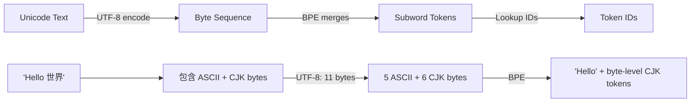

**Byte-level BPE 的优势**:

| 优势 | 说明 |
|------|------|
| **Universal coverage** | 256 字节覆盖所有可能的文本，永远不会出现 UNK |
| **小基础词表** | 基础词表仅 256，合并后可控地扩展到目标大小 |
| **Unicode 规范化无关** | 不需要 NFC/NFD 规范化，直接在字节层面操作 |
| **多语言友好** | CJK、阿拉伯文、emoji 等都能自然处理 |

### 2.7 GPT-2 的 BPE 实现细节

GPT-2 使用了一个巧妙的 **byte-to-unicode mapping** 来确保 token 都是可打印字符：

```python
# ============================================================
# GPT-2 byte-to-unicode mapping
# ============================================================

def bytes_to_unicode():
    """
    将 256 个字节映射到可打印的 Unicode 字符。
    不可打印的字节 (0x00-0x20, 0x7F, etc.) 映射到
    U+0100 开始的连续码位，确保可视化。
    """
    bs = (list(range(ord("!"), ord("~")+1)) +
          list(range(ord("¡"), ord("¬")+1)) +
          list(range(ord("®"), ord("ÿ")+1)))
    cs = bs[:]
    n = 0
    for b in range(256):
        if b not in bs:
            bs.append(b)
            cs.append(256 + n)
            n += 1
    # bs[i] 是原始字节值, cs[i] 是对应的 Unicode 码位
    return dict(zip(bs, [chr(c) for c in cs]))

# 这样 "hello" 中的 'h' 和 "H" 会被区分（大小写敏感）
# 空格 " " 会被替换为 "Ġ"（U+0120）来可视化
# 例如: " Hello world" → ["ĠHello", "Ġworld"]
```

### 2.8 Pre-tokenization 正则

GPT-2 使用正则表达式在 BPE 之前做初步切分，将文本按自然边界（单词、数字、标点）分开：

```python
# GPT-2 的 pre-tokenization 正则模式
GPT2_SPLIT_PATTERN = r"""'s|'t|'re|'ve|'m|'ll|'d| ?\p{L}+| ?\p{N}+| ?[^\s\p{L}\p{N}]+|\s+(?!\S)|\s+"""

# 效果示例:
# "Hello, world! I'm fine." → ["Hello", ",", " world", "!", " I", "'m", " fine", "."]
# 注意: 空格被附加到后面的 token 上 (" world" 而非 " " + "world")
```

---

## 3. WordPiece

### 3.1 起源与核心差异

WordPiece 由 Schuster & Nakajima (2012) 提出，最初用于 Google 的语音识别系统，后因 BERT (Devlin et al., 2018) 而广为人知。

**WordPiece vs BPE 的关键区别**:

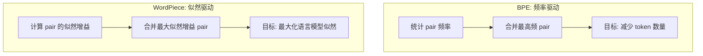

### 3.2 WordPiece 合并准则

BPE 选择频率最高的 pair 进行合并，而 WordPiece 选择使语言模型似然增加最多的 pair：

```
Score(x, y) = count(xy) / (count(x) * count(y)) * N
```

其中 N 是总 token 数。

**直觉理解**: WordPiece 选择的是"合并后概率远大于两个独立概率乘积"的 pair，即 **高度相关的 token 对**。这避免了合并两个虽然高频但互相独立的 token。

```python
# ============================================================
# WordPiece 合并准则 vs BPE 对比示例
# ============================================================

# 假设语料统计:
# count("the") = 1000, count("r") = 500, count("ther") = 50
# count("a") = 800,    count("t") = 600, count("at")  = 400

# BPE 选择: 频率最高的 pair
#   pair ("a", "t"): freq = 400  ← BPE 优先合并这个
#   pair ("the", "r"): freq = 50

# WordPiece 选择: 似然增益最大的 pair
#   score("the", "r") = 50 / (1000 * 500) * N = 0.0001 * N
#   score("a", "t")   = 400 / (800 * 600) * N = 0.000833 * N

# 但在某些情况下两者选择不同:
#   如果 pair("x", "y") freq=100 但 count("x")=110, count("y")=105
#   score = 100 / (110*105) = 0.00866  → 极高的相关性！WordPiece 优先
#   而 BPE 可能选了 freq=200 但 score 更低的另一个 pair
```

### 3.3 BERT Tokenizer

BERT 使用 WordPiece tokenizer，词表大小为 **30,522**:

| 组成 | 数量 | 说明 |
|------|------|------|
| 基础 token | ~1,000 | 单字符、常见子词 |
| WordPiece merges | ~29,000 | 合并产生的子词 |
| 特殊 token | 5 | [CLS], [SEP], [MASK], [PAD], [UNK] |
| **总计** | **30,522** | |

### 3.4 ## Prefix Convention

WordPiece 使用 `##` 前缀标记非词首的子词：

```
"unbelievable" → ["un", "##believ", "##able"]
"playing"      → ["play", "##ing"]
"tokenization" → ["token", "##ization"]
```

**编码过程**:

```python
# ============================================================
# WordPiece Encoding 示例
# ============================================================

def encode_wordpiece(word: str, vocab: set) -> list[str]:
    """
    WordPiece 编码：从左到右贪心匹配最长子词。
    非词首子词带 ## 前缀。

    Args:
        word: 待编码词（小写化后）
        vocab: WordPiece 词表

    Returns:
        tokens: 子词列表
    """
    tokens = []
    start = 0

    while start < len(word):
        end = len(word)
        found = None

        while start < end:
            substr = word[start:end]
            if start > 0:
                substr = "##" + substr  # 非词首加 ##

            if substr in vocab:
                found = substr
                break
            end -= 1

        if found is None:
            return ["[UNK]"]  # 无法切分，返回 UNK

        tokens.append(found)
        start = end

    return tokens


# 示例
# encode_wordpiece("unbelievable", vocab)
# → ["un", "##believ", "##able"]
#
# encode_wordpiece("tokenization", vocab)
# → ["token", "##ization"]
#
# encode_wordpiece("xyzabc", vocab)
# → ["[UNK]"]  (如果所有子串都不在词表中)
```

### 3.5 Multilingual BERT (mBERT)

mBERT 使用一个 **110K** 的共享词表覆盖 **104 种语言**：

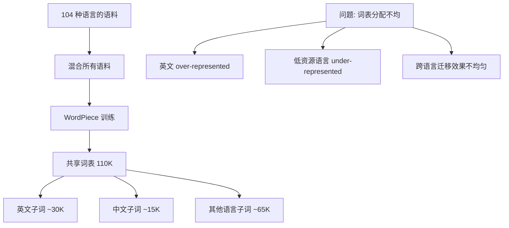

**mBERT 的局限性**:

| 问题 | 描述 | 影响 |
|------|------|------|
| **词表分配不均** | 英文占据大量词表空间 | 中文/阿拉伯文 fertility ratio 高 |
| **脚本不共享** | 不同语言的相似词用不同脚本表示 | 跨语言迁移受限 |
| **UNK 频繁** | 低资源语言的词频繁命中 UNK | 性能下降 |

这些问题推动了后续模型（如 XLM-R）使用更大的词表和更均衡的语料采样。

---

## 4. Unigram Language Model

### 4.1 核心思想：从大到小

与 BPE "从小到大" 构建词表不同，Unigram Language Model 采用 **"从大到小"** 的策略：

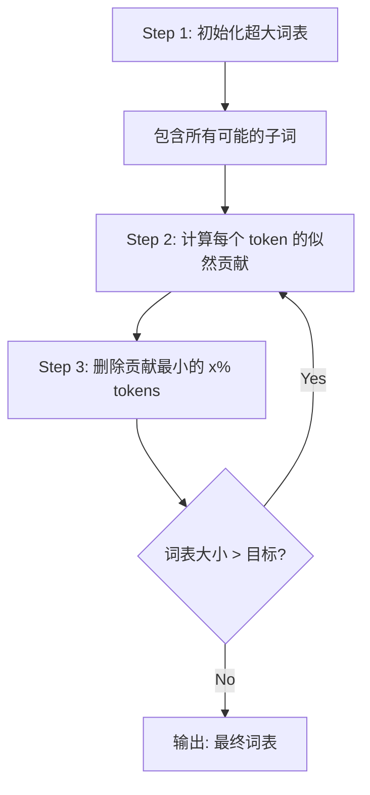

### 4.2 数学框架

Unigram LM 假设文本中每个 token 独立生成（unigram assumption），给定词表 V，文本 X = (x1, x2, ..., xN) 的对数似然为：

```
log P(X) = sum_{i=1}^{N} log p(x_i)
```

其中 p(x_i) 是 token x_i 的单字概率，所有 token 的概率之和为 1。

**目标**: 找到大小为 V 的词表 V*，使得训练数据似然最大。

### 4.3 EM 算法训练

```python
# ============================================================
# Unigram LM Training - EM Algorithm
# ============================================================

import math
from collections import Counter

ESSENTIAL_TOKENS = set(chr(i) for i in range(256))  # 保留所有基础字符

def train_unigram(corpus: list[str], target_vocab_size: int,
                  shrink_rate: float = 0.8) -> dict[str, float]:
    """
    训练 Unigram Language Model。

    使用 EM 算法迭代优化：
    - E-step: 用当前模型对训练数据做最优分词
    - M-step: 更新 token 概率分布
    - Prune: 删除对似然贡献最小的 token

    Args:
        corpus: 训练语料（句子列表）
        target_vocab_size: 目标词表大小
        shrink_rate: 每轮保留的 token 比例

    Returns:
        vocab: token → probability 映射
    """
    # Step 1: 初始化大词表
    # 收集语料中所有出现的子串作为初始词表
    vocab = initialize_large_vocab(corpus)
    # 均匀初始化概率
    probs = {token: 1.0 / len(vocab) for token in vocab}

    while len(vocab) > target_vocab_size:
        # === E-step: 最优分词 ===
        # 对每个句子用 Viterbi/动态规划找最优分词
        tokenized_corpus = []
        for sentence in corpus:
            best_tokens = viterbi_segment(sentence, probs)
            tokenized_corpus.append(best_tokens)

        # === M-step: 更新概率 ===
        # 统计每个 token 的出现次数
        token_counts = Counter()
        for tokens in tokenized_corpus:
            token_counts.update(tokens)
        total = sum(token_counts.values())
        probs = {token: count / total
                 for token, count in token_counts.items()}

        # === Prune: 删除低贡献 token ===
        # 计算每个 token 的似然损失（如果删除它，似然下降多少）
        losses = {}
        for token in vocab:
            if token in ESSENTIAL_TOKENS:  # 保留基础字符
                losses[token] = float('inf')
                continue
            # 损失 = 该 token 的总对数似然贡献
            count = token_counts.get(token, 0)
            prob = probs.get(token, 1e-10)
            losses[token] = count * math.log(prob)

        # 按损失从小到大排序，删除损失最小的（即贡献最少的）
        sorted_tokens = sorted(losses.items(), key=lambda x: x[1])
        n_remove = int(len(vocab) * (1 - shrink_rate))
        tokens_to_remove = set(t for t, _ in sorted_tokens[:n_remove])
        vocab -= tokens_to_remove

        # 重新归一化概率
        probs = {t: p for t, p in probs.items() if t in vocab}
        total_prob = sum(probs.values())
        probs = {t: p / total_prob for t, p in probs.items()}

    return probs


def viterbi_segment(sentence: str, probs: dict) -> list[str]:
    """
    用 Viterbi 动态规划找到最优分词。

    dp[i] = 句子前 i 个字符的最大对数似然
    back[i] = 达到 dp[i] 的最优切分点
    """
    n = len(sentence)
    dp = [float('-inf')] * (n + 1)
    dp[0] = 0.0
    back = [0] * (n + 1)

    for i in range(1, n + 1):
        for j in range(max(0, i - MAX_TOKEN_LEN), i):
            token = sentence[j:i]
            if token in probs:
                score = dp[j] + math.log(probs[token])
                if score > dp[i]:
                    dp[i] = score
                    back[i] = j

    # 回溯找最优切分
    tokens = []
    i = n
    while i > 0:
        j = back[i]
        tokens.append(sentence[j:i])
        i = j
    return list(reversed(tokens))
```

### 4.4 Subword Regularization

Unigram LM 的一个独特优势是 **subword regularization**（Kudo, 2018）：

由于 Unigram 模型给出了每个 token 的概率，同一个词可能有多种合理的分词方式。训练时随机采样不同的分词，作为一种数据增强：

```python
# ============================================================
# Subword Regularization
# ============================================================

# "New York" 的多种可能分词（按概率降序）:
# 1. ["New", " York"]         prob = 0.65
# 2. ["New", " Y", "ork"]     prob = 0.15
# 3. ["N", "ew", " York"]     prob = 0.10
# 4. ["New", " ", "York"]     prob = 0.05

# 常规训练: 总是用最优分词 → 可能过拟合到特定的分词方式
# Subword Regularization: 按概率采样不同分词

def sample_segmentation(sentence: str, probs: dict,
                        alpha: float = 0.5) -> list[str]:
    """
    从 Unigram 模型中采样一个分词（非贪心）。

    alpha 控制采样的随机性:
    - alpha → 0: 退化为贪心（总是最优分词）
    - alpha → ∞: 均匀采样所有可能分词
    - alpha = 0.5: 推荐值，平衡多样性和质量

    Args:
        sentence: 待分词的句子
        probs: unigram 概率分布
        alpha: 采样温度

    Returns:
        采样得到的 token 列表
    """
    # 使用 lattice 上的前向-后向算法
    # 然后用 alpha 调整概率进行采样
    lattice = build_lattice(sentence, probs)
    adjusted_probs = {t: p ** alpha for t, p in lattice.items()}
    return sample_from_lattice(lattice, adjusted_probs)


# 效果: 每个 epoch 看到的 tokenization 可能不同
# → 模型更鲁棒，不会过拟合到特定的切分方式
# → 在低资源场景下效果提升显著 (1-3 BLEU)
```

### 4.5 使用 Unigram 的代表模型

| 模型 | 词表大小 | 说明 |
|------|---------|------|
| **T5** | 32,128 | SentencePiece Unigram |
| **LLaMA 1** | 32,000 | SentencePiece BPE (非 Unigram) |
| **LLaMA 2** | 32,000 | SentencePiece BPE |
| **mBART** | 250,000 | SentencePiece Unigram, 多语言 |
| **ALBERT** | 30,000 | SentencePiece Unigram |
| **XLNet** | 32,000 | SentencePiece Unigram |

> **注意**: LLaMA 1/2 虽然使用 SentencePiece，但实际选择的是 BPE 模式而非 Unigram 模式。T5 和 mBART 是使用 Unigram 的典型代表。更多 LLaMA 系列的技术细节见 [LLaMA Deep Dive](20_论文精读/02_模型架构/04_LLaMA_深入分析.md)。

---

## 5. SentencePiece

### 5.1 设计理念

SentencePiece (Kudo & Richardson, 2018) 是一个 **语言无关** 的 tokenizer 框架，解决了传统 tokenizer 的几个痛点：

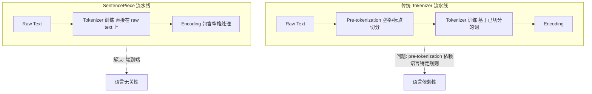

### 5.2 核心特性

| 特性 | 描述 | 优势 |
|------|------|------|
| **语言无关** | 不需要 pre-tokenization，直接在原始文本上训练 | 适用于任何语言，包括无空格语言（中文、日文、泰文） |
| **Raw bytes** | 将所有输入视为 raw bytes，用 Unicode 字符处理空格 | 不丢失空格信息 |
| **BPE 或 Unigram** | 支持两种训练算法 | 灵活选择 |
| **可逆性** | 编码和解码完全可逆（不丢失空格信息） | 空格用 U+2581 表示 |
| **子词正则化** | 内置 subword regularization 支持 | 训练时数据增强 |

### 5.3 空格处理

SentencePiece 用一个特殊的 **meta symbol** `▁` (U+2581, Lower One Eighth Block) 来表示空格：

```python
# ============================================================
# SentencePiece 空格处理
# ============================================================

# 原始文本
text = "Hello world"

# SentencePiece 编码结果 (注意 ▁ 代表空格)
# ['▁Hello', '▁world']
# 或可能的子词切分:
# ['▁He', 'llo', '▁world']

# 与传统 tokenizer 的区别:
# 传统: "Hello  world" → ["Hello", "world"]  (丢失了双空格信息)
# SP:   "Hello  world" → ["▁Hello", "▁", "world"]  (保留了双空格)

# 中文示例 (中文没有空格分隔):
text_zh = "我爱自然语言处理"
# SentencePiece: ['▁我', '爱', '自然', '语言', '处理']
# 或: ['▁我', '爱', '自', '然', '语', '言', '处', '理']
# 取决于训练数据和词表大小
```

### 5.4 特殊 Token

SentencePiece 预定义了一组特殊 token：

| Token | 含义 | 典型 ID | 说明 |
|-------|------|--------|------|
| `<unk>` | Unknown | 0 | 未知 token（BPE byte-level 可避免） |
| `<s>` | BOS (Begin of Sequence) | 1 | 序列开始标记 |
| `</s>` | EOS (End of Sequence) | 2 | 序列结束标记 |
| `<pad>` | Padding | - | 填充 token（可选） |

用户还可以添加自定义特殊 token：

```python
# ============================================================
# SentencePiece 自定义特殊 Token 训练
# ============================================================

import sentencepiece as spm

# 训练时添加自定义特殊 token
spm.SentencePieceTrainer.train(
    input='corpus.txt',
    model_prefix='my_tokenizer',
    vocab_size=32000,
    model_type='bpe',           # 或 'unigram'
    # 自定义特殊 token
    user_defined_symbols=[
        '<|start_of_turn|>',
        '<|end_of_turn|>',
        '<|system|>',
        '<|user|>',
        '<|assistant|>',
        '<|tool_call|>',
        '<|tool_result|>',
    ],
    # Byte fallback: 未知字符退化为 UTF-8 字节
    byte_fallback=True,
    # 覆盖所有 Unicode 字符
    character_coverage=0.9999,
)

# 加载和使用
sp = spm.SentencePieceProcessor()
sp.load('my_tokenizer.model')

# 编码
ids = sp.encode("Hello, world!", out_type=int)
# [12345, 6, 7890, 2]

# 解码
text = sp.decode(ids)
# "Hello, world!"

# Subword regularization (训练时)
# 返回多个可能的分词结果
pieces_list = sp.encode(
    "New York",
    out_type=str,
    enable_sampling=True,  # 开启采样
    nbest_size=5,          # 返回 5 个候选
    alpha=0.5              # 温度参数
)
```

### 5.5 SentencePiece 在开源模型中的地位

SentencePiece 是 2023-2025 年开源 LLM 的 **事实标准** tokenizer：

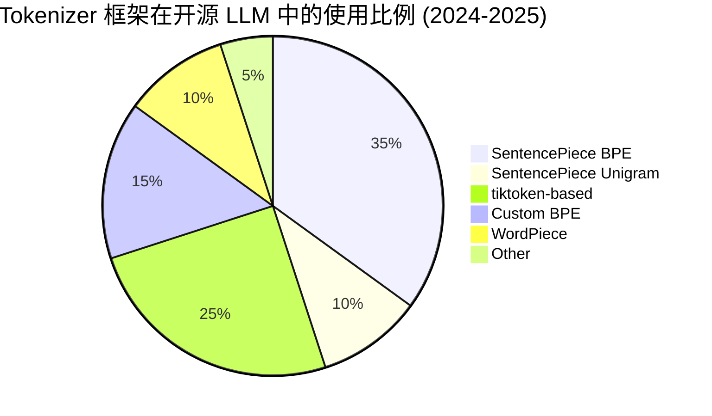

---

## 6. tiktoken (OpenAI)

### 6.1 概述

tiktoken 是 OpenAI 开源的高性能 tokenizer 库，用 **Rust** 实现核心算法，比纯 Python 实现快 **3-6x**。它是 GPT-3、GPT-4、GPT-4o 等模型的官方 tokenizer。

| 特性 | 说明 |
|------|------|
| **语言** | Rust core + Python bindings (via PyO3) |
| **算法** | Byte-level BPE |
| **速度** | 比 HuggingFace tokenizers 快 2-3x |
| **正则支持** | 内置 pre-tokenization regex (用 regex crate) |
| **特殊 token** | 可配置的特殊 token 集合 |

### 6.2 tiktoken 词表演进

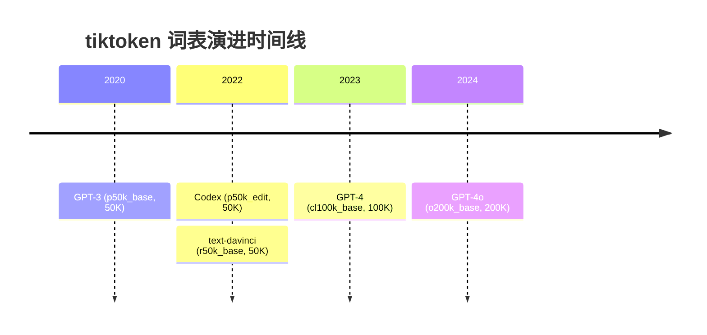

### 6.3 主要词表对比

| 词表名称 | 词表大小 | 对应模型 | 特点 |
|---------|---------|---------|------|
| **p50k_base** | 50,257 | GPT-3, text-davinci-001/002/003 | 基础 BPE，与 GPT-2 相同 |
| **p50k_edit** | 50,257 | Codex, code-davinci-001/002 | 增加了代码相关的特殊 token |
| **r50k_base** | 50,257 | text-davinci-002/003, InstructGPT | 微调版 p50k |
| **cl100k_base** | 100,256 | GPT-4, GPT-3.5-turbo | 大幅扩展，支持更多语言 |
| **o200k_base** | 200,000 | GPT-4o | 目前最大，多语言最优 |

### 6.4 cl100k_base vs p50k_base

cl100k_base 相比 p50k_base 的关键改进：

```python
# ============================================================
# cl100k_base vs p50k_base 效率对比
# ============================================================

import tiktoken

p50k = tiktoken.get_encoding("p50k_base")
cl100k = tiktoken.get_encoding("cl100k_base")

# 英文文本
text_en = "The quick brown fox jumps over the lazy dog."
print(f"p50k:   {len(p50k.encode(text_en))} tokens")   # 12 tokens
print(f"cl100k: {len(cl100k.encode(text_en))} tokens")  # 10 tokens

# 中文文本 (差异更显著)
text_zh = "人工智能正在改变我们的生活方式"
print(f"p50k:   {len(p50k.encode(text_zh))} tokens")   # ~25 tokens
print(f"cl100k: {len(cl100k.encode(text_zh))} tokens")  # ~15 tokens

# 代码
code = "def fibonacci(n): return n if n < 2 else fibonacci(n-1) + fibonacci(n-2)"
print(f"p50k:   {len(p50k.encode(code))} tokens")    # ~25 tokens
print(f"cl100k: {len(cl100k.encode(code))} tokens")   # ~20 tokens

# cl100k 新增的特殊 token (ChatML 格式):
# <|startoftext|>, <|endofprompt|>
# <|im_start|>, <|im_end|>    <- ChatML 格式专用
```

### 6.5 o200k_base (GPT-4o)

o200k_base 是目前最大的生产级 tokenizer：

| 维度 | cl100k_base (100K) | o200k_base (200K) | 改进 |
|------|-------------------|-------------------|------|
| **词表大小** | 100,256 | 200,000 | +99.5% |
| **英文 fertility** | ~1.1 | ~1.0 | 略优 |
| **中文 fertility** | ~1.5-1.8 | ~1.2-1.4 | 显著改善 |
| **日文 fertility** | ~1.8-2.2 | ~1.4-1.7 | 显著改善 |
| **代码效率** | 良好 | 优秀 | 新增更多代码 token |
| **推理成本** | 基线 | token 数减少 ~20-30% | 非英文文本受益最大 |

### 6.6 tiktoken 性能优势

```python
# ============================================================
# tiktoken 性能基准测试
# ============================================================

import tiktoken
import time

# 准备测试数据
text = open("large_corpus.txt").read()  # ~1MB 文本

# tiktoken (Rust backend)
enc = tiktoken.get_encoding("cl100k_base")
start = time.time()
tokens = enc.encode(text)
tiktoken_time = time.time() - start
print(f"tiktoken:    {tiktoken_time:.3f}s, {len(tokens)} tokens")

# 对比: HuggingFace tokenizers (Rust backend, 同样快)
from transformers import GPT2TokenizerFast
hf_enc = GPT2TokenizerFast.from_pretrained("gpt2")
start = time.time()
hf_tokens = hf_enc.encode(text)
hf_time = time.time() - start
print(f"HuggingFace: {hf_time:.3f}s, {len(hf_tokens)} tokens")

# tiktoken 的核心性能来自:
# 1. Rust 实现核心 BPE 算法
# 2. 高效的 regex pre-tokenization (用 regex crate)
# 3. 优化的 merge rule 查找（使用 hash map）
# 4. 多线程支持 (Python GIL 在 Rust 侧释放)
```

---

## 7. 现代 Tokenizer 设计

### 7.1 LLaMA 3 Tokenizer

LLaMA 3 (Meta, 2024) 做了一个标志性决策：从 SentencePiece 迁移到 **tiktoken-based** tokenizer。

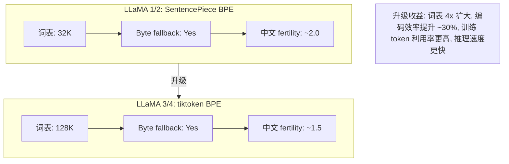

**LLaMA 3 Tokenizer 详细参数**:

| 参数 | 值 | 说明 |
|------|---|------|
| **算法** | BPE (tiktoken-based) | 基于 OpenAI tiktoken 修改 |
| **词表大小** | 128,256 | 比 LLaMA 2 大 4x |
| **Byte fallback** | Yes | 未知字符退化为 UTF-8 字节 |
| **Pre-tokenization** | Regex split | 使用 tiktoken 的 regex pattern |
| **特殊 token** | `<\|begin_of_text\|>`, `<\|end_of_text\|>` | 大量预留特殊 token 位 |
| **训练数据** | LLaMA 3 预训练语料 (~15T tokens) | 多语言混合 |

### 7.2 Qwen Tokenizer

Qwen 系列（阿里通义千问）使用了一个 **多语言优化** 的大词表 tokenizer：

| 参数 | Qwen 1/2 | Qwen 2.5/3 |
|------|----------|------------|
| **词表大小** | 151,643 | 151,643 |
| **算法** | BPE (基于 tiktoken) | BPE (基于 tiktoken) |
| **Byte fallback** | Yes | Yes |
| **中文优化** | 大量中文子词 | 进一步优化 |
| **特殊 token** | `<\|im_start\|>`, `<\|im_end\|>` | 同左 + tool calling tokens |

Qwen tokenizer 的 **151K** 词表是目前主流模型中最大的之一，这使得：
- 中文 fertility ratio 接近 1.0（几乎一个汉字一个 token）
- 代码、数学公式的编码效率也很高
- 代价是 embedding 层参数量较大 (~151K x hidden_dim)

### 7.3 Mistral Tokenizer

Mistral 系列使用相对保守的 **32K** SentencePiece BPE：

| 参数 | Mistral 7B | Mixtral 8x7B | Mistral Large |
|------|-----------|-------------|---------------|
| **词表大小** | 32,000 | 32,000 | 32,000 |
| **算法** | SentencePiece BPE | SentencePiece BPE | SentencePiece BPE |
| **Byte fallback** | Yes | Yes | Yes |

Mistral 选择小词表的理由：
- 7B 模型参数量有限，大词表会让 embedding 层占比过高
- 主要面向英文/欧洲语言，32K 足够
- 小词表意味着更小的 embedding + LM head，更快的 softmax

### 7.4 GLM-4 Tokenizer

GLM-4（智谱 AI）使用 **150K** 词表的 BPE tokenizer：

| 参数 | GLM-3 | GLM-4 |
|------|-------|-------|
| **词表大小** | ~65,000 | ~150,000 |
| **算法** | SentencePiece BPE | BPE (tiktoken-based) |
| **Byte fallback** | Yes | Yes |
| **中文优化** | 良好 | 优秀 |

### 7.5 词表大小 Trade-off 分析

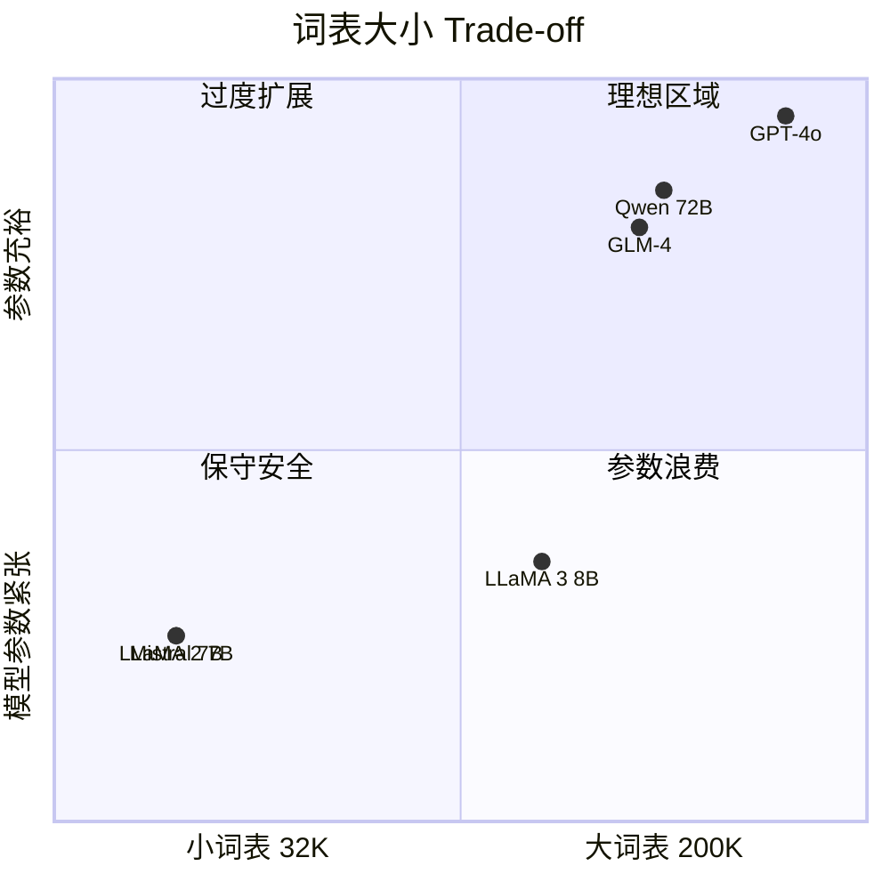

**词表大小决策矩阵**:

| 因素 | 小词表 (32K) | 中词表 (100-128K) | 大词表 (150K+) |
|------|-------------|-------------------|----------------|
| **Embedding 参数** | ~0.13B (d=4096) | ~0.4-0.5B | ~0.6-1.0B |
| **LM head 参数** | ~0.13B | ~0.4-0.5B | ~0.6-1.0B |
| **总参数占比** | <5% (7B 模型) | ~5-10% (8B 模型) | 10-20% (7B 模型) |
| **英文效率** | 良好 | 优秀 | 优秀 |
| **中文效率** | 差 (fertility ~2.5) | 好 (fertility ~1.5) | 优秀 (fertility ~1.1) |
| **适用模型** | 7B 及以下参数 | 8B-70B 参数 | 70B+ 参数或多语言专用 |
| **训练数据量** | <1T tokens | 1-15T tokens | >10T tokens |

### 7.6 Byte Fallback 机制

Byte fallback 是现代 tokenizer 的标配安全网：

```python
# ============================================================
# Byte Fallback 示例
# ============================================================

# 当遇到词表中不存在的字符时，退化为 UTF-8 字节序列

# 假设词表不包含 fox emoji (U+1F98A)
# UTF-8 编码: 0xF0 0x9F 0xA6 0x8A

# Without byte fallback:
# "fox" -> <unk>  (丢失所有信息!)

# With byte fallback:
# fox -> [<0xF0>, <0x9F>, <0xA6>, <0x8A>]
#        (4 个 byte token, 信息完整保留)

# 解码时可以完美还原:
# [<0xF0>, <0x9F>, <0xA6>, <0x8A>] -> bytes -> fox emoji

# 优势:
# 1. 永远不会出现 <unk>
# 2. 任何文本都可以编码和解码
# 3. 罕见字符虽然效率低但至少能处理

# 劣势:
# 1. 罕见字符需要 1-4 个 byte token（效率低）
# 2. 模型需要额外学习如何从 byte 组合还原语义
# 3. 增加了序列长度（对 attention 有轻微影响）
```

### 7.7 特殊 Token 设计趋势

现代 LLM 的特殊 token 设计越来越精细化：

```python
# ============================================================
# 特殊 Token 设计对比
# ============================================================

# GPT-2 (2019) - 极简
gpt2_special = ["<|endoftext|>"]

# ChatML (2023) - Chat 格式
chatml_special = [
    "<|im_start|>",     # 消息开始
    "<|im_end|>",       # 消息结束
    "<|endofprompt|>",  # 提示结束
]

# LLaMA 3 (2024) - 大量预留
llama3_special = [
    "<|begin_of_text|>",
    "<|end_of_text|>",
    # ... 多达 256 个预留位
    "<|start_header_id|>",
    "<|end_header_id|>",
    "<|eot_id|>",       # end of turn
]

# Qwen (2024) - 面向 function calling
qwen_special = [
    "<|im_start|>",
    "<|im_end|>",
    "<|object_ref_start|>",   # 引用开始
    "<|object_ref_end|>",     # 引用结束
    "<|box_start|>",          # 框开始
    "<|box_end|>",            # 框结束
    "<|tool_call|>",          # 工具调用
]

# DeepSeek V3 (2025) - reasoning + tool use
deepseek_special = [
    "<|begin_of_thinking|>",
    "<|end_of_thinking|>",
    "<|begin_of_search|>",
    "<|end_of_search|>",
    "<|begin_of_code|>",
    "<|end_of_code|>",
    "<|tool_calls_separator|>",
    "<|tool_outputs_separator|>",
]
```

---

## 8. 多语言 Tokenizer 挑战

### 8.1 多语言 Tokenizer 的核心矛盾

多语言 tokenizer 面临一个根本矛盾：**有限的词表容量 vs 无限的语言多样性**。

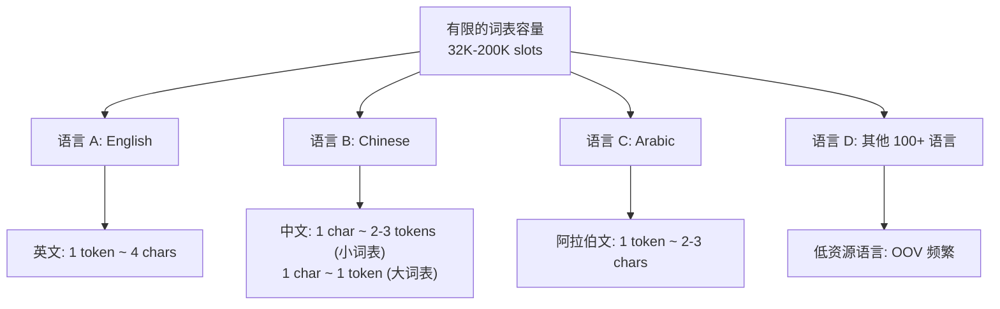

### 8.2 中文/日文的 Tokenization 困境

| 语言 | 字符集 | 常见词数 | 小词表问题 | 大词表方案 |
|------|--------|---------|-----------|-----------|
| **简体中文** | ~3,500 常用字 | ~100,000 常用词 | 每个词 2-4 tokens | 150K+ 词表可覆盖 |
| **繁体中文** | ~4,800 常用字 | ~120,000 常用词 | 同上 | 150K+ 词表可覆盖 |
| **日文 (汉字+假名)** | ~2,136 常用汉字 + 平假名 + 片假名 | ~200,000+ | 每个词 3-5 tokens | 需要极大词表 |
| **韩文** | ~11,172 音节块 | ~80,000 常用词 | 每个词 2-3 tokens | 100K+ 可改善 |

### 8.3 Tokenizer 效率的量化影响

```python
# ============================================================
# 多语言 Tokenizer 效率对比
# ============================================================

# 同一段文本在不同 tokenizer 下的 token 数
# "OpenAI released GPT-4, a large multimodal model."

# 英文原文 (10 words)
english_tokens = {
    "GPT-2 (50K)":     14,    # fertility 1.4
    "cl100k (100K)":   11,    # fertility 1.1
    "LLaMA 2 (32K)":   16,    # fertility 1.6
    "LLaMA 3 (128K)":  12,    # fertility 1.2
}

# 中文翻译: "OpenAI发布了GPT-4，一个大型多模态模型。" (21 chars)
chinese_tokens = {
    "GPT-2 (50K)":     38,    # fertility ~2.7 (per word)
    "cl100k (100K)":   22,    # fertility ~1.6
    "Qwen (151K)":     15,    # fertility ~1.1  (中文优化)
    "LLaMA 3 (128K)":  20,    # fertility ~1.4
}

# 关键洞察:
# 1. GPT-2 tokenizer 处理中文需要 38 tokens vs 英文 14 tokens (2.7x)
# 2. Qwen 的 151K 词表将中文效率提升到接近英文
# 3. 这直接影响 API 定价 (按 token 收费)
```

### 8.4 解决方案策略

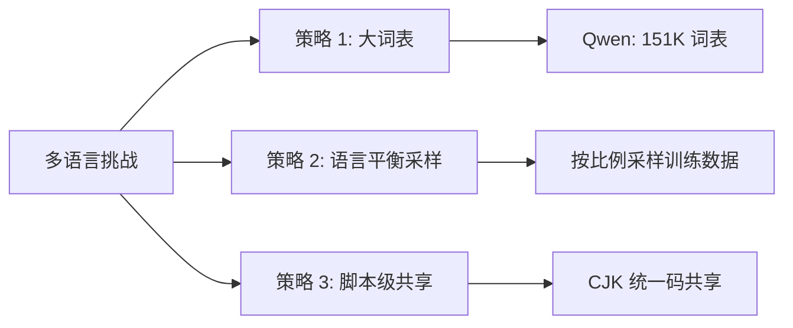

| 策略 | 代表模型 | 优势 | 劣势 |
|------|---------|------|------|
| **大词表 (150K+)** | Qwen, GLM-4 | 所有语言 fertility 都低 | embedding 层参数多 |
| **平衡语料采样** | mBERT, XLM-R | 低资源语言获得公平词表份额 | 高资源语言效率略降 |
| **多 tokenizer** | Google PaLM | 每种语言最优切分 | 实现复杂，跨语言迁移难 |
| **字符级 fallback** | ByT5, CANINE | 无 OOV，简单 | 序列极长，效率低 |

### 8.5 训练成本影响

高 fertility ratio 直接增加训练成本：

```
训练成本 ~ (总 token 数) x (每 token 计算量)

假设训练 1T words 的英文数据:
  英文 (fertility=1.2): 1.2T tokens, 序列长度 2048
  -> 训练 step 数: 1.2T / (batch_size x 2048)

同等语义量的中文数据 (约 1.5T 汉字):
  中文 GPT-2 (fertility=2.5): 3.75T tokens  -> 3.1x 更多 step!
  中文 Qwen  (fertility=1.1): 1.65T tokens  -> 1.4x 更多 step

结论: 大词表 tokenizer 对中文训练节省 ~50% 的计算成本
```

---

## 9. Tokenizer 对下游任务影响

### 9.1 代码生成

代码 tokenization 面临独特挑战：缩进、符号、变量名等需要特殊处理。

```python
# ============================================================
# 代码 Tokenization 挑战
# ============================================================

# Python 缩进 (语义重要!)
code = '''
def foo():
    if True:
        pass
'''

# GPT-4 tokenizer 如何处理:
# ['def', ' foo', '():', '\n', '    ', 'if', ' True', ':', '\n', '        ', 'pass']
# 注意: 4 空格和 8 空格是不同的 token (保留了缩进层级信息)

# 常见编程结构的 tokenization 效率:
# 'self.' -> 1 token (常见模式被合并)
# 'def '  -> 1 token
# 'import ' -> 1 token
# 'return ' -> 1 token

# 变量名的挑战:
# "camelCaseVariable" -> ["camel", "Case", "Variable"]  (3 tokens)
# "snake_case_var"    -> ["snake", "_case", "_var"]      (3 tokens)
# "x42_temp"          -> ["x", "42", "_temp"]             (3 tokens)
```

### 9.2 数学表达

数字和数学符号的 tokenization 对数学推理能力有重要影响：

```python
# ============================================================
# 数字 Tokenization - 一个被忽视的重要问题
# ============================================================

# GPT-2/3 的数字切分:
# "12345" -> ["12", "34", "5"]      (2 位一组!)
# 这导致模型难以理解数字的位值关系

# GPT-4 (cl100k) 的数字切分:
# "12345" -> ["1", "23", "45"]      (仍然不是单数字)
# "3.14159" -> ["3", ".", "14", "15", "9"]

# 这对数学推理的影响:
# - 大数加法: 需要对齐不同长度的数字 token
# - 小数比较: "0.001" vs "0.01" token 结构完全不同
# - 科学计数法: "1e-6" 可能被切成 3+ tokens

# Minerva (Google) 的解决方案: 数字按单 digit 切分
# "12345" -> ["1", "2", "3", "4", "5"]  (5 tokens，但模型更易学习)

# 数学符号:
# "x^2 + y^2 = r^2" -> ["x", "^", "2", " +", " y", "^", "2", " =", " r", "^", "2"]
# "\int_0^1 f(x)dx" -> 多个 subword tokens (LaTeX 编码效率低)
```

### 9.3 Function Calling

现代 LLM 的 function calling / tool use 依赖精心设计的特殊 token：

```python
# ============================================================
# Function Calling Token 设计
# ============================================================

# OpenAI function calling 格式
openai_format = '''
<|python_tag|>get_weather
{"location": "San Francisco", "unit": "celsius"}
'''

# Qwen tool calling 格式
qwen_format = '''
<|im_start|>assistant
<|tool_call|>
{"name": "get_weather", "arguments": {"location": "SF"}}
<|im_end|>
'''

# 关键设计原则:
# 1. 特殊 token 必须在词表中有唯一 ID (不能被 BPE 拆分)
# 2. 格式 token 必须与正常文本 token 可区分
# 3. JSON 中的常见符号 ({, }, ", :) 应高效编码
```

### 9.4 Reasoning Tokenizer（推理分隔符）

DeepSeek R1 和 QwQ 等推理模型引入了 **reasoning tokenizer** 概念：

```python
# ============================================================
# Reasoning Tokenizer - DeepSeek R1
# ============================================================

# DeepSeek R1 的 reasoning 格式
deepseek_reasoning = '''
<|begin_of_thinking|>
Let me analyze this step by step...
First, I need to understand the problem...
The key insight is that...
<|end_of_thinking|>
<|begin_of_search|>
Let me verify this with a calculation...
<|end_of_search|>
The answer is 42.
'''

# 这种设计的关键优势:
# 1. 明确分隔 thinking/search/answer 阶段
# 2. 可以在推理时选择性跳过 thinking tokens (加速输出)
# 3. 训练时可以对 reasoning 部分施加特殊的 loss 权重
# 4. 支持 multi-turn tool use within thinking (搜索-思考循环)

# QwQ (Qwen with Questions) 类似设计:
qwq_format = '''
<|im_start|>assistant
<|think|>
... reasoning process ...
<|/think|>
<|answer|>
... final answer ...
<|/answer|>
'''
```

### 9.5 Tokenizer 选择对任务性能的影响

| 任务 | 关键 Tokenizer 需求 | 推荐方案 | 效果差异 |
|------|-------------------|---------|---------|
| **代码生成** | 保留缩进、常见代码模式高效编码 | cl100k/o200k | 比 GPT-2 tokenizer 提升 2-5% |
| **数学推理** | 单 digit 数字或固定位数字切分 | Minerva-style | 大数运算准确率提升 10-20% |
| **多轮对话** | 清晰的消息边界 token | ChatML 格式 | 减少格式错误 50%+ |
| **Function calling** | JSON 高效编码 + 调用分隔符 | Qwen/LLaMA 3 格式 | 调用成功率提升 5-10% |
| **长文档** | 低 fertility ratio | 大词表 (100K+) | 同样 context window 多容纳 30% 内容 |
| **Reasoning** | thinking/answer 分隔符 | DeepSeek R1 格式 | 推理质量提升 + 可控输出 |

---

## 10. 对比表

### 10.1 主流 Tokenizer 全景对比

| Tokenizer | Vocab Size | Algorithm | Speed | Models | Byte Fallback |
|-----------|-----------|-----------|-------|--------|---------------|
| GPT-2 BPE | 50,257 | BPE | Medium | GPT-2/3 | No |
| tiktoken cl100k | 100,256 | BPE | Fast | GPT-4 | Yes |
| tiktoken o200k | 200,000 | BPE | Fast | GPT-4o | Yes |
| SentencePiece BPE | 32,000 | BPE | Medium | LLaMA 1/2 | Yes |
| LLaMA 3 tokenizer | 128,000 | BPE (tiktoken) | Fast | LLaMA 3/4 | Yes |
| Qwen tokenizer | 151,643 | BPE | Fast | Qwen 1-3 | Yes |
| BERT WordPiece | 30,522 | WordPiece | Medium | BERT | No |
| GLM tokenizer | 150,000 | BPE | Fast | GLM-4 | Yes |

### 10.2 详细特性对比

| Tokenizer | Pre-tokenize | Special Tokens | 中文 Fertility | 代码效率 | 训练数据 |
|-----------|-------------|---------------|---------------|---------|---------|
| GPT-2 BPE | Regex | 1 | ~2.5-3.0 | Medium | English web text |
| cl100k_base | Regex (improved) | 4 | ~1.5-1.8 | Good | Multilingual web |
| o200k_base | Regex (expanded) | 4+ | ~1.2-1.4 | Excellent | Multilingual+code |
| SP BPE 32K | None (raw) | 3-5 | ~1.8-2.2 | Medium | Mixed (mostly EN) |
| LLaMA 3 128K | Regex (tiktoken) | 256+ | ~1.3-1.5 | Good | 15T multilingual |
| Qwen 151K | Regex (tiktoken) | 20+ | ~1.0-1.2 | Good | Multilingual+CJK |
| BERT WP 30K | Whitespace | 5 | ~2.0-2.5 | N/A | Wikipedia+Books |
| GLM 150K | Regex (tiktoken) | 20+ | ~1.1-1.3 | Good | Multilingual+CJK |

### 10.3 算法对比

| 维度 | BPE | WordPiece | Unigram |
|------|-----|-----------|---------|
| **构建方向** | 从小到大 (Bottom-up) | 从小到大 (Bottom-up) | 从大到小 (Top-down) |
| **合并/删除准则** | 最高频率 pair | 最大似然增益 pair | 最小似然损失 token |
| **概率模型** | 无 (确定性) | 有 (unigram LM) | 有 (unigram LM) |
| **分词唯一性** | 唯一 (贪心) | 唯一 (贪心) | 不唯一 (可采样) |
| **Subword regularization** | 不支持 | 不支持 | 原生支持 |
| **实现复杂度** | 简单 | 中等 | 中等 |
| **代表模型** | GPT, LLaMA, Qwen | BERT, DistilBERT | T5, mBART, ALBERT |

---

## 11. 实战

### 11.1 用 Python 训练 BPE Tokenizer

```python
# ============================================================
# 实战: 使用 HuggingFace tokenizers 库训练 BPE
# ============================================================

from tokenizers import Tokenizer, models, trainers, pre_tokenizers, decoders
from tokenizers.processors import TemplateProcessing

# Step 1: 初始化 BPE tokenizer
tokenizer = Tokenizer(models.BPE(unk_token="<unk>"))

# Step 2: 设置 pre-tokenizer (按空格和标点切分)
tokenizer.pre_tokenizer = pre_tokenizers.ByteLevel(add_prefix_space=True)

# Step 3: 准备训练数据
corpus_files = ["data/english.txt", "data/chinese.txt", "data/code.txt"]

# Step 4: 训练
trainer = trainers.BpeTrainer(
    vocab_size=50000,              # 目标词表大小
    special_tokens=["<unk>", "<s>", "</s>", "<pad>", "<mask>"],
    min_frequency=2,               # 最少出现 2 次才考虑合并
    show_progress=True,
)

# 从文件训练
tokenizer.train(corpus_files, trainer)

# Step 5: 设置 decoder
tokenizer.decoder = decoders.ByteLevel()

# Step 6: 设置 post-processor (添加 BOS/EOS)
tokenizer.post_processor = TemplateProcessing(
    single="<s> $A </s>",
    pair="<s> $A </s> $B:1 </s>:1",
    special_tokens=[
        ("<s>", tokenizer.token_to_id("<s>")),
        ("</s>", tokenizer.token_to_id("</s>")),
    ],
)

# Step 7: 测试
output = tokenizer.encode("Hello, world! 你好世界!")
print(f"Tokens: {output.tokens}")
print(f"IDs:    {output.ids}")
print(f"Decoded: {tokenizer.decode(output.ids)}")

# Step 8: 保存
tokenizer.save("my_tokenizer.json")

# 与 HuggingFace Transformers 集成
from transformers import PreTrainedTokenizerFast
hf_tokenizer = PreTrainedTokenizerFast(tokenizer_file="my_tokenizer.json")
```

### 11.2 评估 Tokenizer 效率

```python
# ============================================================
# 实战: 评估 Tokenizer 效率的多个指标
# ============================================================

import tiktoken
from collections import defaultdict


def evaluate_tokenizer(encoding, test_texts: dict[str, str]) -> dict:
    """
    评估 tokenizer 效率。

    Args:
        encoding: tiktoken encoding 对象
        test_texts: {语言名: 测试文本} 字典

    Returns:
        各语言的效率指标
    """
    results = {}

    for lang, text in test_texts.items():
        tokens = encoding.encode(text)
        n_chars = len(text)
        n_tokens = len(tokens)
        n_bytes = len(text.encode('utf-8'))

        results[lang] = {
            'chars': n_chars,
            'tokens': n_tokens,
            'bytes': n_bytes,
            # 压缩率: 字节数 / token 数 (越高越好)
            'compression_ratio': n_bytes / n_tokens,
            # 字符效率: 字符数 / token 数 (越高越好)
            'chars_per_token': n_chars / n_tokens,
            # token 密度: token 数 / 字节数 (越低越好)
            'tokens_per_byte': n_tokens / n_bytes,
        }

    return results


# 准备多语言测试数据
test_texts = {
    "English": "The quick brown fox jumps over the lazy dog. " * 100,
    "Chinese": "人工智能正在改变我们的生活方式。机器学习模型不断进步。" * 100,
    "Japanese": "人工知能は私たちの生活を変えています。" * 100,
    "Code": "def fibonacci(n): return n if n < 2 else fibonacci(n-1) + fibonacci(n-2) " * 50,
}

# 对比不同 tokenizer
for enc_name in ['cl100k_base', 'o200k_base']:
    enc = tiktoken.get_encoding(enc_name)
    print(f"\n=== {enc_name} ===")
    results = evaluate_tokenizer(enc, test_texts)
    for lang, metrics in results.items():
        print(f"  {lang}: {metrics['tokens']} tokens, "
              f"compression={metrics['compression_ratio']:.1f} bytes/token, "
              f"chars/token={metrics['chars_per_token']:.1f}")
```

### 11.3 为你的模型选择 Tokenizer

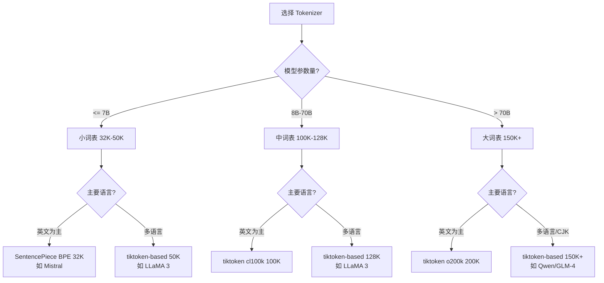

**Tokenizer 选择清单**:

| 考虑因素 | 检查项 | 建议 |
|---------|--------|------|
| **词表大小** | embedding 层是否超过总参数 10%? | 超过则减小词表或增大模型 |
| **目标语言** | 是否包含 CJK 语言? | CJK 至少 100K+ 词表 |
| **代码支持** | 是否需要处理代码? | 选择 cl100k/o200k 或包含代码语料训练 |
| **特殊 token** | 是否需要 function calling / reasoning? | 预留足够特殊 token 位 |
| **Byte fallback** | 是否需要处理任意 Unicode? | 强烈建议开启 |
| **推理速度** | 是否延迟敏感? | tiktoken (Rust) 优于纯 Python |
| **训练数据** | 是否有足够数据训练 tokenizer? | 至少 10M+ tokens 的训练语料 |

### 11.4 快速对比脚本

```python
# ============================================================
# 快速对比: 在你的数据上评估多个 tokenizer
# ============================================================

import tiktoken
import sentencepiece as spm
from transformers import AutoTokenizer
import time


def benchmark_tokenizer(tokenizer, texts, name):
    """对一组文本进行编码并统计性能。"""
    total_tokens = 0
    total_bytes = 0
    start = time.time()

    for text in texts:
        if isinstance(tokenizer, tiktoken.Encoding):
            ids = tokenizer.encode(text)
        else:
            ids = tokenizer.encode(text, add_special_tokens=False)
        total_tokens += len(ids)
        total_bytes += len(text.encode('utf-8'))

    elapsed = time.time() - start
    print(f"{name}:")
    print(f"  Tokens:       {total_tokens:,}")
    print(f"  Compression:  {total_bytes / total_tokens:.2f} bytes/token")
    print(f"  Speed:        {total_tokens / elapsed:,.0f} tokens/sec")
    print()


# 加载你的评估数据
sample_texts = open("eval_corpus.txt").read().split("\n\n")[:1000]

# 对比 tiktoken 系列
for enc_name in ['p50k_base', 'cl100k_base', 'o200k_base']:
    enc = tiktoken.get_encoding(enc_name)
    benchmark_tokenizer(enc, sample_texts, enc_name)

# 对比开源模型 tokenizer
model_names = [
    "meta-llama/Llama-3-8B",
    "Qwen/Qwen2.5-7B",
    "mistralai/Mistral-7B-v0.3",
]
for model_name in model_names:
    tok = AutoTokenizer.from_pretrained(model_name)
    benchmark_tokenizer(tok, sample_texts, model_name)
```

---

## References

- Sennrich et al. (2015). Neural Machine Translation of Rare Words with Subword Units
- Wu et al. (2016). Google's Neural Machine Translation System: Bridging the Gap between Human and Machine Translation
- Schuster & Nakajima (2012). Japanese and Korean voice search
- Kudo & Richardson (2018). SentencePiece: A simple and language independent subword tokenizer and detokenizer
- Kudo (2018). Subword Regularization: Improving Neural Network Translation Models with Multiple Subword Candidates
- Devlin et al. (2018). BERT: Pre-training of Deep Bidirectional Transformers for Language Understanding
- OpenAI tiktoken: https://github.com/openai/tiktoken
- Brown et al. (2020). Language Models are Few-Shot Learners (GPT-3)
- Touvron et al. (2023). LLaMA: Open and Efficient Foundation Language Models
- Meta (2024). The LLaMA 3 Herd of Models

---

> **相关文档**:
> - [LLM Architectures](05_大模型/04_LLM架构/05_LLM架构.md) - 模型架构详解
> - [GPT-3 Deep Dive](20_论文精读/03_规模扩展/02_GPT3_深入分析.md) - GPT-3 论文深度解读
> - [LLaMA Deep Dive](20_论文精读/02_模型架构/04_LLaMA_深入分析.md) - LLaMA 系列论文深度解读

*Last updated: 2026-06-04*

## 相关链接

- [[07_模型训练/02_数据工程/index|训练数据索引]] — 训练数据主题导览
- [[07_模型训练/02_数据工程/04_数据_Curation_and_Mixture_2026|数据治理与配比 2026]] — 数据工程相关
- [[概念/LLM/tokenization|分词]] — 分词概念卡片
- [[概念/General/sentencepiece|SentencePiece]] — 主流分词器
- [[概念/LLM/token-plain|Token]] — Token 概念卡片
- [[概念/LLM/llm-data-engineering|LLM 数据工程深度解析]] — 数据工程全景
