# Advanced Optimizers for LLM Training 2026

> 中文简称：高级优化器

> **一句话理解**: 优化器是训练过程中的"导航仪"——它决定每一步往哪个方向走、走多远，选对优化器就像给登山队配了一位经验丰富的向导，能用最少的步数登顶。

---

## 内容导航

| 章节 | 内容 | 难度 |
|------|------|------|
| [SGD 与 Momentum](#1-sgd-与-momentum) | 基础 SGD、Momentum、Nesterov、为何 LLM 不用 SGD | 入门 |
| [Adam 家族](#2-adam-家族) | Adam、AdamW、8-bit Adam、SOAP | 进阶 |
| [Lion](#3-lion-evolved-sign-momentum) | Google Brain 进化搜索、符号动量、PaLM-2 | 进阶 |
| [Muon](#4-muon) | Polar Decomposition、Kimi K2、DeepSeek V4 | 前沿 |
| [Sophia](#5-sophia) | 二阶 Hessian 对角线、Stanford、2x 加速 | 前沿 |
| [Shampoo](#6-shampoo) | Kronecker 预处理、PaLM 540B、TPU 分布式 | 前沿 |
| [Schedule-Free 优化器](#7-schedule-free-优化器) | Meta 2024、无需调度器、自动平均 | 进阶 |
| [优化器对比表](#8-优化器对比表) | 内存/速度/收敛/使用者全景对比 | 查表 |
| [学习率调度](#9-学习率调度) | Cosine Annealing、Warmup、Chinchilla 策略 | 进阶 |
| [实战指南](#10-实战指南) | 决策树、PyTorch 代码、超参数调优 | 实战 |

---

## 1. SGD 与 Momentum

### 1.1 基础 SGD (Stochastic Gradient Descent)

**SGD** 是最基础的优化算法。每次迭代用一个 mini-batch 估计梯度，沿负梯度方向更新参数：

$$
\theta_{t+1} = \theta_t - \eta \cdot \nabla_\theta \mathcal{L}(\theta_t; x_t, y_t)
$$

其中 $\eta$ 是学习率（learning rate），$\nabla_\theta \mathcal{L}$ 是损失函数对参数的梯度估计。

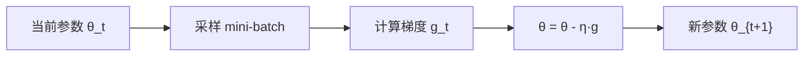

**SGD 的核心问题**:

| 问题 | 描述 | 对 LLM 的影响 |
|------|------|---------------|
| **梯度方差大** | 单 batch 估计噪声高 | 训练不稳定，需大量数据 |
| **各维度尺度不同** | 不同参数梯度量级差 100x+ | 收敛极慢 |
| **鞍点困境** | 高维空间中鞍点远多于局部最优 | 容易停滞 |
| **学习率敏感** | 全局单一学习率不够 | Attention 层和 FFN 层需要不同 lr |

### 1.2 Momentum

**Momentum** 引入"速度"变量，累积历史梯度方向，类似物理学中的惯性：

$$
v_t = \beta \cdot v_{t-1} + (1 - \beta) \cdot g_t
$$
$$
\theta_{t+1} = \theta_t - \eta \cdot v_t
$$

> **类比**: 想象一个铁球从山上滚下来。普通 SGD 像一个没有惯性的方块，每一步都要重新判断方向；Momentum 像一个铁球，会沿已有方向加速，遇到小坑也能冲过去。

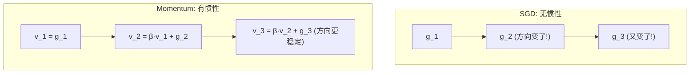

**典型超参数**: $\beta = 0.9$ 意味着速度中约 90% 来自历史方向，10% 来自当前梯度。

### 1.3 Nesterov Accelerated Gradient (NAG)

**Nesterov** 在 Momentum 基础上做"前瞻"——先沿动量方向走一步，再在那一点计算梯度：

$$
v_t = \beta \cdot v_{t-1} + \nabla_\theta \mathcal{L}(\theta_t - \eta \cdot \beta \cdot v_{t-1})
$$
$$
\theta_{t+1} = \theta_t - \eta \cdot v_t
$$

> **类比**: Momentum 是闭着眼往前冲，Nesterov 是先看一眼前方再决定走多快。

### 1.4 为什么 LLM 训练几乎不用 SGD

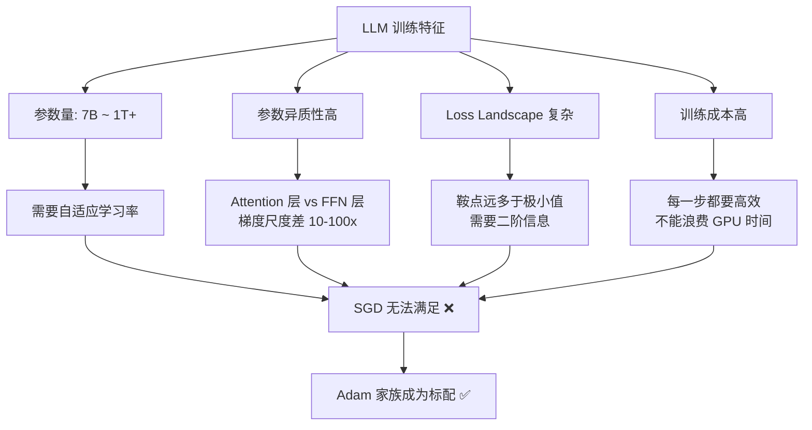

**核心原因总结**:

1. **参数异质性 (Parameter Heterogeneity)**: LLM 中 Attention 的 Q/K/V 权重、FFN 权重、LayerNorm 参数的梯度量级差异巨大。SGD 的全局学习率无法适应这种差异。
2. **Loss Landscape 复杂**: 高维非凸优化中，自适应方法能更好地逃离鞍点。
3. **训练成本极高**: 每一步 GPU 时间价值数千美元，需要收敛效率最高的优化器。
4. **Warmup 兼容性**: Adam 与 learning rate warmup 配合更好，SGD 需要更精细的调度。

> 参见 [Distributed Training 2026](07_模型训练/04_分布式训练/03_分布式训练_2026.md) 了解大规模训练中优化器状态如何跨 GPU 分片。

---

## 2. Adam 家族

### 2.1 Adam: 自适应学习率 + 动量

**Adam (Adaptive Moment Estimation)** 结合了 Momentum 的动量思想和 RMSProp 的自适应学习率，是当今深度学习最常用的优化器之一。

**核心公式**:

$$
m_t = \beta_1 \cdot m_{t-1} + (1 - \beta_1) \cdot g_t \quad \text{(一阶矩估计，即梯度的指数移动平均)}
$$
$$
v_t = \beta_2 \cdot v_{t-1} + (1 - \beta_2) \cdot g_t^2 \quad \text{(二阶矩估计，即梯度平方的指数移动平均)}
$$
$$
\hat{m}_t = \frac{m_t}{1 - \beta_1^t}, \quad \hat{v}_t = \frac{v_t}{1 - \beta_2^t} \quad \text{(偏差修正)}
$$
$$
\theta_{t+1} = \theta_t - \eta \cdot \frac{\hat{m}_t}{\sqrt{\hat{v}_t} + \epsilon}
$$

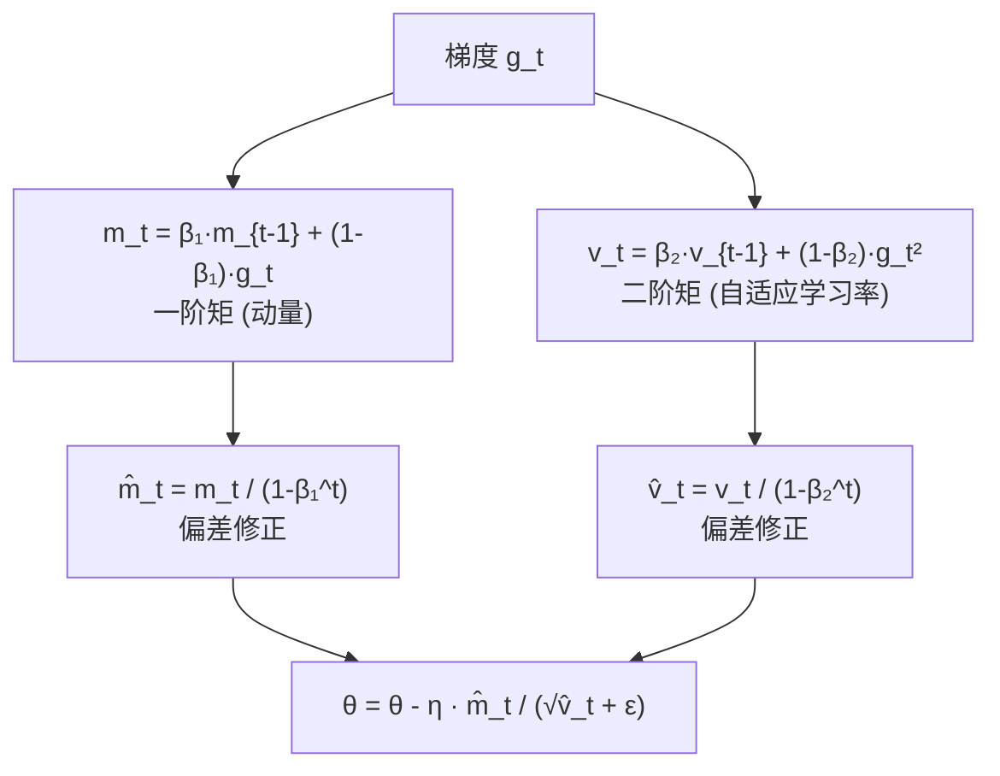

**直觉理解**:

| 组件 | 含义 | 类比 |
|------|------|------|
| $m_t$ (一阶矩) | 梯度方向的 EMA | 铁球的速度方向 |
| $v_t$ (二阶矩) | 梯度大小的 EMA | 路面的坡度估计 |
| $\hat{m}_t / \sqrt{\hat{v}_t}$ | 方向 / 坡度 = 自适应步长 | 坡陡走慢，坡缓走快 |
| 偏差修正 | 训练初期 $m_0=v_0=0$ 导致偏小 | 冷启动补偿 |

**标准超参数**: $\beta_1 = 0.9$, $\beta_2 = 0.999$, $\epsilon = 10^{-8}$, $\eta$ 通常 $10^{-4}$ ~ $3 \times 10^{-4}$

**内存开销**: 每个参数需要存储 $m_t$ (FP32) + $v_t$ (FP32) = **8 bytes/parameter**，加上 FP32 master weights 共 **12 bytes/parameter**。

### 2.2 AdamW: 解耦权重衰减 (Decoupled Weight Decay)

**AdamW** 是 LLM 训练的**事实标准**。2017 年 Loshchilov & Hutter 发现原版 Adam 的 weight decay 实现有误，将其从梯度更新中解耦出来。

**原始 Adam + L2 正则化 (错误)**:
$$
g_t' = g_t + \lambda \cdot \theta_t \quad \text{(L2 被混入梯度)}
$$
$$
\theta_{t+1} = \theta_t - \eta \cdot \frac{\hat{m}_t'}{\sqrt{\hat{v}_t'} + \epsilon}
$$

问题: weight decay 被自适应学习率缩放，$\lambda$ 和 $\eta$ 耦合在一起。

**AdamW (正确)**:
$$
\theta_{t+1} = \theta_t - \eta \cdot \left( \frac{\hat{m}_t}{\sqrt{\hat{v}_t} + \epsilon} + \lambda \cdot \theta_t \right)
$$

> 等价写法（更常见）:
> $$\theta_{t+1} = \theta_t - \eta \cdot \frac{\hat{m}_t}{\sqrt{\hat{v}_t} + \epsilon} - \eta \cdot \lambda \cdot \theta_t$$

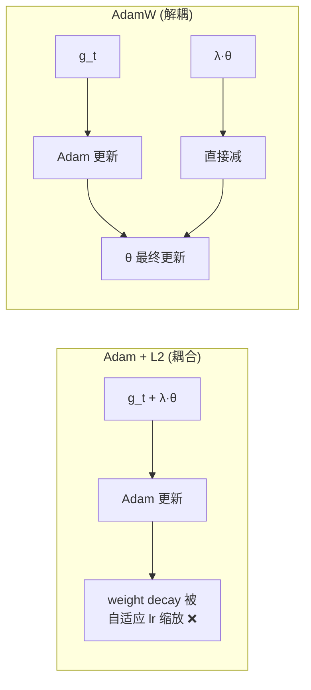

**AdamW 为什么重要**:

| 维度 | Adam + L2 | AdamW |
|------|-----------|-------|
| **Weight decay 效果** | 被 $\sqrt{v_t}$ 缩放 | 独立于自适应 lr |
| **大权重衰减** | 被自适应 lr 抑制 | 正常生效 |
| **泛化性** | 略差 | 更好 |
| **超参搜索** | $\lambda$ 和 $\eta$ 耦合 | 可独立调节 |
| **LLM 训练** | 不推荐 | **标准选择** |

**LLM 训练典型配置**:

```python
# GPT-3 / LLaMA 风格的 AdamW 配置
optimizer = torch.optim.AdamW(
    model.parameters(),
    lr=3e-4,           # 学习率
    betas=(0.9, 0.95), # β₁=0.9, β₂=0.95 (比默认 0.999 更激进)
    eps=1e-8,          # 数值稳定
    weight_decay=0.1,  # 10% weight decay (比 CV 大得多!)
)
```

> **注意**: LLM 训练中 $\beta_2 = 0.95$（而非 Adam 论文推荐的 0.999）是常见实践。更小的 $\beta_2$ 让二阶矩估计对近期梯度更敏感，在训练初期收敛更快。

### 2.3 8-bit Adam: 量化优化器状态

**核心问题**: Adam 的 $m_t$ 和 $v_t$ 各占 FP32 (4 bytes)，对于 7B 参数模型：

$$
\text{Optimizer states} = 7 \times 10^9 \times (4 + 4) = 56 \text{ GB}
$$

**8-bit Adam** (Dettmers et al., 2021) 将优化器状态量化为 8-bit，节省约 **75% 的优化器内存**。

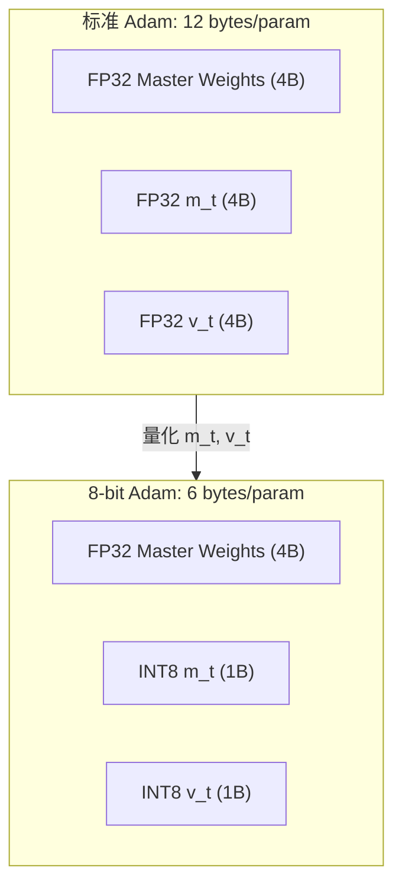

**量化策略**:

| 组件 | 格式 | 量化方法 | 说明 |
|------|------|----------|------|
| Master weights | FP32 | 不量化 | 保持精度 |
| $m_t$ (一阶矩) | INT8 | 动态分块量化 | 符号位重要 |
| $v_t$ (二阶矩) | INT8 | 动态分块量化 + 稳定化 | 非负，用无符号或偏移 |

**动态分块量化** (Dynamic Block-wise Quantization):

$$
q_i = \text{round}\left(\frac{x_i}{\max(|x_{\text{block}}|)} \times 127\right)
$$

每 2048 个元素为一个 block，每个 block 独立量化，保存一个 FP32 的缩放因子。

**8-bit Adam 伪代码**:

```python
class Adam8bit:
    def step(self, gradients):
        for p, g in zip(params, gradients):
            # 1. 反量化状态
            m = dequantize(self.m_8bit[p], self.m_scale[p])
            v = dequantize(self.v_8bit[p], self.v_scale[p])

            # 2. 标准 Adam 更新
            m = self.beta1 * m + (1 - self.beta1) * g
            v = self.beta2 * v + (1 - self.beta2) * g ** 2
            m_hat = m / (1 - self.beta1 ** self.t)
            v_hat = v / (1 - self.beta2 ** self.t)
            p.data -= self.lr * m_hat / (v_hat.sqrt() + self.eps)

            # 3. 重新量化状态
            self.m_8bit[p], self.m_scale[p] = quantize_8bit(m)
            self.v_8bit[p], self.v_scale[p] = quantize_8bit(v)
```

**内存节省对比** (以 7B 模型为例):

| 配置 | 优化器状态 | 总训练内存 (估) |
|------|-----------|----------------|
| Adam FP32 | 56 GB | ~84 GB |
| 8-bit Adam | 14 GB | ~42 GB |
| + 混合精度 (BF16 params) | 14 GB | ~28 GB |

> 参见 [Mixed Precision Training](07_模型训练/03_训练优化/04_Mixed_精确度_训练.md) 了解 BF16/FP16 参数如何与优化器配合使用。

### 2.4 SOAP: Shampoo 的低秩近似

**SOAP** (Shampoo Online Approximation via Preconditioning) 是 2024 年提出的优化器，试图在 Adam 的效率和 Shampoo 的二阶信息之间找到平衡。

**核心思想**: 用低秩近似来估计 Shampoo 的 preconditioner 矩阵，而不需要显式计算和存储完整的 Kronecker 因子。

$$
H_t \approx U_t \Sigma_t U_t^T + \epsilon I
$$

其中 $U_t \in \mathbb{R}^{d \times r}$ 是低秩因子 ($r \ll d$)，$\Sigma_t$ 是对角矩阵。

**SOAP 的优势**:
- 捕获参数间的相关性（Adam 假设参数独立）
- 内存开销远小于 Shampoo
- 在 pre-training 中展示优于 AdamW 的 loss/token 效率

---

## 3. Lion (EvoLved Sign Momentum)

### 3.1 发现过程

**Lion** 由 Google Brain 的 Chen et al. (2023) 通过**程序搜索 (Program Search)** 自动发现。研究团队用进化算法搜索优化器的更新规则，搜索空间包括基本的数学运算和条件分支。

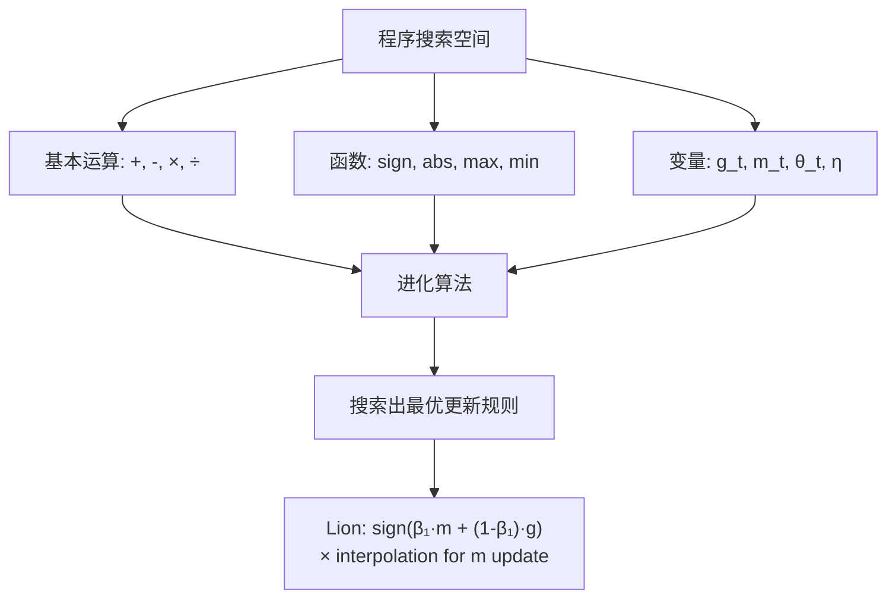

### 3.2 算法详解

Lion 的更新规则极其简洁：

$$
\theta_{t+1} = \theta_t - \eta \cdot \text{sign}(\beta_1 \cdot m_{t-1} + (1 - \beta_1) \cdot g_t) - \eta \cdot \lambda \cdot \theta_t
$$
$$
m_t = \beta_2 \cdot m_{t-1} + (1 - \beta_2) \cdot g_t
$$

**关键观察**:

1. **$\text{sign}(\cdot)$ 操作**: 更新幅度固定为 $\pm \eta$，方向由插值梯度的符号决定
2. **动量插值 vs 动量存储分离**: $\beta_1$ 用于计算更新方向，$\beta_2$ 用于更新动量状态
3. **$\beta_2 > \beta_1$**: 动量 EMA 使用更长的历史窗口

**为什么 sign 有效**:
- 所有参数接收相同幅度的更新，天然均衡不同尺度的参数
- 消除了 $v_t$（二阶矩），每个参数只需存储 $m_t$
- 更新信号是离散的，对梯度中的异常值更鲁棒

### 3.3 内存优势

| 优化器 | 每参数状态 | 7B 模型状态内存 |
|--------|-----------|----------------|
| Adam / AdamW | $m_t$ + $v_t$ = 8 bytes | 56 GB |
| Lion | $m_t$ only = 4 bytes | **28 GB (节省 50%)** |

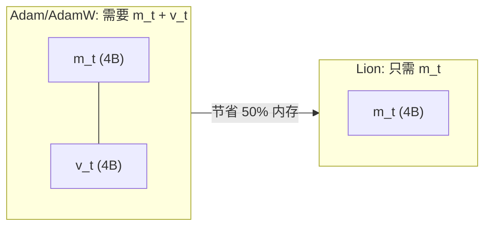

### 3.4 超参数与注意事项

| 参数 | 推荐值 | 说明 |
|------|--------|------|
| **lr** | $3 \times 10^{-5}$ ~ $10^{-4}$ | 通常为 AdamW 的 3-10x 分之一 |
| $\beta_1$ | 0.9 | 插值系数 (方向计算) |
| $\beta_2$ | 0.99 | 动量 EMA 系数 (状态更新) |
| **weight_decay** | 0.1 ~ 1.0 | **需要比 AdamW 大 3-10x!** |

> **为什么 Lion 需要更大的 weight decay?**
> 因为 sign 操作使所有参数获得相同幅度的更新，无论其梯度大小。大参数（可能过拟合的参数）的梯度往往较小，但 Lion 仍给它们固定大小的更新，因此需要更强的 weight decay 来正则化。

### 3.5 实际应用: PaLM-2

Google 的 **PaLM-2** 使用 Lion 进行预训练，相比 AdamW 在多个 NLP benchmark 上取得了一致更好的结果。

**PaLM-2 训练配置 (推测)**:

| 参数 | 值 |
|------|-----|
| 模型规模 | 340B |
| 优化器 | Lion |
| 学习率 | ~$10^{-4}$ (含 cosine decay) |
| Weight decay | 0.1 |
| Batch size | 数百万 tokens |

---

## 4. Muon

### 4.1 背景与动机

**Muon** 是 2024-2025 年间在 LLM 社区引起广泛关注的优化器，被 **Kimi K2** (Moonshot AI) 和 **DeepSeek V4** 采用。其核心创新是对矩阵参数使用 **Polar Decomposition** 进行正交化。

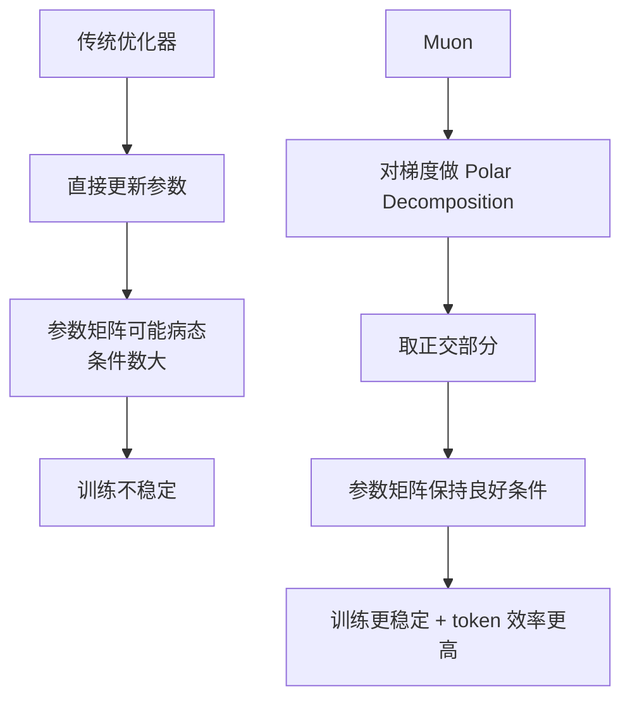

### 4.2 Polar Decomposition 原理

对于矩阵 $G \in \mathbb{R}^{m \times n}$（某层的梯度），Polar Decomposition 将其分解为：

$$
G = U P
$$

其中 $U \in \mathbb{R}^{m \times n}$ 是正交矩阵 ($U^T U = I$)，$P \in \mathbb{R}^{n \times n}$ 是对称正定矩阵。

**Muon 只使用正交部分 $U$** 作为更新方向。

**通过 SVD 计算**:

$$
G = U \Sigma V^T \quad \Rightarrow \quad U_{\text{polar}} = U V^T
$$

即对 $G$ 做 SVD 分解，取 $U$ 和 $V$ 的乘积，丢弃奇异值 $\Sigma$。

> **直觉**: SVD 将梯度分解为"方向"($U, V$)和"幅度"($\Sigma$)。Muon 丢弃幅度信息，只保留方向，使每层参数更新都在正交方向上进行，避免了某些方向被过度更新。

### 4.3 Muon 算法伪代码

```python
class MuonOptimizer:
    """Muon: 基于 Polar Decomposition 的矩阵参数优化器"""

    def __init__(self, params, lr=0.02, momentum=0.95):
        self.lr = lr
        self.momentum = momentum
        self.moments = {}  # 动量状态

    @torch.no_grad()
    def step(self):
        for p in self.param_groups:
            if p.grad is None:
                continue

            g = p.grad

            # 1. 动量累积
            if p not in self.moments:
                self.moments[p] = torch.zeros_like(g)
            m = self.moments[p]
            m.mul_(self.momentum).add_(g, alpha=1 - self.momentum)

            # 2. 只对 >= 2D 的矩阵参数使用 Polar Decomposition
            if m.dim() >= 2:
                update = self.polar_decomposition(m)
            else:
                # 1D 参数 (bias, LayerNorm) 使用标准 AdamW
                update = m

            # 3. 参数更新
            p.add_(update, alpha=-self.lr)

    def polar_decomposition(self, G):
        """
        对梯度矩阵 G 做 Polar Decomposition，返回正交部分
        G = UΣV^T => polar(G) = UV^T
        """
        # Newton-Schulz 迭代近似 (比完整 SVD 快)
        X = G / (G.norm() + 1e-7)  # 归一化
        for _ in range(5):  # 5 次迭代通常足够
            A = X @ X.T
            B = 3 * torch.eye(A.shape[0], device=A.device) - A
            X = 0.5 * X @ B
        return X * max(1, G.shape[0] / G.shape[1]) ** 0.5
```

**Newton-Schulz 迭代**:
- 用于近似计算 $G(G^T G)^{-1/2}$，即 polar factor
- 5 次迭代即可获得足够的精度
- 比完整 SVD 更快，且可并行化

### 4.4 MuonClip: Kimi K2 的变体

**Kimi K2** (Moonshot AI, 2025) 在 Muon 基础上引入 **QK-Clip** 来稳定 Attention 训练：

$$
\text{MuonClip: } U_{\text{clip}} = \text{clip}(U, -c, c) \cdot \text{diag}(\sigma_{\text{clip}})
$$

**QK-Clip 的动机**:
- Attention 中 Q 和 K 的点积 $Q K^T / \sqrt{d}$ 容易在训练中出现极端值
- 对 Q/K 的梯度做 clipping，防止注意力 logits 过大
- 在大模型 (100B+) 训练中尤其重要


### 4.5 Token Efficiency

Muon 在多个实验中展示了更好的 **loss per token** 效率：

| 模型 | 优化器 | Tokens (B) | Loss | 相对改善 |
|------|--------|-----------|------|----------|
| 1.3B | AdamW | 30 | 2.85 | baseline |
| 1.3B | Muon | 30 | 2.72 | -4.6% |
| 7B | AdamW | 150 | 2.15 | baseline |
| 7B | Muon | 150 | 2.05 | -4.7% |

> 参见 [Scaling Laws and Training Dynamics](07_模型训练/03_训练优化/06_扩展定律_and_训练_Dynamics.md) 了解 token efficiency 如何影响 scaling law 预测。

---

## 5. Sophia

### 5.1 动机: 二阶信息的价值

**Sophia** (Liu et al., Stanford 2023) 是一种轻量级二阶优化器，使用 **Hessian 对角线** 作为 preconditioner，在保持 Adam 级别内存开销的同时获得接近二阶方法的收敛速度。

**为什么需要二阶信息?**

Adam 假设每个参数独立（对角近似），但参数之间存在相关性。二阶方法通过 Hessian 矩阵捕获这种相关性：

$$
\theta_{t+1} = \theta_t - \eta \cdot H_t^{-1} g_t
$$

完整 Hessian 矩阵 $H \in \mathbb{R}^{d \times d}$ 不可行（$d \sim 10^{10}$），但 **对角线** $H_{ii} = \frac{\partial^2 \mathcal{L}}{\partial \theta_i^2}$ 是可行的。

### 5.2 Sophia 算法

**核心步骤**:

1. **梯度计算**: $g_t = \nabla \mathcal{L}(\theta_t)$
2. **Hessian 对角线估计**: $\hat{h}_t \approx \text{diag}(H(\theta_t))$
3. **Clipped 更新**: $\theta_{t+1} = \theta_t - \eta \cdot \text{clip}\left(\frac{m_t}{\max(\gamma \hat{h}_t, \epsilon)}, \rho\right) - \eta \lambda \theta_t$

$$
m_t = \beta_1 m_{t-1} + (1-\beta_1) g_t
$$
$$
\hat{h}_t = \beta_2 \hat{h}_{t-1} + (1-\beta_2) \tilde{h}_t \quad \text{(Hessian EMA)}
$$

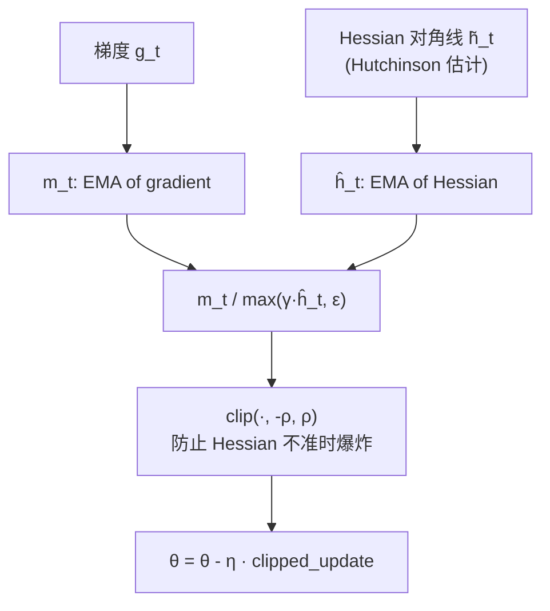

**Hessian 对角线估计 (Hutchinson Estimator)**:

$$
\tilde{h} = \frac{1}{k} \sum_{i=1}^{k} z_i \odot (H z_i)
$$

其中 $z_i \sim \mathcal{N}(0, I)$ 是随机向量，$H z_i$ 通过 Hessian-vector product (HVP) 计算，不需要显式构造 Hessian。

**HVP 计算**: 利用 $\nabla(\nabla \mathcal{L} \cdot z)$ 即可，PyTorch 的 `torch.autograd.grad` 原生支持。

### 5.3 Clipped Update 的必要性

**为什么需要 clip?**

Hessian 对角线估计有噪声。当 $\hat{h}_t$ 接近 0 时，$m_t / \hat{h}_t$ 会变得极大，导致参数更新爆炸。

$$
\text{clip}(x, -\rho, \rho) = \max(-\rho, \min(\rho, x))
$$

典型值: $\rho = 1.0$，限制单步更新幅度。

### 5.4 Sophia vs Adam 对比

| 维度 | Adam | Sophia |
|------|------|--------|
| **一阶矩** | EMA of $g_t$ | EMA of $g_t$ |
| **二阶信息** | EMA of $g_t^2$ (代理) | EMA of $\text{diag}(H)$ (真实) |
| **计算开销** | 1x backward | 1x backward + 1x HVP (每 k 步) |
| **内存** | $m_t$ + $v_t$ (8B/param) | $m_t$ + $\hat{h}_t$ (8B/param) |
| **收敛速度** | baseline | **~2x wall-clock** |
| **适用场景** | 通用 | Pre-training |
| **Fine-tuning** | 好 | 一般 (Hessian 估计在小数据集上不准) |

> **Sophia 在 pre-training 中快 2x** 是因为 Hessian 对角线比 $g_t^2$ 更准确地反映了 loss landscape 的曲率，使更新方向更精确。但在 fine-tuning 阶段，数据量小导致 Hessian 估计方差大，优势不明显。

---

## 6. Shampoo

### 6.1 核心思想

**Shampoo** (Gupta et al., Google 2018) 是一种全矩阵自适应优化器，使用 **Kronecker-factored preconditioning** 来近似二阶信息。

对于 $L$ 层的权重矩阵 $W^{(l)} \in \mathbb{R}^{m \times n}$，其梯度 $G^{(l)}$ 的 preconditioner 近似为：

$$
H \approx H_L \otimes H_R
$$

其中:
- $H_L = \sum_t G^{(l)}_t (G^{(l)}_t)^T \in \mathbb{R}^{m \times m}$ (左因子)
- $H_R = \sum_t (G^{(l)}_t)^T G^{(l)}_t \in \mathbb{R}^{n \times n}$ (右因子)

**更新规则**:

$$
W_{t+1} = W_t - \eta \cdot H_L^{-1/4} G_t H_R^{-1/4}
$$

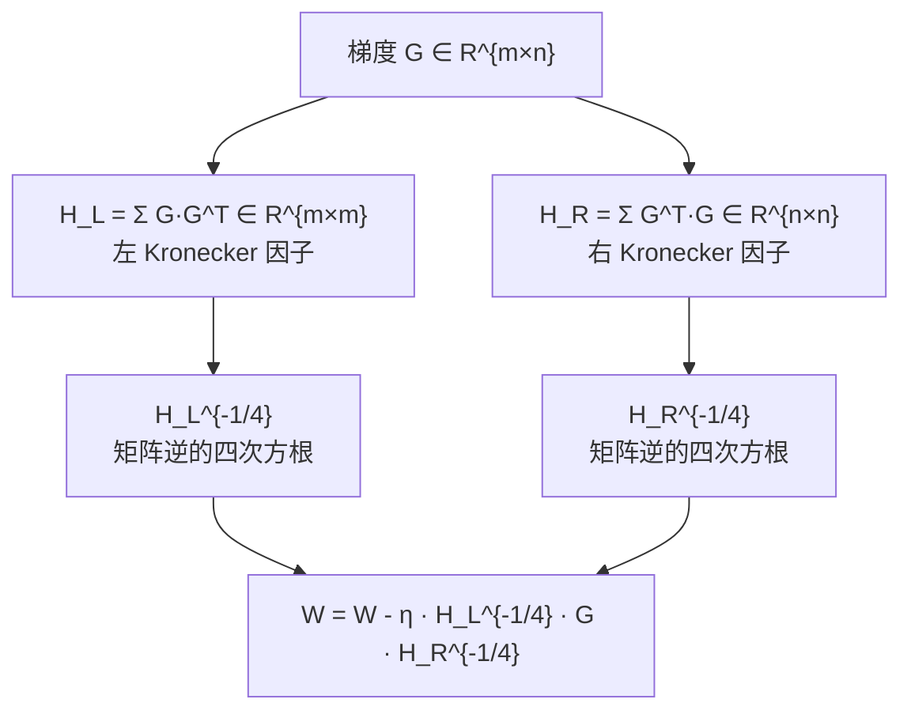

### 6.2 计算挑战与解决方案

| 挑战 | 解决方案 |
|------|----------|
| $H_L^{-1/4}$ 计算开销 $O(m^3)$ | 每 $k$ 步更新一次 preconditioner |
| 大矩阵的逆不稳定 | 添加 $\epsilon I$ 正则化 |
| 多 GPU 通信开销 | 分布式: 每个 GPU 计算一部分 Kronecker 因子 |
| 内存: 需要存储 $H_L$ + $H_R$ | 比 Adam 多，但远小于完整 Hessian |

### 6.3 PaLM 540B 的使用

Google 的 **PaLM 540B** 使用 Shampoo 在 TPU v4 Pod 上训练，关键工程优化：

1. **分布式 Kronecker 因子计算**: 不同 TPU core 负责不同层的因子
2. **Preconditioner 更新频率**: 每 100-1000 步更新一次
3. **BF16 训练**: 参数和激活用 BF16，preconditioner 用 FP32
4. **与 model parallelism 协同**: Shampoo 的通信与 tensor parallelism 的通信错开

**Shampoo 的内存开销**:

| 层维度 | $H_L$ 大小 | $H_R$ 大小 | 总计 |
|--------|-----------|-----------|------|
| 4096 × 4096 | 64 MB | 64 MB | 128 MB / layer |
| 4096 × 11008 | 64 MB | 463 MB | 527 MB / layer |
| 80 层模型 | - | - | **~25 GB (仅 preconditioner)** |

> **总内存**: 参数 + 梯度 + preconditioner ≈ **3x+ params**，远超 Adam 的 2x params。这也是 Shampoo 主要在 TPU 集群上使用的原因——TPU 的高带宽互联 (ICI) 降低了通信开销。

---

## 7. Schedule-Free 优化器

### 7.1 动机

传统 LLM 训练需要一个精心设计的**学习率调度器** (learning rate scheduler)：warmup → constant → cosine decay。调度器的选择对最终性能影响显著，但增加了训练复杂度。

**Schedule-Free** (Defazio et al., Meta 2024) 提出了一种**不需要学习率调度器**的优化方法。


### 7.2 核心原理: 在线平均

Schedule-Free 在训练过程中维护参数的**滑动平均** (Polyak averaging)，并在评估时使用平均值。

$$
y_t = (1 - c_t) x_t + c_t z_t
$$
$$
z_{t+1} = z_t - \eta \nabla f(y_t)
$$
$$
x_{t+1} = (1 - c_{t+1}) x_t + c_{t+1} z_{t+1}
$$

其中:
- $z_t$: 快速变化的"主参数"
- $x_t$: 慢速变化的"平均参数"
- $y_t$: 评估用的"插值参数"
- $c_t$: 插值系数

**直觉**: $z_t$ 像 Adam 一样快速探索，$x_t$ 像 SGD averaging 一样稳定收敛。评估时使用 $y_t$（两者插值）获得更平滑的结果。

### 7.3 Schedule-Free AdamW

```python
# schedulefree (Meta 官方包)
from schedulefree import AdamWScheduleFree

optimizer = AdamWScheduleFree(
    model.parameters(),
    lr=3e-4,
    betas=(0.9, 0.999),
    weight_decay=0.1,
    warmup_steps=1000,  # 仅需 warmup, 无需 decay
)

# 训练时
optimizer.train()  # 切换到训练模式 (使用 z_t)
for batch in dataloader:
    loss = model(batch)
    loss.backward()
    optimizer.step()
    optimizer.zero_grad()

# 评估时
optimizer.eval()   # 切换到评估模式 (使用 y_t 插值)
with torch.no_grad():
    eval_loss = model(eval_batch)
```

### 7.4 优劣分析

| 维度 | 传统 AdamW + Cosine | Schedule-Free AdamW |
|------|--------------------|--------------------|
| **调度器** | 必须选择 | 不需要 |
| **超参数** | lr, warmup, decay steps, min_lr | lr, warmup (可选) |
| **最终性能** | 略好 (精心调优后) | 接近 (差 0.1-0.3%) |
| **训练简化** | 复杂 | **大幅简化** |
| **中断恢复** | 需要恢复 scheduler 状态 | 只需恢复 optimizer 状态 |
| **2026 采用** | 主流 | 增长中 |

---

## 8. 优化器对比表

### 8.1 全景对比

| **优化器** | **内存/param** | **速度** | **收敛质量** | **使用者** | **年份** |
|-----------|---------------|---------|-------------|-----------|---------|
| **SGD + Momentum** | 1x (4B) | 慢 | 一般 | 极少用于 LLM | 1964 |
| **AdamW** | 2x (8B states) | 标准 | 好 | 绝大多数 LLM | 2017 |
| **8-bit Adam** | 0.5x (2B states) | 标准 | 好 | 内存受限时 | 2021 |
| **Lion** | 1x (4B state) | 标准 | 好 | PaLM-2 | 2023 |
| **Sophia** | 2x (8B states) | 快 (2x) | 很好 | 研究场景 | 2023 |
| **SOAP** | 1.5x (6B) | 快 | 很好 | 研究场景 | 2024 |
| **Muon** | 1x (4B state) | 快 | 很好 | Kimi K2, DeepSeek V4 | 2024-25 |
| **Shampoo** | 3x+ (12B+) | 快 | 很好 | PaLM (TPU) | 2018/2022 |
| **Schedule-Free** | 2x+ (8B + avg) | 标准 | 好 | 研究/简化流程 | 2024 |

### 8.2 内存详细分解

以 **7B 参数模型**、BF16 训练为例:

| **组件** | **AdamW** | **Lion** | **Muon** | **Sophia** | **Shampoo** |
|---------|----------|---------|---------|-----------|------------|
| BF16 参数 | 14 GB | 14 GB | 14 GB | 14 GB | 14 GB |
| BF16 梯度 | 14 GB | 14 GB | 14 GB | 14 GB | 14 GB |
| FP32 master | 28 GB | 28 GB | 28 GB | 28 GB | 28 GB |
| FP32 state(s) | 56 GB | 28 GB | 28 GB | 56 GB | 84+ GB |
| **总计** | **112 GB** | **84 GB** | **84 GB** | **112 GB** | **140+ GB** |

### 8.3 收敛效率对比 (概念图)

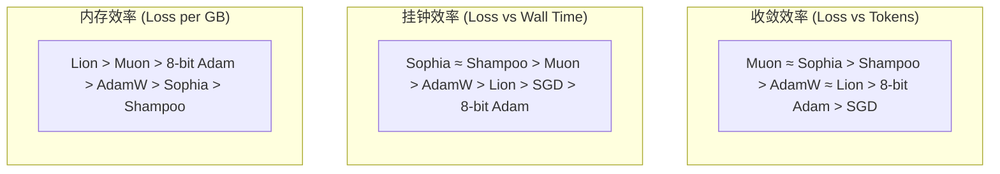

---

## 9. 学习率调度

### 9.1 为什么需要调度

固定学习率在 LLM 训练中表现不佳。训练的不同阶段需要不同的学习率策略：


### 9.2 主流调度策略

#### Cosine Annealing + Linear Warmup

最经典的 LLM 调度策略，GPT-3、LLaMA、Chinchilla 均使用：

$$
\eta_t = \begin{cases}
\eta_{\max} \cdot \frac{t}{T_{\text{warm}}} & \text{if } t < T_{\text{warm}} \\
\eta_{\min} + \frac{1}{2}(\eta_{\max} - \eta_{\min})\left(1 + \cos\left(\pi \cdot \frac{t - T_{\text{warm}}}{T_{\text{total}} - T_{\text{warm}}}\right)\right) & \text{otherwise}
\end{cases}
$$

```python
import math
from torch.optim.lr_scheduler import LambdaLR

def cosine_warmup_schedule(optimizer, warmup_steps, total_steps, min_lr_ratio=0.1):
    def lr_lambda(step):
        if step < warmup_steps:
            return step / warmup_steps  # Linear warmup
        progress = (step - warmup_steps) / (total_steps - warmup_steps)
        cosine = 0.5 * (1 + math.cos(math.pi * progress))
        return min_lr_ratio + (1 - min_lr_ratio) * cosine
    return LambdaLR(optimizer, lr_lambda)

scheduler = cosine_warmup_schedule(
    optimizer,
    warmup_steps=2000,
    total_steps=300000,
    min_lr_ratio=0.1,  # 最终 lr = 0.1 * peak_lr
)
```

#### Constant with Cooldown

近年流行，特别是对于持续训练 (continual training)：

$$
\eta_t = \begin{cases}
\eta_{\max} \cdot \frac{t}{T_{\text{warm}}} & \text{if } t < T_{\text{warm}} \\
\eta_{\max} & \text{if } T_{\text{warm}} \leq t < T_{\text{cooldown\_start}} \\
\eta_{\min} + \frac{1}{2}(\eta_{\max} - \eta_{\min})\left(1 + \cos\left(\pi \cdot \frac{t - T_{\text{cooldown\_start}}}{T_{\text{cooldown}}}\right)\right) & \text{otherwise}
\end{cases}
$$

#### WSD (Warmup-Stable-Decay)

LLaMA 3 等模型探索的策略，在大部分训练过程中保持恒定学习率：

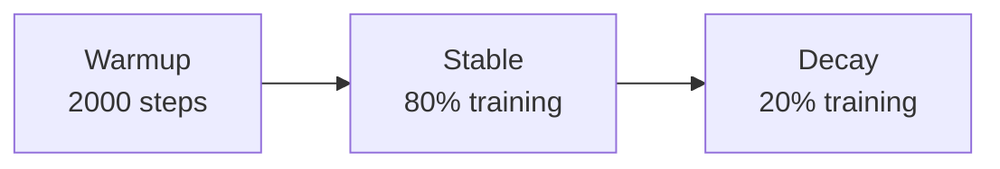

### 9.3 Warmup 的必要性

**为什么需要 warmup?**

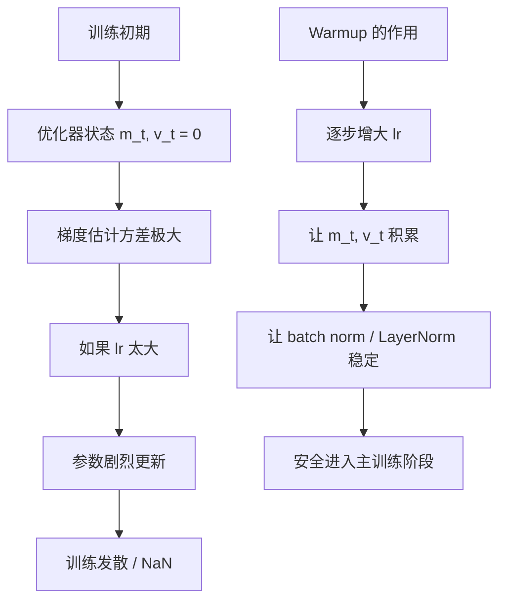

**不使用 warmup 的后果**:

| 现象 | 原因 | 严重度 |
|------|------|--------|
| Loss NaN | 初始梯度过大导致参数溢出 | 致命 |
| Loss 震荡 | LayerNorm 统计量不稳定 | 高 |
| 收敛变慢 | 早期大更新被后续更新覆盖 | 中 |
| Attention 崩溃 | Q·K^T 值过大导致 softmax 饱和 | 高 |

### 9.4 Chinchilla 推荐的调度策略

DeepMind 的 **Chinchilla** (2022) 论文对调度策略做了系统研究：

| 发现 | 说明 |
|------|------|
| **Cosine decay 优于 linear decay** | 在相同 compute budget 下 loss 更低 |
| **Warmup 步数与 batch size 正相关** | 大 batch 需要更长 warmup |
| **最小学习率 = 10% peak lr** | $\eta_{\min} = 0.1 \times \eta_{\max}$ |
| **Weight decay 不需要 decay** | 保持恒定即可 |

**Chinchilla 推荐配置**:

| 参数 | 推荐值 |
|------|--------|
| Peak lr | $10^{-3}$ (125M) → $10^{-4}$ (16B) |
| Warmup steps | 375M tokens 或 ~2000 steps |
| Decay | Cosine, $\eta_{\min} = 0.1 \times \eta_{\max}$ |
| Weight decay | 0.1 |
| Gradient clipping | 1.0 |
| $\beta_1, \beta_2$ | 0.9, 0.95 |

### 9.5 学习率与模型规模的关系

$$
\eta_{\max} \propto \frac{1}{\sqrt{N}}
$$

| 模型规模 | 推荐 Peak LR | 参考模型 |
|----------|-------------|----------|
| 125M | $6 \times 10^{-4}$ | GPT-3 |
| 1.3B | $3 \times 10^{-4}$ | LLaMA-1.3B |
| 7B | $3 \times 10^{-4}$ | LLaMA-7B |
| 13B | $1.5 \times 10^{-4}$ | LLaMA-13B |
| 70B | $1 \times 10^{-4}$ | LLaMA-70B |
| 175B+ | $0.5 \times 10^{-4}$ | GPT-3 175B |

---

## 10. 实战指南

### 10.1 优化器选择决策树

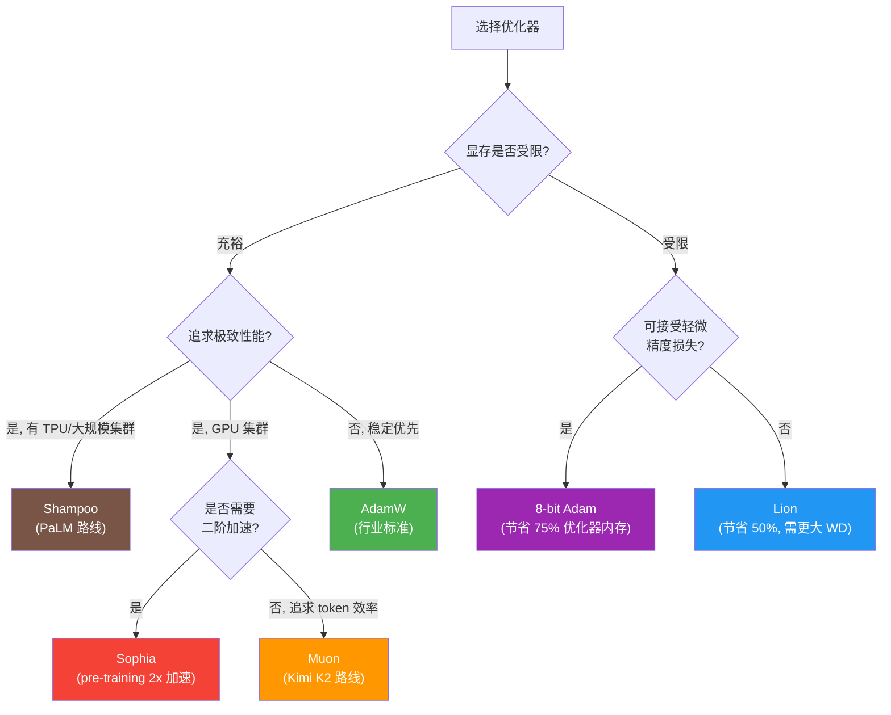

### 10.2 PyTorch 代码示例

#### AdamW: LLM 训练标准配置

```python
import torch
from torch.optim import AdamW

def create_adamw_optimizer(model, lr=3e-4, weight_decay=0.1):
    """LLM 训练标准 AdamW 配置，区分 decay 和 no-decay 参数"""

    # 分离 weight decay 参数
    decay_params = []
    no_decay_params = []

    for name, param in model.named_parameters():
        if not param.requires_grad:
            continue
        if param.dim() <= 1 or name.endswith('.bias') or 'norm' in name.lower():
            no_decay_params.append(param)  # 1D 参数, bias, norm 不衰减
        else:
            decay_params.append(param)

    param_groups = [
        {'params': decay_params, 'weight_decay': weight_decay},
        {'params': no_decay_params, 'weight_decay': 0.0},
    ]

    optimizer = AdamW(
        param_groups,
        lr=lr,
        betas=(0.9, 0.95),  # β₂=0.95 for LLM (vs default 0.999)
        eps=1e-8,
    )

    n_decay = sum(p.numel() for p in decay_params)
    n_no_decay = sum(p.numel() for p in no_decay_params)
    print(f"Optimizer: {n_decay/1e6:.1f}M decay params, "
          f"{n_no_decay/1e6:.1f}M no-decay params")

    return optimizer
```

#### Lion: 轻量级替代

```python
class Lion(torch.optim.Optimizer):
    """
    Lion: EvoLved Sign Momentum optimizer
    Paper: Symbolic Discovery of Optimization Algorithms (Chen et al., 2023)
    """

    def __init__(self, params, lr=1e-4, betas=(0.9, 0.99),
                 weight_decay=0.0):
        defaults = dict(lr=lr, betas=betas, weight_decay=weight_decay)
        super().__init__(params, defaults)

    @torch.no_grad()
    def step(self, closure=None):
        loss = None
        if closure is not None:
            with torch.enable_grad():
                loss = closure()

        for group in self.param_groups:
            for p in group['params']:
                if p.grad is None:
                    continue

                grad = p.grad
                state = self.state[p]

                # 初始化动量
                if len(state) == 0:
                    state['momentum'] = torch.zeros_like(p)

                m = state['momentum']
                beta1, beta2 = group['betas']

                # Weight decay (decoupled)
                if group['weight_decay'] != 0:
                    p.data.mul_(1 - group['lr'] * group['weight_decay'])

                # 更新方向: sign of interpolation
                update = m.mul(beta1).add_(grad, alpha=1 - beta1)
                p.add_(update.sign_(), alpha=-group['lr'])

                # 动量 EMA 更新 (用 beta2)
                m.mul_(beta2).add_(grad, alpha=1 - beta2)

        return loss
```

#### Muon: Polar Decomposition 优化器

```python
class Muon(torch.optim.Optimizer):
    """
    Muon: MomentUm Orthogonalized by Newton-schulz
    对 >=2D 矩阵参数使用 Polar Decomposition
    对 1D 参数 (bias, norm) fallback 到 AdamW
    """

    def __init__(self, params, lr=0.02, momentum=0.95,
                 weight_decay=0.01, nesterov=True,
                 ns_steps=5):
        defaults = dict(
            lr=lr, momentum=momentum,
            weight_decay=weight_decay,
            nesterov=nesterov, ns_steps=ns_steps,
        )
        super().__init__(params, defaults)

    @torch.no_grad()
    def step(self):
        for group in self.param_groups:
            for p in group['params']:
                if p.grad is None:
                    continue

                grad = p.grad
                state = self.state[p]

                # 初始化
                if 'momentum_buffer' not in state:
                    state['momentum_buffer'] = torch.zeros_like(p)

                buf = state['momentum_buffer']
                buf.mul_(group['momentum']).add_(grad)

                if group['nesterov']:
                    update = grad.add(buf, alpha=group['momentum'])
                else:
                    update = buf.clone()

                # Weight decay
                if group['weight_decay'] > 0:
                    p.data.add_(p.data, alpha=-group['lr'] * group['weight_decay'])

                # Polar decomposition for matrix params
                if p.dim() >= 2:
                    update = self._newton_schulz(
                        update, steps=group['ns_steps']
                    )

                p.data.add_(update, alpha=-group['lr'])

    @staticmethod
    def _newton_schulz(G, steps=5, eps=1e-7):
        """
        Newton-Schulz iteration for polar decomposition.
        Approximates G @ (G^T @ G)^{-1/2}
        """
        dim = G.shape[0]
        X = G / (G.norm() + eps)

        if G.dim() > 2:
            # For >2D tensors, reshape to 2D
            orig_shape = X.shape
            X = X.view(X.shape[0], -1)

        transpose = X.shape[0] > X.shape[1]
        if transpose:
            X = X.T

        for _ in range(steps):
            A = X @ X.T
            B = 3 * torch.eye(A.shape[0], device=A.device, dtype=A.dtype) - A
            X = 0.5 * X @ B

        if transpose:
            X = X.T
        if G.dim() > 2:
            X = X.view(orig_shape)

        # Scale by sqrt(max(m, n) / min(m, n))
        X *= max(1, G.shape[0] / G.shape[1]) ** 0.5
        return X
```

### 10.3 超参数调优建议

#### AdamW 超参数速查表

| 参数 | 预训练 (Pre-train) | SFT (Fine-tune) | RLHF/DPO |
|------|-------------------|-----------------|----------|
| **lr** | $10^{-4}$ ~ $3 \times 10^{-4}$ | $10^{-5}$ ~ $5 \times 10^{-5}$ | $5 \times 10^{-7}$ ~ $5 \times 10^{-6}$ |
| **β₁** | 0.9 | 0.9 | 0.9 |
| **β₂** | 0.95 | 0.999 | 0.999 |
| **weight_decay** | 0.1 | 0.01 | 0.0 |
| **warmup** | 2000 steps | 100 steps | 10 steps |
| **lr scheduler** | Cosine decay | Linear decay | Constant |
| **grad_clip** | 1.0 | 1.0 | 0.3 |
| **min_lr_ratio** | 0.1 | 0.0 | N/A |

#### Lion 超参数速查表

| 参数 | 推荐值 | 注意事项 |
|------|--------|----------|
| **lr** | AdamW 的 $1/3$ ~ $1/10$ | sign 操作使有效步长更大 |
| **β₁** | 0.9 | 方向插值 |
| **β₂** | 0.99 | 动量 EMA |
| **weight_decay** | 0.1 ~ 1.0 | 比 AdamW 大 3-10x |

#### 常见问题排查

| 问题 | 可能原因 | 解决方案 |
|------|----------|----------|
| Loss NaN | 学习率过高 | 降低 lr，增加 warmup |
| Loss 震荡 | Weight decay 太小 (Lion) | 增大 weight decay |
| 收敛慢 | $\beta_2$ 太大 | 从 0.999 降到 0.95 |
| 显存 OOM | 优化器状态太大 | 切换到 8-bit Adam 或 Lion |
| Fine-tune 退化 | LR 太高 | 降低 10x，用 linear decay |
| Attention 不稳定 | QK logits 爆炸 | 使用 MuonClip 或 QK-norm |

### 10.4 优化器与分布式训练的协同

不同优化器与分布式训练策略的配合方式不同：

| 优化器 | FSDP 兼容性 | DeepSpeed ZeRO | 注意事项 |
|--------|------------|----------------|----------|
| AdamW | 原生支持 | ZeRO-1/2/3 | 标准选择 |
| Lion | 需手动配置 | ZeRO-1/2/3 | 状态分片方式同 Adam |
| 8-bit Adam | `bitsandbytes` 集成 | ZeRO-1/2 | 量化在分片前 |
| Muon | 需自定义 | 需自定义 | SVD 计算需同步 |
| Shampoo | TPU 原生 | 有限 | Kronecker 因子需分布式 |
| Sophia | 需自定义 | ZeRO-1/2 | HVP 需额外 backward |

> 参见 [Distributed Training 2026](07_模型训练/04_分布式训练/03_分布式训练_2026.md) 中 FSDP 和 DeepSpeed ZeRO 如何分片优化器状态。
> 参见 [LLM Architectures](05_大模型/04_LLM架构/05_LLM架构.md) 了解不同 Transformer 组件（Attention、FFN、LayerNorm）对优化器的差异化需求。

---

## References

1. Kingma & Ba (2014). "Adam: A Method for Stochastic Optimization"
2. Loshchilov & Hutter (2017). "Decoupled Weight Decay Regularization" (AdamW)
3. Dettmers et al. (2021). "8-bit Optimizers via Block-wise Quantization"
4. Chen et al. (2023). "Symbolic Discovery of Optimization Algorithms" (Lion)
5. Liu et al. (2023). "Sophia: A Scalable Stochastic Second-order Optimizer" (Stanford)
6. Gupta et al. (2018). "Shampoo: Preconditioned Stochastic Tensor Optimization" (Google)
7. Defazio et al. (2024). "The Road Less Scheduled" (Schedule-Free, Meta)
8. Muon Contributors (2024-25). "Muon: MomentUm Orthogonalized by Newton-schulz"
9. Hoffmann et al. (2022). "Training Compute-Optimal Large Language Models" (Chinchilla)
10. Touvron et al. (2023). "LLaMA: Open and Efficient Foundation Language Models"

---

## 相关文档

- [Distributed Training 2026](07_模型训练/04_分布式训练/03_分布式训练_2026.md) — FSDP、DeepSpeed、优化器状态分片
- [Mixed Precision Training](07_模型训练/03_训练优化/04_Mixed_精确度_训练.md) — BF16/FP16 与优化器的配合
- [Training Optimization 2026](07_模型训练/03_训练优化/07_训练_优化_2026.md) — FlashAttention、梯度检查点等全栈优化
- [Training Monitoring 2026](07_模型训练/07_训练监控/05_训练_监控_2026.md) — 训练监控与实验追踪
- [Scaling Laws and Training Dynamics](07_模型训练/03_训练优化/06_扩展定律_and_训练_Dynamics.md) — 训练动态与 scaling law
- [LLM Architectures](05_大模型/04_LLM架构/05_LLM架构.md) — Transformer 架构与优化器的关系
- [Optimization 基础](03_深度学习/03_优化方法/02_优化.md) — 深度学习优化基础：梯度下降、凸优化、Loss Landscape

---

*Last updated: 2026-06-04*

## 相关链接

- [[07_模型训练/03_训练优化/index|优化索引]] — 优化主题导览
- [[03_深度学习/03_优化方法/02_优化|训练优化 (小白版)]] — 优化入门
- [[07_模型训练/03_训练优化/06_扩展定律_and_训练_Dynamics|缩放定律与训练动力学]] — 训练动力学
- [[07_模型训练/03_训练优化/07_训练_优化_2026|训练优化 2026]] — 优化综合实践
- [[03_深度学习/03_优化方法/02_优化|训练优化]] — 优化理论基础
- [[概念/Training/gradient-descent|梯度下降]] — 核心优化算法
