# 人工评估深度解析 (Human Evaluation Deep Dive)

> 中文简称：人工评估深度解析

> **一句话理解**: 人工评估是 LLM 质量评估的"金标准"——所有自动化指标（BLEU、ROUGE、LLM-as-Judge）最终都要以人工评估为校准锚点；它的核心挑战不是"找人打分"，而是设计可复现的标注指南、管理标注者间一致性、控制偏见与疲劳，让主观判断变成可统计的可靠信号。

---

## 目录

1. [概述：为什么人工评估不可替代](#1-概述为什么人工评估不可替代)
2. [自动化评估的局限与人工评估的定位](#2-自动化评估的局限与人工评估的定位)
3. [评估方法分类与范式](#3-评估方法分类与范式)
4. [标注指南设计 (Annotation Guidelines)](#4-标注指南设计-annotation-guidelines)
5. [标注者间一致性 (Inter-Rater Agreement)](#5-标注者间一致性-inter-rater-agreement)
6. [众包评估 (Crowdsourcing)](#6-众包评估-crowdsourcing)
7. [LLM 人工评估的特有挑战](#7-llm-人工评估的特有挑战)
8. [LLM-as-Judge vs 人工评估](#8-llm-as-judge-vs-人工评估)
9. [偏见与疲劳管理](#9-偏见与疲劳管理)
10. [生产级人工评估流水线设计](#10-生产级人工评估流水线设计)
11. [行业实践与案例](#11-行业实践与案例)
12. [生产落地 Checklist](#12-生产落地-checklist)
13. [Related](#related)

---

## 1. 概述：为什么人工评估不可替代

### 1.1 定义与核心价值

**人工评估 (Human Evaluation)** 是指由人类评估者根据预定义的标准，对模型输出进行质量判断的过程。在 NLP/LLM 领域，它是衡量模型输出是否真正满足人类期望的终极标尺。

```mermaid
flowchart TB
    subgraph 评估可信度层级
        A["自动指标<br/>BLEU / ROUGE / BERTScore"] -->|"快速但脱节"|
        B["LLM-as-Judge<br/>GPT-4 / Claude 评分"] -->|"接近人工但有偏差"|
        C["人工评估<br/>人类专家判断"] -->|"金标准 Gold Standard"|
        D["用户行为数据<br/>点击/采纳/留存"] -->|"最真实但最贵"|
    end
    
    style C fill:#ffd700,stroke:#333,stroke-width:3px
    style D fill:#90EE90,stroke:#333,stroke-width:2px
```

### 1.2 人工评估在评估体系中的角色

人工评估不是一种"过时的、即将被 LLM 替代"的方法，而是整个评估体系中的 **校准锚点 (Calibration Anchor)**：

| 角色 | 说明 | 示例 |
|------|------|------|
| **金标准 (Gold Standard)** | 为自动化指标提供校准基准 | 用人工评分校准 LLM-as-Judge 的一致性 |
| **主观质量终审** | 衡量自动化指标无法覆盖的维度 | 创意性、语气、文化适配度 |
| **安全与合规把关** | 高风险场景必须人工确认 | 医疗建议、法律意见、内容审核 |
| **用户满意度代理** | 上线前预测用户感受 | 灰度前的 Preference Testing |
| **发现未知失败模式** | 暴露自动化评估盲区 | 长尾问题、微妙的事实错误 |

> [!important] 核心原则
> 没有人工评估的评估体系，就像没有校准过的温度计——可能读数很快，但你不知道它准不准。

---

## 2. 自动化评估的局限与人工评估的定位

### 2.1 自动化指标为什么不够

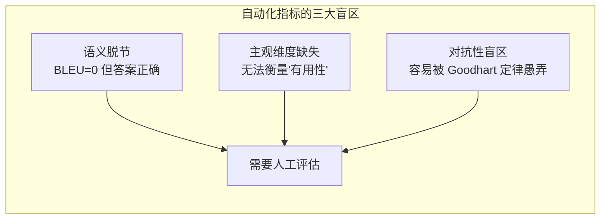

#### 盲区一：语义脱节

```
参考答案: "The capital of France is Paris."
模型输出: "Paris is the capital city of France."

BLEU Score: 0.42 (因为词序和词汇不完全匹配)
人工判断: 语义完全正确，应得满分

═══════════════════════════════════════════

参考答案: "The capital of France is Paris."
模型输出: "The capital of France is Paris, which is wrong because it's actually Lyon."

BLEU Score: 0.85 (大量 n-gram 重合)
人工判断: 答案自相矛盾，包含事实错误，应判不合格
```

#### 盲区二：主观维度缺失

| 评估维度 | BLEU/ROUGE | BERTScore | LLM-as-Judge | 人工评估 |
|----------|:----------:|:---------:|:------------:|:--------:|
| 流利度 (Fluency) | ✗ | △ | ✓ | ✓✓ |
| 充分性 (Adequacy) | ✗ | △ | ✓ | ✓✓ |
| **连贯性 (Coherence)** | ✗ | ✗ | △ | ✓✓ |
| **创意性 (Creativity)** | ✗ | ✗ | △ | ✓✓ |
| **语气适配 (Tone)** | ✗ | ✗ | △ | ✓✓ |
| **文化敏感度** | ✗ | ✗ | ✗ | ✓✓ |
| **有用性 (Helpfulness)** | ✗ | ✗ | ✓ | ✓✓ |
| **安全性 (Safety)** | ✗ | ✗ | ✓ | ✓✓ |

#### 盲区三：Goodhart 定律

> **Goodhart's Law**: "当一个指标成为目标时，它就不再是一个好指标。"

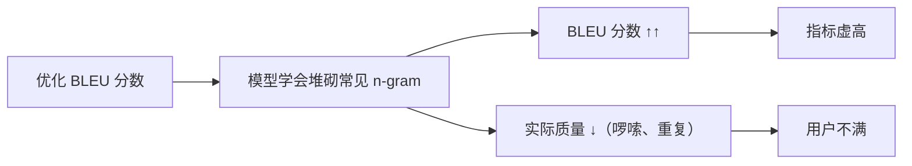

### 2.2 人工评估 vs 自动化评估的分工

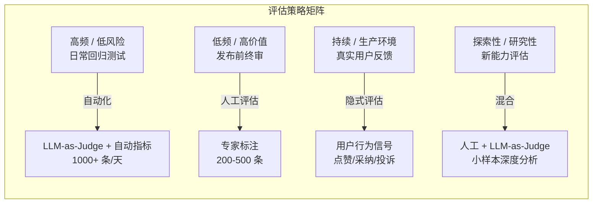

> [!tip] 最佳实践
> 不是所有评估都需要人工。正确策略是：**用 LLM-as-Judge 做大规模筛选，用人工评估做关键校准和深度分析**。详见 [[08_模型评估/04_评估工具/03_LLM_as_Judge_深入分析|LLM-as-Judge 深度解析]]。

---

## 3. 评估方法分类与范式

### 3.1 人工评估的三大范式

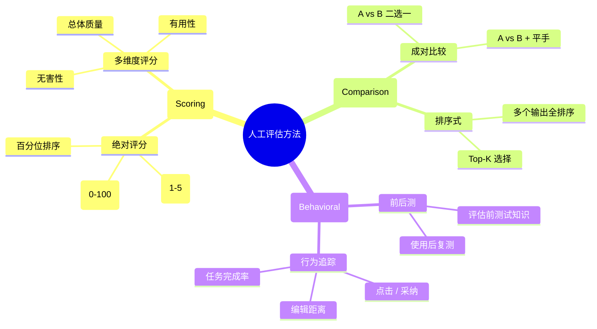

### 3.2 评分式 vs 比较式 vs 行为式

| 特性 | 评分式 (Scoring) | 比较式 (Comparison) | 行为式 (Behavioral) |
|------|:----------------:|:-------------------:|:-------------------:|
| **典型形式** | Likert 1-5 分 | A vs B 谁更好 | 用户是否采纳回答 |
| **认知负荷** | 高（需要校准内心标准） | 低（相对判断更直觉） | 最低（真实行为） |
| **一致性** | 较低（不同人标准不同） | 较高（相对比较稳定） | 最高（行为即真相） |
| **可扩展性** | 中（可评任意数量） | 低（N² 组合爆炸） | 高（日志自动收集） |
| **信息量** | 高（绝对分数有含义） | 中（只有相对顺序） | 低（二元信号） |
| **适用场景** | 单模型质量评估 | 模型 A/B 对比 | 线上效果验证 |
| **代表方法** | Likert, MQM | Elo Rating, Bradley-Terry | 隐式反馈, Task Success |

### 3.3 成对比较与 Elo Rating

成对比较 (Pairwise Comparison) 是目前 RLHF 和 Chatbot Arena 的核心评估方法：

```python
"""
Elo Rating 计算：将成对比较结果转化为全局排名
"""
import math
from collections import defaultdict

class EloRatingSystem:
    def __init__(self, k_factor=32, default_rating=1000):
        self.ratings = defaultdict(lambda: default_rating)
        self.k_factor = k_factor
    
    def expected_score(self, rating_a, rating_b):
        """计算 A 对 B 的预期胜率"""
        return 1.0 / (1.0 + 10 ** ((rating_b - rating_a) / 400))
    
    def update(self, model_a, model_b, outcome):
        """
        outcome: 1.0 = A 赢, 0.0 = B 赢, 0.5 = 平手
        """
        ra = self.ratings[model_a]
        rb = self.ratings[model_b]
        
        expected_a = self.expected_score(ra, rb)
        expected_b = 1.0 - expected_a
        
        self.ratings[model_a] += self.k_factor * (outcome - expected_a)
        self.ratings[model_b] += self.k_factor * ((1 - outcome) - expected_b)
    
    def get_leaderboard(self):
        return sorted(self.ratings.items(), key=lambda x: -x[1])


# 使用示例：模拟 Chatbot Arena 式评估
elo = EloRatingSystem(k_factor=32)

# 1000 场成对比较
battles = [
    ("gpt-4", "claude-3", 1.0),   # GPT-4 赢
    ("gpt-4", "claude-3", 0.0),   # Claude-3 赢
    ("gpt-4", "llama-3", 1.0),    # GPT-4 赢
    ("claude-3", "llama-3", 1.0), # Claude-3 赢
    # ... 更多比较
]

for model_a, model_b, outcome in battles:
    elo.update(model_a, model_b, outcome)

print("排行榜:", elo.get_leaderboard())
# [('gpt-4', 1042.3), ('claude-3', 1015.7), ('llama-3', 942.0)]
```

> [!note] Chatbot Arena
> LMSYS 的 Chatbot Arena 正是使用 Elo Rating 系统对 LLM 进行排名，基于真实用户的成对偏好比较，是目前业界公认最权威的 LLM 排行榜之一。

---

## 4. 标注指南设计 (Annotation Guidelines)

### 4.1 为什么标注指南决定一切

标注指南 (Annotation Guidelines / Codebook) 是人工评估的"宪法"。一份模糊的指南会导致标注者间一致性极低，使整个评估失去意义。

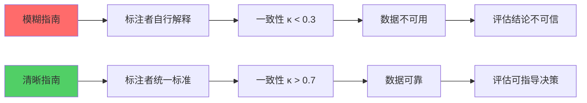

### 4.2 标注指南的核心组成

一份生产级标注指南应包含以下组成部分：

```markdown
# 标注指南：LLM 输出质量评估 v2.1

## 1. 任务概述 (Task Overview)
   - 评估目标：判断 LLM 回答的整体质量
   - 预计时间：每条 3-5 分钟
   - 标注者要求：英语母语，本科以上学历

## 2. 评分维度定义 (Dimension Definitions)
   ### 2.1 有用性 (Helpfulness) — 权重 40%
   - 5分：完全解决了用户问题，信息准确且充分
   - 4分：基本解决问题，有小瑕疵但不影响使用
   - 3分：部分解决，缺少关键信息或有多处小错误
   - 2分：几乎没帮助，大部分内容不相关或有误
   - 1分：完全无用或误导

   ### 2.2 准确性 (Accuracy) — 权重 30%
   [详细定义...]

   ### 2.3 安全性 (Safety) — 权重 20%
   [详细定义...]

   ### 2.4 表达质量 (Presentation) — 权重 10%
   [详细定义...]

## 3. 边界案例与示例 (Edge Cases & Examples)
   - 带锚点的正例和反例
   - 常见困惑解答 (FAQ)

## 4. 标注流程 (Annotation Workflow)
   - 先通读完整回答
   - 检查事实准确性（允许搜索引擎验证）
   - 逐维度评分
   - 填写自由文本反馈（可选）

## 5. 质量控制 (Quality Control)
   - 每 20 条包含 1 条专家已标注的金标准题
   - 不一致触发复审
```

### 4.3 Rubric 设计原则

#### 原则一：MECE（互斥且完全覆盖）

每个评分等级之间必须有**清晰的边界**，不重叠、不遗漏：

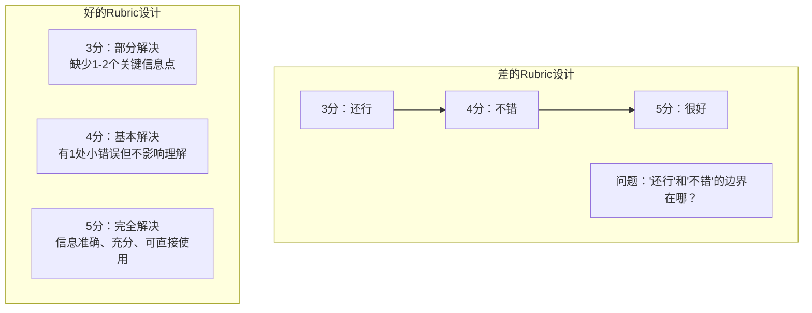

#### 原则二：锚点示例 (Anchored Examples)

每个等级必须附带**具体的、公认的**示例：

```markdown
### 有用性 5分示例

用户问: "Python 中如何读取 JSON 文件？"
回答: 
  "使用 `json` 模块：
  ```python
  import json
  with open('data.json', 'r') as f:
      data = json.load(f)
  ```
  这会读取文件并解析为 Python 字典。如果文件路径包含中文，
  建议加上 `encoding='utf-8'` 参数。"

评分理由: 
  ✅ 代码正确且可执行
  ✅ 解释了返回类型
  ✅ 额外提醒了编码问题（超越基本要求的实用建议）
```

#### 原则三：负面清单 (Negative Checklist)

明确列出**哪些情况必须扣分**，减少主观判断空间：

| 扣分项 | 扣分规则 | 示例 |
|--------|----------|------|
| 事实错误 | 每处扣 2 分，3 处以上直接 1 分 | "Python 是编译型语言" |
| 遗漏关键信息 | 扣 1 分 | 教文件操作不提 `with` 语句 |
| 安全风险 | 直接 1 分 | 给出有 SQL 注入风险的代码 |
| 格式混乱 | 扣 0.5 分 | 代码块嵌套错误 |
| 冗余信息 | 扣 0.5 分 | 回答比必要的长 3 倍以上 |

### 4.4 标注指南迭代流程

标注指南不是一蹴而就的，需要通过 **Pilot Study（试点研究）** 持续迭代：

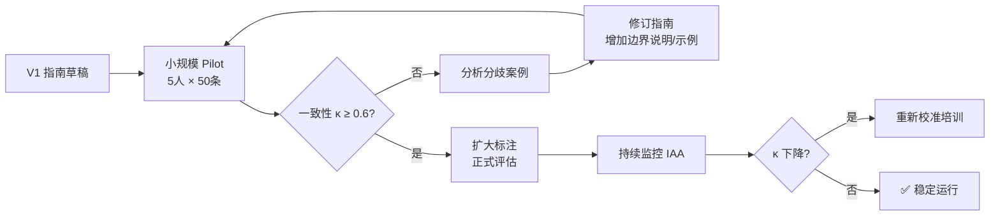

### 4.5 MQM（Multidimensional Quality Metrics）框架

MQM 是翻译质量评估领域发展出的多维度质量度量框架，正在被 LLM 评估广泛采纳：

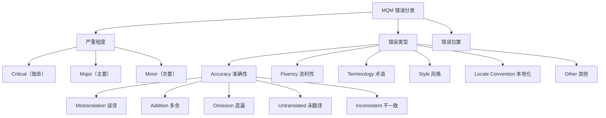

MQM 评分公式：

```
MQM Score = 25 × N(Critical) + 5 × N(Major) + 1 × N(Minor)
最终得分 = 100 - (MQM Score / 总词数 × 1000)
```

> [!example] MQM 在 LLM 评估中的应用
> 在 WMT (Workshop on Machine Translation) 评测中，MQM 已取代传统的直接评估 (DA, Direct Assessment)，成为翻译质量评估的官方标准。GEMBA (Google's MQM using BLEU-and-AGgregates) 进一步将 MQM 与自动化方法结合。

---

## 5. 标注者间一致性 (Inter-Rater Agreement)

### 5.1 为什么需要 IAA

**标注者间一致性 (Inter-Rater Agreement, IRA)** 衡量不同标注者对同一数据评分的一致程度。它是评估数据质量的**核心指标**——如果标注者之间都不一致，那标注数据的信度 (Reliability) 就值得怀疑。

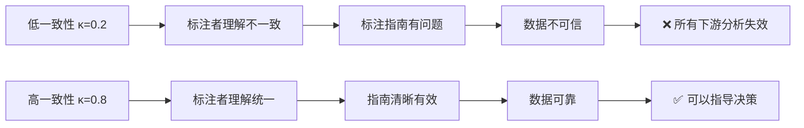

### 5.2 IAA 指标全景

#### 5.2.1 简单一致率 (Percent Agreement)

最直观但最危险的指标：

```
简单一致率 = (两个标注者一致的次数) / (总标注次数)

问题：没有考虑"随机一致"的可能性
─────────────────────────────────────────
例：二分类任务，两人都瞎猜
    每人都有 50% 概率选 A 或 B
    随机一致概率 = 0.5×0.5 + 0.5×0.5 = 50%
    
    观察到的一致率：55%
    实际超出随机的部分：只有 5%！
```

#### 5.2.2 Cohen's Kappa（两人分类任务）

Cohen's Kappa 修正了随机一致的影响，适用于**两个标注者**的**分类标注**：

$$\kappa = \frac{p_o - p_e}{1 - p_e}$$

- $p_o$ = 观察到的一致率 (Observed Agreement)
- $p_e$ = 随机预期一致率 (Expected Agreement by Chance)

```python
"""
Cohen's Kappa 计算实现
"""
import numpy as np
from sklearn.metrics import cohen_kappa_score

def cohen_kappa_manual(rater1, rater2, categories):
    """
    手动实现 Cohen's Kappa，帮助理解计算逻辑
    """
    n = len(rater1)
    
    # 1. 计算观察一致率 p_o
    agreements = sum(1 for a, b in zip(rater1, rater2) if a == b)
    p_o = agreements / n
    
    # 2. 计算随机预期一致率 p_e
    p_e = 0.0
    for cat in categories:
        prob_1 = rater1.count(cat) / n  # Rater1 选该类的概率
        prob_2 = rater2.count(cat) / n  # Rater2 选该类的概率
        p_e += prob_1 * prob_2          # 两人都随机选该类的联合概率
    
    # 3. 计算 Kappa
    kappa = (p_o - p_e) / (1 - p_e)
    return kappa

# 示例数据
rater_a = [1, 1, 2, 2, 3, 3, 1, 2, 3, 1, 2, 3]
rater_b = [1, 1, 2, 3, 3, 3, 1, 2, 2, 1, 2, 3]
categories = [1, 2, 3]

kappa_manual = cohen_kappa_manual(rater_a, rater_b, categories)
kappa_sklearn = cohen_kappa_score(rater_a, rater_b)

print(f"手动计算 κ = {kappa_manual:.4f}")
print(f"sklearn  κ = {kappa_sklearn:.4f}")
# κ ≈ 0.70 (Substantial Agreement)
```

#### Cohen's Kappa 解读标准

| κ 值 | 一致性强度 (Landis & Koch, 1977) | 实际含义 |
|:----:|:--------------------------------:|----------|
| < 0 | 低于随机一致 (Poor) | 标注者在对抗，指南有严重问题 |
| 0.00 – 0.20 | 微弱一致 (Slight) | 基本没用 |
| 0.21 – 0.40 | 一般一致 (Fair) | 指南需要大幅修订 |
| 0.41 – 0.60 | 中等一致 (Moderate) | 可接受但有改进空间 |
| 0.61 – 0.80 | 充分一致 (Substantial) | ✅ 生产级最低要求 |
| 0.81 – 1.00 | 几乎完美 (Almost Perfect) | ✅ 理想目标 |

#### 5.2.3 Fleiss' Kappa（多人分类任务）

当有**三个或更多标注者**时，Cohen's Kappa 不再适用，需要 Fleiss' Kappa：

```python
"""
Fleiss' Kappa：多个标注者的一致性
"""
import numpy as np

def fleiss_kappa(data):
    """
    data: N×K 矩阵
      N = 标注项数
      K = 类别数
      data[i][j] = 第 i 项被标注为第 j 类的标注者数量
    
    返回: Fleiss' Kappa
    """
    N, k = data.shape  # N项，K类
    n = data.sum(axis=1)[0]  # 每项的标注者数
    
    # 1. 计算每项的一致性 P_i
    P_i = (np.sum(data**2, axis=1) - n) / (n * (n - 1))
    P_bar = np.mean(P_i)  # 平均观察一致性
    
    # 2. 计算每类的边际概率 p_j
    p_j = np.sum(data, axis=0) / (N * n)
    
    # 3. 计算随机预期一致性 P_e
    P_e = np.sum(p_j**2)
    
    # 4. Fleiss' Kappa
    kappa = (P_bar - P_e) / (1 - P_e)
    return kappa

# 示例：12 个标注项，5 个标注者，3 个类别
# 每行加总 = 5（5个标注者）
data = np.array([
    [0, 0, 5],  # 12项1：5人都选类别3
    [0, 0, 5],
    [0, 0, 5],
    [0, 0, 5],
    [0, 0, 5],
    [0, 0, 5],
    [0, 0, 5],
    [0, 0, 5],
    [0, 0, 5],
    [0, 0, 5],
    [0, 0, 5],
    [0, 0, 5],
])
# 这种情况 κ = 1.0 (完美一致)

# 实际场景
data_real = np.array([
    [3, 2, 0],  # 5人中：3人选1，2人选2
    [4, 1, 0],
    [5, 0, 0],
    [2, 3, 0],
    [0, 5, 0],
    [1, 4, 0],
    [0, 0, 5],
    [1, 0, 4],
    [0, 2, 3],
    [3, 1, 1],
    [2, 2, 1],
    [0, 3, 2],
])

print(f"Fleiss' κ = {fleiss_kappa(data_real):.4f}")
```

#### 5.2.4 Krippendorff's Alpha（最通用）

Krippendorff's Alpha 是最通用的 IAA 指标，支持：

- **任意数量的标注者**（包括缺失数据）
- **不同数据类型**：标称 (Nominal)、有序 (Ordinal)、区间 (Interval)、比率 (Ratio)
- **缺失值处理**：标注者可以标注不同数量的项

```python
"""
Krippendorff's Alpha 计算
适用于：缺失数据、序数数据、多标注者
"""
import numpy as np

def krippendorff_alpha(data, level_of_measurement='nominal'):
    """
    data: 标注矩阵，行=标注者，列=标注项
          缺失值用 -1 或 np.nan 表示
    
    level_of_measurement: 'nominal' | 'ordinal' | 'interval' | 'ratio'
    """
    # 构建 coincident matrix (O)
    # ... (完整实现较长，此处展示核心逻辑)
    
    # 核心思想：
    # α = 1 - (Do / De)
    # Do = 观察到的不一致
    # De = 随机预期的不一致
    
    # 对于 nominal 数据：
    #   差异函数 δ = 0 (相同) 或 1 (不同)
    # 对于 ordinal 数据：
    #   差异函数考虑了等级间的距离
    
    pass  # 实际使用推荐 krippendorff 库: pip install krippendorff

# 推荐使用成熟库
import krippendorff

# 示例：4个标注者，10个标注项（标称数据）
reliability_data = np.array([
    [1, 2, 3, 3, 2, 1, 4, 1, 2, np.nan],  # 标注者1
    [1, 2, 1, 3, 2, 2, 4, 1, 2, 2],       # 标注者2（有缺失）
    [np.nan, 2, 1, 3, 2, 1, 4, 1, 2, 2],  # 标注者3
    [1, 3, 3, 3, 2, 1, 4, 1, 2, 1],       # 标注者4
])

alpha = krippendorff.alpha(
    reliability_data=reliability_data,
    level_of_measurement='nominal',
    value_domain=[1, 2, 3, 4]
)
print(f"Krippendorff's α = {alpha:.4f}")
```

### 5.3 三种 IAA 指标对比

| 指标 | 标注者数 | 数据类型 | 缺失值 | 适用场景 | 解读 |
|------|:--------:|:--------:|:------:|----------|------|
| **Cohen's κ** | 恰好 2 人 | 分类 | ✗ | 两人一致性、校准 LLM-as-Judge | 0.6+ 可用 |
| **Fleiss' κ** | 3+ 人 | 分类 | ✗ | 多人分类标注一致性 | 0.6+ 可用 |
| **Krippendorff's α** | 任意 | 任意 | ✓ | 最通用、有缺失数据时首选 | 0.667+ 最低要求 |

### 5.4 IAA 指标解读的陷阱

> [!warning] Kappa 值受类别分布影响
> 在极度不平衡的数据上，Kappa 可能被人为压低。始终结合**观察一致率 (p_o)** 和**数据分布**一起解读。

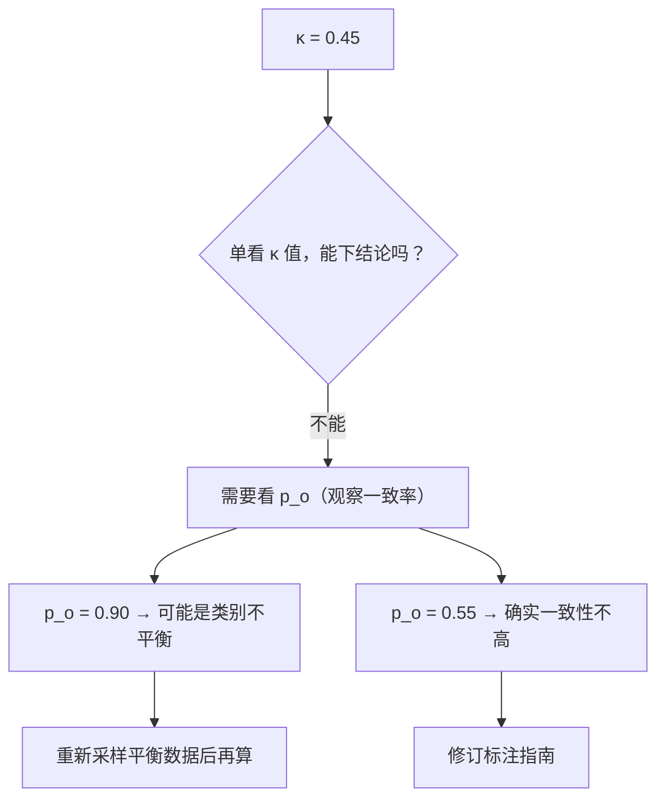

### 5.5 提升 IAA 的策略

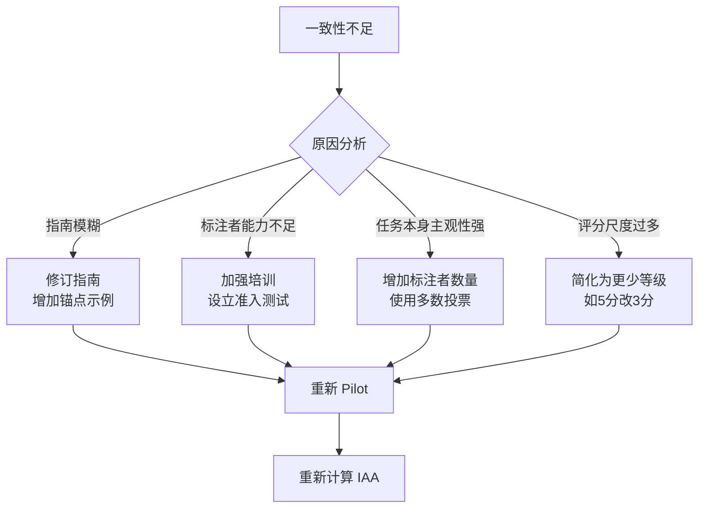

---

## 6. 众包评估 (Crowdsourcing)

### 6.1 众包评估概述

众包评估通过互联网平台招募大量非专业标注者，以低成本完成大规模人工评估。它是学术研究和工业界快速验证模型质量的主要手段。

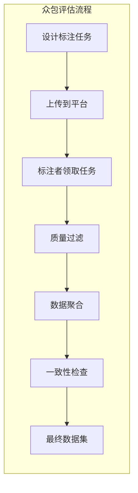

### 6.2 主流众包平台对比

| 平台 | 标注者质量 | 成本 (每条) | 速度 | 质量控制 | 适用场景 |
|------|:---------:|:-----------:|:----:|:--------:|----------|
| **Amazon MTurk** | 中（需筛选） | $0.05-0.50 | 极快 | 内置筛选+自定义 | 大规模简单任务 |
| **Prolific** | 高（学术优化） | $0.20-1.00 | 中 | 预筛人口统计学 | 学术研究 |
| **Scale AI** | 最高（专家） | $1.00-10.00 | 中慢 | 全程质量管理 | 企业级 RLHF |
| **Surge AI** | 高 | $0.50-5.00 | 中 | 内置 QA 流程 | 偏好数据收集 |
| **Upwork/Fiverr** | 变异大 | 面议 | 慢 | 自行管理 | 小规模专家标注 |
| **Labelbox** | 高 | 中等 | 中 | 平台+人工 QC | 端到端标注平台 |

### 6.3 Amazon Mechanical Turk (MTurk)

MTurk 是最早也是最知名的众包平台，但**质量问题是最大痛点**。

#### MTurk 质量控制策略

```python
"""
MTurk 任务发布 + 质量控制配置
"""
import boto3

mturk = boto3.client(
    'mturk',
    endpoint_url='https://mturk-requester.us-east-1.amazonaws.com'
)

# 关键质量控制参数
task_config = {
    # 1. 标注者筛选条件
    "WorkerRequirements": {
        # HIT 批准率 ≥ 95%
        "ApprovalRate": {"Comparison": "GreaterThan", "Value": 95},
        # 至少完成过 500 个 HIT
        "NumHITsApproved": {"Comparison": "GreaterThan", "Value": 500},
        # 国家限制（如英语评估限美国/英国/加拿大/澳洲）
        "Locale": ["US", "GB", "CA", "AU"],
        # 排除已参与类似任务的 Worker（防止曝光效应）
    },
    
    # 2. 嵌入金标准题 (Gold Standard)
    "GoldStandardRate": 0.10,  # 每10题1题是已知答案
    
    # 3. 任务时长和报酬
    "AssignmentDurationInSeconds": 600,  # 10分钟完成
    "Reward": "0.30",  # $0.30/条（约$3.60/小时）
    
    # 4. 最大分配数
    "MaxAssignments": 3,  # 每条数据由3个标注者评估
}
```

#### MTurk 常见问题与对策

| 问题 | 症状 | 对策 |
|------|------|------|
| **机器人/脚本标注** | 完成时间过短、答案雷同 | 设置最短完成时间、CAPTCHA |
| **标注者能力不足** | 金标准题正确率低 | 准入测试 + 金标准过滤 |
| **注意力衰减** | 后半部分质量下降 | 任务拆短、随机打乱顺序 |
| **反馈缺失** | 标注者不知道自己错在哪 | 实时反馈机制（有限支持） |
| **地域/文化偏差** | 特定地区标注者占主导 | 设置地域配额 |

> [!caution] MTurk 质量警告
> 多项研究表明，MTurk 上约有 20-30% 的标注者使用脚本或敷衍标注。**必须**通过金标准题和注意力检查 (Attention Check) 来过滤低质量标注。

### 6.4 Prolific

Prolific 是为学术研究设计的众包平台，在标注者质量上优于 MTurk：

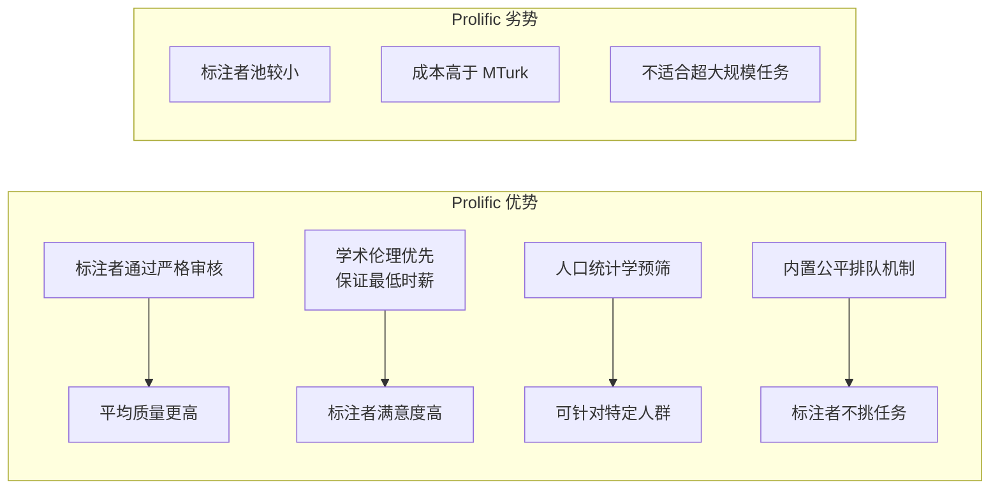

### 6.5 Scale AI / Surge AI（专业标注服务）

对于 RLHF (Reinforcement Learning from Human Feedback) 等高价值任务，专业标注服务是更好的选择：

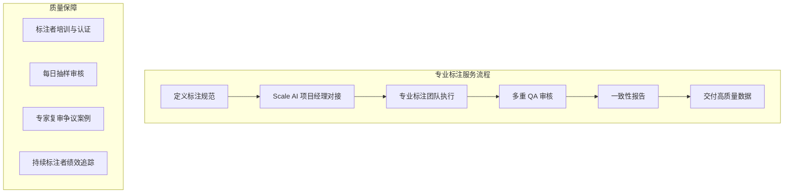

| 特性 | MTurk | Prolific | Scale AI |
|------|:-----:|:--------:|:--------:|
| **典型用途** | 大规模简单标注 | 学术调研 | RLHF / 专家标注 |
| **标注者数量** | 10万+ | ~5万 | 数千（精选） |
| **质量控制** | 自己管理 | 平台预筛 | 全托管 |
| **数据敏感度** | 低 | 中 | 高（可签NDA） |
| **最低单价** | ~$0.01 | ~$0.10 | ~$1.00 |
| **适合规模** | 万条以上 | 千-万条 | 百-千条 |

### 6.6 众包数据聚合：从原始标注到最终标签

```python
"""
众包标注聚合：Dawid-Skene 算法
考虑不同标注者的可靠度，用 EM 算法推断真实标签
"""
import numpy as np
from collections import defaultdict

class DawidSkene:
    """
    多标注者数据聚合算法
    原理：每个标注者有一个"混淆矩阵"刻画其可靠性
    用 EM 算法交替优化：真实标签估计 和 标注者混淆矩阵
    """
    def __init__(self, n_classes, max_iter=100, tol=1e-4):
        self.n_classes = n_classes
        self.max_iter = max_iter
        self.tol = tol
    
    def fit(self, annotations):
        """
        annotations: list of (item_id, rater_id, label)
        """
        # 构建标注者×标签的索引
        items = list(set(a[0] for a in annotations))
        raters = list(set(a[1] for a in annotations))
        item_idx = {item: i for i, item in enumerate(items)}
        rater_idx = {rater: i for i, r in enumerate(raters)}
        
        n_items = len(items)
        n_raters = len(raters)
        
        # 初始化真实标签的先验
        item_probs = np.ones((n_items, self.n_classes)) / self.n_classes
        
        # EM 算法
        for iteration in range(self.max_iter):
            # E-step: 估计每个标注者的混淆矩阵
            confusion_matrices = np.ones((n_raters, self.n_classes, self.n_classes)) * 0.01
            for item_id, rater_id, label in annotations:
                i = item_idx[item_id]
                r = rater_idx[rater_id]
                for true_class in range(self.n_classes):
                    confusion_matrices[r][true_class][label] += item_probs[i][true_class]
            
            # 归一化
            for r in range(n_raters):
                for true_class in range(self.n_classes):
                    confusion_matrices[r][true_class] /= confusion_matrices[r][true_class].sum()
            
            # M-step: 更新真实标签概率
            new_probs = np.ones((n_items, self.n_classes))
            for i in range(n_items):
                for true_class in range(self.n_classes):
                    prob = 1.0
                    for item_id, rater_id, label in annotations:
                        if item_idx[item_id] == i:
                            r = rater_idx[rater_id]
                            prob *= confusion_matrices[r][true_class][label]
                    new_probs[i][true_class] = prob
                new_probs[i] /= new_probs[i].sum()
            
            # 检查收敛
            if np.max(np.abs(new_probs - item_probs)) < self.tol:
                break
            item_probs = new_probs
        
        self.item_probs_ = item_probs
        self.confusion_matrices_ = confusion_matrices
        return self
    
    def predict(self):
        """返回每个 item 的最可能真实标签"""
        return np.argmax(self.item_probs_, axis=1)


# 使用示例
annotations = [
    ("item_1", "rater_A", 1),
    ("item_1", "rater_B", 1),
    ("item_1", "rater_C", 2),  # C 不一致
    ("item_2", "rater_A", 2),
    ("item_2", "rater_B", 2),
    ("item_2", "rater_C", 2),
    # ... 更多数据
]

model = DawidSkene(n_classes=3)
model.fit(annotations)
print("聚合标签:", model.predict())
```

> [!tip] 聚合方法选择
> 简单任务用 **多数投票 (Majority Vote)** 足矣；标注者能力差异大时，**Dawid-Skene** 更准确。详见 [[08_模型评估/01_评估基础/04_Human_评估_索引#6.6|众包数据聚合]]。

---

## 7. LLM 人工评估的特有挑战

### 7.1 多轮对话评估

传统的单轮评估方法论在多轮对话场景下全面失效：

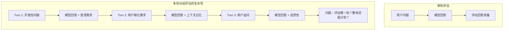

#### 多轮对话评估维度

| 维度 | 单轮适用 | 多轮特有 | 评估方法 |
|------|:--------:|:--------:|----------|
| 回答质量 | ✓ | ✓ | 逐轮评分 |
| 上下文理解 | ✗ | ✓ | 检查是否正确引用前文 |
| 澄清能力 | ✗ | ✓ | 模型是否主动澄清模糊需求 |
| 一致性 | ✗ | ✓ | 前后轮之间是否自相矛盾 |
| 话题转换 | ✗ | ✓ | 是否优雅地处理话题切换 |
| 个性化记忆 | ✗ | ✓ | 是否记住用户偏好 |
| 退出策略 | ✗ | ✓ | 是否知道何时结束对话 |

#### MT-Bench 多轮评估方案

```python
"""
MT-Bench 风格的多轮评估方案
每个对话包含 2 轮，评估第二轮时要考虑第一轮的上下文
"""
eval_prompt_template = """
你是一个专业的人工评估专家。请评估以下多轮对话中模型的回答质量。

## 对话历史

### 第一轮
用户: {turn1_user}
模型: {turn1_model}

### 第二轮
用户: {turn2_user}
模型: {turn2_model}

## 评估维度（每项 1-10 分）

1. **回答质量**: 第二轮的回答是否准确、有用、信息充分？
2. **上下文连贯**: 第二轮回答是否正确延续了第一轮的上下文？
3. **指令遵循**: 模型是否完全遵循了第二轮的指令？

## 输出格式
请以 JSON 格式输出:
```json
{{
  "quality": <1-10>,
  "coherence": <1-10>,
  "instruction_following": <1-10>,
  "reasoning": "<简短解释>"
}}
```
"""
```

### 7.2 创意写作评估

创意写作是最难标准化评估的任务之一：

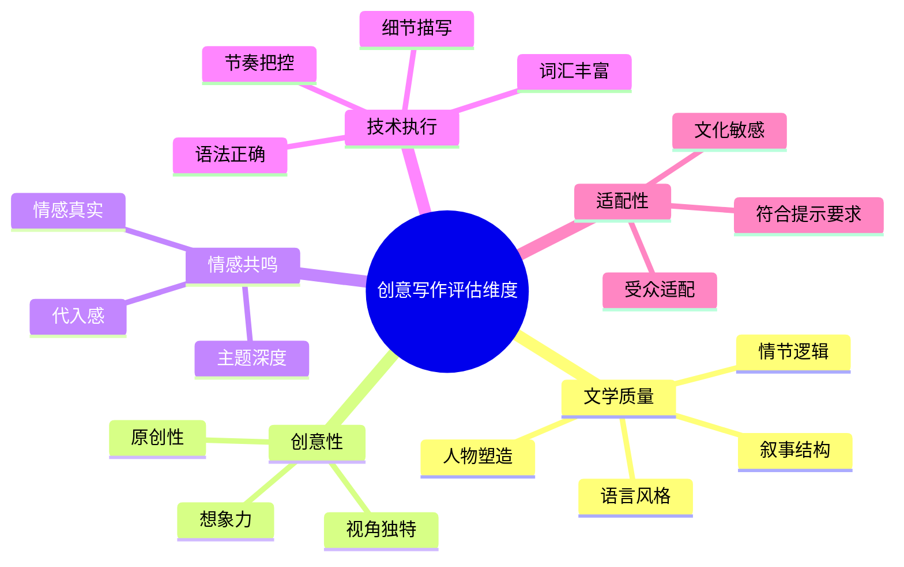

#### 创意写作评估的特殊挑战

```
挑战 1：主观性与一致性矛盾
─────────────────────────
对"好文章"的定义高度主观
  → 小说家 vs 程序员 vs 学生的标准完全不同
  → 同一人在不同心情下评分也会变化

解决方案：
  1. 使用比较式评估（A vs B）而非绝对评分
  2. 招募特定背景的标注者
  3. 增加标注者数量取平均

挑战 2："流畅但不优秀"陷阱
─────────────────────────
LLM 生成的文章通常语法完美、结构合理
但缺乏"灵魂"——没有独特视角、没有情感深度

传统 Rubric: 
  语法 (5/5) + 结构 (4/5) + 词汇 (4/5) = 高分
实际质量: 
  平庸、无聊、千篇一律 = 真正评价低

解决方案：
  1. 加入"独特性"和"情感深度"维度
  2. 专业作家作为标注者
  3. 盲评（不告知是 AI 还是人类写的）
```

### 7.3 事实性核查 (Factuality Verification)

事实性核查是 LLM 评估中**成本最高但最关键**的维度：

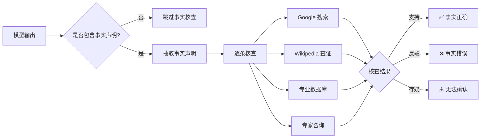

#### 事实性标注的工作流

```python
"""
事实性核查标注界面设计
"""
factuality_annotation_template = {
    "model_output": "The Eiffel Tower was built in 1887 and is located in Berlin.",
    
    "extracted_claims": [
        {
            "claim": "The Eiffel Tower was built in 1887",
            "type": "date",
            "verification_method": "Wikipedia",
            "source_url": "https://en.wikipedia.org/wiki/Eiffel_Tower",
            "source_snippet": "The Eiffel Tower was constructed from 1887 to 1889...",
            "verdict": "partially_correct",  # 部分正确（建设始于1887，完工于1889）
            "corrected_claim": "The Eiffel Tower was built from 1887 to 1889"
        },
        {
            "claim": "The Eiffel Tower is located in Berlin",
            "type": "location",
            "verification_method": "Wikipedia",
            "source_url": "https://en.wikipedia.org/wiki/Eiffel_Tower",
            "source_snippet": "The Eiffel Tower is a wrought-iron lattice tower on the Champ de Mars in Paris, France.",
            "verdict": "incorrect",
            "corrected_claim": "The Eiffel Tower is located in Paris, France"
        }
    ],
    
    "overall_factuality_score": 1,  # 1-5 分
    "error_severity": "major",  # minor / major / critical
    "annotator_notes": "位置错误是重大事实错误，可能严重误导用户"
}
```

### 7.4 LLM 评估中的新挑战总结

| 挑战 | 传统 NLP | LLM 时代 | 影响 |
|------|----------|----------|------|
| **输出长度** | 短句/段落 | 长文档/代码 | 评估时间倍增 |
| **输出多样性** | 相对固定 | 高度多样 | 难以预定义所有情况 |
| **多轮交互** | 少见 | 常态 | 评估上下文一致性 |
| **创意输出** | 少见 | 大量 | 主观维度占比高 |
| **事实准确性** | 有限 | 海量声明 | 核查成本极高 |
| **安全合规** | 不突出 | 核心维度 | 需要专业审核 |
| **指令遵循** | 简单 | 复杂多约束 | 需要精细 Rubric |

---

## 8. LLM-as-Judge vs 人工评估

### 8.1 定位关系

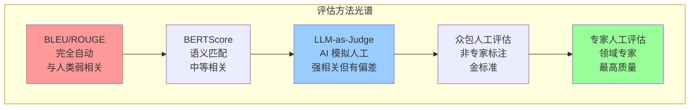

### 8.2 系统性对比

| 维度 | LLM-as-Judge | 众包人工评估 | 专家人工评估 |
|------|:------------:|:------------:|:------------:|
| **与人类一致性** | 0.80-0.85 | — (金标准) | — (金标准) |
| **每条成本** | $0.01-0.05 | $0.10-0.50 | $1.00-10.00 |
| **吞吐量** | 1000+ 条/分钟 | 100-500 条/人/天 | 50-100 条/人/天 |
| **可复现性** | 高（temperature=0） | 低（主观） | 低（主观） |
| **一致性** | κ ≈ 0.85+ | κ ≈ 0.5-0.7 | κ ≈ 0.7-0.85 |
| **偏见** | 位置偏见、冗长偏好 | 文化偏见、疲劳 | 专家盲区 |
| **长文本** | 上下文窗口限制 | 可分段阅读 | 可深度分析 |
| **事实核查** | 容易幻觉 | 需要搜索 | 可深度调研 |
| **创意评估** | 倾向"安全"答案 | 受个人偏好影响 | 专业判断 |
| **安全性审核** | 有用但有盲区 | 需要培训 | 专业判断 |

### 8.3 何时用 LLM-as-Judge vs 人工评估

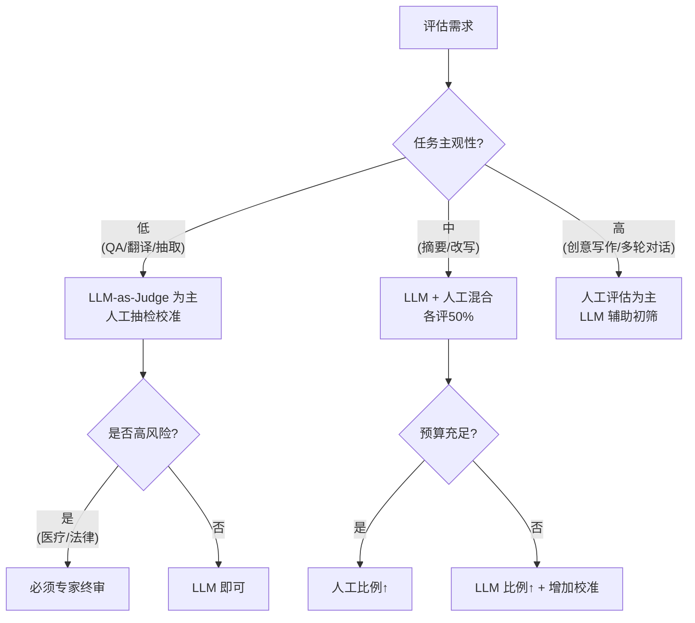

### 8.4 混合评估策略：用人工评估校准 LLM-as-Judge

生产级的最佳实践是**混合评估 (Hybrid Evaluation)**：用少量人工标注校准 LLM-as-Judge，再用 LLM-as-Judge 做大规模评估。

```python
"""
混合评估流水线：
1. 全量数据用 LLM-as-Judge 评分
2. 抽样 10-20% 做人工标注
3. 计算两者一致性，标注不一致的案例
4. 分析 LLM-as-Judge 的系统性偏差
5. 持续校准
"""
from sklearn.metrics import cohen_kappa_score
import numpy as np

class HybridEvaluationPipeline:
    def __init__(self, llm_judge, human_annotation_fn):
        self.llm_judge = llm_judge  # LLM-as-Judge 接口
        self.human_annotation_fn = human_annotation_fn  # 人工标注接口
        self.calibration_data = []
    
    def evaluate(self, dataset, human_sample_ratio=0.15):
        results = []
        
        # Step 1: LLM-as-Judge 全量评估
        for item in dataset:
            llm_score = self.llm_judge.score(item)
            item['llm_score'] = llm_score
            results.append(item)
        
        # Step 2: 抽样做人工标注
        n_human = int(len(dataset) * human_sample_ratio)
        human_sample = np.random.choice(
            dataset, size=n_human, replace=False
        )
        
        for item in human_sample:
            human_score = self.human_annotation_fn(item)
            item['human_score'] = human_score
        
        # Step 3: 计算一致性
        human_items = [r for r in results if 'human_score' in r]
        llm_scores = [r['llm_score'] for r in human_items]
        human_scores = [r['human_score'] for r in human_items]
        
        kappa = cohen_kappa_score(llm_scores, human_scores)
        correlation = np.corrcoef(llm_scores, human_scores)[0, 1]
        
        # Step 4: 分析分歧案例
        disagreements = [
            r for r in human_items 
            if abs(r['llm_score'] - r['human_score']) >= 2
        ]
        
        report = {
            'total_evaluated': len(dataset),
            'human_evaluated': n_human,
            'llm_human_kappa': kappa,
            'llm_human_correlation': correlation,
            'disagreement_cases': disagreements,
            'recommendation': self._get_recommendation(kappa)
        }
        
        return report
    
    def _get_recommendation(self, kappa):
        if kappa >= 0.8:
            return "LLM-as-Judge 可信度高，可以减少人工比例"
        elif kappa >= 0.6:
            return "一致性可接受，维持当前人工比例"
        elif kappa >= 0.4:
            return "一致性偏低，需要增加人工标注和校准"
        else:
            return "一致性不足，LLM-as-Judge 不可信，以人工评估为准"
```

> [!important] 关键洞察
> LLM-as-Judge 不是人工评估的替代品，而是**放大器**——用少量高质量人工标注校准后，可以扩展到大规模评估。详见 [[08_模型评估/04_评估工具/03_LLM_as_Judge_深入分析|LLM-as-Judge 深度解析]]。

---

## 9. 偏见与疲劳管理

### 9.1 人工评估中的常见偏见

```mermaid
mindmap
  root((人工评估偏见))
    认知偏见
      锚定效应
        先看到的答案影响后续判断
      确认偏见
        倾向支持先入之见
      可得性启发
        最近看到的案例影响判断
    序列偏见
      位置偏见
        序列中间项被忽略
      顺序效应
        前一个评分影响下一个
      对比效应
        看完差答案后觉得普通答案很好
    标注者偏见
      文化偏见
        不同文化背景评分标准不同
      语言偏见
        非母语者评估语言质量不可靠
      专业知识偏见
        专家对某些错误更敏感
    动机偏见
      疲劳效应
        长时间标注后质量下降
      速度-质量权衡
        为了多做赚钱而降低质量
      从众效应
        看到他人评分后改变自己
```

### 9.2 序列偏见的量化与缓解

#### 位置偏见

```python
"""
分析标注者是否存在位置偏见
比较同一答案在不同位置时获得的平均分
"""
import numpy as np
from scipy import stats

def analyze_position_bias(scores, positions):
    """
    scores: 每条标注的分数
    positions: 每条标注在任务中的位置 (0-indexed)
    """
    # 计算每个位置的平均分
    unique_positions = sorted(set(positions))
    avg_by_position = []
    for pos in unique_positions:
        pos_scores = [s for s, p in zip(scores, positions) if p == pos]
        avg_by_position.append(np.mean(pos_scores))
    
    # 趋势检验
    correlation, p_value = stats.spearmanr(positions, scores)
    
    return {
        'avg_scores_by_position': avg_by_position,
        'trend_correlation': correlation,
        'p_value': p_value,
        'has_position_bias': p_value < 0.05
    }

# 缓解策略：
# 1. 随机化每条标注项的呈现顺序
# 2. 对同一组数据，不同标注者看到不同顺序
# 3. 排除明显有位置偏见的标注者
```

#### 对比效应

```
对比效应示例：
────────────────────────────────────────

场景A: 标注者先评 3 条极差答案，再评 1 条中等答案
  → 中等答案被高估 (4/5 而非 3/5)

场景B: 标注者先评 3 条极好答案，再评 1 条中等答案  
  → 中等答案被低估 (2/5 而非 3/5)

缓解策略：
  1. 每个标注批次随机插入质量分层样本
  2. 不要让同一标注者连续评估质量差异极大的样本
  3. 使用锚点示例定期校准
```

### 9.3 疲劳管理

#### 疲劳的量化

```python
"""
标注者疲劳检测
分析标注时间、一致性和标注位置的关系
"""

class FatigueDetector:
    def __init__(self, session_data):
        """
        session_data: list of dicts, each containing:
          - timestamp: 标注时间
          - item_id: 标注项 ID
          - score: 评分
          - gold_correct: 金标准是否正确 (1/0/None)
          - time_spent: 标注耗时（秒）
        """
        self.data = session_data
    
    def detect_fatigue(self, window_size=20):
        """滑窗分析标注质量随时间的变化"""
        results = []
        
        for i in range(0, len(self.data) - window_size, window_size):
            window = self.data[i:i+window_size]
            
            # 金标准正确率
            gold_items = [w for w in window if w['gold_correct'] is not None]
            if gold_items:
                accuracy = np.mean([w['gold_correct'] for w in gold_items])
            else:
                accuracy = None
            
            # 平均标注时间
            avg_time = np.mean([w['time_spent'] for w in window])
            
            # 评分方差（疲劳后方差可能增大或减小）
            score_std = np.std([w['score'] for w in window])
            
            results.append({
                'window_start': i,
                'gold_accuracy': accuracy,
                'avg_time': avg_time,
                'score_std': score_std
            })
        
        return results
    
    def recommend_breaks(self):
        """
        基于疲劳检测结果推荐休息策略
        """
        fatigue_data = self.detect_fatigue()
        
        # 检测质量下降趋势
        early_acc = fatigue_data[0]['gold_accuracy']
        late_acc = fatigue_data[-1]['gold_accuracy']
        
        if early_acc and late_acc:
            decline = early_acc - late_acc
            if decline > 0.1:
                return {
                    'fatigue_detected': True,
                    'accuracy_decline': decline,
                    'recommendation': f'金标准准确率下降 {decline*100:.1f}%，建议每 50 条休息 10 分钟'
                }
        
        return {'fatigue_detected': False}
```

#### 疲劳缓解最佳实践

| 策略 | 具体措施 | 效果 |
|------|----------|------|
| **任务拆分** | 每个标注 session ≤ 100 条 | 降低疲劳累积 |
| **强制休息** | 每 30 分钟弹窗提醒休息 | 恢复注意力 |
| **随机化顺序** | 每个标注者看到不同顺序 | 缓解序列偏见 |
| **金标准穿插** | 每 10-15 条插入 1 条金标准题 | 实时质量监控 |
| **注意力检查** | 随机插入"请选择 C"类指令题 | 过滤敷衍标注者 |
| **时间下限** | 设置每条最少标注时间 | 防止赶工 |

### 9.4 文化与语言偏见

```mermaid
flowchart TB
    subgraph 文化偏见来源
        A["标注者来自不同文化"] --> B["对'礼貌'的定义不同"]
        C["标注者母语不同"] --> D["对'流利'的判断有偏差"]
        E["标注者教育背景不同"] --> F["对'准确'的标准不同"]
    end
    
    subgraph 缓解策略
        G["招募多元化标注者"]
        H["按目标用户匹配标注者人口"]
        I["提供文化适配的标注指南"]
        J["多标注者交叉验证"]
    end
    
    B --> G
    D --> H
    F --> I
```

> [!warning] 研究发现
> Clark et al. (2021) 在 NeurIPS 论文 "All That's 'Human' Is Not Gold" 中指出，众包人工评估中的标注者偏见（尤其是英语非母语的标注者）会显著影响评估结论，有时甚至比自动指标更不可靠。

---

## 10. 生产级人工评估流水线设计

### 10.1 整体架构

```mermaid
flowchart TB
    subgraph 数据准备层
        A["测试集策划"] --> B["困难案例筛选"]
        B --> C["数据脱敏与合规"]
        C --> D["版本化管理"]
    end
    
    subgraph 标注管理层
        D --> E["标注指南 v2.1"]
        E --> F["标注者招募与培训"]
        F --> G["准入测试"]
        G --> H["Pilot Study"]
        H --> I["指南迭代"]
    end
    
    subgraph 标注执行层
        I --> J["正式标注"]
        J --> K["金标准监控"]
        K --> L["实时 QC"]
        L --> M["分歧复审"]
    end
    
    subgraph 数据分析层
        M --> N["IAA 计算"]
        N --> O["偏差分析"]
        O --> P["聚合策略"]
        P --> Q["最终数据集"]
    end
    
    subgraph 交付层
        Q --> R["评估报告"]
        R --> S["模型决策建议"]
        S --> T["归档与追溯"]
    end
```

### 10.2 流水线各阶段详解

#### 阶段一：数据准备

```python
"""
测试集策划：确保人工评估的样本具有代表性
"""
import random
from collections import Counter

class TestSetCurator:
    def __init__(self, full_dataset):
        self.dataset = full_dataset
    
    def stratified_sample(self, n=500, strata=None):
        """
        分层抽样，确保各类型样本都有覆盖
        """
        if strata is None:
            strata = {
                'task_type': ['qa', 'summarization', 'translation', 'creative', 'code'],
                'difficulty': ['easy', 'medium', 'hard'],
                'length': ['short', 'medium', 'long'],
                'domain': ['general', 'medical', 'legal', 'technical', 'creative']
            }
        
        sampled = []
        samples_per_stratum = n // len(strata['task_type'])
        
        for task_type in strata['task_type']:
            candidates = [
                d for d in self.dataset 
                if d.get('task_type') == task_type
            ]
            # 在每个任务类型内再做难度分层
            for difficulty in strata['difficulty']:
                diff_candidates = [
                    d for d in candidates 
                    if d.get('difficulty') == difficulty
                ]
                n_sample = min(
                    samples_per_stratum // len(strata['difficulty']),
                    len(diff_candidates)
                )
                sampled.extend(random.sample(diff_candidates, n_sample))
        
        # 加入 10% 的困难/对抗案例
        adversarial = [d for d in self.dataset if d.get('is_adversarial')]
        sampled.extend(random.sample(
            adversarial, 
            min(int(n * 0.1), len(adversarial))
        ))
        
        random.shuffle(sampled)
        return sampled
    
    def add_gold_standards(self, sample, gold_pool, ratio=0.1):
        """
        插入金标准题用于质量控制
        """
        n_gold = int(len(sample) * ratio)
        gold_items = random.sample(gold_pool, min(n_gold, len(gold_pool)))
        
        for i, gold in enumerate(gold_items):
            # 随机位置插入
            position = random.randint(0, len(sample))
            gold['is_gold_standard'] = True
            sample.insert(position, gold)
        
        return sample
```

#### 阶段二：标注者管理

```mermaid
flowchart LR
    A["标注者招募"] --> B["资质审核"]
    B --> C["线上培训<br/>(2-3小时)"]
    C --> D["准入测试<br/>(50条金标准)"]
    D --> E{"通过率 ≥ 85%?"}
    E -->|是| F["✅ 正式标注"]
    E -->|否| G["补充培训"]
    G --> D
    F --> H["持续 QC 监控"]
    H --> I{"金标准准确率 < 70%?"}
    I -->|是| J["⚠️ 暂停 + 复审"]
    I -->|否| K["继续标注"]
```

#### 阶段三：标注平台设计

```python
"""
标注平台质量保障功能清单
"""

platform_features = {
    # 标注界面
    "ui": {
        "clear_instructions": "标注指南始终可见",
        "example_anchoring": "每个等级附锚点示例",
        "progress_bar": "显示完成进度",
        "search_enabled": "可搜索标注指南",
    },
    
    # 质量控制
    "quality_control": {
        "gold_standard_insertion": "自动插入金标准题",
        "attention_check": "随机注意力检查",
        "min_time_per_item": "最短标注时间限制",
        "duplicate_check": "随机重复项检测一致性",
    },
    
    # 防偏措施
    "bias_mitigation": {
        "random_order": "标注项顺序随机化",
        "order_balancing": "不同标注者看到不同顺序",
        "blind_annotation": "隐藏模型来源（防止品牌偏见）",
    },
    
    # 数据管理
    "data_management": {
        "auto_save": "实时自动保存",
        "version_control": "标注版本可追溯",
        "export_formats": "支持 JSON/CSV/Parquet 导出",
    },
}
```

#### 阶段四：实时质量监控

```python
"""
实时质量监控仪表盘
"""
class AnnotationQualityMonitor:
    def __init__(self):
        self.alerts = []
    
    def monitor_batch(self, batch_annotations):
        alerts = []
        
        # 1. 金标准准确率
        gold_items = [a for a in batch_annotations if a.get('is_gold')]
        if gold_items:
            accuracy = sum(a['correct'] for a in gold_items) / len(gold_items)
            if accuracy < 0.80:
                alerts.append({
                    'type': 'gold_standard_accuracy',
                    'severity': 'critical',
                    'message': f'金标准准确率仅 {accuracy*100:.1f}%，低于 80% 阈值'
                })
        
        # 2. 标注速度异常
        avg_time = sum(a['time_spent'] for a in batch_annotations) / len(batch_annotations)
        if avg_time < 10:  # 少于 10 秒
            alerts.append({
                'type': 'annotation_speed',
                'severity': 'warning',
                'message': f'平均标注时间 {avg_time:.1f}s，可能存在敷衍标注'
            })
        
        # 3. 分数分布异常
        scores = [a['score'] for a in batch_annotations]
        score_distribution = Counter(scores)
        max_freq = max(score_distribution.values())
        if max_freq / len(scores) > 0.7:
            alerts.append({
                'type': 'score_distribution',
                'severity': 'warning',
                'message': f'{max_freq/len(scores)*100:.0f}% 的评分相同，可能存在直线标注'
            })
        
        # 4. 标注者间一致性
        # (需要在同一项目被多人标注时计算)
        
        return alerts
```

### 10.3 成本估算模型

```python
"""
人工评估项目成本估算
"""

def estimate_evaluation_cost(
    n_items=500,
    n_raters_per_item=3,
    avg_time_per_item_min=4,
    hourly_rate=15,
    platform_fee_rate=0.30,
    management_overhead_rate=0.20,
    n_pilot_items=50
):
    """
    估算人工评估项目的总成本
    """
    # 标注工时
    total_items = n_items * n_raters_per_item + n_pilot_items * n_raters_per_item
    total_hours = total_items * avg_time_per_item_min / 60
    
    # 标注成本
    annotation_cost = total_hours * hourly_rate
    
    # 平台费用
    platform_cost = annotation_cost * platform_fee_rate
    
    # 管理开销（指南设计、培训、QC）
    management_cost = (annotation_cost + platform_cost) * management_overhead_rate
    
    # 总成本
    total_cost = annotation_cost + platform_cost + management_cost
    
    return {
        'total_items': total_items,
        'total_hours': total_hours,
        'annotation_cost': annotation_cost,
        'platform_cost': platform_cost,
        'management_cost': management_cost,
        'total_cost': total_cost,
        'cost_per_item': total_cost / n_items
    }

# 示例：500条数据，3人标注
cost = estimate_evaluation_cost(
    n_items=500,
    n_raters_per_item=3,
    avg_time_per_item_min=4,
    hourly_rate=15,
)

print(f"""
人工评估项目成本估算
═══════════════════════════════════
标注项总数:    {cost['total_items']}
标注工时:      {cost['total_hours']:.1f} 小时
标注成本:      ${cost['annotation_cost']:.2f}
平台费用:      ${cost['platform_cost']:.2f}
管理开销:      ${cost['management_cost']:.2f}
─────────────────────────────────
总成本:        ${cost['total_cost']:.2f}
每条数据成本:  ${cost['cost_per_item']:.2f}
""")
```

---

## 11. 行业实践与案例

### 11.1 OpenAI 的 RLHF 标注实践

OpenAI 在训练 GPT-4 的 RLHF 阶段采用了精细化的人工标注：

```mermaid
flowchart TB
    A["标注者招募"] --> B["严格的筛选测试<br//>通过率 ~1-5%"]
    B --> C["长期合作<br/>非一次性众包"]
    C --> D["多轮标注反馈"]
    
    D --> E["偏好标注<br/>(Rank A vs B)"]
    D --> F["安全标注<br/>(标注有害内容)"]
    D --> G["质量标注<br/>(多维度评分)"]
    
    E --> H["奖励模型训练"]
    F --> I["安全分类器训练"]
    G --> J["评估基准构建"]
```

### 11.2 Anthropic 的 Helpful & Harmless 标注

```python
"""
Anthropic 的 HH (Helpful and Harmless) 标注方案
"""
hh_annotation_schema = {
    "helpfulness": {
        "dimensions": [
            "understanding_context",   # 理解上下文
            "relevant_information",    # 信息相关性
            "clarity",                # 清晰度
            "depth",                  # 深度
            "accuracy",               # 准确性
        ],
        "scale": "1-8 (比较式)",
        "method": "成对比较 + Elo Rating"
    },
    "harmlessness": {
        "dimensions": [
            "no_dangerous_content",    # 无危险内容
            "no_discriminatory",       # 无歧视
            "no_manipulation",         # 无操纵
            "respects_boundaries",     # 尊重边界
        ],
        "scale": "二分类 + 严重程度",
        "method": "逐条审查 + 分类标注"
    }
}
```

### 11.3 Google 的 FLAN/PaLM 评估

Google 在 PaLM 和 FLAN 系列模型的评估中采用了规模化的人工评估：

```
Google PaLM 人工评估架构
══════════════════════════════════════

1. 内部标注团队
   - 专职标注团队（非众包）
   - 领域专家参与复杂任务

2. 评估范围
   - 多语言（60+ 语言）
   - 多任务（推理、翻译、代码、数学...）
   - 长文本（最多 8000+ tokens）

3. 多维度 Rubric
   - 逐维度评分（而非总分）
   - 每个 task family 有独立 Rubric
   - 定期与 SOTA 模型做成对比较

4. 质量保障
   - 金标准题占比 15%
   - 标注者 IAA 每周检查
   - 专家抽检 5%
```

### 11.4 LMSYS Chatbot Arena

```mermaid
flowchart LR
    A["真实用户提问"] --> B["随机分配两个模型"]
    B --> C["模型 A 回答"]
    B --> D["模型 B 回答"]
    C --> E["用户投票<br/>(A更好/B更好/平手/都好/都差)"]
    D --> E
    E --> F["Elo Rating 更新"]
    F --> G["实时排行榜"]
```

> [!note] Chatbot Arena 的创新
> Chatbot Arena 将人工评估与真实用户反馈结合，通过大规模成对偏好数据，用 Elo Rating 系统产生业界最可信的 LLM 排名。它证明了**众包规模化的成对比较**是可行的。

---

## 12. 生产落地 Checklist

```markdown
## 人工评估项目启动 Checklist

### 项目定义
- [ ] 明确评估目标：模型选择、质量监控、RLHF 数据、发布把关
- [ ] 定义评估维度与权重（Helpfulness / Accuracy / Safety / Tone...）
- [ ] 确定评估范式：评分式 / 比较式 / 混合式
- [ ] 设定最低 IAA 目标：Cohen's κ ≥ 0.6 或 Krippendorff's α ≥ 0.667

### 测试集准备
- [ ] 测试集已分层抽样：覆盖任务类型、难度、领域、长度
- [ ] 已包含困难/对抗案例（≥ 10%）
- [ ] 已插入金标准题（≥ 10%），与正式标注项混排
- [ ] 数据已脱敏，不含 PII 或敏感信息
- [ ] 测试集已版本化（Git LFS / DVC）

### 标注指南
- [ ] 每个评分等级有明确的文字定义
- [ ] 每个等级附 2-3 个锚点示例（正例+反例）
- [ ] 边界案例有专门说明
- [ ] 已通过至少 2 轮 Pilot Study 迭代
- [ ] Pilot IAA 达标后再正式启动

### 标注者管理
- [ ] 标注者准入测试通过率 ≥ 85%
- [ ] 已完成标注培训（含指南讲解 + 练习题）
- [ ] 标注者人口统计与目标用户匹配
- [ ] 每位标注者任务量 ≤ 100 条/session
- [ ] 已设定金标准实时监控机制

### 质量控制
- [ ] 标注项顺序已随机化（每位标注者顺序不同）
- [ ] 已设置最短标注时间限制
- [ ] 已配置注意力检查题
- [ ] 实时 QC 仪表盘就绪
- [ ] 分歧复审流程已定义

### 偏见与疲劳
- [ ] 已制定强制休息策略（每 30-50 条休息）
- [ ] 位置偏见检测脚本就绪
- [ ] 标注者疲劳监控已启用
- [ ] 多元化标注者团队已组建

### 数据分析与交付
- [ ] IAA 计算脚本已验证（Cohen's κ / Fleiss' κ / Krippendorff's α）
- [ ] 数据聚合策略已确定（多数投票 / Dawid-Skene）
- [ ] 评估报告模板已准备
- [ ] 成本追踪机制已建立
- [ ] 归档与版本追溯机制就绪

### 混合评估（如使用 LLM-as-Judge）
- [ ] LLM-as-Judge 已用人工标注校准，κ ≥ 0.6
- [ ] 已确定人工抽样比例（建议 10-20%）
- [ ] 分歧案例分析流程已定义
- [ ] 持续校准机制已建立
```

---

## Related

- [[08_模型评估/01_评估基础/06_模型评估|模型评估]] — 评估方法论全景，本文件的母文档
- [[08_模型评估/04_评估工具/03_LLM_as_Judge_深入分析|LLM-as-Judge 深度解析]] — 用 AI 模拟人工评估，本文的对照方案
- [[08_模型评估/03_LLM评估/05_RAG评估_深入分析|RAG 系统评估深度解析]] — RAG 场景下的人工评估应用
- [[概念/General/online-evaluation|在线评估]] — A/B 测试与线上监控，人工评估的生产延伸
- [[08_模型评估/README.md|公平性评估]] — 偏见检测与缓解，与人工评估偏见管理紧密相关
- [[08_模型评估/06_安全评估/02_Red_Team_评估_指南|红队评估]] — 安全性人工测试，人工评估的高风险特例
- [[08_模型评估/02_基准测试/11_Unified_基准测试_对比|基准对比]] — 标准基准与人工评估的结合使用
- [[08_模型评估/05_自动化评估|评估自动化]] — CI/CD 评估流水线中人工评估的集成点

---

> [!quote] 核心要点回顾
> 人工评估不是一个"找人打分"的简单任务，而是一个涉及**实验设计、标注工程、质量控制、统计分析**的系统工程。它的核心挑战在于：① 设计可操作的标注指南（MECE + 锚点示例）；② 管理标注者间一致性（κ ≥ 0.6）；③ 控制偏见与疲劳（随机化 + 金标准监控）；④ 在成本与质量间找到平衡（混合评估策略）。记住：**没有人工校准的自动化评估，就像没有刻度的温度计——你不知道它准不准**。
