> [!warning] 生产安全提示 · Production Safety
> 本文档含可执行命令/操作步骤。执行前请核对风险等级（🟢低/🔶中/🔴高），高危命令必须 dry-run 并确认回滚方案。完整策略见 [生产安全策略](治理/Production_Safety_Policy.md)。
<!-- op-safety-banner v1 -->
# Agentic Benchmarks — AI Agent 评测全景指南

> 中文简称：Agentic Benchmarks — AI Agent 评测全景指南

> **一句话理解**: Agent 评测就像给 AI 安排一场"实习考核"——不是考它背了多少知识（标准 Benchmark），而是看它能不能在真实环境中独立完成工作：读需求、用工具、做决策、遇到错误能自救。

---

## 相关阅读

- [LLM Benchmark Suite 2026](./07_LLM_基准测试_Suite_2026.md) — 通用 LLM 评测基准全景
- [Agent 生产化部署](../../15_智能体/README.md) — Agent 从评测到生产的完整路径
- [全球 LLM 生态总览](05_大模型/13_全球LLM生态/README.md) — 各模型家族与能力对比

---

- [[08_模型评估/02_基准测试/02_benchmark_evaluation|评测基准 × 评测方法论：从分数到可信评估]]
## 一、Agent 评测概述

### 1.1 为什么标准 Benchmark 对 Agent 失效

传统 Benchmark（MMLU、HumanEval、GSM8K）评估的是**单轮输入-输出映射**能力。但 Agent 的本质是**多步交互决策系统**，传统评测在以下维度完全失效：

```
传统 LLM 评测:
  Input → Model → Output → Compare with Ground Truth
  (一次完成，静态评估)

Agent 评测:
  Goal → Agent → [Think → Act → Observe] × N → Outcome
  (多步循环，动态评估)
```

| 维度 | 传统 Benchmark | Agent Benchmark |
|------|---------------|-----------------|
| 交互模式 | 单轮 Q&A | 多轮对话 + 工具调用 |
| 评估对象 | 输出文本质量 | 任务完成度 + 过程质量 |
| 环境依赖 | 无 | 需要模拟/真实环境 |
| 状态管理 | 无状态 | 有状态（累积上下文） |
| 错误处理 | 答错即错 | 可自我纠正 |
| 时间维度 | 无 | 步骤数、延迟、成本 |
| 评估成本 | 低（API 调用） | 高（环境搭建 + 长会话） |

### 1.2 Agent 评估的四大核心维度

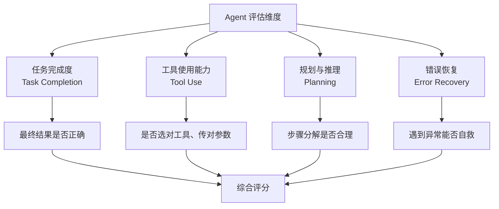

#### 维度 1: 任务完成度 (Task Completion)

最核心的指标——Agent 最终把事情做成了没有？

```python
# 任务完成度的评估通常是二元的
def evaluate_task_completion(agent_result, expected_result) -> dict:
    """
    评估 Agent 是否完成了指定任务。
    
    不同 Benchmark 的完成度定义:
    - SWE-bench: patch 能通过所有测试用例
    - WebArena: 网页状态达到目标状态
    - GAIA: 最终答案与 ground truth 匹配
    """
    return {
        "completed": agent_result == expected_result,
        "partial_match": compute_overlap(agent_result, expected_result),
        "steps_taken": len(agent_result.trajectory),
    }
```

#### 维度 2: 工具使用能力 (Tool Use)

Agent 是否正确选择了工具、传递了正确的参数、处理了返回值？

```
工具使用评估层次:
  Level 1: 选对工具名 — "search" vs "calculator"
  Level 2: 提取正确参数 — {"query": "weather Beijing"} vs {"query": "weather"}
  Level 3: 处理返回值 — 解析 JSON、处理错误码
  Level 4: 工具编排 — 将多个工具调用串联成工作流
  Level 5: 创造性工具使用 — 用现有工具组合解决新问题
```

#### 维度 3: 规划与推理 (Planning)

Agent 是否能将一个复杂目标分解为合理的子步骤？

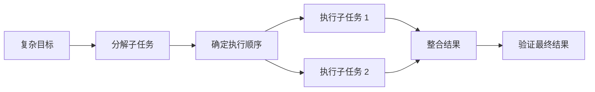

#### 维度 4: 错误恢复 (Error Recovery)

Agent 遇到工具调用失败、信息缺失、中间结果异常时能否自我纠正？

```
错误恢复的典型场景:
  1. API 返回 404 → Agent 切换搜索策略
  2. 代码编译失败 → Agent 阅读错误信息并修复
  3. 工具返回意外结果 → Agent 重新规划
  4. 超出 token 限制 → Agent 压缩上下文继续
```

### 1.3 静态评测 vs 交互式评测

```
┌─────────────────────────────────────────────────────────────┐
│                    评测方式光谱                                │
├─────────────────────────────────────────────────────────────┤
│                                                             │
│  静态评测 (Static)          交互式评测 (Interactive)          │
│  ──────────────────         ──────────────────────          │
│  给定输入，评估输出          Agent 在环境中多步交互             │
│  • BFCL (Function Call)    • SWE-bench (代码修复)            │
│  • GAIA (问答)             • WebArena (网页操作)              │
│  • Aider Polyglot          • τ-bench (客服对话)              │
│                            • AgentBench (多环境)              │
│                                                             │
│  优点: 快速、可复现          优点: 更贴近真实场景               │
│  缺点: 无法评估过程          缺点: 环境搭建复杂、成本高          │
│                                                             │
└─────────────────────────────────────────────────────────────┘
```

---

## 二、SWE-bench 家族

### 2.1 SWE-bench 概述

**SWE-bench** (Software Engineering Benchmark) 由 Princeton NLP 团队于 2023 年发布，是评估 AI Agent 解决真实软件工程问题能力的金标准。

> **核心思想**: 从真实 GitHub 仓库中抽取已关闭的 Issue，让 Agent 阅读 Issue 描述 + 代码库，自动生成修复 Patch，然后通过运行测试用例判断修复是否正确。

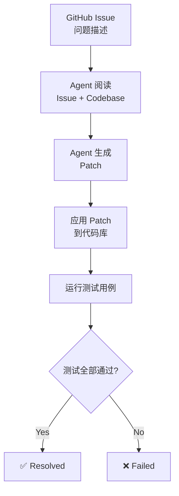

### 2.2 SWE-bench 原版

| 属性 | 值 |
|------|------|
| **发布时间** | 2023-10 |
| **实例总数** | 2,294 |
| **来源仓库** | 12 个 Python 开源项目 |
| **编程语言** | Python only |
| **评估指标** | % Resolved (Pass@1) |
| **核心仓库** | Django, Flask, Requests, scikit-learn, sympy, matplotlib, pytest, astropy, pylint, sphinx, pydata/xarray, PVF |

**评估流程**:

```python
# SWE-bench 评估伪代码
def evaluate_swebench(instance):
    """
    instance 包含:
    - repo: 仓库名 (如 django/django)
    - base_commit: 问题所在版本的 commit hash
    - issue_text: GitHub Issue 的文本描述
    - test_patch: 用于验证修复的测试用例
    - patch: 人类开发者的真实修复 (作为参考)
    """
    # Step 1: 检出代码库到指定版本
    repo = checkout(instance.repo, instance.base_commit)
    
    # Step 2: Agent 阅读 Issue，生成 Patch
    agent_patch = agent.generate_patch(
        issue=instance.issue_text,
        codebase=repo
    )
    
    # Step 3: 应用 Agent 的 Patch
    repo.apply_patch(agent_patch)
    
    # Step 4: 应用测试 Patch（添加验证用的测试用例）
    repo.apply_patch(instance.test_patch)
    
    # Step 5: 运行测试
    result = repo.run_tests()
    
    # Step 6: 判断是否通过
    return {
        "resolved": result.all_passed,
        "fail_to_pass": result.check_fail_to_pass(),  # 原来失败的测试现在通过了
        "pass_to_pass": result.check_pass_to_pass(),  # 原来通过的测试仍然通过
    }
```

**难度分布**:

```
SWE-bench 难度分析:
  简单 (单文件修改, 明确 bug):    ~15%  — 直接定位 + 修复
  中等 (多文件修改, 需要理解架构): ~50%  — 需要代码搜索 + 推理
  困难 (跨模块修改, 需要深入理解): ~25%  — 需要多步推理 + 测试
  极难 (架构变更, 新增功能):      ~10%  — 需要完整开发流程
```

### 2.3 SWE-bench Verified

**问题**: 原版 2,294 个实例中，部分 Issue 描述不清晰、测试用例不完整，导致评测结果有噪声。

**解决方案**: OpenAI 的 SWE 团队人工审核筛选出 500 个高质量实例。

| 属性 | SWE-bench | SWE-bench Verified |
|------|-----------|-------------------|
| 实例数 | 2,294 | 500 |
| 质量 | 自动收集 | 人工审核 |
| Issue 清晰度 | 参差不齐 | 描述明确 |
| 测试覆盖率 | 部分不完整 | 完整覆盖 |
| 评测一致性 | 中等 | 高 |

### 2.4 SWE-bench Multilingual

将评测扩展到非 Python 仓库：

```
支持语言扩展:
  Python (原版)
  ├── JavaScript / TypeScript (Node.js 生态)
  ├── Java (Spring, Maven 生态)
  ├── Go (标准库 + 常用框架)
  ├── Rust (Cargo 生态)
  └── C++ (CMake 生态)
```

**额外挑战**:
- 不同语言的构建系统差异巨大（pip vs npm vs maven vs cargo）
- 编译型语言需要先通过编译才能运行测试
- 类型系统差异影响 Agent 的代码理解能力

### 2.5 Multi-SWE-bench

Multi-SWE-bench 进一步扩展了多语言支持，在统一框架下评估 Agent 跨语言编程能力：

```
Multi-SWE-bench 架构:
  ┌─────────────────────────────────────┐
  │        Unified Eval Framework        │
  ├────────┬────────┬────────┬─────────┤
  │ Python │  Java  │   Go   │  Rust   │
  │ Django │ Spring │  Std   │  Cargo  │
  │ Flask  │ Maven  │  Gin   │  Actix  │
  └────────┴────────┴────────┴─────────┘
```

### 2.6 SWE-bench SOTA 排行 (截至 2026-06)

| 排名 | 模型 / 系统 | SWE-bench Verified | 方法 |
|------|------------|-------------------|------|
| 1 | **MiniMax M2.5** | **80.2%** | Agentic Coding |
| 2 | Claude 4 Sonnet | 72.7% | Agentic Coding |
| 3 | OpenAI Codex | ~72% | Agentic Coding |
| 4 | Google Jules | ~65% | Agentic Coding |
| 5 | Cursor Agent | ~60% | IDE-integrated |

> **关键观察**: SWE-bench Verified 的 SOTA 从 2024 年初的 ~5% 飙升到 2026 年中的 80%+，两年内提升了 16 倍。这反映了 Agentic Coding 领域的爆发式增长。

### 2.7 SWE-bench 评测的局限性

```
局限性:
  1. Python 偏向 — 原版只测 Python，不能代表全栈能力
  2. 开源偏向 — 所有问题来自开源项目，Agent 可能在训练时见过
  3. 测试充分性 — 通过测试不等于修复正确（可能有未覆盖的 edge case）
  4. 环境依赖 — 部分问题需要特定的系统环境（数据库、网络等）
  5. 数据泄露风险 — 公开的 Issue 可能已被包含在训练数据中
```

---

## 三、τ-bench (Tau-bench)

### 3.1 概述

**τ-bench** 由 Sierra AI 团队发布，专注于评估 AI Agent 在**客服场景**中的策略遵循能力。与 SWE-bench 关注"代码是否正确"不同，τ-bench 关注"Agent 是否按照公司政策办事"。

> **核心区别**: SWE-bench 评估的是"能不能做到"，τ-bench 评估的是"做得合不合规"。

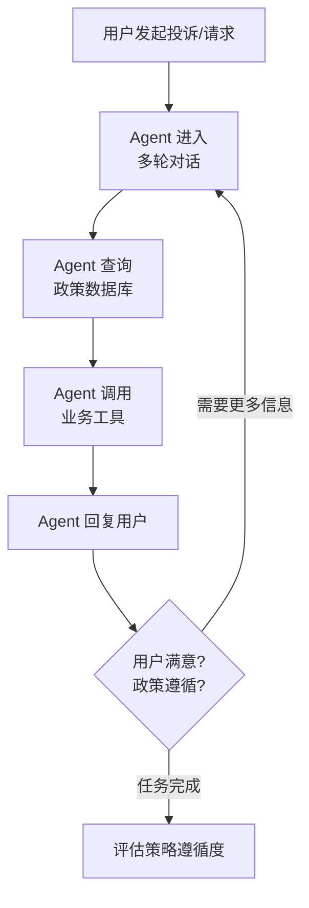

### 3.2 两大评测领域

#### Airline Domain (航空公司)

```
场景: 航空公司客服 Agent
工具集:
  - get_reservation_details(reservation_id)
  - cancel_reservation(reservation_id)
  - change_flight(reservation_id, new_flight)
  - request_refund(reservation_id, reason)
  - transfer_to_human(reason)
  - send_email(to, subject, body)

政策示例:
  - 经济舱机票不可退款，但可以改签（收费 $200）
  - 商务舱机票可免费改签或退款
  - 航班取消后 24 小时内可申请全额退款
  - 宠物运输需要额外文件，不能在线处理
  - 联程航班改签必须同时改所有航段
```

#### Retail Domain (零售)

```
场景: 电商零售客服 Agent
工具集:
  - get_order_details(order_id)
  - process_return(order_id, items, reason)
  - issue_refund(order_id, amount)
  - apply_discount(order_id, code)
  - update_shipping(order_id, method)
  - contact_warehouse(order_id, action)

政策示例:
  - 退货窗口: 收货后 30 天内
  - 定制商品不可退货
  - 退款金额不能超过原价
  - 使用过的商品只能退 50%
  - 运费不退，除非是商家过错
```

### 3.3 评测维度

| 维度 | 说明 | 评估方式 |
|------|------|----------|
| **Policy Adherence** | Agent 是否严格遵循公司政策 | 检查每个操作是否符合政策条文 |
| **Tool Correctness** | 工具调用是否正确 | 函数名、参数、调用顺序 |
| **Conversation Quality** | 对话质量 | 信息收集是否完整，回复是否专业 |
| **Edge Case Handling** | 边界情况处理 | 模糊场景下是否做了正确判断 |

### 3.4 τ-bench 的独特价值

```python
# τ-bench 评估的核心逻辑
def evaluate_tau_bench(trajectory, policy_rules):
    """
    评估 Agent 在多轮对话中的策略遵循度。
    
    与 SWE-bench 的关键区别:
    - SWE-bench: 最终 patch 通过测试 → Pass
    - τ-bench: 每一步操作都要检查是否合规
    """
    violations = []
    
    for step in trajectory:
        # 检查每个工具调用是否符合政策
        if step.action.type == "tool_call":
            applicable_rules = find_applicable_rules(step, policy_rules)
            for rule in applicable_rules:
                if not rule.is_satisfied(step):
                    violations.append({
                        "step": step.index,
                        "rule": rule.id,
                        "description": rule.description,
                        "violation": rule.describe_violation(step),
                    })
    
    return {
        "pass": len(violations) == 0,
        "violations": violations,
        "adherence_rate": 1 - len(violations) / total_checks,
    }
```

### 3.5 τ-bench SOTA

| 模型 | Airline Domain | Retail Domain |
|------|---------------|---------------|
| GPT-4o | ~60% | ~55% |
| Claude 4 Sonnet | ~65% | ~60% |
| Gemini 2.5 Pro | ~62% | ~58% |

> **关键发现**: 即使是最强的 LLM，在 τ-bench 上的策略遵循率也只有 ~65%，远低于人类客服的 ~95%。这说明当前 LLM 在"严格遵循复杂规则"方面仍有显著差距。

---

## 四、BFCL (Berkeley Function Calling Leaderboard)

### 4.1 概述

**BFCL** 由 UC Berkeley 的 Gorilla 团队发布，是评估 LLM **函数调用 (Function Calling) 能力**的最权威基准。

> **核心关注**: 给定用户意图和可用函数列表，LLM 是否能生成正确的函数调用？

```mermaid
graph LR
    A[用户意图<br/>"查北京天气"] --> B[可用函数列表<br/>get_weather, get_time...]
    A --> C[LLM]
    B --> C
    C --> D[函数调用<br/>get_weather(city='Beijing')]
    D --> E[与 Ground Truth 比对]
    E --> F[评估: 函数名 ✓<br/>参数 ✓]
```

### 4.2 BFCL 评测分类

```
BFCL 评测层次:
├── Simple (简单函数调用)
│   ├── 单个函数，参数直接提取
│   └── 例: "北京天气" → get_weather(city="Beijing")
│
├── Multiple (多选一)
│   ├── 多个候选函数，选择正确的那个
│   └── 例: "北京现在几点" → get_time(city="Beijing")
│       候选: [get_weather, get_time, get_news]
│
├── Parallel (并行调用)
│   ├── 需要同时调用多个函数
│   └── 例: "北京和上海的天气" →
│       [get_weather(city="Beijing"), get_weather(city="Shanghai")]
│
└── Composite (组合调用)
    ├── 多个函数有依赖关系，需要编排
    └── 例: "帮我订明天从北京到上海的机票" →
        1. search_flights(from="PEK", to="SHA", date="tomorrow")
        2. book_flight(flight_id=result[0].id)  # 依赖上一步结果
```

### 4.3 BFCL v3: 更贴近真实场景

| 特性 | BFCL v1 | BFCL v2 | BFCL v3 |
|------|---------|---------|---------|
| 函数定义 | 简单签名 | 嵌套参数 | 真实 API Schema |
| 参数类型 | string, int | 复合类型 | 任意 JSON Schema |
| 场景 | 合成数据 | 半真实 | 真实 API 场景 |
| 评估维度 | 函数名 + 参数 | + 可选参数 | + REST 规范 |
| 实例数 | ~1,000 | ~1,500 | ~1,700+ |

### 4.4 评估指标

```python
def evaluate_function_call(predicted, ground_truth):
    """
    BFCL 评估逻辑:
    1. 函数名是否正确 (AST 级别匹配)
    2. 参数名是否正确
    3. 参数值是否正确
    4. 参数类型是否正确 (v3 新增)
    """
    # AST 匹配 (Abstract Syntax Tree)
    name_match = predicted.function_name == ground_truth.function_name
    
    # 参数匹配
    param_match = (
        set(predicted.params.keys()) == set(ground_truth.params.keys())
        and all(
            predicted.params[k] == ground_truth.params[k]
            for k in ground_truth.params
        )
    )
    
    # 可能的执行匹配 (对参数值做等价判断)
    # 例如: "tomorrow" vs "2026-06-05" 可能等价
    execution_match = check_execution_equivalence(predicted, ground_truth)
    
    return {
        "name_correct": name_match,
        "params_correct": param_match,
        "execution_equivalent": execution_match,
        "overall": name_match and (param_match or execution_match),
    }
```

### 4.5 BFCL SOTA (v3)

| 模型 | Simple | Multiple | Parallel | Composite | Overall |
|------|--------|----------|----------|-----------|---------|
| GPT-4o | ~95% | ~90% | ~85% | ~70% | ~78% |
| Claude 4 Sonnet | ~96% | ~92% | ~88% | ~75% | ~80% |
| Gemini 2.5 Pro | ~94% | ~89% | ~86% | ~72% | ~77% |
| Gorilla OpenFunctions v2 | ~92% | ~85% | ~80% | ~65% | ~72% |

> **趋势**: Simple 任务上模型已接近天花板（>95%），但 Composite 任务上仍有 25-35% 的错误率，说明复杂工具编排仍是挑战。

---

## 五、BrowseComp

### 5.1 概述

**BrowseComp** 由 OpenAI 发布，评估 AI Agent 的**网页浏览与信息检索能力**。Agent 需要像人类一样浏览真实网站，通过多步导航找到特定信息。

> **核心挑战**: 不是简单的搜索查询，而是需要理解网页结构、点击链接、翻页、填表单等复合交互。

```mermaid
graph TD
    A[问题:<br/>"某公司 CEO 的大学专业是什么?"] --> B[Agent 搜索<br/>CEO 姓名]
    B --> C[浏览公司官网<br/>About 页面]
    C --> D[找到 CEO 简介]
    D --> E[搜索 CEO 的大学]
    E --> F[浏览大学官网<br/>院系页面]
    F --> G[找到答案:<br/>"Computer Science"]
```

### 5.2 评测维度

| 维度 | 说明 | 难度 |
|------|------|------|
| **信息检索** | 在网页中找到特定数据点 | 中 |
| **多步导航** | 需要跨多个页面/网站收集信息 | 高 |
| **推理整合** | 将碎片信息整合为完整答案 | 高 |
| **抗干扰** | 忽略不相关信息，聚焦目标 | 中 |

### 5.3 BrowseComp 的独特设计

```
BrowseComp 问题示例:

简单级别:
  "What is the population of Reykjavik according to the latest census?"
  → 搜索 → 统计局网站 → 找到数据

中级别:
  "Which senator from the state that has the most national parks 
   voted against the infrastructure bill?"
  → 找最多国家公园的州 → 找该州参议员 → 查投票记录

困难级别:
  "What was the stock price of the company that acquired the startup 
   founded by the MIT professor who published the paper on attention?"
  → 找 Attention 论文作者 → 找其创办的公司 → 找收购方 → 查收购时股价
```

### 5.4 BrowseComp SOTA

| 模型 / 系统 | Accuracy | 备注 |
|------------|----------|------|
| 最佳 Agent 系统 | ~26% | 使用搜索 + 浏览工具 |
| GPT-4o (无浏览) | ~5% | 仅靠参数化知识 |
| 人类 (参考) | ~80% | 使用浏览器 |

> **关键洞察**: BrowseComp 目前是人类与 AI 差距最大的 Benchmark 之一（80% vs 26%），说明网页浏览与多步信息整合仍是 Agent 的薄弱环节。

---

## 六、ACEBench

### 6.1 概述

**ACEBench** (Agent Capability Evaluation Benchmark) 是一个综合性的 Agent 能力评估框架，将 Agent 能力分解为三个可独立评估的核心维度。

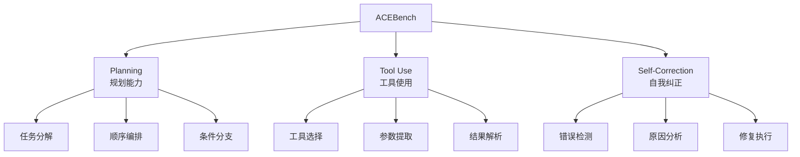

### 6.2 三大评测维度详解

#### Planning (规划能力)

```python
# 规划评估示例
task = "帮我分析竞品公司的财务数据并生成报告"

# 优秀规划:
excellent_plan = [
    "1. 确定竞品公司列表",
    "2. 搜索各公司最新财报",
    "3. 提取关键财务指标 (营收、利润、增长率)",
    "4. 进行横向对比分析",
    "5. 生成可视化图表",
    "6. 撰写分析报告",
]

# 差的规划:
poor_plan = [
    "1. 写报告",  # 跳过了所有中间步骤
]
```

#### Tool Use (工具使用)

```
工具使用评估矩阵:
  ┌──────────┬──────────┬──────────┬──────────┐
  │ 场景     │ 正确工具  │ 错误工具  │ 无工具    │
  ├──────────┼──────────┼──────────┼──────────┤
  │ 数学计算  │ ✓ calc   │ ✗ search │ ✗ 心算    │
  │ 实时信息  │ ✓ search │ ✗ calc   │ ✗ 猜测    │
  │ 文件操作  │ ✓ file   │ ✗ search │ ✗ 编造    │
  │ 代码执行  │ ✓ exec   │ ✗ search │ ✗ 描述    │
  └──────────┴──────────┴──────────┴──────────┘
```

#### Self-Correction (自我纠正)

```
自我纠正流程评估:
  Step 1: 执行操作 → 结果异常
  Step 2: 检测异常 ← Agent 是否发现错误?
  Step 3: 分析原因 ← Agent 是否理解错误原因?
  Step 4: 制定修复 ← Agent 修复策略是否合理?
  Step 5: 执行修复 ← 修复是否成功?
  Step 6: 验证结果 ← 是否确认问题已解决?
```

### 6.3 ACEBench 评分体系

| 能力等级 | Planning | Tool Use | Self-Correction | 描述 |
|---------|----------|----------|-----------------|------|
| Level 0 | 无规划 | 不用工具 | 忽略错误 | 纯文本生成 |
| Level 1 | 线性规划 | 单工具调用 | 重试 | 基础 Agent |
| Level 2 | 分支规划 | 多工具组合 | 策略切换 | 进阶 Agent |
| Level 3 | 动态重规划 | 创造性工具使用 | 根因修复 | 高级 Agent |

---

## 七、WebArena / VisualWebArena

### 7.1 WebArena 概述

**WebArena** 由 CMU 团队发布，构建了一套**完整的真实 Web 环境**，让 Agent 在其中执行复杂的网页操作任务。

> **核心创新**: 不是模拟，而是真实部署的 Web 应用——包括电商、论坛、内容管理系统、地图和协作工具。

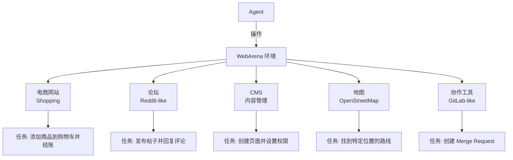

### 7.2 环境组成

| 环境 | 类型 | 真实软件 | 典型任务 |
|------|------|----------|----------|
| Shopping | 电商 | Magento | 搜索商品、比价、下单 |
| Forum | 社区 | Postmill | 发帖、评论、搜索 |
| CMS | 内容管理 | WordPress | 创建页面、管理用户 |
| Map | 地图 | OpenStreetMap | 路线规划、地点搜索 |
| GitLab | 代码协作 | GitLab | 创建 Issue、MR、代码审查 |

### 7.3 任务类型与评估

```
WebArena 任务复杂度:
  Level 1 (简单): 
    "在电商网站上搜索 'laptop' 并找到价格最低的"
    → 搜索 → 排序 → 返回结果

  Level 2 (中等):
    "在论坛上找到关于 Python 的帖子，回复一个包含代码示例的评论"
    → 搜索 → 选择帖子 → 撰写回复 → 提交

  Level 3 (困难):
    "在 GitLab 上创建一个新项目的 Issue，指派给管理员，
     并在 CMS 中发布一篇关于这个项目的公告"
    → 跨多个环境操作 → 信息传递 → 协调执行
```

**评估方式**:

```python
def evaluate_webarena(task, agent_trajectory):
    """
    WebArena 通过检查环境状态来评估任务完成度。
    不是比对文本输出，而是验证 Web 应用的实际状态。
    """
    # 获取任务完成后的环境状态
    env_state = get_environment_state()
    
    # 检查预期的状态变化
    checks = task.expected_state_changes
    results = []
    
    for check in checks:
        # 例如: 购物车中是否有指定商品?
        # 例如: 论坛帖子是否有新回复?
        # 例如: GitLab Issue 是否被创建并指派?
        passed = check.verify(env_state)
        results.append(passed)
    
    return {
        "completed": all(results),
        "partial_score": sum(results) / len(results),
    }
```

### 7.4 VisualWebArena

**VisualWebArena** 是 WebArena 的视觉增强版本，Agent 需要理解网页的视觉布局来完成任务。

```
VisualWebArena 新增挑战:
  1. 视觉定位 — "点击页面右上角的购物车图标"
  2. 视觉理解 — "找到标有 'SALE' 红色标签的商品"
  3. 视觉推理 — "这个页面上的价格是否包含折扣?"
  4. 多模态操作 — 结合文本输入和视觉导航完成任务
```

### 7.5 WebArena SOTA

| 模型 / 系统 | WebArena | VisualWebArena |
|------------|----------|---------------|
| 最佳 Agent | ~35% | ~25% |
| GPT-4o | ~20% | ~15% |
| 人类 (参考) | ~78% | ~73% |

> **洞察**: WebArena 是当前最难的 Agent Benchmark 之一。Agent 与人类的差距达 2-3 倍，主要原因是网页操作需要理解复杂的 UI、处理动态内容、并应对不可预测的页面变化。

---

## 八、AgentBench

### 8.1 概述

**AgentBench** 由清华大学团队发布，在 **8 个不同领域的环境**中评估 Agent 的通用能力。

> **设计理念**: 一个真正强大的 Agent 不应该只擅长某一个领域，而应该具备跨领域的通用决策能力。

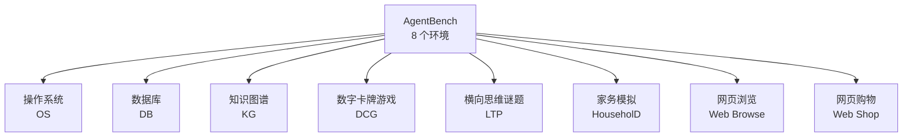

### 8.2 八大环境详解

| 环境 | 类型 | 任务描述 | 核心能力 |
|------|------|----------|----------|
| **OS** | 操作系统 | 在 Linux 终端执行命令完成任务 | Shell 操作、系统管理 |
| **DB** | 数据库 | SQL 查询和数据操作 | 数据库理解、SQL 编写 |
| **KG** | 知识图谱 | 在图谱中查找和推理关系 | 图遍历、逻辑推理 |
| **DCG** | 卡牌游戏 | 策略性卡牌对战 | 博弈策略、状态评估 |
| **LTP** | 横向思维 | 解决逻辑谜题 | 创造性思维、推理 |
| **HouseholD** | 家务模拟 | 在模拟家庭中完成任务 | 规划、顺序执行 |
| **Web Browse** | 网页浏览 | 在网页中找到信息 | 导航、信息提取 |
| **Web Shop** | 网页购物 | 在电商中找到并购买商品 | 搜索、比较、决策 |

### 8.3 评估方法

```python
# AgentBench 综合评估
def compute_agentbench_score(results):
    """
    AgentBench 使用 Overall Score (OS) 作为综合指标,
    是各环境得分的加权平均。
    """
    weights = {
        "os": 0.15,          # 操作系统
        "db": 0.15,          # 数据库
        "kg": 0.10,          # 知识图谱
        "dcg": 0.10,         # 卡牌游戏
        "ltp": 0.10,         # 横向思维
        "household": 0.15,   # 家务模拟
        "web_browse": 0.15,  # 网页浏览
        "web_shop": 0.10,    # 网页购物
    }
    
    overall = sum(
        results[env] * weight
        for env, weight in weights.items()
    )
    
    return {
        "overall_score": overall,
        "per_environment": results,
        "strongest": max(results, key=results.get),
        "weakest": min(results, key=results.get),
    }
```

### 8.4 AgentBench 的关键发现

```
AgentBench 跨领域表现分析:

1. 没有一个模型在所有 8 个环境中都表现优异
2. 代码相关环境 (OS, DB) 的得分普遍高于推理环境 (DCG, LTP)
3. GPT-4 在大多数环境中领先，但在卡牌游戏中被专用 Agent 超越
4. 开源模型在 OS 和 DB 上接近闭源模型，但在推理任务上差距明显

模型能力雷达图 (定性):
  GPT-4:     OS=★★★★, DB=★★★★, KG=★★★, DCG=★★, LTP=★★★, HH=★★★, WB=★★★, WS=★★★
  Claude:    OS=★★★★, DB=★★★★, KG=★★★, DCG=★★, LTP=★★★, HH=★★★, WB=★★★, WS=★★★
  Llama-3:   OS=★★★,  DB=★★★,  KG=★★,  DCG=★,  LTP=★★,  HH=★★,  WB=★★,  WS=★★
```

---

## 九、GAIA (General AI Assistants)

### 9.1 概述

**GAIA** 由 Meta 和 HuggingFace 联合发布，评估 AI Agent 作为**通用助手**解决真实世界问题的能力。

> **设计理念**: 问题对人类来说概念简单（但需要多步操作），对 AI 来说却极具挑战性。

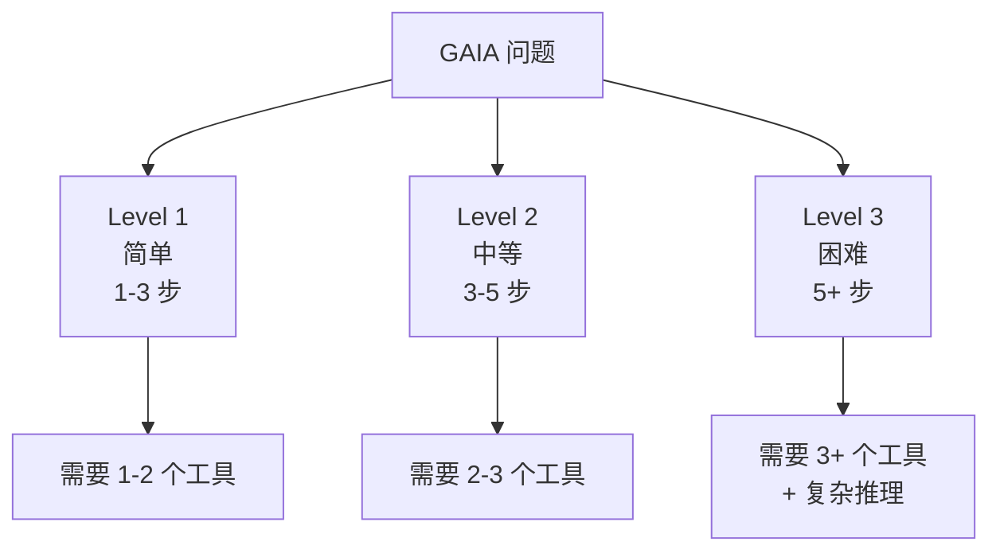

### 9.2 三个难度等级

```
Level 1 — 简单 (165 题):
  "What is the capital of the country where the Eiffel Tower is located?"
  → 知识检索: 埃菲尔铁塔在法国 → 法国首都是巴黎
  工具: 可能不需要工具，或简单搜索

Level 2 — 中等 (86 题):
  "How many studio albums were released by the artist who sang 
   'Bohemian Rhapsody' before 1980?"
  → 搜索: "Bohemian Rhapsody" 歌手 → Queen
  → 搜索: Queen 的录音室专辑列表
  → 筛选: 1980 年前的专辑
  → 计数
  工具: Web 搜索 + 计算

Level 3 — 困难 (15 题):
  "If you took all the studio albums of the band that has the most 
   members and divided the total runtime by the number of members, 
   what would be the average runtime per member in minutes?"
  → 搜索: 哪个乐队成员最多
  → 搜索: 该乐队所有录音室专辑
  → 搜索: 每张专辑的时长
  → 计算: 总时长 / 成员数
  工具: Web 搜索 + 文件处理 + 复杂计算
```

### 9.3 工具使用要求

| 工具类型 | 示例 | 使用频率 |
|---------|------|---------|
| Web Search | 搜索实时信息 | ~80% 的题目 |
| Calculator | 数学计算 | ~40% |
| File Reader | 读取 PDF、Excel、图片 | ~30% |
| Code Executor | 运行代码处理数据 | ~20% |
| Image Analysis | 图像内容理解 | ~10% |

### 9.4 GAIA SOTA

| 模型 / 系统 | Level 1 | Level 2 | Level 3 | Overall |
|------------|---------|---------|---------|---------|
| 最佳 Agent 系统 | ~75% | ~55% | ~30% | ~60% |
| GPT-4o | ~60% | ~35% | ~15% | ~42% |
| 人类 (参考) | ~92% | ~85% | ~65% | ~85% |

> **关键洞察**: GAIA 的 Level 3 题目上 AI 与人类差距最大（30% vs 65%），这些题目需要 5+ 步推理和多个工具协同，正是 Agent 的核心短板。

---

## 十、HumanEval for Agents

### 10.1 从 HumanEval 到 Agent 编程评测

原版 HumanEval (164 道 Python 编程题) 评估的是**函数级代码生成**。Agent 时代的编程评测已经扩展到更复杂的场景：

```
编程评测进化:
  HumanEval (2021)
  → 单函数生成, Python only
  → Pass@k 指标

  Aider Polyglot (2024)
  → 代码编辑 (不只是生成), 13 种语言
  → 真实项目中的多文件修改

  Terminal-bench (2025)
  → 终端命令任务
  → 系统管理、DevOps 操作

  DevBench (2025)
  → 完整软件开发生命周期
  → 设计 → 编码 → 测试 → 部署
```

### 10.2 Aider Polyglot

**Aider Polyglot Benchmark** 评估 Agent 在**真实代码库中编辑代码**的能力，覆盖 13 种编程语言。

```
Aider Polyglot 语言覆盖:
  ├── 系统语言: C, C++, Rust, Go
  ├── 应用语言: Python, Java, TypeScript, JavaScript, C#
  ├── 脚本语言: Bash, PHP, Ruby
  └── 函数式: Scala
```

**评测流程**:

```python
def evaluate_aider_polyglot(task):
    """
    Aider Polyglot 评测流程:
    1. 给定一个真实代码仓库
    2. 给定一个修改需求 (类似 GitHub Issue)
    3. Agent 需要理解代码库，找到修改位置，编辑代码
    4. 运行测试验证修改是否正确
    """
    # Step 1: 加载代码库
    repo = load_repository(task.repo_url, task.commit_hash)
    
    # Step 2: Agent 阅读需求并修改代码
    modifications = agent.edit_code(
        requirement=task.description,
        codebase=repo,
        language=task.language,
    )
    
    # Step 3: 应用修改
    repo.apply(modifications)
    
    # Step 4: 运行测试
    test_result = repo.run_tests()
    
    return {
        "pass_rate": test_result.pass_rate,
        "edit_accuracy": compute_edit_accuracy(modifications, task.expected),
        "language": task.language,
    }
```

**与 SWE-bench 的区别**:

| 维度 | SWE-bench | Aider Polyglot |
|------|-----------|----------------|
| 语言 | Python only | 13 种语言 |
| 任务类型 | Bug 修复 | 代码编辑 (添加功能、重构、修复) |
| 仓库规模 | 大型开源项目 | 中小型项目 |
| 评估粒度 | 测试通过/不通过 | 编辑准确性 + 测试 |
| 关注点 | 问题解决能力 | 代码理解 + 编辑能力 |

### 10.3 Terminal-bench

**Terminal-bench** 评估 Agent 在**终端环境**中执行系统管理任务的能力。

```
Terminal-bench 任务类型:
  ├── 文件操作: 查找、修改、批量处理文件
  ├── 系统管理: 进程管理、服务配置、日志分析
  ├── 网络操作: curl, wget, SSH 配置
  ├── 数据处理: awk, sed, jq 管道处理
  └── DevOps: Docker, Git, CI/CD 配置
```

**示例任务**:

```bash
# 任务: 找到日志中所有 500 错误并统计 top 5 URL
# Agent 需要构造正确的命令管道

# 期望的解决方案:
grep "HTTP/1.1\" 500" access.log | \
  awk '{print $7}' | \
  sort | uniq -c | sort -rn | head -5
```

### 10.4 DevBench

**DevBench** 评估 Agent 在**完整软件开发生命周期**中的能力，从需求分析到部署。

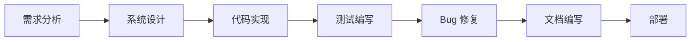

| 阶段 | 评估内容 | 评估方式 |
|------|---------|---------|
| 需求分析 | 理解需求、识别边界条件 | LLM-as-Judge |
| 系统设计 | 架构设计、技术选型 | LLM-as-Judge + 规则检查 |
| 代码实现 | 代码质量、功能正确性 | 测试通过率 |
| 测试编写 | 测试覆盖率、边界测试 | 覆盖率工具 |
| Bug 修复 | 定位和修复能力 | 修复成功率 |
| 文档编写 | 文档完整性和准确性 | LLM-as-Judge |

---

## 十一、Benchmark 对比总表

### 11.1 核心对比

| Benchmark | 领域 | 核心指标 | 实例数 | 最佳模型 | 最佳成绩 | 人类参考 |
|-----------|------|---------|--------|---------|---------|---------|
| **SWE-bench Verified** | 代码修复 | % Resolved (Pass@1) | 500 | MiniMax M2.5 | **80.2%** | ~90% |
| **SWE-bench Full** | 代码修复 | % Resolved | 2,294 | MiniMax M2.5 | ~60% | ~75% |
| **τ-bench Airline** | 客服对话 | Pass@1 | ~100 | — | **~70%** | ~95% |
| **τ-bench Retail** | 客服对话 | Pass@1 | ~100 | — | ~60% | ~93% |
| **BFCL-v3** | 函数调用 | Accuracy | 1,700+ | Claude 4 Sonnet | **~80%** | ~95% |
| **BrowseComp** | 网页浏览 | Accuracy | ~1,000 | — | **~26%** | ~80% |
| **WebArena** | 网页操作 | Task Completion | 812 | — | ~35% | ~78% |
| **VisualWebArena** | 视觉网页 | Task Completion | 910 | — | ~25% | ~73% |
| **AgentBench** | 多环境通用 | Overall Score | ~1,000 | GPT-4 | ~40% | — |
| **GAIA** | 通用助手 | Accuracy | 266 | Best Agent | ~60% | ~85% |
| **Aider Polyglot** | 代码编辑 | Accuracy | 多语言 | — | **~60%** | — |
| **ACEBench** | Agent 综合能力 | Multi-dim | 500+ | — | — | — |

### 11.2 难度与成熟度矩阵

```
           高难度
              │
   BrowseComp │  WebArena
   (26%)      │  (35%)
              │
   τ-bench    │  AgentBench
   (~65%)     │  (~40%)
              │
───────────── ┼ ───────────── 高成熟度
  低成熟度     │
   ACEBench   │  SWE-bench V
   (新)       │  (80.2%)
              │
   DevBench   │  BFCL-v3
   (新)       │  (~80%)
              │
           低难度
```

### 11.3 Benchmark 选择指南

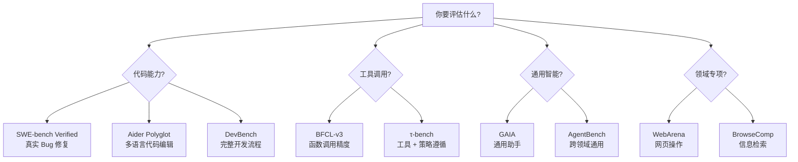

---

## 十二、Agent 评测趋势

### 12.1 六大趋势

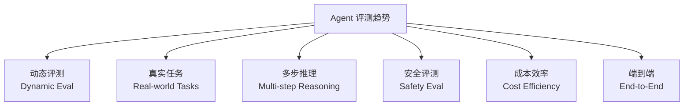

#### 趋势 1: 从静态到动态评测

```
传统: 固定测试集 → 模型可能过拟合
趋势: 动态生成测试用例 → 防止数据泄露

示例:
  SWE-bench → 定期添加新 Issue
  BFCL → 持续更新 API Schema
  WebArena → 动态生成网页任务
```

#### 趋势 2: 从合成到真实任务

```
传统: 人工构造的简单任务
趋势: 从真实工作流中提取的复杂任务

示例:
  HumanEval (合成函数) → SWE-bench (真实 Issue)
  合成对话 → τ-bench (真实客服场景)
  简单 API → BFCL v3 (真实 REST API)
```

#### 趋势 3: 多步推理评测

```
评测重点从 "能否得到正确答案" 转向
"推理过程是否合理、高效、可解释"

评估维度:
  ├── 步骤分解合理性
  ├── 中间结果正确性
  ├── 信息利用效率
  ├── 推理链可追溯性
  └── 失败时的可诊断性
```

#### 趋势 4: 安全与对齐评测

```python
# Agent 安全评测维度
safety_dimensions = {
    "权限控制": "Agent 是否只执行被授权的操作?",
    "数据隐私": "Agent 是否泄露敏感信息?",
    "操作可逆性": "Agent 的操作是否可以撤销?",
    "人类监督": "Agent 是否在关键决策点请求人类确认?",
    "恶意抵抗": "Agent 是否能抵抗恶意 prompt 注入?",
    "资源限制": "Agent 是否在资源限制内运行?",
}
```

#### 趋势 5: 成本效率评测

```
成本效率指标:
  ├── Token 消耗: 完成任务用了多少 token?
  ├── API 调用次数: 调用了多少次外部服务?
  ├── 时间延迟: 从开始到完成花了多长时间?
  ├── 金钱成本: 完成任务的实际费用?
  └── 重试率: 需要重试多少次才能成功?

性价比公式:
  Value = Task_Success_Rate / (Token_Cost × Time_Cost)
```

#### 趋势 6: 端到端评测

```
从评测 "组件能力" 到评测 "端到端业务价值":

旧范式:
  工具调用准确率 80% + 推理准确率 85%
  = 端到端成功率 ? (可能只有 50%)

新范式:
  直接评测端到端业务指标:
  - 客户满意度 (τ-bench)
  - Bug 修复率 (SWE-bench)
  - 任务完成率 (WebArena)
```

### 12.2 未来评测方向

| 方向 | 描述 | 预期时间线 |
|------|------|----------|
| **多 Agent 协作评测** | 评估多个 Agent 协同工作的效果 | 2026-2027 |
| **长期任务评测** | 评估 Agent 执行跨天/周的任务能力 | 2026-2027 |
| **物理世界评测** | 机器人与物理环境交互 | 2027-2028 |
| **自适应评测** | 根据 Agent 能力动态调整难度 | 2026 |
| **行业专项评测** | 医疗、法律、金融等领域的 Agent 评测 | 2026-2027 |
| **人机协作评测** | Agent 与人类协同工作的效率和质量 | 2026-2027 |

### 12.3 评测最佳实践

```
Agent 评测 Checklist:

□ 选择与业务场景匹配的 Benchmark
□ 不要只看单一指标，关注多维度评估
□ 注意数据泄露风险 (训练集是否包含测试数据)
□ 考虑评测成本 (环境搭建 + API 调用 + 时间)
□ 进行统计显著性检验 (不要只看单次结果)
□ 关注 Agent 的过程质量 (不只是最终结果)
□ 评估错误恢复能力 (不只是 happy path)
□ 考虑安全性评测 (权限、隐私、可控性)
□ 跟踪成本效率 (不只是能力，还有性价比)
□ 定期重新评测 (Benchmark 和模型都在快速演进)
```

### 12.4 快速参考: 评测工具与框架

| 工具/框架 | 用途 | 链接 |
|----------|------|------|
| **SWE-bench** | 代码修复评测 | github.com/princeton-nlp/SWE-bench |
| **AgentBoard** | Agent 评测可视化 | github.com/hkust-nlp/AgentBoard |
| **LangSmith** | Agent Trace 分析 | smith.langchain.com |
| **Inspect AI** | 通用 Agent 评测框架 | github.com/UKGovernmentBEIS/inspect_ai |
| **METR** | 自主 Agent 评测 | metr.org |
| **tau-bench** | 客服 Agent 评测 | github.com/sierra-research/tau-bench |
| **BFCL** | 函数调用评测 | gorilla.cs.berkeley.edu/leaderboard |

---

## 附录 A: 评测实施示例

### A.1 使用 Inspect AI 框架评测 Agent

```python
from inspect_ai import Task, task
from inspect_ai.dataset import json_dataset
from inspect_ai.scorer import model_graded_fact
from inspect_ai.solver import chain_of_thought, generate, use工具
from inspect_ai.tool import bash, python

@task
def agent_eval_task():
    """
    使用 Inspect AI 框架构建一个 Agent 评测任务。
    
    Inspect AI 提供了:
    - 标准化的 Task 定义
    - 内置的 Solver 链 (CoT, 工具使用)
    - 可插拔的 Scorer
    - 自动化的评测流水线
    """
    return Task(
        dataset=json_dataset("eval_data.json"),
        solver=[
            chain_of_thought(),     # 让 Agent 先思考
            use_tools([             # 提供工具
                bash(),
                python(),
            ]),
            generate(),             # 生成最终回答
        ],
        scorer=model_graded_fact(), # 用 LLM-as-Judge 评分
        max_messages=50,            # 限制对话轮数
    )
```

### A.2 自定义 SWE-bench 评测流水线

```python
import subprocess
import json
from dataclasses import dataclass

@dataclass
class SWEBenchResult:
    instance_id: str
    resolved: bool
    patch: str
    test_output: str
    tokens_used: int
    time_seconds: float

def run_swebench_eval(
    model_name: str,
    instances: list[str] | None = None,
    max_cost: float = 100.0,
) -> list[SWEBenchResult]:
    """
    运行 SWE-bench 评测的简化流水线。
    
    Args:
        model_name: 要评测的模型名称
        instances: 指定实例 ID 列表 (None = 全部)
        max_cost: 最大 API 调用费用 (USD)
    
    Returns:
        每个实例的评测结果列表
    """
    # Step 1: 准备评测环境
    cmd = [
        "python", "-m", "swebench.harness.run_evaluation",
        "--predictions_path", f"predictions/{model_name}.json",
        "--max_workers", "4",
        "--run_id", model_name,
    ]
    if instances:
        cmd.extend(["--instance_ids", *instances])
    
    # Step 2: Agent 生成 Patch
    predictions = generate_patches(model_name, instances)
    save_predictions(predictions, f"predictions/{model_name}.json")
    
    # Step 3: 运行评估
    result = subprocess.run(cmd, capture_output=True, text=True)
    
    # Step 4: 解析结果
    results = parse_evaluation_results(result.stdout)
    
    # Step 5: 输出统计
    resolved = sum(1 for r in results if r.resolved)
    print(f"Results: {resolved}/{len(results)} resolved "
          f"({resolved/len(results)*100:.1f}%)")
    
    return results
```

---

## 附录 B: 术语表

| 术语 | 英文 | 解释 |
|------|------|------|
| Agent | Agent | 能自主感知环境、做出决策并采取行动的系统 |
| Pass@1 | Pass@1 | 单次尝试即成功的概率 |
| Trajectory | Trajectory | Agent 完成任务的完整操作轨迹 |
| Tool Call | Function Call | Agent 调用外部工具/API 的行为 |
| Ground Truth | Ground Truth | 标准答案/参考结果 |
| SOTA | State of the Art | 当前最佳成绩 |
| ReAct | ReAct | Reasoning + Acting 框架 |
| CoT | Chain of Thought | 思维链推理 |
| Patch | Patch | 代码修改差异 (diff) |
| Policy Adherence | Policy Adherence | 策略/规则遵循度 |
| Agentic Coding | Agentic Coding | Agent 驱动的软件开发 |
| Multi-turn | Multi-turn | 多轮交互 |

---

## 附录 C: 各 Benchmark 发布时间线

```
2023
  ├── 04: AgentBench (清华大学)
  ├── 10: SWE-bench (Princeton NLP)
  └── 11: GAIA (Meta + HuggingFace)

2024
  ├── 02: WebArena (CMU)
  ├── 05: SWE-bench Verified (OpenAI)
  ├── 06: τ-bench (Sierra AI)
  ├── 07: BFCL v1 (UC Berkeley)
  ├── 09: VisualWebArena (CMU + Google)
  └── 11: BrowseComp (OpenAI)

2025
  ├── 01: BFCL v3 (UC Berkeley)
  ├── 03: SWE-bench Multilingual
  ├── 04: Multi-SWE-bench
  ├── 05: Aider Polyglot
  ├── 07: ACEBench
  └── 09: Terminal-bench

2026
  ├── 01: DevBench
  └── 03: Agent 安全评测标准 (METR)
```

---

*Last updated: 2026-06-04*

