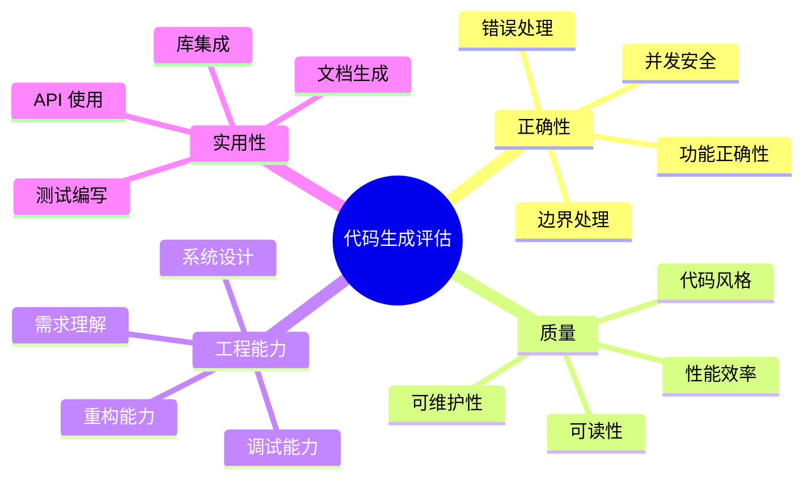

# 代码生成评估

> 中文简称：代码生成评估

> **一句话理解**: 代码生成评估的核心问题是"生成的代码能不能用"——从最简单的"通过测试用例"（pass@k），到"能解决真实 GitHub Issue"（SWE-bench），再到"像工程师一样完成完整开发任务"（Agent 式评估），评估的复杂度在 2024-2026 年经历了质的飞跃。

---

## 目录

- [一、概述](#一概述)
- [二、核心方法论](#二核心方法论)
- [三、函数级基准: HumanEval/MBPP](#三函数级基准-humanevalmbpp)
- [四、仓库级基准: SWE-bench 家族](#四仓库级基准-swe-bench-家族)
- [五、动态基准: LiveCodeBench](#五动态基准-livecodebench)
- [六、pass@k 指标体系](#六passk-指标体系)
- [七、多语言评估](#七多语言评估)
- [八、功能正确性 vs 代码质量](#八功能正确性-vs-代码质量)
- [九、Agent 式代码评估](#九agent-式代码评估)
- [十、对比表](#十对比表)
- [十一、实践指南](#十一实践指南)
- [十二、2026 前沿](#十二2026-前沿)
- [十三、相关概念](#十三相关概念)

---

## 一、概述

### 1.1 代码生成评估的演进

```
2021: 函数级评估
  → HumanEval (164 题), MBPP (974 题)
  → 评估: 给定 docstring，生成函数体
  → 指标: pass@1, pass@10, pass@100

2022-2023: 扩展评估
  → EvalPlus (增强测试用例)
  → MultiPL-E (多语言)
  → DS-1000 (数据科学)
  → 评估: 更严格的正确性验证

2024: 仓库级评估
  → SWE-bench (真实 GitHub Issues)
  → Aider Polyglot (多语言编辑)
  → 评估: 在真实代码库中修复 bug

2025: Agent 式评估
  → SWE-bench Verified
  → OpenHands Benchmark
  → 评估: Agent 自主完成开发任务

2026: 全栈工程评估
  → 端到端项目构建
  → 代码审查能力
  → 系统设计 + 实现
  → 持续集成/部署能力
```

### 1.2 评估维度分类



### 1.3 为什么代码评估是 2026 年最重要的评估领域

1. **产业价值最高**: 代码生成是 LLM 最直接的生产力应用
2. **可验证性强**: 代码可以执行、测试，评估结果客观
3. **难度梯度完整**: 从单函数到完整系统，覆盖所有难度
4. **Agent 能力核心**: 代码能力是 AI Agent 的基础能力
5. **快速迭代**: 新基准不断涌现，评估方法持续进化

---

## 二、核心方法论

### 2.1 评估方法分类

| 方法 | 原理 | 优点 | 缺点 | 适用场景 |
|------|------|------|------|----------|
| 测试用例执行 | 运行预定义测试 | 客观、可重复 | 测试覆盖有限 | 函数级评估 |
| 精确匹配 | 与参考代码比较 | 简单 | 过于严格 | 不推荐 |
| 语义等价 | 判断功能是否等价 | 灵活 | 判断困难 | 多解问题 |
| 静态分析 | 代码质量检查 | 无需执行 | 不验证功能 | 质量评估 |
| 人工审查 | 人类程序员评判 | 最全面 | 成本高 | 最终验证 |
| LLM 审查 | AI 评判代码质量 | 可扩展 | 有偏差 | 大规模初筛 |

### 2.2 评估流水线

```python
class CodeEvalPipeline:
    """代码生成评估流水线"""
    
    def __init__(self, sandbox_config: dict):
        self.sandbox = CodeSandbox(sandbox_config)
        self.timeout = 30  # 秒
    
    def evaluate(self, problem: dict, generated_code: str) -> dict:
        """评估单个代码生成结果"""
        results = {
            "compilation": self.check_compilation(generated_code, problem["language"]),
            "functional": self.run_tests(generated_code, problem["tests"]),
            "quality": self.analyze_quality(generated_code),
            "security": self.check_security(generated_code),
        }
        
        results["overall_pass"] = (
            results["compilation"]["success"] and
            results["functional"]["pass_rate"] == 1.0
        )
        
        return results
    
    def check_compilation(self, code: str, language: str) -> dict:
        """检查代码是否能编译/解析"""
        try:
            if language == "python":
                compile(code, "<string>", "exec")
                return {"success": True, "error": None}
            elif language == "javascript":
                # 使用 node --check
                result = self.sandbox.run(f"node --check -e '{code}'")
                return {"success": result.exit_code == 0, "error": result.stderr}
            # ... 其他语言
        except SyntaxError as e:
            return {"success": False, "error": str(e)}
    
    def run_tests(self, code: str, tests: list) -> dict:
        """在沙箱中运行测试用例"""
        passed = 0
        failed = 0
        errors = []
        
        for test in tests:
            try:
                result = self.sandbox.run_test(
                    code=code,
                    test_code=test["code"],
                    timeout=self.timeout,
                )
                if result.success:
                    passed += 1
                else:
                    failed += 1
                    errors.append({
                        "test": test["name"],
                        "error": result.error,
                        "expected": test.get("expected"),
                        "actual": result.output,
                    })
            except TimeoutError:
                failed += 1
                errors.append({"test": test["name"], "error": "timeout"})
        
        return {
            "pass_rate": passed / (passed + failed) if (passed + failed) > 0 else 0,
            "passed": passed,
            "failed": failed,
            "errors": errors,
        }
```

### 2.3 沙箱执行环境

```python
class CodeSandbox:
    """安全代码执行沙箱"""
    
    def __init__(self, config: dict):
        self.config = config
        # 推荐使用 Docker/gVisor/Firecracker 隔离
    
    def run_test(self, code: str, test_code: str, timeout: int = 30) -> dict:
        """在隔离环境中执行代码"""
        # 安全限制
        restrictions = {
            "network": False,        # 禁止网络访问
            "filesystem": "readonly", # 只读文件系统
            "max_memory": "512MB",    # 内存限制
            "max_cpu_time": timeout,  # CPU 时间限制
            "no_fork": True,          # 禁止 fork
            "no_exec": True,          # 禁止执行外部命令
        }
        
        # 使用 Docker 执行
        docker_cmd = f"""
        docker run --rm \
            --network none \
            --memory 512m \
            --cpus 1 \
            --read-only \
            --timeout {timeout} \
            python:3.12-slim \
            python -c "
{code}

# Test
{test_code}
"
        """
        return self._execute(docker_cmd)
```

---

## 三、函数级基准: HumanEval/MBPP

### 3.1 HumanEval

**基本信息**:
- 发布者: OpenAI (2021)
- 规模: 164 道 Python 编程题
- 格式: 函数签名 + docstring → 生成函数体
- 测试: 每题平均 7.7 个测试用例
- 指标: pass@k

```python
# HumanEval 示例
humaneval_example = {
    "task_id": "HumanEval/0",
    "prompt": '''from typing import List

def has_close_elements(numbers: List[float], threshold: float) -> bool:
    """ Check if in given list of numbers, are any two numbers closer to each other than
    given threshold.
    >>> has_close_elements([1.0, 2.0, 3.0], 0.5)
    False
    >>> has_close_elements([1.0, 2.8, 3.0, 4.0, 5.0, 2.0], 0.3)
    True
    """
''',
    "canonical_solution": '''    for idx, elem in enumerate(numbers):
        for idx2, elem2 in enumerate(numbers):
            if idx != idx2:
                distance = abs(elem - elem2)
                if distance < threshold:
                    return True
    return False
''',
    "test": '''
def check(candidate):
    assert candidate([1.0, 2.0, 3.9, 4.0, 5.0, 2.2], 0.3) == True
    assert candidate([1.0, 2.0, 3.9, 4.0, 5.0, 2.2], 0.05) == False
    assert candidate([1.0, 2.0, 5.9, 4.0, 5.0], 0.95) == True
    assert candidate([1.0, 2.0, 5.9, 4.0, 5.0], 0.8) == False
    assert candidate([1.0, 2.0, 3.0, 4.0, 5.0, 2.0], 0.1) == True
    assert candidate([1.1, 2.2, 3.1, 4.1, 5.1], 1.0) == True
    assert candidate([1.1, 2.2, 3.1, 4.1, 5.1], 0.5) == False
''',
}
```

**2026 年状态**:
- 顶级模型 pass@1 > 95%，已接近饱和
- 数据污染严重（几乎所有训练集包含）
- 主要用作回归测试和基线参考
- 建议使用 EvalPlus 增强版

### 3.2 MBPP (Mostly Basic Python Problems)

**基本信息**:
- 发布者: Google (2021)
- 规模: 974 道 Python 编程题
- 来源: StackOverflow、教科书、竞赛
- 格式: 自然语言描述 → 生成完整函数
- 测试: 每题 3 个测试用例

```python
# MBPP 示例
mbpp_example = {
    "task_id": 1,
    "text": "Write a python function to find the element occurring odd number of times.",
    "code": """def get_Odd_Occurrence(arr, n):
    res = 0
    for element in arr:
        res = res ^ element
    return res""",
    "test_list": [
        "assert get_Odd_Occurrence([1, 2, 3, 1, 2, 3, 1], 7) == 3",
        "assert get_Odd_Occurrence([1, 2, 3, 2, 3, 1, 3], 7) == 3",
        "assert get_Odd_Occurrence([5, 7, 2, 7, 5, 2, 5], 7) == 5",
    ],
}
```

### 3.3 EvalPlus: 增强版评估

**核心改进**: 对 HumanEval/MBPP 的测试用例进行大幅增强

```python
evalplus_improvements = {
    "测试用例数量": {
        "HumanEval": "7.7 → 774.8 (100x 增加)",
        "MBPP": "3 → 399.4 (133x 增加)",
    },
    "测试质量": {
        "边界值": "添加空输入、极大值、极小值测试",
        "类型覆盖": "覆盖更多输入类型组合",
        "错误路径": "测试异常处理逻辑",
    },
    "影响": {
        "发现": "原始 HumanEval pass@1=90% 的模型，EvalPlus 可能只有 60%",
        "原因": "原始测试用例太少，无法暴露边界 bug",
    }
}
```

### 3.4 函数级基准对比

| 基准 | 规模 | 语言 | 测试数/题 | 2026 SOTA | 污染风险 |
|------|------|------|-----------|-----------|----------|
| HumanEval | 164 | Python | 7.7 | >95% | 极高 |
| HumanEval+ (EvalPlus) | 164 | Python | 774.8 | ~85% | 中 |
| MBPP | 974 | Python | 3 | >92% | 高 |
| MBPP+ (EvalPlus) | 974 | Python | 399.4 | ~78% | 中 |
| MultiPL-E | 164×18 | 18 种 | 7.7 | ~80% | 中 |
| BigCodeBench | 1,140 | Python | 5.6 | ~65% | 低 |
| DS-1000 | 1,000 | Python | 变 | ~75% | 中 |

---

## 四、仓库级基准: SWE-bench 家族

### 4.1 SWE-bench

**基本信息**:
- 发布者: Princeton (2024)
- 规模: 2,294 个真实 GitHub Issue-Pull Request 对
- 来源: 12 个流行 Python 仓库（Django, scikit-learn, sympy 等）
- 任务: 给定 Issue 描述，在完整代码库中生成修复补丁
- 评估: 修复后通过原有测试 + 不破坏其他测试

```python
# SWE-bench 任务结构
swebench_task = {
    "instance_id": "django__django-11099",
    "repo": "django/django",
    "base_commit": "abc123...",
    "problem_statement": """
    QuerySet.order_by() with annotation and Cast() crashes.
    
    When using Cast() with order_by() on an annotated queryset,
    Django raises a DatabaseError...
    
    Steps to reproduce:
    1. Create a model with IntegerField
    2. Annotate with Cast to FloatField
    3. Order by the annotation
    ...
    """,
    "patch": "diff --git a/django/db/models/...",  # 参考修复
    "test_patch": "diff --git a/tests/...",       # 验证测试
    "FAIL_TO_PASS": ["test_order_by_cast"],       # 修复后应通过的测试
    "PASS_TO_PASS": ["test_existing_1", ...],     # 不应被破坏的测试
}
```

### 4.2 SWE-bench Verified

- OpenAI 与领域专家合作验证的子集
- 500 个经过人工确认的高质量任务
- 去除了描述不清或测试有问题的任务
- 2026 年最常用的仓库级评估基准

### 4.3 SWE-bench 评估流程

```python
class SWEBenchEvaluator:
    """SWE-bench 评估器"""
    
    def evaluate(self, task: dict, model_patch: str) -> dict:
        """评估模型生成的补丁"""
        # 1. 设置环境: checkout 到 base_commit
        repo = self.setup_repo(task["repo"], task["base_commit"])
        
        # 2. 应用模型补丁
        apply_success = repo.apply_patch(model_patch)
        if not apply_success:
            return {"resolved": False, "reason": "patch_apply_failed"}
        
        # 3. 应用测试补丁
        repo.apply_patch(task["test_patch"])
        
        # 4. 运行 FAIL_TO_PASS 测试（应该从失败变为通过）
        f2p_results = repo.run_tests(task["FAIL_TO_PASS"])
        f2p_pass = all(f2p_results.values())
        
        # 5. 运行 PASS_TO_PASS 测试（不应被破坏）
        p2p_results = repo.run_tests(task["PASS_TO_PASS"])
        p2p_pass = all(p2p_results.values())
        
        # 6. 判定: 两个条件都满足才算解决
        resolved = f2p_pass and p2p_pass
        
        return {
            "resolved": resolved,
            "fail_to_pass": f2p_results,
            "pass_to_pass": p2p_results,
            "patch_applied": apply_success,
        }
```

### 4.4 SWE-bench 家族扩展

| 变体 | 描述 | 规模 | 特点 |
|------|------|------|------|
| SWE-bench | 原始版本 | 2,294 | Python 仓库 |
| SWE-bench Verified | 人工验证子集 | 500 | 质量更高 |
| SWE-bench Lite | 轻量版 | 300 | 快速评估 |
| SWE-bench Multimodal | 多模态 | 619 | 含 UI/视觉问题 |
| SWE-bench Java | Java 仓库 | 300+ | 扩展语言 |
| SWE-bench Live | 动态更新 | 持续 | 防污染 |

### 4.5 SWE-bench 2026 年成绩

| 系统/模型 | SWE-bench Verified | 方法 |
|-----------|-------------------|------|
| Claude 3.5 Sonnet + Agent | ~65% | 完整 Agent 框架 |
| GPT-4o + OpenHands | ~55% | 开源 Agent |
| DeepSeek-V3 + SWE-Agent | ~50% | 开源方案 |
| o3 + Custom Agent | ~70% | 推理模型 + Agent |
| 人类工程师 | ~90%+ | 参考上限 |

---

## 五、动态基准: LiveCodeBench

### 5.1 设计理念

```python
livecodebench_design = {
    "核心问题": "HumanEval/MBPP 严重污染，无法区分模型真实能力",
    "解决方案": "使用最新编程竞赛题目，确保不在任何训练集中",
    "数据来源": [
        "LeetCode 周赛/双周赛 (2024.01+)",
        "Codeforces Round (2024.01+)",
        "AtCoder Contest (2024.01+)",
    ],
    "防污染机制": "题目发布时间晚于所有模型训练截止日期",
    "更新频率": "持续添加新竞赛题目",
}
```

### 5.2 LiveCodeBench 结构

```python
livecodebench_structure = {
    "题目数量": "800+ (持续增长)",
    "难度分布": {
        "Easy": "~30%",
        "Medium": "~45%",
        "Hard": "~25%",
    },
    "评估维度": {
        "代码生成": "根据题目描述生成完整解决方案",
        "代码补全": "补全部分代码",
        "测试生成": "为给定代码生成测试用例",
        "代码解释": "解释代码功能",
    },
    "时间窗口评估": "可按发布时间窗口筛选，评估模型对新题的表现",
}
```

### 5.3 LiveCodeBench 评估示例

```python
# LiveCodeBench 题目示例 (2025 Codeforces Round)
livecodebench_example = {
    "question_id": "cf_2025_r987_c",
    "source": "Codeforces Round 987, Problem C",
    "release_date": "2025-03-15",
    "difficulty": "Medium",
    "description": """
    Given an array of n integers, find the maximum number of 
    non-overlapping subarrays such that each subarray has a sum 
    divisible by k...
    """,
    "input_format": "First line: n, k. Second line: n integers.",
    "output_format": "Single integer: maximum count.",
    "test_cases": [
        {"input": "5 3\n1 2 3 4 5", "output": "2"},
        {"input": "3 2\n1 1 1", "output": "1"},
    ],
    "constraints": "1 <= n <= 2e5, 1 <= k <= 1e9",
    "time_limit": "2 seconds",
}
```

---

## 六、pass@k 指标体系

### 6.1 pass@k 定义

```python
import math
from typing import List

def pass_at_k(n: int, c: int, k: int) -> float:
    """
    计算 pass@k 指标
    
    Args:
        n: 总采样数量
        c: 其中通过测试的数量
        k: 抽取的样本数
    
    Returns:
        从 n 个样本中抽 k 个，至少一个通过的概率
    
    公式: pass@k = 1 - C(n-c, k) / C(n, k)
    """
    if n - c < k:
        return 1.0
    return 1.0 - math.comb(n - c, k) / math.comb(n, k)


def compute_pass_at_k(problems: List[dict], k_values: List[int] = [1, 10, 100]) -> dict:
    """
    计算整个基准的 pass@k
    
    对每个问题采样 n 次，统计通过数 c，计算 pass@k
    """
    results = {f"pass@{k}": [] for k in k_values}
    
    for problem in problems:
        n = problem["n_samples"]      # 采样总数
        c = problem["n_correct"]      # 通过数
        
        for k in k_values:
            if k <= n:
                score = pass_at_k(n, c, k)
                results[f"pass@{k}"].append(score)
    
    return {k: sum(v) / len(v) for k, v in results.items()}
```

### 6.2 pass@k 解读

| 指标 | 含义 | 适用场景 | 2026 顶级水平 |
|------|------|----------|--------------|
| pass@1 | 单次生成通过率 | 实际使用体验 | HumanEval >95% |
| pass@10 | 10 次中至少 1 次通过 | 有选择余地的场景 | HumanEval >99% |
| pass@100 | 100 次中至少 1 次通过 | 理论能力上限 | HumanEval ~100% |
| pass@1 (SWE-bench) | 单次修复成功率 | 实际工程能力 | ~65% |

### 6.3 超越 pass@k 的指标

```python
advanced_code_metrics = {
    "pass@1_with_quality": {
        "描述": "通过测试且代码质量达标",
        "计算": "pass@1 AND quality_score > threshold",
        "意义": "不仅正确，还要写得好",
    },
    "efficiency_score": {
        "描述": "代码的时间/空间复杂度",
        "计算": "与最优解复杂度的比值",
        "意义": "不仅正确，还要高效",
    },
    "first_pass_rate": {
        "描述": "无需修改即通过的比例",
        "计算": "首次提交通过率",
        "意义": "实际开发体验",
    },
    "repair_rate": {
        "描述": "给定错误反馈后修复成功的比例",
        "计算": "修复成功数 / 初始失败数",
        "意义": "调试能力",
    },
    "test_coverage": {
        "描述": "生成代码的测试覆盖率",
        "计算": "被测试覆盖的代码行比例",
        "意义": "代码完整性",
    },
}
```

---

## 七、多语言评估

### 7.1 MultiPL-E 框架

```python
# MultiPL-E: 将 HumanEval 翻译到 18 种编程语言
multipl_e_languages = [
    "python", "javascript", "typescript", "java", "c", "cpp",
    "csharp", "go", "rust", "swift", "kotlin", "ruby",
    "php", "scala", "r", "julia", "lua", "bash"
]

# 评估结果示例 (2026)
multipl_e_results_2026 = {
    "python": {"pass@1": 0.95, "pass@10": 0.99},
    "javascript": {"pass@1": 0.92, "pass@10": 0.98},
    "typescript": {"pass@1": 0.90, "pass@10": 0.97},
    "java": {"pass@1": 0.88, "pass@10": 0.96},
    "go": {"pass@1": 0.87, "pass@10": 0.95},
    "rust": {"pass@1": 0.82, "pass@10": 0.93},
    "cpp": {"pass@1": 0.80, "pass@10": 0.92},
    "c": {"pass@1": 0.78, "pass@10": 0.90},
}
```

### 7.2 多语言评估挑战

| 挑战 | 描述 | 解决方案 |
|------|------|----------|
| 翻译质量 | 题目翻译可能引入歧义 | 人工验证 + 回译检查 |
| 语言特性 | 不同语言有不同惯用法 | 语言专家评审 |
| 测试等价 | 测试用例需适配语言特性 | 语言特定测试生成 |
| 执行环境 | 需要各语言运行时 | Docker 多语言镜像 |
| 公平比较 | 语言难度不同 | 按语言分别报告 |

### 7.3 Aider Polyglot

- 多语言代码编辑评估
- 测试模型在真实项目中的代码修改能力
- 覆盖: Python, JavaScript, TypeScript, Java, Go, Rust, C++
- 评估: 编辑后代码是否通过项目测试

---

## 八、功能正确性 vs 代码质量

### 8.1 评估维度分离

```python
class CodeQualityEvaluator:
    """代码质量评估（独立于功能正确性）"""
    
    def evaluate(self, code: str, problem: dict) -> dict:
        return {
            "functional_correctness": self.check_correctness(code, problem),
            "readability": self.check_readability(code),
            "efficiency": self.check_efficiency(code, problem),
            "robustness": self.check_robustness(code, problem),
            "style": self.check_style(code),
            "maintainability": self.check_maintainability(code),
        }
    
    def check_readability(self, code: str) -> dict:
        """可读性评估"""
        return {
            "naming_quality": self.check_naming(code),      # 变量/函数命名
            "comment_quality": self.check_comments(code),    # 注释质量
            "structure": self.check_structure(code),         # 代码结构
            "complexity": self.cyclomatic_complexity(code),  # 圈复杂度
        }
    
    def check_efficiency(self, code: str, problem: dict) -> dict:
        """效率评估"""
        # 静态分析: 检测明显低效模式
        static_issues = self.detect_inefficient_patterns(code)
        
        # 动态分析: 实际运行时间对比
        runtime = self.measure_runtime(code, problem["test_cases"])
        optimal_runtime = problem.get("optimal_runtime")
        
        return {
            "time_complexity": self.estimate_complexity(code),
            "space_complexity": self.estimate_space(code),
            "runtime_ratio": runtime / optimal_runtime if optimal_runtime else None,
            "static_issues": static_issues,
        }
    
    def check_robustness(self, code: str, problem: dict) -> dict:
        """鲁棒性评估: 边界情况和错误处理"""
        edge_cases = self.generate_edge_cases(problem)
        results = []
        for case in edge_cases:
            try:
                result = self.run_with_input(code, case)
                results.append({"case": case, "handled": True})
            except Exception as e:
                results.append({"case": case, "handled": False, "error": str(e)})
        
        return {
            "edge_case_pass_rate": sum(r["handled"] for r in results) / len(results),
            "unhandled_cases": [r for r in results if not r["handled"]],
        }
```

### 8.2 代码质量评分标准

```python
CODE_QUALITY_RUBRIC = {
    "正确性 (Correctness)": {
        "weight": 0.40,
        "levels": {
            5: "所有测试通过，包括边界情况",
            4: "所有基本测试通过，边界处理良好",
            3: "基本测试通过，部分边界未处理",
            2: "部分基本测试失败",
            1: "大部分测试失败",
        }
    },
    "效率 (Efficiency)": {
        "weight": 0.20,
        "levels": {
            5: "最优时间/空间复杂度",
            4: "接近最优，无明显浪费",
            3: "可接受，但有优化空间",
            2: "明显低效，可能超时",
            1: "严重低效，无法处理大规模输入",
        }
    },
    "可读性 (Readability)": {
        "weight": 0.15,
        "levels": {
            5: "命名清晰，结构优雅，注释恰当",
            4: "命名合理，结构清晰",
            3: "基本可读，但有改进空间",
            2: "命名混乱或结构不清",
            1: "难以理解",
        }
    },
    "鲁棒性 (Robustness)": {
        "weight": 0.15,
        "levels": {
            5: "完善的错误处理和边界检查",
            4: "主要边界情况已处理",
            3: "部分错误处理",
            2: "缺少错误处理",
            1: "任何异常输入都会崩溃",
        }
    },
    "风格 (Style)": {
        "weight": 0.10,
        "levels": {
            5: "完全符合语言惯用法和团队规范",
            4: "基本符合规范",
            3: "风格一致但非最佳实践",
            2: "风格不一致",
            1: "严重违反规范",
        }
    },
}
```

### 8.3 正确性与质量的关系

```
                    代码质量高
                       ↑
                       |
    "学院派"          |         "理想"
    正确但过度工程     |         正确且优雅
                       |
  ←————————————————————+————————————————————→ 功能正确
                       |
    "不可用"          |         "实用派"
    错误且混乱        |         正确但粗糙
                       |
                       ↓
                    代码质量低
```

---

## 九、Agent 式代码评估

### 9.1 从代码生成到代码 Agent

```python
# 评估范式转变
paradigm_shift = {
    "2021-2023: 代码生成": {
        "输入": "题目描述",
        "输出": "一段代码",
        "评估": "代码是否通过测试",
        "交互": "单次生成",
    },
    "2024-2025: 代码 Agent": {
        "输入": "Issue 描述 + 代码库访问",
        "输出": "一系列操作（读文件、搜索、编辑、运行测试）",
        "评估": "Issue 是否被解决",
        "交互": "多步自主操作",
    },
    "2026: 全栈工程 Agent": {
        "输入": "产品需求",
        "输出": "完整功能实现（设计+编码+测试+部署）",
        "评估": "需求是否被满足 + 工程质量",
        "交互": "长时间自主工作",
    }
}
```

### 9.2 Agent 评估框架

```python
class AgentCodeEvaluator:
    """Agent 式代码评估"""
    
    def evaluate_agent(self, agent, task: dict) -> dict:
        """评估代码 Agent 的完整工作过程"""
        # 1. 设置环境
        workspace = self.setup_workspace(task)
        
        # 2. 运行 Agent
        trajectory = agent.run(
            task_description=task["problem_statement"],
            workspace=workspace,
            max_steps=50,
            max_time=600,  # 10 分钟
        )
        
        # 3. 评估结果
        result_correct = self.verify_solution(workspace, task)
        
        # 4. 评估过程
        process_quality = self.evaluate_trajectory(trajectory)
        
        # 5. 评估效率
        efficiency = {
            "total_steps": len(trajectory.steps),
            "total_tokens": trajectory.total_tokens,
            "total_time": trajectory.total_time,
            "unnecessary_steps": self.count_unnecessary(trajectory),
        }
        
        return {
            "task_resolved": result_correct,
            "process_quality": process_quality,
            "efficiency": efficiency,
            "trajectory": trajectory,
        }
    
    def evaluate_trajectory(self, trajectory) -> dict:
        """评估 Agent 的工作过程质量"""
        return {
            "exploration_strategy": self.assess_exploration(trajectory),
            "debugging_ability": self.assess_debugging(trajectory),
            "tool_usage": self.assess_tool_usage(trajectory),
            "error_recovery": self.assess_error_recovery(trajectory),
            "planning_quality": self.assess_planning(trajectory),
        }
```

### 9.3 Agent 评估指标

| 指标 | 定义 | 重要性 |
|------|------|--------|
| Task Resolution Rate | 任务完成率 | 最核心 |
| Step Efficiency | 步骤效率（实际/最优） | 高 |
| Token Efficiency | Token 使用效率 | 中 |
| Error Recovery Rate | 错误恢复率 | 高 |
| Tool Usage Accuracy | 工具使用准确率 | 中 |
| Exploration Coverage | 代码库探索覆盖率 | 中 |
| Regression Rate | 引入新 bug 的比率 | 高 |
| Autonomy Level | 自主完成程度 | 中 |

### 9.4 主要 Agent 评估基准

| 基准 | 任务类型 | 规模 | 评估方式 |
|------|----------|------|----------|
| SWE-bench Verified | Bug 修复 | 500 | 测试通过 |
| OpenHands Bench | 多类型开发 | 300+ | 综合评估 |
| DevBench | 完整开发流程 | 200 | 端到端 |
| AgentBench-Code | 代码 Agent | 800+ | 多步任务 |
| CodeRAG-Bench | 代码检索+生成 | 500 | RAG 质量 |
| Multi-SWE-bench | 多语言修复 | 300+ | 测试通过 |

---

## 十、对比表

### 10.1 代码评估基准综合对比

| 基准 | 粒度 | 规模 | 语言 | 防污染 | 2026 SOTA | 区分度 |
|------|------|------|------|--------|-----------|--------|
| HumanEval | 函数 | 164 | Python | 差 | >95% | ★☆☆☆☆ |
| HumanEval+ | 函数 | 164 | Python | 中 | ~85% | ★★★☆☆ |
| MBPP | 函数 | 974 | Python | 差 | >92% | ★★☆☆☆ |
| BigCodeBench | 函数 | 1,140 | Python | 中 | ~65% | ★★★★☆ |
| LiveCodeBench | 函数 | 800+ | 多语言 | 优 | ~75% | ★★★★☆ |
| MultiPL-E | 函数 | 164×18 | 18 种 | 中 | ~80% | ★★★☆☆ |
| SWE-bench Verified | 仓库 | 500 | Python | 中 | ~65% | ★★★★★ |
| Aider Polyglot | 项目 | 225 | 多语言 | 中 | ~70% | ★★★★☆ |
| DS-1000 | 函数 | 1,000 | Python | 中 | ~75% | ★★★☆☆ |

### 10.2 评估方法对比

| 方法 | 客观性 | 覆盖度 | 成本 | 速度 | 适用粒度 |
|------|--------|--------|------|------|----------|
| 单元测试执行 | 高 | 中 | 低 | 快 | 函数/模块 |
| 集成测试 | 高 | 高 | 中 | 中 | 系统 |
| 静态分析 | 中 | 高 | 低 | 快 | 所有 |
| LLM 代码审查 | 中 | 高 | 中 | 中 | 所有 |
| 人工代码审查 | 最高 | 最高 | 高 | 慢 | 所有 |
| 性能基准测试 | 高 | 低 | 中 | 中 | 函数/系统 |
| 模糊测试 | 高 | 高 | 中 | 慢 | 函数/模块 |

---

## 十一、实践指南

### 11.1 选择评估基准的决策树

```
你的评估目标是什么？
├── 快速对比模型基本代码能力
│   → HumanEval+ (EvalPlus) + MBPP+
│   → 30 分钟内完成
│
├── 评估真实工程能力
│   → SWE-bench Verified
│   → 需要数小时（含环境搭建）
│
├── 评估防污染的真实能力
│   → LiveCodeBench (最新窗口)
│   → 持续更新
│
├── 评估多语言能力
│   → MultiPL-E + Aider Polyglot
│   → 按语言分别报告
│
├── 评估 Agent 能力
│   → SWE-bench + OpenHands Bench
│   → 需要完整 Agent 框架
│
└── 全面评估
    → 组合: EvalPlus + LiveCodeBench + SWE-bench Verified
    → 覆盖: 函数级 + 竞赛级 + 工程级
```

### 11.2 构建内部代码评估集

```python
class InternalCodeEvalBuilder:
    """构建内部代码评估集"""
    
    def build_from_production(self, production_logs: list) -> list:
        """从生产日志中提取评估 case"""
        eval_cases = []
        
        for log in production_logs:
            if log["user_feedback"] == "negative":
                # 用户不满意的代码生成 → 高价值 eval case
                eval_cases.append({
                    "input": log["prompt"],
                    "context": log.get("context"),
                    "bad_output": log["output"],
                    "expected_quality": "需要人工标注理想输出",
                    "source": "production_negative",
                    "priority": "high",
                })
        
        return eval_cases
    
    def build_from_code_review(self, review_comments: list) -> list:
        """从代码审查中提取评估标准"""
        eval_cases = []
        
        for review in review_comments:
            if review["severity"] in ["major", "critical"]:
                eval_cases.append({
                    "input": review["original_code_context"],
                    "bad_pattern": review["flagged_code"],
                    "expected_fix": review["suggested_fix"],
                    "quality_dimension": review["category"],  # bug/style/perf
                    "source": "code_review",
                })
        
        return eval_cases
```

### 11.3 评估最佳实践

```python
code_eval_best_practices = {
    "测试用例设计": [
        "每个函数至少 10 个测试用例",
        "包含正常路径、边界值、异常输入",
        "测试空输入、极大值、极小值、类型错误",
        "对性能敏感的题目添加大规模输入测试",
    ],
    "执行环境": [
        "使用 Docker/gVisor 隔离执行",
        "设置超时（默认 30 秒）和内存限制",
        "禁止网络访问和文件系统写入",
        "每次执行使用干净环境",
    ],
    "结果判定": [
        "pass@1 为主要指标（反映实际体验）",
        "同时报告 pass@10（反映能力上限）",
        "区分编译错误、运行时错误、逻辑错误",
        "记录失败测试的具体信息用于分析",
    ],
    "防污染": [
        "优先使用 LiveCodeBench 等动态基准",
        "对静态基准进行污染检测（参见 [[08_模型评估/02_基准测试/04_Contamination_检测_指南]]）",
        "内部评估集永不公开",
        "定期更新评估题目",
    ],
}
```

---

## 十二、2026 前沿

### 12.1 新基准趋势

#### 1. 端到端项目评估

```python
# 2026 新趋势: 评估模型构建完整项目的能力
project_level_eval = {
    "任务": "给定产品需求文档，从零构建可运行的 Web 应用",
    "评估维度": [
        "需求理解: 是否实现了所有需求点",
        "架构设计: 项目结构是否合理",
        "代码质量: 代码是否可维护",
        "功能完整: 所有功能是否可用",
        "测试覆盖: 是否有充分的测试",
        "文档质量: README 和注释是否清晰",
    ],
    "代表基准": "WebDev Arena, ProjectBench",
}
```

#### 2. 代码审查评估

- 评估模型发现 bug 的能力
- 评估模型提出改进建议的质量
- 评估模型理解代码意图的能力
- 代表: CodeReviewBench, ReviewBench

#### 3. 持续集成评估

- 评估模型在 CI/CD 流水线中的表现
- 自动修复 CI 失败
- 代码合并冲突解决
- 性能回归检测

#### 4. 多模态代码评估

- 从 UI 截图生成前端代码
- 从架构图生成系统骨架
- 从错误日志定位和修复 bug
- 代表: WebSight, Design2Code

### 12.2 评估方法论前沿

1. **Property-Based Testing**: 自动生成大量随机输入验证代码属性
2. **Mutation Testing**: 通过变异测试评估测试用例质量
3. **Differential Testing**: 对比多个模型输出的差异发现 bug
4. **Formal Verification**: 使用形式化方法证明代码正确性
5. **Long-Horizon Eval**: 评估 Agent 在长时间任务中的表现

### 12.3 开放问题

- 如何评估"代码创造力"（非标准但优雅的解法）？
- Agent 式评估的成本如何降低？
- 如何评估代码的长期可维护性？
- 多 Agent 协作编码如何评估？
- 代码安全性的自动化评估如何做到全面？

---

## 十三、相关概念

### 本知识库链接

- [[08_模型评估/02_基准测试/07_LLM_基准测试_Suite_2026]] — LLM 评测基准全览
- [[概念/General/benchmark]] — 推理能力评估基准
- [[08_模型评估/02_基准测试/04_Contamination_检测_指南]] — 数据污染检测指南
- [[08_模型评估/02_基准测试/01_Agentic_基准测试_指南]] — Agent 基准指南
- [[08_模型评估/04_评估工具/01_Eval_Driven_开发]] — 评估驱动开发
- [[15_智能体/07_Agent评估/Metrics/01_Metrics_Collection]] — 评估指标基础
- [[08_模型评估/04_评估工具/05_LM_评估_脚手架_深入分析]] — LM Eval Harness 工具
- [[08_模型评估/04_评估工具/08_OpenCompass_深入分析]] — OpenCompass 评估框架
- [[08_模型评估/04_评估工具/03_LLM_as_Judge_深入分析]] — LLM 评委深度解析
- [[Evaluation_Automation_2026]] — 评估自动化
- [[08_模型评估/02_基准测试/08_Long_上下文_评估]] — 长上下文评估
- [[08_模型评估/02_基准测试/11_Unified_基准测试_对比]] — 统一基准对比
- [[08_模型评估/02_基准测试/05_HF_Leaderboard_Eval_指南]] — HuggingFace 排行榜指南
- [[LLM_Internals_Models_Frontiers]] — LLM 模型前沿

### 外部参考

- Chen et al., "Evaluating Large Language Models Trained on Code" (OpenAI, 2021) — HumanEval
- Austin et al., "Program Synthesis with Large Language Models" (Google, 2021) — MBPP
- Jimenez et al., "SWE-bench: Can Language Models Resolve Real-World GitHub Issues?" (2024)
- Jain et al., "LiveCodeBench: Holistic and Contamination Free Evaluation of Code Generation" (2024)
- Liu et al., "EvalPlus: Rigorous Evaluation of Code Generation" (2024)
- Cassano et al., "MultiPL-E: A Scalable and Extensible Approach to Benchmarking Neural Code Generation" (2023)
- "BigCodeBench: Benchmarking Code Generation with Diverse Function Calls and Complex Instructions" (2024)

---

> [!tip] 评估建议
> - **快速评估**: EvalPlus (HumanEval+/MBPP+) — 30 分钟
> - **真实能力**: LiveCodeBench 最新窗口 — 防污染
> - **工程能力**: SWE-bench Verified — 最接近真实场景
> - **全面评估**: 以上三者组合 + 内部评估集
> - **Agent 能力**: SWE-bench + 自建 Agent 评估环境
