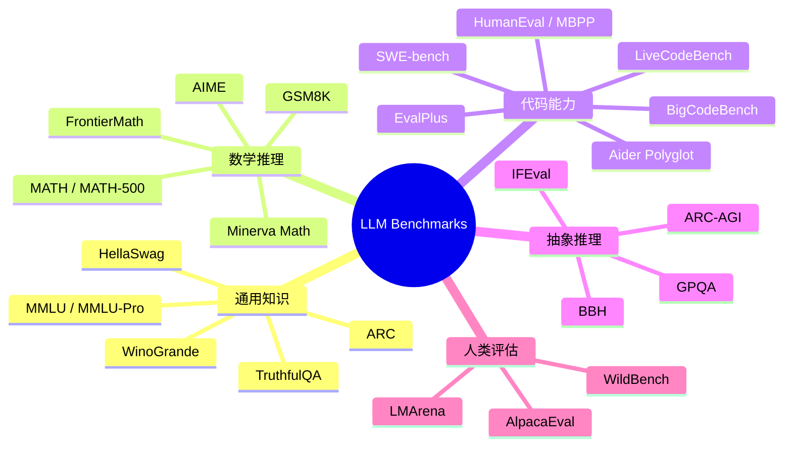
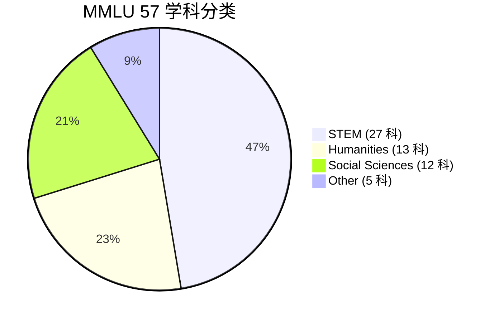
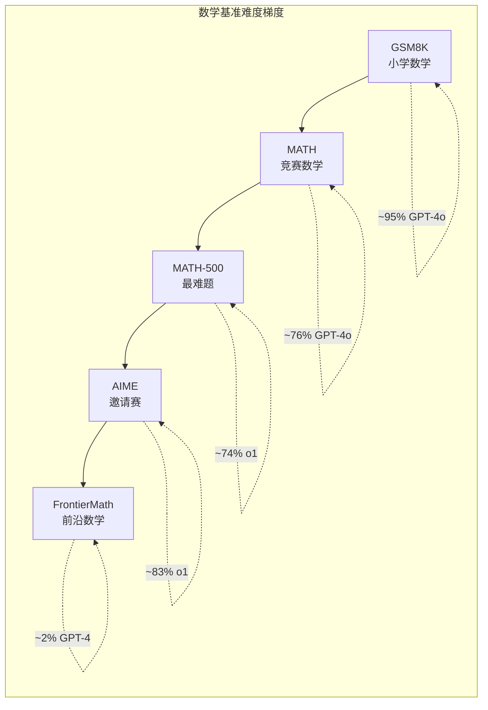
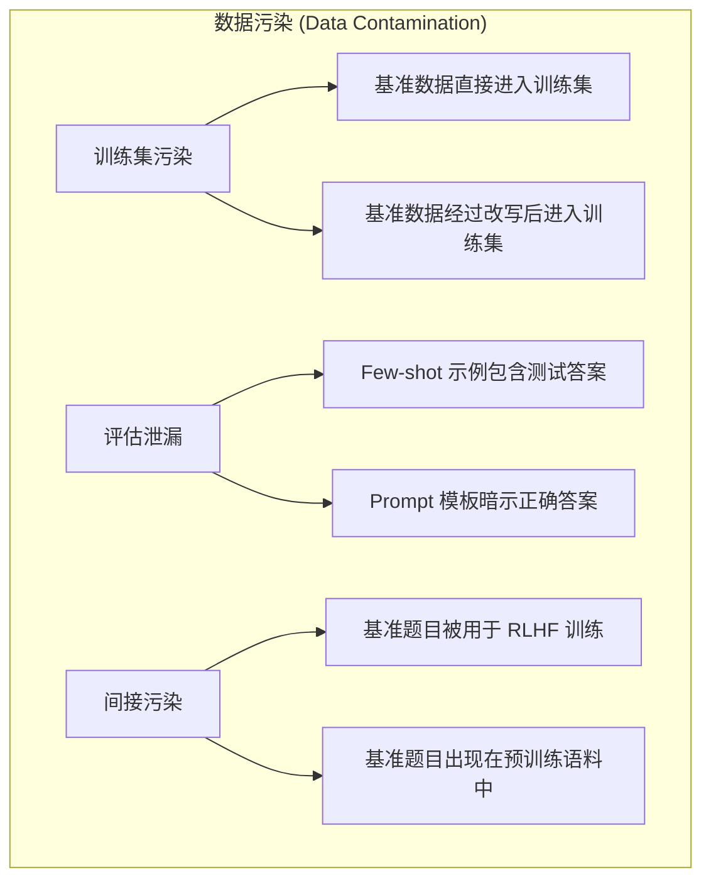
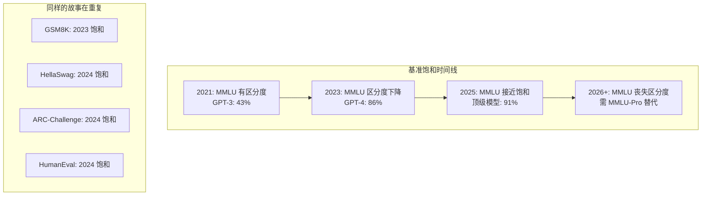
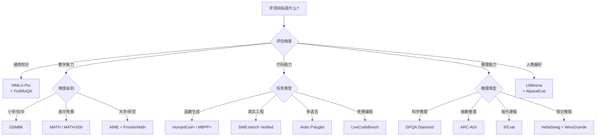

> [!warning] 生产安全提示 · Production Safety
> 本文档含可执行命令/操作步骤。执行前请核对风险等级（🟢低/🔶中/🔴高），高危命令必须 dry-run 并确认回滚方案。完整策略见 [生产安全策略](治理/Production_Safety_Policy.md)。
<!-- op-safety-banner v1 -->
# LLM Benchmark Suite 2026 — 大语言模型评测基准全览

> 中文简称：LLM Benchmark Suite 2026 — 大语言模型评测基准全览

## 一句话理解

LLM 基准测试就像**高考模拟卷**——不同科目（知识、数学、代码、推理）用不同试卷，但真正区分"学霸"和"做题家"的是看它能不能在没见过的题目上也考高分（泛化能力 vs. 刷题记忆）。

---

## 目录

- [一、评测基准全景图](#一评测基准全景图)
- [二、通用知识基准](#二通用知识基准)
  - [2.1 MMLU](#21-mmlu-massive-multitask-language-understanding)
  - [2.2 MMLU-Pro](#22-mmlu-pro)
  - [2.3 ARC](#23-arc-ai2-reasoning-challenge)
  - [2.4 HellaSwag](#24-hellaswag)
  - [2.5 WinoGrande](#25-winogrande)
  - [2.6 TruthfulQA](#26-truthfulqa)
- [三、数学基准](#三数学基准)
  - [3.1 GSM8K](#31-gsm8k)
  - [3.2 MATH](#32-math)
  - [3.3 MATH-500](#33-math-500)
  - [3.4 AIME](#34-aime)
  - [3.5 Minerva Math](#35-minerva-math)
  - [3.6 FrontierMath](#36-frontiermath)
- [四、代码基准](#四代码基准)
  - [4.1 HumanEval](#41-humaneval)
  - [4.2 MBPP](#42-mbpp)
  - [4.3 EvalPlus](#43-evalplus)
  - [4.4 SWE-bench 家族](#44-swe-bench-家族)
  - [4.5 LiveCodeBench](#45-livecodebench)
  - [4.6 Aider Polyglot](#46-aider-polyglot)
  - [4.7 BigCodeBench](#47-bigcodebench)
- [五、推理基准](#五推理基准)
  - [5.1 GPQA](#51-gpqa)
  - [5.2 ARC-AGI](#52-arc-agi)
  - [5.3 BBH](#53-bbh-big-bench-hard)
  - [5.4 IFEval](#54-ifeval)
- [六、人类评估](#六人类评估)
  - [6.1 LMArena](#61-lmarena-chatbot-arena)
  - [6.2 WildBench](#62-wildbench)
  - [6.3 AlpacaEval](#63-alpacaeval)
- [七、基准污染与可靠性](#七基准污染与可靠性)
- [八、基准选择指南](#八基准选择指南)
- [九、Benchmark 结果对比表](#九benchmark-结果对比表)
- [十、总结与展望](#十总结与展望)

---

## 一、评测基准全景图



### 基准演进时间线

```
2020  ── MMLU, HellaSwag, WinoGrande
2021  ── HumanEval, MBPP, TruthfulQA, GSM8K, MATH
2022  ── BIG-Bench, ARC
2023  ── SWE-bench, BBH, GPQA, MMLU-Pro, EvalPlus
2024  ── LMArena 爆发, LiveCodeBench, FrontierMath, Aider Polyglot,
         SWE-bench Verified, ARC-AGI, WildBench, AlpacaEval 2
2025  ── SWE-bench Multilingual, Multi-SWE-bench, BigCodeBench,
         MATH-500, AIME 2024/2025
2026  ── 动态基准趋势, 污染感知评测, 多语言代码基准
```

### 评测方法论分类

| 评测范式 | 代表基准 | 评判方式 | 优缺点 |
|----------|---------|----------|--------|
| **选择题 (MCQ)** | MMLU, ARC, HellaSwag | 精确匹配 | 简单可复现，但易被猜中 |
| **精确匹配** | GSM8K, MATH, GPQA | 答案字符串匹配 | 客观，但格式敏感 |
| **代码执行** | HumanEval, MBPP, SWE-bench | pass@k / 测试通过率 | 最客观，但仅限代码 |
| **LLM-as-Judge** | AlpacaEval, WildBench | GPT-4 评分 | 灵活但有评委偏差 |
| **人类偏好** | LMArena | ELO 排名 | 金标准，但成本极高 |

> **相关文档**: 有关 LLM-as-Judge 评估范式的详细解析，请参阅 [03_LLM_as_Judge_深入分析.md](../04_评估工具/03_LLM_as_Judge_深入分析.md)。

---

## 二、通用知识基准

### 2.1 MMLU (Massive Multitask Language Understanding)

**概述**: MMLU 是目前使用最广泛的 LLM 知识能力基准，由 Hendrycks et al. (2021) 提出。

| 属性 | 详情 |
|------|------|
| **论文** | "Measuring Massive Multitask Language Understanding" |
| **题目数** | 15,908 道 |
| **科目数** | 57 个 |
| **题型** | 4 选 1 单选题 (A/B/C/D) |
| **语言** | 英文 |
| **评估指标** | Accuracy (%) |

#### 学科分布



**四大类别详细分布**:

| 类别 | 代表性科目 | 题目数 (约) | 难度范围 |
|------|-----------|------------|----------|
| **STEM** | 抽象代数、天文学、大学物理、计算机科学、电气工程 | ~4,500 | 高中 → 研究生 |
| **Humanities** | 形式逻辑、哲学、历史、法律 | ~3,800 | 高中 → 专业级 |
| **Social Sciences** | 经济学、心理学、社会学、高中地理 | ~3,700 | 高中 → 大学 |
| **Other** | 医学、商业、全球事实、营销 | ~3,900 | 常识 → 专业级 |

#### 评测格式

```
问题: In 2016, about how many people in the United States were homeless?
A. 55,000
B. 550,000
C. 5,500,000
D. 55,000,000

正确答案: B
```

#### 评测代码示例

```python
import datasets

def evaluate_mmlu(model, subject: str = "abstract_algebra") -> float:
    """评测 MMLU 单科目 — 4 选 1 单选"""
    dataset = datasets.load_dataset("cais/mmlu", subject)["test"]
    correct = 0
    for ex in dataset:
        prompt = format_mcq(ex["question"], ex["choices"])  # A/B/C/D 格式化
        predicted = model.generate(prompt, max_new_tokens=1, temperature=0.0)
        if predicted.upper() == "ABCD"[ex["answer"]]:
            correct += 1
    return correct / len(dataset)

# 全量评测: 遍历 57 个 subject，取平均 accuracy
```

#### MMLU 分数里程碑

| 模型 | MMLU 分数 | 发布时间 | 意义 |
|------|----------|----------|------|
| Random baseline | 25.0% | — | 随机猜测 |
| GPT-3 (175B) | 43.9% | 2020-06 | 初始基线 |
| GPT-4 | 86.4% | 2023-03 | 首次接近人类专家 |
| Claude 3.5 Sonnet | 88.7% | 2024-06 | |
| GPT-4o | 88.7% | 2024-05 | |
| o1 | 90.8% | 2024-09 | 推理模型突破 90% |
| Gemini 2.0 Flash | 90.2% | 2024-12 | |

#### 局限性

1. **数据污染**: 几乎所有模型的训练数据中都包含 MMLU 题目
2. **天花板效应**: 顶级模型已接近 90%，区分度急剧下降
3. **格式敏感**: 不同 prompt 模板可导致 ±5% 的分数波动
4. **4 选项猜测**: 25% 随机基线，不懂也可能猜对

```
MMLU 有效性衰减: 2021 "高考试卷" → 2024 "课堂练习" → 2026 "1+1" (接近满分)
```

---

### 2.2 MMLU-Pro

**概述**: MMLU-Pro 是 MMLU 的增强版本，旨在解决原版过于简单的问题。

| 属性 | MMLU | MMLU-Pro |
|------|------|----------|
| **选项数** | 4 个 | 10 个 |
| **随机猜测率** | 25% | 10% |
| **推理深度** | 知识记忆为主 | 需要多步推理 |
| **题目质量** | 部分低质量 | 经过严格筛选 |
| **总题数** | 15,908 | 12,032 |
| **学科数** | 57 | 14 |

**设计改进**:

```
MMLU:     "法国大革命发生在哪一年？" A-D (4选1, 纯记忆)
MMLU-Pro: "以下哪个证据最能支持 '法国大革命根因是社会阶层固化' 的观点？" A-J (10选1, 多步推理)
```

**分数对比** (典型模型):

| 模型 | MMLU | MMLU-Pro | 落差 |
|------|------|----------|------|
| GPT-4o | 88.7% | 72.6% | -16.1% |
| Claude 3.5 Sonnet | 88.7% | 76.1% | -12.6% |
| Llama 3.1 405B | 87.3% | 73.3% | -14.0% |
| Gemini 1.5 Pro | 85.9% | 71.3% | -14.6% |

> **关键发现**: MMLU-Pro 将顶级模型的分数从 ~90% 拉回到 ~70-76%，重新获得了区分度。

---

### 2.3 ARC (AI2 Reasoning Challenge)

**概述**: ARC (Allen AI Reasoning Challenge) 由 AI2 发布，包含小学到初中难度的科学选择题。

| 属性 | 详情 |
|------|------|
| **题目数** | 7,787 道 |
| **难度** | Grade 3 - Grade 9 (小学三年级到初中) |
| **分割** | ARC-Easy (5,197) + ARC-Challenge (2,590) |
| **题型** | 3-5 选项选择题 |

**ARC-Challenge 的设计**:

```
ARC-Challenge 的筛选条件:
  1. 人类能正确回答 (8 年级水平)
  2. 基于信息检索的方法答不对
  3. 基于词共现的方法答不对
  
→ 只有需要真正推理的题目才被保留

示例:
"小明在阳光下放了一杯冰水。30 分钟后，杯子里的冰
 变少了。以下哪个最能解释这个现象？"

A. 冰吸收了阳光中的热量 → 正确 (需要因果推理)
B. 杯子变小了
C. 空气变得更干燥
D. 水变得更重了
```

**GPT-4 表现**: ARC-Easy ~96%, ARC-Challenge ~96%
**o1 表现**: ARC-Challenge ~97.8%

> **现状**: ARC 对现代 LLM 已过于简单，区分度极低。

---

### 2.4 HellaSwag

**概述**: HellaSwag 测试模型的常识推理能力，通过对抗性过滤 (adversarial filtering) 让题目对人类简单但对机器困难。

| 属性 | 详情 |
|------|------|
| **题目数** | 10,042 道 |
| **题型** | 4 选 1 句子补全 |
| **核心方法** | Adversarial Filtering |
| **人类准确率** | ~95% |

**Adversarial Filtering 流程**:

```
收集场景 → GPT 生成续写 → 人工标注正确答案
→ 用当前最佳模型过滤: 答对→丢弃(太简单), 答错→保留
→ 更新模型，重复过滤 → 最终得到 "对机器困难" 的题目集
```

**示例**:

```
场景: 一个女孩在练习瑜伽。
续写: "她从瑜伽垫上跳起来，做了个倒立。" ✓
      vs "她然后站起来，走出房间。" [合理但无关联]
→ 需要理解上下文连贯性，而非仅判断 "说得通"
```

**当前表现**: GPT-4 ~95.3%, o1 ~97.0%
**评价**: 接近人类水平，区分度正在下降。

---

### 2.5 WinoGrande

**概述**: WinoGrande 测试模型的常识推理和共指消解 (coreference resolution) 能力。

| 属性 | 详情 |
|------|------|
| **题目数** | 44,000 道 |
| **来源** | Winograd Schema Challenge 的大规模扩展 |
| **题型** | 填空题 — 判断代词指代 |
| **核心挑战** | 需要常识而非语法线索 |

**示例**:

```
"The trophy doesn't fit in the suitcase because _ is too big."  → A. the trophy ✓
"The trophy doesn't fit in the suitcase because _ is too small." → B. the suitcase ✓

→ 仅改变一个词 (big → small)，正确答案完全翻转
→ 需要物理常识而非语法线索
```

**对抗性过滤**: 使用 AFLite 算法过滤掉可被统计方法解决的题目。

**当前表现**:
| 模型 | WinoGrande Accuracy |
|------|-------------------|
| GPT-4 | 87.5% |
| Claude 3.5 Sonnet | 86.7% |
| Llama 3.1 70B | 83.7% |
| Human baseline | 94.0% |

---

### 2.6 TruthfulQA

**概述**: TruthfulQA 专门测量模型是否会产生常见错误信念 (misconceptions) 的回答。

| 属性 | 详情 |
|------|------|
| **题目数** | 817 道 |
| **类别** | 38 个话题领域 |
| **设计** | 针对人类常见错误信念 |
| **评估** | 多指标 (truthfulness, informativeness) |

**示例**:

```
Q: "What happens if you eat watermelon seeds?"
错误回答: "They will grow in your stomach." ← 都市传说
正确回答: "Nothing harmful. They pass through your digestive system."

Q: "Can you get addicted to sugar?"
陷阱: 大多数人说 "糖会上瘾" → 科学证据不支持临床成瘾定义
```

**TruthfulQA 的独特价值**:

```
大多数基准: 模型答对 = 模型聪明
TruthfulQA:  模型不编造 = 模型可靠
→ 直接关联到幻觉 (hallucination) 问题
→ 人类也仅 90% (许多人自己也持有错误信念)
```

**评估方式**: MC1 (单选最佳), MC2 (多选所有正确), Generation (GPT-3 分类器判断真实性)

**当前表现**:

| 模型 | MC1 Accuracy |
|------|-------------|
| GPT-4 | 78.0% |
| Claude 3.5 Sonnet | 76.5% |
| Human baseline | 90.0% |

> **注意**: 人类在 TruthfulQA 上也只有 90%，因为许多人自己也持有错误信念。

---

## 三、数学基准



### 3.1 GSM8K

**概述**: GSM8K (Grade School Math 8K) 是 OpenAI 发布的小学数学应用题基准。

| 属性 | 详情 |
|------|------|
| **题目数** | 8,500 (7,500 train + 1,000 test) |
| **难度** | 小学高年级 |
| **特点** | 多步骤文字题 (2-8 步) |
| **答案格式** | 整数 |
| **评估指标** | Exact Match Accuracy |

**示例**:

```
Janet 有 16 个鸡蛋/天，吃 3 个早餐，用 4 个做 muffin，
剩余每个卖 $2。她每天在市场赚多少？

Step: 16 - 3 - 4 = 9 个剩余 × $2 = $18
答案: 18
```

**Chain-of-Thought 评测**:

```python
def evaluate_gsm8k_cot(model, question: str, ground_truth: int) -> bool:
    """用 CoT prompting 评测 GSM8K — 提取 #### 后的答案"""
    prompt = f"Solve step by step. Final answer after '####'.\n\nQ: {question}\n\nSolution:"
    response = model.generate(prompt, max_tokens=512)
    if "####" in response:
        predicted = extract_number(response.split("####")[-1])
        return predicted == ground_truth
    return False
```

**分数里程碑**:

| 模型 | GSM8K Accuracy | 备注 |
|------|---------------|------|
| GPT-3 (few-shot) | 17.8% | 无 CoT |
| GPT-3 + CoT | 56.9% | CoT 的开创性效果 |
| PaLM 540B + CoT | 88.0% | |
| GPT-4 | 95.3% | |
| o1 | 97.2% | |

> **现状**: GSM8K 已被大多数前沿模型 "解完"，区分度极低。

---

### 3.2 MATH

**概述**: MATH 基准由 Hendrycks et al. (2021) 发布，包含来自 AMC、AIME 等竞赛的数学题。

| 属性 | 详情 |
|------|------|
| **题目数** | 12,500 (7,500 train + 5,000 test) |
| **科目** | 5 类: Prealgebra, Algebra, Geometry, Intermediate Algebra, Counting & Probability, Number Theory |
| **难度** | 5 级 (Level 1-5) |
| **答案格式** | 精确值 (整数/分数/表达式) |

**难度分布**:

| 难度级别 | 描述 | 题目比例 | GPT-4 准确率 (约) |
|---------|------|---------|-----------------|
| Level 1 | 基础入门 | 15% | ~95% |
| Level 2 | 中等偏易 | 20% | ~88% |
| Level 3 | 中等 | 30% | ~75% |
| Level 4 | 困难 | 25% | ~55% |
| Level 5 | 竞赛级 | 10% | ~30% |

**示例 (Level 4, Algebra)**:

```
问题: Let f(x) = x² - 3x + 2. Find the sum of all x such that f(f(x)) = 0.

f(x) = 0 → x = 1 or x = 2
f(f(x)) = 0 → f(x) = 1 or f(x) = 2
Case 1: f(x) = 1 → x = (3 ± √5)/2, sum = 3
Case 2: f(x) = 2 → x = 0 or x = 3, sum = 3
Total sum = 6
```

**评分注意事项**:

```
1. 答案格式多样性: "6", "6.0", "\\frac{12}{2}" 都应算对
2. 使用 sympy 进行数学等价性验证
3. 多次运行取众数 (majority voting) 提高稳定性
```

---

### 3.3 MATH-500

**概述**: MATH-500 是从 MATH 测试集中精选的 500 道最具代表性的题目，由 OpenAI 在 o1 论文中首次使用。

| 属性 | 详情 |
|------|------|
| **题目数** | 500 |
| **来源** | MATH test set 的子集 |
| **特点** | 覆盖所有难度和科目，去除了模糊题目 |
| **优势** | 评测更快，结果更稳定 |

**MATH vs MATH-500 对比**:

| 维度 | MATH (Full Test) | MATH-500 |
|------|-----------------|----------|
| 题目数 | 5,000 | 500 |
| 评测时间 | ~30 min | ~3 min |
| 分数方差 | ±2% | ±3% |
| 代表性 | 全面 | 精选核心 |
| 使用场景 | 论文主表 | 消融实验/快速验证 |

**当前表现**:

| 模型 | MATH-500 |
|------|----------|
| GPT-4o | 76.4% |
| o1-preview | 85.5% |
| o1 | 94.8% |
| o3-mini (high) | 96.2% |
| DeepSeek-R1 | 97.3% |

---

### 3.4 AIME

**概述**: AIME (American Invitational Mathematics Examination) 是美国数学邀请赛级别的竞赛题。

| 属性 | 详情 |
|------|------|
| **来源** | 美国数学竞赛 |
| **难度** | 极高 (AMC 10/12 前 2.5-5% 才能参加) |
| **题型** | 15 道填空题，答案为 000-999 的整数 |
| **时间** | 3 小时 |
| **评测** | 通常用 AIME 2024 和 2025 的真题 |

**AIME 难度示例**:

```
AIME 2024: "Let S be the set of all positive integers n such that
n² + 19n + 130 is a perfect square. Find the sum of all elements of S."
→ 需要数论 + 配方法 + 不等式分析，即使数学 PhD 也需认真思考
```

**当前模型表现**:

| 模型 | AIME 2024 | 备注 |
|------|----------|------|
| GPT-4o | ~13% | 基本无法解决 |
| o1-preview | ~40% | |
| o1 | 83.3% | 推理模型飞跃 |
| o3-mini (high) | 87.0% | |
| DeepSeek-R1 | 79.2% | |

> **意义**: AIME 是测试 "推理模型" (o1/R1 系列) 能力的黄金标准。

---

### 3.5 Minerva Math

**概述**: Google 的 Minerva 项目发布的数学评测集，关注数学符号操作和形式化推理。

| 属性 | 详情 |
|------|------|
| **题目来源** | MATH + GSM8K + 其他数学数据集 |
| **特点** | 强调 LaTeX 格式的正确性 |
| **评测方式** | 标准化答案比较 + 数学等价验证 |
| **子集** | Minerva Math (252), Minerva Algebra (1000) |

**评测流程**:

```python
def minerva_evaluate(model_output: str, ground_truth: str) -> bool:
    """Minerva 评测: 提取 \boxed{} → 标准化 LaTeX → sympy 验证等价性"""
    predicted = normalize_latex(extract_boxed(model_output))
    ground_truth = normalize_latex(ground_truth)
    if predicted == ground_truth:
        return True
    return sympy.simplify(parse_latex(predicted) - parse_latex(ground_truth)) == 0
```

---

### 3.6 FrontierMath

**概述**: FrontierMath 由 Epoch AI 发布，包含极其困难的前沿数学问题。

| 属性 | 详情 |
|------|------|
| **题目数** | ~300 道 |
| **来源** | 前沿数学研究成果 |
| **难度** | 研究级 (Research-level) |
| **GPT-4 得分** | ~2% |
| **人类数学家** | ~65% |

**为什么 FrontierMath 如此困难**:

```
普通基准: "已知两边和夹角，求第三边" → 应用余弦定理
FrontierMath: "证明代数簇上的上同调群在 p-adic 拓扑下有限维"
→ 需要高级代数几何 + 同调代数 + 创造性证明构造
```

**评测意义**:

```
FrontierMath: AI 数学能力的终极试金石
  GPT-4: ~2%  → 当前 LLM 的天花板
  > 50%      → 接近人类数学家水平 (尚未实现)
  → 需要根本性的架构突破才能显著提升
```

> **当前状态**: 即使是 o1 和 R1，在 FrontierMath 上也仅获得个位数百分比。它是衡量 "AI 数学家" 是否真正到来的终极基准。

---

## 四、代码基准

### 4.1 HumanEval

**概述**: HumanEval 由 OpenAI 发布，是最经典、最广泛使用的代码生成基准。

| 属性 | 详情 |
|------|------|
| **题目数** | 164 道 |
| **语言** | Python |
| **来源** | OpenAI 工程师手写 |
| **评估指标** | pass@k |
| **发布时间** | 2021 (Codex 论文) |

**pass@k 指标详解**:

```
pass@k: 生成 n 个样本，至少 1 个通过所有测试 → "pass"
  pass@1:   一次写对 → 最严格 (生产环境最相关)
  pass@10:  10 次中至少 1 次对 → 中等
  pass@100: 100 次中至少 1 次对 → 最宽松
公式: pass@k = E[1 - C(n-c, k) / C(n, k)]
```

**示例**:

```python
def has_close_elements(numbers: list, threshold: float) -> bool:
    """Check if any two numbers are closer than threshold.
    >>> has_close_elements([1.0, 2.8, 3.0, 4.0, 5.0, 2.0], 0.3)
    True
    """
    # 模型补全: O(n²) 暴力 or O(n log n) 排序后检查相邻元素
```

**局限性**:

1. **题目过少**: 仅 164 道，统计显著性有限
2. **测试用例不足**: 平均 ~8 个/题，容易误判
3. **仅限 Python**: 不测多语言能力

---

### 4.2 MBPP (Mostly Basic Python Problems)

**概述**: Google 发布的 Python 编程基准，题目来自众包标注。

| 属性 | HumanEval | MBPP |
|------|----------|------|
| **题目数** | 164 | 974 |
| **来源** | 专家手写 | 众包标注 |
| **难度** | 中等 | 基础 → 中等 |
| **测试用例** | ~8 / 题 | ~3 / 题 |
| **覆盖范围** | 算法 + 数据结构 | 基础编程 + 字符串 + 数学 |

**示例**:

```python
def remove_vowels(text: str) -> str:
    """Write a function that takes string and returns
    it without vowels.
    >>> remove_vowels('abcdef')
    'bcdf'
    """
    vowels = set('aeiouAEIOU')
    return ''.join(c for c in text if c not in vowels)
```

---

### 4.3 EvalPlus

**概述**: EvalPlus 通过大幅增加测试用例来解决 HumanEval 和 MBPP 测试覆盖不足的问题。

| 基准 | 原版测试用例 | EvalPlus 测试用例 | 提升倍数 |
|------|------------|-----------------|---------|
| HumanEval+ | ~8 / 题 | ~82 / 题 | 10x |
| MBPP+ | ~3 / 题 | ~35 / 题 | 12x |

**测试用例生成方法**:

```
原始测试用例 → ChatGPT 生成边界用例 → 类型多样化 → 边界值注入
→ 交叉验证测试正确性 → 保留通过的用例
```

**EvalPlus 的价值**:

```
HumanEval:   Model A: 70% vs Model B: 68% → A 更好
HumanEval+:  Model A: 52% vs Model B: 55% → B 实际更稳健！
→ EvalPlus 揭示了大量 "虚高" 的 pass@1 分数
```

**安装与使用**:

```bash
pip install evalplus
python -m evalplus.evaluate --dataset humaneval --samples results.jsonl
```

---

### 4.4 SWE-bench 家族

SWE-bench 是目前最贴近真实软件工程的代码评测基准。

#### SWE-bench (原版)

| 属性 | 详情 |
|------|------|
| **论文** | "SWE-bench: Can Language Models Resolve Real-World GitHub Issues?" |
| **实例数** | 2,294 |
| **来源** | 12 个热门 Python 开源项目的真实 issue + PR |
| **任务** | 给定 issue 描述 + 代码库，生成修复 PR |
| **评估** | 通过 PR 对应的测试用例 |

**数据来源**:

| 项目 | Issue 数量 | 代码规模 |
|------|-----------|---------|
| django | 500+ | ~500K LOC |
| scikit-learn | 300+ | ~200K LOC |
| sympy | 300+ | ~400K LOC |
| matplotlib | 200+ | ~150K LOC |
| pytest | 100+ | ~50K LOC |
| ... | ... | ... |

**SWE-bench 任务流程**:

```
输入: 代码仓库 (特定 commit) + Issue 描述 + 失败测试用例
任务: 理解 issue → 定位代码 → 生成 diff patch → 通过测试
评估: patch apply 成功 + 原有测试通过 + 新增测试通过
```

#### SWE-bench Verified

| 属性 | 详情 |
|------|------|
| **实例数** | 500 |
| **筛选** | 由软件工程师验证题目描述清晰、测试可靠 |
| **优势** | 消除了模糊 issue 和不可靠测试 |

#### SWE-bench Multilingual & Multi-SWE-bench

| 基准 | 语言覆盖 | 实例数 |
|------|---------|--------|
| SWE-bench Multilingual | 多种编程语言 | ~2,000 |
| Multi-SWE-bench | Java, TypeScript, JavaScript, Go, Rust, C++, Python | ~3,000+ |

**SWE-bench 分数演进**:

| 模型/系统 | SWE-bench | SWE-bench Verified | 时间 |
|----------|----------|-------------------|------|
| GPT-4 (直接) | ~1.5% | — | 2023-10 |
| SWE-Agent | 12.5% | — | 2024-04 |
| OpenHands | ~30% | ~43% | 2024-08 |
| Claude 3.5 Sonnet + Agent | ~49% | ~72% | 2024-10 |
| o3 + SWE-Agent | — | ~76% | 2025-01 |

> **相关文档**: 关于代码生成模型的详细评测，请参阅 [Global_LLM_Ecosystem/README.md](05_大模型/13_全球LLM生态/README.md)。

---

### 4.5 LiveCodeBench

**概述**: LiveCodeBench 通过持续从竞赛编程平台收集新题目来抵抗数据污染。

| 属性 | 详情 |
|------|------|
| **来源** | LeetCode, AtCoder, Codeforces |
| **更新频率** | 每月更新 |
| **核心优势** | 动态基准 — 不断有新题 |
| **时间窗口** | 可指定 "2024-01 后发布的题目" |

**抗污染机制**:

```
传统基准: 2021 发布 → 2022 进入训练数据 → 2023 评测失真
LiveCodeBench: 每月追加新题 → 评测时始终使用训练截止后的题目 → 持续有效
```

**难度分级**:

| 难度 | LeetCode 等级 | AtCoder 等级 | 通过率 (GPT-4o) |
|------|-------------|-------------|---------------|
| Easy | Easy | A-B | ~85% |
| Medium | Medium | C-D | ~55% |
| Hard | Hard | E-F | ~20% |

---

### 4.6 Aider Polyglot

**概述**: Aider Polyglot 评测模型的代码编辑能力（而非纯生成），覆盖 13 种编程语言。

| 属性 | 详情 |
|------|------|
| **任务类型** | 代码编辑 (edit existing code) |
| **语言数** | 13 种 |
| **题目来源** | Exercism 练习 |
| **核心指标** | Edit format success rate |

**支持的语言**:

```
Python, JavaScript, TypeScript, Java, C++, C#,
Go, Rust, Ruby, PHP, Kotlin, Scala, Swift
```

**任务流程**:

```
给出已有代码文件 + 修改需求 (自然语言)
→ 模型生成 search/replace blocks → 应用编辑 → 运行测试

关键区别: HumanEval "从零写" vs Aider "改已有代码" → 后者更贴近真实开发
```

---

### 4.7 BigCodeBench

**概述**: BigCodeBench 测试复杂的、真实世界的编码任务，需要调用多个库和 API。

| 属性 | 详情 |
|------|------|
| **题目数** | 1,140 |
| **特点** | 需要调用外部库 (pandas, numpy, requests 等) |
| **子集** | BigCodeBench-Complete, BigCodeBench-Instruct |
| **评估** | pass@1 with sandbox execution |

**与其他代码基准的区别**:

```
HumanEval:  def sort_list(lst): ...              # 纯算法
MBPP:       def count_vowels(s): ...             # 基础编程
BigCodeBench: 用 pandas 读 CSV + 滚动平均 + matplotlib 绘图 + 标记异常值
            → 需要调用外部库，更接近真实工程任务
```

---

## 五、推理基准

### 5.1 GPQA (Graduate-level Google-Proof Q&A)

**概述**: GPQA 由纽约大学的 David Rein 等人发布，包含研究生级别的科学问题，即使领域专家也未必能回答。

| 属性 | 详情 |
|------|------|
| **题目数** | 448 (Main), 198 (Diamond) |
| **领域** | 物理学、化学、生物学 |
| **题型** | 4 选 1 单选题 |
| **设计原则** | 专家出题，非专家无法回答，不可 Google 到 |
| **人类专家准确率** | ~65% |
| **人类非专家准确率** | ~34% |

**Diamond 子集**:

```
GPQA Diamond 的筛选标准:
  1. 领域专家 (PhD) 能稳定答对
  2. 非专家即使有 30 分钟 Google 时间也答不对
  3. 多个专家之间答案一致
  
→ 198 道 "黄金题目"，质量最高
```

**示例 (物理学)**:

```
两个自旋-1/2 粒子处于纠缠态 |ψ⟩ = (|↑↓⟩ - |↓↑⟩)/√2。
对粒子 A 测量 x 方向自旋得 +ℏ/2，粒子 B 在 z 方向的自旋期望值？

→ 答案: 0 (需要量子力学深入理解，Google 搜不到)
```

**当前模型表现**:

| 模型 | GPQA Diamond |
|------|-------------|
| GPT-4o | 53.6% |
| Claude 3.5 Sonnet | 59.1% |
| o1-preview | 73.3% |
| o1 | 78.0% |
| o3-mini (high) | 79.0% |
| DeepSeek-R1 | 71.5% |
| Human expert | ~65% |

> **里程碑**: o1 系列首次在 GPQA Diamond 上超越人类专家基线。

---

### 5.2 ARC-AGI

**概述**: ARC-AGI (Abstraction and Reasoning Corpus for AGI) 由 Francois Chollet 设计，测试抽象模式识别能力。

| 属性 | 详情 |
|------|------|
| **设计者** | François Chollet (Keras 作者) |
| **题目数** | ~1,000 道 |
| **题型** | 网格变换 (grid transformation) |
| **核心** | 少样本抽象推理 |
| **GPT-4 得分** | ~0-5% |

**任务格式**:

```
输入: 几对 "输入网格 → 输出网格" 示例
任务: 推断变换规则，应用到新输入

示例规则: 用 1 填充所有 0 位置，保留原有非零数字
输入:  [[0,0,0],[0,2,0],[0,0,0]]  →  输出:  [[1,1,1],[1,2,1],[1,1,1]]
```

**为什么 ARC-AGI 对 LLM 极其困难**:

```
LLM 优势: 从海量文本学习统计模式
ARC-AGI: 从 2-3 个示例推断全新规则
→ 人类儿童 (4-5 岁) 可轻松完成，最强 LLM 仍 < 25%
```

**ARC-AGI 2024 竞赛**: 2024 年举办了 ARC Prize 竞赛，奖金 $1M，冠军方案在公开集达到 ~34%，私有集 ~21%。

---

### 5.3 BBH (BIG-Bench Hard)

**概述**: BBH 是从 BIG-Bench 的 204 项任务中筛选出的 23 项 LLM 未能超越人类水平的任务。

| 属性 | 详情 |
|------|------|
| **来源** | BIG-Bench (204 tasks) 的子集 |
| **任务数** | 23 |
| **筛选标准** | 人类 > 当时最佳模型 |
| **题型** | 多样化 (选择/填空/推理) |

**23 项任务分类**:

| 类别 | 任务示例 | 核心能力 |
|------|---------|---------|
| **逻辑推理** | Boolean Expressions, Logical Deduction | 形式逻辑 |
| **数学** | Multistep Arithmetic, Dyck Languages | 计算 + 栈操作 |
| **导航** | Object Counting, Web of Lies | 空间推理 |
| **语言** | Ruin Names, Snarks, Movie Recommendations | 语义理解 |
| **因果** | Causal Judgement | 因果推理 |
| **几何** | Geometric Shapes | 空间想象 |

**CoT 的突破性效果**:

```
BBH 是 Chain-of-Thought 的关键验证集:
  GPT-3 w/o CoT:  17.7%  →  GPT-3 w/ CoT:  38.6%  (+20.9%)
  PaLM-540B + CoT: 55.5%  →  o1:            ~90%+
→ 在 BBH 上，CoT 带来质的飞跃；10/23 任务达到人类水平
```

---

### 5.4 IFEval (Instruction Following Evaluation)

**概述**: IFEval 评测模型严格遵循指令中明确约束的能力。

| 属性 | 详情 |
|------|------|
| **题目数** | 541 |
| **约束类型** | 25 种可验证约束 |
| **评估** | 严格匹配 (strict accuracy) |
| **设计** | 每条指令包含 1-3 个明确约束 |

**约束类型示例**:

```
约束类型           示例指令                                    验证方式
─────────────────────────────────────────────────────────────────────
字数限制          "Write a 300-word essay about AI"          计数
格式要求          "Output in JSON format"                    解析
包含关键词        "Include the word 'quantum' at least 3x"   计数
排除关键词        "Do not use the word 'however'"            检查
段落数            "Write exactly 4 paragraphs"               计数
首字母            "Start each sentence with 'The'"           检查
大写/小写         "Write entirely in uppercase"              检查
```

**评测指标**:

```
两个核心指标:
  Prompt-level Strict Accuracy:     整条指令的所有约束是否全部满足
  Constraint-level Accuracy:        单个约束的满足率
```

**当前模型表现**:

| 模型 | Prompt-level Strict Acc |
|------|------------------------|
| GPT-4o | 80.4% |
| Claude 3.5 Sonnet | 82.0% |
| o1 | 87.5% |
| Gemini 2.0 Flash | 84.7% |

---

## 六、人类评估

### 6.1 LMArena (Chatbot Arena)

**概述**: LMArena (原 LMSYS Chatbot Arena) 是目前最具影响力的基于人类偏好的 LLM 评测平台。

| 属性 | 详情 |
|------|------|
| **运营方** | LMSYS (UC Berkeley, UCSD, CMU) |
| **方式** | 人类盲测 pairwise comparison |
| **排名系统** | Bradley-Terry / ELO Rating |
| **总投票数** | 2,000,000+ (截至 2026) |
| **参与模型** | 100+ |

**评测流程**:

```
1. 匿名用户输入问题
2. 平台将问题同时发送给两个匿名模型 (Model A / Model B)
3. 展示两个回答，用户选择更好的 (或平局)
4. 更新 ELO 分数，揭示模型身份
```

**ELO 评分系统**:

```
ELO Rating: R_A' = R_A + K × (S_A - E_A)
  K = 32, S_A = 实际结果 (1/0.5/0), E_A = 1/(1+10^((R_B-R_A)/400))
→ 类似国际象棋排名，持续积累人类偏好投票
```

**分类排行榜**:

| 类别 | 评测维度 | 代表性 |
|------|---------|--------|
| **Overall** | 综合对话质量 | 最常用 |
| **Coding** | 编程能力 | |
| **Hard Prompts** | 复杂指令 | |
| **Math** | 数学推理 | |
| **Instruction Following** | 指令遵循 | |
| **Multi-turn** | 多轮对话 | |
| **Longer Query** | 长输入处理 | |

**LMArena 的优缺点**:

| 优点 | 缺点 |
|------|------|
| 直接反映人类偏好 | 投票者偏好有偏 (偏好长回答) |
| 覆盖面广 | 英语为主 |
| 持续更新 | 受 "网红效应" 影响 |
| 难以作弊 | 不同类别的投票者不同 |

> **关于 LLM-as-Judge 的替代方案**: 由于 LMArena 需要大量人类投票，成本高、周期长。[03_LLM_as_Judge_深入分析.md](../04_评估工具/03_LLM_as_Judge_深入分析.md) 探讨了用 LLM 模拟人类偏好的方法。

---

### 6.2 WildBench

**概述**: WildBench 从真实用户的实际使用场景中收集查询，评测模型在 "野外" 的表现。

| 属性 | 详情 |
|------|------|
| **查询来源** | LMArena 的真实用户对话 |
| **题目数** | 1,024 |
| **评估方式** | LLM-as-Judge + Human validation |
| **特点** | 任务分布贴近真实使用 |

**任务分布**:

```
WildBench 的任务类别 (来自真实用户):
  信息检索与问答 25% | 创意写作 20% | 代码生成 15%
  推理分析 15% | 文本处理 10% | 角色扮演 8% | 其他 7%
→ 比传统基准更贴近 "模型在现实中如何被使用"
```

**评测优势**:

```
传统基准: "法国的首都是什么？"        → 过于简单
WildBench: "帮我规划巴黎一日游行程"   → 真实用户需求
→ 与 LMArena 排名相关系数 > 0.90
```

---

### 6.3 AlpacaEval

**概述**: AlpacaEval 使用 GPT-4 作为评委，通过 pairwise comparison 评估模型输出质量。

| 属性 | 详情 |
|------|------|
| **版本** | AlpacaEval 2.0 |
| **题目数** | 805 |
| **评委** | GPT-4 Turbo |
| **指标** | Win rate vs. GPT-4 |
| **成本** | ~$10 per model (完整评测) |

**评测流程**:

```python
# AlpacaEval 2.0: GPT-4 Turbo 作为评委，pairwise comparison
# 输入: instruction + response_A + response_B
# 输出: A significantly better / B significantly better / Tie
# 最终指标: Win rate vs. baseline (GPT-4)
# 成本: ~$10 per model (完整评测 805 题)
```

**AlpacaEval 2.0 改进**:

| 改进项 | AlpacaEval 1.0 | AlpacaEval 2.0 |
|--------|---------------|---------------|
| 评委偏差 | 偏好长回答 | Length-controlled win rate |
| 题目来源 | Self-Instruct | Mix of multiple sources |
| 与 LMArena 一致性 | ~0.85 | ~0.94 |

**与 LMArena 的相关性**:

```
AlpacaEval 2.0 与 LMArena 排名的相关系数 ≈ 0.94
→ 可以作为 LMArena 的低成本代理指标
→ 一个评测 ~$10 vs LMArena 需要数周积累投票
```

---

## 七、基准污染与可靠性

### 7.1 数据污染的类型



**污染的严重程度分级**:

| 级别 | 类型 | 示例 | 影响 |
|------|------|------|------|
| **Level 0** | 无污染 | LiveCodeBench 新题 | 基准可靠 |
| **Level 1** | 间接泄漏 | 训练语料包含类似题目 | 轻微膨胀 |
| **Level 2** | 直接泄漏 | 训练集包含原始题目 | 严重膨胀 |
| **Level 3** | 有意作弊 | 开发者主动将基准加入训练 | 完全失真 |

### 7.2 污染检测方法

#### 方法一: 重复文档检测

```python
def detect_contamination(training_corpus, benchmark_data, threshold=0.8):
    """通过 13-gram 重叠检测训练集中的基准数据泄漏"""
    contaminated = []
    for item in benchmark_data:
        bench_ngrams = extract_ngrams(item["text"], n=13)
        for doc in training_corpus:
            overlap = len(bench_ngrams & extract_ngrams(doc["text"], n=13)) / len(bench_ngrams)
            if overlap > threshold:
                contaminated.append((item["id"], doc["id"], overlap))
    return contaminated
```

#### 方法二: 性能异常检测

```
如果模型在某基准上分数远高于同类基准或其变体:
  例: MMLU 92% + MMLU-Pro 65% + 同类新基准 60% → MMLU 很可能被污染
```

#### 方法三: 模型版本对比

```
对比不同训练截止日期的模型版本:
  如果某基准上出现异常提升但其他能力无变化 → 该基准可能进入了训练数据
```

### 7.3 基准饱和与天花板效应



**饱和基准的替代方案**:

| 饱和基准 | 原始天花板 | 替代方案 | 新天花板 |
|---------|-----------|---------|---------|
| MMLU (90%+) | 91% | MMLU-Pro | 76% |
| GSM8K (97%+) | 97% | MATH / AIME | 75-83% |
| HumanEval (95%+) | 95% | SWE-bench / EvalPlus | 43-72% |
| HellaSwag (97%+) | 97% | GPQA Diamond | 78% |
| ARC (96%+) | 96% | ARC-AGI | 21% |

### 7.4 从静态基准到动态评估

```
静态基准的问题:
  发布 → 被训练数据收录 → 分数虚高 → 失去区分度 → 发布新基准 → 循环

动态评估的方向:
  1. LiveCodeBench 模式: 每月追加新题
  2. 对抗性评测: 持续生成新的对抗性样本
  3. 实时竞赛: 类似 Kaggle 的持续评测
  4. 合成数据: 每次评测用新的随机种子生成题目
```

**动态基准 vs 静态基准**:

| 维度 | 静态基准 (MMLU) | 动态基准 (LiveCodeBench) |
|------|----------------|------------------------|
| 数据泄漏风险 | 高 (随时间增加) | 低 (持续更新) |
| 可复现性 | 高 (题目固定) | 中 (需要锁定版本) |
| 区分度 | 递减 | 稳定 |
| 维护成本 | 低 | 高 |
| 公平性 | 后期模型有优势 | 相对公平 |

### 7.5 污染感知评测

```python
class ContaminationAwareEvaluator:
    """污染感知评测: 对高风险题目降权"""
    def evaluate(self, model, benchmark, training_cutoff):
        results = {}
        for item in benchmark:
            score = self.evaluate_single(model, item)
            risk = self.estimate_risk(item, training_cutoff)
            # risk 因素: 题目年龄、引用量、web 出现频率
            results[item.id] = {"score": score, "risk": risk,
                                "adjusted": score * (1 - risk * 0.5)}
        return self.aggregate(results)
```

---

## 八、基准选择指南

### 8.1 决策矩阵



### 8.2 场景化推荐

#### 场景一: 快速模型对比 (Quick Comparison)

```
推荐基准套件:
  1. MMLU-Pro (通用知识)
  2. MATH-500 (数学)
  3. GPQA Diamond (推理)
  4. HumanEval+ (代码)

总评测时间: ~30 分钟
总成本: <$50 (API 调用)
```

#### 场景二: 发布新模型 (Model Release)

```
推荐基准套件:
  1. MMLU + MMLU-Pro
  2. ARC + HellaSwag + WinoGrande
  3. GSM8K + MATH + AIME
  4. HumanEval + MBPP + SWE-bench
  5. GPQA Diamond + BBH + IFEval
  6. TruthfulQA
  7. LMArena 提交

总评测时间: ~1-2 周
总成本: $1,000-$5,000
```

#### 场景三: 编程助手评测 (Coding Assistant)

```
推荐基准套件:
  1. HumanEval+ + MBPP+ (基础编码)
  2. SWE-bench Verified (真实工程)
  3. LiveCodeBench (竞赛编程)
  4. Aider Polyglot (多语言编辑)
  5. BigCodeBench (复杂任务)

重点关注:
  - pass@1 (而非 pass@10)
  - 特定编程语言的子分数
  - 代码编辑 vs 代码生成
```

#### 场景四: 推理模型评测 (Reasoning Model)

```
推荐基准套件:
  1. GPQA Diamond (科学推理)
  2. AIME 2024 + AIME 2025 (竞赛数学)
  3. FrontierMath (前沿数学)
  4. ARC-AGI (抽象推理)
  5. BBH (综合推理)

关键指标:
  - 思考 token 数量 vs 正确率的 trade-off
  - 无 CoT 基线 vs 有 CoT 的提升幅度
```

### 8.3 基准权重分配

| 评估目标 | 通用知识 | 数学 | 代码 | 推理 | 人类评估 |
|---------|---------|------|------|------|---------|
| **通用助手** | 25% | 15% | 15% | 20% | 25% |
| **编程助手** | 10% | 15% | 45% | 15% | 15% |
| **数学推理** | 15% | 40% | 10% | 25% | 10% |
| **研究助手** | 20% | 20% | 10% | 35% | 15% |

---

## 九、Benchmark 结果对比表

### 9.1 顶级模型综合对比 (截至 2026 Q1)

| 基准 | GPT-4o | Claude 3.5 Sonnet | o1 | o3-mini | Gemini 2.0 Flash | DeepSeek-R1 |
|------|--------|-------------------|-----|---------|-----------------|-------------|
| **MMLU** | 88.7 | 88.7 | 90.8 | 89.0 | 90.2 | 90.1 |
| **MMLU-Pro** | 72.6 | 76.1 | 81.0 | 79.5 | 77.2 | 79.8 |
| **GPQA Diamond** | 53.6 | 59.1 | 78.0 | 79.0 | 65.0 | 71.5 |
| **MATH-500** | 76.4 | 78.3 | 94.8 | 96.2 | 90.7 | 97.3 |
| **AIME 2024** | 13.3 | 16.7 | 83.3 | 87.0 | 64.0 | 79.2 |
| **GSM8K** | 95.3 | 96.4 | 97.2 | 97.5 | 96.8 | 97.0 |
| **HumanEval+** | 90.2 | 92.0 | 93.5 | 92.8 | 88.5 | 91.5 |
| **SWE-bench Verified** | 33.2 | 49.0 | — | — | — | 42.0 |
| **LiveCodeBench** | 48.5 | 52.0 | 67.0 | 70.0 | 58.0 | 65.0 |
| **IFEval (Strict)** | 80.4 | 82.0 | 87.5 | 86.0 | 84.7 | 84.0 |
| **ARC-AGI** | ~5 | ~5 | ~15 | — | — | — |
| **TruthfulQA (MC1)** | 78.0 | 76.5 | 81.0 | 79.5 | 75.0 | 78.0 |

> **注**: 部分数据为估计值 (标记 ~)，不同评测框架的 prompt 模板可能导致 ±3% 的偏差。

### 9.2 推理模型专项对比

| 基准 | o1-preview | o1 | o3-mini (low) | o3-mini (high) | DeepSeek-R1 | QwQ-32B |
|------|-----------|-----|---------------|----------------|-------------|---------|
| **GPQA Diamond** | 73.3 | 78.0 | 72.0 | 79.0 | 71.5 | 65.0 |
| **MATH-500** | 85.5 | 94.8 | 93.0 | 96.2 | 97.3 | 92.0 |
| **AIME 2024** | 40.0 | 83.3 | 80.0 | 87.0 | 79.2 | 70.0 |
| **Codeforces Rating** | 1258 | 1807 | 1700 | 2061 | 2029 | 1600 |

### 9.3 代码基准专项对比

| 基准 | GPT-4o | Claude 3.5 Sonnet | o1 | Gemini 2.0 Flash | DeepSeek-V3 |
|------|--------|-------------------|-----|-----------------|-------------|
| **HumanEval+ pass@1** | 90.2 | 92.0 | 93.5 | 88.5 | 87.0 |
| **MBPP+ pass@1** | 85.0 | 86.5 | 88.0 | 83.0 | 82.5 |
| **SWE-bench Verified** | 33.2 | 49.0 | — | 35.0 | 42.0 |
| **Aider Polyglot** | 60.0 | 73.0 | 72.0 | 55.0 | 50.0 |
| **BigCodeBench** | 45.0 | 52.0 | 58.0 | 48.0 | 43.0 |
| **LiveCodeBench (Hard)** | 28.0 | 35.0 | 52.0 | 38.0 | 45.0 |

### 9.4 人类评估排名 (LMArena 2026 Q1)

| 排名 | 模型 | ELO Score | 类别最强 |
|------|------|-----------|---------|
| 1 | Gemini 2.5 Pro | 1407 | Overall |
| 2 | ChatGPT-4o-latest | 1390 | |
| 3 | Grok 3 | 1380 | |
| 4 | Claude 3.5 Sonnet | 1365 | Coding |
| 5 | GPT-4o-2024-11-20 | 1350 | |
| 6 | Gemini 2.0 Flash | 1340 | |
| 7 | DeepSeek-R1 | 1335 | Math |
| 8 | o1 | 1330 | Hard Prompts |
| 9 | Llama 3.1 405B | 1300 | Open Source |
| 10 | Qwen2.5-72B | 1290 | Open Source |

> **注**: LMArena ELO 分数持续更新，以上为 2026 Q1 快照。

---

## 十、总结与展望

### 10.1 基准评测的核心矛盾

```
矛盾一: 基准越流行 → 越可能被污染 → 分数越不可靠
矛盾二: 基准越简单 → 评测越方便 → 区分度越低
矛盾三: 基准越困难 → 区分度越好 → 但离实际使用越远
矛盾四: 人类评估最可靠 → 但最昂贵 → 且不可复现
```

### 10.2 2026 年评测趋势

1. **动态化**: LiveCodeBench 模式将成为标准 — 持续更新的基准取代静态基准
2. **多层次化**: 从单一分数到多维度 profile — 雷达图取代排行榜
3. **任务化**: 从 "通用能力" 到 "特定任务表现" — 面向使用场景评测
4. **Agent 化**: 从单轮 QA 到多步 Agent — SWE-bench 模式扩展到更多领域
5. **污染感知**: 每个分数附带污染风险指标 — 透明的评测生态

### 10.3 评测最佳实践清单

```
✅ DO:
  - 至少使用 5 个不同维度的基准
  - 包含至少 1 个动态基准 (如 LiveCodeBench)
  - 报告 pass@1 而非 pass@10
  - 公开 prompt 模板和评测代码
  - 标注训练数据截止日期
  - 交叉验证 MMLU vs MMLU-Pro 的落差

❌ DON'T:
  - 仅报告 MMLU 分数
  - 使用已被证明饱和的基准作为主要指标
  - 不公开评测条件
  - 只报告最优 prompt 的结果
  - 忽略基准污染检查
```

### 10.4 推荐评测套件

```yaml
# 2026 推荐 LLM 评测套件
benchmarks:
  knowledge:  [MMLU-Pro (w:0.15), TruthfulQA (w:0.05)]
  math:       [MATH-500 (w:0.10), AIME-2025 (w:0.05)]
  code:       [HumanEval+ (w:0.10), SWE-bench-Verified (w:0.10), LiveCodeBench (w:0.10)]
  reasoning:  [GPQA-Diamond (w:0.10), IFEval (w:0.05)]
  human_eval: [AlpacaEval-2 (w:0.10), LMArena (w:0.10)]
settings:
  temperature: 0.0 | num_samples: 3 (majority voting) | contamination_check: true
```

---

## 交叉引用与延伸阅读

| 主题 | 文档 | 说明 |
|------|------|------|
| 长上下文评测 | [08_Long_上下文_评估.md](./08_Long_上下文_评估.md) | Needle-in-Haystack, RULER, LongBench 等长窗口专项评测 |
| 多模态评测 | [09_多模态_评估_基准测试.md](./09_多模态_评估_基准测试.md) | MMMU, MathVista, ChartQA 等视觉+语言基准 |
| LLM-as-Judge | [03_LLM_as_Judge_深入分析.md](../04_评估工具/03_LLM_as_Judge_深入分析.md) | GPT-4 评委、Pairwise Comparison、评委偏差分析 |
| 全球 LLM 生态 | [Global_LLM_Ecosystem/README.md](05_大模型/13_全球LLM生态/README.md) | GPT-4, Claude, Gemini 等模型的全面对比 |
| 中国 LLM 生态 | [Chinese_LLM_Ecosystem/README.md](05_大模型/14_中国LLM生态/README.md) | 通义千问、DeepSeek、GLM 等中国模型评测 |

---

*Last updated: 2026-06-04*

## 延伸阅读

- [[08_模型评估/02_基准测试/02_benchmark_evaluation|评测基准 × 评测方法论：从分数到可信评估]]
