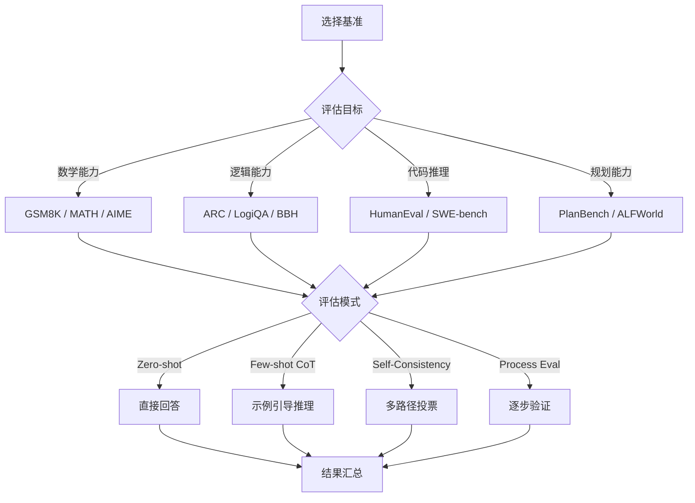

# 推理能力评估基准 2026

> 中文简称：推理能力评估基准 2026

> **一句话理解**: 推理评估是检验模型"思考能力"的考试——不只看答案对不对（Outcome），更看思考过程好不好（Process）。2026 年的核心转变是从"结果评估"走向"过程评估"，从"单步推理"走向"多步规划"。

---

## 目录

- [一、概述](#一概述)
- [二、核心方法论](#二核心方法论)
- [三、数学推理基准详解](#三数学推理基准详解)
- [四、逻辑推理基准详解](#四逻辑推理基准详解)
- [五、代码推理基准](#五代码推理基准)
- [六、Chain-of-Thought 评估](#六chain-of-thought-评估)
- [七、o1/R1 式思维链评估](#七o1r1-式思维链评估)
- [八、规划基准](#八规划基准)
- [九、Process Reward 评估](#九process-reward-评估)
- [十、对比表](#十对比表)
- [十一、实践指南](#十一实践指南)
- [十二、2026 前沿](#十二2026-前沿)
- [十三、相关概念](#十三相关概念)

---

## 一、概述

### 1.1 推理能力的三维分类

推理能力并非单一维度，2026 年学界已形成共识的三维分类：

```
推理能力 (Reasoning)
├── 数学推理 (Mathematical Reasoning)
│   ├── 算术推理: GSM8K, SVAMP
│   ├── 代数推理: MATH, AIME
│   └── 几何推理: Geometry3K, UniGeo
├── 逻辑推理 (Logical Reasoning)
│   ├── 演绎推理: LogiQA, ReClor
│   ├── 归纳推理: ARC-Challenge, BIG-Bench
│   └── 溯因推理: AbductiveQA
└── 代码推理 (Code Reasoning)
    ├── 算法推理: HumanEval, MBPP
    ├── 调试推理: DebugBench
    └── 系统推理: SWE-bench
```

### 1.2 评估范式演进

| 时期 | 评估范式 | 代表方法 | 局限性 |
|------|----------|----------|--------|
| 2022 前 | 结果评估 | 精确匹配 (Exact Match) | 无法区分"猜对"与"推理对" |
| 2023 | CoT 评估 | Chain-of-Thought Prompting | 仅评估提示策略，非内在能力 |
| 2024 | 过程评估 | Process Reward Model | 标注成本高，覆盖率有限 |
| 2025 | 思维链评估 | o1-style Long Reasoning | 推理 token 成本爆炸 |
| 2026 | 混合评估 | 过程+结果+效率三维 | 标准化仍在进行中 |

### 1.3 为什么推理评估是 2026 年的核心议题

1. **Reasoning Models 爆发**: OpenAI o1/o3、DeepSeek-R1、Claude 3.5 等推理模型成为主流
2. **Scaling Test-Time Compute**: 推理时计算扩展成为新的性能提升维度
3. **AGI 路径争论**: 推理能力被视为通向 AGI 的关键瓶颈
4. **产业需求**: 数学证明、代码验证、科学发现等场景对推理可靠性要求极高

---

## 二、核心方法论

### 2.1 评估指标体系

#### 结果指标 (Outcome Metrics)

```python
# 精确匹配 (Exact Match)
def exact_match(prediction: str, ground_truth: str) -> float:
    """最严格的评估：答案必须完全一致"""
    return 1.0 if normalize(prediction) == normalize(ground_truth) else 0.0

# 数值容差匹配
def numerical_match(prediction: float, ground_truth: float, tol: float = 1e-5) -> float:
    """允许浮点误差的数值匹配"""
    return 1.0 if abs(prediction - ground_truth) < tol else 0.0

# pass@k 指标
def pass_at_k(n: int, c: int, k: int) -> float:
    """n 个样本中 c 个正确，抽 k 个至少一个正确的概率"""
    if n - c < k:
        return 1.0
    return 1.0 - math.comb(n - c, k) / math.comb(n, k)
```

#### 过程指标 (Process Metrics)

```python
# 步骤正确率
def step_accuracy(solution_steps: list, gold_steps: list) -> float:
    """评估每个推理步骤的正确性"""
    correct = sum(1 for s, g in zip(solution_steps, gold_steps) if is_equivalent(s, g))
    return correct / len(gold_steps)

# 推理效率
def reasoning_efficiency(tokens_used: int, min_tokens: int) -> float:
    """评估推理的 token 效率"""
    return min_tokens / tokens_used  # 越接近 1 越高效

# 推理一致性
def reasoning_consistency(samples: list, n: int = 10) -> float:
    """多次采样推理路径的一致性"""
    paths = [extract_reasoning_path(s) for s in samples]
    return calculate_path_similarity(paths)
```

### 2.2 评估协议设计



### 2.3 难度梯度设计

合理的推理评估需要覆盖完整难度梯度：

| 难度等级 | 推理步数 | 代表题目 | 人类正确率 | 模型目标 |
|----------|----------|----------|-----------|----------|
| Level 1 | 1-2 步 | GSM8K 简单题 | >95% | >90% |
| Level 2 | 3-5 步 | GSM8K 难题 / MATH 中等 | 80-90% | >75% |
| Level 3 | 5-10 步 | MATH 困难 / AIME | 50-70% | >50% |
| Level 4 | 10-20 步 | AIME 难题 / 竞赛题 | 20-40% | >30% |
| Level 5 | 20+ 步 | 奥赛金牌题 / 研究问题 | <10% | >10% |

---

## 三、数学推理基准详解

### 3.1 GSM8K (Grade School Math 8K)

**基本信息**:
- 规模: 8,792 道小学数学应用题
- 语言: 英语
- 推理步数: 2-8 步
- 评估方式: 精确匹配最终数值答案

**2026 年状态**: 已接近饱和（顶级模型 >97%），主要用作回归测试和基线。

```python
# GSM8K 评估示例
gsm8k_example = {
    "question": "Natalia sold clips to 48 of her friends in April, and then she sold half as many clips in May. How many clips did Natalia sell altogether in April and May?",
    "answer": "Natalia sold 48/2 = <<48/2=24>>24 clips in May.\nNatalia sold 48+24 = <<48+24=72>>72 clips altogether.\n#### 72",
    "difficulty": "easy",
    "reasoning_steps": 2
}
```

**局限性**:
- 数据污染严重（几乎所有训练集都包含）
- 难度天花板低，无法区分顶级模型
- 仅覆盖算术推理，不涉及代数/几何

### 3.2 MATH

**基本信息**:
- 规模: 12,500 道竞赛级数学题
- 难度: Level 1-5（对应 AMC/AIME 难度）
- 领域: 代数、计数与概率、几何、中级代数、数论、预微积分、初级代数
- 评估: 精确匹配（支持 LaTeX 表达式等价判断）

**MATH-500 子集**: OpenAI 提出的 500 题标准化子集，覆盖各难度和领域，用于快速评估。

```python
# MATH 难度分布
math_difficulty_distribution = {
    "Level 1": {"count": 1200, "human_accuracy": 0.95, "gpt4_accuracy": 0.92},
    "Level 2": {"count": 2400, "human_accuracy": 0.85, "gpt4_accuracy": 0.78},
    "Level 3": {"count": 3600, "human_accuracy": 0.65, "gpt4_accuracy": 0.55},
    "Level 4": {"count": 3200, "human_accuracy": 0.40, "gpt4_accuracy": 0.35},
    "Level 5": {"count": 2100, "human_accuracy": 0.15, "gpt4_accuracy": 0.18},
}
```

### 3.3 AIME (American Invitational Mathematics Examination)

**基本信息**:
- 来源: 美国数学邀请赛真题
- 规模: 每年 30 题（2024/2025/2026 共约 90 题可用）
- 难度: 极高（Level 4-5）
- 答案: 0-999 的整数

**2026 评估要点**:
- o3 在 AIME 2025 上达到 ~95%（使用大量推理 token）
- DeepSeek-R1 达到 ~80%
- 关键问题: 高正确率是否依赖"暴力搜索"而非真正理解？

### 3.4 FrontierMath

**基本信息**:
- 来源: Epoch AI 开发
- 规模: 300+ 道研究级数学问题
- 难度: 需要专业数学家级别知识
- 特点: 答案可自动验证，避免主观评判

**设计哲学**: 测试模型在"人类前沿"的数学推理能力，题目由专业数学家原创，确保不在任何训练集中。

### 3.5 数学推理基准对比

| 基准 | 规模 | 难度范围 | 2026 SOTA | 污染风险 | 区分度 |
|------|------|----------|-----------|----------|--------|
| GSM8K | 8,792 | 低 | >97% | 极高 | 低 |
| MATH | 12,500 | 中-高 | ~90% | 高 | 中 |
| MATH-500 | 500 | 中-高 | ~92% | 中 | 中 |
| AIME 2025 | 30 | 极高 | ~95% | 低 | 高 |
| FrontierMath | 300+ | 研究级 | ~30% | 极低 | 极高 |
| Minerva Math | 4 子集 | 中-高 | ~85% | 中 | 中 |

---

## 四、逻辑推理基准详解

### 4.1 ARC-Challenge (AI2 Reasoning Challenge)

**基本信息**:
- 规模: 1,172 道科学选择题（Challenge 子集）
- 来源: 美国 3-9 年级科学考试
- 评估: 多选精确匹配
- 特点: 需要多步科学推理，非简单知识检索

**ARC-AGI (原 ARC-4)**:
- 2024 年升级为 ARC-AGI，引入全新抽象推理任务
- 基于 Chollet 的 ARC 抽象推理语料库
- 测试"真正的"泛化推理能力，而非模式匹配
- 2026 年顶级模型准确率仍 <30%

### 4.2 LogiQA / ReClor

**LogiQA**:
- 来源: 中国公务员考试逻辑推理题
- 规模: 8,678 题
- 类型: 演绎推理、归纳推理、类比推理
- 语言: 中文/英文双语

**ReClor**:
- 来源: GMAT/LSAT 逻辑推理题
- 规模: 6,292 题
- 特点: 需要识别论证结构、找出逻辑谬误

### 4.3 BIG-Bench Hard (BBH)

**基本信息**:
- 规模: 23 个 BIG-Bench 任务中 LLM 表现最差的子集
- 特点: 专门挑选"对 LLM 困难"的推理任务
- 包含: 布尔表达式、因果判断、日期理解、逻辑推理、对象计数等

```python
# BBH 任务分类
bbh_categories = {
    "逻辑推理": ["boolean_expressions", "logical_deduction", "navigate"],
    "语言推理": ["linguistic_puzzles", "word_sorting", "temporal_sequences"],
    "数学推理": ["multistep_arithmetic", "object_counting", "dyck_languages"],
    "常识推理": ["causal_judgement", "formal_fallacies", "snarks"],
    "空间推理": ["geometric_shapes", "penguins_in_a_table", "tracking_shuffled_objects"],
}
```

### 4.4 GPQA (Graduate-Level Google-Proof Q&A)

**基本信息**:
- 规模: 448 道研究生级别科学问题
- 领域: 物理、化学、生物
- 特点: 即使有 Google 搜索，非专业人士也难以回答
- 人类专家正确率: ~87%
- 2026 SOTA: ~70%（o3 使用 extended thinking）

---

## 五、代码推理基准

### 5.1 代码推理的独特性

代码推理与数学/逻辑推理的关键区别：

| 维度 | 数学推理 | 逻辑推理 | 代码推理 |
|------|----------|----------|----------|
| 验证方式 | 答案匹配 | 选项匹配 | 执行测试用例 |
| 正确性 | 唯一解 | 唯一解 | 多解（功能等价） |
| 推理深度 | 高 | 中-高 | 中（但广度大） |
| 反馈信号 | 稀疏 | 稀疏 | 密集（编译/运行） |
| 评估成本 | 低 | 低 | 高（需沙箱执行） |

### 5.2 主要代码推理基准

详见 [[概念/General/code-generation]] 完整分析。此处聚焦推理维度：

- **HumanEval**: 算法推理（函数级）
- **SWE-bench**: 系统推理（仓库级）
- **LiveCodeBench**: 实时竞赛推理（防污染）
- **BigCodeBench**: 实用编程推理（API 调用链）

---

## 六、Chain-of-Thought 评估

### 6.1 CoT 评估的演进

```
2022: Zero-shot CoT ("Let's think step by step")
  ↓
2023: Few-shot CoT (手动构造推理示例)
  ↓
2024: Self-Consistency (多路径采样 + 多数投票)
  ↓
2025: Long Chain-of-Thought (o1 式 extended thinking)
  ↓
2026: Adaptive Reasoning (按需分配推理深度)
```

### 6.2 CoT 质量评估维度

```python
class CoTEvaluation:
    """Chain-of-Thought 质量评估框架"""
    
    def evaluate(self, cot: str, question: str, answer: str) -> dict:
        return {
            "correctness": self.check_final_answer(cot, answer),
            "step_validity": self.validate_each_step(cot),
            "logical_coherence": self.check_logical_flow(cot),
            "completeness": self.check_coverage(cot, question),
            "efficiency": self.measure_token_efficiency(cot),
            "faithfulness": self.check_reasoning_faithfulness(cot),
        }
    
    def check_logical_flow(self, cot: str) -> float:
        """检查推理步骤间的逻辑连贯性"""
        steps = self.extract_steps(cot)
        coherence_scores = []
        for i in range(1, len(steps)):
            # 检查 step[i] 是否逻辑上跟随 step[i-1]
            score = self.judge_step_transition(steps[i-1], steps[i])
            coherence_scores.append(score)
        return sum(coherence_scores) / len(coherence_scores)
    
    def check_reasoning_faithfulness(self, cot: str) -> float:
        """检查推理是否'忠实'——即推理过程是否真正导致了答案"""
        # 方法: 修改中间步骤，观察答案是否相应改变
        # 如果修改推理但答案不变，说明推理是"事后合理化"
        perturbed_results = []
        for step_idx in range(len(self.extract_steps(cot))):
            perturbed = self.perturb_step(cot, step_idx)
            new_answer = self.get_answer_from(perturbed)
            perturbed_results.append(new_answer != self.get_answer(cot))
        return sum(perturbed_results) / len(perturbed_results)
```

### 6.3 Self-Consistency 评估

```python
def self_consistency_evaluation(model, question, n_samples=40, temperature=0.7):
    """
    Self-Consistency: 采样多条推理路径，投票选择最终答案
    评估指标:
    1. 多数投票准确率 (Majority Vote Accuracy)
    2. 路径一致性 (Path Consistency)
    3. 最优路径质量 (Best Path Quality)
    """
    samples = [model.generate(question, temperature=temperature) for _ in range(n_samples)]
    
    # 提取最终答案
    answers = [extract_answer(s) for s in samples]
    
    # 多数投票
    majority_answer = Counter(answers).most_common(1)[0][0]
    majority_accuracy = 1.0 if majority_answer == gold_answer else 0.0
    
    # 路径一致性: 不同推理路径是否收敛到相同答案
    consistency = Counter(answers).most_common(1)[0][1] / n_samples
    
    # 最优路径: 是否存在完全正确的推理路径
    best_path_exists = any(is_fully_correct(s) for s in samples)
    
    return {
        "majority_accuracy": majority_accuracy,
        "consistency_ratio": consistency,
        "best_path_exists": best_path_exists,
        "unique_answers": len(set(answers)),
    }
```

---

## 七、o1/R1 式思维链评估

### 7.1 新一代推理模型特征

2024-2026 年出现的推理模型（o1, o3, DeepSeek-R1, Claude extended thinking）具有独特特征：

| 特征 | 传统模型 | 推理模型 |
|------|----------|----------|
| 推理长度 | 100-500 tokens | 1,000-100,000+ tokens |
| 推理策略 | 线性推导 | 探索-回溯-验证 |
| 自我纠错 | 无 | 内置自我反思 |
| 推理可见性 | 完全可见 | 部分隐藏（o1）/ 完全可见（R1） |
| 计算成本 | 固定 | 按难度自适应 |

### 7.2 评估挑战

```python
# o1/R1 评估的特殊挑战
evaluation_challenges = {
    "推理长度爆炸": {
        "问题": "单题可能消耗 10K-100K tokens",
        "影响": "评估成本增加 10-100 倍",
        "对策": "分层采样 + 难度自适应评估"
    },
    "推理不透明": {
        "问题": "o1 隐藏完整思维链，仅展示摘要",
        "影响": "无法进行 Process Reward 评估",
        "对策": "仅评估结果 + 效率指标"
    },
    "过拟合风险": {
        "问题": "长推理可能'暴力搜索'出答案",
        "影响": "高正确率不代表真正理解",
        "对策": "泛化测试 + 变体题目"
    },
    "一致性评估": {
        "问题": "同一题多次推理路径差异极大",
        "影响": "单次评估不可靠",
        "对策": "多次采样 + 统计聚合"
    }
}
```

### 7.3 推理效率评估

```python
def reasoning_efficiency_eval(model, benchmark, budget_levels=[1024, 4096, 16384, 65536]):
    """
    评估模型在不同推理预算下的性能曲线
    核心问题: 模型能否"按需思考"？
    """
    results = {}
    for budget in budget_levels:
        scores = []
        for problem in benchmark:
            response = model.generate(
                problem, 
                max_reasoning_tokens=budget
            )
            scores.append(evaluate(response, problem.answer))
        results[budget] = {
            "accuracy": mean(scores),
            "avg_tokens_used": mean([r.tokens_used for r in responses]),
            "budget_utilization": mean([r.tokens_used / budget for r in responses]),
        }
    
    # 计算"推理效率曲线"的 AUC
    efficiency_auc = calculate_auc(results)
    return results, efficiency_auc
```

### 7.4 自我纠错能力评估

```python
def self_correction_eval(model, problems):
    """评估模型的自我纠错能力"""
    results = []
    for problem in problems:
        # 第一次尝试
        attempt_1 = model.generate(problem)
        correct_1 = is_correct(attempt_1)
        
        # 如果第一次错误，给予反馈
        if not correct_1:
            feedback = f"你的答案 {attempt_1.answer} 是错误的。请重新思考。"
            attempt_2 = model.generate(problem + feedback)
            correct_2 = is_correct(attempt_2)
            results.append({
                "initial_correct": False,
                "corrected": correct_2,
                "correction_quality": "genuine" if correct_2 else "failed"
            })
        else:
            results.append({"initial_correct": True, "corrected": None})
    
    return {
        "initial_accuracy": mean([r["initial_correct"] for r in results]),
        "correction_rate": mean([r["corrected"] for r in results if not r["initial_correct"]]),
        "genuine_correction": count_genuine_corrections(results),
    }
```

---

## 八、规划基准

### 8.1 规划能力评估概述

规划 (Planning) 是推理的高阶形式，要求模型：
1. 分解目标为子目标
2. 确定行动序列
3. 预测行动后果
4. 处理约束和冲突

### 8.2 主要规划基准

#### PlanBench

```python
# PlanBench 评估维度
planbench_dimensions = {
    "plan_generation": "给定初始状态和目标，生成有效计划",
    "plan_verification": "验证给定计划是否有效",
    "plan_reuse": "复用已有计划解决类似问题",
    "plan_generalization": "泛化到新领域",
    "replanning": "计划失败后重新规划",
}

# 领域覆盖
planbench_domains = [
    "blocksworld",      # 经典积木世界
    "logistics",        # 物流规划
    "gripper",          # 机器人抓取
    "miconic",          # 电梯调度
    "depot",            # 仓库管理
]
```

#### ALFWorld

- 基于文本的交互式规划环境
- 需要: 目标分解 → 行动规划 → 执行 → 观察 → 调整
- 2026 SOTA: ReAct + 推理模型达到 ~85% 成功率

#### WebArena / VisualWebArena

- 真实网页环境中的规划与执行
- 需要多步操作: 导航 → 搜索 → 填写 → 提交
- 评估端到端任务完成率

### 8.3 规划评估指标

| 指标 | 定义 | 适用场景 |
|------|------|----------|
| Plan Validity | 计划是否满足所有约束 | 所有规划任务 |
| Plan Optimality | 计划是否接近最优解 | 有最优解的任务 |
| Goal Achievement | 是否达到目标状态 | 交互式环境 |
| Step Efficiency | 步骤数与最优步骤数的比值 | 所有规划任务 |
| Replanning Quality | 失败后重新规划的质量 | 动态环境 |

---

## 九、Process Reward 评估

### 9.1 Process Reward Model (PRM) 概述

与 Outcome Reward Model (ORM) 仅评估最终答案不同，PRM 评估每个推理步骤：

```
ORM: Question → [Step1 → Step2 → ... → StepN] → Answer → Reward
PRM: Question → Step1(r1) → Step2(r2) → ... → StepN(rN) → Answer
```

### 9.2 PRM 训练与评估

```python
class ProcessRewardModel:
    """Process Reward Model 评估框架"""
    
    def __init__(self, model):
        self.model = model
    
    def score_step(self, question: str, steps_so_far: list, next_step: str) -> float:
        """对单个推理步骤打分"""
        context = question + "\n".join(steps_so_far)
        prompt = f"""
        给定问题和已有推理步骤，评估下一步推理的质量。
        
        问题: {question}
        已有步骤: {context}
        下一步: {next_step}
        
        评分标准 (0-1):
        - 逻辑正确性: 这一步推理是否逻辑上有效？
        - 信息增益: 这一步是否推进了问题解决？
        - 无冗余: 这一步是否必要（非重复/无关）？
        """
        return self.model.score(prompt)
    
    def evaluate_solution(self, question: str, solution_steps: list) -> dict:
        """评估完整解题过程"""
        step_scores = []
        for i, step in enumerate(solution_steps):
            score = self.score_step(question, solution_steps[:i], step)
            step_scores.append(score)
        
        return {
            "step_scores": step_scores,
            "min_step_score": min(step_scores),
            "mean_step_score": mean(step_scores),
            "first_error_step": next(
                (i for i, s in enumerate(step_scores) if s < 0.5), None
            ),
            "overall_quality": weighted_mean(step_scores),
        }
```

### 9.3 PRM 基准: PRM800K / MATH-Shepherd

**PRM800K**:
- OpenAI 发布的大规模过程标注数据集
- 800K 步骤级标注
- 每步标注: 正确 / 错误 / 中性
- 用于训练和评估 PRM

**MATH-Shepherd**:
- 自动化过程标注方法
- 使用 Monte Carlo 采样估计每步正确概率
- 降低人工标注成本

### 9.4 过程评估 vs 结果评估

| 维度 | 结果评估 (ORM) | 过程评估 (PRM) |
|------|---------------|---------------|
| 评估粒度 | 最终答案 | 每个步骤 |
| 标注成本 | 低 | 高（需专家） |
| 错误定位 | 无法定位 | 精确定位 |
| 对"猜对"的区分 | 无法区分 | 可以区分 |
| 训练信号密度 | 稀疏 | 密集 |
| 适用场景 | 快速筛选 | 深度诊断 |
| 2026 趋势 | 仍为基线 | 成为主流 |

---

## 十、对比表

### 10.1 推理基准综合对比

| 基准 | 类型 | 规模 | 难度 | 评估方式 | 污染风险 | 2026 区分度 |
|------|------|------|------|----------|----------|------------|
| GSM8K | 数学 | 8,792 | 低 | EM | 极高 | ★☆☆☆☆ |
| MATH | 数学 | 12,500 | 中-高 | EM | 高 | ★★★☆☆ |
| AIME 2025 | 数学 | 30 | 极高 | EM | 低 | ★★★★☆ |
| FrontierMath | 数学 | 300+ | 研究级 | 自动验证 | 极低 | ★★★★★ |
| ARC-Challenge | 逻辑 | 1,172 | 中 | MC | 高 | ★★☆☆☆ |
| ARC-AGI | 抽象 | 400+ | 极高 | 模式匹配 | 极低 | ★★★★★ |
| LogiQA | 逻辑 | 8,678 | 中 | MC | 中 | ★★★☆☆ |
| BBH | 综合 | 6,511 | 高 | 多种 | 中 | ★★★★☆ |
| GPQA | 科学 | 448 | 极高 | MC | 低 | ★★★★☆ |
| PlanBench | 规划 | 多领域 | 中-高 | 计划验证 | 低 | ★★★★☆ |

### 10.2 推理模型对比 (2026)

| 模型 | MATH-500 | AIME 2025 | GPQA | ARC-AGI | 平均推理 tokens |
|------|----------|-----------|------|---------|----------------|
| o3 (high) | 96.7% | 95.0% | 75.7% | 28.0% | ~50,000 |
| o3 (low) | 94.2% | 85.0% | 70.1% | 20.0% | ~5,000 |
| DeepSeek-R1 | 93.8% | 80.0% | 71.5% | 22.0% | ~15,000 |
| Claude 3.5 (extended) | 92.5% | 75.0% | 68.0% | 18.0% | ~10,000 |
| Gemini 2.5 Pro | 91.0% | 72.0% | 65.5% | 15.0% | ~8,000 |
| Qwen3-235B | 89.5% | 68.0% | 62.0% | 12.0% | ~12,000 |

---

## 十一、实践指南

### 11.1 构建推理评估流水线

```python
import asyncio
from dataclasses import dataclass
from typing import List, Optional

@dataclass
class ReasoningEvalConfig:
    """推理评估配置"""
    benchmarks: List[str]  # ["gsm8k", "math", "aime", "gpqa"]
    n_samples: int = 8     # 每题采样次数
    temperature: float = 0.7
    max_tokens: int = 32768
    process_eval: bool = True  # 是否启用过程评估
    efficiency_tracking: bool = True

class ReasoningEvaluationPipeline:
    """推理能力评估流水线"""
    
    def __init__(self, config: ReasoningEvalConfig):
        self.config = config
        self.results = {}
    
    async def run_benchmark(self, benchmark_name: str, model):
        """运行单个基准"""
        dataset = load_benchmark(benchmark_name)
        tasks = [self.evaluate_single(model, item) for item in dataset]
        results = await asyncio.gather(*tasks)
        
        return {
            "benchmark": benchmark_name,
            "accuracy": mean([r.correct for r in results]),
            "avg_tokens": mean([r.tokens_used for r in results]),
            "process_scores": [r.process_score for r in results if r.process_score],
            "efficiency_curve": self.compute_efficiency_curve(results),
        }
    
    async def evaluate_single(self, model, item):
        """评估单个问题"""
        samples = []
        for _ in range(self.config.n_samples):
            response = await model.generate(
                item.question,
                temperature=self.config.temperature,
                max_tokens=self.config.max_tokens,
            )
            samples.append(response)
        
        # 结果评估
        answers = [extract_answer(s) for s in samples]
        correct = majority_vote(answers) == item.answer
        
        # 过程评估（如果启用）
        process_score = None
        if self.config.process_eval:
            process_score = await self.evaluate_process(item, samples)
        
        return EvalResult(
            correct=correct,
            tokens_used=mean([s.token_count for s in samples]),
            process_score=process_score,
            consistency=answer_consistency(answers),
        )
```

### 11.2 评估报告模板

```markdown
## 推理能力评估报告

### 模型信息
- 模型: {model_name}
- 评估日期: {date}
- 推理模式: {reasoning_mode}

### 核心指标
| 基准 | 准确率 | 平均推理 tokens | 过程得分 |
|------|--------|----------------|----------|
| GSM8K | {score} | {tokens} | {process} |
| MATH-500 | {score} | {tokens} | {process} |
| AIME 2025 | {score} | {tokens} | {process} |
| GPQA | {score} | {tokens} | {process} |

### 推理效率分析
- 简单题平均 tokens: {easy_tokens}
- 困难题平均 tokens: {hard_tokens}
- 效率比 (困难/简单): {ratio}

### 错误分析
- 主要错误类型: {error_types}
- 首次错误步骤分布: {first_error_distribution}
```

### 11.3 评估最佳实践

1. **多次采样**: 推理模型至少采样 8 次，取 majority vote
2. **难度分层**: 按难度级别分别报告，避免"平均分陷阱"
3. **效率追踪**: 记录 token 消耗，计算"每正确率单位的 token 成本"
4. **污染检查**: 对新基准进行 n-gram 重叠检测（参见 [[08_模型评估/02_基准测试/04_Contamination_检测_指南]]）
5. **过程评估**: 对关键决策使用 PRM 进行步骤级评估
6. **变体测试**: 对同一问题生成变体，测试真正理解 vs 记忆

---

## 十二、2026 前沿

### 12.1 新基准趋势

#### LiveReasoningBench (2026)

- 每月更新的全新推理题目
- 来源: 实时数学竞赛、编程竞赛
- 防污染: 题目在发布前不公开
- 评估: 结果 + 过程 + 效率三维

#### ReasoningBench-Hard (2026)

- 专注于"推理模型也困难"的问题
- 需要 20+ 步推理
- 包含: 组合优化、形式化验证、多约束满足
- 当前 SOTA <40%

#### MultiModal Reasoning (2026)

- 结合视觉信息的推理评估
- 几何证明（看图推理）
- 物理模拟预测
- 图表数据分析推理

### 12.2 评估方法论前沿

1. **Adaptive Evaluation**: 根据模型表现动态调整题目难度
2. **Reasoning Trace Verification**: 使用形式化方法验证推理链
3. **Cross-Model Process Comparison**: 比较不同模型的推理策略
4. **Reasoning Compression**: 评估模型能否用更少 tokens 达到相同正确率
5. **Transfer Reasoning**: 评估推理能力跨领域迁移

### 12.3 开放问题

- 长推理是否等于深推理？（token 数量 vs 推理质量）
- 如何评估"创造性推理"（非标准解法）？
- 推理能力的 scaling law 是什么？
- Process Reward 的标注如何规模化？
- 如何防止推理模型对评估基准的"元过拟合"？

---

## 十三、相关概念

### 本知识库链接

- [[08_模型评估/02_基准测试/07_LLM_基准测试_Suite_2026]] — LLM 评测基准全览
- [[概念/General/code-generation]] — 代码生成评估详解
- [[08_模型评估/02_基准测试/04_Contamination_检测_指南]] — 数据污染检测指南
- [[15_智能体/07_Agent评估/Metrics/01_Metrics_Collection]] — 评估指标基础
- [[08_模型评估/04_评估工具/03_LLM_as_Judge_深入分析]] — LLM 评委深度解析
- [[08_模型评估/04_评估工具/05_LM_评估_脚手架_深入分析]] — LM Eval Harness 工具
- [[08_模型评估/04_评估工具/08_OpenCompass_深入分析]] — OpenCompass 评估框架
- [[08_模型评估/02_基准测试/01_Agentic_基准测试_指南]] — Agent 基准指南
- [[06_强化学习/03_RLHF与对齐/04_RLHF_DPO_GRPO_深入分析]] — RLHF/DPO/GRPO 训练
- [[06_强化学习/03_RLHF与对齐/02_GRPO_训练_深入分析]] — GRPO 训练详解
- [[08_模型评估/06_安全评估/02_Red_Team_评估_指南]] — 红队评估指南
- [[08_模型评估/02_基准测试/08_Long_上下文_评估]] — 长上下文评估
- [[08_模型评估/02_基准测试/11_Unified_基准测试_对比]] — 统一基准对比
- [[Evaluation_Automation_2026]] — 评估自动化

### 外部参考

- OpenAI o1/o3 技术报告
- DeepSeek-R1 技术报告 (2025)
- PRM800K: Let's Verify Step by Step (OpenAI, 2023)
- MATH-Shepherd: Verify and Reinforce LLMs Step-by-step (2024)
- FrontierMath: A Benchmark for Evaluating Advanced Mathematical Reasoning (Epoch AI, 2024)
- ARC-AGI: On the Measure of Intelligence (Chollet, 2019; 2024 update)
- PlanBench: An Extensible Benchmark for Evaluating LLMs on Planning (2023)

---

> [!tip] 使用建议
> - 快速评估: GSM8K + MATH-500 + BBH（30 分钟内完成）
> - 全面评估: 上述 + AIME + GPQA + PlanBench（需要数小时）
> - 前沿研究: FrontierMath + ARC-AGI + LiveReasoningBench
> - 过程诊断: PRM800K + 自建步骤标注
