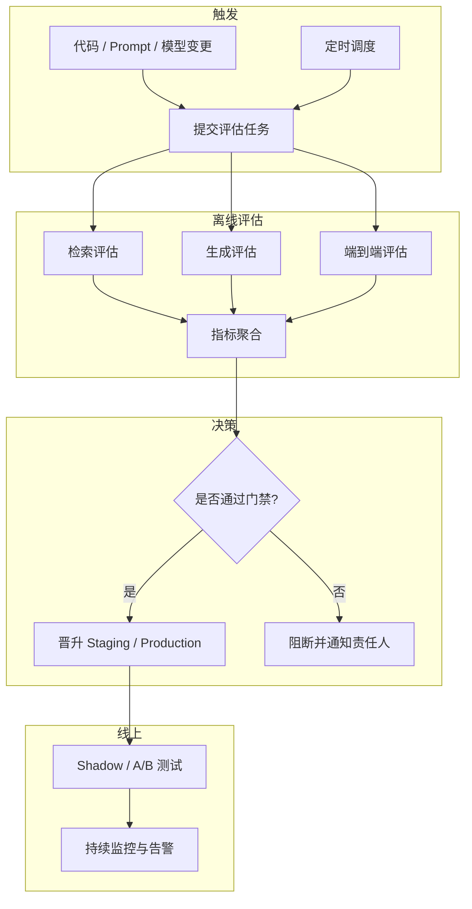

# RAG 系统评估深度解析 (RAG Evaluation Deep Dive)

> 中文简称：RAG 系统评估深度解析

> **一句话理解**: RAG 系统评估不是只看答案对不对，而是要把检索和生成两个环节拆开测量——检索是否找到了相关文档，生成是否忠于检索到的上下文，以及最终回答是否真正解决了用户问题。

---

## 目录

1. [概述](#1-概述)
2. [检索评估：找到对的上下文](#2-检索评估找到对的上下文)
3. [生成评估：忠于上下文并回答问题](#3-生成评估忠于上下文并回答问题)
4. [主流 RAG 评估框架](#4-主流-rag-评估框架)
5. [LLM-as-Judge 与偏见控制](#5-llm-as-judge-与偏见控制)
6. [端到端测试数据集构建](#6-端到端测试数据集构建)
7. [生产级评估流水线](#7-生产级评估流水线)
8. [A/B 测试与线上监控](#8-ab-测试与线上监控)
9. [生产落地 Checklist](#9-生产落地-checklist)
10. [Related](#related)

---

## 1. 概述

### 1.1 为什么 RAG 评估不能只看最终答案

传统问答系统的评估通常只有一个标准：答案对不对。但在 RAG（Retrieval-Augmented Generation）系统中，错误可能来自两个完全不同的环节：

- **检索环节（Retriever）**: 向量数据库或混合搜索引擎没有召回相关文档。
- **生成环节（Generator）**: LLM 拿到了正确的上下文，却产生了幻觉或答非所问。

如果不把这两个环节拆开测量，团队会陷入“猜病因”的困境：到底是 Embedding 模型不够好，还是 Prompt 设计有问题？是 Chunk 切分策略失效，还是 LLM 的指令遵循能力不足？

```
RAG 评估分层
═══════════════════════════════════════════════════════════

用户问题 (Query)
        │
        ▼
┌─────────────────┐
│   检索 (Retriever) │  ← 评估：Recall@K / MRR / NDCG / Context Recall
└────────┬────────┘
         │ 检索结果 (Contexts)
         ▼
┌─────────────────┐
│   生成 (Generator) │  ← 评估：Faithfulness / Answer Relevance / Correctness
└────────┬────────┘
         │ 最终回答 (Answer)
         ▼
      用户满意度 / 业务指标
```

### 1.2 生产环境评估的三个层次

| 层次 | 关注点 | 典型指标 | 决策用途 |
|------|--------|----------|----------|
| **组件评估** | 检索或生成单独表现 | Recall@K, NDCG, Faithfulness | 定位瓶颈、指导算法迭代 |
| **端到端评估** | 完整 RAG 链路 | Answer Correctness, 任务成功率 | 模型发布门禁 |
| **在线评估** | 真实用户与业务效果 | 点击率、转化率、满意度、幻觉投诉率 | 产品决策与回滚 |

---

## 2. 检索评估：找到对的上下文

检索质量是 RAG 系统的天花板。检索失败时，即使 LLM 再强也无法给出可靠回答。

### 2.1 排序与召回指标

在信息检索领域，以下指标被广泛用于评估 Retriever：

| 指标 | 定义 | 适用场景 | 公式要点 |
|------|------|----------|----------|
| **Recall@K** | 前 K 个结果中命中的相关文档比例 | 召回优先的医疗、法律检索 | `命中相关文档数 / 总相关文档数` |
| **Precision@K** | 前 K 个结果中相关文档占比 | 结果列表质量 | `命中相关文档数 / K` |
| **MRR** (Mean Reciprocal Rank) | 首个相关文档排名的倒数均值 | 只需要一个正确答案的 QA | `mean(1 / rank_first_relevant)` |
| **MAP** (Mean Average Precision) | 平均精度的均值 | 多相关文档排序 | 对 Precision@K 做插值平均 |
| **NDCG@K** | 考虑相关度等级和位置折扣的累积增益 | 需要细粒度排序评估 | `DCG@K / IDCG@K` |

**Recall@K** 通常是 RAG 生产环境的第一道红线：如果正确答案不在 Top-K 里，后续生成无从谈起。一般建议 K 取 5 或 10，根据上下文窗口与成本权衡。

### 2.2 Context Precision 与 Context Recall

RAGAS 等框架将检索评估进一步适配到 RAG 场景：

- **Context Precision**: 检索结果中真正被用于回答问题的上下文比例，衡量检索结果是否“精炼”。
- **Context Recall**: 检索结果覆盖真实答案所需信息的比例，衡量检索是否“完整”。

两者结合可以避免“召回了一堆文档，但只有一段有用”的情况。

```python
# 简化的 Context Recall 计算示例
def context_recall(ground_truth_sentences, retrieved_contexts, judge_llm):
    """
    对 ground truth 中的每个 claim，判断是否能从 retrieved_contexts 中推断出来。
    """
    supported = 0
    for claim in ground_truth_sentences:
        if judge_llm.can_infer(claim, retrieved_contexts):
            supported += 1
    return supported / len(ground_truth_sentences)
```

---

## 3. 生成评估：忠于上下文并回答问题

生成评估的核心是判断 LLM 是否“正确使用”了检索到的上下文，并最终回答了用户问题。

### 3.1 Faithfulness（忠实度 /  groundedness）

**Faithfulness** 衡量答案中的每一个 claim 是否都能从检索到的上下文中找到依据。它是抑制幻觉的第一道防线。

计算方式通常分为两步：

1. 从生成的答案中抽取原子化 claim。
2. 用 LLM 或自然语言推理模型判断每个 claim 是否被上下文支持。

```
示例:
Context: "北京 2024 年常住人口约为 2184 万。"
Answer: "北京人口超过 2000 万。"
→ Faithfulness 高（可推断）

Context: "北京 2024 年常住人口约为 2184 万。"
Answer: "北京是中国面积最大的城市。"
→ Faithfulness 低（上下文未提及）
```

### 3.2 Answer Relevance（答案相关性）

该指标评估生成的答案是否直接回应了用户问题。一个答案可能完全忠实于上下文，但如果离题了，仍然质量低下。

实现方式通常包括：

- 根据答案反向生成“假设问题”。
- 计算假设问题与原始问题的语义相似度。
- 或使用 LLM-as-Judge 直接打分。

### 3.3 Answer Correctness（答案正确性）

当存在标准答案（ground truth）时，可以评估最终答案的正确性。RAGAS 将其分解为语义相似度（BERTScore）与事实一致性两个子维度。在客服、医疗、法律等高风险场景中，这是不可或缺的门禁指标。

---

## 4. 主流 RAG 评估框架

生产环境中不建议从零手写评估逻辑，成熟的框架已经封装了指标计算、LLM Judge 调用与结果聚合。

### 4.1 RAGAS

RAGAS 是最流行的开源 RAG 评估框架之一，提供基于 LLM-as-Judge 的指标，几行代码即可跑完一次评估。

```python
from ragas import evaluate
from ragas.metrics import (
    faithfulness,
    answer_relevancy,
    context_precision,
    context_recall,
    answer_correctness,
)
from datasets import Dataset

samples = Dataset.from_list([
    {
        "user_input": "什么是 KV Cache？",
        "retrieved_contexts": [
            "KV Cache 是一种在 Transformer 推理中缓存键值矩阵的技术..."
        ],
        "response": "KV Cache 通过缓存之前 token 的 Key 和 Value，避免重复计算，从而加速自回归解码。",
        "ground_truth": "KV Cache 用于加速 Transformer 解码，通过缓存历史 Key 和 Value 减少重复计算。",
    },
])

result = evaluate(
    samples,
    metrics=[
        faithfulness,
        answer_relevancy,
        context_precision,
        context_recall,
        answer_correctness,
    ],
)
print(result)
```

### 4.2 Ares

Ares 是斯坦福大学提出的自动化 RAG 评估框架，核心特点是使用**合成数据**训练轻量级分类器作为 Judge，从而把评估成本降到远低于调用 GPT-4。

Ares 覆盖三大维度：

- **Context Relevance**: 检索上下文与问题是否相关。
- **Answer Faithfulness**: 答案是否基于上下文。
- **Answer Relevance**: 答案是否与问题相关。

适合对评估成本敏感、需要高频离线回归测试的场景。

### 4.3 TruLens

TruLens 由 TruEra 开源，强调“RAG Triad”：

- **Context Relevance**
- **Groundedness**（即 Faithfulness）
- **Answer Relevance**

它与 LlamaIndex、LangChain 集成紧密，并提供可观测性仪表盘，方便在生产环境中追踪每一次检索与生成的质量。

### 4.4 DeepEval

DeepEval 是一个通用的 LLM 评估框架，内置 RAG 指标、回归测试与 CI/CD 集成。它支持本地模型 Judge，也支持 GPT-4 / Claude，适合希望把 RAG 评估纳入 DevOps 流程的团队。

### 4.5 框架对比

| 框架 | 指标覆盖 | 是否开源 | 核心优势 | 适用场景 |
|------|----------|----------|----------|----------|
| **RAGAS** | Faithfulness, Relevance, Context Precision/Recall, Correctness | ✅ | 社区活跃、API 简洁 | 快速离线评估、实验迭代 |
| **Ares** | Context Relevance, Faithfulness, Answer Relevance | ✅ | 合成数据训练 Judge，成本低 | 大规模回归测试 |
| **TruLens** | RAG Triad + 可观测性 | ✅ | 与 LlamaIndex/LangChain 深度集成 | 生产监控与调试 |
| **DeepEval** | RAG + 通用 LLM 指标 | ✅ | CI/CD 集成完善 | DevOps 流水线 |
| **LlamaIndex Eval** | Response / Retrieval / Faithfulness | ✅ | 与 LlamaIndex 应用无缝结合 | LlamaIndex 项目 |

---

## 5. LLM-as-Judge 与偏见控制

在 RAG 评估中，Faithfulness、Answer Relevance、Context Precision 等指标通常依赖 LLM 作为评委。LLM-as-Judge 虽然成本远低于人工评估，但存在系统性偏见，必须主动控制。

### 5.1 常见偏见类型

| 偏见 | 表现 | 缓解策略 |
|------|------|----------|
| **位置偏见** | 成对比较中倾向选第一个或最后一个选项 | 交换 A/B 位置多次评估，不一致判为 Tie |
| **长度偏见** | 倾向给更长的回答更高分 | Rubric 中加入简洁性维度，或归一化长度 |
| **自我偏见** | Judge 偏好自己模型生成的文本风格 | 使用与待评模型不同系列的 Judge |
| **格式偏见** | 偏好 Markdown、列表、代码块等格式 | 评估前统一转为纯文本 |
| **权威引用偏见** | 盲目给带引用的回答高分 | Rubric 区分“引用数量”与“引用支持 claim 的有效性” |

### 5.2 评委模型选择建议

| 评估维度 | 推荐 Judge | 理由 |
|----------|------------|------|
| 通用问答质量 | GPT-4o / Claude 3.5 Sonnet | 综合能力最强 |
| 长上下文忠实度 | Claude 3.5 Sonnet / GPT-4o | 长文本理解稳定 |
| 代码/技术文档 | Claude 3.5 Sonnet / o1-mini | 代码与技术概念判断更准 |
| 多语言 RAG | GPT-4o / Qwen-Max | 跨语言能力均衡 |
| 低成本高频回归 | 本地 fine-tuned 小模型 / Ares 分类器 | 单次评估成本极低 |

### 5.3 评委校准

定期用人工标注的“黄金评估集”校准 Judge：

```python
from sklearn.metrics import cohen_kappa_score
from scipy.stats import pearsonr

def calibrate_judge(human_scores, llm_scores):
    """
    计算人工与 LLM Judge 的一致性。
    Cohen's Kappa > 0.8 为优秀，0.6-0.8 为可接受。
    """
    kappa = cohen_kappa_score(human_scores, llm_scores)
    pearson_r, _ = pearsonr(human_scores, llm_scores)
    return {
        "cohens_kappa": round(kappa, 3),
        "pearson_r": round(pearson_r, 3),
        "quality": "excellent" if kappa > 0.8 else ("good" if kappa > 0.6 else "fair")
    }
```

---

## 6. 端到端测试数据集构建

高质量的测试集是可信评估的前提。RAG 测试集需要覆盖检索与生成两个环节，并包含真实业务分布中的“难例”。

### 6.1 测试集构成

一个完整的 RAG 端到端测试集至少包含：

| 字段 | 说明 | 是否必需 |
|------|------|----------|
| `query` | 用户真实问题 | 是 |
| `ground_truth_answer` | 标准答案 | 是 |
| `ground_truth_contexts` | 支撑答案的真实文档片段 | 是（用于检索评估） |
| `difficulty` | 简单 / 中等 / 困难 | 否（用于分层分析） |
| `category` | 业务类别或主题标签 | 否（用于错误归因） |
| `adversarial` | 是否对抗样本 | 否（用于安全/鲁棒性测试） |

### 6.2 困难负例与对抗样本

- **困难负例（Hard Negatives）**: 与 query 语义相近、但不包含正确答案的文档。用来检验 Embedding 模型和 Reranker 的判别能力。
- **对抗样本**: 例如同义词替换、拼写错误、长尾术语、多语言混合、指代消解等，用来测试 RAG 系统的鲁棒性。

### 6.3 版本控制与合规

测试集必须使用 DVC 或类似工具版本化，并与模型版本绑定：

```bash
# 使用 DVC 管理 RAG 评估数据
dvc add datasets/rag_eval_v2.1.parquet
git add datasets/rag_eval_v2.1.parquet.dvc
git commit -m "add RAG eval v2.1: expand legal-domain hard negatives"

# CI 中拉取指定版本
dvc pull datasets/rag_eval_v2.1.parquet.dvc
```

同时，测试集应经过隐私扫描，避免包含 PII、商业秘密或受监管数据。

---

## 7. 生产级评估流水线

把 RAG 评估嵌入 CI/CD 和发布流程，是避免“线下高分、线上翻车”的关键。

### 7.1 流水线架构



### 7.2 评估配置示例

```yaml
# rag_eval_config.yaml
rag_evaluation:
  name: "rag-weekly-eval"
  schedule: "0 2 * * 1"  # 每周一凌晨 2 点

  dataset:
    path: "datasets/rag_eval_v2.1.parquet"
    version: "v2.1"

  retriever:
    top_k: 10
    metrics:
      - recall@5
      - recall@10
      - mrr
      - ndcg@10

  generator:
    judge_model: "gpt-4o"
    temperature: 0.0
    metrics:
      - faithfulness
      - answer_relevancy
      - context_precision
      - context_recall
      - answer_correctness

  gates:
    retrieval:
      recall@5: { min: 0.80 }
      ndcg@10: { min: 0.75 }
    generation:
      faithfulness: { min: 0.85 }
      answer_relevancy: { min: 0.80 }
      answer_correctness: { min: 0.75 }

  regression:
    baseline_model: "production/rag-v1.4"
    max_degradation_percent: 3.0
```

### 7.3 门禁策略

建议设置多级门禁：

- **开发环境**: 宽松，允许快速迭代，关注相对提升。
- **Staging**: 严格，所有核心指标必须高于阈值。
- **Production**: 最严格，任何显著退化（如 >2%）都触发阻断。

---

## 8. A/B 测试与线上监控

离线评估再完善，也无法完全替代真实用户场景。生产环境必须配合 A/B 测试和线上监控。

### 8.1 关键线上指标

| 指标 | 类型 | 说明 |
|------|------|------|
| **检索命中率** | 系统 | 用户问题在 Top-K 中找到相关文档的比例 |
| **答案采纳率** | 产品 | 用户对 RAG 回答点赞或采纳的比例 |
| **幻觉投诉率** | 质量 | 用户标记答案包含错误信息的比例 |
| **引用点击率** | 产品 | 用户点击答案中引用来源的比例 |
| **P99 延迟** | 工程 | 端到端响应延迟的 99 分位 |
| **单次请求成本** | 成本 | Embedding + Rerank + LLM 的综合成本 |

### 8.2 A/B 测试实施要点

- **稳定用户分组**: 同一用户多次请求应落在同一实验组，避免体验不一致。
- **SRM 检查**: 实验组与对照组样本比例必须接近预期，否则分流逻辑可能有问题。
- **指标分层**: 同时关注业务指标（转化率）、质量指标（幻觉率）和成本指标（平均延迟）。
- **最小样本量**: 实验前用功效分析估算所需样本，避免过早下结论。

---

## 9. 生产落地 Checklist

```markdown
- [ ] 已定义 RAG 评估目标：检索、生成、端到端三层指标清晰。
- [ ] 已构建并版本化端到端测试集，包含 ground truth answer 与 contexts。
- [ ] 已在测试集中加入困难负例、对抗样本和业务长尾案例。
- [ ] 已选择至少一个评估框架（RAGAS / Ares / TruLens / DeepEval）。
- [ ] 已配置 LLM-as-Judge，temperature=0，并使用多评委或位置交换去偏。
- [ ] 已用人工标注集校准 Judge，Cohen's Kappa ≥ 0.6。
- [ ] 已在 CI/CD 中集成 RAG 评估门禁，并设置回归阈值。
- [ ] 已建立线上监控：检索命中率、幻觉投诉率、P99 延迟、单次成本。
- [ ] 已制定 A/B 测试方案：用户分组、SRM 检查、最小样本量、回滚策略。
- [ ] 已定期复盘：每周分析失败案例，迭代测试集与评估 Rubric。
```

---

## Related

- [[08_模型评估/01_评估基础/06_模型评估|模型评估 — 评估方法论全景]]
- [[08_模型评估/Evaluation_Automation_2026|自动化模型评估 2026 — CI/CD 评估流水线]]
- [[08_模型评估/04_评估工具/03_LLM_as_Judge_深入分析|LLM-as-Judge 深度解析 — 评委模型与偏见控制]]
- [[概念/General/online-evaluation|在线评估 — A/B 测试与线上监控]]
- [[09_测试/02_测试框架/06_RAGAS_深入分析|RAGAS — RAG 评估框架]]
- [[14_RAG系统/05_RAG生产实践/05_RAG生产实践_架构_深入分析|RAG 生产架构深度解析 — RAG 系统生产级设计]]
