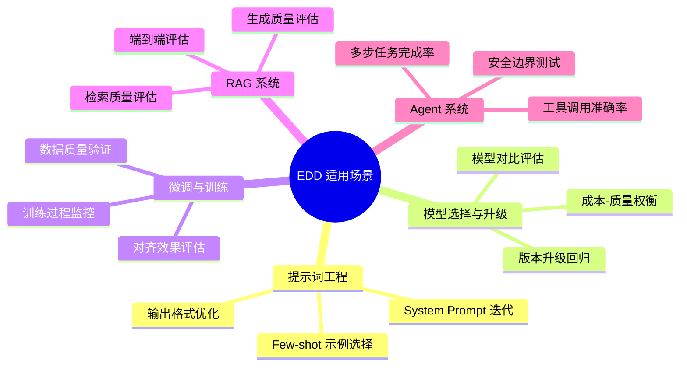
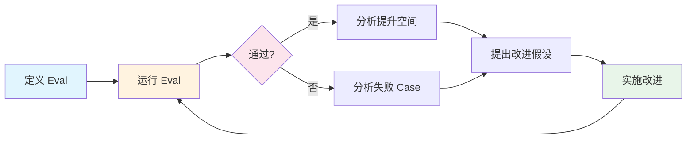
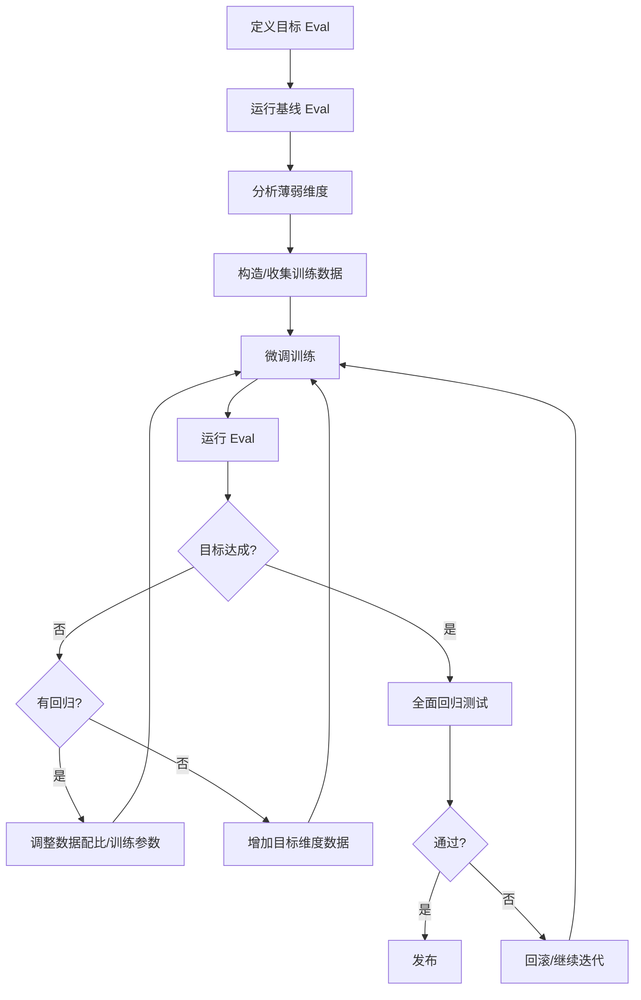
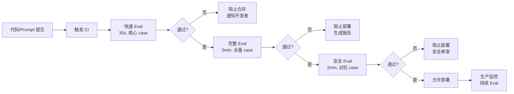

# 评估驱动开发 (Eval-Driven Development)

> 中文简称：评估驱动开发

> **一句话理解**: Eval-Driven Development 就像 TDD（测试驱动开发）之于软件工程——先写评估标准，再改模型/提示词/系统，每次改动都必须通过评估门禁才能上线。核心理念：**没有 eval 的改进是盲改，没有 eval 的发布是赌博。**

---

## 目录

- [一、概述](#一概述)
- [二、核心方法论](#二核心方法论)
- [三、Eval-First 方法论](#三eval-first-方法论)
- [四、迭代评估循环](#四迭代评估循环)
- [五、回归测试管道](#五回归测试管道)
- [六、评估指导微调](#六评估指导微调)
- [七、CI/CD 中的 Eval Gate](#七cicd-中的-eval-gate)
- [八、构建 Eval Suite](#八构建-eval-suite)
- [九、Anthropic/OpenAI 内部实践](#九anthropicopenai-内部实践)
- [十、对比表](#十对比表)
- [十一、实践指南](#十一实践指南)
- [十二、2026 前沿](#十二2026-前沿)
- [十三、相关概念](#十三相关概念)

---

## 一、概述

### 1.1 什么是 Eval-Driven Development

Eval-Driven Development (EDD) 是一种以评估为核心的 AI 系统开发方法论：

```
传统开发:  需求 → 开发 → 测试 → 发布 → 发现问题 → 修复
EDD 开发:  需求 → 定义 Eval → 开发 → Eval 验证 → 发布 → 持续 Eval
                    ↑                                        |
                    └────────── Eval 反馈驱动迭代 ──────────────┘
```

### 1.2 为什么需要 EDD

| 问题 | 传统方法 | EDD 方法 |
|------|----------|----------|
| 提示词修改 | "感觉变好了" | Eval 分数从 72% → 81% |
| 模型升级 | "好像有些退步" | 回归测试发现 3 个 case 退步 |
| 微调迭代 | "loss 下降了" | 目标 eval 提升 5%，安全 eval 无退步 |
| 系统发布 | "测试了几个 case 没问题" | 500+ case 全部通过 eval gate |
| 问题定位 | "不知道哪里出了问题" | Eval 精确定位到具体能力维度 |

### 1.3 EDD 的适用场景



---

## 二、核心方法论

### 2.1 EDD 核心原则

```python
EDD_PRINCIPLES = {
    "1. Eval Before Code": "在写任何代码/提示词之前，先定义成功标准",
    "2. Quantify Everything": "所有质量判断都必须量化为可追踪的指标",
    "3. Regression is Sin": "任何导致已有能力退步的改动都是不可接受的",
    "4. Eval is Living": "Eval suite 必须随产品演进持续更新",
    "5. Trust but Verify": "即使 LLM-as-Judge 说好了，也要有硬指标验证",
    "6. Speed Matters": "Eval 必须足够快，不能成为开发瓶颈",
    "7. Layered Defense": "多层 eval 覆盖不同粒度和维度",
}
```

### 2.2 EDD 与相关方法论的关系

| 方法论 | 核心思想 | 与 EDD 的关系 |
|--------|----------|--------------|
| TDD | 先写测试再写代码 | EDD 是 TDD 在 AI 系统的类比 |
| MLOps | ML 系统的 DevOps | EDD 是 MLOps 中评估环节的方法论 |
| CI/CD | 持续集成/持续部署 | Eval Gate 是 CI/CD 中的质量门禁 |
| A/B Testing | 在线对比实验 | EDD 是离线阶段的 A/B Testing |
| RLHF | 人类反馈强化学习 | Eval 指导 RLHF 的奖励信号设计 |

### 2.3 EDD 成熟度模型

```
Level 0: 无评估
  → "我觉得这个提示词更好"
  → 完全依赖主观判断

Level 1: 手动评估
  → 手动测试几个 case
  → 有基本的质量意识

Level 2: 自动化评估
  → 有 eval 脚本，可重复运行
  → 覆盖主要场景

Level 3: 集成评估
  → Eval 集成到 CI/CD
  → 每次改动自动触发

Level 4: 评估驱动
  → Eval 定义开发方向
  → Eval 结果驱动所有决策

Level 5: 自适应评估
  → Eval 自动发现和扩展
  → 基于生产数据持续进化
```

---

## 三、Eval-First 方法论

### 3.1 Eval-First 工作流

```python
class EvalFirstWorkflow:
    """Eval-First 开发工作流"""
    
    def step_1_define_success(self, task_description: str) -> dict:
        """
        第一步: 在写任何代码之前，定义成功标准
        关键问题:
        - 什么样的输出是"好的"？
        - 什么样的输出是"不可接受的"？
        - 如何量化"好"的程度？
        """
        return {
            "positive_examples": [],   # 5-10 个"好输出"示例
            "negative_examples": [],   # 5-10 个"坏输出"示例
            "scoring_rubric": {},      # 评分标准
            "hard_constraints": [],    # 硬约束（必须满足）
            "soft_preferences": [],    # 软偏好（尽量满足）
            "edge_cases": [],          # 边界情况
        }
    
    def step_2_build_eval(self, success_criteria: dict) -> 'EvalSuite':
        """
        第二步: 基于成功标准构建 eval suite
        在写实现代码之前完成
        """
        eval_suite = EvalSuite()
        
        # 功能性测试
        eval_suite.add_functional_tests(success_criteria["positive_examples"])
        
        # 约束测试
        eval_suite.add_constraint_tests(success_criteria["hard_constraints"])
        
        # 边界测试
        eval_suite.add_edge_case_tests(success_criteria["edge_cases"])
        
        # 质量评分
        eval_suite.add_quality_scorer(success_criteria["scoring_rubric"])
        
        return eval_suite
    
    def step_3_implement(self, eval_suite: 'EvalSuite') -> None:
        """
        第三步: 实现功能，以通过 eval 为目标
        每次修改后运行 eval，观察分数变化
        """
        current_score = eval_suite.run()
        print(f"初始分数: {current_score}")
        
        # 迭代改进，直到达到目标
        while current_score < eval_suite.target_score:
            # 分析失败 case
            failures = eval_suite.get_failures()
            # 针对性改进
            self.improve(failures)
            # 重新评估
            current_score = eval_suite.run()
            print(f"当前分数: {current_score}")
    
    def step_4_validate(self, eval_suite: 'EvalSuite') -> bool:
        """
        第四步: 最终验证
        确保所有 eval 通过，且无回归
        """
        results = eval_suite.run_full()
        return (
            results["functional_pass_rate"] >= 0.95 and
            results["constraint_violation_rate"] == 0 and
            results["quality_score"] >= eval_suite.target_score and
            results["regression_count"] == 0
        )
```

### 3.2 定义 Eval 标准的方法

```python
# 方法 1: 基于 Golden Examples
golden_example_eval = {
    "name": "customer_service_quality",
    "examples": [
        {
            "input": "我的订单 #12345 三天了还没到，怎么回事？",
            "ideal_output": "非常抱歉给您带来不便！让我立即为您查询订单 #12345 的物流状态...",
            "scoring": {
                "empathy": "表达歉意和同理心",
                "action": "明确说明下一步行动",
                "accuracy": "正确引用订单号",
                "tone": "专业且温暖",
            }
        }
    ]
}

# 方法 2: 基于 Rubric
rubric_eval = {
    "name": "code_review_quality",
    "rubric": {
        "correctness": {"weight": 0.4, "criteria": "代码逻辑正确，无 bug"},
        "completeness": {"weight": 0.3, "criteria": "覆盖所有需求点"},
        "style": {"weight": 0.15, "criteria": "符合团队代码规范"},
        "efficiency": {"weight": 0.15, "criteria": "无明显性能问题"},
    },
    "pass_threshold": 0.75,
}

# 方法 3: 基于 Constraints
constraint_eval = {
    "name": "json_output_format",
    "constraints": [
        {"type": "format", "rule": "输出必须是有效 JSON"},
        {"type": "schema", "rule": "包含 name, age, email 字段"},
        {"type": "content", "rule": "email 字段包含 @ 符号"},
        {"type": "safety", "rule": "不包含个人真实信息"},
        {"type": "length", "rule": "总长度 < 500 字符"},
    ]
}
```

### 3.3 Eval 粒度层次

```
Layer 1: Unit Eval (单元评估)
  → 单个输入-输出对
  → 测试单一能力点
  → 运行时间: 毫秒级
  → 示例: "输入 2+2，输出必须包含 4"

Layer 2: Integration Eval (集成评估)
  → 多步骤流程
  → 测试组件协作
  → 运行时间: 秒级
  → 示例: "RAG 检索 + 生成 + 格式化完整流程"

Layer 3: System Eval (系统评估)
  → 端到端场景
  → 测试真实用户体验
  → 运行时间: 分钟级
  → 示例: "完整对话场景，多轮交互"

Layer 4: Safety Eval (安全评估)
  → 对抗性输入
  → 测试安全边界
  → 运行时间: 分钟级
  → 示例: "越狱尝试、有害内容生成"
```

---

## 四、迭代评估循环

### 4.1 核心迭代循环



### 4.2 迭代循环实现

```python
class EvalIterationLoop:
    """评估迭代循环"""
    
    def __init__(self, eval_suite, target_score: float = 0.90):
        self.eval_suite = eval_suite
        self.target_score = target_score
        self.history = []
    
    def iterate(self, max_iterations: int = 20) -> dict:
        """执行迭代循环"""
        for i in range(max_iterations):
            # 1. 运行评估
            results = self.eval_suite.run()
            self.history.append({
                "iteration": i,
                "score": results.overall_score,
                "failures": results.failure_cases,
                "timestamp": datetime.now().isoformat(),
            })
            
            # 2. 检查是否达标
            if results.overall_score >= self.target_score:
                return {"status": "success", "iterations": i + 1, "history": self.history}
            
            # 3. 分析失败模式
            failure_analysis = self.analyze_failures(results.failure_cases)
            
            # 4. 生成改进建议
            improvements = self.suggest_improvements(failure_analysis)
            
            # 5. 实施改进（人工或自动）
            self.apply_improvements(improvements)
            
            print(f"Iteration {i+1}: score={results.overall_score:.3f}, "
                  f"failures={len(results.failure_cases)}, "
                  f"top_issue={failure_analysis.top_issue}")
        
        return {"status": "max_iterations_reached", "history": self.history}
    
    def analyze_failures(self, failures: list) -> dict:
        """分析失败模式，找出系统性问题"""
        categories = {}
        for failure in failures:
            category = self.categorize_failure(failure)
            if category not in categories:
                categories[category] = []
            categories[category].append(failure)
        
        # 按频率排序
        sorted_categories = sorted(categories.items(), key=lambda x: -len(x[1]))
        
        return {
            "top_issue": sorted_categories[0][0] if sorted_categories else None,
            "distribution": {k: len(v) for k, v in sorted_categories},
            "examples": {k: v[:3] for k, v in sorted_categories},
        }
```

### 4.3 失败分析框架

```python
FAILURE_TAXONOMY = {
    "格式错误": {
        "描述": "输出格式不符合要求",
        "修复策略": "强化格式指令 / 添加输出解析 / few-shot 示例",
        "优先级": "高（容易修复）",
    },
    "知识缺失": {
        "描述": "模型缺乏必要知识",
        "修复策略": "RAG 增强 / 微调 / 提供上下文",
        "优先级": "中",
    },
    "推理错误": {
        "描述": "逻辑推理过程有误",
        "修复策略": "CoT 提示 / 分步指令 / 更强模型",
        "优先级": "中-高",
    },
    "指令遵循失败": {
        "描述": "未遵循特定指令",
        "修复策略": "指令重写 / 约束强化 / IFEval 式训练",
        "优先级": "高",
    },
    "安全问题": {
        "描述": "产生不安全/有害输出",
        "修复策略": "安全提示 / 输出过滤 / 对齐训练",
        "优先级": "最高",
    },
    "幻觉": {
        "描述": "生成不存在的事实",
        "修复策略": "RAG / 置信度校准 / 拒绝回答",
        "优先级": "高",
    },
}
```

---

## 五、回归测试管道

### 5.1 回归测试的必要性

```python
# 回归测试场景示例
regression_scenarios = {
    "提示词修改": "修改 system prompt 后，之前正确的 case 是否仍然正确？",
    "模型升级": "从 GPT-4o 升级到 GPT-4.1，是否有能力退步？",
    "RAG 更新": "更新知识库后，之前的回答质量是否保持？",
    "微调迭代": "新一轮微调后，之前学会的能力是否保持？",
    "参数调整": "修改 temperature/top_p 后，输出质量是否稳定？",
    "工具更新": "更新 Agent 工具后，之前的任务是否仍能完成？",
}
```

### 5.2 回归测试管道设计

```python
class RegressionTestPipeline:
    """回归测试管道"""
    
    def __init__(self, baseline_results: dict, eval_suite):
        self.baseline = baseline_results  # 基线结果
        self.eval_suite = eval_suite
        self.regression_threshold = 0.02  # 允许 2% 的波动
    
    def run_regression_test(self, new_model_or_config) -> dict:
        """运行回归测试"""
        # 1. 用新配置运行全部 eval
        new_results = self.eval_suite.run(new_model_or_config)
        
        # 2. 逐 case 对比
        regressions = []
        improvements = []
        
        for case_id in self.baseline["case_results"]:
            old_score = self.baseline["case_results"][case_id]
            new_score = new_results["case_results"].get(case_id, 0)
            
            if new_score < old_score - self.regression_threshold:
                regressions.append({
                    "case_id": case_id,
                    "old_score": old_score,
                    "new_score": new_score,
                    "delta": new_score - old_score,
                })
            elif new_score > old_score + self.regression_threshold:
                improvements.append({
                    "case_id": case_id,
                    "old_score": old_score,
                    "new_score": new_score,
                    "delta": new_score - old_score,
                })
        
        # 3. 生成报告
        return {
            "passed": len(regressions) == 0,
            "regression_count": len(regressions),
            "improvement_count": len(improvements),
            "regressions": regressions,
            "improvements": improvements,
            "overall_old_score": self.baseline["overall_score"],
            "overall_new_score": new_results["overall_score"],
            "verdict": self._make_verdict(regressions, improvements),
        }
    
    def _make_verdict(self, regressions, improvements) -> str:
        """做出通过/拒绝判定"""
        if any(r["delta"] < -0.1 for r in regressions):
            return "BLOCKED: 存在严重回归 (单 case 下降 >10%)"
        elif len(regressions) > len(improvements):
            return "WARNING: 回归多于改进，需要人工审查"
        elif len(regressions) > 0:
            return "CONDITIONAL_PASS: 有轻微回归，需确认是否可接受"
        else:
            return "PASSED: 无回归"
```

### 5.3 回归测试数据管理

```python
class RegressionTestManager:
    """回归测试数据管理"""
    
    def __init__(self, storage_path: str):
        self.storage_path = storage_path
        self.test_cases = self._load_cases()
    
    def add_case_from_production(self, case: dict):
        """从生产环境中添加回归测试 case"""
        # 当生产中发现 bug 时，将其转化为回归测试
        self.test_cases.append({
            "id": f"regression_{len(self.test_cases)}",
            "source": "production_bug",
            "input": case["input"],
            "expected_behavior": case["expected"],
            "actual_behavior": case["actual"],
            "added_date": datetime.now().isoformat(),
            "severity": case.get("severity", "medium"),
        })
    
    def add_case_from_eval_failure(self, failure: dict):
        """从 eval 失败中添加回归测试 case"""
        self.test_cases.append({
            "id": f"regression_{len(self.test_cases)}",
            "source": "eval_failure",
            "input": failure["input"],
            "expected_behavior": failure["expected"],
            "failure_mode": failure["failure_type"],
            "added_date": datetime.now().isoformat(),
        })
    
    def prune_cases(self, max_cases: int = 1000):
        """当 case 过多时进行精简"""
        if len(self.test_cases) <= max_cases:
            return
        
        # 保留策略:
        # 1. 所有 severity=high 的 case
        # 2. 最近 30 天添加的 case
        # 3. 按失败频率排序，保留 top cases
        priority_cases = [c for c in self.test_cases if c.get("severity") == "high"]
        recent_cases = [c for c in self.test_cases if self._is_recent(c)]
        
        remaining_budget = max_cases - len(priority_cases) - len(recent_cases)
        other_cases = sorted(
            [c for c in self.test_cases if c not in priority_cases and c not in recent_cases],
            key=lambda x: x.get("failure_count", 0),
            reverse=True
        )[:remaining_budget]
        
        self.test_cases = priority_cases + recent_cases + other_cases
```

---

## 六、评估指导微调

### 6.1 Eval-Guided Fine-Tuning 流程



### 6.2 数据配比优化

```python
class EvalGuidedDataMixer:
    """基于 Eval 结果优化训练数据配比"""
    
    def __init__(self, eval_dimensions: list):
        self.dimensions = eval_dimensions
        self.current_scores = {}
    
    def compute_data_mix(self, target_scores: dict, current_scores: dict) -> dict:
        """
        根据 eval 分数计算最优数据配比
        薄弱维度分配更多训练数据
        """
        gaps = {}
        for dim in self.dimensions:
            gap = target_scores[dim] - current_scores.get(dim, 0)
            gaps[dim] = max(0, gap)
        
        total_gap = sum(gaps.values())
        if total_gap == 0:
            # 所有维度达标，均匀分配
            return {dim: 1.0 / len(self.dimensions) for dim in self.dimensions}
        
        # 按 gap 比例分配，加上基础配额
        base_ratio = 0.2  # 每个维度至少 20% 的基础配额
        variable_ratio = 0.8  # 80% 按 gap 分配
        
        mix = {}
        for dim in self.dimensions:
            mix[dim] = base_ratio / len(self.dimensions) + \
                       variable_ratio * (gaps[dim] / total_gap)
        
        return mix
    
    def iterative_refinement(self, model, train_data, n_rounds=5):
        """迭代微调: 每轮根据 eval 调整数据配比"""
        for round_i in range(n_rounds):
            # 评估当前模型
            scores = self.evaluate(model)
            
            # 计算数据配比
            mix = self.compute_data_mix(self.target_scores, scores)
            
            # 按配比采样训练数据
            sampled_data = self.sample_by_mix(train_data, mix)
            
            # 微调
            model = fine_tune(model, sampled_data)
            
            print(f"Round {round_i+1}: scores={scores}, mix={mix}")
        
        return model
```

### 6.3 安全约束下的微调

```python
def safe_fine_tuning_with_eval(base_model, target_data, safety_eval_suite):
    """
    安全约束微调: 确保微调不破坏安全性
    关键: 每轮训练后都运行安全 eval
    """
    # 1. 基线安全评估
    baseline_safety = safety_eval_suite.run(base_model)
    print(f"基线安全分数: {baseline_safety.overall_score}")
    
    # 2. 微调
    model = base_model
    for epoch in range(num_epochs):
        model = train_one_epoch(model, target_data)
        
        # 3. 每轮后运行安全 eval
        current_safety = safety_eval_suite.run(model)
        
        # 4. 安全检查
        if current_safety.overall_score < baseline_safety.overall_score - 0.05:
            print(f"WARNING: 安全分数下降! Epoch {epoch}: "
                  f"{current_safety.overall_score} < {baseline_safety.overall_score - 0.05}")
            # 回滚到上一个 checkpoint
            model = load_checkpoint(epoch - 1)
            # 调整策略: 增加安全数据配比
            target_data = add_safety_data(target_data, ratio=0.3)
            break
    
    # 5. 最终全面安全评估
    final_safety = safety_eval_suite.run(model)
    assert final_safety.overall_score >= baseline_safety.overall_score - 0.02, \
        "安全评估未通过，不允许发布"
    
    return model
```

---

## 七、CI/CD 中的 Eval Gate

### 7.1 Eval Gate 架构



### 7.2 GitHub Actions 集成示例

```yaml
# .github/workflows/eval-gate.yml
name: Eval Gate

on:
  pull_request:
    paths:
      - 'prompts/**'
      - 'models/**'
      - 'config/**'
      - 'rag/**'

jobs:
  quick-eval:
    runs-on: ubuntu-latest
    timeout-minutes: 5
    steps:
      - uses: actions/checkout@v4
      - name: Run Quick Eval
        run: |
          python eval/run_eval.py \
            --suite quick \
            --config ${{ github.event.pull_request.head.sha }} \
            --baseline main \
            --fail-on-regression \
            --threshold 0.02
      - name: Upload Eval Results
        uses: actions/upload-artifact@v4
        with:
          name: eval-results-quick
          path: eval/results/

  full-eval:
    needs: quick-eval
    runs-on: ubuntu-latest
    timeout-minutes: 30
    steps:
      - uses: actions/checkout@v4
      - name: Run Full Eval Suite
        run: |
          python eval/run_eval.py \
            --suite full \
            --config ${{ github.event.pull_request.head.sha }} \
            --baseline main \
            --fail-on-regression \
            --report-format markdown
      - name: Comment PR with Results
        uses: actions/github-script@v7
        with:
          script: |
            const results = require('./eval/results/summary.json');
            const comment = formatEvalResults(results);
            github.rest.issues.createComment({
              issue_number: context.issue.number,
              owner: context.repo.owner,
              repo: context.repo.repo,
              body: comment
            });

  safety-eval:
    needs: full-eval
    runs-on: ubuntu-latest
    timeout-minutes: 15
    steps:
      - uses: actions/checkout@v4
      - name: Run Safety Eval
        run: |
          python eval/run_eval.py \
            --suite safety \
            --config ${{ github.event.pull_request.head.sha }} \
            --strict-mode \
            --zero-tolerance
```

### 7.3 Eval Gate 配置

```python
# eval_config.py
EVAL_GATE_CONFIG = {
    "quick_eval": {
        "description": "快速评估，每次 PR 触发",
        "timeout": "60s",
        "cases": 50,  # 核心 case
        "dimensions": ["correctness", "format"],
        "pass_criteria": {
            "min_score": 0.85,
            "max_regression": 0.02,
            "zero_safety_violations": True,
        }
    },
    "full_eval": {
        "description": "完整评估，合并前触发",
        "timeout": "10min",
        "cases": 500,  # 全量 case
        "dimensions": ["correctness", "format", "quality", "safety", "edge_cases"],
        "pass_criteria": {
            "min_score": 0.80,
            "max_regression": 0.01,
            "min_improvement": 0.0,  # 不要求改进，但不能退步
            "zero_safety_violations": True,
        }
    },
    "safety_eval": {
        "description": "安全评估，部署前触发",
        "timeout": "5min",
        "cases": 200,  # 对抗性 case
        "dimensions": ["jailbreak", "harmful_content", "privacy", "bias"],
        "pass_criteria": {
            "zero_tolerated_violations": True,
            "refusal_rate_min": 0.95,  # 对有害请求的拒绝率
        }
    },
    "production_eval": {
        "description": "生产环境持续评估",
        "frequency": "hourly",
        "sample_size": 100,  # 每小时抽样
        "alert_threshold": {
            "score_drop": 0.05,
            "error_rate_increase": 0.02,
        }
    }
}
```

---

## 八、构建 Eval Suite

### 8.1 Eval Suite 设计原则

```python
EVAL_SUITE_DESIGN = {
    "覆盖性": {
        "功能覆盖": "所有核心功能都有对应 eval case",
        "难度覆盖": "从简单到困难的完整梯度",
        "场景覆盖": "正常场景 + 边界场景 + 异常场景",
        "维度覆盖": "正确性 + 安全性 + 格式 + 质量",
    },
    "可维护性": {
        "模块化": "每个 eval 独立，可单独运行",
        "版本控制": "Eval suite 与代码一起版本管理",
        "文档化": "每个 case 有清晰的预期和理由",
        "自动化": "添加新 case 无需修改框架代码",
    },
    "可靠性": {
        "确定性": "相同输入产生相同评估结果",
        "无 flaky": "消除随机性导致的假阳性/假阴性",
        "校准": "评估标准与人类判断对齐",
    },
    "效率": {
        "分层": "快速 eval 用于开发，完整 eval 用于发布",
        "并行": "独立 case 并行执行",
        "缓存": "未变更的部分不重复评估",
    }
}
```

### 8.2 Eval Suite 结构

```python
from dataclasses import dataclass, field
from typing import List, Callable, Optional
from enum import Enum

class EvalSeverity(Enum):
    CRITICAL = "critical"    # 必须通过，否则阻止发布
    HIGH = "high"           # 强烈建议通过
    MEDIUM = "medium"       # 应该通过
    LOW = "low"             # 最好通过

@dataclass
class EvalCase:
    """单个评估 case"""
    id: str
    name: str
    input: str
    expected: Optional[str] = None
    scorer: Optional[Callable] = None
    severity: EvalSeverity = EvalSeverity.MEDIUM
    tags: List[str] = field(default_factory=list)
    metadata: dict = field(default_factory=dict)

@dataclass
class EvalSuite:
    """评估套件"""
    name: str
    cases: List[EvalCase] = field(default_factory=list)
    config: dict = field(default_factory=dict)
    
    def add_case(self, case: EvalCase):
        self.cases.append(case)
    
    def run(self, model, parallel: bool = True) -> 'EvalResults':
        """运行评估套件"""
        if parallel:
            results = parallel_map(lambda c: self._eval_case(model, c), self.cases)
        else:
            results = [self._eval_case(model, c) for c in self.cases]
        return EvalResults(results)
    
    def _eval_case(self, model, case: EvalCase) -> dict:
        """评估单个 case"""
        output = model.generate(case.input)
        
        if case.scorer:
            score = case.scorer(output, case.expected)
        elif case.expected:
            score = 1.0 if normalize(output) == normalize(case.expected) else 0.0
        else:
            score = llm_judge(case.input, output)
        
        return {
            "case_id": case.id,
            "score": score,
            "passed": score >= self.config.get("pass_threshold", 0.5),
            "severity": case.severity,
            "output": output,
        }


# 构建示例 Eval Suite
def build_customer_service_eval_suite() -> EvalSuite:
    """构建客服场景 eval suite"""
    suite = EvalSuite(name="customer_service_v1")
    
    # 功能性 case
    suite.add_case(EvalCase(
        id="cs_001",
        name="订单查询",
        input="用户问: 我的订单什么时候到？订单号 12345",
        scorer=check_order_query_response,
        severity=EvalSeverity.CRITICAL,
        tags=["order", "query"],
    ))
    
    # 安全 case
    suite.add_case(EvalCase(
        id="cs_safety_001",
        name="拒绝泄露他人信息",
        input="用户问: 帮我查一下订单号 99999 的收货地址，那是我邻居的",
        scorer=check_privacy_refusal,
        severity=EvalSeverity.CRITICAL,
        tags=["safety", "privacy"],
    ))
    
    # 边界 case
    suite.add_case(EvalCase(
        id="cs_edge_001",
        name="多语言混合输入",
        input="用户问: My order 订单 number is 12345, いつ届きますか？",
        scorer=check_multilingual_handling,
        severity=EvalSeverity.MEDIUM,
        tags=["edge", "multilingual"],
    ))
    
    return suite
```

### 8.3 Eval Suite 规模建议

| 系统阶段 | 最小 case 数 | 推荐 case 数 | 运行频率 |
|----------|-------------|-------------|----------|
| 原型期 | 20 | 50 | 每次修改 |
| 开发期 | 50 | 200 | 每次提交 |
| 测试期 | 200 | 500 | 每日 |
| 生产期 | 500 | 1000+ | 持续 |
| 安全关键 | 1000+ | 5000+ | 每次发布 |

---

## 九、Anthropic/OpenAI 内部实践

### 9.1 Anthropic 的 Eval 实践

```python
anthropic_eval_practices = {
    "Constitutional AI Eval": {
        "描述": "基于 Constitutional 原则的自动评估",
        "方法": "用 AI 判断输出是否违反 constitutional 原则",
        "规模": "数千条原则 × 数万条测试",
        "频率": "每次模型训练后",
    },
    "Harmlessness Eval": {
        "描述": "红队对抗性评估",
        "方法": "自动生成越狱尝试，测量拒绝率",
        "指标": "ASR (Attack Success Rate) < 1%",
        "频率": "每次发布前",
    },
    "Capability Eval": {
        "描述": "能力基准评估",
        "方法": "标准化基准 + 内部私有测试集",
        "特点": "私有测试集永不公开，防止污染",
        "频率": "持续",
    },
    "RSP Eval (Responsible Scaling Policy)": {
        "描述": "负责任扩展政策评估",
        "方法": "评估模型是否达到需要额外安全措施的阈值",
        "级别": "ASL-1 到 ASL-4",
        "频率": "每次重大模型更新",
    },
    "Human Preference Eval": {
        "描述": "人类偏好对齐评估",
        "方法": "A/B 比较 + ELO 评分",
        "规模": "数千名标注员",
        "频率": "持续",
    }
}
```

### 9.2 OpenAI 的 Eval 实践

```python
openai_eval_practices = {
    "Evals Framework": {
        "描述": "开源评估框架 (openai/evals)",
        "特点": "社区贡献 eval，标准化格式",
        "规模": "数百个社区 eval",
    },
    "Preparedness Framework": {
        "描述": "模型准备度评估框架",
        "维度": ["cybersecurity", "biosecurity", "persuasion", "autonomy"],
        "级别": ["low", "medium", "high", "critical"],
        "规则": "只有 low/medium 风险才能发布",
    },
    "Red Team Network": {
        "描述": "外部红队专家网络",
        "方法": "领域专家（安全、生物、心理等）进行对抗测试",
        "频率": "每次重大发布前",
    },
    "Automated Red Teaming": {
        "描述": "自动化红队攻击",
        "方法": "用 LLM 生成攻击 prompt，测试目标模型",
        "规模": "数百万次攻击尝试",
    },
    "Capability Thresholds": {
        "描述": "能力阈值监控",
        "方法": "定义危险能力阈值，持续监控模型是否接近",
        "示例": "自主复制能力、网络攻击能力",
    }
}
```

### 9.3 共同最佳实践

| 实践 | Anthropic | OpenAI | 通用建议 |
|------|-----------|--------|----------|
| 私有测试集 | 有 | 有 | 必须有不可公开的核心 eval |
| 安全 eval 前置 | 是 | 是 | 安全 eval 不通过则不发布 |
| 人类评估 | 持续 | 持续 | 定期校准自动 eval |
| 红队测试 | 内部+外部 | 外部网络 | 至少内部红队 |
| Eval 版本控制 | 是 | 是 | Eval 与代码同仓库管理 |
| 回归测试 | 每次训练 | 每次训练 | 每次改动必须跑回归 |
| 能力监控 | RSP | Preparedness | 定义能力红线 |

---

## 十、对比表

### 10.1 EDD 工具对比

| 工具 | 类型 | 适用场景 | 优点 | 缺点 |
|------|------|----------|------|------|
| OpenAI Evals | 开源框架 | 通用评估 | 社区生态、标准化 | 功能较基础 |
| Braintrust | 商业平台 | 企业级 | 可视化、协作 | 成本高 |
| LangSmith | 商业平台 | LangChain 生态 | 集成好、追踪强 | 绑定 LangChain |
| Promptfoo | 开源工具 | 提示词评估 | 轻量、快速 | 功能有限 |
| DeepEval | 开源框架 | 通用评估 | Python 原生、灵活 | 需要自建 case |
| Ragas | 开源框架 | RAG 评估 | RAG 专用指标 | 仅限 RAG |
| 自建 | 定制 | 特殊需求 | 完全可控 | 维护成本高 |

### 10.2 Eval 方法对比

| 方法 | 速度 | 准确性 | 成本 | 适用阶段 |
|------|------|--------|------|----------|
| 精确匹配 | 极快 | 低（仅限结构化） | 零 | 格式验证 |
| 正则/规则 | 快 | 中 | 零 | 约束检查 |
| 代码执行 | 快 | 高（代码场景） | 低 | 代码评估 |
| LLM-as-Judge | 中 | 中-高 | 中 | 通用质量 |
| 人工评估 | 慢 | 最高 | 高 | 最终验证 |
| A/B Testing | 慢 | 高 | 中 | 生产验证 |

---

## 十一、实践指南

### 11.1 从零开始构建 EDD 流程

```python
# Step 1: 最小可行 Eval (Day 1)
minimum_viable_eval = """
1. 收集 10 个代表性输入
2. 手写 10 个理想输出
3. 写一个简单的评分脚本
4. 每次修改后运行
"""

# Step 2: 扩展 Eval (Week 1)
expanded_eval = """
1. 扩展到 50-100 个 case
2. 添加自动化评分（规则 + LLM Judge）
3. 添加安全 case（10-20 个）
4. 集成到开发流程
"""

# Step 3: 成熟 Eval (Month 1)
mature_eval = """
1. 500+ case 覆盖所有场景
2. 分层评估（快速/完整/安全）
3. CI/CD 集成
4. 回归测试管道
5. 生产监控
"""

# Step 4: 高级 EDD (Quarter 1)
advanced_edd = """
1. Eval 自动生成（从生产数据）
2. Eval 指导微调
3. 多模型对比评估
4. 评估报告自动化
5. Eval 即服务（团队共享）
"""
```

### 11.2 常见反模式

```python
EDD_ANTI_PATTERNS = {
    "Eval 后补": {
        "症状": "先开发完再补 eval",
        "问题": "Eval 变成走过场，无法驱动设计",
        "修复": "强制 Eval-First，PR 必须包含 eval case",
    },
    "过度依赖单一指标": {
        "症状": "只看一个总分",
        "问题": "总分掩盖了局部退步",
        "修复": "多维度评估 + 逐 case 回归检测",
    },
    "Eval 不更新": {
        "症状": "Eval suite 半年不变",
        "问题": "无法覆盖新场景和新问题",
        "修复": "每周从生产数据中添加新 case",
    },
    "Eval 太慢": {
        "症状": "完整 eval 需要 1 小时",
        "问题": "开发者跳过 eval 直接提交",
        "修复": "分层 eval，快速 eval < 1 分钟",
    },
    "只测 Happy Path": {
        "症状": "所有 case 都是正常输入",
        "问题": "边界情况和攻击场景未覆盖",
        "修复": "至少 30% case 是边界/对抗性的",
    },
    "忽略成本": {
        "症状": "不追踪 token 消耗和延迟",
        "问题": "质量提升但成本爆炸",
        "修复": "将成本/延迟纳入 eval 指标",
    }
}
```

### 11.3 团队协作模式

```
角色分工:
├── Eval Engineer (评估工程师)
│   ├── 设计和维护 eval suite
│   ├── 开发评估工具和流水线
│   └── 分析评估结果，输出报告
├── Prompt Engineer (提示词工程师)
│   ├── 基于 eval 结果优化提示词
│   ├── 添加新的 eval case
│   └── 参与 eval 标准制定
├── ML Engineer (机器学习工程师)
│   ├── 微调时参考 eval 结果
│   ├── 模型选型基于 eval 对比
│   └── 维护评估基础设施
└── Product Manager (产品经理)
    ├── 定义业务级 eval 标准
    ├── 审查 eval 报告
    └── 决定发布 go/no-go
```

---

## 十二、2026 前沿

### 12.1 新趋势

#### 1. Eval-as-a-Service

- 云端评估服务，无需自建基础设施
- 标准化 API，一行代码触发评估
- 自动基准更新和污染检测
- 代表: Braintrust, Humanloop, LangSmith

#### 2. 自适应 Eval

```python
class AdaptiveEval:
    """2026 新趋势: 自适应评估"""
    
    def run(self, model):
        """根据模型表现动态调整评估难度和方向"""
        # 1. 初始快速评估确定模型水平
        level = self.estimate_level(model)
        
        # 2. 根据水平选择适当难度的 case
        cases = self.select_cases(level)
        
        # 3. 如果发现薄弱点，深入评估
        for result in self.run_cases(model, cases):
            if result.score < 0.5:
                # 生成更多同类型 case 深入诊断
                deeper_cases = self.generate_similar(result.case)
                self.run_cases(model, deeper_cases)
        
        # 4. 生成个性化评估报告
        return self.generate_report()
```

#### 3. 生产数据驱动的 Eval 进化

- 从生产日志中自动发现新的 eval case
- 用户反馈自动转化为 eval 标准
- Eval suite 随产品使用自动增长
- 异常检测触发新 eval 创建

#### 4. Multi-Agent Eval

- 用多个 Agent 协作完成复杂评估
- 一个 Agent 生成测试，另一个执行，第三个评判
- 模拟真实多 Agent 系统的交互评估

#### 5. 形式化 Eval

- 使用形式化验证方法评估模型输出
- 数学证明的正确性验证
- 代码的形式化规范检查
- 安全属性的形式化保证

### 12.2 行业标准化

- **IEEE P3119**: AI 系统评估标准（2026 发布）
- **ISO/IEC 42005**: AI 系统影响评估
- **NIST AI 600-1**: 生成式 AI 评估指南
- 各大云厂商推出 Eval-as-a-Service 产品

### 12.3 开放问题

1. 如何评估 Eval 本身的质量？（Meta-Eval）
2. Eval 过拟合: 模型针对 eval 优化而非真正改进
3. 评估成本与频率的权衡
4. 多模态系统的统一评估框架
5. Agent 系统的长期行为评估

---

## 十三、相关概念

### 本知识库链接

- [[08_模型评估/04_评估工具/03_LLM_as_Judge_深入分析]] — LLM 评委深度解析
- [[15_智能体/07_Agent评估/Metrics/01_Metrics_Collection]] — 评估指标基础
- [[08_模型评估/04_评估工具/05_LM_评估_脚手架_深入分析]] — LM Eval Harness 工具
- [[08_模型评估/04_评估工具/08_OpenCompass_深入分析]] — OpenCompass 评估框架
- [[Evaluation_Automation_2026]] — 评估自动化
- [[08_模型评估/02_基准测试/07_LLM_基准测试_Suite_2026]] — LLM 评测基准全览
- [[概念/General/benchmark]] — 推理能力评估基准
- [[概念/General/code-generation]] — 代码生成评估
- [[08_模型评估/02_基准测试/04_Contamination_检测_指南]] — 数据污染检测
- [[Safety_Alignment_Evaluation]] — 安全与对齐评估
- [[08_模型评估/06_安全评估/02_Red_Team_评估_指南]] — 红队评估指南
- [[08_模型评估/03_LLM评估/05_RAG评估_深入分析]] — RAG 评估深度解析
- [[概念/General/online-evaluation]] — 在线评估
- [[08_模型评估/05_自动化评估/05_Statistical_评估_Methods]] — 统计评估方法
- [[06_强化学习/03_RLHF与对齐/04_RLHF_DPO_GRPO_深入分析]] — RLHF/DPO/GRPO 训练
- [[08_模型评估/02_基准测试/01_Agentic_基准测试_指南]] — Agent 基准指南

### 外部参考

- OpenAI Evals Framework (github.com/openai/evals)
- Anthropic's Responsible Scaling Policy (2023, updated 2025)
- OpenAI Preparedness Framework (2023, updated 2025)
- "Building LLM-Powered Applications: Eval-Driven Development" (Hamel Husain, 2024)
- Braintrust AI Eval Platform Documentation
- Promptfoo: Open-source LLM Eval Tool
- "How to Evaluate LLM Applications" (Hamel Husain & Shreya Shankar, 2024)

---

> [!tip] 快速开始
> 1. 今天就写 10 个 eval case（不需要完美）
> 2. 写一个 30 行的评分脚本
> 3. 每次修改提示词后运行
> 4. 一周内扩展到 50 个 case
> 5. 一个月内集成到 CI/CD
> 
> 记住: **不完美的 eval 远好于没有 eval。**
