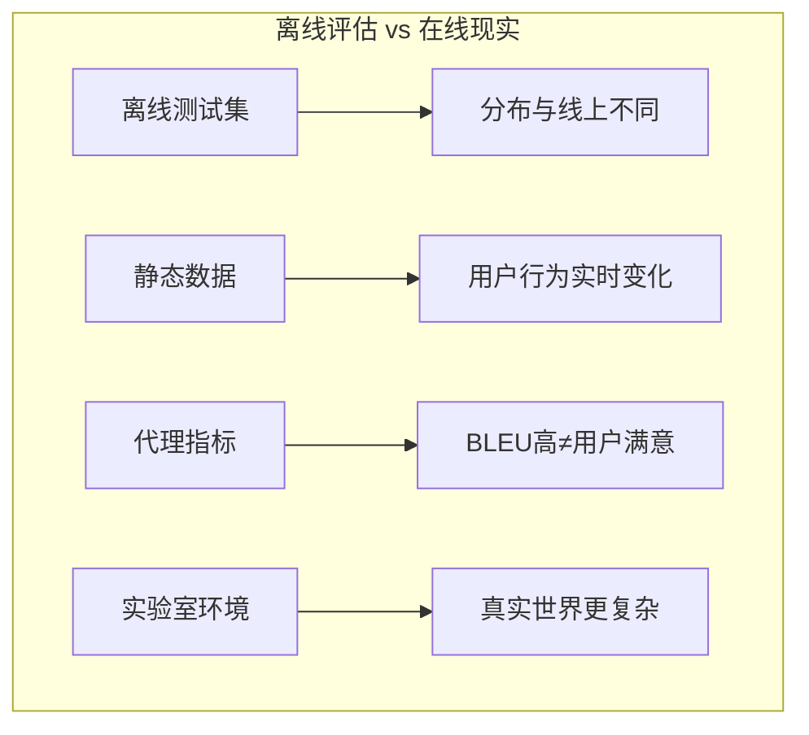
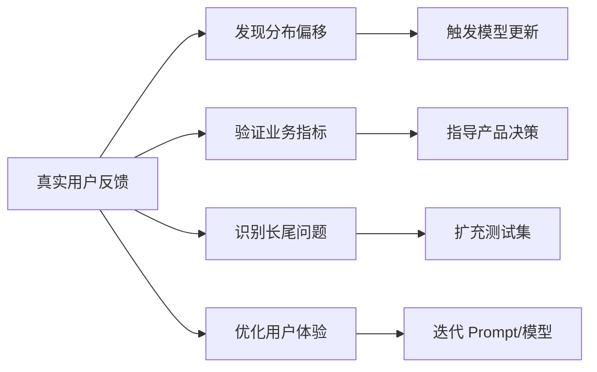
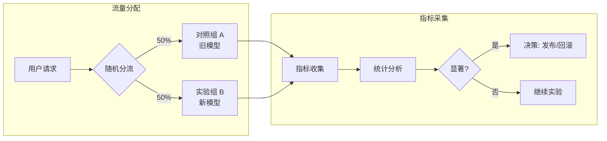
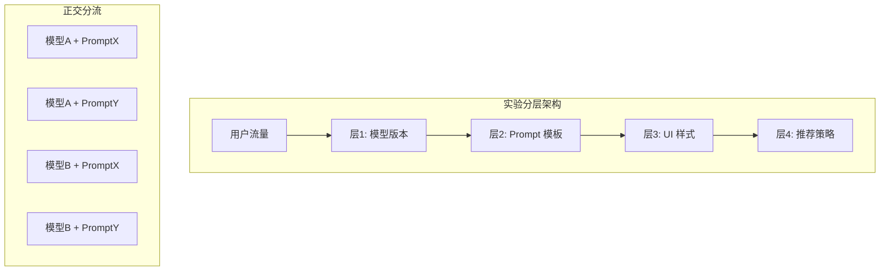
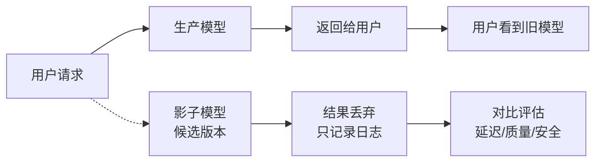
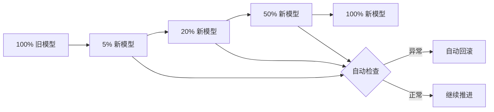
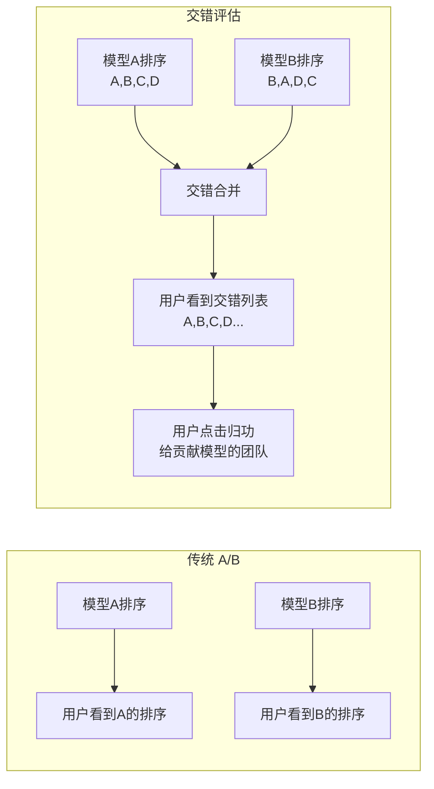
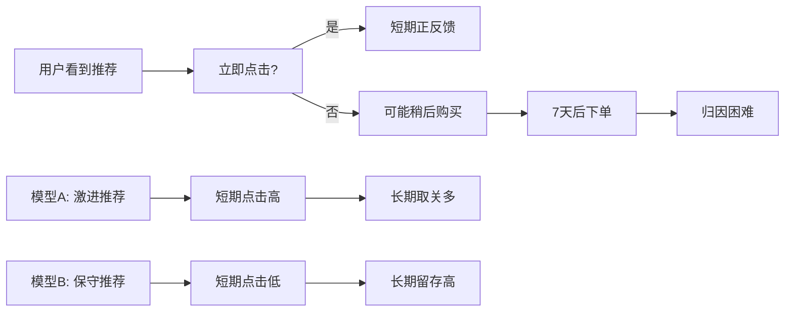

# 在线评估 (Online Evaluation)

> 中文简称：在线评估

> **一句话理解**: 在线评估就像"实战演习"——再完美的模拟考也无法替代真实战场，只有让模型真正面对用户、在真实流量中检验，才能知道它到底行不行。

## 1. 为什么要做在线评估

### 1.1 离线评估的局限



| 局限 | 说明 | 在线评估的弥补 |
|------|------|--------------|
| **分布偏移** | 测试集不代表真实用户分布 | 直接测量真实用户反馈 |
| **指标脱节** | 准确率 ≠ 转化率 | 测量业务指标（GMV、留存） |
| **反馈延迟** | 不知道用户是否满意 | 实时收集用户行为信号 |
| **长尾问题** | 测试集覆盖不到边缘场景 | 全量流量暴露真实问题 |
| **交互缺失** | 单轮评估 vs 多轮对话 | 观察真实多轮交互质量 |

### 1.2 在线评估的核心价值



---

## 2. A/B 测试

### 2.1 A/B 测试基础架构



### 2.2 随机化与 SRM 检查

**样本比例不匹配检查 (Sample Ratio Mismatch, SRM)**：

```python
"""SRM 检测 — 验证分流是否真正随机"""

from scipy.stats import chisquare

def check_srm(
    observed_counts: dict,
    expected_ratio: dict = None,
    alpha: float = 0.05
) -> dict:
    """
    检测实验组和对照组样本比例是否偏离预期
    
    Args:
        observed_counts: {"control": 5023, "treatment": 4977}
        expected_ratio: {"control": 0.5, "treatment": 0.5}
    """
    if expected_ratio is None:
        n_groups = len(observed_counts)
        expected_ratio = {k: 1/n_groups for k in observed_counts}
    
    total = sum(observed_counts.values())
    expected_counts = [total * expected_ratio[k] for k in observed_counts]
    observed = list(observed_counts.values())
    
    chi2, p_value = chisquare(observed, expected_counts)
    
    return {
        "chi2_statistic": round(chi2, 4),
        "p_value": round(p_value, 6),
        "srm_detected": p_value < alpha,
        "observed_counts": observed_counts,
        "expected_counts": {k: round(v, 1) for k, v in zip(observed_counts.keys(), expected_counts)},
        "recommendation": "重新检查分流逻辑" if p_value < alpha else "分流正常",
    }

# 使用示例
result = check_srm({"control": 50230, "treatment": 49770})
print(result)
# 若 p < 0.05，说明分流有问题，可能原因：
# - 用户会话未固定分组（每次刷新都重新随机）
# - 某些用户群体被系统性排除
# - 缓存导致分流不均匀
```

### 2.3 功效分析与样本量计算

```python
"""A/B 测试样本量与功效计算"""

import numpy as np
from scipy import stats

def ab_test_sample_size(
    baseline_rate: float,      # 对照组基准转化率
    min_detectable_effect: float,  # 最小可检测相对提升 (如 0.05 = 5%)
    alpha: float = 0.05,       # 显著性水平
    power: float = 0.80,       # 统计功效 (1-beta)
    ratio: float = 1.0,        # 实验组:对照组比例
) -> int:
    """
    计算 A/B 测试每组所需样本量
    
    公式基于两比例 Z 检验
    """
    p1 = baseline_rate
    p2 = baseline_rate * (1 + min_detectable_effect)
    
    # 合并比例
    p_pooled = (p1 + ratio * p2) / (1 + ratio)
    
    z_alpha = stats.norm.ppf(1 - alpha / 2)
    z_beta = stats.norm.ppf(power)
    
    numerator = (z_alpha * np.sqrt(2 * p_pooled * (1 - p_pooled)) + 
                 z_beta * np.sqrt(p1 * (1 - p1) + p2 * (1 - p2))) ** 2
    denominator = (p2 - p1) ** 2
    
    n_per_group = int(np.ceil(numerator / denominator))
    return n_per_group

def ab_test_duration_estimate(
    daily_traffic: int,
    sample_size_per_group: int,
    ratio: float = 1.0,
) -> dict:
    """估算实验需要运行多少天"""
    total_needed = sample_size_per_group * (1 + ratio)
    days = np.ceil(total_needed / daily_traffic)
    
    return {
        "daily_traffic": daily_traffic,
        "sample_per_group": sample_size_per_group,
        "total_samples_needed": int(total_needed),
        "estimated_days": int(days),
        "recommendation": f"建议运行至少 {max(int(days), 7)} 天（覆盖完整周期）",
    }

# 示例：推荐系统点击率实验
baseline_ctr = 0.15           # 15% 基准点击率
mde = 0.05                    # 期望检测 5% 相对提升
daily_users = 10000           # 日活 1 万

n = ab_test_sample_size(baseline_ctr, mde, alpha=0.05, power=0.80)
duration = ab_test_duration_estimate(daily_users, n)

print(f"每组需要样本: {n:,}")
print(f"预计实验天数: {duration['estimated_days']}")
print(duration['recommendation'])
```

### 2.4 多层实验体系



| 分层 | 实验内容 | 分流维度 | 典型实验 |
|------|---------|---------|---------|
| **模型层** | 模型权重版本 | user_id % N | Llama-3 vs GPT-4 |
| **Prompt 层** | 系统提示词 | user_id' % M | 不同角色设定 |
| **参数层** | 解码参数 | session_id % K | temperature 0.5 vs 0.8 |
| **产品层** | UI/交互 | device_id % L | 流式 vs 非流式 |

---

## 3. 影子流量 (Shadow Traffic)

### 3.1 暗启动架构



```python
"""影子流量实现示例"""

import asyncio
import logging
from typing import Optional

class ShadowTrafficEvaluator:
    """影子流量评估器"""
    
    def __init__(self, production_model, candidate_model, logger=None):
        self.prod_model = production_model
        self.cand_model = candidate_model
        self.logger = logger or logging.getLogger(__name__)
        self.metrics = {
            "latency_diff_ms": [],
            "output_similarity": [],
            "candidate_errors": 0,
            "total_shadow_requests": 0,
        }
    
    async def handle_request(self, request: dict, enable_shadow: bool = True) -> dict:
        """
        处理用户请求，同时运行影子评估
        """
        # 主路径：生产模型（同步返回）
        prod_response = await self.prod_model.generate(request)
        
        if enable_shadow:
            # 影子路径：异步运行，不阻塞用户
            asyncio.create_task(
                self._run_shadow(request, prod_response)
            )
        
        return prod_response
    
    async def _run_shadow(self, request: dict, prod_response: dict):
        """执行影子评估"""
        import time
        start = time.time()
        
        try:
            cand_response = await self.cand_model.generate(request)
            latency_ms = (time.time() - start) * 1000
            
            # 计算输出相似度（用于文本生成）
            similarity = self._compute_similarity(
                prod_response.get("text", ""),
                cand_response.get("text", "")
            )
            
            self.metrics["latency_diff_ms"].append(latency_ms)
            self.metrics["output_similarity"].append(similarity)
            self.metrics["total_shadow_requests"] += 1
            
            # 记录差异样本
            if similarity < 0.5:
                self.logger.warning(
                    f"Large output divergence detected: {similarity:.3f}",
                    extra={"request": request, "prod": prod_response, "cand": cand_response}
                )
                
        except Exception as e:
            self.metrics["candidate_errors"] += 1
            self.logger.error(f"Shadow model error: {e}")
    
    def _compute_similarity(self, text1: str, text2: str) -> float:
        """计算两段文本的相似度（简化版 Jaccard）"""
        words1 = set(text1.lower().split())
        words2 = set(text2.lower().split())
        if not words1 and not words2:
            return 1.0
        intersection = len(words1 & words2)
        union = len(words1 | words2)
        return intersection / union if union > 0 else 0.0
    
    def get_shadow_report(self) -> dict:
        """获取影子评估报告"""
        import numpy as np
        
        latencies = self.metrics["latency_diff_ms"]
        similarities = self.metrics["output_similarity"]
        
        return {
            "total_requests": self.metrics["total_shadow_requests"],
            "candidate_errors": self.metrics["candidate_errors"],
            "latency": {
                "mean_ms": round(np.mean(latencies), 2) if latencies else 0,
                "p99_ms": round(np.percentile(latencies, 99), 2) if latencies else 0,
            },
            "output_similarity": {
                "mean": round(np.mean(similarities), 3) if similarities else 0,
                "min": round(np.min(similarities), 3) if similarities else 0,
            },
            "error_rate": (
                self.metrics["candidate_errors"] / max(self.metrics["total_shadow_requests"], 1)
            ),
        }

# 使用示例
# evaluator = ShadowTrafficEvaluator(prod_model, candidate_model)
# response = await evaluator.handle_request(user_request)
# report = evaluator.get_shadow_report()
```

### 3.2 影子流量的安全考虑

| 风险 | 影响 | 缓解措施 |
|------|------|---------|
| **延迟增加** | 影子推理消耗资源 | 异步执行、资源隔离、流量比例控制 |
| **数据泄露** | 影子模型可能将数据外传 | 内网部署、输出审计、禁止外部调用 |
| **级联故障** | 影子服务崩溃影响主服务 | 超时熔断、独立部署、健康检查 |
| **缓存污染** | 影子请求写入共享缓存 | 影子标记、缓存命名空间隔离 |
| **成本暴增** | 双倍推理成本 | 仅对 1-5% 流量启用影子、非高峰期运行 |

---

## 4. 金丝雀发布 (Canary Release)

### 4.1 分阶段 rollout 架构



### 4.2 自动回滚条件

```python
"""金丝雀自动回滚决策器"""

from dataclasses import dataclass
from typing import List, Dict
from datetime import datetime, timedelta

@dataclass
class RollbackCondition:
    """回滚触发条件"""
    metric_name: str
    operator: str  # ">", "<", ">=", "<="
    threshold: float
    duration_minutes: int = 5  # 持续多久才触发
    severity: str = "critical"  # "warning", "critical", "fatal"

class CanaryController:
    """金丝雀发布控制器"""
    
    ROLLBACK_CONDITIONS = [
        # 致命：立即回滚
        RollbackCondition("error_rate", ">", 0.10, duration_minutes=1, severity="fatal"),
        RollbackCondition("p99_latency_ms", ">", 5000, duration_minutes=1, severity="fatal"),
        
        # 严重：持续 5 分钟回滚
        RollbackCondition("error_rate", ">", 0.05, duration_minutes=5, severity="critical"),
        RollbackCondition("conversion_rate", "<", -0.10, duration_minutes=5, severity="critical"),
        
        # 警告：通知但不自动回滚
        RollbackCondition("conversion_rate", "<", -0.05, duration_minutes=10, severity="warning"),
        RollbackCondition("user_complaint_rate", ">", 0.02, duration_minutes=10, severity="warning"),
    ]
    
    def __init__(self):
        self.metric_history: Dict[str, List[dict]] = {}
    
    def add_metric_sample(self, metric_name: str, value: float, timestamp: datetime = None):
        """添加指标样本"""
        if timestamp is None:
            timestamp = datetime.utcnow()
        
        if metric_name not in self.metric_history:
            self.metric_history[metric_name] = []
        
        self.metric_history[metric_name].append({
            "value": value,
            "timestamp": timestamp,
        })
        
        # 清理过期数据
        cutoff = timestamp - timedelta(minutes=30)
        self.metric_history[metric_name] = [
            s for s in self.metric_history[metric_name] if s["timestamp"] > cutoff
        ]
    
    def check_rollback(self) -> Dict:
        """检查是否需要回滚"""
        triggered = []
        
        for condition in self.ROLLBACK_CONDITIONS:
            history = self.metric_history.get(condition.metric_name, [])
            if not history:
                continue
            
            # 检查最近 N 分钟的数据
            cutoff = datetime.utcnow() - timedelta(minutes=condition.duration_minutes)
            recent_samples = [s for s in history if s["timestamp"] >= cutoff]
            
            if not recent_samples:
                continue
            
            # 判断条件是否持续满足
            violated_count = sum(
                1 for s in recent_samples 
                if self._evaluate(s["value"], condition.threshold, condition.operator)
            )
            
            violation_rate = violated_count / len(recent_samples)
            
            # 如果 80% 以上的样本都违反条件
            if violation_rate >= 0.8:
                triggered.append({
                    "condition": condition,
                    "violation_rate": round(violation_rate, 2),
                    "sample_count": len(recent_samples),
                    "latest_value": recent_samples[-1]["value"],
                })
        
        fatal_triggered = any(t["condition"].severity == "fatal" for t in triggered)
        critical_triggered = any(t["condition"].severity == "critical" for t in triggered)
        
        return {
            "should_rollback": fatal_triggered or critical_triggered,
            "severity": "fatal" if fatal_triggered else ("critical" if critical_triggered else "warning"),
            "triggered_conditions": triggered,
            "recommendation": "立即回滚" if fatal_triggered else ("建议回滚" if critical_triggered else "密切关注"),
        }
    
    def _evaluate(self, value: float, threshold: float, operator: str) -> bool:
        ops = {
            ">": lambda a, b: a > b,
            ">=": lambda a, b: a >= b,
            "<": lambda a, b: a < b,
            "<=": lambda a, b: a <= b,
        }
        return ops[operator](value, threshold)

# 使用示例
controller = CanaryController()

# 模拟监控循环
for i in range(100):
    controller.add_metric_sample("error_rate", 0.15)  # 高错误率
    
result = controller.check_rollback()
print(f"需要回滚: {result['should_rollback']}, 原因: {result['recommendation']}")
```

### 4.3 金丝雀指标看板

```python
"""金丝雀指标实时监控看板 (基于 Streamlit)"""

import streamlit as st
import pandas as pd
import numpy as np
from datetime import datetime, timedelta

st.set_page_config(page_title="Canary Monitor", layout="wide")

def render_canary_dashboard():
    """渲染金丝雀监控面板"""
    
    st.title("🚀 金丝雀发布监控面板")
    
    # 模拟实时数据
    col1, col2, col3, col4 = st.columns(4)
    
    with col1:
        st.metric(
            label="金丝雀流量比例",
            value="25%",
            delta="+5%",
            delta_color="normal"
        )
    
    with col2:
        st.metric(
            label="错误率 (Canary)",
            value="2.1%",
            delta="-0.3% vs Baseline",
            delta_color="inverse"
        )
    
    with col3:
        st.metric(
            label="P99 延迟",
            value="145ms",
            delta="+12ms",
            delta_color="off"
        )
    
    with col4:
        st.metric(
            label="转化率",
            value="8.5%",
            delta="+0.8%",
            delta_color="normal"
        )
    
    # 时序对比图
    st.subheader("核心指标对比: Canary vs Baseline")
    
    # 生成模拟时序数据
    time_points = pd.date_range(start=datetime.now() - timedelta(hours=1), periods=60, freq='1min')
    
    chart_data = pd.DataFrame({
        "time": time_points,
        "baseline_error": np.random.normal(2.5, 0.3, 60),
        "canary_error": np.random.normal(2.2, 0.4, 60),
        "baseline_latency": np.random.normal(130, 10, 60),
        "canary_latency": np.random.normal(145, 12, 60),
    })
    
    st.line_chart(chart_data.set_index("time")``[ ["baseline_error", "canary_error"] ]``)
    st.line_chart(chart_data.set_index("time")``[ ["baseline_latency", "canary_latency"] ]``)
    
    # 自动决策建议
    st.subheader("自动决策")
    
    decision_col1, decision_col2 = st.columns(2)
    
    with decision_col1:
        st.success("✅ 推进条件检查")
        st.write("- 错误率 < 基准 + 1%: **通过**")
        st.write("- 延迟 P99 < 基准 + 20%: **通过**")
        st.write("- 转化率 > 基准 - 2%: **通过**")
        st.write("- 运行时间 > 30 分钟: **通过**")
    
    with decision_col2:
        st.info("📊 建议操作")
        st.write("当前状态: **可推进至 50%**")
        if st.button("推进至 50%"):
            st.balloons()
            st.success("流量已调整至 50%")
        if st.button("立即回滚"):
            st.error("正在回滚至旧版本...")

# 运行: streamlit run canary_dashboard.py
```

---

## 5. 交错评估 (Interleaving)

### 5.1 成对比较原理

交错评估主要用于排序/推荐系统的成对对比：



```python
"""交错评估实现 — Team-Draft Interleaving"""

import random
from typing import List, Tuple, Dict

def team_draft_interleave(
    ranking_a: List[str],
    ranking_b: List[str],
    k: int = 10,
    seed: int = None
) -> Tuple[List[str], Dict[int, str]]:
    """
    Team-Draft Interleaving 算法
    
    Args:
        ranking_a: 模型A的排序结果 [doc1, doc2, ...]
        ranking_b: 模型B的排序结果
        k: 交错列表长度
        seed: 随机种子
    
    Returns:
        interleaved: 交错后的列表
        attribution: 每个位置的文档归属 {"index": "A" or "B"}
    """
    if seed is not None:
        random.seed(seed)
    
    interleaved = []
    attribution = {}
    
    # 追踪每个模型已贡献的文档数
    credits_a = 0
    credits_b = 0
    
    # 已选文档集合（去重）
    selected = set()
    
    ptr_a = 0
    ptr_b = 0
    
    while len(interleaved) < k and (ptr_a < len(ranking_a) or ptr_b < len(ranking_b)):
        # 决定从哪个模型取文档
        # 优先选择贡献较少的模型，若相等则随机
        if credits_a < credits_b:
            choose_from = "A"
        elif credits_b < credits_a:
            choose_from = "B"
        else:
            choose_from = random.choice(["A", "B"])
        
        # 获取该模型的下一个未选文档
        if choose_from == "A":
            while ptr_a < len(ranking_a) and ranking_a[ptr_a] in selected:
                ptr_a += 1
            if ptr_a < len(ranking_a):
                doc = ranking_a[ptr_a]
                ptr_a += 1
                credits_a += 1
            else:
                # A 耗尽，从 B 取
                choose_from = "B"
                continue
        else:
            while ptr_b < len(ranking_b) and ranking_b[ptr_b] in selected:
                ptr_b += 1
            if ptr_b < len(ranking_b):
                doc = ranking_b[ptr_b]
                ptr_b += 1
                credits_b += 1
            else:
                continue
        
        selected.add(doc)
        attribution[len(interleaved)] = choose_from
        interleaved.append(doc)
    
    return interleaved, attribution

def compute_interleave_win(
    interleaved: List[str],
    attribution: Dict[int, str],
    user_clicks: List[str]
) -> Tuple[str, float]:
    """
    根据用户点击判断哪个模型胜出
    
    Returns:
        winner: "A", "B", or "tie"
        confidence: 置信度
    """
    score_a = 0
    score_b = 0
    
    click_set = set(user_clicks)
    
    for idx, doc in enumerate(interleaved):
        if doc in click_set:
            source = attribution.get(idx)
            if source == "A":
                score_a += 1
            elif source == "B":
                score_b += 1
    
    if score_a > score_b:
        return "A", (score_a - score_b) / max(score_a + score_b, 1)
    elif score_b > score_a:
        return "B", (score_b - score_a) / max(score_a + score_b, 1)
    else:
        return "tie", 0.0

# 使用示例
ranking_a = ["doc_1", "doc_3", "doc_5", "doc_7", "doc_9"]
ranking_b = ["doc_2", "doc_3", "doc_4", "doc_6", "doc_8"]

interleaved, attr = team_draft_interleave(ranking_a, ranking_b, k=6)
print(f"交错结果: {interleaved}")
print(f"归属: {attr}")

# 用户点击了 doc_3 和 doc_6
clicks = ["doc_3", "doc_6"]
winner, conf = compute_interleave_win(interleaved, attr, clicks)
print(f"胜者: {winner}, 置信度: {conf:.2f}")
```

### 5.2 交错 vs A/B 测试对比

| 维度 | A/B 测试 | 交错评估 |
|------|---------|---------|
| **灵敏度** | 低（需要大样本） | 高（同用户内对比） |
| **用户体验** | 部分用户看到差结果 | 混合展示，体验更均衡 |
| **适用场景** | 整体策略评估 | 排序算法对比 |
| **分析复杂度** | 简单 | 较复杂（需归因） |
| **偏差风险** | 用户分组偏差 | 位置偏差（需校正） |
| **统计功效** | 需要更多流量 | 相同流量下功效更高 |
| **工业应用** | 通用 | 搜索/推荐系统专用 |

---

## 6. 反事实评估 (Counterfactual Evaluation)

### 6.1 逆倾向评分 (IPS)

当无法完全随机化时，用倾向评分校正偏差：

```python
"""逆倾向评分 (IPS) 估计器"""

import numpy as np
from typing import List

def ips_estimator(
    rewards: List[float],      # 观察到的奖励 (如点击=1, 未点击=0)
    propensities: List[float], # 实际展示的概率 (日志策略)
    policy_probs: List[float], # 新策略的展示概率
    cap: float = 10.0,         # 倾向截断上限
) -> dict:
    """
    IPS 估计新策略的期望奖励
    
    公式: E[R_new] ≈ mean( (policy_prob / propensity) * reward )
    """
    ips_weights = []
    weighted_rewards = []
    
    for r, prop, pol in zip(rewards, propensities, policy_probs):
        # 截断极端权重，减少方差
        weight = min(pol / max(prop, 1e-6), cap)
        ips_weights.append(weight)
        weighted_rewards.append(weight * r)
    
    ips_estimate = np.mean(weighted_rewards)
    
    # 方差估计
    variance = np.var(weighted_rewards)
    
    return {
        "ips_estimate": round(ips_estimate, 4),
        "variance": round(variance, 4),
        "mean_weight": round(np.mean(ips_weights), 4),
        "max_weight": round(np.max(ips_weights), 4),
        "effective_samples": round(sum(ips_weights) ** 2 / sum(w**2 for w in ips_weights), 1),
    }

def doubly_robust_estimator(
    rewards: List[float],
    propensities: List[float],
    policy_probs: List[float],
    predicted_rewards: List[float],  # 奖励模型预测值
    cap: float = 10.0,
) -> dict:
    """
    双重稳健估计器 (Doubly Robust)
    
    结合 IPS 和直接方法，只要其中一个正确就能保持一致性
    """
    dr_estimates = []
    
    for r, prop, pol, pred in zip(rewards, propensities, policy_probs, predicted_rewards):
        # 直接方法部分
        direct = pred
        
        # IPS 修正项
        weight = min(pol / max(prop, 1e-6), cap)
        correction = weight * (r - pred)
        
        dr_estimates.append(direct + correction)
    
    return {
        "dr_estimate": round(np.mean(dr_estimates), 4),
        "variance": round(np.var(dr_estimates), 4),
        "std_error": round(np.std(dr_estimates) / np.sqrt(len(dr_estimates)), 4),
    }

# 示例: 推荐系统新策略评估
# 历史日志: 展示了 1000 个物品，记录了点击奖励和展示概率
rewards = [1, 0, 0, 1, 0] * 200  # 20% 点击率
propensities = [0.1] * 1000       # 旧策略均匀随机展示
policy_probs = [0.15 if i % 5 == 0 else 0.085 for i in range(1000)]  # 新策略偏向高预测分物品

ips_result = ips_estimator(rewards, propensities, policy_probs)
print(f"IPS 估计 CTR: {ips_result['ips_estimate']:.4f}")

# 假设有奖励模型预测
predicted_rewards = [0.25 if i % 5 == 0 else 0.15 for i in range(1000)]
dr_result = doubly_robust_estimator(rewards, propensities, policy_probs, predicted_rewards)
print(f"DR 估计 CTR: {dr_result['dr_estimate']:.4f}")
```

### 6.2 反事实方法对比

| 方法 | 公式 | 优点 | 缺点 | 适用场景 |
|------|------|------|------|---------|
| **直接法 (DM)** | E[R] = mean(pred_reward) | 低方差 | 奖励模型偏差 | 奖励模型准确时 |
| **IPS** | E[R] = mean((π/p) * r) | 无模型偏差 | 高方差、极端权重 | 倾向已知时 |
| **SNIPS** | IPS / mean(π/p) | 方差更低 | 有偏估计 | 样本量中等 |
| **DR** | DM + IPS修正 | 双重稳健 | 实现复杂 | 推荐首选 |
| **CUPED** | Y - θ(X - E[X]) | 方差削减 | 需要协变量 | 已有用户特征 |

---

## 7. 长期效应评估

### 7.1 延迟反馈问题



```python
"""延迟反馈归因处理"""

from datetime import datetime, timedelta
from typing import List, Dict
from collections import defaultdict

class DelayedFeedbackHandler:
    """处理延迟反馈的归因"""
    
    def __init__(self, attribution_window_days: int = 7):
        self.attribution_window = timedelta(days=attribution_window_days)
        self.impressions: Dict[str, List[dict]] = defaultdict(list)
        self.conversions: Dict[str, List[datetime]] = defaultdict(list)
    
    def log_impression(self, user_id: str, item_id: str, model_version: str, timestamp: datetime):
        """记录展示事件"""
        self.impressions[user_id].append({
            "item_id": item_id,
            "model": model_version,
            "timestamp": timestamp,
        })
    
    def log_conversion(self, user_id: str, timestamp: datetime):
        """记录转化事件（购买、注册等）"""
        self.conversions[user_id].append(timestamp)
    
    def get_attributed_conversions(self, model_version: str) -> Dict:
        """
        将转化归因到最近的模型展示
        
        使用最后点击归因 (Last-Click Attribution)
        """
        attributed = 0
        unattributed = 0
        
        for user_id, conv_times in self.conversions.items():
            for conv_time in conv_times:
                # 找到归因窗口内的最近展示
                valid_impressions = [
                    imp for imp in self.impressions[user_id]
                    if imp["model"] == model_version
                    and conv_time - imp["timestamp"] <= self.attribution_window
                    and conv_time >= imp["timestamp"]
                ]
                
                if valid_impressions:
                    # 归因到最后一次展示
                    attributed += 1
                else:
                    unattributed += 1
        
        total = attributed + unattributed
        return {
            "model_version": model_version,
            "attributed_conversions": attributed,
            "attribution_rate": round(attributed / total, 4) if total > 0 else 0,
            "attribution_window_days": self.attribution_window.days,
        }
    
    def calculate_cohort_retention(
        self,
        user_assignments: Dict[str, str],  # user_id -> model_version
        active_events: Dict[str, List[datetime]],  # user_id -> 活跃时间列表
        days: List[int] = [1, 3, 7, 14, 30]
    ) -> Dict[str, Dict[int, float]]:
        """计算不同模型的用户留存率"""
        
        # 按模型分组用户
        model_users = defaultdict(set)
        for uid, model in user_assignments.items():
            model_users[model].add(uid)
        
        retention = {}
        for model, users in model_users.items():
            model_retention = {}
            for d in days:
                retained = sum(
                    1 for uid in users
                    if any(
                        event >= self.impressions[uid][0]["timestamp"] + timedelta(days=d)
                        for event in active_events.get(uid, [])
                    )
                )
                model_retention[d] = round(retained / len(users), 4) if users else 0
            retention[model] = model_retention
        
        return retention

# 使用示例
handler = DelayedFeedbackHandler(attribution_window_days=7)
handler.log_impression("user_1", "item_A", "model_v2", datetime.now() - timedelta(days=3))
handler.log_conversion("user_1", datetime.now())

result = handler.get_attributed_conversions("model_v2")
print(result)
```

### 7.2 用户适应性与新颖效应

| 效应类型 | 描述 | 持续时间 | 应对策略 |
|---------|------|---------|---------|
| **新颖效应 (Novelty Effect)** | 用户对新界面好奇，初期指标虚高 | 数天至一周 | 延长实验周期、排除初期数据 |
| **季节性效应** | 周末/节假日用户行为不同 | 周期性 | 至少覆盖完整周期 |
| **用户适应** | 用户逐渐习惯新系统 | 数周 | 长期追踪、学习曲线分析 |
| **网络效应** | 社交功能中用户互相影响 | 持续 | 聚类随机化、社区分析 |
| **首因效应** | 首次体验决定长期印象 | 首次交互 | 优化 onboarding |

```python
"""新颖效应检测"""

import numpy as np
from scipy import stats

def detect_novelty_effect(
    daily_metrics: List[float],  # 按天的指标序列
    window_size: int = 3
) -> dict:
    """
    检测是否存在新颖效应
    
    方法：比较初期窗口和后期窗口的均值差异
    """
    if len(daily_metrics) < window_size * 2:
        return {"detected": False, "reason": "数据不足"}
    
    early_window = daily_metrics[:window_size]
    late_window = daily_metrics[-window_size:]
    
    early_mean = np.mean(early_window)
    late_mean = np.mean(late_window)
    
    # t 检验
    t_stat, p_value = stats.ttest_ind(early_window, late_window)
    
    # 下降超过 10% 认为有显著新颖效应
    drop_percent = (early_mean - late_mean) / early_mean * 100
    
    return {
        "detected": drop_percent > 10 and p_value < 0.05,
        "early_mean": round(early_mean, 4),
        "late_mean": round(late_mean, 4),
        "drop_percent": round(drop_percent, 2),
        "p_value": round(p_value, 4),
        "recommendation": "排除前 3 天数据再分析" if drop_percent > 10 else "数据稳定，可直接使用",
    }

# 示例
metrics = [0.25, 0.24, 0.23, 0.20, 0.19, 0.19, 0.18, 0.18, 0.18, 0.17]
result = detect_novelty_effect(metrics)
print(result)
```

---

## 8. 代码实战

### 8.1 A/B 测试完整分析

```python
"""A/B 测试结果统计分析"""

import numpy as np
from scipy import stats
from typing import Dict, Tuple
import pandas as pd

class ABTestAnalyzer:
    """A/B 测试分析器"""
    
    def __init__(self, alpha: float = 0.05):
        self.alpha = alpha
    
    def analyze_ratio_metric(
        self,
        control_successes: int,
        control_trials: int,
        treatment_successes: int,
        treatment_trials: int,
        metric_name: str = "conversion_rate"
    ) -> Dict:
        """
        分析比率类指标（如转化率、点击率）
        """
        control_rate = control_successes / control_trials
        treatment_rate = treatment_successes / treatment_trials
        
        # 相对提升
        relative_uplift = (treatment_rate - control_rate) / control_rate
        
        # 两比例 Z 检验
        pooled_p = (control_successes + treatment_successes) / (control_trials + treatment_trials)
        se = np.sqrt(pooled_p * (1 - pooled_p) * (1/control_trials + 1/treatment_trials))
        z_score = (treatment_rate - control_rate) / se
        p_value = 2 * (1 - stats.norm.cdf(abs(z_score)))
        
        # 置信区间
        se_diff = np.sqrt(
            control_rate * (1 - control_rate) / control_trials +
            treatment_rate * (1 - treatment_rate) / treatment_trials
        )
        ci_lower = relative_uplift - stats.norm.ppf(1 - self.alpha/2) * se_diff / control_rate
        ci_upper = relative_uplift + stats.norm.ppf(1 - self.alpha/2) * se_diff / control_rate
        
        return {
            "metric": metric_name,
            "control_rate": round(control_rate, 4),
            "treatment_rate": round(treatment_rate, 4),
            "absolute_diff": round(treatment_rate - control_rate, 4),
            "relative_uplift": round(relative_uplift * 100, 2),
            "z_score": round(z_score, 4),
            "p_value": round(p_value, 6),
            "significant": p_value < self.alpha,
            "ci_95": [round(ci_lower * 100, 2), round(ci_upper * 100, 2)],
            "recommendation": (
                "实验组显著更优" if p_value < self.alpha and relative_uplift > 0
                else "对照组显著更优" if p_value < self.alpha and relative_uplift < 0
                else "差异不显著"
            ),
        }
    
    def analyze_continuous_metric(
        self,
        control_values: np.ndarray,
        treatment_values: np.ndarray,
        metric_name: str = "revenue"
    ) -> Dict:
        """
        分析连续类指标（如收入、停留时长）
        """
        control_mean = np.mean(control_values)
        treatment_mean = np.mean(treatment_values)
        relative_uplift = (treatment_mean - control_mean) / control_mean
        
        # Welch's t-test（不假设方差齐性）
        t_stat, p_value = stats.ttest_ind(treatment_values, control_values, equal_var=False)
        
        # Bootstrap CI
        n_bootstrap = 10000
        bootstrapped_diffs = []
        for _ in range(n_bootstrap):
            c_sample = np.random.choice(control_values, size=len(control_values), replace=True)
            t_sample = np.random.choice(treatment_values, size=len(treatment_values), replace=True)
            bootstrapped_diffs.append((np.mean(t_sample) - np.mean(c_sample)) / np.mean(c_sample))
        
        ci_lower = np.percentile(bootstrapped_diffs, self.alpha/2 * 100)
        ci_upper = np.percentile(bootstrapped_diffs, (1 - self.alpha/2) * 100)
        
        return {
            "metric": metric_name,
            "control_mean": round(control_mean, 4),
            "treatment_mean": round(treatment_mean, 4),
            "relative_uplift": round(relative_uplift * 100, 2),
            "t_statistic": round(t_stat, 4),
            "p_value": round(p_value, 6),
            "significant": p_value < self.alpha,
            "ci_95": [round(ci_lower * 100, 2), round(ci_upper * 100, 2)],
        }
    
    def generate_report(
        self,
        metrics_results: Dict[str, Dict]
    ) -> str:
        """生成 Markdown 报告"""
        lines = ["# A/B 测试分析报告\n"]
        
        for name, result in metrics_results.items():
            status = "✅" if result.get("significant") and result.get("relative_uplift", 0) > 0 else "❌"
            lines.append(f"## {status} {name}\n")
            lines.append(f"- 对照组: {result.get('control_rate', result.get('control_mean'))}")
            lines.append(f"- 实验组: {result.get('treatment_rate', result.get('treatment_mean'))}")
            lines.append(f"- 相对提升: {result['relative_uplift']}%")
            lines.append(f"- p-value: {result['p_value']}")
            lines.append(f"- 95% CI: [{result['ci_95'][0]}%, {result['ci_95'][1]}%]")
            lines.append(f"- 结论: {result['recommendation']}\n")
        
        return "\n".join(lines)

# 使用示例
analyzer = ABTestAnalyzer(alpha=0.05)

# 转化率分析
conv_result = analyzer.analyze_ratio_metric(
    control_successes=450, control_trials=5000,
    treatment_successes=520, treatment_trials=5000,
    metric_name="click_through_rate"
)

# 收入分析
np.random.seed(42)
control_revenue = np.random.lognormal(4, 1.5, 5000)
treatment_revenue = np.random.lognormal(4.05, 1.5, 5000)
revenue_result = analyzer.analyze_continuous_metric(
    control_revenue, treatment_revenue, metric_name="revenue"
)

report = analyzer.generate_report({
    "转化率": conv_result,
    "收入": revenue_result,
})
print(report)
```

### 8.2 金丝雀发布自动化决策脚本

```python
#!/usr/bin/env python3
"""金丝雀发布自动化决策脚本"""

import json
import sys
import argparse
from datetime import datetime

def make_canary_decision(
    canary_metrics: dict,
    baseline_metrics: dict,
    current_percentage: float,
    config: dict
) -> dict:
    """
    根据当前指标决定是否推进、保持或回滚金丝雀发布
    """
    checks = []
    all_pass = True
    
    for check in config["progression_checks"]:
        metric = check["metric"]
        canary_val = canary_metrics.get(metric)
        baseline_val = baseline_metrics.get(metric)
        
        if canary_val is None or baseline_val is None:
            checks.append({
                "metric": metric,
                "status": "MISSING",
                "reason": "指标数据缺失"
            })
            all_pass = False
            continue
        
        # 计算相对变化
        relative_change = (canary_val - baseline_val) / abs(baseline_val) * 100
        threshold = check["max_relative_change_percent"]
        
        passed = abs(relative_change) <= abs(threshold)
        if check.get("must_improve", False):
            passed = relative_change >= 0
        
        checks.append({
            "metric": metric,
            "canary": canary_val,
            "baseline": baseline_val,
            "relative_change_percent": round(relative_change, 2),
            "threshold": threshold,
            "passed": passed,
        })
        
        if not passed:
            all_pass = False
    
    # 决策逻辑
    stages = config.get("rollout_stages", [5, 20, 50, 100])
    current_idx = stages.index(current_percentage) if current_percentage in stages else -1
    
    if all_pass and current_idx < len(stages) - 1:
        decision = "PROCEED"
        next_percentage = stages[current_idx + 1]
    elif all_pass and current_idx == len(stages) - 1:
        decision = "COMPLETE"
        next_percentage = 100
    else:
        decision = "HOLD"
        next_percentage = current_percentage
        
        # 检查是否需要回滚
        critical_fails = sum(1 for c in checks if not c.get("passed") and c.get("metric") in config.get("critical_metrics", []))
        if critical_fails > 0:
            decision = "ROLLBACK"
            next_percentage = 0
    
    return {
        "timestamp": datetime.utcnow().isoformat(),
        "current_percentage": current_percentage,
        "decision": decision,
        "next_percentage": next_percentage,
        "all_checks_passed": all_pass,
        "checks": checks,
        "message": {
            "PROCEED": f"所有检查通过，建议推进至 {next_percentage}%",
            "COMPLETE": "金丝雀发布完成，全部流量已切换",
            "HOLD": "部分检查未通过，建议保持当前流量比例并观察",
            "ROLLBACK": "关键指标异常，建议立即回滚",
        }.get(decision),
    }

def main():
    parser = argparse.ArgumentParser()
    parser.add_argument("--canary-metrics", required=True, help="金丝雀指标 JSON 文件")
    parser.add_argument("--baseline-metrics", required=True, help="基线指标 JSON 文件")
    parser.add_argument("--config", required=True, help="决策配置 JSON 文件")
    parser.add_argument("--current-pct", type=float, required=True, help="当前金丝雀流量百分比")
    args = parser.parse_args()
    
    canary = json.load(open(args.canary_metrics))
    baseline = json.load(open(args.baseline_metrics))
    config = json.load(open(args.config))
    
    result = make_canary_decision(canary, baseline, args.current_pct, config)
    print(json.dumps(result, indent=2, ensure_ascii=False))
    
    # 非零退出码用于 CI/CD 决策
    if result["decision"] == "ROLLBACK":
        sys.exit(2)
    elif result["decision"] == "HOLD":
        sys.exit(1)
    else:
        sys.exit(0)

if __name__ == "__main__":
    main()
```

---

## 9. 与其他主题的关联 (Connections)

### 前置知识
- [模型训练](07_模型训练/01_训练基础/04_模型_训练_简明指南.md) — 训练过程中的验证集评估
- [模型评估基础](08_模型评估/01_评估基础/06_模型评估.md) — 离线评估指标与方法
- [自动化评估](08_模型评估/05_自动化评估/02_评估_自动化_2026.md) — CI/CD 中的自动化评估流程

### 进阶方向
- [MLOps 流水线](11_模型运维/01_MLOps基础/05_MLOps_流水线.md) — 模型发布与 CI/CD 集成
- [AI 测试框架](../../09_测试/README.md) — 线上测试与质量保证
- [AI Ops 监控](13_运维/01_AIOps基础/01_AI运维2026.md) — 生产环境模型性能监控与告警

---

## 10. FAQ

**Q1: A/B 测试需要跑多久？**
> 至少满足以下条件：(1) **样本量充足** — 用功效分析计算最小样本量；(2) **覆盖完整周期** — 至少覆盖一个业务周期（通常 1-2 周），包含工作日和周末；(3) **统计显著** — p-value < 0.05 且置信区间不包含 0；(4) **效应稳定** — 连续 3 天以上方向一致。避免在促销、节假日等特殊时期开始实验。

**Q2: 影子流量和金丝雀发布的区别是什么？**
> **影子流量**：用户完全无感知，候选模型的输出被丢弃不返回给用户，只用于对比评估。零风险但双倍资源消耗。**金丝雀发布**：小部分真实用户看到新模型结果，可以测量真实业务指标。有风险但信息价值更高。通常先跑影子流量验证稳定性，再金丝雀验证业务效果。

**Q3: 如何处理 A/B 测试中的指标打架？**
> 常见情况：点击率提升但转化率下降。解决方案：(1) **指定北极星指标** — 提前确定唯一核心决策指标（如 GMV）；(2) **护栏指标** — 其他指标作为"不能突破底线"的约束（如投诉率不能上升）；(3) **综合评分** — 给各指标加权计算综合得分；(4) **细分分析** — 看哪些用户群体受益、哪些受损，考虑分层发布。

**Q4: 交错评估适用于什么场景？**
> 主要用于**排序/推荐系统**的算法对比：(1) 搜索结果排序算法 A vs B；(2) 推荐系统召回策略对比；(3) 广告排序策略。不适用于整体产品功能对比（如 UI 改版），因为用户会看到混合的界面。交错评估的优势是灵敏度高、需要的流量少，劣势是分析复杂、存在位置偏差。

**Q5: 反事实评估中的 IPS 权重过大怎么办？**
> 倾向评分过小的样本会导致 IPS 权重极大，方差爆炸。解决方案：(1) **截断 (Capping)** — 设置权重上限（如 10）；(2) **SNIPS** — 归一化 IPS 权重；(3) **双重稳健 (DR)** — 结合直接估计降低方差；(4) **丢弃极端样本** — 去除倾向 < 0.01 的样本；(5) **倾向模型改进** — 用更复杂的模型估计倾向得分。

**Q6: 如何判断新颖效应是否消退？**
> (1) **分段分析** — 将实验期分为初期（前 3 天）和后期（剩余时间），比较两阶段指标差异；(2) **时间序列可视化** — 画出每日指标曲线，观察是否趋于平稳；(3) **统计检验** — 用 t 检验或 Mann-Whitney U 检验比较两阶段；(4) **保守策略** — 直接排除前 3-7 天数据再做最终分析。建议所有实验至少跑满 2 周。

**Q7: 在线评估的成本如何控制？**
> (1) **流量分层** — 只用 1-5% 流量做实验；(2) **实验合并** — 使用正交分层同时跑多个实验；(3) **交错替代 A/B** — 对排序实验用交错评估，灵敏度更高、需要流量更少；(4) **影子流量限流** — 仅对非高峰时段或部分用户启用影子；(5) **离线预筛选** — 先用离线评估淘汰明显差的候选，只让有潜力的候选进入在线实验。

---

*Last updated: 2026-05-07*

## Related

- [[08_模型评估/01_评估基础/06_模型评估.md|Model_Evaluation]]
- [[08_模型评估/README.md|模型评估 README]]
- [[15_智能体/07_Agent评估/Assessment/03_评估_工作流.md|Evaluation_Workflow]]
- [[15_智能体/07_Agent评估/Cloud_Agent_Evaluation/README.md|Cloud_Agent_Evaluation README]]
- [[15_智能体/07_Agent评估/10_云_Agent_评估_系统_2026.md|Cloud_Agent_Evaluation_System_2026]]

- [[08_模型评估/02_基准测试/02_benchmark_evaluation|评测基准 × 评测方法论：从分数到可信评估]]
