> [!warning] 生产安全提示 · Production Safety
> 本文档含可执行命令/操作步骤。执行前请核对风险等级（🟢低/🔶中/🔴高），高危命令必须 dry-run 并确认回滚方案。完整策略见 [生产安全策略](治理/Production_Safety_Policy.md)。
<!-- op-safety-banner v1 -->
# 部署推理 2026 趋势

> 中文简称：部署推理 2026 趋势

> **一句话秒懂**: 2026 年的 AI 推理部署 = 高性能推理引擎 + 极致压缩 + 智能调度 + 边缘部署，让大模型跑得快、跑得省、跑得稳。

## 目录

- [推理引擎对比](#推理引擎对比)
- [vLLM 深度解析](#vllm-深度解析)
- [TensorRT-LLM](#tensorrt-llm)
- [推测解码](#推测解码)
- [MoE 部署优化](#moe-部署优化)
- [边缘部署](#边缘部署)
- [模型压缩](#模型压缩)
- [Serverless 推理](#serverless-推理)
- [多模型服务](#多模型服务)
- [成本优化](#成本优化)
- [Kubernetes 部署](#kubernetes-部署)

---

## 推理引擎对比

### 2026 主流推理引擎

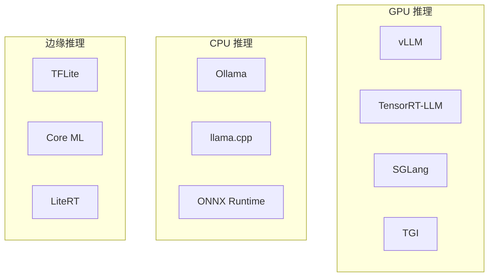

| 引擎 | 类型 | 核心优势 | 适用场景 |
|------|------|---------|---------|
| vLLM | GPU | PagedAttention | 高吞吐服务 |
| TensorRT-LLM | GPU | NVIDIA 极致优化 | 低延迟 |
| SGLang | GPU | 结构化生成 | 复杂 prompt |
| TGI | GPU | HuggingFace 生态 | 快速部署 |
| Ollama | CPU/GPU | 易用性 | 本地开发 |
| llama.cpp | CPU | 极致量化 | 个人电脑 |

### 整体架构

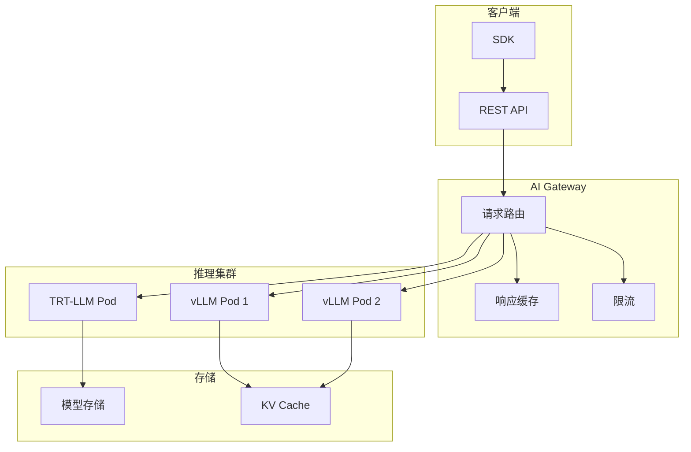

---

## vLLM 深度解析

### 核心技术：PagedAttention

```
传统 KV Cache（连续内存分配）：
┌─────────────────────────────┐
│ Request 1: ████████░░░░░░░ │  预分配大块，浪费空间
│ Request 2: ██████░░░░░░░░░ │  碎片化严重
│ Request 3: ████████████░░░ │  内存利用率低
└─────────────────────────────┘
浪费率: 40-60%

PagedAttention（分页管理）：
┌──┬──┬──┬──┬──┬──┬──┬──┬──┬──┐
│R1│R2│R1│R3│R1│R2│R3│R3│R2│R1│  按需分配页
└──┴──┴──┴──┴──┴──┴──┴──┴──┴──┘
浪费率: <4%
```

### vLLM 架构

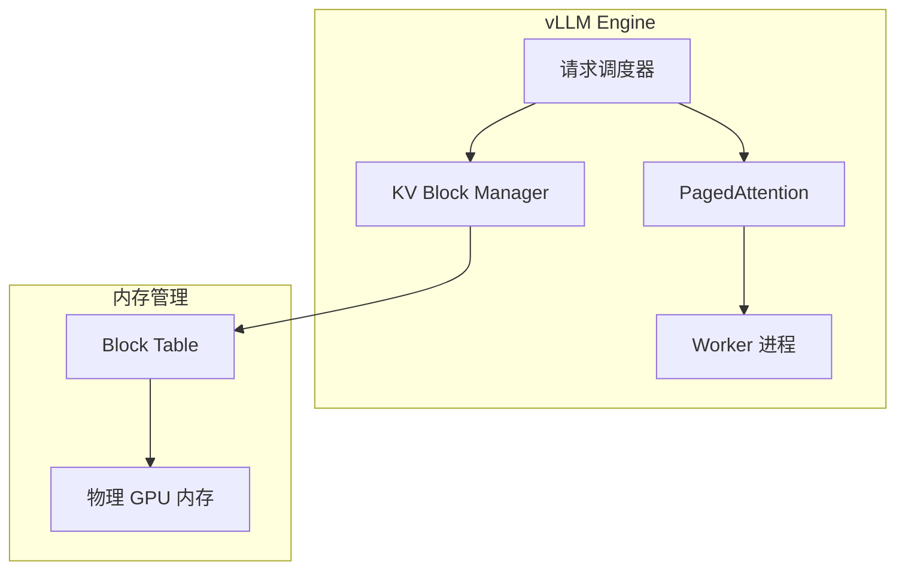

### 安装与基础使用

```bash
# 安装
pip install vllm

# 启动 OpenAI 兼容服务
python -m vllm.entrypoints.openai.api_server \
    --model Qwen/Qwen2.5-72B-Instruct \
    --tensor-parallel-size 4 \
    --max-model-len 32768 \
    --gpu-memory-utilization 0.90 \
    --port 8000
```

### Python API

```python
from vllm import LLM, SamplingParams

prompts = [
    "解释什么是 Transformer 架构",
    "写一首关于春天的诗",
    "什么是 PagedAttention？",
]

sampling_params = SamplingParams(
    temperature=0.7,
    top_p=0.9,
    max_tokens=512,
    frequency_penalty=0.1,
)

llm = LLM(
    model="Qwen/Qwen2.5-72B-Instruct",
    tensor_parallel_size=4,
    max_model_len=32768,
    gpu_memory_utilization=0.90,
    enforce_eager=True,
)

outputs = llm.generate(prompts, sampling_params)

for output in outputs:
    prompt = output.prompt
    generated = output.outputs[0].text
    tokens = len(output.outputs[0].token_ids)
    print(f"提示: {prompt[:30]}...")
    print(f"生成: {generated[:100]}...")
    print(f"Token 数: {tokens}")
```

### Continuous Batching

```python
from vllm import LLM, SamplingParams

llm = LLM(
    model="Qwen/Qwen2.5-7B-Instruct",
    max_num_seqs=256,
    max_num_batched_tokens=8192,
    enable_chunked_prefill=True,
)

params = SamplingParams(temperature=0.7, max_tokens=256)

import asyncio
from vllm.entrypoints.openai.api_server import init_app

# Continuous batching 配置
# vLLM 默认启用 continuous batching
# 新请求可以在 running batch 中动态加入
# 完成的请求立即释放 KV cache 空间

# 关键参数
config = {
    "max_num_seqs": 256,          # 最大并发序列数
    "max_num_batched_tokens": 8192,  # 单 batch 最大 token
    "max_paddings": 256,          # padding 上限
    "swap_space": 4,              # CPU swap 空间 (GB)
    "enable_chunked_prefill": True,  # 分块预填充
}
```

### OpenAI 兼容 API

```python
from openai import OpenAI

client = OpenAI(
    base_url="http://localhost:8000/v1",
    api_key="not-needed",
)

response = client.chat.completions.create(
    model="Qwen/Qwen2.5-72B-Instruct",
    messages=[
        {"role": "system", "content": "你是一个有帮助的助手。"},
        {"role": "user", "content": "解释 vLLM 的 PagedAttention"},
    ],
    temperature=0.7,
    max_tokens=1024,
    stream=True,
)

for chunk in response:
    if chunk.choices[0].delta.content:
        print(chunk.choices[0].delta.content, end="")
```

---

## TensorRT-LLM

### 核心优化技术

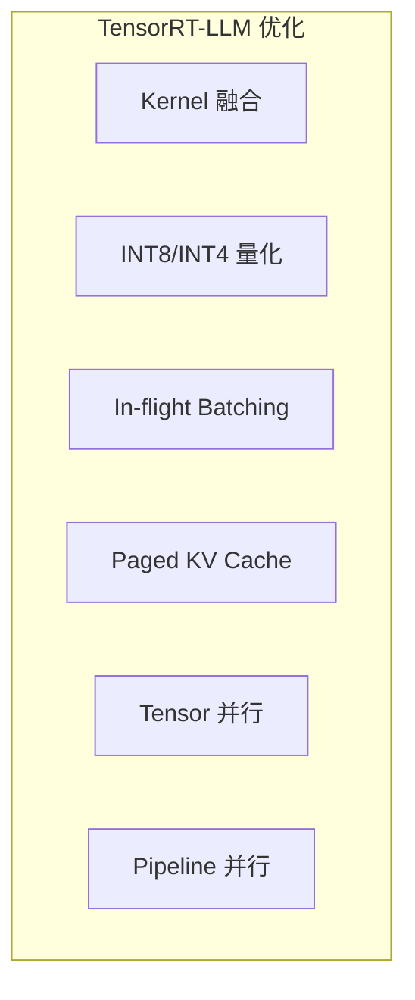

### 构建 TensorRT 引擎

```python
# 使用 Python API 构建
import tensorrt_llm
from tensorrt_llm import Builder, Network
from tensorrt_llm.models import LLaMAForCausalLM

builder = Builder()
network = Network()

config = {
    "model_dir": "./models/Qwen2.5-7B",
    "dtype": "float16",
    "tp_size": 2,
    "pp_size": 1,
    "max_batch_size": 128,
    "max_input_len": 2048,
    "max_output_len": 512,
    "max_beam_width": 1,
    "quantization": {
        "method": "weight_only",
        "precision": "int8",
    },
    "use_paged_context_fmha": True,
    "enable_chunked_context": True,
}

# 命令行构建
# python convert_checkpoint.py \
#     --model_dir ./models/Qwen2.5-7B \
#     --output_dir ./trt_ckpt/qwen-7b \
#     --tp_size 2 \
#     --dtype float16

# trtllm-build \
#     --checkpoint_dir ./trt_ckpt/qwen-7b \
#     --output_dir ./trt_engines/qwen-7b \
#     --max_batch_size 128 \
#     --max_input_len 2048 \
#     --max_output_len 512 \
#     --gemm_plugin float16 \
#     --use_paged_context_fmha enable
```

### 运行推理

```python
import tensorrt_llm
from tensorrt_llm.runtime import ModelRunner

runner = ModelRunner.from_dir(
    engine_dir="./trt_engines/qwen-7b",
    lora_dir=None,
)

outputs = runner.generate(
    input_ids=``[ [1, 2, 3, 4] ]``,
    max_new_tokens=512,
    temperature=0.7,
    top_p=0.9,
)
```

---

## 推测解码

### 原理

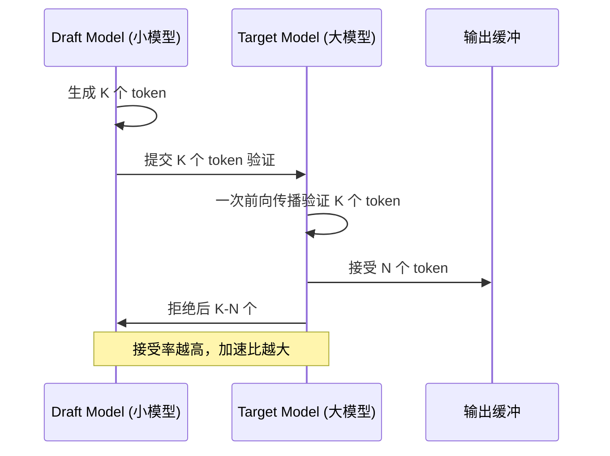

### 推测解码实现

```python
import torch
import torch.nn as nn

class SpeculativeDecoder:
    def __init__(self, target_model, draft_model, max_spec_tokens: int = 5):
        self.target = target_model
        self.draft = draft_model
        self.max_spec = max_spec_tokens

    @torch.no_grad()
    def generate(self, input_ids: torch.Tensor, max_tokens: int = 256) -> torch.Tensor:
        generated = input_ids.clone()

        while generated.size(1) < input_ids.size(1) + max_tokens:
            # Step 1: Draft model 生成 K 个 token
            draft_tokens = []
            draft_probs = []
            current = generated

            for _ in range(self.max_spec):
                logits = self.draft(current)
                prob = torch.softmax(logits[:, -1, :], dim=-1)
                token = torch.argmax(prob, dim=-1, keepdim=True)
                draft_tokens.append(token)
                draft_probs.append(prob)
                current = torch.cat([current, token], dim=1)

            draft_tokens = torch.cat(draft_tokens, dim=1)

            # Step 2: Target model 一次验证所有 draft token
            target_input = torch.cat([generated, draft_tokens], dim=1)
            target_logits = self.target(target_input)

            # Step 3: 逐个验证
            accepted = 0
            for i in range(self.max_spec):
                target_prob = torch.softmax(
                    target_logits[:, generated.size(1) + i - 1, :], dim=-1
                )
                draft_token = draft_tokens[:, i]

                if torch.rand(1) < target_prob[0, draft_token[0]] / draft_probs[i][0, draft_token[0]]:
                    accepted += 1
                else:
                    break

            # Step 4: 接受的 token 加入结果
            generated = torch.cat(
                [generated, draft_tokens[:, :accepted + 1]], dim=1
            )

            if accepted < self.max_spec:
                continue

        return generated

# 使用示例
decoder = SpeculativeDecoder(
    target_model=target_model,  # 如 Qwen2.5-72B
    draft_model=draft_model,    # 如 Qwen2.5-0.5B
    max_spec_tokens=5,
)
result = decoder.generate(input_ids, max_tokens=256)
```

### 推测解码效果

| Draft 模型 | Target 模型 | 接受率 | 加速比 |
|-----------|------------|--------|--------|
| Qwen2.5-0.5B | Qwen2.5-7B | 85% | 2.8x |
| Qwen2.5-1.5B | Qwen2.5-14B | 80% | 2.5x |
| Qwen2.5-7B | Qwen2.5-72B | 75% | 2.2x |

---

## MoE 部署优化

### MoE 推理挑战

```
MoE 模型特点：
- 总参数量大（如 Mixtral 8x7B = 46.7B 参数）
- 每个 token 只激活部分专家（2/8）
- 实际推理参数少（~13B）
- 但所有参数需加载到 GPU → 内存瓶颈
```

### MoE 优化策略

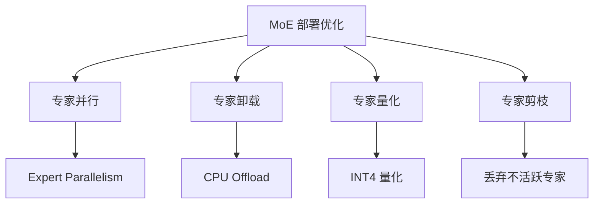

### MoE 推理代码

```python
from vllm import LLM, SamplingParams

llm = LLM(
    model="mistralai/Mixtral-8x7B-Instruct-v0.1",
    tensor_parallel_size=4,
    max_model_len=32768,
    enforce_eager=True,
    # MoE 特定配置
    enable_expert_parallel=True,
)

params = SamplingParams(temperature=0.7, max_tokens=512)
outputs = llm.generate(["解释 MoE 模型的优势"], params)
```

---

## 边缘部署

### 边缘推理框架对比

| 框架 | 平台 | 模型格式 | 特点 |
|------|------|---------|------|
| ONNX Runtime | CPU/GPU/NPU | ONNX | 跨平台 |
| TensorFlow Lite | Android/iOS | TFLite | 移动端 |
| Core ML | iOS/macOS | mlpackage | 苹果生态 |
| TensorRT | NVIDIA GPU | engine | 最快 GPU |
| llama.cpp | CPU/GPU | GGUF | 大模型 CPU |
| ExecuTorch | 移动端 | PT | PyTorch 原生 |

### ONNX Runtime 推理

```python
import onnxruntime as ort
import numpy as np

class ONNXInference:
    def __init__(self, model_path: str, provider: str = "CPUExecutionProvider"):
        providers = {
            "cpu": "CPUExecutionProvider",
            "cuda": "CUDAExecutionProvider",
            "tensorrt": "TensorrtExecutionProvider",
            "coreml": "CoreMLExecutionProvider",
        }

        self.session = ort.InferenceSession(
            model_path,
            providers=[providers.get(provider, provider)],
        )

        self.input_name = self.session.get_inputs()[0].name
        self.output_names = [o.name for o in self.session.get_outputs()]

    def predict(self, input_data: np.ndarray) -> np.ndarray:
        result = self.session.run(self.output_names, {self.input_name: input_data})
        return result[0]

    def benchmark(self, input_shape: tuple, runs: int = 100):
        dummy = np.random.randn(*input_shape).astype(np.float32)

        # Warmup
        for _ in range(10):
            self.predict(dummy)

        import time
        start = time.time()
        for _ in range(runs):
            self.predict(dummy)
        elapsed = time.time() - start

        latency_ms = elapsed / runs * 1000
        throughput = runs / elapsed
        print(f"延迟: {latency_ms:.2f} ms, 吞吐: {throughput:.1f} req/s")
        return {"latency_ms": latency_ms, "throughput": throughput}

infer = ONNXInference("model.onnx", provider="cpu")
result = infer.benchmark((1, 3, 224, 224))
```

### TensorFlow Lite 部署

```python
import tensorflow as tf

def convert_to_tflite(
    saved_model_path: str,
    output_path: str,
    quantize: bool = True,
):
    converter = tf.lite.TFLiteConverter.from_saved_model(saved_model_path)

    if quantize:
        converter.optimizations = [tf.lite.Optimize.DEFAULT]
        converter.target_spec.supported_types = [tf.int8]
        converter.representative_dataset = representative_dataset_gen

    tflite_model = converter.convert()

    with open(output_path, "wb") as f:
        f.write(tflite_model)

    original_size = tf.io.gfile.stat(saved_model_path).length // 1024
    tflite_size = len(tflite_model) // 1024
    print(f"原始大小: ~{original_size}KB")
    print(f"TFLite 大小: {tflite_size}KB")
    print(f"压缩比: {original_size / tflite_size:.1f}x")

def representative_dataset_gen():
    for _ in range(100):
        yield [np.random.randn(1, 3, 224, 224).astype(np.float32)]
```

---

## 模型压缩

### 压缩技术全景

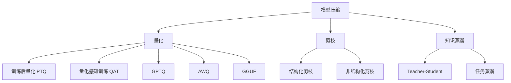

### 量化对比

| 量化方法 | 精度 | 压缩比 | 速度提升 | 精度损失 |
|---------|------|--------|---------|---------|
| FP16 | 16bit | 2x | 1.5x | 无 |
| INT8 PTQ | 8bit | 4x | 2x | 极小 |
| INT4 GPTQ | 4bit | 8x | 2.5x | 小 |
| INT4 AWQ | 4bit | 8x | 2.5x | 小 |
| INT4 GGUF | 4bit | 8x | 2x | 小 |
| FP8 | 8bit | 2x | 2x | 极小 |
| NF4 (QLoRA) | 4bit | 8x | 2x | 小 |

### GPTQ 量化

```python
from auto_gptq import AutoGPTQForCausalLM, BaseQuantizeConfig
from transformers import AutoTokenizer
from datasets import load_dataset

model_id = "Qwen/Qwen2.5-7B-Instruct"
tokenizer = AutoTokenizer.from_pretrained(model_id)

# 准备校准数据
dataset = load_dataset("wikitext", "wikitext-2-raw-v1", split="train")
examples = []
for text in dataset["text"][:128]:
    if len(text) > 100:
        tokens = tokenizer(text, return_tensors="pt")
        examples.append(tokens.input_ids)

# 量化配置
quantize_config = BaseQuantizeConfig(
    bits=4,
    group_size=128,
    desc_act=True,
    damp_percent=0.01,
    sym=True,
)

# 加载并量化
model = AutoGPTQForCausalLM.from_pretrained(
    model_id,
    quantize_config=quantize_config,
    torch_dtype=torch.float16,
)

model.quantize(examples)

# 保存量化模型
model.save_quantized("./qwen-7b-gptq-int4")
tokenizer.save_pretrained("./qwen-7b-gptq-int4")
```

### AWQ 量化

```python
from awq import AutoAWQForCausalLM
from transformers import AutoTokenizer

model_path = "Qwen/Qwen2.5-7B-Instruct"
quant_path = "./qwen-7b-awq-int4"

tokenizer = AutoTokenizer.from_pretrained(model_path)
model = AutoAWQForCausalLM.from_pretrained(model_path)

model.quantize(
    tokenizer,
    quant_config={
        "zero_point": True,
        "q_group_size": 128,
        "w_bit": 4,
        "version": "GEMM",
    },
)

model.save_quantized(quant_path)
tokenizer.save_pretrained(quant_path)
```

### 知识蒸馏

```python
import torch
import torch.nn as nn
import torch.nn.functional as F

class DistillationTrainer:
    def __init__(
        self,
        teacher: nn.Module,
        student: nn.Module,
        temperature: float = 4.0,
        alpha: float = 0.7,
    ):
        self.teacher = teacher
        self.student = student
        self.temperature = temperature
        self.alpha = alpha

        for p in self.teacher.parameters():
            p.requires_grad = False

    def distillation_loss(self, student_logits, teacher_logits, labels):
        soft_loss = F.kl_div(
            F.log_softmax(student_logits / self.temperature, dim=-1),
            F.softmax(teacher_logits / self.temperature, dim=-1),
            reduction="batchmean",
        ) * (self.temperature ** 2)

        hard_loss = F.cross_entropy(student_logits, labels)

        return self.alpha * soft_loss + (1 - self.alpha) * hard_loss

    def train_step(self, input_ids, labels):
        with torch.no_grad():
            teacher_logits = self.teacher(input_ids).logits

        student_logits = self.student(input_ids).logits

        loss = self.distillation_loss(student_logits, teacher_logits, labels)
        return loss
```

---

## Serverless 推理

### Serverless AI 架构

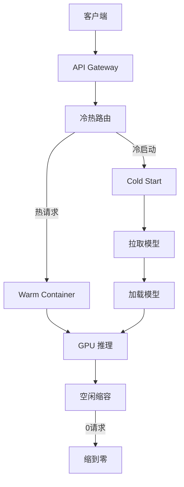

### Serverless 推理配置

```python
import modal

app = modal.App("llm-inference")

image = (
    modal.Image.from_registry("nvidia/cuda:12.1.0-runtime-ubuntu22.04")
    .pip_install("vllm", "transformers")
)

@app.cls(
    image=image,
    gpu="A100",
    container_idle_timeout=300,
    allow_concurrent_inputs=10,
    timeout=120,
)
class LLMService:
    @modal.enter()
    def load_model(self):
        from vllm import LLM
        self.llm = LLM(
            model="Qwen/Qwen2.5-7B-Instruct",
            max_model_len=4096,
            gpu_memory_utilization=0.90,
        )

    @modal.method()
    def generate(self, prompt: str) -> str:
        from vllm import SamplingParams
        params = SamplingParams(temperature=0.7, max_tokens=256)
        outputs = self.llm.generate([prompt], params)
        return outputs[0].outputs[0].text

    @modal.web_endpoint(method="POST")
    def api_generate(self, request: dict):
        return {"response": self.generate(request["prompt"])}

# 部署
# modal deploy app.py
```

---

## 多模型服务

### 多模型部署架构

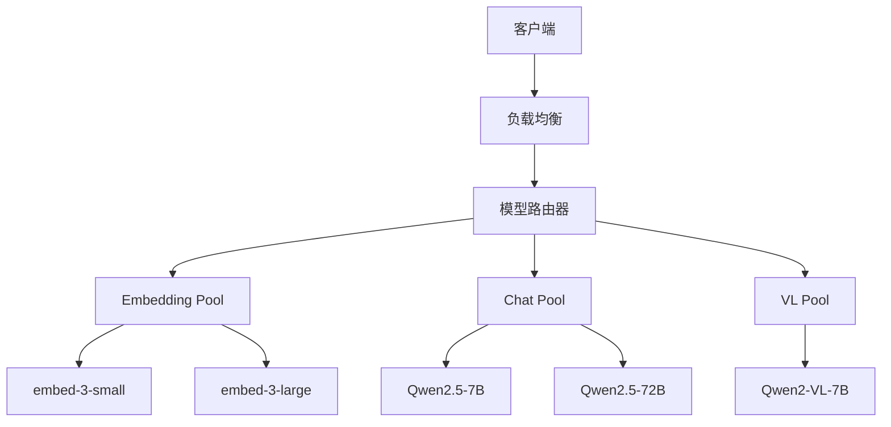

### 多模型配置

```yaml
# models.yaml
models:
  - name: qwen-7b
    model: Qwen/Qwen2.5-7B-Instruct
    tensor_parallel: 1
    gpu_memory_utilization: 0.90
    max_model_len: 8192
    served_model_name: qwen-7b

  - name: qwen-72b
    model: Qwen/Qwen2.5-72B-Instruct
    tensor_parallel: 4
    gpu_memory_utilization: 0.90
    max_model_len: 32768
    served_model_name: qwen-72b

  - name: embedding
    model: BAAI/bge-large-zh-v1.5
    tensor_parallel: 1
    served_model_name: bge-large-zh
```

### 动态模型加载

```python
from vllm import LLM
from typing import Optional
import threading

class ModelPool:
    def __init__(self, max_gpus: int = 8):
        self.models: dict[str, LLM] = {}
        self.lock = threading.Lock()
        self.max_gpus = max_gpus
        self.used_gpus = 0

    def load_model(self, name: str, model_path: str, tp: int = 1) -> bool:
        with self.lock:
            if name in self.models:
                return True
            if self.used_gpus + tp > self.max_gpus:
                self._evict_lru(tp)

            self.models[name] = LLM(
                model=model_path,
                tensor_parallel_size=tp,
                gpu_memory_utilization=0.90,
            )
            self.used_gpus += tp
            return True

    def get_model(self, name: str) -> Optional[LLM]:
        return self.models.get(name)

    def _evict_lru(self, need_gpus: int):
        freed = 0
        to_remove = []
        for name, model in self.models.items():
            tp = getattr(model, "tensor_parallel_size", 1)
            to_remove.append(name)
            freed += tp
            if freed >= need_gpus:
                break

        for name in to_remove:
            del self.models[name]
            self.used_gpus -= 1
```

---

## 成本优化

### 成本分析

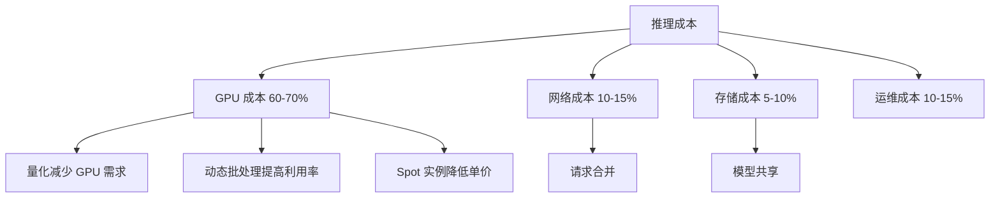

### 成本计算

```python
class InferenceCostCalculator:
    GPU_COSTS = {
        "A100_40GB": {"ondemand": 3.11, "spot": 1.05},
        "A100_80GB": {"ondemand": 4.13, "spot": 1.40},
        "H100_80GB": {"ondemand": 5.29, "spot": 1.80},
        "T4_16GB": {"ondemand": 0.75, "spot": 0.25},
        "L4_24GB": {"ondemand": 1.10, "spot": 0.37},
    }

    def estimate_monthly_cost(
        self,
        model: str,
        gpu_type: str,
        num_gpus: int,
        avg_rpm: int,
        avg_tokens_per_request: int,
        pricing_type: str = "ondemand",
    ) -> dict:
        gpu_hourly = self.GPU_COSTS[gpu_type][pricing_type]

        hours_per_month = 730
        gpu_cost = gpu_hourly * num_gpus * hours_per_month

        total_tokens_month = avg_rpm * 60 * hours_per_month * avg_tokens_per_request

        cost_per_million_tokens = (
            gpu_cost / (total_tokens_month / 1_000_000)
        )

        return {
            "model": model,
            "gpu_type": gpu_type,
            "num_gpus": num_gpus,
            "monthly_gpu_cost": f"${gpu_cost:,.2f}",
            "monthly_tokens": f"{total_tokens_month / 1e9:.1f}B",
            "cost_per_million_tokens": f"${cost_per_million_tokens:.4f}",
            "pricing_type": pricing_type,
        }

calc = InferenceCostCalculator()
print(calc.estimate_monthly_cost(
    model="Qwen2.5-7B",
    gpu_type="L4_24GB",
    num_gpus=1,
    avg_rpm=100,
    avg_tokens_per_request=500,
))
```

### 优化策略效果

| 优化策略 | 成本降低 | 精度影响 | 复杂度 |
|---------|---------|---------|--------|
| INT4 量化 | 50-60% | <2% | 低 |
| 动态批处理 | 30-40% | 无 | 中 |
| Speculative Decoding | 20-30% | 无 | 中 |
| Spot 实例 | 60-70% | 无 | 低 |
| KV Cache 共享 | 15-25% | 无 | 高 |
| 请求路由优化 | 10-20% | 无 | 中 |

---

## Kubernetes 部署

### K8s 架构

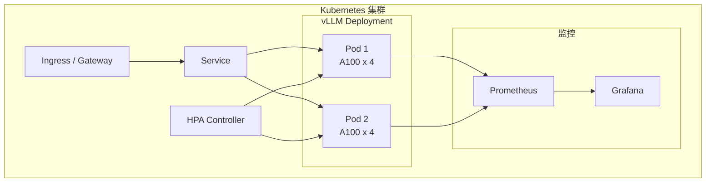

### Helm Chart 配置

```yaml
# values.yaml
replicaCount: 2

image:
  repository: vllm/vllm-openai
  tag: latest
  pullPolicy: IfNotPresent

model:
  name: "Qwen/Qwen2.5-7B-Instruct"
  maxModelLen: 8192
  tensorParallelSize: 1

resources:
  limits:
    nvidia.com/gpu: 1
    memory: "16Gi"
  requests:
    nvidia.com/gpu: 1
    memory: "12Gi"

gpu:
  type: "nvidia.com/gpu"
  count: 1

service:
  type: ClusterIP
  port: 8000

ingress:
  enabled: true
  className: "nginx"
  annotations:
    cert-manager.io/cluster-issuer: letsencrypt-prod
  hosts:
    - host: llm-api.example.com
      paths:
        - path: /
          pathType: Prefix
  tls:
    - secretName: llm-api-tls
      hosts:
        - llm-api.example.com

autoscaling:
  enabled: true
  minReplicas: 2
  maxReplicas: 8
  targetCPUUtilizationPercentage: 70
  targetMetricName: "custom_metrics_vllm_num_requests_running"

persistence:
  enabled: true
  size: 100Gi
  storageClass: "gp3"

monitoring:
  enabled: true
  serviceMonitor:
    enabled: true
    interval: 15s
    path: /metrics

tolerations:
  - key: "nvidia.com/gpu"
    operator: "Exists"
    effect: "NoSchedule"

nodeSelector:
  gpu-type: "a100"
```

### 自定义指标 HPA

```yaml
# hpa.yaml
apiVersion: autoscaling/v2
kind: HorizontalPodAutoscaler
metadata:
  name: vllm-hpa
spec:
  scaleTargetRef:
    apiVersion: apps/v1
    kind: Deployment
    name: vllm-deployment
  minReplicas: 2
  maxReplicas: 10
  metrics:
    - type: Pods
      pods:
        metric:
          name: vllm_num_requests_running
        target:
          type: AverageValue
          averageValue: "50"
    - type: Pods
      pods:
        metric:
          name: vllm_gpu_cache_usage_perc
        target:
          type: AverageValue
          averageValue: "80"
    - type: Resource
      resource:
        name: nvidia.com/gpu
        target:
          type: Utilization
          averageUtilization: 70
  behavior:
    scaleUp:
      stabilizationWindowSeconds: 60
      policies:
        - type: Pods
          value: 2
          periodSeconds: 120
    scaleDown:
      stabilizationWindowSeconds: 300
      policies:
        - type: Pods
          value: 1
          periodSeconds: 120
```

### 部署命令

```bash
# 添加 Helm repo
helm repo add vllm https://vllm-project.github.io/production-stack
helm repo update

# 安装
helm install vllm vllm/vllm -f values.yaml -n llm --create-namespace

# 扩容
kubectl scale deployment vllm-deployment --replicas=4 -n llm

# 滚动更新
kubectl set image deployment/vllm-deployment \
    vllm=vllm/vllm-openai:v0.7.0 -n llm

# 查看 GPU 使用
kubectl top pods -n llm

# 查看日志
kubectl logs -f deployment/vllm-deployment -n llm
```

---

## 总结

### 技术选型决策树

```
┌─────────────────────────────────────────────┐
│          推理引擎选型决策                     │
├─────────────────────────────────────────────┤
│                                             │
│  Q: 优先级是什么？                           │
│  ├── 吞吐量 → vLLM                          │
│  ├── 延迟   → TensorRT-LLM                  │
│  ├── 易用性 → Ollama / vLLM                 │
│  └── 成本   → llama.cpp + 量化              │
│                                             │
│  Q: 部署环境？                               │
│  ├── 云端 GPU 集群 → vLLM + K8s             │
│  ├── 单机 GPU      → vLLM / TRT-LLM        │
│  ├── CPU only      → llama.cpp              │
│  └── 移动端        → TFLite / ONNX Runtime  │
│                                             │
│  Q: 模型大小？                               │
│  ├── < 7B    → 单 GPU, INT4 量化            │
│  ├── 7B-30B  → 1-2 GPU, INT8/INT4          │
│  ├── 30B-70B → 2-4 GPU, TP + 量化          │
│  └── > 70B   → 4-8 GPU, TP + PP + 量化     │
│                                             │
└─────────────────────────────────────────────┘
```

### 相关文档

- [vLLM 深度解析](10_部署推理/02_推理引擎/29_vLLM_深入分析.md)
- [TensorRT-LLM 深度解析](10_部署推理/02_推理引擎/25_TensorRT_LLM_深入分析.md)
- [Ollama 深度解析](10_部署推理/02_推理引擎/22_Ollama_深入分析.md)
- [llama.cpp 深度解析](10_部署推理/02_推理引擎/13_llama_cpp_深入分析.md)
- [AI Gateway 对比 2026](12_架构基建/11_AI网关/02_AI网关_对比_2026.md)
- [API 设计 for AI](../../12_架构基建/11_AI网关/04_API_设计_for_AI.md)

## Related

- [[10_部署推理/README]] — 模型部署与推理加速 (Deployment & Inference) (共享: deployment, inference, model-deployment, serving, vllm)
- [[10_部署推理/README.md]] — 模型部署与推理加速 - 小白版 (共享: deployment, inference, model-deployment, serving, vllm)
- [[10_部署推理/02_推理引擎/10_JVM_AI_部署]] — JVM AI 部署与推理 (共享: deployment, inference, model-deployment, serving, vllm)
- [[概念/Inference/causal-inference]] — 模型推理速成指南 (共享: deployment, inference, serving, vllm)
- [[10_部署推理/02_推理引擎/18_LMDeploy_深入分析.md|LMDeploy_Deep_Dive]]
- [[10_部署推理/README.md|README]]
