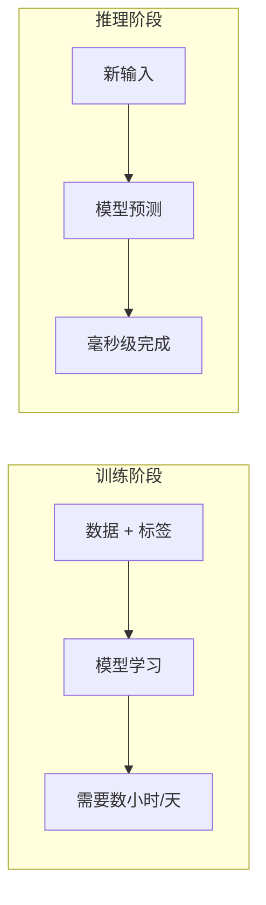
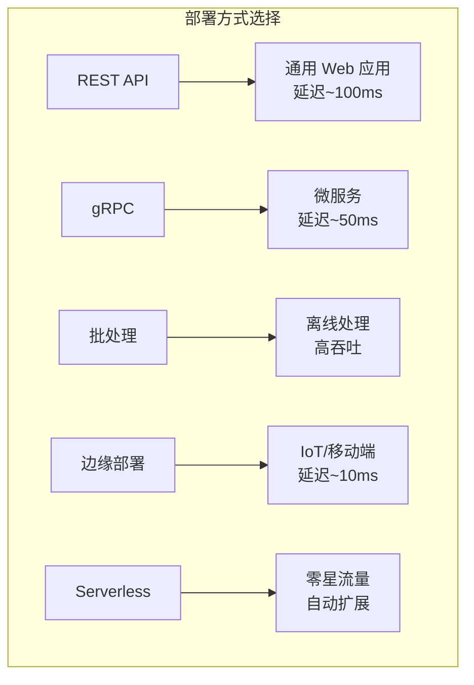
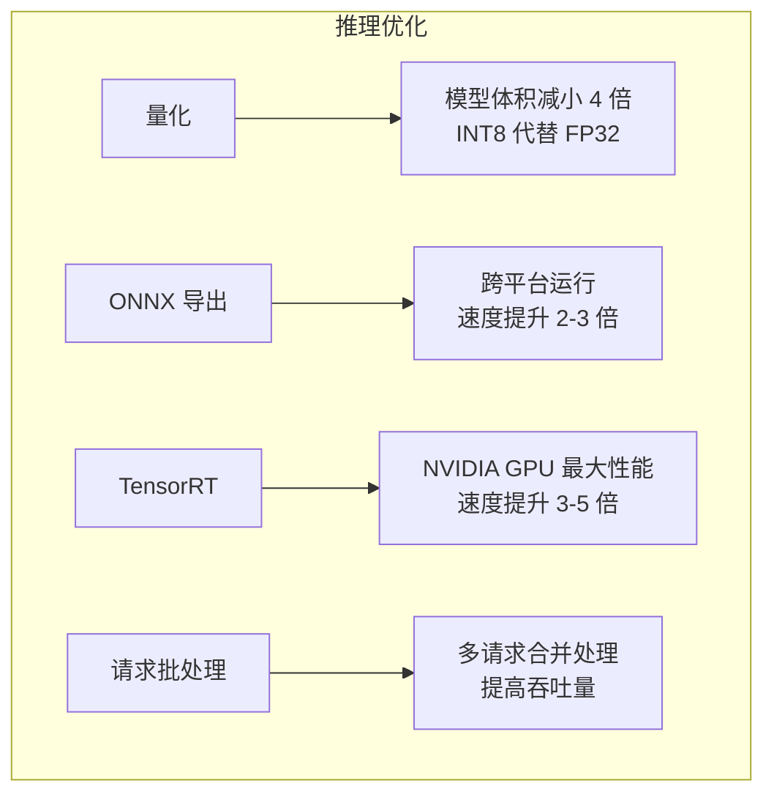
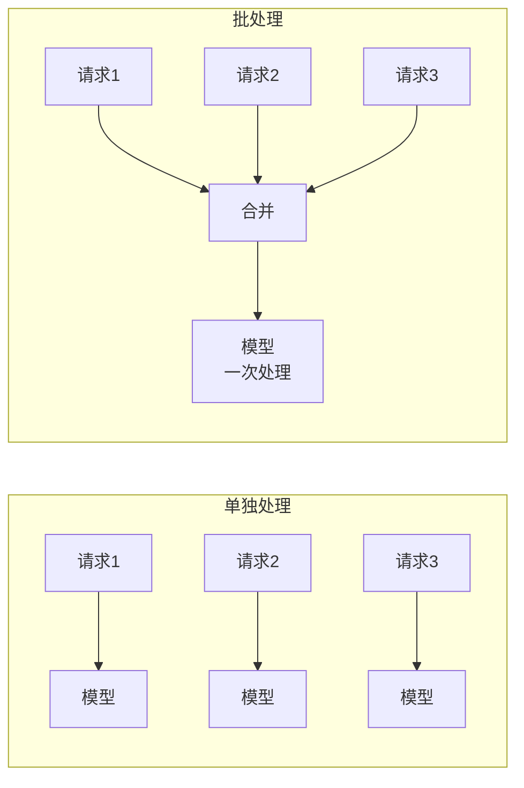
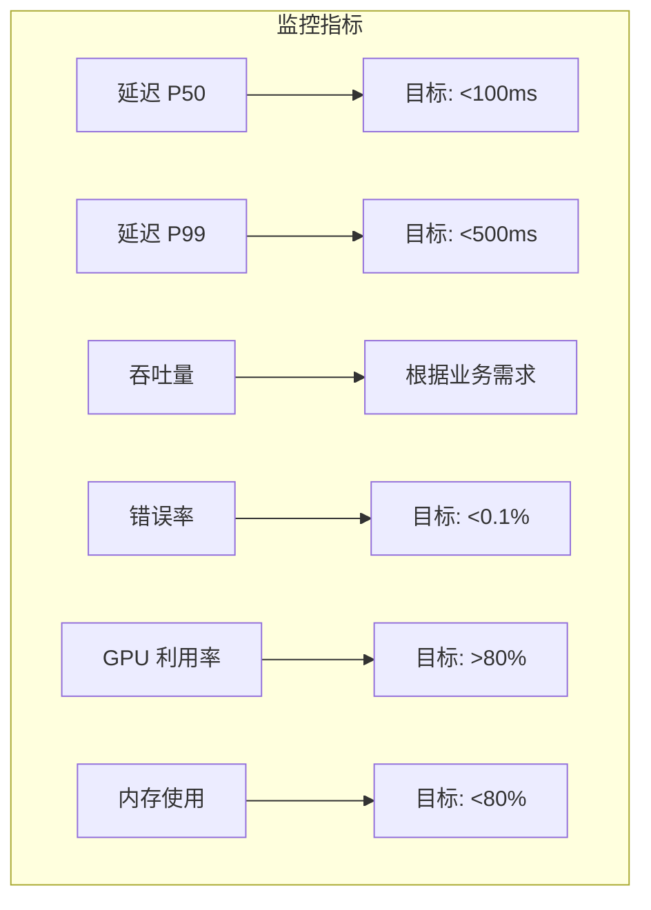
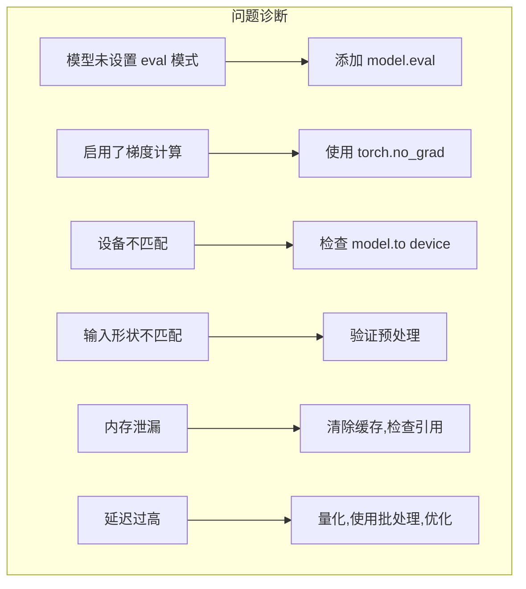
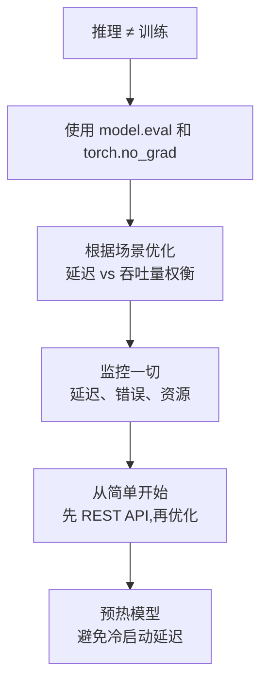

> [!warning] 生产安全提示 · Production Safety
> 本文档含可执行命令/操作步骤。执行前请核对风险等级（🟢低/🔶中/🔴高），高危命令必须 dry-run 并确认回滚方案。完整策略见 [生产安全策略](治理/Production_Safety_Policy.md)。
<!-- op-safety-banner v1 -->
# 模型推理速成指南

> 中文简称：模型推理速成指南

> 🎯 **目标**：理解如何在生产环境中使用训练好的 AI 模型进行预测。

---

## 🤔 什么是推理？

**训练** = 教模型（慢、贵、只做一次）
**推理** = 用模型（快、便宜、做无数次）



**真实案例**：
- 训练：用万亿词汇教 GPT（数月，数百万美元）
- 推理：向 ChatGPT 提问（毫秒，几分钱）

---

## 🧩 核心概念

### 推理 vs 训练模式


| 方面 | 训练模式 | 推理模式 |
|------|----------|----------|
| 梯度 | 计算 | 不需要 |
| Dropout | 激活（随机） | 禁用 |
| BatchNorm | 更新统计 | 使用固定统计 |
| 内存 | 高（存储激活值） | 低 |
| 速度 | 较慢 | 更快 |

```python
# 推理时必须使用这些！
model.eval()  # 切换到评估模式
with torch.no_grad():  # 禁用梯度计算
    output = model(input)
```

---

## 📋 推理流水线


### 完整示例（文本分类）

```python
import torch
from transformers import AutoTokenizer, AutoModelForSequenceClassification

# 1. 加载模型和分词器
tokenizer = AutoTokenizer.from_pretrained("bert-base-uncased")
model = AutoModelForSequenceClassification.from_pretrained("./trained_model")
model.eval()

# 2. 预处理输入
text = "这部电影太棒了！"
inputs = tokenizer(text, return_tensors="pt", padding=True, truncation=True)

# 3. 运行推理
with torch.no_grad():
    outputs = model(**inputs)
    predictions = torch.softmax(outputs.logits, dim=-1)

# 4. 后处理输出
labels = ["负面", "正面"]
predicted_label = labels[predictions.argmax().item()]
confidence = predictions.max().item()

print(f"预测: {predicted_label} ({confidence:.2%})")
# 输出: 预测: 正面 (96.32%)
```

---

## 🚀 部署选项

### 对比总览



| 选项 | 延迟 | 吞吐量 | 成本 | 复杂度 | 最适合 |
|------|------|--------|------|--------|--------|
| **REST API** | ~100ms | 中等 | 中等 | 低 | 通用 Web 应用 |
| **gRPC** | ~50ms | 高 | 中等 | 中等 | 微服务 |
| **批处理** | N/A | 非常高 | 低 | 低 | 离线处理 |
| **边缘部署** | ~10ms | 低 | 低 | 高 | IoT、移动端 |
| **Serverless** | ~200ms | 自动扩展 | 可变 | 低 | 零星流量 |

### 选项 1: REST API (FastAPI)

```python
# server.py
from fastapi import FastAPI
from pydantic import BaseModel
import torch

app = FastAPI()

# 启动时加载模型
model = load_model()
model.eval()

class PredictionRequest(BaseModel):
    text: str

class PredictionResponse(BaseModel):
    label: str
    confidence: float

@app.post("/predict", response_model=PredictionResponse)
def predict(request: PredictionRequest):
    with torch.no_grad():
        result = model.predict(request.text)
    return PredictionResponse(
        label=result["label"],
        confidence=result["confidence"]
    )

# 运行: uvicorn server:app --host 0.0.0.0 --port 8000
```

### 选项 2: 批量推理

```python
# batch_inference.py
import torch
from torch.utils.data import DataLoader

def batch_inference(model, dataset, batch_size=32):
    model.eval()
    dataloader = DataLoader(dataset, batch_size=batch_size)
    results = []
    
    with torch.no_grad():
        for batch in dataloader:
            outputs = model(batch)
            results.extend(outputs.tolist())
    
    return results

# 高效处理数百万条记录
results = batch_inference(model, large_dataset, batch_size=64)
```

### 选项 3: Docker 部署

```dockerfile
# Dockerfile
FROM python:3.10-slim

WORKDIR /app

# 安装依赖
COPY requirements.txt .
RUN pip install -r requirements.txt

# 复制模型和代码
COPY model/ ./model/
COPY server.py .

# 暴露端口
EXPOSE 8000

# 运行服务
CMD ["uvicorn", "server:app", "--host", "0.0.0.0", "--port", "8000"]
```

```bash
# 构建并运行
docker build -t inference-server .
docker run -p 8000:8000 inference-server
```

---

## ⚡ 优化技术

### 优化策略概览



### 1. 模型量化
减小模型体积，加速推理。

```python
import torch

# 动态量化（最简单）
quantized_model = torch.quantization.quantize_dynamic(
    model, 
    {torch.nn.Linear},  # 要量化的层
    dtype=torch.qint8
)

# 体积对比
original_size = os.path.getsize("model.pt") / 1e6
quantized_size = os.path.getsize("quantized_model.pt") / 1e6
print(f"体积: {original_size:.1f}MB → {quantized_size:.1f}MB")
# 典型: 400MB → 100MB (缩小 4 倍!)
```

### 2. ONNX 导出
用 ONNX Runtime 在任何平台运行。

```python
import torch.onnx

# 导出为 ONNX
dummy_input = torch.randn(1, 3, 224, 224)
torch.onnx.export(
    model,
    dummy_input,
    "model.onnx",
    input_names=["input"],
    output_names=["output"],
    dynamic_axes={"input": {0: "batch_size"}}
)

# 用 ONNX Runtime 推理（快 2-3 倍！）
import onnxruntime as ort

session = ort.InferenceSession("model.onnx")
outputs = session.run(None, {"input": input_data})
```

### 3. 请求批处理
多个请求合并处理。



---

## 📊 监控与指标

### 关键指标



| 指标 | 目标 | 告警阈值 |
|------|------|----------|
| **延迟 (P50)** | <100ms | >200ms |
| **延迟 (P99)** | <500ms | >1s |
| **吞吐量** | 因情况而异 | <80% 基线 |
| **错误率** | <0.1% | >1% |
| **GPU 利用率** | >80% | <50%（浪费） |
| **内存使用** | <80% | >90% |

### 日志设置

```python
import logging
import time

logging.basicConfig(level=logging.INFO)
logger = logging.getLogger(__name__)

def predict_with_metrics(model, input_data):
    start_time = time.time()
    
    try:
        result = model(input_data)
        latency = (time.time() - start_time) * 1000  # 毫秒
        
        logger.info(f"预测成功", extra={
            "latency_ms": latency,
            "input_size": len(input_data),
            "status": "success"
        })
        
        return result
        
    except Exception as e:
        logger.error(f"预测失败: {e}", extra={
            "status": "error",
            "error_type": type(e).__name__
        })
        raise
```

---

## 🛠️ 运维清单

### 部署前检查


```bash
# 本地测试模型
python test_inference.py

# 检查模型文件完整性
md5sum model.pt

# 验证依赖
pip freeze > requirements.txt

# 负载测试
locust -f load_test.py --host http://localhost:8000
```

### 部署命令

```bash
# 启动服务器
uvicorn server:app --host 0.0.0.0 --port 8000 --workers 4

# 使用 GPU
CUDA_VISIBLE_DEVICES=0 uvicorn server:app --host 0.0.0.0 --port 8000

# 健康检查
curl http://localhost:8000/health

# 测试预测
curl -X POST http://localhost:8000/predict \
  -H "Content-Type: application/json" \
  -d '{"text": "测试输入"}'
```

### 监控命令

```bash
# 检查 GPU 使用
nvidia-smi -l 1

# 检查 API 延迟
curl -w "@curl-format.txt" -o /dev/null -s http://localhost:8000/predict

# 查看日志
tail -f /var/log/inference/server.log

# 检查容器状态
docker stats inference-server
```

---

## ⚠️ 常见问题与解决方案



| 问题 | 症状 | 解决方案 |
|------|------|----------|
| **模型未设置 eval 模式** | 输出随机 | 添加 `model.eval()` |
| **启用了梯度计算** | 内存高、速度慢 | 使用 `torch.no_grad()` |
| **设备不匹配** | CUDA 错误 | 检查 `model.to(device)` |
| **输入形状不匹配** | Shape 错误 | 验证预处理 |
| **内存泄漏** | 长时间运行后 OOM | 清除缓存，检查引用 |
| **延迟过高** | 响应慢 | 量化，使用批处理，优化 |

---

## 💡 最佳实践

### 1. 始终预热


```python
# 在接收流量前发送预热请求
def warmup(model, device):
    dummy = torch.randn(1, *input_shape).to(device)
    for _ in range(3):  # 运行几次
        with torch.no_grad():
            model(dummy)
    print("模型预热完成！")
```

### 2. 添加健康检查

```python
@app.get("/health")
def health_check():
    return {"status": "healthy", "model_loaded": model is not None}

@app.get("/ready")
def readiness_check():
    # 实际测试模型
    try:
        with torch.no_grad():
            model(dummy_input)
        return {"status": "ready"}
    except:
        return {"status": "not ready"}, 503
```

### 3. 优雅关闭

```python
import signal
import sys

def shutdown_handler(signum, frame):
    print("正在优雅关闭...")
    # 完成当前请求
    # 释放资源
    sys.exit(0)

signal.signal(signal.SIGTERM, shutdown_handler)
signal.signal(signal.SIGINT, shutdown_handler)
```

---

## 📚 核心要点



---

## 🌐 AI Gateway 速成 (2026)

> **一句话**: AI Gateway是LLM流量的"智能路由器"——统一管理多供应商、优化成本、确保安全。

### 为什么需要AI Gateway？

**没有Gateway的痛苦**:
- 每个服务直接调用OpenAI/Anthropic，难以切换
- 成本失控，无法追踪
- 没有缓存，重复请求浪费钱
- 一家宕机，服务中断

**有Gateway的好处**:
- 一个API接口，背后多供应商
- 自动路由到最便宜/最快的模型
- 语义缓存节省40-50%成本
- 自动故障转移

### AI Gateway架构

```
应用 ──► Gateway ──┬──► OpenAI GPT-4
                   ├──► Anthropic Claude
                   ├──► Azure OpenAI
                   └──► 本地模型
```

### LiteLLM快速上手

**安装**:
```bash
pip install litellm
```

**启动Gateway**:
```bash
# 配置文件 config.yaml
litellm --config config.yaml
```

**配置示例**:
```yaml
# config.yaml
model_list:
  - model_name: gpt-4
    litellm_params:
      model: openai/gpt-4
      api_key: os.environ/OPENAI_API_KEY
  
  - model_name: gpt-4o-mini
    litellm_params:
      model: openai/gpt-4o-mini
      api_key: os.environ/OPENAI_API_KEY

# 路由策略：成本优先
router_settings:
  routing_strategy: cost-based

# 语义缓存
cache:
  type: redis
  host: localhost
  port: 6379
```

**客户端调用** (OpenAI兼容):
```python
from openai import OpenAI

client = OpenAI(
    base_url="http://localhost:4000",  # Gateway地址
    api_key="not-needed"
)

# 自动路由到最便宜的模型
response = client.chat.completions.create(
    model="gpt-4o-mini",  # 或gpt-4
    messages=[{"role": "user", "content": "Hello!"}]
)
```

### 三层成本优化

```
┌─────────────────────────────────────┐
│ Layer 3: 智能路由                    │
│ 简单查询 → 便宜模型(gpt-4o-mini)      │
│ 节省: 40-70%                         │
├─────────────────────────────────────┤
│ Layer 2: 语义缓存                    │
│ 相似问题直接返回缓存结果              │
│ 节省: 40-50%                         │
├─────────────────────────────────────┤
│ Layer 1: 提示压缩                    │
│ 移除冗余上下文                       │
│ 节省: 20-30%                         │
└─────────────────────────────────────┘
总节省: 70-90%
```

### 快速选型

| 需求 | 推荐方案 |
|------|----------|
| 快速开始 | LiteLLM Proxy |
| 极致性能 | Bifrost (Rust) |
| 企业观测 | Portkey |
| 已有Kong | Kong AI Gateway |

**详细文档**: [Deployment & Inference](./03_部署推理.md)

---

## 🔗 相关主题

- [模型训练](07_模型训练/01_训练基础/04_模型_训练_简明指南.md) - 模型是如何训练的
- [RAG 系统](14_RAG系统/01_RAG基础/08_RAG_简明指南.md) - 带检索的推理
- [MLOps 流水线](../MLOps_Pipeline/) - 自动化部署
- [SRE 实践](13_运维/02_SRE与可靠性/22_SRE_for_AI_系统.md) - SLI/SLO 与可靠性工程
- [可观测性](11_模型运维/08_可观测性/03_AI_可观测性_指南.md) - AI 系统监控与追踪

## Related

- [[10_部署推理/README]] — 模型部署与推理加速 (Deployment & Inference) (共享: deployment, inference, serving, vllm)
- [[10_部署推理/01_部署基础/02_部署推理_2026]] — 部署推理 2026 趋势 (共享: deployment, inference, serving, vllm)
- [[10_部署推理/README.md]] — 模型部署与推理加速 - 小白版 (共享: deployment, inference, serving, vllm)
- [[10_部署推理/02_推理引擎/10_JVM_AI_部署]] — JVM AI 部署与推理 (共享: deployment, inference, serving, vllm)
- [[10_部署推理/02_推理引擎/29_vLLM_深入分析.md|vLLM_Deep_Dive]]
- [[10_部署推理/README|README_for_dummy]]
