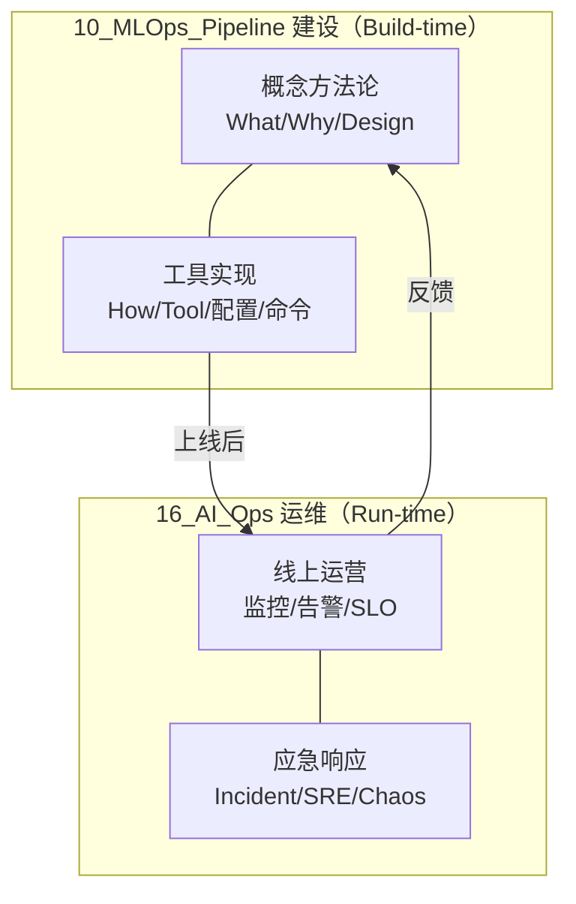

# 10_MLOps_Pipeline 与 16_AI_Ops 边界声明

> 中文简称：10_MLOps_Pipeline 与 16_AI_Ops 边界声明

> **核心原则**: 10 是「**ML 建设**」（概念 + 工具实现），16 是「**AI 运维**」（线上运营 + 应急响应）。
> 工具深度解析已于 2026-06-15 从 16 迁入 10，物理结构现已对齐边界原则。

---

## 一、为什么需要这份声明

2026-06-15 诊断发现：`AI运维/` 有 16 个工具深度解析与 `11_模型运维/` 主题重叠。为消除重复、建立权威源（SSOT），明确划分两章职责。

**2026-06-15 迁移已完成**：工具深度解析（DVC/Feast/MLflow/Kubeflow/LangSmith/Helicone/Phoenix/Braintrust/ClearML/Prefect/LakeFS + 3 篇 Observability + CI_CD_Pipeline + LLM_Production_Pipeline）已从 16 迁入 10。

---

## 二、分工原则

| 维度 | 10_MLOps_Pipeline | 16_AI_Ops |
|------|------------------|-----------|
| **职责** | ML/LLM 流水线的**建设** | AI 系统的**运维** |
| **生命周期** | Build-time（设计、构建、工具选型） | Run-time（运营、监控、应急） |
| **内容** | 概念方法论 + 工具深度解析 + 流水线设计 | 线上运维 + 事故响应 + SRE + 混沌工程 |
| **读者** | ML 工程师 / LLM 应用工程师 / 数据工程师 | SRE / DevOps / 平台运维 |
| **典型文件** | LLMOps_2026、Feature_Store_Deep_Dive、Feast_Deep_Dive | AI_Incident_Response_Playbook、SRE_for_AI_Systems |

---

## 三、主题归属矩阵（SSOT）

### 3.1 已迁入 10 的工具深度解析（权威源：10）

以下 16 个工具页已从 16 迁入 10，10 是唯一权威源：

| 工具页（现居 10） | 对应概念页（也在 10） |
|------------------|---------------------|
| [[11_模型运维/05_流程编排/05_DVC_深入分析]] | [[Data_Versioning_DVC_LakeFS]] |
| [[11_模型运维/05_流程编排/08_LakeFS_深入分析]] | [[Data_Versioning_DVC_LakeFS]] |
| [[11_模型运维/04_实验追踪/04_Feast_深入分析]] | [[Feature_Store_Deep_Dive]] |
| [[11_模型运维/04_实验追踪/07_MLflow_深入分析]] | [[概念/MLOps/experiment-tracking]] |
| [[11_模型运维/04_实验追踪/01_ClearML_深入分析]] | [[概念/MLOps/experiment-tracking]] |
| [[11_模型运维/05_流程编排/07_Kubeflow_深入分析]] | [[11_模型运维/05_流程编排/02_数据_流水线_编排]] |
| [[11_模型运维/05_流程编排/09_Prefect_深入分析]] | [[11_模型运维/05_流程编排/02_数据_流水线_编排]] |
| [[11_模型运维/08_可观测性/07_LangSmith_深入分析]] | [[11_模型运维/13_运维评估/03_LLM评估_流水线]] / [[11_模型运维/08_可观测性/10_llm_observability_aiops]] |
| [[11_模型运维/08_可观测性/05_Helicone_深入分析]] | [[11_模型运维/08_可观测性/10_llm_observability_aiops]] |
| [[11_模型运维/08_可观测性/14_Phoenix_深入分析]] | [[11_模型运维/08_可观测性/10_llm_observability_aiops]] / [[11_模型运维/08_可观测性/11_ML_可观测性_SLO]] |
| [[11_模型运维/08_可观测性/04_Braintrust_深入分析]] | [[11_模型运维/13_运维评估/03_LLM评估_流水线]] |
| [[11_模型运维/08_可观测性/01_AI_可观测性_深入分析]] | [[11_模型运维/08_可观测性/11_ML_可观测性_SLO]] |
| [[AI_Observability_Guide]] | [[11_模型运维/08_可观测性/11_ML_可观测性_SLO]] |
| [[AI_Observability_Guide_2026]] | [[11_模型运维/08_可观测性/11_ML_可观测性_SLO]] |
| [[11_模型运维/06_持续集成部署/01_CI_CD_流水线_AI_2026]] | [[11_模型运维/06_持续集成部署/04_ML_CI_CD]] |
| [[概念/LLM/llm-production-pipeline]] | [[11_模型运维/10_LLMOps_大模型运维/05_LLMOps_2026]] |

### 3.2 保留在 16 的运维主题（权威源：16）

| 主题 | 权威页 |
|------|--------|
| **AI 运维总览** | [[13_运维/AI_Ops_2026]] |
| **事故响应** | [[13_运维/02_SRE与可靠性/01_AI_故障应急_Playbook]]、[[13_运维/02_SRE与可靠性/15_故障应急_for_AI_系统]] |
| **SRE 实践** | [[13_运维/02_SRE与可靠性/22_SRE_for_AI_系统]] |
| **混沌工程** | [[13_运维/02_SRE与可靠性/06_Chaos_工程_AI]] |
| **安全护栏（工具）** | [[13_运维/02_SRE与可靠性/13_Guardrails_深入分析]]（未迁移，留 16） |
| **Prompt 管理（工具）** | [[13_运维/PromptLayer_Deep_Dive]]（未迁移，留 16） |

### 3.3 独占主题

| 章节 | 独占主题 |
|------|---------|
| **仅 10** | LLMOps 主线、Prompt/Eval/RAG 流水线、成本与延迟 SLO、再训练、合规、MLOps 成熟度、全部工具深度解析 |
| **仅 16** | Incident Response、SRE、Chaos Engineering、AI Ops 总览 |

---

## 四、写作规范

### 4.1 概念页（10）怎么写

- 用对比表横向比较工具的**设计哲学差异**
- 讲「选型决策树」（什么场景用什么）
- 讲跨工具共性概念（如训练-服务偏差、数据血源）
- **不应**重复具体命令用法（→ 同章的工具深度解析页）

### 4.2 工具页（10）怎么写

- 开头链向概念页：「概念与选型见 [[治理/index]]」
- 聚焦该工具的**具体命令、配置、部署、踩坑**

### 4.3 运维页（16）怎么写

- 聚焦线上运营、应急响应
- 引用 10 的概念作为背景：「模型监控门禁设计见 [[11_模型运维/08_可观测性/11_ML_可观测性_SLO]]」

---

## 五、与相邻章节的边界

### 10 vs 09_Deployment_Inference

| 主题 | 权威源 |
|------|--------|
| 推理引擎（vLLM/TGI/SGLang） | **09** |
| 量化 / KV Cache / 投机解码 | **09** |
| 部署策略（Shadow/Canary） | **10** |
| 模型服务模式（在线/批/流） | **10**（P2 待建） |

### 10 vs 15_Testing

| 主题 | 权威源 |
|------|--------|
| 测试框架工具用法（Ragas/DeepEval） | **15** |
| 评估方法论（LLM-as-Judge/Eval-Driven） | **10** |

### 10 vs 19_Ethics_Safety

| 主题 | 权威源 |
|------|--------|
| 红队 / 越狱 / 安全攻防 | **19** |
| 合规流水线 / Model Card 门禁 | **10** |

---

## 六、Related

- [[11_模型运维/README|章节导航]] — MLOps Pipeline 目录导航
- [[README]] — 10 章节导航
- [[13_运维/README]] — 16 章节导航

---

*边界声明: 2026-06-15 · 工具迁移已于同日完成 · 维护者: opencode*

## MLOps核心流程对比

| 阶段 | 关键活动 | 工具链 | 质量指标 |
|------|----------|--------|----------|
| 数据管理 | 采集/清洗/标注/版本化 | DVC/LakeFS/Label Studio | 数据质量分/覆盖率 |
| 模型训练 | 实验管理/超参搜索/分布式训练 | MLflow/W&B/Ray | 收敛速度/最终精度 |
| 模型评估 | 离线评估/对比实验/偏差检测 | Great Expectations/Evidently | 准确率/公平性指标 |
| 模型部署 | 容器化/服务化/灰度发布 | K8s/Seldon/vLLM | 延迟/吞吐/可用性 |
| 模型监控 | 漂移检测/性能退化/告警 | Prometheus/Evidently/Grafana | 漂移分数/告警准确率 |
| 模型迭代 | A/B测试/自动重训/版本回滚 | Argo/Kubeflow/MLflow | 迭代周期/线上指标 |

## 运维关键指标体系

| 指标类别 | 具体指标 | 目标值 | 监控频率 |
|----------|----------|--------|----------|
| 可用性 | 服务可用率 | >99.9% | 实时 |
| 性能 | P99推理延迟 | <2s | 实时 |
| 质量 | 模型准确率 | >基线5% | 每日 |
| 漂移 | 数据/概念漂移分数 | <阈值 | 每小时 |
| 成本 | GPU利用率/每请求成本 | >80%利用率 | 每日 |
| 安全 | 对抗攻击检测率 | >95% | 实时 |

## 常见运维问题与解决方案

| 问题 | 根因 | 解决方案 | 预防措施 |
|------|------|----------|----------|
| 模型性能退化 | 数据分布漂移 | 触发重训/回滚 | 漂移监控+自动告警 |
| 推理延迟飙升 | 流量突增/资源不足 | 自动扩容+限流 | 容量规划+压测 |
| GPU OOM | 批处理过大/显存泄漏 | 减小batch/重启 | 显存监控+限制 |
| 数据管道中断 | 上游变更/格式错误 | Schema验证+告警 | 契约测试+版本化 |
| 模型版本混乱 | 缺乏版本管理 | MLflow统一注册 | 强制版本化流程 |

## 模型生命周期管理

| 阶段 | 状态 | 关键操作 | 负责人 |
|------|------|----------|--------|
| 开发 | Staging | 训练+评估+注册 | ML工程师 |
| 验证 | Validating | 集成测试+性能测试 | QA+ML工程师 |
| 发布 | Released | 灰度发布+监控 | MLOps工程师 |
| 运行 | Active | 监控+维护+告警 | SRE+MLOps |
| 退役 | Archived | 流量切换+归档 | MLOps工程师 |

## 自动化运维实践

| 实践 | 实现方式 | 收益 |
|------|----------|------|
| CI/CD for ML | 自动化训练-评估-部署流水线 | 迭代速度提升5x |
| 自动重训 | 漂移触发+定时触发 | 模型始终保持最新 |
| 自动扩缩容 | HPA基于QPS/GPU利用率 | 成本优化30-50% |
| 自动回滚 | 指标异常自动切回旧版本 | 故障恢复<5min |
| 自动告警 | 多级告警+智能降噪 | 减少误报80% |

## 术语速查表

| 术语 | 含义 |
|------|------|
| MLOps | 机器学习运维(ML+DevOps) |
| Model Drift | 模型性能随时间退化 |
| Data Drift | 输入数据分布变化 |
| Concept Drift | 目标关系变化 |
| Canary Release | 金丝雀发布(小流量验证) |
| Blue-Green | 蓝绿部署(双环境切换) |
| Feature Store | 特征存储(统一管理特征) |
| Model Registry | 模型注册中心(版本管理) |
| Serving | 模型服务化(在线推理) |
| Batch Inference | 批量推理(离线处理) |

## 检查清单

- [ ] 模型版本管理和注册中心已建立
- [ ] 自动化CI/CD流水线已配置
- [ ] 模型监控和漂移检测已部署
- [ ] 自动扩缩容策略已配置
- [ ] 告警规则和响应流程已定义
- [ ] 回滚机制已测试验证
- [ ] 成本监控和优化持续进行
- [ ] 安全审计和合规检查已覆盖
