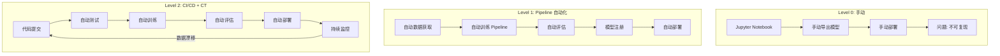
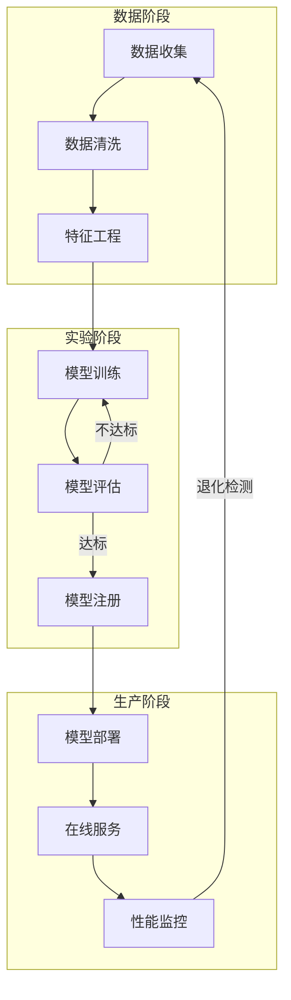
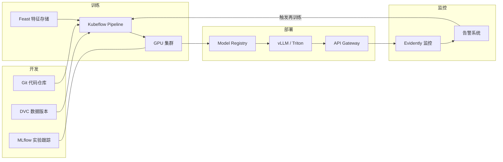
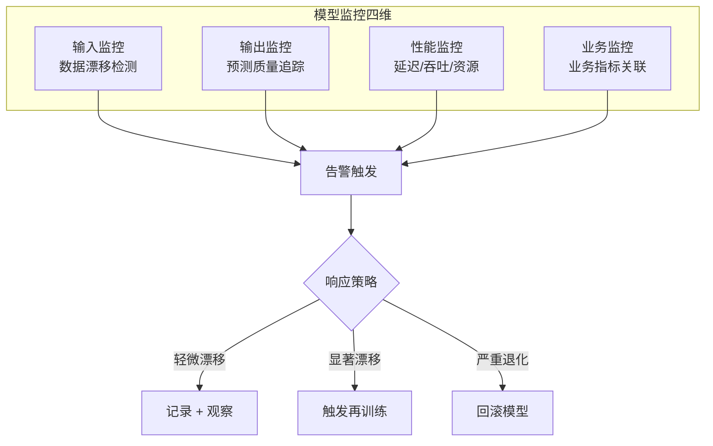

> [!warning] 生产安全提示 · Production Safety
> 本文档含可执行命令/操作步骤。执行前请核对风险等级（🟢低/🔶中/🔴高），高危命令必须 dry-run 并确认回滚方案。完整策略见 [生产安全策略](治理/Production_Safety_Policy.md)。
<!-- op-safety-banner v1 -->
# MLOps 速成指南

> 中文简称：MLOps 速成指南

> 🎯 **目标**：理解 MLOps 的核心概念、流水线架构和关键工具，掌握将 ML 模型从实验带到生产的工程实践。

---

## 🤔 什么是 MLOps？

**MLOps** = DevOps 的 AI 版——让模型像软件一样可靠地开发、部署和运维。

```
软件开发 (DevOps):              AI 开发 (MLOps):
                                
代码 → 测试 → 构建 → 部署       数据 → 训练 → 评估 → 部署
  │                        │                    │
  └── 代码版本化              └── 数据+代码+模型 版本化
  └── 自动化 CI/CD            └── 自动化 CT/CD（持续训练/部署）
  └── 监控服务健康            └── 监控模型质量 + 服务健康
```

**核心挑战**：ML 系统不只是代码——还有**数据**和**模型**，两者都会随时间退化。

---

## 🏗️ MLOps 成熟度模型



| 级别 | 自动化程度 | 关键特征 | 适用场景 |
|------|-----------|---------|---------|
| **L0** | 手动 | Notebook 驱动，无复现性 | 原型/实验 |
| **L1** | Pipeline | 训练自动化，特征存储，实验跟踪 | 小规模生产 |
| **L2** | CI/CD + CT | 全自动化，持续训练，监控反馈闭环 | 大规模生产 |

---

## 🔄 ML 生命周期



---

## 🧩 核心组件

### 组件全景

| 组件 | 作用 | 代表工具 | 选型建议 |
|------|------|---------|---------|
| **版本控制** | 代码 + 数据 + 模型 | Git, DVC, LakeFS | Git + DVC 是标配 |
| **实验跟踪** | 超参、指标、工件记录 | MLflow, W&B, Neptune | MLflow 开源通用；W&B 可视化强 |
| **Pipeline 编排** | 训练/部署流程自动化 | Airflow, Kubeflow, Prefect, Dagster | Airflow 通用；Prefect 现代 Python |
| **特征存储** | 离线/在线特征统一管理 | Feast, Tecton, Hopsworks | Feast 开源；Tecton 全托管 |
| **模型注册** | 模型版本 + 元数据管理 | MLflow Registry, Seldon, Vertex AI | 与实验跟踪工具统一选型 |
| **模型服务** | 在线推理 API | vLLM, Triton, TorchServe, Seldon | LLM 用 vLLM；传统 ML 用 Triton |
| **质量监控** | 漂移/性能/数据质量 | Evidently, WhyLabs, Phoenix | Evidently 开源；WhyLabs SaaS |

### 组件协作架构



---

## 🔧 关键技术

### 实验跟踪

```python
import mlflow

mlflow.set_experiment("sentiment-classifier-v2")

with mlflow.start_run():
    mlflow.log_params({
        "model": "distilbert-base-uncased",
        "learning_rate": 2e-5,
        "batch_size": 32,
        "epochs": 3,
    })
    
    metrics = train_and_evaluate()
    
    mlflow.log_metrics({
        "accuracy": metrics["accuracy"],
        "f1_score": metrics["f1"],
        "latency_p95_ms": metrics["latency_p95"],
    })
    
    mlflow.pytorch.log_model(model, "model")
```

### 数据版本控制 (DVC)

```bash
# 初始化 DVC
dvc init

# 跟踪大文件
dvc add data/training.csv
git add data/training.csv.dvc data/.gitignore

# 推送到远程存储
dvc remote add -d s3remote s3://my-bucket/dvc-store
dvc push

# 恢复特定版本的数据
git checkout v1.2.0
dvc checkout
```

### 特征存储 (Feast)

```python
from feast import FeatureStore

store = FeatureStore(repo_path=".")

# 获取在线特征（实时推理用）
features = store.get_online_features(
    features=[
        "user_features:age",
        "user_features:purchase_count_30d",
        "item_features:category_embedding",
    ],
    entity_rows=[{"user_id": "u123", "item_id": "i456"}],
).to_dict()
```

---

## 📊 模型监控

### 监控维度



### 数据漂移检测方法

| 方法 | 原理 | 适用场景 |
|------|------|---------|
| **KS Test** | 比较训练/在线数据分布差异 | 连续特征 |
| **PSI** (Population Stability Index) | 分箱比较分布变化 | 金融风控 |
| **JSD** (Jensen-Shannon Divergence) | 信息论距离 | 通用 |
| **ADWIN** | 自适应窗口检测概念漂移 | 流式数据 |
| **Embedding 距离** | 对比输入 Embedding 分布变化 | NLP/LLM |

---

## 🚀 部署模式

### 部署策略对比

| 模式 | 描述 | 延迟 | 适用场景 |
|------|------|------|---------|
| **在线推理** | 实时 API 调用 | < 100ms | 用户实时请求 |
| **批量推理** | 定时批量处理 | 分钟-小时 | 报表/推荐更新 |
| **流式推理** | 事件驱动处理 | 秒级 | 实时风控/监控 |
| **边缘推理** | 本地设备运行 | < 10ms | 移动端/IoT |

### 蓝/绿 + 金丝雀部署

```
部署流程:
═══════════
                    ┌──────────────┐
                    │   用户流量    │
                    └──────┬───────┘
                           │
                    ┌──────▼───────┐
                    │   负载均衡    │
                    └──┬───────┬───┘
                       │       │
              ┌────────▼┐  ┌───▼────────┐
              │ Blue (v1)│  │Green (v2)  │
              │  95%     │  │ 5% (金丝雀)│
              └─────────┘  └────────────┘
                                │
                          质量验证通过?
                          ├── Yes → 25% → 50% → 100%
                          └── No  → 回滚 Green
```

---

## 🛠️ 2026 工具生态

### LLMOps 专属工具

| 工具 | 用途 | 特点 |
|------|------|------|
| **vLLM** | LLM 推理服务 | PagedAttention，高吞吐 |
| **SGLang** | LLM 推理服务 | RadixAttention，低延迟 |
| **Langfuse** | LLM 可观测性 | Trace + 评估 + 成本追踪 |
| **Phoenix** | LLM 可观测性 | Embedding 可视化 + 漂移 |
| **Promptfoo** | Prompt 评估 | 自动化 A/B 测试 |
| **LiteLLM** | 多模型代理 | 统一 API，100+ 模型 |
| **BentoML** | 模型服务 | 多框架统一部署 |

### MLOps 平台

| 平台 | 特点 | 适用 |
|------|------|------|
| **MLflow** | 开源全能，自托管 | 通用 |
| **Weights & Biases** | 强可视化，SaaS | 实验密集 |
| **Vertex AI** | GCP 全托管 | GCP 用户 |
| **SageMaker** | AWS 全托管 | AWS 用户 |
| **Azure ML** | Azure 全托管 | Azure 用户 |
| **ZenML** | 开源 MLOps 框架 | 多云 |

---

## 📋 实践检查清单

### 从 L0 → L1

- [ ] 使用 Git 管理代码
- [ ] 使用 DVC 或 LakeFS 管理数据版本
- [ ] 使用 MLflow/W&B 跟踪实验
- [ ] 训练流程脚本化（非 Notebook）
- [ ] 模型评估自动化
- [ ] 模型注册到 Model Registry

### 从 L1 → L2

- [ ] CI Pipeline：代码质量 + 单元测试
- [ ] CT Pipeline：数据/模型漂移触发再训练
- [ ] CD Pipeline：金丝雀部署 + 自动回滚
- [ ] 特征存储（离线/在线统一）
- [ ] 全链路监控（数据 + 模型 + 服务）
- [ ] On-Call 和事故响应流程

---

## 📝 关键术语

| 术语 | 解释 |
|------|------|
| **CI/CD** | 持续集成/持续部署——代码变更自动测试和发布 |
| **CT** | 持续训练——数据变化自动触发模型再训练 |
| **Data Drift** | 数据漂移——输入数据分布随时间变化 |
| **Concept Drift** | 概念漂移——输入与输出的关系发生变化 |
| **Feature Store** | 特征存储——统一管理离线训练和在线推理用的特征 |
| **Model Registry** | 模型注册——集中管理模型版本和元数据 |
| **A/B Test** | 对比测试——同时运行新旧模型比较效果 |
| **Shadow Mode** | 影子模式——新模型接收流量但不返回结果，仅记录对比 |

---

## 🔗 相关主题

| 主题 | 文档 |
|------|------|
| 完整架构 | [05_MLOps_流水线.md](./05_MLOps_流水线.md) |
| 入门指南 | MLOps_Pipeline_for_dummy.md |
| 部署推理 | [../Deployment_Inference/06_推理_简明指南.md](10_部署推理/01_部署基础/06_推理_简明指南.md) |
| AI Ops | [../AI_Ops/01_AI运维2026.md](13_运维/01_AIOps基础/01_AI运维2026.md) |
| SRE 实践 | [../AI_Ops/22_SRE_for_AI_系统.md](13_运维/02_SRE与可靠性/22_SRE_for_AI_系统.md) |
| 成本优化 | [../01_AI_成本优化_2026.md](12_架构基建/02_架构概览/01_AI_成本优化_2026.md) |

---

*Last updated: 2026-04-11*

## Related

- [[11_模型运维/05_流程编排/02_数据_流水线_编排]] — 数据流水线编排 (Data Pipeline Orchestration) (共享: ci-cd, feature-store, mlops, pipeline)
- [[11_模型运维/README.md|README]]
- [[11_模型运维/README|README_for_dummy]]
- [[11_模型运维/04_实验追踪/02_实验追踪_深入分析.md|Experiment_Tracking_Deep_Dive]]
- [[11_模型运维/04_实验追踪/05_特征存储_深入分析.md|Feature_Store_Deep_Dive]]
