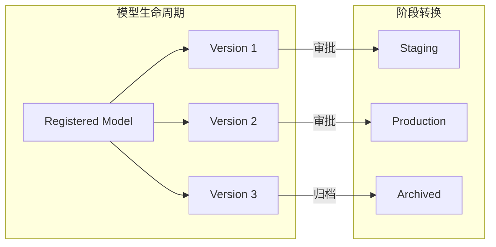
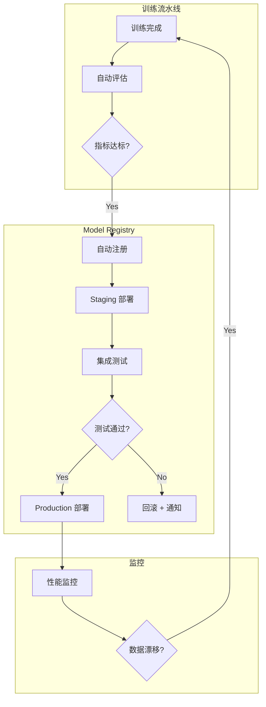

# 模型注册与模型卡片深度解析

> 中文简称：模型注册与模型卡片深度解析

> **一句话理解**: Model Registry 是模型的"图书馆管理系统"——负责编目、版本控制和发布审批；Model Card 是每本书的"封面和目录"——告诉使用者这个模型是什么、能做什么、有什么限制。

---

## 一、为什么需要 Model Registry

### 1.1 没有 Registry 的混乱

```
models/
├── bert-base-v1.pt
├── bert-base-v1-final.pt
├── bert-base-v1-final-REAL.pt        # 哪个是真的？
├── bert-base-v2-experiment-20260301.pt
└── latest-model.pt                   # 哪个版本的 latest？
```

**核心问题**:
- 无法确定哪个模型在生产环境运行
- 无法回滚到特定版本
- 缺少性能指标与训练参数的关联
- 模型审批流程无法标准化

### 1.2 Model Registry 解决什么

| 问题 | Registry 的解决方案 |
|------|-------------------|
| 版本混乱 | 自动递增版本号 + 语义化标签 |
| 审批缺失 | 阶段转换（Staging → Production）需审批 |
| 可追溯性 | 每次注册关联训练实验、数据版本、指标 |
| 发现性 | 中央目录 + 搜索 + 元数据筛选 |
| 部署安全 | 只有 Production 阶段的模型可部署 |

---

## 二、主流 Model Registry 对比

### 2.1 功能对比矩阵

| 特性 | MLflow | Weights & Biases | Hugging Face Hub | Vertex AI | SageMaker |
|------|--------|-------------------|-------------------|-----------|-----------|
| **版本管理** | 自动递增 | 手动标签 | Git-like | 自动 | 自动 |
| **阶段转换** | None/Staging/Production/Archived | 无内置 | Draft/Published | 无内置 | 无内置 |
| **元数据** | 自定义键值对 | Artifacts + Metadata | Model Card YAML | 自定义标签 | 自定义标签 |
| **模型格式** | 任意 | 任意 | GGUF/Safetensors/ONNX | 任意 | 任意 |
| **访问控制** | RBAC (企业版) | Team/Project | Public/Private/Org | IAM | IAM |
| **API 集成** | REST + Python | REST + Python | REST + huggingface_hub | gRPC + REST | boto3 |
| **开源** | ✅ 完全 | ❌ | ✅ 部分 | ❌ | ❌ |
| **成本** | 免费自托管 | $50/月起 | 免费层 + 付费 | 按用量 | 按用量 |

### 2.2 选型决策树

```
需要模型阶段审批？
├─ 是 → MLflow Model Registry
│   └─ 需要云端托管 → MLflow + Databricks
└─ 否
   ├─ 团队已用 W&B 做实验追踪？
   │  └─ 是 → W&B Model Registry
   ├─ 面向开源社区发布？
   │  └─ 是 → Hugging Face Hub
   └─ 已在云平台（GCP/AWS）？
      └─ 是 → 原生 Registry（Vertex AI / SageMaker）
```

---

## 三、MLflow Model Registry 实战

### 3.1 核心概念



**核心实体**:
- **Registered Model**: 模型名称（如 `fraud-detector`），包含多个版本
- **Model Version**: 具体的模型实例，关联一次训练实验
- **Stage**: None → Staging → Production → Archived

### 3.2 注册与版本管理

```python
import mlflow
from mlflow.tracking import MlflowClient

client = MlflowClient()

# 1. 注册模型（从训练实验）
result = mlflow.register_model(
    model_uri=f"runs:/{run_id}/model",
    name="fraud-detector"
)
print(f"Registered version {result.version}")

# 2. 添加描述和标签
client.update_registered_model(
    name="fraud-detector",
    description="信用卡欺诈检测模型 - XGBoost + 特征工程"
)
client.set_registered_model_tag(
    name="fraud-detector",
    key="framework", value="xgboost"
)

# 3. 阶段转换
client.transition_model_version_stage(
    name="fraud-detector",
    version=2,
    stage="Production"
)

# 4. 加载生产模型
model = mlflow.pyfunc.load_model(
    model_uri="models:/fraud-detector/Production"
)
```

### 3.3 自动化注册流水线

```python
from mlflow.models import infer_signature
import mlflow.sklearn

def train_and_register(X_train, y_train, X_test, y_test, model_name: str):
    """训练 + 评估 + 条件注册的完整流水线"""
    
    with mlflow.start_run(run_name=f"{model_name}-training") as run:
        # 训练
        model = train_model(X_train, y_train)
        
        # 评估
        predictions = model.predict(X_test)
        metrics = calculate_metrics(y_test, predictions)
        
        # 记录
        mlflow.log_metrics(metrics)
        mlflow.log_params(model.get_params())
        
        signature = infer_signature(X_test, predictions)
        mlflow.sklearn.log_model(
            model, "model", signature=signature,
            registered_model_name=model_name  # 自动注册
        )
        
        # 条件阶段转换：超过阈值则自动升级
        if metrics["f1_score"] > 0.95:
            client = MlflowClient()
            client.transition_model_version_stage(
                name=model_name,
                version=run.info.run_id,
                stage="Staging"
            )
            print(f"✅ Model promoted to Staging (F1={metrics['f1_score']:.4f})")
    
    return run
```

---

## 四、Model Cards 文档化

### 4.1 什么是 Model Card

Model Card 是模型的标准化文档，回答 6 个核心问题：

| 问题 | 对应章节 | 示例 |
|------|----------|------|
| 这个模型是什么？ | Model Details | "GPT-4 是一个大规模多模态模型" |
| 它能做什么？ | Intended Use | "文本生成、代码编写、图像理解" |
| 它怎么训练的？ | Training Data & Process | "在 13T tokens 上预训练" |
| 它表现如何？ | Evaluation Results | "MMLU: 86.4%, HumanEval: 90.2%" |
| 它有什么限制？ | Limitations | "可能产生幻觉，不擅长数学推理" |
| 使用有什么伦理考虑？ | Ethical Considerations | "可能产生偏见内容" |

### 4.2 Google Model Card 模板

```yaml
# model_card.yaml - 标准化模型卡片
model_details:
  name: "fraud-detector-v2"
  version: "2.1.0"
  overview: "基于 XGBoost 的信用卡欺诈检测模型"
  owners:
    - name: "ML Platform Team"
      contact: "ml-platform@company.com"
  references:
    - link: "https://internal-wiki/fraud-detector"
      description: "内部设计文档"

intended_use:
  primary_use_cases:
    - "实时交易欺诈评分"
    - "批量交易后审计"
  out_of_scope:
    - "不适用于非信用卡交易"
    - "不应用于信用评分"

training_data:
  datasets:
    - name: "transaction-2025-Q1-Q4"
      size: "50M transactions"
      description: "含标签的历史交易数据"
      preprocessing: "特征工程: 35个特征, SMOTE过采样"

evaluation_results:
  metrics:
    - name: "F1-Score"
      value: 0.963
      test_set: "holdout-2026-Q1"
    - name: "Precision@95%Recall"
      value: 0.891
    - name: "Latency P99"
      value: "12ms"
  fairness:
    - demographic_parity_difference: 0.003
    - equalized_odds_difference: 0.008

limitations:
  known_issues:
    - "对新型欺诈模式（如深度伪造）检测能力有限"
    - "跨币种交易需要额外的汇率特征"
  recommended_alternatives:
    - "对于跨境交易，建议使用 fraud-detector-international"

ethical_considerations:
  - "模型不基于人口统计学特征做预测"
  - "所有拒绝交易均提供可解释原因"
  - "每季度进行公平性审计"
```

### 4.3 Hugging Face Model Card 规范

```markdown
---
license: mit
library_name: transformers
tags:
  - text-classification
  - fraud-detection
metrics:
  - f1
  - precision
  - recall
datasets:
  - company/transaction-data-2025
model-index:
  - name: fraud-detector-v2
    results:
      - task:
          type: text-classification
          name: Fraud Detection
        dataset:
          type: company/transaction-data-2025
          name: Transaction Holdout Q1 2026
        metrics:
          - type: f1
            value: 0.963
            name: F1 Score
---

# Fraud Detector V2

## Model Description
基于 XGBoost 的信用卡欺诈检测模型...

## Usage
```python
from transformers import pipeline
classifier = pipeline("text-classification", model="company/fraud-detector-v2")
```

## Training Details
- **Training Data**: 50M transactions (2025 Q1-Q4)
- **Features**: 35 engineered features
- **Oversampling**: SMOTE (ratio 1:5)

## Evaluation Results
| Metric | Score |
|--------|-------|
| F1 | 0.963 |
| Precision@95%Recall | 0.891 |
| Latency P99 | 12ms |
```

---

## 五、最佳实践

### 5.1 模型注册 Checklist

```
注册前:
- [ ] 所有评估指标已记录（F1/Precision/Recall/Latency）
- [ ] 训练数据和超参数版本已关联
- [ ] 模型签名（输入/输出 Schema）已推断
- [ ] 单元测试通过（输入验证、边界条件）

注册时:
- [ ] 使用语义化版本号（major.minor.patch）
- [ ] 添加完整的描述和标签
- [ ] 上传 Model Card 文档
- [ ] 记录模型大小和推理性能

注册后:
- [ ] 在 Staging 环境验证
- [ ] 审批通过后转换到 Production
- [ ] 旧版本标记为 Archived
- [ ] 通知下游团队（Slack/Email）
```

### 5.2 Model Card 编写原则

| 原则 | 说明 | 反面案例 |
|------|------|----------|
| **诚实** | 如实报告限制和失败案例 | "模型在所有场景下准确率 99%" |
| **具体** | 用数据说话，避免模糊描述 | "模型表现良好" |
| **可操作** | 告诉用户怎么用、何时不该用 | 只描述架构不提供使用指南 |
| **可维护** | 版本化、可更新 | 写完即弃，不跟进模型迭代 |
| **受众导向** | 技术细节 + 业务影响分层呈现 | 只给工程师看，忽略产品经理 |

### 5.3 自动化集成架构



---

## 六、常见陷阱

| 陷阱 | 说明 | 解决方案 |
|------|------|----------|
| **只注册不文档化** | 注册了模型但没有 Model Card | CI 中强制要求 Model Card 才能注册 |
| **版本膨胀** | 每次实验都注册，Registry 变成垃圾场 | 设置阈值，只有达标模型才注册 |
| **阶段转换无审批** | Staging→Production 无门禁 | 配置 Webhook + 人工审批 |
| **元数据不完整** | 缺少训练数据版本、特征列表 | 使用 Model Card 模板强制补全 |
| **旧版本不归档** | Archived 模型占用存储 | 定期清理 + 保留策略（保留最近 N 个版本） |

---

## Related

- [[11_模型运维/01_MLOps基础/05_MLOps_流水线|MLOps 流水线]] — 完整流水线设计
- [[11_模型运维/04_实验追踪/02_实验追踪_深入分析|实验追踪深度解析]] — 模型注册的实验关联
- [[11_模型运维/06_持续集成部署/04_ML_CI_CD|ML CI/CD 流水线]] — 自动化部署流程
- [[概念/mlops]] — MLOps 概念卡片
