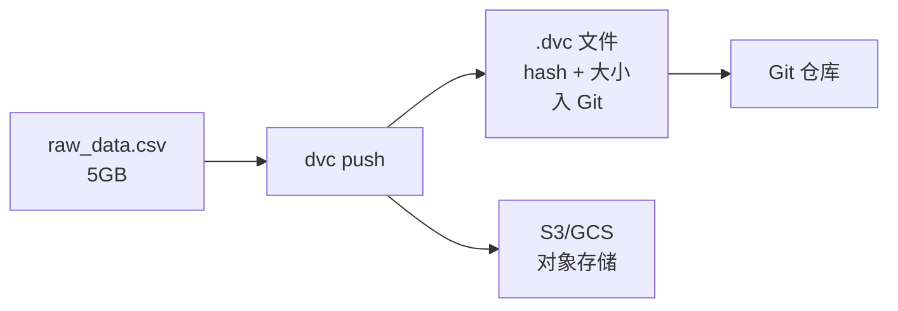
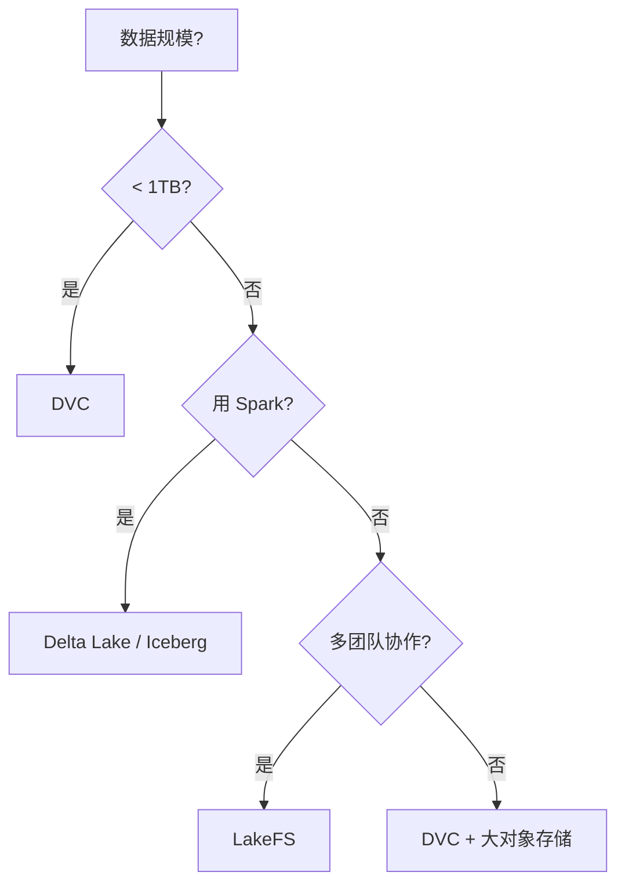

> [!warning] 生产安全提示 · Production Safety
> 本文档含可执行命令/操作步骤。执行前请核对风险等级（🟢低/🔶中/🔴高），高危命令必须 dry-run 并确认回滚方案。完整策略见 [生产安全策略](治理/Production_Safety_Policy.md)。
<!-- op-safety-banner v1 -->
# 数据版本控制：DVC 与 LakeFS

> 中文简称：数据版本控制：DVC 与 LakeFS

> **一句话理解**: 代码用 Git 管，但 GB–TB 级的数据塞不进 Git——DVC 和 LakeFS 用「指针入 Git，数据入对象存储」的方式，让数据集也能版本化、可 diff、可回滚。

本文是 MLOps 数据层基础。特征存储见 [[Feature_Store_Deep_Dive]]，数据流水线编排见 [[11_模型运维/05_流程编排/02_数据_流水线_编排]]。

---

## 目录

| 章节 | 内容 | 难度 |
|------|------|------|
| [1. 为什么需要数据版本控制](#1-为什么需要数据版本控制) | 可复现性的基石 | 入门 |
| [2. DVC：Git 扩展模式](#2-dvcgit-扩展模式) | 指针 + 对象存储 | 进阶 |
| [3. LakeFS：Git for 数据湖](#3-lakefsgit-for-数据湖) | 分支式管理 | 进阶 |
| [4. 方案对比与选型](#4-方案对比与选型) | DVC vs LakeFS vs Delta | 实战 |
| [5. 可复现性实践](#5-可复现性实践) | code + data + model 三元组 | 实战 |
| [6. CI/CD 集成](#6-cicd-集成) | 数据变更触发流水线 | 进阶 |
| [7. 相关文档](#7-相关文档) | 导航 | 导航 |

---

## 1. 为什么需要数据版本控制

### 1.1 没有数据版本控制的灾难

| 场景 | 后果 |
|------|------|
| 训练用的 CSV 被人覆盖 | 模型无法复现，AUC 从 0.92 掉到 0.85 找不到原因 |
| 数据团队更新了特征定义 | 训练数据变了，但模型还是用旧数据训的 |
| 上线模型出问题想回滚 | 不知道当时是哪个版本的数据训的 |
| 合规审计要求追溯 | 无法回答「这个模型用了哪些数据」 |

### 1.2 三层版本化

可复现的 ML 实验 = **三元组**：

```
(code@commit, data@version, model@hash)
```

任何一项缺失，实验就无法复现。

| 资产 | 版本工具 |
|------|---------|
| 代码 | Git |
| **数据** | **DVC / LakeFS（本文）** |
| 模型 | Model Registry（见 [[11_模型运维/04_实验追踪/09_模型_注册中心_and_Cards_深入分析]]） |

---

## 2. DVC：Git 扩展模式

### 2.1 核心原理

DVC（Data Version Control）是 Git 的扩展，用「指针入 Git，数据入对象存储」的方式工作：



### 2.2 基本工作流

```bash
# 1. 添加数据到 DVC
dvc add data/raw.csv
# 生成 data/raw.csv.dvc（指针文件）+ 加入 .gitignore

# 2. 提交指针到 Git
git add data/raw.csv.dvc .gitignore
git commit -m "add raw data v1"

# 3. 推送数据到远程存储
dvc push   # 推到 S3/GCS/SSH

# 4. 数据更新后，重复 1-3
dvc add data/raw.csv   # 检测到变化
git commit -am "update raw data v2"
dvc push

# 5. 回滚到 v1
git checkout HEAD~1 -- data/raw.csv.dvc
dvc pull   # 从远程拉对应版本
```

### 2.3 DVC Pipeline（可复现训练）

```yaml
# dvc.yaml — 声明式流水线
stages:
  prepare:
    cmd: python src/prepare.py data/raw.csv data/prepared.csv
    deps: [data/raw.csv, src/prepare.py]
    outs: [data/prepared.csv]
  train:
    cmd: python src/train.py data/prepared.csv model.pkl
    deps: [data/prepared.csv, src/train.py]
    outs: [model.pkl]
    metrics:
      - metrics.json:
          cache: false
```

```bash
dvc repro        # 自动检测依赖变化，重新执行受影响阶段
dvc exp run      # 实验模式，记录超参 + 指标
dvc exp show     # 对比所有实验
```

**核心价值**：`dvc repro` 让任何人用相同代码 + 数据 + 超参复现同一结果。

---

## 3. LakeFS：Git for 数据湖

### 3.1 核心差异

| 维度 | DVC | LakeFS |
|------|-----|--------|
| 模式 | Git 扩展（客户端） | 独立服务（服务端） |
| 数据位置 | 对象存储（你管） | LakeFS 管理（透明） |
| 分支 | 通过 Git commit 模拟 | 原生分支（像 Git） |
| 规模 | 单数据集 GB–TB | 数据湖 TB–PB |
| 协作 | 文件级冲突 | 分支级隔离 |
| 适合 | 单团队 / 实验复现 | 多团队 / 数据湖治理 |

### 3.2 LakeFS 工作流

```bash
# LakeFS 暴露 S3 兼容 API，用 aws-cli 操作
aws s3 cp data.csv s3://my-repo/main/data.csv

# 创建分支（零拷贝，元数据级）
lakectl branch create lakefs://my-repo/feature-branch from main

# 在分支上修改数据（不影响 main）
aws s3 cp new_data.csv s3://my-repo/feature-branch/data.csv

# 合并回 main
lakectl merge lakefs://my-repo/feature-branch into lakefs://my-repo/main
```

### 3.3 LakeFS 的杀手级场景

| 场景 | 价值 |
|------|------|
| **数据 PR Review** | 改数据像改代码，走 PR 审查 |
| **隔离实验** | 实验在分支跑，不污染生产数据 |
| **时间旅行** | 任意时刻的数据快照 |
| **回滚** | 一键回滚数据湖到任意 commit |

---

## 4. 方案对比与选型

### 4.1 全方案对比

| 方案 | 类型 | 优势 | 劣势 | 适用 |
|------|------|------|------|------|
| **DVC** | 开源·客户端 | 轻量、与 Git 无缝 | 大规模协作弱 | 单团队 / 实验 |
| **LakeFS** | 开源·服务端 | 原生分支、规模大 | 需运维服务 | 数据湖 / 多团队 |
| **Delta Lake** | 开源·表格式 | ACID、时间旅行 | 仅 Spark 生态 | Spark 数据湖 |
| **Apache Iceberg** | 开源·表格式 | 多引擎支持 | 学习曲线 | 多引擎数据湖 |
| **Pachyderm** | 商业 | Pipeline + 版本一体 | 重 | 企业级 |
| **Weights & Biases Artifacts** | 商业 | 与实验追踪一体 | 锁定 | 已用 W&B |

### 4.2 选型决策



---

## 5. 可复现性实践

### 5.1 三元组绑定

```python
import dvc.api
import git

def reproducible_train():
    # 1. 记录代码版本
    code_commit = git.Repo().head.commit.hexsha
    
    # 2. 记录数据版本（DVC）
    data_version = dvc.api.get_url(
        path="data/train.csv",
        repo=".",
        rev=code_commit,
    )
    
    # 3. 训练并记录模型 hash
    model = train(load_data("data/train.csv"))
    model_hash = hashlib.sha256(pickle.dumps(model)).hexdigest()
    
    # 4. 写入 Model Card
    registry.log_model(
        model=model,
        code_commit=code_commit,
        data_version=data_version,
        model_hash=model_hash,
    )
```

### 5.2 复现验证

```bash
# 任何人、任何环境都能复现
git checkout <commit>
dvc pull                    # 拉对应数据
dvc repro                   # 重跑流水线
# 结果应与记录的指标一致
```

---

## 6. CI/CD 集成

```yaml
# .github/workflows/data-validation.yml
name: Data Validation
on:
  push:
    paths: ['data/**']

jobs:
  validate:
    runs-on: ubuntu-latest
    steps:
      - uses: actions/checkout@v4
      - name: Setup DVC
        run: pip install dvc && dvc pull
      - name: Schema Validation
        run: great_expectations validate data/train.csv
      - name: Drift Check vs Production
        run: python scripts/check_drift.py --baseline prod --candidate current
      - name: Data Quality Tests
        run: pytest tests/test_data_quality.py
```

---

## 工具实现（本章节）

本文讲数据版本控制的**概念与选型**。具体工具的命令、配置、部署：

- [[11_模型运维/05_流程编排/05_DVC_深入分析]] — DVC：Git 扩展模式的数据版本控制
- [[11_模型运维/05_流程编排/08_LakeFS_深入分析]] — LakeFS：Git for 数据湖

---

## 7. 相关文档

### 本章内
- [[11_模型运维/01_MLOps基础/05_MLOps_流水线]] — 全流水线（数据版本是其基础环节）
- [[11_模型运维/04_实验追踪/Feature_Store_Deep_Dive]] — 特征存储（数据版本的特征视角）
- [[11_模型运维/04_实验追踪/02_实验追踪_深入分析]] — 实验追踪（数据版本是其输入）
- [[11_模型运维/05_流程编排/02_数据_流水线_编排]] — 数据编排
- [[11_模型运维/04_实验追踪/09_模型_注册中心_and_Cards_深入分析]] — 模型注册（三元组的模型侧）

### 跨章
- [[概念/mlops]] — MLOps 概念
- [[09_测试/01_测试基础/Test_Data_Management]] — 测试数据管理

---

*最后更新：2026-06-15*
