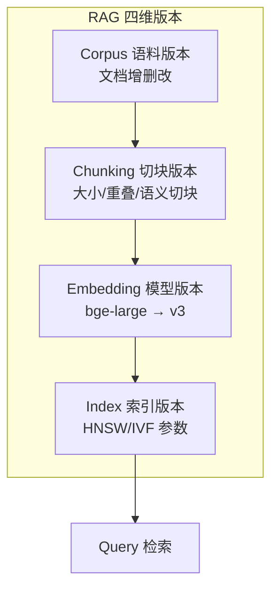
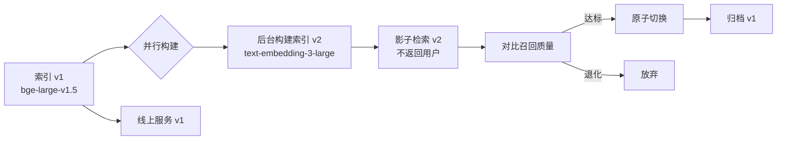
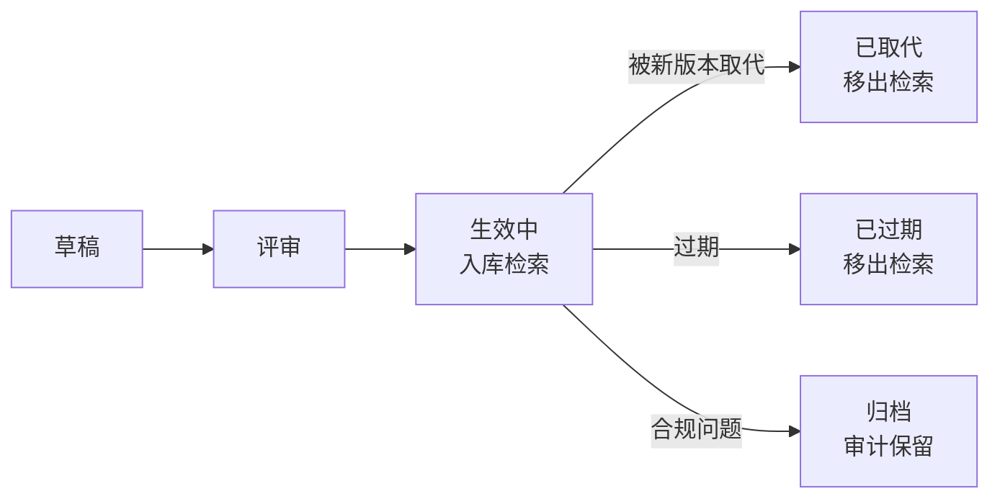
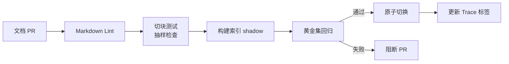

# RAG 流水线运维

> 中文简称：RAG 流水线运维

> **一句话理解**: RAG 系统的运维难点不在「检索」，而在「知识库是活的」——文档在变、切块策略在调、Embedding 模型在升级，每个变更都可能让召回质量崩塌。

本文是 [[11_模型运维/10_LLMOps_大模型运维/05_LLMOps_2026]] §6「RAG 流水线运维」的深扩专题，专注 Ops 视角。RAG 的架构与算法详见 [[14_RAG系统/README]]。

---

## 目录

| 章节 | 内容 | 难度 |
|------|------|------|
| [1. RAG Ops 的独特挑战](#1-rag-ops-的独特挑战) | 四维可变性 | 入门 |
| [2. 文档与切块版本化](#2-文档与切块版本化) | corpus + chunking 双轨 | 进阶 |
| [3. Embedding 升级迁移](#3-embedding-升级迁移) | 最贵最危险的操作 | 进阶 |
| [4. 索引重建与灰度](#4-索引重建与灰度) | 原子切换策略 | 实战 |
| [5. 检索质量监控](#5-检索质量监控) | 线上指标体系 | 进阶 |
| [6. 知识新鲜度治理](#6-知识新鲜度治理) | 文档生命周期 | 实战 |
| [7. RAG CI/CD 流水线](#7-rag-cicd-流水线) | 端到端自动化 | 进阶 |
| [8. 工具栈与选型](#8-工具栈与选型) | 2026 主流方案 | 实战 |
| [9. 生产事故复盘](#9-生产事故复盘) | 2 个真实案例 | 实战 |
| [10. 相关文档](#10-相关文档) | 导航 | 导航 |

---

## 1. RAG Ops 的独特挑战

### 1.1 四维可变性

RAG 系统有**四个独立的可变维度**，每个维度变更都可能破坏召回质量：



| 维度 | 变更触发 | 影响范围 | 必须动作 | 成本 |
|------|---------|---------|---------|------|
| **语料** (corpus) | 文档增删改 | 新增/失效召回 | 增量切块 + 重新嵌入 | 低 |
| **切块** (chunking) | 调整大小/策略 | 全量召回质量 | 全量重新切块 + 嵌入 | 中 |
| **Embedding** | 模型升级 | 全量向量空间 | **全量重新嵌入**（最贵） | 高 |
| **索引** (index) | 算法/参数调整 | 检索延迟/召回率 | 重建索引（向量不变） | 中 |

### 1.2 与传统数据管道的本质区别

| 维度 | 传统 ETL | RAG Pipeline |
|------|---------|-------------|
| 数据形态 | 结构化 / 半结构化 | 非结构化文档 |
| 处理粒度 | 行 / 记录 | 切块（语义单元） |
| 输出用途 | 直接消费 | 喂给向量库 → 检索 |
| 质量标准 | 行数 / 完整性 | 召回 Recall / 语义相关性 |
| 变更频率 | 低 | 高（文档持续更新） |
| 回滚难度 | 中 | 极高（向量重建昂贵） |

---

## 2. 文档与切块版本化

### 2.1 语料版本化

把语料当作代码仓库管理：

```
knowledge_base/
├── corpus.yaml                    # 语料清单（哪些文档入库）
├── docs/
│   ├── product_manual/
│   │   ├── v1.0.md               # 文档自带版本
│   │   └── v1.1.md
│   ├── policies/
│   │   └── refund_2026.md
│   └── faq/
└── corpus@2026-06-15.snapshot    # 时间点快照
```

```yaml
# corpus.yaml — 语料清单
version: 2026-06-15
documents:
  - path: docs/product_manual/v1.1.md
    doc_id: pm-001
    status: active                 # active | deprecated | archived
    valid_from: 2026-06-01
    valid_until: null              # null = 长期有效
    access_level: public           # 访问控制（多租户）
    tags: [product, manual]
  - path: docs/product_manual/v1.0.md
    doc_id: pm-001
    status: superseded             # 被 v1.1 取代
    superseded_by: pm-001@v1.1
```

### 2.2 切块策略版本化

切块策略是召回质量的决定性因素，必须版本化：

```yaml
# chunking_strategies/default_v3.yaml
id: default
version: 3
parent: default@v2
type: recursive                    # fixed | recursive | semantic | sentence
params:
  chunk_size: 512                  # tokens
  chunk_overlap: 64
  separators: ["\n\n", "\n", "。", " "]
  keep_separator: true
metadata_extract:                  # 切块时附加的元数据
  - source_file
  - heading_path                   # 标题层级（H1 > H2 > H3）
  - page_number
changelog:
  - v3: overlap 32 → 64，召回边界用例 +8%
  - v2: 改用 recursive 切块，跨段落召回改善
  - v1: 固定 512 token 切块
```

### 2.3 切块策略对比

| 策略 | 工具支持 | 优势 | 劣势 | 适用 |
|------|---------|------|------|------|
| **固定大小** | 全部 | 简单可预测 | 跨语义单元 | PoC |
| **递归分隔** | LangChain | 平衡大小与边界 | 参数敏感 | 通用首选 |
| **语义切块** | LlamaIndex SemanticChunker | 边界语义自然 | 慢（需嵌入） | 长文档 |
| **文档感知** | Unstructured | 按 Markdown/PDF 结构 | 依赖文档质量 | 结构化文档 |
| **句子窗口** | LlamaIndex | 召回句、返回上下文 | 实现复杂 | 高精度 RAG |

**经验值**：90% 场景用「递归分隔 + 512 token + 64 overlap」即可，过度优化切块策略边际收益递减。

---

## 3. Embedding 升级迁移

### 3.1 为什么这是最危险的操作

Embedding 模型定义了**向量空间**。不同模型的向量空间**完全不兼容**：

- `bge-large-en-v1.5` 的 `[0.1, 0.3, ...]` 与 `bge-large-en-v1.5` 的 `[0.1, 0.3, ...]` 相似
- `bge-large-en-v1.5` 的向量与 `text-embedding-3-large` 的向量**没有任何语义关系**
- **混合检索 = 必然返回垃圾**

### 3.2 迁移流程



### 3.3 成本估算

| 阶段 | 操作 | 成本（100 万切块） |
|------|------|------------------|
| 重新嵌入 | 调用 Embedding API | OpenAI text-embedding-3-large: $13 |
| | | 本地 bge-m3：~2 GPU 小时 |
| 索引重建 | HNSW 构建 | ~30 CPU 分钟 |
| 存储 | 双索引并行期 | 翻倍（直到切换） |
| 影子检索 | 双路召回 | 检索成本翻倍 1–2 周 |

**总成本**：100 万切块的 Embedding 升级约 **$50–$500**，主要是工程时间而非 API 费。

### 3.4 平滑迁移的陷阱

| 陷阱 | 后果 | 防御 |
|------|------|------|
| **混合检索** | 新旧向量混查，召回垃圾 | 必须**原子切换**，不能灰度混合 |
| **维度不匹配** | 向量库报错或静默截断 | 迁移前校验维度 |
| **查询侧遗漏** | 文档嵌入用新模型，查询嵌入还用旧 | 同时升级两侧 |
| **缓存污染** | 语义缓存里的旧向量被复用 | 切换时清空缓存 |

---

## 4. 索引重建与灰度

### 4.1 增量 vs 全量重建

| 场景 | 策略 | 工具 |
|------|------|------|
| 少量文档增删 | 增量 upsert/delete | 向量库原生支持 |
| 切块策略调整 | 全量重建（向量子集不变也需重切） | 离线 Pipeline |
| Embedding 升级 | 全量重嵌入 + 重建 | 离线 Pipeline |
| 索引算法调参 | 重建索引（向量复用） | 向量库 reindex API |

### 4.2 双索引灰度方案

```python
# 影子检索实现（伪代码）
class DualIndexSearcher:
    def __init__(self):
        self.primary = VectorStore(index_name="v1")
        self.shadow = VectorStore(index_name="v2")
    
    def search(self, query_vec, k=5):
        # 用户只看到 primary 结果
        primary_results = self.primary.search(query_vec, k=k)
        
        # shadow 结果用于离线对比，不返回用户
        shadow_results = self.shadow.search(query_vec, k=k)
        log_comparison(query_vec, primary_results, shadow_results)
        
        return primary_results

    def promote_shadow(self):
        """影子质量达标后，原子切换"""
        self.primary, self.shadow = self.shadow, self.primary
        archive_old_index(self.shadow)
```

### 4.3 切换前的质量门禁

| 指标 | 基线（v1） | 目标（v2） | 不达标动作 |
|------|-----------|-----------|-----------|
| Recall@10 | 0.82 | ≥ 0.85 | 阻断 |
| MRR | 0.65 | ≥ 0.68 | 阻断 |
| 查询延迟 P99 | 180ms | ≤ 200ms | 阻断 |
| 空召回率 | 8% | ≤ 6% | 阻断 |
| 存储大小 | 50GB | ≤ 60GB | 警告 |

---

## 5. 检索质量监控

### 5.1 线上监控指标

```mermaid
graph TD
    Q[查询] --> R[检索]
    R --> M1[召回层指标]
    R --> M2[生成层指标]
    R --> M3[业务层指标]
    M1 --> R1[Recall@k]
    M1 --> R2[检索延迟]
    M1 --> R3[空召回率]
    M2 --> G1[上下文利用率]
    M2 --> G2[幻觉率]
    M3 --> B1[用户满意度]
    M3 --> B2[回答完整度]
```

### 5.2 核心指标定义

| 指标 | 计算 | 健康阈值 | 监控方式 |
|------|------|---------|---------|
| **召回 Recall@k** | 黄金集 Top-k 包含正确文档的比例 | > 0.85 | 离线 Eval 集 |
| **空召回率** | 检索返回空 / 全是低分（< 0.3）文档 | < 5% | 实时 |
| **检索延迟 P99** | 端到端检索耗时 | < 200ms | 实时 |
| **上下文利用率** | LLM 实际引用的召回内容占比 | > 60% | Trace 分析 |
| **重排后增益** | Reranker 对 Top-k 的重排改善 | +10% MRR | 离线 |
| **查询漂移** | 新查询模式 vs 历史分布 | < 5% 新增 | 每周 |

### 5.3 检索失败的根因分类

| 失败模式 | 症状 | 根因 | 修复 |
|---------|------|------|------|
| **召回不到** | 空召回 / 低分 | 文档未入库 / 切块太碎 | 检查入库 + 调切块 |
| **召回到了但排名低** | 正确文档在 Top-k 之外 | Embedding 质量 / 无 Reranker | 加 Reranker |
| **召回旧版本** | 召回了已废弃文档 | 文档状态未同步 | 清理 superseded 文档 |
| **召回无关文档** | 召回质量差 | 切块语义碎裂 | 调切块策略 |
| **多租户串扰** | A 租户看到 B 租户文档 | 缺少租户过滤 | 加 metadata filter |

---

## 6. 知识新鲜度治理

### 6.1 文档生命周期



### 6.2 新鲜度指标

| 指标 | 计算 | 告警阈值 |
|------|------|---------|
| **平均文档年龄** | 召回文档 valid_from 距今的中位数 | 业务定（如政策类 < 90 天） |
| **过期文档召回率** | 召回了 expired 文档的比例 | = 0（必须） |
| **更新延迟** | 文档 Active → 入库检索的耗时 | < 1 小时 |
| **覆盖率** | 已入库文档 / 应入库文档 | > 95% |

### 6.3 自动化治理

```python
# 定时任务：每小时扫描新增/变更文档
def sync_corpus():
    changes = scan_corpus_diff()    # 对比 corpus.yaml 与文档库
    for doc in changes.added:
        chunks = chunker.chunk(doc)
        vecs = embedder.embed(chunks)
        vector_db.upsert(doc.id, chunks, vecs, metadata={
            "valid_from": doc.valid_from,
            "valid_until": doc.valid_until,
        })
    for doc in changes.superseded:
        vector_db.delete(doc.id)    # 物理删除被取代的旧版本
    for doc in changes.expired:
        vector_db.update_filter(doc.id, status="expired")
```

---

## 7. RAG CI/CD 流水线

### 7.1 端到端流水线



### 7.2 GitHub Actions 示例

```yaml
name: Knowledge Base CI
on:
  pull_request:
    paths: ['knowledge_base/**']

jobs:
  rag-regression:
    runs-on: ubuntu-latest
    steps:
      - uses: actions/checkout@v4
      - name: Chunk & Embed Changed Docs
        run: python scripts/build_index.py --diff
      - name: Run Retrieval Regression
        run: |
          python scripts/eval_retrieval.py \
            --index shadow \
            --dataset ragas_golden_v3.jsonl \
            --assert recall@10>=0.85 \
            --assert mrr>=0.68
      - name: Run End-to-End RAG Eval
        run: |
          ragas eval \
            --dataset ragas_golden_v3.jsonl \
            --metrics faithfulness,answer_relevancy \
            --threshold 0.9
```

---

## 8. 工具栈与选型

### 8.1 RAG Ops 工具分层（2026）

| 层 | 开源首选 | 商业首选 | 国内可选 |
|----|---------|---------|---------|
| **文档处理** | Unstructured, LangChain | LlamaParse | dify |
| **切块** | LangChain TextSplitter | LlamaIndex Chunkers | ragflow |
| **嵌入** | bge-m3, nomic-embed | OpenAI text-embedding-3 | 通义嵌入 |
| **向量库** | Qdrant, Milvus, Weaviate | Pinecone | Zilliz Cloud |
| **Reranker** | bge-reranker, Cohere | Jina Reranker | bce-reranker |
| **RAG 编排** | LangChain, LlamaIndex | Haystack | ragflow, dify |
| **评估** | Ragas, TruLens | LangSmith | - |

### 8.2 向量库对比（Ops 视角）

| 向量库 | 索引重建 | 增量更新 | 多租户 | 部署 |
|--------|---------|---------|--------|------|
| **Qdrant** | 快 | 实时 | payload filter | Docker/K8s |
| **Milvus** | 快 | 实时 | partition | K8s |
| **Weaviate** | 中 | 实时 | class | Docker |
| **Pinecone** | 后台异步 | 实时 | namespace | SaaS |
| **pgvector** | 慢（VACUUM） | 事务 | 标准 SQL | PostgreSQL |

详见 [[14_RAG系统/03_向量数据库/05_rag_vector_database]]、[[概念/vector-database]]。

---

## 9. 生产事故复盘

### Incident A：Embedding 升级混合检索事故

**现象**：升级 Embedding 模型时，召回质量突然崩塌，用户反馈「答非所问」。
**根因**：迁移过程中，新文档用新模型嵌入，但查询侧仍用旧模型嵌入，向量空间不匹配。
**修复**：立即回滚查询嵌入到旧模型，重新规划迁移（文档与查询必须同步切换）。
**整改**：迁移 SOP 文档化，增加「文档-查询嵌入一致性」自动校验。
**教训**：Embedding 升级是**单点全量操作**，绝对不能灰度混合。

### Incident B：文档过期但仍在召回

**现象**：用户查询到已作废的旧政策。
**根因**：新政策文档上线了，但旧文档未从向量库删除，新旧文档同时召回。
**修复**：清理所有 superseded 文档，建立文档生命周期管理。
**整改**：每个文档必须有 `valid_until`，定时任务自动清理过期文档。
**教训**：知识库治理不是一次性入库，必须管理**全生命周期**。

---

## 10. 相关文档

### 本章内
- [[11_模型运维/10_LLMOps_大模型运维/05_LLMOps_2026]] — 本系列主线（§6 是本文的概览版）
- [[11_模型运维/13_运维评估/03_LLM评估_流水线]] — RAG 质量评估方法
- [[11_模型运维/08_可观测性/13_模型_监控_and_Drift_检测_2026]] — 漂移检测理论
- [[11_模型运维/05_流程编排/02_数据_流水线_编排]] — 数据编排（RAG Pipeline 的基础）

### 跨章
- [[14_RAG系统/README]] — RAG 系统架构（本文侧重其 Ops）
- [[14_RAG系统/01_RAG基础/07_RAG_系统]] — RAG 入门
- [[14_RAG系统/03_向量数据库/05_rag_vector_database]] — 向量库入门
- [[概念/vector-database]] — 向量库概念
- [[概念/rag-systems]] — RAG 概念
- [[概念/embedding-models]] — Embedding 模型
- [[概念/matryoshka-representation-learning]] — 可截断嵌入（节省存储）
- [[09_测试/02_测试框架/06_RAGAS_深入分析]] — RAG 评估事实标准
- [[10_部署推理/03_推理优化/10_提示缓存_高级]] — 缓存与 RAG

---

*最后更新：2026-06-15 · 本文是 [[11_模型运维/10_LLMOps_大模型运维/05_LLMOps_2026]] 的专题深扩*
