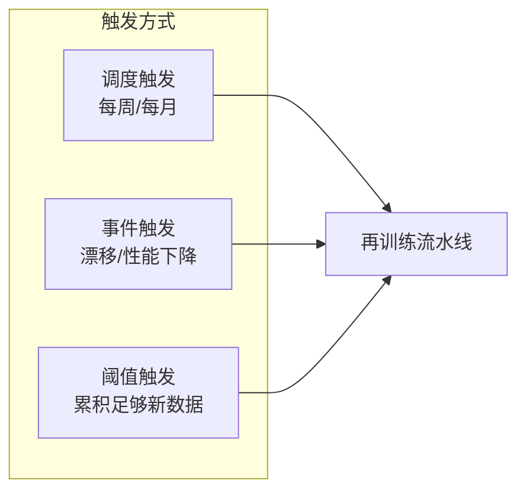
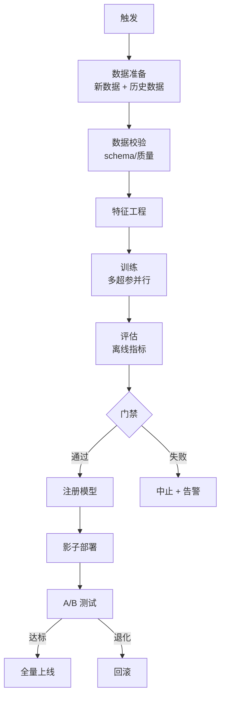

# 自动化再训练（Automated Retraining）

> 中文简称：自动化再训练

> **一句话理解**: 模型上线不是终点而是起点——当数据漂移让模型性能下降时，自动化再训练流水线能在人介入前，自动触发、训练、评估、灰度上线新模型。

本文是 MLOps 闭环的关键环节。漂移检测见 [[11_模型运维/08_可观测性/13_模型_监控_and_Drift_检测_2026]]，CI/CD 见 [[11_模型运维/06_持续集成部署/04_ML_CI_CD]]，成熟度模型见 [[11_模型运维/01_MLOps基础/04_MLOps_Maturity_模型]]。

---

## 目录

| 章节 | 内容 | 难度 |
|------|------|------|
| [1. 为什么需要自动化再训练](#1-为什么需要自动化再训练) | 模型衰减不可避免 | 入门 |
| [2. 触发机制](#2-触发机制) | 何时该重训 | 进阶 |
| [3. 数据收集与标注](#3-数据收集与标注) | 闭环的血液 | 进阶 |
| [4. 训练流水线](#4-训练流水线) | 自动化执行 | 进阶 |
| [5. 评估与门禁](#5-评估与门禁) | 自动 vs 人审 | 进阶 |
| [6. 全自动 vs 人审](#6-全自动-vs-人审) | 边界设计 | 管理 |
| [7. 反模式](#7-反模式) | 常见坑 | 实战 |
| [8. 相关文档](#8-相关文档) | 导航 | 导航 |

---

## 1. 为什么需要自动化再训练

### 1.1 模型衰减是常态

| 衰减类型 | 原因 | 速度 |
|---------|------|------|
| **数据漂移** | 输入分布变化（用户群体、季节） | 周–月 |
| **概念漂移** | 输入-输出关系变化（趋势、规则） | 月–季 |
| **标签漂移** | 目标分布变化（类别比例） | 视业务 |

**真实数据**：电商推荐模型平均 **2–4 周**性能开始下降，金融风控模型 **1–3 个月**，新闻分类 **1–2 周**（话题变化快）。

### 1.2 手动重训的代价

| 环节 | 手动耗时 | 自动化后 |
|------|---------|---------|
| 发现性能下降 | 数天（人工巡检） | 实时告警 |
| 收集新数据 | 数天 | 自动回流 |
| 标注 | 数周 | 主动学习 + 弱监督 |
| 训练 + 评估 | 数天 | 小时级 |
| 部署决策 | 数天（开会） | 自动门禁 |

**结论**：手动重训周期 2–4 周，自动化后 1–2 天，甚至小时级。

---

## 2. 触发机制

### 2.1 三种触发方式



| 触发方式 | 条件 | 适用 |
|---------|------|------|
| **调度** | 固定周期（周/月） | 稳定衰减的业务 |
| **事件** | 漂移检测 / 线上指标下降 | 衰减不可预测 |
| **阈值** | 新积累数据 > N 条 | 数据驱动 |

### 2.2 复合触发（推荐）

```python
class RetrainTrigger:
    def should_retrain(self):
        reasons = []
        
        # 1. 性能触发（最高优先级）
        if self.online_metric < self.baseline * 0.95:
            reasons.append(f"性能下降: {self.online_metric} < {self.baseline*0.95}")
        
        # 2. 漂移触发
        if self.drift_score > 0.2:
            reasons.append(f"漂移严重: PSI={self.drift_score}")
        
        # 3. 数据量触发
        if self.new_data_count > 10000:
            reasons.append(f"新数据充足: {self.new_data_count} 条")
        
        # 4. 时间兜底（最长不超 4 周）
        if self.days_since_last_train > 28:
            reasons.append("超期未训")
        
        return reasons
```

**核心原则**：触发条件必须**可解释**——「为什么重训」要有数据支撑，不能黑盒。

---

## 3. 数据收集与标注

### 3.1 闭环数据收集


### 3.2 标注成本优化

| 策略 | 描述 | 节省 |
|------|------|------|
| **主动学习** | 优先标模型最不确定的样本 | 50–80% |
| **弱监督** | 用规则/启发式自动标 | 70–90% |
| **半监督** | 少量标 + 大量未标 | 60–80% |
| **自训练** | 用模型预标，人审抽检 | 80–95% |
| **众包** | 简单任务外包 | 50–70% |

### 3.3 标注质量门禁

```python
def label_quality_gate(samples):
    # 1. 多人标注一致性
    if avg_agreement(samples) < 0.85:
        send_to_arbitration(samples)
    
    # 2. 金标准陷阱
    gold = load_golden_questions()
    accuracy_on_gold = evaluate_labelers(samples, gold)
    if accuracy_on_gold < 0.9:
        retrain_labelers()
    
    # 3. 标注分布合理性
    if label_distribution(samples).skew > threshold:
        alert("标注分布异常")
```

---

## 4. 训练流水线

### 4.1 端到端流水线



### 4.2 增量 vs 全量重训

| 方式 | 描述 | 优势 | 劣势 |
|------|------|------|------|
| **全量重训** | 用全量数据从头训 | 性能最优 | 贵、慢 |
| **增量训练** | 在旧模型上继续训 | 快、省 | 灾难性遗忘 |
| **热启动** | 用旧权重初始化全量训 | 平衡 | 需调学习率 |

**经验**：90% 场景用**热启动全量重训**——用旧模型权重做初始化，但用全量数据训，兼顾速度与质量。

---

## 5. 评估与门禁

### 5.1 三道评估门禁

| 门禁 | 评估内容 | 通过条件 |
|------|---------|---------|
| **离线评估** | 离线测试集指标 | ≥ 基线 × 0.98 |
| **回滚安全** | 在历史事故集上不退化 | 100% 通过 |
| **在线 A/B** | 线上灰度指标 | ≥ 生产模型 |

### 5.2 自动门禁逻辑

```python
def auto_gate(new_model, prod_model):
    # 门禁 1：离线指标
    offline = evaluate(new_model, test_set)
    if offline.f1 < prod_model.f1 * 0.98:
        return reject("离线指标退化")
    
    # 门禁 2：回归集
    regress = evaluate(new_model, regression_set)
    if regress.any_failure:
        return reject("回归集失败")
    
    # 门禁 3：分群体公平性
    fairness = evaluate_fairness(new_model)
    if fairness.min_group_f1 < prod_model.min_group_f1 * 0.95:
        return reject("某群体退化")
    
    return approve("进入影子部署")
```

### 5.3 影子部署

新模型先以「影子模式」运行：100% 流量同时跑新旧，仅旧版返回用户，新版结果离线对比。1 周无退化才灰度。

---

## 6. 全自动 vs 人审

### 6.1 自动化分级

| 等级 | 自动化范围 | 人审点 |
|------|-----------|--------|
| **L1** | 自动训练 + 评估 | 人工决策是否上线 |
| **L2** | 自动训练 + 评估 + 影子 | 人工决策是否全量 |
| **L3** | 全自动（含上线） | 仅告警，异常时人介入 |
| **L4** | 全自动 + 自修复 | 极少人介入 |

### 6.2 何时该人审

| 场景 | 必须人审 |
|------|---------|
| 模型架构变更 | ✅ |
| 训练数据源变更 | ✅ |
| 业务规则调整 | ✅ |
| 常规数据累积重训 | ❌（可全自动） |
| 超参微调 | ❌ |

**原则**：**变更越接近业务语义，越需要人审；越接近技术细节，越可自动。**

---

## 7. 反模式

### 7.1 常见坑

| 反模式 | 后果 | 正解 |
|--------|------|------|
| **无触发条件天天训** | 算力浪费、模型抖动 | 设漂移/性能阈值 |
| **只看整体指标** | 平均分好但某群体崩 | 分群体评估 |
| **新数据直接训** | 数据质量差导致退化 | 数据校验门禁 |
| **自动上线无回滚** | 事故无法快速恢复 | 必须配自动回滚 |
| **忘记灾难性遗忘** | 增量训练丢了旧能力 | 全量重训或回放旧数据 |
| **重训即升级** | 模型版本爆炸 | 重训不等于升级，需门禁 |

### 7.2 灾难性遗忘案例

**现象**：增量训练后，模型在新数据上提升 3%，但在旧数据上掉 15%。
**根因**：增量训练只喂新数据，模型「忘了」旧分布。
**修复**：混入旧数据（replay），或改用全量重训。

---

## 8. 相关文档

### 本章内
- [[11_模型运维/01_MLOps基础/05_MLOps_流水线]] — 全流水线（再训练是其闭环）
- [[11_模型运维/08_可观测性/13_模型_监控_and_Drift_检测_2026]] — 触发条件的来源
- [[11_模型运维/06_持续集成部署/04_ML_CI_CD]] — 流水线自动化基础
- [[11_模型运维/01_MLOps基础/04_MLOps_Maturity_模型]] — 自动化等级
- [[11_模型运维/05_流程编排/Data_Versioning_DVC_LakeFS]] — 重训数据版本化

### 跨章
- [[07_模型训练/README]] — 训练技术
- [[概念/mlops]] — MLOps 概念

---

*最后更新：2026-06-15*
