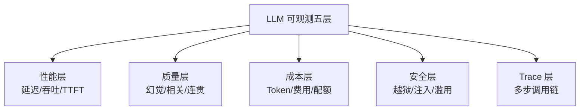
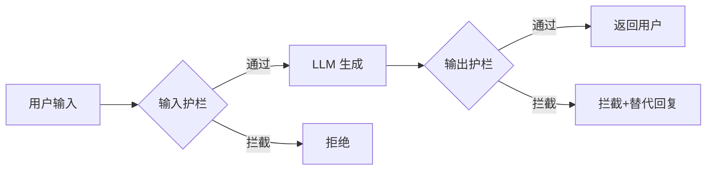
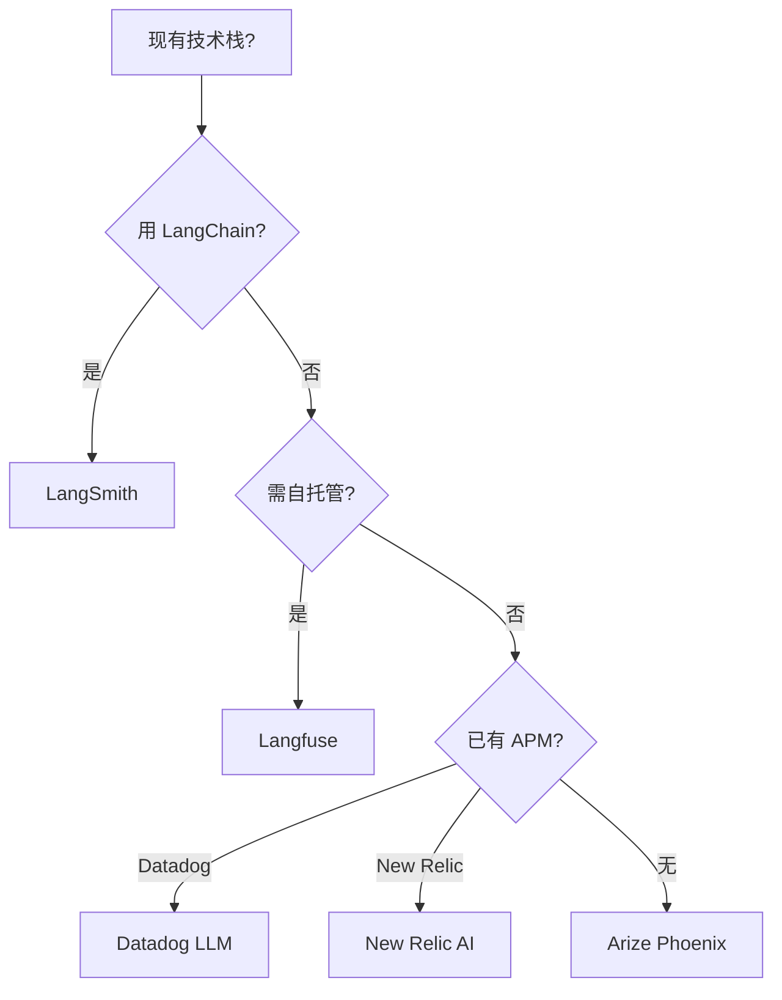

# LLM 可观测性

> 中文简称：LLM 可观测性

> **一句话理解**: 传统 MLOps 监控漂移就够，LLM 应用要监控语义级失败——幻觉、毒性、PII 泄露、越狱，还要能在多步调用链里定位失败点。

本文是 [[11_模型运维/10_LLMOps_大模型运维/05_LLMOps_2026]] §7「LLM 可观测性」的深扩专题。传统 ML 漂移监控见 [[11_模型运维/08_可观测性/13_模型_监控_and_Drift_检测_2026]]，系统层 SLO/SLI 见 [[11_模型运维/08_可观测性/11_ML_可观测性_SLO]]。

---

## 目录

| 章节 | 内容 | 难度 |
|------|------|------|
| [1. 为什么需要专门的 LLM 可观测](#1-为什么需要专门的-llm-可观测) | 语义级失败 | 入门 |
| [2. 五层监控维度](#2-五层监控维度) | 性能/质量/成本/安全/Trace | 入门 |
| [3. Trace：LLM 的分布式追踪](#3-tracellm-的分布式追踪) | 多步调用链 | 进阶 |
| [4. 幻觉监控](#4-幻觉监控) | 在线检测 | 进阶 |
| [5. 毒性与 PII 检测](#5-毒性与-pii-检测) | 安全护栏 | 实战 |
| [6. 工具栈对比](#6-工具栈对比2026) | Langfuse/LangSmith/Phoenix | 实战 |
| [7. 监控告警设计](#7-监控告警设计) | 阈值与 Runbook | 进阶 |
| [8. 相关文档](#8-相关文档) | 导航 | 导航 |

---

## 1. 为什么需要专门的 LLM 可观测

### 1.1 传统监控失效的场景

| 故障 | 传统监控能看到吗 | LLM 可观测能看到 |
|------|----------------|-----------------|
| GPU 利用率高 | ✅ | ✅ |
| P99 延迟飙高 | ✅ | ✅ |
| 模型开始幻觉 | ❌ | ✅ |
| 输出含 PII | ❌ | ✅ |
| 被越狱攻击 | ❌ | ✅ |
| Token 成本失控 | ❌ | ✅ |
| 多步 Agent 在第 3 步出错 | ❌ | ✅（Trace） |

**核心命题**：传统监控看「系统在不在跑」，LLM 可观测看「跑得好不好」。

### 1.2 LLM 失败的隐蔽性

LLM 失败不会抛异常，会返回一个「看起来正常但错误」的回答。这种失败**比崩溃更危险**——用户可能信以为真。

---

## 2. 五层监控维度



### 2.1 各层指标

| 层 | 核心指标 | 监控方式 |
|----|---------|---------|
| **性能** | TTFT, TPOT, P50/P99 延迟, 错误率 | 实时 |
| **质量** | 幻觉率, 满意度, 拒答率, 重试率 | 抽样 Judge + 隐式信号 |
| **成本** | Token/请求, $/请求, $/租户, 缓存命中率 | 实时 |
| **安全** | 越狱成功率, 注入检测率, 毒性输出率 | 实时分类器 |
| **Trace** | span 数, 调用深度, 失败 span 定位 | 全量记录 |

---

## 3. Trace：LLM 的分布式追踪

### 3.1 为什么 Trace 是必备

LLM 应用常是**多步调用链**：

```
用户 → 路由器 → 检索器 → 重排器 → LLM → 工具调用 → LLM → 后处理 → 用户
```

「回答变慢」可能源于任何一环。没有 Trace，调试 = 黑盒盲调。

### 3.2 Trace 数据模型

```python
@trace()
def rag_answer(question):
    with span("retrieval", metadata={"k": 5}):
        docs = vector_db.search(question, k=5)
    
    with span("rerank"):
        docs = reranker.rerank(question, docs)
    
    with span("generation", metadata={
        "model": "gpt-5.2",
        "prompt_id": "rag_qa@v4",
    }):
        prompt = build_prompt(question, docs)
        answer = llm.chat(prompt)
    
    with span("postprocess"):
        answer = filter_pii(answer)
        answer = safety_check(answer)
    
    return answer
```

每个 span 记录：

| 字段 | 用途 |
|------|------|
| `span_id` / `parent_id` | 调用层级 |
| `start` / `end` | 耗时分析 |
| `input` / `output` | 失败定位 |
| `model` / `prompt_id@version` | 版本回溯 |
| `tokens` / `cost` | 成本归因 |
| `error` | 异常捕获 |

### 3.3 Trace 分析场景

| 场景 | Trace 价值 |
|------|-----------|
| 「为什么这条回答差」 | 看是检索失败还是生成失败 |
| 「为什么延迟突增」 | 定位是哪一环变慢 |
| 「为什么成本上涨」 | 看哪个 span Token 暴增 |
| 「Agent 进入死循环」 | 看 span 深度与重复 |

---

## 4. 幻觉监控

### 4.1 在线幻觉检测

离线 Eval 容易，在线检测难。三种方案：

| 方案 | 延迟 | 成本 | 准确率 |
|------|------|------|--------|
| **实时 Judge**（每条都评） | +500ms | 高 | 高 |
| **抽样 Judge**（1–5% 采样） | 无影响 | 低 | 统计意义 |
| **隐式信号**（重试/负反馈） | 无影响 | 零 | 间接 |

**推荐组合**：1% 抽样 Judge + 全量隐式信号监控。

### 4.2 幻觉率告警

```python
class HallucinationMonitor:
    def __init__(self):
        self.window = SlidingWindow(minutes=10)
    
    def on_sampled_judge(self, trace_id, faithfulness_score):
        self.window.add(faithfulness=faithfulness_score)
        
        # 滑动窗口均值低于阈值告警
        recent = self.window.all()
        avg = mean(r["faithfulness"] for r in recent)
        if avg < 0.85 and len(recent) >= 30:
            alert(f"幻觉率上升，平均 faithfulness={avg}")
```

---

## 5. 毒性与 PII 检测

### 5.1 安全护栏架构



### 5.2 护栏检查项

| 护栏 | 检测内容 | 工具 |
|------|---------|------|
| **输入毒性** | 仇恨/暴力/色情输入 | OpenAI Moderation, Perspective |
| **输入 PII** | 用户泄露自己的 PII | Presidio |
| **越狱检测** | 注入/角色扮演模板 | 自建分类器 + 对抗集 |
| **输出毒性** | LLM 生成有害内容 | OpenAI Moderation |
| **输出 PII** | LLM 泄露训练数据中的 PII | Presidio + 正则 |
| **输出事实性** | 关键事实校验 | 知识库比对 |

### 5.3 PII 检测实现

```python
from presidio_analyzer import AnalyzerEngine
from presidio_anonymizer import AnonymizerEngine

analyzer = AnalyzerEngine()
anonymizer = AnonymizerEngine()

PII_ENTITIES = ["PHONE_NUMBER", "EMAIL_ADDRESS", "ID_CARD", "BANK_ACCOUNT"]

def scrub_pii(text: str) -> str:
    """检测并脱敏 PII"""
    results = analyzer.analyze(
        text=text,
        entities=PII_ENTITIES,
        language="zh",
    )
    if results:
        # 记录告警
        alert(f"检测到 PII: {[r.entity_type for r in results]}")
        # 脱敏
        return anonymizer.anonymize(text=text, analyzer_results=results).text
    return text
```

详见 [[17_伦理安全/10_隐私保护AI/README]]。

---

## 6. 工具栈对比（2026）

### 6.1 LLM 可观测工具

| 工具 | 类型 | 强项 | 适用 |
|------|------|------|------|
| **Langfuse** | 开源（自托管） | 全栈、数据不出域 | 中小团队首选 |
| **LangSmith** | 商业 | 与 LangChain 原生 | LangChain 用户 |
| **Arize Phoenix** | 开源 + 商业 | 可观测+Eval 一体 | 重度可观测 |
| **Helicone** | 开源 | 轻量、代理模式 | 快速上手 |
| **Datadog LLM** | 商业 | 与现有 APM 集成 | 已用 Datadog |
| **New Relic AI** | 商业 | 全栈 APM | 企业级 |

### 6.2 选型决策



---

## 7. 监控告警设计

### 7.1 告警分级

| 级别 | 触发条件 | 响应 |
|------|---------|------|
| **P0** | 幻觉率突增 / 毒性输出 / 成本失控 | 立即熔断 |
| **P1** | 延迟 P99 翻倍 / 错误率 > 5% | 1 小时响应 |
| **P2** | 缓存命中率下降 / 路由降级增加 | 当天处理 |
| **P3** | 慢趋势（周环比恶化） | 周评审 |

### 7.2 Runbook 模板

每次 P0/P1 告警必须有 Runbook：

```markdown
## 告警：幻觉率突增

### 诊断步骤
1. 打开 Langfuse，筛选最近 1h faithfulness < 0.7 的 Trace
2. 检查最近 24h 是否有 Prompt 变更（查 Registry）
3. 检查最近 24h 是否有模型版本切换
4. 检查 RAG 知识库是否有更新（看 corpus 版本）

### 临时缓解
- 回滚到上一个稳定的 Prompt 版本
- 或切流量到影子模式

### 根因修复
- 若 Prompt：加约束 + 补回归用例
- 若 RAG：检查召回质量
- 若模型：联系上游 / 切换备选模型
```

---

## 8. 相关文档

### 本章内
- [[11_模型运维/10_LLMOps_大模型运维/05_LLMOps_2026]] — 本系列主线（§7 是本文概览版）
- [[11_模型运维/13_运维评估/03_LLM评估_流水线]] — 评估方法（本文是在线版）
- [[11_模型运维/08_可观测性/13_模型_监控_and_Drift_检测_2026]] — 传统漂移监控
- [[11_模型运维/08_可观测性/11_ML_可观测性_SLO]] — 系统层 SLO/SLI

### 跨章
- [[13_运维/README]] — AI 系统运维（基础设施层）
- [[17_伦理安全/07_AI安全2026/README]] — 安全与红队
- [[17_伦理安全/10_隐私保护AI/README]] — 隐私保护
- [[15_智能体/07_Agent评估/README]] — Agent 调用链评估
- [[09_测试/02_测试框架/09_Weights_Biases_深入分析]] — W&B 实验追踪
- [[治理/llm-observability-aiops|LLM 可观测性 × AIOps: 从系统监控到语义监控的范式跃迁]]

---

*最后更新：2026-06-15 · 本文是 [[11_模型运维/10_LLMOps_大模型运维/05_LLMOps_2026]] 的专题深扩*
