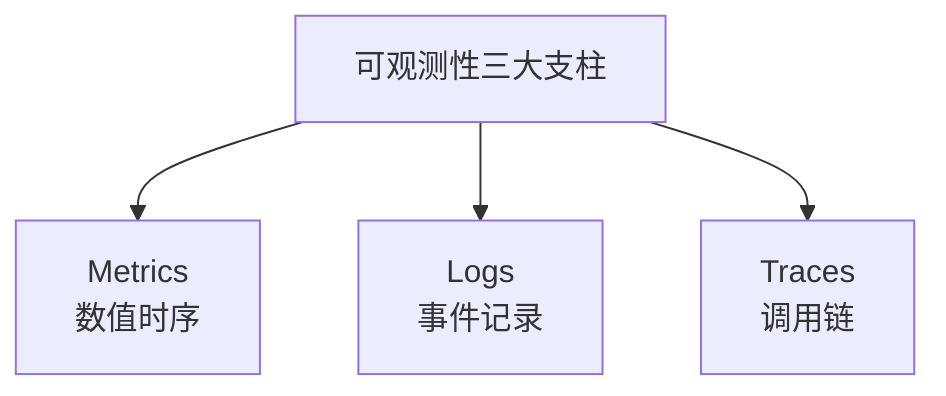
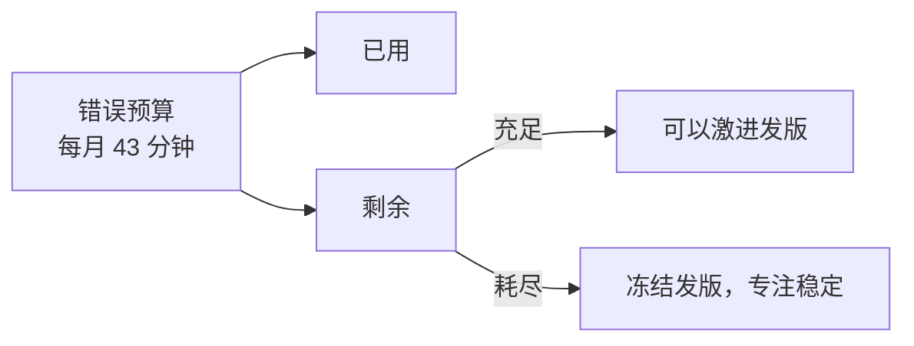

# ML 系统可观测性与 SLO

> 中文简称：ML 系统可观测性与 SLO

> **一句话理解**: 漂移监控只关心「模型准不准」，系统可观测关心「整个推理服务在不在健康运行」——延迟、吞吐、SLO、错误预算，是模型上线的工程底线。

本文关注**系统层**（infra/service）。模型质量层（漂移/幻觉）见 [[11_模型运维/08_可观测性/13_模型_监控_and_Drift_检测_2026]] 与 [[11_模型运维/08_可观测性/10_llm_observability_aiops]]。

---

## 目录

| 章节 | 内容 | 难度 |
|------|------|------|
| [1. 三大支柱](#1-三大支柱) | Metrics / Logs / Traces | 入门 |
| [2. SLI / SLO / SLA](#2-sli--slo--sla) | 服务质量目标 | 进阶 |
| [3. 错误预算](#3-错误预算) | 创新与稳定的平衡 | 管理 |
| [4. ML 系统专属指标](#4-ml-系统专属指标) | 超越传统 SRE | 进阶 |
| [5. 告警设计](#5-告警设计) | 多级响应 | 实战 |
| [6. 工具栈](#6-工具栈) | Prometheus/Grafana/OpenTelemetry | 实战 |
| [7. 相关文档](#7-相关文档) | 导航 | 导航 |

---

## 1. 三大支柱



| 支柱 | 回答的问题 | 工具 |
|------|-----------|------|
| **Metrics** | 「现在 P99 多少？」 | Prometheus, Datadog |
| **Logs** | 「这条请求发生了什么？」 | ELK, Loki |
| **Traces** | 「慢在哪一环？」 | Jaeger, OpenTelemetry |

**铁律**：三者缺一不可。只有 Metrics 看不到根因，只有 Logs 拼不出全局，只有 Traces 看不到趋势。

---

## 2. SLI / SLO / SLA

### 2.1 定义层级

```
SLI（指标）  →  SLO（目标）  →  SLA（合同）
   客观值          内部目标         对外承诺
```

| 概念 | 含义 | ML 例子 |
|------|------|---------|
| **SLI** | 服务质量指标 | P99 延迟、可用率、推理成功率 |
| **SLO** | 内部目标值 | P99 < 500ms、可用性 99.9% |
| **SLA** | 对客户的合同承诺 | 可用性 99.5%，否则赔偿 |

### 2.2 ML 服务的典型 SLO

| SLI | SLO | 备注 |
|-----|-----|------|
| **可用性** | 99.9% | 5xx 错误率 < 0.1% |
| **延迟 P99** | < 500ms | 传统 ML |
| **延迟 P99** | < 3s | LLM 流式首 Token |
| **推理成功率** | > 99% | 排除超时/OOM |
| **吞吐** | > 100 QPS | 峰值能力 |
| **GPU 利用率** | 60–80% | 过低浪费，过高排队 |

---

## 3. 错误预算

### 3.1 核心思想

错误预算 = 100% − SLO。SLO 99.9% 意味着**每月允许 43 分钟不可用**。



### 3.2 错误预算的治理价值

| 场景 | 错误预算剩余 | 决策 |
|------|------------|------|
| 充足（>50%） | 可激进 | 大版本、架构重构 |
| 紧张（10–50%） | 谨慎 | 仅小修小补 |
| 耗尽（<10%） | 冻结 | 只允许稳定性修复 |

**核心**：错误预算把「业务想快」和「系统想稳」的矛盾，量化成了**可决策的数据**。

---

## 4. ML 系统专属指标

### 4.1 超越传统 SRE 的指标

传统 Web 服务只看延迟/可用性，ML 服务还要看：

| 指标 | 含义 | 健康阈值 |
|------|------|---------|
| **模型延迟分布** | 推理耗时的分布 | 不应双峰（OOM 重启？） |
| **批处理效率** | 每秒处理样本数 | 趋势稳定 |
| **GPU 显存碎片** | 碎片化程度 | < 20% |
| **模型加载时间** | 冷启动耗时 | < 30s |
| **缓存命中率** | Prompt/KV Cache | > 30% |
| **队列深度** | 待处理请求数 | < 100 |
| **预测分布漂移** | 输出分布变化 | 见 [[11_模型运维/08_可观测性/13_模型_监控_and_Drift_检测_2026]] |

### 4.2 USE 方法（ML 版）

资源三维度：**U**tilization（利用率）/ **S**aturation（饱和度）/ **E**rrors（错误）。

| 资源 | Utilization | Saturation | Errors |
|------|------------|-----------|--------|
| GPU | 利用率 % | 排队深度 | Xid 错误 |
| 显存 | 已用 % | OOM 次数 | 分配失败 |
| 模型 | QPS | 队列长度 | 推理失败 |
| 数据管道 | 处理速率 | 积压量 | schema 错误 |

---

## 5. 告警设计

### 5.1 告警分级

| 级别 | 条件 | 响应 |
|------|------|------|
| **P0** | SLO 烧穿 / 完全不可用 | 立即（5 分钟） |
| **P1** | 错误预算快速消耗 | 1 小时 |
| **P2** | 单指标异常但服务正常 | 当天 |
| **P3** | 趋势异常（周环比） | 评审 |

### 5.2 告警疲劳防治

```python
# 告警必须满足：可执行 + 有 Runbook
GOOD_ALERT = {
    "name": "推理 P99 > SLO",
    "condition": "histogram_quantile(0.99, latency) > 500",
    "for": "5m",                    # 持续 5 分钟才报
    "runbook": "runbooks/inference_latency.md",
    "actionable": True,             # 收到能动手
}

BAD_ALERT = {
    "name": "CPU > 80%",            # ❌ 不 actionable
    "condition": "cpu_usage > 0.8",
    # 收到也不知道该干嘛 → 告警疲劳
}
```

**原则**：每个告警必须有对应 Runbook，否则就是噪声。

---

## 6. 工具栈

### 6.1 主流栈

| 层 | 开源 | 商业 |
|----|------|------|
| **Metrics** | Prometheus + Grafana | Datadog, New Relic |
| **Logs** | Loki / ELK | Splunk, Datadog Logs |
| **Traces** | Jaeger, OpenTelemetry | Datadog APM, Honeycomb |
| **GPU 监控** | DCGM Exporter | NVIDIA Enterprise |
| **告警** | Alertmanager | PagerDuty, Opsgenie |

### 6.2 推荐组合

| 团队规模 | 推荐栈 |
|---------|--------|
| 小团队 | Prometheus + Grafana + Loki + Alertmanager（全开源） |
| 中型 | + OpenTelemetry + Jaeger |
| 企业 | Datadog 全家桶 / 或自建 + PagerDuty |

---

## 7. 相关文档

### 本章内
- [[11_模型运维/08_可观测性/13_模型_监控_and_Drift_检测_2026]] — 模型质量监控（本文是系统层）
- [[11_模型运维/08_可观测性/10_llm_observability_aiops]] — LLM 专属可观测
- [[11_模型运维/09_成本管理/01_成本优化_MLOps]] — 成本也是可观测维度

### 跨章
- [[13_运维/README]] — AI 运维（基础设施层）
- [[12_架构基建/02_架构概览/06_高可用_2026]] — 高可用架构
- [[概念/mlops]] — MLOps 概念

---

*最后更新：2026-06-15*
