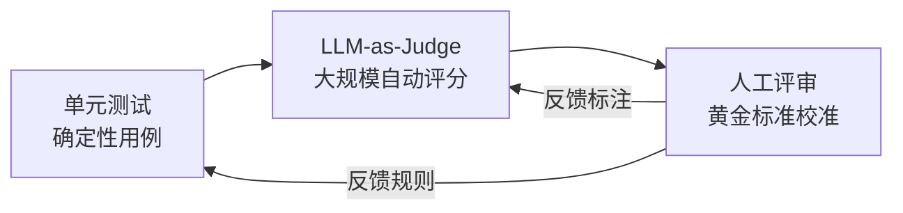
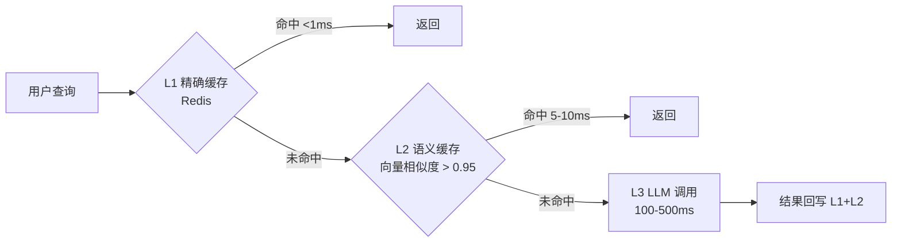
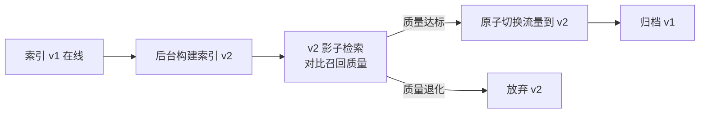
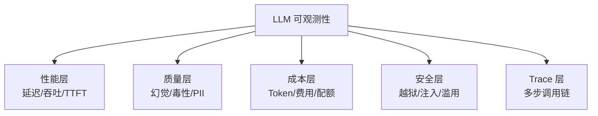

# LLMOps 2026：大模型时代的 MLOps 升级

> 中文简称：LLMOps 2026：大模型时代的 MLOps 升级

> **一句话理解**: LLMOps 是 MLOps 在大模型时代的升级版——当模型从「固定权重的预测器」变成「由 Prompt + 模型 + RAG 三层动态组合的系统」，运维对象、评估方式、成本结构都发生了根本性变化。

---

## 目录

| 章节 | 内容 | 难度 |
|------|------|------|
| [1. 为什么需要 LLMOps](#1-为什么需要-llmops) | 传统 MLOps 失效的 7 个根本原因 | 入门 |
| [2. LLMOps 三层架构](#2-llmops-三层架构) | Prompt 层 / 模型层 / 数据(RAG)层 | 进阶 |
| [3. Prompt 工程化运维](#3-prompt-工程化运维) | 版本化、A/B 测试、回归门禁 | 进阶 |
| [4. LLM 评估流水线](#4-llm-评估流水线) | LLM-as-Judge、人审、Eval 数据集 | 进阶 |
| [5. 成本与延迟 SLO](#5-成本与延迟-slo) | Token 预算、缓存、路由、级联 | 实战 |
| [6. RAG 流水线运维](#6-rag-流水线运维) | 切块版本、索引重建、检索质量监控 | 进阶 |
| [7. LLM 可观测性](#7-llm-可观测性) | 超越漂移：幻觉、毒性、PII、Trace | 前沿 |
| [8. 工具全景](#8-工具全景2026) | LangSmith / Langfuse / Arize / Promptflow | 实战 |
| [9. 成熟度模型](#9-llmops-成熟度模型) | Level 0–3 升级路径 | 管理 |
| [10. 生产事故复盘](#10-生产事故复盘) | 3 个真实 Incident | 实战 |
| [11. 相关文档](#11-相关文档) | 导航与延伸阅读 | 导航 |

---

## 1. 为什么需要 LLMOps

传统 MLOps 假设的模型是：**权重固定 + 输入结构化 + 输出确定 + 成本可忽略**。LLM 时代这四条假设全部失效。

### 1.1 七大根本差异

| # | 维度 | 传统 MLOps | LLMOps (2026) |
|---|------|-----------|---------------|
| 1 | **变更单元** | 模型权重（GB 级，季度更新） | Prompt（KB 级，日更新）+ 模型 + RAG 配置 |
| 2 | **评估对象** | 固定测试集 + 数值指标（F1/AUC） | 开放生成 + LLM-as-Judge + 人审 |
| 3 | **输入形态** | 结构化特征向量 | 自然语言（非确定、可注入） |
| 4 | **输出形态** | 类别/数值（可枚举） | 自由文本（不可枚举、可幻觉） |
| 5 | **成本结构** | 推理算力成本（GPU 时） | Token 成本 + 算力（自托管）+ 人工评审 |
| 6 | **失败模式** | 性能下降（漂移） | 幻觉 + 毒性 + 越狱 + 数据泄露 |
| 7 | **反馈闭环** | 收集标签 → 再训练 | 收集人工修订 → Prompt 迭代 / RAG 扩充 |

### 1.2 用传统 MLOps 思维管 LLM 会怎样？

- 🔴 **改一个标点就线上事故**：Prompt 没有 A/B 测试，直接全量上线，触发幻觉
- 🔴 **模型升级就是赌博**：GPT-4 → Claude 4.5 切换，输出格式变了，下游解析全崩
- 🔴 **Token 账单失控**：没有预算监控，一个恶意用户循环调用烧掉 $10k
- 🔴 **RAG 内容过期不知道**：知识库更新了，但 Embedding 索引没重建，召回全是旧信息
- 🔴 **评估靠"感觉"**：没有自动化 Eval，每次改 Prompt 都靠 PM 手工试 5 条

**结论**：LLM 应用是**三层动态组合系统**（Prompt + 模型 + RAG），任何一层变更都需要独立的版本化、测试、灰度。这就是 LLMOps 的核心命题。

---

## 2. LLMOps 三层架构

```mermaid
graph TB
    subgraph "LLMOps 三层可变系统"
        P[Prompt 层<br/>System / Few-shot / Tools]
        M[模型层<br/>GPT-5.2 / Claude 4.5 / 自托管]
        R[RAG 层<br/>语料 / 切块 / Embedding / 索引]
    end

    P -->|prompt_id@version| Engine[推理引擎]
    M -->|model_id@version| Engine
    R -->|retrieval_config@version| Engine

    Engine --> Out[输出]
    Out --> Eval[评估流水线]
    Eval -->|回归通过| Gate[CI 门禁]
    Eval -->|回归失败| Block[阻断发布]

    Out --> Obs[可观测性]
    Obs -->|幻觉/成本/延迟| Feedback[反馈闭环]
    Feedback --> P
    Feedback --> R
```

每一层都需独立版本化：

| 层 | 版本载体 | 变更频率 | 典型工具 |
|----|---------|---------|---------|
| **Prompt 层** | `prompt_id@version`（YAML/JSON） | 每日 | Langfuse, Promptflow, Promptfoo |
| **模型层** | `model_id@version`（API 版本或权重 hash） | 每周–每月 | LiteLLM, OpenRouter, 自建 Gateway |
| **RAG 层** | `corpus@version` + `chunking@version` + `index@version` | 每周 | LangChain, LlamaIndex, Haystack |

**关键洞察**：传统 MLOps 只追踪一个版本号（模型 hash），LLMOps 必须追踪**三元组** `(prompt_v, model_v, rag_v)`。一次"线上事故"可能是三元组中任一元素变更导致，因此**调用日志必须记录完整三元组**，否则无法回溯。

---

## 3. Prompt 工程化运维

Prompt 是 LLMOps 中**变更最频繁、单次改动影响最大**的组件，但多数团队仍用「复制粘贴到代码里」管理，这是事故根源。

### 3.1 Prompt 版本化三要素

```yaml
# prompts/rag_qa_v3.yaml — Prompt 即配置
id: rag_qa
version: 3
parent: rag_qa@v2          # 继承关系，便于 diff
model_target: gpt-5.2      # 该 Prompt 针对哪个模型调优
variables:
  - name: context
    type: string
    required: true
  - name: question
    type: string
    required: true
system: |
  你是严谨的知识助手。仅基于 <context> 回答，不确定时说"我不知道"。
  禁止编造来源、禁止使用 context 外的信息。
template: |
  <context>{context}</context>
  问题：{question}
  回答：
eval_set: rag_qa_golden_v3  # 关联的回归测试集
metrics:
  - faithfulness >= 0.9
  - answer_relevancy >= 0.85
  - refusal_rate <= 0.15
changelog:
  - v3: 增加"不确定时拒绝"指令，降低幻觉率（v2: 12% → v3: 4%）
  - v2: 改用 XML 标签包裹 context
  - v1: 初版
```

### 3.2 Prompt CI 门禁

每次 Prompt 变更必须通过流水线，禁止直接上生产：

```python
# .github/workflows/prompt-ci.yml 的核心逻辑（伪代码）
def prompt_ci(prompt_path: str):
    prompt = load_prompt(prompt_path)
    baseline = load_prompt(prompt.parent)           # 上一版本
    eval_set = load_eval_set(prompt.eval_set)       # 黄金测试集

    # 1. 跑新 Prompt 在黄金集上的指标
    new_results = run_eval(prompt, eval_set)
    # 2. 跑旧 Prompt 作对照
    old_results = run_eval(baseline, eval_set)

    # 3. 回归断言
    for metric, threshold in prompt.metrics.items():
        if new_results[metric] < threshold:
            fail(f"{metric} 退化: {new_results[metric]} < {threshold}")
        if new_results[metric] < old_results[metric] * 0.95:
            warn(f"{metric} 较基线下降 >5%")

    # 4. 人审触发条件：涉及安全/拒答的 Prompt 必须人工签字
    if prompt.requires_human_review and not has_approval(prompt_path):
        fail("需人工评审签字")
```

### 3.3 Prompt A/B 测试与灰度

| 策略 | 流量分配 | 适用场景 | 风险 |
|------|---------|---------|------|
| **影子模式** | 100% 流量同时跑新旧，仅旧版返回用户 | 高风险变更 | 成本翻倍 |
| **金丝雀** | 1% → 5% → 25% → 100% | 常规迭代 | 需要实时指标切流 |
| **冠军-挑战者** | 90% 冠军 / 10% 挑战者长期并存 | 持续探索 | 统计显著性需 1–2 周 |

**陷阱**：LLM 输出是非确定性的，A/B 测试需要**每用户多次采样**才能达到统计显著，通常比传统 ML A/B 测试样本量大 3–10 倍。

---

## 4. LLM 评估流水线

评估是 LLMOps 最难、也最关键的一环。传统 ML 用 F1/AUC 即可，LLM 评估是**开放命题**。

### 4.1 三层评估体系



| 层 | 规模 | 成本 | 用途 |
|----|------|------|------|
| **单元测试** | 10–100 条 | 极低 | 格式/拒答/边界，断言式 |
| **LLM-as-Judge** | 100–10k 条 | 中（Token 费） | 主观质量、连贯性、相关性 |
| **人工评审** | 50–500 条 | 高（人时） | 校准 Judge、争议仲裁 |

### 4.2 LLM-as-Judge 实践

```python
import openai

def llm_judge(question, answer, context, rubric):
    """用强模型给目标模型打分"""
    score_prompt = f"""你是严格的评审。按以下评分标准给回答打分（1-5）。

评分标准（rubric）：
{rubric}

问题：{question}
上下文：<context>{context}</context>
待评回答：{answer}

输出 JSON：{{"faithfulness": int, "relevancy": int, "completeness": int, "reason": str}}
"""
    resp = openai.chat.completions.create(
        model="gpt-5.2",  # Judge 必须用比被评模型更强或同级的模型
        messages=[{"role": "user", "content": score_prompt}],
        response_format={"type": "json_object"},
        temperature=0,    # 评分必须确定性
    )
    return parse(resp)

# 陷阱：Judge 与被评模型不能有相同系统性偏差
# 推荐：用 Claude 评 GPT，用 GPT 评 Claude，交叉验证
```

### 4.3 Eval 数据集的版本化

Eval 数据集本身也是代码资产，必须版本化：

| 数据集类型 | 来源 | 更新频率 | 大小 |
|-----------|------|---------|------|
| **黄金集** | PM/领域专家手工编写 | 月 | 50–200 条 |
| **线上采样** | 生产日志脱敏 | 周 | 1k–10k 条 |
| **对抗集** | 红队生成 | 季 | 100–500 条 |
| **回归集** | 历史事故案例 | 事件驱动 | 持续增长 |

**核心原则**：每次线上事故后，必须把导致事故的输入加入回归集，永久防御。回归集只增不减。

### 4.4 主流评估框架对比（2026）

| 工具 | 类型 | 评估方式 | 优势 | 适用 |
|------|------|---------|------|------|
| **Ragas** | 开源 | RAG 专项（Faithfulness/Relevancy） | RAG 评估事实标准 | RAG 系统 |
| **DeepEval** | 开源 | 单元测试风格 | 与 pytest 集成 | CI 集成 |
| **Promptfoo** | 开源 | Prompt 对比 | CLI 友好、红队 | Prompt 迭代 |
| **LangSmith** | 商业 | 全栈（数据集+Judge+Trace） | 与 LangChain 深度集成 | LangChain 用户 |
| **Arize Phoenix** | 商业 | 可观测+评估一体 | 开源版功能完整 | 重度可观测需求 |

详见 [[09_测试/02_测试框架/06_RAGAS_深入分析]]、[[09_测试/02_测试框架/01_DeepEval_深入分析]]、[[09_测试/02_测试框架/05_Promptfoo_深入分析]]。

---

## 5. 成本与延迟 SLO

LLM 推理成本比传统 ML 高 **100–1000 倍**，成本管理是 LLMOps 的生死线。

### 5.1 三层缓存架构



| 缓存层 | 命中条件 | 延迟 | 成本节省 | 工具 |
|--------|---------|------|---------|------|
| **L1 精确匹配** | Query 完全相同（hash 一致） | <1ms | 100% | Redis, GPTCache |
| **L2 语义缓存** | Embedding 相似度 > 0.95 | 5–10ms | 95% | Langfuse Cache, Redis Vector |
| **L3 实际调用** | 必须调用 LLM | 100–500ms | 0% | 上游 API |

**实测收益**：客服 / FAQ 类场景三层缓存可节省 **40–70% Token 成本**；创作类场景命中率低（<10%），不值得做 L2。

### 5.2 智能路由（Model Cascading）

按查询复杂度动态选择模型，简单问题用便宜模型：

```python
def route_model(query: str) -> str:
    """根据查询复杂度路由到不同模型"""
    complexity = classify_complexity(query)  # 规则 + 小分类模型

    if complexity == "simple":       # 闲聊、FAQ、提取
        return "gpt-5.2-mini"        # $0.15/M tokens
    elif complexity == "medium":     # 摘要、改写
        return "claude-4.5-sonnet"   # $3/M tokens
    else:                            # 复杂推理、代码
        return "gpt-5.2"             # $15/M tokens

# 级联策略：先试便宜模型，置信度低再升级
def cascade(query: str):
    cheap_answer = call("gpt-5.2-mini", query)
    if confidence_score(cheap_answer) < 0.7:
        return call("gpt-5.2", query)  # 升级
    return cheap_answer
```

**实测**：级联策略在 RAG 场景可节省 **60–90% 成本**，质量损失 <2%。

### 5.3 Token 预算与告警

必须建立**多维度预算监控**，否则账单失控：

| 维度 | 告警阈值 | 动作 |
|------|---------|------|
| 单用户日 Token | > 100k | 限流 |
| 单会话 Token | > 50k | 中断 + 提示 |
| 租户月预算 | > 80% | 告警 + 降级到便宜模型 |
| 全局日 Token | > 日均 3 倍 | P0 告警 + 自动熔断 |

详见 [[10_部署推理/06_成本管理/01_LLM_成本优化]]。

---

## 6. RAG 流水线运维

RAG 系统的 Ops 比"推理 Ops"更复杂，因为它包含**可变的知识库**。本节侧重 Ops 视角，RAG 架构详见 [[14_RAG系统/README]]。

### 6.1 RAG 的四个版本维度

| 维度 | 变更触发 | 影响范围 | 必须动作 |
|------|---------|---------|---------|
| **语料版本** (corpus) | 文档增删改 | 召回内容 | 重新切块 |
| **切块策略** (chunking) | 切块大小/重叠调整 | 全量召回 | 全量重新切块+重建索引 |
| **Embedding 模型** | 升级到新版本 | 全量向量 | **全量重嵌入**（最贵） |
| **索引结构** (ANN) | HNSW → IVF 等 | 召回延迟 | 重建索引（向量不变） |

**关键风险**：升级 Embedding 模型时，旧向量与新向量**不在同一空间**，混合检索会返回垃圾结果。必须**原子切换**，不能灰度混合。

### 6.2 索引重建的灰度策略



### 6.3 RAG 质量监控指标

| 指标 | 含义 | 健康阈值 | 检测方式 |
|------|------|---------|---------|
| **召回 Recall@k** | Top-k 是否包含正确文档 | > 0.85 | 离线 Eval 集 |
| **上下文利用率** | LLM 实际引用了多少召回内容 | > 60% | Trace 分析 |
| **检索延迟 P99** | 端到端检索耗时 | < 200ms | 线上监控 |
| **空召回率** | 检索返回空 / 全是低分文档 | < 5% | 线上监控 |
| **知识新鲜度** | 召回文档的平均时间戳 vs 当前 | 视业务 | 定时扫描 |

---

## 7. LLM 可观测性

传统 MLOps 监控漂移就够，LLMOps 要监控**语义级失败**。

### 7.1 LLM 专属监控维度



| 维度 | 核心指标 | 工具 |
|------|---------|------|
| **幻觉率** | 输出中无来源断言的比例 | Ragas Faithfulness, 自定义 Judge |
| **毒性** | 仇恨/暴力/色情输出率 | OpenAI Moderation, Perspective API |
| **PII 泄露** | 输出包含手机号/身份证/邮箱 | Presidio, 正则 + NER |
| **越狱成功率** | 红队用例通过率 | 对抗测试集 |
| **Token 成本** | 每请求/每用户/每租户 | Langfuse, OpenRouter |
| **Trace 完整性** | 多步 Agent 调用链可视化 | LangSmith, Arize |

### 7.2 Trace：LLMOps 的「分布式追踪」

LLM 应用常是**多步调用链**（用户 → Router → RAG → LLM → Tool → LLM → 用户），传统日志无法定位失败点。Trace 是必备能力：

```python
# 用 Langfuse 追踪一次 RAG 调用（伪代码）
@trace()
def rag_answer(question):
    with span("retrieval"):
        docs = vector_db.search(question, k=5)
    with span("generation"):
        prompt = build_prompt(question, docs)
        answer = llm.chat(prompt)
    with span("postprocess"):
        answer = filter_pii(answer)
    return answer
# 每个 span 记录：输入、输出、延迟、Token、模型、Prompt 版本
```

**生产教训**：没有 Trace 的 LLM 应用调试 = 黑盒盲调。一次"回答变慢"可能源于检索层、也可能是上游 API 限流，没 Trace 根本无从排查。

---

## 8. 工具全景（2026）

### 8.1 LLMOps 工具栈分层

| 层 | 开源首选 | 商业首选 | 国内可选 |
|----|---------|---------|---------|
| **Prompt 管理** | Promptfoo, Promptflow | Langfuse | 阿里 PAI Prompt |
| **评估** | Ragas, DeepEval | LangSmith | 字节 Mooncake |
| **可观测** | Arize Phoenix, Langfuse | Datadog LLM, New Relic | 阿里云 ARMS |
| **网关/路由** | LiteLLM, OneAPI | OpenRouter, Portkey | AIStudio Gateway |
| **向量库 Ops** | Qdrant, Milvus | Pinecone | Zilliz Cloud |
| **编排** | LangChain, LlamaIndex | LangGraph Cloud | dify, ragflow |

### 8.2 选型决策树

```
团队 < 5 人 / PoC 阶段
  → Promptfoo + Langfuse(自托管) + LiteLLM
团队 5–20 人 / 早期生产
  → LangSmith + Arize Phoenix + LiteLLM + Qdrant
团队 > 20 / 企业级
  → Langfuse Enterprise + Datadog LLM + Portkey + Pinecone/Zilliz
国内合规要求
  → 全栈国产化：阿里 PAI + Zilliz + AIStudio Gateway
```

---

## 9. LLMOps 成熟度模型

| 等级 | 特征 | 典型表现 |
|------|------|---------|
| **L0 雏形** | Prompt 硬编码在应用里 | 改 Prompt = 改代码 + 全量发版 |
| **L1 配置化** | Prompt 外置为配置 | 可不改代码改 Prompt，但无测试 |
| **L2 可评估** | 有 Eval 集 + CI 门禁 | Prompt 变更必须过回归，可灰度 |
| **L3 可观测** | 全链路 Trace + 实时质量监控 | 能定位「为什么这条回答差」 |
| **L4 自动化** | 线上反馈自动回流到 Eval 集 | 系统越跑越好，人审只看高争议样本 |

**2026 行业现状**：大多数团队在 L1–L2，头部团队达到 L3，**L4 仍是前沿探索**（少数 Agent 公司声称实现部分 L4）。

---

## 10. 生产事故复盘

### Incident A：一个空格毁掉一个 Prompt

**现象**：客服机器人某天起突然拒答率从 5% 飙到 40%。
**根因**：有人修改 Prompt 时不小心在 "回答：" 后多了个空格，Few-shot 示例对齐被破坏。
**教训**：Prompt 是代码，必须走 PR Review + CI，不能直接改生产配置。
**整改**：上线 Prompt CI（见 §3.2），所有 Prompt 变更触发黄金集回归。

### Incident B：模型升级导致下游崩溃

**现象**：从 GPT-4 升级到 GPT-5.2 后，输出格式从 Markdown 变成纯文本，前端渲染崩溃。
**根因**：模型升级未走 A/B，直接全量切流量。
**教训**：模型层升级必须**影子模式跑 1 周**，对比输出格式分布。
**整改**：模型升级流程文档化，强制影子期 + 输出 schema 校验。

### Incident C：Token 账单爆炸

**现象**：某租户一夜烧掉 $8k Token 费用。
**根因**：用户写了循环调用脚本，无单租户日预算上限。
**教训**：Token 预算监控是 LLMOps 第一要务，比模型质量更优先。
**整改**：多维度预算熔断（见 §5.3）。

---

## 11. 相关文档

### 本章内
- [[11_模型运维/01_MLOps基础/05_MLOps_流水线]] — 传统 MLOps 全景（本文是其 LLM 时代的升级）
- [[11_模型运维/06_持续集成部署/04_ML_CI_CD]] — ML CI/CD 基础，本文 §3 在其上扩展 Prompt CI
- [[11_模型运维/08_可观测性/13_模型_监控_and_Drift_检测_2026]] — 漂移检测理论，本文 §7 在其上扩展语义监控
- [[11_模型运维/04_实验追踪/02_实验追踪_深入分析]] — 实验追踪，Prompt 实验是其延伸

### 跨章
- [[概念/mlops]] — MLOps 概念页（含 LLMOps 简述）
- [[10_部署推理/06_成本管理/01_LLM_成本优化]] — 成本优化细节
- [[10_部署推理/03_推理优化/10_提示缓存_高级]] — Prompt 缓存工程实现
- [[14_RAG系统/README]] — RAG 系统架构（本文 §6 侧重其 Ops）
- [[09_测试/02_测试框架/05_Promptfoo_深入分析]] — Prompt 红队与测试
- [[09_测试/02_测试框架/06_RAGAS_深入分析]] — RAG 评估事实标准
- [[13_运维/README]] — AI 系统运维（基础设施层）
- [[17_伦理安全/07_AI安全2026/README]] — 安全与红队
- [[12_架构基建/11_AI网关/README]] — AI 网关（路由/限流/计费）

---

> **本文是 10_MLOps_Pipeline 章节的 LLM 时代主线**。传统 MLOps 内容见 [[11_模型运维/01_MLOps基础/05_MLOps_流水线]]，本文不重复，专注于 LLM 带来的新挑战。后续将围绕本文展开 [[11_模型运维/11_Prompt运维/02_Prompt工程_Ops]]、[[11_模型运维/05_流程编排/11_RAG_流水线_Ops]]、[[11_模型运维/13_运维评估/03_LLM评估_流水线]] 等专题深扩。

*最后更新：2026-06-15*

## Related

- [[llmops]]
