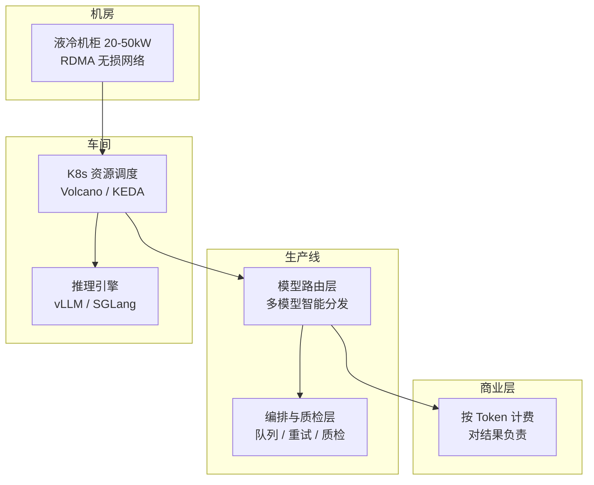

# Token 工厂：从 IDC 到智能量产 2026

> 中文简称：Token 工厂

> **一句话理解**: 传统 IDC 交付的是「机房和显卡」，Token 工厂交付的是「可计费、可质检的智能结果」——搭机器、跑通网络只是建好车间，Token 工厂的核心是建起持续把算力变成客户愿意付费结果的生产线。

---

## 一、与传统 IDC / 普通智算中心的本质区别

| 维度 | 传统 IDC / 智算中心 | Token 工厂 |
|------|-------------------|-----------|
| 交付物 | 计算资源（机柜、网络、电力） | 可被业务采用的智能结果（Token / API 服务） |
| 客户责任 | 客户自己部署模型、自己运维、自己找客户 | 服务商对模型效果、输出质量、响应时间、业务可用性负责 |
| 收入模式 | 「租金」——按机器时长计费，与机器闲置或满载无关 | 「产品收入」——来自有效 Token 的产出与消耗 |
| 质量边界 | 保证机器不坏、网络通畅 | 保证输出合格（质检、事实核查、敏感过滤） |

一句话：搭好机器、布好 K8s、把模型跑起来，只完成了「资源建设」；Token 工厂要在硬件之上叠加**生产体系**与**销售体系**。

---

## 二、三个维度的升级

### 2.1 基础设施：从「能跑」到「高效量产」

| 项 | 传统 IDC | Token 工厂要求 |
|----|---------|---------------|
| 单机柜功率 | 5～8 kW | 20～50 kW 甚至更高 |
| 散热 | 风冷为主 | 液冷（冷板式 / 浸没式）几乎是准入证 |
| 能效 | PUE 达标即可 | PUE 必须压到极低——电力成本占长期运营成本 50% 以上 |
| 网络 | VLAN 即可 | 必须 RDMA 高速无损网络（InfiniBand 或 RoCE），否则多卡协同效率大打折扣 |

### 2.2 核心系统：从「部署组件」到「搭建生产线」

- **模型服务与路由层**：不只跑一个模型——按任务难度、成本、延迟要求，把请求智能路由到最合适的模型（简单任务走低成本小模型，复杂推理走高能力模型）。
- **任务编排与质量层**：复杂任务拆步、任务队列、重试与超时管理；叠加质检、事实核查、敏感信息过滤，确保产出的 Token 合格。
- **计量与经营层**：这是「财务系统」——精确记录输入 / 输出 / 缓存 / 有效 Token，核算每个任务的成本与毛利，支持按 Token 调用量计费，而不是按机器时长收费。



### 2.3 商业逻辑：从「卖资源」到「卖结果」

这是最本质的区别。客户购买的是「在什么时间内得到什么质量的结果」，收入来自有效 Token 的产出，而不是机器的闲置或满载——因此模型效果、输出质量、响应延迟、业务可用性全部变成服务商的契约责任。

---

## 三、K8s 推理组件栈（生产调度系统）

| 层 | 组件 | 作用 |
|----|------|------|
| 调度与资源 | **Volcano** | AI 批处理调度：GPU 亲和性、Gang Scheduling（整组调度）、拓扑感知 |
| | **NVIDIA Device Plugin / DRA** | GPU 资源标准化分配与管理 |
| | **KEDA** | 基于事件（推理队列长度、GPU 利用率）的弹性伸缩 |
| 推理与服务化 | **KServe** | 无服务器模型服务：版本管理、流量切分（A/B）、自动扩缩容 |
| | **vLLM / SGLang** | 高性能推理引擎：实际 Token 生产，提供 OpenAI 兼容 API |
| 网络与存储 | **Cilium** | 基于 eBPF 的 CNI：高性能网络、负载均衡、可观测性 |
| | **CSI 驱动（Ceph / NFS）** | 高性能共享存储：挂载数十 GB～TB 级模型权重，避免 Pod 每次重新下载 |
| 可观测性 | **Prometheus + Grafana** | 基础监控大盘 |
| | **DCGM Exporter** | NVIDIA 官方 GPU 指标（显存、算力、温度） |
| | **OpenTelemetry** | 端到端链路追踪，分析推理请求延迟 |
| 交付与治理 | **ArgoCD** | GitOps 交付：模型版本与配置变更 |
| | **Kyverno** | K8s 原生策略引擎：安全合规与资源配额 |

---

## 四、KServe 与 vLLM 的关系：控制平面 vs 推理引擎

- **管理 vs 执行**：KServe 负责模型服务生命周期（部署、扩缩容、流量切分、版本管理）；vLLM 负责实际 Token 生产（显存管理、并发调度、生成回复）。
- **容器化封装**：KServe 把 vLLM 封装成标准 K8s 服务，免手写复杂 Deployment。
- **能力互补**：vLLM 把单机推理性能拉满；KServe 让多模型多副本的集群化管理变简单（10% 流量灰度、空闲缩容到 0 省 GPU 成本）。

> 没有vLLM，KServe 跑不动大模型；没有KServe，vLLM 难以在生产集群规模化治理。深入两者：[[10_部署推理/02_推理引擎/29_vLLM_深入分析|vLLM 深入分析]] · [[10_部署推理/02_推理引擎/11_KServe_深入分析|KServe 深入分析]]

---

## 五、落地四步：KServe + vLLM 部署

核心逻辑：**先注册「说明书」（Runtime），再下发「任务」（InferenceService）**。

### 第一步：注册 vLLM 运行时（全局一次）

```yaml
# vllm-runtime.yaml
apiVersion: serving.kserve.io/v1alpha1
kind: ClusterServingRuntime
metadata:
  name: kserve-vllm
spec:
  containers:
    - name: kserve-container
      image: vllm/vllm-openai:latest
      command: ["python3", "-m", "vllm.entrypoints.openai.api_server"]
      args:
        - --port=8080
        - --model=/mnt/models
        - --served-model-name=default
        - --trust-remote-code
```

```bash
kubectl apply -f vllm-runtime.yaml
```

### 第二步：模型权重上对象存储

```bash
# 标准 HuggingFace 目录结构即可，上传到 S3 / OSS
aws s3 cp --recursive Qwen2-7B/ s3://my-ai-models/llm/Qwen2-7B/
```

> 注意：`s3://` 存储Uri 由 KServe 的 `storage-initializer` 拉取，需提前创建含对象存储访问凭据的 K8s Secret 并在 InferenceService 引用——凭据只从密钥服务注入，禁止写入任何 YAML 入库。

### 第三步：部署推理服务（按模型实例化）

```yaml
# inference-service.yaml
apiVersion: serving.kserve.io/v1beta1
kind: InferenceService
metadata:
  name: qwen-llm
  namespace: ai-serving
  annotations:
    # LLM 权重加载慢，必须调大健康检查超时
    serving.knative.dev/progressDeadline: "20m"
spec:
  predictor:
    model:
      modelFormat:
        name: huggingface
      runtime: kserve-vllm
      storageUri: s3://my-ai-models/llm/Qwen2-7B/
      args:
        - --model=/mnt/models
        - --gpu-memory-utilization=0.95
        - --max-model-len=8192
      resources:
        limits:
          nvidia.com/gpu: 1
```

```bash
kubectl apply -f inference-service.yaml
```

### 第四步：验证

```bash
kubectl get pods -n ai-serving
kubectl get inferenceservice qwen-llm -n ai-serving   # 确认 URL 与 Ready 状态
```

**关键逻辑**：Runtime 全局一次、所有服务复用；InferenceService 按模型版本 / 业务线实例化；存储解耦——权重放对象存储，`storage-initializer` 自动下载到 Pod 的 `/mnt/models`。

---

## 六、总结

「搭机器、上电、布 K8s、跑模型」只是建好**车间**。Token 工厂 = 车间（液冷 + RDMA 基础设施）+ 生产线（路由 / 编排 / 质检 / 计量）+ 销售体系（按结果计费）。商业模式从「出租算力」转变为「售卖标准化 AI 服务」，才算真正从 IDC 走进 Token 工厂时代。

---

## 关联

- [[10_部署推理/02_推理引擎/29_vLLM_深入分析|vLLM 深入分析]] — 推理引擎内部机制
- [[10_部署推理/02_推理引擎/11_KServe_深入分析|KServe 深入分析]] — 模型服务控制平面
- [[12_架构基建/02_架构概览/02_AI_基础设施_2026|AI 基础设施 2026]] — 基础设施全景
- [[12_架构基建/01_架构基础/05_llm_infrastructure_system_design|LLM 基础设施系统设计]] — 系统设计方法论
- [[07_模型训练/04_分布式训练/02_DeepSpeed_深入分析|DeepSpeed 深入分析]] — 训练侧并行栈
- [[12_架构基建/05_CNCF云原生AI/14_KServe_深入分析|CNCF 视角的 KServe]] — 云原生 AI 栈

---

*Last updated: 2026-09-04*
